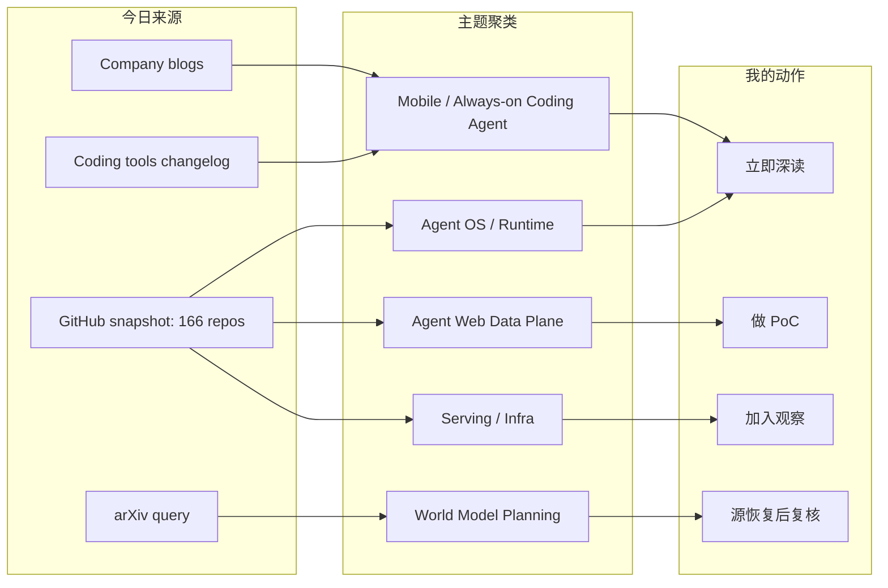
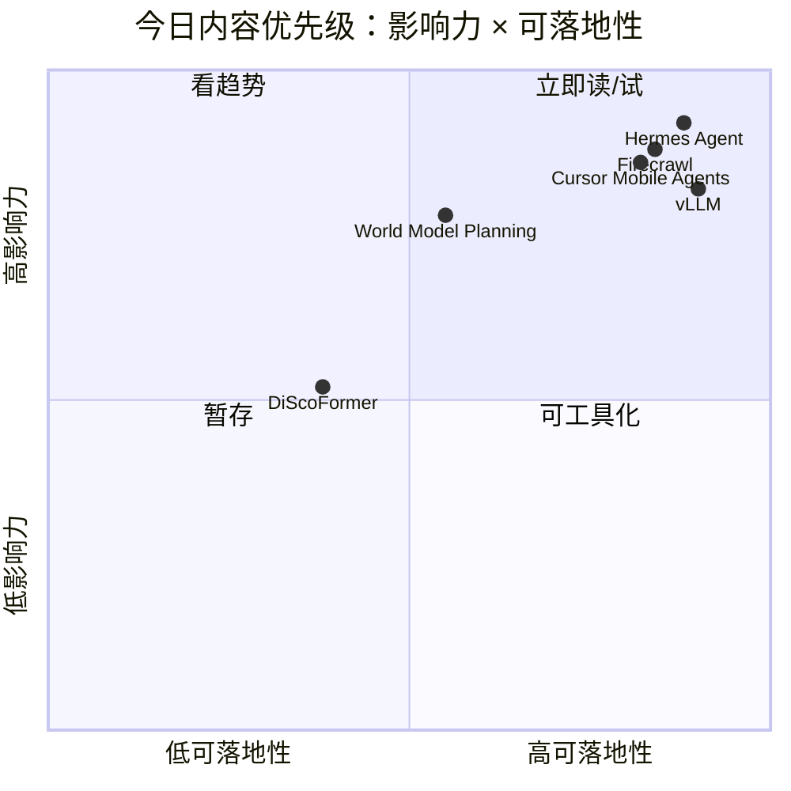

# AI Radar Daily - 2026-06-30

> 生成时间：2026-06-30 18:26 北京时间  
> 范围：AI Infra / LLM / RL / Agent / Eval / Serving / Training / 大厂博客 / 论文 / GitHub / Coding 工具  
> 说明：日报是导航入口；深度理解请进入 Obsidian 详情页。今日 GitHub snapshot 成功保存 166 个 repo，并读取历史 snapshot 计算增长；GitHub 后半段查询触发 403 rate limit，论文源可访问但搜索结果有噪声，因此论文区只纳入一条高相关 watch item。

## 0. 今日结论

- 今日最值得关注：Agent runtime / web data plane / always-on coding agent 三条线同时升温，Hermes +4032、Firecrawl +3080、Cursor 3.9 移动端管理 cloud agents。
- 对 AI Infra 的直接影响：长期 agent 的瓶颈不只是模型，而是数据抓取、任务队列、权限审计、失败恢复、serving 成本。
- 对 LLM 训练 / 推理 / Agent 的影响：vLLM 仍在高 star Top 10 外保持增长，agent 热度背后仍需要稳定 OpenAI-compatible serving 与 GPU 利用率。
- 对 RL / 游戏模型训练的影响：Self-Evolving World Models for LLM Agent Planning 值得补读，可能连接 world model、long-horizon planning 和 tool-use trajectory eval。
- 建议今天深读：Cursor 3.9 mobile agents、Hermes/Firecrawl/DeerFlow 增长页、world model planning 论文。

## 1. 今日态势图

## 2. 必读卡片区

> [!important] Cursor 3.9：移动端管理 always-on agents
> - 大类：Coding 工具 / AI IDE
> - 小类：Remote Agent Workflow
> - 重点：Cursor for iOS public beta，可选择 repo、模型，用语音描述任务并启动 cloud agent。
> - 为什么重要：coding agent 正从 IDE 内补全走向远程 worker 管理，影响任务队列、审计、通知和失败恢复设计。
> - 详情：[[Industry/Tools/2026-06-30/cursor-mobile-always-on-agents]] / [网页详情](https://github.com/dyt27666-oss/AI-news-report-obsidians/blob/main/Industry/Tools/2026-06-30/cursor-mobile-always-on-agents.md) / [原文](https://cursor.com/changelog)

> [!important] Hermes Agent：Agent OS Runtime 继续高增长
> - 大类：GitHub
> - 小类：Agent Runtime / Skills / Cron / Memory
> - 重点：相对上次 snapshot +4032 stars。
> - 为什么重要：AI Radar 这类自动研究和知识库写入，正是长期 agent runtime 的生产场景。
> - 详情：[[GitHub/2026-06-30/hermes-agent-agent-os-runtime]] / [网页详情](https://github.com/dyt27666-oss/AI-news-report-obsidians/blob/main/GitHub/2026-06-30/hermes-agent-agent-os-runtime.md) / [原文](https://github.com/NousResearch/hermes-agent)

> [!tip] Firecrawl：Agent Web Data Plane 高增长
> - 大类：GitHub
> - 小类：Web Data Plane / RAG
> - 重点：相对上次 snapshot +3080 stars。
> - 为什么重要：agent 的研究质量取决于 search/scrape/structured extraction 的可靠性。
> - 详情：[[GitHub/2026-06-30/firecrawl-agent-web-data-plane]] / [网页详情](https://github.com/dyt27666-oss/AI-news-report-obsidians/blob/main/GitHub/2026-06-30/firecrawl-agent-web-data-plane.md) / [原文](https://github.com/firecrawl/firecrawl)

> [!tip] Self-Evolving World Models for LLM Agent Planning
> - 大类：论文
> - 小类：World Model / Agent Planning
> - 重点：Jun 29 arXiv 新项，把 world model 用于 LLM agent planning。
> - 为什么重要：可连接 long-horizon agent eval、tool-use reward 和 RL/game simulation。
> - 详情：[[Papers/2026-06-30/self-evolving-world-models-llm-agent-planning]] / [网页详情](https://github.com/dyt27666-oss/AI-news-report-obsidians/blob/main/Papers/2026-06-30/self-evolving-world-models-llm-agent-planning.md) / [原文](http://arxiv.org/abs/2606.30639v1)

## 3. 优先级矩阵

## 4. 分类清单

| 标签 | 大类 | 小类 | 标题 | 重点概括 | 为什么重要 | Obsidian 详情 | 网页详情 | 原文 |
|---|---|---|---|---|---|---|---|---|
| 必读 | GitHub | Agent Runtime | Hermes Agent | 相对上次 snapshot +4032 stars，tools/skills/cron/memory 的 Agent OS 形态继续升温。 | 长期任务、自动研究、知识库写入和经验沉淀已经是统一 control-plane 问题。 | [[GitHub/2026-06-30/hermes-agent-agent-os-runtime]] | [网页详情](https://github.com/dyt27666-oss/AI-news-report-obsidians/blob/main/GitHub/2026-06-30/hermes-agent-agent-os-runtime.md) | [原文](https://github.com/NousResearch/hermes-agent) |
| 必读 | GitHub | Web Data Plane | Firecrawl | +3080 stars，agent/RAG 的 search、scrape、HTML-to-markdown、structured extraction 数据平面。 | 自动研究和 RAG ingestion 的质量高度依赖外部网页数据平面。 | [[GitHub/2026-06-30/firecrawl-agent-web-data-plane]] | [网页详情](https://github.com/dyt27666-oss/AI-news-report-obsidians/blob/main/GitHub/2026-06-30/firecrawl-agent-web-data-plane.md) | [原文](https://github.com/firecrawl/firecrawl) |
| 必读 | Industry / Tools | AI IDE / Agent | Cursor Mobile App for iOS | Cursor 3.9：移动端启动和管理 always-on agents。 | coding agent 正从 IDE 内对话变成远程派单、监控和接力系统。 | [[Industry/Tools/2026-06-30/cursor-mobile-always-on-agents]] | [网页详情](https://github.com/dyt27666-oss/AI-news-report-obsidians/blob/main/Industry/Tools/2026-06-30/cursor-mobile-always-on-agents.md) | [原文](https://cursor.com/changelog) |
| 必读 | 论文 | World Model / Agent Planning | Self-Evolving World Models for LLM Agent Planning | arXiv Jun 29：把 world model 用于 LLM agent planning。 | 对 long-horizon agent、tool-use reward、game RL simulation 都有潜在参考价值。 | [[Papers/2026-06-30/self-evolving-world-models-llm-agent-planning]] | [网页详情](https://github.com/dyt27666-oss/AI-news-report-obsidians/blob/main/Papers/2026-06-30/self-evolving-world-models-llm-agent-planning.md) | [原文](http://arxiv.org/abs/2606.30639v1) |
| 可 skim | GitHub | Long-horizon Agent | DeerFlow | 字节 long-horizon SuperAgent harness +1100 stars。 | 适合对照 sandbox、memory、tools、subagents、message gateway 的架构设计。 | [[GitHub/2026-06-30/deer-flow-long-horizon-superagent]] | [网页详情](https://github.com/dyt27666-oss/AI-news-report-obsidians/blob/main/GitHub/2026-06-30/deer-flow-long-horizon-superagent.md) | [原文](https://github.com/bytedance/deer-flow) |
| 可 skim | GitHub | Browser Agent | browser-use | +1053 stars，让网站可被 AI agents 操作。 | web automation 是 agent 从聊天走向执行任务的关键工具层。 | [[GitHub/2026-06-30/browser-use-web-agent-automation]] | [网页详情](https://github.com/dyt27666-oss/AI-news-report-obsidians/blob/main/GitHub/2026-06-30/browser-use-web-agent-automation.md) | [原文](https://github.com/browser-use/browser-use) |
| 可 skim | Industry | Generative Modeling | Hugging Face DiScoFormer | Jun 29 新文，统一 density 和 score modeling。 | 偏研究方法，短期工程落地低，但可作为生成建模观察。 | [[Industry/2026-06-30/huggingface-discoformer-density-score]] | [网页详情](https://github.com/dyt27666-oss/AI-news-report-obsidians/blob/main/Industry/2026-06-30/huggingface-discoformer-density-score.md) | [原文](https://huggingface.co/blog/discoformer) |

## 5. 大厂资讯 / 工程博客 / Research

### 5.1 公司来源扫描矩阵

| 公司/实验室 | 来源/栏目 | 今日状态 | 高相关条数 | 代表条目 | 备注 |
|---|---|---|---:|---|---|
| OpenAI | News / Research | 访问失败 | 0 | 无 | News/Research 页面仍可能 403；本轮未臆造未验证新项。 |
| Anthropic | News / Research / Engineering | 有高相关近更新 | 1 | Introducing Claude Tag | News 页面 200；Jun 23 Product 仍是团队级 agent workflow 的核心信号。 |
| Google DeepMind | Blog / Research | 低置信 / 无高相关新项 | 0 | 无 | 页面可访问性未形成今日强相关 AI Infra/RL 新项；继续关注 planning/world model。 |
| Meta AI | Blog / Research | 低置信 / 无高相关新项 | 0 | 无 | 本轮未确认 AI Infra/LLM/RL 强相关新单篇。 |
| NVIDIA | Technical Blog / AI | 访问失败 / 间接信号 | 0 | 无 | 配置分类页仍不稳定；通过 Hugging Face 文章继续跟踪 NeMo AutoModel。 |
| Microsoft | Research AI | 低置信 / 无高相关新项 | 0 | 无 | 页面偏研究导航；未确认今日强相关工程文章。 |
| Hugging Face | Blog / Papers / Releases | 有高相关新项 | 1 | DiScoFormer | Blog 页面 200；Jun 29 新文偏 density/score modeling，可作为生成建模观察项。 |
| 腾讯 | AI Lab / 技术博客 | 无高相关新项 | 0 | 无 | 本轮未抓到 AI Infra/LLM/RL 强相关新项。 |
| 字节 | Seed / GitHub | 有 GitHub 信号 | 1 | DeerFlow long-horizon agent | `bytedance/deer-flow` 相对上次 snapshot +1100 stars。 |
| SpaceAI | Blog / News | 低置信 / 弱相关 | 0 | 无 | 主题与 Open Space Network 更相关，和本 radar 主线弱相关。 |

### 5.2 高相关大厂条目

| 标签 | 发布方/大厂 | 栏目/来源 | 标题 | 重点概括 | 工程/算法影响 | Obsidian 详情 | 网页详情 | 原文 |
|---|---|---|---|---|---|---|---|---|
| 必读 | Anthropic | Product Announcement / News | Introducing Claude Tag | 团队与 Claude 协作的新方式，Jun 23 发布。 | 对身份、权限、上下文、审计和团队 agent workflow 有直接影响。 | [[Industry/Tools/2026-06-25/claude-tag-team-agent-workflow]] | [网页详情](https://github.com/dyt27666-oss/AI-news-report-obsidians/blob/main/Industry/Tools/2026-06-25/claude-tag-team-agent-workflow.md) | [原文](https://www.anthropic.com/news) |
| 必读 | Cursor | Changelog / AI IDE | Cursor Mobile App for iOS | Cursor 3.9 支持移动端启动和管理 always-on agents。 | coding agent 开始变成远程 worker 管理问题。 | [[Industry/Tools/2026-06-30/cursor-mobile-always-on-agents]] | [网页详情](https://github.com/dyt27666-oss/AI-news-report-obsidians/blob/main/Industry/Tools/2026-06-30/cursor-mobile-always-on-agents.md) | [原文](https://cursor.com/changelog) |
| 可 skim | Hugging Face | Blog / Research | DiScoFormer | 统一 density 和 score modeling 的 Transformer 方向。 | 偏生成建模研究观察，短期不直接改变 serving/RL 工程。 | [[Industry/2026-06-30/huggingface-discoformer-density-score]] | [网页详情](https://github.com/dyt27666-oss/AI-news-report-obsidians/blob/main/Industry/2026-06-30/huggingface-discoformer-density-score.md) | [原文](https://huggingface.co/blog/discoformer) |
| 可 skim | 字节 | GitHub / Agent Framework | DeerFlow | 长程 SuperAgent harness 高增长。 | 对 long-horizon task lifecycle 与工具编排有架构参考。 | [[GitHub/2026-06-30/deer-flow-long-horizon-superagent]] | [网页详情](https://github.com/dyt27666-oss/AI-news-report-obsidians/blob/main/GitHub/2026-06-30/deer-flow-long-horizon-superagent.md) | [原文](https://github.com/bytedance/deer-flow) |

## 6. GitHub 高 star Top 10

| 排名 | repo | stars | forks | language | updated_at | topics | 重点概括 | 是否值得试用 | Obsidian 详情 | 原文 |
|---:|---|---:|---:|---|---|---|---|---|---|---|
| 1 | affaan-m/ECC | 223690 | 34244 | JavaScript | 2026-06-30T10:25:50Z | ai-agents, anthropic, claude, claude-code, developer-tools, llm | Agent harness performance optimization system，围绕 skills、memory、security、research-first workflow。 | 可 skim：作为生态或对照项观察，生产前需验证成熟度。 | [[GitHub/2026-06-30/github-snapshot-top10]] | [原文](https://github.com/affaan-m/ECC) |
| 2 | NousResearch/hermes-agent | 206085 | 37252 | Python | 2026-06-30T10:26:51Z | ai, ai-agent, ai-agents, anthropic, chatgpt, claude | 可生长 agent runtime，tools、skills、cron、memory 支撑长期任务与知识工作流。 | 值得试用：和 agent runtime / serving / knowledge workflow 有直接关系。 | [[GitHub/2026-06-30/hermes-agent-agent-os-runtime]] | [原文](https://github.com/NousResearch/hermes-agent) |
| 3 | tensorflow/tensorflow | 195982 | 75209 | C++ | 2026-06-30T10:21:00Z | deep-learning, deep-neural-networks, distributed, machine-learning, ml, neural-network | 老牌 ML 框架，仍是训练/部署生态基础设施，但不是今日新增重点。 | 可 skim：作为生态或对照项观察，生产前需验证成熟度。 | [[GitHub/2026-06-30/github-snapshot-top10]] | [原文](https://github.com/tensorflow/tensorflow) |
| 4 | Significant-Gravitas/AutoGPT | 185227 | 46117 | Python | 2026-06-30T10:24:39Z | agentic-ai, agents, ai, artificial-intelligence, autonomous-agents, claude | 老牌 autonomous agent 项目，适合作为 agent orchestration 对照组。 | 可 skim：作为生态或对照项观察，生产前需验证成熟度。 | [[GitHub/2026-06-30/github-snapshot-top10]] | [原文](https://github.com/Significant-Gravitas/AutoGPT) |
| 5 | ollama/ollama | 175174 | 16770 | Go | 2026-06-30T10:20:01Z | deepseek, gemma, gemma3, glm, go, golang | 本地 LLM 运行入口，适合开发、评估与边缘推理。 | 可 skim：作为生态或对照项观察，生产前需验证成熟度。 | [[GitHub/2026-06-30/github-snapshot-top10]] | [原文](https://github.com/ollama/ollama) |
| 6 | f/prompts.chat | 164555 | 21292 | HTML | 2026-06-30T10:24:59Z | ai, artificial-intelligence, awesome-list, chatgpt, chatgpt-prompts, claude | Prompt 资产集合，偏应用层资产，不是 infra 主线。 | 可 skim：作为生态或对照项观察，生产前需验证成熟度。 | [[GitHub/2026-06-30/github-snapshot-top10]] | [原文](https://github.com/f/prompts.chat) |
| 7 | huggingface/transformers | 162047 | 33669 | Python | 2026-06-30T10:15:05Z | audio, deep-learning, deepseek, gemma, glm, hacktoberfest | 模型定义与加载事实标准，影响训练、推理、量化与多模态生态。 | 可 skim：作为生态或对照项观察，生产前需验证成熟度。 | [[GitHub/2026-06-30/github-snapshot-top10]] | [原文](https://github.com/huggingface/transformers) |
| 8 | langflow-ai/langflow | 150231 | 9362 | Python | 2026-06-30T10:00:43Z | agents, chatgpt, generative-ai, large-language-models, multiagent, react-flow | AI-powered agents/workflows 构建与部署平台。 | 可 skim：作为生态或对照项观察，生产前需验证成熟度。 | [[GitHub/2026-06-30/github-snapshot-top10]] | [原文](https://github.com/langflow-ai/langflow) |
| 9 | langgenius/dify | 147096 | 23165 | TypeScript | 2026-06-30T10:26:05Z | agent, agentic-ai, agentic-framework, agentic-workflow, ai, automation | 生产化 agentic workflow development platform，适合 RAG/agent 产品原型。 | 值得试用：和 agent runtime / serving / knowledge workflow 有直接关系。 | [[GitHub/2026-06-30/github-snapshot-top10]] | [原文](https://github.com/langgenius/dify) |
| 10 | open-webui/open-webui | 143522 | 20688 | Python | 2026-06-30T10:10:37Z | ai, llm, llm-ui, llm-webui, llms, mcp | 面向 Ollama/OpenAI API 的 AI UI，适合本地模型和多模型调试入口。 | 值得试用：和 agent runtime / serving / knowledge workflow 有直接关系。 | [[GitHub/2026-06-30/github-snapshot-top10]] | [原文](https://github.com/open-webui/open-webui) |

## 7. GitHub star 增长最快 Top 10

> 增长依据：已读取历史 snapshot，今日不是冷启动；`stars_delta` 为相对最近历史 snapshot 的差值。GitHub API 后半段查询触发 `HTTP Error 403: rate limit exceeded`，候选池 166 个 repo，可能漏掉部分高增长项目。

| 排名 | repo | stars_delta | stars | forks | language | updated_at | 增长依据 | 重点概括 | Obsidian 详情 | 原文 |
|---:|---|---:|---:|---:|---|---|---|---|---|---|
| 1 | NousResearch/hermes-agent | 4032 | 206085 | 37252 | Python | 2026-06-30T10:26:51Z | historical_snapshot | 可生长 agent runtime，tools、skills、cron、memory 支撑长期任务与知识工作流。 | [[GitHub/2026-06-30/hermes-agent-agent-os-runtime]] | [原文](https://github.com/NousResearch/hermes-agent) |
| 2 | firecrawl/firecrawl | 3080 | 141796 | 8172 | TypeScript | 2026-06-30T10:26:21Z | historical_snapshot | 面向 agent/RAG 的 search、scrape、HTML-to-markdown、structured extraction API。 | [[GitHub/2026-06-30/firecrawl-agent-web-data-plane]] | [原文](https://github.com/firecrawl/firecrawl) |
| 3 | affaan-m/ECC | 2495 | 223690 | 34244 | JavaScript | 2026-06-30T10:25:50Z | historical_snapshot | Agent harness performance optimization system，围绕 skills、memory、security、research-first workflow。 | [[GitHub/2026-06-30/github-snapshot-top10]] | [原文](https://github.com/affaan-m/ECC) |
| 4 | JuliusBrussee/caveman | 1533 | 78120 | 4417 | JavaScript | 2026-06-30T10:19:52Z | historical_snapshot | Claude Code skill，用极简表达降低 token；代表 agent policy/skill 热点。 | [[GitHub/2026-06-30/github-snapshot-top10]] | [原文](https://github.com/JuliusBrussee/caveman) |
| 5 | TauricResearch/TradingAgents | 1531 | 89896 | 17352 | Python | 2026-06-30T10:20:46Z | historical_snapshot | 多 agent LLM 金融交易框架，对 multi-agent decision workflow 有参考但偏金融。 | [[GitHub/2026-06-30/github-snapshot-top10]] | [原文](https://github.com/TauricResearch/TradingAgents) |
| 6 | kepano/obsidian-skills | 1121 | 38980 | 2763 | Unknown | 2026-06-30T10:17:21Z | historical_snapshot | 面向 Obsidian 的 agent skills，把知识库操作变成可复用流程。 | [[GitHub/2026-06-30/obsidian-skills-agent-knowledge-workflow]] | [原文](https://github.com/kepano/obsidian-skills) |
| 7 | bytedance/deer-flow | 1100 | 75545 | 10195 | Python | 2026-06-30T10:24:31Z | historical_snapshot | 字节 long-horizon SuperAgent harness，强调 research、code、create 的长任务组织。 | [[GitHub/2026-06-30/deer-flow-long-horizon-superagent]] | [原文](https://github.com/bytedance/deer-flow) |
| 8 | browser-use/browser-use | 1053 | 101569 | 11271 | Python | 2026-06-30T10:12:47Z | historical_snapshot | 让网站可被 AI agent 操作的 web automation 框架。 | [[GitHub/2026-06-30/browser-use-web-agent-automation]] | [原文](https://github.com/browser-use/browser-use) |
| 9 | thedotmack/claude-mem | 999 | 85135 | 7347 | JavaScript | 2026-06-30T10:19:07Z | historical_snapshot | 跨会话持久上下文，captures/compresses/injects agent memory。 | [[GitHub/2026-06-30/github-snapshot-top10]] | [原文](https://github.com/thedotmack/claude-mem) |
| 10 | omnigent-ai/omnigent | 864 | 5588 | 710 | Python | 2026-06-30T10:25:32Z | historical_snapshot | 开源 AI agent framework 与 meta-harness，用于编排 Claude/Codex/Gemini。 | [[GitHub/2026-06-30/omnigent-meta-agent-harness]] | [原文](https://github.com/omnigent-ai/omnigent) |

## 8. Coding 工具 / AI 工具功能更新

### 8.1 Coding 工具扫描矩阵

| 工具 | 厂商 | 来源类型 | 今日状态 | 代表更新 | 对我的影响 | 原文 |
|---|---|---|---|---|---|---|
| Claude Code | Anthropic | Changelog / Release Notes | 有高相关近更新 | Claude Tag（Jun 23） | 团队 tag agent 影响任务分派、权限、上下文和审计 | https://www.anthropic.com/news |
| OpenAI Codex | OpenAI | Changelog / Docs | 页面可访问，未确认今日新单条 | Docs 继续显示 MCP/connectors、skills、shell、background mode 等方向 | 继续关注 CLI/IDE、远程执行、权限模式和 rate limits | https://developers.openai.com/codex/changelog |
| Cursor | Cursor | Changelog | 有今日高相关更新 | 3.9 Jun 29：Cursor Mobile App for iOS，可从移动端启动和管理 always-on agents | agent 工作流从桌面 IDE 扩展到移动端任务调度，影响远程 agent 监控 | https://cursor.com/changelog |
| Windsurf | Windsurf | Changelog | 页面可访问，低置信 | 文档导航显示 Devin/Agent Command Center/ACP/CLI | 继续观察 Agent Client Protocol 与远程 agent 形态 | https://windsurf.com/changelog |
| GitHub Copilot | GitHub | Changelog / Blog | 页面可访问，有近更新 | Copilot CLI terminal interface GA 仍是近期核心信号 | 终端 coding agent 能力普及，需关注 plan/model/rate 策略 | https://github.blog/changelog/label/copilot/ |
| Gemini Code Assist | Google | Release Notes | 页面 200，未抽到清晰今日单条 | 个人/AI Pro/Ultra tiers 迁移到 Antigravity 的信号仍需观察 | Google coding agent 线向 Antigravity/CLI 平台迁移 | https://cloud.google.com/gemini/docs/codeassist/release-notes |
| Qwen Code | Alibaba/Qwen | GitHub Releases | API 查询受截断/低置信 | 继续沿用 v0.19.2 remote LSP status route 观察 | 远程开发、LSP 可观测、工具 fallback 是 agent 稳定性关键 | https://github.com/QwenLM/qwen-code/releases |
| Roo Code | Roo Code | GitHub Releases | 无今日新 release | 最新 v3.54.0（May 15） | 今日无高相关新项，继续观察 VS Code agent extension | https://github.com/RooCodeInc/Roo-Code/releases |
| Cline | Cline | GitHub Releases | 有今日/近今日 release | v4.0.4 / v4.0.3 / v4.0.2（Jun 29） | Cline 4.x 快速迭代，值得跟进 skills/MCP/CLI 稳定性和破坏性变更 | https://github.com/cline/cline/releases |
| Continue | Continue | GitHub Releases | 无今日新 release | v2.1.0-vscode / v2.0.0-vscode（Jun 19） | VS Code extension 更新，今日未抽到明确 agent/MCP 新功能 | https://github.com/continuedev/continue/releases |

### 8.2 高相关工具更新

| 标签 | 工具/厂商 | 来源类型 | 标题/功能 | 重点概括 | 对 AI coding 工作流的影响 | Obsidian 详情 | 网页详情 | 原文 |
|---|---|---|---|---|---|---|---|---|
| 必读 | Cursor | Changelog | Cursor Mobile App for iOS / always-on agents | 移动端选择 repo、模型，用语音描述任务并启动 cloud agent。 | 远程 coding agent 监控、任务排队和权限审计会变得更重要。 | [[Industry/Tools/2026-06-30/cursor-mobile-always-on-agents]] | [网页详情](https://github.com/dyt27666-oss/AI-news-report-obsidians/blob/main/Industry/Tools/2026-06-30/cursor-mobile-always-on-agents.md) | [原文](https://cursor.com/changelog) |
| 必读 | Claude / Anthropic | Product Announcement | Claude Tag | 团队与 Claude 协作的新方式。 | 把 agent 纳入团队任务分派、权限和上下文边界。 | [[Industry/Tools/2026-06-25/claude-tag-team-agent-workflow]] | [网页详情](https://github.com/dyt27666-oss/AI-news-report-obsidians/blob/main/Industry/Tools/2026-06-25/claude-tag-team-agent-workflow.md) | [原文](https://www.anthropic.com/news) |
| 可 skim | Cline | GitHub Release | v4.0.4 / v4.0.3 / v4.0.2 | Jun 29 连续 release，说明 Cline 4.x 正快速稳定。 | 需跟进 skills/MCP/CLI 破坏性变更和 VS Code agent extension 体验。 | [[Industry/2026-06-30/company-source-scan-matrix]] | [网页详情](https://github.com/dyt27666-oss/AI-news-report-obsidians/blob/main/Industry/2026-06-30/company-source-scan-matrix.md) | [原文](https://github.com/cline/cline/releases) |

## 9. Point Rummy / Indian Rummy 业务主题

> 这是新加入的固定业务主题：每天扫描 Point Rummy / Indian Rummy / Rummy AI / Rummy RL 的 GitHub 与论文/资料。今日 GitHub 主题池命中 63 个 repo；整体 star 较低，所以按业务可用性而不是热度排序。

### 9.1 GitHub 候选

| 标签 | repo | stars | forks | language | updated_at | 重点概括 | 业务可用性 | Obsidian 详情 | 原文 |
|---|---|---:|---:|---|---|---|---|---|---|
| 后续 | rickgorman/gin-rummy-ai | 13 | 5 | Python | 2025-03-25T13:47:09Z | A hand-rolled neuroevolution AI for gin rummy. | AI/bot/仿真参考 | [[Business/PointRummy/2026-06-30/point-rummy-github-watchlist]] | [原文](https://github.com/rickgorman/gin-rummy-ai) |
| 后续 | nakkekakke/rummy-ai | 11 | 5 | Java | 2026-04-17T10:02:59Z | Text based classic Rummy game with an AI that uses ISMCTS. Data Structures and Algorithms  | AI/bot/仿真参考 | [[Business/PointRummy/2026-06-30/point-rummy-github-watchlist]] | [原文](https://github.com/nakkekakke/rummy-ai) |
| 后续 | jmhummel/Gin-Rummy-Java | 8 | 0 | Java | 2023-08-16T16:12:58Z | Java-based Gin Rummy console game, with an AI opponent | AI/bot/仿真参考 | [[Business/PointRummy/2026-06-30/point-rummy-github-watchlist]] | [原文](https://github.com/jmhummel/Gin-Rummy-Java) |
| 可 skim | mudont/indian-rummy | 5 | 0 | TypeScript | 2025-08-08T21:05:04Z | Typescript library for Indian Rummy card game | 规则/实现参考 | [[Business/PointRummy/2026-06-30/point-rummy-github-watchlist]] | [原文](https://github.com/mudont/indian-rummy) |
| 可 skim | dv-rastogi/Rummy | 5 | 0 | Python | 2023-09-26T11:21:39Z | Variation of classical Indian Rummy made in Pygame | AI/bot/仿真参考 | [[Business/PointRummy/2026-06-30/point-rummy-github-watchlist]] | [原文](https://github.com/dv-rastogi/Rummy) |
| 可 skim | vahsek300501/Indian-Rummy- | 4 | 3 | Python | 2023-09-26T11:21:46Z | Indian Rummy made in Python using PyGame | AI/bot/仿真参考 | [[Business/PointRummy/2026-06-30/point-rummy-github-watchlist]] | [原文](https://github.com/vahsek300501/Indian-Rummy-) |
| 可 skim | SCFlanagan/Rummy | 4 | 6 | JavaScript | 2025-07-25T21:17:08Z | This project is a recreation of the classic card game Rummy. It features an AI player to p | 规则/实现参考 | [[Business/PointRummy/2026-06-30/point-rummy-github-watchlist]] | [原文](https://github.com/SCFlanagan/Rummy) |
| 可 skim | mcartmell/gin-rummy-bot | 4 | 2 | Perl | 2024-10-30T20:06:17Z | A web-based Gin Rummy game and AI | AI/bot/仿真参考 | [[Business/PointRummy/2026-06-30/point-rummy-github-watchlist]] | [原文](https://github.com/mcartmell/gin-rummy-bot) |
| 可 skim | Mohitkumar-559/RummyServer | 2 | 1 | JavaScript | 2024-03-17T03:48:34Z | Rummy game server for game that contain deal rummy and point rummy | 规则/实现参考 | [[Business/PointRummy/2026-06-30/point-rummy-github-watchlist]] | [原文](https://github.com/Mohitkumar-559/RummyServer) |
| 可 skim | abubakarmunir712/dsa-final-project | 2 | 1 | Python | 2026-06-27T06:34:26Z | A Python-based multiplayer Indian Rummy game with support for AI opponents and LAN play. I | AI/bot/仿真参考 | [[Business/PointRummy/2026-06-30/point-rummy-github-watchlist]] | [原文](https://github.com/abubakarmunir712/dsa-final-project) |

### 9.2 最新 / 增长代理候选

| 标签 | repo | stars | forks | language | updated_at | 重点概括 | 业务可用性 | Obsidian 详情 | 原文 |
|---|---|---:|---:|---|---|---|---|---|---|
| 后续 | shivayya-ln-21303/indian-rummy | 0 | 0 | Java | 2026-06-30T05:22:44Z | Multiplayer Indian Rummy — Spring Boot 3 + React + WebSocket | 规则/实现参考 | [[Business/PointRummy/2026-06-30/point-rummy-github-watchlist]] | [原文](https://github.com/shivayya-ln-21303/indian-rummy) |
| 后续 | Hari-sys786/rummy-scoreboard | 0 | 0 | Dart | 2026-06-29T13:14:32Z | Premium Flutter Android scoreboard for Indian Rummy — local storage, dealer rotation, drop | 规则/实现参考 | [[Business/PointRummy/2026-06-30/point-rummy-github-watchlist]] | [原文](https://github.com/Hari-sys786/rummy-scoreboard) |
| 后续 | debabrata-mandal/RummyPulse | 1 | 0 | Java | 2026-06-28T09:58:44Z | RummyPulse - Smart Rummy Game Analytics & Management Android App with Firebase integration | 规则/实现参考 | [[Business/PointRummy/2026-06-30/point-rummy-github-watchlist]] | [原文](https://github.com/debabrata-mandal/RummyPulse) |
| 后续 | abubakarmunir712/dsa-final-project | 2 | 1 | Python | 2026-06-27T06:34:26Z | A Python-based multiplayer Indian Rummy game with support for AI opponents and LAN play. I | AI/bot/仿真参考 | [[Business/PointRummy/2026-06-30/point-rummy-github-watchlist]] | [原文](https://github.com/abubakarmunir712/dsa-final-project) |
| 后续 | Nethaji003/rummy2 | 0 | 0 | HTML | 2026-06-18T07:31:53Z | point | AI/bot/仿真参考 | [[Business/PointRummy/2026-06-30/point-rummy-github-watchlist]] | [原文](https://github.com/Nethaji003/rummy2) |
| 后续 | SRathinaGiri/IndianRummy | 1 | 1 | JavaScript | 2026-06-17T11:46:14Z | Browser-based Indian Rummy game with AI play and offline Progressive Web App support. | AI/bot/仿真参考 | [[Business/PointRummy/2026-06-30/point-rummy-github-watchlist]] | [原文](https://github.com/SRathinaGiri/IndianRummy) |

### 9.3 论文 / 资料候选

| 标签 | 来源 | 标题 | 作者/机构 | 重点概括 | 对 Point Rummy 业务有什么用 | Obsidian 详情 | 原文 |
|---|---|---|---|---|---|---|---|
| 后续 | GitHub / 课程项目 | `nakkekakke/rummy-ai` | 未标注 | Text Rummy + ISMCTS AI。 | ISMCTS 对不完美信息牌类游戏有参考，可作为 bot baseline 思路。 | [[Business/PointRummy/2026-06-30/point-rummy-github-watchlist]] | [原文](https://github.com/nakkekakke/rummy-ai) |
| 后续 | GitHub / RL 项目 | Rummy reinforcement learning repos | 多个学生/实验 repo | 低 star，但覆盖 Rummy RL agent 关键词。 | 可抽取状态/action/reward 草案，但必须重新实现和验证。 | [[Business/PointRummy/2026-06-30/point-rummy-github-watchlist]] | [GitHub Search](https://github.com/search?q=rummy+reinforcement+learning&type=repositories) |
| 低置信 | arXiv / 论文搜索 | Point Rummy / Indian Rummy 直接论文 | 未确认 | 当前未确认高质量新论文。 | 后续用 Gin Rummy、imperfect-information card game、MCTS/RL 扩展检索。 | [[Business/PointRummy/2026-06-30/point-rummy-github-watchlist]] | [arXiv](https://arxiv.org/) |

### 9.4 业务可用性判断

| 方向 | 今日信号 | 可用性 | 下一步 |
|---|---|---|---|
| 规则引擎 / 计分 | `mudont/indian-rummy`、`RummyServer`、scoreboard 项目 | 可读源码借鉴，不能直接生产 | 抽规则测试集：joker、pure sequence、declare、drop、settlement |
| Bot / RL Agent | `rummy-ai`、`gin-rummy-ai`、RL 课程项目 | 可做 baseline 思路 | 设计自有 state/action/reward 与 self-play eval |
| 多人房间 / 工程实现 | Spring Boot + React + WebSocket Indian Rummy 新 repo | 业务贴近但成熟度未知 | 读 socket/event model，检查断线重连和状态恢复 |

## 10. Loop Engineer / Loop Engineering 主题

> 这是新加入的固定主题：每天扫描 Loop Engineer / Loop Engineering / harness engineering / coding-agent loop，并单独给高 star 与增长榜。今日主题池命中 3 个 repo；GitHub API 部分 query 受 rate limit，少于 10 条时保留透明说明。

### 10.1 Loop Engineer GitHub 高 star Top 10

| 排名 | repo | stars | forks | language | updated_at | topics | 重点概括 | 是否值得试用 | Obsidian 详情 | 原文 |
|---:|---|---:|---:|---|---|---|---|---|---|---|
| 1 | dair-ai/Prompt-Engineering-Guide | 76088 | 8331 | MDX | 2026-06-30T09:43:12Z | agent, agents, ai-agents, chatgpt, deep-learning, generative-ai | 🐙 Guides, papers, lessons, notebooks and resources for prompt engineering, context enginee | 可 skim | [[GitHub/LoopEngineer/2026-06-30/loop-engineering-github-watchlist]] | [原文](https://github.com/dair-ai/Prompt-Engineering-Guide) |
| 2 | cobusgreyling/loop-engineering | 4244 | 553 | JavaScript | 2026-06-30T10:55:21Z | agentic-ai, ai-agents, ai-coding, anthropic, automation, claude | Practical patterns, starters & CLI tools for loop engineering with AI coding agents. Desig | 值得试用 | [[GitHub/LoopEngineer/2026-06-30/loop-engineering-github-watchlist]] | [原文](https://github.com/cobusgreyling/loop-engineering) |
| 3 | thesongzhu/Friday | 918 | 117 | TypeScript | 2026-06-30T10:46:46Z | agent-orchestration, agents, ai-agents, ai-assistant, approval-first, automation | Private control plane for AI agents  | 值得试用 | [[GitHub/LoopEngineer/2026-06-30/loop-engineering-github-watchlist]] | [原文](https://github.com/thesongzhu/Friday) |

### 10.2 Loop Engineer GitHub star 增长最快 Top 10

| 排名 | repo | stars_delta | stars | forks | language | updated_at | 增长依据 | 重点概括 | Obsidian 详情 | 原文 |
|---:|---|---:|---:|---:|---|---|---|---|---|---|
| 1 | dair-ai/Prompt-Engineering-Guide | 135 | 76088 | 8331 | MDX | 2026-06-30T09:43:12Z | historical_snapshot | 🐙 Guides, papers, lessons, notebooks and resources for prompt engineering, context enginee | [[GitHub/LoopEngineer/2026-06-30/loop-engineering-github-watchlist]] | [原文](https://github.com/dair-ai/Prompt-Engineering-Guide) |
| 2 | thesongzhu/Friday | 1 | 918 | 117 | TypeScript | 2026-06-30T10:46:46Z | historical_snapshot | Private control plane for AI agents  | [[GitHub/LoopEngineer/2026-06-30/loop-engineering-github-watchlist]] | [原文](https://github.com/thesongzhu/Friday) |
| 3 | cobusgreyling/loop-engineering | None | 4244 | 553 | JavaScript | 2026-06-30T10:55:21Z | cold_start_proxy_updated_or_stars | Practical patterns, starters & CLI tools for loop engineering with AI coding agents. Desig | [[GitHub/LoopEngineer/2026-06-30/loop-engineering-github-watchlist]] | [原文](https://github.com/cobusgreyling/loop-engineering) |

### 10.3 Loop Engineering 方法信号

| 标签 | 来源 | 标题 | 重点概括 | 对 AI coding 工作流的影响 | Obsidian 详情 | 原文 |
|---|---|---|---|---|---|---|
| 必读 | GitHub | cobusgreyling/loop-engineering | Practical patterns, starters & CLI tools for loop engineering with AI coding agents。 | 可抽象为 Hermes/Codex/Claude 的 plan-execute-review-eval-skill 闭环。 | [[GitHub/LoopEngineer/2026-06-30/loop-engineering-github-watchlist]] | [原文](https://github.com/cobusgreyling/loop-engineering) |
| 可 skim | GitHub | thesongzhu/Friday | Private control plane for AI agents。 | 可作为多 agent control plane / 私有任务面板对照。 | [[GitHub/LoopEngineer/2026-06-30/loop-engineering-github-watchlist]] | [原文](https://github.com/thesongzhu/Friday) |
| 可 skim | GitHub | Prompt Engineering Guide | 高 star，但主题更泛；包含 prompt/context engineering 资料。 | 可补充 loop 中的 context engineering 部分。 | [[GitHub/LoopEngineer/2026-06-30/loop-engineering-github-watchlist]] | [原文](https://github.com/dair-ai/Prompt-Engineering-Guide) |

## 11. 论文

### 11.1 Agent Planning / World Model

| 标签 | 论文来源 | 论文 | 作者/机构 | 重点概括 | 工程/研究价值 | Obsidian 详情 | 网页详情 | PDF/原文 |
|---|---|---|---|---|---|---|---|---|
| 后续 | arXiv；预印本 | Self-Evolving World Models for LLM Agent Planning | Xuan Zhang, Wenxuan Zhang, See-Kiong Ng, Yang Deng | 面向 LLM agent planning 的 self-evolving world model。 | 可连接 long-horizon agent eval、tool-use reward、world model/game RL。 | [[Papers/2026-06-30/self-evolving-world-models-llm-agent-planning]] | [网页详情](https://github.com/dyt27666-oss/AI-news-report-obsidians/blob/main/Papers/2026-06-30/self-evolving-world-models-llm-agent-planning.md) | [abs](http://arxiv.org/abs/2606.30639v1) / [PDF](http://arxiv.org/pdf/2606.30639v1) |
| 低置信 | arXiv；预印本 API | 其他 LLM serving / RLHF / game RL 查询 | 未确认 | 查询结果噪声较高，返回音乐生成、机器人、天文等弱相关项。 | 为保证 provenance，不把弱相关论文混入必读；后续用更精确 query 补抓。 | [[Papers/2026-06-30/self-evolving-world-models-llm-agent-planning]] | [网页详情](https://github.com/dyt27666-oss/AI-news-report-obsidians/blob/main/Papers/2026-06-30/self-evolving-world-models-llm-agent-planning.md) | [arXiv](https://arxiv.org/) |

## 12. 资讯 / 其他 GitHub 项目

| 标签 | 来源 | 标题 | 重点概括 | 对我有什么用 | Obsidian 详情 | 网页详情 | 原文 |
|---|---|---|---|---|---|---|---|
| 必读 | GitHub | Firecrawl | Agent/RAG web data plane +3080。 | 自动研究、网页抓取、RAG ingestion 的候选基础设施。 | [[GitHub/2026-06-30/firecrawl-agent-web-data-plane]] | [网页详情](https://github.com/dyt27666-oss/AI-news-report-obsidians/blob/main/GitHub/2026-06-30/firecrawl-agent-web-data-plane.md) | [原文](https://github.com/firecrawl/firecrawl) |
| 必读 | GitHub | browser-use | Web automation agent +1053。 | 对浏览器工具、网页任务 benchmark、agent execution 有参考。 | [[GitHub/2026-06-30/browser-use-web-agent-automation]] | [网页详情](https://github.com/dyt27666-oss/AI-news-report-obsidians/blob/main/GitHub/2026-06-30/browser-use-web-agent-automation.md) | [原文](https://github.com/browser-use/browser-use) |
| 可 skim | GitHub | Obsidian Skills | Agent skills for Obsidian +1121。 | 和 AI Radar 知识库 workflow 直接相关，可参考技能化知识库操作。 | [[GitHub/2026-06-30/obsidian-skills-agent-knowledge-workflow]] | [网页详情](https://github.com/dyt27666-oss/AI-news-report-obsidians/blob/main/GitHub/2026-06-30/obsidian-skills-agent-knowledge-workflow.md) | [原文](https://github.com/kepano/obsidian-skills) |
| 可 skim | GitHub | Omnigent | Meta agent harness +864。 | 可作为 Claude/Codex/Gemini 多 agent 编排对照项。 | [[GitHub/2026-06-30/omnigent-meta-agent-harness]] | [网页详情](https://github.com/dyt27666-oss/AI-news-report-obsidians/blob/main/GitHub/2026-06-30/omnigent-meta-agent-harness.md) | [原文](https://github.com/omnigent-ai/omnigent) |

## 13. 按主题索引

### AI Infra / Serving / Training

- [[GitHub/2026-06-30/vllm-serving-engine-growth]] - LLM serving baseline 与增长信号。
- [[GitHub/2026-06-30/firecrawl-agent-web-data-plane]] - Agent/RAG web data plane。
- [[Industry/2026-06-30/huggingface-discoformer-density-score]] - 生成建模研究观察。
- [[Industry/2026-06-30/company-source-scan-matrix]] - 大厂来源可用性与 provenance。

### LLM / Agent / RAG / Evaluation

- [[GitHub/2026-06-30/hermes-agent-agent-os-runtime]] - Agent runtime / skills / cron / memory。
- [[GitHub/2026-06-30/deer-flow-long-horizon-superagent]] - 长程 agent harness。
- [[GitHub/2026-06-30/browser-use-web-agent-automation]] - Web automation agent。
- [[Industry/Tools/2026-06-30/cursor-mobile-always-on-agents]] - 移动端 always-on coding agents。

### RL / Game AI / World Model

- [[Papers/2026-06-30/self-evolving-world-models-llm-agent-planning]] - Self-evolving world model for LLM agent planning。
- [[Industry/2026-06-30/company-source-scan-matrix]] - DeepMind / Meta / Microsoft / 字节来源观察。

### Point Rummy / Indian Rummy

- [[Business/PointRummy/2026-06-30/point-rummy-github-watchlist]] - Rummy GitHub/AI/RL/规则引擎业务 watchlist。

### Loop Engineer / Coding Agent Loop

- [[GitHub/LoopEngineer/2026-06-30/loop-engineering-github-watchlist]] - Loop Engineering GitHub 高 star/增长榜和方法信号。

### 公司 / 实验室

- OpenAI: [[Industry/2026-06-30/company-source-scan-matrix]]
- Anthropic: [[Industry/Tools/2026-06-25/claude-tag-team-agent-workflow]]
- Google DeepMind: [[Industry/2026-06-30/company-source-scan-matrix]]
- Meta AI: [[Industry/2026-06-30/company-source-scan-matrix]]
- NVIDIA: [[Industry/2026-06-30/company-source-scan-matrix]]
- Microsoft: [[Industry/2026-06-30/company-source-scan-matrix]]
- Hugging Face: [[Industry/2026-06-30/huggingface-discoformer-density-score]]
- 腾讯 / 字节 / SpaceAI: [[Industry/2026-06-30/company-source-scan-matrix]]、[[GitHub/2026-06-30/deer-flow-long-horizon-superagent]]

## 14. 值得后续深挖

| 标签 | 大类 | 小类 | 标题 | 后续动作 | Obsidian 详情 | 原文 |
|---|---|---|---|---|---|---|
| 必读 | Coding 工具 | Remote Agent | Cursor Mobile Agents | 抽象移动端/远程 agent 任务生命周期：启动、监控、审查、合并、失败恢复。 | [[Industry/Tools/2026-06-30/cursor-mobile-always-on-agents]] | [原文](https://cursor.com/changelog) |
| 必读 | GitHub | Agent Runtime | Hermes / DeerFlow / Omnigent 对照 | 对比 runtime、sandbox、memory、message gateway、multi-agent orchestration。 | [[GitHub/2026-06-30/hermes-agent-agent-os-runtime]] | [原文](https://github.com/NousResearch/hermes-agent) |
| 必读 | GitHub | Data Plane | Firecrawl / browser-use | 评估自动研究和网页操作的稳定性、成本、反爬和结构化输出。 | [[GitHub/2026-06-30/firecrawl-agent-web-data-plane]] | [原文](https://github.com/firecrawl/firecrawl) |
| 后续 | 论文 | World Model | Self-Evolving World Models | 源恢复后读 PDF，检查实验环境、是否有代码、是否能迁移到 game RL。 | [[Papers/2026-06-30/self-evolving-world-models-llm-agent-planning]] | [原文](http://arxiv.org/abs/2606.30639v1) |

## 15. 采集失败或低置信来源

- GitHub API：snapshot 成功保存 `Automation/state/github-stars-2026-06-30.json`，共 166 repos；后半段 query 返回 `HTTP Error 403: rate limit exceeded`，榜单可能漏掉部分高增长项目。
- arXiv API：可访问，但 broad query 返回噪声较多；仅纳入 `Self-Evolving World Models for LLM Agent Planning`，其他弱相关项不写入必读。
- Qwen Code GitHub Releases：API 读取时响应截断导致 JSON 解析失败，本轮保留低置信状态，不臆造 release 内容。
- OpenAI / NVIDIA：部分页面访问或分类页不稳定，未确认今日高相关新项。
- Meta AI / Microsoft / 腾讯 / SpaceAI：未确认 AI Infra/LLM/RL 强相关新单篇。

## 16. 运行验收

| 检查项 | 状态 | 说明 |
|---|---|---|
| 大厂扫描矩阵 | 已生成 | 覆盖 OpenAI、Anthropic、Google DeepMind、Meta AI、NVIDIA、Microsoft、Hugging Face、腾讯、字节、SpaceAI。 |
| GitHub 高 star Top 10 | 已生成 | 单独 10 条表格。 |
| GitHub 增长 Top 10 | 已生成 | 使用历史 snapshot，非冷启动。 |
| Coding 工具更新 | 已生成 | 覆盖 Claude Code、OpenAI Codex、Cursor、Windsurf、GitHub Copilot、Gemini Code Assist、Qwen Code、Roo Code、Cline、Continue。 |
| Point Rummy 业务主题 | 已生成 | 包含 GitHub 候选、论文/资料候选、业务可用性判断。 |
| Loop Engineer 主题 | 已生成 | 包含高 star 与增长榜，API/rate limit 透明说明。 |
| GitHub snapshot | 已生成 | `Automation/state/github-stars-2026-06-30.json`。 |
| 详情页 | 已生成 | 1 个日报 + 1 个 snapshot note + 1 个公司矩阵 + 10 个重点详情页。 |

## 17. 归档标签

#ai-radar #daily #ai-infra #llm #rl #agent #eval #coding-tools #point-rummy #loop-engineering
