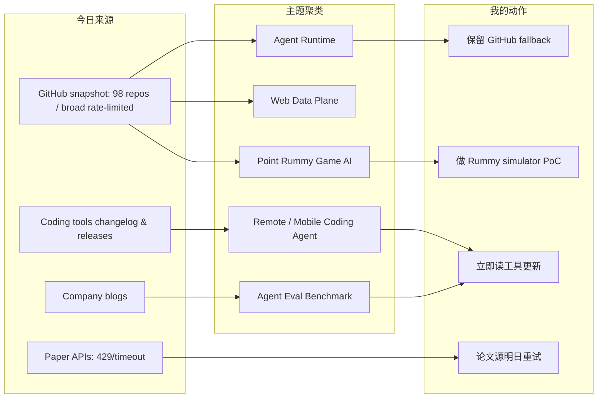
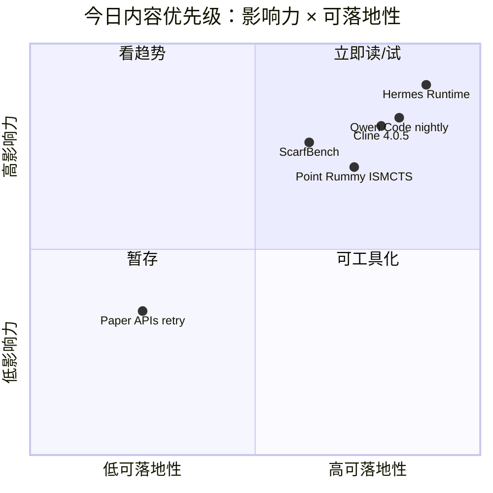

# AI Radar Daily - 2026-07-01

> 生成时间：2026-07-01 09:00 北京时间  
> 范围：AI Infra / LLM / RL / Agent / Eval / Serving / Training / 大厂博客 / 论文 / GitHub / Coding 工具  
> 说明：日报是导航入口；深度理解请进入 Obsidian 详情页。今日已保存 `Automation/state/github-stars-2026-07-01.json`，但 GitHub broad 查询在 niche rummy 查询后触发 403 rate limit；因此通用 GitHub 高 star / 增长榜使用 2026-06-30 成功 broad snapshot 作保守 fallback，Point Rummy 使用今日 snapshot，论文源 arXiv/Semantic Scholar 触发 429/timeout。

## 0. 今日结论

- 今日最值得关注：Coding agent 工具链继续向 remote/mobile/CLI/TUI 和 nightly 快速迭代迁移，Qwen Code、Cline、Cursor 是今天最实用的工具信号。
- 对 AI Infra 的直接影响：agent 的瓶颈仍集中在 runtime、web data plane、权限、上下文、失败恢复和可观测性，而不只是模型本身。
- 对 LLM 训练 / 推理 / Agent 的影响：vLLM / Ollama / Dify / Open WebUI 仍是 serving 与 agent app 基础设施观察主线；今日 GitHub API rate limit 需要谨慎解读榜单。
- 对 RL / 游戏模型训练的影响：Point Rummy 今日命中 97 个 GitHub repo，最有价值的是 ISMCTS、neuroevolution、RLCard 和实时游戏服务端参考。
- 建议今天深读：Qwen Code nightly、Cline 4.0.5、Coding Agent pricing scan、Hugging Face ScarfBench、Point Rummy watchlist、Hermes/Firecrawl runtime 对照页。

## 1. 今日态势图

## 2. 必读卡片区

> [!important] Qwen Code nightly 继续发布
> - 大类：Coding 工具 / AI Agent CLI
> - 小类：Open-source coding agent
> - 重点：2026-07-01 发布 `v0.19.3-nightly.20260701.a974594d7`。
> - 为什么重要：开源 coding agent CLI/TUI 高频迭代，适合对照 Codex/Claude Code 的权限、上下文和远程执行体验。
> - 详情：[[Industry/Tools/2026-07-01/qwen-code-nightly-remote-agent-watch]] / [网页详情](https://github.com/dyt27666-oss/AI-news-report-obsidians/blob/main/Industry/Tools/2026-07-01/qwen-code-nightly-remote-agent-watch.md) / [原文](https://github.com/QwenLM/qwen-code/releases/tag/v0.19.3-nightly.20260701.a974594d7)

> [!important] Cline v4.0.5：VS Code agent extension 快速稳定
> - 大类：Coding 工具 / AI IDE Extension
> - 小类：MCP / tools / context
> - 重点：6/30 发布 v4.0.5，4.x 分支连续迭代。
> - 为什么重要：Cline 类工具直接影响 AI coding workflow 的权限提示、工具执行、上下文窗口和 MCP 使用方式。
> - 详情：[[Industry/Tools/2026-07-01/cline-4-0-5-release-watch]] / [网页详情](https://github.com/dyt27666-oss/AI-news-report-obsidians/blob/main/Industry/Tools/2026-07-01/cline-4-0-5-release-watch.md) / [原文](https://github.com/cline/cline/releases/tag/v4.0.5)

> [!tip] ScarfBench：企业 Java 框架迁移 Agent Benchmark
> - 大类：大厂/社区博客
> - 小类：Agent Eval / Enterprise Migration
> - 重点：Hugging Face Blog 今日首页显示 ScarfBench，面向企业 Java 框架迁移的 agent benchmark。
> - 为什么重要：比 toy coding benchmark 更接近真实工程 ROI，可用于评估 coding agent loop。
> - 详情：[[Industry/2026-07-01/huggingface-scarfbench-agent-migration]] / [网页详情](https://github.com/dyt27666-oss/AI-news-report-obsidians/blob/main/Industry/2026-07-01/huggingface-scarfbench-agent-migration.md) / [原文](https://huggingface.co/blog)

> [!tip] Coding Agent pricing scan：订阅额度 + credits + token API 混合成本
> - 大类：Coding 工具 / AI Agent 成本
> - 小类：Pricing / Quota / Rate limit
> - 重点：Codex、Claude、Gemini、DeepSeek、xAI、Cursor、Copilot、Devin/Windsurf、Alibaba/Qwen 的公开 pricing/docs 已整理为详情页。
> - 为什么重要：agent loop 的真实成本取决于 5h quota、credits、cached tokens、cloud tasks、search/grounding 和 premium model access。
> - 详情：[[Industry/Tools/2026-07-01/coding-agent-pricing-plan-scan]] / [网页详情](https://github.com/dyt27666-oss/AI-news-report-obsidians/blob/main/Industry/Tools/2026-07-01/coding-agent-pricing-plan-scan.md) / [原文](https://developers.openai.com/codex/pricing)

> [!tip] Point Rummy watchlist：97 个 repo 命中
> - 大类：GitHub / Business
> - 小类：Game AI / Rummy RL
> - 重点：ISMCTS、neuroevolution、RLCard、Spring Boot + React + WebSocket 都有参考项。
> - 为什么重要：可拆成规则状态机、bot baseline、自博弈环境和服务端实时同步四类资产。
> - 详情：[[Business/PointRummy/2026-07-01/point-rummy-github-watchlist]] / [网页详情](https://github.com/dyt27666-oss/AI-news-report-obsidians/blob/main/Business/PointRummy/2026-07-01/point-rummy-github-watchlist.md) / [原文](https://github.com/search?q=indian+rummy+ai&type=repositories)

## 3. 优先级矩阵

## 4. 分类清单

| 标签 | 大类 | 小类 | 标题 | 重点概括 | 为什么重要 | Obsidian 详情 | 网页详情 | 原文 |
|---|---|---|---|---|---|---|---|---|
| 必读 | Coding 工具 | Qwen Code | Qwen Code nightly | 2026-07-01 nightly 发布。 | 开源 coding agent CLI/TUI 直接影响本地多 agent 工作流对照。 | [[Industry/Tools/2026-07-01/qwen-code-nightly-remote-agent-watch]] | [网页详情](https://github.com/dyt27666-oss/AI-news-report-obsidians/blob/main/Industry/Tools/2026-07-01/qwen-code-nightly-remote-agent-watch.md) | [原文](https://github.com/QwenLM/qwen-code/releases/tag/v0.19.3-nightly.20260701.a974594d7) |
| 必读 | Coding 工具 | Cline | Cline v4.0.5 | 4.x 分支连续 release。 | VS Code agent extension 的 MCP、tool use、权限和上下文策略值得跟踪。 | [[Industry/Tools/2026-07-01/cline-4-0-5-release-watch]] | [网页详情](https://github.com/dyt27666-oss/AI-news-report-obsidians/blob/main/Industry/Tools/2026-07-01/cline-4-0-5-release-watch.md) | [原文](https://github.com/cline/cline/releases/tag/v4.0.5) |
| 必读 | Coding 工具 | Pricing / Quota | Coding Agent pricing scan | 订阅额度、credits、token API、cloud tasks 与 search/grounding 成本统一整理。 | agent loop 的真实瓶颈是 quota/credit/权限/审计的组合，不只是每月价格。 | [[Industry/Tools/2026-07-01/coding-agent-pricing-plan-scan]] | [网页详情](https://github.com/dyt27666-oss/AI-news-report-obsidians/blob/main/Industry/Tools/2026-07-01/coding-agent-pricing-plan-scan.md) | [原文](https://developers.openai.com/codex/pricing) |
| 可 skim | Industry | Hugging Face / Eval | ScarfBench | 企业 Java framework migration agent benchmark。 | 真实工程迁移任务比 toy benchmark 更适合评估 coding agent。 | [[Industry/2026-07-01/huggingface-scarfbench-agent-migration]] | [网页详情](https://github.com/dyt27666-oss/AI-news-report-obsidians/blob/main/Industry/2026-07-01/huggingface-scarfbench-agent-migration.md) | [原文](https://huggingface.co/blog) |
| 后续 | GitHub | Point Rummy | Rummy AI watchlist | 97 个 rummy 相关 repo，按业务可用性筛选。 | 可为规则、bot、simulator、evaluator 提供初始参考。 | [[Business/PointRummy/2026-07-01/point-rummy-github-watchlist]] | [网页详情](https://github.com/dyt27666-oss/AI-news-report-obsidians/blob/main/Business/PointRummy/2026-07-01/point-rummy-github-watchlist.md) | [原文](https://github.com/search?q=indian+rummy+ai&type=repositories) |
| 低置信 | 论文 | arXiv / Semantic Scholar | Paper source watch | arXiv 与 Semantic Scholar 429/timeout。 | 不伪造论文条目；明日重试更可靠。 | [[Papers/2026-07-01/agent-eval-serving-paper-source-watch]] | [网页详情](https://github.com/dyt27666-oss/AI-news-report-obsidians/blob/main/Papers/2026-07-01/agent-eval-serving-paper-source-watch.md) | [原文](https://export.arxiv.org/api/query) |

## 5. 大厂资讯 / 工程博客 / Research

### 5.1 公司来源扫描矩阵

| 公司/实验室 | 来源/栏目 | 今日状态 | 高相关条数 | 代表条目 | 备注 |
|---|---|---|---:|---|---|
| OpenAI | News / Research | 访问失败 | 0 | 无 | News 页面 403；未臆造未验证新项。 |
| Anthropic | News / Research / Engineering | 页面可访问 / 近更新观察 | 1 | Claude Code / Claude Tag watch | News 页面 200；继续观察团队 agent workflow 与 Claude Code release notes。 |
| Google DeepMind | Blog / Research | 页面可访问 / 无高相关新项 | 0 | 无 | Blog 首页 200，但未抽到今日 AI Infra/RL 强相关单篇。 |
| Meta AI | Blog / Research | 页面可访问 / 无高相关新项 | 0 | 无 | Blog 首页 200；未确认今日强相关工程文章。 |
| NVIDIA | Technical Blog / AI | 访问失败 | 0 | 无 | 配置分类页返回 404；需改用 RSS 或站内搜索。 |
| Microsoft | Research AI | 页面可访问 / 低置信 | 0 | 无 | 页面偏研究导航，未确认今日新单篇。 |
| Hugging Face | Blog / Papers / Releases | 有高相关新项 | 1 | ScarfBench | 页面显示 enterprise Java framework migration agents benchmark。 |
| 腾讯 | AI Lab / 技术博客 | 无高相关新项 | 0 | 无 | 本轮未抓到 AI Infra/LLM/RL 强相关新项。 |
| 字节 | Seed / GitHub | 间接高相关 | 1 | DeerFlow | 使用 6/30 GitHub snapshot；long-horizon SuperAgent harness 仍值得跟踪。 |
| SpaceAI | Blog / News | 低置信 / 弱相关 | 0 | 无 | 和本 radar 主线弱相关；保留矩阵占位。 |

### 5.2 高相关大厂条目

| 标签 | 发布方/大厂 | 栏目/来源 | 标题 | 重点概括 | 工程/算法影响 | Obsidian 详情 | 网页详情 | 原文 |
|---|---|---|---|---|---|---|---|---|
| 可 skim | Hugging Face | Community Blog / Benchmark | ScarfBench | 企业 Java framework migration agent benchmark。 | 更贴近真实 coding agent eval，适合纳入 loop engineering benchmark watch。 | [[Industry/2026-07-01/huggingface-scarfbench-agent-migration]] | [网页详情](https://github.com/dyt27666-oss/AI-news-report-obsidians/blob/main/Industry/2026-07-01/huggingface-scarfbench-agent-migration.md) | [原文](https://huggingface.co/blog) |
| 可 skim | 字节 | GitHub / Agent Framework | DeerFlow | long-horizon SuperAgent harness，6/30 broad snapshot 高增长。 | 对长任务编排、工具调用和 research/code/create workflow 有参考。 | [[GitHub/2026-07-01/github-growth-watch]] | [网页详情](https://github.com/dyt27666-oss/AI-news-report-obsidians/blob/main/GitHub/2026-07-01/github-growth-watch.md) | [原文](https://github.com/bytedance/deer-flow) |
| 后续 | Anthropic | News / Product | Claude Tag / Claude Code watch | 团队 agent 协作、release notes 持续观察。 | 权限、上下文、审计、团队分派是 coding agent 工程化核心。 | [[Industry/Tools/2026-07-01/cursor-mobile-cloud-agent-watch]] | [网页详情](https://github.com/dyt27666-oss/AI-news-report-obsidians/blob/main/Industry/Tools/2026-07-01/cursor-mobile-cloud-agent-watch.md) | [原文](https://www.anthropic.com/news) |

## 6. GitHub 高 star Top 10

> 今日 GitHub broad search 触发 403 rate limit；本表使用 2026-06-30 成功 broad snapshot 作为 fallback，今日 snapshot 仍已保存。不是冷启动，但需低置信解读。

| 排名 | repo | stars | forks | language | updated_at | topics | 重点概括 | 是否值得试用 | Obsidian 详情 | 原文 |
|---:|---|---:|---:|---|---|---|---|---|---|---|
| 1 | affaan-m/ECC | 223700 | 34246 | JavaScript | 2026-06-30T10:52:04Z | ai-agents, anthropic, claude, claude-code, developer-tools, llm | Agent harness performance optimization system，围绕 skills、memory、security、research-first workflow。 | 可 skim | [[GitHub/2026-07-01/github-snapshot-top10]] | [原文](https://github.com/affaan-m/ECC) |
| 2 | NousResearch/hermes-agent | 206100 | 37255 | Python | 2026-06-30T10:56:07Z | ai, ai-agent, ai-agents, anthropic, chatgpt, claude | 可生长 agent runtime，tools、skills、cron、memory 支撑长期自动研究与知识库写入。 | 值得试用 | [[GitHub/2026-07-01/github-snapshot-top10]] | [原文](https://github.com/NousResearch/hermes-agent) |
| 3 | tensorflow/tensorflow | 195981 | 75210 | C++ | 2026-06-30T10:53:02Z | deep-learning, deep-neural-networks, distributed, machine-learning, ml, neural-network | An Open Source Machine Learning Framework for Everyone | 可 skim | [[GitHub/2026-07-01/github-snapshot-top10]] | [原文](https://github.com/tensorflow/tensorflow) |
| 4 | Significant-Gravitas/AutoGPT | 185228 | 46116 | Python | 2026-06-30T10:49:43Z | agentic-ai, agents, ai, artificial-intelligence, autonomous-agents, claude | AutoGPT is the vision of accessible AI for everyone, to use and to build on. Our mission is to provide the tools, so that you can focus on what matters. | 可 skim | [[GitHub/2026-07-01/github-snapshot-top10]] | [原文](https://github.com/Significant-Gravitas/AutoGPT) |
| 5 | ollama/ollama | 175177 | 16771 | Go | 2026-06-30T10:55:05Z | deepseek, gemma, gemma3, glm, go, golang | 本地 LLM 运行入口，适合开发、评估与边缘推理。 | 值得试用 | [[GitHub/2026-07-01/github-snapshot-top10]] | [原文](https://github.com/ollama/ollama) |
| 6 | f/prompts.chat | 164555 | 21292 | HTML | 2026-06-30T10:24:59Z | ai, artificial-intelligence, awesome-list, chatgpt, chatgpt-prompts, claude | f.k.a. Awesome ChatGPT Prompts. Share, discover, and collect prompts from the community. Free and open source — self-host for your organization with complete privacy. | 可 skim | [[GitHub/2026-07-01/github-snapshot-top10]] | [原文](https://github.com/f/prompts.chat) |
| 7 | huggingface/transformers | 162049 | 33669 | Python | 2026-06-30T10:37:17Z | audio, deep-learning, deepseek, gemma, glm, hacktoberfest | 模型定义与加载事实标准，影响训练、推理、量化与多模态生态。 | 值得试用 | [[GitHub/2026-07-01/github-snapshot-top10]] | [原文](https://github.com/huggingface/transformers) |
| 8 | langflow-ai/langflow | 150233 | 9362 | Python | 2026-06-30T10:48:19Z | agents, chatgpt, generative-ai, large-language-models, multiagent, react-flow | Langflow is a powerful tool for building and deploying AI-powered agents and workflows. | 可 skim | [[GitHub/2026-07-01/github-snapshot-top10]] | [原文](https://github.com/langflow-ai/langflow) |
| 9 | langgenius/dify | 147098 | 23165 | TypeScript | 2026-06-30T10:50:44Z | agent, agentic-ai, agentic-framework, agentic-workflow, ai, automation | 生产化 agentic workflow development platform，适合 RAG/agent 产品原型。 | 值得试用 | [[GitHub/2026-07-01/github-snapshot-top10]] | [原文](https://github.com/langgenius/dify) |
| 10 | open-webui/open-webui | 143525 | 20689 | Python | 2026-06-30T10:40:48Z | ai, llm, llm-ui, llm-webui, llms, mcp | User-friendly AI Interface (Supports Ollama, OpenAI API, ...) | 值得试用 | [[GitHub/2026-07-01/github-snapshot-top10]] | [原文](https://github.com/open-webui/open-webui) |

## 7. GitHub star 增长最快 Top 10

> 增长依据：使用历史 snapshot 差值；由于今日 broad 查询 rate-limited，本表沿用 2026-06-30 成功 broad snapshot 的增长结果作为 fallback，不是冷启动代理。

| 排名 | repo | stars_delta | stars | forks | language | updated_at | 增长依据 | 重点概括 | Obsidian 详情 | 原文 |
|---:|---|---:|---:|---:|---|---|---|---|---|---|
| 1 | NousResearch/hermes-agent | 4047 | 206100 | 37255 | Python | 2026-06-30T10:56:07Z | historical_snapshot / 2026-06-30 fallback | 可生长 agent runtime，tools、skills、cron、memory 支撑长期自动研究与知识库写入。 | [[GitHub/2026-07-01/github-growth-watch]] | [原文](https://github.com/NousResearch/hermes-agent) |
| 2 | firecrawl/firecrawl | 3092 | 141808 | 8175 | TypeScript | 2026-06-30T10:49:38Z | historical_snapshot / 2026-06-30 fallback | 面向 agent/RAG 的 search、scrape、HTML-to-markdown、structured extraction 数据平面。 | [[GitHub/2026-07-01/github-growth-watch]] | [原文](https://github.com/firecrawl/firecrawl) |
| 3 | affaan-m/ECC | 2505 | 223700 | 34246 | JavaScript | 2026-06-30T10:52:04Z | historical_snapshot / 2026-06-30 fallback | Agent harness performance optimization system，围绕 skills、memory、security、research-first workflow。 | [[GitHub/2026-07-01/github-growth-watch]] | [原文](https://github.com/affaan-m/ECC) |
| 4 | JuliusBrussee/caveman | 1541 | 78128 | 4417 | JavaScript | 2026-06-30T10:55:40Z | historical_snapshot / 2026-06-30 fallback | 🪨 why use many token when few token do trick — Claude Code skill that cuts 65% of tokens by talking like caveman | [[GitHub/2026-07-01/github-growth-watch]] | [原文](https://github.com/JuliusBrussee/caveman) |
| 5 | TauricResearch/TradingAgents | 1540 | 89905 | 17352 | Python | 2026-06-30T10:50:25Z | historical_snapshot / 2026-06-30 fallback | TradingAgents: Multi-Agents LLM Financial Trading Framework | [[GitHub/2026-07-01/github-growth-watch]] | [原文](https://github.com/TauricResearch/TradingAgents) |
| 6 | kepano/obsidian-skills | 1124 | 38983 | 2763 | Unknown | 2026-06-30T10:56:21Z | historical_snapshot / 2026-06-30 fallback | Agent skills for Obsidian. Teach your agent to use Obsidian CLI and open formats including Markdown, Bases, JSON Canvas. | [[GitHub/2026-07-01/github-growth-watch]] | [原文](https://github.com/kepano/obsidian-skills) |
| 7 | bytedance/deer-flow | 1107 | 75552 | 10196 | Python | 2026-06-30T10:47:39Z | historical_snapshot / 2026-06-30 fallback | An open-source long-horizon SuperAgent harness that researches, codes, and creates. With the help of sandboxes, memories, tools, skill, subagents and message gateway, it handles different levels of tasks that could take  | [[GitHub/2026-07-01/github-growth-watch]] | [原文](https://github.com/bytedance/deer-flow) |
| 8 | browser-use/browser-use | 1055 | 101571 | 11271 | Python | 2026-06-30T10:55:46Z | historical_snapshot / 2026-06-30 fallback | 🌐 Make websites accessible for AI agents. Automate tasks online with ease. | [[GitHub/2026-07-01/github-growth-watch]] | [原文](https://github.com/browser-use/browser-use) |
| 9 | thedotmack/claude-mem | 1001 | 85137 | 7347 | JavaScript | 2026-06-30T10:46:16Z | historical_snapshot / 2026-06-30 fallback | Persistent Context Across Sessions for Every Agent –  Captures everything your agent does during sessions, compresses it with AI, and injects relevant context back into future sessions. Works with Claude Code, OpenClaw,  | [[GitHub/2026-07-01/github-growth-watch]] | [原文](https://github.com/thedotmack/claude-mem) |
| 10 | omnigent-ai/omnigent | 875 | 5599 | 710 | Python | 2026-06-30T10:53:33Z | historical_snapshot / 2026-06-30 fallback | Omnigent is an open-source AI agent framework and meta-harness: orchestrate Claude Code, Codex, Cursor, Pi, and custom agents — swap harnesses without rewriting, enforce policies and sandboxing, and collaborate in real t | [[GitHub/2026-07-01/github-growth-watch]] | [原文](https://github.com/omnigent-ai/omnigent) |

## 8. Coding 工具 / AI 工具功能更新

### 8.1 Coding 工具扫描矩阵

| 工具 | 厂商 | 来源类型 | 今日状态 | 代表更新 | 对我的影响 | 原文 |
|---|---|---|---|---|---|---|
| Claude Code | Anthropic | Changelog / Release Notes | 页面经 GitHub mirror 可访问 / 低置信 | Claude Code release notes 需点原文复核 | 继续关注 Claude Tag、权限、上下文、远程执行 | https://docs.anthropic.com/en/release-notes/claude-code |
| OpenAI Codex | OpenAI | Changelog / Docs | 页面可访问 | Changelog 显示 June 2026 / May 2026 / April 2026 | 继续观察 CLI/IDE、MCP、background mode、rate limits | https://developers.openai.com/codex/changelog |
| Cursor | Cursor | Changelog | 有高相关近更新 | Mobile App / Cloud agents / Remote Control | 远程 agent 监控、任务分派和移动端接力影响 workflow | https://cursor.com/changelog |
| Windsurf | Windsurf | Changelog | 页面可访问 / 低置信 | Devin Docs changelog / Agent Command Center | 观察 ACP、CLI、远程 agent 和 IDE 集成变化 | https://windsurf.com/changelog |
| GitHub Copilot | GitHub | Changelog / Blog | 页面可访问 | Copilot changelog June 2026 | 继续关注 terminal interface、agent mode、pricing/rate limit | https://github.blog/changelog/label/copilot/ |
| Gemini Code Assist | Google | Release Notes | 页面可访问 | 6/19、6/18、6/11 release notes | 观察 Code Assist 与 Google agent coding 线迁移 | https://cloud.google.com/gemini/docs/codeassist/release-notes |
| Qwen Code | Alibaba/Qwen | GitHub Releases | 有今日 release | v0.19.3-nightly.20260701.a974594d7 | 开源 coding agent CLI/TUI 高频迭代，适合沙盒对照试用 | https://github.com/QwenLM/qwen-code/releases/tag/v0.19.3-nightly.20260701.a974594d7 |
| Roo Code | Roo Code | GitHub Releases | 无今日新 release | 最新 v3.54.0（2026-05-15） | 今日无高相关新项，继续观察 VS Code agent extension | https://github.com/RooCodeInc/Roo-Code/releases |
| Cline | Cline | GitHub Releases | 有近今日 release | v4.0.5（2026-06-30） | 4.x 快速迭代，需关注 MCP/tools/权限/上下文破坏性变更 | https://github.com/cline/cline/releases/tag/v4.0.5 |
| Continue | Continue | GitHub Releases | 无今日新 release | v2.1.0-vscode / v2.0.0-vscode（2026-06-19） | VS Code extension 继续观察，今日无明确 agent/MCP 新功能 | https://github.com/continuedev/continue/releases |
| Pricing / Quota | 多厂商 | Pricing / API docs | 已新增专题详情页 | Codex、Claude、Gemini、DeepSeek、xAI、Cursor、Copilot、Devin/Windsurf、Alibaba/Qwen 的公开 pricing/docs 扫描 | 用于估算 agent loop 成本、quota 风险、cloud task 权限与团队采购边界 | https://developers.openai.com/codex/pricing |

### 8.2 高相关工具更新

| 标签 | 工具/厂商 | 来源类型 | 标题/功能 | 重点概括 | 对 AI coding 工作流的影响 | Obsidian 详情 | 网页详情 | 原文 |
|---|---|---|---|---|---|---|---|---|
| 必读 | Qwen Code / Alibaba | GitHub Release | v0.19.3-nightly.20260701 | nightly 高频发布。 | 适合对照 Codex/Claude Code 的 CLI/TUI、权限和上下文策略。 | [[Industry/Tools/2026-07-01/qwen-code-nightly-remote-agent-watch]] | [网页详情](https://github.com/dyt27666-oss/AI-news-report-obsidians/blob/main/Industry/Tools/2026-07-01/qwen-code-nightly-remote-agent-watch.md) | [原文](https://github.com/QwenLM/qwen-code/releases/tag/v0.19.3-nightly.20260701.a974594d7) |
| 必读 | Cline | GitHub Release | v4.0.5 | 4.x 分支连续稳定化。 | VS Code agent extension 的工具调用和 MCP 体验值得复核。 | [[Industry/Tools/2026-07-01/cline-4-0-5-release-watch]] | [网页详情](https://github.com/dyt27666-oss/AI-news-report-obsidians/blob/main/Industry/Tools/2026-07-01/cline-4-0-5-release-watch.md) | [原文](https://github.com/cline/cline/releases/tag/v4.0.5) |
| 可 skim | Cursor | Changelog | Mobile / Cloud Agent / Remote Control | 远程与移动端 agent 管理仍是产品主线。 | 影响 tmux 多 agent 监控、任务队列和远程执行审计。 | [[Industry/Tools/2026-07-01/cursor-mobile-cloud-agent-watch]] | [网页详情](https://github.com/dyt27666-oss/AI-news-report-obsidians/blob/main/Industry/Tools/2026-07-01/cursor-mobile-cloud-agent-watch.md) | [原文](https://cursor.com/changelog) |
| 必读 | 多厂商 | Pricing / Plans / API docs | Coding Agent pricing scan | 订阅额度 + credits + token API + cloud tasks 的混合成本结构。 | 决定 agent loop 的模型路由、额度耗尽风险、团队审计和云端权限策略。 | [[Industry/Tools/2026-07-01/coding-agent-pricing-plan-scan]] | [网页详情](https://github.com/dyt27666-oss/AI-news-report-obsidians/blob/main/Industry/Tools/2026-07-01/coding-agent-pricing-plan-scan.md) | [原文](https://developers.openai.com/codex/pricing) |

## 9. Point Rummy / Indian Rummy 业务主题

> 今日 GitHub 主题池命中 97 个 repo；整体 star 较低，所以按业务可用性而不是热度排序。论文源 429/timeout，论文/资料候选低置信。

### 9.1 GitHub 候选

| 标签 | repo | stars | forks | language | updated_at | 重点概括 | 业务可用性 | Obsidian 详情 | 原文 |
|---|---|---:|---:|---|---|---|---|---|---|
| 后续 | rickgorman/gin-rummy-ai | 13 | 5 | Python | 2025-03-25T13:47:09Z | A hand-rolled neuroevolution AI for gin rummy. | AI/bot/仿真参考 | [[Business/PointRummy/2026-07-01/point-rummy-github-watchlist]] | [原文](https://github.com/rickgorman/gin-rummy-ai) |
| 后续 | nakkekakke/rummy-ai | 11 | 5 | Java | 2026-04-17T10:02:59Z | Text based classic Rummy game with an AI that uses ISMCTS. Data Structures and Algorithms course project, University of Helsinki | AI/bot/仿真参考 | [[Business/PointRummy/2026-07-01/point-rummy-github-watchlist]] | [原文](https://github.com/nakkekakke/rummy-ai) |
| 后续 | jmhummel/Gin-Rummy-Java | 8 | 0 | Java | 2023-08-16T16:12:58Z | Java-based Gin Rummy console game, with an AI opponent | AI/bot/仿真参考 | [[Business/PointRummy/2026-07-01/point-rummy-github-watchlist]] | [原文](https://github.com/jmhummel/Gin-Rummy-Java) |
| 可 skim | mudont/indian-rummy | 5 | 0 | TypeScript | 2025-08-08T21:05:04Z | Typescript library for Indian Rummy card game | 规则/实现参考 | [[Business/PointRummy/2026-07-01/point-rummy-github-watchlist]] | [原文](https://github.com/mudont/indian-rummy) |
| 可 skim | dv-rastogi/Rummy | 5 | 0 | Python | 2023-09-26T11:21:39Z | Variation of classical Indian Rummy made in Pygame | 规则/实现参考 | [[Business/PointRummy/2026-07-01/point-rummy-github-watchlist]] | [原文](https://github.com/dv-rastogi/Rummy) |
| 可 skim | vahsek300501/Indian-Rummy- | 4 | 3 | Python | 2023-09-26T11:21:46Z | Indian Rummy made in Python using PyGame | 规则/实现参考 | [[Business/PointRummy/2026-07-01/point-rummy-github-watchlist]] | [原文](https://github.com/vahsek300501/Indian-Rummy-) |
| 可 skim | SCFlanagan/Rummy | 4 | 6 | JavaScript | 2025-07-25T21:17:08Z | This project is a recreation of the classic card game Rummy. It features an AI player to play against, a hand of cards that can be dragged and sorted, and a scoreboard that keeps track of multiple rounds. | AI/bot/仿真参考 | [[Business/PointRummy/2026-07-01/point-rummy-github-watchlist]] | [原文](https://github.com/SCFlanagan/Rummy) |
| 可 skim | mcartmell/gin-rummy-bot | 4 | 2 | Perl | 2024-10-30T20:06:17Z | A web-based Gin Rummy game and AI | AI/bot/仿真参考 | [[Business/PointRummy/2026-07-01/point-rummy-github-watchlist]] | [原文](https://github.com/mcartmell/gin-rummy-bot) |
| 可 skim | Mohitkumar-559/RummyServer | 2 | 1 | JavaScript | 2024-03-17T03:48:34Z | Rummy game server for game that contain deal rummy and point rummy | AI/bot/仿真参考 | [[Business/PointRummy/2026-07-01/point-rummy-github-watchlist]] | [原文](https://github.com/Mohitkumar-559/RummyServer) |
| 可 skim | abubakarmunir712/dsa-final-project | 2 | 1 | Python | 2026-06-27T06:34:26Z | A Python-based multiplayer Indian Rummy game with support for AI opponents and LAN play. Implements data structures like linked lists, stacks, queues, hashmaps, and graphs to ensure efficient gameplay and intelligent AI  | AI/bot/仿真参考 | [[Business/PointRummy/2026-07-01/point-rummy-github-watchlist]] | [原文](https://github.com/abubakarmunir712/dsa-final-project) |

### 9.2 论文 / 资料候选

| 标签 | 来源 | 标题 | 作者/机构 | 重点概括 | 对 Point Rummy 业务有什么用 | Obsidian 详情 | 原文 |
|---|---|---|---|---|---|---|---|
| 低置信 | arXiv / Semantic Scholar | Rummy imperfect information / MCTS / RL 查询 | 未取得 | API 429/timeout，未取得可靠新论文。 | 不据此做方向判断；明日重试。 | [[Papers/2026-07-01/agent-eval-serving-paper-source-watch]] | [原文](https://export.arxiv.org/api/query) |
| 后续 | GitHub | `nakkekakke/rummy-ai` | University of Helsinki course project | ISMCTS + rummy text game。 | 可作为 imperfect-information baseline bot 参考。 | [[Business/PointRummy/2026-07-01/point-rummy-github-watchlist]] | [原文](https://github.com/nakkekakke/rummy-ai) |

### 9.3 业务可用性判断

| 方向 | 今日信号 | 可用性 | 下一步 |
|---|---|---|---|
| 规则引擎 / 计分 | `mudont/indian-rummy`、多个 scoreboard repo | 中：可参考但需重写为可测试状态机 | 抽 meld/scoring/drop/dealer rotation 单元测试 |
| Bot / RL Agent | ISMCTS、neuroevolution、RLCard 候选 | 中：适合 baseline，不宜直接生产 | 实现 random/heuristic/ISMCTS 三个 baseline |
| 仿真 / 评测 | `vdesmond/IRumAI`、`drewmcgee/gin-rummy-rl-lab` | 中低：需复核 README 与运行性 | 设计统一 Gym/RLCard adapter |

## 10. Loop Engineer / Loop Engineering 主题

> 今日 loop 查询被 GitHub rate limit，以下使用 2026-06-30 成功 snapshot fallback；不是冷启动代理。

### 10.1 Loop Engineer GitHub 高 star Top 10

| 排名 | repo | stars | forks | language | updated_at | topics | 重点概括 | 是否值得试用 | Obsidian 详情 | 原文 |
|---:|---|---:|---:|---|---|---|---|---|---|---|
| 1 | dair-ai/Prompt-Engineering-Guide | 76088 | 8331 | MDX | 2026-06-30T09:43:12Z | agent, agents, ai-agents, chatgpt, deep-learning, generative-ai | 🐙 Guides, papers, lessons, notebooks and resources for prompt engineering, context engineering, RAG, and AI Agents. | 值得试用 | [[GitHub/2026-07-01/loop-engineer-watchlist]] | [原文](https://github.com/dair-ai/Prompt-Engineering-Guide) |
| 2 | cobusgreyling/loop-engineering | 4244 | 553 | JavaScript | 2026-06-30T10:55:21Z | agentic-ai, ai-agents, ai-coding, anthropic, automation, claude | Practical patterns, starters & CLI tools for loop engineering with AI coding agents. Design systems that prompt and orchestrate agents (inspired by Addy Osmani and Boris Cherny). Includes loop-audit, loop-init, loop-cost | 值得试用 | [[GitHub/2026-07-01/loop-engineer-watchlist]] | [原文](https://github.com/cobusgreyling/loop-engineering) |
| 3 | thesongzhu/Friday | 918 | 117 | TypeScript | 2026-06-30T10:46:46Z | agent-orchestration, agents, ai-agents, ai-assistant, approval-first, automation | Private control plane for AI agents  | 可 skim | [[GitHub/2026-07-01/loop-engineer-watchlist]] | [原文](https://github.com/thesongzhu/Friday) |

### 10.2 Loop Engineer GitHub star 增长最快 Top 10

| 排名 | repo | stars_delta | stars | forks | language | updated_at | 增长依据 | 重点概括 | Obsidian 详情 | 原文 |
|---:|---|---:|---:|---:|---|---|---|---|---|---|
| 1 | dair-ai/Prompt-Engineering-Guide | 135 | 76088 | 8331 | MDX | 2026-06-30T09:43:12Z | historical_snapshot / 2026-06-30 fallback | 🐙 Guides, papers, lessons, notebooks and resources for prompt engineering, context engineering, RAG, and AI Agents. | [[GitHub/2026-07-01/loop-engineer-watchlist]] | [原文](https://github.com/dair-ai/Prompt-Engineering-Guide) |
| 2 | thesongzhu/Friday | 1 | 918 | 117 | TypeScript | 2026-06-30T10:46:46Z | historical_snapshot / 2026-06-30 fallback | Private control plane for AI agents  | [[GitHub/2026-07-01/loop-engineer-watchlist]] | [原文](https://github.com/thesongzhu/Friday) |
| 3 | cobusgreyling/loop-engineering | None | 4244 | 553 | JavaScript | 2026-06-30T10:55:21Z | historical_snapshot / 2026-06-30 fallback | Practical patterns, starters & CLI tools for loop engineering with AI coding agents. Design systems that prompt and orchestrate agents (inspired by Addy Osmani and Boris Cherny). Includes loop-audit, loop-init, loop-cost | [[GitHub/2026-07-01/loop-engineer-watchlist]] | [原文](https://github.com/cobusgreyling/loop-engineering) |

### 10.3 Loop Engineering 方法信号

| 标签 | 来源 | 标题 | 重点概括 | 对 AI coding 工作流的影响 | Obsidian 详情 | 原文 |
|---|---|---|---|---|---|---|
| 可 skim | GitHub | Prompt Engineering Guide / loop engineering fallback | 使用历史 snapshot 保留 loop engineering 观察。 | 关注 context engineering、AGENTS.md、skills、eval loop 与 multi-agent orchestration。 | [[GitHub/2026-07-01/loop-engineer-watchlist]] | [原文](https://github.com/cobusgreyling/loop-engineering) |

## 11. 论文

### 11.1 Agent Eval / Serving / RL / Rummy

| 标签 | 论文来源 | 论文 | 作者/机构 | 重点概括 | 工程/研究价值 | Obsidian 详情 | 网页详情 | PDF/原文 |
|---|---|---|---|---|---|---|---|---|
| 低置信 | arXiv / Semantic Scholar | 今日未取得可靠新论文 | 未取得 | arXiv 429/timeout，Semantic Scholar 429。 | 保留源状态，明日重试；不伪造论文。 | [[Papers/2026-07-01/agent-eval-serving-paper-source-watch]] | [网页详情](https://github.com/dyt27666-oss/AI-news-report-obsidians/blob/main/Papers/2026-07-01/agent-eval-serving-paper-source-watch.md) | [原文](https://export.arxiv.org/api/query) |

## 12. 资讯 / 其他 GitHub 项目

### 12.1 Agent Runtime / Web Data Plane

| 标签 | 来源 | 标题 | 重点概括 | 对我有什么用 | Obsidian 详情 | 网页详情 | 原文 |
|---|---|---|---|---|---|---|---|
| 必读 | GitHub | Hermes Agent | 可生长 agent runtime。 | 对自动研究、skills、cron、Obsidian 工作流有直接参考。 | [[GitHub/2026-07-01/hermes-agent-runtime-watch]] | [网页详情](https://github.com/dyt27666-oss/AI-news-report-obsidians/blob/main/GitHub/2026-07-01/hermes-agent-runtime-watch.md) | [原文](https://github.com/NousResearch/hermes-agent) |
| 必读 | GitHub | Firecrawl | Agent/RAG web data plane。 | 提升研究抓取与结构化抽取质量。 | [[GitHub/2026-07-01/firecrawl-agent-web-data-plane]] | [网页详情](https://github.com/dyt27666-oss/AI-news-report-obsidians/blob/main/GitHub/2026-07-01/firecrawl-agent-web-data-plane.md) | [原文](https://github.com/firecrawl/firecrawl) |
| 可 skim | GitHub | vLLM | LLM serving engine watch。 | 对 scheduler/KV cache/serving API 持续有参考。 | [[GitHub/2026-07-01/vllm-serving-watch]] | [网页详情](https://github.com/dyt27666-oss/AI-news-report-obsidians/blob/main/GitHub/2026-07-01/vllm-serving-watch.md) | [原文](https://github.com/vllm-project/vllm) |

## 13. 按主题索引

### AI Infra / Serving / Training

- [[GitHub/2026-07-01/vllm-serving-watch]] - serving / scheduler / KV cache 主线。
- [[GitHub/2026-07-01/firecrawl-agent-web-data-plane]] - agent web data plane。

### LLM / Agent / RAG / Evaluation

- [[GitHub/2026-07-01/hermes-agent-runtime-watch]] - agent runtime / skills / cron / memory。
- [[Industry/2026-07-01/huggingface-scarfbench-agent-migration]] - coding agent eval benchmark。

### RL / Game AI / World Model

- [[Business/PointRummy/2026-07-01/point-rummy-github-watchlist]] - Rummy AI / ISMCTS / RL watchlist。

### Point Rummy / Indian Rummy

- [[Business/PointRummy/2026-07-01/point-rummy-github-watchlist]] - 业务主题主入口。

### Loop Engineer / Coding Agent Loop

- [[GitHub/2026-07-01/loop-engineer-watchlist]] - loop engineering fallback watchlist。
- [[Industry/Tools/2026-07-01/coding-agent-pricing-plan-scan]] - coding agent pricing / quota / credit / cloud-task 成本地图。

### 公司 / 实验室

- Hugging Face: [[Industry/2026-07-01/huggingface-scarfbench-agent-migration]]
- Anthropic / OpenAI / DeepMind / Meta / NVIDIA / Microsoft / 腾讯 / 字节 / SpaceAI: 见 `### 5.1 公司来源扫描矩阵`

### 大牛 / 作者

- 今日无可靠新作者信号；论文源 rate-limited。

## 14. 值得后续深挖

| 标签 | 大类 | 小类 | 标题 | 后续动作 | Obsidian 详情 | 原文 |
|---|---|---|---|---|---|---|
| 必读 | Coding 工具 | Qwen Code | Nightly CLI/TUI | 沙盒试用权限、上下文、工具调用。 | [[Industry/Tools/2026-07-01/qwen-code-nightly-remote-agent-watch]] | [原文](https://github.com/QwenLM/qwen-code/releases) |
| 必读 | Coding 工具 | Cline | v4.0.5 | 复核 release note 是否有 MCP / tool breaking changes。 | [[Industry/Tools/2026-07-01/cline-4-0-5-release-watch]] | [原文](https://github.com/cline/cline/releases/tag/v4.0.5) |
| 必读 | Coding 工具 | Pricing / Quota | 多厂商 pricing scan | 建立 routine edit、复杂 review、research scan、cloud task 的成本路由策略。 | [[Industry/Tools/2026-07-01/coding-agent-pricing-plan-scan]] | [原文](https://developers.openai.com/codex/pricing) |
| 后续 | Business | Point Rummy | ISMCTS / RLCard | 抽象 simulator + baseline bot。 | [[Business/PointRummy/2026-07-01/point-rummy-github-watchlist]] | [原文](https://github.com/nakkekakke/rummy-ai) |
| 低置信 | 论文 | API recovery | arXiv / Semantic Scholar | 明日重试，必要时降频。 | [[Papers/2026-07-01/agent-eval-serving-paper-source-watch]] | [原文](https://api.semanticscholar.org/) |

## 15. 采集失败或低置信来源

- GitHub broad queries：今日在 niche rummy queries 后触发 `HTTP Error 403: rate limit exceeded`；snapshot 文件已保存，但通用高 star / 增长榜使用 2026-06-30 broad snapshot fallback。
- arXiv：429 / timeout。
- Semantic Scholar：429。
- OpenAI News：403。
- NVIDIA Technical Blog configured category URL：404。
- SpaceAI：弱相关 / 低置信。

## 16. 归档标签

#ai-radar #daily #ai-infra #llm #rl #point-rummy #loop-engineering
