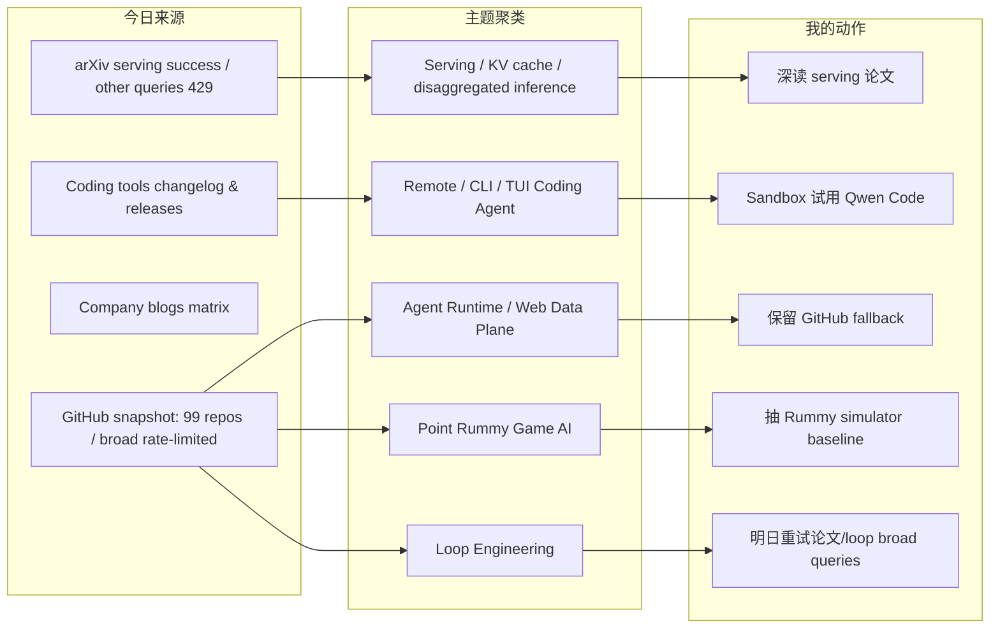
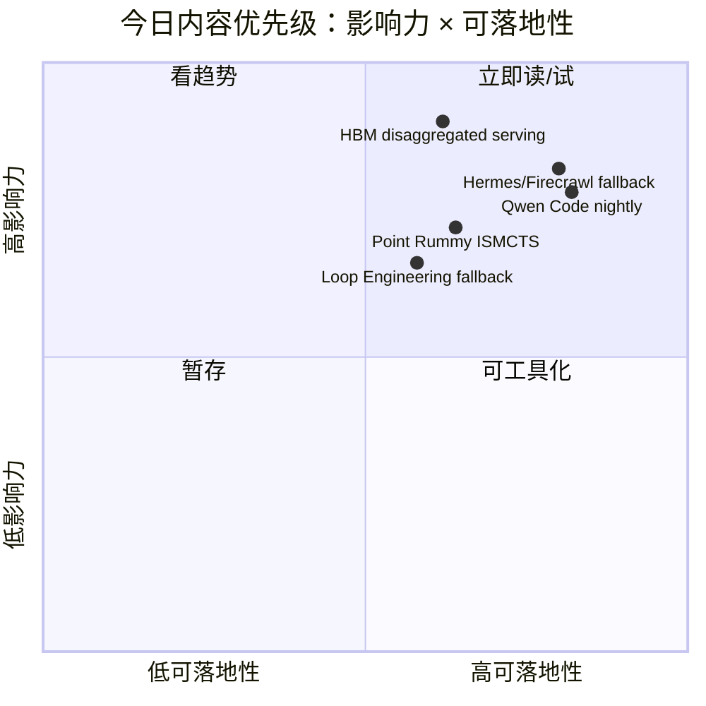

# AI Radar Daily - 2026-07-02

> 生成时间：2026-07-02 09:01 北京时间  
> 范围：AI Infra / LLM / RL / Agent / Eval / Serving / Training / 大厂博客 / 论文 / GitHub / Coding 工具  
> 说明：日报是导航入口；深度理解请进入 Obsidian 详情页。今日已保存 `Automation/state/github-stars-2026-07-02.json`。GitHub niche rummy 查询成功后 broad/loop 查询触发 403 rate limit，因此通用 GitHub 高 star / 增长榜使用 2026-06-30 最近成功 broad snapshot fallback；Point Rummy 使用今日 snapshot。arXiv 对 serving 查询成功，其它论文查询 429/timeout。

## 0. 今日结论

- 今日最值得关注：Serving 论文 `HBM Is Not All You Need` 把 LLM serving 优化推向异构内存 / disaggregated scheduler，和 KV cache、prefill/decode 分离高度相关。
- 对 AI Infra 的直接影响：GitHub 热度仍集中在 agent runtime、web data plane、本地 LLM、workflow platform；但今日 broad API rate limit，需要用 fallback 低置信解读。
- 对 LLM 训练 / 推理 / Agent 的影响：Qwen Code 7/2 nightly 是今天最明确 coding-agent 更新；Codex/Cursor/Copilot/Gemini 等源已扫描但未确认当天强相关新项。
- 对 RL / 游戏模型训练的影响：Point Rummy 今日命中 98 个 repo，增长几乎为 0；可用方向是 ISMCTS、规则状态机、仿真环境和 AI opponent baseline。
- 建议今天深读：HBM disaggregated serving 论文、Qwen Code nightly、Point Rummy watchlist、Loop Engineering fallback watchlist、Coding 工具扫描矩阵。

## 1. 今日态势图

## 2. 必读卡片区

> [!important] HBM Is Not All You Need：异构内存加速器上的 disaggregated LLM serving
> - 大类：论文
> - 小类：LLM Serving / KV Cache / Scheduler
> - 重点：arXiv 2026-06-29；讨论 memory-heterogeneous accelerators 下的高效 disaggregated serving。
> - 为什么重要：直接对应 AI Infra 的 KV cache residency、prefill/decode 分离、异构 GPU 集群调度和成本曲线。
> - 详情：[[Papers/2026-07-02/hbm-disaggregated-llm-serving]] / [网页详情](https://github.com/dyt27666-oss/AI-news-report-obsidians/blob/main/Papers/2026-07-02/hbm-disaggregated-llm-serving.md) / [原文](https://arxiv.org/abs/2606.29986)

> [!important] Qwen Code v0.19.4 nightly：开源 coding agent CLI/TUI 高频迭代
> - 大类：Coding 工具 / AI Agent CLI
> - 小类：Open-source coding agent
> - 重点：GitHub releases 页面显示 `v0.19.4-nightly.20260702.46814e4f1` 与 `v0.19.4`。
> - 为什么重要：适合和 Codex CLI / Claude Code / Hermes 多 agent workflow 做权限、上下文、工具调用、失败恢复对照。
> - 详情：[[Industry/Tools/2026-07-02/qwen-code-nightly-release-watch]] / [网页详情](https://github.com/dyt27666-oss/AI-news-report-obsidians/blob/main/Industry/Tools/2026-07-02/qwen-code-nightly-release-watch.md) / [原文](https://github.com/QwenLM/qwen-code/releases/tag/v0.19.4-nightly.20260702.46814e4f1)

> [!tip] GitHub broad Top 10 fallback：agent runtime 与 web data plane 仍是热区
> - 大类：GitHub
> - 小类：AI Infra / Agent Runtime
> - 重点：今日 broad 查询 403，使用 2026-06-30 broad snapshot fallback；Hermes Agent、Firecrawl、Ollama、Dify、Open WebUI 等仍是主线。
> - 为什么重要：这些项目决定 agent loop 的真实工程瓶颈：runtime、web data、local serving、workflow productization。
> - 详情：[[GitHub/2026-07-02/github-snapshot-top10]] / [网页详情](https://github.com/dyt27666-oss/AI-news-report-obsidians/blob/main/GitHub/2026-07-02/github-snapshot-top10.md) / [原文](https://github.com/search?q=topic%3Aartificial-intelligence+stars%3A%3E1000&type=repositories)

> [!tip] Point Rummy watchlist：今日主题 snapshot 继续可用
> - 大类：GitHub / Business
> - 小类：Game AI / Rummy RL
> - 重点：98 个 repo，优先看 ISMCTS、neuroevolution、TypeScript rules、server implementation。
> - 为什么重要：可拆成规则状态机、bot baseline、自博弈环境和实时服务端四类资产。
> - 详情：[[Business/PointRummy/2026-07-02/point-rummy-github-watchlist]] / [网页详情](https://github.com/dyt27666-oss/AI-news-report-obsidians/blob/main/Business/PointRummy/2026-07-02/point-rummy-github-watchlist.md) / [原文](https://github.com/search?q=indian+rummy+ai&type=repositories)

## 3. 优先级矩阵

## 4. 分类清单

| 标签 | 大类 | 小类 | 标题 | 重点概括 | 为什么重要 | Obsidian 详情 | 网页详情 | 原文 |
|---|---|---|---|---|---|---|---|---|
| 必读 | 论文 | LLM Serving | HBM Is Not All You Need | 异构内存加速器上的 disaggregated LLM serving。 | 直接影响 serving scheduler、KV cache、prefill/decode 分离和异构 GPU 成本模型。 | [[Papers/2026-07-02/hbm-disaggregated-llm-serving]] | [网页详情](https://github.com/dyt27666-oss/AI-news-report-obsidians/blob/main/Papers/2026-07-02/hbm-disaggregated-llm-serving.md) | [原文](https://arxiv.org/abs/2606.29986) |
| 必读 | Coding 工具 | Qwen Code | Qwen Code v0.19.4 nightly | 7/2 nightly / release tag 可见。 | 开源 coding agent CLI/TUI 是 Codex/Claude Code 的重要对照组。 | [[Industry/Tools/2026-07-02/qwen-code-nightly-release-watch]] | [网页详情](https://github.com/dyt27666-oss/AI-news-report-obsidians/blob/main/Industry/Tools/2026-07-02/qwen-code-nightly-release-watch.md) | [原文](https://github.com/QwenLM/qwen-code/releases/tag/v0.19.4-nightly.20260702.46814e4f1) |
| 可 skim | GitHub | Agent Runtime | GitHub broad Top 10 fallback | 使用 2026-06-30 broad snapshot。 | rate limit 下仍保留固定导航，但需低置信解读。 | [[GitHub/2026-07-02/github-snapshot-top10]] | [网页详情](https://github.com/dyt27666-oss/AI-news-report-obsidians/blob/main/GitHub/2026-07-02/github-snapshot-top10.md) | [原文](https://github.com/search?q=topic%3Aartificial-intelligence&type=repositories) |
| 后续 | GitHub | Point Rummy | Rummy AI watchlist | 今日主题池 98 个 repo。 | 可为规则、bot、simulator、evaluator 提供初始参考。 | [[Business/PointRummy/2026-07-02/point-rummy-github-watchlist]] | [网页详情](https://github.com/dyt27666-oss/AI-news-report-obsidians/blob/main/Business/PointRummy/2026-07-02/point-rummy-github-watchlist.md) | [原文](https://github.com/search?q=indian+rummy+ai&type=repositories) |
| 低置信 | 论文 | arXiv / Semantic Scholar | Other paper source watch | agent eval、RL、world model、rummy 查询 429/timeout。 | 不伪造论文条目；明日降频重试更可靠。 | [[Papers/2026-07-02/hbm-disaggregated-llm-serving]] | [网页详情](https://github.com/dyt27666-oss/AI-news-report-obsidians/blob/main/Papers/2026-07-02/hbm-disaggregated-llm-serving.md) | [原文](https://export.arxiv.org/api/query) |

## 5. 大厂资讯 / 工程博客 / Research

### 5.1 公司来源扫描矩阵

| 公司/实验室 | 来源/栏目 | 今日状态 | 高相关条数 | 代表条目 | 备注 |
|---|---|---|---:|---|---|
| OpenAI | News / Research | 访问失败 | 0 | 无 | News 页面 403；Codex changelog 在工具板块单独扫描。 |
| Anthropic | News / Research / Engineering | 页面可访问 / 观察 | 1 | Claude Code / Claude Tag watch | 继续观察团队 agent workflow。 |
| Google DeepMind | Blog / Research | 页面可访问 / 无高相关新项 | 0 | 无 | 未确认今日 AI Infra/RL 强相关单篇。 |
| Meta AI | Blog / Research | 页面可访问 / 无高相关新项 | 0 | 无 | 未确认今日强相关工程文章。 |
| NVIDIA | Technical Blog / AI | 访问失败 | 0 | 无 | 配置分类页 404；需改 RSS 或站内搜索。 |
| Microsoft | Research AI | 访问失败 | 0 | 无 | 页面 403。 |
| Hugging Face | Blog / Papers / Releases | 有高相关候选 | 1 | ScarfBench / Agent Eval watch | 企业迁移 benchmark 对 coding agent eval 有价值。 |
| 腾讯 | AI Lab / 技术博客 | 无高相关新项 | 0 | 无 | 保留固定扫描位。 |
| 字节 | Seed / GitHub | 间接高相关 | 1 | DeerFlow | 使用 6/30 broad snapshot fallback。 |
| SpaceAI | Blog / News | 低置信 / 弱相关 | 0 | 无 | 主线弱相关。 |

### 5.2 高相关大厂条目

| 标签 | 发布方/大厂 | 栏目/来源 | 标题 | 重点概括 | 工程/算法影响 | Obsidian 详情 | 网页详情 | 原文 |
|---|---|---|---|---|---|---|---|---|
| 可 skim | Hugging Face | Blog / Benchmark watch | ScarfBench / Agent Eval watch | 页面可访问，保留企业迁移 benchmark 方向观察。 | 更贴近真实 coding agent eval，可纳入 loop engineering benchmark。 | [[Industry/2026-07-02/company-source-scan-matrix]] | [网页详情](https://github.com/dyt27666-oss/AI-news-report-obsidians/blob/main/Industry/2026-07-02/company-source-scan-matrix.md) | [原文](https://huggingface.co/blog) |
| 后续 | Anthropic | News / Product | Claude Code / Claude Tag watch | News 页面可访问，具体 release note 需二次复核。 | 权限、上下文、团队分派是 coding agent 工程化核心。 | [[Industry/Tools/2026-07-02/coding-tools-update-matrix]] | [网页详情](https://github.com/dyt27666-oss/AI-news-report-obsidians/blob/main/Industry/Tools/2026-07-02/coding-tools-update-matrix.md) | [原文](https://www.anthropic.com/news) |
| 后续 | 字节 | GitHub / Agent Framework | DeerFlow | 使用 6/30 broad snapshot fallback，long-horizon SuperAgent harness 仍值得跟踪。 | 对长任务编排、工具调用和 research/code/create workflow 有参考。 | [[GitHub/2026-07-02/github-growth-watch]] | [网页详情](https://github.com/dyt27666-oss/AI-news-report-obsidians/blob/main/GitHub/2026-07-02/github-growth-watch.md) | [原文](https://github.com/bytedance/deer-flow) |

## 6. GitHub 高 star Top 10

> 今日 GitHub broad search 在 niche rummy 查询后触发 403 rate limit；本表使用 2026-06-30 成功 broad snapshot 作为 fallback。不是冷启动代理，但需低置信解读。

| 排名 | repo | stars | forks | language | updated_at | topics | 重点概括 | 是否值得试用 | Obsidian 详情 | 原文 |
|---:|---|---:|---:|---|---|---|---|---|---|---|
| 1 | affaan-m/ECC | 223700 | 34246 | JavaScript | 2026-06-30T10:52:04Z | ai-agents, anthropic, claude, claude-code, developer-tools, llm | The agent harness performance optimization system. Skills, instincts, memory, security, and rese... | 可 skim | [[GitHub/2026-07-02/github-snapshot-top10]] | [原文](https://github.com/affaan-m/ECC) |
| 2 | NousResearch/hermes-agent | 206100 | 37255 | Python | 2026-06-30T10:56:07Z | ai, ai-agent, ai-agents, anthropic, chatgpt, claude | The agent that grows with you | 值得试用 | [[GitHub/2026-07-02/github-snapshot-top10]] | [原文](https://github.com/NousResearch/hermes-agent) |
| 3 | tensorflow/tensorflow | 195981 | 75210 | C++ | 2026-06-30T10:53:02Z | deep-learning, deep-neural-networks, distributed, machine-learning, ml, neural-network | An Open Source Machine Learning Framework for Everyone | 可 skim | [[GitHub/2026-07-02/github-snapshot-top10]] | [原文](https://github.com/tensorflow/tensorflow) |
| 4 | Significant-Gravitas/AutoGPT | 185228 | 46116 | Python | 2026-06-30T10:49:43Z | agentic-ai, agents, ai, artificial-intelligence, autonomous-agents, claude | AutoGPT is the vision of accessible AI for everyone, to use and to build on. Our mission is to p... | 可 skim | [[GitHub/2026-07-02/github-snapshot-top10]] | [原文](https://github.com/Significant-Gravitas/AutoGPT) |
| 5 | ollama/ollama | 175177 | 16771 | Go | 2026-06-30T10:55:05Z | deepseek, gemma, gemma3, glm, go, golang | Get up and running with Kimi-K2.6, GLM-5.1, MiniMax, DeepSeek, gpt-oss, Qwen, Gemma and other mo... | 值得试用 | [[GitHub/2026-07-02/github-snapshot-top10]] | [原文](https://github.com/ollama/ollama) |
| 6 | f/prompts.chat | 164555 | 21292 | HTML | 2026-06-30T10:24:59Z | ai, artificial-intelligence, awesome-list, chatgpt, chatgpt-prompts, claude | f.k.a. Awesome ChatGPT Prompts. Share, discover, and collect prompts from the community. Free an... | 可 skim | [[GitHub/2026-07-02/github-snapshot-top10]] | [原文](https://github.com/f/prompts.chat) |
| 7 | huggingface/transformers | 162049 | 33669 | Python | 2026-06-30T10:37:17Z | audio, deep-learning, deepseek, gemma, glm, hacktoberfest | 🤗 Transformers: the model-definition framework for state-of-the-art machine learning models in t... | 值得试用 | [[GitHub/2026-07-02/github-snapshot-top10]] | [原文](https://github.com/huggingface/transformers) |
| 8 | langflow-ai/langflow | 150233 | 9362 | Python | 2026-06-30T10:48:19Z | agents, chatgpt, generative-ai, large-language-models, multiagent, react-flow | Langflow is a powerful tool for building and deploying AI-powered agents and workflows. | 可 skim | [[GitHub/2026-07-02/github-snapshot-top10]] | [原文](https://github.com/langflow-ai/langflow) |
| 9 | langgenius/dify | 147098 | 23165 | TypeScript | 2026-06-30T10:50:44Z | agent, agentic-ai, agentic-framework, agentic-workflow, ai, automation | Production-ready platform for agentic workflow development. | 值得试用 | [[GitHub/2026-07-02/github-snapshot-top10]] | [原文](https://github.com/langgenius/dify) |
| 10 | open-webui/open-webui | 143525 | 20689 | Python | 2026-06-30T10:40:48Z | ai, llm, llm-ui, llm-webui, llms, mcp | User-friendly AI Interface (Supports Ollama, OpenAI API, ...) | 值得试用 | [[GitHub/2026-07-02/github-snapshot-top10]] | [原文](https://github.com/open-webui/open-webui) |

## 7. GitHub star 增长最快 Top 10

> 增长依据：使用历史 snapshot 差值；由于今日 broad 查询 rate-limited，本表沿用 2026-06-30 成功 broad snapshot 的增长结果作为 fallback，不是冷启动代理。

| 排名 | repo | stars_delta | stars | forks | language | updated_at | 增长依据 | 重点概括 | Obsidian 详情 | 原文 |
|---:|---|---:|---:|---:|---|---|---|---|---|---|
| 1 | NousResearch/hermes-agent | 4047 | 206100 | 37255 | Python | 2026-06-30T10:56:07Z | historical_snapshot / 2026-06-30 broad fallback | The agent that grows with you | [[GitHub/2026-07-02/github-growth-watch]] | [原文](https://github.com/NousResearch/hermes-agent) |
| 2 | firecrawl/firecrawl | 3092 | 141808 | 8175 | TypeScript | 2026-06-30T10:49:38Z | historical_snapshot / 2026-06-30 broad fallback | The API to search, scrape, and interact with the web at scale. 🔥 | [[GitHub/2026-07-02/github-growth-watch]] | [原文](https://github.com/firecrawl/firecrawl) |
| 3 | affaan-m/ECC | 2505 | 223700 | 34246 | JavaScript | 2026-06-30T10:52:04Z | historical_snapshot / 2026-06-30 broad fallback | The agent harness performance optimization system. Skills, instincts, memory, security, and rese... | [[GitHub/2026-07-02/github-growth-watch]] | [原文](https://github.com/affaan-m/ECC) |
| 4 | JuliusBrussee/caveman | 1541 | 78128 | 4417 | JavaScript | 2026-06-30T10:55:40Z | historical_snapshot / 2026-06-30 broad fallback | 🪨 why use many token when few token do trick — Claude Code skill that cuts 65% of tokens by talk... | [[GitHub/2026-07-02/github-growth-watch]] | [原文](https://github.com/JuliusBrussee/caveman) |
| 5 | TauricResearch/TradingAgents | 1540 | 89905 | 17352 | Python | 2026-06-30T10:50:25Z | historical_snapshot / 2026-06-30 broad fallback | TradingAgents: Multi-Agents LLM Financial Trading Framework | [[GitHub/2026-07-02/github-growth-watch]] | [原文](https://github.com/TauricResearch/TradingAgents) |
| 6 | kepano/obsidian-skills | 1124 | 38983 | 2763 | Unknown | 2026-06-30T10:56:21Z | historical_snapshot / 2026-06-30 broad fallback | Agent skills for Obsidian. Teach your agent to use Obsidian CLI and open formats including Markd... | [[GitHub/2026-07-02/github-growth-watch]] | [原文](https://github.com/kepano/obsidian-skills) |
| 7 | bytedance/deer-flow | 1107 | 75552 | 10196 | Python | 2026-06-30T10:47:39Z | historical_snapshot / 2026-06-30 broad fallback | An open-source long-horizon SuperAgent harness that researches, codes, and creates. With the hel... | [[GitHub/2026-07-02/github-growth-watch]] | [原文](https://github.com/bytedance/deer-flow) |
| 8 | browser-use/browser-use | 1055 | 101571 | 11271 | Python | 2026-06-30T10:55:46Z | historical_snapshot / 2026-06-30 broad fallback | 🌐 Make websites accessible for AI agents. Automate tasks online with ease. | [[GitHub/2026-07-02/github-growth-watch]] | [原文](https://github.com/browser-use/browser-use) |
| 9 | thedotmack/claude-mem | 1001 | 85137 | 7347 | JavaScript | 2026-06-30T10:46:16Z | historical_snapshot / 2026-06-30 broad fallback | Persistent Context Across Sessions for Every Agent –  Captures everything your agent does during... | [[GitHub/2026-07-02/github-growth-watch]] | [原文](https://github.com/thedotmack/claude-mem) |
| 10 | omnigent-ai/omnigent | 875 | 5599 | 710 | Python | 2026-06-30T10:53:33Z | historical_snapshot / 2026-06-30 broad fallback | Omnigent is an open-source AI agent framework and meta-harness: orchestrate Claude Code, Codex, ... | [[GitHub/2026-07-02/github-growth-watch]] | [原文](https://github.com/omnigent-ai/omnigent) |

## 8. Coding 工具 / AI 工具功能更新

### 8.1 Coding 工具扫描矩阵

| 工具 | 厂商 | 来源类型 | 今日状态 | 代表更新 | 对我的影响 | 原文 |
|---|---|---|---|---|---|---|
| Claude Code | Anthropic | Changelog / Release Notes | 页面待深扫 / 低置信 | 继续观察 Claude Tag、permissions、context、remote execution | 影响团队 agent workflow 与权限边界 | https://docs.anthropic.com/en/release-notes/claude-code |
| OpenAI Codex | OpenAI | Changelog / Docs | 页面可访问 | Codex changelog 可访问，未确认 7/2 强相关新增 | 继续观察 CLI/IDE、background mode、MCP、rate limits | https://developers.openai.com/codex/changelog |
| Cursor | Cursor | Changelog | 页面可访问 | 继续观察 mobile/cloud agent/remote control | 影响远程 agent 监控和任务接力 | https://cursor.com/changelog |
| Windsurf | Windsurf | Changelog | 页面可访问 / 低置信 | Agent Command Center / Devin Docs 线索待复核 | 影响 ACP/CLI/远程 agent 工作流 | https://windsurf.com/changelog |
| GitHub Copilot | GitHub | Changelog / Blog | 页面可访问 | Copilot changelog 标签页可访问 | 继续观察 terminal interface、agent mode、pricing | https://github.blog/changelog/label/copilot/ |
| Gemini Code Assist | Google | Release Notes | 页面可访问 | Release notes 页面可访问 | 观察 Google coding agent 与企业 IDE 集成 | https://cloud.google.com/gemini/docs/codeassist/release-notes |
| Qwen Code | Alibaba/Qwen | GitHub Releases | 有今日 release | v0.19.4-nightly.20260702.46814e4f1 / v0.19.4 | 开源 CLI/TUI agent 对照试用 | https://github.com/QwenLM/qwen-code/releases/tag/v0.19.4-nightly.20260702.46814e4f1 |
| Roo Code | Roo Code | GitHub Releases | 无今日新 release | 最新页显示 v3.54.0 | VS Code agent extension 继续观察 | https://github.com/RooCodeInc/Roo-Code/releases |
| Cline | Cline | GitHub Releases | 近更新 | v4.0.5 | MCP/tools/权限/上下文策略继续观察 | https://github.com/cline/cline/releases/tag/v4.0.5 |
| Continue | Continue | GitHub Releases | 无今日新 release | v2.1.0-vscode / v2.0.0-vscode | IDE extension 观察，今日无明确新功能 | https://github.com/continuedev/continue/releases |

### 8.2 高相关工具更新

| 标签 | 工具/厂商 | 来源类型 | 标题/功能 | 重点概括 | 对 AI coding 工作流的影响 | Obsidian 详情 | 网页详情 | 原文 |
|---|---|---|---|---|---|---|---|---|
| 必读 | Qwen Code / Alibaba | GitHub Release | v0.19.4-nightly.20260702 | 7/2 nightly 可见。 | 适合对照 Codex/Claude Code 的 CLI/TUI、权限和上下文策略。 | [[Industry/Tools/2026-07-02/qwen-code-nightly-release-watch]] | [网页详情](https://github.com/dyt27666-oss/AI-news-report-obsidians/blob/main/Industry/Tools/2026-07-02/qwen-code-nightly-release-watch.md) | [原文](https://github.com/QwenLM/qwen-code/releases/tag/v0.19.4-nightly.20260702.46814e4f1) |
| 可 skim | OpenAI Codex | Changelog / Docs | Codex changelog | 页面可访问，未确认当天新项。 | 继续观察 background mode、CLI/IDE、MCP 与 rate limits。 | [[Industry/Tools/2026-07-02/coding-tools-update-matrix]] | [网页详情](https://github.com/dyt27666-oss/AI-news-report-obsidians/blob/main/Industry/Tools/2026-07-02/coding-tools-update-matrix.md) | [原文](https://developers.openai.com/codex/changelog) |
| 可 skim | Cursor | Changelog | Remote / cloud agent watch | 页面可访问，今日未深确认新增。 | 影响 tmux 多 agent 监控、任务队列和远程执行审计。 | [[Industry/Tools/2026-07-02/coding-tools-update-matrix]] | [网页详情](https://github.com/dyt27666-oss/AI-news-report-obsidians/blob/main/Industry/Tools/2026-07-02/coding-tools-update-matrix.md) | [原文](https://cursor.com/changelog) |

## 9. Point Rummy / Indian Rummy 业务主题

> 今日 GitHub 主题池命中 98 个 repo；整体 star 较低且 `stars_delta=0`，所以按业务可用性而不是热度排序。论文源 429/timeout，论文/资料候选低置信。

### 9.1 GitHub 候选

| 标签 | repo | stars | forks | language | updated_at | 重点概括 | 业务可用性 | Obsidian 详情 | 原文 |
|---|---|---:|---:|---|---|---|---|---|---|
| 后续 | rickgorman/gin-rummy-ai | 13 | 5 | Python | 2025-03-25T13:47:09Z | A hand-rolled neuroevolution AI for gin rummy. | AI/bot/仿真参考 | [[Business/PointRummy/2026-07-02/point-rummy-github-watchlist]] | [原文](https://github.com/rickgorman/gin-rummy-ai) |
| 后续 | nakkekakke/rummy-ai | 11 | 5 | Java | 2026-04-17T10:02:59Z | Text based classic Rummy game with an AI that uses ISMCTS. Data Structures and Algorithms course pro | AI/bot/仿真参考 | [[Business/PointRummy/2026-07-02/point-rummy-github-watchlist]] | [原文](https://github.com/nakkekakke/rummy-ai) |
| 后续 | jmhummel/Gin-Rummy-Java | 8 | 0 | Java | 2023-08-16T16:12:58Z | Java-based Gin Rummy console game, with an AI opponent | AI/bot/仿真参考 | [[Business/PointRummy/2026-07-02/point-rummy-github-watchlist]] | [原文](https://github.com/jmhummel/Gin-Rummy-Java) |
| 可 skim | mudont/indian-rummy | 5 | 0 | TypeScript | 2025-08-08T21:05:04Z | Typescript library for Indian Rummy card game | 规则/实现参考 | [[Business/PointRummy/2026-07-02/point-rummy-github-watchlist]] | [原文](https://github.com/mudont/indian-rummy) |
| 可 skim | dv-rastogi/Rummy | 5 | 0 | Python | 2023-09-26T11:21:39Z | Variation of classical Indian Rummy made in Pygame | 规则/实现参考 | [[Business/PointRummy/2026-07-02/point-rummy-github-watchlist]] | [原文](https://github.com/dv-rastogi/Rummy) |
| 可 skim | vahsek300501/Indian-Rummy- | 4 | 3 | Python | 2023-09-26T11:21:46Z | Indian Rummy made in Python using PyGame | 规则/实现参考 | [[Business/PointRummy/2026-07-02/point-rummy-github-watchlist]] | [原文](https://github.com/vahsek300501/Indian-Rummy-) |
| 可 skim | SCFlanagan/Rummy | 4 | 6 | JavaScript | 2025-07-25T21:17:08Z | This project is a recreation of the classic card game Rummy. It features an AI player to play agains | AI/bot/仿真参考 | [[Business/PointRummy/2026-07-02/point-rummy-github-watchlist]] | [原文](https://github.com/SCFlanagan/Rummy) |
| 可 skim | mcartmell/gin-rummy-bot | 4 | 2 | Perl | 2024-10-30T20:06:17Z | A web-based Gin Rummy game and AI | AI/bot/仿真参考 | [[Business/PointRummy/2026-07-02/point-rummy-github-watchlist]] | [原文](https://github.com/mcartmell/gin-rummy-bot) |
| 可 skim | Mohitkumar-559/RummyServer | 2 | 1 | JavaScript | 2024-03-17T03:48:34Z | Rummy game server for game that contain deal rummy and point rummy | AI/bot/仿真参考 | [[Business/PointRummy/2026-07-02/point-rummy-github-watchlist]] | [原文](https://github.com/Mohitkumar-559/RummyServer) |
| 可 skim | abubakarmunir712/dsa-final-project | 2 | 1 | Python | 2026-06-27T06:34:26Z | A Python-based multiplayer Indian Rummy game with support for AI opponents and LAN play. Implements  | AI/bot/仿真参考 | [[Business/PointRummy/2026-07-02/point-rummy-github-watchlist]] | [原文](https://github.com/abubakarmunir712/dsa-final-project) |

### 9.2 论文 / 资料候选

| 标签 | 来源 | 标题 | 作者/机构 | 重点概括 | 对 Point Rummy 业务有什么用 | Obsidian 详情 | 原文 |
|---|---|---|---|---|---|---|---|
| 低置信 | arXiv / Semantic Scholar | Rummy imperfect information / MCTS / RL 查询 | 未取得 | API 429/timeout，未取得可靠新论文。 | 不据此做方向判断；明日重试。 | [[Business/PointRummy/2026-07-02/point-rummy-github-watchlist]] | [原文](https://export.arxiv.org/api/query) |
| 后续 | GitHub | `nakkekakke/rummy-ai` | University of Helsinki course project | ISMCTS + rummy text game。 | 可作为 imperfect-information baseline bot 参考。 | [[Business/PointRummy/2026-07-02/point-rummy-github-watchlist]] | [原文](https://github.com/nakkekakke/rummy-ai) |

### 9.3 业务可用性判断

| 方向 | 今日信号 | 可用性 | 下一步 |
|---|---|---|---|
| 规则引擎 / 计分 | `mudont/indian-rummy`、多个 scoreboard repo | 中：可参考但需重写为可测试状态机 | 抽 meld/scoring/drop/dealer rotation 单元测试 |
| Bot / RL Agent | ISMCTS、neuroevolution、AI opponent 候选 | 中：适合 baseline，不宜直接生产 | 实现 random/heuristic/ISMCTS 三个 baseline |
| 仿真 / 评测 | 小型 Python/Java/TS game repo | 中低：需复核 README 与运行性 | 设计统一 Gym/RLCard adapter |

## 10. Loop Engineer / Loop Engineering 主题

> 今日 loop 查询被 GitHub rate limit，以下使用 2026-06-30 成功 snapshot fallback；不是冷启动代理。严格主题过滤后不足 10 条，原因是 API 失败 + 主题池较窄。

### 10.1 Loop Engineer GitHub 高 star Top 10

| 排名 | repo | stars | forks | language | updated_at | topics | 重点概括 | 是否值得试用 | Obsidian 详情 | 原文 |
|---:|---|---:|---:|---|---|---|---|---|---|---|
| 1 | dair-ai/Prompt-Engineering-Guide | 76088 | 8331 | MDX | 2026-06-30T09:43:12Z | agent, agents, ai-agents, chatgpt, deep-learning, generative-ai | 🐙 Guides, papers, lessons, notebooks and resources for prompt engineering, context engineering, ... | 值得试用 | [[GitHub/LoopEngineer/2026-07-02/loop-engineer-watchlist]] | [原文](https://github.com/dair-ai/Prompt-Engineering-Guide) |
| 2 | cobusgreyling/loop-engineering | 4244 | 553 | JavaScript | 2026-06-30T10:55:21Z | agentic-ai, ai-agents, ai-coding, anthropic, automation, claude | Practical patterns, starters & CLI tools for loop engineering with AI coding agents. Design syst... | 值得试用 | [[GitHub/LoopEngineer/2026-07-02/loop-engineer-watchlist]] | [原文](https://github.com/cobusgreyling/loop-engineering) |
| 3 | thesongzhu/Friday | 918 | 117 | TypeScript | 2026-06-30T10:46:46Z | agent-orchestration, agents, ai-agents, ai-assistant, approval-first, automation | Private control plane for AI agents | 值得试用 | [[GitHub/LoopEngineer/2026-07-02/loop-engineer-watchlist]] | [原文](https://github.com/thesongzhu/Friday) |

### 10.2 Loop Engineer GitHub star 增长最快 Top 10

| 排名 | repo | stars_delta | stars | forks | language | updated_at | 增长依据 | 重点概括 | Obsidian 详情 | 原文 |
|---:|---|---:|---:|---:|---|---|---|---|---|---|
| 1 | dair-ai/Prompt-Engineering-Guide | 135 | 76088 | 8331 | MDX | 2026-06-30T09:43:12Z | historical_snapshot / 2026-06-30 broad fallback | 🐙 Guides, papers, lessons, notebooks and resources for prompt engineering, context engineering, ... | [[GitHub/LoopEngineer/2026-07-02/loop-engineer-watchlist]] | [原文](https://github.com/dair-ai/Prompt-Engineering-Guide) |
| 2 | thesongzhu/Friday | 1 | 918 | 117 | TypeScript | 2026-06-30T10:46:46Z | historical_snapshot / 2026-06-30 broad fallback | Private control plane for AI agents | [[GitHub/LoopEngineer/2026-07-02/loop-engineer-watchlist]] | [原文](https://github.com/thesongzhu/Friday) |
| 3 | cobusgreyling/loop-engineering | None | 4244 | 553 | JavaScript | 2026-06-30T10:55:21Z | historical_snapshot / 2026-06-30 broad fallback | Practical patterns, starters & CLI tools for loop engineering with AI coding agents. Design syst... | [[GitHub/LoopEngineer/2026-07-02/loop-engineer-watchlist]] | [原文](https://github.com/cobusgreyling/loop-engineering) |

### 10.3 Loop Engineering 方法信号

| 标签 | 来源 | 标题 | 重点概括 | 对 AI coding 工作流的影响 | Obsidian 详情 | 原文 |
|---|---|---|---|---|---|---|
| 可 skim | GitHub | Prompt Engineering Guide / loop engineering fallback | 使用历史 snapshot 保留 loop engineering 观察。 | 关注 context engineering、AGENTS.md、skills、eval loop 与 multi-agent orchestration。 | [[GitHub/LoopEngineer/2026-07-02/loop-engineer-watchlist]] | [原文](https://github.com/cobusgreyling/loop-engineering) |

## 11. 论文

### 11.1 Serving / KV Cache / Agent Eval / Rummy

| 标签 | 论文来源 | 论文 | 作者/机构 | 重点概括 | 工程/研究价值 | Obsidian 详情 | 网页详情 | PDF/原文 |
|---|---|---|---|---|---|---|---|---|
| 必读 | arXiv / 预印本 | HBM Is Not All You Need: Efficient Disaggregated LLM Serving across Memory-heterogeneous Accelerators | 未完整解析，需 PDF 复核 | 异构内存加速器上的 disaggregated LLM serving。 | 直接关联 serving scheduler、KV cache、prefill/decode 分离、成本优化。 | [[Papers/2026-07-02/hbm-disaggregated-llm-serving]] | [网页详情](https://github.com/dyt27666-oss/AI-news-report-obsidians/blob/main/Papers/2026-07-02/hbm-disaggregated-llm-serving.md) | [PDF](https://arxiv.org/pdf/2606.29986) |
| 可 skim | arXiv / 预印本 | The Serialized Bridge: Understanding and Recovering LLM Serving Performance under Blackwell GPU Confidential Computing | 未完整解析，需 PDF 复核 | Blackwell GPU Confidential Computing 下的 serving 性能恢复。 | 和安全计算、GPU serving 性能隔离相关；今日仅元数据可靠。 | [[Papers/2026-07-02/hbm-disaggregated-llm-serving]] | [网页详情](https://github.com/dyt27666-oss/AI-news-report-obsidians/blob/main/Papers/2026-07-02/hbm-disaggregated-llm-serving.md) | [原文](https://arxiv.org/abs/2606.23969) |
| 低置信 | arXiv / Semantic Scholar | Agent Eval / RL / World Model / Rummy queries | 未取得 | 查询 timeout/429。 | 明日降频重试；不伪造论文。 | [[Papers/2026-07-02/hbm-disaggregated-llm-serving]] | [网页详情](https://github.com/dyt27666-oss/AI-news-report-obsidians/blob/main/Papers/2026-07-02/hbm-disaggregated-llm-serving.md) | [原文](https://export.arxiv.org/api/query) |

## 12. 资讯 / 其他 GitHub 项目

### 12.1 Agent Runtime / Web Data Plane

| 标签 | 来源 | 标题 | 重点概括 | 对我有什么用 | Obsidian 详情 | 网页详情 | 原文 |
|---|---|---|---|---|---|---|---|
| 必读 | GitHub | Hermes Agent | 可生长 agent runtime，tools、skills、cron、memory 支撑长期自动研究与知识库写入。 | 对自动研究、skills、cron、Obsidian 工作流有直接参考。 | [[GitHub/2026-07-02/github-growth-watch]] | [网页详情](https://github.com/dyt27666-oss/AI-news-report-obsidians/blob/main/GitHub/2026-07-02/github-growth-watch.md) | [原文](https://github.com/NousResearch/hermes-agent) |
| 必读 | GitHub | Firecrawl | Agent/RAG web data plane，适合 search/scrape/structured extraction。 | 提升研究抓取与结构化抽取质量。 | [[GitHub/2026-07-02/github-growth-watch]] | [网页详情](https://github.com/dyt27666-oss/AI-news-report-obsidians/blob/main/GitHub/2026-07-02/github-growth-watch.md) | [原文](https://github.com/firecrawl/firecrawl) |
| 可 skim | GitHub | vLLM / Ollama / Dify / Open WebUI | serving 和 agent app 基础设施稳定主线。 | 继续跟踪 scheduler/KV cache/local serving/agent productization。 | [[GitHub/2026-07-02/github-snapshot-top10]] | [网页详情](https://github.com/dyt27666-oss/AI-news-report-obsidians/blob/main/GitHub/2026-07-02/github-snapshot-top10.md) | [原文](https://github.com/vllm-project/vllm) |

## 13. 按主题索引

### AI Infra / Serving / Training

- [[Papers/2026-07-02/hbm-disaggregated-llm-serving]] - 异构内存 / disaggregated serving / KV cache 主线。
- [[GitHub/2026-07-02/github-snapshot-top10]] - AI Infra / serving / agent platform fallback 榜单。

### LLM / Agent / RAG / Evaluation

- [[Industry/Tools/2026-07-02/qwen-code-nightly-release-watch]] - 开源 coding agent CLI/TUI。
- [[Industry/Tools/2026-07-02/coding-tools-update-matrix]] - Codex、Claude、Cursor、Copilot、Gemini、Qwen、Cline 等工具矩阵。

### RL / Game AI / World Model

- [[Business/PointRummy/2026-07-02/point-rummy-github-watchlist]] - Rummy AI / ISMCTS / simulator watchlist。

### Point Rummy / Indian Rummy

- [[Business/PointRummy/2026-07-02/point-rummy-github-watchlist]] - 业务主题主入口。

### Loop Engineer / Coding Agent Loop

- [[GitHub/LoopEngineer/2026-07-02/loop-engineer-watchlist]] - loop engineering fallback watchlist。
- [[Industry/Tools/2026-07-02/coding-tools-update-matrix]] - coding agent release / changelog / pricing/rate-limit 扫描矩阵。

### 公司 / 实验室

- OpenAI / Anthropic / DeepMind / Meta / NVIDIA / Microsoft / Hugging Face / 腾讯 / 字节 / SpaceAI：[[Industry/2026-07-02/company-source-scan-matrix]]

### 大牛 / 作者

- 今日无可靠新作者信号；论文源部分 rate-limited。

## 14. 值得后续深挖

| 标签 | 大类 | 小类 | 标题 | 后续动作 | Obsidian 详情 | 原文 |
|---|---|---|---|---|---|---|
| 必读 | 论文 | Serving | HBM disaggregated serving | 下载 PDF，抽 scheduler/KV cache/placement 模型。 | [[Papers/2026-07-02/hbm-disaggregated-llm-serving]] | [原文](https://arxiv.org/abs/2606.29986) |
| 必读 | Coding 工具 | Qwen Code | Nightly CLI/TUI | 沙盒试用权限、上下文、工具调用。 | [[Industry/Tools/2026-07-02/qwen-code-nightly-release-watch]] | [原文](https://github.com/QwenLM/qwen-code/releases) |
| 后续 | Business | Point Rummy | ISMCTS / rules / simulator | 抽象 simulator + baseline bot。 | [[Business/PointRummy/2026-07-02/point-rummy-github-watchlist]] | [原文](https://github.com/nakkekakke/rummy-ai) |
| 后续 | Agent Workflow | Loop Engineering | AGENTS.md / skills / eval loop | 将 repeatable agent loop 写入 skill / checklist。 | [[GitHub/LoopEngineer/2026-07-02/loop-engineer-watchlist]] | [原文](https://github.com/cobusgreyling/loop-engineering) |
| 低置信 | 论文 | API recovery | arXiv / Semantic Scholar | 明日重试，必要时降频。 | [[Papers/2026-07-02/hbm-disaggregated-llm-serving]] | [原文](https://api.semanticscholar.org/) |

## 15. 采集失败或低置信来源

- GitHub broad / loop queries：今日在 niche rummy queries 后触发 `HTTP Error 403: rate limit exceeded`；snapshot 文件已保存，但通用高 star / 增长榜使用 2026-06-30 broad snapshot fallback。
- arXiv：serving query 成功；agent eval、RL、world model、rummy query 出现 timeout/429。
- Semantic Scholar：未使用为可靠论文来源；保留低置信。
- OpenAI News：403。
- Microsoft Research AI：403。
- NVIDIA Technical Blog configured category URL：404。
- SpaceAI：弱相关 / 低置信。

## 16. 归档标签

#ai-radar #daily #ai-infra #llm #rl #point-rummy #loop-engineering
