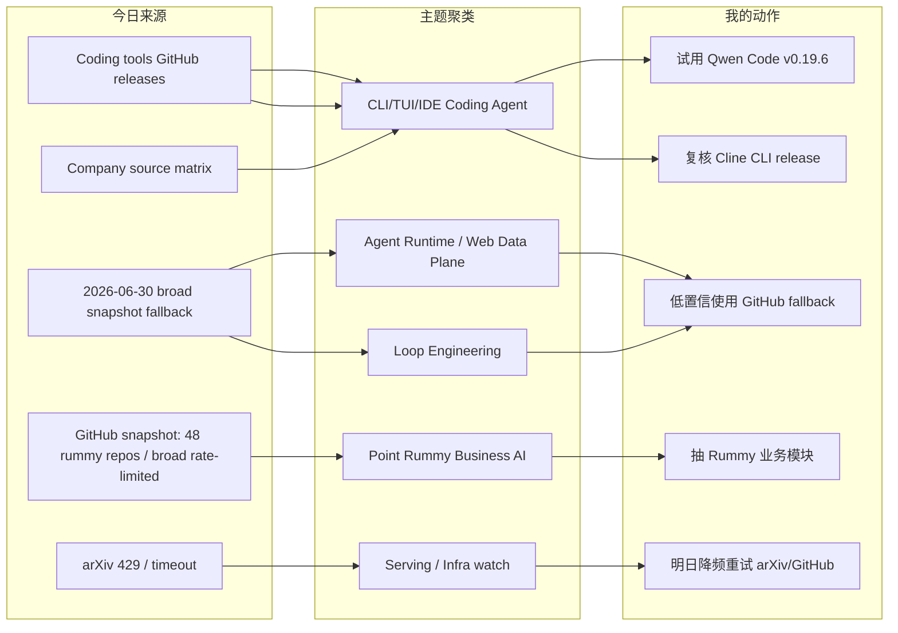
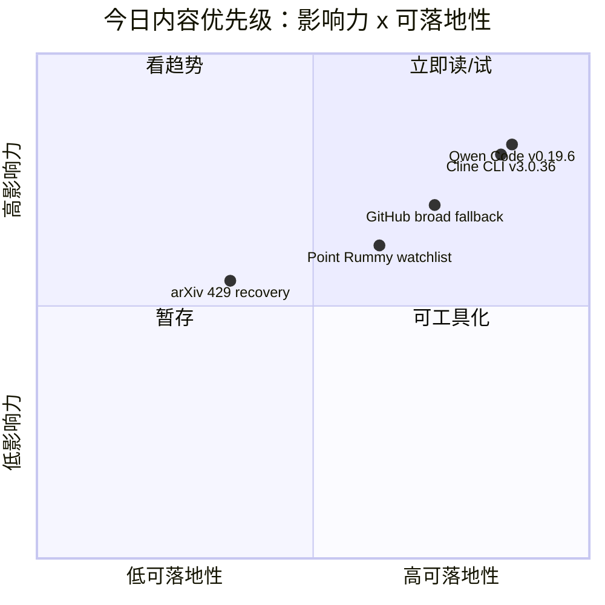

# AI Radar Daily - 2026-07-04

> 生成时间：2026-07-04 09:00 北京时间  
> 范围：AI Infra / LLM / RL / Agent / Eval / Serving / Training / 大厂博客 / 论文 / GitHub / Coding 工具  
> 说明：日报是导航入口；深度理解请进入 Obsidian 详情页。今日已保存 `Automation/state/github-stars-2026-07-04.json`。GitHub niche rummy 查询先成功 48 个 repo，随后 broader / loop 查询触发 `HTTP Error 403: rate limit exceeded`；因此通用 GitHub 高 star / 增长榜继续使用 2026-06-30 最近成功 broad snapshot fallback，并明确低置信。arXiv 今日 429/timeout，论文板块只保留低置信来源说明。

## 0. 今日结论

- 今日最值得关注：Coding 工具侧有明确新信号，Qwen Code 发布 `v0.19.6`，Cline 发布 `cli-v3.0.36`，说明 CLI/TUI/IDE agent 的执行入口继续融合。
- 对 AI Infra 的直接影响：GitHub broad search 今日被限流，通用榜单采用 2026-06-30 fallback；Agent runtime、web data plane、本地 serving、workflow platform 仍是可落地方向，但今天的 star 增长解释要低置信。
- 对 LLM 训练 / 推理 / Agent 的影响：开源 coding agent 迭代速度比大厂 changelog 更可见；建议把 Qwen Code / Cline CLI 放入同题 benchmark，对比 Codex / Claude Code 的权限、上下文、失败恢复。
- 对 RL / 游戏模型训练的影响：Point Rummy 今日命中 48 个 repo，但仍是低 star 工具型资产；可拆规则引擎、计分、服务端、视觉识别、RLCard/DQN baseline，而不是直接复用成熟算法。
- 建议今天深读：Qwen Code v0.19.6、Cline CLI v3.0.36、GitHub broad fallback 榜单、Point Rummy watchlist、论文源 rate-limit 记录。

## 1. 今日态势图

## 2. 必读卡片区

> [!important] Qwen Code v0.19.6：开源 coding agent CLI/TUI 今日继续迭代
> - 大类：Coding 工具 / AI Agent CLI
> - 小类：Open-source coding agent
> - 重点：GitHub Releases 显示 `v0.19.6`，发布于 2026-07-03T16:36:59Z。
> - 为什么重要：Qwen Code 是可本地观察的开源 coding-agent 对照组，适合对比 Codex / Claude Code 的权限模式、上下文管理、TUI 体验和失败恢复。
> - 详情：[[Industry/Tools/2026-07-04/qwen-code-v0-19-6-release-watch]] / [网页详情](https://github.com/dyt27666-oss/AI-news-report-obsidians/blob/main/Industry/Tools/2026-07-04/qwen-code-v0-19-6-release-watch.md) / [原文](https://github.com/QwenLM/qwen-code/releases/tag/v0.19.6)

> [!important] Cline CLI v3.0.36：IDE agent 正在向 CLI/remote workflow 扩展
> - 大类：Coding 工具 / AI Agent CLI
> - 小类：CLI / IDE agent / MCP
> - 重点：GitHub Releases 显示 `cli-v3.0.36`，发布于 2026-07-03T20:49:27Z。
> - 为什么重要：CLI 形态更容易进入 tmux、远程机器、CI 和多 agent 编排；适合复核权限、日志、MCP、workspace 隔离。
> - 详情：[[Industry/Tools/2026-07-04/cline-cli-v3-0-36-release-watch]] / [网页详情](https://github.com/dyt27666-oss/AI-news-report-obsidians/blob/main/Industry/Tools/2026-07-04/cline-cli-v3-0-36-release-watch.md) / [原文](https://github.com/cline/cline/releases/tag/cli-v3.0.36)

> [!tip] GitHub broad Top 10 fallback：Agent runtime 与 web data plane 仍是主线
> - 大类：GitHub
> - 小类：AI Infra / Agent Runtime
> - 重点：今日 broad 查询 403，使用 2026-06-30 broad snapshot fallback；Hermes Agent、Firecrawl、Ollama、Dify、Open WebUI 等仍是主线。
> - 为什么重要：这些项目决定 agent loop 的真实工程瓶颈：runtime、web data、local serving、workflow productization。
> - 详情：[[GitHub/2026-07-04/github-snapshot-top10]] / [网页详情](https://github.com/dyt27666-oss/AI-news-report-obsidians/blob/main/GitHub/2026-07-04/github-snapshot-top10.md) / [原文](https://github.com/search?q=topic%3Aartificial-intelligence+stars%3A%3E1000&type=repositories)

> [!tip] Point Rummy watchlist：今日 48 个 repo，但仍以低 star 工具型资产为主
> - 大类：GitHub / Business
> - 小类：Game AI / Rummy tooling
> - 重点：今日 snapshot 命中 48 个 rummy repo，覆盖规则库、计分、服务端、视觉助手、RLCard/DQN baseline。
> - 为什么重要：可拆出“规则/计分、视觉识别、服务端、用户数据分析、RL simulator”业务模块，不把低 star repo 误判成成熟算法资产。
> - 详情：[[Business/PointRummy/2026-07-04/point-rummy-github-watchlist]] / [网页详情](https://github.com/dyt27666-oss/AI-news-report-obsidians/blob/main/Business/PointRummy/2026-07-04/point-rummy-github-watchlist.md) / [原文](https://github.com/search?q=point+rummy&type=repositories)

## 3. 优先级矩阵

## 4. 分类清单

| 标签 | 大类 | 小类 | 标题 | 重点概括 | 为什么重要 | Obsidian 详情 | 网页详情 | 原文 |
|---|---|---|---|---|---|---|---|---|
| 必读 | Coding 工具 | Qwen Code | Qwen Code v0.19.6 | 开源 CLI/TUI coding agent 可见 release。 | 可直接做 Codex / Claude Code / Cline 的同题对照，观察权限、上下文和失败恢复。 | [[Industry/Tools/2026-07-04/qwen-code-v0-19-6-release-watch]] | [网页详情](https://github.com/dyt27666-oss/AI-news-report-obsidians/blob/main/Industry/Tools/2026-07-04/qwen-code-v0-19-6-release-watch.md) | [原文](https://github.com/QwenLM/qwen-code/releases/tag/v0.19.6) |
| 必读 | Coding 工具 | Cline CLI | Cline CLI v3.0.36 release watch | CLI release 表明 IDE agent 正在向命令行和 remote workflow 扩展。 | CLI 形态更适合 tmux、多 agent、CI、cron 和可脚本化评测。 | [[Industry/Tools/2026-07-04/cline-cli-v3-0-36-release-watch]] | [网页详情](https://github.com/dyt27666-oss/AI-news-report-obsidians/blob/main/Industry/Tools/2026-07-04/cline-cli-v3-0-36-release-watch.md) | [原文](https://github.com/cline/cline/releases/tag/cli-v3.0.36) |
| 可 skim | GitHub | Agent Runtime | GitHub broad Top 10 fallback | 使用 2026-06-30 broad snapshot。 | rate limit 下保留固定导航，但需要低置信解读。 | [[GitHub/2026-07-04/github-snapshot-top10]] | [网页详情](https://github.com/dyt27666-oss/AI-news-report-obsidians/blob/main/GitHub/2026-07-04/github-snapshot-top10.md) | [原文](https://github.com/search?q=topic%3Aartificial-intelligence&type=repositories) |
| 后续 | GitHub | Point Rummy | Rummy tooling watchlist | 今日主题池 48 个 repo，多数低 star。 | 可为规则、计分、视觉识别、服务端、分析面板、RLCard adapter 拆需求。 | [[Business/PointRummy/2026-07-04/point-rummy-github-watchlist]] | [网页详情](https://github.com/dyt27666-oss/AI-news-report-obsidians/blob/main/Business/PointRummy/2026-07-04/point-rummy-github-watchlist.md) | [原文](https://github.com/search?q=point+rummy&type=repositories) |
| 低置信 | 论文 | arXiv / Semantic Scholar | Paper source watch | arXiv 查询 429/timeout。 | 不伪造论文条目；明日降频重试 serving、agent eval、RL、world model、rummy。 | [[Papers/2026-07-04/paper-source-rate-limit-watch]] | [网页详情](https://github.com/dyt27666-oss/AI-news-report-obsidians/blob/main/Papers/2026-07-04/paper-source-rate-limit-watch.md) | [原文](https://export.arxiv.org/api/query) |

## 5. 大厂资讯 / 工程博客 / Research

### 5.1 公司来源扫描矩阵

| 公司/实验室 | 来源/栏目 | 今日状态 | 高相关条数 | 代表条目 | 备注 |
|---|---|---|---:|---|---|
| OpenAI | News / Research | 低置信 / 无高相关新项 | 0 | 无 | OpenAI Codex 在工具矩阵单独跟踪；未确认今日强相关 blog/research。 |
| Anthropic | News / Research / Engineering | 低置信 / 工具相关观察 | 0 | Claude Code watch | Claude Code release notes 继续观察 Claude Tag、permissions、context、remote execution。 |
| Google DeepMind | Blog / Research | 低置信 / 无高相关新项 | 0 | 无 | 未确认今日 AI Infra/RL 强相关单篇。 |
| Meta AI | Blog / Research | 低置信 / 无高相关新项 | 0 | 无 | 未确认今日强相关工程文章。 |
| NVIDIA | Technical Blog / AI | 访问失败 / 低置信 | 0 | 无 | 配置分类页历史上访问不稳定，需要改 RSS 或站内搜索。 |
| Microsoft | Research AI | 访问失败 / 低置信 | 0 | 无 | 页面历史上 403；未确认今日新项。 |
| Hugging Face | Blog / Papers / Releases | 低置信 / 无高相关新项 | 0 | 无 | 今日未确认强相关新项；继续观察 eval / inference / transformers release。 |
| 腾讯 | AI Lab / 技术博客 | 低置信 / 无高相关新项 | 0 | 无 | 保留固定扫描位。 |
| 字节 | Seed / 技术博客 / GitHub | 间接高相关 / fallback | 1 | DeerFlow | 使用 2026-06-30 broad snapshot fallback；非今日新增。 |
| SpaceAI | Blog / News | 低置信 / 弱相关 | 0 | 无 | 主线弱相关。 |

### 5.2 高相关大厂条目

| 标签 | 发布方/大厂 | 栏目/来源 | 标题 | 重点概括 | 工程/算法影响 | Obsidian 详情 | 网页详情 | 原文 |
|---|---|---|---|---|---|---|---|---|
| 必读 | Alibaba/Qwen | GitHub Release / Coding Agent | Qwen Code v0.19.6 | 开源 coding agent release。 | 可用于对比 Codex / Claude Code 的 CLI/TUI、权限和上下文策略。 | [[Industry/Tools/2026-07-04/qwen-code-v0-19-6-release-watch]] | [网页详情](https://github.com/dyt27666-oss/AI-news-report-obsidians/blob/main/Industry/Tools/2026-07-04/qwen-code-v0-19-6-release-watch.md) | [原文](https://github.com/QwenLM/qwen-code/releases/tag/v0.19.6) |
| 必读 | Cline | GitHub Release / CLI Agent | Cline CLI v3.0.36 | CLI 形态 release，IDE agent 能力向命令行延伸。 | 对 MCP、tool approval、remote/tmux workflow 有持续参考价值。 | [[Industry/Tools/2026-07-04/cline-cli-v3-0-36-release-watch]] | [网页详情](https://github.com/dyt27666-oss/AI-news-report-obsidians/blob/main/Industry/Tools/2026-07-04/cline-cli-v3-0-36-release-watch.md) | [原文](https://github.com/cline/cline/releases/tag/cli-v3.0.36) |
| 后续 | 字节 | GitHub / Agent Framework | DeerFlow | 使用 2026-06-30 broad snapshot fallback，long-horizon SuperAgent harness 仍值得跟踪。 | 对长任务编排、工具调用和 research/code/create workflow 有参考。 | [[GitHub/2026-07-04/github-growth-watch]] | [网页详情](https://github.com/dyt27666-oss/AI-news-report-obsidians/blob/main/GitHub/2026-07-04/github-growth-watch.md) | [原文](https://github.com/bytedance/deer-flow) |

## 6. GitHub 高 star Top 10

> 今日 GitHub broad search 触发 403 rate limit；本表使用 2026-06-30 成功 broad snapshot 作为 fallback。不是冷启动代理，但需低置信解读。

| 排名 | repo | stars | forks | language | updated_at | topics | 重点概括 | 是否值得试用 | Obsidian 详情 | 原文 |
|---:|---|---:|---:|---|---|---|---|---|---|---|
| 1 | affaan-m/ECC | 223700 | 34246 | JavaScript | 2026-06-30T10:52:04Z | ai-agents, anthropic, claude, claude-code, developer-tools, llm | Agent harness performance optimization system，skills / memory / security / research loop 信号强。 | 可 skim | [[GitHub/2026-07-04/github-snapshot-top10]] | [原文](https://github.com/affaan-m/ECC) |
| 2 | NousResearch/hermes-agent | 206100 | 37255 | Python | 2026-06-30T10:56:07Z | ai, ai-agent, ai-agents, anthropic, chatgpt, claude | 可生长 agent runtime，tools / skills / cron / memory 与本日报系统高度相关。 | 值得试用 | [[GitHub/2026-07-04/github-snapshot-top10]] | [原文](https://github.com/NousResearch/hermes-agent) |
| 3 | tensorflow/tensorflow | 195981 | 75210 | C++ | 2026-06-30T10:53:02Z | deep-learning, distributed, machine-learning, ml | 老牌 ML framework，训练栈和分布式生态仍需跟踪但今日非新信号。 | 可 skim | [[GitHub/2026-07-04/github-snapshot-top10]] | [原文](https://github.com/tensorflow/tensorflow) |
| 4 | Significant-Gravitas/AutoGPT | 185228 | 46116 | Python | 2026-06-30T10:49:43Z | agentic-ai, agents, ai, autonomous-agents | 早期 autonomous agent 生态代表，适合观察产品化和 agent UX。 | 可 skim | [[GitHub/2026-07-04/github-snapshot-top10]] | [原文](https://github.com/Significant-Gravitas/AutoGPT) |
| 5 | ollama/ollama | 175177 | 16771 | Go | 2026-06-30T10:55:05Z | deepseek, gemma, glm, golang | 本地模型 serving 入口，适合开发环境、测试和 edge LLM workflow。 | 值得试用 | [[GitHub/2026-07-04/github-snapshot-top10]] | [原文](https://github.com/ollama/ollama) |
| 6 | f/prompts.chat | 164555 | 21292 | HTML | 2026-06-30T10:24:59Z | ai, awesome-list, chatgpt, claude | Prompt 资源库，工程价值低于 runtime/serving，但可做 prompt pattern 参考。 | 可 skim | [[GitHub/2026-07-04/github-snapshot-top10]] | [原文](https://github.com/f/prompts.chat) |
| 7 | huggingface/transformers | 162049 | 33669 | Python | 2026-06-30T10:37:17Z | audio, deep-learning, transformers | 模型定义与推理/训练生态基础库，仍是模型工程必跟。 | 值得试用 | [[GitHub/2026-07-04/github-snapshot-top10]] | [原文](https://github.com/huggingface/transformers) |
| 8 | langflow-ai/langflow | 150233 | 9362 | Python | 2026-06-30T10:48:19Z | agents, generative-ai, large-language-models, multiagent | Agent/workflow 可视化平台，适合观察低代码 agent productization。 | 可 skim | [[GitHub/2026-07-04/github-snapshot-top10]] | [原文](https://github.com/langflow-ai/langflow) |
| 9 | langgenius/dify | 147098 | 23165 | TypeScript | 2026-06-30T10:50:44Z | agent, agentic-ai, agentic-workflow, ai | 生产级 agentic workflow 平台，RAG/agent app 落地相关。 | 值得试用 | [[GitHub/2026-07-04/github-snapshot-top10]] | [原文](https://github.com/langgenius/dify) |
| 10 | open-webui/open-webui | 143525 | 20689 | Python | 2026-06-30T10:40:48Z | ai, llm, llm-ui, mcp | Local/open model UI，MCP 与本地 serving 结合值得观察。 | 值得试用 | [[GitHub/2026-07-04/github-snapshot-top10]] | [原文](https://github.com/open-webui/open-webui) |

## 7. GitHub star 增长最快 Top 10

> 增长依据：使用历史 snapshot 差值；由于今日 broad 查询 rate-limited，本表沿用 2026-06-30 成功 broad snapshot 的增长结果作为 fallback，不是冷启动代理。

| 排名 | repo | stars_delta | stars | forks | language | updated_at | 增长依据 | 重点概括 | Obsidian 详情 | 原文 |
|---:|---|---:|---:|---:|---|---|---|---|---|---|
| 1 | NousResearch/hermes-agent | 4047 | 206100 | 37255 | Python | 2026-06-30T10:56:07Z | historical_snapshot / 2026-06-30 broad fallback | 可生长 agent runtime，长期自动化、skills、cron、memory 方向高信号。 | [[GitHub/2026-07-04/github-growth-watch]] | [原文](https://github.com/NousResearch/hermes-agent) |
| 2 | firecrawl/firecrawl | 3092 | 141808 | 8175 | TypeScript | 2026-06-30T10:49:38Z | historical_snapshot / 2026-06-30 broad fallback | Agent/RAG web data plane，搜索、抓取、结构化抽取。 | [[GitHub/2026-07-04/github-growth-watch]] | [原文](https://github.com/firecrawl/firecrawl) |
| 3 | affaan-m/ECC | 2505 | 223700 | 34246 | JavaScript | 2026-06-30T10:52:04Z | historical_snapshot / 2026-06-30 broad fallback | Agent harness performance optimization，skills/memory/security。 | [[GitHub/2026-07-04/github-growth-watch]] | [原文](https://github.com/affaan-m/ECC) |
| 4 | JuliusBrussee/caveman | 1541 | 78128 | 4417 | JavaScript | 2026-06-30T10:55:40Z | historical_snapshot / 2026-06-30 broad fallback | Claude Code token 压缩 skill，指向 context/cost engineering。 | [[GitHub/2026-07-04/github-growth-watch]] | [原文](https://github.com/JuliusBrussee/caveman) |
| 5 | TauricResearch/TradingAgents | 1540 | 89905 | 17352 | Python | 2026-06-30T10:50:25Z | historical_snapshot / 2026-06-30 broad fallback | Multi-agent framework，可作为多 agent 决策/评估结构参考。 | [[GitHub/2026-07-04/github-growth-watch]] | [原文](https://github.com/TauricResearch/TradingAgents) |
| 6 | kepano/obsidian-skills | 1124 | 38983 | 2763 | Unknown | 2026-06-30T10:56:21Z | historical_snapshot / 2026-06-30 broad fallback | Agent skills for Obsidian，和知识库/skills 工作流强相关。 | [[GitHub/2026-07-04/github-growth-watch]] | [原文](https://github.com/kepano/obsidian-skills) |
| 7 | bytedance/deer-flow | 1107 | 75552 | 10196 | Python | 2026-06-30T10:47:39Z | historical_snapshot / 2026-06-30 broad fallback | Long-horizon SuperAgent harness，research/code/create workflow。 | [[GitHub/2026-07-04/github-growth-watch]] | [原文](https://github.com/bytedance/deer-flow) |
| 8 | browser-use/browser-use | 1055 | 101571 | 11271 | Python | 2026-06-30T10:55:46Z | historical_snapshot / 2026-06-30 broad fallback | Browser automation for agents，web action loop 关键组件。 | [[GitHub/2026-07-04/github-growth-watch]] | [原文](https://github.com/browser-use/browser-use) |
| 9 | thedotmack/claude-mem | 1001 | 85137 | 7347 | JavaScript | 2026-06-30T10:46:16Z | historical_snapshot / 2026-06-30 broad fallback | Agent persistent context，适合对比 Hermes memory / skill。 | [[GitHub/2026-07-04/github-growth-watch]] | [原文](https://github.com/thedotmack/claude-mem) |
| 10 | omnigent-ai/omnigent | 875 | 5599 | 710 | Python | 2026-06-30T10:53:33Z | historical_snapshot / 2026-06-30 broad fallback | Meta-harness orchestrating Claude Code / Codex 等工具。 | [[GitHub/2026-07-04/github-growth-watch]] | [原文](https://github.com/omnigent-ai/omnigent) |

## 8. Coding 工具 / AI 工具功能更新

### 8.1 Coding 工具扫描矩阵

| 工具 | 厂商 | 来源类型 | 今日状态 | 代表更新 | 对我的影响 | 原文 |
|---|---|---|---|---|---|---|
| Claude Code | Anthropic | Changelog / Release Notes | 低置信 / 未确认今日新增 | 继续观察 Claude Tag、permissions、context、remote execution | 影响团队 agent workflow 与权限边界 | https://docs.anthropic.com/en/release-notes/claude-code |
| OpenAI Codex | OpenAI | Changelog / Docs | 低置信 / 未确认今日新增 | 继续观察 CLI/IDE、background mode、MCP、rate limits | 影响 Codex CLI 与 Hermes/Codex 多 agent 编排 | https://developers.openai.com/codex/changelog |
| Cursor | Cursor | Changelog | 低置信 / 未确认今日新增 | 继续观察 mobile/cloud agent/remote control | 影响远程 agent 监控和任务接力 | https://cursor.com/changelog |
| Windsurf | Windsurf | Changelog | 低置信 / 未确认今日新增 | 继续观察 Agent Command Center / Devin Docs / ACP | 影响 IDE 内 agent 编排和远程任务控制 | https://windsurf.com/changelog |
| GitHub Copilot | GitHub | Changelog / Blog | 低置信 / 未确认今日新增 | 继续观察 agent mode、terminal interface、pricing | 影响企业 IDE agent 标准形态 | https://github.blog/changelog/label/copilot/ |
| Gemini Code Assist | Google | Release Notes | 低置信 / 未确认今日新增 | 继续观察企业 IDE 集成和 policy controls | 影响 Google 生态 coding assistant 落地 | https://cloud.google.com/gemini/docs/codeassist/release-notes |
| Qwen Code | Alibaba/Qwen | GitHub Releases | 有今日 release | `v0.19.6`，2026-07-03T16:36:59Z | 开源 CLI/TUI agent 对照试用 | https://github.com/QwenLM/qwen-code/releases/tag/v0.19.6 |
| Roo Code | Roo Code | GitHub Releases | 无今日新 release | 最新页显示 `v3.54.0` | VS Code agent extension 继续观察 | https://github.com/RooCodeInc/Roo-Code/releases/tag/v3.54.0 |
| Cline | Cline | GitHub Releases | 有今日 release | `cli-v3.0.36`，2026-07-03T20:49:27Z | CLI/IDE 双形态 agent loop 值得加入评测 | https://github.com/cline/cline/releases/tag/cli-v3.0.36 |
| Continue | Continue | GitHub Releases | 无今日新 release | 最新可见 `v2.0.0-vscode` | IDE extension 观察，今日无明确新功能 | https://github.com/continuedev/continue/releases/tag/v2.0.0-vscode |

### 8.2 高相关工具更新

| 标签 | 工具/厂商 | 来源类型 | 标题/功能 | 重点概括 | 对 AI coding 工作流的影响 | Obsidian 详情 | 网页详情 | 原文 |
|---|---|---|---|---|---|---|---|---|
| 必读 | Qwen Code / Alibaba | GitHub Release | v0.19.6 | 开源 CLI/TUI coding agent 7/3 UTC release。 | 适合对照 Codex/Claude Code 的 CLI/TUI、权限和上下文策略。 | [[Industry/Tools/2026-07-04/qwen-code-v0-19-6-release-watch]] | [网页详情](https://github.com/dyt27666-oss/AI-news-report-obsidians/blob/main/Industry/Tools/2026-07-04/qwen-code-v0-19-6-release-watch.md) | [原文](https://github.com/QwenLM/qwen-code/releases/tag/v0.19.6) |
| 必读 | Cline | GitHub Release | cli-v3.0.36 | Cline CLI 形态可见 release。 | CLI/IDE 双形态对 remote、tmux、CI、多 agent workflow 更关键。 | [[Industry/Tools/2026-07-04/cline-cli-v3-0-36-release-watch]] | [网页详情](https://github.com/dyt27666-oss/AI-news-report-obsidians/blob/main/Industry/Tools/2026-07-04/cline-cli-v3-0-36-release-watch.md) | [原文](https://github.com/cline/cline/releases/tag/cli-v3.0.36) |
| 可 skim | OpenAI Codex | Changelog / Docs | Codex changelog watch | 今日未确认新增。 | 继续观察 background mode、CLI/IDE、MCP 与 rate limits。 | [[Industry/Tools/2026-07-04/coding-tools-update-matrix]] | [网页详情](https://github.com/dyt27666-oss/AI-news-report-obsidians/blob/main/Industry/Tools/2026-07-04/coding-tools-update-matrix.md) | [原文](https://developers.openai.com/codex/changelog) |

## 9. Point Rummy / Indian Rummy 业务主题

> 今日 GitHub 主题池命中 48 个 repo；整体 star 很低，增长多为 0 或无法计算，所以按业务可用性而不是热度排序。论文源 429/timeout，论文/资料候选低置信。

### 9.1 GitHub 候选

| 标签 | repo | stars | forks | language | updated_at | 重点概括 | 业务可用性 | Obsidian 详情 | 原文 |
|---|---|---:|---:|---|---|---|---|---|---|
| 后续 | mudont/indian-rummy | 5 | 0 | TypeScript | 2025-08-08T21:05:04Z | TypeScript library for Indian Rummy。 | 规则建模 API 参考；需复核 license / tests。 | [[Business/PointRummy/2026-07-04/point-rummy-github-watchlist]] | [原文](https://github.com/mudont/indian-rummy) |
| 后续 | Mohitkumar-559/RummyServer | 2 | 1 | JavaScript | 2024-03-17T03:48:34Z | Deal rummy / point rummy game server。 | 服务端状态流参考；需重写协议和规则校验。 | [[Business/PointRummy/2026-07-04/point-rummy-github-watchlist]] | [原文](https://github.com/Mohitkumar-559/RummyServer) |
| 后续 | Alan-seb/RummyVision | 1 | 0 | Python | 2025-12-03T03:14:55Z | Computer vision + Monte Carlo discard suggestions。 | 视觉助手 / 策略提示方向参考，需严格复核可运行性。 | [[Business/PointRummy/2026-07-04/point-rummy-github-watchlist]] | [原文](https://github.com/Alan-seb/RummyVision) |
| 后续 | RamSundarRadhakrishnan/IndianRummyRLCard | 0 | 0 | Jupyter Notebook | 2025-09-26T13:19:13Z | RLCard + DQN agent for Indian Rummy。 | 算法方向相关，需验证环境定义和训练脚本。 | [[Business/PointRummy/2026-07-04/point-rummy-github-watchlist]] | [原文](https://github.com/RamSundarRadhakrishnan/IndianRummyRLCard) |
| 后续 | vdesmond/IRumAI | 0 | 0 | Python | 2026-05-23T17:04:28Z | Reinforcement learning agent for Indian Rummy。 | RL baseline 候选，需复核状态/动作/奖励设计。 | [[Business/PointRummy/2026-07-04/point-rummy-github-watchlist]] | [原文](https://github.com/vdesmond/IRumAI) |
| 可 skim | debabrata-mandal/RummyPulse | 1 | 0 | Java | 2026-06-28T09:58:44Z | Android score tracking、GST、monthly reports、Firebase。 | 用户数据分析 / 运营报表参考。 | [[Business/PointRummy/2026-07-04/point-rummy-github-watchlist]] | [原文](https://github.com/debabrata-mandal/RummyPulse) |

### 9.2 论文 / 资料候选

| 标签 | 来源 | 标题 | 作者/机构 | 重点概括 | 对 Point Rummy 业务有什么用 | Obsidian 详情 | 原文 |
|---|---|---|---|---|---|---|---|
| 低置信 | arXiv / Semantic Scholar | Rummy imperfect information / MCTS / RL 查询 | 未取得 | API 429/timeout，未取得可靠新论文。 | 不据此做方向判断；明日降频重试。 | [[Papers/2026-07-04/paper-source-rate-limit-watch]] | [原文](https://export.arxiv.org/api/query) |
| 后续 | GitHub | IndianRummyRLCard / IRumAI | RamSundarRadhakrishnan / vdesmond | RLCard、DQN、reinforcement learning agent 方向描述。 | 可拆出 observation/action/reward/schema 检查表，但需复核代码。 | [[Business/PointRummy/2026-07-04/point-rummy-github-watchlist]] | [原文](https://github.com/RamSundarRadhakrishnan/IndianRummyRLCard) |

### 9.3 业务可用性判断

| 方向 | 今日信号 | 可用性 | 下一步 |
|---|---|---|---|
| 规则引擎 / 计分 | 多个 library / scoreboard / point counter repo | 中低：适合抽测试样例，不适合直接复用 | 写 meld/scoring/drop/dealer rotation 的单元测试清单 |
| Bot / RL Agent | IRumAI / IndianRummyRLCard / RummyVision | 低到中：算法成熟度不明 | 先实现 random/heuristic/ISMCTS baseline，再决定是否接 RL |
| 仿真 / 评测 | RummyServer / Pygame / Browser game repo | 中低：服务端状态流可参考 | 设计统一 Gym/RLCard adapter 和 replay schema |

## 10. Loop Engineer / Loop Engineering 主题

> 今日 loop 查询被 GitHub rate limit；以下使用 2026-06-30 成功 snapshot fallback。不是冷启动代理。严格主题过滤后不足 10 条，原因是 API 失败 + 主题池较窄。

### 10.1 Loop Engineer GitHub 高 star Top 10

| 排名 | repo | stars | forks | language | updated_at | topics | 重点概括 | 是否值得试用 | Obsidian 详情 | 原文 |
|---:|---|---:|---:|---|---|---|---|---|---|---|
| 1 | dair-ai/Prompt-Engineering-Guide | 76088 | 8331 | MDX | 2026-06-30T09:43:12Z | agent, agents, ai-agents, generative-ai | Prompt/context engineering 资料库，可作为 loop engineering 概念索引。 | 可 skim | [[GitHub/LoopEngineer/2026-07-04/loop-engineer-watchlist]] | [原文](https://github.com/dair-ai/Prompt-Engineering-Guide) |
| 2 | cobusgreyling/loop-engineering | 4244 | 553 | JavaScript | 2026-06-30T10:55:21Z | agentic-ai, ai-agents, ai-coding, claude | Practical loop engineering patterns / CLI / starters。 | 值得试用 | [[GitHub/LoopEngineer/2026-07-04/loop-engineer-watchlist]] | [原文](https://github.com/cobusgreyling/loop-engineering) |
| 3 | thesongzhu/Friday | 918 | 117 | TypeScript | 2026-06-30T10:46:46Z | agent-orchestration, approval-first, automation | Private control plane for AI agents。 | 值得试用 | [[GitHub/LoopEngineer/2026-07-04/loop-engineer-watchlist]] | [原文](https://github.com/thesongzhu/Friday) |

### 10.2 Loop Engineer GitHub star 增长最快 Top 10

| 排名 | repo | stars_delta | stars | forks | language | updated_at | 增长依据 | 重点概括 | Obsidian 详情 | 原文 |
|---:|---|---:|---:|---:|---|---|---|---|---|---|
| 1 | dair-ai/Prompt-Engineering-Guide | 135 | 76088 | 8331 | MDX | 2026-06-30T09:43:12Z | historical_snapshot / 2026-06-30 broad fallback | Prompt/context engineering 资料库。 | [[GitHub/LoopEngineer/2026-07-04/loop-engineer-watchlist]] | [原文](https://github.com/dair-ai/Prompt-Engineering-Guide) |
| 2 | thesongzhu/Friday | 1 | 918 | 117 | TypeScript | 2026-06-30T10:46:46Z | historical_snapshot / 2026-06-30 broad fallback | Agent control plane。 | [[GitHub/LoopEngineer/2026-07-04/loop-engineer-watchlist]] | [原文](https://github.com/thesongzhu/Friday) |
| 3 | cobusgreyling/loop-engineering | None | 4244 | 553 | JavaScript | 2026-06-30T10:55:21Z | historical_snapshot / 2026-06-30 broad fallback | Loop engineering patterns / starters / CLI。 | [[GitHub/LoopEngineer/2026-07-04/loop-engineer-watchlist]] | [原文](https://github.com/cobusgreyling/loop-engineering) |

### 10.3 Loop Engineering 方法信号

| 标签 | 来源 | 标题 | 重点概括 | 对 AI coding 工作流的影响 | Obsidian 详情 | 原文 |
|---|---|---|---|---|---|---|
| 必读 | Coding Tools | Qwen Code / Cline CLI release cadence | 开源 CLI 与 IDE/CLI agent 高频发布。 | 适合把“权限、上下文、工具调用、回滚、评测”写成统一 harness。 | [[Industry/Tools/2026-07-04/coding-tools-update-matrix]] | [原文](https://github.com/QwenLM/qwen-code/releases) |
| 可 skim | GitHub | Loop engineering fallback watchlist | 使用历史 snapshot 保留 loop engineering 观察。 | 关注 context engineering、AGENTS.md、skills、eval loop 与 multi-agent orchestration。 | [[GitHub/LoopEngineer/2026-07-04/loop-engineer-watchlist]] | [原文](https://github.com/cobusgreyling/loop-engineering) |

## 11. 论文

### 11.1 Serving / Agent Eval / RL / World Model / Rummy

| 标签 | 论文来源 | 论文 | 作者/机构 | 重点概括 | 工程/研究价值 | Obsidian 详情 | 网页详情 | PDF/原文 |
|---|---|---|---|---|---|---|---|---|
| 低置信 | arXiv / 预印本 API | 今日 arXiv source watch | 未取得 | `LLM serving` 返回 429；`agent evaluation` 返回 429；`reinforcement learning language models`、`world model reinforcement learning`、`indian rummy reinforcement learning` timeout。 | 不伪造论文；明日降频重试，优先 serving / agent eval / rummy。 | [[Papers/2026-07-04/paper-source-rate-limit-watch]] | [网页详情](https://github.com/dyt27666-oss/AI-news-report-obsidians/blob/main/Papers/2026-07-04/paper-source-rate-limit-watch.md) | [原文](https://export.arxiv.org/api/query) |

## 12. 资讯 / 其他 GitHub 项目

### 12.1 Agent Runtime / Web Data Plane

| 标签 | 来源 | 标题 | 重点概括 | 对我有什么用 | Obsidian 详情 | 网页详情 | 原文 |
|---|---|---|---|---|---|---|---|
| 必读 | GitHub | Hermes Agent | 可生长 agent runtime，tools、skills、cron、memory 支撑长期自动研究与知识库写入。 | 对自动研究、skills、cron、Obsidian 工作流有直接参考。 | [[GitHub/2026-07-04/github-growth-watch]] | [网页详情](https://github.com/dyt27666-oss/AI-news-report-obsidians/blob/main/GitHub/2026-07-04/github-growth-watch.md) | [原文](https://github.com/NousResearch/hermes-agent) |
| 必读 | GitHub | Firecrawl | Agent/RAG web data plane，适合 search/scrape/structured extraction。 | 提升研究抓取与结构化抽取质量。 | [[GitHub/2026-07-04/github-growth-watch]] | [网页详情](https://github.com/dyt27666-oss/AI-news-report-obsidians/blob/main/GitHub/2026-07-04/github-growth-watch.md) | [原文](https://github.com/firecrawl/firecrawl) |
| 可 skim | GitHub | vLLM / Ollama / Dify / Open WebUI | serving 和 agent app 基础设施稳定主线。 | 继续跟踪 scheduler/KV cache/local serving/agent productization。 | [[GitHub/2026-07-04/github-snapshot-top10]] | [网页详情](https://github.com/dyt27666-oss/AI-news-report-obsidians/blob/main/GitHub/2026-07-04/github-snapshot-top10.md) | [原文](https://github.com/vllm-project/vllm) |

## 13. 按主题索引

### AI Infra / Serving / Training

- [[GitHub/2026-07-04/github-snapshot-top10]] - AI Infra / serving / agent platform fallback 榜单。
- [[Papers/2026-07-04/paper-source-rate-limit-watch]] - arXiv rate limit 和明日重试队列。

### LLM / Agent / RAG / Evaluation

- [[Industry/Tools/2026-07-04/qwen-code-v0-19-6-release-watch]] - 开源 coding agent CLI/TUI。
- [[Industry/Tools/2026-07-04/cline-cli-v3-0-36-release-watch]] - CLI / IDE agent release watch。
- [[Industry/Tools/2026-07-04/coding-tools-update-matrix]] - Codex、Claude、Cursor、Copilot、Gemini、Qwen、Cline 等工具矩阵。

### RL / Game AI / World Model

- [[Business/PointRummy/2026-07-04/point-rummy-github-watchlist]] - Rummy tooling / CV assistant / RLCard / server watchlist。

### Point Rummy / Indian Rummy

- [[Business/PointRummy/2026-07-04/point-rummy-github-watchlist]] - 业务主题主入口。

### Loop Engineer / Coding Agent Loop

- [[GitHub/LoopEngineer/2026-07-04/loop-engineer-watchlist]] - loop engineering fallback watchlist。
- [[Industry/Tools/2026-07-04/coding-tools-update-matrix]] - coding agent release / changelog / pricing/rate-limit 扫描矩阵。

### 公司 / 实验室

- OpenAI / Anthropic / DeepMind / Meta / NVIDIA / Microsoft / Hugging Face / 腾讯 / 字节 / SpaceAI：[[Industry/2026-07-04/company-source-scan-matrix]]

### 大牛 / 作者

- 今日无可靠新作者信号；论文源 rate-limited。

## 14. 值得后续深挖

| 标签 | 大类 | 小类 | 标题 | 后续动作 | Obsidian 详情 | 原文 |
|---|---|---|---|---|---|---|
| 必读 | Coding 工具 | Qwen Code | v0.19.6 CLI/TUI | 沙盒试用权限、上下文、工具调用、失败恢复。 | [[Industry/Tools/2026-07-04/qwen-code-v0-19-6-release-watch]] | [原文](https://github.com/QwenLM/qwen-code/releases/tag/v0.19.6) |
| 必读 | Coding 工具 | Cline CLI | cli-v3.0.36 | 复核 release diff，抽 CLI、MCP、approval、日志变化。 | [[Industry/Tools/2026-07-04/cline-cli-v3-0-36-release-watch]] | [原文](https://github.com/cline/cline/releases/tag/cli-v3.0.36) |
| 后续 | Business | Point Rummy | Vision / scoring / server / RLCard | 抽象 rules + observation + action + reward schema。 | [[Business/PointRummy/2026-07-04/point-rummy-github-watchlist]] | [原文](https://github.com/vdesmond/IRumAI) |
| 后续 | Agent Workflow | Loop Engineering | AGENTS.md / skills / eval loop | 将 repeatable agent loop 写入 checklist。 | [[GitHub/LoopEngineer/2026-07-04/loop-engineer-watchlist]] | [原文](https://github.com/cobusgreyling/loop-engineering) |
| 低置信 | 论文 | API recovery | arXiv / Semantic Scholar | 明日重试，必要时降频并减少并发。 | [[Papers/2026-07-04/paper-source-rate-limit-watch]] | [原文](https://export.arxiv.org/api/query) |

## 15. 采集失败或低置信来源

- GitHub broad / loop queries：今日在 niche rummy queries 后触发 `HTTP Error 403: rate limit exceeded`；snapshot 文件已保存，但通用高 star / 增长榜使用 2026-06-30 broad snapshot fallback。
- arXiv：测试查询返回 `HTTP Error 429` 或 timeout，包括 serving、agent eval、RL、world model、rummy；今日不伪造论文条目。
- blogwatcher-cli：当前环境 `command not found`，因此无法用本地 RSS 数据库补充公司博客；已在矩阵中标注低置信。
- OpenAI / Anthropic / DeepMind / Meta / NVIDIA / Microsoft / Hugging Face / 腾讯 / 字节 / SpaceAI：固定矩阵保留，未确认今日强相关 blog/research。
- SpaceAI：弱相关 / 低置信。

## 16. 归档标签

#ai-radar #daily #ai-infra #llm #rl #point-rummy #loop-engineering
