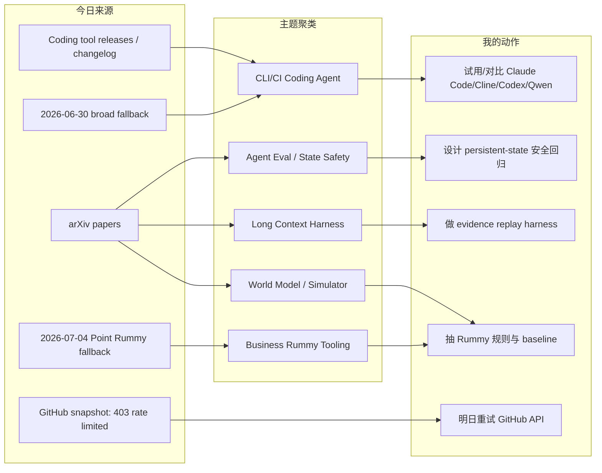
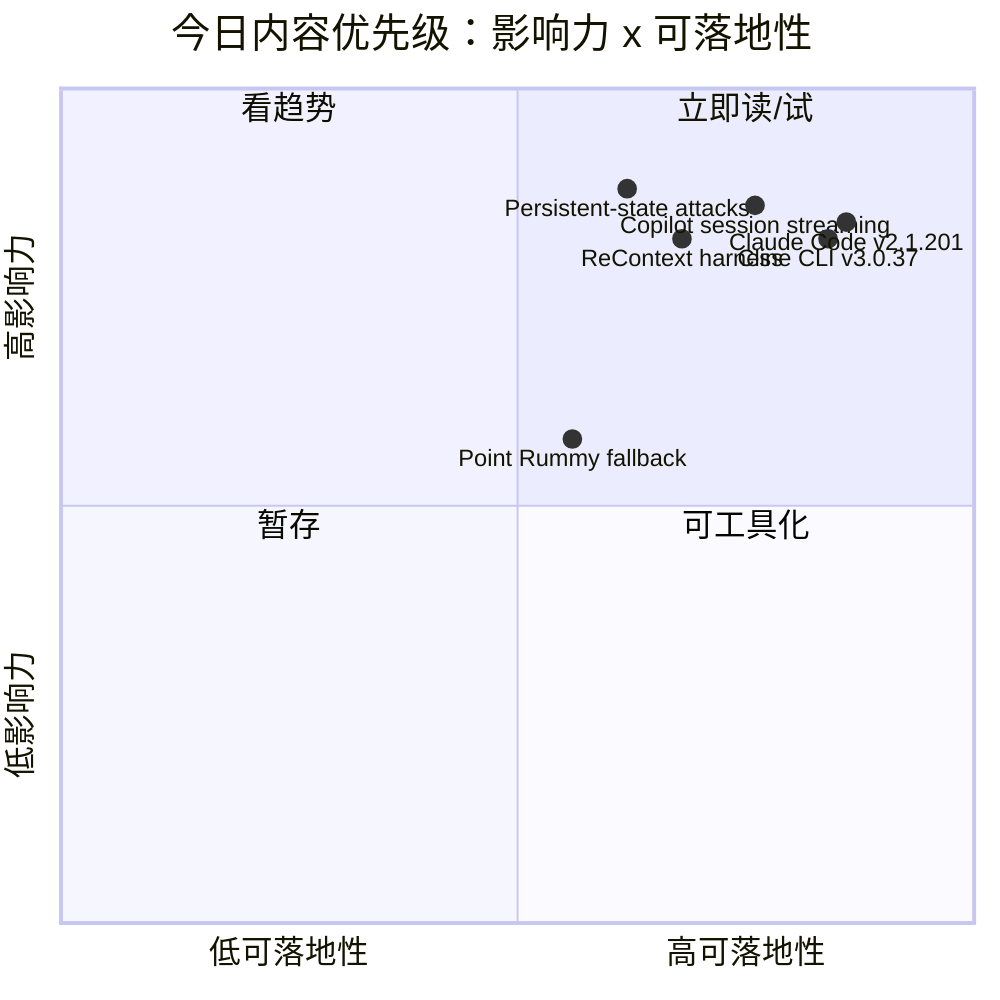

# AI Radar Daily - 2026-07-05

> 生成时间：2026-07-05 09:01 北京时间  
> 范围：AI Infra / LLM / RL / Agent / Eval / Serving / Training / 大厂博客 / 论文 / GitHub / Coding 工具  
> 说明：日报是导航入口；深度理解请进入 Obsidian 详情页。今日已运行 `Automation/collect_github_stars.py` 并保存 `Automation/state/github-stars-2026-07-05.json`。GitHub API 今日从第一个查询开始触发 `HTTP Error 403: rate limit exceeded`，因此通用 GitHub 高 star / 增长榜使用 2026-06-30 最近成功 broad snapshot fallback；Point Rummy 使用 2026-07-04 主题 snapshot fallback。论文源今日可用，已保留 3 篇高相关 arXiv 论文。

## 0. 今日结论

- 今日最值得关注：Claude Code `v2.1.201`、Cline CLI `cli-v3.0.37`、GitHub Copilot agent session streaming 三个信号共同指向“coding agent 从 IDE 聊天走向 CLI/CI/可观测 session”。
- 对 AI Infra 的直接影响：agent runtime 需要像服务一样管理版本、权限、日志、workspace 隔离和回放；GitHub broad 榜单因 API 403 使用 fallback，热度解释必须低置信。
- 对 LLM 训练 / 推理 / Agent 的影响：ReContext、persistent-state attack 两篇 arXiv 论文都在强调 harness / eval / state，不是单纯模型能力；适合沉淀长上下文和多轮 coding-agent 回归测试。
- 对 RL / 游戏模型训练的影响：WorldDirector 的 persistent dynamic memory 对可控 world simulator 有参考；Point Rummy 今日无新 GitHub 数据，继续拆规则、计分、视觉、RL baseline 四类资产。
- 建议今天深读：Claude Code v2.1.201、Cline CLI v3.0.37、GitHub Copilot agent session streaming、Distributed Attacks in Persistent-State AI Control、ReContext。

## 1. 今日态势图

## 2. 必读卡片区

> [!important] Claude Code v2.1.201：coding-agent CLI 标杆继续高频迭代
> - 大类：Coding 工具 / AI Agent CLI
> - 小类：Claude Code / Anthropic
> - 重点：GitHub release 显示 `v2.1.201`，发布于 2026-07-03T23:50:35Z。
> - 为什么重要：Claude Code 是 CLI/TUI coding agent 的重要对照组，适合跟 Codex、Qwen Code、Cline 比较权限、上下文、日志和远程执行。
> - 详情：[[Industry/Tools/2026-07-05/claude-code-v2-1-201-release-watch]] / [网页详情](https://github.com/dyt27666-oss/AI-news-report-obsidians/blob/main/Industry/Tools/2026-07-05/claude-code-v2-1-201-release-watch.md) / [原文](https://github.com/anthropics/claude-code/releases/tag/v2.1.201)

> [!important] Cline CLI v3.0.37：IDE agent 向命令行和远程工作流扩展
> - 大类：Coding 工具 / AI Agent CLI
> - 小类：CLI / IDE agent / MCP
> - 重点：GitHub release 显示 `cli-v3.0.37`，发布于 2026-07-04T02:36:24Z。
> - 为什么重要：CLI 形态更容易进入 tmux、CI、远程机器和多 agent 编排，是衡量 agent 工程化的关键入口。
> - 详情：[[Industry/Tools/2026-07-05/cline-cli-v3-0-37-release-watch]] / [网页详情](https://github.com/dyt27666-oss/AI-news-report-obsidians/blob/main/Industry/Tools/2026-07-05/cline-cli-v3-0-37-release-watch.md) / [原文](https://github.com/cline/cline/releases/tag/cli-v3.0.37)

> [!important] GitHub Copilot agent session streaming：企业 agent 的可观测性信号
> - 大类：Coding 工具 / AI Agent Platform
> - 小类：GitHub Copilot / Session Streaming / CI
> - 重点：7/2 changelog 同时出现 agent session streaming public preview 与 Copilot CLI in Actions 免 PAT。
> - 为什么重要：企业落地 coding agent 需要 session trace、审计、权限和 CI 入口；这比单次生成能力更影响真实工程流程。
> - 详情：[[Industry/Tools/2026-07-05/github-copilot-agent-session-streaming]] / [网页详情](https://github.com/dyt27666-oss/AI-news-report-obsidians/blob/main/Industry/Tools/2026-07-05/github-copilot-agent-session-streaming.md) / [原文](https://github.blog/changelog/2026-07-02-copilot-agent-session-streaming-is-now-in-public-preview)

> [!tip] Distributed Attacks in Persistent-State AI Control：coding agent 安全不再是单轮 prompt 问题
> - 大类：论文
> - 小类：Agent Eval / Coding Agent Safety
> - 重点：论文讨论持久状态 AI control 中跨 session、跨代码库的分布式攻击面。
> - 为什么重要：多轮 coding agent 会持续修改同一 repo，安全评估必须覆盖状态残留、延迟触发、审计日志和回滚。
> - 详情：[[Papers/2026-07-05/distributed-attacks-persistent-state-ai-control]] / [网页详情](https://github.com/dyt27666-oss/AI-news-report-obsidians/blob/main/Papers/2026-07-05/distributed-attacks-persistent-state-ai-control.md) / [原文](https://arxiv.org/abs/2607.02514v1)

## 3. 优先级矩阵

## 4. 分类清单

| 标签 | 大类 | 小类 | 标题 | 重点概括 | 为什么重要 | Obsidian 详情 | 网页详情 | 原文 |
|---|---|---|---|---|---|---|---|---|
| 必读 | Coding 工具 | Claude Code | Claude Code v2.1.201 | Anthropic 官方 GitHub release，CLI coding agent 高频迭代。 | 影响权限、上下文、远程执行、日志和多 agent harness。 | [[Industry/Tools/2026-07-05/claude-code-v2-1-201-release-watch]] | [网页详情](https://github.com/dyt27666-oss/AI-news-report-obsidians/blob/main/Industry/Tools/2026-07-05/claude-code-v2-1-201-release-watch.md) | [原文](https://github.com/anthropics/claude-code/releases/tag/v2.1.201) |
| 必读 | Coding 工具 | Cline CLI | Cline CLI v3.0.37 | Cline CLI 7/4 UTC release。 | IDE agent 继续向 CLI/remote workflow 迁移，适合纳入同题 benchmark。 | [[Industry/Tools/2026-07-05/cline-cli-v3-0-37-release-watch]] | [网页详情](https://github.com/dyt27666-oss/AI-news-report-obsidians/blob/main/Industry/Tools/2026-07-05/cline-cli-v3-0-37-release-watch.md) | [原文](https://github.com/cline/cline/releases/tag/cli-v3.0.37) |
| 必读 | Coding 工具 | GitHub Copilot | Agent session streaming public preview | Copilot agent session streaming 与 Actions 认证更新。 | 企业 agent 需要过程可观测、权限可审计、CI 可接入。 | [[Industry/Tools/2026-07-05/github-copilot-agent-session-streaming]] | [网页详情](https://github.com/dyt27666-oss/AI-news-report-obsidians/blob/main/Industry/Tools/2026-07-05/github-copilot-agent-session-streaming.md) | [原文](https://github.blog/changelog/2026-07-02-copilot-agent-session-streaming-is-now-in-public-preview) |
| 必读 | 论文 | Agent Eval | Distributed Attacks in Persistent-State AI Control | 持久状态 AI control 的分布式攻击面。 | coding agent 跨 session 改代码，安全评估必须有状态隔离和回放。 | [[Papers/2026-07-05/distributed-attacks-persistent-state-ai-control]] | [网页详情](https://github.com/dyt27666-oss/AI-news-report-obsidians/blob/main/Papers/2026-07-05/distributed-attacks-persistent-state-ai-control.md) | [原文](https://arxiv.org/abs/2607.02514v1) |
| 必读 | 论文 | Long Context Harness | ReContext | Recursive evidence replay 作为长上下文推理 harness。 | 可转成 agent 长上下文 eval：检查答案是否真的使用证据。 | [[Papers/2026-07-05/recontext-recursive-evidence-replay]] | [网页详情](https://github.com/dyt27666-oss/AI-news-report-obsidians/blob/main/Papers/2026-07-05/recontext-recursive-evidence-replay.md) | [原文](https://arxiv.org/abs/2607.02509v1) |
| 可 skim | GitHub | AI Infra / Agent Runtime | GitHub broad Top 10 fallback | 使用 2026-06-30 broad snapshot；今日 API 403。 | 保留固定导航，但不把 fallback 当今日真实增长。 | [[GitHub/2026-07-05/github-snapshot-top10-fallback]] | [网页详情](https://github.com/dyt27666-oss/AI-news-report-obsidians/blob/main/GitHub/2026-07-05/github-snapshot-top10-fallback.md) | [原文](https://github.com/search?q=topic%3Aartificial-intelligence&type=repositories) |
| 后续 | GitHub / Business | Point Rummy | Point Rummy fallback watchlist | 今日查询 403，沿用 7/4 的 48 个 rummy repo。 | 继续拆规则、计分、视觉、RL baseline，不误判为成熟资产。 | [[Business/PointRummy/2026-07-05/point-rummy-github-watchlist]] | [网页详情](https://github.com/dyt27666-oss/AI-news-report-obsidians/blob/main/Business/PointRummy/2026-07-05/point-rummy-github-watchlist.md) | [原文](https://github.com/search?q=point+rummy&type=repositories) |

## 5. 大厂资讯 / 工程博客 / Research

### 5.1 公司来源扫描矩阵

| 公司/实验室 | 来源/栏目 | 今日状态 | 高相关条数 | 代表条目 | 备注 |
|---|---|---|---:|---|---|
| OpenAI | News / Research / Codex | 低置信 / 无今日新 blog；Codex release 7/1 | 0 | Codex rust-v0.142.5（非今日） | RSS 最新 6/30 多为 adoption/GeneBench/core dump；Codex changelog 未确认今日新增。 |
| Anthropic | News / Research / Claude Code | 有高相关工具 release | 1 | Claude Code v2.1.201 | 发布方/大厂：Anthropic；来源类型：GitHub Release / Changelog。 |
| Google DeepMind | Blog / Research | 低置信 / 弱相关 | 1 | A24 research partnership | 7/3 条目偏创意/视频研究，弱于 AI Infra；Nano Banana/Gemini Omni Flash 6/30 保留观察。 |
| Meta AI | Blog / Research | 低置信 / 无高相关新项 | 0 | 无 | 未确认今日 AI Infra/RL 强相关工程文章。 |
| NVIDIA | Technical Blog / AI | RSS 可访问 / 未解析到今日高相关 item | 0 | 无 | Atom feed 可访问；今日未抽到强相关 serving/training 新项。 |
| Microsoft | Research AI | 低置信 / 访问不稳定 | 0 | 无 | 页面历史上 403；今日未确认强相关新项。 |
| Hugging Face | Blog / Papers / Releases | 有近日本周高相关 | 2 | ScarfBench / Every Eval Ever | 6/30 ScarfBench 与 eval 展示对 agent eval 有价值；非今日发布。 |
| 腾讯 | AI Lab / 技术博客 | 低置信 / 无高相关新项 | 0 | 无 | 保留固定扫描位；未确认今日新项。 |
| 字节 | Seed / 技术博客 / GitHub | 间接高相关 / fallback | 1 | DeerFlow | 使用 2026-06-30 broad snapshot fallback；非今日新增。 |
| SpaceAI | Blog / News | 低置信 / 弱相关 | 0 | 无 | 主线弱相关，保留固定扫描位。 |

### 5.2 高相关大厂条目

| 标签 | 发布方/大厂 | 栏目/来源 | 标题 | 重点概括 | 工程/算法影响 | Obsidian 详情 | 网页详情 | 原文 |
|---|---|---|---|---|---|---|---|---|
| 必读 | Anthropic | GitHub Release / Coding Agent | Claude Code v2.1.201 | CLI coding agent 高频 release。 | 对权限、上下文、远程执行和 tmux 多 agent workflow 有直接影响。 | [[Industry/Tools/2026-07-05/claude-code-v2-1-201-release-watch]] | [网页详情](https://github.com/dyt27666-oss/AI-news-report-obsidians/blob/main/Industry/Tools/2026-07-05/claude-code-v2-1-201-release-watch.md) | [原文](https://github.com/anthropics/claude-code/releases/tag/v2.1.201) |
| 必读 | GitHub / Microsoft | Changelog / Copilot | Copilot agent session streaming public preview | agent session 可观测性进入 public preview。 | coding-agent 过程 trace、审计、CI 接入是企业落地关键。 | [[Industry/Tools/2026-07-05/github-copilot-agent-session-streaming]] | [网页详情](https://github.com/dyt27666-oss/AI-news-report-obsidians/blob/main/Industry/Tools/2026-07-05/github-copilot-agent-session-streaming.md) | [原文](https://github.blog/changelog/2026-07-02-copilot-agent-session-streaming-is-now-in-public-preview) |
| 可 skim | Hugging Face / IBM Research | Blog / Benchmark | ScarfBench | Enterprise Java framework migration agent benchmark。 | 对 coding-agent eval 和真实企业迁移任务有参考；非今日新增。 | [[Industry/Tools/2026-07-05/github-copilot-agent-session-streaming]] | [网页详情](https://github.com/dyt27666-oss/AI-news-report-obsidians/blob/main/Industry/Tools/2026-07-05/github-copilot-agent-session-streaming.md) | [原文](https://huggingface.co/blog/ibm-research/scarfbench) |

## 6. GitHub 高 star Top 10

> 今日 GitHub broad search 从首个查询开始 403 rate limit；本表使用 2026-06-30 最近成功 broad snapshot fallback。不是冷启动代理，但需低置信解读。

| 排名 | repo | stars | forks | language | updated_at | topics | 重点概括 | 是否值得试用 | Obsidian 详情 | 原文 |
|---:|---|---:|---:|---|---|---|---|---|---|---|
| 1 | affaan-m/ECC | 223700 | 34246 | JavaScript | 2026-06-30T10:52:04Z | ai-agents, anthropic, claude, claude-code | The agent harness performance optimization system. Skills, instincts, memory, security, and research-first dev | 可 skim | [[GitHub/2026-07-05/github-snapshot-top10-fallback]] | [原文](https://github.com/affaan-m/ECC) |
| 2 | NousResearch/hermes-agent | 206100 | 37255 | Python | 2026-06-30T10:56:07Z | ai, ai-agent, ai-agents, anthropic | The agent that grows with you | 值得试用 | [[GitHub/2026-07-05/github-snapshot-top10-fallback]] | [原文](https://github.com/NousResearch/hermes-agent) |
| 3 | tensorflow/tensorflow | 195981 | 75210 | C++ | 2026-06-30T10:53:02Z | deep-learning, deep-neural-networks, distributed, machine-learning | An Open Source Machine Learning Framework for Everyone | 可 skim | [[GitHub/2026-07-05/github-snapshot-top10-fallback]] | [原文](https://github.com/tensorflow/tensorflow) |
| 4 | Significant-Gravitas/AutoGPT | 185228 | 46116 | Python | 2026-06-30T10:49:43Z | agentic-ai, agents, ai, artificial-intelligence | AutoGPT is the vision of accessible AI for everyone, to use and to build on. Our mission is to provide the too | 可 skim | [[GitHub/2026-07-05/github-snapshot-top10-fallback]] | [原文](https://github.com/Significant-Gravitas/AutoGPT) |
| 5 | ollama/ollama | 175177 | 16771 | Go | 2026-06-30T10:55:05Z | deepseek, gemma, gemma3, glm | Get up and running with Kimi-K2.6, GLM-5.1, MiniMax, DeepSeek, gpt-oss, Qwen, Gemma and other models. | 值得试用 | [[GitHub/2026-07-05/github-snapshot-top10-fallback]] | [原文](https://github.com/ollama/ollama) |
| 6 | f/prompts.chat | 164555 | 21292 | HTML | 2026-06-30T10:24:59Z | ai, artificial-intelligence, awesome-list, chatgpt | f.k.a. Awesome ChatGPT Prompts. Share, discover, and collect prompts from the community. Free and open source  | 可 skim | [[GitHub/2026-07-05/github-snapshot-top10-fallback]] | [原文](https://github.com/f/prompts.chat) |
| 7 | huggingface/transformers | 162049 | 33669 | Python | 2026-06-30T10:37:17Z | audio, deep-learning, deepseek, gemma | 🤗 Transformers: the model-definition framework for state-of-the-art machine learning models in text, vision, a | 值得试用 | [[GitHub/2026-07-05/github-snapshot-top10-fallback]] | [原文](https://github.com/huggingface/transformers) |
| 8 | langflow-ai/langflow | 150233 | 9362 | Python | 2026-06-30T10:48:19Z | agents, chatgpt, generative-ai, large-language-models | Langflow is a powerful tool for building and deploying AI-powered agents and workflows. | 可 skim | [[GitHub/2026-07-05/github-snapshot-top10-fallback]] | [原文](https://github.com/langflow-ai/langflow) |
| 9 | langgenius/dify | 147098 | 23165 | TypeScript | 2026-06-30T10:50:44Z | agent, agentic-ai, agentic-framework, agentic-workflow | Production-ready platform for agentic workflow development. | 值得试用 | [[GitHub/2026-07-05/github-snapshot-top10-fallback]] | [原文](https://github.com/langgenius/dify) |
| 10 | open-webui/open-webui | 143525 | 20689 | Python | 2026-06-30T10:40:48Z | ai, llm, llm-ui, llm-webui | User-friendly AI Interface (Supports Ollama, OpenAI API, ...) | 值得试用 | [[GitHub/2026-07-05/github-snapshot-top10-fallback]] | [原文](https://github.com/open-webui/open-webui) |

## 7. GitHub star 增长最快 Top 10

> 增长依据：使用历史 snapshot 差值；由于今日 broad 查询 rate-limited，本表沿用 2026-06-30 成功 broad snapshot 的增长结果作为 fallback，不是冷启动代理，也不是今日真实日增。

| 排名 | repo | stars_delta | stars | forks | language | updated_at | 增长依据 | 重点概括 | Obsidian 详情 | 原文 |
|---:|---|---:|---:|---:|---|---|---|---|---|---|
| 1 | NousResearch/hermes-agent | 4047 | 206100 | 37255 | Python | 2026-06-30T10:56:07Z | historical_snapshot / 2026-06-30 broad fallback | The agent that grows with you | [[GitHub/2026-07-05/github-snapshot-top10-fallback]] | [原文](https://github.com/NousResearch/hermes-agent) |
| 2 | firecrawl/firecrawl | 3092 | 141808 | 8175 | TypeScript | 2026-06-30T10:49:38Z | historical_snapshot / 2026-06-30 broad fallback | The API to search, scrape, and interact with the web at scale. 🔥 | [[GitHub/2026-07-05/github-snapshot-top10-fallback]] | [原文](https://github.com/firecrawl/firecrawl) |
| 3 | affaan-m/ECC | 2505 | 223700 | 34246 | JavaScript | 2026-06-30T10:52:04Z | historical_snapshot / 2026-06-30 broad fallback | The agent harness performance optimization system. Skills, instincts, memory, security, and research-first dev | [[GitHub/2026-07-05/github-snapshot-top10-fallback]] | [原文](https://github.com/affaan-m/ECC) |
| 4 | JuliusBrussee/caveman | 1541 | 78128 | 4417 | JavaScript | 2026-06-30T10:55:40Z | historical_snapshot / 2026-06-30 broad fallback | 🪨 why use many token when few token do trick — Claude Code skill that cuts 65% of tokens by talking like cavem | [[GitHub/2026-07-05/github-snapshot-top10-fallback]] | [原文](https://github.com/JuliusBrussee/caveman) |
| 5 | TauricResearch/TradingAgents | 1540 | 89905 | 17352 | Python | 2026-06-30T10:50:25Z | historical_snapshot / 2026-06-30 broad fallback | TradingAgents: Multi-Agents LLM Financial Trading Framework | [[GitHub/2026-07-05/github-snapshot-top10-fallback]] | [原文](https://github.com/TauricResearch/TradingAgents) |
| 6 | kepano/obsidian-skills | 1124 | 38983 | 2763 | Unknown | 2026-06-30T10:56:21Z | historical_snapshot / 2026-06-30 broad fallback | Agent skills for Obsidian. Teach your agent to use Obsidian CLI and open formats including Markdown, Bases, JS | [[GitHub/2026-07-05/github-snapshot-top10-fallback]] | [原文](https://github.com/kepano/obsidian-skills) |
| 7 | bytedance/deer-flow | 1107 | 75552 | 10196 | Python | 2026-06-30T10:47:39Z | historical_snapshot / 2026-06-30 broad fallback | An open-source long-horizon SuperAgent harness that researches, codes, and creates. With the help of sandboxes | [[GitHub/2026-07-05/github-snapshot-top10-fallback]] | [原文](https://github.com/bytedance/deer-flow) |
| 8 | browser-use/browser-use | 1055 | 101571 | 11271 | Python | 2026-06-30T10:55:46Z | historical_snapshot / 2026-06-30 broad fallback | 🌐 Make websites accessible for AI agents. Automate tasks online with ease. | [[GitHub/2026-07-05/github-snapshot-top10-fallback]] | [原文](https://github.com/browser-use/browser-use) |
| 9 | thedotmack/claude-mem | 1001 | 85137 | 7347 | JavaScript | 2026-06-30T10:46:16Z | historical_snapshot / 2026-06-30 broad fallback | Persistent Context Across Sessions for Every Agent –  Captures everything your agent does during sessions, com | [[GitHub/2026-07-05/github-snapshot-top10-fallback]] | [原文](https://github.com/thedotmack/claude-mem) |
| 10 | omnigent-ai/omnigent | 875 | 5599 | 710 | Python | 2026-06-30T10:53:33Z | historical_snapshot / 2026-06-30 broad fallback | Omnigent is an open-source AI agent framework and meta-harness: orchestrate Claude Code, Codex, Cursor, Pi, an | [[GitHub/2026-07-05/github-snapshot-top10-fallback]] | [原文](https://github.com/omnigent-ai/omnigent) |

## 8. Coding 工具 / AI 工具功能更新

### 8.1 Coding 工具扫描矩阵

| 工具 | 厂商 | 来源类型 | 今日状态 | 代表更新 | 对我的影响 | 原文 |
|---|---|---|---|---|---|---|
| Claude Code | Anthropic | GitHub Release / Changelog | 有高相关 release | `v2.1.201`，2026-07-03T23:50:35Z | 影响 CLI/TUI、权限、上下文、远程执行和多 agent harness | https://github.com/anthropics/claude-code/releases/tag/v2.1.201 |
| OpenAI Codex | OpenAI | GitHub Release / Docs | 无今日新 release | `rust-v0.142.5`，2026-07-01T01:15:44Z | 继续观察 CLI/IDE、background mode、MCP、rate limits | https://github.com/openai/codex/releases/tag/rust-v0.142.5 |
| Cursor | Cursor | Changelog | 低置信 / 未确认今日新增 | 继续观察 mobile/cloud agent/remote control | 影响远程 agent 监控和任务接力 | https://cursor.com/changelog |
| Windsurf | Windsurf | Changelog | 低置信 / 未确认今日新增 | 继续观察 Agent Command Center / Devin Docs / ACP | 影响 IDE 内 agent 编排和远程任务控制 | https://windsurf.com/changelog |
| GitHub Copilot | GitHub / Microsoft | Changelog / Blog | 有近日本周高相关更新 | agent session streaming public preview；Copilot CLI in Actions no PAT；usage metrics | 影响企业 agent 可观测性、CI 认证和成本治理 | https://github.blog/changelog/label/copilot/ |
| Gemini Code Assist | Google | Release Notes | 低置信 / 未确认今日新增 | 继续观察企业 IDE 集成和 policy controls | 影响 Google 生态 coding assistant 落地 | https://cloud.google.com/gemini/docs/codeassist/release-notes |
| Qwen Code | Alibaba/Qwen | GitHub Releases | 有近日本周 release | `v0.19.6`，2026-07-03T16:36:59Z | 开源 CLI/TUI agent 对照试用 | https://github.com/QwenLM/qwen-code/releases/tag/v0.19.6 |
| Roo Code | Roo Code | GitHub Releases | 无今日新 release | 最新页显示 `v3.54.0`，2026-05-15 | VS Code agent extension 继续观察 | https://github.com/RooCodeInc/Roo-Code/releases/tag/v3.54.0 |
| Cline | Cline | GitHub Releases | 有高相关 release | `cli-v3.0.37`，2026-07-04T02:36:24Z | CLI/IDE 双形态 agent loop 值得加入评测 | https://github.com/cline/cline/releases/tag/cli-v3.0.37 |
| Continue | Continue | GitHub Releases | 无今日新 release | 最新可见 `v2.0.0-vscode`，2026-06-19 | IDE extension 观察，今日无明确新功能 | https://github.com/continuedev/continue/releases/tag/v2.0.0-vscode |

### 8.2 高相关工具更新

| 标签 | 工具/厂商 | 来源类型 | 标题/功能 | 重点概括 | 对 AI coding 工作流的影响 | Obsidian 详情 | 网页详情 | 原文 |
|---|---|---|---|---|---|---|---|---|
| 必读 | Claude Code / Anthropic | GitHub Release | v2.1.201 | 官方 release 显示 CLI agent 高频迭代。 | 适合对照 Codex/Cline/Qwen 的权限、上下文、日志和远程执行。 | [[Industry/Tools/2026-07-05/claude-code-v2-1-201-release-watch]] | [网页详情](https://github.com/dyt27666-oss/AI-news-report-obsidians/blob/main/Industry/Tools/2026-07-05/claude-code-v2-1-201-release-watch.md) | [原文](https://github.com/anthropics/claude-code/releases/tag/v2.1.201) |
| 必读 | Cline | GitHub Release | cli-v3.0.37 | Cline CLI 形态继续迭代。 | CLI/IDE 双形态对 remote、tmux、CI、多 agent workflow 更关键。 | [[Industry/Tools/2026-07-05/cline-cli-v3-0-37-release-watch]] | [网页详情](https://github.com/dyt27666-oss/AI-news-report-obsidians/blob/main/Industry/Tools/2026-07-05/cline-cli-v3-0-37-release-watch.md) | [原文](https://github.com/cline/cline/releases/tag/cli-v3.0.37) |
| 必读 | GitHub Copilot | Changelog | agent session streaming public preview | agent session 过程可观测性。 | 支持过程级 review、审计和 agent eval trace。 | [[Industry/Tools/2026-07-05/github-copilot-agent-session-streaming]] | [网页详情](https://github.com/dyt27666-oss/AI-news-report-obsidians/blob/main/Industry/Tools/2026-07-05/github-copilot-agent-session-streaming.md) | [原文](https://github.blog/changelog/2026-07-02-copilot-agent-session-streaming-is-now-in-public-preview) |
| 可 skim | Qwen Code / Alibaba | GitHub Release | v0.19.6 | 开源 CLI/TUI coding agent 7/3 UTC release。 | 适合做 Claude Code / Codex / Cline 的开源对照。 | [[Industry/Tools/2026-07-05/claude-code-v2-1-201-release-watch]] | [网页详情](https://github.com/dyt27666-oss/AI-news-report-obsidians/blob/main/Industry/Tools/2026-07-05/claude-code-v2-1-201-release-watch.md) | [原文](https://github.com/QwenLM/qwen-code/releases/tag/v0.19.6) |

## 9. Point Rummy / Indian Rummy 业务主题

> 今日 GitHub point rummy 查询全部 403 rate limit；以下使用 2026-07-04 主题 snapshot fallback（48 个 repo）。整体 star 很低，增长多为 0 或无法计算，所以按业务可用性而不是热度排序。

### 9.1 GitHub 候选

| 标签 | repo | stars | forks | language | updated_at | 重点概括 | 业务可用性 | Obsidian 详情 | 原文 |
|---|---|---:|---:|---|---|---|---|---|---|
| 后续 | mudont/indian-rummy | 5 | 0 | TypeScript | 2025-08-08T21:05:04Z | Typescript library for Indian Rummy card game | 规则建模 API 参考 | [[Business/PointRummy/2026-07-05/point-rummy-github-watchlist]] | [原文](https://github.com/mudont/indian-rummy) |
| 后续 | dv-rastogi/Rummy | 5 | 0 | Python | 2023-09-26T11:21:39Z | Variation of classical Indian Rummy made in Pygame | Pygame 状态流参考 | [[Business/PointRummy/2026-07-05/point-rummy-github-watchlist]] | [原文](https://github.com/dv-rastogi/Rummy) |
| 后续 | vahsek300501/Indian-Rummy- | 4 | 3 | Python | 2023-09-26T11:21:46Z | Indian Rummy made in Python using PyGame | Pygame UI/规则参考 | [[Business/PointRummy/2026-07-05/point-rummy-github-watchlist]] | [原文](https://github.com/vahsek300501/Indian-Rummy-) |
| 后续 | Mohitkumar-559/RummyServer | 2 | 1 | JavaScript | 2024-03-17T03:48:34Z | Rummy game server for game that contain deal rummy and point rummy | 服务端状态与协议参考 | [[Business/PointRummy/2026-07-05/point-rummy-github-watchlist]] | [原文](https://github.com/Mohitkumar-559/RummyServer) |
| 后续 | abubakarmunir712/dsa-final-project | 2 | 1 | Python | 2026-06-27T06:34:26Z | A Python-based multiplayer Indian Rummy game with support for AI opponents and LAN play. Implements data struc | AI opponent/LAN demo 可复核 | [[Business/PointRummy/2026-07-05/point-rummy-github-watchlist]] | [原文](https://github.com/abubakarmunir712/dsa-final-project) |
| 后续 | codingmickey/rummy-points-calculator | 1 | 0 | C++ | 2024-07-10T15:40:45Z | A cpp progarm to calculate Rummy points of all the players for each round. | 计分逻辑样例 | [[Business/PointRummy/2026-07-05/point-rummy-github-watchlist]] | [原文](https://github.com/codingmickey/rummy-points-calculator) |

### 9.2 论文 / 资料候选

| 标签 | 来源 | 标题 | 作者/机构 | 重点概括 | 对 Point Rummy 业务有什么用 | Obsidian 详情 | 原文 |
|---|---|---|---|---|---|---|---|
| 低置信 | arXiv / Semantic Scholar | Point Rummy / Indian Rummy 查询 | 未发现今日强相关新论文 | 今日 arXiv 查询可用，但 rummy exact query 未返回可靠强相关论文。 | 不据此做方向判断；继续使用 imperfect-information card game / ISMCTS / RLCard 作为泛化检索方向。 | [[Business/PointRummy/2026-07-05/point-rummy-github-watchlist]] | [原文](https://export.arxiv.org/api/query) |
| 后续 | GitHub | IndianRummyRLCard / IRumAI | RamSundarRadhakrishnan / vdesmond | 7/4 snapshot 中存在 RLCard、DQN、reinforcement learning agent 方向描述。 | 可拆 observation/action/reward/schema 检查表，但需复核代码。 | [[Business/PointRummy/2026-07-05/point-rummy-github-watchlist]] | [原文](https://github.com/RamSundarRadhakrishnan/IndianRummyRLCard) |

### 9.3 业务可用性判断

| 方向 | 今日信号 | 可用性 | 下一步 |
|---|---|---|---|
| 规则引擎 / 计分 | mudont/indian-rummy、points counter、RummyServer | 中低：适合抽测试样例，不适合直接复用 | 写 meld/scoring/drop/dealer rotation 的单元测试清单 |
| Bot / RL Agent | IRumAI / IndianRummyRLCard / RummyVision | 低到中：算法成熟度不明 | 先实现 random/heuristic/ISMCTS baseline，再决定是否接 RL |
| 仿真 / 评测 | RummyServer / Pygame / Browser game repo | 中低：服务端状态流可参考 | 设计统一 Gym/RLCard adapter 和 replay schema |

## 10. Loop Engineer / Loop Engineering 主题

> 今日 loop 查询被 GitHub rate limit；以下使用 2026-06-30 成功 snapshot fallback。严格主题过滤后不足 10 条，原因是 API 失败 + 主题池较窄。

### 10.1 Loop Engineer GitHub 高 star Top 10

| 排名 | repo | stars | forks | language | updated_at | topics | 重点概括 | 是否值得试用 | Obsidian 详情 | 原文 |
|---:|---|---:|---:|---|---|---|---|---|---|---|
| 1 | dair-ai/Prompt-Engineering-Guide | 76088 | 8331 | MDX | 2026-06-30T09:43:12Z | agent, agents, ai-agents, generative-ai | Prompt/context engineering 资料库，可作为 loop engineering 概念索引。 | 可 skim | [[GitHub/LoopEngineer/2026-07-05/loop-engineer-watchlist]] | [原文](https://github.com/dair-ai/Prompt-Engineering-Guide) |
| 2 | cobusgreyling/loop-engineering | 4244 | 553 | JavaScript | 2026-06-30T10:55:21Z | agentic-ai, ai-agents, ai-coding, claude | Practical loop engineering patterns、CLI、starter templates。 | 值得试用 | [[GitHub/LoopEngineer/2026-07-05/loop-engineer-watchlist]] | [原文](https://github.com/cobusgreyling/loop-engineering) |
| 3 | thesongzhu/Friday | 918 | 117 | TypeScript | 2026-06-30T10:46:46Z | agent-orchestration, approval-first, automation | Private control plane for AI agents，强调 approval-first 工作流。 | 值得试用 | [[GitHub/LoopEngineer/2026-07-05/loop-engineer-watchlist]] | [原文](https://github.com/thesongzhu/Friday) |

### 10.2 Loop Engineer GitHub star 增长最快 Top 10

| 排名 | repo | stars_delta | stars | forks | language | updated_at | 增长依据 | 重点概括 | Obsidian 详情 | 原文 |
|---:|---|---:|---:|---:|---|---|---|---|---|---|
| 1 | dair-ai/Prompt-Engineering-Guide | 135 | 76088 | 8331 | MDX | 2026-06-30T09:43:12Z | historical_snapshot / 2026-06-30 fallback | Prompt/context engineering 资料库，可作为 loop engineering 概念索引。 | [[GitHub/LoopEngineer/2026-07-05/loop-engineer-watchlist]] | [原文](https://github.com/dair-ai/Prompt-Engineering-Guide) |
| 2 | thesongzhu/Friday | 1 | 918 | 117 | TypeScript | 2026-06-30T10:46:46Z | historical_snapshot / 2026-06-30 fallback | Private control plane for AI agents，强调 approval-first 工作流。 | [[GitHub/LoopEngineer/2026-07-05/loop-engineer-watchlist]] | [原文](https://github.com/thesongzhu/Friday) |
| 3 | cobusgreyling/loop-engineering | None | 4244 | 553 | JavaScript | 2026-06-30T10:55:21Z | historical_snapshot / 2026-06-30 fallback | Practical loop engineering patterns、CLI、starter templates。 | [[GitHub/LoopEngineer/2026-07-05/loop-engineer-watchlist]] | [原文](https://github.com/cobusgreyling/loop-engineering) |

### 10.3 Loop Engineering 方法信号

| 标签 | 来源 | 标题 | 重点概括 | 对 AI coding 工作流的影响 | Obsidian 详情 | 原文 |
|---|---|---|---|---|---|---|
| 必读 | 论文 | Persistent-state AI control / ReContext | 今天两篇论文都在强调 state、evidence、harness。 | 适合把 coding agent loop 评测从结果级扩展到过程级。 | [[Papers/2026-07-05/distributed-attacks-persistent-state-ai-control]] | [原文](https://arxiv.org/abs/2607.02514v1) |
| 必读 | Coding Tools | Claude Code / Cline / Copilot | CLI release、session streaming、CI auth 共同指向可观测 agent loop。 | 需要统一 trace schema、权限策略和 rollback 流程。 | [[GitHub/LoopEngineer/2026-07-05/loop-engineer-watchlist]] | [原文](https://github.blog/changelog/label/copilot/) |

## 11. 论文

### 11.1 Agent Eval / Long Context / World Model

| 标签 | 论文来源 | 论文 | 作者/机构 | 重点概括 | 工程/研究价值 | Obsidian 详情 | 网页详情 | PDF/原文 |
|---|---|---|---|---|---|---|---|---|
| 必读 | arXiv / 预印本 | Distributed Attacks in Persistent-State AI Control | Josh Hills et al. | 持久状态 coding agent 的分布式攻击面。 | 直接影响 agent runtime 的状态隔离、审计、回滚和 prompt-injection 防护。 | [[Papers/2026-07-05/distributed-attacks-persistent-state-ai-control]] | [网页详情](https://github.com/dyt27666-oss/AI-news-report-obsidians/blob/main/Papers/2026-07-05/distributed-attacks-persistent-state-ai-control.md) | [PDF/原文](https://arxiv.org/pdf/2607.02514v1) |
| 必读 | arXiv / 预印本 | ReContext: Recursive Evidence Replay as LLM Harness for Long-Context Reasoning | Yanjun Zhao et al. | 用 recursive evidence replay 做长上下文推理 harness。 | 适合转成长上下文 agent eval：不仅看答案，也看证据是否被使用。 | [[Papers/2026-07-05/recontext-recursive-evidence-replay]] | [网页详情](https://github.com/dyt27666-oss/AI-news-report-obsidians/blob/main/Papers/2026-07-05/recontext-recursive-evidence-replay.md) | [PDF/原文](https://arxiv.org/pdf/2607.02509v1) |
| 可 skim | arXiv / 预印本 | WorldDirector: Building Controllable World Simulators with Persistent Dynamic Memory | Hanlin Wang et al. | 可控 world simulator + persistent dynamic memory。 | 对 RL/game AI 的仿真环境、状态一致性和可控视角生成有启发。 | [[Papers/2026-07-05/worlddirector-controllable-world-simulators]] | [网页详情](https://github.com/dyt27666-oss/AI-news-report-obsidians/blob/main/Papers/2026-07-05/worlddirector-controllable-world-simulators.md) | [PDF/原文](https://arxiv.org/pdf/2607.02517v1) |

## 12. 资讯 / 其他 GitHub 项目

### 12.1 Agent Runtime / Web Data Plane

| 标签 | 来源 | 标题 | 重点概括 | 对我有什么用 | Obsidian 详情 | 网页详情 | 原文 |
|---|---|---|---|---|---|---|---|
| 可 skim | GitHub fallback | Hermes Agent / Firecrawl / Ollama / Dify / Open WebUI | 2026-06-30 broad snapshot 显示 runtime、web data、本地 serving、workflow 平台仍是主线。 | 作为 agent infra watchlist，不解读为今日增长。 | [[GitHub/2026-07-05/github-snapshot-top10-fallback]] | [网页详情](https://github.com/dyt27666-oss/AI-news-report-obsidians/blob/main/GitHub/2026-07-05/github-snapshot-top10-fallback.md) | [原文](https://github.com/search?q=topic%3Aartificial-intelligence&type=repositories) |
| 后续 | GitHub Copilot | Usage metrics / AI credit pools | Copilot changelog 提到 usage metrics coverage 和 cost centers AI credit pools。 | 对企业 AI coding 成本治理有参考。 | [[Industry/Tools/2026-07-05/github-copilot-agent-session-streaming]] | [网页详情](https://github.com/dyt27666-oss/AI-news-report-obsidians/blob/main/Industry/Tools/2026-07-05/github-copilot-agent-session-streaming.md) | [原文](https://github.blog/changelog/label/copilot/) |

## 13. 按主题索引

### AI Infra / Serving / Training

- [[GitHub/2026-07-05/github-snapshot-top10-fallback]] - runtime / serving / web data plane fallback watchlist。
- [[Papers/2026-07-05/recontext-recursive-evidence-replay]] - 长上下文 harness 与证据回放。

### LLM / Agent / RAG / Evaluation

- [[Papers/2026-07-05/distributed-attacks-persistent-state-ai-control]] - persistent-state agent safety。
- [[Industry/Tools/2026-07-05/github-copilot-agent-session-streaming]] - session streaming 与过程可观测性。

### RL / Game AI / World Model

- [[Papers/2026-07-05/worlddirector-controllable-world-simulators]] - persistent dynamic memory world simulator。
- [[Business/PointRummy/2026-07-05/point-rummy-github-watchlist]] - rummy 规则 / bot / 仿真 fallback。

### Point Rummy / Indian Rummy

- [[Business/PointRummy/2026-07-05/point-rummy-github-watchlist]] - 今日业务固定主题。

### Loop Engineer / Coding Agent Loop

- [[GitHub/LoopEngineer/2026-07-05/loop-engineer-watchlist]] - context engineering、approval-first、eval loop。
- [[Industry/Tools/2026-07-05/claude-code-v2-1-201-release-watch]] - Claude Code release watch。
- [[Industry/Tools/2026-07-05/cline-cli-v3-0-37-release-watch]] - Cline CLI release watch。

### 公司 / 实验室

- OpenAI: Codex release watch（今日无新增）
- Anthropic: [[Industry/Tools/2026-07-05/claude-code-v2-1-201-release-watch]]
- DeepMind: 低置信观察 Gemini / world model 方向
- Meta: 今日无高相关新项
- NVIDIA: 今日无高相关新项
- Hugging Face: ScarfBench / Every Eval Ever 继续观察
- 腾讯 / 字节 / 国内大厂: 字节 DeerFlow 使用 fallback watch

## 14. 值得后续深挖

| 标签 | 大类 | 小类 | 标题 | 后续动作 | Obsidian 详情 | 原文 |
|---|---|---|---|---|---|---|
| 必读 | 论文 | Agent Safety | Persistent-state AI control | 读 PDF，抽出 coding-agent 安全测试清单。 | [[Papers/2026-07-05/distributed-attacks-persistent-state-ai-control]] | [原文](https://arxiv.org/abs/2607.02514v1) |
| 必读 | 工具 | Copilot | Agent session streaming | 观察 streaming trace 是否可导出或进入 review。 | [[Industry/Tools/2026-07-05/github-copilot-agent-session-streaming]] | [原文](https://github.blog/changelog/2026-07-02-copilot-agent-session-streaming-is-now-in-public-preview) |
| 后续 | 业务 | Point Rummy | Rules / RL baseline | 从 7/4 repo 池抽 5 个规则测试样例。 | [[Business/PointRummy/2026-07-05/point-rummy-github-watchlist]] | [原文](https://github.com/search?q=indian+rummy&type=repositories) |

## 15. 采集失败或低置信来源

- GitHub API 今日全量 403 rate limit；today snapshot repos=0, errors=48。blogwatcher-cli 未安装；使用 RSS/curl 等价扫描。
- OpenAI / DeepMind / Hugging Face / NVIDIA RSS 可访问，但 2026-07-05 当天未确认强相关 AI Infra/RL 新项；保留低置信状态。
- Meta AI、Microsoft、腾讯、字节、SpaceAI 今日未确认高相关新项；不伪造内容。
- GitHub 高 star / 增长榜使用 2026-06-30 fallback；Point Rummy 使用 2026-07-04 fallback；Loop Engineer 使用 2026-06-30 fallback。

## 16. 归档标签

#ai-radar #daily #ai-infra #llm #rl #point-rummy #loop-engineering
