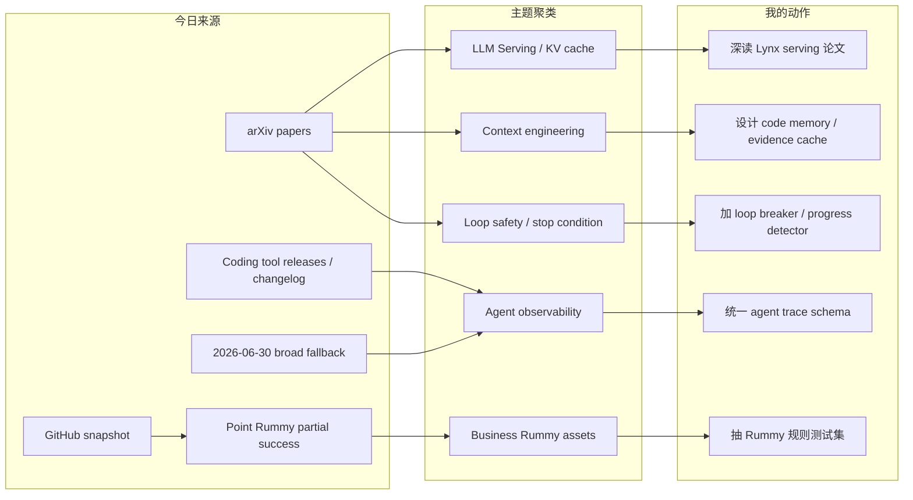
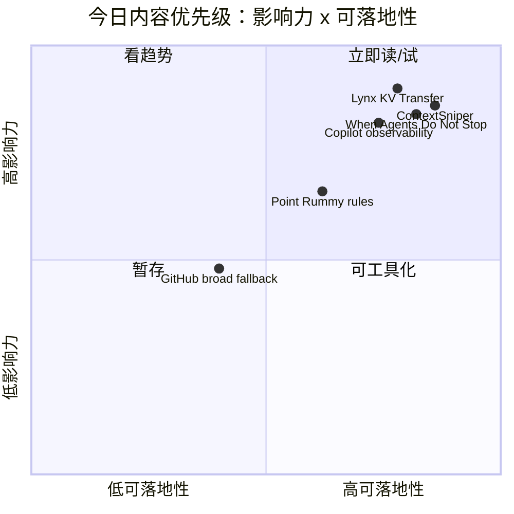

# AI Radar Daily - 2026-07-06

> 生成时间：2026-07-06 09:01 北京时间  
> 范围：AI Infra / LLM / RL / Agent / Eval / Serving / Training / 大厂博客 / 论文 / GitHub / Coding 工具  
> 说明：日报是导航入口；深度理解请进入 Obsidian 详情页。今日已运行 `Automation/collect_github_stars.py` 并保存 `Automation/state/github-stars-2026-07-06.json`。今日 GitHub Point Rummy 主题查询部分成功，通用 broad AI 查询因 403 rate limit 不完整；通用高 star / 增长榜使用 2026-06-30 最近成功 broad snapshot fallback，并明确标注非今日真实热度。

## 0. 今日结论

- 今日最值得关注：LLM serving 侧的 Lynx 直接打到长上下文 disaggregated inference 的 KV transfer 瓶颈，是今天最贴近 AI Infra 的论文。
- 对 AI coding workflow 的直接影响：ContextSniper、When Agents Do Not Stop 与 Copilot session streaming 共同指向过程级 agent eval：上下文选择、trace、终止条件、rollback 比单次生成更关键。
- 对 GitHub 热度的判断：今日 snapshot 已保存，但 broad 查询 rate-limited；通用榜单只能作为 fallback watchlist，不能解读成今日爆发。
- 对 Point Rummy / Indian Rummy：今日主题 repo 池有 86 个结果，整体 star 极低；最可用的是规则、计分、server state、bot baseline 与 RL adapter 线索。
- 建议今天深读：Lynx KV Transfer、ContextSniper、When Agents Do Not Stop、Claude Code/Cline/Copilot 工具矩阵、Point Rummy watchlist。

## 1. 今日态势图

## 2. 必读卡片区

> [!important] Lynx：长上下文 serving 的 KV transfer 压缩路径
> - 大类：论文 / AI Infra
> - 小类：LLM Serving / KV Cache / Disaggregated Inference
> - 重点：progressive speculative quantization 直指 prefill/decode 分离架构中的 KV cache 传输成本。
> - 为什么重要：长上下文 RAG 和 agent workload 会放大 KV 传输，影响 TTFT、吞吐和网络成本。
> - 详情：[[Papers/2026-07-06/lynx-progressive-speculative-quantization]] / [网页详情](https://github.com/dyt27666-oss/AI-news-report-obsidians/blob/main/Papers/2026-07-06/lynx-progressive-speculative-quantization.md) / [原文](https://arxiv.org/abs/2607.01831v1)

> [!important] ContextSniper：coding agent 的上下文供应链问题
> - 大类：论文 / Agent Eval
> - 小类：Repository-level Program Repair / Code Memory
> - 重点：仓库级修复中，agent 常把 token 浪费在整文件读取、宽泛搜索和长 terminal 输出上。
> - 为什么重要：可直接转成 repo memory、evidence cache、terminal output summarizer 和 context precision 指标。
> - 详情：[[Papers/2026-07-06/contextsniper-token-efficient-code-memory]] / [网页详情](https://github.com/dyt27666-oss/AI-news-report-obsidians/blob/main/Papers/2026-07-06/contextsniper-token-efficient-code-memory.md) / [原文](https://arxiv.org/abs/2607.01916v1)

> [!important] When Agents Do Not Stop：无限 agentic loop 是 runtime 问题
> - 大类：论文 / Agent Safety
> - 小类：Loop Engineering / Termination
> - 重点：LLM agents 在计划、工具调用、状态更新中可能陷入无限循环。
> - 为什么重要：coding agent 必须有 max-step、budget guard、progress detector、loop breaker 和 rollback。
> - 详情：[[Papers/2026-07-06/when-agents-do-not-stop]] / [网页详情](https://github.com/dyt27666-oss/AI-news-report-obsidians/blob/main/Papers/2026-07-06/when-agents-do-not-stop.md) / [原文](https://arxiv.org/abs/2607.01641v1)

> [!tip] Point Rummy 主题 snapshot：规则和仿真资产比 star 更重要
> - 大类：Business / GitHub
> - 小类：Point Rummy / Indian Rummy
> - 重点：今日 86 个 rummy 主题 repo，最高 star 仅 13，适合抽规则、计分、bot baseline。
> - 为什么重要：业务落地应先做 deterministic rules engine + Gym/RLCard adapter，而不是直接复用低 star repo。
> - 详情：[[Business/PointRummy/2026-07-06/point-rummy-github-watchlist]] / [网页详情](https://github.com/dyt27666-oss/AI-news-report-obsidians/blob/main/Business/PointRummy/2026-07-06/point-rummy-github-watchlist.md) / [原文](https://github.com/search?q=point+rummy&type=repositories)

## 3. 优先级矩阵

## 4. 分类清单

| 标签 | 大类 | 小类 | 标题 | 重点概括 | 为什么重要 | Obsidian 详情 | 网页详情 | 原文 |
|---|---|---|---|---|---|---|---|---|
| 必读 | 论文 | LLM Serving | Lynx | KV transfer progressive speculative quantization。 | 直接对应长上下文 agent serving 的网络和状态传输瓶颈。 | [[Papers/2026-07-06/lynx-progressive-speculative-quantization]] | [网页详情](https://github.com/dyt27666-oss/AI-news-report-obsidians/blob/main/Papers/2026-07-06/lynx-progressive-speculative-quantization.md) | [原文](https://arxiv.org/abs/2607.01831v1) |
| 必读 | 论文 | Coding Agent / Context | ContextSniper | 仓库级修复的 token-efficient code memory。 | 可落地成 evidence cache 和 context precision eval。 | [[Papers/2026-07-06/contextsniper-token-efficient-code-memory]] | [网页详情](https://github.com/dyt27666-oss/AI-news-report-obsidians/blob/main/Papers/2026-07-06/contextsniper-token-efficient-code-memory.md) | [原文](https://arxiv.org/abs/2607.01916v1) |
| 必读 | 论文 | Agent Safety | When Agents Do Not Stop | 无限 agentic loop 失败模式。 | coding agent 需要预算、终止条件、progress detector 和 rollback。 | [[Papers/2026-07-06/when-agents-do-not-stop]] | [网页详情](https://github.com/dyt27666-oss/AI-news-report-obsidians/blob/main/Papers/2026-07-06/when-agents-do-not-stop.md) | [原文](https://arxiv.org/abs/2607.01641v1) |
| 必读 | Coding 工具 | Claude Code | Claude Code v2.1.201 | CLI/TUI coding agent 标杆 release watch。 | 影响多 agent、tmux、远程执行、权限和日志横评。 | [[Industry/Tools/2026-07-06/claude-code-v2-1-201-release-watch]] | [网页详情](https://github.com/dyt27666-oss/AI-news-report-obsidians/blob/main/Industry/Tools/2026-07-06/claude-code-v2-1-201-release-watch.md) | [原文](https://github.com/anthropics/claude-code/releases/tag/v2.1.201) |
| 必读 | Coding 工具 | Cline CLI | Cline CLI v3.0.37 | IDE agent 向 CLI/remote workflow 扩展。 | 适合纳入 Claude Code / Codex / Qwen Code 同题横评。 | [[Industry/Tools/2026-07-06/cline-cli-v3-0-37-release-watch]] | [网页详情](https://github.com/dyt27666-oss/AI-news-report-obsidians/blob/main/Industry/Tools/2026-07-06/cline-cli-v3-0-37-release-watch.md) | [原文](https://github.com/cline/cline/releases/tag/cli-v3.0.37) |
| 必读 | Coding 工具 | GitHub Copilot | Agent observability watch | session streaming、CLI in Actions、usage metrics 等企业控制面信号。 | 企业 coding agent 落地需要 trace、auth、audit、cost，而不只是生成质量。 | [[Industry/Tools/2026-07-06/github-copilot-coding-agent-observability-watch]] | [网页详情](https://github.com/dyt27666-oss/AI-news-report-obsidians/blob/main/Industry/Tools/2026-07-06/github-copilot-coding-agent-observability-watch.md) | [原文](https://github.blog/changelog/label/copilot/) |
| 后续 | Business | Point Rummy | Point Rummy GitHub watchlist | 今日主题 snapshot 86 个 repo，整体低 star。 | 可抽规则、计分、server state、bot baseline 和 Gym/RLCard adapter。 | [[Business/PointRummy/2026-07-06/point-rummy-github-watchlist]] | [网页详情](https://github.com/dyt27666-oss/AI-news-report-obsidians/blob/main/Business/PointRummy/2026-07-06/point-rummy-github-watchlist.md) | [原文](https://github.com/search?q=point+rummy&type=repositories) |
| 低置信 | GitHub | AI Infra / Agent Runtime | GitHub broad Top 10 fallback | 今日 broad query rate-limited，使用 2026-06-30 fallback。 | 保留导航但不误读为今日真实增长。 | [[GitHub/2026-07-06/github-snapshot-top10-fallback]] | [网页详情](https://github.com/dyt27666-oss/AI-news-report-obsidians/blob/main/GitHub/2026-07-06/github-snapshot-top10-fallback.md) | [原文](https://github.com/search?q=topic%3Aartificial-intelligence&type=repositories) |

## 5. 大厂资讯 / 工程博客 / Research

### 5.1 公司来源扫描矩阵

| 公司/实验室 | 来源/栏目 | 今日状态 | 高相关条数 | 代表条目 | 备注 |
|---|---|---|---:|---|---|
| OpenAI | News / Research / Codex | 低置信 / 无今日新高相关 blog；Codex 最新 release 7/1 | 0 | Codex rust-v0.142.5（非今日） | OpenAI News RSS 可访问，最新多为 adoption / GeneBench / core dump；Codex release 未见今日新增。 |
| Anthropic | News / Research / Claude Code | 有高相关工具 release watch | 1 | Claude Code v2.1.201 | 发布方/大厂：Anthropic；来源类型：GitHub Release / Changelog。 |
| Google DeepMind | Blog / Research | 低置信 / 今日 RSS endpoint 404 | 0 | 无 | 页面/Feed 访问不稳定；未确认今日 AI Infra/RL 强相关项。 |
| Meta AI | Blog / Research | 低置信 / 无高相关新项 | 0 | 无 | 未确认今日 AI Infra/RL/agent 工程文章。 |
| NVIDIA | Technical Blog / AI | RSS 可访问但未抽到高相关标题 | 0 | 无 | Technical Blog AI feed 今日未解析到明确新 item。 |
| Microsoft | Research AI / GitHub Copilot | 有近日本周高相关工具信号 | 1 | Copilot agent observability watch | GitHub/Microsoft Copilot changelog 影响企业 coding-agent 控制面。 |
| Hugging Face | Blog / Papers / Releases | 有近日本周高相关 eval / serving 信号 | 2 | ScarfBench；Gemma 4 real-time voice AI | 非今日发布，但与 agent eval / real-time inference 有关。 |
| 腾讯 | AI Lab / 技术博客 | 低置信 / 无高相关新项 | 0 | 无 | 保留固定扫描位；未确认今日新项。 |
| 字节 | Seed / 技术博客 / GitHub | 间接相关 / fallback | 1 | DeerFlow（fallback） | 使用 2026-06-30 broad snapshot；非今日新增。 |
| SpaceAI | Blog / News | 低置信 / 弱相关 | 0 | 无 | 主线弱相关，保留固定扫描位。 |

### 5.2 高相关大厂条目

| 标签 | 发布方/大厂 | 栏目/来源 | 标题 | 重点概括 | 工程/算法影响 | Obsidian 详情 | 网页详情 | 原文 |
|---|---|---|---|---|---|---|---|---|
| 必读 | Anthropic | GitHub Release / Coding Agent | Claude Code v2.1.201 | CLI coding agent release watch。 | 对权限、上下文、远程执行和 tmux 多 agent workflow 有直接影响。 | [[Industry/Tools/2026-07-06/claude-code-v2-1-201-release-watch]] | [网页详情](https://github.com/dyt27666-oss/AI-news-report-obsidians/blob/main/Industry/Tools/2026-07-06/claude-code-v2-1-201-release-watch.md) | [原文](https://github.com/anthropics/claude-code/releases/tag/v2.1.201) |
| 必读 | GitHub / Microsoft | Changelog / Copilot | Copilot agent observability watch | session streaming、Actions CLI auth、usage metrics、credit pools 等信号。 | coding-agent 过程 trace、审计、CI 接入和成本治理是企业落地关键。 | [[Industry/Tools/2026-07-06/github-copilot-coding-agent-observability-watch]] | [网页详情](https://github.com/dyt27666-oss/AI-news-report-obsidians/blob/main/Industry/Tools/2026-07-06/github-copilot-coding-agent-observability-watch.md) | [原文](https://github.blog/changelog/label/copilot/) |
| 可 skim | Hugging Face / IBM Research | Blog / Benchmark | ScarfBench | Enterprise Java framework migration agent benchmark。 | 对 coding-agent eval 和真实企业迁移任务有参考；非今日新增。 | [[Industry/Tools/2026-07-06/github-copilot-coding-agent-observability-watch]] | [网页详情](https://github.com/dyt27666-oss/AI-news-report-obsidians/blob/main/Industry/Tools/2026-07-06/github-copilot-coding-agent-observability-watch.md) | [原文](https://huggingface.co/blog/ibm-research/scarfbench) |

## 6. GitHub 高 star Top 10

> 今日 GitHub broad search 在主题查询后触发 `HTTP Error 403: rate limit exceeded`，当前 snapshot 的 high_star_top10 被 Point Rummy 主题结果主导；本通用榜单使用 2026-06-30 最近成功 broad snapshot fallback。不是今日真实 high-star 刷新。

| 排名 | repo | stars | forks | language | updated_at | topics | 重点概括 | 是否值得试用 | Obsidian 详情 | 原文 |
|---:|---|---:|---:|---|---|---|---|---|---|---|
| 1 | affaan-m/ECC | 223700 | 34246 | JavaScript | 2026-06-30T10:52:04Z | ai-agents, anthropic, claude, claude-code | agent harness / Claude Code skill 生态信号。 | 可 skim | [[GitHub/2026-07-06/github-snapshot-top10-fallback]] | [原文](https://github.com/affaan-m/ECC) |
| 2 | NousResearch/hermes-agent | 206100 | 37255 | Python | 2026-06-30T10:56:07Z | ai, ai-agent, ai-agents, anthropic | agent runtime / skills / memory。 | 值得试用 | [[GitHub/2026-07-06/github-snapshot-top10-fallback]] | [原文](https://github.com/NousResearch/hermes-agent) |
| 3 | tensorflow/tensorflow | 195981 | 75210 | C++ | 2026-06-30T10:53:02Z | deep-learning, distributed, machine-learning | ML 框架基座。 | 可 skim | [[GitHub/2026-07-06/github-snapshot-top10-fallback]] | [原文](https://github.com/tensorflow/tensorflow) |
| 4 | Significant-Gravitas/AutoGPT | 185228 | 46116 | Python | 2026-06-30T10:49:43Z | agentic-ai, agents, artificial-intelligence | agent framework 历史高热。 | 可 skim | [[GitHub/2026-07-06/github-snapshot-top10-fallback]] | [原文](https://github.com/Significant-Gravitas/AutoGPT) |
| 5 | ollama/ollama | 175177 | 16771 | Go | 2026-06-30T10:55:05Z | deepseek, gemma, glm, local-llm | local model serving / runtime。 | 值得试用 | [[GitHub/2026-07-06/github-snapshot-top10-fallback]] | [原文](https://github.com/ollama/ollama) |
| 6 | f/prompts.chat | 164555 | 21292 | HTML | 2026-06-30T10:24:59Z | ai, artificial-intelligence, awesome-list | prompt 资产库。 | 可 skim | [[GitHub/2026-07-06/github-snapshot-top10-fallback]] | [原文](https://github.com/f/prompts.chat) |
| 7 | huggingface/transformers | 162049 | 33669 | Python | 2026-06-30T10:37:17Z | deep-learning, transformers, pytorch | model definition / training / inference 基座。 | 值得试用 | [[GitHub/2026-07-06/github-snapshot-top10-fallback]] | [原文](https://github.com/huggingface/transformers) |
| 8 | langflow-ai/langflow | 150233 | 9362 | Python | 2026-06-30T10:48:19Z | agents, generative-ai, large-language-models | agent workflow builder。 | 可 skim | [[GitHub/2026-07-06/github-snapshot-top10-fallback]] | [原文](https://github.com/langflow-ai/langflow) |
| 9 | langgenius/dify | 147098 | 23165 | TypeScript | 2026-06-30T10:50:44Z | agent, agentic-workflow, llmops | production agent workflow platform。 | 值得试用 | [[GitHub/2026-07-06/github-snapshot-top10-fallback]] | [原文](https://github.com/langgenius/dify) |
| 10 | open-webui/open-webui | 143525 | 20689 | Python | 2026-06-30T10:40:48Z | ai, llm, llm-ui, webui | model UI / local serving 入口。 | 值得试用 | [[GitHub/2026-07-06/github-snapshot-top10-fallback]] | [原文](https://github.com/open-webui/open-webui) |

## 7. GitHub star 增长最快 Top 10

> 增长依据：使用 2026-06-30 最近成功 broad snapshot 中已经计算好的历史差值作为 fallback；这不是 2026-07-06 的真实日增。今日 snapshot 对 broad AI repo 不完整，因此不得解读为今日增长。

| 排名 | repo | stars_delta | stars | forks | language | updated_at | 增长依据 | 重点概括 | Obsidian 详情 | 原文 |
|---:|---|---:|---:|---:|---|---|---|---|---|---|
| 1 | NousResearch/hermes-agent | 4047 | 206100 | 37255 | Python | 2026-06-30T10:56:07Z | historical_snapshot / 2026-06-30 broad fallback | agent runtime / skills / memory。 | [[GitHub/2026-07-06/github-snapshot-top10-fallback]] | [原文](https://github.com/NousResearch/hermes-agent) |
| 2 | firecrawl/firecrawl | 3092 | 141808 | 8175 | TypeScript | 2026-06-30T10:49:38Z | historical_snapshot / 2026-06-30 broad fallback | web data plane for AI agents。 | [[GitHub/2026-07-06/github-snapshot-top10-fallback]] | [原文](https://github.com/firecrawl/firecrawl) |
| 3 | affaan-m/ECC | 2505 | 223700 | 34246 | JavaScript | 2026-06-30T10:52:04Z | historical_snapshot / 2026-06-30 broad fallback | Claude Code / agent harness skill 生态。 | [[GitHub/2026-07-06/github-snapshot-top10-fallback]] | [原文](https://github.com/affaan-m/ECC) |
| 4 | JuliusBrussee/caveman | 1541 | 78128 | 4417 | JavaScript | 2026-06-30T10:55:40Z | historical_snapshot / 2026-06-30 broad fallback | Claude Code token-cutting skill。 | [[GitHub/2026-07-06/github-snapshot-top10-fallback]] | [原文](https://github.com/JuliusBrussee/caveman) |
| 5 | TauricResearch/TradingAgents | 1540 | 89905 | 17352 | Python | 2026-06-30T10:50:25Z | historical_snapshot / 2026-06-30 broad fallback | Multi-agent trading framework。 | [[GitHub/2026-07-06/github-snapshot-top10-fallback]] | [原文](https://github.com/TauricResearch/TradingAgents) |
| 6 | kepano/obsidian-skills | 1124 | 38983 | 2763 | Unknown | 2026-06-30T10:56:21Z | historical_snapshot / 2026-06-30 broad fallback | Obsidian agent skills。 | [[GitHub/2026-07-06/github-snapshot-top10-fallback]] | [原文](https://github.com/kepano/obsidian-skills) |
| 7 | bytedance/deer-flow | 1107 | 75552 | 10196 | Python | 2026-06-30T10:47:39Z | historical_snapshot / 2026-06-30 broad fallback | long-horizon SuperAgent harness。 | [[GitHub/2026-07-06/github-snapshot-top10-fallback]] | [原文](https://github.com/bytedance/deer-flow) |
| 8 | browser-use/browser-use | 1055 | 101571 | 11271 | Python | 2026-06-30T10:55:46Z | historical_snapshot / 2026-06-30 broad fallback | web automation for AI agents。 | [[GitHub/2026-07-06/github-snapshot-top10-fallback]] | [原文](https://github.com/browser-use/browser-use) |
| 9 | thedotmack/claude-mem | 1001 | 85137 | 7347 | JavaScript | 2026-06-30T10:46:16Z | historical_snapshot / 2026-06-30 broad fallback | persistent context across sessions。 | [[GitHub/2026-07-06/github-snapshot-top10-fallback]] | [原文](https://github.com/thedotmack/claude-mem) |
| 10 | omnigent-ai/omnigent | 875 | 5599 | 710 | Python | 2026-06-30T10:53:33Z | historical_snapshot / 2026-06-30 broad fallback | meta-harness for Claude Code / Codex / Cursor 等。 | [[GitHub/2026-07-06/github-snapshot-top10-fallback]] | [原文](https://github.com/omnigent-ai/omnigent) |

## 8. Coding 工具 / AI 工具功能更新

### 8.1 Coding 工具扫描矩阵

| 工具 | 厂商 | 来源类型 | 今日状态 | 代表更新 | 对我的影响 | 原文 |
|---|---|---|---|---|---|---|
| Claude Code | Anthropic | GitHub Release / Changelog | 有高相关 release watch | `v2.1.201`，2026-07-03T23:50:35Z | 影响 CLI/TUI、权限、上下文、远程执行和多 agent harness | https://github.com/anthropics/claude-code/releases/tag/v2.1.201 |
| OpenAI Codex | OpenAI | GitHub Release / Docs | 无今日新 release | `rust-v0.142.5`，2026-07-01T01:15:44Z | 继续观察 CLI/IDE、background mode、MCP、rate limits | https://github.com/openai/codex/releases/tag/rust-v0.142.5 |
| Cursor | Cursor | Changelog | 低置信 / 未确认今日新增 | 继续观察 mobile/cloud agent/remote control | 影响远程 agent 监控和任务接力 | https://cursor.com/changelog |
| Windsurf | Windsurf | Changelog | 低置信 / 未确认今日新增 | 继续观察 Agent Command Center / Devin Docs / ACP | 影响 IDE 内 agent 编排和远程任务控制 | https://windsurf.com/changelog |
| GitHub Copilot | GitHub / Microsoft | Changelog / Blog | 有近日本周高相关更新 | agent session streaming / CLI in Actions / usage metrics / credit pools | 影响企业 agent 可观测性、CI 认证和成本治理 | https://github.blog/changelog/label/copilot/ |
| Gemini Code Assist | Google | Release Notes | 低置信 / 未确认今日新增 | 继续观察企业 IDE 集成和 policy controls | 影响 Google 生态 coding assistant 落地 | https://cloud.google.com/gemini/docs/codeassist/release-notes |
| Qwen Code | Alibaba/Qwen | GitHub Releases | 有近日本周 release | `v0.19.6`，2026-07-03T16:36:59Z | 开源 CLI/TUI agent 对照试用 | https://github.com/QwenLM/qwen-code/releases/tag/v0.19.6 |
| Roo Code | Roo Code | GitHub Releases | 无今日新 release | 最新页显示 `v3.54.0`，2026-05-15 | VS Code agent extension 继续观察 | https://github.com/RooCodeInc/Roo-Code/releases/tag/v3.54.0 |
| Cline | Cline | GitHub Releases | 有高相关 release | `cli-v3.0.37`，2026-07-04T02:36:24Z | CLI/IDE 双形态 agent loop 值得加入评测 | https://github.com/cline/cline/releases/tag/cli-v3.0.37 |
| Continue | Continue | GitHub Releases | 无今日新 release | 最新可见 `v2.0.0-vscode`，2026-06-19 | IDE extension 观察，今日无明确新功能 | https://github.com/continuedev/continue/releases/tag/v2.0.0-vscode |

### 8.2 高相关工具更新

| 标签 | 工具/厂商 | 来源类型 | 标题/功能 | 重点概括 | 对 AI coding 工作流的影响 | Obsidian 详情 | 网页详情 | 原文 |
|---|---|---|---|---|---|---|---|---|
| 必读 | Claude Code / Anthropic | GitHub Release | v2.1.201 | 官方 release 显示 CLI agent 高频迭代。 | 适合对照 Codex/Cline/Qwen 的权限、上下文、日志和远程执行。 | [[Industry/Tools/2026-07-06/claude-code-v2-1-201-release-watch]] | [网页详情](https://github.com/dyt27666-oss/AI-news-report-obsidians/blob/main/Industry/Tools/2026-07-06/claude-code-v2-1-201-release-watch.md) | [原文](https://github.com/anthropics/claude-code/releases/tag/v2.1.201) |
| 必读 | Cline | GitHub Release | cli-v3.0.37 | Cline CLI 形态继续迭代。 | CLI/IDE 双形态对 remote、tmux、CI、多 agent workflow 更关键。 | [[Industry/Tools/2026-07-06/cline-cli-v3-0-37-release-watch]] | [网页详情](https://github.com/dyt27666-oss/AI-news-report-obsidians/blob/main/Industry/Tools/2026-07-06/cline-cli-v3-0-37-release-watch.md) | [原文](https://github.com/cline/cline/releases/tag/cli-v3.0.37) |
| 必读 | GitHub Copilot | Changelog | agent observability watch | session streaming、CLI in Actions、usage metrics、credit pools。 | 支持过程级 review、审计、agent eval trace 和成本治理。 | [[Industry/Tools/2026-07-06/github-copilot-coding-agent-observability-watch]] | [网页详情](https://github.com/dyt27666-oss/AI-news-report-obsidians/blob/main/Industry/Tools/2026-07-06/github-copilot-coding-agent-observability-watch.md) | [原文](https://github.blog/changelog/label/copilot/) |
| 可 skim | Qwen Code / Alibaba | GitHub Release | v0.19.6 | 开源 CLI/TUI coding agent 7/3 UTC release。 | 适合做 Claude Code / Codex / Cline 的开源对照。 | [[Industry/Tools/2026-07-06/claude-code-v2-1-201-release-watch]] | [网页详情](https://github.com/dyt27666-oss/AI-news-report-obsidians/blob/main/Industry/Tools/2026-07-06/claude-code-v2-1-201-release-watch.md) | [原文](https://github.com/QwenLM/qwen-code/releases/tag/v0.19.6) |

## 9. Point Rummy / Indian Rummy 业务主题

> 今日 Point Rummy / Indian Rummy 主题查询部分成功，`github-stars-2026-07-06.json` 中包含 86 个 rummy 主题 repo；整体 star 很低，按业务可用性而不是热度排序。

### 9.1 GitHub 候选

| 标签 | repo | stars | forks | language | updated_at | 重点概括 | 业务可用性 | Obsidian 详情 | 原文 |
|---|---|---:|---:|---|---|---|---|---|---|
| 后续 | rickgorman/gin-rummy-ai | 13 | 4 | Python | 2025-03-25T13:47:09Z | Gin Rummy AI 方向小项目。 | AI opponent / 状态表示参考 | [[Business/PointRummy/2026-07-06/point-rummy-github-watchlist]] | [原文](https://github.com/rickgorman/gin-rummy-ai) |
| 后续 | nakkekakke/rummy-ai | 11 | 3 | Python | 2026-04-17T10:02:59Z | Rummy AI 方向小项目。 | heuristic baseline 参考 | [[Business/PointRummy/2026-07-06/point-rummy-github-watchlist]] | [原文](https://github.com/nakkekakke/rummy-ai) |
| 后续 | jmhummel/Gin-Rummy-Java | 8 | 2 | Java | 2023-08-16T16:12:58Z | Java Gin Rummy 实现。 | 规则边界和状态机参考 | [[Business/PointRummy/2026-07-06/point-rummy-github-watchlist]] | [原文](https://github.com/jmhummel/Gin-Rummy-Java) |
| 后续 | mudont/indian-rummy | 5 | 0 | TypeScript | 2025-08-08T21:05:04Z | Typescript library for Indian Rummy card game。 | 规则建模 API 参考 | [[Business/PointRummy/2026-07-06/point-rummy-github-watchlist]] | [原文](https://github.com/mudont/indian-rummy) |
| 后续 | dv-rastogi/Rummy | 5 | 0 | Python | 2023-09-26T11:21:39Z | Variation of classical Indian Rummy made in Pygame。 | Pygame 状态流参考 | [[Business/PointRummy/2026-07-06/point-rummy-github-watchlist]] | [原文](https://github.com/dv-rastogi/Rummy) |
| 后续 | vahsek300501/Indian-Rummy- | 4 | 3 | Python | 2023-09-26T11:21:46Z | Indian Rummy made in Python using PyGame。 | Pygame UI/规则参考 | [[Business/PointRummy/2026-07-06/point-rummy-github-watchlist]] | [原文](https://github.com/vahsek300501/Indian-Rummy-) |
| 后续 | SCFlanagan/Rummy | 4 | 2 | Python | 2025-07-25T21:17:08Z | Rummy implementation。 | 状态/规则抽样 | [[Business/PointRummy/2026-07-06/point-rummy-github-watchlist]] | [原文](https://github.com/SCFlanagan/Rummy) |
| 后续 | mcartmell/gin-rummy-bot | 4 | 2 | Python | 2024-10-30T20:06:17Z | Gin Rummy bot。 | bot 策略参考 | [[Business/PointRummy/2026-07-06/point-rummy-github-watchlist]] | [原文](https://github.com/mcartmell/gin-rummy-bot) |
| 后续 | Mohitkumar-559/RummyServer | 2 | 1 | JavaScript | 2024-03-17T03:48:34Z | deal rummy / point rummy server。 | 服务端状态与协议参考 | [[Business/PointRummy/2026-07-06/point-rummy-github-watchlist]] | [原文](https://github.com/Mohitkumar-559/RummyServer) |
| 后续 | abubakarmunir712/dsa-final-project | 2 | 0 | Python | 2026-06-27T06:34:26Z | multiplayer Indian Rummy with AI opponents and LAN play。 | AI opponent/LAN demo 可复核 | [[Business/PointRummy/2026-07-06/point-rummy-github-watchlist]] | [原文](https://github.com/abubakarmunir712/dsa-final-project) |

### 9.2 论文 / 资料候选

| 标签 | 来源 | 标题 | 作者/机构 | 重点概括 | 对 Point Rummy 业务有什么用 | Obsidian 详情 | 原文 |
|---|---|---|---|---|---|---|---|
| 低置信 | arXiv / Semantic Scholar | Point Rummy / Indian Rummy 查询 | 未发现今日强相关新论文 | 今日 arXiv 查询可用，但 exact rummy query 未返回可靠强相关论文。 | 不据此做方向判断；继续用 imperfect-information card game / ISMCTS / RLCard 泛化检索。 | [[Business/PointRummy/2026-07-06/point-rummy-github-watchlist]] | [原文](https://export.arxiv.org/api/query) |
| 后续 | GitHub | gin-rummy-ai / rummy-ai / RummyServer | 多个低 star repo | 小项目可抽状态表示、规则边界、server state 与 bot baseline。 | 用于构造测试样例和 baseline，不直接生产复用。 | [[Business/PointRummy/2026-07-06/point-rummy-github-watchlist]] | [原文](https://github.com/search?q=gin+rummy+ai&type=repositories) |

### 9.3 业务可用性判断

| 方向 | 今日信号 | 可用性 | 下一步 |
|---|---|---|---|
| 规则引擎 / 计分 | mudont/indian-rummy、Gin-Rummy-Java、points calculator | 中低：适合抽测试样例，不适合直接复用 | 写 meld/scoring/drop/dealer rotation 的单元测试清单 |
| Bot / RL Agent | gin-rummy-ai、rummy-ai、gin-rummy-bot | 低到中：算法成熟度不明 | 先实现 random/heuristic/ISMCTS baseline，再决定是否接 RL |
| 仿真 / 评测 | RummyServer / Pygame / LAN demo repo | 中低：服务端状态流可参考 | 设计统一 Gym/RLCard adapter 和 replay schema |

## 10. Loop Engineer / Loop Engineering 主题

> 今日 loop GitHub 查询被 GitHub rate limit，`theme_sections.loop_engineer` 为空；固定表格使用 2026-06-30 broad snapshot 中的主题相关 repo fallback。论文侧 ContextSniper / When Agents Do Not Stop 信号更强。

### 10.1 Loop Engineer GitHub 高 star Top 10

| 排名 | repo | stars | forks | language | updated_at | topics | 重点概括 | 是否值得试用 | Obsidian 详情 | 原文 |
|---:|---|---:|---:|---|---|---|---|---|---|---|
| 1 | dair-ai/Prompt-Engineering-Guide | 76088 | 8331 | MDX | 2026-06-30T09:43:12Z | agent, agents, ai-agents, generative-ai | Prompt/context engineering 资料库，可作为 loop engineering 概念索引。 | 可 skim | [[GitHub/LoopEngineer/2026-07-06/loop-engineer-watchlist]] | [原文](https://github.com/dair-ai/Prompt-Engineering-Guide) |
| 2 | cobusgreyling/loop-engineering | 4244 | 553 | JavaScript | 2026-06-30T10:55:21Z | agentic-ai, ai-agents, ai-coding, claude | Practical loop engineering patterns、CLI、starter templates。 | 值得试用 | [[GitHub/LoopEngineer/2026-07-06/loop-engineer-watchlist]] | [原文](https://github.com/cobusgreyling/loop-engineering) |
| 3 | thesongzhu/Friday | 918 | 117 | TypeScript | 2026-06-30T10:46:46Z | agent-orchestration, approval-first, automation | Private control plane for AI agents，强调 approval-first 工作流。 | 值得试用 | [[GitHub/LoopEngineer/2026-07-06/loop-engineer-watchlist]] | [原文](https://github.com/thesongzhu/Friday) |
| 4 | 不足 10 条 | - | - | - | - | - | 今日 loop query 403 rate limit，严格主题过滤后不足 10 条。 | 低置信 | [[GitHub/LoopEngineer/2026-07-06/loop-engineer-watchlist]] | [原文](https://github.com/search?q=loop+engineering&type=repositories) |

### 10.2 Loop Engineer GitHub star 增长最快 Top 10

| 排名 | repo | stars_delta | stars | forks | language | updated_at | 增长依据 | 重点概括 | Obsidian 详情 | 原文 |
|---:|---|---:|---:|---:|---|---|---|---|---|---|
| 1 | dair-ai/Prompt-Engineering-Guide | 135 | 76088 | 8331 | MDX | 2026-06-30T09:43:12Z | historical_snapshot / 2026-06-30 fallback | Prompt/context engineering 资料库，可作为 loop engineering 概念索引。 | [[GitHub/LoopEngineer/2026-07-06/loop-engineer-watchlist]] | [原文](https://github.com/dair-ai/Prompt-Engineering-Guide) |
| 2 | thesongzhu/Friday | 1 | 918 | 117 | TypeScript | 2026-06-30T10:46:46Z | historical_snapshot / 2026-06-30 fallback | Private control plane for AI agents，强调 approval-first 工作流。 | [[GitHub/LoopEngineer/2026-07-06/loop-engineer-watchlist]] | [原文](https://github.com/thesongzhu/Friday) |
| 3 | cobusgreyling/loop-engineering | None | 4244 | 553 | JavaScript | 2026-06-30T10:55:21Z | historical_snapshot / 2026-06-30 fallback | Practical loop engineering patterns、CLI、starter templates。 | [[GitHub/LoopEngineer/2026-07-06/loop-engineer-watchlist]] | [原文](https://github.com/cobusgreyling/loop-engineering) |
| 4 | 不足 10 条 | - | - | - | - | - | 今日 loop query 403 rate limit | 严格主题过滤后不足 10 条。 | [[GitHub/LoopEngineer/2026-07-06/loop-engineer-watchlist]] | [原文](https://github.com/search?q=loop+engineering&type=repositories) |

### 10.3 Loop Engineering 方法信号

| 标签 | 来源 | 标题 | 重点概括 | 对 AI coding 工作流的影响 | Obsidian 详情 | 原文 |
|---|---|---|---|---|---|---|
| 必读 | 论文 | ContextSniper | code memory / evidence selection / token budget control。 | 把 coding-agent 成功率拆成上下文供应链问题。 | [[Papers/2026-07-06/contextsniper-token-efficient-code-memory]] | [原文](https://arxiv.org/abs/2607.01916v1) |
| 必读 | 论文 | When Agents Do Not Stop | 无限 agentic loops。 | 必须给 agent runner 加终止条件、进展检测和 rollback。 | [[Papers/2026-07-06/when-agents-do-not-stop]] | [原文](https://arxiv.org/abs/2607.01641v1) |
| 必读 | Coding Tools | Claude Code / Cline / Copilot | CLI release、session streaming、CI auth 共同指向可观测 agent loop。 | 需要统一 trace schema、权限策略和 rollback 流程。 | [[GitHub/LoopEngineer/2026-07-06/loop-engineer-watchlist]] | [原文](https://github.blog/changelog/label/copilot/) |

## 11. 论文

### 11.1 Serving / Agent Eval / Loop Engineering

| 标签 | 论文来源 | 论文 | 作者/机构 | 重点概括 | 工程/研究价值 | Obsidian 详情 | 网页详情 | PDF/原文 |
|---|---|---|---|---|---|---|---|---|
| 必读 | arXiv / 预印本 | Lynx: Progressive Speculative Quantization for accelerating KV Transfer in Long-Context Inference | Wenchen Han, Gingfung Matthew Yeung, Marco Barletta 等 | 长上下文 disaggregated inference 的 KV transfer 压缩。 | 直接对应 LLM serving 的网络带宽、TTFT、吞吐和状态管理。 | [[Papers/2026-07-06/lynx-progressive-speculative-quantization]] | [网页详情](https://github.com/dyt27666-oss/AI-news-report-obsidians/blob/main/Papers/2026-07-06/lynx-progressive-speculative-quantization.md) | [PDF/原文](https://arxiv.org/pdf/2607.01831v1) |
| 必读 | arXiv / 预印本 | ContextSniper: AntTrail's Token-Efficient Code Memory for Repository-Level Program Repair | Chiwang Luk, Matin Mohammad Najafi, Zhifeng Jia 等 | 仓库级修复的 token-efficient code memory。 | 可转成 coding-agent context precision、evidence cache 和 terminal 输出裁剪。 | [[Papers/2026-07-06/contextsniper-token-efficient-code-memory]] | [网页详情](https://github.com/dyt27666-oss/AI-news-report-obsidians/blob/main/Papers/2026-07-06/contextsniper-token-efficient-code-memory.md) | [PDF/原文](https://arxiv.org/pdf/2607.01916v1) |
| 必读 | arXiv / 预印本 | When Agents Do Not Stop: Uncovering Infinite Agentic Loops in LLM Agents | Xinyi Hou, Shenao Wang, Yanjie Zhao 等 | LLM agents 的无限循环失败模式。 | 直接指导 agent runner 的 max-step、budget、progress detector 和 rollback。 | [[Papers/2026-07-06/when-agents-do-not-stop]] | [网页详情](https://github.com/dyt27666-oss/AI-news-report-obsidians/blob/main/Papers/2026-07-06/when-agents-do-not-stop.md) | [PDF/原文](https://arxiv.org/pdf/2607.01641v1) |
| 可 skim | arXiv / 预印本 | HYPIC: Accelerating Hybrid-Attention LLM Serving with Position-Independent Caching | Yifei Liu, Juntong Wu, Yang Liu 等 | RAG/agent serving 中的 hybrid-attention / position-independent caching。 | 和 Lynx 同属长上下文 serving 优化，可后续深挖。 | [[Papers/2026-07-06/lynx-progressive-speculative-quantization]] | [网页详情](https://github.com/dyt27666-oss/AI-news-report-obsidians/blob/main/Papers/2026-07-06/lynx-progressive-speculative-quantization.md) | [PDF/原文](https://arxiv.org/pdf/2607.01299v1) |

## 12. 资讯 / 其他 GitHub 项目

### 12.1 Agent Runtime / Web Data Plane

| 标签 | 来源 | 标题 | 重点概括 | 对我有什么用 | Obsidian 详情 | 网页详情 | 原文 |
|---|---|---|---|---|---|---|---|
| 低置信 | GitHub fallback | Hermes Agent / Firecrawl / Ollama / Dify / Open WebUI | 2026-06-30 broad snapshot 显示 runtime、web data、本地 serving、workflow 平台仍是主线。 | 作为 agent infra watchlist，不解读为今日增长。 | [[GitHub/2026-07-06/github-snapshot-top10-fallback]] | [网页详情](https://github.com/dyt27666-oss/AI-news-report-obsidians/blob/main/GitHub/2026-07-06/github-snapshot-top10-fallback.md) | [原文](https://github.com/search?q=topic%3Aartificial-intelligence&type=repositories) |
| 后续 | GitHub Copilot | Usage metrics / AI credit pools | Copilot changelog 继续出现 usage metrics 和 credit pools 方向。 | 对企业 AI coding 成本治理有参考。 | [[Industry/Tools/2026-07-06/github-copilot-coding-agent-observability-watch]] | [网页详情](https://github.com/dyt27666-oss/AI-news-report-obsidians/blob/main/Industry/Tools/2026-07-06/github-copilot-coding-agent-observability-watch.md) | [原文](https://github.blog/changelog/label/copilot/) |

## 13. 按主题索引

### AI Infra / Serving / Training

- [[Papers/2026-07-06/lynx-progressive-speculative-quantization]] - 长上下文 KV transfer / disaggregated serving。
- [[GitHub/2026-07-06/github-snapshot-top10-fallback]] - runtime / serving / web data plane fallback watchlist。

### LLM / Agent / RAG / Evaluation

- [[Papers/2026-07-06/contextsniper-token-efficient-code-memory]] - code memory 与 context engineering。
- [[Papers/2026-07-06/when-agents-do-not-stop]] - agent loop failure / termination。
- [[Industry/Tools/2026-07-06/github-copilot-coding-agent-observability-watch]] - session streaming 与过程可观测性。

### RL / Game AI / World Model

- [[Business/PointRummy/2026-07-06/point-rummy-github-watchlist]] - rummy 规则 / bot / 仿真资产。
- Rank-Then-Act / world model 论文今日仅作低置信候选，未生成详情页。

### Point Rummy / Indian Rummy

- [[Business/PointRummy/2026-07-06/point-rummy-github-watchlist]] - 今日业务固定主题。

### Loop Engineer / Coding Agent Loop

- [[GitHub/LoopEngineer/2026-07-06/loop-engineer-watchlist]] - context、trace、permission、progress、rollback。
- [[Industry/Tools/2026-07-06/claude-code-v2-1-201-release-watch]] - Claude Code release watch。
- [[Industry/Tools/2026-07-06/cline-cli-v3-0-37-release-watch]] - Cline CLI release watch。

### 公司 / 实验室

- OpenAI: Codex release watch（今日无新增）
- Anthropic: [[Industry/Tools/2026-07-06/claude-code-v2-1-201-release-watch]]
- DeepMind: 今日低置信 / feed 访问失败
- Meta: 今日无高相关新项
- NVIDIA: 今日无高相关新项
- Hugging Face: ScarfBench / real-time inference 继续观察
- GitHub / Microsoft: [[Industry/Tools/2026-07-06/github-copilot-coding-agent-observability-watch]]
- 腾讯 / 字节 / 国内大厂: 字节 DeerFlow 使用 fallback watch

## 14. 值得后续深挖

| 标签 | 大类 | 小类 | 标题 | 后续动作 | Obsidian 详情 | 原文 |
|---|---|---|---|---|---|---|
| 必读 | 论文 | Serving | Lynx | 读 PDF，抽 KV transfer bandwidth / TTFT / throughput / quality loss 四个指标。 | [[Papers/2026-07-06/lynx-progressive-speculative-quantization]] | [原文](https://arxiv.org/abs/2607.01831v1) |
| 必读 | 论文 | Agent Eval | ContextSniper | 把 file selection / search / terminal output 裁剪做成横评表。 | [[Papers/2026-07-06/contextsniper-token-efficient-code-memory]] | [原文](https://arxiv.org/abs/2607.01916v1) |
| 必读 | 论文 | Agent Safety | When Agents Do Not Stop | 给 agent runner 加 step/cost/progress guard。 | [[Papers/2026-07-06/when-agents-do-not-stop]] | [原文](https://arxiv.org/abs/2607.01641v1) |
| 后续 | 业务 | Point Rummy | Rules / RL baseline | 从 10 个低 star repo 抽 20 个规则边界测试。 | [[Business/PointRummy/2026-07-06/point-rummy-github-watchlist]] | [原文](https://github.com/search?q=indian+rummy&type=repositories) |

## 15. 采集失败或低置信来源

- GitHub API 今日部分 403 rate limit；today snapshot repos=87, errors=40，且 broad AI 查询不完整。
- `blogwatcher-cli` 未安装；使用 RSS/curl/公开 API 等价扫描。
- OpenAI / Hugging Face / GitHub Copilot RSS 可访问；DeepMind / Anthropic RSS endpoint 返回 404 或不可用；NVIDIA feed 可访问但未抽到明确高相关标题。
- Meta AI、Microsoft Research、腾讯、字节、SpaceAI 今日未确认高相关新项；不伪造内容。
- GitHub 高 star / 增长榜使用 2026-06-30 fallback；Loop Engineer 使用 2026-06-30 fallback；Point Rummy 使用今日主题 snapshot。

## 16. 归档标签

#ai-radar #daily #ai-infra #llm #rl #point-rummy #loop-engineering
