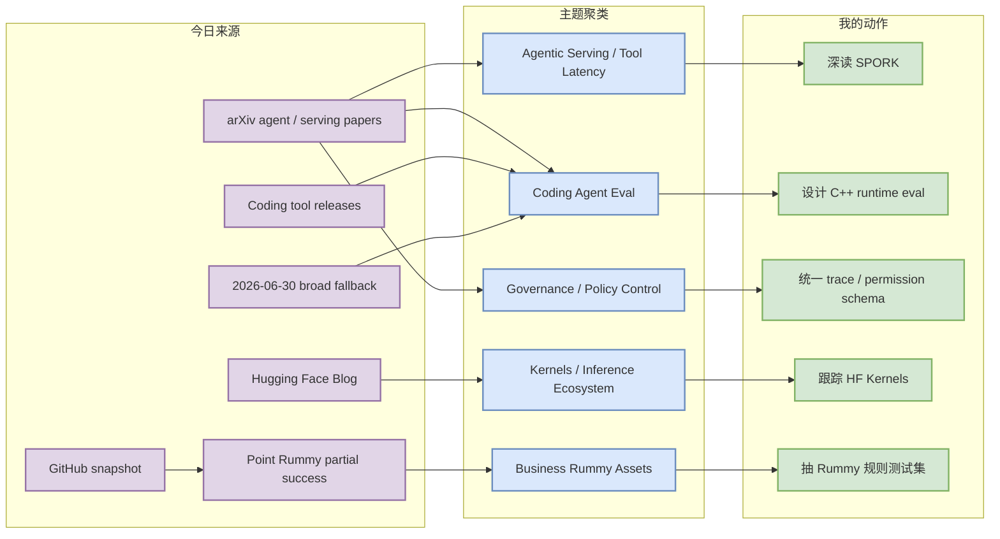
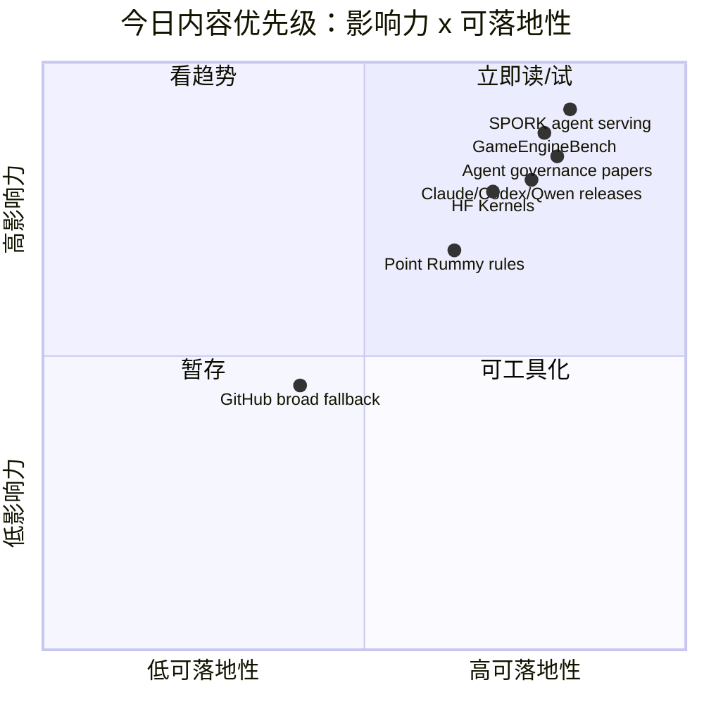

# AI Radar Daily - 2026-07-07

> 生成时间：2026-07-07 09:00 北京时间  
> 范围：AI Infra / LLM / RL / Agent / Eval / Serving / Training / 大厂博客 / 论文 / GitHub / Coding 工具  
> 说明：日报是导航入口；深度理解请进入 Obsidian 详情页。今日已运行 `Automation/collect_github_stars.py` 并保存 `Automation/state/github-stars-2026-07-07.json`。今日 GitHub Point Rummy 主题查询部分成功，broad AI / Loop 查询因 403 rate limit 不完整；通用 GitHub 高 star / 增长榜使用 2026-06-30 最近成功 broad snapshot fallback，并明确标注非今日真实热度。

## 0. 今日结论

- 今日最值得关注：SPORK 把 agent tool-call 等待纳入 serving scheduler，是 agentic inference infra 的高信号论文。
- 对 AI coding workflow 的直接影响：GameEngineBench、CAGE-1、DSCC 指向更真实的 coding-agent eval 与治理：C++ runtime、权限组合、trace、replay、stop control 都要评测。
- 对 AI Infra 的直接影响：Hugging Face Kernels 更新说明 Hub + custom kernels + inference performance 生态继续工程化；Gemma 4 / long-context papers 继续强调 memory bandwidth 与长上下文效率。
- 对 RL / 游戏模型训练的影响：LeRobot v0.6.0 的 imagine-evaluate-improve loop 可迁移到 Point Rummy / game-agent 数据、评测、改进闭环。
- 对 GitHub 热度的判断：今日 snapshot 已保存，repos=98、errors=39；broad 查询 rate-limited，通用榜单是 fallback watchlist，不应解读成今日真实增长。

## 1. 今日态势图

## 2. 必读卡片区

> [!important] SPORK：Agentic LLM inference 的 tool-call latency hiding
> - 大类：论文 / AI Infra
> - 小类：Agent Serving / Tool Use / Speculative Execution
> - 重点：用 self-speculative fork 预测 upcoming tool，提前执行工具以隐藏 agent loop 等待。
> - 为什么重要：coding/browser/RAG agent 的 wall time 很多耗在工具等待；这是 serving scheduler 和 tool runtime 联合优化问题。
> - 详情：[[Papers/2026-07-07/spork-agentic-llm-inference]] / [网页详情](https://github.com/dyt27666-oss/AI-news-report-obsidians/blob/main/Papers/2026-07-07/spork-agentic-llm-inference.md) / [原文](https://arxiv.org/abs/2607.03333v1)

> [!important] GameEngineBench：用真实 C++ / Unreal runtime 评测 coding agents
> - 大类：论文 / Agent Eval
> - 小类：Coding Agent / C++ Runtime / Game Engine
> - 重点：9 个 Unreal Engine 5 项目、110 个任务，把 agent 评测推向真实复杂工程。
> - 为什么重要：比 toy repo 更接近 AI Infra 工程修复、runtime patch、仿真环境修改。
> - 详情：[[Papers/2026-07-07/gameenginebench-coding-agents-cpp-runtime]] / [网页详情](https://github.com/dyt27666-oss/AI-news-report-obsidians/blob/main/Papers/2026-07-07/gameenginebench-coding-agents-cpp-runtime.md) / [原文](https://arxiv.org/abs/2607.03525v1)

> [!important] CAGE-1 / DSCC：企业 agent 的治理、权限组合与可回放评测
> - 大类：论文 / Agent Governance
> - 小类：Policy / Tool Chain / Audit
> - 重点：企业 agent 不只看答案正确，还要看授权、证据、memory、工具许可、stop control。
> - 为什么重要：Claude Code / Codex / Copilot 类 agent 落地必须有 trace、policy、rollback 和审计。
> - 详情：[[Papers/2026-07-07/agent-control-governance-and-policy]] / [网页详情](https://github.com/dyt27666-oss/AI-news-report-obsidians/blob/main/Papers/2026-07-07/agent-control-governance-and-policy.md) / [原文](https://arxiv.org/abs/2607.03510v1)

> [!tip] Hugging Face Kernels + LeRobot：推理 kernel 与数据-评测-改进闭环
> - 大类：大厂博客 / Engineering
> - 小类：Hugging Face / Kernels / Robotics
> - 重点：Kernels 偏 inference/custom op 分发，LeRobot 偏 embodied/RL 的 imagine-evaluate-improve loop。
> - 为什么重要：一个服务 AI Infra 性能生态，一个可迁移到游戏/RL agent 训练闭环。
> - 详情：[[Industry/2026-07-07/huggingface-kernels-lerobot-release]] / [网页详情](https://github.com/dyt27666-oss/AI-news-report-obsidians/blob/main/Industry/2026-07-07/huggingface-kernels-lerobot-release.md) / [原文](https://huggingface.co/blog/revamped-kernels)

> [!tip] Point Rummy 今日 97 repo watchlist：规则/计分/AI opponent 比 star 更重要
> - 大类：Business / GitHub
> - 小类：Point Rummy / Indian Rummy
> - 重点：低 star 长尾生态中可抽规则、计分、bot baseline、Gym/RL adapter、视觉辅助。
> - 为什么重要：业务落地应先做 deterministic rules engine + evaluator，再做 RL / MCTS / LLM agent。
> - 详情：[[Business/PointRummy/2026-07-07/point-rummy-github-watchlist]] / [网页详情](https://github.com/dyt27666-oss/AI-news-report-obsidians/blob/main/Business/PointRummy/2026-07-07/point-rummy-github-watchlist.md) / [原文](https://github.com/search?q=point+rummy&type=repositories)

## 3. 优先级矩阵

## 4. 分类清单

| 标签 | 大类 | 小类 | 标题 | 重点概括 | 为什么重要 | Obsidian 详情 | 网页详情 | 原文 |
|---|---|---|---|---|---|---|---|---|
| 必读 | 论文 | Agent Serving | SPORK | Self-speculative forking 预测工具调用并提前执行。 | 直接对应 agent tool-call 等待、GPU idle、runtime scheduler。 | [[Papers/2026-07-07/spork-agentic-llm-inference]] | [网页详情](https://github.com/dyt27666-oss/AI-news-report-obsidians/blob/main/Papers/2026-07-07/spork-agentic-llm-inference.md) | [原文](https://arxiv.org/abs/2607.03333v1) |
| 必读 | 论文 | Coding Agent Eval | GameEngineBench | 真实 C++ / UE5 runtime 中评测 coding agents。 | 比 toy repo 更接近复杂系统修改、游戏环境与 AI Infra runtime patch。 | [[Papers/2026-07-07/gameenginebench-coding-agents-cpp-runtime]] | [网页详情](https://github.com/dyt27666-oss/AI-news-report-obsidians/blob/main/Papers/2026-07-07/gameenginebench-coding-agents-cpp-runtime.md) | [原文](https://arxiv.org/abs/2607.03525v1) |
| 必读 | 论文 | Agent Governance | CAGE-1 / DSCC | 企业 agent 控制、审计、策略组合、可停止性。 | coding agent 落地需要权限 lattice、trace、policy-as-code 和 rollback。 | [[Papers/2026-07-07/agent-control-governance-and-policy]] | [网页详情](https://github.com/dyt27666-oss/AI-news-report-obsidians/blob/main/Papers/2026-07-07/agent-control-governance-and-policy.md) | [原文](https://arxiv.org/abs/2607.03510v1) |
| 必读 | 博客 | Hugging Face / Kernels | 🤗 Kernels: Major Updates | Hub + custom kernels + inference performance 生态信号。 | 与 Triton/CUDA/torch compile、serving kernel 分发有关。 | [[Industry/2026-07-07/huggingface-kernels-lerobot-release]] | [网页详情](https://github.com/dyt27666-oss/AI-news-report-obsidians/blob/main/Industry/2026-07-07/huggingface-kernels-lerobot-release.md) | [原文](https://huggingface.co/blog/revamped-kernels) |
| 可 skim | 博客 | Hugging Face / LeRobot | LeRobot v0.6.0 | Imagine, Evaluate, Improve loop。 | 可迁移到 RL/game-agent 的数据、评测、改进闭环。 | [[Industry/2026-07-07/huggingface-kernels-lerobot-release]] | [网页详情](https://github.com/dyt27666-oss/AI-news-report-obsidians/blob/main/Industry/2026-07-07/huggingface-kernels-lerobot-release.md) | [原文](https://huggingface.co/blog/lerobot-release-v060) |
| 必读 | Coding 工具 | Claude Code / Codex / Qwen Code | 7/6-7/7 release watch | 三个 CLI/TUI coding agent 高频 release。 | 横评必须记录 release tag、权限、上下文、trace，否则不可复现。 | [[Industry/Tools/2026-07-07/claude-code-codex-qwen-release-watch]] | [网页详情](https://github.com/dyt27666-oss/AI-news-report-obsidians/blob/main/Industry/Tools/2026-07-07/claude-code-codex-qwen-release-watch.md) | [原文](https://github.com/anthropics/claude-code/releases/tag/v2.1.202) |
| 后续 | Business | Point Rummy | Point Rummy GitHub watchlist | 今日主题 snapshot 97 个 repo，整体低 star。 | 可抽规则、计分、server state、bot baseline、Gym/RL adapter。 | [[Business/PointRummy/2026-07-07/point-rummy-github-watchlist]] | [网页详情](https://github.com/dyt27666-oss/AI-news-report-obsidians/blob/main/Business/PointRummy/2026-07-07/point-rummy-github-watchlist.md) | [原文](https://github.com/search?q=point+rummy&type=repositories) |
| 低置信 | GitHub | AI Infra / Agent Runtime | GitHub broad Top 10 fallback | 今日 broad query rate-limited，使用 2026-06-30 fallback。 | 保留导航但不误读为今日真实增长。 | [[GitHub/2026-07-07/github-snapshot-top10-fallback]] | [网页详情](https://github.com/dyt27666-oss/AI-news-report-obsidians/blob/main/GitHub/2026-07-07/github-snapshot-top10-fallback.md) | [原文](https://github.com/search?q=topic%3Aartificial-intelligence&type=repositories) |

## 5. 大厂资讯 / 工程博客 / Research

### 5.1 公司来源扫描矩阵

| 公司/实验室 | 来源/栏目 | 今日状态 | 高相关条数 | 代表条目 | 备注 |
|---|---|---|---:|---|---|
| OpenAI | News / Research / Codex | 有高相关工具 release；News 无今日 AI Infra 高相关 | 1 | Codex `rust-v0.143.0-alpha.37` | 发布方/大厂：OpenAI；来源类型：GitHub Release；News 最新多为 adoption / GeneBench / infra bug，非今日。 |
| Anthropic | News / Research / Claude Code | 有高相关工具 release watch | 1 | Claude Code `v2.1.202` | 发布方/大厂：Anthropic；来源类型：GitHub Release / Changelog。 |
| Google DeepMind | Blog / Research | 低置信 / RSS endpoint 404；Gemma 4 论文信号来自 arXiv | 1 | Gemma 4 Technical Report | 官方 blog feed 访问失败；arXiv 论文可作为 research signal。 |
| Meta AI | Blog / Research | 低置信 / 无高相关新项 | 0 | 无 | 未确认今日 AI Infra/RL/agent 工程文章。 |
| NVIDIA | Technical Blog / AI | Feed 可访问但未抽到明确高相关新 item | 0 | 无 | 今日未确认 serving/training/RL 强相关新项。 |
| Microsoft | Research AI / GitHub Copilot | 有近日本周高相关工具信号 | 1 | Copilot usage metrics / session streaming | GitHub/Microsoft Copilot changelog 影响企业 coding-agent 控制面。 |
| Hugging Face | Blog / Papers / Releases | 有高相关 engineering / RL 信号 | 2 | Kernels Major Updates；LeRobot v0.6.0 | 发布方/大厂：Hugging Face；来源类型：Blog / Engineering Update。 |
| 腾讯 | AI Lab / 技术博客 | 低置信 / 无高相关新项 | 0 | 无 | 保留固定扫描位；未确认今日新项。 |
| 字节 | Seed / 技术博客 / GitHub | 间接相关 / fallback | 1 | bytedance/deer-flow（fallback） | 使用 2026-06-30 broad snapshot；非今日新增。 |
| SpaceAI | Blog / News | 低置信 / 弱相关 | 0 | 无 | 主线弱相关，保留固定扫描位。 |

### 5.2 高相关大厂条目

| 标签 | 发布方/大厂 | 栏目/来源 | 标题 | 重点概括 | 工程/算法影响 | Obsidian 详情 | 网页详情 | 原文 |
|---|---|---|---|---|---|---|---|---|
| 必读 | Hugging Face | Blog / Engineering | 🤗 Kernels: Major Updates | Kernels 生态更新，偏 custom op / inference performance / Hub distribution。 | 影响 serving kernel 分发、Triton/CUDA/torch compile 选型观察。 | [[Industry/2026-07-07/huggingface-kernels-lerobot-release]] | [网页详情](https://github.com/dyt27666-oss/AI-news-report-obsidians/blob/main/Industry/2026-07-07/huggingface-kernels-lerobot-release.md) | [原文](https://huggingface.co/blog/revamped-kernels) |
| 可 skim | Hugging Face | Blog / Robotics | LeRobot v0.6.0 | Imagine, Evaluate, Improve loop。 | 可迁移为 RL/game-agent 的数据-评测-改进闭环。 | [[Industry/2026-07-07/huggingface-kernels-lerobot-release]] | [网页详情](https://github.com/dyt27666-oss/AI-news-report-obsidians/blob/main/Industry/2026-07-07/huggingface-kernels-lerobot-release.md) | [原文](https://huggingface.co/blog/lerobot-release-v060) |
| 必读 | Anthropic | GitHub Release / Coding Agent | Claude Code v2.1.202 | CLI coding agent release watch。 | 对权限、上下文、远程执行、MCP 和 tmux 多 agent workflow 有直接影响。 | [[Industry/Tools/2026-07-07/claude-code-codex-qwen-release-watch]] | [网页详情](https://github.com/dyt27666-oss/AI-news-report-obsidians/blob/main/Industry/Tools/2026-07-07/claude-code-codex-qwen-release-watch.md) | [原文](https://github.com/anthropics/claude-code/releases/tag/v2.1.202) |
| 必读 | OpenAI | GitHub Release / Coding Agent | Codex rust-v0.143.0-alpha.37 | Codex Rust CLI alpha 高频迭代。 | 影响本地 CLI/TUI、权限、sandbox、agent loop 横评。 | [[Industry/Tools/2026-07-07/claude-code-codex-qwen-release-watch]] | [网页详情](https://github.com/dyt27666-oss/AI-news-report-obsidians/blob/main/Industry/Tools/2026-07-07/claude-code-codex-qwen-release-watch.md) | [原文](https://github.com/openai/codex/releases/tag/rust-v0.143.0-alpha.37) |
| 可 skim | Google DeepMind / Google | arXiv / Technical Report | Gemma 4 Technical Report | open-weight multimodal / MoE / efficiency / long-context signals。 | 对长上下文 inference、open model serving、reasoning trace 有观察价值。 | [[Papers/2026-07-07/spork-agentic-llm-inference]] | [网页详情](https://github.com/dyt27666-oss/AI-news-report-obsidians/blob/main/Papers/2026-07-07/spork-agentic-llm-inference.md) | [原文](https://arxiv.org/abs/2607.02770v1) |

## 6. GitHub 高 star Top 10

> 今日 GitHub broad search 在主题查询后触发 `HTTP Error 403: rate limit exceeded`，当前 snapshot 的 high_star_top10 被 Point Rummy 主题结果主导；本通用榜单使用 2026-06-30 最近成功 broad snapshot fallback。不是今日真实 high-star 刷新。

| 排名 | repo | stars | forks | language | updated_at | topics | 重点概括 | 是否值得试用 | Obsidian 详情 | 原文 |
|---:|---|---:|---:|---|---|---|---|---|---|---|
| 1 | affaan-m/ECC | 223700 | 34246 | JavaScript | 2026-06-30T10:52:04Z | ai-agents, anthropic, claude, claude-code | agent harness / Claude Code skill 生态信号。 | 可 skim | [[GitHub/2026-07-07/github-snapshot-top10-fallback]] | [原文](https://github.com/affaan-m/ECC) |
| 2 | NousResearch/hermes-agent | 206100 | 37255 | Python | 2026-06-30T10:56:07Z | ai, ai-agent, ai-agents, anthropic | agent runtime / skills / memory。 | 值得试用 | [[GitHub/2026-07-07/github-snapshot-top10-fallback]] | [原文](https://github.com/NousResearch/hermes-agent) |
| 3 | tensorflow/tensorflow | 195981 | 75210 | C++ | 2026-06-30T10:53:02Z | deep-learning, distributed, machine-learning | ML 框架基座。 | 可 skim | [[GitHub/2026-07-07/github-snapshot-top10-fallback]] | [原文](https://github.com/tensorflow/tensorflow) |
| 4 | Significant-Gravitas/AutoGPT | 185228 | 46116 | Python | 2026-06-30T10:49:43Z | agentic-ai, agents, artificial-intelligence | agent framework 历史高热。 | 可 skim | [[GitHub/2026-07-07/github-snapshot-top10-fallback]] | [原文](https://github.com/Significant-Gravitas/AutoGPT) |
| 5 | ollama/ollama | 175177 | 16771 | Go | 2026-06-30T10:55:05Z | deepseek, gemma, glm, local-llm | local model serving / runtime。 | 值得试用 | [[GitHub/2026-07-07/github-snapshot-top10-fallback]] | [原文](https://github.com/ollama/ollama) |
| 6 | f/prompts.chat | 164555 | 21292 | HTML | 2026-06-30T10:24:59Z | ai, artificial-intelligence, awesome-list | prompt 资产库。 | 可 skim | [[GitHub/2026-07-07/github-snapshot-top10-fallback]] | [原文](https://github.com/f/prompts.chat) |
| 7 | huggingface/transformers | 162049 | 33669 | Python | 2026-06-30T10:37:17Z | deep-learning, transformers, pytorch | model definition / training / inference 基座。 | 值得试用 | [[GitHub/2026-07-07/github-snapshot-top10-fallback]] | [原文](https://github.com/huggingface/transformers) |
| 8 | langflow-ai/langflow | 150233 | 9362 | Python | 2026-06-30T10:48:19Z | agents, generative-ai, large-language-models | agent workflow builder。 | 可 skim | [[GitHub/2026-07-07/github-snapshot-top10-fallback]] | [原文](https://github.com/langflow-ai/langflow) |
| 9 | langgenius/dify | 147098 | 23165 | TypeScript | 2026-06-30T10:50:44Z | agent, agentic-workflow, llmops | production agent workflow platform。 | 值得试用 | [[GitHub/2026-07-07/github-snapshot-top10-fallback]] | [原文](https://github.com/langgenius/dify) |
| 10 | open-webui/open-webui | 143525 | 20689 | Python | 2026-06-30T10:40:48Z | ai, llm, llm-ui, webui | model UI / local serving 入口。 | 值得试用 | [[GitHub/2026-07-07/github-snapshot-top10-fallback]] | [原文](https://github.com/open-webui/open-webui) |

## 7. GitHub star 增长最快 Top 10

> 增长依据：使用 2026-06-30 最近成功 broad snapshot 中已经计算好的历史差值作为 fallback；这不是 2026-07-07 的真实日增。今日 snapshot 对 broad AI repo 不完整，因此不得解读为今日增长。

| 排名 | repo | stars_delta | stars | forks | language | updated_at | 增长依据 | 重点概括 | Obsidian 详情 | 原文 |
|---:|---|---:|---:|---:|---|---|---|---|---|---|
| 1 | NousResearch/hermes-agent | 4047 | 206100 | 37255 | Python | 2026-06-30T10:56:07Z | historical_snapshot / 2026-06-30 broad fallback | agent runtime / skills / memory。 | [[GitHub/2026-07-07/github-snapshot-top10-fallback]] | [原文](https://github.com/NousResearch/hermes-agent) |
| 2 | firecrawl/firecrawl | 3092 | 141808 | 8175 | TypeScript | 2026-06-30T10:49:38Z | historical_snapshot / 2026-06-30 broad fallback | web data plane for AI agents。 | [[GitHub/2026-07-07/github-snapshot-top10-fallback]] | [原文](https://github.com/firecrawl/firecrawl) |
| 3 | affaan-m/ECC | 2505 | 223700 | 34246 | JavaScript | 2026-06-30T10:52:04Z | historical_snapshot / 2026-06-30 broad fallback | Claude Code / agent harness skill 生态。 | [[GitHub/2026-07-07/github-snapshot-top10-fallback]] | [原文](https://github.com/affaan-m/ECC) |
| 4 | JuliusBrussee/caveman | 1541 | 78128 | 4417 | JavaScript | 2026-06-30T10:55:40Z | historical_snapshot / 2026-06-30 broad fallback | Claude Code token-cutting skill。 | [[GitHub/2026-07-07/github-snapshot-top10-fallback]] | [原文](https://github.com/JuliusBrussee/caveman) |
| 5 | TauricResearch/TradingAgents | 1540 | 89905 | 17352 | Python | 2026-06-30T10:50:25Z | historical_snapshot / 2026-06-30 broad fallback | Multi-agent trading framework。 | [[GitHub/2026-07-07/github-snapshot-top10-fallback]] | [原文](https://github.com/TauricResearch/TradingAgents) |
| 6 | kepano/obsidian-skills | 1124 | 38983 | 2763 | Unknown | 2026-06-30T10:56:21Z | historical_snapshot / 2026-06-30 broad fallback | Obsidian agent skills。 | [[GitHub/2026-07-07/github-snapshot-top10-fallback]] | [原文](https://github.com/kepano/obsidian-skills) |
| 7 | bytedance/deer-flow | 1107 | 75552 | 10196 | Python | 2026-06-30T10:47:39Z | historical_snapshot / 2026-06-30 broad fallback | long-horizon SuperAgent harness。 | [[GitHub/2026-07-07/github-snapshot-top10-fallback]] | [原文](https://github.com/bytedance/deer-flow) |
| 8 | browser-use/browser-use | 1055 | 101571 | 11271 | Python | 2026-06-30T10:55:46Z | historical_snapshot / 2026-06-30 broad fallback | web automation for AI agents。 | [[GitHub/2026-07-07/github-snapshot-top10-fallback]] | [原文](https://github.com/browser-use/browser-use) |
| 9 | thedotmack/claude-mem | 1001 | 85137 | 7347 | JavaScript | 2026-06-30T10:46:16Z | historical_snapshot / 2026-06-30 broad fallback | persistent context across sessions。 | [[GitHub/2026-07-07/github-snapshot-top10-fallback]] | [原文](https://github.com/thedotmack/claude-mem) |
| 10 | omnigent-ai/omnigent | 875 | 5599 | 710 | Python | 2026-06-30T10:53:33Z | historical_snapshot / 2026-06-30 broad fallback | meta-harness for Claude Code / Codex / Cursor 等。 | [[GitHub/2026-07-07/github-snapshot-top10-fallback]] | [原文](https://github.com/omnigent-ai/omnigent) |

## 8. Coding 工具 / AI 工具功能更新

### 8.1 Coding 工具扫描矩阵

| 工具 | 厂商 | 来源类型 | 今日状态 | 代表更新 | 对我的影响 | 原文 |
|---|---|---|---|---|---|---|
| Claude Code | Anthropic | GitHub Release / Changelog | 有高相关 release watch | `v2.1.202`，2026-07-06T22:51:16Z | 影响 CLI/TUI、权限、上下文、远程执行和多 agent harness | https://github.com/anthropics/claude-code/releases/tag/v2.1.202 |
| OpenAI Codex | OpenAI | GitHub Release / Docs | 有 alpha release | `rust-v0.143.0-alpha.37`，2026-07-06T18:11:30Z | 继续观察 CLI/IDE、background mode、MCP、rate limits、sandbox | https://github.com/openai/codex/releases/tag/rust-v0.143.0-alpha.37 |
| Cursor | Cursor | Changelog | 低置信 / 未确认今日新增 | 继续观察 mobile/cloud agent/remote control | 影响远程 agent 监控和任务接力 | https://cursor.com/changelog |
| Windsurf | Windsurf | Changelog | 低置信 / 未确认今日新增 | 继续观察 Agent Command Center / Devin Docs / ACP | 影响 IDE 内 agent 编排和远程任务控制 | https://windsurf.com/changelog |
| GitHub Copilot | GitHub / Microsoft | Changelog / Blog | 有近日本周高相关更新 | usage metrics / agent session streaming / CLI in Actions / credit pools | 影响企业 agent 可观测性、CI 认证和成本治理 | https://github.blog/changelog/label/copilot/ |
| Gemini Code Assist | Google | Release Notes | 低置信 / 未确认今日新增 | 继续观察企业 IDE 集成和 policy controls | 影响 Google 生态 coding assistant 落地 | https://cloud.google.com/gemini/docs/codeassist/release-notes |
| Qwen Code | Alibaba/Qwen | GitHub Releases | 有今日 nightly release | `v0.19.6-nightly.20260707.bcdb44c5d` | 开源 CLI/TUI agent 对照试用 | https://github.com/QwenLM/qwen-code/releases/tag/v0.19.6-nightly.20260707.bcdb44c5d |
| Roo Code | Roo Code | GitHub Releases | 无今日新 release | 最新页显示 `v3.54.0`，2026-05-15 | VS Code agent extension 继续观察 | https://github.com/RooCodeInc/Roo-Code/releases/tag/v3.54.0 |
| Cline | Cline | GitHub Releases | 有近日本周 release | `cli-v3.0.37`，2026-07-04T02:36:24Z | CLI/IDE 双形态 agent loop 值得加入评测 | https://github.com/cline/cline/releases/tag/cli-v3.0.37 |
| Continue | Continue | GitHub Releases | 无今日新 release | 最新可见 `v2.1.0-vscode`，2026-06-19 | IDE extension 观察，今日无明确新功能 | https://github.com/continuedev/continue/releases/tag/v2.1.0-vscode |

### 8.2 高相关工具更新

| 标签 | 工具/厂商 | 来源类型 | 标题/功能 | 重点概括 | 对 AI coding 工作流的影响 | Obsidian 详情 | 网页详情 | 原文 |
|---|---|---|---|---|---|---|---|---|
| 必读 | Claude Code / Anthropic | GitHub Release | v2.1.202 | 官方 release 显示 CLI agent 高频迭代。 | 适合对照 Codex/Cline/Qwen 的权限、上下文、日志和远程执行。 | [[Industry/Tools/2026-07-07/claude-code-codex-qwen-release-watch]] | [网页详情](https://github.com/dyt27666-oss/AI-news-report-obsidians/blob/main/Industry/Tools/2026-07-07/claude-code-codex-qwen-release-watch.md) | [原文](https://github.com/anthropics/claude-code/releases/tag/v2.1.202) |
| 必读 | OpenAI Codex | GitHub Release | rust-v0.143.0-alpha.37 | Codex Rust CLI alpha 继续迭代。 | 版本快速漂移，横评必须记录 release tag 和 sandbox/permission 设置。 | [[Industry/Tools/2026-07-07/claude-code-codex-qwen-release-watch]] | [网页详情](https://github.com/dyt27666-oss/AI-news-report-obsidians/blob/main/Industry/Tools/2026-07-07/claude-code-codex-qwen-release-watch.md) | [原文](https://github.com/openai/codex/releases/tag/rust-v0.143.0-alpha.37) |
| 可 skim | Qwen Code / Alibaba | GitHub Release | v0.19.6-nightly.20260707 | 开源 CLI/TUI coding agent nightly。 | 适合做 Claude Code / Codex / Cline 的可 inspect baseline。 | [[Industry/Tools/2026-07-07/claude-code-codex-qwen-release-watch]] | [网页详情](https://github.com/dyt27666-oss/AI-news-report-obsidians/blob/main/Industry/Tools/2026-07-07/claude-code-codex-qwen-release-watch.md) | [原文](https://github.com/QwenLM/qwen-code/releases/tag/v0.19.6-nightly.20260707.bcdb44c5d) |
| 必读 | GitHub Copilot | Changelog | agent observability watch | session streaming、CLI in Actions、usage metrics、credit pools。 | 支持过程级 review、审计、agent eval trace 和成本治理。 | [[Industry/Tools/2026-07-07/claude-code-codex-qwen-release-watch]] | [网页详情](https://github.com/dyt27666-oss/AI-news-report-obsidians/blob/main/Industry/Tools/2026-07-07/claude-code-codex-qwen-release-watch.md) | [原文](https://github.blog/changelog/label/copilot/) |

## 9. Point Rummy / Indian Rummy 业务主题

> 今日 Point Rummy / Indian Rummy 主题查询部分成功，`github-stars-2026-07-07.json` 中包含 97 个 rummy 主题 repo；整体 star 很低，按业务可用性而不是热度排序。

### 9.1 GitHub 候选

| 标签 | repo | stars | forks | language | updated_at | 重点概括 | 业务可用性 | Obsidian 详情 | 原文 |
|---|---|---:|---:|---|---|---|---|---|---|
| 后续 | rickgorman/gin-rummy-ai | 13 | 4 | Python | 2025-03-25T13:47:09Z | Gin Rummy AI 方向小项目。 | AI opponent / 状态表示参考 | [[Business/PointRummy/2026-07-07/point-rummy-github-watchlist]] | [原文](https://github.com/rickgorman/gin-rummy-ai) |
| 后续 | nakkekakke/rummy-ai | 11 | 3 | Java | 2026-04-17T10:02:59Z | Rummy AI 方向小项目。 | heuristic baseline 参考 | [[Business/PointRummy/2026-07-07/point-rummy-github-watchlist]] | [原文](https://github.com/nakkekakke/rummy-ai) |
| 后续 | jmhummel/Gin-Rummy-Java | 8 | 0 | Java | 2023-08-16T16:12:58Z | Java Gin Rummy with AI opponent。 | 规则边界和状态机参考 | [[Business/PointRummy/2026-07-07/point-rummy-github-watchlist]] | [原文](https://github.com/jmhummel/Gin-Rummy-Java) |
| 后续 | mudont/indian-rummy | 5 | 0 | TypeScript | 2025-08-08T21:05:04Z | Typescript library for Indian Rummy card game。 | 规则建模 API 参考 | [[Business/PointRummy/2026-07-07/point-rummy-github-watchlist]] | [原文](https://github.com/mudont/indian-rummy) |
| 后续 | drewmcgee/gin-rummy-rl-lab | 0 | 0 | Python | 2026-04-30T00:13:25Z | Java game server、Python agents、C++ rollout infra。 | RL/Gym rollout 架构参考 | [[Business/PointRummy/2026-07-07/point-rummy-github-watchlist]] | [原文](https://github.com/drewmcgee/gin-rummy-rl-lab) |
| 后续 | Alan-seb/RummyVision | 1 | 0 | Python | 2025-12-03T03:14:55Z | CV + Monte Carlo discard suggestion。 | 作弊/视觉识别探索 | [[Business/PointRummy/2026-07-07/point-rummy-github-watchlist]] | [原文](https://github.com/Alan-seb/RummyVision) |
| 后续 | heli3939/Gin-Rummy-Card-Game | 0 | 0 | Java | 2025-11-20T08:58:43Z | meld/scoring logic、smart AI player、tests。 | 规则和测试样例参考 | [[Business/PointRummy/2026-07-07/point-rummy-github-watchlist]] | [原文](https://github.com/heli3939/Gin-Rummy-Card-Game) |
| 后续 | lukebhan/RummyGym | 1 | 0 | Python | 2021-12-08T06:58:01Z | OpenAI Gym for rummy。 | Gym/RLCard adapter 参考 | [[Business/PointRummy/2026-07-07/point-rummy-github-watchlist]] | [原文](https://github.com/lukebhan/RummyGym) |
| 后续 | Mohitkumar-559/RummyServer | 2 | 1 | JavaScript | 2024-03-17T03:48:34Z | deal rummy / point rummy server。 | 服务端状态与协议参考 | [[Business/PointRummy/2026-07-07/point-rummy-github-watchlist]] | [原文](https://github.com/Mohitkumar-559/RummyServer) |
| 后续 | abubakarmunir712/dsa-final-project | 2 | 1 | Python | 2026-06-27T06:34:26Z | multiplayer Indian Rummy with AI opponents and LAN play。 | AI opponent/LAN demo 可复核 | [[Business/PointRummy/2026-07-07/point-rummy-github-watchlist]] | [原文](https://github.com/abubakarmunir712/dsa-final-project) |

### 9.2 论文 / 资料候选

| 标签 | 来源 | 标题 | 作者/机构 | 重点概括 | 对 Point Rummy 业务有什么用 | Obsidian 详情 | 原文 |
|---|---|---|---|---|---|---|---|
| 低置信 | arXiv / Semantic Scholar | Point Rummy / Indian Rummy 查询 | 未发现今日强相关新论文 | exact rummy query 未返回可靠强相关论文。 | 不据此做方向判断；继续用 imperfect-information card game / ISMCTS / RLCard 泛化检索。 | [[Business/PointRummy/2026-07-07/point-rummy-github-watchlist]] | [原文](https://export.arxiv.org/api/query) |
| 后续 | GitHub | gin-rummy-rl-lab / RummyVision / Gin-Rummy-Card-Game | 多个低 star repo | 小项目可抽状态表示、规则边界、server state、bot baseline、CV 辅助。 | 用于构造测试样例和 baseline，不直接生产复用。 | [[Business/PointRummy/2026-07-07/point-rummy-github-watchlist]] | [原文](https://github.com/search?q=gin+rummy+ai&type=repositories) |

### 9.3 业务可用性判断

| 方向 | 今日信号 | 可用性 | 下一步 |
|---|---|---|---|
| 规则引擎 / 计分 | mudont/indian-rummy、Gin-Rummy-Java、heli3939/Gin-Rummy-Card-Game | 中：适合抽测试样例，不适合直接复用 | 写 meld/scoring/drop/dealer rotation 的单元测试清单 |
| Bot / RL Agent | gin-rummy-ai、rummy-ai、gin-rummy-rl-lab、RummyGym | 中低：算法成熟度不明 | 先实现 random/heuristic/ISMCTS baseline，再决定是否接 RL |
| 仿真 / 评测 | RummyServer / Gym / LAN demo repo | 中低：服务端状态流可参考 | 设计统一 Gym/RLCard adapter 和 replay schema |
| 视觉 / 反作弊 | RummyVision | 低到中：可做技术探索 | 抽 card recognition pipeline，不接生产 |

## 10. Loop Engineer / Loop Engineering 主题

> 今日 loop GitHub 查询被 GitHub rate limit，`theme_sections.loop_engineer` 为空；固定表格使用 2026-06-30 broad snapshot 中的主题相关 repo fallback。论文侧 GameEngineBench / SPORK / CAGE-1 / DSCC 信号更强。

### 10.1 Loop Engineer GitHub 高 star Top 10

| 排名 | repo | stars | forks | language | updated_at | topics | 重点概括 | 是否值得试用 | Obsidian 详情 | 原文 |
|---:|---|---:|---:|---|---|---|---|---|---|---|
| 1 | dair-ai/Prompt-Engineering-Guide | 76088 | 8331 | MDX | 2026-06-30T09:43:12Z | agent, agents, ai-agents, generative-ai | Prompt/context engineering 资料库，可作为 loop engineering 概念索引。 | 可 skim | [[GitHub/LoopEngineer/2026-07-07/loop-engineer-watchlist]] | [原文](https://github.com/dair-ai/Prompt-Engineering-Guide) |
| 2 | cobusgreyling/loop-engineering | 4244 | 553 | JavaScript | 2026-06-30T10:55:21Z | agentic-ai, ai-agents, ai-coding, claude | Practical loop engineering patterns、CLI、starter templates。 | 值得试用 | [[GitHub/LoopEngineer/2026-07-07/loop-engineer-watchlist]] | [原文](https://github.com/cobusgreyling/loop-engineering) |
| 3 | thesongzhu/Friday | 918 | 117 | TypeScript | 2026-06-30T10:46:46Z | agent-orchestration, approval-first, automation | Private control plane for AI agents，强调 approval-first 工作流。 | 值得试用 | [[GitHub/LoopEngineer/2026-07-07/loop-engineer-watchlist]] | [原文](https://github.com/thesongzhu/Friday) |
| 4 | 不足 10 条 | - | - | - | - | - | 今日 loop query 403 rate limit，严格主题过滤后不足 10 条。 | 低置信 | [[GitHub/LoopEngineer/2026-07-07/loop-engineer-watchlist]] | [原文](https://github.com/search?q=loop+engineering&type=repositories) |

### 10.2 Loop Engineer GitHub star 增长最快 Top 10

| 排名 | repo | stars_delta | stars | forks | language | updated_at | 增长依据 | 重点概括 | Obsidian 详情 | 原文 |
|---:|---|---:|---:|---:|---|---|---|---|---|---|
| 1 | dair-ai/Prompt-Engineering-Guide | 135 | 76088 | 8331 | MDX | 2026-06-30T09:43:12Z | historical_snapshot / 2026-06-30 fallback | Prompt/context engineering 资料库，可作为 loop engineering 概念索引。 | [[GitHub/LoopEngineer/2026-07-07/loop-engineer-watchlist]] | [原文](https://github.com/dair-ai/Prompt-Engineering-Guide) |
| 2 | thesongzhu/Friday | 1 | 918 | 117 | TypeScript | 2026-06-30T10:46:46Z | historical_snapshot / 2026-06-30 fallback | Private control plane for AI agents，强调 approval-first 工作流。 | [[GitHub/LoopEngineer/2026-07-07/loop-engineer-watchlist]] | [原文](https://github.com/thesongzhu/Friday) |
| 3 | cobusgreyling/loop-engineering | None | 4244 | 553 | JavaScript | 2026-06-30T10:55:21Z | historical_snapshot / 2026-06-30 fallback | Practical loop engineering patterns、CLI、starter templates。 | [[GitHub/LoopEngineer/2026-07-07/loop-engineer-watchlist]] | [原文](https://github.com/cobusgreyling/loop-engineering) |
| 4 | 不足 10 条 | - | - | - | - | - | 今日 loop query 403 rate limit | 严格主题过滤后不足 10 条。 | [[GitHub/LoopEngineer/2026-07-07/loop-engineer-watchlist]] | [原文](https://github.com/search?q=loop+engineering&type=repositories) |

### 10.3 Loop Engineering 方法信号

| 标签 | 来源 | 标题 | 重点概括 | 对 AI coding 工作流的影响 | Obsidian 详情 | 原文 |
|---|---|---|---|---|---|---|
| 必读 | 论文 | GameEngineBench | 真实 C++/UE5 runtime coding-agent eval。 | 把 eval 从 toy repo 推到复杂系统修改。 | [[Papers/2026-07-07/gameenginebench-coding-agents-cpp-runtime]] | [原文](https://arxiv.org/abs/2607.03525v1) |
| 必读 | 论文 | SPORK | tool-call wait hiding / speculative execution。 | 可定义 tool wait ratio、speculation hit rate、side-effect classes。 | [[Papers/2026-07-07/spork-agentic-llm-inference]] | [原文](https://arxiv.org/abs/2607.03333v1) |
| 必读 | 论文 | CAGE-1 / DSCC | governance eval 与 dynamic compositional policies。 | 必须给 agent runner 加 permission lattice、trace、kill switch。 | [[Papers/2026-07-07/agent-control-governance-and-policy]] | [原文](https://arxiv.org/abs/2607.03510v1) |
| 必读 | Coding Tools | Claude Code / Codex / Qwen | CLI release 高频迭代。 | 横评必须记录 release tag、权限模式、trace schema。 | [[Industry/Tools/2026-07-07/claude-code-codex-qwen-release-watch]] | [原文](https://github.com/anthropics/claude-code/releases/tag/v2.1.202) |

## 11. 论文

### 11.1 Agent Serving / Coding Agent Eval / Governance

| 标签 | 论文来源 | 论文 | 作者/机构 | 重点概括 | 工程/研究价值 | Obsidian 详情 | 网页详情 | PDF/原文 |
|---|---|---|---|---|---|---|---|---|
| 必读 | arXiv / 预印本 | SPORK: Self-Speculative Forking to Accelerate Agentic LLM Inference | Huajun Bai, Weiwei Lv, Huichuan Zheng 等 | 训练-free self-speculative fork，提前预测和执行工具调用。 | 直接对应 agent serving 的 GPU idle、tool latency、runtime scheduler。 | [[Papers/2026-07-07/spork-agentic-llm-inference]] | [网页详情](https://github.com/dyt27666-oss/AI-news-report-obsidians/blob/main/Papers/2026-07-07/spork-agentic-llm-inference.md) | [PDF/原文](https://arxiv.org/pdf/2607.03333v1) |
| 必读 | arXiv / 预印本 | GameEngineBench: Evaluating Coding Agents on Real C++ Runtime Environments | Brian La, Sejoon Chang, Ben Kim 等 | 9 个 UE5 项目、110 个任务，评测 coding agents 修改真实 C++ runtime。 | 对 AI coding workflow、game sim、复杂系统 patch eval 价值高。 | [[Papers/2026-07-07/gameenginebench-coding-agents-cpp-runtime]] | [网页详情](https://github.com/dyt27666-oss/AI-news-report-obsidians/blob/main/Papers/2026-07-07/gameenginebench-coding-agents-cpp-runtime.md) | [PDF/原文](https://arxiv.org/pdf/2607.03525v1) |
| 必读 | arXiv / 预印本 | CAGE-1: Control, Assurance, and Governance Evaluation for Enterprise Agentic AI | Roopam W. Sure | 企业 agent 的授权、证据、memory、tool permission、replay、stop control 评测。 | 为 coding-agent control plane 和审计指标提供框架。 | [[Papers/2026-07-07/agent-control-governance-and-policy]] | [网页详情](https://github.com/dyt27666-oss/AI-news-report-obsidians/blob/main/Papers/2026-07-07/agent-control-governance-and-policy.md) | [PDF/原文](https://arxiv.org/pdf/2607.03510v1) |
| 必读 | arXiv / 预印本 | Securing Multi-Tool AI Agent Chains With Dynamic, Real-Time Compositional Policies | Chris Schneider, Kriti Faujdar, Philipp Schoenegger 等 | 多工具 agent chain 的动态组合策略，防止单工具合法但组合违规。 | 对 MCP、shell、browser、repo write 等工具组合权限非常关键。 | [[Papers/2026-07-07/agent-control-governance-and-policy]] | [网页详情](https://github.com/dyt27666-oss/AI-news-report-obsidians/blob/main/Papers/2026-07-07/agent-control-governance-and-policy.md) | [PDF/原文](https://arxiv.org/pdf/2607.03423v1) |
| 可 skim | arXiv / 预印本 | No Time Like the Present: Agentic Test-Time Training for LLM Agents | Yanbo Wang, Jinhua Hao, Yuze Shi 等 | 长 episode agents 容易重复失败、丢失策略；研究 continuous TTT。 | 对长程 agent drift、重复状态检测、progress detector 有参考。 | [[GitHub/LoopEngineer/2026-07-07/loop-engineer-watchlist]] | [网页详情](https://github.com/dyt27666-oss/AI-news-report-obsidians/blob/main/GitHub/LoopEngineer/2026-07-07/loop-engineer-watchlist.md) | [PDF/原文](https://arxiv.org/pdf/2607.03441v1) |
| 可 skim | arXiv / 预印本 | Training Hybrid Block Diffusion Language Models with Partial Bidirectionality | Pranshu Chaturvedi, Parth Shroff, Tarun Suresh 等 | 长上下文生成的 memory-bandwidth bottleneck 与 block generation。 | serving 侧关注 KV/memory bandwidth、long-context throughput。 | [[Papers/2026-07-07/spork-agentic-llm-inference]] | [网页详情](https://github.com/dyt27666-oss/AI-news-report-obsidians/blob/main/Papers/2026-07-07/spork-agentic-llm-inference.md) | [PDF/原文](https://arxiv.org/pdf/2607.02805v1) |

## 12. 资讯 / 其他 GitHub 项目

### 12.1 Agent Runtime / Web Data Plane

| 标签 | 来源 | 标题 | 重点概括 | 对我有什么用 | Obsidian 详情 | 网页详情 | 原文 |
|---|---|---|---|---|---|---|---|
| 低置信 | GitHub fallback | Hermes Agent / Firecrawl / Ollama / Dify / Open WebUI | 2026-06-30 broad snapshot 显示 runtime、web data、本地 serving、workflow 平台仍是主线。 | 作为 agent infra watchlist，不解读为今日增长。 | [[GitHub/2026-07-07/github-snapshot-top10-fallback]] | [网页详情](https://github.com/dyt27666-oss/AI-news-report-obsidians/blob/main/GitHub/2026-07-07/github-snapshot-top10-fallback.md) | [原文](https://github.com/search?q=topic%3Aartificial-intelligence&type=repositories) |
| 后续 | GitHub Copilot | Usage metrics / AI credit pools | Copilot changelog 继续出现 usage metrics 和 credit pools 方向。 | 对企业 AI coding 成本治理有参考。 | [[Industry/Tools/2026-07-07/claude-code-codex-qwen-release-watch]] | [网页详情](https://github.com/dyt27666-oss/AI-news-report-obsidians/blob/main/Industry/Tools/2026-07-07/claude-code-codex-qwen-release-watch.md) | [原文](https://github.blog/changelog/label/copilot/) |

## 13. 按主题索引

### AI Infra / Serving / Training

- [[Papers/2026-07-07/spork-agentic-llm-inference]] - agent tool latency hiding / speculative execution。
- [[Industry/2026-07-07/huggingface-kernels-lerobot-release]] - HF Kernels / inference ecosystem。
- [[GitHub/2026-07-07/github-snapshot-top10-fallback]] - runtime / serving / web data plane fallback watchlist。

### LLM / Agent / RAG / Evaluation

- [[Papers/2026-07-07/gameenginebench-coding-agents-cpp-runtime]] - C++ runtime coding-agent eval。
- [[Papers/2026-07-07/agent-control-governance-and-policy]] - governance / policy / audit。
- [[Industry/Tools/2026-07-07/claude-code-codex-qwen-release-watch]] - CLI/TUI coding agent release watch。

### RL / Game AI / World Model

- [[Industry/2026-07-07/huggingface-kernels-lerobot-release]] - LeRobot data-eval-improve loop。
- [[Business/PointRummy/2026-07-07/point-rummy-github-watchlist]] - rummy 规则 / bot / 仿真资产。

### Point Rummy / Indian Rummy

- [[Business/PointRummy/2026-07-07/point-rummy-github-watchlist]] - 今日业务固定主题。

### Loop Engineer / Coding Agent Loop

- [[GitHub/LoopEngineer/2026-07-07/loop-engineer-watchlist]] - context、trace、permission、progress、rollback。
- [[Papers/2026-07-07/spork-agentic-llm-inference]] - agent tool scheduling / latency hiding。
- [[Papers/2026-07-07/gameenginebench-coding-agents-cpp-runtime]] - realistic coding-agent eval。

### 公司 / 实验室

- OpenAI: [[Industry/Tools/2026-07-07/claude-code-codex-qwen-release-watch]]
- Anthropic: [[Industry/Tools/2026-07-07/claude-code-codex-qwen-release-watch]]
- DeepMind / Google: Gemma 4 Technical Report（arXiv signal）
- Meta: 今日无高相关新项
- NVIDIA: 今日无高相关新项
- Hugging Face: [[Industry/2026-07-07/huggingface-kernels-lerobot-release]]
- GitHub / Microsoft: Copilot changelog watch
- 腾讯 / 字节 / 国内大厂: 字节 DeerFlow 使用 fallback watch

## 14. 值得后续深挖

| 标签 | 大类 | 小类 | 标题 | 后续动作 | Obsidian 详情 | 原文 |
|---|---|---|---|---|---|---|
| 必读 | 论文 | Agent Serving | SPORK | 读 PDF，抽 tool wait ratio、hit rate、side-effect handling。 | [[Papers/2026-07-07/spork-agentic-llm-inference]] | [原文](https://arxiv.org/abs/2607.03333v1) |
| 必读 | 论文 | Agent Eval | GameEngineBench | 检查是否有公开 benchmark repo，设计 C++ runtime 横评任务。 | [[Papers/2026-07-07/gameenginebench-coding-agents-cpp-runtime]] | [原文](https://arxiv.org/abs/2607.03525v1) |
| 必读 | 论文 | Agent Governance | CAGE-1 / DSCC | 抽 permission lattice、trace schema、policy-as-code 框架。 | [[Papers/2026-07-07/agent-control-governance-and-policy]] | [原文](https://arxiv.org/abs/2607.03510v1) |
| 后续 | 业务 | Point Rummy | Rules / RL baseline | 从 10 个低 star repo 抽 20 个规则边界测试。 | [[Business/PointRummy/2026-07-07/point-rummy-github-watchlist]] | [原文](https://github.com/search?q=indian+rummy&type=repositories) |
| 后续 | 工具 | Claude/Codex/Qwen | CLI agent release watch | 用同一 repo repair task 做 smoke benchmark，记录 release tag。 | [[Industry/Tools/2026-07-07/claude-code-codex-qwen-release-watch]] | [原文](https://github.com/openai/codex/releases/tag/rust-v0.143.0-alpha.37) |

## 15. 采集失败或低置信来源

- GitHub API 今日部分 403 rate limit；today snapshot repos=98, errors=39，且 broad AI / loop 查询不完整。
- `blogwatcher-cli` 未安装；使用 RSS/curl/公开 API 等价扫描。
- OpenAI News / Hugging Face / GitHub Copilot RSS 可访问；OpenAI Research、Anthropic、DeepMind、Meta RSS endpoint 返回 404 或不可用。
- NVIDIA feed 可访问但未抽到明确高相关标题；腾讯、字节、SpaceAI 今日未确认高相关新项；不伪造内容。
- GitHub 高 star / 增长榜使用 2026-06-30 fallback；Loop Engineer 使用 2026-06-30 fallback；Point Rummy 使用今日主题 snapshot。

## 16. 归档标签

#ai-radar #daily #ai-infra #llm #rl #point-rummy #loop-engineering
