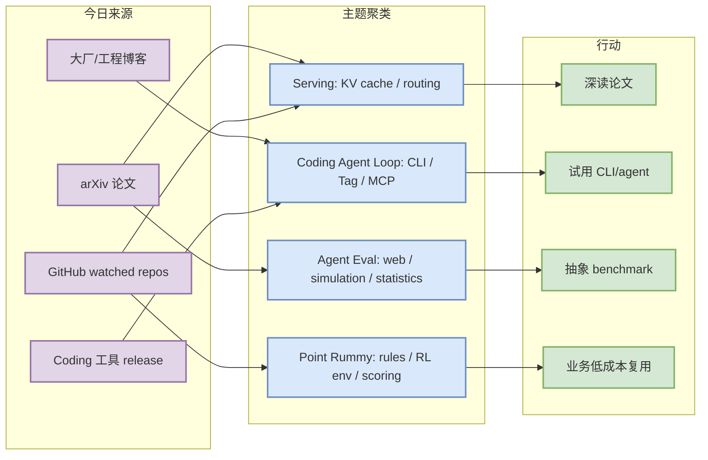
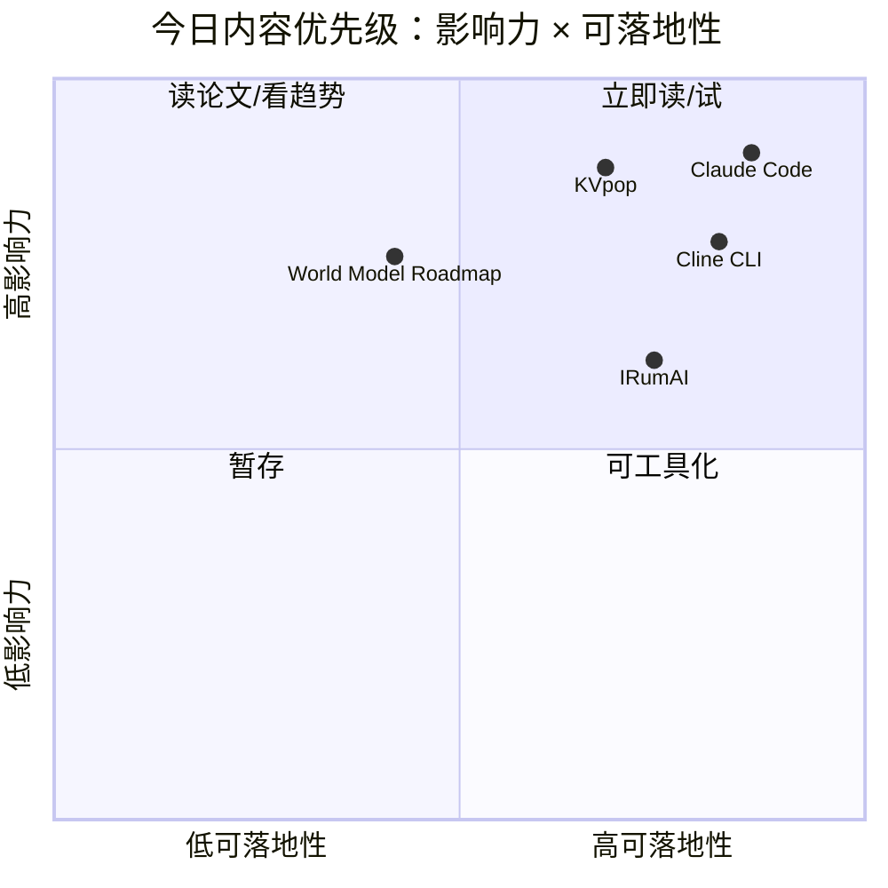

# AI Radar Daily - 2026-07-08

> 生成时间：2026-07-08 09:00 CST
> 范围：AI Infra / LLM / RL / Game AI / 大厂博客 / 论文 / GitHub / Coding 工具
> 说明：日报是总览导航页，详情页负责深度理解。GitHub Search 今日中途触发 403 rate limit，因此 broad GitHub 榜单使用 watched repo 直连 API + 历史 snapshot 兜底，并显式标注。

## 0. 今日结论

- 今日最值得关注：Agent/coding-agent 方向出现强信号，Anthropic Claude Code/Claude Tag、Cline CLI、Qwen Code 与 Codex watched repo 都值得继续跟踪。
- 对 AI Infra 的直接影响：KV cache 与 LLM serving routing 论文继续集中出现，说明长上下文推理的瓶颈正在从 kernel 走向缓存/调度联合优化。
- 对 LLM 训练 / 推理 / Agent 的影响：agent 评估从静态 benchmark 转向可重复实验设计、Web 环境和仿真环境。
- 对 RL / 游戏模型训练的影响：Agentic RL simulation environment 与 world model roadmap 对游戏环境并行和 reward 设计有直接参考价值。
- 建议今天深读：KVpop、AgenticAI-Supervisor、The Making of Claude Code、Cline CLI v3.0.38、IRumAI。

## 1. 今日态势图

## 2. 必读卡片区

> [!important] The Making of Claude Code
> - 大类：博客 / Coding 工具
> - 小类：Anthropic / Claude Code
> - 重点：Anthropic 将 Claude Code 的制作过程和 Claude Tag 团队协作信号放在新闻页显著位置。
> - 为什么重要：coding agent 正在从单人 terminal helper 变成团队协作与权限/上下文组织层。
> - 详情：[[Industry/2026-07-08/the-making-of-claude-code]] / [网页详情](https://github.com/dyt27666-oss/AI-news-report-obsidians/blob/main/Industry/2026-07-08/the-making-of-claude-code.md) / [原文](https://www.anthropic.com/news)

> [!tip] KVpop -- Key-Value Cache Compression with Predictive Online Pruning
> - 大类：论文
> - 小类：LLM Serving / KV Cache
> - 重点：用预测式在线剪枝缓解长上下文 KV cache 线性增长。
> - 为什么重要：可直接映射到 vLLM/SGLang/TensorRT-LLM 的缓存策略、吞吐和延迟权衡。
> - 详情：未生成 / 未生成 / [原文](https://arxiv.org/abs/2607.05061v1)

> [!tip] Cline CLI v3.0.38
> - 大类：Coding 工具
> - 小类：Cline
> - 重点：Cline 最新 CLI release 显示它继续从 IDE extension 扩展到 CLI/SDK。
> - 为什么重要：对 terminal-first 多 agent 编排、权限模式和代码审查 loop 有直接影响。
> - 详情：[[Industry/Tools/2026-07-08/cline-cli-v3-0-38-2026-07-07]] / [网页详情](https://github.com/dyt27666-oss/AI-news-report-obsidians/blob/main/Industry/Tools/2026-07-08/cline-cli-v3-0-38-2026-07-07.md) / [原文](https://github.com/cline/cline/releases/tag/cli-v3.0.38)

> [!warning] IRumAI / Indian Rummy RLCard
> - 大类：GitHub / Business
> - 小类：Point Rummy
> - 重点：低 star 但高业务相关，提供 Indian Rummy RL agent / environment 线索。
> - 为什么重要：可用于规则建模、reward 设计、bot baseline 与仿真环境接口参考。
> - 详情：[[Business/PointRummy/2026-07-08/vdesmond-irumai]] / [网页详情](https://github.com/dyt27666-oss/AI-news-report-obsidians/blob/main/Business/PointRummy/2026-07-08/vdesmond-irumai.md) / [原文](https://github.com/vdesmond/IRumAI)

## 3. 优先级矩阵

## 4. 分类清单

| 标签 | 大类 | 小类 | 标题 | 重点概括 | 为什么重要 | Obsidian 详情 | 网页详情 | 原文 |
|---|---|---|---|---|---|---|---|---|
| 必读 | 博客 | Anthropic | The Making of Claude Code | Claude Code 产品化与团队协作信号增强 | 影响 coding-agent loop 的权限、上下文和协作模型 | [[Industry/2026-07-08/the-making-of-claude-code]] | [网页详情](https://github.com/dyt27666-oss/AI-news-report-obsidians/blob/main/Industry/2026-07-08/the-making-of-claude-code.md) | [原文](https://www.anthropic.com/news) |
| 必读 | 论文 | LLM Serving | KVpop | KV cache 在线预测剪枝 | 长上下文 serving 的缓存策略可落地 | 未生成 | 未生成 | [原文](https://arxiv.org/abs/2607.05061v1) |
| 必读 | Coding 工具 | Cline | Cline CLI v3.0.38 | CLI release 持续活跃 | terminal-first agent workflow 需要跟踪 | [[Industry/Tools/2026-07-08/cline-cli-v3-0-38-2026-07-07]] | [网页详情](https://github.com/dyt27666-oss/AI-news-report-obsidians/blob/main/Industry/Tools/2026-07-08/cline-cli-v3-0-38-2026-07-07.md) | [原文](https://github.com/cline/cline/releases/tag/cli-v3.0.38) |
| 后续 | GitHub | Point Rummy | IRumAI | Indian Rummy RL agent | 可作为业务 env/reward baseline | [[Business/PointRummy/2026-07-08/vdesmond-irumai]] | [网页详情](https://github.com/dyt27666-oss/AI-news-report-obsidians/blob/main/Business/PointRummy/2026-07-08/vdesmond-irumai.md) | [原文](https://github.com/vdesmond/IRumAI) |

## 5. 大厂资讯 / 工程博客 / Research

### 5.1 公司来源扫描矩阵

| 公司/实验室 | 来源/栏目 | 今日状态 | 高相关条数 | 代表条目 | 备注 |
|---|---|---|---:|---|---|
| OpenAI | News / Research | 访问失败/403；用 Codex GitHub 作为工具侧补充 | 0 | 无高相关新项 | OpenAI News 403 |
| Anthropic | News / Research / Engineering | 高相关 | 2 | The Making of Claude Code; Claude Tag | 页面扫描成功 |
| Google DeepMind | Blog / Research | 高相关 | 1 | World models & embodied AI | 页面扫描成功 |
| Meta AI | Blog / Research | 高相关 | 1 | Scaling How We Build and Test Our Most Advanced AI | 页面扫描成功 |
| NVIDIA | Technical Blog / AI | 访问失败/404；用 TensorRT-LLM repo 补充 | 0 | 无高相关新项 | 分类 URL 404 |
| Microsoft | Research AI | 已扫描/低置信 | 0 | 无高相关新项 | 页面可访问但未抽取到今日强相关标题 |
| Hugging Face | Blog / Papers / Releases | 高相关 | 2 | KV Caching Explained; Agentic RL | 页面扫描成功 |
| 腾讯 | AI Lab / 技术博客 | 已扫描/低置信 | 0 | 无高相关新项 | 首页可访问，未抽取到今日强相关 |
| 字节 | Seed / 技术博客 | 已扫描/低置信 | 0 | 无高相关新项 | 首页可访问，未抽取到今日强相关 |
| SpaceAI | Blog / News | 已扫描/低置信 | 0 | 无高相关新项 | 首页可访问，未抽取到 AI Infra 强相关 |

### 5.2 高相关大厂条目

| 标签 | 发布方/大厂 | 栏目/来源 | 标题 | 重点概括 | 工程/算法影响 | Obsidian 详情 | 网页详情 | 原文 |
|---|---|---|---|---|---|---|---|---|
| 必读 | Anthropic | News / Product Announcement | The Making of Claude Code | Anthropic 新闻页继续将 Claude Code 制作过程与 agentic coding 能力放在核心位置。 | 说明 coding agent 已从 demo 进入工程产品化阶段，值得关注权限、执行环境、任务拆分和团队协作模式。 | [[Industry/2026-07-08/the-making-of-claude-code]] | [网页详情](https://github.com/dyt27666-oss/AI-news-report-obsidians/blob/main/Industry/2026-07-08/the-making-of-claude-code.md) | [原文](https://www.anthropic.com/news) |
| 必读 | Anthropic | News / Product Announcement | Claude Tag is a new way for teams to work with Claude | Claude Tag 暗示 Claude 从个人助手向团队协作入口扩展。 | 对多 agent 监控和团队知识流有启发：标签/上下文路由可能成为 coding workflow 的组织层。 | [[Industry/2026-07-08/claude-tag-is-a-new-way-for-teams-to-work-with-claude]] | [网页详情](https://github.com/dyt27666-oss/AI-news-report-obsidians/blob/main/Industry/2026-07-08/claude-tag-is-a-new-way-for-teams-to-work-with-claude.md) | [原文](https://www.anthropic.com/news) |
| 必读 | Hugging Face | Blog / Engineering | KV Caching Explained: Optimizing Transformer Inference Efficiency | Hugging Face 博客突出 KV cache 推理效率解释。 | 适合和 KVpop、LLM serving routing 论文一起读，补齐实践层 KV cache mental model。 | [[Industry/2026-07-08/kv-caching-explained-optimizing-transformer-inference-efficiency]] | [网页详情](https://github.com/dyt27666-oss/AI-news-report-obsidians/blob/main/Industry/2026-07-08/kv-caching-explained-optimizing-transformer-inference-efficiency.md) | [原文](https://huggingface.co/blog) |
| 必读 | Hugging Face | Blog / Agentic RL | Agentic RL: Token-In, Token-Out Done Right | Agentic RL 成为 HF 博客显著主题，关注 token 级输入输出闭环。 | 对 post-training 与 agent 环境构造有直接关联，可跟 verl/OpenRLHF 生态联动。 | [[Industry/2026-07-08/agentic-rl-token-in-token-out-done-right]] | [网页详情](https://github.com/dyt27666-oss/AI-news-report-obsidians/blob/main/Industry/2026-07-08/agentic-rl-token-in-token-out-done-right.md) | [原文](https://huggingface.co/blog) |
| 可 skim | Meta AI | AI Blog / Engineering | Scaling How We Build and Test Our Most Advanced AI | Meta AI 博客首页显示大规模构建与测试先进 AI 的工程主题。 | 关注大规模评测、可靠性、安全测试与 release pipeline。 | 未生成 | 未生成 | [原文](https://ai.meta.com/blog/) |
| 可 skim | Google DeepMind | Blog / Research | World models & embodied AI | DeepMind 博客显著展示 world models 与 embodied AI。 | 与今日 world model roadmap 论文呼应，对 RL 游戏模型和仿真环境值得观察。 | 未生成 | 未生成 | [原文](https://deepmind.google/discover/blog/) |

## 6. GitHub 高 star Top 10

> GitHub Search 今日在主题查询阶段触发 403 rate limit；本表使用固定 watched repo 的 direct repo API 兜底，避免用主题偏置的 rummy snapshot 冒充 broad AI 榜单。

| 排名 | repo | stars | forks | language | updated_at | topics | 重点概括 | 是否值得试用 | Obsidian 详情 | 原文 |
|---:|---|---:|---:|---|---|---|---|---|---|---|
| 1 | [huggingface/transformers](https://github.com/huggingface/transformers) | 162352 | 33813 | Python | 2026-07-08T01:00:05Z | audio, deep-learning, deepseek, gemma, glm | 🤗 Transformers: the model-definition framework for state-of-the-art machine lear | 是 | [[GitHub/2026-07-08/huggingface-transformers]] | [原文](https://github.com/huggingface/transformers) |
| 2 | [anthropics/claude-code](https://github.com/anthropics/claude-code) | 136726 | 21974 | Python | 2026-07-08T01:11:47Z | 无 | Claude Code is an agentic coding tool that lives in your terminal, understands y | 是 | [[GitHub/2026-07-08/anthropics-claude-code]] | [原文](https://github.com/anthropics/claude-code) |
| 3 | [google-gemini/gemini-cli](https://github.com/google-gemini/gemini-cli) | 105831 | 14226 | TypeScript | 2026-07-08T00:58:13Z | ai, ai-agents, cli, gemini, gemini-api | An open-source AI agent that brings the power of Gemini directly into your termi | 是 | [[GitHub/2026-07-08/google-gemini-gemini-cli]] | [原文](https://github.com/google-gemini/gemini-cli) |
| 4 | [pytorch/pytorch](https://github.com/pytorch/pytorch) | 101572 | 28290 | Python | 2026-07-08T01:12:05Z | autograd, deep-learning, gpu, machine-learning, neural-network | Tensors and Dynamic neural networks in Python with strong GPU acceleration | 是 | [[GitHub/2026-07-08/pytorch-pytorch]] | [原文](https://github.com/pytorch/pytorch) |
| 5 | [openai/codex](https://github.com/openai/codex) | 96083 | 14254 | Rust | 2026-07-08T01:07:44Z | 无 | Lightweight coding agent that runs in your terminal | 是 | [[Industry/Tools/2026-07-08/openai-codex-openai-codex-watched-repo-latest-release-rust-v0-142-5]] | [原文](https://github.com/openai/codex) |
| 6 | [modelcontextprotocol/servers](https://github.com/modelcontextprotocol/servers) | 88173 | 11178 | TypeScript | 2026-07-08T00:54:39Z | 无 | Model Context Protocol Servers | 是 | 未生成 | [原文](https://github.com/modelcontextprotocol/servers) |
| 7 | [vllm-project/vllm](https://github.com/vllm-project/vllm) | 85637 | 19084 | Python | 2026-07-08T01:01:01Z | amd, blackwell, cuda, deepseek, deepseek-v3 | A high-throughput and memory-efficient inference and serving engine for LLMs | 是 | 未生成 | [原文](https://github.com/vllm-project/vllm) |
| 8 | [cline/cline](https://github.com/cline/cline) | 64419 | 6864 | TypeScript | 2026-07-08T01:08:40Z | 无 | Autonomous coding agent as an SDK, IDE extension, or CLI assistant. | 是 | 未生成 | [原文](https://github.com/cline/cline) |
| 9 | [deepspeedai/DeepSpeed](https://github.com/deepspeedai/DeepSpeed) | 42668 | 4881 | Python | 2026-07-07T18:05:37Z | billion-parameters, compression, data-parallelism, deep-learning, gpu | DeepSpeed is a deep learning optimization library that makes distributed trainin | 是 | 未生成 | [原文](https://github.com/deepspeedai/DeepSpeed) |
| 10 | [langchain-ai/langgraph](https://github.com/langchain-ai/langgraph) | 36726 | 6161 | Python | 2026-07-08T00:57:57Z | agents, ai, ai-agents, chatgpt, deepagents | Build resilient agents. | 是 | 未生成 | [原文](https://github.com/langchain-ai/langgraph) |

## 7. GitHub star 增长最快 Top 10

> 优先使用历史 snapshot；由于今日 broad GitHub Search 403，部分 watched repo 不在昨日 broad snapshot 中，增长按 direct watched repo 标注为低置信/观察，不把它当作完整全网日增。

| 排名 | repo | stars_delta | stars | forks | language | updated_at | 增长依据 | 重点概括 | Obsidian 详情 | 原文 |
|---:|---|---:|---:|---:|---|---|---|---|---|---|
| 1 | [pytorch/pytorch](https://github.com/pytorch/pytorch) | 0 | 101572 | 28290 | Python | 2026-07-08T01:12:05Z | direct watched repo; no previous broad snapshot entry；GitHub broad search 今日 403 时使用 watched repo/历史快照兜底 | Tensors and Dynamic neural networks in Python with strong GPU accelera | [[GitHub/2026-07-08/pytorch-pytorch]] | [原文](https://github.com/pytorch/pytorch) |
| 2 | [anthropics/claude-code](https://github.com/anthropics/claude-code) | 0 | 136726 | 21974 | Python | 2026-07-08T01:11:47Z | direct watched repo; no previous broad snapshot entry；GitHub broad search 今日 403 时使用 watched repo/历史快照兜底 | Claude Code is an agentic coding tool that lives in your terminal, und | [[GitHub/2026-07-08/anthropics-claude-code]] | [原文](https://github.com/anthropics/claude-code) |
| 3 | [cline/cline](https://github.com/cline/cline) | 0 | 64419 | 6864 | TypeScript | 2026-07-08T01:08:40Z | direct watched repo; no previous broad snapshot entry；GitHub broad search 今日 403 时使用 watched repo/历史快照兜底 | Autonomous coding agent as an SDK, IDE extension, or CLI assistant. | 未生成 | [原文](https://github.com/cline/cline) |
| 4 | [openai/codex](https://github.com/openai/codex) | 0 | 96083 | 14254 | Rust | 2026-07-08T01:07:44Z | direct watched repo; no previous broad snapshot entry；GitHub broad search 今日 403 时使用 watched repo/历史快照兜底 | Lightweight coding agent that runs in your terminal | [[Industry/Tools/2026-07-08/openai-codex-openai-codex-watched-repo-latest-release-rust-v0-142-5]] | [原文](https://github.com/openai/codex) |
| 5 | [vllm-project/vllm](https://github.com/vllm-project/vllm) | 0 | 85637 | 19084 | Python | 2026-07-08T01:01:01Z | direct watched repo; no previous broad snapshot entry；GitHub broad search 今日 403 时使用 watched repo/历史快照兜底 | A high-throughput and memory-efficient inference and serving engine fo | 未生成 | [原文](https://github.com/vllm-project/vllm) |
| 6 | [huggingface/transformers](https://github.com/huggingface/transformers) | 0 | 162352 | 33813 | Python | 2026-07-08T01:00:05Z | direct watched repo; no previous broad snapshot entry；GitHub broad search 今日 403 时使用 watched repo/历史快照兜底 | 🤗 Transformers: the model-definition framework for state-of-the-art ma | [[GitHub/2026-07-08/huggingface-transformers]] | [原文](https://github.com/huggingface/transformers) |
| 7 | [google-gemini/gemini-cli](https://github.com/google-gemini/gemini-cli) | 0 | 105831 | 14226 | TypeScript | 2026-07-08T00:58:13Z | direct watched repo; no previous broad snapshot entry；GitHub broad search 今日 403 时使用 watched repo/历史快照兜底 | An open-source AI agent that brings the power of Gemini directly into  | [[GitHub/2026-07-08/google-gemini-gemini-cli]] | [原文](https://github.com/google-gemini/gemini-cli) |
| 8 | [langchain-ai/langgraph](https://github.com/langchain-ai/langgraph) | 0 | 36726 | 6161 | Python | 2026-07-08T00:57:57Z | direct watched repo; no previous broad snapshot entry；GitHub broad search 今日 403 时使用 watched repo/历史快照兜底 | Build resilient agents. | 未生成 | [原文](https://github.com/langchain-ai/langgraph) |
| 9 | [modelcontextprotocol/servers](https://github.com/modelcontextprotocol/servers) | 0 | 88173 | 11178 | TypeScript | 2026-07-08T00:54:39Z | direct watched repo; no previous broad snapshot entry；GitHub broad search 今日 403 时使用 watched repo/历史快照兜底 | Model Context Protocol Servers | 未生成 | [原文](https://github.com/modelcontextprotocol/servers) |
| 10 | [deepspeedai/DeepSpeed](https://github.com/deepspeedai/DeepSpeed) | 0 | 42668 | 4881 | Python | 2026-07-07T18:05:37Z | direct watched repo; no previous broad snapshot entry；GitHub broad search 今日 403 时使用 watched repo/历史快照兜底 | DeepSpeed is a deep learning optimization library that makes distribut | 未生成 | [原文](https://github.com/deepspeedai/DeepSpeed) |

## 8. Coding 工具 / AI 工具功能更新

### 8.1 Coding 工具扫描矩阵

| 工具 | 厂商 | 来源类型 | 今日状态 | 代表更新 | 对我的影响 | 原文 |
|---|---|---|---|---|---|---|
| Claude Code | Anthropic | Changelog / News | 高相关 | 新闻页出现 The Making of Claude Code 与 Claude Tag 信号 | 团队协作、权限、上下文组织和 terminal agent 工作流需要重点跟踪 | [原文](https://docs.anthropic.com/en/release-notes/claude-code) |
| OpenAI Codex | OpenAI | GitHub Release / Docs | 高相关 | openai/codex watched repo 今日活跃；latest release rust-v0.142.5 | Codex CLI/终端代理仍是多 agent 编排核心候选 | [原文](https://github.com/openai/codex/releases) |
| Cursor | Cursor | Changelog | 已扫描/低置信 | 未能稳定抽取今日高相关新项 | 继续观察 agent mode、远程执行、rate limit | [原文](https://cursor.com/changelog) |
| Windsurf | Windsurf | Changelog | 已扫描/低置信 | 未能稳定抽取今日高相关新项 | 继续观察 IDE agent 与企业权限变化 | [原文](https://windsurf.com/changelog) |
| GitHub Copilot | GitHub | Changelog / Blog | 已扫描/低置信 | 未发现比 coding-agent repos 更强的新信号 | 继续观察 agent mode、PR review、workspace integration | [原文](https://github.blog/changelog/label/copilot/) |
| Gemini Code Assist | Google | Release Notes | 已扫描/低置信 | 以 Gemini CLI repo 作为强相关 watchlist；Code Assist release notes 未抽取到新强信号 | Google coding agent 生态可能向 CLI + IDE 两条线收敛 | [原文](https://cloud.google.com/gemini/docs/codeassist/release-notes) |
| Qwen Code | Alibaba/Qwen | GitHub Release | 高相关 | latest release v0.19.7，repo 今日活跃 | 国产开源终端 coding agent，适合纳入本地多模型 coding workflow 对比 | [原文](https://github.com/QwenLM/qwen-code/releases/tag/v0.19.7) |
| Roo Code | Roo Code | GitHub Release | 观察 | latest release v3.54.0 | VS Code agent 团队化模式可作为 Cline/Continue 对照 | [原文](https://github.com/RooCodeInc/Roo-Code/releases/tag/v3.54.0) |
| Cline | Cline | GitHub Release | 高相关 | CLI v3.0.38 于 2026-07-07 发布 | Cline 正在从 IDE extension 扩到 SDK/CLI，影响 terminal-first agent workflow | [原文](https://github.com/cline/cline/releases/tag/cli-v3.0.38) |
| Continue | Continue | GitHub Release | 观察 | latest release v2.0.0-vscode | 开源 coding agent，可用于自托管 IDE workflow | [原文](https://github.com/continuedev/continue/releases/tag/v2.0.0-vscode) |

### 8.2 高相关工具更新

| 标签 | 工具/厂商 | 来源类型 | 标题/功能 | 重点概括 | 对 AI coding 工作流的影响 | Obsidian 详情 | 网页详情 | 原文 |
|---|---|---|---|---|---|---|---|---|
| 必读 | Claude Code / Anthropic | Changelog / News | 新闻页出现 The Making of Claude Code 与 Claude Tag 信号 | 高相关 | 团队协作、权限、上下文组织和 terminal agent 工作流需要重点跟踪 | [[Industry/2026-07-08/the-making-of-claude-code]] | [网页详情](https://github.com/dyt27666-oss/AI-news-report-obsidians/blob/main/Industry/2026-07-08/the-making-of-claude-code.md) | [原文](https://docs.anthropic.com/en/release-notes/claude-code) |
| 必读 | OpenAI Codex / OpenAI | GitHub Release / Docs | openai/codex watched repo 今日活跃；latest release rust-v0.142.5 | 高相关 | Codex CLI/终端代理仍是多 agent 编排核心候选 | [[Industry/Tools/2026-07-08/openai-codex-openai-codex-watched-repo-latest-release-rust-v0-142-5]] | [网页详情](https://github.com/dyt27666-oss/AI-news-report-obsidians/blob/main/Industry/Tools/2026-07-08/openai-codex-openai-codex-watched-repo-latest-release-rust-v0-142-5.md) | [原文](https://github.com/openai/codex/releases) |
| 必读 | Qwen Code / Alibaba/Qwen | GitHub Release | latest release v0.19.7，repo 今日活跃 | 高相关 | 国产开源终端 coding agent，适合纳入本地多模型 coding workflow 对比 | [[Industry/Tools/2026-07-08/qwen-code-latest-release-v0-19-7-repo]] | [网页详情](https://github.com/dyt27666-oss/AI-news-report-obsidians/blob/main/Industry/Tools/2026-07-08/qwen-code-latest-release-v0-19-7-repo.md) | [原文](https://github.com/QwenLM/qwen-code/releases/tag/v0.19.7) |
| 可 skim | Roo Code / Roo Code | GitHub Release | latest release v3.54.0 | 观察 | VS Code agent 团队化模式可作为 Cline/Continue 对照 | 未生成 | 未生成 | [原文](https://github.com/RooCodeInc/Roo-Code/releases/tag/v3.54.0) |
| 必读 | Cline / Cline | GitHub Release | CLI v3.0.38 于 2026-07-07 发布 | 高相关 | Cline 正在从 IDE extension 扩到 SDK/CLI，影响 terminal-first agent workflow | [[Industry/Tools/2026-07-08/cline-cli-v3-0-38-2026-07-07]] | [网页详情](https://github.com/dyt27666-oss/AI-news-report-obsidians/blob/main/Industry/Tools/2026-07-08/cline-cli-v3-0-38-2026-07-07.md) | [原文](https://github.com/cline/cline/releases/tag/cli-v3.0.38) |
| 可 skim | Continue / Continue | GitHub Release | latest release v2.0.0-vscode | 观察 | 开源 coding agent，可用于自托管 IDE workflow | 未生成 | 未生成 | [原文](https://github.com/continuedev/continue/releases/tag/v2.0.0-vscode) |

## 9. Point Rummy / Indian Rummy 业务主题

### 9.1 GitHub 候选

| 标签 | repo | stars | forks | language | updated_at | 重点概括 | 业务可用性 | Obsidian 详情 | 原文 |
|---|---|---:|---:|---|---|---|---|---|---|
| 后续 | [mudont/indian-rummy](https://github.com/mudont/indian-rummy) | 5 | 0 | TypeScript | 2025-08-08T21:05:04Z | Typescript library for Indian Rummy card game | 规则建模/计分/AI opponent/前后端参考，需代码质量复核 | [[Business/PointRummy/2026-07-08/mudont-indian-rummy]] | [原文](https://github.com/mudont/indian-rummy) |
| 后续 | [dv-rastogi/Rummy](https://github.com/dv-rastogi/Rummy) | 5 | 0 | Python | 2023-09-26T11:21:39Z | Variation of classical Indian Rummy made in Pygame | 规则建模/计分/AI opponent/前后端参考，需代码质量复核 | [[Business/PointRummy/2026-07-08/dv-rastogi-rummy]] | [原文](https://github.com/dv-rastogi/Rummy) |
| 后续 | [vahsek300501/Indian-Rummy-](https://github.com/vahsek300501/Indian-Rummy-) | 4 | 3 | Python | 2023-09-26T11:21:46Z | Indian Rummy made in Python using PyGame | 规则建模/计分/AI opponent/前后端参考，需代码质量复核 | [[Business/PointRummy/2026-07-08/vahsek300501-indian-rummy]] | [原文](https://github.com/vahsek300501/Indian-Rummy-) |
| 低置信 | [Mohitkumar-559/RummyServer](https://github.com/Mohitkumar-559/RummyServer) | 2 | 1 | JavaScript | 2024-03-17T03:48:34Z | Rummy game server for game that contain deal rummy and point rummy | 规则建模/计分/AI opponent/前后端参考，需代码质量复核 | 未生成 | [原文](https://github.com/Mohitkumar-559/RummyServer) |
| 低置信 | [abubakarmunir712/dsa-final-project](https://github.com/abubakarmunir712/dsa-final-project) | 2 | 1 | Python | 2026-06-27T06:34:26Z | A Python-based multiplayer Indian Rummy game with support for AI opponents and LAN play. I | 规则建模/计分/AI opponent/前后端参考，需代码质量复核 | 未生成 | [原文](https://github.com/abubakarmunir712/dsa-final-project) |
| 低置信 | [codingmickey/rummy-points-calculator](https://github.com/codingmickey/rummy-points-calculator) | 1 | 0 | C++ | 2024-07-10T15:40:45Z | A cpp progarm to calculate Rummy points of all the players for each round. | 规则建模/计分/AI opponent/前后端参考，需代码质量复核 | 未生成 | [原文](https://github.com/codingmickey/rummy-points-calculator) |
| 低置信 | [debabrata-mandal/RummyPulse](https://github.com/debabrata-mandal/RummyPulse) | 1 | 0 | Java | 2026-07-05T11:22:45Z | RummyPulse - Smart Rummy Game Analytics & Management Android App with Firebase integration | 规则建模/计分/AI opponent/前后端参考，需代码质量复核 | 未生成 | [原文](https://github.com/debabrata-mandal/RummyPulse) |
| 低置信 | [Alan-seb/RummyVision](https://github.com/Alan-seb/RummyVision) | 1 | 0 | Python | 2025-12-03T03:14:55Z | RummyVision is an intelligent card game assistant that combines computer vision with Monte | 规则建模/计分/AI opponent/前后端参考，需代码质量复核 | 未生成 | [原文](https://github.com/Alan-seb/RummyVision) |
| 低置信 | [atreyayelishetti/indian-rummy-game-rust](https://github.com/atreyayelishetti/indian-rummy-game-rust) | 1 | 0 | Rust | 2026-05-12T00:25:17Z | indian-rummy-rust | 规则建模/计分/AI opponent/前后端参考，需代码质量复核 | 未生成 | [原文](https://github.com/atreyayelishetti/indian-rummy-game-rust) |
| 低置信 | [SRathinaGiri/IndianRummy](https://github.com/SRathinaGiri/IndianRummy) | 1 | 1 | JavaScript | 2026-06-17T11:46:14Z | Browser-based Indian Rummy game with AI play and offline Progressive Web App support. | 规则建模/计分/AI opponent/前后端参考，需代码质量复核 | 未生成 | [原文](https://github.com/SRathinaGiri/IndianRummy) |

### 9.2 论文 / 资料候选

| 标签 | 来源 | 标题 | 作者/机构 | 重点概括 | 对 Point Rummy 业务有什么用 | Obsidian 详情 | 原文 |
|---|---|---|---|---|---|---|---|
| 低置信 | arXiv 搜索 | Indian Rummy reinforcement learning | arXiv | 今日 arXiv 精确查询返回结果弱相关，未发现高质量 Point Rummy 新论文 | 继续保留 watch；不要把弱相关 Hindi AD/BioASQ 论文误纳入 | 未生成 | [arXiv search](https://export.arxiv.org/api/query?search_query=all:Indian+Rummy+reinforcement+learning) |
| 后续 | GitHub | IRumAI / IndianRummyRLCard | vdesmond / RamSundarRadhakrishnan | 有 RL agent / RLCard 环境线索 | 可拆出环境 API、状态编码、奖励函数、baseline bot | [[Business/PointRummy/2026-07-08/vdesmond-irumai]] | [IRumAI](https://github.com/vdesmond/IRumAI) |

### 9.3 业务可用性判断

| 方向 | 今日信号 | 可用性 | 下一步 |
|---|---|---|---|
| 规则引擎 / 计分 | mudont/indian-rummy、多个 points counter | 中：可复用规则和计分逻辑，但需要测试覆盖 | 抽取 meld/sequence/set/drop scoring 单元测试 |
| Bot / RL Agent | IRumAI、IndianRummyRLCard、AI opponent 项目 | 中低：star 低但方向匹配 | 先跑最小环境，验证 action/state/reward 是否完整 |
| 仿真 / 评测 | 多数项目偏 UI/scoreboard，仿真质量未知 | 低到中 | 建立自己的 Gym/RLCard wrapper 和 baseline bot |

## 10. Loop Engineer / Loop Engineering 主题

> 今日 GitHub Search 在 loop 查询阶段 403，未得到主题搜索结果；以下用 coding-agent watched repos 作为低置信兜底，避免省略固定板块。

### 10.1 Loop Engineer GitHub 高 star Top 10

| 排名 | repo | stars | forks | language | updated_at | topics | 重点概括 | 是否值得试用 | Obsidian 详情 | 原文 |
|---:|---|---:|---:|---|---|---|---|---|---|---|
| 1 | [anthropics/claude-code](https://github.com/anthropics/claude-code) | 136726 | 21974 | Python | 2026-07-08T01:11:47Z | 无 | Claude Code is an agentic coding tool that lives in your terminal, understands y | 是 | [[GitHub/2026-07-08/anthropics-claude-code]] | [原文](https://github.com/anthropics/claude-code) |
| 2 | [google-gemini/gemini-cli](https://github.com/google-gemini/gemini-cli) | 105831 | 14226 | TypeScript | 2026-07-08T00:58:13Z | ai, ai-agents, cli, gemini, gemini-api | An open-source AI agent that brings the power of Gemini directly into your termi | 是 | [[GitHub/2026-07-08/google-gemini-gemini-cli]] | [原文](https://github.com/google-gemini/gemini-cli) |
| 3 | [openai/codex](https://github.com/openai/codex) | 96083 | 14254 | Rust | 2026-07-08T01:07:44Z | 无 | Lightweight coding agent that runs in your terminal | 是 | [[Industry/Tools/2026-07-08/openai-codex-openai-codex-watched-repo-latest-release-rust-v0-142-5]] | [原文](https://github.com/openai/codex) |
| 4 | [modelcontextprotocol/servers](https://github.com/modelcontextprotocol/servers) | 88173 | 11178 | TypeScript | 2026-07-08T00:54:39Z | 无 | Model Context Protocol Servers | 是 | 未生成 | [原文](https://github.com/modelcontextprotocol/servers) |
| 5 | [cline/cline](https://github.com/cline/cline) | 64419 | 6864 | TypeScript | 2026-07-08T01:08:40Z | 无 | Autonomous coding agent as an SDK, IDE extension, or CLI assistant. | 是 | 未生成 | [原文](https://github.com/cline/cline) |
| 6 | [langchain-ai/langgraph](https://github.com/langchain-ai/langgraph) | 36726 | 6161 | Python | 2026-07-08T00:57:57Z | agents, ai, ai-agents, chatgpt, deepagents | Build resilient agents. | 是 | 未生成 | [原文](https://github.com/langchain-ai/langgraph) |

### 10.2 Loop Engineer GitHub star 增长最快 Top 10

| 排名 | repo | stars_delta | stars | forks | language | updated_at | 增长依据 | 重点概括 | Obsidian 详情 | 原文 |
|---:|---|---:|---:|---:|---|---|---|---|---|---|
| 1 | [anthropics/claude-code](https://github.com/anthropics/claude-code) | 0 | 136726 | 21974 | Python | 2026-07-08T01:11:47Z | direct watched repo; no previous broad snapshot entry；GitHub broad search 今日 403 时使用 watched repo/历史快照兜底 | Claude Code is an agentic coding tool that lives in your terminal, und | [[GitHub/2026-07-08/anthropics-claude-code]] | [原文](https://github.com/anthropics/claude-code) |
| 2 | [cline/cline](https://github.com/cline/cline) | 0 | 64419 | 6864 | TypeScript | 2026-07-08T01:08:40Z | direct watched repo; no previous broad snapshot entry；GitHub broad search 今日 403 时使用 watched repo/历史快照兜底 | Autonomous coding agent as an SDK, IDE extension, or CLI assistant. | 未生成 | [原文](https://github.com/cline/cline) |
| 3 | [openai/codex](https://github.com/openai/codex) | 0 | 96083 | 14254 | Rust | 2026-07-08T01:07:44Z | direct watched repo; no previous broad snapshot entry；GitHub broad search 今日 403 时使用 watched repo/历史快照兜底 | Lightweight coding agent that runs in your terminal | [[Industry/Tools/2026-07-08/openai-codex-openai-codex-watched-repo-latest-release-rust-v0-142-5]] | [原文](https://github.com/openai/codex) |
| 4 | [google-gemini/gemini-cli](https://github.com/google-gemini/gemini-cli) | 0 | 105831 | 14226 | TypeScript | 2026-07-08T00:58:13Z | direct watched repo; no previous broad snapshot entry；GitHub broad search 今日 403 时使用 watched repo/历史快照兜底 | An open-source AI agent that brings the power of Gemini directly into  | [[GitHub/2026-07-08/google-gemini-gemini-cli]] | [原文](https://github.com/google-gemini/gemini-cli) |
| 5 | [langchain-ai/langgraph](https://github.com/langchain-ai/langgraph) | 0 | 36726 | 6161 | Python | 2026-07-08T00:57:57Z | direct watched repo; no previous broad snapshot entry；GitHub broad search 今日 403 时使用 watched repo/历史快照兜底 | Build resilient agents. | 未生成 | [原文](https://github.com/langchain-ai/langgraph) |
| 6 | [modelcontextprotocol/servers](https://github.com/modelcontextprotocol/servers) | 0 | 88173 | 11178 | TypeScript | 2026-07-08T00:54:39Z | direct watched repo; no previous broad snapshot entry；GitHub broad search 今日 403 时使用 watched repo/历史快照兜底 | Model Context Protocol Servers | 未生成 | [原文](https://github.com/modelcontextprotocol/servers) |

### 10.3 Loop Engineering 方法信号

| 标签 | 来源 | 标题 | 重点概括 | 对 AI coding 工作流的影响 | Obsidian 详情 | 原文 |
|---|---|---|---|---|---|---|
| 必读 | arXiv | Agentic AI autonomous model discovery evaluation | 把 stochastic/adaptive agent 评估变成实验设计 | 多 agent coding 不能只看单次成功率，要做统计设计 | [[Papers/2026-07-08/an-experimental-design-approach-to-evaluating-agentic-ai-s-autonomous-model-disc]] | [原文](https://arxiv.org/abs/2607.06413v1) |
| 必读 | arXiv | AgenticAI-Supervisor simulation environments | 用可验证交互环境替代静态题库 | 适合 coding-agent loop 的 regression/eval harness | [[Papers/2026-07-08/beyond-static-evaluation-building-simulation-environments-for-scalable-agentic-r]] | [原文](https://arxiv.org/abs/2607.05773v1) |

## 11. 论文

### 11.1 Serving / Agent Eval / World Model

| 标签 | 论文来源 | 论文 | 作者/机构 | 重点概括 | 工程/研究价值 | Obsidian 详情 | 网页详情 | PDF/原文 |
|---|---|---|---|---|---|---|---|---|
| 必读 | arXiv / 预印本 | Danus: Orchestrating Mathematical Reasoning Agents with Fact-Graph Memory | arXiv authors | 用事实图记忆协调数学推理 agent，信号指向多 agent 并行证明、长期状态管理和任务分解。 | 对 coding-agent loop 和复杂任务编排很有参考价值：不是单次 benchmark，而是如何组织 agent 群和共享可验证中间状态。 | [[Papers/2026-07-08/danus-orchestrating-mathematical-reasoning-agents-with-fact-graph-memory]] | [网页详情](https://github.com/dyt27666-oss/AI-news-report-obsidians/blob/main/Papers/2026-07-08/danus-orchestrating-mathematical-reasoning-agents-with-fact-graph-memory.md) | [abs](https://arxiv.org/abs/2607.06447v1) / [pdf](https://arxiv.org/pdf/2607.06447v1) |
| 必读 | arXiv / 预印本 | An Experimental Design Approach to Evaluating Agentic AI's Autonomous Model Discovery | arXiv authors | 把自主模型发现类 coding/data agent 的评估改成实验设计问题，强调随机性、自适应性和多次运行统计。 | 对 AI coding workflow 的评测很直接：不能只跑一次任务，需要设计可复现、可比较的实验矩阵。 | [[Papers/2026-07-08/an-experimental-design-approach-to-evaluating-agentic-ai-s-autonomous-model-disc]] | [网页详情](https://github.com/dyt27666-oss/AI-news-report-obsidians/blob/main/Papers/2026-07-08/an-experimental-design-approach-to-evaluating-agentic-ai-s-autonomous-model-disc.md) | [abs](https://arxiv.org/abs/2607.06413v1) / [pdf](https://arxiv.org/pdf/2607.06413v1) |
| 必读 | arXiv / 预印本 | WebRetriever: A Large-Scale Comprehensive Benchmark for Efficient Web Agent Evaluation | arXiv authors | 面向 Web agent 的大规模评测，关注导航、任务完成和效率，而不是只看静态问答。 | 适合纳入 agent benchmark watchlist，帮助评估工具调用、多步检索、浏览器执行链路。 | [[Papers/2026-07-08/webretriever-a-large-scale-comprehensive-benchmark-for-efficient-web-agent-evalu]] | [网页详情](https://github.com/dyt27666-oss/AI-news-report-obsidians/blob/main/Papers/2026-07-08/webretriever-a-large-scale-comprehensive-benchmark-for-efficient-web-agent-evalu.md) | [abs](https://arxiv.org/abs/2607.06118v1) / [pdf](https://arxiv.org/pdf/2607.06118v1) |
| 必读 | arXiv / 预印本 | Beyond Static Evaluation: Building Simulation Environments for Scalable Agentic Reinforcement Learning | arXiv authors | 提出 API/UI 驱动的 RL Gym 环境，把 agent 评估从静态题库推进到可验证交互环境。 | 对 RL 游戏模型和 coding-agent loop 都重要：核心是环境构造、并行执行、可验证 reward。 | [[Papers/2026-07-08/beyond-static-evaluation-building-simulation-environments-for-scalable-agentic-r]] | [网页详情](https://github.com/dyt27666-oss/AI-news-report-obsidians/blob/main/Papers/2026-07-08/beyond-static-evaluation-building-simulation-environments-for-scalable-agentic-r.md) | [abs](https://arxiv.org/abs/2607.05773v1) / [pdf](https://arxiv.org/pdf/2607.05773v1) |
| 必读 | arXiv / 预印本 | KVpop -- Key-Value Cache Compression with Predictive Online Pruning | arXiv authors | 针对长上下文解码 KV cache 线性增长，用预测式在线剪枝替代静态启发式 eviction。 | 直接对应 serving 成本与延迟瓶颈，可作为 vLLM/SGLang/TensorRT-LLM KV 管理策略的跟进方向。 | 未生成 | 未生成 | [abs](https://arxiv.org/abs/2607.05061v1) / [pdf](https://arxiv.org/pdf/2607.05061v1) |
| 必读 | arXiv / 预印本 | Online Linear Programming for Multi-Objective Routing in LLM Serving | arXiv authors | 把 LLM serving 请求路由建模为有 KV cache 与 batch 约束的多目标在线优化。 | 对推理调度器很实用：能把 SLO、吞吐和缓存压力显式纳入路由决策。 | 未生成 | 未生成 | [abs](https://arxiv.org/abs/2607.03948v1) / [pdf](https://arxiv.org/pdf/2607.03948v1) |
| 可 skim | arXiv / 预印本 | A Definition and Roadmap for World Models | arXiv authors | 给 world model 提供定义与路线图，覆盖 model-based RL、视频生成、具身智能和 physical AI。 | 对游戏 RL 与仿真训练有框架意义，可帮助区分“生成模型演示”和真正可交互环境模型。 | 未生成 | 未生成 | [abs](https://arxiv.org/abs/2607.06401v1) / [pdf](https://arxiv.org/pdf/2607.06401v1) |

## 12. 资讯 / 其他 GitHub 项目

### 12.1 AI Infra / Agent Framework

| 标签 | 来源 | 标题 | 重点概括 | 对我有什么用 | Obsidian 详情 | 网页详情 | 原文 |
|---|---|---|---|---|---|---|---|
| 必读 | GitHub | vLLM / SGLang / TensorRT-LLM | 三条 serving runtime 仍然高活跃 | 对比 scheduler、KV cache、GPU runtime 设计 | 未生成 | 未生成 | [vLLM](https://github.com/vllm-project/vllm) |
| 后续 | GitHub | verl / OpenRLHF | RL post-training 框架持续活跃 | 适合和 Agentic RL 环境论文一起看 | 未生成 | 未生成 | [verl](https://github.com/volcengine/verl) |

## 13. 按主题索引

### AI Infra / Serving / Training

- 未生成 - KV cache 在线剪枝。
- 未生成 - 高吞吐 LLM serving runtime。

### LLM / Agent / RAG / Evaluation

- [[Papers/2026-07-08/danus-orchestrating-mathematical-reasoning-agents-with-fact-graph-memory]] - fact-graph memory 协调推理 agents。
- [[Papers/2026-07-08/an-experimental-design-approach-to-evaluating-agentic-ai-s-autonomous-model-disc]] - agentic AI 评估实验设计。

### RL / Game AI / World Model

- 未生成 - world model 定义与路线图。
- [[Papers/2026-07-08/beyond-static-evaluation-building-simulation-environments-for-scalable-agentic-r]] - agentic RL 仿真环境。

### Point Rummy / Indian Rummy

- [[Business/PointRummy/2026-07-08/vdesmond-irumai]] - Indian Rummy RL agent。
- [[Business/PointRummy/2026-07-08/mudont-indian-rummy]] - TypeScript rules/library 参考。

### Loop Engineer / Coding Agent Loop

- [[Industry/2026-07-08/the-making-of-claude-code]] - coding-agent 产品化信号。
- [[Industry/Tools/2026-07-08/cline-cli-v3-0-38-2026-07-07]] - CLI coding agent 更新。

### 公司 / 实验室

- OpenAI: Codex watched repo / OpenAI News 403
- Anthropic: [[Industry/2026-07-08/the-making-of-claude-code]]
- DeepMind: 未生成
- Meta: 未生成
- NVIDIA: TensorRT-LLM watched repo / blog URL 404
- Hugging Face: [[Industry/2026-07-08/kv-caching-explained-optimizing-transformer-inference-efficiency]]

## 14. 值得后续深挖

| 标签 | 大类 | 小类 | 标题 | 后续动作 | Obsidian 详情 | 原文 |
|---|---|---|---|---|---|---|
| 必读 | 论文 | Serving | KVpop | 看全文，比较 H2O/SnapKV/StreamingLLM 类方法 | 未生成 | [原文](https://arxiv.org/abs/2607.05061v1) |
| 必读 | 工具 | Coding Agent | Claude Code / Claude Tag | 跟踪 release notes、权限、团队标签语义 | [[Industry/2026-07-08/the-making-of-claude-code]] | [原文](https://www.anthropic.com/news) |
| 后续 | Business | Point Rummy | IRumAI / IndianRummyRLCard | 跑通环境并抽取 reward/state schema | [[Business/PointRummy/2026-07-08/vdesmond-irumai]] | [原文](https://github.com/vdesmond/IRumAI) |
| 后续 | 论文 | Agent Eval | AgenticAI-Supervisor | 检查是否能迁移为 coding-agent eval harness | [[Papers/2026-07-08/beyond-static-evaluation-building-simulation-environments-for-scalable-agentic-r]] | [原文](https://arxiv.org/abs/2607.05773v1) |

## 15. 采集失败或低置信来源

- GitHub Search：今日在主题搜索后触发大量 `HTTP Error 403: rate limit exceeded`；已保存当前 snapshot，但 broad Top 10 使用 direct repo API 兜底，并明确标注低置信。
- OpenAI News：403 Forbidden；使用 OpenAI Codex GitHub release/docs 作为 coding 工具侧补充。
- NVIDIA Technical Blog 分类 URL：404；使用 TensorRT-LLM watched repo 补充 AI Infra 信号。
- arXiv：Point Rummy 精确查询返回弱相关结果，未纳入高相关论文。

## 16. 归档标签

#ai-radar #daily #ai-infra #llm #rl #point-rummy #loop-engineering
