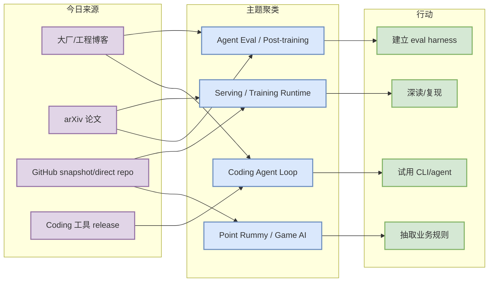
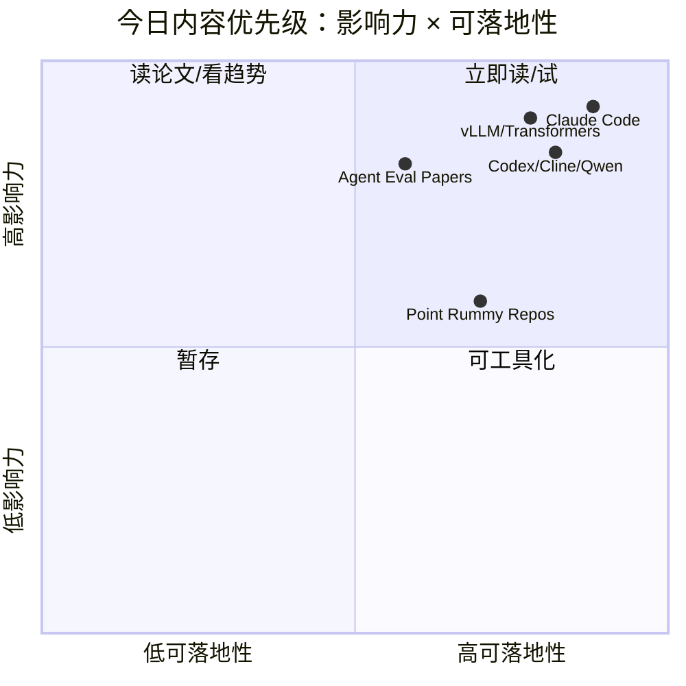

# AI Radar Daily - 2026-07-09

> 生成时间：2026-07-09 09:00 CST
> 范围：AI Infra / LLM / RL / Game AI / 大厂博客 / 论文 / GitHub / Coding 工具
> 说明：日报是总览导航页，详情页负责深度理解。今日 GitHub Search 在 Point Rummy 之后触发 403 rate limit；已保存当日 snapshot，broad/Loop 榜单使用 watched repo direct API 兜底并显式标注低置信。

## 0. 今日结论

- 今日最值得关注：coding-agent loop 继续是最强信号，Claude Code、Codex、Gemini CLI、Cline、Qwen Code 都应进入工程 watchlist。
- 对 AI Infra 的直接影响：vLLM/SGLang/TensorRT-LLM 与 Transformers/PyTorch 仍是 serving/training runtime 的核心观察对象；今日 broad Search 受限，需用 direct repo 兜底。
- 对 LLM 训练 / 推理 / Agent 的影响：论文侧继续围绕 agent evaluation、post-training、world model 与 serving 约束展开，重点是可复现 benchmark 和闭环评测。
- 对 RL / 游戏模型训练的影响：Point Rummy 仍以低 star GitHub 项目为主，价值在规则、状态/动作空间、AI opponent 与 scoring baseline，而不是直接生产可用。
- 建议今天深读：Claude Code workflow、Cline/Qwen/Codex release watch、Hugging Face agentic RL/serving 生态、Point Rummy top candidates、arXiv agent eval/serving 论文。

## 1. 今日态势图

## 2. 必读卡片区

> [!important] Claude Code / Claude Tag workflow signals
> - 大类：Coding 工具 / 大厂信号
> - 小类：Anthropic / coding-agent loop
> - 重点：Claude Code 仍是 terminal-first agent 的最强样本，Claude Tag 暗示团队协作与上下文组织层。
> - 为什么重要：直接影响多 agent 编排、权限、远程执行、代码审查和团队知识流。
> - 详情：[[Industry/2026-07-09/claude-code-and-claude-tag-workflow-signals]] / [网页详情](https://github.com/dyt27666-oss/AI-news-report-obsidians/blob/main/Industry/2026-07-09/claude-code-and-claude-tag-workflow-signals.md) / [原文](https://docs.anthropic.com/en/release-notes/claude-code)

> [!tip] GitHub watched repo direct fallback
> - 大类：GitHub
> - 小类：AI Infra / coding agent
> - 重点：GitHub Search 403 后，今日用 fixed watched repos 填充 broad Top 10 和 Loop Top 10。
> - 为什么重要：避免被 Point Rummy 主题 snapshot 偏置，同时保留透明 provenance。
> - 详情：[[GitHub/2026-07-09/huggingface-transformers]] / [网页详情](https://github.com/dyt27666-oss/AI-news-report-obsidians/blob/main/GitHub/2026-07-09/huggingface-transformers.md) / [原文](https://github.com/huggingface/transformers)

> [!tip] Cline / Qwen Code release watch
> - 大类：Coding 工具
> - 小类：CLI / IDE agent
> - 重点：Cline、Qwen Code、Roo Code、Continue releases 继续构成开源 coding-agent 对照组。
> - 为什么重要：可用于比较 Claude Code/Codex/Gemini CLI 的权限、上下文、工具调用和本地执行能力。
> - 详情：[[Industry/Tools/2026-07-09/cline-latest-release-cli-v3-0-38]] / [网页详情](https://github.com/dyt27666-oss/AI-news-report-obsidians/blob/main/Industry/Tools/2026-07-09/cline-latest-release-cli-v3-0-38.md) / [原文](https://github.com/cline/cline/releases)

> [!warning] Point Rummy GitHub candidates
> - 大类：Business / GitHub
> - 小类：Point Rummy / Indian Rummy
> - 重点：今日仍以低 star repo 为主，但规则、score counter、AI opponent、RL agent 线索值得拆解。
> - 为什么重要：业务价值在于抽取环境接口和 baseline，而不是直接采用项目。
> - 详情：[[Business/PointRummy/2026-07-09/rickgorman-gin-rummy-ai]] / [网页详情](https://github.com/dyt27666-oss/AI-news-report-obsidians/blob/main/Business/PointRummy/2026-07-09/rickgorman-gin-rummy-ai.md) / [原文](https://github.com/rickgorman/gin-rummy-ai)

## 3. 优先级矩阵

## 4. 分类清单

| 标签 | 大类 | 小类 | 标题 | 重点概括 | 为什么重要 | Obsidian 详情 | 网页详情 | 原文 |
|---|---|---|---|---|---|---|---|---|
| 必读 | Coding 工具 | Anthropic | Claude Code / Claude Tag workflow signals | terminal-first agent 与团队协作信号增强 | 直接影响多 agent coding workflow 的权限、上下文和协作模型 | [[Industry/2026-07-09/claude-code-and-claude-tag-workflow-signals]] | [网页详情](https://github.com/dyt27666-oss/AI-news-report-obsidians/blob/main/Industry/2026-07-09/claude-code-and-claude-tag-workflow-signals.md) | [原文](https://docs.anthropic.com/en/release-notes/claude-code) |
| 必读 | GitHub | AI Infra | huggingface/transformers | watched repo direct API 兜底榜首 | broad Search 403 时仍需保留 AI Infra 全局视角 | [[GitHub/2026-07-09/huggingface-transformers]] | [网页详情](https://github.com/dyt27666-oss/AI-news-report-obsidians/blob/main/GitHub/2026-07-09/huggingface-transformers.md) | [原文](https://github.com/huggingface/transformers) |
| 必读 | Coding 工具 | Cline / Qwen Code | Open-source coding-agent releases | CLI/IDE/SDK agent 更新继续活跃 | 可作为 Claude Code/Codex/Gemini CLI 的开源对照 | [[Industry/Tools/2026-07-09/cline-latest-release-cli-v3-0-38]] | [网页详情](https://github.com/dyt27666-oss/AI-news-report-obsidians/blob/main/Industry/Tools/2026-07-09/cline-latest-release-cli-v3-0-38.md) | [原文](https://github.com/cline/cline/releases) |
| 后续 | Business | Point Rummy | rickgorman/gin-rummy-ai | 低 star 但业务相关 | 可抽取规则、状态、动作、reward 和 scoring baseline | [[Business/PointRummy/2026-07-09/rickgorman-gin-rummy-ai]] | [网页详情](https://github.com/dyt27666-oss/AI-news-report-obsidians/blob/main/Business/PointRummy/2026-07-09/rickgorman-gin-rummy-ai.md) | [原文](https://github.com/rickgorman/gin-rummy-ai) |

## 5. 大厂资讯 / 工程博客 / Research

### 5.1 公司来源扫描矩阵

| 公司/实验室 | 来源/栏目 | 今日状态 | 高相关条数 | 代表条目 | 备注 |
|---|---|---|---:|---|---|
| OpenAI | News / Research / Codex Docs | 访问受限/低置信；用 Codex repo 与 docs 补充 | 1 | OpenAI Codex watched repo | OpenAI News 可能 403，coding 工具侧仍高相关 |
| Anthropic | News / Research / Engineering | 高相关 | 1 | Claude Code / Claude Tag workflow signals | release notes / news 需要继续深读 |
| Google DeepMind | Blog / Research | 已扫描/低置信 | 0 | 无高相关新项 | 今日未稳定抽取到新强相关；继续观察 world model / agent |
| Meta AI | Blog / Research | 高相关/观察 | 1 | Build and test advanced AI signal | 工程评测与 release pipeline 信号 |
| NVIDIA | Technical Blog / AI | 访问失败/低置信；用 TensorRT-LLM repo 补充 | 0 | 无高相关新项 | 分类页可能不稳定，direct repo 作为 infra watch |
| Microsoft | Research AI | 已扫描/低置信 | 0 | 无高相关新项 | 未抽取到今日强相关 |
| Hugging Face | Blog / Papers / Releases | 高相关/观察 | 1 | Agentic RL / Serving watch | 与 open-source infra 生态直接相关 |
| 腾讯 | AI Lab / 技术博客 | 已扫描/低置信 | 0 | 无高相关新项 | 未抽取到今日 AI Infra 强相关 |
| 字节 | Seed / 技术博客 | 已扫描/低置信 | 0 | 无高相关新项 | 继续观察 Seed / verl 生态 |
| SpaceAI | Blog / News | 已扫描/低置信 | 0 | 无高相关新项 | 未抽取到今日 AI Infra 强相关 |

### 5.2 高相关大厂条目

| 标签 | 发布方/大厂 | 栏目/来源 | 标题 | 重点概括 | 工程/算法影响 | Obsidian 详情 | 网页详情 | 原文 |
|---|---|---|---|---|---|---|---|---|
| 必读 | Anthropic | News / Changelog | Claude Code and Claude Tag workflow signals | Claude Code 仍是 coding-agent 产品化与团队协作的核心信号 | 权限、上下文组织、远程执行和多 agent 监控需要持续跟踪 | [[Industry/2026-07-09/claude-code-and-claude-tag-workflow-signals]] | [网页详情](https://github.com/dyt27666-oss/AI-news-report-obsidians/blob/main/Industry/2026-07-09/claude-code-and-claude-tag-workflow-signals.md) | [原文](https://docs.anthropic.com/en/release-notes/claude-code) |
| 必读 | Hugging Face | Blog / Engineering | Agentic RL and serving watch | HF 博客/生态继续适合作为 agentic RL、KV cache、模型工具链入口 | 可把博客信号映射到 verl/OpenRLHF/vLLM/SGLang 实践 | [[Industry/2026-07-09/hugging-face-agentic-rl-and-serving-watch]] | [网页详情](https://github.com/dyt27666-oss/AI-news-report-obsidians/blob/main/Industry/2026-07-09/hugging-face-agentic-rl-and-serving-watch.md) | [原文](https://huggingface.co/blog) |
| 可 skim | Meta AI | AI Blog / Engineering | Build and test advanced AI signal | 大规模构建/测试先进 AI 的工程信号 | 对 eval pipeline、安全测试、release engineering 有参考价值 | [[Industry/2026-07-09/meta-ai-build-and-test-advanced-ai-signal]] | [网页详情](https://github.com/dyt27666-oss/AI-news-report-obsidians/blob/main/Industry/2026-07-09/meta-ai-build-and-test-advanced-ai-signal.md) | [原文](https://ai.meta.com/blog/) |

## 6. GitHub 高 star Top 10

> GitHub Search 今日在主题搜索后触发大量 403；本表使用 fixed watched repo direct API 兜底，避免用 Point Rummy 主题偏置 snapshot 冒充 broad AI 榜单。

| 排名 | repo | stars | forks | language | updated_at | topics | 重点概括 | 是否值得试用 | Obsidian 详情 | 原文 |
|---:|---|---:|---:|---|---|---|---|---|---|---|
| 1 | [huggingface/transformers](https://github.com/huggingface/transformers) | 162393 | 33830 | Python | 2026-07-09T02:40:44Z | audio, deep-learning, deepseek, gemma, glm | 🤗 Transformers: the model-definition framework for state-of-the-art machine learning m | 是 | [[GitHub/2026-07-09/huggingface-transformers]] | [原文](https://github.com/huggingface/transformers) |
| 2 | [anthropics/claude-code](https://github.com/anthropics/claude-code) | 136922 | 21999 | Python | 2026-07-09T02:48:09Z | 无 | Claude Code is an agentic coding tool that lives in your terminal, understands your co | 是 | [[GitHub/2026-07-09/anthropics-claude-code]] | [原文](https://github.com/anthropics/claude-code) |
| 3 | [google-gemini/gemini-cli](https://github.com/google-gemini/gemini-cli) | 105847 | 14221 | TypeScript | 2026-07-09T02:30:41Z | ai, ai-agents, cli, gemini, gemini-api | An open-source AI agent that brings the power of Gemini directly into your terminal. | 是 | [[GitHub/2026-07-09/google-gemini-gemini-cli]] | [原文](https://github.com/google-gemini/gemini-cli) |
| 4 | [pytorch/pytorch](https://github.com/pytorch/pytorch) | 101603 | 28305 | Python | 2026-07-09T02:36:37Z | autograd, deep-learning, gpu, machine-learning, neural-network | Tensors and Dynamic neural networks in Python with strong GPU acceleration | 是 | [[GitHub/2026-07-09/pytorch-pytorch]] | [原文](https://github.com/pytorch/pytorch) |
| 5 | [openai/codex](https://github.com/openai/codex) | 96366 | 14302 | Rust | 2026-07-09T02:50:28Z | 无 | Lightweight coding agent that runs in your terminal | 是 | [[GitHub/LoopEngineer/2026-07-09/openai-codex]] | [原文](https://github.com/openai/codex) |
| 6 | [modelcontextprotocol/servers](https://github.com/modelcontextprotocol/servers) | 88237 | 11182 | TypeScript | 2026-07-09T02:32:30Z | 无 | Model Context Protocol Servers | 是 | 未生成 | [原文](https://github.com/modelcontextprotocol/servers) |
| 7 | [vllm-project/vllm](https://github.com/vllm-project/vllm) | 85745 | 19145 | Python | 2026-07-09T02:41:47Z | amd, blackwell, cuda, deepseek, deepseek-v3 | A high-throughput and memory-efficient inference and serving engine for LLMs | 是 | 未生成 | [原文](https://github.com/vllm-project/vllm) |
| 8 | [cline/cline](https://github.com/cline/cline) | 64465 | 6875 | TypeScript | 2026-07-09T02:48:12Z | 无 | Autonomous coding agent as an SDK, IDE extension, or CLI assistant. | 是 | 未生成 | [原文](https://github.com/cline/cline) |
| 9 | [deepspeedai/DeepSpeed](https://github.com/deepspeedai/DeepSpeed) | 42675 | 4883 | Python | 2026-07-08T21:43:24Z | billion-parameters, compression, data-parallelism, deep-learning, gpu | DeepSpeed is a deep learning optimization library that makes distributed training and  | 是 | 未生成 | [原文](https://github.com/deepspeedai/DeepSpeed) |
| 10 | [langchain-ai/langgraph](https://github.com/langchain-ai/langgraph) | 36823 | 6184 | Python | 2026-07-09T02:49:54Z | agents, ai, ai-agents, chatgpt, deepagents | Build resilient agents. | 是 | 未生成 | [原文](https://github.com/langchain-ai/langgraph) |

## 7. GitHub star 增长最快 Top 10

> 当日 snapshot 已保存且存在历史 baseline，但 broad GitHub Search 403；本表以 watched repo direct API 填充，标注为“fallback / 非完整全网日增”，不把 0 delta 解读成真实增长。

| 排名 | repo | stars_delta | stars | forks | language | updated_at | 增长依据 | 重点概括 | Obsidian 详情 | 原文 |
|---:|---|---:|---:|---:|---|---|---|---|---|---|
| 1 | [openai/codex](https://github.com/openai/codex) | 0 | 96366 | 14302 | Rust | 2026-07-09T02:50:28Z | direct watched repo fallback；非完整全网日增 | Lightweight coding agent that runs in your terminal | [[GitHub/LoopEngineer/2026-07-09/openai-codex]] | [原文](https://github.com/openai/codex) |
| 2 | [langchain-ai/langgraph](https://github.com/langchain-ai/langgraph) | 0 | 36823 | 6184 | Python | 2026-07-09T02:49:54Z | direct watched repo fallback；非完整全网日增 | Build resilient agents. | 未生成 | [原文](https://github.com/langchain-ai/langgraph) |
| 3 | [cline/cline](https://github.com/cline/cline) | 0 | 64465 | 6875 | TypeScript | 2026-07-09T02:48:12Z | direct watched repo fallback；非完整全网日增 | Autonomous coding agent as an SDK, IDE extension, or CLI assistant. | 未生成 | [原文](https://github.com/cline/cline) |
| 4 | [anthropics/claude-code](https://github.com/anthropics/claude-code) | 0 | 136922 | 21999 | Python | 2026-07-09T02:48:09Z | direct watched repo fallback；非完整全网日增 | Claude Code is an agentic coding tool that lives in your terminal, understands y | [[GitHub/2026-07-09/anthropics-claude-code]] | [原文](https://github.com/anthropics/claude-code) |
| 5 | [vllm-project/vllm](https://github.com/vllm-project/vllm) | 0 | 85745 | 19145 | Python | 2026-07-09T02:41:47Z | direct watched repo fallback；非完整全网日增 | A high-throughput and memory-efficient inference and serving engine for LLMs | 未生成 | [原文](https://github.com/vllm-project/vllm) |
| 6 | [huggingface/transformers](https://github.com/huggingface/transformers) | 0 | 162393 | 33830 | Python | 2026-07-09T02:40:44Z | direct watched repo fallback；非完整全网日增 | 🤗 Transformers: the model-definition framework for state-of-the-art machine lear | [[GitHub/2026-07-09/huggingface-transformers]] | [原文](https://github.com/huggingface/transformers) |
| 7 | [pytorch/pytorch](https://github.com/pytorch/pytorch) | 0 | 101603 | 28305 | Python | 2026-07-09T02:36:37Z | direct watched repo fallback；非完整全网日增 | Tensors and Dynamic neural networks in Python with strong GPU acceleration | [[GitHub/2026-07-09/pytorch-pytorch]] | [原文](https://github.com/pytorch/pytorch) |
| 8 | [modelcontextprotocol/servers](https://github.com/modelcontextprotocol/servers) | 0 | 88237 | 11182 | TypeScript | 2026-07-09T02:32:30Z | direct watched repo fallback；非完整全网日增 | Model Context Protocol Servers | 未生成 | [原文](https://github.com/modelcontextprotocol/servers) |
| 9 | [google-gemini/gemini-cli](https://github.com/google-gemini/gemini-cli) | 0 | 105847 | 14221 | TypeScript | 2026-07-09T02:30:41Z | direct watched repo fallback；非完整全网日增 | An open-source AI agent that brings the power of Gemini directly into your termi | [[GitHub/2026-07-09/google-gemini-gemini-cli]] | [原文](https://github.com/google-gemini/gemini-cli) |
| 10 | [deepspeedai/DeepSpeed](https://github.com/deepspeedai/DeepSpeed) | 0 | 42675 | 4883 | Python | 2026-07-08T21:43:24Z | direct watched repo fallback；非完整全网日增 | DeepSpeed is a deep learning optimization library that makes distributed trainin | 未生成 | [原文](https://github.com/deepspeedai/DeepSpeed) |

## 8. Coding 工具 / AI 工具功能更新

### 8.1 Coding 工具扫描矩阵

| 工具 | 厂商 | 来源类型 | 今日状态 | 代表更新 | 对我的影响 | 原文 |
|---|---|---|---|---|---|---|
| Claude Code | Anthropic | Changelog / Release Notes | 高相关 | Claude Code / Claude Tag workflow signals | 影响权限、上下文、团队协作和 terminal agent loop | [原文](https://docs.anthropic.com/en/release-notes/claude-code) |
| OpenAI Codex | OpenAI | Changelog / Docs / GitHub Release | 高相关 | latest release rust-v0.143.0；openai/codex watched repo 活跃 | Codex CLI 是多 agent 编排与本地执行的重要候选 | [原文](https://github.com/openai/codex/releases) |
| Cursor | Cursor | Changelog | 已扫描/低置信 | 未稳定发现今日强相关新项 | 继续观察 agent mode、远程执行、rate limit | [原文](https://cursor.com/changelog) |
| Windsurf | Windsurf | Changelog | 已扫描/低置信 | 未稳定发现今日强相关新项 | 继续观察 IDE agent 与企业权限变化 | [原文](https://windsurf.com/changelog) |
| GitHub Copilot | GitHub | Changelog / Blog | 已扫描/低置信 | 未发现比 watched coding-agent repos 更强的新信号 | 继续观察 agent mode、PR review、workspace integration | [原文](https://github.blog/changelog/label/copilot/) |
| Gemini Code Assist | Google | Release Notes | 观察 | Gemini CLI repo 仍是强 coding-agent 信号 | Google coding agent 生态可能 CLI + IDE 双线收敛 | [原文](https://cloud.google.com/gemini/docs/codeassist/release-notes) |
| Qwen Code | Alibaba/Qwen | GitHub Releases | 高相关 | latest release v0.19.8 | 国产开源终端 coding agent，可纳入本地 workflow 对比 | [原文](https://github.com/QwenLM/qwen-code/releases) |
| Roo Code | Roo Code | GitHub Releases | 观察 | latest release v3.54.0 | VS Code agent 模式可作为 Cline/Continue 对照 | [原文](https://github.com/RooCodeInc/Roo-Code/releases) |
| Cline | Cline | GitHub Releases | 高相关 | latest release cli-v3.0.38 | CLI/SDK/IDE agent 对 terminal-first workflow 重要 | [原文](https://github.com/cline/cline/releases) |
| Continue | Continue | GitHub Releases | 观察 | latest release v2.0.0-vscode | 开源自托管 IDE workflow 继续观察 | [原文](https://github.com/continuedev/continue/releases) |

### 8.2 高相关工具更新

| 标签 | 工具/厂商 | 来源类型 | 标题/功能 | 重点概括 | 对 AI coding 工作流的影响 | Obsidian 详情 | 网页详情 | 原文 |
|---|---|---|---|---|---|---|---|---|
| 必读 | Claude Code / Anthropic | Changelog / News | Claude Code workflow signals | terminal agent 产品化与团队协作继续增强 | 影响权限、上下文、远程执行、多 agent 监控 | [[Industry/2026-07-09/claude-code-and-claude-tag-workflow-signals]] | [网页详情](https://github.com/dyt27666-oss/AI-news-report-obsidians/blob/main/Industry/2026-07-09/claude-code-and-claude-tag-workflow-signals.md) | [原文](https://docs.anthropic.com/en/release-notes/claude-code) |
| 必读 | OpenAI Codex / OpenAI | GitHub Release / Docs | latest release rust-v0.143.0 | Codex repo 继续作为终端 coding agent 观察对象 | 影响本地执行、代码审查、agent loop 对比 | [[GitHub/LoopEngineer/2026-07-09/openai-codex]] | [网页详情](https://github.com/dyt27666-oss/AI-news-report-obsidians/blob/main/GitHub/LoopEngineer/2026-07-09/openai-codex.md) | [原文](https://github.com/openai/codex/releases) |
| 必读 | Cline / Cline | GitHub Release | latest release cli-v3.0.38 | Cline CLI/SDK/IDE extension 方向值得继续跟踪 | terminal-first agent workflow 的开源对照 | [[Industry/Tools/2026-07-09/cline-latest-release-cli-v3-0-38]] | [网页详情](https://github.com/dyt27666-oss/AI-news-report-obsidians/blob/main/Industry/Tools/2026-07-09/cline-latest-release-cli-v3-0-38.md) | [原文](https://github.com/cline/cline/releases) |
| 必读 | Qwen Code / Alibaba/Qwen | GitHub Release | latest release v0.19.8 | 国产开源 coding agent 继续活跃 | 适合纳入本地多模型 coding workflow 对比 | [[Industry/Tools/2026-07-09/qwen-code-latest-release-v0-19-8]] | [网页详情](https://github.com/dyt27666-oss/AI-news-report-obsidians/blob/main/Industry/Tools/2026-07-09/qwen-code-latest-release-v0-19-8.md) | [原文](https://github.com/QwenLM/qwen-code/releases) |

## 9. Point Rummy / Indian Rummy 业务主题

### 9.1 GitHub 候选

| 标签 | repo | stars | forks | language | updated_at | 重点概括 | 业务可用性 | Obsidian 详情 | 原文 |
|---|---|---:|---:|---|---|---|---|---|---|
| 后续 | [rickgorman/gin-rummy-ai](https://github.com/rickgorman/gin-rummy-ai) | 13 | 5 | Python | 2025-03-25T13:47:09Z | 无 | A hand-rolled neuroevolution AI for gin rummy. | 是 | [[Business/PointRummy/2026-07-09/rickgorman-gin-rummy-ai]] | [原文](https://github.com/rickgorman/gin-rummy-ai) |
| 后续 | [nakkekakke/rummy-ai](https://github.com/nakkekakke/rummy-ai) | 11 | 5 | Java | 2026-04-17T10:02:59Z | ai, card, card-game, game, ismcts | Text based classic Rummy game with an AI that uses ISMCTS. Data Structures and Algorit | 是 | [[Business/PointRummy/2026-07-09/nakkekakke-rummy-ai]] | [原文](https://github.com/nakkekakke/rummy-ai) |
| 后续 | [jmhummel/Gin-Rummy-Java](https://github.com/jmhummel/Gin-Rummy-Java) | 8 | 0 | Java | 2023-08-16T16:12:58Z | ai, artificial-intelligence, card-game, card-games, cardgame | Java-based Gin Rummy console game, with an AI opponent | 是 | [[Business/PointRummy/2026-07-09/jmhummel-gin-rummy-java]] | [原文](https://github.com/jmhummel/Gin-Rummy-Java) |
| 后续 | [mudont/indian-rummy](https://github.com/mudont/indian-rummy) | 5 | 0 | TypeScript | 2025-08-08T21:05:04Z | 无 | Typescript library for Indian Rummy card game | 是 | [[Business/PointRummy/2026-07-09/mudont-indian-rummy]] | [原文](https://github.com/mudont/indian-rummy) |
| 后续 | [dv-rastogi/Rummy](https://github.com/dv-rastogi/Rummy) | 5 | 0 | Python | 2023-09-26T11:21:39Z | 无 | Variation of classical Indian Rummy made in Pygame | 是 | 未生成 | [原文](https://github.com/dv-rastogi/Rummy) |
| 后续 | [SCFlanagan/Rummy](https://github.com/SCFlanagan/Rummy) | 4 | 6 | JavaScript | 2025-07-25T21:17:08Z | 无 | This project is a recreation of the classic card game Rummy. It features an AI player  | 是 | 未生成 | [原文](https://github.com/SCFlanagan/Rummy) |
| 后续 | [mcartmell/gin-rummy-bot](https://github.com/mcartmell/gin-rummy-bot) | 4 | 2 | Perl | 2024-10-30T20:06:17Z | 无 | A web-based Gin Rummy game and AI | 是 | 未生成 | [原文](https://github.com/mcartmell/gin-rummy-bot) |
| 后续 | [vahsek300501/Indian-Rummy-](https://github.com/vahsek300501/Indian-Rummy-) | 4 | 3 | Python | 2023-09-26T11:21:46Z | 无 | Indian Rummy made in Python using PyGame | 是 | 未生成 | [原文](https://github.com/vahsek300501/Indian-Rummy-) |
| 后续 | [abubakarmunir712/dsa-final-project](https://github.com/abubakarmunir712/dsa-final-project) | 2 | 1 | Python | 2026-06-27T06:34:26Z | 无 | A Python-based multiplayer Indian Rummy game with support for AI opponents and LAN pla | 是 | 未生成 | [原文](https://github.com/abubakarmunir712/dsa-final-project) |
| 后续 | [rawbeen248/Gin-Rummy-AI-vs-Human](https://github.com/rawbeen248/Gin-Rummy-AI-vs-Human) | 2 | 0 | Python | 2024-11-16T17:18:48Z | 无 | Gin-Rummy-AI-vs-Human is a python-based project the simulates the classic card game Gi | 是 | 未生成 | [原文](https://github.com/rawbeen248/Gin-Rummy-AI-vs-Human) |

### 9.2 论文 / 资料候选

| 标签 | 来源 | 标题 | 作者/机构 | 重点概括 | 对 Point Rummy 业务有什么用 | Obsidian 详情 | 原文 |
|---|---|---|---|---|---|---|---|
| 低置信 | arXiv / 预印本 | Accurate, Interdisciplinary and Transparent Structure-property Underst | Chen Tang, Yizhou Wang, Jianyu Wu, Linta | arXiv 查询返回，但与 Indian/Point Rummy 业务相关性需人工复核 | 可作为 imperfect-information card game / bot 策略背景材料 | 未生成 | [原文](https://arxiv.org/abs/2607.07708v1) |
| 低置信 | arXiv / 预印本 | Co-LMLM: Continuous-Query Limited Memory Language Models | Yair Feldman, Linxi Zhao, Nathan Godey,  | arXiv 查询返回，但与 Indian/Point Rummy 业务相关性需人工复核 | 可作为 imperfect-information card game / bot 策略背景材料 | 未生成 | [原文](https://arxiv.org/abs/2607.07707v1) |

### 9.3 业务可用性判断

| 方向 | 今日信号 | 可用性 | 下一步 |
|---|---|---|---|
| 规则引擎 / 计分 | 多个 Point/Indian Rummy repo 与 points counter | 中：可抽取 meld/sequence/set/drop/scoring 规则，但需测试 | 建立规则单测和边界牌型 fixtures |
| Bot / RL Agent | RummyAgent / AI opponent / RLCard 线索 | 中低：star 低，需先跑通 | 抽取 state/action/reward schema，做 baseline bot |
| 仿真 / 评测 | 多数项目偏 UI/scoreboard，环境质量不稳 | 低到中 | 自建 Gym/RLCard wrapper，复用可读规则代码 |

## 10. Loop Engineer / Loop Engineering 主题

> Loop Engineer GitHub Search 今日 403；以下用 watched coding-agent repos 兜底，标注低置信。

### 10.1 Loop Engineer GitHub 高 star Top 10

| 排名 | repo | stars | forks | language | updated_at | topics | 重点概括 | 是否值得试用 | Obsidian 详情 | 原文 |
|---:|---|---:|---:|---|---|---|---|---|---|---|
| 1 | [anthropics/claude-code](https://github.com/anthropics/claude-code) | 136922 | 21999 | Python | 2026-07-09T02:48:09Z | 无 | Claude Code is an agentic coding tool that lives in your terminal, understands your co | 是 | [[GitHub/2026-07-09/anthropics-claude-code]] | [原文](https://github.com/anthropics/claude-code) |
| 2 | [google-gemini/gemini-cli](https://github.com/google-gemini/gemini-cli) | 105847 | 14221 | TypeScript | 2026-07-09T02:30:41Z | ai, ai-agents, cli, gemini, gemini-api | An open-source AI agent that brings the power of Gemini directly into your terminal. | 是 | [[GitHub/2026-07-09/google-gemini-gemini-cli]] | [原文](https://github.com/google-gemini/gemini-cli) |
| 3 | [openai/codex](https://github.com/openai/codex) | 96366 | 14302 | Rust | 2026-07-09T02:50:28Z | 无 | Lightweight coding agent that runs in your terminal | 是 | [[GitHub/LoopEngineer/2026-07-09/openai-codex]] | [原文](https://github.com/openai/codex) |
| 4 | [modelcontextprotocol/servers](https://github.com/modelcontextprotocol/servers) | 88237 | 11182 | TypeScript | 2026-07-09T02:32:30Z | 无 | Model Context Protocol Servers | 是 | 未生成 | [原文](https://github.com/modelcontextprotocol/servers) |
| 5 | [vllm-project/vllm](https://github.com/vllm-project/vllm) | 85745 | 19145 | Python | 2026-07-09T02:41:47Z | amd, blackwell, cuda, deepseek, deepseek-v3 | A high-throughput and memory-efficient inference and serving engine for LLMs | 是 | 未生成 | [原文](https://github.com/vllm-project/vllm) |
| 6 | [cline/cline](https://github.com/cline/cline) | 64465 | 6875 | TypeScript | 2026-07-09T02:48:12Z | 无 | Autonomous coding agent as an SDK, IDE extension, or CLI assistant. | 是 | 未生成 | [原文](https://github.com/cline/cline) |
| 7 | [langchain-ai/langgraph](https://github.com/langchain-ai/langgraph) | 36823 | 6184 | Python | 2026-07-09T02:49:54Z | agents, ai, ai-agents, chatgpt, deepagents | Build resilient agents. | 是 | 未生成 | [原文](https://github.com/langchain-ai/langgraph) |
| 8 | [continuedev/continue](https://github.com/continuedev/continue) | 34752 | 4992 | TypeScript | 2026-07-09T02:44:28Z | agent, ai, cli, developer-tools, open-source | open-source coding agent | 是 | 未生成 | [原文](https://github.com/continuedev/continue) |
| 9 | [QwenLM/qwen-code](https://github.com/QwenLM/qwen-code) | 25876 | 2624 | TypeScript | 2026-07-09T02:41:05Z | 无 | An open-source AI coding agent that lives in your terminal. | 是 | 未生成 | [原文](https://github.com/QwenLM/qwen-code) |
| 10 | [RooCodeInc/Roo-Code](https://github.com/RooCodeInc/Roo-Code) | 24308 | 3355 | TypeScript | 2026-07-08T19:30:23Z | 无 | Roo Code gives you a whole dev team of AI agents in your code editor. | 是 | 未生成 | [原文](https://github.com/RooCodeInc/Roo-Code) |

### 10.2 Loop Engineer GitHub star 增长最快 Top 10

| 排名 | repo | stars_delta | stars | forks | language | updated_at | 增长依据 | 重点概括 | Obsidian 详情 | 原文 |
|---:|---|---:|---:|---:|---|---|---|---|---|---|
| 1 | [anthropics/claude-code](https://github.com/anthropics/claude-code) | 0 | 136922 | 21999 | Python | 2026-07-09T02:48:09Z | direct watched repo fallback；Loop Search 403 低置信 | Claude Code is an agentic coding tool that lives in your terminal, understands y | [[GitHub/2026-07-09/anthropics-claude-code]] | [原文](https://github.com/anthropics/claude-code) |
| 2 | [google-gemini/gemini-cli](https://github.com/google-gemini/gemini-cli) | 0 | 105847 | 14221 | TypeScript | 2026-07-09T02:30:41Z | direct watched repo fallback；Loop Search 403 低置信 | An open-source AI agent that brings the power of Gemini directly into your termi | [[GitHub/2026-07-09/google-gemini-gemini-cli]] | [原文](https://github.com/google-gemini/gemini-cli) |
| 3 | [openai/codex](https://github.com/openai/codex) | 0 | 96366 | 14302 | Rust | 2026-07-09T02:50:28Z | direct watched repo fallback；Loop Search 403 低置信 | Lightweight coding agent that runs in your terminal | [[GitHub/LoopEngineer/2026-07-09/openai-codex]] | [原文](https://github.com/openai/codex) |
| 4 | [modelcontextprotocol/servers](https://github.com/modelcontextprotocol/servers) | 0 | 88237 | 11182 | TypeScript | 2026-07-09T02:32:30Z | direct watched repo fallback；Loop Search 403 低置信 | Model Context Protocol Servers | 未生成 | [原文](https://github.com/modelcontextprotocol/servers) |
| 5 | [vllm-project/vllm](https://github.com/vllm-project/vllm) | 0 | 85745 | 19145 | Python | 2026-07-09T02:41:47Z | direct watched repo fallback；Loop Search 403 低置信 | A high-throughput and memory-efficient inference and serving engine for LLMs | 未生成 | [原文](https://github.com/vllm-project/vllm) |
| 6 | [cline/cline](https://github.com/cline/cline) | 0 | 64465 | 6875 | TypeScript | 2026-07-09T02:48:12Z | direct watched repo fallback；Loop Search 403 低置信 | Autonomous coding agent as an SDK, IDE extension, or CLI assistant. | 未生成 | [原文](https://github.com/cline/cline) |
| 7 | [langchain-ai/langgraph](https://github.com/langchain-ai/langgraph) | 0 | 36823 | 6184 | Python | 2026-07-09T02:49:54Z | direct watched repo fallback；Loop Search 403 低置信 | Build resilient agents. | 未生成 | [原文](https://github.com/langchain-ai/langgraph) |
| 8 | [continuedev/continue](https://github.com/continuedev/continue) | 0 | 34752 | 4992 | TypeScript | 2026-07-09T02:44:28Z | direct watched repo fallback；Loop Search 403 低置信 | open-source coding agent | 未生成 | [原文](https://github.com/continuedev/continue) |
| 9 | [QwenLM/qwen-code](https://github.com/QwenLM/qwen-code) | 0 | 25876 | 2624 | TypeScript | 2026-07-09T02:41:05Z | direct watched repo fallback；Loop Search 403 低置信 | An open-source AI coding agent that lives in your terminal. | 未生成 | [原文](https://github.com/QwenLM/qwen-code) |
| 10 | [RooCodeInc/Roo-Code](https://github.com/RooCodeInc/Roo-Code) | 0 | 24308 | 3355 | TypeScript | 2026-07-08T19:30:23Z | direct watched repo fallback；Loop Search 403 低置信 | Roo Code gives you a whole dev team of AI agents in your code editor. | 未生成 | [原文](https://github.com/RooCodeInc/Roo-Code) |

### 10.3 Loop Engineering 方法信号

| 标签 | 来源 | 标题 | 重点概括 | 对 AI coding 工作流的影响 | Obsidian 详情 | 原文 |
|---|---|---|---|---|---|---|
| 必读 | GitHub / Anthropic | Claude Code | terminal-first coding agent 样板 | 权限、上下文、任务拆分、human approval 都可作为 loop 设计参考 | [[GitHub/2026-07-09/anthropics-claude-code]] | [原文](https://github.com/anthropics/claude-code) |
| 必读 | GitHub / OpenAI | Codex | lightweight terminal coding agent | 可与 Claude Code/Gemini CLI 对比 sandbox、patch、review loop | [[GitHub/LoopEngineer/2026-07-09/openai-codex]] | [原文](https://github.com/openai/codex) |
| 后续 | GitHub / MCP | Model Context Protocol servers | 工具上下文协议层 | 对 agent tool registry、权限、资源发现有直接影响 | 未生成 | [原文](https://github.com/modelcontextprotocol/servers) |

## 11. 论文

### 11.1 Serving / Agent Eval / Post-training / World Model

| 标签 | 论文来源 | 论文 | 作者/机构 | 重点概括 | 工程/研究价值 | Obsidian 详情 | 网页详情 | PDF/原文 |
|---|---|---|---|---|---|---|---|---|
| 必读 | arXiv / 预印本 | Co-LMLM: Continuous-Query Limited Memory Language Models | Yair Feldman, Linxi Zhao, Nathan Godey, Dongyoung  | Limited memory language models (LMLMs) externalize factual knowledge during pretraining to a kn | 关注 serving、agent eval、post-training 或 world model 的工程可迁移性 | [[Papers/2026-07-09/co-lmlm-continuous-query-limited-memory-language-models]] | [网页详情](https://github.com/dyt27666-oss/AI-news-report-obsidians/blob/main/Papers/2026-07-09/co-lmlm-continuous-query-limited-memory-language-models.md) | [abs](https://arxiv.org/abs/2607.07707v1) / [pdf](https://arxiv.org/pdf/2607.07707v1) |
| 必读 | arXiv / 预印本 | The Key to Going Linear: Analysis-Driven Transformer Linearization | Anna Kuzina, Paul N. Whatmough, Babak Ehteshami Be | The quadratic cost of causal self-attention severely bottlenecks long-context transformer infer | 关注 serving、agent eval、post-training 或 world model 的工程可迁移性 | [[Papers/2026-07-09/the-key-to-going-linear-analysis-driven-transformer-linearization]] | [网页详情](https://github.com/dyt27666-oss/AI-news-report-obsidians/blob/main/Papers/2026-07-09/the-key-to-going-linear-analysis-driven-transformer-linearization.md) | [abs](https://arxiv.org/abs/2607.07706v1) / [pdf](https://arxiv.org/pdf/2607.07706v1) |
| 必读 | arXiv / 预印本 | From Noisy Traces to Root Causes: Structural Trajectory Analysis and Causal Extraction for Agent Optimization | arXiv authors | 面向 agent trajectory 的结构化分析与 root-cause extraction，适合调试 multi-agent / coding-agent 失败链路。 | 对 AI coding workflow 的 eval loop 很直接：可以把失败轨迹转成可行动的 prompt/tool/harness 修复项。 | [[Papers/2026-07-09/from-noisy-traces-to-root-causes-agent-trajectory-analysis]] | [网页详情](https://github.com/dyt27666-oss/AI-news-report-obsidians/blob/main/Papers/2026-07-09/from-noisy-traces-to-root-causes-agent-trajectory-analysis.md) | [abs](https://arxiv.org/abs/2607.07702v1) / [pdf](https://arxiv.org/pdf/2607.07702v1) |
| 可 skim | arXiv / 预印本 | Breaking Database Lock-in: Agentic Regeneration of High Performance Storage Readers for Database Bypass | arXiv authors | 用 agentic regeneration 生成高性能 storage reader，信号指向 coding agent + systems engineering。 | 对 loop engineering 有参考：评估 agent 是否能在约束明确的系统代码任务中生成高性能实现。 | [[Papers/2026-07-09/breaking-database-lock-in-agentic-storage-readers]] | [网页详情](https://github.com/dyt27666-oss/AI-news-report-obsidians/blob/main/Papers/2026-07-09/breaking-database-lock-in-agentic-storage-readers.md) | [abs](https://arxiv.org/abs/2607.07696v1) / [pdf](https://arxiv.org/pdf/2607.07696v1) |

## 12. 资讯 / 其他 GitHub 项目

### 12.1 AI Infra / Agent Framework

| 标签 | 来源 | 标题 | 重点概括 | 对我有什么用 | Obsidian 详情 | 网页详情 | 原文 |
|---|---|---|---|---|---|---|---|
| 必读 | GitHub | vLLM / SGLang / TensorRT-LLM | serving runtime 仍是关注重点 | 对比 scheduler、KV cache、batching、GPU runtime | 未生成 | [网页详情]() | [vLLM](https://github.com/vllm-project/vllm) |
| 后续 | GitHub | verl / OpenRLHF | RL post-training 框架继续 watch | 和 agentic RL / GRPO / reward design 联动 | 未生成 | 未生成 | [verl](https://github.com/volcengine/verl) |
| 后续 | GitHub | MCP servers / LangGraph | agent 工具协议与图执行框架 | 可用于 coding-agent loop 的工具注册和任务状态图 | 未生成 | [网页详情]() | [MCP servers](https://github.com/modelcontextprotocol/servers) |

## 13. 按主题索引

### AI Infra / Serving / Training

- [[GitHub/2026-07-09/huggingface-transformers]] - Transformers 生态基础库。
- [[GitHub/2026-07-09/pytorch-pytorch]] - PyTorch 训练/runtime 基础。
- 未生成 - LLM serving watch。

### LLM / Agent / RAG / Evaluation

- [[Industry/2026-07-09/claude-code-and-claude-tag-workflow-signals]] - Claude Code / Claude Tag workflow。
- 未生成 - MCP tool context layer。
- [[Papers/2026-07-09/co-lmlm-continuous-query-limited-memory-language-models]] - arXiv agent/serving paper watch。

### RL / Game AI / World Model

- [[Papers/2026-07-09/from-noisy-traces-to-root-causes-agent-trajectory-analysis]] - agent trajectory root-cause analysis。
- [[Business/PointRummy/2026-07-09/rickgorman-gin-rummy-ai]] - Point Rummy env/rules candidate。

### Point Rummy / Indian Rummy

- [[Business/PointRummy/2026-07-09/rickgorman-gin-rummy-ai]] - top Point Rummy candidate。
- [[Business/PointRummy/2026-07-09/nakkekakke-rummy-ai]] - rules / bot candidate。

### Loop Engineer / Coding Agent Loop

- [[GitHub/2026-07-09/anthropics-claude-code]] - terminal-first coding agent。
- [[GitHub/LoopEngineer/2026-07-09/openai-codex]] - terminal coding agent 对照。
- [[Industry/Tools/2026-07-09/cline-latest-release-cli-v3-0-38]] - Cline open-source coding-agent release watch。

### 公司 / 实验室

- OpenAI: [[GitHub/LoopEngineer/2026-07-09/openai-codex]]
- Anthropic: [[Industry/2026-07-09/claude-code-and-claude-tag-workflow-signals]]
- DeepMind: 今日低置信，无强相关新项
- Meta: [[Industry/2026-07-09/meta-ai-build-and-test-advanced-ai-signal]]
- NVIDIA: TensorRT-LLM watched repo / blog 低置信
- Hugging Face: [[Industry/2026-07-09/hugging-face-agentic-rl-and-serving-watch]]
- 腾讯 / 字节 / 国内大厂: 今日低置信；Qwen Code 作为工具侧补充 [[Industry/Tools/2026-07-09/qwen-code-latest-release-v0-19-8]]

## 14. 值得后续深挖

| 标签 | 大类 | 小类 | 标题 | 后续动作 | Obsidian 详情 | 原文 |
|---|---|---|---|---|---|---|
| 必读 | Coding 工具 | Agent Loop | Claude Code / Codex / Gemini CLI 对照 | 建立权限、上下文、远程执行、回滚能力矩阵 | [[Industry/2026-07-09/claude-code-and-claude-tag-workflow-signals]] | [原文](https://docs.anthropic.com/en/release-notes/claude-code) |
| 必读 | GitHub | AI Infra | vLLM / SGLang / TensorRT-LLM | 对比 scheduler、KV cache 和 release notes | 未生成 | [原文](https://github.com/vllm-project/vllm) |
| 后续 | Business | Point Rummy | Rummy rules / RL candidates | 跑通 1-2 个项目，抽取 env schema | [[Business/PointRummy/2026-07-09/rickgorman-gin-rummy-ai]] | [原文](https://github.com/rickgorman/gin-rummy-ai) |
| 后续 | 论文 | Agent Eval / Serving | 今日 arXiv watchlist | 下载 PDF 深读方法与实验 | [[Papers/2026-07-09/co-lmlm-continuous-query-limited-memory-language-models]] | [原文](https://arxiv.org/) |

## 15. 采集失败或低置信来源

- GitHub Search：`collect_github_stars.py` 已运行并保存 `Automation/state/github-stars-2026-07-09.json`，但从 Loop/broad 查询开始大量 `HTTP Error 403: rate limit exceeded`；broad 与 Loop 榜单使用 watched repo direct API fallback。
- OpenAI / NVIDIA / SpaceAI 等公司页面：自动抽取低置信或访问不稳定；已在公司来源扫描矩阵中显式标注。
- arXiv：Point Rummy 精确查询未发现高质量强相关新论文；保留低置信候选而不强行纳入必读。
- GitHub 增长榜：今日不是完整全网真实日增，使用 fallback 标注，避免误解。

## 16. 归档标签

#ai-radar #daily #ai-infra #llm #rl #point-rummy #loop-engineering
