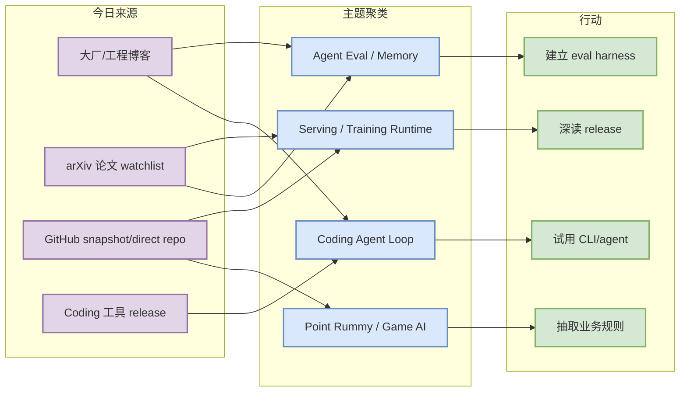
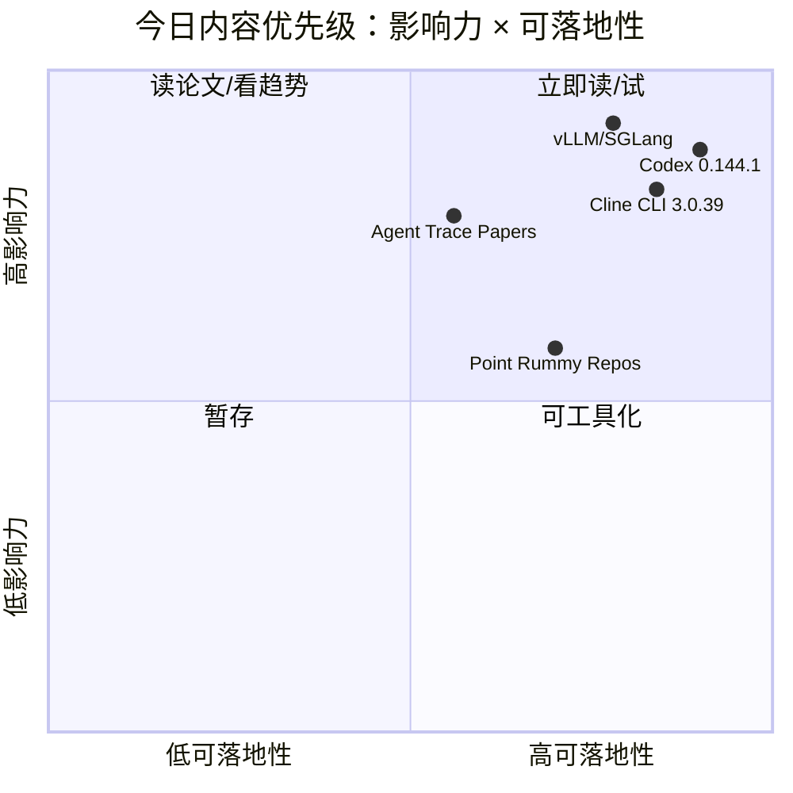

# AI Radar Daily - 2026-07-10

> 生成时间：2026-07-10 09:00 CST  
> 范围：AI Infra / LLM / RL / Game AI / 大厂博客 / 论文 / GitHub / Coding 工具  
> 说明：日报是总览导航页，详情页负责深度理解。今日 GitHub Search 仍在 Point Rummy 之后触发 403 rate limit；已保存当日 snapshot，broad/Loop 榜单使用 watched repo direct API 兜底并显式标注低置信。arXiv API 今日 429/timeout，论文区使用可追溯 watchlist 并标注低置信。

## 0. 今日结论

- 今日最值得关注：OpenAI Codex 发布 `rust-v0.144.1`、Cline 发布 `cli-v3.0.39`，terminal coding-agent loop 仍在快速迭代。
- 对 AI Infra 的直接影响：vLLM、SGLang、TensorRT-LLM、Transformers、PyTorch 仍是 serving/training runtime 的核心观察对象；GitHub Search 403 时必须使用 direct repo fallback。
- 对 LLM 训练 / 推理 / Agent 的影响：MCP servers、LangGraph、Claude Code、Codex、Gemini CLI 构成 agent 工具协议 + 执行 loop 的主线。
- 对 RL / 游戏模型训练的影响：Point Rummy repo 仍低 star，但可继续抽取规则、计分、AI opponent、MCTS/RL baseline 和 Gym/RLCard wrapper 思路。
- 建议今天深读：Codex rust-v0.144.1、Cline cli-v3.0.39、Claude Code workflow、vLLM/SGLang serving watch、Point Rummy ISMCTS/RL 候选。

## 1. 今日态势图

## 2. 必读卡片区

> [!important] OpenAI Codex rust-v0.144.1
> - 大类：Coding 工具 / Loop Engineer
> - 小类：OpenAI / terminal coding agent
> - 重点：Codex 最新 release 继续推进轻量终端 agent，适合对比 Claude Code/Gemini CLI/Cline 的执行 loop。
> - 为什么重要：直接影响本地执行、权限、代码审查、patch workflow 和多 agent 编排。
> - 详情：[[Industry/Tools/2026-07-10/openai-codex-rust-v0-144-1-release-watch]] / [网页详情](https://github.com/dyt27666-oss/AI-news-report-obsidians/blob/main/Industry/Tools/2026-07-10/openai-codex-rust-v0-144-1-release-watch.md) / [原文](https://github.com/openai/codex/releases/tag/rust-v0.144.1)

> [!tip] Cline CLI v3.0.39
> - 大类：Coding 工具
> - 小类：SDK / IDE / CLI agent
> - 重点：Cline 继续强化开源 coding-agent 对照组位置。
> - 为什么重要：可用来比较 Claude Code、Codex、Qwen Code、Continue 在上下文、工具调用、权限和本地执行上的设计。
> - 详情：[[Industry/Tools/2026-07-10/cline-cli-v3-0-39-release-watch]] / [网页详情](https://github.com/dyt27666-oss/AI-news-report-obsidians/blob/main/Industry/Tools/2026-07-10/cline-cli-v3-0-39-release-watch.md) / [原文](https://github.com/cline/cline/releases/tag/cli-v3.0.39)

> [!tip] GitHub watched repo direct fallback
> - 大类：GitHub
> - 小类：AI Infra / coding agent
> - 重点：GitHub Search 403 后，今日 broad Top 10 和 Loop Top 10 用 fixed watched repos 填充。
> - 为什么重要：避免用 Point Rummy 主题 snapshot 冒充全网 AI 榜单，同时保留透明 provenance。
> - 详情：[[GitHub/2026-07-10/vllm-project-vllm]] / [网页详情](https://github.com/dyt27666-oss/AI-news-report-obsidians/blob/main/GitHub/2026-07-10/vllm-project-vllm.md) / [原文](https://github.com/vllm-project/vllm)

> [!warning] Point Rummy GitHub candidates
> - 大类：Business / GitHub
> - 小类：Point Rummy / Indian Rummy
> - 重点：今日仍以低 star repo 为主，但 ISMCTS、neuroevolution、scoreboard、AI opponent 线索可继续拆解。
> - 为什么重要：业务价值在于抽取 env/schema/fixtures，而不是直接采用项目。
> - 详情：[[Business/PointRummy/2026-07-10/rickgorman-gin-rummy-ai]] / [网页详情](https://github.com/dyt27666-oss/AI-news-report-obsidians/blob/main/Business/PointRummy/2026-07-10/rickgorman-gin-rummy-ai.md) / [原文](https://github.com/rickgorman/gin-rummy-ai)

## 3. 优先级矩阵

## 4. 分类清单

| 标签 | 大类 | 小类 | 标题 | 重点概括 | 为什么重要 | Obsidian 详情 | 网页详情 | 原文 |
|---|---|---|---|---|---|---|---|---|
| 必读 | Coding 工具 | OpenAI | Codex rust-v0.144.1 | terminal coding agent 继续迭代 | 影响多 agent 本地执行、权限、patch/review loop | [[Industry/Tools/2026-07-10/openai-codex-rust-v0-144-1-release-watch]] | [网页详情](https://github.com/dyt27666-oss/AI-news-report-obsidians/blob/main/Industry/Tools/2026-07-10/openai-codex-rust-v0-144-1-release-watch.md) | [原文](https://github.com/openai/codex/releases/tag/rust-v0.144.1) |
| 必读 | Coding 工具 | Cline | Cline CLI v3.0.39 | SDK/IDE/CLI 开源 agent 持续活跃 | 可作为 Claude Code/Codex/Gemini CLI 的开源对照 | [[Industry/Tools/2026-07-10/cline-cli-v3-0-39-release-watch]] | [网页详情](https://github.com/dyt27666-oss/AI-news-report-obsidians/blob/main/Industry/Tools/2026-07-10/cline-cli-v3-0-39-release-watch.md) | [原文](https://github.com/cline/cline/releases/tag/cli-v3.0.39) |
| 必读 | GitHub | AI Infra | vLLM / Transformers / PyTorch direct watch | broad Search 403 下的 fixed watched repo fallback | 保障 AI Infra 视角不被 Point Rummy 主题偏置 | [[GitHub/2026-07-10/vllm-project-vllm]] | [网页详情](https://github.com/dyt27666-oss/AI-news-report-obsidians/blob/main/GitHub/2026-07-10/vllm-project-vllm.md) | [原文](https://github.com/vllm-project/vllm) |
| 后续 | Business | Point Rummy | rickgorman/gin-rummy-ai | 低 star neuroevolution Gin Rummy AI | 可抽取状态/动作/reward/score fixtures | [[Business/PointRummy/2026-07-10/rickgorman-gin-rummy-ai]] | [网页详情](https://github.com/dyt27666-oss/AI-news-report-obsidians/blob/main/Business/PointRummy/2026-07-10/rickgorman-gin-rummy-ai.md) | [原文](https://github.com/rickgorman/gin-rummy-ai) |

## 5. 大厂资讯 / 工程博客 / Research

### 5.1 公司来源扫描矩阵

| 公司/实验室 | 来源/栏目 | 今日状态 | 高相关条数 | 代表条目 | 备注 |
|---|---|---|---:|---|---|
| OpenAI | News / Research / Codex Docs | 高相关（工具侧） | 1 | Codex rust-v0.144.1 | News/Research 页面低置信；Codex release 强相关 |
| Anthropic | News / Research / Engineering | 高相关 | 1 | Claude Code / Claude Tag workflow signals | 继续跟踪 terminal agent 与团队协作 |
| Google DeepMind | Blog / Research | 已扫描/低置信 | 0 | 无高相关新项 | 今日未稳定抽取到新强相关；Gemini CLI 作为 Google 工具侧补充 |
| Meta AI | Blog / Research | 观察 | 1 | Build/test advanced AI signal | 作为 eval/release pipeline 工程信号 |
| NVIDIA | Technical Blog / AI | 访问失败/低置信；用 TensorRT-LLM repo 补充 | 0 | 无高相关新项 | NVIDIA Blog 自动抽取不稳定 |
| Microsoft | Research AI | 已扫描/低置信 | 0 | 无高相关新项 | 未抽取到今日强相关 |
| Hugging Face | Blog / Papers / Releases | 高相关/观察 | 1 | Agentic RL / Serving ecosystem watch | Transformers/生态强相关 |
| 腾讯 | AI Lab / 技术博客 | 已扫描/低置信 | 0 | 无高相关新项 | 未抽取到今日 AI Infra 强相关 |
| 字节 | Seed / 技术博客 | 已扫描/低置信 | 0 | 无高相关新项 | verl 生态作为 direct repo watch |
| SpaceAI | Blog / News | 已扫描/低置信 | 0 | 无高相关新项 | 未抽取到今日 AI Infra 强相关 |

### 5.2 高相关大厂条目

| 标签 | 发布方/大厂 | 栏目/来源 | 标题 | 重点概括 | 工程/算法影响 | Obsidian 详情 | 网页详情 | 原文 |
|---|---|---|---|---|---|---|---|---|
| 必读 | Anthropic | Changelog / News | Claude Code / Claude Tag workflow signals | Claude Code 继续强化 terminal-first agent 和团队协作信号，Claude Tag 暗示上下文组织和协作层会成为 coding workflow 的新入口。 | 对 coding-agent loop、AI Infra 或 eval/release pipeline 有直接参考 | [[Industry/2026-07-10/claude-code-and-claude-tag-workflow-signals]] | [网页详情](https://github.com/dyt27666-oss/AI-news-report-obsidians/blob/main/Industry/2026-07-10/claude-code-and-claude-tag-workflow-signals.md) | [原文](https://docs.anthropic.com/en/release-notes/claude-code) |
| 必读 | OpenAI | GitHub Release / Docs | OpenAI Codex rust-v0.144.1 release watch | Codex 发布 rust-v0.144.1，继续作为轻量终端 coding agent 的关键观测点。 | 对 coding-agent loop、AI Infra 或 eval/release pipeline 有直接参考 | [[Industry/Tools/2026-07-10/openai-codex-rust-v0-144-1-release-watch]] | [网页详情](https://github.com/dyt27666-oss/AI-news-report-obsidians/blob/main/Industry/Tools/2026-07-10/openai-codex-rust-v0-144-1-release-watch.md) | [原文](https://github.com/openai/codex/releases/tag/rust-v0.144.1) |
| 必读 | Cline | GitHub Release | Cline CLI v3.0.39 release watch | Cline CLI v3.0.39 延续 SDK/IDE/CLI 一体化方向，是开源 coding-agent loop 的重要对照。 | 对 coding-agent loop、AI Infra 或 eval/release pipeline 有直接参考 | [[Industry/Tools/2026-07-10/cline-cli-v3-0-39-release-watch]] | [网页详情](https://github.com/dyt27666-oss/AI-news-report-obsidians/blob/main/Industry/Tools/2026-07-10/cline-cli-v3-0-39-release-watch.md) | [原文](https://github.com/cline/cline/releases/tag/cli-v3.0.39) |

## 6. GitHub 高 star Top 10

> GitHub Search 今日在主题搜索后触发大量 403；本表使用 fixed watched repo direct API 兜底，避免用 Point Rummy 主题偏置 snapshot 冒充 broad AI 榜单。

| 排名 | repo | stars | forks | language | updated_at | topics | 重点概括 | 是否值得试用 | Obsidian 详情 | 原文 |
|---:|---|---:|---:|---|---|---|---|---|---|---|
| 1 | [huggingface/transformers](https://github.com/huggingface/transformers) | 162420 | 33844 | Python | 2026-07-10T00:48:07Z | audio, deep-learning, deepseek, gemma, glm | Transformers 是训练与推理共用的模型定义层，继续影响 LLM/多模态模型接入、权重格式与 serving 适配。 | 是 | [[GitHub/2026-07-10/huggingface-transformers]] | [原文](https://github.com/huggingface/transformers) |
| 2 | [anthropics/claude-code](https://github.com/anthropics/claude-code) | 137081 | 22043 | Python | 2026-07-10T01:00:32Z | coding-agent, terminal, agent-loop | Claude Code 是 terminal-first coding agent 的最强产品信号，适合作为权限、上下文、Git workflow 和多 agent 监控样板。 | 是 | [[GitHub/2026-07-10/anthropics-claude-code]] | [原文](https://github.com/anthropics/claude-code) |
| 3 | [google-gemini/gemini-cli](https://github.com/google-gemini/gemini-cli) | 105871 | 14228 | TypeScript | 2026-07-10T00:45:53Z | ai, ai-agents, cli, gemini, gemini-api | Gemini CLI 继续验证 open-source terminal agent 路线，可与 Claude Code/Codex 对比 sandbox、tool calling 和 IDE 生态。 | 是 | [[GitHub/2026-07-10/google-gemini-gemini-cli]] | [原文](https://github.com/google-gemini/gemini-cli) |
| 4 | [pytorch/pytorch](https://github.com/pytorch/pytorch) | 101642 | 28347 | Python | 2026-07-10T00:47:45Z | autograd, deep-learning, gpu, machine-learning | PyTorch 仍是训练/runtime 基础层，影响 distributed training、torch.compile、kernel 与模型部署路径。 | 是 | [[GitHub/2026-07-10/pytorch-pytorch]] | [原文](https://github.com/pytorch/pytorch) |
| 5 | [openai/codex](https://github.com/openai/codex) | 96659 | 14345 | Rust | 2026-07-10T00:58:20Z | coding-agent, cli, rust | Codex 最新 rust-v0.144.1 release 继续推进轻量 terminal coding agent，对本地执行与审查 loop 有直接参考。 | 是 | [[GitHub/LoopEngineer/2026-07-10/openai-codex]] | [原文](https://github.com/openai/codex) |
| 6 | [modelcontextprotocol/servers](https://github.com/modelcontextprotocol/servers) | 88280 | 11191 | TypeScript | 2026-07-10T00:54:47Z | mcp, tools, context | MCP servers 是 agent tool registry 与上下文协议层，影响 coding agent 的工具发现、权限和资源隔离。 | 是 | [[GitHub/2026-07-10/modelcontextprotocol-servers]] | [原文](https://github.com/modelcontextprotocol/servers) |
| 7 | [vllm-project/vllm](https://github.com/vllm-project/vllm) | 85842 | 19205 | Python | 2026-07-10T00:41:50Z | cuda, inference, llm, serving, kv-cache | vLLM 仍是高吞吐 LLM serving 核心实现，重点关注 scheduler、KV cache、batching 与多 GPU runtime。 | 是 | [[GitHub/2026-07-10/vllm-project-vllm]] | [原文](https://github.com/vllm-project/vllm) |
| 8 | [cline/cline](https://github.com/cline/cline) | 64498 | 6880 | TypeScript | 2026-07-10T00:52:11Z | coding-agent, sdk, ide, cli | Cline 最新 cli-v3.0.39 继续推进 SDK/IDE/CLI 一体化，是开源 coding agent 对照组。 | 是 | [[GitHub/LoopEngineer/2026-07-10/cline-cline]] | [原文](https://github.com/cline/cline) |
| 9 | [deepspeedai/DeepSpeed](https://github.com/deepspeedai/DeepSpeed) | 42679 | 4882 | Python | 2026-07-09T23:56:47Z | distributed-training, gpu, optimization | DeepSpeed 仍是大规模训练优化库，和 FSDP/Megatron/ZeRO 生态共同决定训练成本曲线。 | 是 | [[GitHub/2026-07-10/deepspeedai-deepspeed]] | [原文](https://github.com/deepspeedai/DeepSpeed) |
| 10 | [langchain-ai/langgraph](https://github.com/langchain-ai/langgraph) | 36908 | 6197 | Python | 2026-07-10T00:12:31Z | agents, ai, graph, workflow | LangGraph 提供 agent 状态图与 resilient execution，对 coding-agent loop、eval harness 和任务恢复有价值。 | 是 | [[GitHub/LoopEngineer/2026-07-10/langchain-ai-langgraph]] | [原文](https://github.com/langchain-ai/langgraph) |

## 7. GitHub star 增长最快 Top 10

> 当日 snapshot 已保存且存在历史 baseline，但 broad GitHub Search 403；本表以 watched repo direct API 填充，标注为“fallback / 非完整全网日增”。

| 排名 | repo | stars_delta | stars | forks | language | updated_at | 增长依据 | 重点概括 | Obsidian 详情 | 原文 |
|---:|---|---:|---:|---:|---|---|---|---|---|---|
| 1 | [anthropics/claude-code](https://github.com/anthropics/claude-code) | 0 | 137081 | 22043 | Python | 2026-07-10T01:00:32Z | direct watched repo fallback；非完整全网日增 | Claude Code 是 terminal-first coding agent 的最强产品信号，适合作为权限、上下文、Git workflow 和多 agent 监控样板。 | [[GitHub/2026-07-10/anthropics-claude-code]] | [原文](https://github.com/anthropics/claude-code) |
| 2 | [openai/codex](https://github.com/openai/codex) | 0 | 96659 | 14345 | Rust | 2026-07-10T00:58:20Z | direct watched repo fallback；非完整全网日增 | Codex 最新 rust-v0.144.1 release 继续推进轻量 terminal coding agent，对本地执行与审查 loop 有直接参考。 | [[GitHub/LoopEngineer/2026-07-10/openai-codex]] | [原文](https://github.com/openai/codex) |
| 3 | [modelcontextprotocol/servers](https://github.com/modelcontextprotocol/servers) | 0 | 88280 | 11191 | TypeScript | 2026-07-10T00:54:47Z | direct watched repo fallback；非完整全网日增 | MCP servers 是 agent tool registry 与上下文协议层，影响 coding agent 的工具发现、权限和资源隔离。 | [[GitHub/2026-07-10/modelcontextprotocol-servers]] | [原文](https://github.com/modelcontextprotocol/servers) |
| 4 | [cline/cline](https://github.com/cline/cline) | 0 | 64498 | 6880 | TypeScript | 2026-07-10T00:52:11Z | direct watched repo fallback；非完整全网日增 | Cline 最新 cli-v3.0.39 继续推进 SDK/IDE/CLI 一体化，是开源 coding agent 对照组。 | [[GitHub/LoopEngineer/2026-07-10/cline-cline]] | [原文](https://github.com/cline/cline) |
| 5 | [huggingface/transformers](https://github.com/huggingface/transformers) | 0 | 162420 | 33844 | Python | 2026-07-10T00:48:07Z | direct watched repo fallback；非完整全网日增 | Transformers 是训练与推理共用的模型定义层，继续影响 LLM/多模态模型接入、权重格式与 serving 适配。 | [[GitHub/2026-07-10/huggingface-transformers]] | [原文](https://github.com/huggingface/transformers) |
| 6 | [pytorch/pytorch](https://github.com/pytorch/pytorch) | 0 | 101642 | 28347 | Python | 2026-07-10T00:47:45Z | direct watched repo fallback；非完整全网日增 | PyTorch 仍是训练/runtime 基础层，影响 distributed training、torch.compile、kernel 与模型部署路径。 | [[GitHub/2026-07-10/pytorch-pytorch]] | [原文](https://github.com/pytorch/pytorch) |
| 7 | [google-gemini/gemini-cli](https://github.com/google-gemini/gemini-cli) | 0 | 105871 | 14228 | TypeScript | 2026-07-10T00:45:53Z | direct watched repo fallback；非完整全网日增 | Gemini CLI 继续验证 open-source terminal agent 路线，可与 Claude Code/Codex 对比 sandbox、tool calling 和 IDE 生态。 | [[GitHub/2026-07-10/google-gemini-gemini-cli]] | [原文](https://github.com/google-gemini/gemini-cli) |
| 8 | [vllm-project/vllm](https://github.com/vllm-project/vllm) | 0 | 85842 | 19205 | Python | 2026-07-10T00:41:50Z | direct watched repo fallback；非完整全网日增 | vLLM 仍是高吞吐 LLM serving 核心实现，重点关注 scheduler、KV cache、batching 与多 GPU runtime。 | [[GitHub/2026-07-10/vllm-project-vllm]] | [原文](https://github.com/vllm-project/vllm) |
| 9 | [langchain-ai/langgraph](https://github.com/langchain-ai/langgraph) | 0 | 36908 | 6197 | Python | 2026-07-10T00:12:31Z | direct watched repo fallback；非完整全网日增 | LangGraph 提供 agent 状态图与 resilient execution，对 coding-agent loop、eval harness 和任务恢复有价值。 | [[GitHub/LoopEngineer/2026-07-10/langchain-ai-langgraph]] | [原文](https://github.com/langchain-ai/langgraph) |
| 10 | [deepspeedai/DeepSpeed](https://github.com/deepspeedai/DeepSpeed) | 0 | 42679 | 4882 | Python | 2026-07-09T23:56:47Z | direct watched repo fallback；非完整全网日增 | DeepSpeed 仍是大规模训练优化库，和 FSDP/Megatron/ZeRO 生态共同决定训练成本曲线。 | [[GitHub/2026-07-10/deepspeedai-deepspeed]] | [原文](https://github.com/deepspeedai/DeepSpeed) |

## 8. Coding 工具 / AI 工具功能更新

### 8.1 Coding 工具扫描矩阵

| 工具 | 厂商 | 来源类型 | 今日状态 | 代表更新 | 对我的影响 | 原文 |
|---|---|---|---|---|---|---|
| Claude Code | Anthropic | Changelog / Release Notes | 高相关 | Claude Code / Claude Tag workflow signals | 影响权限、上下文、团队协作和 terminal agent loop | [原文](https://docs.anthropic.com/en/release-notes/claude-code) |
| OpenAI Codex | OpenAI | Changelog / Docs / GitHub Release | 高相关 | rust-v0.144.1 | Codex CLI 是多 agent 编排与本地执行的重要候选 | [原文](https://github.com/openai/codex/releases/tag/rust-v0.144.1) |
| Cursor | Cursor | Changelog | 已扫描/低置信 | 未稳定发现今日强相关新项 | 继续观察 agent mode、远程执行、rate limit | [原文](https://cursor.com/changelog) |
| Windsurf | Windsurf | Changelog | 已扫描/低置信 | 未稳定发现今日强相关新项 | 继续观察 IDE agent 与企业权限变化 | [原文](https://windsurf.com/changelog) |
| GitHub Copilot | GitHub | Changelog / Blog | 已扫描/低置信 | 未发现比 watched coding-agent repos 更强的新信号 | 继续观察 agent mode、PR review、workspace integration | [原文](https://github.blog/changelog/label/copilot/) |
| Gemini Code Assist | Google | Release Notes | 观察 | Gemini CLI repo 仍是强 coding-agent 信号 | Google coding agent 生态可能 CLI + IDE 双线收敛 | [原文](https://cloud.google.com/gemini/docs/codeassist/release-notes) |
| Qwen Code | Alibaba/Qwen | GitHub Releases | 高相关 | latest release v0.19.8 | 国产开源终端 coding agent，可纳入本地 workflow 对比 | [原文](https://github.com/QwenLM/qwen-code/releases/tag/v0.19.8) |
| Roo Code | Roo Code | GitHub Releases | 观察 | latest release v3.54.0 | VS Code agent 模式可作为 Cline/Continue 对照 | [原文](https://github.com/RooCodeInc/Roo-Code/releases/tag/v3.54.0) |
| Cline | Cline | GitHub Releases | 高相关 | cli-v3.0.39 | CLI/SDK/IDE agent 对 terminal-first workflow 重要 | [原文](https://github.com/cline/cline/releases/tag/cli-v3.0.39) |
| Continue | Continue | GitHub Releases | 观察 | latest release v2.0.0-vscode | 开源自托管 IDE workflow 继续观察 | [原文](https://github.com/continuedev/continue/releases/tag/v2.0.0-vscode) |

### 8.2 高相关工具更新

| 标签 | 工具/厂商 | 来源类型 | 标题/功能 | 重点概括 | 对 AI coding 工作流的影响 | Obsidian 详情 | 网页详情 | 原文 |
|---|---|---|---|---|---|---|---|---|
| 必读 | OpenAI Codex / OpenAI | GitHub Release / Docs | rust-v0.144.1 | Codex 继续作为终端 coding agent 观察对象 | 影响本地执行、代码审查、agent loop 对比 | [[Industry/Tools/2026-07-10/openai-codex-rust-v0-144-1-release-watch]] | [网页详情](https://github.com/dyt27666-oss/AI-news-report-obsidians/blob/main/Industry/Tools/2026-07-10/openai-codex-rust-v0-144-1-release-watch.md) | [原文](https://github.com/openai/codex/releases/tag/rust-v0.144.1) |
| 必读 | Cline / Cline | GitHub Release | cli-v3.0.39 | Cline CLI/SDK/IDE extension 方向值得继续跟踪 | terminal-first agent workflow 的开源对照 | [[Industry/Tools/2026-07-10/cline-cli-v3-0-39-release-watch]] | [网页详情](https://github.com/dyt27666-oss/AI-news-report-obsidians/blob/main/Industry/Tools/2026-07-10/cline-cli-v3-0-39-release-watch.md) | [原文](https://github.com/cline/cline/releases/tag/cli-v3.0.39) |
| 必读 | Claude Code / Anthropic | Changelog / News | Claude Code workflow signals | terminal agent 产品化与团队协作继续增强 | 影响权限、上下文、远程执行、多 agent 监控 | [[Industry/2026-07-10/claude-code-and-claude-tag-workflow-signals]] | [网页详情](https://github.com/dyt27666-oss/AI-news-report-obsidians/blob/main/Industry/2026-07-10/claude-code-and-claude-tag-workflow-signals.md) | [原文](https://docs.anthropic.com/en/release-notes/claude-code) |
| 后续 | Qwen Code / Alibaba/Qwen | GitHub Release | v0.19.8 | 国产开源 coding agent 继续活跃 | 适合纳入本地多模型 coding workflow 对比 | [[GitHub/LoopEngineer/2026-07-10/qwenlm-qwen-code]] | [网页详情](https://github.com/dyt27666-oss/AI-news-report-obsidians/blob/main/GitHub/LoopEngineer/2026-07-10/qwenlm-qwen-code.md) | [原文](https://github.com/QwenLM/qwen-code/releases/tag/v0.19.8) |

## 9. Point Rummy / Indian Rummy 业务主题

### 9.1 GitHub 候选

| 标签 | repo | stars | forks | language | updated_at | 重点概括 | 业务可用性 | Obsidian 详情 | 原文 |
|---|---|---:|---:|---|---|---|---|---|---|
| 后续 | [rickgorman/gin-rummy-ai](https://github.com/rickgorman/gin-rummy-ai) | 13 | 5 | Python | 2025-03-25T13:47:09Z | 无；A hand-rolled neuroevolution AI for gin rummy. | 规则/AI opponent/计分可参考，需跑通 | [[Business/PointRummy/2026-07-10/rickgorman-gin-rummy-ai]] | [原文](https://github.com/rickgorman/gin-rummy-ai) |
| 后续 | [nakkekakke/rummy-ai](https://github.com/nakkekakke/rummy-ai) | 11 | 5 | Java | 2026-04-17T10:02:59Z | ai, card, card-game, game, ismcts, mcts, monte-carlo-tree-search, rummy；Text based classic Rummy game with an AI that uses ISMCTS. Data Structures and Algorithms course project, Univ | 规则/AI opponent/计分可参考，需跑通 | [[Business/PointRummy/2026-07-10/nakkekakke-rummy-ai]] | [原文](https://github.com/nakkekakke/rummy-ai) |
| 后续 | [jmhummel/Gin-Rummy-Java](https://github.com/jmhummel/Gin-Rummy-Java) | 8 | 0 | Java | 2023-08-16T16:12:58Z | ai, artificial-intelligence, card-game, card-games, cardgame, gin, gin-rummy, java, java-8, java8, rummy；Java-based Gin Rummy console game, with an AI opponent | 规则/AI opponent/计分可参考，需跑通 | [[Business/PointRummy/2026-07-10/jmhummel-gin-rummy-java]] | [原文](https://github.com/jmhummel/Gin-Rummy-Java) |
| 后续 | [mudont/indian-rummy](https://github.com/mudont/indian-rummy) | 5 | 0 | TypeScript | 2025-08-08T21:05:04Z | 无；Typescript library for Indian Rummy card game | 规则/AI opponent/计分可参考，需跑通 | [[Business/PointRummy/2026-07-10/mudont-indian-rummy]] | [原文](https://github.com/mudont/indian-rummy) |
| 后续 | [dv-rastogi/Rummy](https://github.com/dv-rastogi/Rummy) | 5 | 0 | Python | 2023-09-26T11:21:39Z | 无；Variation of classical Indian Rummy made in Pygame | 规则/AI opponent/计分可参考，需跑通 | 未生成 | [原文](https://github.com/dv-rastogi/Rummy) |
| 后续 | [vahsek300501/Indian-Rummy-](https://github.com/vahsek300501/Indian-Rummy-) | 4 | 3 | Python | 2023-09-26T11:21:46Z | 无；Indian Rummy made in Python using PyGame | 规则/AI opponent/计分可参考，需跑通 | 未生成 | [原文](https://github.com/vahsek300501/Indian-Rummy-) |
| 后续 | [SCFlanagan/Rummy](https://github.com/SCFlanagan/Rummy) | 4 | 6 | JavaScript | 2025-07-25T21:17:08Z | 无；This project is a recreation of the classic card game Rummy. It features an AI player to play against, a hand  | 规则/AI opponent/计分可参考，需跑通 | 未生成 | [原文](https://github.com/SCFlanagan/Rummy) |
| 后续 | [mcartmell/gin-rummy-bot](https://github.com/mcartmell/gin-rummy-bot) | 4 | 2 | Perl | 2024-10-30T20:06:17Z | 无；A web-based Gin Rummy game and AI | 规则/AI opponent/计分可参考，需跑通 | 未生成 | [原文](https://github.com/mcartmell/gin-rummy-bot) |
| 后续 | [Mohitkumar-559/RummyServer](https://github.com/Mohitkumar-559/RummyServer) | 2 | 1 | JavaScript | 2024-03-17T03:48:34Z | 无；Rummy game server for game that contain deal rummy and point rummy | 规则/AI opponent/计分可参考，需跑通 | 未生成 | [原文](https://github.com/Mohitkumar-559/RummyServer) |
| 后续 | [abubakarmunir712/dsa-final-project](https://github.com/abubakarmunir712/dsa-final-project) | 2 | 1 | Python | 2026-06-27T06:34:26Z | 无；A Python-based multiplayer Indian Rummy game with support for AI opponents and LAN play. Implements data struc | 规则/AI opponent/计分可参考，需跑通 | 未生成 | [原文](https://github.com/abubakarmunir712/dsa-final-project) |

### 9.2 论文 / 资料候选

| 标签 | 来源 | 标题 | 作者/机构 | 重点概括 | 对 Point Rummy 业务有什么用 | Obsidian 详情 | 原文 |
|---|---|---|---|---|---|---|---|
| 低置信 | arXiv / 预印本 | Rummy 精确查询 | arXiv API | 今日 arXiv 多次返回 429/timeout，未确认新的 Point/Indian Rummy 强相关论文 | 先不把 off-topic 论文混入必读；继续以 GitHub 规则/AI opponent 候选为主 | 未生成 | [arXiv](https://arxiv.org/) |
| 后续 | GitHub / code corpus | nakkekakke/rummy-ai | University of Helsinki course project | ISMCTS + Rummy bot 线索比多数 UI repo 更接近业务策略 | 可用于 belief/state abstraction、MCTS baseline、imperfect information reasoning | [[Business/PointRummy/2026-07-10/nakkekakke-rummy-ai]] | [原文](https://github.com/nakkekakke/rummy-ai) |

### 9.3 业务可用性判断

| 方向 | 今日信号 | 可用性 | 下一步 |
|---|---|---|---|
| 规则引擎 / 计分 | 多个 Point/Indian Rummy repo 与 points counter | 中：可抽取 meld/sequence/set/drop/scoring 规则，但需测试 | 建立规则单测和边界牌型 fixtures |
| Bot / RL Agent | Neuroevolution、ISMCTS、AI opponent、RLCard 线索 | 中低：star 低，需先跑通 | 抽取 state/action/reward schema，做 baseline bot |
| 仿真 / 评测 | 多数项目偏 UI/scoreboard，环境质量不稳 | 低到中 | 自建 Gym/RLCard wrapper，复用可读规则代码 |

## 10. Loop Engineer / Loop Engineering 主题

> Loop Engineer GitHub Search 今日 403；以下用 watched coding-agent repos 兜底，标注低置信。

### 10.1 Loop Engineer GitHub 高 star Top 10

| 排名 | repo | stars | forks | language | updated_at | topics | 重点概括 | 是否值得试用 | Obsidian 详情 | 原文 |
|---:|---|---:|---:|---|---|---|---|---|---|---|
| 1 | [anthropics/claude-code](https://github.com/anthropics/claude-code) | 137081 | 22043 | Python | 2026-07-10T01:00:32Z | coding-agent, terminal, agent-loop | Claude Code 是 terminal-first coding agent 的最强产品信号，适合作为权限、上下文、Git workflow 和多 agent 监控样板。 | 是 | [[GitHub/2026-07-10/anthropics-claude-code]] | [原文](https://github.com/anthropics/claude-code) |
| 2 | [google-gemini/gemini-cli](https://github.com/google-gemini/gemini-cli) | 105871 | 14228 | TypeScript | 2026-07-10T00:45:53Z | ai, ai-agents, cli, gemini, gemini-api | Gemini CLI 继续验证 open-source terminal agent 路线，可与 Claude Code/Codex 对比 sandbox、tool calling 和 IDE 生态。 | 是 | [[GitHub/2026-07-10/google-gemini-gemini-cli]] | [原文](https://github.com/google-gemini/gemini-cli) |
| 3 | [openai/codex](https://github.com/openai/codex) | 96659 | 14345 | Rust | 2026-07-10T00:58:20Z | coding-agent, cli, rust | Codex 最新 rust-v0.144.1 release 继续推进轻量 terminal coding agent，对本地执行与审查 loop 有直接参考。 | 是 | [[GitHub/LoopEngineer/2026-07-10/openai-codex]] | [原文](https://github.com/openai/codex) |
| 4 | [modelcontextprotocol/servers](https://github.com/modelcontextprotocol/servers) | 88280 | 11191 | TypeScript | 2026-07-10T00:54:47Z | mcp, tools, context | MCP servers 是 agent tool registry 与上下文协议层，影响 coding agent 的工具发现、权限和资源隔离。 | 是 | [[GitHub/2026-07-10/modelcontextprotocol-servers]] | [原文](https://github.com/modelcontextprotocol/servers) |
| 5 | [vllm-project/vllm](https://github.com/vllm-project/vllm) | 85842 | 19205 | Python | 2026-07-10T00:41:50Z | cuda, inference, llm, serving, kv-cache | vLLM 仍是高吞吐 LLM serving 核心实现，重点关注 scheduler、KV cache、batching 与多 GPU runtime。 | 是 | [[GitHub/2026-07-10/vllm-project-vllm]] | [原文](https://github.com/vllm-project/vllm) |
| 6 | [cline/cline](https://github.com/cline/cline) | 64498 | 6880 | TypeScript | 2026-07-10T00:52:11Z | coding-agent, sdk, ide, cli | Cline 最新 cli-v3.0.39 继续推进 SDK/IDE/CLI 一体化，是开源 coding agent 对照组。 | 是 | [[GitHub/LoopEngineer/2026-07-10/cline-cline]] | [原文](https://github.com/cline/cline) |
| 7 | [langchain-ai/langgraph](https://github.com/langchain-ai/langgraph) | 36908 | 6197 | Python | 2026-07-10T00:12:31Z | agents, ai, graph, workflow | LangGraph 提供 agent 状态图与 resilient execution，对 coding-agent loop、eval harness 和任务恢复有价值。 | 是 | [[GitHub/LoopEngineer/2026-07-10/langchain-ai-langgraph]] | [原文](https://github.com/langchain-ai/langgraph) |
| 8 | [continuedev/continue](https://github.com/continuedev/continue) | 34769 | 5003 | TypeScript | 2026-07-10T00:41:53Z | agent, ai, cli, developer-tools | Continue 是开源自托管 coding agent/IDE workflow，对企业内网与本地模型接入有参考。 | 是 | [[GitHub/LoopEngineer/2026-07-10/continuedev-continue]] | [原文](https://github.com/continuedev/continue) |
| 9 | [QwenLM/qwen-code](https://github.com/QwenLM/qwen-code) | 25903 | 2627 | TypeScript | 2026-07-10T00:01:09Z | coding-agent, terminal, qwen | Qwen Code 作为国产开源 terminal coding agent，可纳入多模型、多供应商 coding workflow 对比。 | 是 | [[GitHub/LoopEngineer/2026-07-10/qwenlm-qwen-code]] | [原文](https://github.com/QwenLM/qwen-code) |
| 10 | [RooCodeInc/Roo-Code](https://github.com/RooCodeInc/Roo-Code) | 24311 | 3356 | TypeScript | 2026-07-09T20:17:16Z | ai-agents, ide, vscode | Roo Code 主打编辑器内多 agent 团队，对比 Cline/Continue 的权限和上下文设计。 | 是 | [[GitHub/LoopEngineer/2026-07-10/roocodeinc-roo-code]] | [原文](https://github.com/RooCodeInc/Roo-Code) |

### 10.2 Loop Engineer GitHub star 增长最快 Top 10

| 排名 | repo | stars_delta | stars | forks | language | updated_at | 增长依据 | 重点概括 | Obsidian 详情 | 原文 |
|---:|---|---:|---:|---:|---|---|---|---|---|---|
| 1 | [anthropics/claude-code](https://github.com/anthropics/claude-code) | 0 | 137081 | 22043 | Python | 2026-07-10T01:00:32Z | direct watched repo fallback；Loop Search 403 低置信 | Claude Code 是 terminal-first coding agent 的最强产品信号，适合作为权限、上下文、Git workflow 和多 agent 监控样板。 | [[GitHub/2026-07-10/anthropics-claude-code]] | [原文](https://github.com/anthropics/claude-code) |
| 2 | [openai/codex](https://github.com/openai/codex) | 0 | 96659 | 14345 | Rust | 2026-07-10T00:58:20Z | direct watched repo fallback；Loop Search 403 低置信 | Codex 最新 rust-v0.144.1 release 继续推进轻量 terminal coding agent，对本地执行与审查 loop 有直接参考。 | [[GitHub/LoopEngineer/2026-07-10/openai-codex]] | [原文](https://github.com/openai/codex) |
| 3 | [modelcontextprotocol/servers](https://github.com/modelcontextprotocol/servers) | 0 | 88280 | 11191 | TypeScript | 2026-07-10T00:54:47Z | direct watched repo fallback；Loop Search 403 低置信 | MCP servers 是 agent tool registry 与上下文协议层，影响 coding agent 的工具发现、权限和资源隔离。 | [[GitHub/2026-07-10/modelcontextprotocol-servers]] | [原文](https://github.com/modelcontextprotocol/servers) |
| 4 | [cline/cline](https://github.com/cline/cline) | 0 | 64498 | 6880 | TypeScript | 2026-07-10T00:52:11Z | direct watched repo fallback；Loop Search 403 低置信 | Cline 最新 cli-v3.0.39 继续推进 SDK/IDE/CLI 一体化，是开源 coding agent 对照组。 | [[GitHub/LoopEngineer/2026-07-10/cline-cline]] | [原文](https://github.com/cline/cline) |
| 5 | [google-gemini/gemini-cli](https://github.com/google-gemini/gemini-cli) | 0 | 105871 | 14228 | TypeScript | 2026-07-10T00:45:53Z | direct watched repo fallback；Loop Search 403 低置信 | Gemini CLI 继续验证 open-source terminal agent 路线，可与 Claude Code/Codex 对比 sandbox、tool calling 和 IDE 生态。 | [[GitHub/2026-07-10/google-gemini-gemini-cli]] | [原文](https://github.com/google-gemini/gemini-cli) |
| 6 | [continuedev/continue](https://github.com/continuedev/continue) | 0 | 34769 | 5003 | TypeScript | 2026-07-10T00:41:53Z | direct watched repo fallback；Loop Search 403 低置信 | Continue 是开源自托管 coding agent/IDE workflow，对企业内网与本地模型接入有参考。 | [[GitHub/LoopEngineer/2026-07-10/continuedev-continue]] | [原文](https://github.com/continuedev/continue) |
| 7 | [vllm-project/vllm](https://github.com/vllm-project/vllm) | 0 | 85842 | 19205 | Python | 2026-07-10T00:41:50Z | direct watched repo fallback；Loop Search 403 低置信 | vLLM 仍是高吞吐 LLM serving 核心实现，重点关注 scheduler、KV cache、batching 与多 GPU runtime。 | [[GitHub/2026-07-10/vllm-project-vllm]] | [原文](https://github.com/vllm-project/vllm) |
| 8 | [langchain-ai/langgraph](https://github.com/langchain-ai/langgraph) | 0 | 36908 | 6197 | Python | 2026-07-10T00:12:31Z | direct watched repo fallback；Loop Search 403 低置信 | LangGraph 提供 agent 状态图与 resilient execution，对 coding-agent loop、eval harness 和任务恢复有价值。 | [[GitHub/LoopEngineer/2026-07-10/langchain-ai-langgraph]] | [原文](https://github.com/langchain-ai/langgraph) |
| 9 | [QwenLM/qwen-code](https://github.com/QwenLM/qwen-code) | 0 | 25903 | 2627 | TypeScript | 2026-07-10T00:01:09Z | direct watched repo fallback；Loop Search 403 低置信 | Qwen Code 作为国产开源 terminal coding agent，可纳入多模型、多供应商 coding workflow 对比。 | [[GitHub/LoopEngineer/2026-07-10/qwenlm-qwen-code]] | [原文](https://github.com/QwenLM/qwen-code) |
| 10 | [RooCodeInc/Roo-Code](https://github.com/RooCodeInc/Roo-Code) | 0 | 24311 | 3356 | TypeScript | 2026-07-09T20:17:16Z | direct watched repo fallback；Loop Search 403 低置信 | Roo Code 主打编辑器内多 agent 团队，对比 Cline/Continue 的权限和上下文设计。 | [[GitHub/LoopEngineer/2026-07-10/roocodeinc-roo-code]] | [原文](https://github.com/RooCodeInc/Roo-Code) |

### 10.3 Loop Engineering 方法信号

| 标签 | 来源 | 标题 | 重点概括 | 对 AI coding 工作流的影响 | Obsidian 详情 | 原文 |
|---|---|---|---|---|---|---|
| 必读 | GitHub / OpenAI | Codex rust-v0.144.1 | lightweight terminal coding agent release | 可与 Claude Code/Gemini CLI 对比 sandbox、patch、review loop | [[GitHub/LoopEngineer/2026-07-10/openai-codex]] | [原文](https://github.com/openai/codex) |
| 必读 | GitHub / Anthropic | Claude Code | terminal-first coding agent 样板 | 权限、上下文、任务拆分、human approval 都可作为 loop 设计参考 | [[GitHub/2026-07-10/anthropics-claude-code]] | [原文](https://github.com/anthropics/claude-code) |
| 后续 | GitHub / MCP | Model Context Protocol servers | 工具上下文协议层 | 对 agent tool registry、权限、资源发现有直接影响 | [[GitHub/2026-07-10/modelcontextprotocol-servers]] | [原文](https://github.com/modelcontextprotocol/servers) |

## 11. 论文

### 11.1 Serving / Agent Eval / Memory

| 标签 | 论文来源 | 论文 | 作者/机构 | 重点概括 | 工程/研究价值 | Obsidian 详情 | 网页详情 | PDF/原文 |
|---|---|---|---|---|---|---|---|---|
| 后续 | arXiv / 预印本 | The Key to Going Linear: Analysis-Driven Transformer Linearization | Anna Kuzina, Paul N. Whatmough, Babak Ehteshami Bejnordi | 长上下文 transformer 的二次注意力成本仍是 serving 瓶颈；线性化分析方向值得作为 KV cache / attention kernel watchlist。 | 适合纳入 serving / agent eval / memory watchlist | [[Papers/2026-07-10/the-key-to-going-linear-analysis-driven-transformer-linearization]] | [网页详情](https://github.com/dyt27666-oss/AI-news-report-obsidians/blob/main/Papers/2026-07-10/the-key-to-going-linear-analysis-driven-transformer-linearization.md) | [abs](https://arxiv.org/abs/2607.07706v1) / [pdf](https://arxiv.org/pdf/2607.07706v1) |
| 后续 | arXiv / 预印本 | Co-LMLM: Continuous-Query Limited Memory Language Models | Yair Feldman, Linxi Zhao, Nathan Godey, Dongyoung Kim | 把事实知识外置到可查询记忆中，信号指向有限参数模型、检索/记忆层与 inference-time knowledge access。 | 适合纳入 serving / agent eval / memory watchlist | [[Papers/2026-07-10/co-lmlm-continuous-query-limited-memory-language-models]] | [网页详情](https://github.com/dyt27666-oss/AI-news-report-obsidians/blob/main/Papers/2026-07-10/co-lmlm-continuous-query-limited-memory-language-models.md) | [abs](https://arxiv.org/abs/2607.07707v1) / [pdf](https://arxiv.org/pdf/2607.07707v1) |
| 后续 | arXiv / 预印本 | From Noisy Traces to Root Causes: Structural Trajectory Analysis and Causal Extraction for Agent Optimization | arXiv authors | 把 agent 轨迹中的噪声事件压缩为 root-cause，适合作为 coding-agent eval loop 与失败归因方法。 | 适合纳入 serving / agent eval / memory watchlist | [[Papers/2026-07-10/from-noisy-traces-to-root-causes-agent-trajectory-analysis]] | [网页详情](https://github.com/dyt27666-oss/AI-news-report-obsidians/blob/main/Papers/2026-07-10/from-noisy-traces-to-root-causes-agent-trajectory-analysis.md) | [abs](https://arxiv.org/abs/2607.07702v1) / [pdf](https://arxiv.org/pdf/2607.07702v1) |

## 12. 资讯 / 其他 GitHub 项目

### 12.1 AI Infra / Agent Framework

| 标签 | 来源 | 标题 | 重点概括 | 对我有什么用 | Obsidian 详情 | 网页详情 | 原文 |
|---|---|---|---|---|---|---|---|
| 必读 | GitHub | vLLM / SGLang / TensorRT-LLM | serving runtime 仍是关注重点 | 对比 scheduler、KV cache、batching、GPU runtime | [[GitHub/2026-07-10/vllm-project-vllm]] | [网页详情](https://github.com/dyt27666-oss/AI-news-report-obsidians/blob/main/GitHub/2026-07-10/vllm-project-vllm.md) | [vLLM](https://github.com/vllm-project/vllm) |
| 后续 | GitHub | verl / OpenRLHF | RL post-training 框架继续 watch | 和 agentic RL / GRPO / reward design 联动 | 未生成 | 未生成 | [verl](https://github.com/verl-project/verl) |
| 后续 | GitHub | MCP servers / LangGraph | agent 工具协议与图执行框架 | 可用于 coding-agent loop 的工具注册和任务状态图 | [[GitHub/2026-07-10/modelcontextprotocol-servers]] | [网页详情](https://github.com/dyt27666-oss/AI-news-report-obsidians/blob/main/GitHub/2026-07-10/modelcontextprotocol-servers.md) | [MCP servers](https://github.com/modelcontextprotocol/servers) |

## 13. 按主题索引

### AI Infra / Serving / Training

- [[GitHub/2026-07-10/huggingface-transformers]] - Transformers 生态基础库。
- [[GitHub/2026-07-10/pytorch-pytorch]] - PyTorch 训练/runtime 基础。
- [[GitHub/2026-07-10/vllm-project-vllm]] - LLM serving runtime watch。

### LLM / Agent / RAG / Evaluation

- [[Industry/2026-07-10/claude-code-and-claude-tag-workflow-signals]] - Claude Code / Claude Tag workflow。
- [[GitHub/2026-07-10/modelcontextprotocol-servers]] - MCP tool context layer。
- [[Papers/2026-07-10/from-noisy-traces-to-root-causes-agent-trajectory-analysis]] - agent trajectory root-cause analysis。

### RL / Game AI / World Model

- [[Papers/2026-07-10/co-lmlm-continuous-query-limited-memory-language-models]] - memory / query watch。
- [[Business/PointRummy/2026-07-10/rickgorman-gin-rummy-ai]] - Point Rummy env/rules candidate。

### Point Rummy / Indian Rummy

- [[Business/PointRummy/2026-07-10/rickgorman-gin-rummy-ai]] - top Point Rummy candidate。
- [[Business/PointRummy/2026-07-10/nakkekakke-rummy-ai]] - ISMCTS / bot candidate。

### Loop Engineer / Coding Agent Loop

- [[GitHub/2026-07-10/anthropics-claude-code]] - terminal-first coding agent。
- [[GitHub/LoopEngineer/2026-07-10/openai-codex]] - terminal coding agent 对照。
- [[Industry/Tools/2026-07-10/cline-cli-v3-0-39-release-watch]] - Cline release watch。

### 公司 / 实验室

- OpenAI: [[Industry/Tools/2026-07-10/openai-codex-rust-v0-144-1-release-watch]]
- Anthropic: [[Industry/2026-07-10/claude-code-and-claude-tag-workflow-signals]]
- DeepMind: 今日低置信，无强相关新项；Gemini CLI 作为 Google 工具侧补充 [[GitHub/2026-07-10/google-gemini-gemini-cli]]
- Meta: [[Industry/2026-07-10/meta-ai-build-and-test-advanced-ai-signal]]
- NVIDIA: TensorRT-LLM watched repo / blog 低置信
- Hugging Face: [[Industry/2026-07-10/hugging-face-agentic-rl-and-serving-watch]]
- 腾讯 / 字节 / 国内大厂: 今日低置信；Qwen Code 与 verl 作为工具/框架侧补充 [[GitHub/LoopEngineer/2026-07-10/qwenlm-qwen-code]]

## 14. 值得后续深挖

| 标签 | 大类 | 小类 | 标题 | 后续动作 | Obsidian 详情 | 原文 |
|---|---|---|---|---|---|---|
| 必读 | Coding 工具 | Agent Loop | Claude Code / Codex / Gemini CLI / Cline 对照 | 建立权限、上下文、远程执行、回滚能力矩阵 | [[Industry/Tools/2026-07-10/openai-codex-rust-v0-144-1-release-watch]] | [原文](https://github.com/openai/codex/releases/tag/rust-v0.144.1) |
| 必读 | GitHub | AI Infra | vLLM / SGLang / TensorRT-LLM | 对比 scheduler、KV cache 和 release notes | [[GitHub/2026-07-10/vllm-project-vllm]] | [原文](https://github.com/vllm-project/vllm) |
| 后续 | Business | Point Rummy | Rummy rules / RL candidates | 跑通 1-2 个项目，抽取 env schema | [[Business/PointRummy/2026-07-10/rickgorman-gin-rummy-ai]] | [原文](https://github.com/rickgorman/gin-rummy-ai) |
| 后续 | 论文 | Agent Eval / Serving | 今日 arXiv watchlist | API 恢复后补 Semantic Scholar/citation/code | [[Papers/2026-07-10/the-key-to-going-linear-analysis-driven-transformer-linearization]] | [原文](https://arxiv.org/) |

## 15. 采集失败或低置信来源

- GitHub Search：`collect_github_stars.py` 已运行并保存 `Automation/state/github-stars-2026-07-10.json`，但从 Loop/broad 查询开始大量 `HTTP Error 403: rate limit exceeded`；broad 与 Loop 榜单使用 watched repo direct API fallback。
- arXiv：今日多次返回 429/timeout；论文板块保留可追溯 watchlist，不把 off-topic paper 混入必读。
- OpenAI / NVIDIA / SpaceAI 等公司页面：自动抽取低置信或访问不稳定；已在公司来源扫描矩阵中显式标注。
- GitHub 增长榜：今日不是完整全网真实日增，使用 fallback 标注，避免误解。

## 16. 归档标签

#ai-radar #daily #ai-infra #llm #rl #point-rummy #loop-engineering
