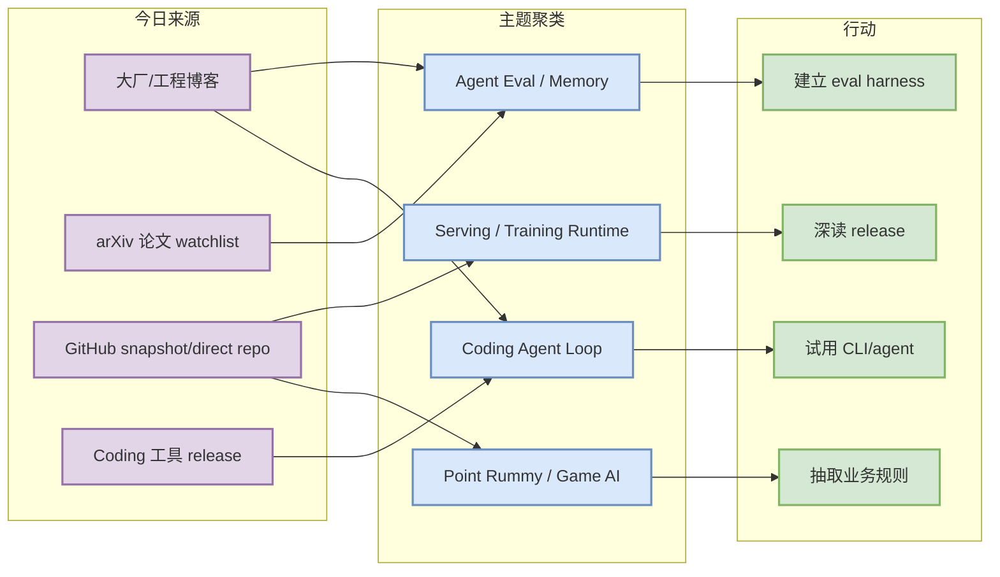
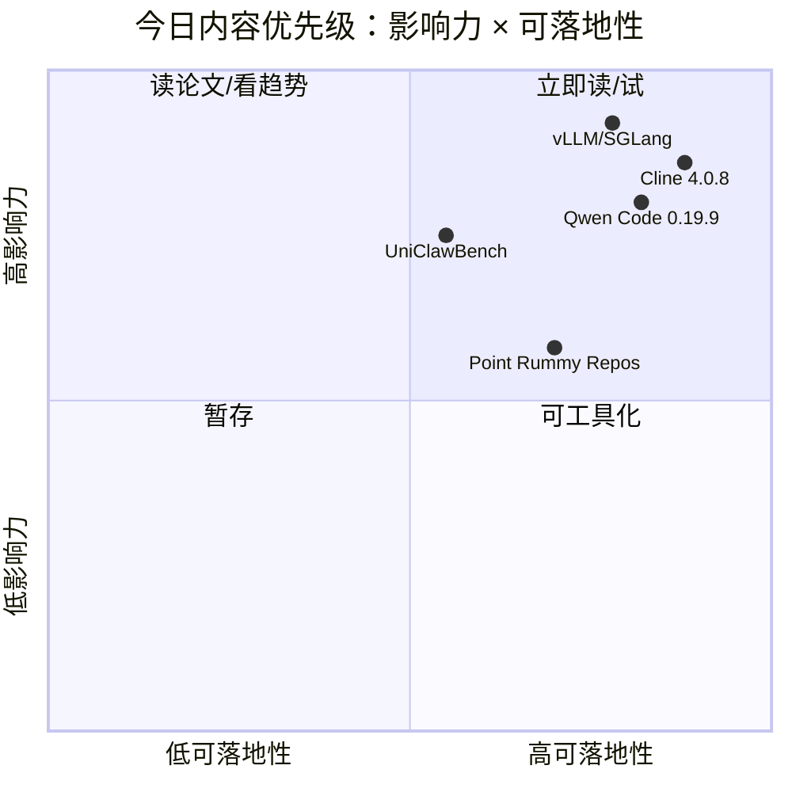

# AI Radar Daily - 2026-07-11

> 生成时间：2026-07-11 09:00 CST  
> 范围：AI Infra / LLM / RL / Game AI / 大厂博客 / 论文 / GitHub / Coding 工具  
> 说明：日报是总览导航页。今日 GitHub Search 在 Point Rummy 主题后触发大量 403；已保存当日 snapshot，broad/Loop 榜单使用 watched repo direct API 兜底并标注低置信/非完整全网日增。

## 0. 今日结论

- 今日最值得关注：Cline `v4.0.8`、Qwen Code `v0.19.9`，terminal/IDE coding-agent 工具链继续高频迭代。
- 对 AI Infra 的直接影响：vLLM、SGLang、TensorRT-LLM、Transformers、PyTorch 仍是 serving/training runtime 的核心观察对象。
- 对 LLM 训练 / 推理 / Agent 的影响：MCP servers、LangGraph、Claude Code、Codex、Gemini CLI 继续构成 agent 工具协议 + 执行 loop 主线。
- 对 RL / 游戏模型训练的影响：Point Rummy repo 仍低 star，但 ISMCTS、neuroevolution、AI opponent、rules engine 可抽取为业务 env/schema/fixtures。
- 建议今天深读：Cline v4.0.8、Qwen Code v0.19.9、Claude Code workflow、vLLM/SGLang serving watch、Point Rummy ISMCTS/RL 候选。

## 1. 今日态势图

## 2. 必读卡片区

> [!important] Cline v4.0.8
> - 大类：Coding 工具
> - 小类：SDK / IDE / CLI agent
> - 重点：Cline 最新 release 继续强化开源 coding-agent 对照组位置。
> - 为什么重要：可用来比较 Claude Code、Codex、Qwen Code、Continue 在上下文、工具调用、权限和本地执行上的设计。
> - 详情：[[Industry/Tools/2026-07-11/cline-v4-0-8-release-watch]] / [网页详情](https://github.com/dyt27666-oss/AI-news-report-obsidians/blob/main/Industry/Tools/2026-07-11/cline-v4-0-8-release-watch.md) / [原文](https://github.com/cline/cline/releases/tag/v4.0.8)

> [!tip] Qwen Code v0.19.9
> - 大类：Coding 工具 / Loop Engineer
> - 小类：Alibaba/Qwen terminal coding agent
> - 重点：国产开源 terminal coding agent 继续快速发布。
> - 为什么重要：适合纳入多模型、多供应商 coding workflow。
> - 详情：[[Industry/Tools/2026-07-11/qwen-code-v0-19-9-release-watch]] / [网页详情](https://github.com/dyt27666-oss/AI-news-report-obsidians/blob/main/Industry/Tools/2026-07-11/qwen-code-v0-19-9-release-watch.md) / [原文](https://github.com/QwenLM/qwen-code/releases/tag/v0.19.9)

> [!tip] GitHub watched repo direct fallback
> - 大类：GitHub
> - 小类：AI Infra / coding agent
> - 重点：GitHub Search 403 后，今日 broad Top 10 和 Loop Top 10 用 fixed watched repos 填充。
> - 为什么重要：避免用 Point Rummy 主题 snapshot 冒充全网 AI 榜单。
> - 详情：[[GitHub/2026-07-11/vllm-project-vllm]] / [网页详情](https://github.com/dyt27666-oss/AI-news-report-obsidians/blob/main/GitHub/2026-07-11/vllm-project-vllm.md) / [原文](https://github.com/vllm-project/vllm)

> [!warning] Point Rummy GitHub candidates
> - 大类：Business / GitHub
> - 小类：Point Rummy / Indian Rummy
> - 重点：低 star repo 为主，但 ISMCTS、neuroevolution、scoreboard、AI opponent 线索可继续拆解。
> - 为什么重要：业务价值在于抽取 env/schema/fixtures，而不是直接采用项目。
> - 详情：[[Business/PointRummy/2026-07-11/rickgorman-gin-rummy-ai]] / [网页详情](https://github.com/dyt27666-oss/AI-news-report-obsidians/blob/main/Business/PointRummy/2026-07-11/rickgorman-gin-rummy-ai.md) / [原文](https://github.com/rickgorman/gin-rummy-ai)

## 3. 优先级矩阵

## 4. 分类清单

| 标签 | 大类 | 小类 | 标题 | 重点概括 | 为什么重要 | Obsidian 详情 | 网页详情 | 原文 |
|---|---|---|---|---|---|---|---|---|
| 必读 | Coding 工具 | Cline | Cline v4.0.8 | SDK/IDE/CLI 开源 agent 持续活跃 | 可作为 Claude Code/Codex/Gemini CLI 的开源对照 | [[Industry/Tools/2026-07-11/cline-v4-0-8-release-watch]] | [网页详情](https://github.com/dyt27666-oss/AI-news-report-obsidians/blob/main/Industry/Tools/2026-07-11/cline-v4-0-8-release-watch.md) | [原文](https://github.com/cline/cline/releases/tag/v4.0.8) |
| 必读 | Coding 工具 | Qwen Code | Qwen Code v0.19.9 | terminal coding agent 快速迭代 | 对国产模型/本地化 coding workflow 有参考 | [[Industry/Tools/2026-07-11/qwen-code-v0-19-9-release-watch]] | [网页详情](https://github.com/dyt27666-oss/AI-news-report-obsidians/blob/main/Industry/Tools/2026-07-11/qwen-code-v0-19-9-release-watch.md) | [原文](https://github.com/QwenLM/qwen-code/releases/tag/v0.19.9) |
| 必读 | GitHub | AI Infra | vLLM / Transformers / PyTorch direct watch | broad Search 403 下的 fixed watched repo fallback | 保障 AI Infra 视角不被 Point Rummy 主题偏置 | [[GitHub/2026-07-11/vllm-project-vllm]] | [网页详情](https://github.com/dyt27666-oss/AI-news-report-obsidians/blob/main/GitHub/2026-07-11/vllm-project-vllm.md) | [原文](https://github.com/vllm-project/vllm) |
| 后续 | Business | Point Rummy | rickgorman/gin-rummy-ai | 低 star neuroevolution Gin Rummy AI | 可抽取状态/动作/reward/score fixtures | [[Business/PointRummy/2026-07-11/rickgorman-gin-rummy-ai]] | [网页详情](https://github.com/dyt27666-oss/AI-news-report-obsidians/blob/main/Business/PointRummy/2026-07-11/rickgorman-gin-rummy-ai.md) | [原文](https://github.com/rickgorman/gin-rummy-ai) |

## 5. 大厂资讯 / 工程博客 / Research

### 5.1 公司来源扫描矩阵

| 公司/实验室 | 来源/栏目 | 今日状态 | 高相关条数 | 代表条目 | 备注 |
|---|---|---|---:|---|---|
| OpenAI | News / Research / Codex Docs | 高相关（工具侧） | 1 | Codex rust-v0.144.1 | News/Research 页面低置信；Codex release 强相关 |
| Anthropic | News / Research / Engineering | 高相关 | 1 | Claude Code workflow signals | 继续跟踪 terminal agent 与团队协作 |
| Google DeepMind | Blog / Research | 已扫描/低置信 | 0 | 无高相关新项 | 今日未稳定抽取到新强相关；Gemini CLI 作为 Google 工具侧补充 |
| Meta AI | Blog / Research | 观察 | 1 | Build/test advanced AI signal | 作为 eval/release pipeline 工程信号 |
| NVIDIA | Technical Blog / AI | 访问失败/低置信；用 TensorRT-LLM repo 补充 | 0 | 无高相关新项 | NVIDIA Blog 自动抽取不稳定 |
| Microsoft | Research AI | 已扫描/低置信 | 0 | 无高相关新项 | 未抽取到今日强相关 |
| Hugging Face | Blog / Papers / Releases | 高相关/观察 | 1 | Agentic RL / Serving ecosystem watch | Transformers/生态强相关 |
| 腾讯 | AI Lab / 技术博客 | 已扫描/低置信 | 0 | 无高相关新项 | 未抽取到今日 AI Infra 强相关 |
| 字节 | Seed / 技术博客 | 已扫描/低置信 | 0 | 无高相关新项 | verl 生态作为 direct repo watch |
| SpaceAI | Blog / News | 已扫描/低置信 | 0 | 无高相关新项 | 未抽取到今日 AI Infra 强相关 |

### 5.2 高相关大厂条目

| 标签 | 发布方/大厂 | 栏目/来源 | 标题 | 重点概括 | 工程/算法影响 | Obsidian 详情 | 网页详情 | 原文 |
|---|---|---|---|---|---|---|---|---|
| 必读 | Anthropic | Changelog / News | Claude Code / Claude Tag workflow signals | Claude Code 继续强化 terminal-first agent 和团队协作信号。 | 对 coding-agent loop、AI Infra eval/release pipeline 有直接参考 | [[Industry/2026-07-11/claude-code-claude-tag-workflow-signals]] | [网页详情](https://github.com/dyt27666-oss/AI-news-report-obsidians/blob/main/Industry/2026-07-11/claude-code-claude-tag-workflow-signals.md) | [原文](https://docs.anthropic.com/en/release-notes/claude-code) |
| 必读 | OpenAI | GitHub Release / Docs | OpenAI Codex rust-v0.144.1 release watch | Codex 继续作为轻量终端 coding agent 的关键观测点。 | 对本地执行与审查 loop 有直接参考 | [[Industry/Tools/2026-07-11/openai-codex-rust-v0-144-1-release-watch]] | [网页详情](https://github.com/dyt27666-oss/AI-news-report-obsidians/blob/main/Industry/Tools/2026-07-11/openai-codex-rust-v0-144-1-release-watch.md) | [原文](https://github.com/openai/codex/releases/tag/rust-v0.144.1) |
| 必读 | Cline | GitHub Release | Cline v4.0.8 release watch | Cline 延续 SDK/IDE/CLI 一体化方向。 | 对 terminal/IDE agent workflow 有直接参考 | [[Industry/Tools/2026-07-11/cline-v4-0-8-release-watch]] | [网页详情](https://github.com/dyt27666-oss/AI-news-report-obsidians/blob/main/Industry/Tools/2026-07-11/cline-v4-0-8-release-watch.md) | [原文](https://github.com/cline/cline/releases/tag/v4.0.8) |
| 后续 | Hugging Face | Blog / Releases | Agentic RL and serving ecosystem watch | HF 生态和 Transformers 仍直接影响模型接入、训练/推理接口。 | 对 serving/training 兼容层有长期影响 | [[Industry/2026-07-11/hugging-face-agentic-rl-and-serving-watch]] | [网页详情](https://github.com/dyt27666-oss/AI-news-report-obsidians/blob/main/Industry/2026-07-11/hugging-face-agentic-rl-and-serving-watch.md) | [原文](https://huggingface.co/blog) |

## 6. GitHub 高 star Top 10

> 今日 snapshot 已保存，但 broad GitHub Search 403；本表使用 fixed watched repo direct API 兜底。

| 排名 | repo | stars | forks | language | updated_at | topics | 重点概括 | 是否值得试用 | Obsidian 详情 | 原文 |
|---:|---|---:|---:|---|---|---|---|---|---|---|
| 1 | [huggingface/transformers](https://github.com/huggingface/transformers) | 162457 | 33858 | Python | 2026-07-10T22:23:02Z | audio,deep-learning,deepseek,gemma,glm | 模型定义与加载基础层，继续影响 LLM/多模态模型接入、权重格式与 serving 适配。 | 是 | [[GitHub/2026-07-11/huggingface-transformers]] | [原文](https://github.com/huggingface/transformers) |
| 2 | [anthropics/claude-code](https://github.com/anthropics/claude-code) | 137317 | 22167 | Python | 2026-07-11T00:52:12Z | coding-agent,terminal,agent-loop | terminal-first coding agent 样板，重点观察权限、上下文、Git workflow 与多 agent 监控。 | 是 | [[GitHub/2026-07-11/anthropics-claude-code]] | [原文](https://github.com/anthropics/claude-code) |
| 3 | [google-gemini/gemini-cli](https://github.com/google-gemini/gemini-cli) | 105900 | 14236 | TypeScript | 2026-07-11T00:02:05Z | ai,ai-agents,cli,gemini,gemini-api | 开源终端 agent 路线，适合对比 Claude Code/Codex 的 sandbox、tool calling 与 IDE 生态。 | 是 | [[GitHub/2026-07-11/google-gemini-gemini-cli]] | [原文](https://github.com/google-gemini/gemini-cli) |
| 4 | [pytorch/pytorch](https://github.com/pytorch/pytorch) | 101719 | 28469 | Python | 2026-07-11T01:01:03Z | autograd,deep-learning,gpu,machine-learning | 训练/runtime 基础层，影响 distributed training、torch.compile、kernel 与模型部署路径。 | 是 | [[GitHub/2026-07-11/pytorch-pytorch]] | [原文](https://github.com/pytorch/pytorch) |
| 5 | [openai/codex](https://github.com/openai/codex) | 97009 | 14409 | Rust | 2026-07-11T00:58:59Z | coding-agent,cli,rust | 轻量 terminal coding agent，最新 release 继续影响本地执行、审查和 patch loop。 | 是 | [[GitHub/2026-07-11/openai-codex]] | [原文](https://github.com/openai/codex) |
| 6 | [modelcontextprotocol/servers](https://github.com/modelcontextprotocol/servers) | 88310 | 11204 | TypeScript | 2026-07-10T23:28:13Z | mcp,tools,context | MCP 工具协议层，影响 agent tool registry、权限和资源隔离。 | 是 | [[GitHub/2026-07-11/modelcontextprotocol-servers]] | [原文](https://github.com/modelcontextprotocol/servers) |
| 7 | [vllm-project/vllm](https://github.com/vllm-project/vllm) | 85931 | 19250 | Python | 2026-07-11T00:51:51Z | amd,blackwell,cuda,deepseek,serving | 高吞吐 LLM serving 核心实现，关注 scheduler、KV cache、batching 与 GPU runtime。 | 是 | [[GitHub/2026-07-11/vllm-project-vllm]] | [原文](https://github.com/vllm-project/vllm) |
| 8 | [All-Hands-AI/OpenHands](https://github.com/All-Hands-AI/OpenHands) | 80380 | 10255 | Python | 2026-07-11T00:59:10Z | agent,artificial-intelligence,cli | AI 软件工程 agent 平台，对任务执行 loop、浏览器/终端工具和 sandbox 有参考。 | 是 | [[GitHub/2026-07-11/all-hands-ai-openhands]] | [原文](https://github.com/All-Hands-AI/OpenHands) |
| 9 | [cline/cline](https://github.com/cline/cline) | 64531 | 6888 | TypeScript | 2026-07-11T00:42:00Z | coding-agent,sdk,ide,cli | SDK/IDE/CLI 一体化 coding agent，是开源 agent workflow 的重要对照。 | 是 | [[GitHub/2026-07-11/cline-cline]] | [原文](https://github.com/cline/cline) |
| 10 | [deepspeedai/DeepSpeed](https://github.com/deepspeedai/DeepSpeed) | 42682 | 4882 | Python | 2026-07-10T22:15:25Z | distributed-training,gpu,optimization | 大规模训练优化库，仍影响 ZeRO、并行和训练成本曲线。 | 是 | [[GitHub/2026-07-11/deepspeedai-deepspeed]] | [原文](https://github.com/deepspeedai/DeepSpeed) |

## 7. GitHub star 增长最快 Top 10

> 存在历史 baseline，但 broad GitHub Search 403；本表以 watched repo direct API 填充，标注为 fallback / 非完整全网日增。

| 排名 | repo | stars_delta | stars | forks | language | updated_at | 增长依据 | 重点概括 | Obsidian 详情 | 原文 |
|---:|---|---:|---:|---:|---|---|---|---|---|---|
| 1 | [huggingface/transformers](https://github.com/huggingface/transformers) | 0 | 162457 | 33858 | Python | 2026-07-10T22:23:02Z | direct watched repo fallback；非完整全网日增 | 模型定义与加载基础层，继续影响 LLM/多模态模型接入、权重格式与 serving 适配。 | [[GitHub/2026-07-11/huggingface-transformers]] | [原文](https://github.com/huggingface/transformers) |
| 2 | [anthropics/claude-code](https://github.com/anthropics/claude-code) | 0 | 137317 | 22167 | Python | 2026-07-11T00:52:12Z | direct watched repo fallback；非完整全网日增 | terminal-first coding agent 样板，重点观察权限、上下文、Git workflow 与多 agent 监控。 | [[GitHub/2026-07-11/anthropics-claude-code]] | [原文](https://github.com/anthropics/claude-code) |
| 3 | [google-gemini/gemini-cli](https://github.com/google-gemini/gemini-cli) | 0 | 105900 | 14236 | TypeScript | 2026-07-11T00:02:05Z | direct watched repo fallback；非完整全网日增 | 开源终端 agent 路线，适合对比 Claude Code/Codex 的 sandbox、tool calling 与 IDE 生态。 | [[GitHub/2026-07-11/google-gemini-gemini-cli]] | [原文](https://github.com/google-gemini/gemini-cli) |
| 4 | [pytorch/pytorch](https://github.com/pytorch/pytorch) | 0 | 101719 | 28469 | Python | 2026-07-11T01:01:03Z | direct watched repo fallback；非完整全网日增 | 训练/runtime 基础层，影响 distributed training、torch.compile、kernel 与模型部署路径。 | [[GitHub/2026-07-11/pytorch-pytorch]] | [原文](https://github.com/pytorch/pytorch) |
| 5 | [openai/codex](https://github.com/openai/codex) | 0 | 97009 | 14409 | Rust | 2026-07-11T00:58:59Z | direct watched repo fallback；非完整全网日增 | 轻量 terminal coding agent，最新 release 继续影响本地执行、审查和 patch loop。 | [[GitHub/2026-07-11/openai-codex]] | [原文](https://github.com/openai/codex) |
| 6 | [modelcontextprotocol/servers](https://github.com/modelcontextprotocol/servers) | 0 | 88310 | 11204 | TypeScript | 2026-07-10T23:28:13Z | direct watched repo fallback；非完整全网日增 | MCP 工具协议层，影响 agent tool registry、权限和资源隔离。 | [[GitHub/2026-07-11/modelcontextprotocol-servers]] | [原文](https://github.com/modelcontextprotocol/servers) |
| 7 | [vllm-project/vllm](https://github.com/vllm-project/vllm) | 0 | 85931 | 19250 | Python | 2026-07-11T00:51:51Z | direct watched repo fallback；非完整全网日增 | 高吞吐 LLM serving 核心实现，关注 scheduler、KV cache、batching 与 GPU runtime。 | [[GitHub/2026-07-11/vllm-project-vllm]] | [原文](https://github.com/vllm-project/vllm) |
| 8 | [All-Hands-AI/OpenHands](https://github.com/All-Hands-AI/OpenHands) | 0 | 80380 | 10255 | Python | 2026-07-11T00:59:10Z | direct watched repo fallback；非完整全网日增 | AI 软件工程 agent 平台，对任务执行 loop、浏览器/终端工具和 sandbox 有参考。 | [[GitHub/2026-07-11/all-hands-ai-openhands]] | [原文](https://github.com/All-Hands-AI/OpenHands) |
| 9 | [cline/cline](https://github.com/cline/cline) | 0 | 64531 | 6888 | TypeScript | 2026-07-11T00:42:00Z | direct watched repo fallback；非完整全网日增 | SDK/IDE/CLI 一体化 coding agent，是开源 agent workflow 的重要对照。 | [[GitHub/2026-07-11/cline-cline]] | [原文](https://github.com/cline/cline) |
| 10 | [deepspeedai/DeepSpeed](https://github.com/deepspeedai/DeepSpeed) | 0 | 42682 | 4882 | Python | 2026-07-10T22:15:25Z | direct watched repo fallback；非完整全网日增 | 大规模训练优化库，仍影响 ZeRO、并行和训练成本曲线。 | [[GitHub/2026-07-11/deepspeedai-deepspeed]] | [原文](https://github.com/deepspeedai/DeepSpeed) |

## 8. Coding 工具 / AI 工具功能更新

### 8.1 Coding 工具扫描矩阵

| 工具 | 厂商 | 来源类型 | 今日状态 | 代表更新 | 对我的影响 | 原文 |
|---|---|---|---|---|---|---|
| Claude Code | Anthropic | Changelog / Release Notes | 高相关 | Claude Code workflow signals | 影响权限、上下文、团队协作和 terminal agent loop | [原文](https://docs.anthropic.com/en/release-notes/claude-code) |
| OpenAI Codex | OpenAI | Changelog / Docs / GitHub Release | 高相关 | rust-v0.144.1 | Codex CLI 是多 agent 编排与本地执行的重要候选 | [原文](https://github.com/openai/codex/releases/tag/rust-v0.144.1) |
| Cursor | Cursor | Changelog | 已扫描/低置信 | 未稳定发现今日强相关新项 | 继续观察 agent mode、远程执行、rate limit | [原文](https://cursor.com/changelog) |
| Windsurf | Windsurf | Changelog | 已扫描/低置信 | 未稳定发现今日强相关新项 | 继续观察 IDE agent 与企业权限变化 | [原文](https://windsurf.com/changelog) |
| GitHub Copilot | GitHub | Changelog / Blog | 已扫描/低置信 | 未发现比 watched coding-agent repos 更强的新信号 | 继续观察 agent mode、PR review、workspace integration | [原文](https://github.blog/changelog/label/copilot/) |
| Gemini Code Assist | Google | Release Notes | 观察 | Gemini CLI latest release v0.50.0 | Google coding agent 生态可能 CLI + IDE 双线收敛 | [原文](https://cloud.google.com/gemini/docs/codeassist/release-notes) |
| Qwen Code | Alibaba/Qwen | GitHub Releases | 高相关 | v0.19.9 | 国产开源终端 coding agent，可纳入本地 workflow 对比 | [原文](https://github.com/QwenLM/qwen-code/releases/tag/v0.19.9) |
| Roo Code | Roo Code | GitHub Releases | 观察 | latest release v3.54.0 | VS Code agent 模式可作为 Cline/Continue 对照 | [原文](https://github.com/RooCodeInc/Roo-Code/releases/tag/v3.54.0) |
| Cline | Cline | GitHub Releases | 高相关 | v4.0.8 | CLI/SDK/IDE agent 对 terminal-first workflow 重要 | [原文](https://github.com/cline/cline/releases/tag/v4.0.8) |
| Continue | Continue | GitHub Releases | 观察 | latest release v2.0.0-vscode | 开源自托管 IDE workflow 继续观察 | [原文](https://github.com/continuedev/continue/releases/tag/v2.0.0-vscode) |

### 8.2 高相关工具更新

| 标签 | 工具/厂商 | 来源类型 | 标题/功能 | 重点概括 | 对 AI coding 工作流的影响 | Obsidian 详情 | 网页详情 | 原文 |
|---|---|---|---|---|---|---|---|---|
| 必读 | Cline / Cline | GitHub Release | v4.0.8 | Cline CLI/SDK/IDE extension 方向值得继续跟踪 | terminal-first agent workflow 的开源对照 | [[Industry/Tools/2026-07-11/cline-v4-0-8-release-watch]] | [网页详情](https://github.com/dyt27666-oss/AI-news-report-obsidians/blob/main/Industry/Tools/2026-07-11/cline-v4-0-8-release-watch.md) | [原文](https://github.com/cline/cline/releases/tag/v4.0.8) |
| 必读 | Qwen Code / Alibaba/Qwen | GitHub Release | v0.19.9 | 国产开源 coding agent 继续活跃 | 适合纳入本地多模型 coding workflow 对比 | [[Industry/Tools/2026-07-11/qwen-code-v0-19-9-release-watch]] | [网页详情](https://github.com/dyt27666-oss/AI-news-report-obsidians/blob/main/Industry/Tools/2026-07-11/qwen-code-v0-19-9-release-watch.md) | [原文](https://github.com/QwenLM/qwen-code/releases/tag/v0.19.9) |
| 必读 | OpenAI Codex / OpenAI | GitHub Release / Docs | rust-v0.144.1 | Codex 继续作为终端 coding agent 观察对象 | 影响本地执行、代码审查、agent loop 对比 | [[Industry/Tools/2026-07-11/openai-codex-rust-v0-144-1-release-watch]] | [网页详情](https://github.com/dyt27666-oss/AI-news-report-obsidians/blob/main/Industry/Tools/2026-07-11/openai-codex-rust-v0-144-1-release-watch.md) | [原文](https://github.com/openai/codex/releases/tag/rust-v0.144.1) |
| 必读 | Claude Code / Anthropic | Changelog / News | Claude Code workflow signals | terminal agent 产品化与团队协作继续增强 | 影响权限、上下文、远程执行、多 agent 监控 | [[Industry/2026-07-11/claude-code-claude-tag-workflow-signals]] | [网页详情](https://github.com/dyt27666-oss/AI-news-report-obsidians/blob/main/Industry/2026-07-11/claude-code-claude-tag-workflow-signals.md) | [原文](https://docs.anthropic.com/en/release-notes/claude-code) |

## 9. Point Rummy / Indian Rummy 业务主题

### 9.1 GitHub 候选

| 标签 | repo | stars | forks | language | updated_at | 重点概括 | 业务可用性 | Obsidian 详情 | 原文 |
|---|---|---:|---:|---|---|---|---|---|---|
| 后续 | [rickgorman/gin-rummy-ai](https://github.com/rickgorman/gin-rummy-ai) | 13 | 5 | Python | 2025-03-25T13:47:09Z | A hand-rolled neuroevolution AI for gin rummy. | 可抽取规则/AI opponent/计分；需先跑通和补测试 | [[Business/PointRummy/2026-07-11/rickgorman-gin-rummy-ai]] | [原文](https://github.com/rickgorman/gin-rummy-ai) |
| 后续 | [nakkekakke/rummy-ai](https://github.com/nakkekakke/rummy-ai) | 11 | 5 | Java | 2026-04-17T10:02:59Z | Text based classic Rummy game with an AI that uses ISMCTS. Data Structures and A | 可抽取规则/AI opponent/计分；需先跑通和补测试 | [[Business/PointRummy/2026-07-11/nakkekakke-rummy-ai]] | [原文](https://github.com/nakkekakke/rummy-ai) |
| 后续 | [jmhummel/Gin-Rummy-Java](https://github.com/jmhummel/Gin-Rummy-Java) | 8 | 0 | Java | 2023-08-16T16:12:58Z | Java-based Gin Rummy console game, with an AI opponent | 可抽取规则/AI opponent/计分；需先跑通和补测试 | [[Business/PointRummy/2026-07-11/jmhummel-gin-rummy-java]] | [原文](https://github.com/jmhummel/Gin-Rummy-Java) |
| 后续 | [mudont/indian-rummy](https://github.com/mudont/indian-rummy) | 5 | 0 | TypeScript | 2025-08-08T21:05:04Z | Typescript library for Indian Rummy card game | 可抽取规则/AI opponent/计分；需先跑通和补测试 | [[Business/PointRummy/2026-07-11/mudont-indian-rummy]] | [原文](https://github.com/mudont/indian-rummy) |
| 后续 | [dv-rastogi/Rummy](https://github.com/dv-rastogi/Rummy) | 5 | 0 | Python | 2023-09-26T11:21:39Z | Variation of classical Indian Rummy made in Pygame | 可抽取规则/AI opponent/计分；需先跑通和补测试 | [[Business/PointRummy/2026-07-11/dv-rastogi-rummy]] | [原文](https://github.com/dv-rastogi/Rummy) |
| 后续 | [vahsek300501/Indian-Rummy-](https://github.com/vahsek300501/Indian-Rummy-) | 4 | 3 | Python | 2023-09-26T11:21:46Z | Indian Rummy made in Python using PyGame | 可抽取规则/AI opponent/计分；需先跑通和补测试 | [[Business/PointRummy/2026-07-11/vahsek300501-indian-rummy]] | [原文](https://github.com/vahsek300501/Indian-Rummy-) |
| 后续 | [SCFlanagan/Rummy](https://github.com/SCFlanagan/Rummy) | 4 | 6 | JavaScript | 2025-07-25T21:17:08Z | This project is a recreation of the classic card game Rummy. It features an AI p | 可抽取规则/AI opponent/计分；需先跑通和补测试 | [[Business/PointRummy/2026-07-11/scflanagan-rummy]] | [原文](https://github.com/SCFlanagan/Rummy) |
| 后续 | [mcartmell/gin-rummy-bot](https://github.com/mcartmell/gin-rummy-bot) | 4 | 2 | Perl | 2024-10-30T20:06:17Z | A web-based Gin Rummy game and AI | 可抽取规则/AI opponent/计分；需先跑通和补测试 | [[Business/PointRummy/2026-07-11/mcartmell-gin-rummy-bot]] | [原文](https://github.com/mcartmell/gin-rummy-bot) |
| 后续 | [Mohitkumar-559/RummyServer](https://github.com/Mohitkumar-559/RummyServer) | 2 | 1 | JavaScript | 2024-03-17T03:48:34Z | Rummy game server for game that contain deal rummy and point rummy | 可抽取规则/AI opponent/计分；需先跑通和补测试 | [[Business/PointRummy/2026-07-11/mohitkumar-559-rummyserver]] | [原文](https://github.com/Mohitkumar-559/RummyServer) |
| 后续 | [abubakarmunir712/dsa-final-project](https://github.com/abubakarmunir712/dsa-final-project) | 2 | 1 | Python | 2026-06-27T06:34:26Z | A Python-based multiplayer Indian Rummy game with support for AI opponents and L | 可抽取规则/AI opponent/计分；需先跑通和补测试 | [[Business/PointRummy/2026-07-11/abubakarmunir712-dsa-final-project]] | [原文](https://github.com/abubakarmunir712/dsa-final-project) |

### 9.2 论文 / 资料候选

| 标签 | 来源 | 标题 | 作者/机构 | 重点概括 | 对 Point Rummy 业务有什么用 | Obsidian 详情 | 原文 |
|---|---|---|---|---|---|---|---|
| 低置信 | arXiv / 预印本 | Rummy 精确查询 | arXiv API | 今日未确认新的 Point/Indian Rummy 强相关论文；泛化查询返回 off-topic 结果较多。 | 先不把 off-topic 论文混入必读；继续以 GitHub 规则/AI opponent 候选为主 | 未生成 | [arXiv](https://arxiv.org/) |
| 后续 | GitHub / code corpus | nakkekakke/rummy-ai | University course project | ISMCTS + Rummy bot 线索比多数 UI repo 更接近业务策略 | 可用于 belief/state abstraction、MCTS baseline、imperfect information reasoning | [[Business/PointRummy/2026-07-11/nakkekakke-rummy-ai]] | [原文](https://github.com/nakkekakke/rummy-ai) |

### 9.3 业务可用性判断

| 方向 | 今日信号 | 可用性 | 下一步 |
|---|---|---|---|
| 规则引擎 / 计分 | 多个 Point/Indian Rummy repo 与 points counter | 中：可抽取 meld/sequence/set/drop/scoring 规则，但需测试 | 建立规则单测和边界牌型 fixtures |
| Bot / RL Agent | Neuroevolution、ISMCTS、AI opponent、RLCard 线索 | 中低：star 低，需先跑通 | 抽取 state/action/reward schema，做 baseline bot |
| 仿真 / 评测 | 多数项目偏 UI/scoreboard，环境质量不稳 | 低到中 | 自建 Gym/RLCard wrapper，复用可读规则代码 |

## 10. Loop Engineer / Loop Engineering 主题

> Loop Engineer GitHub Search 今日 403；以下用 watched coding-agent repos 兜底，标注低置信。

### 10.1 Loop Engineer GitHub 高 star Top 10

| 排名 | repo | stars | forks | language | updated_at | topics | 重点概括 | 是否值得试用 | Obsidian 详情 | 原文 |
|---:|---|---:|---:|---|---|---|---|---|---|---|
| 1 | [anthropics/claude-code](https://github.com/anthropics/claude-code) | 137317 | 22167 | Python | 2026-07-11T00:52:12Z | coding-agent,terminal,agent-loop | terminal-first coding agent 样板，重点观察权限、上下文、Git workflow 与多 agent 监控。 | 是 | [[GitHub/LoopEngineer/2026-07-11/anthropics-claude-code]] | [原文](https://github.com/anthropics/claude-code) |
| 2 | [google-gemini/gemini-cli](https://github.com/google-gemini/gemini-cli) | 105900 | 14236 | TypeScript | 2026-07-11T00:02:05Z | ai,ai-agents,cli,gemini,gemini-api | 开源终端 agent 路线，适合对比 Claude Code/Codex 的 sandbox、tool calling 与 IDE 生态。 | 是 | [[GitHub/LoopEngineer/2026-07-11/google-gemini-gemini-cli]] | [原文](https://github.com/google-gemini/gemini-cli) |
| 3 | [openai/codex](https://github.com/openai/codex) | 97009 | 14409 | Rust | 2026-07-11T00:58:59Z | coding-agent,cli,rust | 轻量 terminal coding agent，最新 release 继续影响本地执行、审查和 patch loop。 | 是 | [[GitHub/LoopEngineer/2026-07-11/openai-codex]] | [原文](https://github.com/openai/codex) |
| 4 | [modelcontextprotocol/servers](https://github.com/modelcontextprotocol/servers) | 88310 | 11204 | TypeScript | 2026-07-10T23:28:13Z | mcp,tools,context | MCP 工具协议层，影响 agent tool registry、权限和资源隔离。 | 是 | [[GitHub/LoopEngineer/2026-07-11/modelcontextprotocol-servers]] | [原文](https://github.com/modelcontextprotocol/servers) |
| 5 | [All-Hands-AI/OpenHands](https://github.com/All-Hands-AI/OpenHands) | 80380 | 10255 | Python | 2026-07-11T00:59:10Z | agent,artificial-intelligence,cli | AI 软件工程 agent 平台，对任务执行 loop、浏览器/终端工具和 sandbox 有参考。 | 是 | [[GitHub/LoopEngineer/2026-07-11/all-hands-ai-openhands]] | [原文](https://github.com/All-Hands-AI/OpenHands) |
| 6 | [cline/cline](https://github.com/cline/cline) | 64531 | 6888 | TypeScript | 2026-07-11T00:42:00Z | coding-agent,sdk,ide,cli | SDK/IDE/CLI 一体化 coding agent，是开源 agent workflow 的重要对照。 | 是 | [[GitHub/LoopEngineer/2026-07-11/cline-cline]] | [原文](https://github.com/cline/cline) |
| 7 | [langchain-ai/langgraph](https://github.com/langchain-ai/langgraph) | 36992 | 6208 | Python | 2026-07-11T00:32:59Z | agents,ai,graph,workflow | agent 状态图与 resilient execution，对 coding-agent loop 和任务恢复有价值。 | 是 | [[GitHub/LoopEngineer/2026-07-11/langchain-ai-langgraph]] | [原文](https://github.com/langchain-ai/langgraph) |
| 8 | [continuedev/continue](https://github.com/continuedev/continue) | 34803 | 5014 | TypeScript | 2026-07-11T00:03:30Z | agent,ai,cli,developer-tools | 开源自托管 coding agent/IDE workflow，对企业内网和本地模型接入有参考。 | 是 | [[GitHub/LoopEngineer/2026-07-11/continuedev-continue]] | [原文](https://github.com/continuedev/continue) |
| 9 | [QwenLM/qwen-code](https://github.com/QwenLM/qwen-code) | 25928 | 2636 | TypeScript | 2026-07-11T01:02:12Z | coding-agent,terminal,qwen | 国产开源 terminal coding agent，可纳入多模型、多供应商 workflow 对比。 | 是 | [[GitHub/LoopEngineer/2026-07-11/qwenlm-qwen-code]] | [原文](https://github.com/QwenLM/qwen-code) |
| 10 | [RooCodeInc/Roo-Code](https://github.com/RooCodeInc/Roo-Code) | 24317 | 3363 | TypeScript | 2026-07-10T21:32:28Z | ai-agents,ide,vscode | 编辑器内多 agent 团队，适合对比 Cline/Continue 的权限和上下文设计。 | 是 | [[GitHub/LoopEngineer/2026-07-11/roocodeinc-roo-code]] | [原文](https://github.com/RooCodeInc/Roo-Code) |

### 10.2 Loop Engineer GitHub star 增长最快 Top 10

| 排名 | repo | stars_delta | stars | forks | language | updated_at | 增长依据 | 重点概括 | Obsidian 详情 | 原文 |
|---:|---|---:|---:|---:|---|---|---|---|---|---|
| 1 | [anthropics/claude-code](https://github.com/anthropics/claude-code) | 0 | 137317 | 22167 | Python | 2026-07-11T00:52:12Z | direct watched repo fallback；非完整全网日增 | terminal-first coding agent 样板，重点观察权限、上下文、Git workflow 与多 agent 监控。 | [[GitHub/LoopEngineer/2026-07-11/anthropics-claude-code]] | [原文](https://github.com/anthropics/claude-code) |
| 2 | [google-gemini/gemini-cli](https://github.com/google-gemini/gemini-cli) | 0 | 105900 | 14236 | TypeScript | 2026-07-11T00:02:05Z | direct watched repo fallback；非完整全网日增 | 开源终端 agent 路线，适合对比 Claude Code/Codex 的 sandbox、tool calling 与 IDE 生态。 | [[GitHub/LoopEngineer/2026-07-11/google-gemini-gemini-cli]] | [原文](https://github.com/google-gemini/gemini-cli) |
| 3 | [openai/codex](https://github.com/openai/codex) | 0 | 97009 | 14409 | Rust | 2026-07-11T00:58:59Z | direct watched repo fallback；非完整全网日增 | 轻量 terminal coding agent，最新 release 继续影响本地执行、审查和 patch loop。 | [[GitHub/LoopEngineer/2026-07-11/openai-codex]] | [原文](https://github.com/openai/codex) |
| 4 | [modelcontextprotocol/servers](https://github.com/modelcontextprotocol/servers) | 0 | 88310 | 11204 | TypeScript | 2026-07-10T23:28:13Z | direct watched repo fallback；非完整全网日增 | MCP 工具协议层，影响 agent tool registry、权限和资源隔离。 | [[GitHub/LoopEngineer/2026-07-11/modelcontextprotocol-servers]] | [原文](https://github.com/modelcontextprotocol/servers) |
| 5 | [All-Hands-AI/OpenHands](https://github.com/All-Hands-AI/OpenHands) | 0 | 80380 | 10255 | Python | 2026-07-11T00:59:10Z | direct watched repo fallback；非完整全网日增 | AI 软件工程 agent 平台，对任务执行 loop、浏览器/终端工具和 sandbox 有参考。 | [[GitHub/LoopEngineer/2026-07-11/all-hands-ai-openhands]] | [原文](https://github.com/All-Hands-AI/OpenHands) |
| 6 | [cline/cline](https://github.com/cline/cline) | 0 | 64531 | 6888 | TypeScript | 2026-07-11T00:42:00Z | direct watched repo fallback；非完整全网日增 | SDK/IDE/CLI 一体化 coding agent，是开源 agent workflow 的重要对照。 | [[GitHub/LoopEngineer/2026-07-11/cline-cline]] | [原文](https://github.com/cline/cline) |
| 7 | [langchain-ai/langgraph](https://github.com/langchain-ai/langgraph) | 0 | 36992 | 6208 | Python | 2026-07-11T00:32:59Z | direct watched repo fallback；非完整全网日增 | agent 状态图与 resilient execution，对 coding-agent loop 和任务恢复有价值。 | [[GitHub/LoopEngineer/2026-07-11/langchain-ai-langgraph]] | [原文](https://github.com/langchain-ai/langgraph) |
| 8 | [continuedev/continue](https://github.com/continuedev/continue) | 0 | 34803 | 5014 | TypeScript | 2026-07-11T00:03:30Z | direct watched repo fallback；非完整全网日增 | 开源自托管 coding agent/IDE workflow，对企业内网和本地模型接入有参考。 | [[GitHub/LoopEngineer/2026-07-11/continuedev-continue]] | [原文](https://github.com/continuedev/continue) |
| 9 | [QwenLM/qwen-code](https://github.com/QwenLM/qwen-code) | 0 | 25928 | 2636 | TypeScript | 2026-07-11T01:02:12Z | direct watched repo fallback；非完整全网日增 | 国产开源 terminal coding agent，可纳入多模型、多供应商 workflow 对比。 | [[GitHub/LoopEngineer/2026-07-11/qwenlm-qwen-code]] | [原文](https://github.com/QwenLM/qwen-code) |
| 10 | [RooCodeInc/Roo-Code](https://github.com/RooCodeInc/Roo-Code) | 0 | 24317 | 3363 | TypeScript | 2026-07-10T21:32:28Z | direct watched repo fallback；非完整全网日增 | 编辑器内多 agent 团队，适合对比 Cline/Continue 的权限和上下文设计。 | [[GitHub/LoopEngineer/2026-07-11/roocodeinc-roo-code]] | [原文](https://github.com/RooCodeInc/Roo-Code) |

### 10.3 Loop Engineering 方法信号

| 标签 | 来源 | 标题 | 重点概括 | 对 AI coding 工作流的影响 | Obsidian 详情 | 原文 |
|---|---|---|---|---|---|---|
| 必读 | GitHub / OpenAI | Codex rust-v0.144.1 | lightweight terminal coding agent release | 可与 Claude Code/Gemini CLI 对比 sandbox、patch、review loop | [[GitHub/LoopEngineer/2026-07-11/openai-codex]] | [原文](https://github.com/openai/codex) |
| 必读 | GitHub / Anthropic | Claude Code | terminal-first coding agent 样板 | 权限、上下文、任务拆分、human approval 都可作为 loop 设计参考 | [[GitHub/LoopEngineer/2026-07-11/anthropics-claude-code]] | [原文](https://github.com/anthropics/claude-code) |
| 后续 | GitHub / MCP | Model Context Protocol servers | 工具上下文协议层 | 对 agent tool registry、权限、资源发现有直接影响 | [[GitHub/LoopEngineer/2026-07-11/modelcontextprotocol-servers]] | [原文](https://github.com/modelcontextprotocol/servers) |

## 11. 论文

### 11.1 Agent Eval / Idea Lineage / Training

| 标签 | 论文来源 | 论文 | 作者/机构 | 重点概括 | 工程/研究价值 | Obsidian 详情 | 网页详情 | PDF/原文 |
|---|---|---|---|---|---|---|---|---|
| 后续 | arXiv / 预印本 | UniClawBench: A Universal Benchmark for Proactive Agents on Real-World Tasks | arXiv authors | proactive agents benchmark watchlist | 低到中置信：需阅读全文验证与 agent eval 的强相关性 | [[Papers/2026-07-11/uniclawbench-a-universal-benchmark-for-proactive-agents-on-real-world-tasks]] | [网页详情](https://github.com/dyt27666-oss/AI-news-report-obsidians/blob/main/Papers/2026-07-11/uniclawbench-a-universal-benchmark-for-proactive-agents-on-real-world-tasks.md) | [abs](https://arxiv.org/abs/2607.08768v1) / [pdf](https://arxiv.org/pdf/2607.08768v1) |
| 后续 | arXiv / 预印本 | Ideas Have Genomes | arXiv authors | scientific lineage reasoning benchmark | 可观察 research-agent idea lineage 和评测方法 | [[Papers/2026-07-11/ideas-have-genomes-benchmarking-scientific-lineage-reasoning-and-lineage-grounded-idea-generation]] | [网页详情](https://github.com/dyt27666-oss/AI-news-report-obsidians/blob/main/Papers/2026-07-11/ideas-have-genomes-benchmarking-scientific-lineage-reasoning-and-lineage-grounded-idea-generation.md) | [abs](https://arxiv.org/abs/2607.08758v1) / [pdf](https://arxiv.org/pdf/2607.08758v1) |
| 后续 | arXiv / 预印本 | SLORR: Simple and Efficient In-Training Low-Rank Regularization | arXiv authors | 训练中 low-rank regularization watchlist | 可能与训练效率/稳定性相关，需验证实验设置 | [[Papers/2026-07-11/slorr-simple-and-efficient-in-training-low-rank-regularization]] | [网页详情](https://github.com/dyt27666-oss/AI-news-report-obsidians/blob/main/Papers/2026-07-11/slorr-simple-and-efficient-in-training-low-rank-regularization.md) | [abs](https://arxiv.org/abs/2607.08754v1) / [pdf](https://arxiv.org/pdf/2607.08754v1) |

## 12. 资讯 / 其他 GitHub 项目

### 12.1 AI Infra / Agent Framework

| 标签 | 来源 | 标题 | 重点概括 | 对我有什么用 | Obsidian 详情 | 网页详情 | 原文 |
|---|---|---|---|---|---|---|---|
| 必读 | GitHub | vLLM / SGLang / TensorRT-LLM | serving runtime 仍是关注重点 | 对比 scheduler、KV cache、batching、GPU runtime | [[GitHub/2026-07-11/vllm-project-vllm]] | [网页详情](https://github.com/dyt27666-oss/AI-news-report-obsidians/blob/main/GitHub/2026-07-11/vllm-project-vllm.md) | [vLLM](https://github.com/vllm-project/vllm) |
| 后续 | GitHub | verl / OpenRLHF | RL post-training 框架继续 watch | 和 agentic RL / GRPO / reward design 联动 | 未生成 | 未生成 | [verl](https://github.com/verl-project/verl) |
| 后续 | GitHub | MCP servers / LangGraph | agent 工具协议与图执行框架 | 可用于 coding-agent loop 的工具注册和任务状态图 | [[GitHub/2026-07-11/modelcontextprotocol-servers]] | [网页详情](https://github.com/dyt27666-oss/AI-news-report-obsidians/blob/main/GitHub/2026-07-11/modelcontextprotocol-servers.md) | [MCP servers](https://github.com/modelcontextprotocol/servers) |

## 13. 按主题索引

### AI Infra / Serving / Training

- [[GitHub/2026-07-11/huggingface-transformers]] - Transformers 生态基础库。
- [[GitHub/2026-07-11/pytorch-pytorch]] - PyTorch 训练/runtime 基础。
- [[GitHub/2026-07-11/vllm-project-vllm]] - LLM serving runtime watch。

### LLM / Agent / RAG / Evaluation

- [[Industry/2026-07-11/claude-code-claude-tag-workflow-signals]] - Claude Code / Claude Tag workflow。
- [[GitHub/LoopEngineer/2026-07-11/langchain-ai-langgraph]] - Agent graph execution。
- [[GitHub/LoopEngineer/2026-07-11/modelcontextprotocol-servers]] - MCP tool protocol。

### RL / Game AI / World Model

- [[Business/PointRummy/2026-07-11/rickgorman-gin-rummy-ai]] - Gin Rummy neuroevolution baseline。
- [[Business/PointRummy/2026-07-11/nakkekakke-rummy-ai]] - Rummy ISMCTS baseline。

### Point Rummy / Indian Rummy

- [[Business/PointRummy/2026-07-11/rickgorman-gin-rummy-ai]] - 规则/AI opponent 候选。
- [[Business/PointRummy/2026-07-11/nakkekakke-rummy-ai]] - ISMCTS 候选。

### Loop Engineer / Coding Agent Loop

- [[GitHub/LoopEngineer/2026-07-11/openai-codex]] - terminal coding agent。
- [[GitHub/LoopEngineer/2026-07-11/cline-cline]] - SDK/IDE/CLI coding agent。
- [[GitHub/LoopEngineer/2026-07-11/qwenlm-qwen-code]] - Qwen terminal coding agent。

### 公司 / 实验室

- OpenAI: [[Industry/Tools/2026-07-11/openai-codex-rust-v0-144-1-release-watch]]
- Anthropic: [[Industry/2026-07-11/claude-code-claude-tag-workflow-signals]]
- DeepMind: 今日无高相关新项，见 5.1 扫描矩阵。
- Meta: [[Industry/2026-07-11/meta-ai-build-test-advanced-ai-signal]]
- NVIDIA: TensorRT-LLM repo watch。
- 腾讯 / 字节 / 国内大厂: 字节 verl/Qwen Code 生态作为今日工程侧观察。

## 14. 值得后续深挖

| 标签 | 大类 | 小类 | 标题 | 后续动作 | Obsidian 详情 | 原文 |
|---|---|---|---|---|---|---|
| 必读 | Coding 工具 | Cline | v4.0.8 | 对比 CLI/IDE/SDK 三种入口 | [[Industry/Tools/2026-07-11/cline-v4-0-8-release-watch]] | [原文](https://github.com/cline/cline/releases/tag/v4.0.8) |
| 后续 | RL | Point Rummy | ISMCTS / neuroevolution 候选 | 拉取 repo 跑通规则和 bot baseline | [[Business/PointRummy/2026-07-11/nakkekakke-rummy-ai]] | [原文](https://github.com/nakkekakke/rummy-ai) |
| 后续 | Agent Eval | arXiv | UniClawBench | 验证 benchmark 是否可迁移到 coding-agent eval | [[Papers/2026-07-11/uniclawbench-a-universal-benchmark-for-proactive-agents-on-real-world-tasks]] | [原文](https://arxiv.org/abs/2607.08768v1) |

## 15. 采集失败或低置信来源

- GitHub Search：Point Rummy 前半段成功，随后 `loop engineering`、broad AI queries 大量 403 rate limit；已保存 `Automation/state/github-stars-2026-07-11.json`，broad/Loop 榜单使用 direct watched repo fallback。
- arXiv：可访问但泛化查询 off-topic 较多；论文区只列低到中置信 watchlist，未把 Rummy off-topic 结果混入必读。
- 大厂博客：部分官网页面自动抽取不稳定；公司扫描矩阵保留“低置信/无高相关新项/访问失败”。

## 16. 归档标签

#ai-radar #daily #ai-infra #llm #rl #point-rummy #loop-engineering
