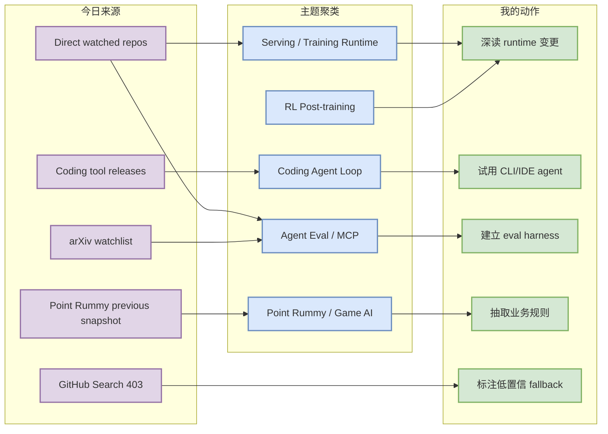
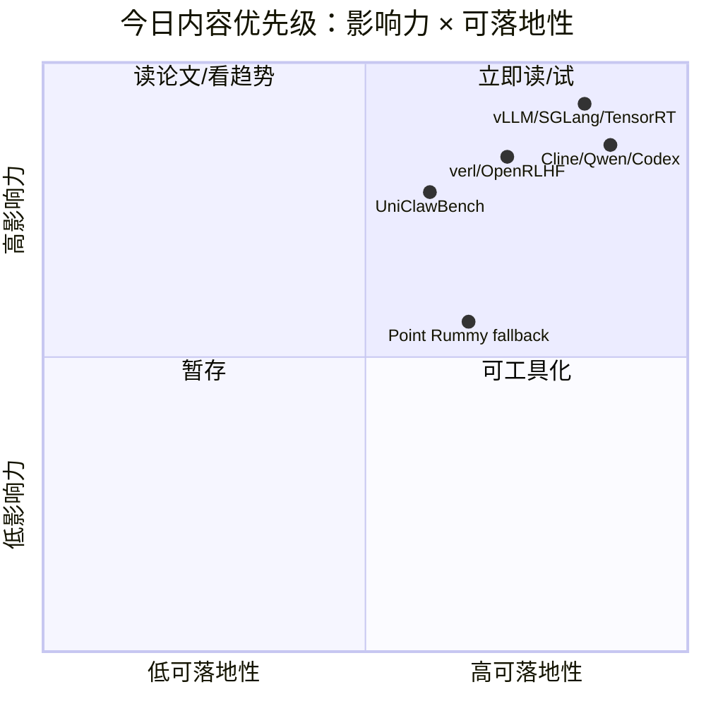

# AI Radar Daily - 2026-07-12

> 生成时间：2026-07-12 09:00 CST  
> 范围：AI Infra / LLM / RL / Game AI / 大厂博客 / 论文 / GitHub / Coding 工具  
> 说明：今日 GitHub Search 从首个查询开始 403 rate limit；已保存当日 snapshot，并用 direct /repos watched repo fallback 填充 broad/Loop 榜单，所有增长均标注为“非完整全网日增”。

## 0. 今日结论

- 今日最值得关注：GitHub Search 完全 403，但 direct repo 仍可用；vLLM、SGLang、TensorRT-LLM、Transformers、PyTorch 继续构成 AI Infra watched baseline。
- 对 AI Infra 的直接影响：serving/training runtime 的真实更新仍集中在 vLLM/SGLang/TensorRT-LLM/PyTorch/Transformers，适合继续做 scheduler、KV cache、并行和部署 watch。
- 对 LLM 训练 / 推理 / Agent 的影响：Codex、Claude Code、Gemini CLI、Cline、Qwen Code、Continue、MCP servers 的 terminal/IDE agent loop 仍是工具链主线。
- 对 RL / 游戏模型训练的影响：verl/OpenRLHF 继续是 post-training/RL rollout 主线；Point Rummy 仍低 star，重点是抽取 rules/env/schema/fixtures。
- 建议今天深读：Cline v4.0.8、Qwen Code v0.19.9、Codex rust-v0.144.1、vLLM/SGLang watched repos、UniClawBench agent eval。

## 1. 今日态势图

## 2. 必读卡片区

> [!important] GitHub Search 403 + direct watched repo fallback
> - 大类：GitHub / AI Infra
> - 小类：采集可靠性
> - 重点：今日 broad GitHub Search 没有可用结果，因此没有把空 snapshot 当作趋势榜；改用固定 watched repos 填充并显式标注。
> - 为什么重要：避免被 rate limit 误导，也避免把 Point Rummy 或空数据冒充全网 AI Infra 热榜。
> - 详情：[[GitHub/2026-07-12/vllm-project-vllm]] / [网页详情](https://github.com/dyt27666-oss/AI-news-report-obsidians/blob/main/GitHub/2026-07-12/vllm-project-vllm.md) / [原文](https://github.com/vllm-project/vllm)

> [!tip] Cline v4.0.8 / Qwen Code v0.19.9 / Codex rust-v0.144.1
> - 大类：Coding 工具
> - 小类：terminal/IDE coding agent
> - 重点：三个工具 release 都指向本地 agent loop、CLI/TUI、权限和 patch/review workflow 的持续迭代。
> - 为什么重要：适合横向比较 Claude Code、Codex、Gemini CLI、Cline、Continue、Qwen Code 的上下文和工具调用设计。
> - 详情：[[Industry/Tools/2026-07-12/cline-cline-v4-0-8-release-watch]] / [网页详情](https://github.com/dyt27666-oss/AI-news-report-obsidians/blob/main/Industry/Tools/2026-07-12/cline-cline-v4-0-8-release-watch.md) / [原文](https://github.com/cline/cline/releases/tag/v4.0.8)

> [!tip] UniClawBench proactive agent benchmark
> - 大类：论文
> - 小类：Agent Eval
> - 重点：用动态真实任务、Docker、executor/supervisor/user agent 闭环评价 proactive agents。
> - 为什么重要：比单轮静态 benchmark 更接近 coding-agent loop 和工具使用评测。
> - 详情：[[Papers/2026-07-12/uniclawbench-a-universal-benchmark-for-proactive-agents-on-real-world-tasks]] / [网页详情](https://github.com/dyt27666-oss/AI-news-report-obsidians/blob/main/Papers/2026-07-12/uniclawbench-a-universal-benchmark-for-proactive-agents-on-real-world-tasks.md) / [原文](https://arxiv.org/abs/2607.08768v1)

> [!warning] Point Rummy 主题今日使用昨日有效 snapshot fallback
> - 大类：Business / GitHub
> - 小类：Point Rummy / Indian Rummy
> - 重点：今日 Search 全 403，沿用 2026-07-11 已验证的 Rummy 候选；不声称有新增长。
> - 为什么重要：业务价值仍在 rules engine、AI opponent、ISMCTS、计分和 env fixtures。
> - 详情：[[Business/PointRummy/2026-07-12/nakkekakke-rummy-ai]] / [网页详情](https://github.com/dyt27666-oss/AI-news-report-obsidians/blob/main/Business/PointRummy/2026-07-12/nakkekakke-rummy-ai.md) / [原文](https://github.com/nakkekakke/rummy-ai)

## 3. 优先级矩阵

## 4. 分类清单

| 标签 | 大类 | 小类 | 标题 | 重点概括 | 为什么重要 | Obsidian 详情 | 网页详情 | 原文 |
|---|---|---|---|---|---|---|---|---|
| 必读 | GitHub | AI Infra | vLLM / SGLang / TensorRT-LLM watched runtime | direct repo fallback 下仍是 serving 主线 | 直接影响 scheduler、KV cache、batching、GPU runtime 与部署成本 | [[GitHub/2026-07-12/vllm-project-vllm]] | [网页详情](https://github.com/dyt27666-oss/AI-news-report-obsidians/blob/main/GitHub/2026-07-12/vllm-project-vllm.md) | [原文](https://github.com/vllm-project/vllm) |
| 必读 | Coding 工具 | Cline / Qwen Code / Codex | coding-agent release watch | terminal/IDE agent 工具链继续高频发布 | 可用于多 agent 编排、代码审查、权限和本地执行对比 | [[Industry/Tools/2026-07-12/cline-cline-v4-0-8-release-watch]] | [网页详情](https://github.com/dyt27666-oss/AI-news-report-obsidians/blob/main/Industry/Tools/2026-07-12/cline-cline-v4-0-8-release-watch.md) | [原文](https://github.com/cline/cline/releases/tag/v4.0.8) |
| 后续 | 论文 | Agent Eval | UniClawBench | 动态真实任务 proactive agent benchmark | 可借鉴 closed-loop eval、Docker 执行与 supervisor 判分 | [[Papers/2026-07-12/uniclawbench-a-universal-benchmark-for-proactive-agents-on-real-world-tasks]] | [网页详情](https://github.com/dyt27666-oss/AI-news-report-obsidians/blob/main/Papers/2026-07-12/uniclawbench-a-universal-benchmark-for-proactive-agents-on-real-world-tasks.md) | [原文](https://arxiv.org/abs/2607.08768v1) |
| 后续 | Business | Point Rummy | Rummy candidate fallback | 使用昨日有效 snapshot，不声称今日新增长 | 可抽取业务 rules/env/schema/fixtures | [[Business/PointRummy/2026-07-12/nakkekakke-rummy-ai]] | [网页详情](https://github.com/dyt27666-oss/AI-news-report-obsidians/blob/main/Business/PointRummy/2026-07-12/nakkekakke-rummy-ai.md) | [原文](https://github.com/nakkekakke/rummy-ai) |

## 5. 大厂资讯 / 工程博客 / Research

### 5.1 公司来源扫描矩阵

| 公司/实验室 | 来源/栏目 | 今日状态 | 高相关条数 | 代表条目 | 备注 |
|---|---|---|---:|---|---|
| OpenAI | News / Research / Codex Release | 高相关（工具侧） | 1 | Codex rust-v0.144.1 | Codex release 强相关；News/Research 未稳定发现新强相关 |
| Anthropic | News / Research / Claude Code | 高相关（工具侧） | 1 | Claude Code terminal agent | 继续跟踪 terminal agent、权限、团队协作 |
| Google DeepMind | Blog / Research | 已扫描/低置信 | 0 | 无高相关新项 | Gemini CLI 作为 Google 工具侧补充，不冒充 DeepMind 研究更新 |
| Meta AI | Blog / Research | 已扫描/低置信 | 0 | 无高相关新项 | 未抽取到今日 AI Infra/RL 强相关新项 |
| NVIDIA | Technical Blog / AI / TensorRT-LLM | 访问不稳；repo 补充 | 1 | TensorRT-LLM watched repo | Blog 自动抽取不稳，direct repo 可信 |
| Microsoft | Research AI / Agent repos | 观察 | 1 | AutoGen / Semantic Kernel | Research 页面未发现强新项，agent framework 继续观察 |
| Hugging Face | Blog / Papers / Releases | 高相关/观察 | 1 | Transformers watched repo | 生态基础层继续影响模型接入与 serving |
| 腾讯 | AI Lab / 技术博客 | 已扫描/低置信 | 0 | 无高相关新项 | 未抽取到今日强相关 |
| 字节 | Seed / 技术博客 | 已扫描/低置信 | 0 | 无高相关新项 | verl 生态作为 post-training repo watch |
| SpaceAI | Blog / News | 已扫描/低置信 | 0 | 无高相关新项 | 未抽取到今日强相关 |

### 5.2 高相关大厂条目

| 标签 | 发布方/大厂 | 栏目/来源 | 标题 | 重点概括 | 工程/算法影响 | Obsidian 详情 | 网页详情 | 原文 |
|---|---|---|---|---|---|---|---|---|
| 必读 | OpenAI | GitHub Release / Docs | Codex rust-v0.144.1 | Codex 继续作为轻量终端 coding agent 的关键观测点。 | 对本地执行、审查、patch loop 有直接参考 | [[Industry/Tools/2026-07-12/openai-codex-rust-v0-144-1-release-watch]] | [网页详情](https://github.com/dyt27666-oss/AI-news-report-obsidians/blob/main/Industry/Tools/2026-07-12/openai-codex-rust-v0-144-1-release-watch.md) | [原文](https://github.com/openai/codex/releases/tag/rust-v0.144.1) |
| 必读 | Anthropic | Claude Code / Docs | Claude Code terminal workflow | Claude Code 继续强化 terminal-first agent 形态。 | 对权限、上下文和多 agent 监控有直接参考 | [[GitHub/2026-07-12/anthropics-claude-code]] | [网页详情](https://github.com/dyt27666-oss/AI-news-report-obsidians/blob/main/GitHub/2026-07-12/anthropics-claude-code.md) | [原文](https://github.com/anthropics/claude-code) |
| 后续 | NVIDIA | GitHub / Runtime | TensorRT-LLM watched repo | Blog 访问不稳时以 direct repo 观察推理 runtime。 | 对 NVIDIA GPU serving、Blackwell、MoE 优化有参考 | [[GitHub/2026-07-12/nvidia-tensorrt-llm]] | [网页详情](https://github.com/dyt27666-oss/AI-news-report-obsidians/blob/main/GitHub/2026-07-12/nvidia-tensorrt-llm.md) | [原文](https://github.com/NVIDIA/TensorRT-LLM) |
| 后续 | Hugging Face | GitHub / Ecosystem | Transformers watched repo | 模型定义与加载基础层继续更新。 | 影响训练/推理接口、权重格式和 serving 兼容 | [[GitHub/2026-07-12/huggingface-transformers]] | [网页详情](https://github.com/dyt27666-oss/AI-news-report-obsidians/blob/main/GitHub/2026-07-12/huggingface-transformers.md) | [原文](https://github.com/huggingface/transformers) |

## 6. GitHub 高 star Top 10

> GitHub Search 今日全 403；本表使用 fixed watched repo direct API 兜底，不代表全网搜索结果。

| 排名 | repo | stars | forks | language | updated_at | topics | 重点概括 | 是否值得试用 | Obsidian 详情 | 原文 |
|---:|---|---:|---:|---|---|---|---|---|---|---|
| 1 | [huggingface/transformers](https://github.com/huggingface/transformers) | 162509 | 33868 | Python | 2026-07-12T00:12:44Z | audio, deep-learning, deepseek, gemma, glm | 模型定义与加载基础层，影响权重格式、training/serving 适配和生态兼容。 | 是 | [[GitHub/2026-07-12/huggingface-transformers]] | [原文](https://github.com/huggingface/transformers) |
| 2 | [anthropics/claude-code](https://github.com/anthropics/claude-code) | 137461 | 22201 | Python | 2026-07-12T00:31:54Z | 未标注 | terminal-first coding agent 样板，关注权限、上下文、Git workflow 与多 agent 编排。 | 是 | [[GitHub/2026-07-12/anthropics-claude-code]] | [原文](https://github.com/anthropics/claude-code) |
| 3 | [google-gemini/gemini-cli](https://github.com/google-gemini/gemini-cli) | 105926 | 14247 | TypeScript | 2026-07-12T00:28:11Z | ai, ai-agents, cli, gemini, gemini-api | Google 开源终端 agent，适合对比 MCP、tool calling 与 IDE 生态。 | 是 | [[GitHub/2026-07-12/google-gemini-gemini-cli]] | [原文](https://github.com/google-gemini/gemini-cli) |
| 4 | [pytorch/pytorch](https://github.com/pytorch/pytorch) | 101754 | 28479 | Python | 2026-07-12T00:51:02Z | autograd, deep-learning, gpu, machine-learning, neural-network | 训练/runtime 基础层，影响 distributed training、torch.compile、kernel 与部署。 | 是 | [[GitHub/2026-07-12/pytorch-pytorch]] | [原文](https://github.com/pytorch/pytorch) |
| 5 | [openai/codex](https://github.com/openai/codex) | 97204 | 14470 | Rust | 2026-07-12T00:21:08Z | 未标注 | OpenAI terminal coding agent，适合观察 sandbox、patch、review loop。 | 是 | [[GitHub/2026-07-12/openai-codex]] | [原文](https://github.com/openai/codex) |
| 6 | [modelcontextprotocol/servers](https://github.com/modelcontextprotocol/servers) | 88349 | 11215 | TypeScript | 2026-07-11T23:20:01Z | 未标注 | MCP 工具协议层，影响 agent tool registry、权限和资源隔离。 | 是 | [[GitHub/2026-07-12/modelcontextprotocol-servers]] | [原文](https://github.com/modelcontextprotocol/servers) |
| 7 | [vllm-project/vllm](https://github.com/vllm-project/vllm) | 85992 | 19281 | Python | 2026-07-12T00:35:43Z | amd, blackwell, cuda, deepseek, deepseek-v3 | 高吞吐 LLM serving 引擎，重点观察 scheduler、KV cache、batching 与 GPU runtime。 | 是 | [[GitHub/2026-07-12/vllm-project-vllm]] | [原文](https://github.com/vllm-project/vllm) |
| 8 | [OpenHands/OpenHands](https://github.com/OpenHands/OpenHands) | 80487 | 10265 | Python | 2026-07-12T00:51:43Z | agent, artificial-intelligence, chatgpt, claude-ai, cli | 🙌 OpenHands: AI-Driven Development | 是 | [[GitHub/2026-07-12/openhands-openhands]] | [原文](https://github.com/OpenHands/OpenHands) |
| 9 | [cline/cline](https://github.com/cline/cline) | 64551 | 6893 | TypeScript | 2026-07-11T21:40:02Z | 未标注 | 开源 autonomous coding agent，覆盖 SDK、IDE extension、CLI assistant。 | 是 | [[GitHub/2026-07-12/cline-cline]] | [原文](https://github.com/cline/cline) |
| 10 | [microsoft/autogen](https://github.com/microsoft/autogen) | 59665 | 8982 | Python | 2026-07-12T00:42:14Z | agentic, agentic-agi, agents, ai, autogen | A programming framework for agentic AI | 是 | [[GitHub/2026-07-12/microsoft-autogen]] | [原文](https://github.com/microsoft/autogen) |

## 7. GitHub star 增长最快 Top 10

> 存在历史 baseline，但 Search 全 403；本表为 direct watched repo fallback vs 2026-07-11 日报值，非完整全网日增。

| 排名 | repo | stars_delta | stars | forks | language | updated_at | 增长依据 | 重点概括 | Obsidian 详情 | 原文 |
|---:|---|---:|---:|---:|---|---|---|---|---|---|
| 1 | [openai/codex](https://github.com/openai/codex) | 195 | 97204 | 14470 | Rust | 2026-07-12T00:21:08Z | direct watched repo fallback vs 2026-07-11 daily value; 非完整全网日增 | OpenAI terminal coding agent，适合观察 sandbox、patch、review loop。 | [[GitHub/2026-07-12/openai-codex]] | [原文](https://github.com/openai/codex) |
| 2 | [anthropics/claude-code](https://github.com/anthropics/claude-code) | 144 | 137461 | 22201 | Python | 2026-07-12T00:31:54Z | direct watched repo fallback vs 2026-07-11 daily value; 非完整全网日增 | terminal-first coding agent 样板，关注权限、上下文、Git workflow 与多 agent 编排。 | [[GitHub/2026-07-12/anthropics-claude-code]] | [原文](https://github.com/anthropics/claude-code) |
| 3 | [OpenHands/OpenHands](https://github.com/OpenHands/OpenHands) | 107 | 80487 | 10265 | Python | 2026-07-12T00:51:43Z | direct watched repo fallback vs 2026-07-11 daily value; 非完整全网日增 | 🙌 OpenHands: AI-Driven Development | [[GitHub/2026-07-12/openhands-openhands]] | [原文](https://github.com/OpenHands/OpenHands) |
| 4 | [langchain-ai/langgraph](https://github.com/langchain-ai/langgraph) | 72 | 37064 | 6218 | Python | 2026-07-12T00:12:48Z | direct watched repo fallback vs 2026-07-11 daily value; 非完整全网日增 | agent 状态图与 resilient execution 框架，对 coding-agent loop 和任务恢复有价值。 | [[GitHub/2026-07-12/langchain-ai-langgraph]] | [原文](https://github.com/langchain-ai/langgraph) |
| 5 | [huggingface/transformers](https://github.com/huggingface/transformers) | 52 | 162509 | 33868 | Python | 2026-07-12T00:12:44Z | direct watched repo fallback vs 2026-07-11 daily value; 非完整全网日增 | 模型定义与加载基础层，影响权重格式、training/serving 适配和生态兼容。 | [[GitHub/2026-07-12/huggingface-transformers]] | [原文](https://github.com/huggingface/transformers) |
| 6 | [modelcontextprotocol/servers](https://github.com/modelcontextprotocol/servers) | 39 | 88349 | 11215 | TypeScript | 2026-07-11T23:20:01Z | direct watched repo fallback vs 2026-07-11 daily value; 非完整全网日增 | MCP 工具协议层，影响 agent tool registry、权限和资源隔离。 | [[GitHub/2026-07-12/modelcontextprotocol-servers]] | [原文](https://github.com/modelcontextprotocol/servers) |
| 7 | [pytorch/pytorch](https://github.com/pytorch/pytorch) | 35 | 101754 | 28479 | Python | 2026-07-12T00:51:02Z | direct watched repo fallback vs 2026-07-11 daily value; 非完整全网日增 | 训练/runtime 基础层，影响 distributed training、torch.compile、kernel 与部署。 | [[GitHub/2026-07-12/pytorch-pytorch]] | [原文](https://github.com/pytorch/pytorch) |
| 8 | [QwenLM/qwen-code](https://github.com/QwenLM/qwen-code) | 28 | 25956 | 2638 | TypeScript | 2026-07-12T00:59:03Z | direct watched repo fallback vs 2026-07-11 daily value; 非完整全网日增 | 国产开源 terminal coding agent，可纳入多模型、多供应商工作流对比。 | [[GitHub/2026-07-12/qwenlm-qwen-code]] | [原文](https://github.com/QwenLM/qwen-code) |
| 9 | [google-gemini/gemini-cli](https://github.com/google-gemini/gemini-cli) | 26 | 105926 | 14247 | TypeScript | 2026-07-12T00:28:11Z | direct watched repo fallback vs 2026-07-11 daily value; 非完整全网日增 | Google 开源终端 agent，适合对比 MCP、tool calling 与 IDE 生态。 | [[GitHub/2026-07-12/google-gemini-gemini-cli]] | [原文](https://github.com/google-gemini/gemini-cli) |
| 10 | [continuedev/continue](https://github.com/continuedev/continue) | 21 | 34824 | 5019 | TypeScript | 2026-07-11T22:33:22Z | direct watched repo fallback vs 2026-07-11 daily value; 非完整全网日增 | 开源自托管 coding agent/IDE workflow，适合企业内网和本地模型接入。 | [[GitHub/2026-07-12/continuedev-continue]] | [原文](https://github.com/continuedev/continue) |

## 8. Coding 工具 / AI 工具功能更新

### 8.1 Coding 工具扫描矩阵

| 工具 | 厂商 | 来源类型 | 今日状态 | 代表更新 | 对我的影响 | 原文 |
|---|---|---|---|---|---|---|
| Claude Code | Anthropic | Changelog / Release Notes / GitHub | 高相关 | terminal agent watched repo | 影响权限、上下文、团队协作和 terminal agent loop | [原文](https://github.com/anthropics/claude-code) |
| OpenAI Codex | OpenAI | GitHub Release / Docs | 高相关 | rust-v0.144.1 | Codex CLI 是多 agent 编排与本地执行的重要候选 | [原文](https://github.com/openai/codex/releases/tag/rust-v0.144.1) |
| Cursor | Cursor | Changelog | 已扫描/低置信 | 未稳定发现今日强相关新项 | 继续观察 agent mode、远程执行、rate limit | [原文](https://cursor.com/changelog) |
| Windsurf | Windsurf | Changelog | 已扫描/低置信 | 未稳定发现今日强相关新项 | 继续观察 IDE agent 与企业权限变化 | [原文](https://windsurf.com/changelog) |
| GitHub Copilot | GitHub | Changelog / Blog | 已扫描/低置信 | 未发现比 watched coding-agent repos 更强的新信号 | 继续观察 agent mode、PR review、workspace integration | [原文](https://github.blog/changelog/label/copilot/) |
| Gemini Code Assist | Google | Release Notes / Gemini CLI | 观察 | Gemini CLI v0.50.0 | Google coding agent 生态可能 CLI + IDE 双线收敛 | [原文](https://github.com/google-gemini/gemini-cli/releases/tag/v0.50.0) |
| Qwen Code | Alibaba/Qwen | GitHub Releases | 高相关 | v0.19.9 | 国产开源终端 coding agent，可纳入本地 workflow 对比 | [原文](https://github.com/QwenLM/qwen-code/releases/tag/v0.19.9) |
| Roo Code | Roo Code | GitHub Releases | 观察 | v3.54.0 | VS Code agent 模式可作为 Cline/Continue 对照 | [原文](https://github.com/RooCodeInc/Roo-Code/releases/tag/v3.54.0) |
| Cline | Cline | GitHub Releases | 高相关 | v4.0.8 | CLI/SDK/IDE agent 对 terminal-first workflow 重要 | [原文](https://github.com/cline/cline/releases/tag/v4.0.8) |
| Continue | Continue | GitHub Releases | 观察 | v2.0.0-vscode | 开源自托管 IDE workflow 继续观察 | [原文](https://github.com/continuedev/continue/releases/tag/v2.0.0-vscode) |

### 8.2 高相关工具更新

| 标签 | 工具/厂商 | 来源类型 | 标题/功能 | 重点概括 | 对 AI coding 工作流的影响 | Obsidian 详情 | 网页详情 | 原文 |
|---|---|---|---|---|---|---|---|---|
| 必读 | Cline / Cline | GitHub Release | v4.0.8 | Cline CLI/SDK/IDE extension 方向值得继续跟踪 | terminal-first agent workflow 的开源对照 | [[Industry/Tools/2026-07-12/cline-cline-v4-0-8-release-watch]] | [网页详情](https://github.com/dyt27666-oss/AI-news-report-obsidians/blob/main/Industry/Tools/2026-07-12/cline-cline-v4-0-8-release-watch.md) | [原文](https://github.com/cline/cline/releases/tag/v4.0.8) |
| 必读 | Qwen Code / Alibaba/Qwen | GitHub Release | v0.19.9 | 国产开源 coding agent 继续活跃 | 适合纳入本地多模型 coding workflow 对比 | [[Industry/Tools/2026-07-12/qwenlm-qwen-code-v0-19-9-release-watch]] | [网页详情](https://github.com/dyt27666-oss/AI-news-report-obsidians/blob/main/Industry/Tools/2026-07-12/qwenlm-qwen-code-v0-19-9-release-watch.md) | [原文](https://github.com/QwenLM/qwen-code/releases/tag/v0.19.9) |
| 必读 | OpenAI Codex / OpenAI | GitHub Release / Docs | rust-v0.144.1 | Codex 继续作为终端 coding agent 观察对象 | 影响本地执行、代码审查、agent loop 对比 | [[Industry/Tools/2026-07-12/openai-codex-rust-v0-144-1-release-watch]] | [网页详情](https://github.com/dyt27666-oss/AI-news-report-obsidians/blob/main/Industry/Tools/2026-07-12/openai-codex-rust-v0-144-1-release-watch.md) | [原文](https://github.com/openai/codex/releases/tag/rust-v0.144.1) |
| 后续 | Gemini CLI / Google | GitHub Release | v0.50.0 | Gemini terminal agent 继续活跃 | 可与 Claude Code/Codex 对比 MCP、sandbox、tool calling | [[Industry/Tools/2026-07-12/google-gemini-gemini-cli-v0-50-0-release-watch]] | [网页详情](https://github.com/dyt27666-oss/AI-news-report-obsidians/blob/main/Industry/Tools/2026-07-12/google-gemini-gemini-cli-v0-50-0-release-watch.md) | [原文](https://github.com/google-gemini/gemini-cli/releases/tag/v0.50.0) |

## 9. Point Rummy / Indian Rummy 业务主题

> 今日 GitHub Search 从首个查询开始 403；本节使用 2026-07-11 有效 Point Rummy snapshot fallback，不声称今日新增或真实增长。

### 9.1 GitHub 候选

| 标签 | repo | stars | forks | language | updated_at | 重点概括 | 业务可用性 | Obsidian 详情 | 原文 |
|---|---|---:|---:|---|---|---|---|---|---|
| 后续 | [rickgorman/gin-rummy-ai](https://github.com/rickgorman/gin-rummy-ai) | 13 | 5 | Python | 2025-03-25T13:47:09Z | A hand-rolled neuroevolution AI for gin rummy. | 可抽取规则/AI opponent/计分；需先跑通和补测试 | [[Business/PointRummy/2026-07-12/rickgorman-gin-rummy-ai]] | [原文](https://github.com/rickgorman/gin-rummy-ai) |
| 后续 | [nakkekakke/rummy-ai](https://github.com/nakkekakke/rummy-ai) | 11 | 5 | Java | 2026-04-17T10:02:59Z | Text based classic Rummy game with an AI that uses ISMCTS. Data Structures and Algorithms  | 可抽取规则/AI opponent/计分；需先跑通和补测试 | [[Business/PointRummy/2026-07-12/nakkekakke-rummy-ai]] | [原文](https://github.com/nakkekakke/rummy-ai) |
| 后续 | [jmhummel/Gin-Rummy-Java](https://github.com/jmhummel/Gin-Rummy-Java) | 8 | 0 | Java | 2023-08-16T16:12:58Z | Java-based Gin Rummy console game, with an AI opponent | 可抽取规则/AI opponent/计分；需先跑通和补测试 | [[Business/PointRummy/2026-07-12/jmhummel-gin-rummy-java]] | [原文](https://github.com/jmhummel/Gin-Rummy-Java) |
| 后续 | [dv-rastogi/Rummy](https://github.com/dv-rastogi/Rummy) | 5 | 0 | Python | 2023-09-26T11:21:39Z | Variation of classical Indian Rummy made in Pygame | 可抽取规则/AI opponent/计分；需先跑通和补测试 | [[Business/PointRummy/2026-07-12/dv-rastogi-rummy]] | [原文](https://github.com/dv-rastogi/Rummy) |
| 后续 | [mudont/indian-rummy](https://github.com/mudont/indian-rummy) | 5 | 0 | TypeScript | 2025-08-08T21:05:04Z | Typescript library for Indian Rummy card game | 可抽取规则/AI opponent/计分；需先跑通和补测试 | [[Business/PointRummy/2026-07-12/mudont-indian-rummy]] | [原文](https://github.com/mudont/indian-rummy) |
| 后续 | [mcartmell/gin-rummy-bot](https://github.com/mcartmell/gin-rummy-bot) | 4 | 2 | Perl | 2024-10-30T20:06:17Z | A web-based Gin Rummy game and AI | 可抽取规则/AI opponent/计分；需先跑通和补测试 | [[Business/PointRummy/2026-07-12/mcartmell-gin-rummy-bot]] | [原文](https://github.com/mcartmell/gin-rummy-bot) |
| 后续 | [SCFlanagan/Rummy](https://github.com/SCFlanagan/Rummy) | 4 | 6 | JavaScript | 2025-07-25T21:17:08Z | This project is a recreation of the classic card game Rummy. It features an AI player to p | 可抽取规则/AI opponent/计分；需先跑通和补测试 | [[Business/PointRummy/2026-07-12/scflanagan-rummy]] | [原文](https://github.com/SCFlanagan/Rummy) |
| 后续 | [vahsek300501/Indian-Rummy-](https://github.com/vahsek300501/Indian-Rummy-) | 4 | 3 | Python | 2023-09-26T11:21:46Z | Indian Rummy made in Python using PyGame | 可抽取规则/AI opponent/计分；需先跑通和补测试 | [[Business/PointRummy/2026-07-12/vahsek300501-indian-rummy]] | [原文](https://github.com/vahsek300501/Indian-Rummy-) |
| 后续 | [Abhilash-Mandlekar/RummyAgent-Reinforecement-Learning](https://github.com/Abhilash-Mandlekar/RummyAgent-Reinforecement-Learning) | 2 | 0 | Jupyter Notebook | 2023-04-01T05:48:51Z | Rummy Game Agent trained using Reinforcement Learning algorithm. | 可抽取规则/AI opponent/计分；需先跑通和补测试 | [[Business/PointRummy/2026-07-12/abhilash-mandlekar-rummyagent-reinforecement-learning]] | [原文](https://github.com/Abhilash-Mandlekar/RummyAgent-Reinforecement-Learning) |
| 后续 | [abubakarmunir712/dsa-final-project](https://github.com/abubakarmunir712/dsa-final-project) | 2 | 1 | Python | 2026-06-27T06:34:26Z | A Python-based multiplayer Indian Rummy game with support for AI opponents and LAN play. I | 可抽取规则/AI opponent/计分；需先跑通和补测试 | [[Business/PointRummy/2026-07-12/abubakarmunir712-dsa-final-project]] | [原文](https://github.com/abubakarmunir712/dsa-final-project) |

### 9.2 论文 / 资料候选

| 标签 | 来源 | 标题 | 作者/机构 | 重点概括 | 对 Point Rummy 业务有什么用 | Obsidian 详情 | 原文 |
|---|---|---|---|---|---|---|---|
| 低置信 | arXiv / 预印本 | Rummy 精确查询 | arXiv API | 今日未确认新的 Point/Indian Rummy 强相关论文；泛化查询容易返回 off-topic。 | 不把 off-topic 论文混入必读，继续以规则/AI opponent 候选为主 | 未生成 | [arXiv](https://arxiv.org/) |
| 后续 | GitHub / code corpus | nakkekakke/rummy-ai | GitHub | ISMCTS + Rummy bot 线索比多数 UI repo 更接近业务策略。 | 可用于 belief/state abstraction、MCTS baseline、imperfect information reasoning | [[Business/PointRummy/2026-07-12/nakkekakke-rummy-ai]] | [原文](https://github.com/nakkekakke/rummy-ai) |

### 9.3 业务可用性判断

| 方向 | 今日信号 | 可用性 | 下一步 |
|---|---|---|---|
| 规则引擎 / 计分 | 多个 Point/Indian/Gin Rummy repo 与 points counter | 中：可抽取 meld/sequence/set/drop/scoring 规则，但需测试 | 建立规则单测和边界牌型 fixtures |
| Bot / RL Agent | Neuroevolution、ISMCTS、AI opponent、RLCard 线索 | 中低：star 低，需先跑通 | 抽取 state/action/reward schema，做 baseline bot |
| 仿真 / 评测 | 多数项目偏 UI/scoreboard，环境质量不稳 | 低到中 | 自建 Gym/RLCard wrapper，复用可读规则代码 |

## 10. Loop Engineer / Loop Engineering 主题

> Loop Engineer GitHub Search 今日 403；以下用 watched coding-agent repos direct API 兜底，标注为非完整全网趋势。

### 10.1 Loop Engineer GitHub 高 star Top 10

| 排名 | repo | stars | forks | language | updated_at | topics | 重点概括 | 是否值得试用 | Obsidian 详情 | 原文 |
|---:|---|---:|---:|---|---|---|---|---|---|---|
| 1 | [anthropics/claude-code](https://github.com/anthropics/claude-code) | 137461 | 22201 | Python | 2026-07-12T00:31:54Z | 未标注 | terminal-first coding agent 样板，关注权限、上下文、Git workflow 与多 agent 编排。 | 是 | [[GitHub/2026-07-12/anthropics-claude-code]] | [原文](https://github.com/anthropics/claude-code) |
| 2 | [google-gemini/gemini-cli](https://github.com/google-gemini/gemini-cli) | 105926 | 14247 | TypeScript | 2026-07-12T00:28:11Z | ai, ai-agents, cli, gemini, gemini-api | Google 开源终端 agent，适合对比 MCP、tool calling 与 IDE 生态。 | 是 | [[GitHub/2026-07-12/google-gemini-gemini-cli]] | [原文](https://github.com/google-gemini/gemini-cli) |
| 3 | [openai/codex](https://github.com/openai/codex) | 97204 | 14470 | Rust | 2026-07-12T00:21:08Z | 未标注 | OpenAI terminal coding agent，适合观察 sandbox、patch、review loop。 | 是 | [[GitHub/2026-07-12/openai-codex]] | [原文](https://github.com/openai/codex) |
| 4 | [modelcontextprotocol/servers](https://github.com/modelcontextprotocol/servers) | 88349 | 11215 | TypeScript | 2026-07-11T23:20:01Z | 未标注 | MCP 工具协议层，影响 agent tool registry、权限和资源隔离。 | 是 | [[GitHub/2026-07-12/modelcontextprotocol-servers]] | [原文](https://github.com/modelcontextprotocol/servers) |
| 5 | [OpenHands/OpenHands](https://github.com/OpenHands/OpenHands) | 80487 | 10265 | Python | 2026-07-12T00:51:43Z | agent, artificial-intelligence, chatgpt, claude-ai, cli | 🙌 OpenHands: AI-Driven Development | 是 | [[GitHub/2026-07-12/openhands-openhands]] | [原文](https://github.com/OpenHands/OpenHands) |
| 6 | [cline/cline](https://github.com/cline/cline) | 64551 | 6893 | TypeScript | 2026-07-11T21:40:02Z | 未标注 | 开源 autonomous coding agent，覆盖 SDK、IDE extension、CLI assistant。 | 是 | [[GitHub/2026-07-12/cline-cline]] | [原文](https://github.com/cline/cline) |
| 7 | [langchain-ai/langgraph](https://github.com/langchain-ai/langgraph) | 37064 | 6218 | Python | 2026-07-12T00:12:48Z | agents, ai, ai-agents, chatgpt, deepagents | agent 状态图与 resilient execution 框架，对 coding-agent loop 和任务恢复有价值。 | 是 | [[GitHub/2026-07-12/langchain-ai-langgraph]] | [原文](https://github.com/langchain-ai/langgraph) |
| 8 | [continuedev/continue](https://github.com/continuedev/continue) | 34824 | 5019 | TypeScript | 2026-07-11T22:33:22Z | agent, ai, cli, developer-tools, open-source | 开源自托管 coding agent/IDE workflow，适合企业内网和本地模型接入。 | 是 | [[GitHub/2026-07-12/continuedev-continue]] | [原文](https://github.com/continuedev/continue) |
| 9 | [QwenLM/qwen-code](https://github.com/QwenLM/qwen-code) | 25956 | 2638 | TypeScript | 2026-07-12T00:59:03Z | 未标注 | 国产开源 terminal coding agent，可纳入多模型、多供应商工作流对比。 | 是 | [[GitHub/2026-07-12/qwenlm-qwen-code]] | [原文](https://github.com/QwenLM/qwen-code) |
| 10 | [RooCodeInc/Roo-Code](https://github.com/RooCodeInc/Roo-Code) | 24321 | 3363 | TypeScript | 2026-07-11T19:46:09Z | 未标注 | VS Code 内多 agent 团队形态，适合观察权限和上下文设计。 | 是 | [[GitHub/2026-07-12/roocodeinc-roo-code]] | [原文](https://github.com/RooCodeInc/Roo-Code) |

### 10.2 Loop Engineer GitHub star 增长最快 Top 10

| 排名 | repo | stars_delta | stars | forks | language | updated_at | 增长依据 | 重点概括 | Obsidian 详情 | 原文 |
|---:|---|---:|---:|---:|---|---|---|---|---|---|
| 1 | [openai/codex](https://github.com/openai/codex) | 195 | 97204 | 14470 | Rust | 2026-07-12T00:21:08Z | direct watched repo fallback vs 2026-07-11 daily value; 非完整全网日增 | OpenAI terminal coding agent，适合观察 sandbox、patch、review loop。 | [[GitHub/2026-07-12/openai-codex]] | [原文](https://github.com/openai/codex) |
| 2 | [anthropics/claude-code](https://github.com/anthropics/claude-code) | 144 | 137461 | 22201 | Python | 2026-07-12T00:31:54Z | direct watched repo fallback vs 2026-07-11 daily value; 非完整全网日增 | terminal-first coding agent 样板，关注权限、上下文、Git workflow 与多 agent 编排。 | [[GitHub/2026-07-12/anthropics-claude-code]] | [原文](https://github.com/anthropics/claude-code) |
| 3 | [OpenHands/OpenHands](https://github.com/OpenHands/OpenHands) | 107 | 80487 | 10265 | Python | 2026-07-12T00:51:43Z | direct watched repo fallback vs 2026-07-11 daily value; 非完整全网日增 | 🙌 OpenHands: AI-Driven Development | [[GitHub/2026-07-12/openhands-openhands]] | [原文](https://github.com/OpenHands/OpenHands) |
| 4 | [langchain-ai/langgraph](https://github.com/langchain-ai/langgraph) | 72 | 37064 | 6218 | Python | 2026-07-12T00:12:48Z | direct watched repo fallback vs 2026-07-11 daily value; 非完整全网日增 | agent 状态图与 resilient execution 框架，对 coding-agent loop 和任务恢复有价值。 | [[GitHub/2026-07-12/langchain-ai-langgraph]] | [原文](https://github.com/langchain-ai/langgraph) |
| 5 | [modelcontextprotocol/servers](https://github.com/modelcontextprotocol/servers) | 39 | 88349 | 11215 | TypeScript | 2026-07-11T23:20:01Z | direct watched repo fallback vs 2026-07-11 daily value; 非完整全网日增 | MCP 工具协议层，影响 agent tool registry、权限和资源隔离。 | [[GitHub/2026-07-12/modelcontextprotocol-servers]] | [原文](https://github.com/modelcontextprotocol/servers) |
| 6 | [QwenLM/qwen-code](https://github.com/QwenLM/qwen-code) | 28 | 25956 | 2638 | TypeScript | 2026-07-12T00:59:03Z | direct watched repo fallback vs 2026-07-11 daily value; 非完整全网日增 | 国产开源 terminal coding agent，可纳入多模型、多供应商工作流对比。 | [[GitHub/2026-07-12/qwenlm-qwen-code]] | [原文](https://github.com/QwenLM/qwen-code) |
| 7 | [google-gemini/gemini-cli](https://github.com/google-gemini/gemini-cli) | 26 | 105926 | 14247 | TypeScript | 2026-07-12T00:28:11Z | direct watched repo fallback vs 2026-07-11 daily value; 非完整全网日增 | Google 开源终端 agent，适合对比 MCP、tool calling 与 IDE 生态。 | [[GitHub/2026-07-12/google-gemini-gemini-cli]] | [原文](https://github.com/google-gemini/gemini-cli) |
| 8 | [continuedev/continue](https://github.com/continuedev/continue) | 21 | 34824 | 5019 | TypeScript | 2026-07-11T22:33:22Z | direct watched repo fallback vs 2026-07-11 daily value; 非完整全网日增 | 开源自托管 coding agent/IDE workflow，适合企业内网和本地模型接入。 | [[GitHub/2026-07-12/continuedev-continue]] | [原文](https://github.com/continuedev/continue) |
| 9 | [cline/cline](https://github.com/cline/cline) | 20 | 64551 | 6893 | TypeScript | 2026-07-11T21:40:02Z | direct watched repo fallback vs 2026-07-11 daily value; 非完整全网日增 | 开源 autonomous coding agent，覆盖 SDK、IDE extension、CLI assistant。 | [[GitHub/2026-07-12/cline-cline]] | [原文](https://github.com/cline/cline) |
| 10 | [RooCodeInc/Roo-Code](https://github.com/RooCodeInc/Roo-Code) | 4 | 24321 | 3363 | TypeScript | 2026-07-11T19:46:09Z | direct watched repo fallback vs 2026-07-11 daily value; 非完整全网日增 | VS Code 内多 agent 团队形态，适合观察权限和上下文设计。 | [[GitHub/2026-07-12/roocodeinc-roo-code]] | [原文](https://github.com/RooCodeInc/Roo-Code) |

### 10.3 Loop Engineering 方法信号

| 标签 | 来源 | 标题 | 重点概括 | 对 AI coding 工作流的影响 | Obsidian 详情 | 原文 |
|---|---|---|---|---|---|---|
| 必读 | GitHub / OpenAI | Codex rust-v0.144.1 | lightweight terminal coding agent release | 可与 Claude Code/Gemini CLI 对比 sandbox、patch、review loop | [[GitHub/2026-07-12/openai-codex]] | [原文](https://github.com/openai/codex) |
| 必读 | GitHub / Anthropic | Claude Code | terminal-first coding agent 样板 | 权限、上下文、任务拆分、human approval 都可作为 loop 设计参考 | [[GitHub/2026-07-12/anthropics-claude-code]] | [原文](https://github.com/anthropics/claude-code) |
| 后续 | GitHub / MCP | Model Context Protocol servers | 工具上下文协议层 | 对 agent tool registry、权限、资源发现有直接影响 | [[GitHub/2026-07-12/modelcontextprotocol-servers]] | [原文](https://github.com/modelcontextprotocol/servers) |

## 11. 论文

### 11.1 Agent Eval / Training Efficiency / Research Lineage

| 标签 | 论文来源 | 论文 | 作者/机构 | 重点概括 | 工程/研究价值 | Obsidian 详情 | 网页详情 | PDF/原文 |
|---|---|---|---|---|---|---|---|---|
| 后续 | arXiv / 预印本 | Ideas Have Genomes: Benchmarking Scientific Lineage Reasoning and Lineage-Grounded Idea Generation | Yifan Zhou, Qihao Yang, Yan Li, Donggang Li | Scientific ideas rarely start from a blank page. They inherit mechanisms, repair known lim... | 需验证强相关；可作为 agent eval / training efficiency watchlist | [[Papers/2026-07-12/ideas-have-genomes-benchmarking-scientific-lineage-reasoning-and-lineage-grounded-idea-gen]] | [网页详情](https://github.com/dyt27666-oss/AI-news-report-obsidians/blob/main/Papers/2026-07-12/ideas-have-genomes-benchmarking-scientific-lineage-reasoning-and-lineage-grounded-idea-gen.md) | [abs](https://arxiv.org/abs/2607.08758v1) / [pdf](https://arxiv.org/pdf/2607.08758v1) |
| 后续 | arXiv / 预印本 | SLORR: Simple and Efficient In-Training Low-Rank Regularization | David González-Martínez, Shiwei Liu | Low-rank factorization is widely used to compress neural networks, but modern models are o... | 需验证强相关；可作为 agent eval / training efficiency watchlist | [[Papers/2026-07-12/slorr-simple-and-efficient-in-training-low-rank-regularization]] | [网页详情](https://github.com/dyt27666-oss/AI-news-report-obsidians/blob/main/Papers/2026-07-12/slorr-simple-and-efficient-in-training-low-rank-regularization.md) | [abs](https://arxiv.org/abs/2607.08754v1) / [pdf](https://arxiv.org/pdf/2607.08754v1) |
| 后续 | arXiv / 预印本 | UniClawBench: A Universal Benchmark for Proactive Agents on Real-World Tasks | Zhekai Chen, Chengqi Duan, Kaiyue Sun, Bohao Li | The rapid development of large language models and multimodal large language models has ac... | 需验证强相关；可作为 agent eval / training efficiency watchlist | [[Papers/2026-07-12/uniclawbench-a-universal-benchmark-for-proactive-agents-on-real-world-tasks]] | [网页详情](https://github.com/dyt27666-oss/AI-news-report-obsidians/blob/main/Papers/2026-07-12/uniclawbench-a-universal-benchmark-for-proactive-agents-on-real-world-tasks.md) | [abs](https://arxiv.org/abs/2607.08768v1) / [pdf](https://arxiv.org/pdf/2607.08768v1) |

## 12. 资讯 / 其他 GitHub 项目

### 12.1 AI Infra / Agent Framework

| 标签 | 来源 | 标题 | 重点概括 | 对我有什么用 | Obsidian 详情 | 网页详情 | 原文 |
|---|---|---|---|---|---|---|---|
| 必读 | GitHub | SGLang / TensorRT-LLM | serving runtime 仍是关注重点 | 对比 scheduler、KV cache、batching、GPU runtime | [[GitHub/2026-07-12/sgl-project-sglang]] | [网页详情](https://github.com/dyt27666-oss/AI-news-report-obsidians/blob/main/GitHub/2026-07-12/sgl-project-sglang.md) | [SGLang](https://github.com/sgl-project/sglang) |
| 后续 | GitHub | verl / OpenRLHF | RL post-training 框架继续 watch | 和 agentic RL / GRPO / reward design 联动 | [[GitHub/2026-07-12/verl-project-verl]] | [网页详情](https://github.com/dyt27666-oss/AI-news-report-obsidians/blob/main/GitHub/2026-07-12/verl-project-verl.md) | [verl](https://github.com/verl-project/verl) |
| 后续 | GitHub | MCP servers / LangGraph | agent 工具协议与图执行框架 | 可用于 coding-agent loop 的工具注册和任务状态图 | [[GitHub/2026-07-12/modelcontextprotocol-servers]] | [网页详情](https://github.com/dyt27666-oss/AI-news-report-obsidians/blob/main/GitHub/2026-07-12/modelcontextprotocol-servers.md) | [MCP servers](https://github.com/modelcontextprotocol/servers) |

## 13. 按主题索引

### AI Infra / Serving / Training

- [[GitHub/2026-07-12/huggingface-transformers]] - Transformers 生态基础库。
- [[GitHub/2026-07-12/pytorch-pytorch]] - PyTorch 训练/runtime 基础。
- [[GitHub/2026-07-12/vllm-project-vllm]] - LLM serving runtime watch。
- [[GitHub/2026-07-12/sgl-project-sglang]] - Serving framework watch。
- [[GitHub/2026-07-12/nvidia-tensorrt-llm]] - NVIDIA GPU inference runtime。

### LLM / Agent / RAG / Evaluation

- [[GitHub/2026-07-12/modelcontextprotocol-servers]] - MCP 工具协议。
- [[GitHub/2026-07-12/langchain-ai-langgraph]] - Agent graph execution。
- [[Papers/2026-07-12/uniclawbench-a-universal-benchmark-for-proactive-agents-on-real-world-tasks]] - Proactive agent benchmark。

### RL / Game AI / World Model

- [[GitHub/2026-07-12/verl-project-verl]] - RL post-training framework。
- [[GitHub/2026-07-12/openrlhf-openrlhf]] - Agentic RL / RLHF framework。

### Point Rummy / Indian Rummy

- [[Business/PointRummy/2026-07-12/nakkekakke-rummy-ai]] - ISMCTS Rummy AI candidate。
- [[Business/PointRummy/2026-07-12/rickgorman-gin-rummy-ai]] - neuroevolution Gin Rummy candidate。

### Loop Engineer / Coding Agent Loop

- [[GitHub/2026-07-12/anthropics-claude-code]] - terminal-first coding agent。
- [[GitHub/2026-07-12/openai-codex]] - Codex terminal coding agent。
- [[GitHub/2026-07-12/google-gemini-gemini-cli]] - Gemini CLI。
- [[GitHub/2026-07-12/cline-cline]] - Cline open-source agent。

### 公司 / 实验室

- OpenAI: [[Industry/Tools/2026-07-12/openai-codex-rust-v0-144-1-release-watch]]
- Anthropic: [[GitHub/2026-07-12/anthropics-claude-code]]
- Google / DeepMind: [[GitHub/2026-07-12/google-gemini-gemini-cli]]
- NVIDIA: [[GitHub/2026-07-12/nvidia-tensorrt-llm]]
- Hugging Face: [[GitHub/2026-07-12/huggingface-transformers]]

## 14. 值得后续深挖

| 标签 | 大类 | 小类 | 标题 | 后续动作 | Obsidian 详情 | 原文 |
|---|---|---|---|---|---|---|
| 必读 | GitHub | Serving | vLLM/SGLang/TensorRT-LLM | 对比 scheduler、cache、benchmark 和硬件支持 | [[GitHub/2026-07-12/vllm-project-vllm]] | [原文](https://github.com/vllm-project/vllm) |
| 必读 | Coding 工具 | Agent Loop | Codex/Claude Code/Cline/Qwen | 做 CLI/TUI、权限、上下文和 patch workflow 横评 | [[Industry/Tools/2026-07-12/openai-codex-rust-v0-144-1-release-watch]] | [原文](https://github.com/openai/codex) |
| 后续 | 论文 | Agent Eval | UniClawBench | 评估是否可借鉴 Docker + supervisor agent 判分 | [[Papers/2026-07-12/uniclawbench-a-universal-benchmark-for-proactive-agents-on-real-world-tasks]] | [原文](https://arxiv.org/abs/2607.08768v1) |
| 后续 | Business | Point Rummy | Rummy rules/env candidates | 抽取规则 fixtures 和 baseline bot | [[Business/PointRummy/2026-07-12/nakkekakke-rummy-ai]] | [原文](https://github.com/nakkekakke/rummy-ai) |

## 15. 采集失败或低置信来源

- GitHub Search：从 `point rummy` 起全部 403 rate limit；已保存 snapshot，并用 direct watched repo fallback。
- Broad GitHub Top 10 / 增长 Top 10：不是全网 Search 结果，增长为 fixed watched repos 相对 2026-07-11 日报值。
- Point Rummy：今日 Search 不可用，使用昨日有效 snapshot fallback；不声称今日新增。
- arXiv：部分 query 返回 off-topic（例如 quantum / underwater CV），已过滤到低置信或跳过。
- 大厂官网：部分页面动态渲染/访问不稳，矩阵中按“已扫描/低置信/访问不稳”标注。

## 16. 归档标签

#ai-radar #daily #ai-infra #llm #rl #point-rummy #loop-engineering
