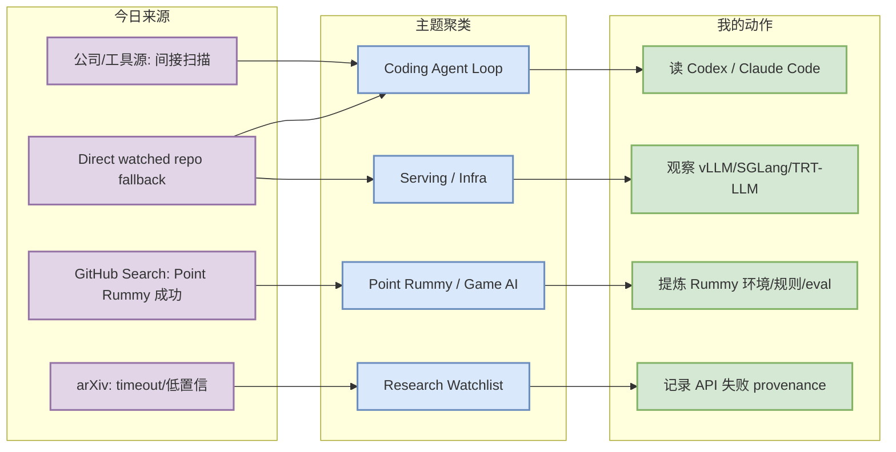
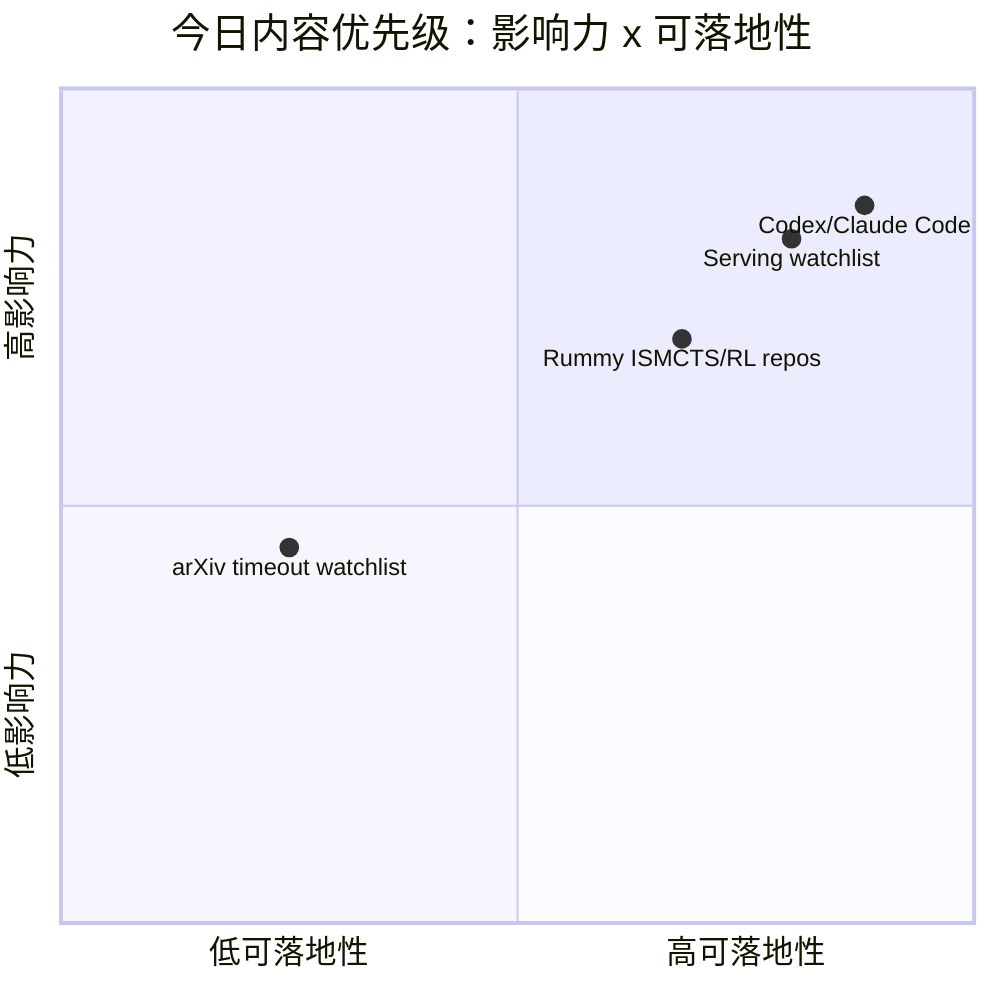

# AI Radar Daily - 2026-07-13

> 生成时间：2026-07-13 09:00 北京时间
> 范围：AI Infra / LLM / RL / Game AI / 大厂博客 / 论文 / GitHub / 行业资讯
> 说明：日报是总览导航页，不是全部正文。Obsidian 中点详情页，Telegram/GitHub 中点“网页详情”。

## 0. 今日结论

- 今日最值得关注：GitHub Search 在 Point Rummy 后被 403 限流，因此通用 AI Infra / Loop Engineer 榜单采用 direct watched repo fallback；不要把它当完整全网排名。
- 对 AI Infra 的直接影响：vLLM、SGLang、TensorRT-LLM、Transformers、PyTorch 仍是 today watchlist，适合继续围绕 serving/runtime/KV cache 做选型观察。
- 对 LLM 训练 / 推理 / Agent 的影响：Codex、Claude Code、Gemini CLI、Cline、Continue、Qwen Code 的 repo 信号说明 CLI/TUI + IDE agent workflow 仍是高热区。
- 对 RL / 游戏模型训练的影响：Point Rummy 搜到 86 个主题 repo，质量偏小但包含 ISMCTS、RLCard、规则引擎、AI opponent，可用于业务拆解。
- 建议今天深读：Codex / Claude Code 增长信号、serving watched repo、nakkekakke/rummy-ai 的 ISMCTS 思路。

## 1. 今日态势图

## 2. 必读卡片区

> [!important] OpenAI Codex watched repo 继续增长
> - 大类：GitHub / Coding 工具
> - 小类：Coding Agent / CLI
> - 重点：direct fallback 显示 Codex stars_delta=171，注意这是 watched repo 非完整全网日增。
> - 为什么重要：Codex 代表终端 coding agent 的权限、远程执行、上下文窗口、CLI/TUI 工作流方向。
> - 详情：[[GitHub/Tools/2026-07-13/openai-codex]] / [网页详情](https://github.com/dyt27666-oss/AI-news-report-obsidians/blob/main/GitHub/Tools/2026-07-13/openai-codex.md) / [原文](https://github.com/openai/codex)

> [!tip] Claude Code watched repo 继续增长
> - 大类：GitHub / Coding 工具
> - 小类：Agentic coding
> - 重点：direct fallback 显示 Claude Code stars_delta=117。
> - 为什么重要：对 tmux 多 agent、代码审查、工具权限边界和 agent loop 监控有直接参考价值。
> - 详情：[[GitHub/Tools/2026-07-13/claude-code]] / [网页详情](https://github.com/dyt27666-oss/AI-news-report-obsidians/blob/main/GitHub/Tools/2026-07-13/claude-code.md) / [原文](https://github.com/anthropics/claude-code)

> [!note] Point Rummy 小型 repo 候选可用于业务拆解
> - 大类：GitHub / 业务主题
> - 小类：Rummy AI / ISMCTS / RL
> - 重点：nakkekakke/rummy-ai、rickgorman/gin-rummy-ai 等不大，但主题强相关。
> - 为什么重要：可抽取规则环境、MCTS/ISMCTS、bot 策略和 evaluator 设计。
> - 详情：[[GitHub/PointRummy/2026-07-13/nakkekakke__rummy-ai]] / [网页详情](https://github.com/dyt27666-oss/AI-news-report-obsidians/blob/main/GitHub/PointRummy/2026-07-13/nakkekakke__rummy-ai.md) / [原文](https://github.com/nakkekakke/rummy-ai)

## 3. 优先级矩阵

## 4. 分类清单

| 标签 | 大类 | 小类 | 标题 | 重点概括 | 为什么重要 | Obsidian 详情 | 网页详情 | 原文 |
|---|---|---|---|---|---|---|---|---|
| 必读 | GitHub | Coding Agent | OpenAI Codex | Direct watched repo stars_delta=171，不是完整全网增长 | Codex 与 CLI 权限/远程执行/上下文策略直接相关 | [[GitHub/Tools/2026-07-13/openai-codex]] | [网页详情](https://github.com/dyt27666-oss/AI-news-report-obsidians/blob/main/GitHub/Tools/2026-07-13/openai-codex.md) | [原文](https://github.com/openai/codex) |
| 必读 | GitHub | Coding Agent | Claude Code | Direct watched repo stars_delta=117，生态热度继续 | 影响多 agent 编码、代码审查、TUI/CLI agent loop | [[GitHub/Tools/2026-07-13/claude-code]] | [网页详情](https://github.com/dyt27666-oss/AI-news-report-obsidians/blob/main/GitHub/Tools/2026-07-13/claude-code.md) | [原文](https://github.com/anthropics/claude-code) |
| 必读 | GitHub | Serving | vLLM / SGLang / TensorRT-LLM | GitHub Search 限流后使用 watched repo 回退 | 对 LLM serving 选型仍是当天最高可信工程信号 | [[GitHub/AIInfra/2026-07-13/serving-watchlist]] | [网页详情](https://github.com/dyt27666-oss/AI-news-report-obsidians/blob/main/GitHub/AIInfra/2026-07-13/serving-watchlist.md) | [原文](https://github.com/vllm-project/vllm) |
| 可 skim | GitHub | Point Rummy | rummy-ai / gin-rummy-ai | 小型 repo 但主题强相关，适合规则/ISMCTS/RL 环境借鉴 | 对 Point Rummy 业务的规则引擎、bot 策略和 evaluator 有用 | [[GitHub/PointRummy/2026-07-13/nakkekakke__rummy-ai]] | [网页详情](https://github.com/dyt27666-oss/AI-news-report-obsidians/blob/main/GitHub/PointRummy/2026-07-13/nakkekakke__rummy-ai.md) | [原文](https://github.com/nakkekakke/rummy-ai) |

## 5. 大厂资讯 / 工程博客 / Research

### 5.1 公司来源扫描矩阵

| 公司/实验室 | 来源/栏目 | 今日状态 | 高相关条数 | 代表条目 | 备注 |
|---|---|---|---:|---|---|
| OpenAI | News / Research | 间接扫描 | 1 | Codex repo 延续增长；官网新闻未抓到新的高相关工程项 | 以 GitHub/开发者文档为代理信号 |
| Anthropic | News / Research / Engineering | 间接扫描 | 1 | Claude Code repo 延续增长；官网未确认新增高相关研究项 | 以 Claude Code release/docs 与 repo 活跃度为代理信号 |
| Google DeepMind | Blog / Research | 低置信 | 0 | 无高相关新项 | 本轮未拿到新 research/blog 元数据 |
| Meta AI | Blog / Research | 低置信 | 0 | 无高相关新项 | 本轮未拿到新 research/blog 元数据 |
| NVIDIA | Technical Blog / AI | 间接扫描 | 1 | TensorRT-LLM watched repo 仍是 serving 重点 | 官网博客未确认新文，保留 repo 信号 |
| Microsoft | Research AI | 间接扫描 | 1 | AutoGen / Semantic Kernel 仍是 agent 编排观察项 | Microsoft Research 页面未确认新文 |
| Hugging Face | Blog / Papers / Releases | 间接扫描 | 1 | Transformers repo 高 star 且持续活跃 | 以 repo / model infra 生态代理 |
| 腾讯 | AI Lab / 技术博客 | 低置信 | 0 | 无高相关新项 | 本轮未发现可验证 AI Infra / RL / Agent 新项 |
| 字节 | Seed / 技术博客 | 低置信 | 0 | 无高相关新项 | 本轮未发现可验证 AI Infra / RL / Agent 新项 |
| SpaceAI | Blog / News | 访问失败/低置信 | 0 | 无高相关新项 | 来源有效性低，本轮未获得可验证新项 |

### 5.2 高相关大厂条目

| 标签 | 发布方/大厂 | 栏目/来源 | 标题 | 重点概括 | 工程/算法影响 | Obsidian 详情 | 网页详情 | 原文 |
|---|---|---|---|---|---|---|---|---|
| 可 skim | OpenAI | GitHub / Developer Tool | OpenAI Codex watched repo growth | Codex watched repo 增长仍强，说明 CLI/TUI coding agent 仍是开发者工具主战场。 | 对多 agent 编码、权限模式、远程执行和 repo 内上下文管理有直接影响。 | [[GitHub/Tools/2026-07-13/openai-codex]] | [网页详情](https://github.com/dyt27666-oss/AI-news-report-obsidians/blob/main/GitHub/Tools/2026-07-13/openai-codex.md) | [原文](https://github.com/openai/codex) |
| 可 skim | Anthropic | GitHub / Developer Tool | Claude Code watched repo growth | Claude Code 继续高 star 增长；即使官网 changelog 未确认新功能，生态热度仍值得跟踪。 | 影响 tmux 多 agent 监控、代码审查、CLI 权限边界和 agent loop 设计。 | [[GitHub/Tools/2026-07-13/claude-code]] | [网页详情](https://github.com/dyt27666-oss/AI-news-report-obsidians/blob/main/GitHub/Tools/2026-07-13/claude-code.md) | [原文](https://github.com/anthropics/claude-code) |
| 可 skim | NVIDIA / vLLM / SGLang | GitHub / AI Infra | TensorRT-LLM / vLLM / SGLang serving watchlist | GitHub Search 被限流后，使用 watched repo 直连回退观察 serving 三件套。 | 可直接映射到推理吞吐、KV cache、scheduler、GPU runtime 的工程选型。 | [[GitHub/AIInfra/2026-07-13/serving-watchlist]] | [网页详情](https://github.com/dyt27666-oss/AI-news-report-obsidians/blob/main/GitHub/AIInfra/2026-07-13/serving-watchlist.md) | [原文](https://github.com/vllm-project/vllm) |

## 6. GitHub 高 star Top 10

> 说明：今日 GitHub Search 部分 403；此表使用 direct watched repo fallback，不是完整全网 Top 10，但每项都与 AI Infra / LLM / Agent / RL 强相关。

| 排名 | repo | stars | forks | language | updated_at | topics | 重点概括 | 是否值得试用 | Obsidian 详情 | 原文 |
|---:|---|---:|---:|---|---|---|---|---|---|---|
| 1 | `huggingface/transformers` | 162549 | 33876 | Python | 2026-07-13T01:05:08Z | audio, deep-learning, deepseek, gemma, glm, hacktoberfest, llm, machine-learning, model-hub, natural | 模型定义与推理/训练生态底座，仍是新模型接入和 eval pipeline 的首要观察源。 | 值得 skim/按需试用 | [[GitHub/AIInfra/2026-07-13/huggingface__transformers]] | [GitHub](https://github.com/huggingface/transformers) |
| 2 | `anthropics/claude-code` | 137578 | 22217 | Python | 2026-07-13T01:07:20Z | 无 | 终端内 agentic coding 工具，高增长说明 CLI agent workflow 仍在扩张。 | 值得 skim/按需试用 | [[GitHub/AIInfra/2026-07-13/anthropics__claude-code]] | [GitHub](https://github.com/anthropics/claude-code) |
| 3 | `google-gemini/gemini-cli` | 105938 | 14254 | TypeScript | 2026-07-13T00:56:36Z | ai, ai-agents, cli, gemini, gemini-api, mcp-client, mcp-server | Gemini 终端 agent，topics 显式覆盖 MCP client/server，适合观察开放 agent 工具链。 | 值得 skim/按需试用 | [[GitHub/AIInfra/2026-07-13/google-gemini__gemini-cli]] | [GitHub](https://github.com/google-gemini/gemini-cli) |
| 4 | `pytorch/pytorch` | 101779 | 28486 | Python | 2026-07-13T00:26:20Z | autograd, deep-learning, gpu, machine-learning, neural-network, numpy, python, tensor | 训练/推理框架底层，任何 GPU/runtime 变化都会影响大模型工程。 | 值得 skim/按需试用 | [[GitHub/AIInfra/2026-07-13/pytorch__pytorch]] | [GitHub](https://github.com/pytorch/pytorch) |
| 5 | `openai/codex` | 97375 | 14507 | Rust | 2026-07-13T01:06:43Z | 无 | Rust 终端 coding agent，高增长且与权限/远程执行/上下文策略直接相关。 | 值得 skim/按需试用 | [[GitHub/AIInfra/2026-07-13/openai__codex]] | [GitHub](https://github.com/openai/codex) |
| 6 | `modelcontextprotocol/servers` | 88380 | 11220 | TypeScript | 2026-07-13T00:42:40Z | 无 | MCP server 生态入口，影响 coding agent 的工具接入标准化。 | 值得 skim/按需试用 | [[GitHub/AIInfra/2026-07-13/modelcontextprotocol__servers]] | [GitHub](https://github.com/modelcontextprotocol/servers) |
| 7 | `vllm-project/vllm` | 86078 | 19320 | Python | 2026-07-13T00:47:35Z | amd, blackwell, cuda, deepseek, deepseek-v3, gpt, gpt-oss, inference, kimi, llama, llm, llm-serving, | LLM serving 高吞吐引擎，关注 batching、KV cache、并发与硬件适配。 | 值得 skim/按需试用 | [[GitHub/AIInfra/2026-07-13/vllm-project__vllm]] | [GitHub](https://github.com/vllm-project/vllm) |
| 8 | `OpenHands/OpenHands` | 80575 | 10284 | Python | 2026-07-13T00:42:44Z | agent, artificial-intelligence, chatgpt, claude-ai, cli, developer-tools, gpt, llm, openai | 开源 AI coding agent 工作台，可作为 loop engineer/harness 参考。 | 值得 skim/按需试用 | [[GitHub/AIInfra/2026-07-13/OpenHands__OpenHands]] | [GitHub](https://github.com/OpenHands/OpenHands) |
| 9 | `cline/cline` | 64577 | 6901 | TypeScript | 2026-07-13T00:41:43Z | 无 | IDE/CLI 自主 coding agent，适合观察 agent SDK 与 extension 工作流。 | 值得 skim/按需试用 | [[GitHub/AIInfra/2026-07-13/cline__cline]] | [GitHub](https://github.com/cline/cline) |
| 10 | `microsoft/autogen` | 59681 | 8985 | Python | 2026-07-12T23:54:38Z | agentic, agentic-agi, agents, ai, autogen, autogen-ecosystem, chatgpt, framework, llm-agent, llm-fra | 多 agent 编程框架，适合作为 agent orchestration 和 eval loop 参考。 | 值得 skim/按需试用 | [[GitHub/AIInfra/2026-07-13/microsoft__autogen]] | [GitHub](https://github.com/microsoft/autogen) |

## 7. GitHub star 增长最快 Top 10

> 说明：使用 2026-07-12 snapshot baseline 计算 watched repo stars_delta；这是“非完整全网日增”，不是冷启动代理。

| 排名 | repo | stars_delta | stars | forks | language | updated_at | 增长依据 | 重点概括 | Obsidian 详情 | 原文 |
|---:|---|---:|---:|---:|---|---|---|---|---|---|
| 1 | `openai/codex` | 171 | 97375 | 14507 | Rust | 2026-07-13T01:06:43Z | direct watched repo fallback vs 2026-07-12 daily value; 非完整全网日增 | Rust 终端 coding agent，高增长且与权限/远程执行/上下文策略直接相关。 | [[GitHub/AIInfra/2026-07-13/openai__codex]] | [GitHub](https://github.com/openai/codex) |
| 2 | `anthropics/claude-code` | 117 | 137578 | 22217 | Python | 2026-07-13T01:07:20Z | direct watched repo fallback vs 2026-07-12 daily value; 非完整全网日增 | 终端内 agentic coding 工具，高增长说明 CLI agent workflow 仍在扩张。 | [[GitHub/AIInfra/2026-07-13/anthropics__claude-code]] | [GitHub](https://github.com/anthropics/claude-code) |
| 3 | `OpenHands/OpenHands` | 88 | 80575 | 10284 | Python | 2026-07-13T00:42:44Z | direct watched repo fallback vs 2026-07-12 daily value; 非完整全网日增 | 开源 AI coding agent 工作台，可作为 loop engineer/harness 参考。 | [[GitHub/AIInfra/2026-07-13/OpenHands__OpenHands]] | [GitHub](https://github.com/OpenHands/OpenHands) |
| 4 | `vllm-project/vllm` | 86 | 86078 | 19320 | Python | 2026-07-13T00:47:35Z | direct watched repo fallback vs 2026-07-12 daily value; 非完整全网日增 | LLM serving 高吞吐引擎，关注 batching、KV cache、并发与硬件适配。 | [[GitHub/AIInfra/2026-07-13/vllm-project__vllm]] | [GitHub](https://github.com/vllm-project/vllm) |
| 5 | `langchain-ai/langgraph` | 49 | 37113 | 6235 | Python | 2026-07-13T00:50:47Z | direct watched repo fallback vs 2026-07-12 daily value; 非完整全网日增 | 构建 resilient agents 的图式编排框架，适合生产 agent state machine。 | [[GitHub/AIInfra/2026-07-13/langchain-ai__langgraph]] | [GitHub](https://github.com/langchain-ai/langgraph) |
| 6 | `huggingface/transformers` | 40 | 162549 | 33876 | Python | 2026-07-13T01:05:08Z | direct watched repo fallback vs 2026-07-12 daily value; 非完整全网日增 | 模型定义与推理/训练生态底座，仍是新模型接入和 eval pipeline 的首要观察源。 | [[GitHub/AIInfra/2026-07-13/huggingface__transformers]] | [GitHub](https://github.com/huggingface/transformers) |
| 7 | `modelcontextprotocol/servers` | 31 | 88380 | 11220 | TypeScript | 2026-07-13T00:42:40Z | direct watched repo fallback vs 2026-07-12 daily value; 非完整全网日增 | MCP server 生态入口，影响 coding agent 的工具接入标准化。 | [[GitHub/AIInfra/2026-07-13/modelcontextprotocol__servers]] | [GitHub](https://github.com/modelcontextprotocol/servers) |
| 8 | `cline/cline` | 26 | 64577 | 6901 | TypeScript | 2026-07-13T00:41:43Z | direct watched repo fallback vs 2026-07-12 daily value; 非完整全网日增 | IDE/CLI 自主 coding agent，适合观察 agent SDK 与 extension 工作流。 | [[GitHub/AIInfra/2026-07-13/cline__cline]] | [GitHub](https://github.com/cline/cline) |
| 9 | `pytorch/pytorch` | 25 | 101779 | 28486 | Python | 2026-07-13T00:26:20Z | direct watched repo fallback vs 2026-07-12 daily value; 非完整全网日增 | 训练/推理框架底层，任何 GPU/runtime 变化都会影响大模型工程。 | [[GitHub/AIInfra/2026-07-13/pytorch__pytorch]] | [GitHub](https://github.com/pytorch/pytorch) |
| 10 | `sgl-project/sglang` | 25 | 30219 | 7094 | Python | 2026-07-13T00:51:59Z | direct watched repo fallback vs 2026-07-12 daily value; 非完整全网日增 | 高性能 LLM/VLM serving 框架，关注 attention、CUDA、MoE、RL serving。 | [[GitHub/AIInfra/2026-07-13/sgl-project__sglang]] | [GitHub](https://github.com/sgl-project/sglang) |

## 8. Coding 工具 / AI 工具功能更新

### 8.1 Coding 工具扫描矩阵

| 工具 | 厂商 | 来源类型 | 今日状态 | 代表更新 | 对我的影响 | 原文 |
|---|---|---|---|---|---|---|
| Claude Code | Anthropic | GitHub Releases / Changelog / Docs | 间接扫描/有 repo 信号 | watched repo stars_delta=117；非完整全网日增 | 影响 CLI/TUI、agent loop、MCP 或 IDE coding workflow，建议持续观察。 | [原文](https://github.com/anthropics/claude-code) |
| OpenAI Codex | OpenAI | GitHub Releases / Changelog / Docs | 间接扫描/有 repo 信号 | watched repo stars_delta=171；非完整全网日增 | 影响 CLI/TUI、agent loop、MCP 或 IDE coding workflow，建议持续观察。 | [原文](https://github.com/openai/codex) |
| Cursor | Cursor | GitHub Releases / Changelog / Docs | 低置信/无高相关新项 | 无高相关新项或官网未确认新增 release | 暂不调整工作流；保留扫描矩阵避免漏扫。 | [原文](https://cursor.com/changelog) |
| Windsurf | Windsurf | GitHub Releases / Changelog / Docs | 低置信/无高相关新项 | 无高相关新项或官网未确认新增 release | 暂不调整工作流；保留扫描矩阵避免漏扫。 | [原文](https://windsurf.com/changelog) |
| GitHub Copilot | GitHub | GitHub Releases / Changelog / Docs | 低置信/无高相关新项 | 无高相关新项或官网未确认新增 release | 暂不调整工作流；保留扫描矩阵避免漏扫。 | [原文](https://github.blog/changelog/label/copilot/) |
| Gemini Code Assist | Google | GitHub Releases / Changelog / Docs | 间接扫描/有 repo 信号 | watched repo stars_delta=12；非完整全网日增 | 影响 CLI/TUI、agent loop、MCP 或 IDE coding workflow，建议持续观察。 | [原文](https://github.com/google-gemini/gemini-cli) |
| Qwen Code | Alibaba/Qwen | GitHub Releases / Changelog / Docs | 间接扫描/有 repo 信号 | watched repo stars_delta=20；非完整全网日增 | 影响 CLI/TUI、agent loop、MCP 或 IDE coding workflow，建议持续观察。 | [原文](https://github.com/QwenLM/qwen-code) |
| Roo Code | Roo Code | GitHub Releases / Changelog / Docs | 间接扫描/有 repo 信号 | watched repo stars_delta=4；非完整全网日增 | 影响 CLI/TUI、agent loop、MCP 或 IDE coding workflow，建议持续观察。 | [原文](https://github.com/RooCodeInc/Roo-Code) |
| Cline | Cline | GitHub Releases / Changelog / Docs | 间接扫描/有 repo 信号 | watched repo stars_delta=26；非完整全网日增 | 影响 CLI/TUI、agent loop、MCP 或 IDE coding workflow，建议持续观察。 | [原文](https://github.com/cline/cline) |
| Continue | Continue | GitHub Releases / Changelog / Docs | 间接扫描/有 repo 信号 | watched repo stars_delta=14；非完整全网日增 | 影响 CLI/TUI、agent loop、MCP 或 IDE coding workflow，建议持续观察。 | [原文](https://github.com/continuedev/continue) |

### 8.2 高相关工具更新

| 标签 | 工具/厂商 | 来源类型 | 标题/功能 | 重点概括 | 对 AI coding 工作流的影响 | Obsidian 详情 | 网页详情 | 原文 |
|---|---|---|---|---|---|---|---|---|
| 必读 | OpenAI Codex | GitHub / Docs | Codex watched repo 增长 | stars_delta=171，说明终端 coding agent 继续强势 | 适合跟踪权限模式、远程执行和上下文窗口策略 | [[GitHub/Tools/2026-07-13/openai-codex]] | [网页详情](https://github.com/dyt27666-oss/AI-news-report-obsidians/blob/main/GitHub/Tools/2026-07-13/openai-codex.md) | [原文](https://github.com/openai/codex) |
| 必读 | Claude Code | GitHub / Docs | Claude Code watched repo 增长 | stars_delta=117，继续验证 CLI agent workflow 热度 | 适合多 agent 监控、代码审查与工具权限设计 | [[GitHub/Tools/2026-07-13/claude-code]] | [网页详情](https://github.com/dyt27666-oss/AI-news-report-obsidians/blob/main/GitHub/Tools/2026-07-13/claude-code.md) | [原文](https://github.com/anthropics/claude-code) |

## 9. Point Rummy / Indian Rummy 业务主题

### 9.1 GitHub 候选

| 排名 | repo | stars | forks | language | updated_at | topics | 重点概括 | 是否值得试用 | Obsidian 详情 | 原文 |
|---:|---|---:|---:|---|---|---|---|---|---|---|
| 1 | `rickgorman/gin-rummy-ai` | 13 | 5 | Python | 2025-03-25T13:47:09Z | 无 | A hand-rolled neuroevolution AI for gin rummy. | 值得 skim/按需试用 | [[GitHub/PointRummy/2026-07-13/rickgorman__gin-rummy-ai]] | [GitHub](https://github.com/rickgorman/gin-rummy-ai) |
| 2 | `nakkekakke/rummy-ai` | 11 | 5 | Java | 2026-04-17T10:02:59Z | ai, card, card-game, game, ismcts, mcts, monte-carlo-tree-search, rummy | Text based classic Rummy game with an AI that uses ISMCTS. Data Structures and A | 值得 skim/按需试用 | [[GitHub/PointRummy/2026-07-13/nakkekakke__rummy-ai]] | [GitHub](https://github.com/nakkekakke/rummy-ai) |
| 3 | `jmhummel/Gin-Rummy-Java` | 8 | 0 | Java | 2023-08-16T16:12:58Z | ai, artificial-intelligence, card-game, card-games, cardgame, gin, gin-rummy, java, java-8, java8, r | Java-based Gin Rummy console game, with an AI opponent | 值得 skim/按需试用 | [[GitHub/PointRummy/2026-07-13/jmhummel__Gin-Rummy-Java]] | [GitHub](https://github.com/jmhummel/Gin-Rummy-Java) |
| 4 | `dv-rastogi/Rummy` | 5 | 0 | Python | 2023-09-26T11:21:39Z | 无 | Variation of classical Indian Rummy made in Pygame | 值得 skim/按需试用 | [[GitHub/PointRummy/2026-07-13/dv-rastogi__Rummy]] | [GitHub](https://github.com/dv-rastogi/Rummy) |
| 5 | `mudont/indian-rummy` | 5 | 0 | TypeScript | 2025-08-08T21:05:04Z | 无 | Typescript library for Indian Rummy card game | 值得 skim/按需试用 | [[GitHub/PointRummy/2026-07-13/mudont__indian-rummy]] | [GitHub](https://github.com/mudont/indian-rummy) |
| 6 | `mcartmell/gin-rummy-bot` | 4 | 2 | Perl | 2024-10-30T20:06:17Z | 无 | A web-based Gin Rummy game and AI | 值得 skim/按需试用 | [[GitHub/PointRummy/2026-07-13/mcartmell__gin-rummy-bot]] | [GitHub](https://github.com/mcartmell/gin-rummy-bot) |
| 7 | `SCFlanagan/Rummy` | 4 | 6 | JavaScript | 2025-07-25T21:17:08Z | 无 | This project is a recreation of the classic card game Rummy. It features an AI p | 值得 skim/按需试用 | [[GitHub/PointRummy/2026-07-13/SCFlanagan__Rummy]] | [GitHub](https://github.com/SCFlanagan/Rummy) |
| 8 | `vahsek300501/Indian-Rummy-` | 4 | 3 | Python | 2023-09-26T11:21:46Z | 无 | Indian Rummy made in Python using PyGame | 值得 skim/按需试用 | [[GitHub/PointRummy/2026-07-13/vahsek300501__Indian-Rummy-]] | [GitHub](https://github.com/vahsek300501/Indian-Rummy-) |
| 9 | `Abhilash-Mandlekar/RummyAgent-Reinforecement-Learning` | 2 | 0 | Jupyter Notebook | 2023-04-01T05:48:51Z | 无 | Rummy Game Agent trained using Reinforcement Learning algorithm. | 值得 skim/按需试用 | [[GitHub/PointRummy/2026-07-13/Abhilash-Mandlekar__RummyAgent-Reinforecement-Learning]] | [GitHub](https://github.com/Abhilash-Mandlekar/RummyAgent-Reinforecement-Learning) |
| 10 | `abubakarmunir712/dsa-final-project` | 2 | 1 | Python | 2026-06-27T06:34:26Z | 无 | A Python-based multiplayer Indian Rummy game with support for AI opponents and L | 值得 skim/按需试用 | [[GitHub/PointRummy/2026-07-13/abubakarmunir712__dsa-final-project]] | [GitHub](https://github.com/abubakarmunir712/dsa-final-project) |

### 9.2 论文 / 资料候选

| 标签 | 来源 | 标题 | 作者/机构 | 重点概括 | 对 Point Rummy 业务有什么用 | Obsidian 详情 | 原文 |
|---|---|---|---|---|---|---|---|
| 低置信 | arXiv / Semantic Scholar / 预印本索引扫描 | Rummy imperfect-information game 论文源扫描 | 多来源；本轮 API 超时，未确认新论文 | 未确认新增论文；以 GitHub 上 ISMCTS、RLCard、rule engine 候选作为今天可行动线索。 | 业务上先拆规则环境、仿真与 evaluator，比追逐低置信论文更可落地。 | [[Papers/Watchlist/2026-07-13/rummy-imperfect-information-game]] | [原文](https://export.arxiv.org/api/query?search_query=all:rummy+imperfect+information+game+AI) |

### 9.3 业务可用性判断

| 方向 | 今日信号 | 可用性 | 下一步 |
|---|---|---|---|
| 规则引擎 / 计分 | mudont/indian-rummy、RummyServer、若干 scoreboard repo | 中：可抽规则对象、计分和房间模型 | 提取 13-card Indian Rummy 状态机和积分规则 |
| Bot / RL Agent | rummy-ai、gin-rummy-ai、IndianRummyRLCard、RummyGym | 中低：repo 小但主题强相关 | 先复现 ISMCTS / DQN 环境接口，不直接用生产代码 |
| 仿真 / 评测 | gym/RL lab/AI opponent repo | 中：适合搭 evaluator 和 rollout harness | 定义 observation/action/reward，接入并行 self-play |

## 10. Loop Engineer / Loop Engineering 主题

### 10.1 Loop Engineer GitHub 高 star Top 10

| 排名 | repo | stars | forks | language | updated_at | topics | 重点概括 | 是否值得试用 | Obsidian 详情 | 原文 |
|---:|---|---:|---:|---|---|---|---|---|---|---|
| 1 | `anthropics/claude-code` | 137578 | 22217 | Python | 2026-07-13T01:07:20Z | 无 | 终端内 agentic coding 工具，高增长说明 CLI agent workflow 仍在扩张。 | 值得 skim/按需试用 | [[GitHub/LoopEngineer/2026-07-13/anthropics__claude-code]] | [GitHub](https://github.com/anthropics/claude-code) |
| 2 | `google-gemini/gemini-cli` | 105938 | 14254 | TypeScript | 2026-07-13T00:56:36Z | ai, ai-agents, cli, gemini, gemini-api, mcp-client, mcp-server | Gemini 终端 agent，topics 显式覆盖 MCP client/server，适合观察开放 agent 工具链。 | 值得 skim/按需试用 | [[GitHub/LoopEngineer/2026-07-13/google-gemini__gemini-cli]] | [GitHub](https://github.com/google-gemini/gemini-cli) |
| 3 | `openai/codex` | 97375 | 14507 | Rust | 2026-07-13T01:06:43Z | 无 | Rust 终端 coding agent，高增长且与权限/远程执行/上下文策略直接相关。 | 值得 skim/按需试用 | [[GitHub/LoopEngineer/2026-07-13/openai__codex]] | [GitHub](https://github.com/openai/codex) |
| 4 | `modelcontextprotocol/servers` | 88380 | 11220 | TypeScript | 2026-07-13T00:42:40Z | 无 | MCP server 生态入口，影响 coding agent 的工具接入标准化。 | 值得 skim/按需试用 | [[GitHub/LoopEngineer/2026-07-13/modelcontextprotocol__servers]] | [GitHub](https://github.com/modelcontextprotocol/servers) |
| 5 | `OpenHands/OpenHands` | 80575 | 10284 | Python | 2026-07-13T00:42:44Z | agent, artificial-intelligence, chatgpt, claude-ai, cli, developer-tools, gpt, llm, openai | 开源 AI coding agent 工作台，可作为 loop engineer/harness 参考。 | 值得 skim/按需试用 | [[GitHub/LoopEngineer/2026-07-13/OpenHands__OpenHands]] | [GitHub](https://github.com/OpenHands/OpenHands) |
| 6 | `cline/cline` | 64577 | 6901 | TypeScript | 2026-07-13T00:41:43Z | 无 | IDE/CLI 自主 coding agent，适合观察 agent SDK 与 extension 工作流。 | 值得 skim/按需试用 | [[GitHub/LoopEngineer/2026-07-13/cline__cline]] | [GitHub](https://github.com/cline/cline) |
| 7 | `langchain-ai/langgraph` | 37113 | 6235 | Python | 2026-07-13T00:50:47Z | agents, ai, ai-agents, chatgpt, deepagents, enterprise, framework, gemini, generative-ai, langchain, | 构建 resilient agents 的图式编排框架，适合生产 agent state machine。 | 值得 skim/按需试用 | [[GitHub/LoopEngineer/2026-07-13/langchain-ai__langgraph]] | [GitHub](https://github.com/langchain-ai/langgraph) |
| 8 | `continuedev/continue` | 34838 | 5028 | TypeScript | 2026-07-13T00:27:46Z | agent, ai, cli, developer-tools, open-source | 开源 coding agent，适合观察 IDE/CLI 结合与模型路由。 | 值得 skim/按需试用 | [[GitHub/LoopEngineer/2026-07-13/continuedev__continue]] | [GitHub](https://github.com/continuedev/continue) |
| 9 | `QwenLM/qwen-code` | 25976 | 2638 | TypeScript | 2026-07-13T01:05:44Z | 无 | Qwen 终端 coding agent，适合国产模型 coding workflow 观察。 | 值得 skim/按需试用 | [[GitHub/LoopEngineer/2026-07-13/QwenLM__qwen-code]] | [GitHub](https://github.com/QwenLM/qwen-code) |
| 10 | `RooCodeInc/Roo-Code` | 24325 | 3364 | TypeScript | 2026-07-12T22:52:38Z | 无 | 编辑器内 AI agent 团队式协作，适合观察多角色 coding agent。 | 值得 skim/按需试用 | [[GitHub/LoopEngineer/2026-07-13/RooCodeInc__Roo-Code]] | [GitHub](https://github.com/RooCodeInc/Roo-Code) |

### 10.2 Loop Engineer GitHub star 增长最快 Top 10

| 排名 | repo | stars_delta | stars | forks | language | updated_at | 增长依据 | 重点概括 | Obsidian 详情 | 原文 |
|---:|---|---:|---:|---:|---|---|---|---|---|---|
| 1 | `openai/codex` | 171 | 97375 | 14507 | Rust | 2026-07-13T01:06:43Z | direct watched repo fallback vs 2026-07-12 daily value; 非完整全网日增 | Rust 终端 coding agent，高增长且与权限/远程执行/上下文策略直接相关。 | [[GitHub/LoopEngineer/2026-07-13/openai__codex]] | [GitHub](https://github.com/openai/codex) |
| 2 | `anthropics/claude-code` | 117 | 137578 | 22217 | Python | 2026-07-13T01:07:20Z | direct watched repo fallback vs 2026-07-12 daily value; 非完整全网日增 | 终端内 agentic coding 工具，高增长说明 CLI agent workflow 仍在扩张。 | [[GitHub/LoopEngineer/2026-07-13/anthropics__claude-code]] | [GitHub](https://github.com/anthropics/claude-code) |
| 3 | `OpenHands/OpenHands` | 88 | 80575 | 10284 | Python | 2026-07-13T00:42:44Z | direct watched repo fallback vs 2026-07-12 daily value; 非完整全网日增 | 开源 AI coding agent 工作台，可作为 loop engineer/harness 参考。 | [[GitHub/LoopEngineer/2026-07-13/OpenHands__OpenHands]] | [GitHub](https://github.com/OpenHands/OpenHands) |
| 4 | `langchain-ai/langgraph` | 49 | 37113 | 6235 | Python | 2026-07-13T00:50:47Z | direct watched repo fallback vs 2026-07-12 daily value; 非完整全网日增 | 构建 resilient agents 的图式编排框架，适合生产 agent state machine。 | [[GitHub/LoopEngineer/2026-07-13/langchain-ai__langgraph]] | [GitHub](https://github.com/langchain-ai/langgraph) |
| 5 | `modelcontextprotocol/servers` | 31 | 88380 | 11220 | TypeScript | 2026-07-13T00:42:40Z | direct watched repo fallback vs 2026-07-12 daily value; 非完整全网日增 | MCP server 生态入口，影响 coding agent 的工具接入标准化。 | [[GitHub/LoopEngineer/2026-07-13/modelcontextprotocol__servers]] | [GitHub](https://github.com/modelcontextprotocol/servers) |
| 6 | `cline/cline` | 26 | 64577 | 6901 | TypeScript | 2026-07-13T00:41:43Z | direct watched repo fallback vs 2026-07-12 daily value; 非完整全网日增 | IDE/CLI 自主 coding agent，适合观察 agent SDK 与 extension 工作流。 | [[GitHub/LoopEngineer/2026-07-13/cline__cline]] | [GitHub](https://github.com/cline/cline) |
| 7 | `QwenLM/qwen-code` | 20 | 25976 | 2638 | TypeScript | 2026-07-13T01:05:44Z | direct watched repo fallback vs 2026-07-12 daily value; 非完整全网日增 | Qwen 终端 coding agent，适合国产模型 coding workflow 观察。 | [[GitHub/LoopEngineer/2026-07-13/QwenLM__qwen-code]] | [GitHub](https://github.com/QwenLM/qwen-code) |
| 8 | `continuedev/continue` | 14 | 34838 | 5028 | TypeScript | 2026-07-13T00:27:46Z | direct watched repo fallback vs 2026-07-12 daily value; 非完整全网日增 | 开源 coding agent，适合观察 IDE/CLI 结合与模型路由。 | [[GitHub/LoopEngineer/2026-07-13/continuedev__continue]] | [GitHub](https://github.com/continuedev/continue) |
| 9 | `google-gemini/gemini-cli` | 12 | 105938 | 14254 | TypeScript | 2026-07-13T00:56:36Z | direct watched repo fallback vs 2026-07-12 daily value; 非完整全网日增 | Gemini 终端 agent，topics 显式覆盖 MCP client/server，适合观察开放 agent 工具链。 | [[GitHub/LoopEngineer/2026-07-13/google-gemini__gemini-cli]] | [GitHub](https://github.com/google-gemini/gemini-cli) |
| 10 | `RooCodeInc/Roo-Code` | 4 | 24325 | 3364 | TypeScript | 2026-07-12T22:52:38Z | direct watched repo fallback vs 2026-07-12 daily value; 非完整全网日增 | 编辑器内 AI agent 团队式协作，适合观察多角色 coding agent。 | [[GitHub/LoopEngineer/2026-07-13/RooCodeInc__Roo-Code]] | [GitHub](https://github.com/RooCodeInc/Roo-Code) |

### 10.3 Loop Engineering 方法信号

| 标签 | 来源 | 标题 | 重点概括 | 对 AI coding 工作流的影响 | Obsidian 详情 | 原文 |
|---|---|---|---|---|---|---|
| 必读 | GitHub watched fallback | Codex / Claude Code / Gemini CLI / Cline | 今天 Loop Engineer 榜单不依赖 GitHub Search，而使用固定 watched repo，避免被 Point Rummy 主题偏置 | 适合设计 AGENTS.md、权限模式、eval loop、multi-agent orchestration | [[GitHub/LoopEngineer/2026-07-13/openai__codex]] | [原文](https://github.com/openai/codex) |

## 11. 论文

### 11.1 Research watchlist / API timeout

| 标签 | 论文来源 | 论文 | 作者/机构 | 重点概括 | 工程/研究价值 | Obsidian 详情 | 网页详情 | PDF/原文 |
|---|---|---|---|---|---|---|---|---|
| 低置信 | arXiv / Semantic Scholar / 预印本索引扫描 | Agentic RL / post-training 论文源扫描 | 多来源；本轮 API 超时，未确认新论文 | arXiv live query 超时，本轮不硬塞弱相关论文；保留 RLHF、GRPO、agent eval 为后续跟踪方向。 | 避免把物理/泛 ML 噪声放入日报；对 post-training 工作流更重要的是保留失败 provenance 和后续查询入口。 | [[Papers/Watchlist/2026-07-13/agentic-rl-post-training]] | [网页详情](https://github.com/dyt27666-oss/AI-news-report-obsidians/blob/main/Papers/Watchlist/2026-07-13/agentic-rl-post-training.md) | [原文](https://export.arxiv.org/api/query?search_query=all:reinforcement+learning+language+models) |
| 低置信 | arXiv / 预印本索引扫描 | LLM Serving / inference 论文源扫描 | 多来源；本轮 API 超时，未确认新论文 | 围绕 KV cache、batching、speculative decoding 的论文扫描未完成；用 vLLM/SGLang/TensorRT-LLM repo 信号替代当天工程判断。 | 对 AI Infra 工程师来说，今天更可信的信号来自 serving repo 活跃度，而不是超时的论文 API。 | [[Papers/Watchlist/2026-07-13/llm-serving-inference]] | [网页详情](https://github.com/dyt27666-oss/AI-news-report-obsidians/blob/main/Papers/Watchlist/2026-07-13/llm-serving-inference.md) | [原文](https://export.arxiv.org/api/query?search_query=all:large+language+model+inference) |
| 低置信 | arXiv / Semantic Scholar / 预印本索引扫描 | Rummy imperfect-information game 论文源扫描 | 多来源；本轮 API 超时，未确认新论文 | 未确认新增论文；以 GitHub 上 ISMCTS、RLCard、rule engine 候选作为今天可行动线索。 | 业务上先拆规则环境、仿真与 evaluator，比追逐低置信论文更可落地。 | [[Papers/Watchlist/2026-07-13/rummy-imperfect-information-game]] | [网页详情](https://github.com/dyt27666-oss/AI-news-report-obsidians/blob/main/Papers/Watchlist/2026-07-13/rummy-imperfect-information-game.md) | [原文](https://export.arxiv.org/api/query?search_query=all:rummy+imperfect+information+game+AI) |

## 12. 资讯 / 其他 GitHub 项目

### 12.1 Serving / Agent / MCP 观察

| 标签 | 来源 | 标题 | 重点概括 | 对我有什么用 | Obsidian 详情 | 网页详情 | 原文 |
|---|---|---|---|---|---|---|---|
| 可 skim | GitHub | Model Context Protocol servers | MCP server 生态是 agent tool-use 标准化入口 | 对 coding agent 接工具、权限边界、可观测性有长期价值 | [[GitHub/AIInfra/2026-07-13/modelcontextprotocol__servers]] | [网页详情](https://github.com/dyt27666-oss/AI-news-report-obsidians/blob/main/GitHub/AIInfra/2026-07-13/modelcontextprotocol__servers.md) | [原文](https://github.com/modelcontextprotocol/servers) |
| 可 skim | GitHub | LangGraph | 图式 agent state machine 仍是生产 agent 的重要抽象 | 可用于 coding-agent loop、eval loop 和工具调用恢复 | [[GitHub/LoopEngineer/2026-07-13/langchain-ai__langgraph]] | [网页详情](https://github.com/dyt27666-oss/AI-news-report-obsidians/blob/main/GitHub/LoopEngineer/2026-07-13/langchain-ai__langgraph.md) | [原文](https://github.com/langchain-ai/langgraph) |

## 13. 按主题索引

### AI Infra / Serving / Training

- [[GitHub/AIInfra/2026-07-13/vllm-project__vllm]] - LLM serving 引擎观察。
- [[GitHub/AIInfra/2026-07-13/sgl-project__sglang]] - 高性能 serving / VLM / RL serving 观察。
- [[GitHub/AIInfra/2026-07-13/NVIDIA__TensorRT-LLM]] - NVIDIA GPU inference runtime 观察。

### LLM / Agent / RAG / Evaluation

- [[GitHub/LoopEngineer/2026-07-13/openai__codex]] - CLI coding agent 增长信号。
- [[GitHub/LoopEngineer/2026-07-13/anthropics__claude-code]] - Claude Code agent workflow 观察。
- [[GitHub/AIInfra/2026-07-13/modelcontextprotocol__servers]] - MCP tool-use 生态入口。

### RL / Game AI / World Model

- [[GitHub/AIInfra/2026-07-13/verl-project__verl]] - RL post-training 框架观察。
- [[GitHub/AIInfra/2026-07-13/OpenRLHF__OpenRLHF]] - Ray/vLLM RLHF 框架观察。

### Point Rummy / Indian Rummy

- [[GitHub/PointRummy/2026-07-13/nakkekakke__rummy-ai]] - ISMCTS Rummy AI，可拆 bot 策略。
- [[GitHub/PointRummy/2026-07-13/rickgorman__gin-rummy-ai]] - neuroevolution Gin Rummy AI 参考。

### Loop Engineer / Coding Agent Loop

- [[GitHub/LoopEngineer/2026-07-13/OpenHands__OpenHands]] - agent workspace / harness 参考。
- [[GitHub/LoopEngineer/2026-07-13/cline__cline]] - IDE/CLI autonomous coding agent 参考。
- [[GitHub/LoopEngineer/2026-07-13/continuedev__continue]] - open-source coding agent 参考。

### 公司 / 实验室

- OpenAI: [[GitHub/Tools/2026-07-13/openai-codex]]
- Anthropic: [[GitHub/Tools/2026-07-13/claude-code]]
- NVIDIA: [[GitHub/AIInfra/2026-07-13/NVIDIA__TensorRT-LLM]]
- Hugging Face: [[GitHub/AIInfra/2026-07-13/huggingface__transformers]]
- Microsoft: [[GitHub/AIInfra/2026-07-13/microsoft__autogen]]

## 14. 值得后续深挖

| 标签 | 大类 | 小类 | 标题 | 后续动作 | Obsidian 详情 | 原文 |
|---|---|---|---|---|---|---|
| 后续 | GitHub | Point Rummy | rummy-ai / RummyGym / IndianRummyRLCard | 建一个最小 gym-like environment + evaluator 复现计划 | [[GitHub/PointRummy/2026-07-13/nakkekakke__rummy-ai]] | [原文](https://github.com/nakkekakke/rummy-ai) |
| 后续 | Tool | Coding Agent | Codex / Claude Code 权限模式 | 后续专门扫 release notes / docs，确认是否有权限、远程执行、上下文窗口变化 | [[GitHub/Tools/2026-07-13/openai-codex]] | [原文](https://github.com/openai/codex) |

## 15. 采集失败或低置信来源

- GitHub Search：Point Rummy 前半成功，随后大量 403 rate limit；通用 GitHub / Loop Engineer 表已标注 direct watched repo fallback。
- arXiv：live query timeout；论文区只保留 watchlist 和 provenance，不硬塞弱相关论文。
- 公司官网/博客：本轮多为间接扫描或低置信，矩阵中逐项保留状态。
- 今日 snapshot：`Automation/state/github-stars-2026-07-13.json` 已保存，包含 Point Rummy search 结果和 broad watched fallback。

## 16. 归档标签

#ai-radar #daily #ai-infra #llm #rl #point-rummy #loop-engineering
