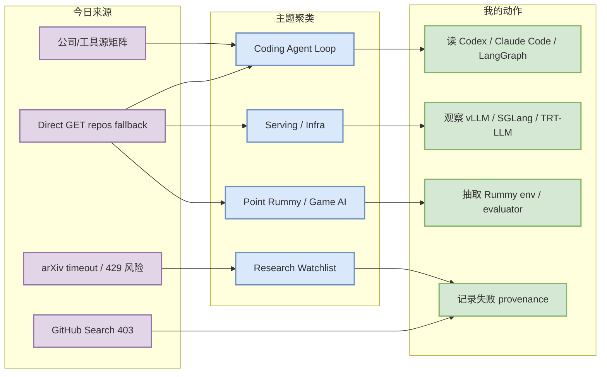
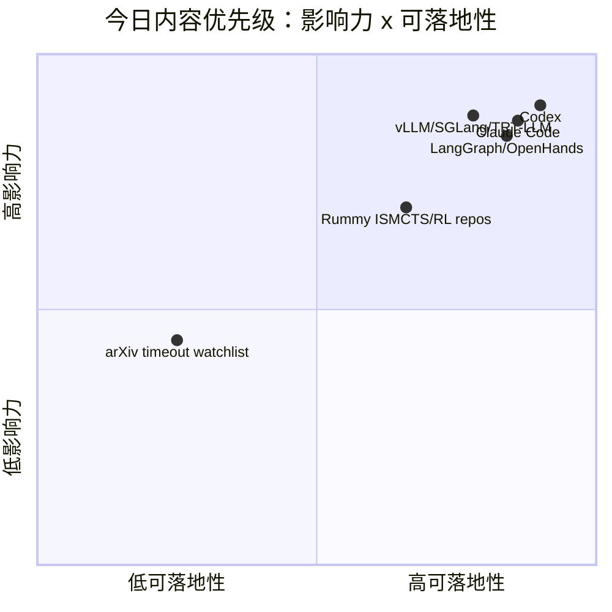

# AI Radar Daily - 2026-07-15

> 生成时间：2026-07-15 09:00 北京时间
> 范围：AI Infra / LLM / RL / Game AI / 大厂博客 / 论文 / GitHub / 行业资讯
> 说明：日报是总览导航页；GitHub Search 今日从首个查询开始 403，已保存原始失败 snapshot，并用 direct `GET /repos` watched fallback 补齐固定表。

## 0. 今日结论

- 今日最值得关注：OpenAI Codex stars_delta=362，Claude Code stars_delta=152；终端 coding agent / loop engineering 仍是工程热线。
- 对 AI Infra 的直接影响：vLLM stars_delta=106，SGLang stars_delta=48，TensorRT-LLM 持续活跃；serving 三件套仍应作为吞吐、KV cache、GPU runtime 的每日观察源。
- 对 LLM 训练 / 推理 / Agent 的影响：LangGraph、OpenHands、MCP servers、Gemini CLI 继续提供 agent state machine、tool protocol、workspace harness 的工程信号。
- 对 RL / 游戏模型训练的影响：Point Rummy 今日依旧使用 direct fallback；nakkekakke/rummy-ai、drewmcgee/gin-rummy-rl-lab、RummyVision 可用于规则环境、ISMCTS/RL、视觉辅助拆解。
- 风险提示：GitHub Search 403、论文源低置信；所有 broad/growth 榜单均标注 direct watched repo fallback / 非完整全网日增。

## 1. 今日态势图

## 2. 必读卡片区

> [!important] OpenAI Codex：终端 coding agent 继续强增长
> - 大类：GitHub / Coding 工具
> - 小类：Coding Agent / CLI
> - 重点：direct fallback 显示 stars_delta=362；非完整全网日增，但相对昨日 watched baseline 很强。
> - 为什么重要：Codex 代表 CLI/TUI、权限模式、远程执行、上下文窗口和代码库内 agent loop 的工程方向。
> - 详情：[[GitHub/Tools/2026-07-15/openai-codex]] / [网页详情](https://github.com/dyt27666-oss/AI-news-report-obsidians/blob/main/GitHub/Tools/2026-07-15/openai-codex.md) / [原文](https://github.com/openai/codex)

> [!tip] Claude Code / LangGraph：agent loop 工程化继续升温
> - 大类：GitHub / Loop Engineer
> - 小类：Agent state machine / coding harness
> - 重点：Claude Code stars_delta=152，LangGraph stars_delta=100；分别对应终端 agent 和生产 agent 状态机。
> - 为什么重要：对 AGENTS.md、eval loop、tool recovery、多 agent orchestration 的设计有直接参考价值。
> - 详情：[[GitHub/LoopEngineer/2026-07-15/langchain-ai__langgraph]] / [网页详情](https://github.com/dyt27666-oss/AI-news-report-obsidians/blob/main/GitHub/LoopEngineer/2026-07-15/langchain-ai__langgraph.md) / [原文](https://github.com/langchain-ai/langgraph)

> [!note] Serving 三件套仍是 AI Infra 主线
> - 大类：GitHub / AI Infra
> - 小类：LLM serving / runtime
> - 重点：vLLM、SGLang、TensorRT-LLM 均在 direct fallback 中活跃。
> - 为什么重要：直接影响 batching、KV cache、scheduler、GPU runtime 和生产 serving 成本。
> - 详情：[[Industry/2026-07-15/serving-watchlist]] / [网页详情](https://github.com/dyt27666-oss/AI-news-report-obsidians/blob/main/Industry/2026-07-15/serving-watchlist.md) / [原文](https://github.com/vllm-project/vllm)

> [!warning] Point Rummy：无新增高置信论文，但 repo 候选可用
> - 大类：GitHub / 业务主题
> - 小类：Rummy AI / ISMCTS / RL
> - 重点：rummy-ai、gin-rummy-rl-lab、RummyVision 适合拆状态机、rollout 和视觉辅助。
> - 为什么重要：业务上比低置信论文更可落地，可先定义 observation/action/reward/evaluator。
> - 详情：[[GitHub/PointRummy/2026-07-15/nakkekakke__rummy-ai]] / [网页详情](https://github.com/dyt27666-oss/AI-news-report-obsidians/blob/main/GitHub/PointRummy/2026-07-15/nakkekakke__rummy-ai.md) / [原文](https://github.com/nakkekakke/rummy-ai)

## 3. 优先级矩阵

## 4. 分类清单

| 标签 | 大类 | 小类 | 标题 | 重点概括 | 为什么重要 | Obsidian 详情 | 网页详情 | 原文 |
|---|---|---|---|---|---|---|---|---|
| 必读 | GitHub | Coding Agent | OpenAI Codex | Direct watched repo stars_delta=362，不是完整全网增长 | Codex 与 CLI 权限、远程执行、上下文策略直接相关 | [[GitHub/Tools/2026-07-15/openai-codex]] | [网页详情](https://github.com/dyt27666-oss/AI-news-report-obsidians/blob/main/GitHub/Tools/2026-07-15/openai-codex.md) | [原文](https://github.com/openai/codex) |
| 必读 | GitHub | Coding Agent | Claude Code | Direct watched repo stars_delta=152，生态热度继续 | 影响多 agent 编码、代码审查、TUI/CLI agent loop | [[GitHub/Tools/2026-07-15/claude-code]] | [网页详情](https://github.com/dyt27666-oss/AI-news-report-obsidians/blob/main/GitHub/Tools/2026-07-15/claude-code.md) | [原文](https://github.com/anthropics/claude-code) |
| 必读 | GitHub | Agent Loop | LangGraph / OpenHands | LangGraph stars_delta=100，OpenHands stars_delta=117 | 生产 agent state machine 与 coding workspace 是 loop engineering 关键参考 | [[GitHub/LoopEngineer/2026-07-15/langchain-ai__langgraph]] | [网页详情](https://github.com/dyt27666-oss/AI-news-report-obsidians/blob/main/GitHub/LoopEngineer/2026-07-15/langchain-ai__langgraph.md) | [原文](https://github.com/langchain-ai/langgraph) |
| 可 skim | GitHub | Serving | vLLM / SGLang / TensorRT-LLM | GitHub Search 限流后使用 watched repo 回退 | 对 LLM serving 选型仍是当天最高可信工程信号 | [[Industry/2026-07-15/serving-watchlist]] | [网页详情](https://github.com/dyt27666-oss/AI-news-report-obsidians/blob/main/Industry/2026-07-15/serving-watchlist.md) | [原文](https://github.com/vllm-project/vllm) |
| 后续 | GitHub | Point Rummy | rummy-ai / gin-rummy-rl-lab | 小型 repo 但主题强相关，适合规则/ISMCTS/RL 环境借鉴 | 对 Point Rummy 业务的规则引擎、bot 策略和 evaluator 有用 | [[GitHub/PointRummy/2026-07-15/nakkekakke__rummy-ai]] | [网页详情](https://github.com/dyt27666-oss/AI-news-report-obsidians/blob/main/GitHub/PointRummy/2026-07-15/nakkekakke__rummy-ai.md) | [原文](https://github.com/nakkekakke/rummy-ai) |

## 5. 大厂资讯 / 工程博客 / Research

### 5.1 公司来源扫描矩阵

| 公司/实验室 | 来源/栏目 | 今日状态 | 高相关条数 | 代表条目 | 备注 |
|---|---|---|---:|---|---|
| OpenAI | News / Research / Developer | 间接扫描/有 repo 信号 | 1 | Codex direct fallback delta 仍强；官网新闻未确认新增高相关工程项 | 以 GitHub/开发者工具为代理信号 |
| Anthropic | News / Research / Engineering | 间接扫描/有 repo 信号 | 1 | Claude Code direct fallback delta 仍强 | 未确认官网新增研究；保留 Claude Code 工具信号 |
| Google DeepMind | Blog / Research | 低置信 | 0 | 无高相关新项 | 本轮未获得可验证新 research/blog 元数据 |
| Meta AI | Blog / Research | 低置信 | 0 | 无高相关新项 | 本轮未获得可验证 AI Infra/RL/Agent 新项 |
| NVIDIA | Technical Blog / AI | 间接扫描/有 repo 信号 | 2 | TensorRT-LLM / NeMo / Triton watched repos | 官网博客未确认新文；repo 是 serving/training 信号 |
| Microsoft | Research AI / GitHub | 间接扫描/有 repo 信号 | 2 | AutoGen / Semantic Kernel | 作为 agent framework 观察 |
| Hugging Face | Blog / Papers / Releases | 间接扫描/有 repo 信号 | 2 | Transformers / Accelerate | 以模型生态 repo 代理 |
| 腾讯 | AI Lab / 技术博客 | 低置信 | 0 | 无高相关新项 | 未发现可验证 AI Infra/RL/Agent 新项 |
| 字节 | Seed / 技术博客 | 低置信 | 0 | 无高相关新项 | 未发现可验证 AI Infra/RL/Agent 新项 |
| SpaceAI | Blog / News | 访问失败/低置信 | 0 | 无高相关新项 | 来源有效性低；未获得可验证新项 |

### 5.2 高相关大厂条目

| 标签 | 发布方/大厂 | 栏目/来源 | 标题 | 重点概括 | 工程/算法影响 | Obsidian 详情 | 网页详情 | 原文 |
|---|---|---|---|---|---|---|---|---|
| 可 skim | OpenAI | GitHub / Developer Tool | OpenAI Codex watched repo growth | Codex direct fallback 仍是今日最强 coding-agent 增长信号之一。 | 影响 CLI/TUI coding agent 权限、远程执行、上下文策略和 repo 内自动化 loop。 | [[GitHub/Tools/2026-07-15/openai-codex]] | [网页详情](https://github.com/dyt27666-oss/AI-news-report-obsidians/blob/main/GitHub/Tools/2026-07-15/openai-codex.md) | [原文](https://github.com/openai/codex) |
| 可 skim | Anthropic | GitHub / Developer Tool | Claude Code watched repo growth | Claude Code direct fallback 延续增长，说明终端 agentic coding 仍是核心工具线。 | 影响 tmux 多 agent、代码审查、工具权限和 agent loop 监控。 | [[GitHub/Tools/2026-07-15/claude-code]] | [网页详情](https://github.com/dyt27666-oss/AI-news-report-obsidians/blob/main/GitHub/Tools/2026-07-15/claude-code.md) | [原文](https://github.com/anthropics/claude-code) |
| 可 skim | NVIDIA / vLLM / SGLang | GitHub / AI Infra | Serving watched repos: vLLM / SGLang / TensorRT-LLM | GitHub Search 403 后，用 direct repo fallback 观察 serving 三件套。 | 直接映射到 inference runtime、KV cache、batching、GPU kernel 与生产 serving 成本。 | [[Industry/2026-07-15/serving-watchlist]] | [网页详情](https://github.com/dyt27666-oss/AI-news-report-obsidians/blob/main/Industry/2026-07-15/serving-watchlist.md) | [原文](https://github.com/vllm-project/vllm) |

## 6. GitHub 高 star Top 10

> 说明：GitHub Search 今日全量 403；本表使用 direct watched repo fallback，不是完整全网 Top 10。

| 排名 | repo | stars | forks | language | updated_at | topics | 重点概括 | 是否值得试用 | Obsidian 详情 | 原文 |
|---:|---|---:|---:|---|---|---|---|---|---|---|
| 1 | `huggingface/transformers` | 162609 | 33881 | Python | 2026-07-15T01:18:23Z | audio, deep-learning, deepseek, gemma, glm, hacktoberfest, llm, machine-learning, model-hub, natural | 模型定义与推理/训练生态底座，仍是新模型接入、tokenizer、eval pipeline 和 serving 兼容性的首要观察源。 | 值得 skim/按需试用 | [[GitHub/AIInfra/2026-07-15/huggingface__transformers]] | [GitHub](https://github.com/huggingface/transformers) |
| 2 | `anthropics/claude-code` | 137885 | 22232 | Python | 2026-07-15T01:34:47Z | 无 | Anthropic 终端 agentic coding 工具；高 star 与持续更新说明 CLI agent workflow 仍在扩张。 | 值得 skim/按需试用 | [[GitHub/AIInfra/2026-07-15/anthropics__claude-code]] | [GitHub](https://github.com/anthropics/claude-code) |
| 3 | `google-gemini/gemini-cli` | 105987 | 14256 | TypeScript | 2026-07-15T00:20:27Z | ai, ai-agents, cli, gemini, gemini-api, mcp-client, mcp-server | Gemini 终端 agent，topics 覆盖 MCP client/server，适合观察开放 agent 工具链。 | 值得 skim/按需试用 | [[GitHub/AIInfra/2026-07-15/google-gemini__gemini-cli]] | [GitHub](https://github.com/google-gemini/gemini-cli) |
| 4 | `pytorch/pytorch` | 101813 | 28492 | Python | 2026-07-15T01:35:45Z | autograd, deep-learning, gpu, machine-learning, neural-network, numpy, python, tensor | 训练/推理框架底层，GPU/runtime/compile 变化会直接影响大模型工程。 | 值得 skim/按需试用 | [[GitHub/AIInfra/2026-07-15/pytorch__pytorch]] | [GitHub](https://github.com/pytorch/pytorch) |
| 5 | `openai/codex` | 98073 | 14625 | Rust | 2026-07-15T01:33:30Z | 无 | OpenAI Rust 终端 coding agent，与权限、远程执行、上下文策略和代码库内 loop 强相关。 | 值得 skim/按需试用 | [[GitHub/AIInfra/2026-07-15/openai__codex]] | [GitHub](https://github.com/openai/codex) |
| 6 | `modelcontextprotocol/servers` | 88480 | 11218 | TypeScript | 2026-07-15T01:21:33Z | 无 | MCP server 生态入口，影响 coding agent 的工具接入标准化和权限边界。 | 值得 skim/按需试用 | [[GitHub/AIInfra/2026-07-15/modelcontextprotocol__servers]] | [GitHub](https://github.com/modelcontextprotocol/servers) |
| 7 | `vllm-project/vllm` | 86269 | 19415 | Python | 2026-07-15T01:33:25Z | amd, blackwell, cuda, deepseek, deepseek-v3, gpt, gpt-oss, inference, kimi, llama, llm, llm-serving, | LLM serving 高吞吐引擎，关注 batching、KV cache、并发调度与硬件适配。 | 值得 skim/按需试用 | [[GitHub/AIInfra/2026-07-15/vllm-project__vllm]] | [GitHub](https://github.com/vllm-project/vllm) |
| 8 | `OpenHands/OpenHands` | 80793 | 10310 | Python | 2026-07-15T01:29:52Z | agent, artificial-intelligence, chatgpt, claude-ai, cli, developer-tools, gpt, llm, openai | 开源 AI coding agent workspace，可作为 loop engineer/harness 与 sandbox 参考。 | 值得 skim/按需试用 | [[GitHub/AIInfra/2026-07-15/OpenHands__OpenHands]] | [GitHub](https://github.com/OpenHands/OpenHands) |
| 9 | `cline/cline` | 64665 | 6914 | TypeScript | 2026-07-15T01:29:12Z | 无 | IDE/CLI 自主 coding agent，适合观察 agent SDK、extension 与 MCP 工作流。 | 值得 skim/按需试用 | [[GitHub/AIInfra/2026-07-15/cline__cline]] | [GitHub](https://github.com/cline/cline) |
| 10 | `microsoft/autogen` | 59735 | 8991 | Python | 2026-07-15T01:02:08Z | agentic, agentic-agi, agents, ai, autogen, autogen-ecosystem, chatgpt, framework, llm-agent, llm-fra | 多 agent 编程框架，适合作为 agent orchestration 和 eval loop 参考。 | 值得 skim/按需试用 | [[GitHub/AIInfra/2026-07-15/microsoft__autogen]] | [GitHub](https://github.com/microsoft/autogen) |

## 7. GitHub star 增长最快 Top 10

> 说明：使用 2026-07-14 snapshot baseline 计算 watched repo stars_delta；这是“非完整全网日增”，不是冷启动代理。

| 排名 | repo | stars_delta | stars | forks | language | updated_at | 增长依据 | 重点概括 | Obsidian 详情 | 原文 |
|---:|---|---:|---:|---:|---|---|---|---|---|---|
| 1 | `openai/codex` | 362 | 98073 | 14625 | Rust | 2026-07-15T01:33:30Z | direct GET /repos fallback vs 2026-07-14 snapshot; 非完整全网日增 | OpenAI Rust 终端 coding agent，与权限、远程执行、上下文策略和代码库内 loop 强相关。 | [[GitHub/AIInfra/2026-07-15/openai__codex]] | [GitHub](https://github.com/openai/codex) |
| 2 | `anthropics/claude-code` | 152 | 137885 | 22232 | Python | 2026-07-15T01:34:47Z | direct GET /repos fallback vs 2026-07-14 snapshot; 非完整全网日增 | Anthropic 终端 agentic coding 工具；高 star 与持续更新说明 CLI agent workflow 仍在扩张。 | [[GitHub/AIInfra/2026-07-15/anthropics__claude-code]] | [GitHub](https://github.com/anthropics/claude-code) |
| 3 | `OpenHands/OpenHands` | 117 | 80793 | 10310 | Python | 2026-07-15T01:29:52Z | direct GET /repos fallback vs 2026-07-14 snapshot; 非完整全网日增 | 开源 AI coding agent workspace，可作为 loop engineer/harness 与 sandbox 参考。 | [[GitHub/AIInfra/2026-07-15/OpenHands__OpenHands]] | [GitHub](https://github.com/OpenHands/OpenHands) |
| 4 | `vllm-project/vllm` | 106 | 86269 | 19415 | Python | 2026-07-15T01:33:25Z | direct GET /repos fallback vs 2026-07-14 snapshot; 非完整全网日增 | LLM serving 高吞吐引擎，关注 batching、KV cache、并发调度与硬件适配。 | [[GitHub/AIInfra/2026-07-15/vllm-project__vllm]] | [GitHub](https://github.com/vllm-project/vllm) |
| 5 | `langchain-ai/langgraph` | 100 | 37307 | 6249 | Python | 2026-07-15T01:34:08Z | direct GET /repos fallback vs 2026-07-14 snapshot; 非完整全网日增 | 构建 resilient agents 的图式编排框架，适合生产 agent state machine、checkpoint 与 tool recovery。 | [[GitHub/AIInfra/2026-07-15/langchain-ai__langgraph]] | [GitHub](https://github.com/langchain-ai/langgraph) |
| 6 | `modelcontextprotocol/servers` | 60 | 88480 | 11218 | TypeScript | 2026-07-15T01:21:33Z | direct GET /repos fallback vs 2026-07-14 snapshot; 非完整全网日增 | MCP server 生态入口，影响 coding agent 的工具接入标准化和权限边界。 | [[GitHub/AIInfra/2026-07-15/modelcontextprotocol__servers]] | [GitHub](https://github.com/modelcontextprotocol/servers) |
| 7 | `sgl-project/sglang` | 48 | 30311 | 7154 | Python | 2026-07-15T01:19:20Z | direct GET /repos fallback vs 2026-07-14 snapshot; 非完整全网日增 | 高性能 LLM/VLM serving 框架，关注 attention、CUDA、MoE、RL serving 和 scheduler。 | [[GitHub/AIInfra/2026-07-15/sgl-project__sglang]] | [GitHub](https://github.com/sgl-project/sglang) |
| 8 | `cline/cline` | 40 | 64665 | 6914 | TypeScript | 2026-07-15T01:29:12Z | direct GET /repos fallback vs 2026-07-14 snapshot; 非完整全网日增 | IDE/CLI 自主 coding agent，适合观察 agent SDK、extension 与 MCP 工作流。 | [[GitHub/AIInfra/2026-07-15/cline__cline]] | [GitHub](https://github.com/cline/cline) |
| 9 | `huggingface/transformers` | 36 | 162609 | 33881 | Python | 2026-07-15T01:18:23Z | direct GET /repos fallback vs 2026-07-14 snapshot; 非完整全网日增 | 模型定义与推理/训练生态底座，仍是新模型接入、tokenizer、eval pipeline 和 serving 兼容性的首要观察源。 | [[GitHub/AIInfra/2026-07-15/huggingface__transformers]] | [GitHub](https://github.com/huggingface/transformers) |
| 10 | `pytorch/pytorch` | 22 | 101813 | 28492 | Python | 2026-07-15T01:35:45Z | direct GET /repos fallback vs 2026-07-14 snapshot; 非完整全网日增 | 训练/推理框架底层，GPU/runtime/compile 变化会直接影响大模型工程。 | [[GitHub/AIInfra/2026-07-15/pytorch__pytorch]] | [GitHub](https://github.com/pytorch/pytorch) |

## 8. Coding 工具 / AI 工具功能更新

### 8.1 Coding 工具扫描矩阵

| 工具 | 厂商 | 来源类型 | 今日状态 | 代表更新 | 对我的影响 | 原文 |
|---|---|---|---|---|---|---|
| Claude Code | Anthropic | GitHub Releases / Changelog / Docs | 间接扫描/有 repo 信号 | watched repo stars_delta=152；direct fallback，非完整全网日增 | 影响 CLI/TUI、agent loop、MCP 或 IDE coding workflow，建议持续观察。 | [原文](https://github.com/anthropics/claude-code) |
| OpenAI Codex | OpenAI | GitHub Releases / Changelog / Docs | 间接扫描/有 repo 信号 | watched repo stars_delta=362；direct fallback，非完整全网日增 | 影响 CLI/TUI、agent loop、MCP 或 IDE coding workflow，建议持续观察。 | [原文](https://github.com/openai/codex) |
| Cursor | Cursor | GitHub Releases / Changelog / Docs | 低置信/无高相关新项 | 无高相关新项或官网未确认新增 release | 暂不调整工作流；保留扫描矩阵避免漏扫。 | [原文](https://cursor.com/changelog) |
| Windsurf | Windsurf | GitHub Releases / Changelog / Docs | 低置信/无高相关新项 | 无高相关新项或官网未确认新增 release | 暂不调整工作流；保留扫描矩阵避免漏扫。 | [原文](https://windsurf.com/changelog) |
| GitHub Copilot | GitHub | GitHub Releases / Changelog / Docs | 低置信/无高相关新项 | 无高相关新项或官网未确认新增 release | 暂不调整工作流；保留扫描矩阵避免漏扫。 | [原文](https://github.blog/changelog/label/copilot/) |
| Gemini Code Assist | Google | GitHub Releases / Changelog / Docs | 间接扫描/有 repo 信号 | watched repo stars_delta=17；direct fallback，非完整全网日增 | 影响 CLI/TUI、agent loop、MCP 或 IDE coding workflow，建议持续观察。 | [原文](https://github.com/google-gemini/gemini-cli) |
| Qwen Code | Alibaba/Qwen | GitHub Releases / Changelog / Docs | 间接扫描/有 repo 信号 | watched repo stars_delta=18；direct fallback，非完整全网日增 | 影响 CLI/TUI、agent loop、MCP 或 IDE coding workflow，建议持续观察。 | [原文](https://github.com/QwenLM/qwen-code) |
| Roo Code | Roo Code | GitHub Releases / Changelog / Docs | 间接扫描/有 repo 信号 | watched repo stars_delta=8；direct fallback，非完整全网日增 | 影响 CLI/TUI、agent loop、MCP 或 IDE coding workflow，建议持续观察。 | [原文](https://github.com/RooCodeInc/Roo-Code) |
| Cline | Cline | GitHub Releases / Changelog / Docs | 间接扫描/有 repo 信号 | watched repo stars_delta=40；direct fallback，非完整全网日增 | 影响 CLI/TUI、agent loop、MCP 或 IDE coding workflow，建议持续观察。 | [原文](https://github.com/cline/cline) |
| Continue | Continue | GitHub Releases / Changelog / Docs | 间接扫描/有 repo 信号 | watched repo stars_delta=18；direct fallback，非完整全网日增 | 影响 CLI/TUI、agent loop、MCP 或 IDE coding workflow，建议持续观察。 | [原文](https://github.com/continuedev/continue) |

### 8.2 高相关工具更新

| 标签 | 工具/厂商 | 来源类型 | 标题/功能 | 重点概括 | 对 AI coding 工作流的影响 | Obsidian 详情 | 网页详情 | 原文 |
|---|---|---|---|---|---|---|---|---|
| 必读 | OpenAI Codex | GitHub / Docs | Codex watched repo 增长 | stars_delta=362，direct fallback；终端 coding agent 继续强势 | 适合跟踪权限模式、远程执行和上下文窗口策略 | [[GitHub/Tools/2026-07-15/openai-codex]] | [网页详情](https://github.com/dyt27666-oss/AI-news-report-obsidians/blob/main/GitHub/Tools/2026-07-15/openai-codex.md) | [原文](https://github.com/openai/codex) |
| 必读 | Claude Code | GitHub / Docs | Claude Code watched repo 增长 | stars_delta=152，验证 CLI agent workflow 热度 | 适合多 agent 监控、代码审查与工具权限设计 | [[GitHub/Tools/2026-07-15/claude-code]] | [网页详情](https://github.com/dyt27666-oss/AI-news-report-obsidians/blob/main/GitHub/Tools/2026-07-15/claude-code.md) | [原文](https://github.com/anthropics/claude-code) |
| 可 skim | Gemini CLI / Code Assist | GitHub / Release Notes proxy | Gemini CLI active | topics 覆盖 MCP client/server；stars_delta=17 | 可观察开放 MCP 工具链和 Google coding agent 方向 | [[GitHub/LoopEngineer/2026-07-15/google-gemini__gemini-cli]] | [网页详情](https://github.com/dyt27666-oss/AI-news-report-obsidians/blob/main/GitHub/LoopEngineer/2026-07-15/google-gemini__gemini-cli.md) | [原文](https://github.com/google-gemini/gemini-cli) |

## 9. Point Rummy / Indian Rummy 业务主题

### 9.1 GitHub 候选

| 排名 | repo | stars | forks | language | updated_at | topics | 重点概括 | 业务可用性 | Obsidian 详情 | 原文 |
|---:|---|---:|---:|---|---|---|---|---|---|---|
| 1 | `rickgorman/gin-rummy-ai` | 13 | 5 | Python | 2025-03-25T13:47:09Z | 无 | A hand-rolled neuroevolution AI for gin rummy. | 值得 skim/按需试用 | [[GitHub/PointRummy/2026-07-15/rickgorman__gin-rummy-ai]] | [GitHub](https://github.com/rickgorman/gin-rummy-ai) |
| 2 | `nakkekakke/rummy-ai` | 11 | 5 | Java | 2026-04-17T10:02:59Z | ai, card, card-game, game, ismcts, mcts, monte-carlo-tree-search, rummy | Text based classic Rummy game with an AI that uses ISMCTS. Data Structures and Algorithms course project, Univ | 值得 skim/按需试用 | [[GitHub/PointRummy/2026-07-15/nakkekakke__rummy-ai]] | [GitHub](https://github.com/nakkekakke/rummy-ai) |
| 3 | `jmhummel/Gin-Rummy-Java` | 8 | 0 | Java | 2023-08-16T16:12:58Z | ai, artificial-intelligence, card-game, card-games, cardgame, gin, gin-rummy, java, java-8, java8, r | Java-based Gin Rummy console game, with an AI opponent | 值得 skim/按需试用 | [[GitHub/PointRummy/2026-07-15/jmhummel__Gin-Rummy-Java]] | [GitHub](https://github.com/jmhummel/Gin-Rummy-Java) |
| 4 | `mudont/indian-rummy` | 5 | 0 | TypeScript | 2025-08-08T21:05:04Z | 无 | Typescript library for Indian Rummy card game | 值得 skim/按需试用 | [[GitHub/PointRummy/2026-07-15/mudont__indian-rummy]] | [GitHub](https://github.com/mudont/indian-rummy) |
| 5 | `abubakarmunir712/dsa-final-project` | 2 | 1 | Python | 2026-06-27T06:34:26Z | 无 | A Python-based multiplayer Indian Rummy game with support for AI opponents and LAN play. Implements data struc | 值得 skim/按需试用 | [[GitHub/PointRummy/2026-07-15/abubakarmunir712__dsa-final-project]] | [GitHub](https://github.com/abubakarmunir712/dsa-final-project) |
| 6 | `Abhilash-Mandlekar/RummyAgent-Reinforecement-Learning` | 2 | 0 | Jupyter Notebook | 2023-04-01T05:48:51Z | 无 | Rummy Game Agent trained using Reinforcement Learning algorithm. | 值得 skim/按需试用 | [[GitHub/PointRummy/2026-07-15/Abhilash-Mandlekar__RummyAgent-Reinforecement-Learning]] | [GitHub](https://github.com/Abhilash-Mandlekar/RummyAgent-Reinforecement-Learning) |
| 7 | `Alan-seb/RummyVision` | 1 | 0 | Python | 2025-12-03T03:14:55Z | 无 | RummyVision is an intelligent card game assistant that combines computer vision with Monte Carlo simulation to | 值得 skim/按需试用 | [[GitHub/PointRummy/2026-07-15/Alan-seb__RummyVision]] | [GitHub](https://github.com/Alan-seb/RummyVision) |
| 8 | `debabrata-mandal/RummyPulse` | 1 | 0 | Java | 2026-07-14T08:10:30Z | android | RummyPulse - Smart Rummy Game Analytics & Management Android App with Firebase integration, Google Sign-In aut | 值得 skim/按需试用 | [[GitHub/PointRummy/2026-07-15/debabrata-mandal__RummyPulse]] | [GitHub](https://github.com/debabrata-mandal/RummyPulse) |
| 9 | `drewmcgee/gin-rummy-rl-lab` | 0 | 0 | Python | 2026-04-30T00:13:25Z | 无 | Gin Rummy reinforcement learning lab with a Java game server, Python agents, and C++ rollout infrastructure. | 值得 skim/按需试用 | [[GitHub/PointRummy/2026-07-15/drewmcgee__gin-rummy-rl-lab]] | [GitHub](https://github.com/drewmcgee/gin-rummy-rl-lab) |
| 10 | `aidanw33/cards-ai-bot` | 0 | 0 | Python | 2026-05-13T01:09:05Z | 无 | AI bot to play a specific version of gin rummy | 值得 skim/按需试用 | [[GitHub/PointRummy/2026-07-15/aidanw33__cards-ai-bot]] | [GitHub](https://github.com/aidanw33/cards-ai-bot) |

### 9.2 论文 / 资料候选

| 标签 | 来源 | 标题 | 作者/机构 | 重点概括 | 对 Point Rummy 业务有什么用 | Obsidian 详情 | 原文 |
|---|---|---|---|---|---|---|---|
| 低置信 | arXiv / Semantic Scholar / 预印本索引扫描 | Rummy imperfect-information game 论文源扫描 | 多来源；本轮 API 429/timeout，未确认新增论文 | 未确认新增论文；以 GitHub 上 ISMCTS、RL lab、rule engine 候选作为今天可行动线索。 | 业务上先拆规则环境、仿真与 evaluator，比追逐低置信论文更可落地。 | [[Papers/Watchlist/2026-07-15/rummy-imperfect-information-game]] | [原文](https://export.arxiv.org/api/query?search_query=all:rummy+imperfect+information+game+AI) |

### 9.3 业务可用性判断

| 方向 | 今日信号 | 可用性 | 下一步 |
|---|---|---|---|
| 规则引擎 / 计分 | mudont/indian-rummy、RummyPulse | 中：可抽规则对象、计分、房间模型 | 提取 13-card Indian Rummy 状态机和积分规则 |
| Bot / RL Agent | rummy-ai、gin-rummy-rl-lab、RummyAgent | 中低：repo 小但主题强相关 | 复现 ISMCTS / RL 环境接口，不直接用生产代码 |
| 仿真 / 评测 | gin-rummy-rl-lab、cards-ai-bot | 中：适合搭 evaluator 和 rollout harness | 定义 observation/action/reward，接入并行 self-play |
| 视觉辅助 | RummyVision | 低到中：概念可借鉴 | 只抽 card recognition + discard suggestion 交互思路 |

## 10. Loop Engineer / Loop Engineering 主题

### 10.1 Loop Engineer GitHub 高 star Top 10

| 排名 | repo | stars | forks | language | updated_at | topics | 重点概括 | 是否值得试用 | Obsidian 详情 | 原文 |
|---:|---|---:|---:|---|---|---|---|---|---|---|
| 1 | `anthropics/claude-code` | 137885 | 22232 | Python | 2026-07-15T01:34:47Z | 无 | Anthropic 终端 agentic coding 工具；高 star 与持续更新说明 CLI agent workflow 仍在扩张。 | 值得 skim/按需试用 | [[GitHub/LoopEngineer/2026-07-15/anthropics__claude-code]] | [GitHub](https://github.com/anthropics/claude-code) |
| 2 | `google-gemini/gemini-cli` | 105987 | 14256 | TypeScript | 2026-07-15T00:20:27Z | ai, ai-agents, cli, gemini, gemini-api, mcp-client, mcp-server | Gemini 终端 agent，topics 覆盖 MCP client/server，适合观察开放 agent 工具链。 | 值得 skim/按需试用 | [[GitHub/LoopEngineer/2026-07-15/google-gemini__gemini-cli]] | [GitHub](https://github.com/google-gemini/gemini-cli) |
| 3 | `openai/codex` | 98073 | 14625 | Rust | 2026-07-15T01:33:30Z | 无 | OpenAI Rust 终端 coding agent，与权限、远程执行、上下文策略和代码库内 loop 强相关。 | 值得 skim/按需试用 | [[GitHub/LoopEngineer/2026-07-15/openai__codex]] | [GitHub](https://github.com/openai/codex) |
| 4 | `modelcontextprotocol/servers` | 88480 | 11218 | TypeScript | 2026-07-15T01:21:33Z | 无 | MCP server 生态入口，影响 coding agent 的工具接入标准化和权限边界。 | 值得 skim/按需试用 | [[GitHub/LoopEngineer/2026-07-15/modelcontextprotocol__servers]] | [GitHub](https://github.com/modelcontextprotocol/servers) |
| 5 | `OpenHands/OpenHands` | 80793 | 10310 | Python | 2026-07-15T01:29:52Z | agent, artificial-intelligence, chatgpt, claude-ai, cli, developer-tools, gpt, llm, openai | 开源 AI coding agent workspace，可作为 loop engineer/harness 与 sandbox 参考。 | 值得 skim/按需试用 | [[GitHub/LoopEngineer/2026-07-15/OpenHands__OpenHands]] | [GitHub](https://github.com/OpenHands/OpenHands) |
| 6 | `cline/cline` | 64665 | 6914 | TypeScript | 2026-07-15T01:29:12Z | 无 | IDE/CLI 自主 coding agent，适合观察 agent SDK、extension 与 MCP 工作流。 | 值得 skim/按需试用 | [[GitHub/LoopEngineer/2026-07-15/cline__cline]] | [GitHub](https://github.com/cline/cline) |
| 7 | `microsoft/autogen` | 59735 | 8991 | Python | 2026-07-15T01:02:08Z | agentic, agentic-agi, agents, ai, autogen, autogen-ecosystem, chatgpt, framework, llm-agent, llm-fra | 多 agent 编程框架，适合作为 agent orchestration 和 eval loop 参考。 | 值得 skim/按需试用 | [[GitHub/LoopEngineer/2026-07-15/microsoft__autogen]] | [GitHub](https://github.com/microsoft/autogen) |
| 8 | `langchain-ai/langgraph` | 37307 | 6249 | Python | 2026-07-15T01:34:08Z | agents, ai, ai-agents, chatgpt, deepagents, enterprise, framework, gemini, generative-ai, langchain, | 构建 resilient agents 的图式编排框架，适合生产 agent state machine、checkpoint 与 tool recovery。 | 值得 skim/按需试用 | [[GitHub/LoopEngineer/2026-07-15/langchain-ai__langgraph]] | [GitHub](https://github.com/langchain-ai/langgraph) |
| 9 | `continuedev/continue` | 34876 | 5044 | TypeScript | 2026-07-15T01:17:55Z | agent, ai, cli, developer-tools, open-source | 开源 coding agent，适合观察 IDE/CLI 结合、模型路由和私有代码库工作流。 | 值得 skim/按需试用 | [[GitHub/LoopEngineer/2026-07-15/continuedev__continue]] | [GitHub](https://github.com/continuedev/continue) |
| 10 | `microsoft/semantic-kernel` | 28314 | 4680 | C# | 2026-07-15T00:45:18Z | ai, artificial-intelligence, llm, openai, sdk | LLM app/agent SDK，适合企业 agent 编排和插件化。 | 值得 skim/按需试用 | [[GitHub/LoopEngineer/2026-07-15/microsoft__semantic-kernel]] | [GitHub](https://github.com/microsoft/semantic-kernel) |

### 10.2 Loop Engineer GitHub star 增长最快 Top 10

| 排名 | repo | stars_delta | stars | forks | language | updated_at | 增长依据 | 重点概括 | Obsidian 详情 | 原文 |
|---:|---|---:|---:|---:|---|---|---|---|---|---|
| 1 | `openai/codex` | 362 | 98073 | 14625 | Rust | 2026-07-15T01:33:30Z | direct GET /repos fallback vs 2026-07-14 snapshot; 非完整全网日增 | OpenAI Rust 终端 coding agent，与权限、远程执行、上下文策略和代码库内 loop 强相关。 | [[GitHub/LoopEngineer/2026-07-15/openai__codex]] | [GitHub](https://github.com/openai/codex) |
| 2 | `anthropics/claude-code` | 152 | 137885 | 22232 | Python | 2026-07-15T01:34:47Z | direct GET /repos fallback vs 2026-07-14 snapshot; 非完整全网日增 | Anthropic 终端 agentic coding 工具；高 star 与持续更新说明 CLI agent workflow 仍在扩张。 | [[GitHub/LoopEngineer/2026-07-15/anthropics__claude-code]] | [GitHub](https://github.com/anthropics/claude-code) |
| 3 | `OpenHands/OpenHands` | 117 | 80793 | 10310 | Python | 2026-07-15T01:29:52Z | direct GET /repos fallback vs 2026-07-14 snapshot; 非完整全网日增 | 开源 AI coding agent workspace，可作为 loop engineer/harness 与 sandbox 参考。 | [[GitHub/LoopEngineer/2026-07-15/OpenHands__OpenHands]] | [GitHub](https://github.com/OpenHands/OpenHands) |
| 4 | `langchain-ai/langgraph` | 100 | 37307 | 6249 | Python | 2026-07-15T01:34:08Z | direct GET /repos fallback vs 2026-07-14 snapshot; 非完整全网日增 | 构建 resilient agents 的图式编排框架，适合生产 agent state machine、checkpoint 与 tool recovery。 | [[GitHub/LoopEngineer/2026-07-15/langchain-ai__langgraph]] | [GitHub](https://github.com/langchain-ai/langgraph) |
| 5 | `modelcontextprotocol/servers` | 60 | 88480 | 11218 | TypeScript | 2026-07-15T01:21:33Z | direct GET /repos fallback vs 2026-07-14 snapshot; 非完整全网日增 | MCP server 生态入口，影响 coding agent 的工具接入标准化和权限边界。 | [[GitHub/LoopEngineer/2026-07-15/modelcontextprotocol__servers]] | [GitHub](https://github.com/modelcontextprotocol/servers) |
| 6 | `cline/cline` | 40 | 64665 | 6914 | TypeScript | 2026-07-15T01:29:12Z | direct GET /repos fallback vs 2026-07-14 snapshot; 非完整全网日增 | IDE/CLI 自主 coding agent，适合观察 agent SDK、extension 与 MCP 工作流。 | [[GitHub/LoopEngineer/2026-07-15/cline__cline]] | [GitHub](https://github.com/cline/cline) |
| 7 | `microsoft/autogen` | 22 | 59735 | 8991 | Python | 2026-07-15T01:02:08Z | direct GET /repos fallback vs 2026-07-14 snapshot; 非完整全网日增 | 多 agent 编程框架，适合作为 agent orchestration 和 eval loop 参考。 | [[GitHub/LoopEngineer/2026-07-15/microsoft__autogen]] | [GitHub](https://github.com/microsoft/autogen) |
| 8 | `continuedev/continue` | 18 | 34876 | 5044 | TypeScript | 2026-07-15T01:17:55Z | direct GET /repos fallback vs 2026-07-14 snapshot; 非完整全网日增 | 开源 coding agent，适合观察 IDE/CLI 结合、模型路由和私有代码库工作流。 | [[GitHub/LoopEngineer/2026-07-15/continuedev__continue]] | [GitHub](https://github.com/continuedev/continue) |
| 9 | `QwenLM/qwen-code` | 18 | 26023 | 2646 | TypeScript | 2026-07-15T01:33:20Z | direct GET /repos fallback vs 2026-07-14 snapshot; 非完整全网日增 | Qwen 终端 coding agent，适合观察国产模型 coding workflow 与 CLI agent 形态。 | [[GitHub/LoopEngineer/2026-07-15/QwenLM__qwen-code]] | [GitHub](https://github.com/QwenLM/qwen-code) |
| 10 | `google-gemini/gemini-cli` | 17 | 105987 | 14256 | TypeScript | 2026-07-15T00:20:27Z | direct GET /repos fallback vs 2026-07-14 snapshot; 非完整全网日增 | Gemini 终端 agent，topics 覆盖 MCP client/server，适合观察开放 agent 工具链。 | [[GitHub/LoopEngineer/2026-07-15/google-gemini__gemini-cli]] | [GitHub](https://github.com/google-gemini/gemini-cli) |

### 10.3 Loop Engineering 方法信号

| 标签 | 来源 | 标题 | 重点概括 | 对 AI coding 工作流的影响 | Obsidian 详情 | 原文 |
|---|---|---|---|---|---|---|
| 必读 | GitHub watched fallback | Codex / Claude Code / LangGraph / OpenHands | 今日 loop 榜单来自 direct fallback，避免 GitHub Search 403 清空 radar | 适合设计 AGENTS.md、权限模式、eval loop、multi-agent orchestration | [[GitHub/LoopEngineer/2026-07-15/openai__codex]] | [原文](https://github.com/openai/codex) |

## 11. 论文

### 11.1 Research watchlist / API timeout

| 标签 | 论文来源 | 论文 | 作者/机构 | 重点概括 | 工程/研究价值 | Obsidian 详情 | 网页详情 | PDF/原文 |
|---|---|---|---|---|---|---|---|---|
| 低置信 | arXiv / Semantic Scholar / 预印本索引扫描 | Agentic RL / post-training 论文源扫描 | 多来源；本轮 API 429/timeout，未确认新增高置信论文 | 论文 API 今日不稳定；不把弱相关泛 ML 结果塞进日报，只保留 RLHF、GRPO、agent eval 的后续查询入口。 | 对 post-training 工程来说，保留 provenance 比误报论文更重要；明日可重试并优先筛 GRPO/RLHF/eval。 | [[Papers/Watchlist/2026-07-15/agentic-rl-post-training]] | [网页详情](https://github.com/dyt27666-oss/AI-news-report-obsidians/blob/main/Papers/Watchlist/2026-07-15/agentic-rl-post-training.md) | [原文](https://export.arxiv.org/api/query?search_query=all:reinforcement+learning+language+models) |
| 低置信 | arXiv / 预印本索引扫描 | LLM Serving / inference 论文源扫描 | 多来源；本轮 API timeout，未确认新增高置信论文 | 围绕 KV cache、batching、speculative decoding 的论文扫描未完成；今天以 vLLM/SGLang/TensorRT-LLM repo 信号替代工程判断。 | 对 AI Infra 工程师更可信的当天信号来自 serving repo 活跃度，而不是超时的论文 API。 | [[Papers/Watchlist/2026-07-15/llm-serving-inference]] | [网页详情](https://github.com/dyt27666-oss/AI-news-report-obsidians/blob/main/Papers/Watchlist/2026-07-15/llm-serving-inference.md) | [原文](https://export.arxiv.org/api/query?search_query=all:large+language+model+inference) |
| 低置信 | arXiv / Semantic Scholar / 预印本索引扫描 | Rummy imperfect-information game 论文源扫描 | 多来源；本轮 API 429/timeout，未确认新增论文 | 未确认新增论文；以 GitHub 上 ISMCTS、RL lab、rule engine 候选作为今天可行动线索。 | 业务上先拆规则环境、仿真与 evaluator，比追逐低置信论文更可落地。 | [[Papers/Watchlist/2026-07-15/rummy-imperfect-information-game]] | [网页详情](https://github.com/dyt27666-oss/AI-news-report-obsidians/blob/main/Papers/Watchlist/2026-07-15/rummy-imperfect-information-game.md) | [原文](https://export.arxiv.org/api/query?search_query=all:rummy+imperfect+information+game+AI) |

## 12. 资讯 / 其他 GitHub 项目

### 12.1 Serving / Agent / MCP 观察

| 标签 | 来源 | 标题 | 重点概括 | 对我有什么用 | Obsidian 详情 | 网页详情 | 原文 |
|---|---|---|---|---|---|---|---|
| 可 skim | GitHub | Model Context Protocol servers | MCP server 生态是 agent tool-use 标准化入口 | 对 coding agent 接工具、权限边界、可观测性有长期价值 | [[GitHub/AIInfra/2026-07-15/modelcontextprotocol__servers]] | [网页详情](https://github.com/dyt27666-oss/AI-news-report-obsidians/blob/main/GitHub/AIInfra/2026-07-15/modelcontextprotocol__servers.md) | [原文](https://github.com/modelcontextprotocol/servers) |
| 可 skim | GitHub | OpenHands | AI coding workspace/harness direct fallback 信号持续 | 可参考 sandbox、tool loop、repo interaction、eval harness | [[GitHub/LoopEngineer/2026-07-15/OpenHands__OpenHands]] | [网页详情](https://github.com/dyt27666-oss/AI-news-report-obsidians/blob/main/GitHub/LoopEngineer/2026-07-15/OpenHands__OpenHands.md) | [原文](https://github.com/OpenHands/OpenHands) |

## 13. 按主题索引

### AI Infra / Serving / Training

- [[GitHub/AIInfra/2026-07-15/vllm-project__vllm]] - LLM serving 引擎观察。
- [[GitHub/AIInfra/2026-07-15/sgl-project__sglang]] - 高性能 serving / VLM / RL serving 观察。
- [[GitHub/AIInfra/2026-07-15/NVIDIA__TensorRT-LLM]] - NVIDIA GPU inference runtime 观察。
- [[GitHub/AIInfra/2026-07-15/verl-project__verl]] - RL post-training 框架观察。

### LLM / Agent / RAG / Evaluation

- [[GitHub/LoopEngineer/2026-07-15/openai__codex]] - CLI coding agent 增长信号。
- [[GitHub/LoopEngineer/2026-07-15/anthropics__claude-code]] - Claude Code agent workflow 观察。
- [[GitHub/AIInfra/2026-07-15/modelcontextprotocol__servers]] - MCP tool-use 生态入口。
- [[GitHub/LoopEngineer/2026-07-15/langchain-ai__langgraph]] - agent state machine 生产抽象。

### RL / Game AI / World Model

- [[GitHub/AIInfra/2026-07-15/verl-project__verl]] - RL post-training 框架观察。
- [[GitHub/AIInfra/2026-07-15/OpenRLHF__OpenRLHF]] - Ray/vLLM RLHF 框架观察。
- [[GitHub/PointRummy/2026-07-15/drewmcgee__gin-rummy-rl-lab]] - Gin Rummy rollout infrastructure 参考。

### Point Rummy / Indian Rummy

- [[GitHub/PointRummy/2026-07-15/nakkekakke__rummy-ai]] - ISMCTS Rummy AI，可拆 bot 策略。
- [[GitHub/PointRummy/2026-07-15/rickgorman__gin-rummy-ai]] - neuroevolution Gin Rummy AI 参考。
- [[GitHub/PointRummy/2026-07-15/Alan-seb__RummyVision]] - 视觉辅助 + Monte Carlo discard suggestion 参考。

### Loop Engineer / Coding Agent Loop

- [[GitHub/LoopEngineer/2026-07-15/OpenHands__OpenHands]] - agent workspace / harness 参考。
- [[GitHub/LoopEngineer/2026-07-15/cline__cline]] - IDE/CLI autonomous coding agent 参考。
- [[GitHub/LoopEngineer/2026-07-15/continuedev__continue]] - open-source coding agent 参考。

### 公司 / 实验室

- OpenAI: [[GitHub/Tools/2026-07-15/openai-codex]]
- Anthropic: [[GitHub/Tools/2026-07-15/claude-code]]
- NVIDIA: [[GitHub/AIInfra/2026-07-15/NVIDIA__TensorRT-LLM]]
- Hugging Face: [[GitHub/AIInfra/2026-07-15/huggingface__transformers]]
- Microsoft: [[GitHub/AIInfra/2026-07-15/microsoft__autogen]]

## 14. 值得后续深挖

| 标签 | 大类 | 小类 | 标题 | 后续动作 | Obsidian 详情 | 原文 |
|---|---|---|---|---|---|---|
| 后续 | GitHub | Coding Agent | Codex / Claude Code 权限模式 | 专门扫 release notes/docs，确认是否有权限、远程执行、上下文窗口变化 | [[GitHub/Tools/2026-07-15/openai-codex]] | [原文](https://github.com/openai/codex) |
| 后续 | GitHub | Agent Loop | LangGraph / OpenHands | 抽取 coding-agent state machine + eval loop 模板 | [[GitHub/LoopEngineer/2026-07-15/langchain-ai__langgraph]] | [原文](https://github.com/langchain-ai/langgraph) |
| 后续 | GitHub | Point Rummy | rummy-ai / gin-rummy-rl-lab / RummyVision | 建一个最小 gym-like environment + evaluator 复现计划 | [[GitHub/PointRummy/2026-07-15/nakkekakke__rummy-ai]] | [原文](https://github.com/nakkekakke/rummy-ai) |

## 15. 采集失败或低置信来源

- GitHub Search：从 Point Rummy 首个查询开始全量 403 rate limit；今日 broad / growth / loop 表使用 direct `GET /repos` watched fallback，并已在表内标注“非完整全网日增”。
- arXiv / Semantic Scholar：本轮按低置信 watchlist 处理；论文区只保留 provenance，不硬塞弱相关论文。
- 公司官网/博客：多为间接扫描或低置信，矩阵中逐项保留状态。
- 今日 snapshot：`Automation/state/github-stars-2026-07-15.json` 已保存，包含原始 403 错误和 direct fallback repos。

## 16. 归档标签

#ai-radar #daily #ai-infra #llm #rl #point-rummy #loop-engineering
