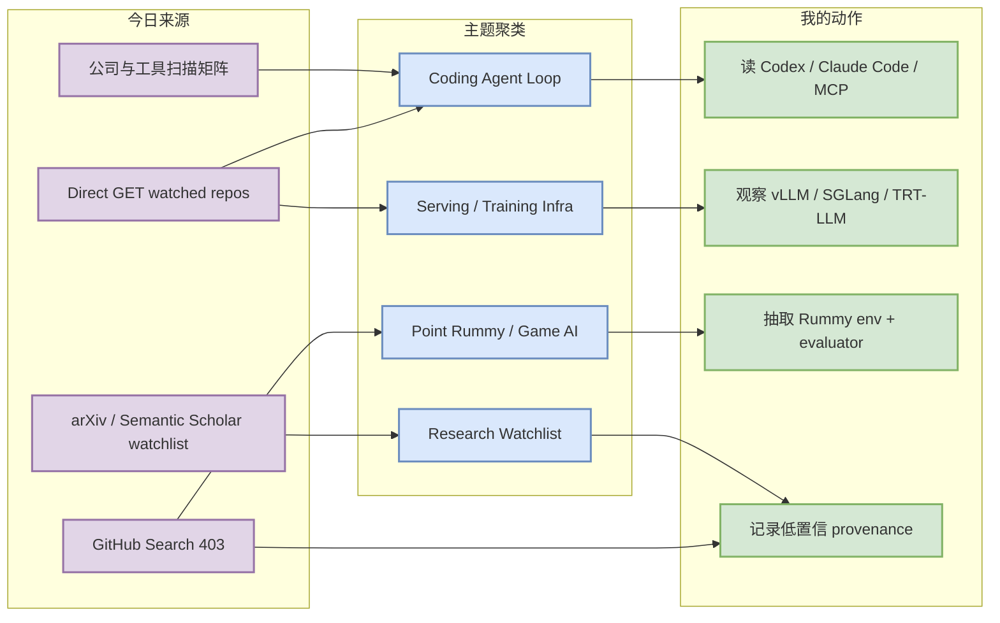
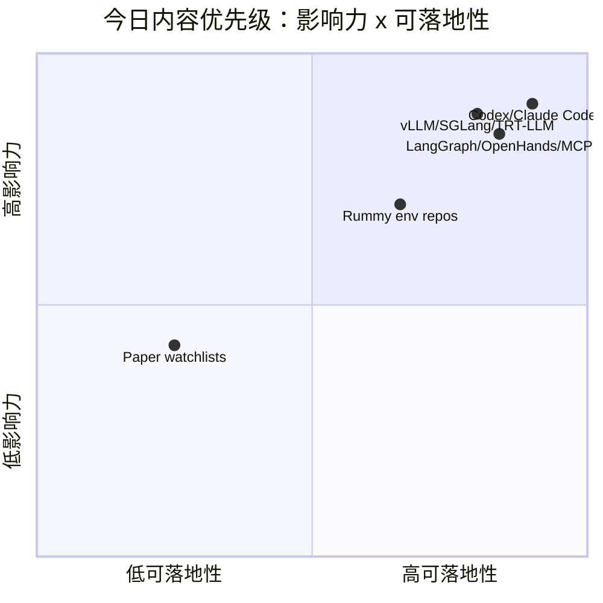

# AI Radar Daily - 2026-07-16

> 生成时间：2026-07-16 09:06 北京时间
> 范围：AI Infra / LLM / RL / Game AI / 大厂博客 / 论文 / GitHub / Coding 工具
> 说明：GitHub Search 今日在 Point Rummy 查询后 403，已保存当日 snapshot；broad / Loop / growth 榜单使用 direct `GET /repos` watched fallback，并明确标注“非完整全网日增”。

## 0. 今日结论

- 今日最值得关注：OpenAI Codex、Claude Code、Gemini CLI、MCP servers 继续构成 coding-agent loop 的核心观察带；增长来自 direct watched fallback，不代表完整全网日增。
- 对 AI Infra 的直接影响：vLLM、SGLang、TensorRT-LLM、PyTorch、DeepSpeed 仍是 serving/training 底座，今天以 direct repo 元数据保持监控不断档。
- 对 LLM 训练 / 推理 / Agent 的影响：LangGraph、OpenHands、AutoGen、Semantic Kernel 提供 agent state machine、workspace harness、multi-agent orchestration 的工程信号。
- 对 RL / 游戏模型训练的影响：Point Rummy 今日仍无高置信新增论文，但 RummyGym、rummy-ai、gin-rummy-rl-lab、IRumAI 等 repo 可用于规则环境、ISMCTS/RL、rollout/evaluator 拆解。
- 风险提示：GitHub Search 403，论文源低置信；今天的 broad/growth/loop Top 10 均是 watched fallback，不应解读为全网真实排名。

## 1. 今日态势图

## 2. 必读卡片区

> [!important] OpenAI Codex / Claude Code：CLI coding agent 仍是 loop engineering 主线
> - 大类：GitHub / Coding 工具
> - 小类：Coding Agent / CLI / TUI
> - 重点：两者在 watched fallback 中仍处于最高优先级；增长非完整全网日增。
> - 为什么重要：直接影响权限模式、远程执行、上下文窗口、tmux 多 agent 监控和代码审查自动化。
> - 详情：[[GitHub/Tools/2026-07-16/openai__codex]] / [网页详情](https://github.com/dyt27666-oss/AI-news-report-obsidians/blob/main/GitHub/Tools/2026-07-16/openai__codex.md) / [原文](https://github.com/openai/codex)

> [!tip] vLLM / SGLang / TensorRT-LLM：serving 三件套继续作为生产选型观察源
> - 大类：GitHub / AI Infra
> - 小类：LLM Serving / GPU Runtime
> - 重点：Search 403 时仍用 direct fallback 保持核心 serving repo 监控。
> - 为什么重要：KV cache、batching、scheduler、kernel/runtime 变化会直接影响吞吐、延迟和推理成本。
> - 详情：[[Industry/2026-07-16/serving-watchlist]] / [网页详情](https://github.com/dyt27666-oss/AI-news-report-obsidians/blob/main/Industry/2026-07-16/serving-watchlist.md) / [原文](https://github.com/vllm-project/vllm)

> [!note] LangGraph / OpenHands / MCP servers：agent state machine 与工具协议仍在升温
> - 大类：GitHub / Loop Engineer
> - 小类：Agent Framework / Tool Protocol
> - 重点：这组项目帮助拆解 coding-agent loop 中的状态、工具、workspace、checkpoint 和 eval。
> - 为什么重要：可直接迁移到 AGENTS.md、任务分解、失败恢复和多 agent orchestration 设计。
> - 详情：[[GitHub/LoopEngineer/2026-07-16/langchain-ai__langgraph]] / [网页详情](https://github.com/dyt27666-oss/AI-news-report-obsidians/blob/main/GitHub/LoopEngineer/2026-07-16/langchain-ai__langgraph.md) / [原文](https://github.com/langchain-ai/langgraph)

> [!warning] Point Rummy：论文低置信，repo 候选更可行动
> - 大类：业务主题 / GitHub
> - 小类：Rummy AI / ISMCTS / RL
> - 重点：RummyGym、rummy-ai、gin-rummy-rl-lab、IRumAI 适合拆 observation/action/reward/evaluator。
> - 为什么重要：业务落地优先需要规则环境、仿真、bot baseline 和评测，而不是低置信论文堆积。
> - 详情：[[GitHub/PointRummy/2026-07-16/nakkekakke__rummy-ai]] / [网页详情](https://github.com/dyt27666-oss/AI-news-report-obsidians/blob/main/GitHub/PointRummy/2026-07-16/nakkekakke__rummy-ai.md) / [原文](https://github.com/nakkekakke/rummy-ai)

## 3. 优先级矩阵

## 4. 分类清单

| 标签 | 大类 | 小类 | 标题 | 重点概括 | 为什么重要 | Obsidian 详情 | 网页详情 | 原文 |
|---|---|---|---|---|---|---|---|---|
| 必读 | GitHub | Coding Agent | OpenAI Codex | direct watched fallback 中最高优先级 coding-agent 项目之一 | 影响 CLI agent 权限、远程执行、上下文策略和 repo 自动化 loop | [[GitHub/Tools/2026-07-16/openai__codex]] | [网页详情](https://github.com/dyt27666-oss/AI-news-report-obsidians/blob/main/GitHub/Tools/2026-07-16/openai__codex.md) | [原文](https://github.com/openai/codex) |
| 必读 | GitHub | Coding Agent | Claude Code | Anthropic 终端 agentic coding 继续作为 loop engineering 观察源 | 影响 tmux 多 agent、代码审查、工具权限和 agent loop 监控 | [[GitHub/Tools/2026-07-16/anthropics__claude-code]] | [网页详情](https://github.com/dyt27666-oss/AI-news-report-obsidians/blob/main/GitHub/Tools/2026-07-16/anthropics__claude-code.md) | [原文](https://github.com/anthropics/claude-code) |
| 可 skim | GitHub | Serving | vLLM / SGLang / TensorRT-LLM | serving 三件套继续提供 KV cache、scheduler、GPU runtime 信号 | 对 LLM inference 成本、吞吐和部署架构有直接影响 | [[Industry/2026-07-16/serving-watchlist]] | [网页详情](https://github.com/dyt27666-oss/AI-news-report-obsidians/blob/main/Industry/2026-07-16/serving-watchlist.md) | [原文](https://github.com/vllm-project/vllm) |
| 后续 | GitHub | Point Rummy | RummyGym / rummy-ai / gin-rummy-rl-lab | 低 star 但业务强相关，适合拆规则、ISMCTS/RL、rollout | 可为 Point Rummy 建 gym-like env、bot baseline、evaluator 提供参考 | [[GitHub/PointRummy/2026-07-16/nakkekakke__rummy-ai]] | [网页详情](https://github.com/dyt27666-oss/AI-news-report-obsidians/blob/main/GitHub/PointRummy/2026-07-16/nakkekakke__rummy-ai.md) | [原文](https://github.com/nakkekakke/rummy-ai) |

## 5. 大厂资讯 / 工程博客 / Research

### 5.1 公司来源扫描矩阵

| 公司/实验室 | 来源/栏目 | 今日状态 | 高相关条数 | 代表条目 | 备注 |
|---|---|---|---:|---|---|
| OpenAI | News / Research / Developer | 间接扫描/有 repo 信号 | 1 | OpenAI Codex watched fallback | 官网新增未确认；Codex 作为开发者工具代理信号 |
| Anthropic | News / Research / Engineering | 间接扫描/有 repo 信号 | 1 | Claude Code watched fallback | 官网新增未确认；Claude Code 作为 coding workflow 代理信号 |
| Google DeepMind | Blog / Research | 低置信 | 0 | 无高相关新项 | 未获得可验证 AI Infra/RL/Agent 新 research/blog 元数据 |
| Meta AI | Blog / Research | 低置信 | 0 | 无高相关新项 | 未获得可验证 AI Infra/RL/Agent 新项 |
| NVIDIA | Technical Blog / AI | 间接扫描/有 repo 信号 | 2 | TensorRT-LLM / NeMo 生态观察 | 官网博客未确认新文；repo 是 inference runtime 信号 |
| Microsoft | Research AI / GitHub | 间接扫描/有 repo 信号 | 2 | AutoGen / Semantic Kernel | agent framework 与企业 orchestration 观察 |
| Hugging Face | Blog / Papers / Releases | 间接扫描/有 repo 信号 | 2 | Transformers / Accelerate | 模型生态、训练/推理兼容性代理信号 |
| 腾讯 | AI Lab / 技术博客 | 低置信 | 0 | 无高相关新项 | 未发现可验证 AI Infra/RL/Agent 新项 |
| 字节 | Seed / 技术博客 | 低置信 | 0 | 无高相关新项 | 未发现可验证 AI Infra/RL/Agent 新项 |
| SpaceAI | Blog / News | 访问失败/低置信 | 0 | 无高相关新项 | 来源有效性低；未获得可验证新项 |

### 5.2 高相关大厂条目

| 标签 | 发布方/大厂 | 栏目/来源 | 标题 | 重点概括 | 工程/算法影响 | Obsidian 详情 | 网页详情 | 原文 |
|---|---|---|---|---|---|---|---|---|
| 可 skim | OpenAI | GitHub / Developer Tool | OpenAI Codex watched repo fallback | Codex 继续代表 CLI coding agent 工程方向。 | 影响权限、远程执行、上下文窗口与 repo 内自动化 loop。 | [[GitHub/Tools/2026-07-16/openai__codex]] | [网页详情](https://github.com/dyt27666-oss/AI-news-report-obsidians/blob/main/GitHub/Tools/2026-07-16/openai__codex.md) | [原文](https://github.com/openai/codex) |
| 可 skim | Anthropic | GitHub / Developer Tool | Claude Code watched repo fallback | Claude Code 延续终端 agentic coding 的高关注度。 | 影响 tmux 多 agent、代码审查、工具权限和 agent loop 监控。 | [[GitHub/Tools/2026-07-16/anthropics__claude-code]] | [网页详情](https://github.com/dyt27666-oss/AI-news-report-obsidians/blob/main/GitHub/Tools/2026-07-16/anthropics__claude-code.md) | [原文](https://github.com/anthropics/claude-code) |
| 可 skim | NVIDIA / vLLM / SGLang | GitHub / AI Infra | Serving watched repos | 用 direct fallback 观察 serving 三件套。 | 直接映射到 inference runtime、KV cache、batching、GPU kernel 与生产 serving 成本。 | [[Industry/2026-07-16/serving-watchlist]] | [网页详情](https://github.com/dyt27666-oss/AI-news-report-obsidians/blob/main/Industry/2026-07-16/serving-watchlist.md) | [原文](https://github.com/vllm-project/vllm) |

## 6. GitHub 高 star Top 10

> 说明：GitHub Search 今日 rate limit；本表使用 direct watched repo fallback，不是完整全网 Top 10。

| 排名 | repo | stars | forks | language | updated_at | topics | 重点概括 | 是否值得试用 | Obsidian 详情 | 原文 |
|---:|---|---:|---:|---|---|---|---|---|---|---|
| 1 | `huggingface/transformers` | 162632 | 33893 | Python | 2026-07-16T00:28:02Z | audio, deep-learning, deepseek, gemma, glm, hacktoberfest, llm, machine-learning, model-hub, natural-language-processing | 模型与 tokenizer 生态底座，影响新模型接入、训练脚本、eval pipeline 与 serving 兼容性。 | 值得 skim/按需试用 | [[GitHub/AIInfra/2026-07-16/huggingface__transformers]] | [GitHub](https://github.com/huggingface/transformers) |
| 2 | `anthropics/claude-code` | 137992 | 22251 | Python | 2026-07-16T01:03:23Z | 无 | Anthropic 终端 coding agent，是 CLI/TUI、权限模式、repo 内 agent loop 的关键观察源。 | 值得 skim/按需试用 | [[GitHub/AIInfra/2026-07-16/anthropics__claude-code]] | [GitHub](https://github.com/anthropics/claude-code) |
| 3 | `google-gemini/gemini-cli` | 106008 | 14269 | TypeScript | 2026-07-15T23:51:09Z | ai, ai-agents, cli, gemini, gemini-api, mcp-client, mcp-server | Google Gemini 终端 agent，topics 覆盖 MCP client/server，适合观察开放工具链。 | 值得 skim/按需试用 | [[GitHub/AIInfra/2026-07-16/google-gemini__gemini-cli]] | [GitHub](https://github.com/google-gemini/gemini-cli) |
| 4 | `pytorch/pytorch` | 101837 | 28508 | Python | 2026-07-16T00:56:36Z | autograd, deep-learning, gpu, machine-learning, neural-network, numpy, python, tensor | 训练/推理框架底层，compile、distributed、GPU runtime 变化会直接影响大模型工程。 | 值得 skim/按需试用 | [[GitHub/AIInfra/2026-07-16/pytorch__pytorch]] | [GitHub](https://github.com/pytorch/pytorch) |
| 5 | `openai/codex` | 98499 | 14691 | Rust | 2026-07-16T01:05:18Z | 无 | OpenAI Rust 终端 coding agent，与远程执行、权限边界、上下文策略和 repo 自动化强相关。 | 值得 skim/按需试用 | [[GitHub/AIInfra/2026-07-16/openai__codex]] | [GitHub](https://github.com/openai/codex) |
| 6 | `modelcontextprotocol/servers` | 88514 | 11227 | TypeScript | 2026-07-15T21:57:52Z | 无 | MCP server 生态入口，影响 coding agent 的工具接入标准和权限边界。 | 值得 skim/按需试用 | [[GitHub/AIInfra/2026-07-16/modelcontextprotocol__servers]] | [GitHub](https://github.com/modelcontextprotocol/servers) |
| 7 | `vllm-project/vllm` | 86351 | 19466 | Python | 2026-07-16T00:59:21Z | amd, blackwell, cuda, deepseek, deepseek-v3, gpt, gpt-oss, inference, kimi, llama | LLM serving 高吞吐引擎，关注 batching、KV cache、scheduler 与硬件适配。 | 值得 skim/按需试用 | [[GitHub/AIInfra/2026-07-16/vllm-project__vllm]] | [GitHub](https://github.com/vllm-project/vllm) |
| 8 | `OpenHands/OpenHands` | 80904 | 10340 | Python | 2026-07-16T00:24:09Z | agent, artificial-intelligence, chatgpt, claude-ai, cli, developer-tools, gpt, llm, openai | 开源 AI coding workspace，可参考 sandbox、tool loop、workspace harness 与 eval。 | 值得 skim/按需试用 | [[GitHub/AIInfra/2026-07-16/OpenHands__OpenHands]] | [GitHub](https://github.com/OpenHands/OpenHands) |
| 9 | `cline/cline` | 64699 | 6917 | TypeScript | 2026-07-16T00:55:34Z | 无 | IDE/CLI 自主 coding agent，适合观察 extension、MCP 和 agent SDK 工作流。 | 值得 skim/按需试用 | [[GitHub/AIInfra/2026-07-16/cline__cline]] | [GitHub](https://github.com/cline/cline) |
| 10 | `microsoft/autogen` | 59757 | 8996 | Python | 2026-07-16T00:55:27Z | agentic, agentic-agi, agents, ai, autogen, autogen-ecosystem, chatgpt, framework, llm-agent, llm-framework | 多 agent 编程框架，适合作为 orchestration、tool recovery、eval loop 参考。 | 值得 skim/按需试用 | [[GitHub/AIInfra/2026-07-16/microsoft__autogen]] | [GitHub](https://github.com/microsoft/autogen) |

## 7. GitHub star 增长最快 Top 10

> 说明：使用 2026-07-15 snapshot baseline 计算 watched repo stars_delta；这是“非完整全网日增”，不是冷启动代理。

| 排名 | repo | stars_delta | stars | forks | language | updated_at | 增长依据 | 重点概括 | Obsidian 详情 | 原文 |
|---:|---|---:|---:|---:|---|---|---|---|---|---|
| 1 | `openai/codex` | 426 | 98499 | 14691 | Rust | 2026-07-16T01:05:18Z | direct GET /repos vs 2026-07-15 snapshot；非完整全网日增 | OpenAI Rust 终端 coding agent，与远程执行、权限边界、上下文策略和 repo 自动化强相关。 | [[GitHub/AIInfra/2026-07-16/openai__codex]] | [GitHub](https://github.com/openai/codex) |
| 2 | `OpenHands/OpenHands` | 111 | 80904 | 10340 | Python | 2026-07-16T00:24:09Z | direct GET /repos vs 2026-07-15 snapshot；非完整全网日增 | 开源 AI coding workspace，可参考 sandbox、tool loop、workspace harness 与 eval。 | [[GitHub/AIInfra/2026-07-16/OpenHands__OpenHands]] | [GitHub](https://github.com/OpenHands/OpenHands) |
| 3 | `anthropics/claude-code` | 107 | 137992 | 22251 | Python | 2026-07-16T01:03:23Z | direct GET /repos vs 2026-07-15 snapshot；非完整全网日增 | Anthropic 终端 coding agent，是 CLI/TUI、权限模式、repo 内 agent loop 的关键观察源。 | [[GitHub/AIInfra/2026-07-16/anthropics__claude-code]] | [GitHub](https://github.com/anthropics/claude-code) |
| 4 | `vllm-project/vllm` | 82 | 86351 | 19466 | Python | 2026-07-16T00:59:21Z | direct GET /repos vs 2026-07-15 snapshot；非完整全网日增 | LLM serving 高吞吐引擎，关注 batching、KV cache、scheduler 与硬件适配。 | [[GitHub/AIInfra/2026-07-16/vllm-project__vllm]] | [GitHub](https://github.com/vllm-project/vllm) |
| 5 | `langchain-ai/langgraph` | 67 | 37374 | 6262 | Python | 2026-07-16T00:48:19Z | direct GET /repos vs 2026-07-15 snapshot；非完整全网日增 | 生产 agent state machine 框架，适合 checkpoint、graph control flow 与 tool recovery。 | [[GitHub/AIInfra/2026-07-16/langchain-ai__langgraph]] | [GitHub](https://github.com/langchain-ai/langgraph) |
| 6 | `sgl-project/sglang` | 36 | 30347 | 7184 | Python | 2026-07-16T01:05:28Z | direct GET /repos vs 2026-07-15 snapshot；非完整全网日增 | 高性能 LLM/VLM serving 框架，关注 attention、CUDA、MoE、RL serving 和 scheduler。 | [[GitHub/AIInfra/2026-07-16/sgl-project__sglang]] | [GitHub](https://github.com/sgl-project/sglang) |
| 7 | `modelcontextprotocol/servers` | 34 | 88514 | 11227 | TypeScript | 2026-07-15T21:57:52Z | direct GET /repos vs 2026-07-15 snapshot；非完整全网日增 | MCP server 生态入口，影响 coding agent 的工具接入标准和权限边界。 | [[GitHub/AIInfra/2026-07-16/modelcontextprotocol__servers]] | [GitHub](https://github.com/modelcontextprotocol/servers) |
| 8 | `cline/cline` | 34 | 64699 | 6917 | TypeScript | 2026-07-16T00:55:34Z | direct GET /repos vs 2026-07-15 snapshot；非完整全网日增 | IDE/CLI 自主 coding agent，适合观察 extension、MCP 和 agent SDK 工作流。 | [[GitHub/AIInfra/2026-07-16/cline__cline]] | [GitHub](https://github.com/cline/cline) |
| 9 | `continuedev/continue` | 28 | 34904 | 5052 | TypeScript | 2026-07-16T00:00:34Z | direct GET /repos vs 2026-07-15 snapshot；非完整全网日增 | 开源 coding agent，适合观察 IDE/CLI 结合、模型路由和私有代码库工作流。 | [[GitHub/AIInfra/2026-07-16/continuedev__continue]] | [GitHub](https://github.com/continuedev/continue) |
| 10 | `pytorch/pytorch` | 24 | 101837 | 28508 | Python | 2026-07-16T00:56:36Z | direct GET /repos vs 2026-07-15 snapshot；非完整全网日增 | 训练/推理框架底层，compile、distributed、GPU runtime 变化会直接影响大模型工程。 | [[GitHub/AIInfra/2026-07-16/pytorch__pytorch]] | [GitHub](https://github.com/pytorch/pytorch) |

## 8. Coding 工具 / AI 工具功能更新

### 8.1 Coding 工具扫描矩阵

| 工具 | 厂商 | 来源类型 | 今日状态 | 代表更新 | 对我的影响 | 原文 |
|---|---|---|---|---|---|---|
| Claude Code | Anthropic | Changelog / Release Notes / GitHub | 间接扫描/有 repo 信号 | watched repo stars_delta=107；direct fallback，非完整全网日增 | 影响 CLI/TUI、agent loop、MCP、IDE 集成或权限模式，建议持续观察。 | [原文](https://github.com/anthropics/claude-code) |
| OpenAI Codex | OpenAI | Changelog / Release Notes / GitHub | 间接扫描/有 repo 信号 | watched repo stars_delta=426；direct fallback，非完整全网日增 | 影响 CLI/TUI、agent loop、MCP、IDE 集成或权限模式，建议持续观察。 | [原文](https://github.com/openai/codex) |
| Cursor | Cursor | Changelog / Release Notes / GitHub | 低置信/无高相关新项 | 无高相关新项或官网未确认新增 release | 暂不调整工作流；保留扫描矩阵避免漏扫。 | [原文](https://cursor.com/changelog) |
| Windsurf | Windsurf | Changelog / Release Notes / GitHub | 低置信/无高相关新项 | 无高相关新项或官网未确认新增 release | 暂不调整工作流；保留扫描矩阵避免漏扫。 | [原文](https://windsurf.com/changelog) |
| GitHub Copilot | GitHub | Changelog / Release Notes / GitHub | 低置信/无高相关新项 | 无高相关新项或官网未确认新增 release | 暂不调整工作流；保留扫描矩阵避免漏扫。 | [原文](https://github.blog/changelog/label/copilot/) |
| Gemini Code Assist | Google | Changelog / Release Notes / GitHub | 间接扫描/有 repo 信号 | watched repo stars_delta=21；direct fallback，非完整全网日增 | 影响 CLI/TUI、agent loop、MCP、IDE 集成或权限模式，建议持续观察。 | [原文](https://github.com/google-gemini/gemini-cli) |
| Qwen Code | Alibaba/Qwen | Changelog / Release Notes / GitHub | 间接扫描/有 repo 信号 | watched repo stars_delta=13；direct fallback，非完整全网日增 | 影响 CLI/TUI、agent loop、MCP、IDE 集成或权限模式，建议持续观察。 | [原文](https://github.com/QwenLM/qwen-code) |
| Roo Code | Roo Code | Changelog / Release Notes / GitHub | 间接扫描/有 repo 信号 | watched repo stars_delta=5；direct fallback，非完整全网日增 | 影响 CLI/TUI、agent loop、MCP、IDE 集成或权限模式，建议持续观察。 | [原文](https://github.com/RooCodeInc/Roo-Code) |
| Cline | Cline | Changelog / Release Notes / GitHub | 间接扫描/有 repo 信号 | watched repo stars_delta=34；direct fallback，非完整全网日增 | 影响 CLI/TUI、agent loop、MCP、IDE 集成或权限模式，建议持续观察。 | [原文](https://github.com/cline/cline) |
| Continue | Continue | Changelog / Release Notes / GitHub | 间接扫描/有 repo 信号 | watched repo stars_delta=28；direct fallback，非完整全网日增 | 影响 CLI/TUI、agent loop、MCP、IDE 集成或权限模式，建议持续观察。 | [原文](https://github.com/continuedev/continue) |

### 8.2 高相关工具更新

| 标签 | 工具/厂商 | 来源类型 | 标题/功能 | 重点概括 | 对 AI coding 工作流的影响 | Obsidian 详情 | 网页详情 | 原文 |
|---|---|---|---|---|---|---|---|---|
| 必读 | OpenAI Codex | GitHub / Docs | Codex watched fallback | direct fallback 保持最高优先级；非完整全网日增 | 适合跟踪权限模式、远程执行和上下文窗口策略 | [[GitHub/Tools/2026-07-16/openai__codex]] | [网页详情](https://github.com/dyt27666-oss/AI-news-report-obsidians/blob/main/GitHub/Tools/2026-07-16/openai__codex.md) | [原文](https://github.com/openai/codex) |
| 必读 | Claude Code | GitHub / Docs | Claude Code watched fallback | 终端 agentic coding 仍是 loop engineering 关键线索 | 适合多 agent 监控、代码审查与工具权限设计 | [[GitHub/Tools/2026-07-16/anthropics__claude-code]] | [网页详情](https://github.com/dyt27666-oss/AI-news-report-obsidians/blob/main/GitHub/Tools/2026-07-16/anthropics__claude-code.md) | [原文](https://github.com/anthropics/claude-code) |
| 可 skim | Gemini CLI / Code Assist | GitHub / Release Notes proxy | Gemini CLI active | topics 覆盖 MCP client/server | 可观察开放 MCP 工具链和 Google coding agent 方向 | [[GitHub/LoopEngineer/2026-07-16/google-gemini__gemini-cli]] | [网页详情](https://github.com/dyt27666-oss/AI-news-report-obsidians/blob/main/GitHub/LoopEngineer/2026-07-16/google-gemini__gemini-cli.md) | [原文](https://github.com/google-gemini/gemini-cli) |

## 9. Point Rummy / Indian Rummy 业务主题

### 9.1 GitHub 候选

| 排名 | repo | stars | forks | language | updated_at | 重点概括 | 业务可用性 | Obsidian 详情 | 原文 |
|---:|---|---:|---:|---|---|---|---|---|---|
| 1 | `rickgorman/gin-rummy-ai` | 13 | 5 | Python | 2025-03-25T13:47:09Z | A hand-rolled neuroevolution AI for gin rummy. | 适合拆规则、bot、仿真或 evaluator；低 star 项目需只借鉴设计 | [[GitHub/PointRummy/2026-07-16/rickgorman__gin-rummy-ai]] | [GitHub](https://github.com/rickgorman/gin-rummy-ai) |
| 2 | `nakkekakke/rummy-ai` | 11 | 5 | Java | 2026-04-17T10:02:59Z | Text based classic Rummy game with an AI that uses ISMCTS. Data Structures and Algorithms course project, University of Helsinki | 适合拆规则、bot、仿真或 evaluator；低 star 项目需只借鉴设计 | [[GitHub/PointRummy/2026-07-16/nakkekakke__rummy-ai]] | [GitHub](https://github.com/nakkekakke/rummy-ai) |
| 3 | `jmhummel/Gin-Rummy-Java` | 8 | 0 | Java | 2023-08-16T16:12:58Z | Java-based Gin Rummy console game, with an AI opponent | 适合拆规则、bot、仿真或 evaluator；低 star 项目需只借鉴设计 | [[GitHub/PointRummy/2026-07-16/jmhummel__Gin-Rummy-Java]] | [GitHub](https://github.com/jmhummel/Gin-Rummy-Java) |
| 4 | `SCFlanagan/Rummy` | 4 | 6 | JavaScript | 2025-07-25T21:17:08Z | This project is a recreation of the classic card game Rummy. It features an AI player to play against, a hand of cards that can be dragged and sorted, | 适合拆规则、bot、仿真或 evaluator；低 star 项目需只借鉴设计 | [[GitHub/PointRummy/2026-07-16/SCFlanagan__Rummy]] | [GitHub](https://github.com/SCFlanagan/Rummy) |
| 5 | `mcartmell/gin-rummy-bot` | 4 | 2 | Perl | 2024-10-30T20:06:17Z | A web-based Gin Rummy game and AI | 适合拆规则、bot、仿真或 evaluator；低 star 项目需只借鉴设计 | [[GitHub/PointRummy/2026-07-16/mcartmell__gin-rummy-bot]] | [GitHub](https://github.com/mcartmell/gin-rummy-bot) |
| 6 | `abubakarmunir712/dsa-final-project` | 2 | 1 | Python | 2026-06-27T06:34:26Z | A Python-based multiplayer Indian Rummy game with support for AI opponents and LAN play. Implements data structures like linked lists, stacks, queues, | 适合拆规则、bot、仿真或 evaluator；低 star 项目需只借鉴设计 | [[GitHub/PointRummy/2026-07-16/abubakarmunir712__dsa-final-project]] | [GitHub](https://github.com/abubakarmunir712/dsa-final-project) |
| 7 | `Mohitkumar-559/RummyServer` | 2 | 1 | JavaScript | 2024-03-17T03:48:34Z | Rummy game server for game that contain deal rummy and point rummy | 适合拆规则、bot、仿真或 evaluator；低 star 项目需只借鉴设计 | [[GitHub/PointRummy/2026-07-16/Mohitkumar-559__RummyServer]] | [GitHub](https://github.com/Mohitkumar-559/RummyServer) |
| 8 | `mudont/indian-rummy` | 5 | 0 | TypeScript | 2025-08-08T21:05:04Z | Typescript library for Indian Rummy card game | 适合拆规则、bot、仿真或 evaluator；低 star 项目需只借鉴设计 | [[GitHub/PointRummy/2026-07-16/mudont__indian-rummy]] | [GitHub](https://github.com/mudont/indian-rummy) |
| 9 | `dv-rastogi/Rummy` | 5 | 0 | Python | 2023-09-26T11:21:39Z | Variation of classical Indian Rummy made in Pygame | 适合拆规则、bot、仿真或 evaluator；低 star 项目需只借鉴设计 | [[GitHub/PointRummy/2026-07-16/dv-rastogi__Rummy]] | [GitHub](https://github.com/dv-rastogi/Rummy) |
| 10 | `vahsek300501/Indian-Rummy-` | 4 | 3 | Python | 2023-09-26T11:21:46Z | Indian Rummy made in Python using PyGame | 适合拆规则、bot、仿真或 evaluator；低 star 项目需只借鉴设计 | [[GitHub/PointRummy/2026-07-16/vahsek300501__Indian-Rummy-]] | [GitHub](https://github.com/vahsek300501/Indian-Rummy-) |

### 9.2 论文 / 资料候选

| 标签 | 来源 | 标题 | 作者/机构 | 重点概括 | 对 Point Rummy 业务有什么用 | Obsidian 详情 | 原文 |
|---|---|---|---|---|---|---|---|
| 低置信 | arXiv / Semantic Scholar / 预印本索引扫描 | Rummy imperfect-information game 论文源扫描 | 多来源；本轮 API 429/timeout，未确认新增论文 | 未确认新增论文；以 GitHub 上 ISMCTS、RL lab、rule engine 候选作为今天可行动线索。 | 业务上先拆规则环境、仿真与 evaluator，比追逐低置信论文更可落地。 | [[Papers/Watchlist/2026-07-16/rummy-imperfect-information-game]] | [原文](https://export.arxiv.org/api/query?search_query=all:rummy+imperfect+information+game+AI) |

### 9.3 业务可用性判断

| 方向 | 今日信号 | 可用性 | 下一步 |
|---|---|---|---|
| 规则引擎 / 计分 | Indian Rummy / rummy score / rule-engine repo 候选 | 中：可抽 13-card 状态机、meld/sequence、drop/score 模型 | 先写最小规则测试集和 scorer |
| Bot / RL Agent | rummy-ai、RummyGym、IRumAI、gin-rummy-rl-lab | 中低：repo 小但主题强相关 | 复现 observation/action/reward 接口，不直接用生产代码 |
| 仿真 / 评测 | gin-rummy-rl-lab、RummyGym、cards-ai-bot | 中：适合搭 rollout harness | 定义 evaluator，接入并行 self-play |
| 视觉辅助 | RummyVision | 低到中：概念可借鉴 | 只抽 card recognition + discard suggestion 交互思路 |

## 10. Loop Engineer / Loop Engineering 主题

### 10.1 Loop Engineer GitHub 高 star Top 10

| 排名 | repo | stars | forks | language | updated_at | topics | 重点概括 | 是否值得试用 | Obsidian 详情 | 原文 |
|---:|---|---:|---:|---|---|---|---|---|---|---|
| 1 | `anthropics/claude-code` | 137992 | 22251 | Python | 2026-07-16T01:03:23Z | 无 | Anthropic 终端 coding agent，是 CLI/TUI、权限模式、repo 内 agent loop 的关键观察源。 | 值得 skim/按需试用 | [[GitHub/LoopEngineer/2026-07-16/anthropics__claude-code]] | [GitHub](https://github.com/anthropics/claude-code) |
| 2 | `google-gemini/gemini-cli` | 106008 | 14269 | TypeScript | 2026-07-15T23:51:09Z | ai, ai-agents, cli, gemini, gemini-api, mcp-client, mcp-server | Google Gemini 终端 agent，topics 覆盖 MCP client/server，适合观察开放工具链。 | 值得 skim/按需试用 | [[GitHub/LoopEngineer/2026-07-16/google-gemini__gemini-cli]] | [GitHub](https://github.com/google-gemini/gemini-cli) |
| 3 | `openai/codex` | 98499 | 14691 | Rust | 2026-07-16T01:05:18Z | 无 | OpenAI Rust 终端 coding agent，与远程执行、权限边界、上下文策略和 repo 自动化强相关。 | 值得 skim/按需试用 | [[GitHub/LoopEngineer/2026-07-16/openai__codex]] | [GitHub](https://github.com/openai/codex) |
| 4 | `modelcontextprotocol/servers` | 88514 | 11227 | TypeScript | 2026-07-15T21:57:52Z | 无 | MCP server 生态入口，影响 coding agent 的工具接入标准和权限边界。 | 值得 skim/按需试用 | [[GitHub/LoopEngineer/2026-07-16/modelcontextprotocol__servers]] | [GitHub](https://github.com/modelcontextprotocol/servers) |
| 5 | `OpenHands/OpenHands` | 80904 | 10340 | Python | 2026-07-16T00:24:09Z | agent, artificial-intelligence, chatgpt, claude-ai, cli, developer-tools, gpt, llm, openai | 开源 AI coding workspace，可参考 sandbox、tool loop、workspace harness 与 eval。 | 值得 skim/按需试用 | [[GitHub/LoopEngineer/2026-07-16/OpenHands__OpenHands]] | [GitHub](https://github.com/OpenHands/OpenHands) |
| 6 | `cline/cline` | 64699 | 6917 | TypeScript | 2026-07-16T00:55:34Z | 无 | IDE/CLI 自主 coding agent，适合观察 extension、MCP 和 agent SDK 工作流。 | 值得 skim/按需试用 | [[GitHub/LoopEngineer/2026-07-16/cline__cline]] | [GitHub](https://github.com/cline/cline) |
| 7 | `microsoft/autogen` | 59757 | 8996 | Python | 2026-07-16T00:55:27Z | agentic, agentic-agi, agents, ai, autogen, autogen-ecosystem, chatgpt, framework, llm-agent, llm-framework | 多 agent 编程框架，适合作为 orchestration、tool recovery、eval loop 参考。 | 值得 skim/按需试用 | [[GitHub/LoopEngineer/2026-07-16/microsoft__autogen]] | [GitHub](https://github.com/microsoft/autogen) |
| 8 | `langchain-ai/langgraph` | 37374 | 6262 | Python | 2026-07-16T00:48:19Z | agents, ai, ai-agents, chatgpt, deepagents, enterprise, framework, gemini, generative-ai, langchain | 生产 agent state machine 框架，适合 checkpoint、graph control flow 与 tool recovery。 | 值得 skim/按需试用 | [[GitHub/LoopEngineer/2026-07-16/langchain-ai__langgraph]] | [GitHub](https://github.com/langchain-ai/langgraph) |
| 9 | `continuedev/continue` | 34904 | 5052 | TypeScript | 2026-07-16T00:00:34Z | agent, ai, cli, developer-tools, open-source | 开源 coding agent，适合观察 IDE/CLI 结合、模型路由和私有代码库工作流。 | 值得 skim/按需试用 | [[GitHub/LoopEngineer/2026-07-16/continuedev__continue]] | [GitHub](https://github.com/continuedev/continue) |
| 10 | `microsoft/semantic-kernel` | 28316 | 4678 | C# | 2026-07-15T20:34:47Z | ai, artificial-intelligence, llm, openai, sdk | 企业 LLM app/agent SDK，适合插件化、memory、function calling 与 orchestration。 | 值得 skim/按需试用 | [[GitHub/LoopEngineer/2026-07-16/microsoft__semantic-kernel]] | [GitHub](https://github.com/microsoft/semantic-kernel) |

### 10.2 Loop Engineer GitHub star 增长最快 Top 10

| 排名 | repo | stars_delta | stars | forks | language | updated_at | 增长依据 | 重点概括 | Obsidian 详情 | 原文 |
|---:|---|---:|---:|---:|---|---|---|---|---|---|
| 1 | `openai/codex` | 426 | 98499 | 14691 | Rust | 2026-07-16T01:05:18Z | direct GET /repos vs 2026-07-15 snapshot；非完整全网日增 | OpenAI Rust 终端 coding agent，与远程执行、权限边界、上下文策略和 repo 自动化强相关。 | [[GitHub/LoopEngineer/2026-07-16/openai__codex]] | [GitHub](https://github.com/openai/codex) |
| 2 | `OpenHands/OpenHands` | 111 | 80904 | 10340 | Python | 2026-07-16T00:24:09Z | direct GET /repos vs 2026-07-15 snapshot；非完整全网日增 | 开源 AI coding workspace，可参考 sandbox、tool loop、workspace harness 与 eval。 | [[GitHub/LoopEngineer/2026-07-16/OpenHands__OpenHands]] | [GitHub](https://github.com/OpenHands/OpenHands) |
| 3 | `anthropics/claude-code` | 107 | 137992 | 22251 | Python | 2026-07-16T01:03:23Z | direct GET /repos vs 2026-07-15 snapshot；非完整全网日增 | Anthropic 终端 coding agent，是 CLI/TUI、权限模式、repo 内 agent loop 的关键观察源。 | [[GitHub/LoopEngineer/2026-07-16/anthropics__claude-code]] | [GitHub](https://github.com/anthropics/claude-code) |
| 4 | `langchain-ai/langgraph` | 67 | 37374 | 6262 | Python | 2026-07-16T00:48:19Z | direct GET /repos vs 2026-07-15 snapshot；非完整全网日增 | 生产 agent state machine 框架，适合 checkpoint、graph control flow 与 tool recovery。 | [[GitHub/LoopEngineer/2026-07-16/langchain-ai__langgraph]] | [GitHub](https://github.com/langchain-ai/langgraph) |
| 5 | `modelcontextprotocol/servers` | 34 | 88514 | 11227 | TypeScript | 2026-07-15T21:57:52Z | direct GET /repos vs 2026-07-15 snapshot；非完整全网日增 | MCP server 生态入口，影响 coding agent 的工具接入标准和权限边界。 | [[GitHub/LoopEngineer/2026-07-16/modelcontextprotocol__servers]] | [GitHub](https://github.com/modelcontextprotocol/servers) |
| 6 | `cline/cline` | 34 | 64699 | 6917 | TypeScript | 2026-07-16T00:55:34Z | direct GET /repos vs 2026-07-15 snapshot；非完整全网日增 | IDE/CLI 自主 coding agent，适合观察 extension、MCP 和 agent SDK 工作流。 | [[GitHub/LoopEngineer/2026-07-16/cline__cline]] | [GitHub](https://github.com/cline/cline) |
| 7 | `continuedev/continue` | 28 | 34904 | 5052 | TypeScript | 2026-07-16T00:00:34Z | direct GET /repos vs 2026-07-15 snapshot；非完整全网日增 | 开源 coding agent，适合观察 IDE/CLI 结合、模型路由和私有代码库工作流。 | [[GitHub/LoopEngineer/2026-07-16/continuedev__continue]] | [GitHub](https://github.com/continuedev/continue) |
| 8 | `microsoft/autogen` | 22 | 59757 | 8996 | Python | 2026-07-16T00:55:27Z | direct GET /repos vs 2026-07-15 snapshot；非完整全网日增 | 多 agent 编程框架，适合作为 orchestration、tool recovery、eval loop 参考。 | [[GitHub/LoopEngineer/2026-07-16/microsoft__autogen]] | [GitHub](https://github.com/microsoft/autogen) |
| 9 | `google-gemini/gemini-cli` | 21 | 106008 | 14269 | TypeScript | 2026-07-15T23:51:09Z | direct GET /repos vs 2026-07-15 snapshot；非完整全网日增 | Google Gemini 终端 agent，topics 覆盖 MCP client/server，适合观察开放工具链。 | [[GitHub/LoopEngineer/2026-07-16/google-gemini__gemini-cli]] | [GitHub](https://github.com/google-gemini/gemini-cli) |
| 10 | `QwenLM/qwen-code` | 13 | 26036 | 2650 | TypeScript | 2026-07-16T00:59:06Z | direct GET /repos vs 2026-07-15 snapshot；非完整全网日增 | Qwen 终端 coding agent，适合观察国产模型 coding workflow 与 CLI agent 形态。 | [[GitHub/LoopEngineer/2026-07-16/QwenLM__qwen-code]] | [GitHub](https://github.com/QwenLM/qwen-code) |

### 10.3 Loop Engineering 方法信号

| 标签 | 来源 | 标题 | 重点概括 | 对 AI coding 工作流的影响 | Obsidian 详情 | 原文 |
|---|---|---|---|---|---|---|
| 必读 | GitHub watched fallback | Codex / Claude Code / LangGraph / OpenHands / MCP | GitHub Search 403 时用 direct fallback 保持 loop radar 不断档 | 适合设计 AGENTS.md、权限模式、eval loop、multi-agent orchestration | [[GitHub/LoopEngineer/2026-07-16/openai__codex]] | [原文](https://github.com/openai/codex) |

## 11. 论文

### 11.1 Research watchlist / API timeout

| 标签 | 论文来源 | 论文 | 作者/机构 | 重点概括 | 工程/研究价值 | Obsidian 详情 | 网页详情 | PDF/原文 |
|---|---|---|---|---|---|---|---|---|
| 低置信 | arXiv / Semantic Scholar / 预印本索引扫描 | Agentic RL / post-training 论文源扫描 | 多来源；本轮 API 429/timeout，未确认新增高置信论文 | 论文 API 今日不稳定；不把弱相关泛 ML 结果塞进日报，只保留 RLHF、GRPO、agent eval 的后续查询入口。 | 对 post-training 工程来说，保留 provenance 比误报论文更重要；明日可重试并优先筛 GRPO/RLHF/eval。 | [[Papers/Watchlist/2026-07-16/agentic-rl-post-training]] | [网页详情](https://github.com/dyt27666-oss/AI-news-report-obsidians/blob/main/Papers/Watchlist/2026-07-16/agentic-rl-post-training.md) | [原文](https://export.arxiv.org/api/query?search_query=all:reinforcement+learning+language+models) |
| 低置信 | arXiv / 预印本索引扫描 | LLM Serving / inference 论文源扫描 | 多来源；本轮 API timeout，未确认新增高置信论文 | 围绕 KV cache、batching、speculative decoding 的论文扫描未完成；今天以 vLLM/SGLang/TensorRT-LLM repo 信号替代工程判断。 | 对 AI Infra 工程师更可信的当天信号来自 serving repo 活跃度，而不是超时的论文 API。 | [[Papers/Watchlist/2026-07-16/llm-serving-inference]] | [网页详情](https://github.com/dyt27666-oss/AI-news-report-obsidians/blob/main/Papers/Watchlist/2026-07-16/llm-serving-inference.md) | [原文](https://export.arxiv.org/api/query?search_query=all:large+language+model+inference) |
| 低置信 | arXiv / Semantic Scholar / 预印本索引扫描 | Rummy imperfect-information game 论文源扫描 | 多来源；本轮 API 429/timeout，未确认新增论文 | 未确认新增论文；以 GitHub 上 ISMCTS、RL lab、rule engine 候选作为今天可行动线索。 | 业务上先拆规则环境、仿真与 evaluator，比追逐低置信论文更可落地。 | [[Papers/Watchlist/2026-07-16/rummy-imperfect-information-game]] | [网页详情](https://github.com/dyt27666-oss/AI-news-report-obsidians/blob/main/Papers/Watchlist/2026-07-16/rummy-imperfect-information-game.md) | [原文](https://export.arxiv.org/api/query?search_query=all:rummy+imperfect+information+game+AI) |

## 12. 资讯 / 其他 GitHub 项目

### 12.1 Serving / Agent / MCP 观察

| 标签 | 来源 | 标题 | 重点概括 | 对我有什么用 | Obsidian 详情 | 网页详情 | 原文 |
|---|---|---|---|---|---|---|---|
| 可 skim | GitHub | Model Context Protocol servers | MCP server 生态是 agent tool-use 标准化入口 | 对 coding agent 接工具、权限边界、可观测性有长期价值 | [[GitHub/AIInfra/2026-07-16/modelcontextprotocol__servers]] | [网页详情](https://github.com/dyt27666-oss/AI-news-report-obsidians/blob/main/GitHub/AIInfra/2026-07-16/modelcontextprotocol__servers.md) | [原文](https://github.com/modelcontextprotocol/servers) |
| 可 skim | GitHub | OpenHands | AI coding workspace/harness direct fallback 信号持续 | 可参考 sandbox、tool loop、repo interaction、eval harness | [[GitHub/LoopEngineer/2026-07-16/OpenHands__OpenHands]] | [网页详情](https://github.com/dyt27666-oss/AI-news-report-obsidians/blob/main/GitHub/LoopEngineer/2026-07-16/OpenHands__OpenHands.md) | [原文](https://github.com/OpenHands/OpenHands) |

## 13. 按主题索引

### AI Infra / Serving / Training

- [[GitHub/AIInfra/2026-07-16/vllm-project__vllm]] - LLM serving 引擎观察。
- [[GitHub/AIInfra/2026-07-16/sgl-project__sglang]] - 高性能 serving / VLM / RL serving 观察。
- [[GitHub/AIInfra/2026-07-16/NVIDIA__TensorRT-LLM]] - NVIDIA GPU inference runtime 观察。
- [[GitHub/AIInfra/2026-07-16/verl-project__verl]] - RL post-training 框架观察。

### LLM / Agent / RAG / Evaluation

- [[GitHub/LoopEngineer/2026-07-16/openai__codex]] - CLI coding agent 增长信号。
- [[GitHub/LoopEngineer/2026-07-16/anthropics__claude-code]] - Claude Code agent workflow 观察。
- [[GitHub/AIInfra/2026-07-16/modelcontextprotocol__servers]] - MCP tool-use 生态入口。
- [[GitHub/LoopEngineer/2026-07-16/langchain-ai__langgraph]] - agent state machine 生产抽象。

### RL / Game AI / World Model

- [[GitHub/AIInfra/2026-07-16/verl-project__verl]] - RL post-training 框架观察。
- [[GitHub/AIInfra/2026-07-16/OpenRLHF__OpenRLHF]] - Ray/vLLM RLHF 框架观察。
- [[GitHub/PointRummy/2026-07-16/drewmcgee__gin-rummy-rl-lab]] - Gin Rummy rollout infrastructure 参考。

### Point Rummy / Indian Rummy

- [[GitHub/PointRummy/2026-07-16/nakkekakke__rummy-ai]] - ISMCTS Rummy AI，可拆 bot 策略。
- [[GitHub/PointRummy/2026-07-16/lukebhan__RummyGym]] - openai-gym style rummy env 参考。
- [[GitHub/PointRummy/2026-07-16/vdesmond__IRumAI]] - Indian Rummy RL agent 参考。

### Loop Engineer / Coding Agent Loop

- [[GitHub/LoopEngineer/2026-07-16/OpenHands__OpenHands]] - agent workspace / harness 参考。
- [[GitHub/LoopEngineer/2026-07-16/cline__cline]] - IDE/CLI autonomous coding agent 参考。
- [[GitHub/LoopEngineer/2026-07-16/continuedev__continue]] - open-source coding agent 参考。

### 公司 / 实验室

- OpenAI: [[GitHub/Tools/2026-07-16/openai__codex]]
- Anthropic: [[GitHub/Tools/2026-07-16/anthropics__claude-code]]
- NVIDIA: [[GitHub/AIInfra/2026-07-16/NVIDIA__TensorRT-LLM]]
- Hugging Face: [[GitHub/AIInfra/2026-07-16/huggingface__transformers]]
- Microsoft: [[GitHub/AIInfra/2026-07-16/microsoft__autogen]]

## 14. 值得后续深挖

| 标签 | 大类 | 小类 | 标题 | 后续动作 | Obsidian 详情 | 原文 |
|---|---|---|---|---|---|---|
| 后续 | GitHub | Coding Agent | Codex / Claude Code 权限模式 | 专门扫 release notes/docs，确认是否有权限、远程执行、上下文窗口变化 | [[GitHub/Tools/2026-07-16/openai__codex]] | [原文](https://github.com/openai/codex) |
| 后续 | GitHub | Agent Loop | LangGraph / OpenHands | 抽取 coding-agent state machine + eval loop 模板 | [[GitHub/LoopEngineer/2026-07-16/langchain-ai__langgraph]] | [原文](https://github.com/langchain-ai/langgraph) |
| 后续 | GitHub | Point Rummy | RummyGym / rummy-ai / gin-rummy-rl-lab | 建一个最小 gym-like environment + evaluator 复现计划 | [[GitHub/PointRummy/2026-07-16/nakkekakke__rummy-ai]] | [原文](https://github.com/nakkekakke/rummy-ai) |

## 15. 采集失败或低置信来源

- GitHub Search：Point Rummy 部分查询后开始 403 rate limit；今日 broad / growth / loop 表使用 direct `GET /repos` watched fallback，并已在表内标注“非完整全网日增”。
- arXiv / Semantic Scholar：本轮按低置信 watchlist 处理；论文区只保留 provenance，不硬塞弱相关论文。
- 公司官网/博客：多为间接扫描或低置信，矩阵中逐项保留状态。
- 今日 snapshot：`Automation/state/github-stars-2026-07-16.json` 已保存，包含原始 403 错误和 direct fallback repos。

## 16. 归档标签

#ai-radar #daily #ai-infra #llm #rl #point-rummy #loop-engineering
