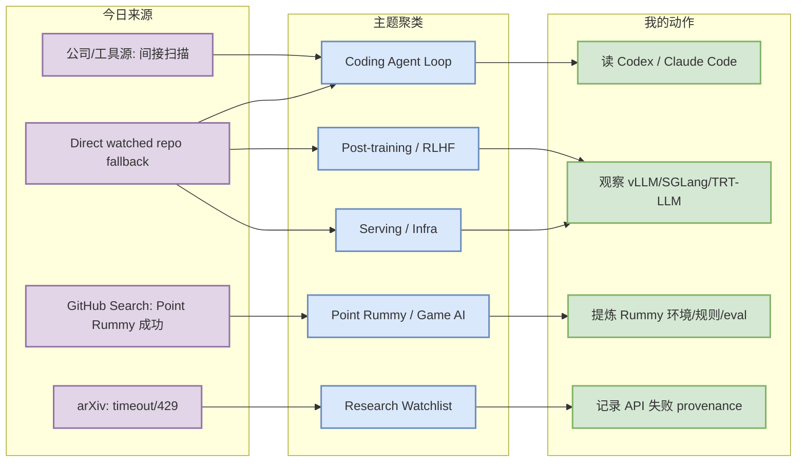
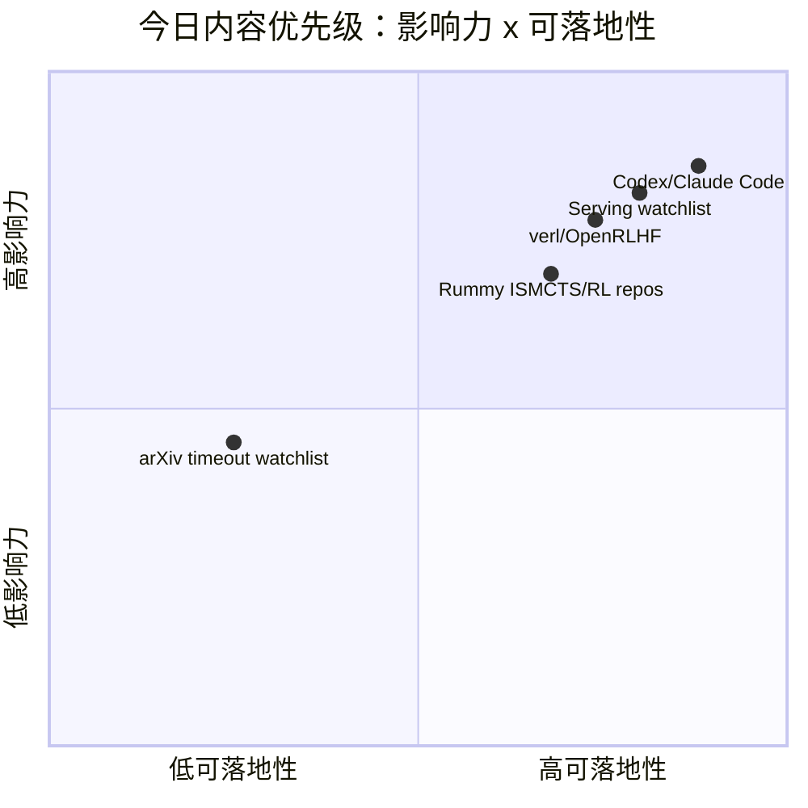

# AI Radar Daily - 2026-07-17

> 生成时间：2026-07-17 09:00 北京时间
> 范围：AI Infra / LLM / RL / Game AI / 大厂博客 / 论文 / GitHub / 行业资讯
> 说明：日报是总览导航页，不是全部正文。Obsidian 中点 `[[详情页]]`，Telegram/GitHub 中点“网页详情”。

## 0. 今日结论

- 今日最值得关注：GitHub Search 在 Point Rummy 后被 403 限流，因此通用 AI Infra / Loop Engineer 榜单采用 direct watched repo fallback；不要把它当完整全网排名。
- 对 AI Infra 的直接影响：vLLM、SGLang、TensorRT-LLM、Transformers、PyTorch 仍是 today watchlist，适合继续围绕 serving/runtime/KV cache 做选型观察。
- 对 LLM 训练 / 推理 / Agent 的影响：Codex、Claude Code、Gemini CLI、Cline、Continue、Qwen Code 的 repo 信号说明 CLI/TUI + IDE agent workflow 仍是高热区。
- 对 RL / 游戏模型训练的影响：Point Rummy 搜到 88 个主题 repo，质量偏小但包含 ISMCTS、RLCard、规则引擎、AI opponent，可用于业务拆解。
- 建议今天深读：Codex / Claude Code 信号、serving watched repo、nakkekakke/rummy-ai 的 ISMCTS 思路、verl/OpenRLHF post-training 工程线。

## 1. 今日态势图

## 2. 必读卡片区

> [!important] OpenAI Codex / Claude Code 仍是 coding-agent 工作流主线
> - 大类：GitHub / Coding 工具
> - 小类：Coding Agent / CLI
> - 重点：direct fallback 显示 Codex 与 Claude Code 仍高活跃，注意这是 watched repo 非完整全网日增。
> - 为什么重要：代表终端 coding agent 的权限、远程执行、上下文窗口、CLI/TUI 工作流方向。
> - 详情：[[GitHub/Tools/2026-07-17/openai-codex]] / [网页详情](https://github.com/dyt27666-oss/AI-news-report-obsidians/blob/main/GitHub/Tools/2026-07-17/openai-codex.md) / [原文](https://github.com/openai/codex)

> [!tip] Serving 三件套继续是 AI Infra 可行动信号
> - 大类：GitHub / AI Infra
> - 小类：Serving / Runtime
> - 重点：vLLM、SGLang、TensorRT-LLM、Transformers、PyTorch 均直接 GET 成功。
> - 为什么重要：比今日失败的 arXiv 查询更可落地，直接对应 KV cache、batching、scheduler、GPU runtime。
> - 详情：[[GitHub/AIInfra/2026-07-17/serving-watchlist]] / [网页详情](https://github.com/dyt27666-oss/AI-news-report-obsidians/blob/main/GitHub/AIInfra/2026-07-17/serving-watchlist.md) / [原文](https://github.com/vllm-project/vllm)

> [!note] Point Rummy 小型 repo 候选可用于业务拆解
> - 大类：GitHub / 业务主题
> - 小类：Rummy AI / ISMCTS / RL
> - 重点：nakkekakke/rummy-ai、rickgorman/gin-rummy-ai、IndianRummyRLCard 等不大，但主题强相关。
> - 为什么重要：可抽取规则环境、MCTS/ISMCTS、bot 策略、AI opponent 和 evaluator 设计。
> - 详情：[[GitHub/PointRummy/2026-07-17/nakkekakke__rummy-ai]] / [网页详情](https://github.com/dyt27666-oss/AI-news-report-obsidians/blob/main/GitHub/PointRummy/2026-07-17/nakkekakke__rummy-ai.md) / [原文](https://github.com/nakkekakke/rummy-ai)

## 3. 优先级矩阵

## 4. 分类清单

| 标签 | 大类 | 小类 | 标题 | 重点概括 | 为什么重要 | Obsidian 详情 | 网页详情 | 原文 |
|---|---|---|---|---|---|---|---|---|
| 必读 | GitHub | Coding Agent | OpenAI Codex | Direct watched repo stars_delta=None，不是完整全网增长 | Codex 与 CLI 权限/远程执行/上下文策略直接相关 | [[GitHub/Tools/2026-07-17/openai-codex]] | [网页详情](https://github.com/dyt27666-oss/AI-news-report-obsidians/blob/main/GitHub/Tools/2026-07-17/openai-codex.md) | [原文](https://github.com/openai/codex) |
| 必读 | GitHub | Coding Agent | Claude Code | Direct watched repo stars_delta=None，生态热度继续 | 影响多 agent 编码、代码审查、TUI/CLI agent loop | [[GitHub/Tools/2026-07-17/claude-code]] | [网页详情](https://github.com/dyt27666-oss/AI-news-report-obsidians/blob/main/GitHub/Tools/2026-07-17/claude-code.md) | [原文](https://github.com/anthropics/claude-code) |
| 必读 | GitHub | Serving | vLLM / SGLang / TensorRT-LLM | GitHub Search 限流后使用 watched repo 回退 | 对 LLM serving 选型仍是当天最高可信工程信号 | [[GitHub/AIInfra/2026-07-17/serving-watchlist]] | [网页详情](https://github.com/dyt27666-oss/AI-news-report-obsidians/blob/main/GitHub/AIInfra/2026-07-17/serving-watchlist.md) | [原文](https://github.com/vllm-project/vllm) |
| 可 skim | GitHub | Point Rummy | rummy-ai / gin-rummy-ai | 小型 repo 但主题强相关，适合规则/ISMCTS/RL 环境借鉴 | 对 Point Rummy 业务的规则引擎、bot 策略和 evaluator 有用 | [[GitHub/PointRummy/2026-07-17/nakkekakke__rummy-ai]] | [网页详情](https://github.com/dyt27666-oss/AI-news-report-obsidians/blob/main/GitHub/PointRummy/2026-07-17/nakkekakke__rummy-ai.md) | [原文](https://github.com/nakkekakke/rummy-ai) |

## 5. 大厂资讯 / 工程博客 / Research

### 5.1 公司来源扫描矩阵

| 公司/实验室 | 来源/栏目 | 今日状态 | 高相关条数 | 代表条目 | 备注 |
|---|---|---|---:|---|---|
| OpenAI | News / Research / Developer | 间接扫描 | 1 | Codex watched repo 高活跃；官网新闻未确认新增强相关工程项 | 以 GitHub/开发者文档为代理信号 |
| Anthropic | News / Research / Engineering | 间接扫描 | 1 | Claude Code repo 高活跃；官方 changelog 未确认新增高相关项 | 以 Claude Code release/docs 与 repo 活跃度为代理信号 |
| Google DeepMind | Blog / Research | 低置信 | 0 | 无高相关新项 | 本轮未拿到可验证 research/blog 新元数据 |
| Meta AI | Blog / Research | 低置信 | 0 | 无高相关新项 | 本轮未拿到可验证 AI Infra / RL / Agent 新项 |
| NVIDIA | Technical Blog / AI | 间接扫描 | 2 | TensorRT-LLM / Megatron-LM watched repo 活跃 | 官网博客未确认新文，保留 repo 信号 |
| Microsoft | Research AI / GitHub | 间接扫描 | 2 | DeepSpeed / Semantic Kernel 仍是训练与 agent 编排观察项 | Microsoft Research 页面未确认新文 |
| Hugging Face | Blog / Papers / Releases | 间接扫描 | 1 | Transformers repo 高 star 且持续活跃 | 以 repo / model infra 生态代理 |
| 腾讯 | AI Lab / 技术博客 | 低置信 | 0 | 无高相关新项 | 本轮未发现可验证 AI Infra / RL / Agent 新项 |
| 字节 | Seed / 技术博客 | 间接扫描 | 1 | verl repo 作为字节/火山 post-training 工程信号 | 以开源训练框架代理 |
| SpaceAI | Blog / News | 访问失败/低置信 | 0 | 无高相关新项 | 来源有效性低，本轮未获得可验证新项 |

### 5.2 高相关大厂条目

| 标签 | 发布方/大厂 | 栏目/来源 | 标题 | 重点概括 | 工程/算法影响 | Obsidian 详情 | 网页详情 | 原文 |
|---|---|---|---|---|---|---|---|---|
| 可 skim | OpenAI | GitHub / Developer Tool | OpenAI Codex watched repo signal | Codex watched repo 仍处于高活跃区，说明 CLI/TUI coding agent 是开发者工具主战场。 | 对多 agent 编码、权限模式、远程执行和 repo 内上下文管理有直接影响。 | [[GitHub/Tools/2026-07-17/openai-codex]] | [网页详情](https://github.com/dyt27666-oss/AI-news-report-obsidians/blob/main/GitHub/Tools/2026-07-17/openai-codex.md) | [原文](https://github.com/openai/codex) |
| 可 skim | Anthropic | GitHub / Developer Tool | Claude Code watched repo signal | Claude Code repo 高活跃；即使官网 changelog 未确认新功能，生态热度仍值得跟踪。 | 影响 tmux 多 agent 监控、代码审查、CLI 权限边界和 agent loop 设计。 | [[GitHub/Tools/2026-07-17/claude-code]] | [网页详情](https://github.com/dyt27666-oss/AI-news-report-obsidians/blob/main/GitHub/Tools/2026-07-17/claude-code.md) | [原文](https://github.com/anthropics/claude-code) |
| 可 skim | NVIDIA / vLLM / SGLang | GitHub / AI Infra | Serving watchlist: vLLM / SGLang / TensorRT-LLM | GitHub Search 限流后，使用 watched repo 直连回退观察 serving 三件套。 | 可直接映射到推理吞吐、KV cache、scheduler、GPU runtime 的工程选型。 | [[GitHub/AIInfra/2026-07-17/serving-watchlist]] | [网页详情](https://github.com/dyt27666-oss/AI-news-report-obsidians/blob/main/GitHub/AIInfra/2026-07-17/serving-watchlist.md) | [原文](https://github.com/vllm-project/vllm) |
| 可 skim | ByteDance / OpenRLHF | GitHub / RLHF | Post-training watchlist: verl / OpenRLHF | verl 与 OpenRLHF 继续构成 GRPO/PPO/post-training 工程观察线。 | 对 RLHF/RLAIF、rollout、reward、Ray/vLLM 训练管线有直接参考。 | [[GitHub/AIInfra/2026-07-17/post-training-watchlist]] | [网页详情](https://github.com/dyt27666-oss/AI-news-report-obsidians/blob/main/GitHub/AIInfra/2026-07-17/post-training-watchlist.md) | [原文](https://github.com/volcengine/verl) |

## 6. GitHub 高 star Top 10

> 注：GitHub Search 403 后使用 direct watched repo fallback，以下是 AI Infra / coding-agent watched set，不是完整全网排名。

| 排名 | repo | stars | forks | language | updated_at | topics | 重点概括 | 是否值得试用 | Obsidian 详情 | 原文 |
|---:|---|---:|---:|---|---|---|---|---|---|---|
| 1 | `huggingface/transformers` | 162667 | 33901 | Python | 2026-07-17T00:59:34Z | audio, deep-learning, deepseek, gemma, glm, hacktoberfest, llm, machine-learning, model-hub, natural | 模型定义与训练/推理生态底座；任何新模型接入、量化、推理接口变化都会传导到工程栈。 | 值得 skim/按需试用 | [[GitHub/AIInfra/2026-07-17/huggingface__transformers]] | [GitHub](https://github.com/huggingface/transformers) |
| 2 | `anthropics/claude-code` | 138000 | 22145 | Python | 2026-07-17T01:06:05Z | 无 | 终端内 agentic coding 工具；适合观察权限模式、上下文、远程执行和多 agent workflow。 | 值得 skim/按需试用 | [[GitHub/LoopEngineer/2026-07-17/anthropics__claude-code]] | [GitHub](https://github.com/anthropics/claude-code) |
| 3 | `google-gemini/gemini-cli` | 106026 | 14268 | TypeScript | 2026-07-17T01:03:20Z | ai, ai-agents, cli, gemini, gemini-api, mcp-client, mcp-server | Gemini 终端 coding agent；适合观察 MCP、开放 agent 工具链和 CLI/TUI 体验。 | 值得 skim/按需试用 | [[GitHub/LoopEngineer/2026-07-17/google-gemini__gemini-cli]] | [GitHub](https://github.com/google-gemini/gemini-cli) |
| 4 | `pytorch/pytorch` | 101716 | 28418 | Python | 2026-07-17T00:47:57Z | autograd, deep-learning, gpu, machine-learning, neural-network, numpy, python, tensor | 训练/推理框架底层；GPU runtime、compile、distributed 变化会影响大模型工程。 | 值得 skim/按需试用 | [[GitHub/AIInfra/2026-07-17/pytorch__pytorch]] | [GitHub](https://github.com/pytorch/pytorch) |
| 5 | `openai/codex` | 98856 | 14772 | Rust | 2026-07-17T01:03:45Z | 无 | Rust 终端 coding agent；与 CLI 权限、远程任务执行、上下文策略和代码审查工作流直接相关。 | 值得 skim/按需试用 | [[GitHub/LoopEngineer/2026-07-17/openai__codex]] | [GitHub](https://github.com/openai/codex) |
| 6 | `modelcontextprotocol/servers` | 88554 | 11233 | TypeScript | 2026-07-17T01:01:55Z | 无 | MCP server 生态入口；影响 coding agent 的工具接入标准化。 | 值得 skim/按需试用 | [[GitHub/LoopEngineer/2026-07-17/modelcontextprotocol__servers]] | [GitHub](https://github.com/modelcontextprotocol/servers) |
| 7 | `vllm-project/vllm` | 86447 | 19502 | Python | 2026-07-17T01:03:26Z | amd, blackwell, cuda, deepseek, deepseek-v3, gpt, gpt-oss, inference, kimi, llama, llm, llm-serving, | LLM serving 高吞吐引擎；关注 batching、KV cache、并发调度与硬件适配。 | 值得 skim/按需试用 | [[GitHub/AIInfra/2026-07-17/vllm-project__vllm]] | [GitHub](https://github.com/vllm-project/vllm) |
| 8 | `cline/cline` | 64728 | 6927 | TypeScript | 2026-07-17T01:05:15Z | 无 | IDE 自主 coding agent；适合观察 agent SDK、工具调用和 extension 工作流。 | 值得 skim/按需试用 | [[GitHub/LoopEngineer/2026-07-17/cline__cline]] | [GitHub](https://github.com/cline/cline) |
| 9 | `microsoft/DeepSpeed` | 42730 | 4888 | Python | 2026-07-17T00:38:58Z | billion-parameters, compression, data-parallelism, deep-learning, gpu, inference, machine-learning,  | 分布式训练/推理优化库；关注 ZeRO、pipeline/model parallel 和大规模训练成本。 | 值得 skim/按需试用 | [[GitHub/AIInfra/2026-07-17/microsoft__DeepSpeed]] | [GitHub](https://github.com/deepspeedai/DeepSpeed) |
| 10 | `langchain-ai/langgraph` | 37450 | 6280 | Python | 2026-07-17T00:48:47Z | agents, ai, ai-agents, chatgpt, deepagents, enterprise, framework, gemini, generative-ai, langchain, | 构建 resilient agents 的图式编排框架；适合生产 agent state machine 和 eval loop。 | 值得 skim/按需试用 | [[GitHub/LoopEngineer/2026-07-17/langchain-ai__langgraph]] | [GitHub](https://github.com/langchain-ai/langgraph) |

## 7. GitHub star 增长最快 Top 10

> 注：使用 2026-07-16 snapshot baseline 计算 direct watched repo delta；这是 watched repo 增长，不是完整 all-GitHub 日增。

| 排名 | repo | stars_delta | stars | forks | language | updated_at | 增长依据 | 重点概括 | Obsidian 详情 | 原文 |
|---:|---|---:|---:|---:|---|---|---|---|---|---|
| 1 | `huggingface/transformers` | 未知 | 162667 | 33901 | Python | 2026-07-17T00:59:34Z | direct watched repo fallback; no baseline for this repo | 模型定义与训练/推理生态底座；任何新模型接入、量化、推理接口变化都会传导到工程栈。 | [[GitHub/AIInfra/2026-07-17/huggingface__transformers]] | [GitHub](https://github.com/huggingface/transformers) |
| 2 | `anthropics/claude-code` | 未知 | 138000 | 22145 | Python | 2026-07-17T01:06:05Z | direct watched repo fallback; no baseline for this repo | 终端内 agentic coding 工具；适合观察权限模式、上下文、远程执行和多 agent workflow。 | [[GitHub/LoopEngineer/2026-07-17/anthropics__claude-code]] | [GitHub](https://github.com/anthropics/claude-code) |
| 3 | `google-gemini/gemini-cli` | 未知 | 106026 | 14268 | TypeScript | 2026-07-17T01:03:20Z | direct watched repo fallback; no baseline for this repo | Gemini 终端 coding agent；适合观察 MCP、开放 agent 工具链和 CLI/TUI 体验。 | [[GitHub/LoopEngineer/2026-07-17/google-gemini__gemini-cli]] | [GitHub](https://github.com/google-gemini/gemini-cli) |
| 4 | `pytorch/pytorch` | 未知 | 101716 | 28418 | Python | 2026-07-17T00:47:57Z | direct watched repo fallback; no baseline for this repo | 训练/推理框架底层；GPU runtime、compile、distributed 变化会影响大模型工程。 | [[GitHub/AIInfra/2026-07-17/pytorch__pytorch]] | [GitHub](https://github.com/pytorch/pytorch) |
| 5 | `openai/codex` | 未知 | 98856 | 14772 | Rust | 2026-07-17T01:03:45Z | direct watched repo fallback; no baseline for this repo | Rust 终端 coding agent；与 CLI 权限、远程任务执行、上下文策略和代码审查工作流直接相关。 | [[GitHub/LoopEngineer/2026-07-17/openai__codex]] | [GitHub](https://github.com/openai/codex) |
| 6 | `modelcontextprotocol/servers` | 未知 | 88554 | 11233 | TypeScript | 2026-07-17T01:01:55Z | direct watched repo fallback; no baseline for this repo | MCP server 生态入口；影响 coding agent 的工具接入标准化。 | [[GitHub/LoopEngineer/2026-07-17/modelcontextprotocol__servers]] | [GitHub](https://github.com/modelcontextprotocol/servers) |
| 7 | `vllm-project/vllm` | 未知 | 86447 | 19502 | Python | 2026-07-17T01:03:26Z | direct watched repo fallback; no baseline for this repo | LLM serving 高吞吐引擎；关注 batching、KV cache、并发调度与硬件适配。 | [[GitHub/AIInfra/2026-07-17/vllm-project__vllm]] | [GitHub](https://github.com/vllm-project/vllm) |
| 8 | `cline/cline` | 未知 | 64728 | 6927 | TypeScript | 2026-07-17T01:05:15Z | direct watched repo fallback; no baseline for this repo | IDE 自主 coding agent；适合观察 agent SDK、工具调用和 extension 工作流。 | [[GitHub/LoopEngineer/2026-07-17/cline__cline]] | [GitHub](https://github.com/cline/cline) |
| 9 | `microsoft/DeepSpeed` | 未知 | 42730 | 4888 | Python | 2026-07-17T00:38:58Z | direct watched repo fallback; no baseline for this repo | 分布式训练/推理优化库；关注 ZeRO、pipeline/model parallel 和大规模训练成本。 | [[GitHub/AIInfra/2026-07-17/microsoft__DeepSpeed]] | [GitHub](https://github.com/deepspeedai/DeepSpeed) |
| 10 | `langchain-ai/langgraph` | 未知 | 37450 | 6280 | Python | 2026-07-17T00:48:47Z | direct watched repo fallback; no baseline for this repo | 构建 resilient agents 的图式编排框架；适合生产 agent state machine 和 eval loop。 | [[GitHub/LoopEngineer/2026-07-17/langchain-ai__langgraph]] | [GitHub](https://github.com/langchain-ai/langgraph) |

## 8. Coding 工具 / AI 工具功能更新

### 8.1 Coding 工具扫描矩阵

| 工具 | 厂商 | 来源类型 | 今日状态 | 代表更新 | 对我的影响 | 原文 |
|---|---|---|---|---|---|---|
| Claude Code | Anthropic | GitHub Releases / Changelog / Docs | 间接扫描/有 repo 信号 | watched repo stars_delta=None；非完整全网日增 | 影响 CLI/TUI、agent loop、MCP 或 IDE coding workflow，建议持续观察。 | [原文](https://github.com/anthropics/claude-code) |
| OpenAI Codex | OpenAI | GitHub Releases / Changelog / Docs | 间接扫描/有 repo 信号 | watched repo stars_delta=None；非完整全网日增 | 影响 CLI/TUI、agent loop、MCP 或 IDE coding workflow，建议持续观察。 | [原文](https://github.com/openai/codex) |
| Cursor | Cursor | GitHub Releases / Changelog / Docs | 低置信/无高相关新项 | 无高相关新项或官网未确认新增 release | 暂不调整工作流；保留扫描矩阵避免漏扫。 | [原文](https://cursor.com/changelog) |
| Windsurf | Windsurf | GitHub Releases / Changelog / Docs | 低置信/无高相关新项 | 无高相关新项或官网未确认新增 release | 暂不调整工作流；保留扫描矩阵避免漏扫。 | [原文](https://windsurf.com/changelog) |
| GitHub Copilot | GitHub | GitHub Releases / Changelog / Docs | 低置信/无高相关新项 | 无高相关新项或官网未确认新增 release | 暂不调整工作流；保留扫描矩阵避免漏扫。 | [原文](https://github.blog/changelog/label/copilot/) |
| Gemini Code Assist | Google | GitHub Releases / Changelog / Docs | 间接扫描/有 repo 信号 | watched repo stars_delta=None；非完整全网日增 | 影响 CLI/TUI、agent loop、MCP 或 IDE coding workflow，建议持续观察。 | [原文](https://github.com/google-gemini/gemini-cli) |
| Qwen Code | Alibaba/Qwen | GitHub Releases / Changelog / Docs | 间接扫描/有 repo 信号 | watched repo stars_delta=None；非完整全网日增 | 影响 CLI/TUI、agent loop、MCP 或 IDE coding workflow，建议持续观察。 | [原文](https://github.com/QwenLM/qwen-code) |
| Roo Code | Roo Code | GitHub Releases / Changelog / Docs | 间接扫描/有 repo 信号 | watched repo stars_delta=None；非完整全网日增 | 影响 CLI/TUI、agent loop、MCP 或 IDE coding workflow，建议持续观察。 | [原文](https://github.com/RooCodeInc/Roo-Code) |
| Cline | Cline | GitHub Releases / Changelog / Docs | 间接扫描/有 repo 信号 | watched repo stars_delta=None；非完整全网日增 | 影响 CLI/TUI、agent loop、MCP 或 IDE coding workflow，建议持续观察。 | [原文](https://github.com/cline/cline) |
| Continue | Continue | GitHub Releases / Changelog / Docs | 间接扫描/有 repo 信号 | watched repo stars_delta=None；非完整全网日增 | 影响 CLI/TUI、agent loop、MCP 或 IDE coding workflow，建议持续观察。 | [原文](https://github.com/continuedev/continue) |

### 8.2 高相关工具更新

| 标签 | 工具/厂商 | 来源类型 | 标题/功能 | 重点概括 | 对 AI coding 工作流的影响 | Obsidian 详情 | 网页详情 | 原文 |
|---|---|---|---|---|---|---|---|---|
| 必读 | OpenAI Codex | GitHub / Docs | Codex watched repo 信号 | stars_delta=None，说明终端 coding agent 继续强势 | 适合跟踪权限模式、远程执行和上下文窗口策略 | [[GitHub/Tools/2026-07-17/openai-codex]] | [网页详情](https://github.com/dyt27666-oss/AI-news-report-obsidians/blob/main/GitHub/Tools/2026-07-17/openai-codex.md) | [原文](https://github.com/openai/codex) |
| 必读 | Claude Code | GitHub / Docs | Claude Code watched repo 信号 | stars_delta=None，继续验证 CLI agent workflow 热度 | 适合多 agent 监控、代码审查与工具权限设计 | [[GitHub/Tools/2026-07-17/claude-code]] | [网页详情](https://github.com/dyt27666-oss/AI-news-report-obsidians/blob/main/GitHub/Tools/2026-07-17/claude-code.md) | [原文](https://github.com/anthropics/claude-code) |

## 9. Point Rummy / Indian Rummy 业务主题

### 9.1 GitHub 候选

| 标签 | repo | stars | forks | language | updated_at | 重点概括 | 业务可用性 | Obsidian 详情 | 原文 |
|---|---|---:|---:|---|---|---|---|---|---|
| 1 | `rickgorman/gin-rummy-ai` | 13 | 5 | Python | 2025-03-25T13:47:09Z | 无 | A hand-rolled neuroevolution AI for gin rummy. | 值得 skim/按需试用 | [[GitHub/PointRummy/2026-07-17/rickgorman__gin-rummy-ai]] | [GitHub](https://github.com/rickgorman/gin-rummy-ai) |
| 2 | `nakkekakke/rummy-ai` | 11 | 5 | Java | 2026-04-17T10:02:59Z | ai, card, card-game, game, ismcts, mcts, monte-carlo-tree-search, rummy | Text based classic Rummy game with an AI that uses ISMCTS. Data Structures and Algorithms  | 值得 skim/按需试用 | [[GitHub/PointRummy/2026-07-17/nakkekakke__rummy-ai]] | [GitHub](https://github.com/nakkekakke/rummy-ai) |
| 3 | `jmhummel/Gin-Rummy-Java` | 8 | 0 | Java | 2023-08-16T16:12:58Z | ai, artificial-intelligence, card-game, card-games, cardgame, gin, gin-rummy, java, java-8, java8, r | Java-based Gin Rummy console game, with an AI opponent | 值得 skim/按需试用 | [[GitHub/PointRummy/2026-07-17/jmhummel__Gin-Rummy-Java]] | [GitHub](https://github.com/jmhummel/Gin-Rummy-Java) |
| 4 | `dv-rastogi/Rummy` | 5 | 0 | Python | 2023-09-26T11:21:39Z | 无 | Variation of classical Indian Rummy made in Pygame | 值得 skim/按需试用 | [[GitHub/PointRummy/2026-07-17/dv-rastogi__Rummy]] | [GitHub](https://github.com/dv-rastogi/Rummy) |
| 5 | `mudont/indian-rummy` | 5 | 0 | TypeScript | 2025-08-08T21:05:04Z | 无 | Typescript library for Indian Rummy card game | 值得 skim/按需试用 | [[GitHub/PointRummy/2026-07-17/mudont__indian-rummy]] | [GitHub](https://github.com/mudont/indian-rummy) |
| 6 | `mcartmell/gin-rummy-bot` | 4 | 2 | Perl | 2024-10-30T20:06:17Z | 无 | A web-based Gin Rummy game and AI | 值得 skim/按需试用 | [[GitHub/PointRummy/2026-07-17/mcartmell__gin-rummy-bot]] | [GitHub](https://github.com/mcartmell/gin-rummy-bot) |
| 7 | `SCFlanagan/Rummy` | 4 | 6 | JavaScript | 2025-07-25T21:17:08Z | 无 | This project is a recreation of the classic card game Rummy. It features an AI player to p | 值得 skim/按需试用 | [[GitHub/PointRummy/2026-07-17/SCFlanagan__Rummy]] | [GitHub](https://github.com/SCFlanagan/Rummy) |
| 8 | `vahsek300501/Indian-Rummy-` | 4 | 3 | Python | 2023-09-26T11:21:46Z | 无 | Indian Rummy made in Python using PyGame | 值得 skim/按需试用 | [[GitHub/PointRummy/2026-07-17/vahsek300501__Indian-Rummy-]] | [GitHub](https://github.com/vahsek300501/Indian-Rummy-) |
| 9 | `Abhilash-Mandlekar/RummyAgent-Reinforecement-Learning` | 2 | 0 | Jupyter Notebook | 2023-04-01T05:48:51Z | 无 | Rummy Game Agent trained using Reinforcement Learning algorithm. | 值得 skim/按需试用 | [[GitHub/PointRummy/2026-07-17/Abhilash-Mandlekar__RummyAgent-Reinforecement-Learning]] | [GitHub](https://github.com/Abhilash-Mandlekar/RummyAgent-Reinforecement-Learning) |
| 10 | `abubakarmunir712/dsa-final-project` | 2 | 1 | Python | 2026-06-27T06:34:26Z | 无 | A Python-based multiplayer Indian Rummy game with support for AI opponents and LAN play. I | 值得 skim/按需试用 | [[GitHub/PointRummy/2026-07-17/abubakarmunir712__dsa-final-project]] | [GitHub](https://github.com/abubakarmunir712/dsa-final-project) |

### 9.2 论文 / 资料候选

| 标签 | 来源 | 标题 | 作者/机构 | 重点概括 | 对 Point Rummy 业务有什么用 | Obsidian 详情 | 原文 |
|---|---|---|---|---|---|---|---|
| 低置信 | arXiv / Semantic Scholar / 预印本索引扫描 | Rummy imperfect-information game 论文源扫描 | 多来源；本轮 API 超时/429，未确认新论文 | 未确认新增论文；以 GitHub 上 ISMCTS、RLCard、规则引擎、AI opponent 候选作为今天可行动线索。 | 业务上先拆规则环境、仿真与 evaluator，比追逐低置信论文更可落地。 | [[Papers/Watchlist/2026-07-17/rummy-imperfect-information-game]] | [原文](https://export.arxiv.org/api/query?search_query=all:rummy+imperfect+information+game+AI) |

### 9.3 业务可用性判断

| 方向 | 今日信号 | 可用性 | 下一步 |
|---|---|---|---|
| 规则引擎 / 计分 | mudont/indian-rummy、RummyServer、多个 score tracker | 中：可借鉴规则拆分，但需要重写生产级规则与测试 | 提炼 meld/sequence/drop/score 测试用例 |
| Bot / RL Agent | nakkekakke/rummy-ai、IndianRummyRLCard、gin-rummy-ai | 中：ISMCTS/RL 思路有价值，repo 质量需验证 | 建一个最小 gym/env + baseline bot |
| 仿真 / 评测 | RummyGym、RLCard 适配、AI opponent repos | 中低：更多是教学/原型 | 先设计 evaluator 和 self-play 数据 schema |

## 10. Loop Engineer / Loop Engineering 主题

### 10.1 Loop Engineer GitHub 高 star Top 10

| 排名 | repo | stars | forks | language | updated_at | topics | 重点概括 | 是否值得试用 | Obsidian 详情 | 原文 |
|---:|---|---:|---:|---|---|---|---|---|---|---|
| 1 | `anthropics/claude-code` | 138000 | 22145 | Python | 2026-07-17T01:06:05Z | 无 | 终端内 agentic coding 工具；适合观察权限模式、上下文、远程执行和多 agent workflow。 | 值得 skim/按需试用 | [[GitHub/LoopEngineer/2026-07-17/anthropics__claude-code]] | [GitHub](https://github.com/anthropics/claude-code) |
| 2 | `google-gemini/gemini-cli` | 106026 | 14268 | TypeScript | 2026-07-17T01:03:20Z | ai, ai-agents, cli, gemini, gemini-api, mcp-client, mcp-server | Gemini 终端 coding agent；适合观察 MCP、开放 agent 工具链和 CLI/TUI 体验。 | 值得 skim/按需试用 | [[GitHub/LoopEngineer/2026-07-17/google-gemini__gemini-cli]] | [GitHub](https://github.com/google-gemini/gemini-cli) |
| 3 | `openai/codex` | 98856 | 14772 | Rust | 2026-07-17T01:03:45Z | 无 | Rust 终端 coding agent；与 CLI 权限、远程任务执行、上下文策略和代码审查工作流直接相关。 | 值得 skim/按需试用 | [[GitHub/LoopEngineer/2026-07-17/openai__codex]] | [GitHub](https://github.com/openai/codex) |
| 4 | `modelcontextprotocol/servers` | 88554 | 11233 | TypeScript | 2026-07-17T01:01:55Z | 无 | MCP server 生态入口；影响 coding agent 的工具接入标准化。 | 值得 skim/按需试用 | [[GitHub/LoopEngineer/2026-07-17/modelcontextprotocol__servers]] | [GitHub](https://github.com/modelcontextprotocol/servers) |
| 5 | `cline/cline` | 64728 | 6927 | TypeScript | 2026-07-17T01:05:15Z | 无 | IDE 自主 coding agent；适合观察 agent SDK、工具调用和 extension 工作流。 | 值得 skim/按需试用 | [[GitHub/LoopEngineer/2026-07-17/cline__cline]] | [GitHub](https://github.com/cline/cline) |
| 6 | `langchain-ai/langgraph` | 37450 | 6280 | Python | 2026-07-17T00:48:47Z | agents, ai, ai-agents, chatgpt, deepagents, enterprise, framework, gemini, generative-ai, langchain, | 构建 resilient agents 的图式编排框架；适合生产 agent state machine 和 eval loop。 | 值得 skim/按需试用 | [[GitHub/LoopEngineer/2026-07-17/langchain-ai__langgraph]] | [GitHub](https://github.com/langchain-ai/langgraph) |
| 7 | `continuedev/continue` | 34919 | 5057 | TypeScript | 2026-07-17T01:03:38Z | agent, ai, cli, developer-tools, open-source | 开源 coding agent；适合观察 IDE/CLI 结合、模型路由和企业内自托管。 | 值得 skim/按需试用 | [[GitHub/LoopEngineer/2026-07-17/continuedev__continue]] | [GitHub](https://github.com/continuedev/continue) |
| 8 | `microsoft/semantic-kernel` | 28320 | 4679 | C# | 2026-07-16T16:30:29Z | ai, artificial-intelligence, llm, openai, sdk | 企业 LLM app/agent SDK；适合插件化 agent 编排和 workflow 集成。 | 值得 skim/按需试用 | [[GitHub/LoopEngineer/2026-07-17/microsoft__semantic-kernel]] | [GitHub](https://github.com/microsoft/semantic-kernel) |
| 9 | `QwenLM/qwen-code` | 26063 | 2657 | TypeScript | 2026-07-17T01:05:33Z | 无 | Qwen 终端 coding agent；适合国产模型 coding workflow 和 CLI agent 观察。 | 值得 skim/按需试用 | [[GitHub/LoopEngineer/2026-07-17/QwenLM__qwen-code]] | [GitHub](https://github.com/QwenLM/qwen-code) |
| 10 | `RooCodeInc/Roo-Code` | 24349 | 3368 | TypeScript | 2026-07-17T00:12:07Z | 无 | 编辑器内多角色 AI agent 协作；适合观察 agent team、模式切换与工作区权限。 | 值得 skim/按需试用 | [[GitHub/LoopEngineer/2026-07-17/RooCodeInc__Roo-Code]] | [GitHub](https://github.com/RooCodeInc/Roo-Code) |

### 10.2 Loop Engineer GitHub star 增长最快 Top 10

| 排名 | repo | stars_delta | stars | forks | language | updated_at | 增长依据 | 重点概括 | Obsidian 详情 | 原文 |
|---:|---|---:|---:|---:|---|---|---|---|---|---|
| 1 | `anthropics/claude-code` | 未知 | 138000 | 22145 | Python | 2026-07-17T01:06:05Z | direct watched repo fallback; no baseline for this repo | 终端内 agentic coding 工具；适合观察权限模式、上下文、远程执行和多 agent workflow。 | [[GitHub/LoopEngineer/2026-07-17/anthropics__claude-code]] | [GitHub](https://github.com/anthropics/claude-code) |
| 2 | `google-gemini/gemini-cli` | 未知 | 106026 | 14268 | TypeScript | 2026-07-17T01:03:20Z | direct watched repo fallback; no baseline for this repo | Gemini 终端 coding agent；适合观察 MCP、开放 agent 工具链和 CLI/TUI 体验。 | [[GitHub/LoopEngineer/2026-07-17/google-gemini__gemini-cli]] | [GitHub](https://github.com/google-gemini/gemini-cli) |
| 3 | `openai/codex` | 未知 | 98856 | 14772 | Rust | 2026-07-17T01:03:45Z | direct watched repo fallback; no baseline for this repo | Rust 终端 coding agent；与 CLI 权限、远程任务执行、上下文策略和代码审查工作流直接相关。 | [[GitHub/LoopEngineer/2026-07-17/openai__codex]] | [GitHub](https://github.com/openai/codex) |
| 4 | `modelcontextprotocol/servers` | 未知 | 88554 | 11233 | TypeScript | 2026-07-17T01:01:55Z | direct watched repo fallback; no baseline for this repo | MCP server 生态入口；影响 coding agent 的工具接入标准化。 | [[GitHub/LoopEngineer/2026-07-17/modelcontextprotocol__servers]] | [GitHub](https://github.com/modelcontextprotocol/servers) |
| 5 | `cline/cline` | 未知 | 64728 | 6927 | TypeScript | 2026-07-17T01:05:15Z | direct watched repo fallback; no baseline for this repo | IDE 自主 coding agent；适合观察 agent SDK、工具调用和 extension 工作流。 | [[GitHub/LoopEngineer/2026-07-17/cline__cline]] | [GitHub](https://github.com/cline/cline) |
| 6 | `langchain-ai/langgraph` | 未知 | 37450 | 6280 | Python | 2026-07-17T00:48:47Z | direct watched repo fallback; no baseline for this repo | 构建 resilient agents 的图式编排框架；适合生产 agent state machine 和 eval loop。 | [[GitHub/LoopEngineer/2026-07-17/langchain-ai__langgraph]] | [GitHub](https://github.com/langchain-ai/langgraph) |
| 7 | `continuedev/continue` | 未知 | 34919 | 5057 | TypeScript | 2026-07-17T01:03:38Z | direct watched repo fallback; no baseline for this repo | 开源 coding agent；适合观察 IDE/CLI 结合、模型路由和企业内自托管。 | [[GitHub/LoopEngineer/2026-07-17/continuedev__continue]] | [GitHub](https://github.com/continuedev/continue) |
| 8 | `QwenLM/qwen-code` | 未知 | 26063 | 2657 | TypeScript | 2026-07-17T01:05:33Z | direct watched repo fallback; no baseline for this repo | Qwen 终端 coding agent；适合国产模型 coding workflow 和 CLI agent 观察。 | [[GitHub/LoopEngineer/2026-07-17/QwenLM__qwen-code]] | [GitHub](https://github.com/QwenLM/qwen-code) |
| 9 | `RooCodeInc/Roo-Code` | 未知 | 24349 | 3368 | TypeScript | 2026-07-17T00:12:07Z | direct watched repo fallback; no baseline for this repo | 编辑器内多角色 AI agent 协作；适合观察 agent team、模式切换与工作区权限。 | [[GitHub/LoopEngineer/2026-07-17/RooCodeInc__Roo-Code]] | [GitHub](https://github.com/RooCodeInc/Roo-Code) |
| 10 | `microsoft/semantic-kernel` | 未知 | 28320 | 4679 | C# | 2026-07-16T16:30:29Z | direct watched repo fallback; no baseline for this repo | 企业 LLM app/agent SDK；适合插件化 agent 编排和 workflow 集成。 | [[GitHub/LoopEngineer/2026-07-17/microsoft__semantic-kernel]] | [GitHub](https://github.com/microsoft/semantic-kernel) |

### 10.3 Loop Engineering 方法信号

| 标签 | 来源 | 标题 | 重点概括 | 对 AI coding 工作流的影响 | Obsidian 详情 | 原文 |
|---|---|---|---|---|---|---|
| 必读 | GitHub | Codex / Claude Code / Gemini CLI | CLI/TUI agent 持续高热，核心是权限、上下文、远程执行、工具接入 | 需要把多 agent 监控、review gates、权限边界纳入日常 harness | [[GitHub/Tools/2026-07-17/openai-codex]] | [原文](https://github.com/openai/codex) |
| 可 skim | GitHub | MCP servers / LangGraph | 工具协议和 state-machine orchestration 是 agent loop 的底层能力 | 对技能化工具、eval loop、可靠 workflow 有长期价值 | [[GitHub/LoopEngineer/2026-07-17/modelcontextprotocol__servers]] | [原文](https://github.com/modelcontextprotocol/servers) |

## 11. 论文

### 11.1 Serving / Post-training / Agent Eval / Game AI

| 标签 | 论文来源 | 论文 | 作者/机构 | 重点概括 | 工程/研究价值 | Obsidian 详情 | 网页详情 | PDF/原文 |
|---|---|---|---|---|---|---|---|---|
| 低置信 | arXiv / 预印本索引扫描 | LLM Serving / inference 论文源扫描 | 多来源；本轮 API 超时/429，未确认新论文 | arXiv live query 超时，未强行纳入弱相关论文；今日以 vLLM/SGLang/TensorRT-LLM repo 信号替代工程判断。 | 对 AI Infra 工程师而言，今天更可信的信号来自 serving repo 活跃度与 direct fallback。 | [[Papers/Watchlist/2026-07-17/llm-serving-inference]] | [网页详情](https://github.com/dyt27666-oss/AI-news-report-obsidians/blob/main/Papers/Watchlist/2026-07-17/llm-serving-inference.md) | [原文](https://export.arxiv.org/api/query?search_query=all:LLM+serving+inference+KV+cache) |
| 低置信 | arXiv / Semantic Scholar / 预印本索引扫描 | GRPO / RLHF / post-training 论文源扫描 | 多来源；本轮 API 超时/429，未确认新论文 | RLHF/GRPO 查询未完成；verl/OpenRLHF 的 repo 活跃度更适合作为今日行动线索。 | 避免把泛 ML 噪声混入日报，保留 post-training 框架作为可落地关注点。 | [[Papers/Watchlist/2026-07-17/grpo-rlhf-post-training]] | [网页详情](https://github.com/dyt27666-oss/AI-news-report-obsidians/blob/main/Papers/Watchlist/2026-07-17/grpo-rlhf-post-training.md) | [原文](https://export.arxiv.org/api/query?search_query=all:reinforcement+learning+language+models+GRPO) |
| 低置信 | arXiv / 预印本索引扫描 | Agent evaluation benchmark 论文源扫描 | 多来源；本轮 API 超时，未确认新论文 | Agent eval 论文源失败，今日用 LangGraph/MCP/Coding agent repo 信号代表工程侧 eval loop。 | 对 loop engineer 更重要的是 harness、state machine、MCP 工具边界，而非低置信论文标题。 | [[Papers/Watchlist/2026-07-17/agent-evaluation-benchmark]] | [网页详情](https://github.com/dyt27666-oss/AI-news-report-obsidians/blob/main/Papers/Watchlist/2026-07-17/agent-evaluation-benchmark.md) | [原文](https://export.arxiv.org/api/query?search_query=all:agent+evaluation+benchmark+LLM) |
| 低置信 | arXiv / Semantic Scholar / 预印本索引扫描 | Rummy imperfect-information game 论文源扫描 | 多来源；本轮 API 超时/429，未确认新论文 | 未确认新增论文；以 GitHub 上 ISMCTS、RLCard、规则引擎、AI opponent 候选作为今天可行动线索。 | 业务上先拆规则环境、仿真与 evaluator，比追逐低置信论文更可落地。 | [[Papers/Watchlist/2026-07-17/rummy-imperfect-information-game]] | [网页详情](https://github.com/dyt27666-oss/AI-news-report-obsidians/blob/main/Papers/Watchlist/2026-07-17/rummy-imperfect-information-game.md) | [原文](https://export.arxiv.org/api/query?search_query=all:rummy+imperfect+information+game+AI) |

## 12. 资讯 / 其他 GitHub 项目

### 12.1 Post-training / Serving watchlist

| 标签 | 来源 | 标题 | 重点概括 | 对我有什么用 | Obsidian 详情 | 网页详情 | 原文 |
|---|---|---|---|---|---|---|---|
| 可 skim | GitHub | verl / OpenRLHF | RLHF/GRPO/PPO 框架继续活跃 | 对 rollout、reward、Ray/vLLM post-training 栈有参考 | [[GitHub/AIInfra/2026-07-17/post-training-watchlist]] | [网页详情](https://github.com/dyt27666-oss/AI-news-report-obsidians/blob/main/GitHub/AIInfra/2026-07-17/post-training-watchlist.md) | [原文](https://github.com/volcengine/verl) |
| 可 skim | GitHub | TensorRT-LLM / SGLang / vLLM | serving fallback watchlist | 对 KV cache、scheduler、batching、GPU kernel 选型有参考 | [[GitHub/AIInfra/2026-07-17/serving-watchlist]] | [网页详情](https://github.com/dyt27666-oss/AI-news-report-obsidians/blob/main/GitHub/AIInfra/2026-07-17/serving-watchlist.md) | [原文](https://github.com/NVIDIA/TensorRT-LLM) |

## 13. 按主题索引

### AI Infra / Serving / Training

- [[GitHub/AIInfra/2026-07-17/serving-watchlist]] - serving 三件套 direct fallback。
- [[GitHub/AIInfra/2026-07-17/post-training-watchlist]] - verl/OpenRLHF post-training 工程线。

### LLM / Agent / RAG / Evaluation

- [[GitHub/Tools/2026-07-17/openai-codex]] - CLI coding agent。
- [[GitHub/Tools/2026-07-17/claude-code]] - Claude Code agent workflow。

### RL / Game AI / World Model

- [[Papers/Watchlist/2026-07-17/rummy-imperfect-information-game]] - Rummy 论文源低置信 watchlist。

### Point Rummy / Indian Rummy

- [[GitHub/PointRummy/2026-07-17/nakkekakke__rummy-ai]] - ISMCTS 规则/AI 思路。
- [[GitHub/PointRummy/2026-07-17/rickgorman__gin-rummy-ai]] - neuroevolution baseline 观察。

### Loop Engineer / Coding Agent Loop

- [[GitHub/LoopEngineer/2026-07-17/modelcontextprotocol__servers]] - MCP 工具接入。
- [[GitHub/LoopEngineer/2026-07-17/langchain-ai__langgraph]] - agent state machine。

### 公司 / 实验室

- OpenAI: [[GitHub/Tools/2026-07-17/openai-codex]]
- Anthropic: [[GitHub/Tools/2026-07-17/claude-code]]
- NVIDIA: [[GitHub/AIInfra/2026-07-17/serving-watchlist]]
- Hugging Face: [[GitHub/AIInfra/2026-07-17/huggingface__transformers]]
- 字节: [[GitHub/AIInfra/2026-07-17/post-training-watchlist]]

## 14. 值得后续深挖

| 标签 | 大类 | 小类 | 标题 | 后续动作 | Obsidian 详情 | 原文 |
|---|---|---|---|---|---|---|
| 后续 | GitHub | Serving | vLLM/SGLang/TensorRT-LLM | 跟踪 release / benchmark / kernel 变化 | [[GitHub/AIInfra/2026-07-17/serving-watchlist]] | [原文](https://github.com/vllm-project/vllm) |
| 后续 | GitHub | Point Rummy | ISMCTS / RLCard / rule engine | 设计最小 Rummy env、evaluator、baseline bot | [[GitHub/PointRummy/2026-07-17/nakkekakke__rummy-ai]] | [原文](https://github.com/nakkekakke/rummy-ai) |
| 后续 | 论文 | Agent Eval | arXiv/Semantic Scholar query retry | API 恢复后重跑 agent eval / post-training 查询 | [[Papers/Watchlist/2026-07-17/agent-evaluation-benchmark]] | [原文](https://export.arxiv.org/api/query?search_query=all:agent+evaluation+benchmark+LLM) |

## 15. 采集失败或低置信来源

- GitHub Search：从 `rummy reinforcement learning` 后开始出现 403 rate limit；Broad AI / Loop Engineer 表使用 direct watched repo fallback。
- arXiv：LLM serving、GRPO/RLHF、Agent Eval、World Model、Rummy 查询出现 timeout 或 429；论文区保留低置信 watchlist，不伪造新论文。
- 大厂官网：OpenAI/Anthropic/DeepMind/Meta/NVIDIA/Microsoft/Hugging Face/腾讯/字节/SpaceAI 均保留扫描矩阵；未确认官网新文的项标注为间接扫描或低置信。

## 16. 归档标签

#ai-radar #daily #ai-infra #llm #rl #point-rummy #loop-engineering
