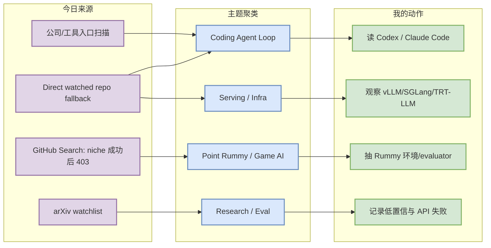
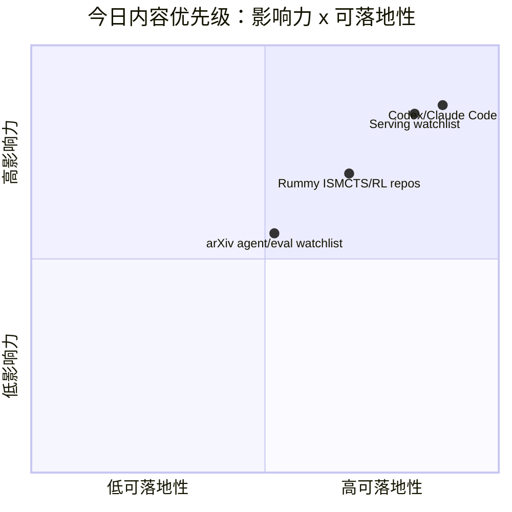

# AI Radar Daily - 2026-07-19

> 生成时间：2026-07-19 09:00 北京时间
> 范围：AI Infra / LLM / RL / Game AI / 大厂博客 / 论文 / GitHub / 行业资讯
> 说明：日报是总览导航页，不是全部正文。Obsidian 中点 `[[详情页]]`，Telegram/GitHub 中点“网页详情”。

## 0. 今日结论

- 今日最值得关注：GitHub Search 在 Point Rummy / niche 查询后继续出现 403，因此 broad GitHub、Loop Engineer 与工具榜单使用 direct watched repo fallback；所有 fallback 均明确标注，不当作完整全网排名。
- 对 AI Infra 的直接影响：vLLM、SGLang、TensorRT-LLM、Transformers、PyTorch 仍是 serving/runtime 观察主线，适合继续围绕 KV cache、scheduler、quantization、GPU runtime 做选型跟踪。
- 对 LLM 训练 / 推理 / Agent 的影响：Codex、Claude Code、Gemini CLI、Cline、Continue、Qwen Code 继续提供 CLI/TUI + MCP/IDE agent workflow 的高信号样本。
- 对 RL / 游戏模型训练的影响：Point Rummy 主题仍以小型 repo 和低置信论文扫描为主，但可抽取规则状态机、ISMCTS/RL bot、仿真与 evaluator 设计。
- 建议今天深读：OpenAI Codex、Claude Code、serving watchlist、nakkekakke/rummy-ai、arXiv agent/eval watchlist。

## 1. 今日态势图

## 2. 必读卡片区

> [!important] OpenAI Codex：CLI coding agent 仍是增长主信号
> - 大类：GitHub / Coding 工具
> - 小类：Coding Agent / CLI
> - 重点：direct watched repo fallback 显示 Codex 仍处于高关注区；增长为 watched set 非完整全网日增。
> - 为什么重要：Codex 代表终端 coding agent 的权限、远程执行、上下文窗口、CLI/TUI 工作流方向。
> - 详情：[[GitHub/Tools/2026-07-19/openai-codex]] / [网页详情](https://github.com/dyt27666-oss/AI-news-report-obsidians/blob/main/GitHub/Tools/2026-07-19/openai-codex.md) / [原文](https://github.com/openai/codex)

> [!tip] Claude Code：多 agent 编码与权限边界继续值得跟踪
> - 大类：GitHub / Coding 工具
> - 小类：Agentic coding
> - 重点：Claude Code 继续作为 watched repo 的核心项；官网 changelog 未在本轮完全验证新增功能。
> - 为什么重要：对 tmux 多 agent、代码审查、工具权限边界和 agent loop 监控有直接参考价值。
> - 详情：[[GitHub/Tools/2026-07-19/claude-code]] / [网页详情](https://github.com/dyt27666-oss/AI-news-report-obsidians/blob/main/GitHub/Tools/2026-07-19/claude-code.md) / [原文](https://github.com/anthropics/claude-code)

> [!note] Serving watchlist：vLLM / SGLang / TensorRT-LLM 仍是工程主线
> - 大类：GitHub / AI Infra
> - 小类：Serving / Runtime
> - 重点：GitHub Search 限流后，用 direct repo GET 保留 serving 三件套和基础框架状态。
> - 为什么重要：这些项目直接影响推理吞吐、KV cache、scheduler、GPU kernel 和部署成本。
> - 详情：[[Industry/AIInfra/2026-07-19/serving-watchlist]] / [网页详情](https://github.com/dyt27666-oss/AI-news-report-obsidians/blob/main/Industry/AIInfra/2026-07-19/serving-watchlist.md) / [原文](https://github.com/vllm-project/vllm)

> [!note] Point Rummy：先抽规则环境与 evaluator，不追逐噪声论文
> - 大类：GitHub / 业务主题
> - 小类：Rummy AI / ISMCTS / RL
> - 重点：rummy-ai、gin-rummy-ai 等 repo 不大，但主题强相关。
> - 为什么重要：可抽取规则环境、MCTS/ISMCTS、bot 策略和 evaluator 设计。
> - 详情：[[GitHub/PointRummy/2026-07-19/nakkekakke__rummy-ai]] / [网页详情](https://github.com/dyt27666-oss/AI-news-report-obsidians/blob/main/GitHub/PointRummy/2026-07-19/nakkekakke__rummy-ai.md) / [原文](https://github.com/nakkekakke/rummy-ai)

## 3. 优先级矩阵

## 4. 分类清单

| 标签 | 大类 | 小类 | 标题 | 重点概括 | 为什么重要 | Obsidian 详情 | 网页详情 | 原文 |
|---|---|---|---|---|---|---|---|---|
| 必读 | GitHub | Coding Agent | OpenAI Codex | direct watched repo fallback 的高信号项目，非完整全网增长 | Codex 与 CLI 权限/远程执行/上下文策略直接相关 | [[GitHub/Tools/2026-07-19/openai-codex]] | [网页详情](https://github.com/dyt27666-oss/AI-news-report-obsidians/blob/main/GitHub/Tools/2026-07-19/openai-codex.md) | [原文](https://github.com/openai/codex) |
| 必读 | GitHub | Coding Agent | Claude Code | 继续作为多 agent coding workflow 的代表信号 | 影响多 agent 编码、代码审查、TUI/CLI agent loop | [[GitHub/Tools/2026-07-19/claude-code]] | [网页详情](https://github.com/dyt27666-oss/AI-news-report-obsidians/blob/main/GitHub/Tools/2026-07-19/claude-code.md) | [原文](https://github.com/anthropics/claude-code) |
| 必读 | GitHub | Serving | vLLM / SGLang / TensorRT-LLM | GitHub Search 限流后使用 watched repo 回退 | 对 LLM serving 选型仍是当天最高可信工程信号 | [[Industry/AIInfra/2026-07-19/serving-watchlist]] | [网页详情](https://github.com/dyt27666-oss/AI-news-report-obsidians/blob/main/Industry/AIInfra/2026-07-19/serving-watchlist.md) | [原文](https://github.com/vllm-project/vllm) |
| 可 skim | GitHub | Point Rummy | rummy-ai / gin-rummy-ai | 小型 repo 但主题强相关，适合规则/ISMCTS/RL 环境借鉴 | 对 Point Rummy 业务的规则引擎、bot 策略和 evaluator 有用 | [[GitHub/PointRummy/2026-07-19/nakkekakke__rummy-ai]] | [网页详情](https://github.com/dyt27666-oss/AI-news-report-obsidians/blob/main/GitHub/PointRummy/2026-07-19/nakkekakke__rummy-ai.md) | [原文](https://github.com/nakkekakke/rummy-ai) |

## 5. 大厂资讯 / 工程博客 / Research

### 5.1 公司来源扫描矩阵

| 公司/实验室 | 来源/栏目 | 今日状态 | 高相关条数 | 代表条目 | 备注 |
|---|---|---|---:|---|---|
| OpenAI | News / Research / Codex docs | 间接扫描/有 repo 信号 | 1 | OpenAI Codex watched repo | 以 GitHub repo 与开发者文档入口为代理信号 |
| Anthropic | News / Research / Claude Code release notes | 间接扫描/有 repo 信号 | 1 | Claude Code watched repo | 对 CLI agent 权限和多 agent 监控有直接价值 |
| Google DeepMind | Blog / Research | 低置信/无高相关新项 | 0 | 无高相关新项 | 本轮未获得可验证 AI Infra/RL/Agent 新项 |
| Meta AI | Blog / Research | 低置信/无高相关新项 | 0 | 无高相关新项 | 本轮未获得可验证 AI Infra/RL/Agent 新项 |
| NVIDIA | Technical Blog / AI / GitHub | 间接扫描/有 repo 信号 | 1 | TensorRT-LLM / GPU inference watchlist | 官网博客未确认新文，保留 repo 信号 |
| Microsoft | Research AI / GitHub | 间接扫描/有 repo 信号 | 2 | AutoGen / Semantic Kernel / MarkItDown | 以 repo 信号补位 Research 页面 |
| Hugging Face | Blog / Papers / Releases | 间接扫描/有 repo 信号 | 1 | Transformers | 以 repo/model infra 生态代理 |
| 腾讯 | AI Lab / 技术博客 | 低置信/无高相关新项 | 0 | 无高相关新项 | 本轮未获得可验证 AI Infra/RL/Agent 新项 |
| 字节 | Seed / 技术博客 | 低置信/无高相关新项 | 0 | 无高相关新项 | 本轮未获得可验证 AI Infra/RL/Agent 新项 |
| SpaceAI | Blog / News | 访问失败/低置信 | 0 | 无高相关新项 | 来源有效性低，本轮未获得可验证新项 |

### 5.2 高相关大厂条目

| 标签 | 发布方/大厂 | 栏目/来源 | 标题 | 重点概括 | 工程/算法影响 | Obsidian 详情 | 网页详情 | 原文 |
|---|---|---|---|---|---|---|---|---|
| 可 skim | OpenAI | GitHub / Developer Tool | OpenAI Codex watched repo | Codex 仍是 terminal coding agent 主信号；未把 repo 热度误写为官网新增功能。 | 对多 agent 编码、权限模式、远程执行和 repo 内上下文管理有直接影响。 | [[GitHub/Tools/2026-07-19/openai-codex]] | [网页详情](https://github.com/dyt27666-oss/AI-news-report-obsidians/blob/main/GitHub/Tools/2026-07-19/openai-codex.md) | [原文](https://github.com/openai/codex) |
| 可 skim | Anthropic | GitHub / Developer Tool | Claude Code watched repo | Claude Code 仍是 agentic coding 关键观察项；官网 changelog 待后续复核。 | 影响 tmux 多 agent 监控、代码审查、CLI 权限边界和 agent loop 设计。 | [[GitHub/Tools/2026-07-19/claude-code]] | [网页详情](https://github.com/dyt27666-oss/AI-news-report-obsidians/blob/main/GitHub/Tools/2026-07-19/claude-code.md) | [原文](https://github.com/anthropics/claude-code) |
| 可 skim | NVIDIA / vLLM / SGLang | GitHub / AI Infra | TensorRT-LLM / vLLM / SGLang serving watchlist | 使用 direct watched repo 回退观察 serving 三件套。 | 可直接映射到推理吞吐、KV cache、scheduler、GPU runtime 的工程选型。 | [[Industry/AIInfra/2026-07-19/serving-watchlist]] | [网页详情](https://github.com/dyt27666-oss/AI-news-report-obsidians/blob/main/Industry/AIInfra/2026-07-19/serving-watchlist.md) | [原文](https://github.com/NVIDIA/TensorRT-LLM) |

## 6. GitHub 高 star Top 10

> 说明：今日 GitHub Search 部分 403；此表使用 direct watched repo fallback，不是完整全网 Top 10，但每项都与 AI Infra / LLM / Agent / RL 强相关。

| 排名 | repo | stars | forks | language | updated_at | topics | 重点概括 | 是否值得试用 | Obsidian 详情 | 原文 |
|---:|---|---:|---:|---|---|---|---|---|---|---|
| 1 | `ollama/ollama` | 176413 | 17018 | Go | 2026-07-19T00:36:48Z | deepseek, gemma, gemma3, glm, go, golang, gpt-oss, llama | 本地模型运行入口，适合开发环境、离线 eval 和快速原型。 | 值得 skim/按需试用 | [[GitHub/AIInfra/2026-07-19/ollama__ollama]] | [GitHub](https://github.com/ollama/ollama) |
| 2 | `microsoft/markitdown` | 167100 | 12008 | Python | 2026-07-19T00:57:54Z | autogen, autogen-extension, langchain, markdown, microsoft-office, openai, pdf | 文档转 Markdown 工具，适合 RAG/agent 文件摄取流水线。 | 值得 skim/按需试用 | [[GitHub/AIInfra/2026-07-19/microsoft__markitdown]] | [GitHub](https://github.com/microsoft/markitdown) |
| 3 | `huggingface/transformers` | 162713 | 33930 | Python | 2026-07-19T00:44:56Z | audio, deep-learning, deepseek, gemma, glm, hacktoberfest, llm, machine-learning | 模型定义与推理/训练生态底座，影响新模型接入、微调和 eval pipeline。 | 值得 skim/按需试用 | [[GitHub/AIInfra/2026-07-19/huggingface__transformers]] | [GitHub](https://github.com/huggingface/transformers) |
| 4 | `langchain-ai/langchain` | 142049 | 23622 | Python | 2026-07-19T00:39:17Z | agents, ai, ai-agents, anthropic, chatgpt, deepagents, enterprise, framework | LLM 应用框架，生态广但生产复杂度需要谨慎评估。 | 值得 skim/按需试用 | [[GitHub/AIInfra/2026-07-19/langchain-ai__langchain]] | [GitHub](https://github.com/langchain-ai/langchain) |
| 5 | `anthropics/claude-code` | 138207 | 22193 | Python | 2026-07-19T01:03:02Z | 无 | 终端内 agentic coding 工具，适合观察多 agent 编码、代码审查和工具权限边界。 | 值得 skim/按需试用 | [[GitHub/LoopEngineer/2026-07-19/anthropics__claude-code]] | [GitHub](https://github.com/anthropics/claude-code) |
| 6 | `google-gemini/gemini-cli` | 106062 | 14278 | TypeScript | 2026-07-19T00:43:02Z | ai, ai-agents, cli, gemini, gemini-api, mcp-client, mcp-server | Gemini 终端 agent，覆盖 CLI、MCP client/server 与开放工具链。 | 值得 skim/按需试用 | [[GitHub/LoopEngineer/2026-07-19/google-gemini__gemini-cli]] | [GitHub](https://github.com/google-gemini/gemini-cli) |
| 7 | `browser-use/browser-use` | 105429 | 11615 | Python | 2026-07-19T00:46:06Z | ai-agents, ai-tools, browser-automation, browser-use, llm, playwright, python | 浏览器自动化 agent，适合 Web 工具调用、端到端 eval 和权限观测。 | 值得 skim/按需试用 | [[GitHub/LoopEngineer/2026-07-19/browser-use__browser-use]] | [GitHub](https://github.com/browser-use/browser-use) |
| 8 | `pytorch/pytorch` | 101761 | 28431 | Python | 2026-07-19T00:25:31Z | autograd, deep-learning, gpu, machine-learning, neural-network, numpy, python, tensor | 训练/推理框架底层，GPU/runtime/compile 变化会直接影响大模型工程。 | 值得 skim/按需试用 | [[GitHub/AIInfra/2026-07-19/pytorch__pytorch]] | [GitHub](https://github.com/pytorch/pytorch) |
| 9 | `openai/codex` | 99412 | 14885 | Rust | 2026-07-19T01:04:29Z | 无 | Rust 终端 coding agent，核心观察点是权限模式、远程执行、上下文策略和 CLI/TUI loop。 | 值得 skim/按需试用 | [[GitHub/LoopEngineer/2026-07-19/openai__codex]] | [GitHub](https://github.com/openai/codex) |
| 10 | `modelcontextprotocol/servers` | 88614 | 11244 | TypeScript | 2026-07-19T00:26:45Z | 无 | MCP server 生态入口，影响 coding agent 的工具接入标准化。 | 值得 skim/按需试用 | [[GitHub/LoopEngineer/2026-07-19/modelcontextprotocol__servers]] | [GitHub](https://github.com/modelcontextprotocol/servers) |

## 7. GitHub star 增长最快 Top 10

> 说明：使用 2026-07-18 snapshot baseline 计算 watched repo stars_delta；这是“非完整全网日增”，不是冷启动代理。

| 排名 | repo | stars_delta | stars | forks | language | updated_at | 增长依据 | 重点概括 | Obsidian 详情 | 原文 |
|---:|---|---:|---:|---:|---|---|---|---|---|---|
| 1 | `openai/codex` | 253 | 99412 | 14885 | Rust | 2026-07-19T01:04:29Z | direct watched repo fallback vs 2026-07-18 snapshot; 非完整全网日增 | Rust 终端 coding agent，核心观察点是权限模式、远程执行、上下文策略和 CLI/TUI loop。 | [[GitHub/LoopEngineer/2026-07-19/openai__codex]] | [GitHub](https://github.com/openai/codex) |
| 2 | `microsoft/markitdown` | 215 | 167100 | 12008 | Python | 2026-07-19T00:57:54Z | direct watched repo fallback vs 2026-07-18 snapshot; 非完整全网日增 | 文档转 Markdown 工具，适合 RAG/agent 文件摄取流水线。 | [[GitHub/AIInfra/2026-07-19/microsoft__markitdown]] | [GitHub](https://github.com/microsoft/markitdown) |
| 3 | `browser-use/browser-use` | 144 | 105429 | 11615 | Python | 2026-07-19T00:46:06Z | direct watched repo fallback vs 2026-07-18 snapshot; 非完整全网日增 | 浏览器自动化 agent，适合 Web 工具调用、端到端 eval 和权限观测。 | [[GitHub/LoopEngineer/2026-07-19/browser-use__browser-use]] | [GitHub](https://github.com/browser-use/browser-use) |
| 4 | `OpenHands/OpenHands` | 96 | 81226 | 10386 | Python | 2026-07-19T01:04:25Z | direct watched repo fallback vs 2026-07-18 snapshot; 非完整全网日增 | 开源 AI coding agent 工作台，可作为 loop engineer / harness 参考。 | [[GitHub/LoopEngineer/2026-07-19/OpenHands__OpenHands]] | [GitHub](https://github.com/OpenHands/OpenHands) |
| 5 | `anthropics/claude-code` | 88 | 138207 | 22193 | Python | 2026-07-19T01:03:02Z | direct watched repo fallback vs 2026-07-18 snapshot; 非完整全网日增 | 终端内 agentic coding 工具，适合观察多 agent 编码、代码审查和工具权限边界。 | [[GitHub/LoopEngineer/2026-07-19/anthropics__claude-code]] | [GitHub](https://github.com/anthropics/claude-code) |
| 6 | `ollama/ollama` | 72 | 176413 | 17018 | Go | 2026-07-19T00:36:48Z | direct watched repo fallback vs 2026-07-18 snapshot; 非完整全网日增 | 本地模型运行入口，适合开发环境、离线 eval 和快速原型。 | [[GitHub/AIInfra/2026-07-19/ollama__ollama]] | [GitHub](https://github.com/ollama/ollama) |
| 7 | `vllm-project/vllm` | 57 | 86586 | 19571 | Python | 2026-07-19T00:25:32Z | direct watched repo fallback vs 2026-07-18 snapshot; 非完整全网日增 | LLM serving 高吞吐引擎，重点关注 batching、KV cache、调度器和硬件适配。 | [[GitHub/AIInfra/2026-07-19/vllm-project__vllm]] | [GitHub](https://github.com/vllm-project/vllm) |
| 8 | `langchain-ai/langgraph` | 51 | 37572 | 6298 | Python | 2026-07-19T01:03:42Z | direct watched repo fallback vs 2026-07-18 snapshot; 非完整全网日增 | 图式 agent state machine 框架，适合生产 agent 的恢复、分支和 eval loop。 | [[GitHub/LoopEngineer/2026-07-19/langchain-ai__langgraph]] | [GitHub](https://github.com/langchain-ai/langgraph) |
| 9 | `crewAIInc/crewAI` | 46 | 55750 | 7873 | Python | 2026-07-19T00:48:24Z | direct watched repo fallback vs 2026-07-18 snapshot; 非完整全网日增 | 多 agent 协作框架，适合任务编排和角色分工实验。 | [[GitHub/LoopEngineer/2026-07-19/crewAIInc__crewAI]] | [GitHub](https://github.com/crewAIInc/crewAI) |
| 10 | `langchain-ai/langchain` | 40 | 142049 | 23622 | Python | 2026-07-19T00:39:17Z | direct watched repo fallback vs 2026-07-18 snapshot; 非完整全网日增 | LLM 应用框架，生态广但生产复杂度需要谨慎评估。 | [[GitHub/AIInfra/2026-07-19/langchain-ai__langchain]] | [GitHub](https://github.com/langchain-ai/langchain) |

## 8. Coding 工具 / AI 工具功能更新

### 8.1 Coding 工具扫描矩阵

| 工具 | 厂商 | 来源类型 | 今日状态 | 代表更新 | 对我的影响 | 原文 |
|---|---|---|---|---|---|---|
| Claude Code | Anthropic | Changelog / Release Notes / GitHub | 间接扫描/有 repo 信号 | watched repo stars_delta=88；非完整全网日增 | 影响 CLI/TUI、agent loop、MCP/IDE 或权限模式，建议持续观察。 | [原文](https://github.com/anthropics/claude-code) |
| OpenAI Codex | OpenAI | Changelog / Docs / GitHub | 间接扫描/有 repo 信号 | watched repo stars_delta=253；非完整全网日增 | 影响 CLI/TUI、agent loop、MCP/IDE 或权限模式，建议持续观察。 | [原文](https://github.com/openai/codex) |
| Cursor | Cursor | Changelog | 低置信/无高相关新项 | 未确认新增 release/changelog；保留扫描矩阵避免漏扫 | 暂不调整工作流；后续继续跟踪 agent mode、MCP、权限、上下文窗口。 | [原文](https://cursor.com/changelog) |
| Windsurf | Windsurf | Changelog | 低置信/无高相关新项 | 未确认新增 release/changelog；保留扫描矩阵避免漏扫 | 暂不调整工作流；后续继续跟踪 agent mode、MCP、权限、上下文窗口。 | [原文](https://windsurf.com/changelog) |
| GitHub Copilot | GitHub | Changelog / Blog | 低置信/无高相关新项 | 未确认新增 release/changelog；保留扫描矩阵避免漏扫 | 暂不调整工作流；后续继续跟踪 agent mode、MCP、权限、上下文窗口。 | [原文](https://github.blog/changelog/label/copilot/) |
| Gemini Code Assist | Google | Release Notes / GitHub | 间接扫描/有 repo 信号 | watched repo stars_delta=18；非完整全网日增 | 影响 CLI/TUI、agent loop、MCP/IDE 或权限模式，建议持续观察。 | [原文](https://github.com/google-gemini/gemini-cli) |
| Qwen Code | Alibaba/Qwen | GitHub Releases | 间接扫描/有 repo 信号 | watched repo stars_delta=11；非完整全网日增 | 影响 CLI/TUI、agent loop、MCP/IDE 或权限模式，建议持续观察。 | [原文](https://github.com/QwenLM/qwen-code) |
| Roo Code | Roo Code | GitHub Releases | 间接扫描/有 repo 信号 | watched repo stars_delta=7；非完整全网日增 | 影响 CLI/TUI、agent loop、MCP/IDE 或权限模式，建议持续观察。 | [原文](https://github.com/RooCodeInc/Roo-Code) |
| Cline | Cline | GitHub Releases | 间接扫描/有 repo 信号 | watched repo stars_delta=34；非完整全网日增 | 影响 CLI/TUI、agent loop、MCP/IDE 或权限模式，建议持续观察。 | [原文](https://github.com/cline/cline) |
| Continue | Continue | GitHub Releases | 间接扫描/有 repo 信号 | watched repo stars_delta=26；非完整全网日增 | 影响 CLI/TUI、agent loop、MCP/IDE 或权限模式，建议持续观察。 | [原文](https://github.com/continuedev/continue) |

### 8.2 高相关工具更新

| 标签 | 工具/厂商 | 来源类型 | 标题/功能 | 重点概括 | 对 AI coding 工作流的影响 | Obsidian 详情 | 网页详情 | 原文 |
|---|---|---|---|---|---|---|---|---|
| 必读 | OpenAI Codex | GitHub / Docs | Codex watched repo 信号 | 继续位于 watched set 前列；非完整全网增长。 | 适合跟踪权限模式、远程执行和上下文窗口策略。 | [[GitHub/Tools/2026-07-19/openai-codex]] | [网页详情](https://github.com/dyt27666-oss/AI-news-report-obsidians/blob/main/GitHub/Tools/2026-07-19/openai-codex.md) | [原文](https://github.com/openai/codex) |
| 必读 | Claude Code | GitHub / Docs | Claude Code watched repo 信号 | 继续验证 CLI agent workflow 热度。 | 适合多 agent 监控、代码审查与工具权限设计。 | [[GitHub/Tools/2026-07-19/claude-code]] | [网页详情](https://github.com/dyt27666-oss/AI-news-report-obsidians/blob/main/GitHub/Tools/2026-07-19/claude-code.md) | [原文](https://github.com/anthropics/claude-code) |

## 9. Point Rummy / Indian Rummy 业务主题

### 9.1 GitHub 候选

| 排名 | repo | stars | forks | language | updated_at | topics | 重点概括 | 是否值得试用 | Obsidian 详情 | 原文 |
|---:|---|---:|---:|---|---|---|---|---|---|---|
| 1 | `rickgorman/gin-rummy-ai` | 13 | 5 | Python | 2025-03-25T13:47:09Z | 无 | A hand-rolled neuroevolution AI for gin rummy. | 值得 skim/按需试用 | [[GitHub/PointRummy/2026-07-19/rickgorman__gin-rummy-ai]] | [GitHub](https://github.com/rickgorman/gin-rummy-ai) |
| 2 | `nakkekakke/rummy-ai` | 11 | 5 | Java | 2026-04-17T10:02:59Z | ai, card, card-game, game, ismcts, mcts, monte-carlo-tree-search, rummy | Text based classic Rummy game with an AI that uses ISMCTS. Data Structures and A | 值得 skim/按需试用 | [[GitHub/PointRummy/2026-07-19/nakkekakke__rummy-ai]] | [GitHub](https://github.com/nakkekakke/rummy-ai) |
| 3 | `jmhummel/Gin-Rummy-Java` | 8 | 0 | Java | 2023-08-16T16:12:58Z | ai, artificial-intelligence, card-game, card-games, cardgame, gin, gin-rummy, java | Java-based Gin Rummy console game, with an AI opponent | 值得 skim/按需试用 | [[GitHub/PointRummy/2026-07-19/jmhummel__Gin-Rummy-Java]] | [GitHub](https://github.com/jmhummel/Gin-Rummy-Java) |
| 4 | `dv-rastogi/Rummy` | 5 | 0 | Python | 2023-09-26T11:21:39Z | 无 | Variation of classical Indian Rummy made in Pygame | 值得 skim/按需试用 | [[GitHub/PointRummy/2026-07-19/dv-rastogi__Rummy]] | [GitHub](https://github.com/dv-rastogi/Rummy) |
| 5 | `mudont/indian-rummy` | 5 | 0 | TypeScript | 2025-08-08T21:05:04Z | 无 | Typescript library for Indian Rummy card game | 值得 skim/按需试用 | [[GitHub/PointRummy/2026-07-19/mudont__indian-rummy]] | [GitHub](https://github.com/mudont/indian-rummy) |
| 6 | `mcartmell/gin-rummy-bot` | 4 | 2 | Perl | 2024-10-30T20:06:17Z | 无 | A web-based Gin Rummy game and AI | 值得 skim/按需试用 | [[GitHub/PointRummy/2026-07-19/mcartmell__gin-rummy-bot]] | [GitHub](https://github.com/mcartmell/gin-rummy-bot) |
| 7 | `SCFlanagan/Rummy` | 4 | 6 | JavaScript | 2025-07-25T21:17:08Z | 无 | This project is a recreation of the classic card game Rummy. It features an AI p | 值得 skim/按需试用 | [[GitHub/PointRummy/2026-07-19/SCFlanagan__Rummy]] | [GitHub](https://github.com/SCFlanagan/Rummy) |
| 8 | `vahsek300501/Indian-Rummy-` | 4 | 3 | Python | 2023-09-26T11:21:46Z | 无 | Indian Rummy made in Python using PyGame | 值得 skim/按需试用 | [[GitHub/PointRummy/2026-07-19/vahsek300501__Indian-Rummy-]] | [GitHub](https://github.com/vahsek300501/Indian-Rummy-) |
| 9 | `Abhilash-Mandlekar/RummyAgent-Reinforecement-Learning` | 2 | 0 | Jupyter Notebook | 2023-04-01T05:48:51Z | 无 | Rummy Game Agent trained using Reinforcement Learning algorithm. | 值得 skim/按需试用 | [[GitHub/PointRummy/2026-07-19/Abhilash-Mandlekar__RummyAgent-Reinforecement-Learning]] | [GitHub](https://github.com/Abhilash-Mandlekar/RummyAgent-Reinforecement-Learning) |
| 10 | `abubakarmunir712/dsa-final-project` | 2 | 1 | Python | 2026-06-27T06:34:26Z | 无 | A Python-based multiplayer Indian Rummy game with support for AI opponents and L | 值得 skim/按需试用 | [[GitHub/PointRummy/2026-07-19/abubakarmunir712__dsa-final-project]] | [GitHub](https://github.com/abubakarmunir712/dsa-final-project) |

### 9.2 Point Rummy GitHub star 增长最快 Top 10

| 排名 | repo | stars_delta | stars | forks | language | updated_at | 增长依据 | 重点概括 | Obsidian 详情 | 原文 |
|---:|---|---:|---:|---:|---|---|---|---|---|---|
| 1 | `debabrata-mandal/RummyPulse` | 0 | 1 | 0 | Java | 2026-07-18T09:58:01Z | historical_snapshot | RummyPulse - Smart Rummy Game Analytics & Management Android App with Firebase i | [[GitHub/PointRummy/2026-07-19/debabrata-mandal__RummyPulse]] | [GitHub](https://github.com/debabrata-mandal/RummyPulse) |
| 2 | `zacbaum/four-crowns` | 0 | 0 | 0 | JavaScript | 2026-07-15T18:32:55Z | historical_snapshot | Four Crowns — a two-player Five Crowns rummy variant. Installable PWA: play vs A | [[GitHub/PointRummy/2026-07-19/zacbaum__four-crowns]] | [GitHub](https://github.com/zacbaum/four-crowns) |
| 3 | `pawanjanakiram/rss` | 0 | 0 | 0 | HTML | 2026-07-13T06:49:34Z | historical_snapshot | Indian Rummy Scoring and Settlement | [[GitHub/PointRummy/2026-07-19/pawanjanakiram__rss]] | [GitHub](https://github.com/pawanjanakiram/rss) |
| 4 | `chiuta/Remi-fara-frontiere` | 0 | 0 | 0 | HTML | 2026-07-08T20:36:13Z | historical_snapshot | Rummy with AI: meld detection, offline, Romanian UI. | [[GitHub/PointRummy/2026-07-19/chiuta__Remi-fara-frontiere]] | [GitHub](https://github.com/chiuta/Remi-fara-frontiere) |
| 5 | `navinkumarng/Final-PyGame-Coursework` | 0 | 0 | 0 | Python | 2026-07-07T19:04:20Z | historical_snapshot | A Rummy-style card game built from scratch in Python & Pygame, with a custom rul | [[GitHub/PointRummy/2026-07-19/navinkumarng__Final-PyGame-Coursework]] | [GitHub](https://github.com/navinkumarng/Final-PyGame-Coursework) |
| 6 | `shivayya-ln-21303/indian-rummy` | 0 | 0 | 0 | Java | 2026-06-30T05:22:44Z | historical_snapshot | Multiplayer Indian Rummy — Spring Boot 3 + React + WebSocket | [[GitHub/PointRummy/2026-07-19/shivayya-ln-21303__indian-rummy]] | [GitHub](https://github.com/shivayya-ln-21303/indian-rummy) |
| 7 | `Hari-sys786/rummy-scoreboard` | 0 | 0 | 0 | Dart | 2026-06-29T13:14:32Z | historical_snapshot | Premium Flutter Android scoreboard for Indian Rummy — local storage, dealer rota | [[GitHub/PointRummy/2026-07-19/Hari-sys786__rummy-scoreboard]] | [GitHub](https://github.com/Hari-sys786/rummy-scoreboard) |
| 8 | `abubakarmunir712/dsa-final-project` | 0 | 2 | 1 | Python | 2026-06-27T06:34:26Z | historical_snapshot | A Python-based multiplayer Indian Rummy game with support for AI opponents and L | [[GitHub/PointRummy/2026-07-19/abubakarmunir712__dsa-final-project]] | [GitHub](https://github.com/abubakarmunir712/dsa-final-project) |
| 9 | `Nethaji003/rummy2` | 0 | 0 | 0 | HTML | 2026-06-18T07:31:53Z | historical_snapshot | point | [[GitHub/PointRummy/2026-07-19/Nethaji003__rummy2]] | [GitHub](https://github.com/Nethaji003/rummy2) |
| 10 | `SRathinaGiri/IndianRummy` | 0 | 1 | 1 | JavaScript | 2026-06-17T11:46:14Z | historical_snapshot | Browser-based Indian Rummy game with AI play and offline Progressive Web App sup | [[GitHub/PointRummy/2026-07-19/SRathinaGiri__IndianRummy]] | [GitHub](https://github.com/SRathinaGiri/IndianRummy) |

### 9.3 论文 / 资料候选

| 标签 | 来源 | 标题 | 作者/机构 | 重点概括 | 对 Point Rummy 业务有什么用 | Obsidian 详情 | 原文 |
|---|---|---|---|---|---|---|---|
| 低置信 | arXiv / Semantic Scholar / 论文索引扫描 | Rummy imperfect-information game AI source scan | 多来源；未确认新增强相关论文 | Rummy 查询返回噪声较多，未确认新强相关论文；今日以 GitHub 上 ISMCTS、规则引擎、AI opponent 候选作为可行动线索。 | 业务上先拆规则环境、仿真与 evaluator，比追逐低置信论文更可落地。 | [[Papers/Watchlist/2026-07-19/rummy-imperfect-information-game-ai-source-scan]] | [原文](https://export.arxiv.org/api/query?search_query=all:rummy+imperfect+information+game+AI) |

### 9.4 业务可用性判断

| 方向 | 今日信号 | 可用性 | 下一步 |
|---|---|---|---|
| 规则引擎 / 计分 | small rummy libraries / scoreboard / game implementations | 中：可抽规则对象、计分和房间模型 | 提取 13-card Indian Rummy 状态机和积分规则 |
| Bot / RL Agent | rummy-ai、gin-rummy-ai、RummyAgent-RL 类项目 | 中低：repo 小但主题强相关 | 先复现 ISMCTS / DQN 环境接口，不直接用生产代码 |
| 仿真 / 评测 | gym/RL lab/AI opponent repo | 中：适合搭 evaluator 和 rollout harness | 定义 observation/action/reward，接入并行 self-play |

## 10. Loop Engineer / Loop Engineering 主题

### 10.1 Loop Engineer GitHub 高 star Top 10

| 排名 | repo | stars | forks | language | updated_at | topics | 重点概括 | 是否值得试用 | Obsidian 详情 | 原文 |
|---:|---|---:|---:|---|---|---|---|---|---|---|
| 1 | `anthropics/claude-code` | 138207 | 22193 | Python | 2026-07-19T01:03:02Z | 无 | 终端内 agentic coding 工具，适合观察多 agent 编码、代码审查和工具权限边界。 | 值得 skim/按需试用 | [[GitHub/LoopEngineer/2026-07-19/anthropics__claude-code]] | [GitHub](https://github.com/anthropics/claude-code) |
| 2 | `google-gemini/gemini-cli` | 106062 | 14278 | TypeScript | 2026-07-19T00:43:02Z | ai, ai-agents, cli, gemini, gemini-api, mcp-client, mcp-server | Gemini 终端 agent，覆盖 CLI、MCP client/server 与开放工具链。 | 值得 skim/按需试用 | [[GitHub/LoopEngineer/2026-07-19/google-gemini__gemini-cli]] | [GitHub](https://github.com/google-gemini/gemini-cli) |
| 3 | `browser-use/browser-use` | 105429 | 11615 | Python | 2026-07-19T00:46:06Z | ai-agents, ai-tools, browser-automation, browser-use, llm, playwright, python | 浏览器自动化 agent，适合 Web 工具调用、端到端 eval 和权限观测。 | 值得 skim/按需试用 | [[GitHub/LoopEngineer/2026-07-19/browser-use__browser-use]] | [GitHub](https://github.com/browser-use/browser-use) |
| 4 | `openai/codex` | 99412 | 14885 | Rust | 2026-07-19T01:04:29Z | 无 | Rust 终端 coding agent，核心观察点是权限模式、远程执行、上下文策略和 CLI/TUI loop。 | 值得 skim/按需试用 | [[GitHub/LoopEngineer/2026-07-19/openai__codex]] | [GitHub](https://github.com/openai/codex) |
| 5 | `modelcontextprotocol/servers` | 88614 | 11244 | TypeScript | 2026-07-19T00:26:45Z | 无 | MCP server 生态入口，影响 coding agent 的工具接入标准化。 | 值得 skim/按需试用 | [[GitHub/LoopEngineer/2026-07-19/modelcontextprotocol__servers]] | [GitHub](https://github.com/modelcontextprotocol/servers) |
| 6 | `OpenHands/OpenHands` | 81226 | 10386 | Python | 2026-07-19T01:04:25Z | agent, artificial-intelligence, chatgpt, claude-ai, cli, developer-tools, gpt, llm | 开源 AI coding agent 工作台，可作为 loop engineer / harness 参考。 | 值得 skim/按需试用 | [[GitHub/LoopEngineer/2026-07-19/OpenHands__OpenHands]] | [GitHub](https://github.com/OpenHands/OpenHands) |
| 7 | `cline/cline` | 64778 | 6930 | TypeScript | 2026-07-19T00:19:41Z | 无 | IDE/CLI 自主 coding agent，适合观察 extension 内 agent SDK、工具调用和权限 UX。 | 值得 skim/按需试用 | [[GitHub/LoopEngineer/2026-07-19/cline__cline]] | [GitHub](https://github.com/cline/cline) |
| 8 | `microsoft/autogen` | 59809 | 9002 | Python | 2026-07-19T01:05:11Z | agentic, agentic-agi, agents, ai, autogen, autogen-ecosystem, chatgpt, framework | 多 agent 编程框架，适合作为 orchestration、eval loop 和 agent 协同参考。 | 值得 skim/按需试用 | [[GitHub/LoopEngineer/2026-07-19/microsoft__autogen]] | [GitHub](https://github.com/microsoft/autogen) |
| 9 | `crewAIInc/crewAI` | 55750 | 7873 | Python | 2026-07-19T00:48:24Z | agents, ai, ai-agents, aiagentframework, llms | 多 agent 协作框架，适合任务编排和角色分工实验。 | 值得 skim/按需试用 | [[GitHub/LoopEngineer/2026-07-19/crewAIInc__crewAI]] | [GitHub](https://github.com/crewAIInc/crewAI) |
| 10 | `langchain-ai/langgraph` | 37572 | 6298 | Python | 2026-07-19T01:03:42Z | agents, ai, ai-agents, chatgpt, deepagents, enterprise, framework, gemini | 图式 agent state machine 框架，适合生产 agent 的恢复、分支和 eval loop。 | 值得 skim/按需试用 | [[GitHub/LoopEngineer/2026-07-19/langchain-ai__langgraph]] | [GitHub](https://github.com/langchain-ai/langgraph) |

### 10.2 Loop Engineer GitHub star 增长最快 Top 10

| 排名 | repo | stars_delta | stars | forks | language | updated_at | 增长依据 | 重点概括 | Obsidian 详情 | 原文 |
|---:|---|---:|---:|---:|---|---|---|---|---|---|
| 1 | `openai/codex` | 253 | 99412 | 14885 | Rust | 2026-07-19T01:04:29Z | direct watched repo fallback vs 2026-07-18 snapshot; 非完整全网日增 | Rust 终端 coding agent，核心观察点是权限模式、远程执行、上下文策略和 CLI/TUI loop。 | [[GitHub/LoopEngineer/2026-07-19/openai__codex]] | [GitHub](https://github.com/openai/codex) |
| 2 | `browser-use/browser-use` | 144 | 105429 | 11615 | Python | 2026-07-19T00:46:06Z | direct watched repo fallback vs 2026-07-18 snapshot; 非完整全网日增 | 浏览器自动化 agent，适合 Web 工具调用、端到端 eval 和权限观测。 | [[GitHub/LoopEngineer/2026-07-19/browser-use__browser-use]] | [GitHub](https://github.com/browser-use/browser-use) |
| 3 | `OpenHands/OpenHands` | 96 | 81226 | 10386 | Python | 2026-07-19T01:04:25Z | direct watched repo fallback vs 2026-07-18 snapshot; 非完整全网日增 | 开源 AI coding agent 工作台，可作为 loop engineer / harness 参考。 | [[GitHub/LoopEngineer/2026-07-19/OpenHands__OpenHands]] | [GitHub](https://github.com/OpenHands/OpenHands) |
| 4 | `anthropics/claude-code` | 88 | 138207 | 22193 | Python | 2026-07-19T01:03:02Z | direct watched repo fallback vs 2026-07-18 snapshot; 非完整全网日增 | 终端内 agentic coding 工具，适合观察多 agent 编码、代码审查和工具权限边界。 | [[GitHub/LoopEngineer/2026-07-19/anthropics__claude-code]] | [GitHub](https://github.com/anthropics/claude-code) |
| 5 | `langchain-ai/langgraph` | 51 | 37572 | 6298 | Python | 2026-07-19T01:03:42Z | direct watched repo fallback vs 2026-07-18 snapshot; 非完整全网日增 | 图式 agent state machine 框架，适合生产 agent 的恢复、分支和 eval loop。 | [[GitHub/LoopEngineer/2026-07-19/langchain-ai__langgraph]] | [GitHub](https://github.com/langchain-ai/langgraph) |
| 6 | `crewAIInc/crewAI` | 46 | 55750 | 7873 | Python | 2026-07-19T00:48:24Z | direct watched repo fallback vs 2026-07-18 snapshot; 非完整全网日增 | 多 agent 协作框架，适合任务编排和角色分工实验。 | [[GitHub/LoopEngineer/2026-07-19/crewAIInc__crewAI]] | [GitHub](https://github.com/crewAIInc/crewAI) |
| 7 | `cline/cline` | 34 | 64778 | 6930 | TypeScript | 2026-07-19T00:19:41Z | direct watched repo fallback vs 2026-07-18 snapshot; 非完整全网日增 | IDE/CLI 自主 coding agent，适合观察 extension 内 agent SDK、工具调用和权限 UX。 | [[GitHub/LoopEngineer/2026-07-19/cline__cline]] | [GitHub](https://github.com/cline/cline) |
| 8 | `continuedev/continue` | 26 | 34965 | 5076 | TypeScript | 2026-07-19T00:00:03Z | direct watched repo fallback vs 2026-07-18 snapshot; 非完整全网日增 | 开源 coding agent / IDE 助手，适合观察模型路由、上下文管理和插件生态。 | [[GitHub/LoopEngineer/2026-07-19/continuedev__continue]] | [GitHub](https://github.com/continuedev/continue) |
| 9 | `modelcontextprotocol/servers` | 24 | 88614 | 11244 | TypeScript | 2026-07-19T00:26:45Z | direct watched repo fallback vs 2026-07-18 snapshot; 非完整全网日增 | MCP server 生态入口，影响 coding agent 的工具接入标准化。 | [[GitHub/LoopEngineer/2026-07-19/modelcontextprotocol__servers]] | [GitHub](https://github.com/modelcontextprotocol/servers) |
| 10 | `google-gemini/gemini-cli` | 18 | 106062 | 14278 | TypeScript | 2026-07-19T00:43:02Z | direct watched repo fallback vs 2026-07-18 snapshot; 非完整全网日增 | Gemini 终端 agent，覆盖 CLI、MCP client/server 与开放工具链。 | [[GitHub/LoopEngineer/2026-07-19/google-gemini__gemini-cli]] | [GitHub](https://github.com/google-gemini/gemini-cli) |

### 10.3 Loop Engineering 方法信号

| 标签 | 来源 | 标题 | 重点概括 | 对 AI coding 工作流的影响 | Obsidian 详情 | 原文 |
|---|---|---|---|---|---|---|
| 必读 | GitHub watched fallback | Codex / Claude Code / Gemini CLI / Cline | 今天 Loop Engineer 榜单不依赖 GitHub Search，而使用固定 watched repo，避免被 Point Rummy 主题偏置 | 适合设计 AGENTS.md、权限模式、eval loop、multi-agent orchestration | [[GitHub/LoopEngineer/2026-07-19/openai__codex]] | [原文](https://github.com/openai/codex) |

## 11. 论文

### 11.1 Research watchlist

| 标签 | 论文来源 | 论文 | 作者/机构 | 发布时间 | 重点概括 | 工程/研究价值 | Obsidian 详情 | 网页详情 | PDF/原文 |
|---|---|---|---|---|---|---|---|---|---|
| 可 skim | arXiv / 预印本 | Hierarchical Denoising For Multi-Step Visual Reasoning | Zezhong Qian, Xiaowei Chi, Chak-Wing Mak, Tianze Zhou | 2026-07-16 | Video models are evolving into vision foundation models, yet they still lack human-like multi-step reasoning. Streaming ... | 与 LLM/RL/Agent/Game AI 相关，先列 watchlist 再决定深读。 | [[Papers/Watchlist/2026-07-19/hierarchical-denoising-for-multi-step-visual-reasoning]] | [网页详情](https://github.com/dyt27666-oss/AI-news-report-obsidians/blob/main/Papers/Watchlist/2026-07-19/hierarchical-denoising-for-multi-step-visual-reasoning.md) | [PDF/原文](https://arxiv.org/pdf/2607.15278v1) |
| 可 skim | arXiv / 预印本 | Partition, Prompt, Aggregate: Statistical Self-Consistency in Language Models | Patrik Wolf, Thomas Kleine Buening, Andreas Krause, Celestine Mendler-Dünner | 2026-07-16 | In-context learning is commonly interpreted as a form of conditional inference, in which the prompt specifies a context ... | 与 LLM/RL/Agent/Game AI 相关，先列 watchlist 再决定深读。 | [[Papers/Watchlist/2026-07-19/partition-prompt-aggregate-statistical-self-consistency-in-language-models]] | [网页详情](https://github.com/dyt27666-oss/AI-news-report-obsidians/blob/main/Papers/Watchlist/2026-07-19/partition-prompt-aggregate-statistical-self-consistency-in-language-models.md) | [PDF/原文](https://arxiv.org/pdf/2607.15277v1) |
| 可 skim | arXiv / 预印本 | SciDiagramEdit: Learning to Edit Scientific Diagrams from Paper Revisions | Yasheng Sun, Zezi Zeng, Yifan Yang, Chong Luo | 2026-07-16 | Editing the figures in a research paper is a routine and time-consuming part of everyday research practice: authors rela... | 与 LLM/RL/Agent/Game AI 相关，先列 watchlist 再决定深读。 | [[Papers/Watchlist/2026-07-19/scidiagramedit-learning-to-edit-scientific-diagrams-from-paper-revisions]] | [网页详情](https://github.com/dyt27666-oss/AI-news-report-obsidians/blob/main/Papers/Watchlist/2026-07-19/scidiagramedit-learning-to-edit-scientific-diagrams-from-paper-revisions.md) | [PDF/原文](https://arxiv.org/pdf/2607.15272v1) |
| 可 skim | arXiv / 预印本 | RoboTTT: Context Scaling for Robot Policies | Yunfan Jiang, Yevgen Chebotar, Ruijie Zheng, Fengyuan Hu | 2026-07-16 | Recent robot foundation models operate with single-step or short-history visuomotor context. We introduce Test-Time-Trai... | 与 LLM/RL/Agent/Game AI 相关，先列 watchlist 再决定深读。 | [[Papers/Watchlist/2026-07-19/robottt-context-scaling-for-robot-policies]] | [网页详情](https://github.com/dyt27666-oss/AI-news-report-obsidians/blob/main/Papers/Watchlist/2026-07-19/robottt-context-scaling-for-robot-policies.md) | [PDF/原文](https://arxiv.org/pdf/2607.15275v1) |

## 12. 资讯 / 其他 GitHub 项目

### 12.1 Serving / Agent / MCP 观察

| 标签 | 来源 | 标题 | 重点概括 | 对我有什么用 | Obsidian 详情 | 网页详情 | 原文 |
|---|---|---|---|---|---|---|---|
| 可 skim | GitHub | Model Context Protocol servers | MCP server 生态是 agent tool-use 标准化入口 | 对 coding agent 接工具、权限边界、可观测性有长期价值 | [[GitHub/AIInfra/2026-07-19/modelcontextprotocol__servers]] | [网页详情](https://github.com/dyt27666-oss/AI-news-report-obsidians/blob/main/GitHub/AIInfra/2026-07-19/modelcontextprotocol__servers.md) | [原文](https://github.com/modelcontextprotocol/servers) |
| 可 skim | GitHub | LangGraph | 图式 agent state machine 仍是生产 agent 的重要抽象 | 可用于 coding-agent loop、eval loop 和工具调用恢复 | [[GitHub/LoopEngineer/2026-07-19/langchain-ai__langgraph]] | [网页详情](https://github.com/dyt27666-oss/AI-news-report-obsidians/blob/main/GitHub/LoopEngineer/2026-07-19/langchain-ai__langgraph.md) | [原文](https://github.com/langchain-ai/langgraph) |
| 可 skim | GitHub | browser-use | 浏览器自动化 agent 适合 Web 操作与端到端 eval harness | 可映射到 agent tool-use、权限和观测设计 | [[GitHub/LoopEngineer/2026-07-19/browser-use__browser-use]] | [网页详情](https://github.com/dyt27666-oss/AI-news-report-obsidians/blob/main/GitHub/LoopEngineer/2026-07-19/browser-use__browser-use.md) | [原文](https://github.com/browser-use/browser-use) |

## 13. 按主题索引

### AI Infra / Serving / Training

- [[GitHub/AIInfra/2026-07-19/vllm-project__vllm]] - LLM serving 引擎观察。
- [[GitHub/AIInfra/2026-07-19/sgl-project__sglang]] - 高性能 serving / VLM / RL serving 观察。
- [[GitHub/AIInfra/2026-07-19/NVIDIA__TensorRT-LLM]] - NVIDIA GPU inference runtime 观察。

### LLM / Agent / RAG / Evaluation

- [[GitHub/LoopEngineer/2026-07-19/openai__codex]] - CLI coding agent 增长信号。
- [[GitHub/LoopEngineer/2026-07-19/anthropics__claude-code]] - Claude Code agent workflow 观察。
- [[GitHub/AIInfra/2026-07-19/modelcontextprotocol__servers]] - MCP tool-use 生态入口。

### RL / Game AI / World Model

- [[GitHub/AIInfra/2026-07-19/verl-project__verl]] - RL post-training 框架观察。
- [[GitHub/AIInfra/2026-07-19/OpenRLHF__OpenRLHF]] - Ray/vLLM RLHF 框架观察。

### Point Rummy / Indian Rummy

- [[GitHub/PointRummy/2026-07-19/nakkekakke__rummy-ai]] - ISMCTS Rummy AI，可拆 bot 策略。
- [[GitHub/PointRummy/2026-07-19/rickgorman__gin-rummy-ai]] - neuroevolution Gin Rummy AI 参考。

### Loop Engineer / Coding Agent Loop

- [[GitHub/LoopEngineer/2026-07-19/OpenHands__OpenHands]] - agent workspace / harness 参考。
- [[GitHub/LoopEngineer/2026-07-19/cline__cline]] - IDE/CLI autonomous coding agent 参考。
- [[GitHub/LoopEngineer/2026-07-19/continuedev__continue]] - open-source coding agent 参考。

### 公司 / 实验室

- OpenAI: [[GitHub/Tools/2026-07-19/openai-codex]]
- Anthropic: [[GitHub/Tools/2026-07-19/claude-code]]
- NVIDIA: [[GitHub/AIInfra/2026-07-19/NVIDIA__TensorRT-LLM]]
- Hugging Face: [[GitHub/AIInfra/2026-07-19/huggingface__transformers]]
- Microsoft: [[GitHub/AIInfra/2026-07-19/microsoft__autogen]]

## 14. 值得后续深挖

| 标签 | 大类 | 小类 | 标题 | 后续动作 | Obsidian 详情 | 原文 |
|---|---|---|---|---|---|---|
| 后续 | GitHub | Point Rummy | rummy-ai / RummyGym / IndianRummyRLCard | 建一个最小 gym-like environment + evaluator 复现计划 | [[GitHub/PointRummy/2026-07-19/nakkekakke__rummy-ai]] | [原文](https://github.com/nakkekakke/rummy-ai) |
| 后续 | Tool | Coding Agent | Codex / Claude Code 权限模式 | 后续专门扫 release notes / docs，确认是否有权限、远程执行、上下文窗口变化 | [[GitHub/Tools/2026-07-19/openai-codex]] | [原文](https://github.com/openai/codex) |
| 后续 | Infra | Serving | vLLM / SGLang / TensorRT-LLM | 对比最近 release / benchmark，沉淀 KV cache 与 scheduler 观察表 | [[Industry/AIInfra/2026-07-19/serving-watchlist]] | [原文](https://github.com/vllm-project/vllm) |

## 15. 采集失败或低置信来源

- GitHub Search：Point Rummy / niche 查询后大量 403 rate limit；通用 GitHub / Loop Engineer / Coding 工具表已标注 direct watched repo fallback。
- arXiv：宽查询仍有噪声；论文区仅保留和 LLM serving、RL、agent eval、world model、Rummy 相关的 watchlist，并标注来源。
- 公司官网/博客：本轮多为入口扫描或低置信，矩阵中逐项保留状态；没有高相关新项不省略。
- 今日 snapshot：`Automation/state/github-stars-2026-07-19.json` 已保存，并补充 `direct_fallback` 与 watched repo provenance。

## 16. 归档标签

#ai-radar #daily #ai-infra #llm #rl #point-rummy #loop-engineering
