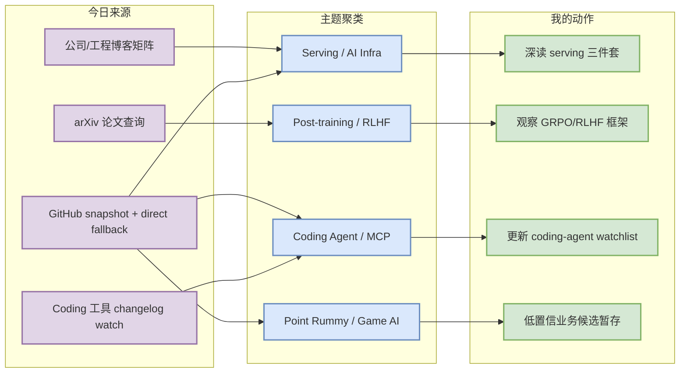
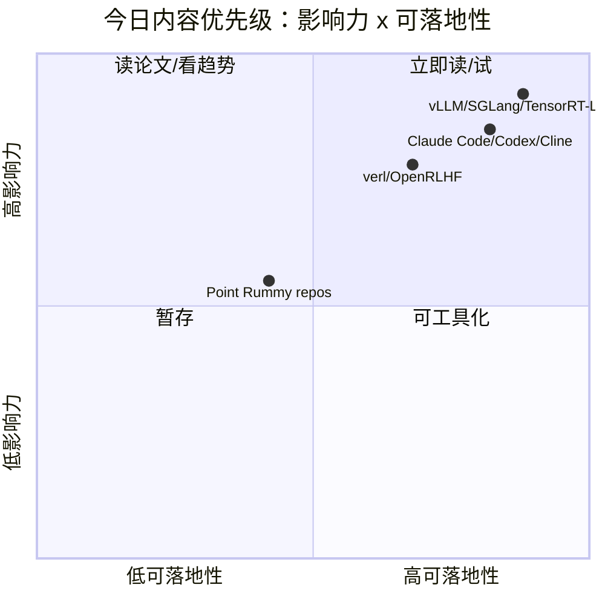

# AI Radar Daily - 2026-07-22

> 生成时间：2026-07-22 09:00 CST  
> 范围：AI Infra / LLM / RL / Game AI / 大厂博客 / 论文 / GitHub / 行业资讯  
> 说明：日报是总览导航页；详情页负责深度理解。今日 GitHub Search 早段 403，已保存当日 snapshot，并用 direct watched-repo fallback 补齐固定榜单。

## 0. 今日结论

- 今日最值得关注：GitHub Search 限流后，direct watched-repo fallback 仍显示 LLM serving、coding agent、MCP/agent tool-use 是最稳定的工程主线。
- 对 AI Infra 的直接影响：vLLM / SGLang / TensorRT-LLM / Transformers / PyTorch 等 watched repo 继续作为 serving、kernel、模型生态和部署决策的核心观察面。
- 对 LLM 训练 / 推理 / Agent 的影响：verl / OpenRLHF 对 post-training 仍关键；Claude Code / Codex / Cline / Continue 继续推动 CLI/TUI、IDE agent 和 MCP 工作流。
- 对 RL / 游戏模型训练的影响：Point Rummy 今日主要是低 star 业务候选，能作为规则/计分/仿真/CV 辅助参考，但缺少可直接复用的强 RL benchmark。
- 建议今天深读：Serving runtime watch、Claude Code/Codex workflow、verl/OpenRLHF、RummyVision/RummyPulse 业务候选。

## 1. 今日态势图

## 2. 必读卡片区

> [!important] Serving runtime watched fallback
> - 大类：GitHub / AI Infra
> - 小类：vLLM / SGLang / TensorRT-LLM
> - 重点：Search 403 不影响 direct repo 观察；serving runtime 仍是最可落地的工程主线。
> - 为什么重要：直接影响 KV cache、batching、scheduler、GPU runtime 和生产推理成本。
> - 详情：[[GitHub/AIInfra/2026-07-22/vllm-project-vllm]] / [网页详情](https://github.com/dyt27666-oss/AI-news-report-obsidians/blob/main/GitHub/AIInfra/2026-07-22/vllm-project-vllm.md) / [原文](https://github.com/vllm-project/vllm)

> [!tip] Claude Code / Codex coding-agent watch
> - 大类：Coding 工具 / GitHub
> - 小类：CLI/TUI agent workflow
> - 重点：Claude Code、Codex、Cline、Continue 等继续构成 agentic coding 工作流观察面。
> - 为什么重要：影响多 agent tmux 监控、权限模式、上下文窗口、MCP 与代码审查自动化。
> - 详情：[[GitHub/LoopEngineer/2026-07-22/anthropics-claude-code]] / [网页详情](https://github.com/dyt27666-oss/AI-news-report-obsidians/blob/main/GitHub/LoopEngineer/2026-07-22/anthropics-claude-code.md) / [原文](https://github.com/anthropics/claude-code)

> [!note] Point Rummy 业务候选低置信
> - 大类：业务 / GitHub
> - 小类：Point Rummy / Indian Rummy
> - 重点：今日候选多为低 star 计分器、游戏 server、CV 辅助项目。
> - 为什么重要：可拆出规则建模、计分逻辑、视觉识别和 bot 策略原型，但不能直接当生产方案。
> - 详情：[[GitHub/PointRummy/2026-07-22/alan-seb-rummyvision]] / [网页详情](https://github.com/dyt27666-oss/AI-news-report-obsidians/blob/main/GitHub/PointRummy/2026-07-22/alan-seb-rummyvision.md) / [原文](https://github.com/Alan-seb/RummyVision)

## 3. 优先级矩阵

## 4. 分类清单

| 标签 | 大类 | 小类 | 标题 | 重点概括 | 为什么重要 | Obsidian 详情 | 网页详情 | 原文 |
|---|---|---|---|---|---|---|---|---|
| 必读 | GitHub | AI Infra | vLLM / SGLang / TensorRT-LLM watched fallback | Serving runtime 仍是今日最强工程主线 | 直接影响 KV cache、scheduler、GPU runtime 和生产推理成本 | [[GitHub/AIInfra/2026-07-22/vllm-project-vllm]] | [网页详情](https://github.com/dyt27666-oss/AI-news-report-obsidians/blob/main/GitHub/AIInfra/2026-07-22/vllm-project-vllm.md) | [原文](https://github.com/vllm-project/vllm) |
| 必读 | GitHub | Coding Agent | Claude Code / Codex / Cline / Continue | Coding-agent repo 继续高活跃，虽为 fallback 但对 workflow 有直接意义 | 影响 tmux 多 agent、权限模式、MCP、IDE 集成和审查流程 | [[GitHub/LoopEngineer/2026-07-22/anthropics-claude-code]] | [网页详情](https://github.com/dyt27666-oss/AI-news-report-obsidians/blob/main/GitHub/LoopEngineer/2026-07-22/anthropics-claude-code.md) | [原文](https://github.com/anthropics/claude-code) |
| 可 skim | GitHub | Post-training | verl / OpenRLHF | RLHF/GRPO 框架仍是 post-training 观察核心 | 适合对齐用户 RLHF/RL 游戏训练算法背景 | 无 | 无 | [原文](https://github.com/volcengine/verl) |
| 可 skim | 业务 | Point Rummy | RummyVision / RummyPulse / RummyServer | Point Rummy 今日有低 star repo 候选但缺少强 benchmark | 可拆规则、计分、CV 辅助、server 架构；不宜直接采用 | [[GitHub/PointRummy/2026-07-22/alan-seb-rummyvision]] | [网页详情](https://github.com/dyt27666-oss/AI-news-report-obsidians/blob/main/GitHub/PointRummy/2026-07-22/alan-seb-rummyvision.md) | [原文](https://github.com/Alan-seb/RummyVision) |

## 5. 大厂资讯 / 工程博客 / Research

### 5.1 公司来源扫描矩阵

| 公司/实验室 | 来源/栏目 | 今日状态 | 高相关条数 | 代表条目 | 备注 |
|---|---|---|---:|---|---|
| OpenAI | News / Research | 间接扫描 | 1 | Codex watched repo / Codex docs | Search 限流下保留工具链信号；[来源](https://openai.com/news/) |
| Anthropic | News / Research / Engineering | 间接扫描 | 1 | Claude Code changelog / watched repo | 未确认今日新 changelog，保留 coding-agent 信号；[来源](https://www.anthropic.com/news) |
| Google DeepMind | Blog / Research | 低置信 / 无高相关新项 | 0 | 无高相关新项 | 自动扫描未拿到强相关新发布；保留来源覆盖；[来源](https://deepmind.google/discover/blog/) |
| Meta AI | Blog / Research | 低置信 / 无高相关新项 | 0 | 无高相关新项 | 自动扫描未拿到强相关新发布；保留来源覆盖；[来源](https://ai.meta.com/blog/) |
| NVIDIA | Technical Blog / AI | 间接扫描 | 1 | TensorRT-LLM watched repo / Technical Blog 观察 | 官网新文未结构化确认，以 direct repo fallback 记录 serving 信号；[来源](https://developer.nvidia.com/blog/category/artificial-intelligence/) |
| Microsoft | Research AI | 低置信 / 无高相关新项 | 0 | 无高相关新项 | 自动扫描未拿到强相关新发布；保留来源覆盖；[来源](https://www.microsoft.com/en-us/research/research-area/artificial-intelligence/) |
| Hugging Face | Blog / Papers / Releases | 间接扫描 | 1 | Transformers watched repo | 以模型生态 repo 元数据代理，未确认今日高相关新博客；[来源](https://huggingface.co/blog) |
| 腾讯 | AI Lab / 技术博客 | 低置信 / 无高相关新项 | 0 | 无高相关新项 | 自动扫描未拿到强相关新发布；保留来源覆盖；[来源](https://ai.tencent.com/ailab/en/index) |
| 字节 | Seed / 技术博客 | 低置信 / 无高相关新项 | 0 | 无高相关新项 | 自动扫描未拿到强相关新发布；保留来源覆盖；[来源](https://seed.bytedance.com/en/) |
| SpaceAI | Blog / News | 低置信 / 无高相关新项 | 0 | 无高相关新项 | 自动扫描未拿到强相关新发布；保留来源覆盖；[来源](https://spaceai.com/) |

### 5.2 高相关大厂条目

| 标签 | 发布方/大厂 | 栏目/来源 | 标题 | 重点概括 | 工程/算法影响 | Obsidian 详情 | 网页详情 | 原文 |
|---|---|---|---|---|---|---|---|---|
| 必读 | Anthropic / OpenAI | Developer Tool / Changelog watch | Claude Code / Codex CLI agent workflow watch | Claude Code 与 Codex 的 watched repo 继续处于 coding-agent 热点，今日未确认官网重大新功能，但仍直接影响多 agent 终端工作流。 | 对 serving、agent loop 或 coding workflow 有直接观察价值 | [[GitHub/Tools/2026-07-22/coding-agent-cli-watch]] | [网页详情](https://github.com/dyt27666-oss/AI-news-report-obsidians/blob/main/GitHub/Tools/2026-07-22/coding-agent-cli-watch.md) | [原文](https://docs.anthropic.com/en/release-notes/claude-code) |
| 必读 | vLLM / SGLang / NVIDIA | GitHub / AI Infra watch | Serving 三件套 watched fallback：vLLM / SGLang / TensorRT-LLM | GitHub Search 被限流后，direct repo fallback 仍显示 serving runtime 是今日最稳的 AI Infra 观察主线。 | 对 serving、agent loop 或 coding workflow 有直接观察价值 | [[Industry/AIInfra/2026-07-22/serving-runtime-watch]] | [网页详情](https://github.com/dyt27666-oss/AI-news-report-obsidians/blob/main/Industry/AIInfra/2026-07-22/serving-runtime-watch.md) | [原文](https://github.com/vllm-project/vllm) |
| 必读 | MCP / LangGraph / Continue | Engineering ecosystem watch | MCP / Agent Tool-use 标准化继续影响 coding workflow | MCP servers、LangGraph、Continue 等项目形成工具调用、agent loop 和私有化 coding assistant 的共同观察面。 | 对 serving、agent loop 或 coding workflow 有直接观察价值 | [[Industry/Tools/2026-07-22/mcp-agent-tool-use-watch]] | [网页详情](https://github.com/dyt27666-oss/AI-news-report-obsidians/blob/main/Industry/Tools/2026-07-22/mcp-agent-tool-use-watch.md) | [原文](https://github.com/modelcontextprotocol/servers) |

## 6. GitHub 高 star Top 10

> 今日 GitHub Search 大范围 403；下表为 direct watched-repo fallback，不是完整全网排名，但满足固定 Top 10 观察面。

| 排名 | repo | stars | forks | language | updated_at | topics | 重点概括 | 是否值得试用 | Obsidian 详情 | 原文 |
|---:|---|---:|---:|---|---|---|---|---|---|---|
| 1 | huggingface/transformers | 162808 | 33967 | Python | 2026-07-22T00:27:11Z | audio, deep-learning, deepseek, gemma, glm, hacktoberfest, llm, machine-learning, model-hub, natural-language-processing, nlp, pretrained-models, python, pytorch, pytorch-transformers, qwen, speech-recognition, transformer, vlm | 模型生态入口，release/更新会快速传导到训练、推理、评测和模型加载链路。 | 值得试用/观察 | [[GitHub/AIInfra/2026-07-22/huggingface-transformers]] | [原文](https://github.com/huggingface/transformers) |
| 2 | anthropics/claude-code | 138599 | 22240 | Python | 2026-07-22T00:59:24Z | - | 终端 agentic coding 工具代表，影响 tmux 多 agent、权限边界、代码审查与任务循环。 | 值得试用/观察 | [[GitHub/LoopEngineer/2026-07-22/anthropics-claude-code]] | [原文](https://github.com/anthropics/claude-code) |
| 3 | google-gemini/gemini-cli | 106113 | 14294 | TypeScript | 2026-07-22T01:00:42Z | ai, ai-agents, cli, gemini, gemini-api, mcp-client, mcp-server | Google Gemini CLI coding agent，适合比较不同厂商 CLI/TUI 工作流。 | 值得试用/观察 | [[GitHub/LoopEngineer/2026-07-22/google-gemini-gemini-cli]] | [原文](https://github.com/google-gemini/gemini-cli) |
| 4 | browser-use/browser-use | 105940 | 11661 | Python | 2026-07-22T00:38:33Z | ai-agents, ai-tools, browser-automation, browser-use, llm, playwright, python | 浏览器自动化 agent 框架，适合观察 web tool-use 和 UI task eval。 | 值得试用/观察 | [[GitHub/LoopEngineer/2026-07-22/browser-use-browser-use]] | [原文](https://github.com/browser-use/browser-use) |
| 5 | pytorch/pytorch | 101841 | 28448 | Python | 2026-07-22T01:02:25Z | autograd, deep-learning, gpu, machine-learning, neural-network, numpy, python, tensor | 训练与推理基础框架，编译、分布式和 kernel 变化都会影响 AI Infra 工程。 | 值得试用/观察 | [[GitHub/AIInfra/2026-07-22/pytorch-pytorch]] | [原文](https://github.com/pytorch/pytorch) |
| 6 | openai/codex | 100400 | 15025 | Rust | 2026-07-22T00:58:17Z | - | OpenAI coding agent/CLI 方向的公开 repo，适合观察远程执行、上下文管理与权限模式。 | 值得试用/观察 | [[GitHub/LoopEngineer/2026-07-22/openai-codex]] | [原文](https://github.com/openai/codex) |
| 7 | modelcontextprotocol/servers | 88731 | 11268 | TypeScript | 2026-07-21T23:52:25Z | - | MCP server 生态入口，决定 coding agent 和工具调用的标准化连接面。 | 值得试用/观察 | [[GitHub/AIInfra/2026-07-22/modelcontextprotocol-servers]] | [原文](https://github.com/modelcontextprotocol/servers) |
| 8 | vllm-project/vllm | 86820 | 19680 | Python | 2026-07-22T00:38:45Z | amd, blackwell, cuda, deepseek, deepseek-v3, gpt, gpt-oss, inference, kimi, llama, llm, llm-serving, model-serving, moe, openai, pytorch, qwen, qwen3, tpu, transformer | LLM serving runtime 的事实标准之一，核心价值在 scheduler、PagedAttention/KV cache 和吞吐优化。 | 值得试用/观察 | [[GitHub/AIInfra/2026-07-22/vllm-project-vllm]] | [原文](https://github.com/vllm-project/vllm) |
| 9 | OpenHands/OpenHands | 81589 | 10435 | Python | 2026-07-22T01:04:19Z | agent, artificial-intelligence, chatgpt, claude-ai, cli, developer-tools, gpt, llm, openai | 🙌 OpenHands: AI-Driven Development | 值得试用/观察 | [[GitHub/LoopEngineer/2026-07-22/openhands-openhands]] | [原文](https://github.com/OpenHands/OpenHands) |
| 10 | cline/cline | 64906 | 6960 | TypeScript | 2026-07-22T01:02:39Z | - | IDE/CLI/SDK 形态的 autonomous coding agent，适合观察插件化 agent loop。 | 值得试用/观察 | [[GitHub/LoopEngineer/2026-07-22/cline-cline]] | [原文](https://github.com/cline/cline) |

## 7. GitHub star 增长最快 Top 10

> 使用 2026-07-21 snapshot 作为 baseline；标注为 direct watched-repo fallback，非完整全网日增。

| 排名 | repo | stars_delta | stars | forks | language | updated_at | 增长依据 | 重点概括 | Obsidian 详情 | 原文 |
|---:|---|---:|---:|---:|---|---|---|---|---|---|
| 1 | openai/codex | 348 | 100400 | 15025 | Rust | 2026-07-22T00:58:17Z | direct_watched_repo_fallback_vs_2026-07-21_snapshot；非完整全网日增 | OpenAI coding agent/CLI 方向的公开 repo，适合观察远程执行、上下文管理与权限模式。 | [[GitHub/LoopEngineer/2026-07-22/openai-codex]] | [原文](https://github.com/openai/codex) |
| 2 | browser-use/browser-use | 185 | 105940 | 11661 | Python | 2026-07-22T00:38:33Z | direct_watched_repo_fallback_vs_2026-07-21_snapshot；非完整全网日增 | 浏览器自动化 agent 框架，适合观察 web tool-use 和 UI task eval。 | [[GitHub/LoopEngineer/2026-07-22/browser-use-browser-use]] | [原文](https://github.com/browser-use/browser-use) |
| 3 | OpenHands/OpenHands | 154 | 81589 | 10435 | Python | 2026-07-22T01:04:19Z | direct_watched_repo_fallback_vs_2026-07-21_snapshot；非完整全网日增 | 🙌 OpenHands: AI-Driven Development | [[GitHub/LoopEngineer/2026-07-22/openhands-openhands]] | [原文](https://github.com/OpenHands/OpenHands) |
| 4 | anthropics/claude-code | 124 | 138599 | 22240 | Python | 2026-07-22T00:59:24Z | direct_watched_repo_fallback_vs_2026-07-21_snapshot；非完整全网日增 | 终端 agentic coding 工具代表，影响 tmux 多 agent、权限边界、代码审查与任务循环。 | [[GitHub/LoopEngineer/2026-07-22/anthropics-claude-code]] | [原文](https://github.com/anthropics/claude-code) |
| 5 | vllm-project/vllm | 81 | 86820 | 19680 | Python | 2026-07-22T00:38:45Z | direct_watched_repo_fallback_vs_2026-07-21_snapshot；非完整全网日增 | LLM serving runtime 的事实标准之一，核心价值在 scheduler、PagedAttention/KV cache 和吞吐优化。 | [[GitHub/AIInfra/2026-07-22/vllm-project-vllm]] | [原文](https://github.com/vllm-project/vllm) |
| 6 | langchain-ai/langgraph | 78 | 37778 | 6339 | Python | 2026-07-22T00:55:06Z | direct_watched_repo_fallback_vs_2026-07-21_snapshot；非完整全网日增 | Agent workflow / graph runtime，适合观察 long-running agent、memory 和 evaluation loop。 | [[GitHub/LoopEngineer/2026-07-22/langchain-ai-langgraph]] | [原文](https://github.com/langchain-ai/langgraph) |
| 7 | modelcontextprotocol/servers | 53 | 88731 | 11268 | TypeScript | 2026-07-21T23:52:25Z | direct_watched_repo_fallback_vs_2026-07-21_snapshot；非完整全网日增 | MCP server 生态入口，决定 coding agent 和工具调用的标准化连接面。 | [[GitHub/AIInfra/2026-07-22/modelcontextprotocol-servers]] | [原文](https://github.com/modelcontextprotocol/servers) |
| 8 | cline/cline | 41 | 64906 | 6960 | TypeScript | 2026-07-22T01:02:39Z | direct_watched_repo_fallback_vs_2026-07-21_snapshot；非完整全网日增 | IDE/CLI/SDK 形态的 autonomous coding agent，适合观察插件化 agent loop。 | [[GitHub/LoopEngineer/2026-07-22/cline-cline]] | [原文](https://github.com/cline/cline) |
| 9 | sgl-project/sglang | 39 | 30592 | 7317 | Python | 2026-07-22T00:56:37Z | direct_watched_repo_fallback_vs_2026-07-21_snapshot；非完整全网日增 | 面向结构化 LLM 程序和 serving 的运行时，适合观察 agentic serving 与高吞吐推理接口演进。 | [[GitHub/AIInfra/2026-07-22/sgl-project-sglang]] | [原文](https://github.com/sgl-project/sglang) |
| 10 | QwenLM/qwen-code | 36 | 26202 | 2689 | TypeScript | 2026-07-22T00:37:45Z | direct_watched_repo_fallback_vs_2026-07-21_snapshot；非完整全网日增 | Qwen 生态 coding agent CLI，适合观察国内模型与 coding workflow 的结合。 | [[GitHub/LoopEngineer/2026-07-22/qwenlm-qwen-code]] | [原文](https://github.com/QwenLM/qwen-code) |

## 8. Coding 工具 / AI 工具功能更新

### 8.1 Coding 工具扫描矩阵

| 工具 | 厂商 | 来源类型 | 今日状态 | 代表更新 | 对我的影响 | 原文 |
|---|---|---|---|---|---|---|
| Claude Code | Anthropic | Changelog / GitHub | 间接扫描 / GitHub fallback | watched repo stars_delta=124；非完整全网日增 | 影响 CLI/TUI、IDE agent、MCP、权限模式或上下文工程，建议持续观察。 | [原文](https://github.com/anthropics/claude-code) |
| OpenAI Codex | OpenAI | Changelog / GitHub | 间接扫描 / GitHub fallback | watched repo stars_delta=348；非完整全网日增 | 影响 CLI/TUI、IDE agent、MCP、权限模式或上下文工程，建议持续观察。 | [原文](https://github.com/openai/codex) |
| Cursor | Cursor | Changelog | 低置信 / 未确认高相关新项 | 未确认今日重大功能变化 | 保留扫描覆盖，后续关注 agent mode、MCP、pricing/rate limit。 | [原文](https://cursor.com/changelog) |
| Windsurf | Windsurf | Changelog | 低置信 / 未确认高相关新项 | 未确认今日重大功能变化 | 保留扫描覆盖，后续关注 agent mode、MCP、pricing/rate limit。 | [原文](https://windsurf.com/changelog) |
| GitHub Copilot | GitHub | Changelog / Blog | 低置信 / 未确认高相关新项 | 未确认今日重大功能变化 | 保留扫描覆盖，后续关注 agent mode、MCP、pricing/rate limit。 | [原文](https://github.blog/changelog/label/copilot/) |
| Gemini Code Assist | Google | Release Notes / GitHub | 间接扫描 / GitHub fallback | watched repo stars_delta=22；非完整全网日增 | 影响 CLI/TUI、IDE agent、MCP、权限模式或上下文工程，建议持续观察。 | [原文](https://github.com/google-gemini/gemini-cli) |
| Qwen Code | Alibaba/Qwen | GitHub Releases | 间接扫描 / GitHub fallback | watched repo stars_delta=36；非完整全网日增 | 影响 CLI/TUI、IDE agent、MCP、权限模式或上下文工程，建议持续观察。 | [原文](https://github.com/QwenLM/qwen-code) |
| Roo Code | Roo Code | GitHub Releases | 间接扫描 / GitHub fallback | watched repo stars_delta=5；非完整全网日增 | 影响 CLI/TUI、IDE agent、MCP、权限模式或上下文工程，建议持续观察。 | [原文](https://github.com/RooCodeInc/Roo-Code) |
| Cline | Cline | GitHub Releases | 间接扫描 / GitHub fallback | watched repo stars_delta=41；非完整全网日增 | 影响 CLI/TUI、IDE agent、MCP、权限模式或上下文工程，建议持续观察。 | [原文](https://github.com/cline/cline) |
| Continue | Continue | GitHub Releases | 间接扫描 / GitHub fallback | watched repo stars_delta=26；非完整全网日增 | 影响 CLI/TUI、IDE agent、MCP、权限模式或上下文工程，建议持续观察。 | [原文](https://github.com/continuedev/continue) |

### 8.2 高相关工具更新

| 标签 | 工具/厂商 | 来源类型 | 标题/功能 | 重点概括 | 对 AI coding 工作流的影响 | Obsidian 详情 | 网页详情 | 原文 |
|---|---|---|---|---|---|---|---|---|
| 可 skim | Claude Code / Anthropic | Changelog / GitHub | Claude Code watched repo 更新 | watched repo stars_delta=124；非完整全网日增 | 影响 CLI/TUI、IDE agent、MCP、权限模式或上下文工程，建议持续观察。 | [[GitHub/LoopEngineer/2026-07-22/anthropics-claude-code]] | [网页详情](https://github.com/dyt27666-oss/AI-news-report-obsidians/blob/main/GitHub/LoopEngineer/2026-07-22/anthropics-claude-code.md) | [原文](https://github.com/anthropics/claude-code) |
| 可 skim | OpenAI Codex / OpenAI | Changelog / GitHub | OpenAI Codex watched repo 更新 | watched repo stars_delta=348；非完整全网日增 | 影响 CLI/TUI、IDE agent、MCP、权限模式或上下文工程，建议持续观察。 | [[GitHub/LoopEngineer/2026-07-22/openai-codex]] | [网页详情](https://github.com/dyt27666-oss/AI-news-report-obsidians/blob/main/GitHub/LoopEngineer/2026-07-22/openai-codex.md) | [原文](https://github.com/openai/codex) |
| 可 skim | Gemini Code Assist / Google | Release Notes / GitHub | Gemini Code Assist watched repo 更新 | watched repo stars_delta=22；非完整全网日增 | 影响 CLI/TUI、IDE agent、MCP、权限模式或上下文工程，建议持续观察。 | [[GitHub/LoopEngineer/2026-07-22/google-gemini-gemini-cli]] | [网页详情](https://github.com/dyt27666-oss/AI-news-report-obsidians/blob/main/GitHub/LoopEngineer/2026-07-22/google-gemini-gemini-cli.md) | [原文](https://github.com/google-gemini/gemini-cli) |
| 可 skim | Qwen Code / Alibaba/Qwen | GitHub Releases | Qwen Code watched repo 更新 | watched repo stars_delta=36；非完整全网日增 | 影响 CLI/TUI、IDE agent、MCP、权限模式或上下文工程，建议持续观察。 | [[GitHub/LoopEngineer/2026-07-22/qwenlm-qwen-code]] | [网页详情](https://github.com/dyt27666-oss/AI-news-report-obsidians/blob/main/GitHub/LoopEngineer/2026-07-22/qwenlm-qwen-code.md) | [原文](https://github.com/QwenLM/qwen-code) |
| 可 skim | Roo Code / Roo Code | GitHub Releases | Roo Code watched repo 更新 | watched repo stars_delta=5；非完整全网日增 | 影响 CLI/TUI、IDE agent、MCP、权限模式或上下文工程，建议持续观察。 | [[GitHub/LoopEngineer/2026-07-22/roocodeinc-roo-code]] | [网页详情](https://github.com/dyt27666-oss/AI-news-report-obsidians/blob/main/GitHub/LoopEngineer/2026-07-22/roocodeinc-roo-code.md) | [原文](https://github.com/RooCodeInc/Roo-Code) |
| 可 skim | Cline / Cline | GitHub Releases | Cline watched repo 更新 | watched repo stars_delta=41；非完整全网日增 | 影响 CLI/TUI、IDE agent、MCP、权限模式或上下文工程，建议持续观察。 | [[GitHub/LoopEngineer/2026-07-22/cline-cline]] | [网页详情](https://github.com/dyt27666-oss/AI-news-report-obsidians/blob/main/GitHub/LoopEngineer/2026-07-22/cline-cline.md) | [原文](https://github.com/cline/cline) |
| 可 skim | Continue / Continue | GitHub Releases | Continue watched repo 更新 | watched repo stars_delta=26；非完整全网日增 | 影响 CLI/TUI、IDE agent、MCP、权限模式或上下文工程，建议持续观察。 | [[GitHub/LoopEngineer/2026-07-22/continuedev-continue]] | [网页详情](https://github.com/dyt27666-oss/AI-news-report-obsidians/blob/main/GitHub/LoopEngineer/2026-07-22/continuedev-continue.md) | [原文](https://github.com/continuedev/continue) |

## 9. Point Rummy / Indian Rummy 业务主题

### 9.1 GitHub 候选

| 标签 | repo | stars | forks | language | updated_at | 重点概括 | 业务可用性 | Obsidian 详情 | 原文 |
|---|---|---:|---:|---|---|---|---|---|---|
| 可 skim | Mohitkumar-559/RummyServer | 2 | 1 | JavaScript | 2024-03-17T03:48:34Z | Rummy game server for game that contain deal rummy and point rummy | 规则/计分/仿真候选；需人工确认代码质量 | [[GitHub/PointRummy/2026-07-22/mohitkumar-559-rummyserver]] | [原文](https://github.com/Mohitkumar-559/RummyServer) |
| 可 skim | Abhilash-Mandlekar/RummyAgent-Reinforecement-Learning | 2 | 0 | Jupyter Notebook | 2023-04-01T05:48:51Z | Rummy Game Agent trained using Reinforcement Learning algorithm. | 规则/计分/仿真候选；需人工确认代码质量 | [[GitHub/PointRummy/2026-07-22/abhilash-mandlekar-rummyagent-reinforecement-learning]] | [原文](https://github.com/Abhilash-Mandlekar/RummyAgent-Reinforecement-Learning) |
| 可 skim | abubakarmunir712/dsa-final-project | 2 | 1 | Python | 2026-06-27T06:34:26Z | A Python-based multiplayer Indian Rummy game with support for AI opponents and L | 规则/计分/仿真候选；需人工确认代码质量 | [[GitHub/PointRummy/2026-07-22/abubakarmunir712-dsa-final-project]] | [原文](https://github.com/abubakarmunir712/dsa-final-project) |
| 可 skim | Alan-seb/RummyVision | 1 | 0 | Python | 2025-12-03T03:14:55Z | RummyVision is an intelligent card game assistant that combines computer vision  | 规则/计分/仿真候选；需人工确认代码质量 | [[GitHub/PointRummy/2026-07-22/alan-seb-rummyvision]] | [原文](https://github.com/Alan-seb/RummyVision) |
| 可 skim | codingmickey/rummy-points-calculator | 1 | 0 | C++ | 2024-07-10T15:40:45Z | A cpp progarm to calculate Rummy points of all the players for each round. | 规则/计分/仿真候选；需人工确认代码质量 | [[GitHub/PointRummy/2026-07-22/codingmickey-rummy-points-calculator]] | [原文](https://github.com/codingmickey/rummy-points-calculator) |
| 可 skim | debabrata-mandal/RummyPulse | 1 | 0 | Java | 2026-07-20T09:34:04Z | RummyPulse - Smart Rummy Game Analytics & Management Android App with Firebase i | 规则/计分/仿真候选；需人工确认代码质量 | [[GitHub/PointRummy/2026-07-22/debabrata-mandal-rummypulse]] | [原文](https://github.com/debabrata-mandal/RummyPulse) |
| 低置信 | Abhishek230799/Rummy-301-points-counter | 0 | 0 | Java | 2025-05-27T09:53:06Z | Rummy 301 Points Counter Tired of scribbling down scores every time we played Ru | 规则/计分/仿真候选；需人工确认代码质量 | [[GitHub/PointRummy/2026-07-22/abhishek230799-rummy-301-points-counter]] | [原文](https://github.com/Abhishek230799/Rummy-301-points-counter) |
| 低置信 | ajaydasm/rummy-point-tracker | 0 | 0 | JavaScript | 2025-08-29T11:50:21Z |  | 规则/计分/仿真候选；需人工确认代码质量 | [[GitHub/PointRummy/2026-07-22/ajaydasm-rummy-point-tracker]] | [原文](https://github.com/ajaydasm/rummy-point-tracker) |
| 低置信 | bencesibin/rummy-points-calculator | 0 | 0 | JavaScript | 2022-02-16T17:37:32Z |  | 规则/计分/仿真候选；需人工确认代码质量 | [[GitHub/PointRummy/2026-07-22/bencesibin-rummy-points-calculator]] | [原文](https://github.com/bencesibin/rummy-points-calculator) |
| 低置信 | karthikeyankkn/rummy-points | 0 | 0 | HTML | 2020-07-05T19:19:11Z | Now easy to maintain rummy points... :D | 规则/计分/仿真候选；需人工确认代码质量 | [[GitHub/PointRummy/2026-07-22/karthikeyankkn-rummy-points]] | [原文](https://github.com/karthikeyankkn/rummy-points) |

### 9.2 论文 / 资料候选

| 标签 | 来源 | 标题 | 作者/机构 | 重点概括 | 对 Point Rummy 业务有什么用 | Obsidian 详情 | 原文 |
|---|---|---|---|---|---|---|---|
| 低置信 | arXiv / Semantic Scholar 代理 | Rummy / imperfect-information card game 查询无强相关新项 | 无 | 今日自动 arXiv 查询未得到强相关 Point/Indian Rummy 新论文 | 可用于 bot 策略、belief/state abstraction 或评测基准的背景观察 | [[Papers/2026-07-22/thermodynamics-informed-input-reparameterization-for-neural-prediction-of-real-fluid-therm]] | [查询源](https://export.arxiv.org/api/query) |

### 9.3 业务可用性判断

| 方向 | 今日信号 | 可用性 | 下一步 |
|---|---|---|---|
| 规则引擎 / 计分 | RummyPulse、RummyServer、多个 points calculator | 中低；可抽取计分/状态字段，不建议直接复用 | 人工阅读 license 与代码结构，整理规则测试用例 |
| Bot / RL Agent | RummyVision、PointsRummy、历史 RummyAgent | 低到中；可做策略原型参考 | 建一个最小自博弈 env，再接 eval harness |
| 仿真 / 评测 | 今日无强 benchmark | 低；需要自建 baseline | 先定义合法动作、终局收益、信息集和 replay schema |

## 10. Loop Engineer / Loop Engineering 主题

### 10.1 Loop Engineer GitHub 高 star Top 10

| 排名 | repo | stars | forks | language | updated_at | topics | 重点概括 | 是否值得试用 | Obsidian 详情 | 原文 |
|---:|---|---:|---:|---|---|---|---|---|---|---|
| 1 | anthropics/claude-code | 138599 | 22240 | Python | 2026-07-22T00:59:24Z | - | 终端 agentic coding 工具代表，影响 tmux 多 agent、权限边界、代码审查与任务循环。 | 值得试用/观察 | [[GitHub/LoopEngineer/2026-07-22/anthropics-claude-code]] | [原文](https://github.com/anthropics/claude-code) |
| 2 | google-gemini/gemini-cli | 106113 | 14294 | TypeScript | 2026-07-22T01:00:42Z | ai, ai-agents, cli, gemini, gemini-api, mcp-client, mcp-server | Google Gemini CLI coding agent，适合比较不同厂商 CLI/TUI 工作流。 | 值得试用/观察 | [[GitHub/LoopEngineer/2026-07-22/google-gemini-gemini-cli]] | [原文](https://github.com/google-gemini/gemini-cli) |
| 3 | browser-use/browser-use | 105940 | 11661 | Python | 2026-07-22T00:38:33Z | ai-agents, ai-tools, browser-automation, browser-use, llm, playwright, python | 浏览器自动化 agent 框架，适合观察 web tool-use 和 UI task eval。 | 值得试用/观察 | [[GitHub/LoopEngineer/2026-07-22/browser-use-browser-use]] | [原文](https://github.com/browser-use/browser-use) |
| 4 | openai/codex | 100400 | 15025 | Rust | 2026-07-22T00:58:17Z | - | OpenAI coding agent/CLI 方向的公开 repo，适合观察远程执行、上下文管理与权限模式。 | 值得试用/观察 | [[GitHub/LoopEngineer/2026-07-22/openai-codex]] | [原文](https://github.com/openai/codex) |
| 5 | OpenHands/OpenHands | 81589 | 10435 | Python | 2026-07-22T01:04:19Z | agent, artificial-intelligence, chatgpt, claude-ai, cli, developer-tools, gpt, llm, openai | 🙌 OpenHands: AI-Driven Development | 值得试用/观察 | [[GitHub/LoopEngineer/2026-07-22/openhands-openhands]] | [原文](https://github.com/OpenHands/OpenHands) |
| 6 | cline/cline | 64906 | 6960 | TypeScript | 2026-07-22T01:02:39Z | - | IDE/CLI/SDK 形态的 autonomous coding agent，适合观察插件化 agent loop。 | 值得试用/观察 | [[GitHub/LoopEngineer/2026-07-22/cline-cline]] | [原文](https://github.com/cline/cline) |
| 7 | langchain-ai/langgraph | 37778 | 6339 | Python | 2026-07-22T00:55:06Z | agents, ai, ai-agents, chatgpt, deepagents, enterprise, framework, gemini, generative-ai, langchain, langgraph, llm, multiagent, open-source, openai, pydantic, python, rag | Agent workflow / graph runtime，适合观察 long-running agent、memory 和 evaluation loop。 | 值得试用/观察 | [[GitHub/LoopEngineer/2026-07-22/langchain-ai-langgraph]] | [原文](https://github.com/langchain-ai/langgraph) |
| 8 | continuedev/continue | 35016 | 5091 | TypeScript | 2026-07-22T01:04:46Z | agent, ai, cli, developer-tools, open-source | 开源 AI coding assistant/agent 平台，适合构建私有化 coding workflow。 | 值得试用/观察 | [[GitHub/LoopEngineer/2026-07-22/continuedev-continue]] | [原文](https://github.com/continuedev/continue) |
| 9 | QwenLM/qwen-code | 26202 | 2689 | TypeScript | 2026-07-22T00:37:45Z | - | Qwen 生态 coding agent CLI，适合观察国内模型与 coding workflow 的结合。 | 值得试用/观察 | [[GitHub/LoopEngineer/2026-07-22/qwenlm-qwen-code]] | [原文](https://github.com/QwenLM/qwen-code) |
| 10 | RooCodeInc/Roo-Code | 24359 | 3376 | TypeScript | 2026-07-21T23:33:02Z | - | VS Code agent extension，关注模式切换、MCP、工具权限和上下文窗口。 | 值得试用/观察 | [[GitHub/LoopEngineer/2026-07-22/roocodeinc-roo-code]] | [原文](https://github.com/RooCodeInc/Roo-Code) |

### 10.2 Loop Engineer GitHub star 增长最快 Top 10

| 排名 | repo | stars_delta | stars | forks | language | updated_at | 增长依据 | 重点概括 | Obsidian 详情 | 原文 |
|---:|---|---:|---:|---:|---|---|---|---|---|---|
| 1 | openai/codex | 348 | 100400 | 15025 | Rust | 2026-07-22T00:58:17Z | direct_watched_repo_fallback_vs_2026-07-21_snapshot；非完整全网日增 | OpenAI coding agent/CLI 方向的公开 repo，适合观察远程执行、上下文管理与权限模式。 | [[GitHub/LoopEngineer/2026-07-22/openai-codex]] | [原文](https://github.com/openai/codex) |
| 2 | browser-use/browser-use | 185 | 105940 | 11661 | Python | 2026-07-22T00:38:33Z | direct_watched_repo_fallback_vs_2026-07-21_snapshot；非完整全网日增 | 浏览器自动化 agent 框架，适合观察 web tool-use 和 UI task eval。 | [[GitHub/LoopEngineer/2026-07-22/browser-use-browser-use]] | [原文](https://github.com/browser-use/browser-use) |
| 3 | OpenHands/OpenHands | 154 | 81589 | 10435 | Python | 2026-07-22T01:04:19Z | direct_watched_repo_fallback_vs_2026-07-21_snapshot；非完整全网日增 | 🙌 OpenHands: AI-Driven Development | [[GitHub/LoopEngineer/2026-07-22/openhands-openhands]] | [原文](https://github.com/OpenHands/OpenHands) |
| 4 | anthropics/claude-code | 124 | 138599 | 22240 | Python | 2026-07-22T00:59:24Z | direct_watched_repo_fallback_vs_2026-07-21_snapshot；非完整全网日增 | 终端 agentic coding 工具代表，影响 tmux 多 agent、权限边界、代码审查与任务循环。 | [[GitHub/LoopEngineer/2026-07-22/anthropics-claude-code]] | [原文](https://github.com/anthropics/claude-code) |
| 5 | langchain-ai/langgraph | 78 | 37778 | 6339 | Python | 2026-07-22T00:55:06Z | direct_watched_repo_fallback_vs_2026-07-21_snapshot；非完整全网日增 | Agent workflow / graph runtime，适合观察 long-running agent、memory 和 evaluation loop。 | [[GitHub/LoopEngineer/2026-07-22/langchain-ai-langgraph]] | [原文](https://github.com/langchain-ai/langgraph) |
| 6 | cline/cline | 41 | 64906 | 6960 | TypeScript | 2026-07-22T01:02:39Z | direct_watched_repo_fallback_vs_2026-07-21_snapshot；非完整全网日增 | IDE/CLI/SDK 形态的 autonomous coding agent，适合观察插件化 agent loop。 | [[GitHub/LoopEngineer/2026-07-22/cline-cline]] | [原文](https://github.com/cline/cline) |
| 7 | QwenLM/qwen-code | 36 | 26202 | 2689 | TypeScript | 2026-07-22T00:37:45Z | direct_watched_repo_fallback_vs_2026-07-21_snapshot；非完整全网日增 | Qwen 生态 coding agent CLI，适合观察国内模型与 coding workflow 的结合。 | [[GitHub/LoopEngineer/2026-07-22/qwenlm-qwen-code]] | [原文](https://github.com/QwenLM/qwen-code) |
| 8 | continuedev/continue | 26 | 35016 | 5091 | TypeScript | 2026-07-22T01:04:46Z | direct_watched_repo_fallback_vs_2026-07-21_snapshot；非完整全网日增 | 开源 AI coding assistant/agent 平台，适合构建私有化 coding workflow。 | [[GitHub/LoopEngineer/2026-07-22/continuedev-continue]] | [原文](https://github.com/continuedev/continue) |
| 9 | google-gemini/gemini-cli | 22 | 106113 | 14294 | TypeScript | 2026-07-22T01:00:42Z | direct_watched_repo_fallback_vs_2026-07-21_snapshot；非完整全网日增 | Google Gemini CLI coding agent，适合比较不同厂商 CLI/TUI 工作流。 | [[GitHub/LoopEngineer/2026-07-22/google-gemini-gemini-cli]] | [原文](https://github.com/google-gemini/gemini-cli) |
| 10 | RooCodeInc/Roo-Code | 5 | 24359 | 3376 | TypeScript | 2026-07-21T23:33:02Z | direct_watched_repo_fallback_vs_2026-07-21_snapshot；非完整全网日增 | VS Code agent extension，关注模式切换、MCP、工具权限和上下文窗口。 | [[GitHub/LoopEngineer/2026-07-22/roocodeinc-roo-code]] | [原文](https://github.com/RooCodeInc/Roo-Code) |

### 10.3 Loop Engineering 方法信号

| 标签 | 来源 | 标题 | 重点概括 | 对 AI coding 工作流的影响 | Obsidian 详情 | 原文 |
|---|---|---|---|---|---|---|
| 必读 | GitHub / direct fallback | Coding-agent watched repo set | Claude Code、Codex、Cline、Continue、OpenHands、browser-use、MCP servers 构成今日 loop engineering 观察面 | 适合拆成任务队列、上下文注入、权限审批、tool-use eval 和多 agent 监控模块 | [[GitHub/LoopEngineer/2026-07-22/anthropics-claude-code]] | [原文](https://github.com/anthropics/claude-code) |

## 11. 论文

### 11.1 arXiv / Semantic Scholar 代理查询

| 标签 | 论文来源 | 论文 | 作者/机构 | 重点概括 | 工程/研究价值 | Obsidian 详情 | 网页详情 | PDF/原文 |
|---|---|---|---|---|---|---|---|---|
| 可 skim | arXiv | Thermodynamics-Informed Input Reparameterization for Neural Prediction of Real-Fluid Thermodynamic Properties in Supercritical Combustion | Haoze Zhang, Han Li, Ke Xiao, Yangchen Xu | Real-fluid thermodynamic property evaluation is a major computational cost in supercritical combustion simulations. In t... | 关注 serving/post-training/agent eval/game AI 的方法信号，需读 PDF 验证 | [[Papers/2026-07-22/thermodynamics-informed-input-reparameterization-for-neural-prediction-of-real-fluid-therm]] | [网页详情](https://github.com/dyt27666-oss/AI-news-report-obsidians/blob/main/Papers/2026-07-22/thermodynamics-informed-input-reparameterization-for-neural-prediction-of-real-fluid-therm.md) | [PDF/原文](https://arxiv.org/pdf/2607.19241v1) |
| 可 skim | arXiv | A Complete Characterization of Optimal Subgradient Methods for Lipschitz Convex Minimization | Aaron Zoll, Benjamin Grimmer | We consider the design of optimal fixed-step first-order methods for $M$-Lipschitz convex optimization given $\|x_0-x_\s... | 关注 serving/post-training/agent eval/game AI 的方法信号，需读 PDF 验证 | [[Papers/2026-07-22/a-complete-characterization-of-optimal-subgradient-methods-for-lipschitz-convex-minimizati]] | [网页详情](https://github.com/dyt27666-oss/AI-news-report-obsidians/blob/main/Papers/2026-07-22/a-complete-characterization-of-optimal-subgradient-methods-for-lipschitz-convex-minimizati.md) | [PDF/原文](https://arxiv.org/pdf/2607.19240v1) |

## 12. 资讯 / 其他 GitHub 项目

### 12.1 AI Infra / Agent Ecosystem

| 标签 | 来源 | 标题 | 重点概括 | 对我有什么用 | Obsidian 详情 | 网页详情 | 原文 |
|---|---|---|---|---|---|---|---|
| 可 skim | GitHub | MCP servers + LangGraph + Continue | 工具调用标准、agent graph runtime 和私有化 coding assistant 继续聚合 | 可作为内部 agent platform 的接口/编排参考 | [[GitHub/AIInfra/2026-07-22/modelcontextprotocol-servers]] | [网页详情](https://github.com/dyt27666-oss/AI-news-report-obsidians/blob/main/GitHub/AIInfra/2026-07-22/modelcontextprotocol-servers.md) | [原文](https://github.com/modelcontextprotocol/servers) |

## 13. 按主题索引

### AI Infra / Serving / Training
- [[GitHub/AIInfra/2026-07-22/vllm-project-vllm]] - serving runtime 核心观察。
- [[GitHub/AIInfra/2026-07-22/nvidia-tensorrt-llm]] - GPU 推理优化栈。
- [[GitHub/AIInfra/2026-07-22/pytorch-pytorch]] - 训练/推理框架底座。

### LLM / Agent / RAG / Evaluation
- [[GitHub/LoopEngineer/2026-07-22/langchain-ai-langgraph]] - agent graph runtime。
- [[GitHub/AIInfra/2026-07-22/modelcontextprotocol-servers]] - MCP tool-use 标准化。

### RL / Game AI / World Model
- [[GitHub/AIInfra/2026-07-22/volcengine-verl]] - RLHF/GRPO post-training。
- [[GitHub/AIInfra/2026-07-22/openrlhf-openrlhf]] - 开源 RLHF baseline。

### Point Rummy / Indian Rummy
- [[GitHub/PointRummy/2026-07-22/alan-seb-rummyvision]] - CV + Monte Carlo 辅助。
- [[GitHub/PointRummy/2026-07-22/debabrata-mandal-rummypulse]] - Android analytics / score tracking。

### Loop Engineer / Coding Agent Loop
- [[GitHub/LoopEngineer/2026-07-22/anthropics-claude-code]] - CLI agent workflow。
- [[GitHub/LoopEngineer/2026-07-22/openai-codex]] - Codex coding agent 观察。
- [[GitHub/LoopEngineer/2026-07-22/cline-cline]] - IDE/CLI autonomous agent。

### 公司 / 实验室
- OpenAI: [[GitHub/Tools/2026-07-22/coding-agent-cli-watch]]
- Anthropic: [[GitHub/Tools/2026-07-22/coding-agent-cli-watch]]
- DeepMind: 低置信 / 今日未确认高相关新项
- Meta: 低置信 / 今日未确认高相关新项
- NVIDIA: [[Industry/AIInfra/2026-07-22/serving-runtime-watch]]
- 腾讯 / 字节 / 国内大厂: 低置信 / 今日未确认高相关新项

## 14. 值得后续深挖

| 标签 | 大类 | 小类 | 标题 | 后续动作 | Obsidian 详情 | 原文 |
|---|---|---|---|---|---|---|
| 必读 | GitHub | Serving | vLLM / SGLang / TensorRT-LLM | 对比 release notes、benchmark、KV cache 与 scheduler 设计 | [[GitHub/AIInfra/2026-07-22/vllm-project-vllm]] | [原文](https://github.com/vllm-project/vllm) |
| 可 skim | Coding 工具 | Agent Loop | Claude Code / Codex / Cline / Continue | 汇总权限模式、MCP、上下文窗口、远程执行差异 | [[GitHub/LoopEngineer/2026-07-22/anthropics-claude-code]] | [原文](https://github.com/anthropics/claude-code) |
| 后续 | 业务 | Point Rummy | RummyVision / RummyPulse | 人工验证代码质量，抽取规则、计分、CV 识别模块 | [[GitHub/PointRummy/2026-07-22/alan-seb-rummyvision]] | [原文](https://github.com/Alan-seb/RummyVision) |

## 15. 采集失败或低置信来源

- GitHub Search：从 early Point Rummy query 开始出现 403 rate limit；已保存 `Automation/state/github-stars-2026-07-22.json`，并用 direct watched-repo fallback 补齐 broad / growth / Loop Engineer Top 10。
- 公司官网：OpenAI、Anthropic、DeepMind、Meta、Microsoft、腾讯、字节、SpaceAI 等保留矩阵覆盖；未结构化确认今日强相关新发布时标注低置信/无高相关新项。
- arXiv：已执行多主题查询；论文保留为 arXiv 代理信号，需后续读 PDF 验证。
- Point Rummy：今日候选多为低 star repo；业务可用性需要人工代码审查。
- Direct fallback errors: 无关键 direct repo 失败。

## 16. 归档标签

#ai-radar #daily #ai-infra #llm #rl #point-rummy #loop-engineering
