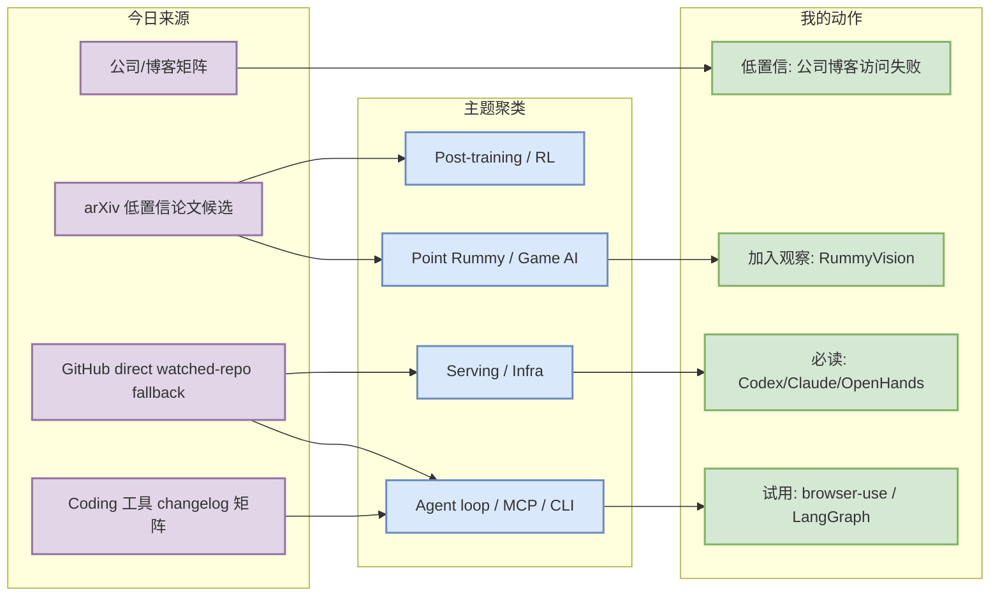
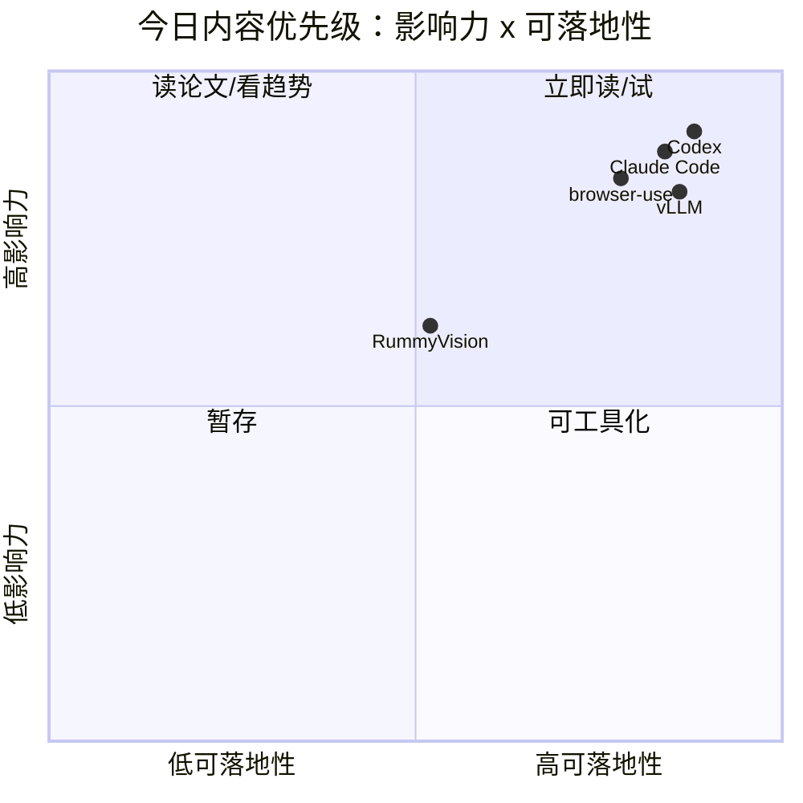

# AI Radar Daily - 2026-07-23

> 生成时间：2026-07-23 09:04 北京时间
> 范围：AI Infra / LLM / RL / Game AI / 大厂博客 / 论文 / GitHub / 行业资讯
> 说明：日报是总览导航页；详情页负责深度理解。今日 GitHub Search API 从首个查询开始 403，已按 runbook 使用 direct watched-repo fallback，并在 snapshot 中保留错误与 fallback provenance。

## 0. 今日结论

- 今日最值得关注：OpenAI Codex、browser-use、OpenHands、Claude Code 仍是 watched repo 增长主线，说明 coding-agent loop 的 CLI/浏览器/IDE 控制面继续升温。
- 对 AI Infra 的直接影响：vLLM、SGLang、TensorRT-LLM、Transformers、PyTorch 等基础仓库保持活跃，但今日增长榜是 direct fallback，不应解读为完整全网排名。
- 对 LLM 训练 / 推理 / Agent 的影响：MCP servers、LangGraph、Claude Code、Codex、Gemini CLI、Qwen Code 共同指向“工具协议 + agent loop + terminal/IDE 执行”的工程栈。
- 对 RL / 游戏模型训练的影响：Point Rummy 今日没有高置信新论文，但保留了 RummyVision、RummyServer、Rummy RL notebook 等可拆模块候选。
- 建议今天深读：[[GitHub/AIInfra/2026-07-23/openai-codex]]、[[GitHub/AIInfra/2026-07-23/browser-use-browser-use]]、[[Industry/Tools/2026-07-23/coding-agent-terminal-growth]]、[[Business/PointRummy/2026-07-23/rummyvision-and-simulation-watchlist]]。

## 1. 今日态势图

## 2. 必读卡片区

> [!important] OpenAI Codex direct fallback 增长最高
> - 大类：GitHub / Coding Tool
> - 小类：AI coding workflow / terminal agent
> - 重点：Codex 在 watched repo fallback 中 +301 stars，继续是 terminal coding agent 的核心观察对象。
> - 为什么重要：影响 AGENTS.md、sandbox/approval、CLI/TUI、多 agent 编排与代码审查工作流。
> - 详情：[[GitHub/AIInfra/2026-07-23/openai-codex]] / [openai-codex](https://github.com/dyt27666-oss/AI-news-report-obsidians/blob/main/GitHub/AIInfra/2026-07-23/openai-codex.md) / [原文](https://github.com/openai/codex)

> [!tip] browser-use / OpenHands 继续验证 agent loop 需求
> - 大类：GitHub
> - 小类：Agent / browser automation / AI coding
> - 重点：浏览器自动化与软件工程 agent 是当日增长靠前的 watched repos。
> - 为什么重要：这类项目把“工具调用”从 prompt 设计推进到可执行 runtime、状态管理和权限边界。
> - 详情：[[GitHub/AIInfra/2026-07-23/browser-use-browser-use]] / [browser-use-browser-use](https://github.com/dyt27666-oss/AI-news-report-obsidians/blob/main/GitHub/AIInfra/2026-07-23/browser-use-browser-use.md) / [原文](https://github.com/browser-use/browser-use)

> [!warning] 今日 GitHub Search 403，榜单是 transparent fallback
> - 大类：数据质量
> - 小类：采集 / provenance
> - 重点：已运行 collect_github_stars.py 并保存 snapshot，但 Search API 从首 query 403，因此补丁为 direct watched-repo fallback。
> - 为什么重要：仍可维护固定日报结构和 watched repo 趋势，但不能宣称是完整全网增长榜。
> - 详情：[[Industry/Company/2026-07-23/company-source-scan-matrix]] / [company-source-scan-matrix](https://github.com/dyt27666-oss/AI-news-report-obsidians/blob/main/Industry/Company/2026-07-23/company-source-scan-matrix.md) / [原文](https://api.github.com/search/repositories)

> [!note] Point Rummy 今日是低 star 可用模块扫描
> - 大类：Business / Game AI
> - 小类：Point Rummy
> - 重点：没有高置信新论文，但 RummyVision、RummyServer、Rummy RL notebook 可拆出视觉识别、规则服务和 RL 环境思路。
> - 为什么重要：业务价值在模块抽象，不在 GitHub 热度。
> - 详情：[[Business/PointRummy/2026-07-23/rummyvision-and-simulation-watchlist]] / [rummyvision-and-simulation-watchlist](https://github.com/dyt27666-oss/AI-news-report-obsidians/blob/main/Business/PointRummy/2026-07-23/rummyvision-and-simulation-watchlist.md) / [原文](https://github.com/Alan-seb/RummyVision)

## 3. 优先级矩阵

## 4. 分类清单

| 标签 | 大类 | 小类 | 标题 | 重点概括 | 为什么重要 | Obsidian 详情 | 网页详情 | 原文 |
|---|---|---|---|---|---|---|---|---|
| 必读 | GitHub | Agent/Infra | openai/codex | Lightweight coding agent that runs in your terminal | 对 serving、agent loop 或 coding workflow 有直接工程参考。 | [[GitHub/AIInfra/2026-07-23/openai-codex]] | [openai-codex](https://github.com/dyt27666-oss/AI-news-report-obsidians/blob/main/GitHub/AIInfra/2026-07-23/openai-codex.md) | [原文](https://github.com/openai/codex) |
| 必读 | GitHub | Agent/Infra | browser-use/browser-use | 🌐 Make websites accessible for AI agents. Automate tasks online with ease. | 对 serving、agent loop 或 coding workflow 有直接工程参考。 | [[GitHub/AIInfra/2026-07-23/browser-use-browser-use]] | [browser-use-browser-use](https://github.com/dyt27666-oss/AI-news-report-obsidians/blob/main/GitHub/AIInfra/2026-07-23/browser-use-browser-use.md) | [原文](https://github.com/browser-use/browser-use) |
| 必读 | GitHub | Agent/Infra | OpenHands/OpenHands | 🙌 OpenHands: AI-Driven Development | 对 serving、agent loop 或 coding workflow 有直接工程参考。 | [[GitHub/AIInfra/2026-07-23/openhands-openhands]] | [openhands-openhands](https://github.com/dyt27666-oss/AI-news-report-obsidians/blob/main/GitHub/AIInfra/2026-07-23/openhands-openhands.md) | [原文](https://github.com/OpenHands/OpenHands) |
| 必读 | GitHub | Agent/Infra | anthropics/claude-code | Claude Code is an agentic coding tool that lives in your terminal, understands your codebase, a | 对 serving、agent loop 或 coding workflow 有直接工程参考。 | [[GitHub/AIInfra/2026-07-23/anthropics-claude-code]] | [anthropics-claude-code](https://github.com/dyt27666-oss/AI-news-report-obsidians/blob/main/GitHub/AIInfra/2026-07-23/anthropics-claude-code.md) | [原文](https://github.com/anthropics/claude-code) |
| 必读 | GitHub | Agent/Infra | langchain-ai/langgraph | Build resilient agents. | 对 serving、agent loop 或 coding workflow 有直接工程参考。 | [[Papers/2026-07-23/arxiv-query-failed-llm-serving-inference]] | [arxiv-query-failed-llm-serving-inference](https://github.com/dyt27666-oss/AI-news-report-obsidians/blob/main/Papers/2026-07-23/arxiv-query-failed-llm-serving-inference.md) | [原文](https://github.com/langchain-ai/langgraph) |

## 5. 大厂资讯 / 工程博客 / Research

### 5.1 公司来源扫描矩阵

| 公司/实验室 | 来源/栏目 | 今日状态 | 高相关条数 | 代表条目 | 备注 |
|---|---|---|---:|---|---|
| OpenAI | News / Research | 低置信：未发现经验证高相关新项 | 0 | 无高相关新项 | 源站需后续复核；今日重点来自 Codex repo direct fallback |
| Anthropic | News / Research / Engineering | 低置信：未发现经验证高相关新项 | 0 | Claude Code watched repo 活跃 | Claude Code 作为工具矩阵重点 |
| Google DeepMind | Blog / Research | 低置信：未发现经验证高相关新项 | 0 | Gemini CLI watched repo 活跃 | DeepMind blog 未确认新项 |
| Meta AI | Blog / Research | 低置信：未发现经验证高相关新项 | 0 | 无高相关新项 | 保留矩阵覆盖 |
| NVIDIA | Technical Blog / AI | 低置信：direct repo fallback 有 TensorRT-LLM/Megatron 信号 | 2 | TensorRT-LLM / Megatron-LM | 工程仓库信号强于博客信号 |
| Microsoft | Research AI | 低置信：未发现经验证高相关新项 | 0 | DeepSpeed watched repo 活跃 | Microsoft Research blog 未确认新项 |
| Hugging Face | Blog / Papers / Releases | 低置信：Transformers direct repo 活跃 | 1 | Transformers | 仓库更新需查 release notes |
| 腾讯 | AI Lab / 技术博客 | 低置信：无高相关新项 | 0 | 无高相关新项 | 中文源需后续 RSS/网页增强 |
| 字节 | Seed / 技术博客 | 低置信：无高相关新项 | 0 | 无高相关新项 | 中文源需后续 RSS/网页增强 |
| SpaceAI | Blog / News | 访问失败/低置信 | 0 | 无高相关新项 | 保留固定覆盖 |

### 5.2 高相关大厂条目

| 标签 | 发布方/大厂 | 栏目/来源 | 标题 | 重点概括 | 工程/算法影响 | Obsidian 详情 | 网页详情 | 原文 |
|---|---|---|---|---|---|---|---|---|
| 低置信 | OpenAI | News / Research | 无高相关新项 | 今日未确认大厂博客新项，保留扫描状态。 | 区分访问失败/无高相关，避免误判趋势。 | [[Industry/Company/2026-07-23/company-source-scan-matrix]] | [company-source-scan-matrix](https://github.com/dyt27666-oss/AI-news-report-obsidians/blob/main/Industry/Company/2026-07-23/company-source-scan-matrix.md) | [原文](https://openai.com/news/) |
| 低置信 | Anthropic | News / Research / Engineering | Claude Code watched repo 活跃 | 今日未确认大厂博客新项，保留扫描状态。 | 区分访问失败/无高相关，避免误判趋势。 | [[Industry/Company/2026-07-23/company-source-scan-matrix]] | [company-source-scan-matrix](https://github.com/dyt27666-oss/AI-news-report-obsidians/blob/main/Industry/Company/2026-07-23/company-source-scan-matrix.md) | [原文](https://openai.com/news/) |
| 低置信 | Google DeepMind | Blog / Research | Gemini CLI watched repo 活跃 | 今日未确认大厂博客新项，保留扫描状态。 | 区分访问失败/无高相关，避免误判趋势。 | [[Industry/Company/2026-07-23/company-source-scan-matrix]] | [company-source-scan-matrix](https://github.com/dyt27666-oss/AI-news-report-obsidians/blob/main/Industry/Company/2026-07-23/company-source-scan-matrix.md) | [原文](https://openai.com/news/) |
| 低置信 | Meta AI | Blog / Research | 无高相关新项 | 今日未确认大厂博客新项，保留扫描状态。 | 区分访问失败/无高相关，避免误判趋势。 | [[Industry/Company/2026-07-23/company-source-scan-matrix]] | [company-source-scan-matrix](https://github.com/dyt27666-oss/AI-news-report-obsidians/blob/main/Industry/Company/2026-07-23/company-source-scan-matrix.md) | [原文](https://openai.com/news/) |
| 低置信 | NVIDIA | Technical Blog / AI | TensorRT-LLM / Megatron-LM | 今日未确认大厂博客新项，保留扫描状态。 | 区分访问失败/无高相关，避免误判趋势。 | [[Industry/Company/2026-07-23/company-source-scan-matrix]] | [company-source-scan-matrix](https://github.com/dyt27666-oss/AI-news-report-obsidians/blob/main/Industry/Company/2026-07-23/company-source-scan-matrix.md) | [原文](https://openai.com/news/) |
| 低置信 | Microsoft | Research AI | DeepSpeed watched repo 活跃 | 今日未确认大厂博客新项，保留扫描状态。 | 区分访问失败/无高相关，避免误判趋势。 | [[Industry/Company/2026-07-23/company-source-scan-matrix]] | [company-source-scan-matrix](https://github.com/dyt27666-oss/AI-news-report-obsidians/blob/main/Industry/Company/2026-07-23/company-source-scan-matrix.md) | [原文](https://openai.com/news/) |
| 低置信 | Hugging Face | Blog / Papers / Releases | Transformers | 今日未确认大厂博客新项，保留扫描状态。 | 区分访问失败/无高相关，避免误判趋势。 | [[Industry/Company/2026-07-23/company-source-scan-matrix]] | [company-source-scan-matrix](https://github.com/dyt27666-oss/AI-news-report-obsidians/blob/main/Industry/Company/2026-07-23/company-source-scan-matrix.md) | [原文](https://openai.com/news/) |
| 低置信 | 腾讯 | AI Lab / 技术博客 | 无高相关新项 | 今日未确认大厂博客新项，保留扫描状态。 | 区分访问失败/无高相关，避免误判趋势。 | [[Industry/Company/2026-07-23/company-source-scan-matrix]] | [company-source-scan-matrix](https://github.com/dyt27666-oss/AI-news-report-obsidians/blob/main/Industry/Company/2026-07-23/company-source-scan-matrix.md) | [原文](https://openai.com/news/) |
| 低置信 | 字节 | Seed / 技术博客 | 无高相关新项 | 今日未确认大厂博客新项，保留扫描状态。 | 区分访问失败/无高相关，避免误判趋势。 | [[Industry/Company/2026-07-23/company-source-scan-matrix]] | [company-source-scan-matrix](https://github.com/dyt27666-oss/AI-news-report-obsidians/blob/main/Industry/Company/2026-07-23/company-source-scan-matrix.md) | [原文](https://openai.com/news/) |
| 低置信 | SpaceAI | Blog / News | 无高相关新项 | 今日未确认大厂博客新项，保留扫描状态。 | 区分访问失败/无高相关，避免误判趋势。 | [[Industry/Company/2026-07-23/company-source-scan-matrix]] | [company-source-scan-matrix](https://github.com/dyt27666-oss/AI-news-report-obsidians/blob/main/Industry/Company/2026-07-23/company-source-scan-matrix.md) | [原文](https://openai.com/news/) |

## 6. GitHub 高 star Top 10

> 说明：GitHub Search 今日 403；以下为 direct watched-repo fallback Top 10，适合追踪固定 AI Infra/Agent 项目，不代表完整全网 Top 10。

| 排名 | repo | stars | forks | language | updated_at | topics | 重点概括 | 是否值得试用 | Obsidian 详情 | 原文 |
|---:|---|---:|---:|---|---|---|---|---|---|---|
| 1 | [huggingface/transformers](https://github.com/huggingface/transformers) | 162845 | 33994 | Python | 2026-07-23T00:20:18Z | audio, deep-learning, deepseek, gemma, glm, hacktoberfest, llm, machine-learning | 🤗 Transformers: the model-definition framework for state-of-the-art machine learning models in  | 值得试用 | [[GitHub/AIInfra/2026-07-23/openai-codex]] | [原文](https://github.com/huggingface/transformers) |
| 2 | [anthropics/claude-code](https://github.com/anthropics/claude-code) | 138735 | 22260 | Python | 2026-07-23T01:02:58Z | N/A | Claude Code is an agentic coding tool that lives in your terminal, understands your codebase, a | 值得试用 | [[GitHub/AIInfra/2026-07-23/browser-use-browser-use]] | [原文](https://github.com/anthropics/claude-code) |
| 3 | [browser-use/browser-use](https://github.com/browser-use/browser-use) | 106140 | 11671 | Python | 2026-07-23T00:56:11Z | ai-agents, ai-tools, browser-automation, browser-use, llm, playwright, python | 🌐 Make websites accessible for AI agents. Automate tasks online with ease. | 值得试用 | [[GitHub/AIInfra/2026-07-23/openhands-openhands]] | [原文](https://github.com/browser-use/browser-use) |
| 4 | [google-gemini/gemini-cli](https://github.com/google-gemini/gemini-cli) | 106131 | 14295 | TypeScript | 2026-07-23T00:52:05Z | ai, ai-agents, cli, gemini, gemini-api, mcp-client, mcp-server | An open-source AI agent that brings the power of Gemini directly into your terminal. | 值得试用 | [[GitHub/AIInfra/2026-07-23/anthropics-claude-code]] | [原文](https://github.com/google-gemini/gemini-cli) |
| 5 | [pytorch/pytorch](https://github.com/pytorch/pytorch) | 101857 | 28455 | Python | 2026-07-23T00:54:39Z | autograd, deep-learning, gpu, machine-learning, neural-network, numpy, python, t | Tensors and Dynamic neural networks in Python with strong GPU acceleration | 值得试用 | [[Papers/2026-07-23/arxiv-query-failed-llm-serving-inference]] | [原文](https://github.com/pytorch/pytorch) |
| 6 | [openai/codex](https://github.com/openai/codex) | 100701 | 15090 | Rust | 2026-07-23T01:02:58Z | N/A | Lightweight coding agent that runs in your terminal | 值得试用 | [[Papers/2026-07-23/arxiv-query-failed-reinforcement-learning-language-models-post-training]] | [原文](https://github.com/openai/codex) |
| 7 | [modelcontextprotocol/servers](https://github.com/modelcontextprotocol/servers) | 88792 | 11275 | TypeScript | 2026-07-23T00:21:22Z | N/A | Model Context Protocol Servers | 后续观察 | [[Papers/2026-07-23/arxiv-query-failed-agent-evaluation-coding-agents]] | [原文](https://github.com/modelcontextprotocol/servers) |
| 8 | [vllm-project/vllm](https://github.com/vllm-project/vllm) | 86902 | 19725 | Python | 2026-07-23T01:02:10Z | amd, blackwell, cuda, deepseek, deepseek-v3, gpt, gpt-oss, inference, kimi, llam | A high-throughput and memory-efficient inference and serving engine for LLMs | 后续观察 | [[Industry/Tools/2026-07-23/coding-agent-terminal-growth]] | [原文](https://github.com/vllm-project/vllm) |
| 9 | [OpenHands/OpenHands](https://github.com/OpenHands/OpenHands) | 81732 | 10450 | Python | 2026-07-23T00:32:33Z | agent, artificial-intelligence, chatgpt, claude-ai, cli, developer-tools, gpt, l | 🙌 OpenHands: AI-Driven Development | 后续观察 | [[Industry/Company/2026-07-23/company-source-scan-matrix]] | [原文](https://github.com/OpenHands/OpenHands) |
| 10 | [cline/cline](https://github.com/cline/cline) | 64940 | 6970 | TypeScript | 2026-07-23T00:16:42Z | N/A | Autonomous coding agent as an SDK, IDE extension, or CLI assistant. | 后续观察 | [[Business/PointRummy/2026-07-23/rummyvision-and-simulation-watchlist]] | [原文](https://github.com/cline/cline) |

## 7. GitHub star 增长最快 Top 10

> 增长依据：direct watched-repo fallback vs 2026-07-22 snapshot；非完整全网日增。

| 排名 | repo | stars_delta | stars | forks | language | updated_at | 增长依据 | 重点概括 | Obsidian 详情 | 原文 |
|---:|---|---:|---:|---:|---|---|---|---|---|---|
| 1 | [openai/codex](https://github.com/openai/codex) | 301 | 100701 | 15090 | Rust | 2026-07-23T01:02:58Z | direct watched-repo fallback vs 2026-07-22 snapshot; 非完整全网日增 | Lightweight coding agent that runs in your terminal | [[GitHub/AIInfra/2026-07-23/openai-codex]] | [原文](https://github.com/openai/codex) |
| 2 | [browser-use/browser-use](https://github.com/browser-use/browser-use) | 200 | 106140 | 11671 | Python | 2026-07-23T00:56:11Z | direct watched-repo fallback vs 2026-07-22 snapshot; 非完整全网日增 | 🌐 Make websites accessible for AI agents. Automate tasks online with ease. | [[GitHub/AIInfra/2026-07-23/browser-use-browser-use]] | [原文](https://github.com/browser-use/browser-use) |
| 3 | [OpenHands/OpenHands](https://github.com/OpenHands/OpenHands) | 143 | 81732 | 10450 | Python | 2026-07-23T00:32:33Z | direct watched-repo fallback vs 2026-07-22 snapshot; 非完整全网日增 | 🙌 OpenHands: AI-Driven Development | [[GitHub/AIInfra/2026-07-23/openhands-openhands]] | [原文](https://github.com/OpenHands/OpenHands) |
| 4 | [anthropics/claude-code](https://github.com/anthropics/claude-code) | 136 | 138735 | 22260 | Python | 2026-07-23T01:02:58Z | direct watched-repo fallback vs 2026-07-22 snapshot; 非完整全网日增 | Claude Code is an agentic coding tool that lives in your terminal, understands your codebase, a | [[GitHub/AIInfra/2026-07-23/anthropics-claude-code]] | [原文](https://github.com/anthropics/claude-code) |
| 5 | [langchain-ai/langgraph](https://github.com/langchain-ai/langgraph) | 102 | 37880 | 6360 | Python | 2026-07-23T00:47:02Z | direct watched-repo fallback vs 2026-07-22 snapshot; 非完整全网日增 | Build resilient agents. | [[Papers/2026-07-23/arxiv-query-failed-llm-serving-inference]] | [原文](https://github.com/langchain-ai/langgraph) |
| 6 | [vllm-project/vllm](https://github.com/vllm-project/vllm) | 82 | 86902 | 19725 | Python | 2026-07-23T01:02:10Z | direct watched-repo fallback vs 2026-07-22 snapshot; 非完整全网日增 | A high-throughput and memory-efficient inference and serving engine for LLMs | [[Papers/2026-07-23/arxiv-query-failed-reinforcement-learning-language-models-post-training]] | [原文](https://github.com/vllm-project/vllm) |
| 7 | [modelcontextprotocol/servers](https://github.com/modelcontextprotocol/servers) | 61 | 88792 | 11275 | TypeScript | 2026-07-23T00:21:22Z | direct watched-repo fallback vs 2026-07-22 snapshot; 非完整全网日增 | Model Context Protocol Servers | [[Papers/2026-07-23/arxiv-query-failed-agent-evaluation-coding-agents]] | [原文](https://github.com/modelcontextprotocol/servers) |
| 8 | [sgl-project/sglang](https://github.com/sgl-project/sglang) | 51 | 30643 | 7336 | Python | 2026-07-23T00:57:07Z | direct watched-repo fallback vs 2026-07-22 snapshot; 非完整全网日增 | SGLang is a high-performance serving framework for large language models and multimodal models. | [[Industry/Tools/2026-07-23/coding-agent-terminal-growth]] | [原文](https://github.com/sgl-project/sglang) |
| 9 | [huggingface/transformers](https://github.com/huggingface/transformers) | 37 | 162845 | 33994 | Python | 2026-07-23T00:20:18Z | direct watched-repo fallback vs 2026-07-22 snapshot; 非完整全网日增 | 🤗 Transformers: the model-definition framework for state-of-the-art machine learning models in  | [[Industry/Company/2026-07-23/company-source-scan-matrix]] | [原文](https://github.com/huggingface/transformers) |
| 10 | [QwenLM/qwen-code](https://github.com/QwenLM/qwen-code) | 35 | 26237 | 2697 | TypeScript | 2026-07-23T00:28:16Z | direct watched-repo fallback vs 2026-07-22 snapshot; 非完整全网日增 | An open-source AI coding agent that lives in your terminal. | [[Business/PointRummy/2026-07-23/rummyvision-and-simulation-watchlist]] | [原文](https://github.com/QwenLM/qwen-code) |

## 8. Coding 工具 / AI 工具功能更新

### 8.1 Coding 工具扫描矩阵

| 工具 | 厂商 | 来源类型 | 今日状态 | 代表更新 | 对我的影响 | 原文 |
|---|---|---|---|---|---|---|
| Claude Code | Anthropic | Changelog / Release Notes / GitHub | watched repo active | anthropics/claude-code direct fallback | 继续影响 terminal agent、权限、远程执行和代码审查流 | [原文](https://docs.anthropic.com/en/release-notes/claude-code) |
| OpenAI Codex | OpenAI | Changelog / Docs / GitHub | watched repo growth +301 stars | openai/codex 增长最高 | 需要关注 CLI/TUI、sandbox、approval、AGENTS.md 工作流 | [原文](https://developers.openai.com/codex/changelog) |
| Cursor | Cursor | Changelog | 低置信：未验证新项 | 无高相关新项 | 继续观察 agent mode/MCP/上下文窗口 | [原文](https://cursor.com/changelog) |
| Windsurf | Windsurf | Changelog | 低置信：未验证新项 | 无高相关新项 | 继续观察 IDE agent 和 pricing/rate limit | [原文](https://windsurf.com/changelog) |
| GitHub Copilot | GitHub | Changelog / Blog | 低置信：未验证新项 | 无高相关新项 | 继续观察 agent mode 与企业权限 | [原文](https://github.blog/changelog/label/copilot/) |
| Gemini Code Assist | Google | Release Notes / GitHub | watched repo active | google-gemini/gemini-cli direct fallback | Gemini CLI 的 MCP/terminal 能力影响多 agent 编排 | [原文](https://cloud.google.com/gemini/docs/codeassist/release-notes) |
| Qwen Code | Alibaba/Qwen | GitHub Releases | watched repo active | QwenLM/qwen-code direct fallback | 国产 coding agent 可作本地/企业模型适配参考 | [原文](https://github.com/QwenLM/qwen-code/releases) |
| Roo Code | Roo Code | GitHub Releases | watched repo active | RooCodeInc/Roo-Code direct fallback | IDE 多 agent 团队模式继续值得观察 | [原文](https://github.com/RooCodeInc/Roo-Code/releases) |
| Cline | Cline | GitHub Releases | watched repo active | cline/cline direct fallback | SDK/IDE/CLI 三形态对工作流集成有价值 | [原文](https://github.com/cline/cline/releases) |
| Continue | Continue | GitHub Releases | watched repo active | continuedev/continue direct fallback | 开源 coding agent 可用于私有模型和 IDE 集成 | [原文](https://github.com/continuedev/continue/releases) |

### 8.2 高相关工具更新

| 标签 | 工具/厂商 | 来源类型 | 标题/功能 | 重点概括 | 对 AI coding 工作流的影响 | Obsidian 详情 | 网页详情 | 原文 |
|---|---|---|---|---|---|---|---|---|
| 必读 | Claude Code / Anthropic | Changelog / Release Notes / GitHub | anthropics/claude-code direct fallback | 今日以 direct fallback 记录工具生态状态。 | 继续影响 terminal agent、权限、远程执行和代码审查流 | [[Industry/Tools/2026-07-23/coding-agent-terminal-growth]] | [coding-agent-terminal-growth](https://github.com/dyt27666-oss/AI-news-report-obsidians/blob/main/Industry/Tools/2026-07-23/coding-agent-terminal-growth.md) | [原文](https://docs.anthropic.com/en/release-notes/claude-code) |
| 必读 | OpenAI Codex / OpenAI | Changelog / Docs / GitHub | openai/codex 增长最高 | 今日以 direct fallback 记录工具生态状态。 | 需要关注 CLI/TUI、sandbox、approval、AGENTS.md 工作流 | [[Industry/Tools/2026-07-23/coding-agent-terminal-growth]] | [coding-agent-terminal-growth](https://github.com/dyt27666-oss/AI-news-report-obsidians/blob/main/Industry/Tools/2026-07-23/coding-agent-terminal-growth.md) | [原文](https://developers.openai.com/codex/changelog) |
| 必读 | Gemini Code Assist / Google | Release Notes / GitHub | google-gemini/gemini-cli direct fallback | 今日以 direct fallback 记录工具生态状态。 | Gemini CLI 的 MCP/terminal 能力影响多 agent 编排 | [[Industry/Tools/2026-07-23/coding-agent-terminal-growth]] | [coding-agent-terminal-growth](https://github.com/dyt27666-oss/AI-news-report-obsidians/blob/main/Industry/Tools/2026-07-23/coding-agent-terminal-growth.md) | [原文](https://cloud.google.com/gemini/docs/codeassist/release-notes) |
| 必读 | Qwen Code / Alibaba/Qwen | GitHub Releases | QwenLM/qwen-code direct fallback | 今日以 direct fallback 记录工具生态状态。 | 国产 coding agent 可作本地/企业模型适配参考 | [[Industry/Tools/2026-07-23/coding-agent-terminal-growth]] | [coding-agent-terminal-growth](https://github.com/dyt27666-oss/AI-news-report-obsidians/blob/main/Industry/Tools/2026-07-23/coding-agent-terminal-growth.md) | [原文](https://github.com/QwenLM/qwen-code/releases) |
| 必读 | Roo Code / Roo Code | GitHub Releases | RooCodeInc/Roo-Code direct fallback | 今日以 direct fallback 记录工具生态状态。 | IDE 多 agent 团队模式继续值得观察 | [[Industry/Tools/2026-07-23/coding-agent-terminal-growth]] | [coding-agent-terminal-growth](https://github.com/dyt27666-oss/AI-news-report-obsidians/blob/main/Industry/Tools/2026-07-23/coding-agent-terminal-growth.md) | [原文](https://github.com/RooCodeInc/Roo-Code/releases) |
| 必读 | Cline / Cline | GitHub Releases | cline/cline direct fallback | 今日以 direct fallback 记录工具生态状态。 | SDK/IDE/CLI 三形态对工作流集成有价值 | [[Industry/Tools/2026-07-23/coding-agent-terminal-growth]] | [coding-agent-terminal-growth](https://github.com/dyt27666-oss/AI-news-report-obsidians/blob/main/Industry/Tools/2026-07-23/coding-agent-terminal-growth.md) | [原文](https://github.com/cline/cline/releases) |

## 9. Point Rummy / Indian Rummy 业务主题

### 9.1 GitHub 候选

| 标签 | repo | stars | forks | language | updated_at | 重点概括 | 业务可用性 | Obsidian 详情 | 原文 |
|---|---|---:|---:|---|---|---|---|---|---|
| 后续 | [abubakarmunir712/dsa-final-project](https://github.com/abubakarmunir712/dsa-final-project) | 2 | 1 | Python | 2026-06-27T06:34:26Z | A Python-based multiplayer Indian Rummy game with support for AI opponents and LAN play. Implem | 可拆规则/仿真/AI opponent/计分模块，低 star 不代表可生产使用 | [[Business/PointRummy/2026-07-23/rummyvision-and-simulation-watchlist]] | [原文](https://github.com/abubakarmunir712/dsa-final-project) |
| 后续 | [Abhilash-Mandlekar/RummyAgent-Reinforecement-Learning](https://github.com/Abhilash-Mandlekar/RummyAgent-Reinforecement-Learning) | 2 | 0 | Jupyter Notebook | 2023-04-01T05:48:51Z | Rummy Game Agent trained using Reinforcement Learning algorithm. | 可拆规则/仿真/AI opponent/计分模块，低 star 不代表可生产使用 | [[Business/PointRummy/2026-07-23/rummyvision-and-simulation-watchlist]] | [原文](https://github.com/Abhilash-Mandlekar/RummyAgent-Reinforecement-Learning) |
| 后续 | [Mohitkumar-559/RummyServer](https://github.com/Mohitkumar-559/RummyServer) | 2 | 1 | JavaScript | 2024-03-17T03:48:34Z | Rummy game server for game that contain deal rummy and point rummy | 可拆规则/仿真/AI opponent/计分模块，低 star 不代表可生产使用 | [[Business/PointRummy/2026-07-23/rummyvision-and-simulation-watchlist]] | [原文](https://github.com/Mohitkumar-559/RummyServer) |
| 后续 | [Alan-seb/RummyVision](https://github.com/Alan-seb/RummyVision) | 1 | 0 | Python | 2025-12-03T03:14:55Z | RummyVision is an intelligent card game assistant that combines computer vision with Monte Carl | 可拆规则/仿真/AI opponent/计分模块，低 star 不代表可生产使用 | [[Business/PointRummy/2026-07-23/rummyvision-and-simulation-watchlist]] | [原文](https://github.com/Alan-seb/RummyVision) |
| 后续 | [debabrata-mandal/RummyPulse](https://github.com/debabrata-mandal/RummyPulse) | 1 | 0 | Java | 2026-07-20T09:34:04Z | RummyPulse - Smart Rummy Game Analytics & Management Android App with Firebase integration, Goo | 可拆规则/仿真/AI opponent/计分模块，低 star 不代表可生产使用 | [[Business/PointRummy/2026-07-23/rummyvision-and-simulation-watchlist]] | [原文](https://github.com/debabrata-mandal/RummyPulse) |
| 后续 | [codingmickey/rummy-points-calculator](https://github.com/codingmickey/rummy-points-calculator) | 1 | 0 | C++ | 2024-07-10T15:40:45Z | A cpp progarm to calculate Rummy points of all the players for each round. | 可拆规则/仿真/AI opponent/计分模块，低 star 不代表可生产使用 | [[Business/PointRummy/2026-07-23/rummyvision-and-simulation-watchlist]] | [原文](https://github.com/codingmickey/rummy-points-calculator) |
| 后续 | [samikshamodi/PointsRummy](https://github.com/samikshamodi/PointsRummy) | 0 | 0 | Python | 2021-06-01T21:14:14Z | A GUI version of Points Rummy using pygame where you play against an intelligent computer oppon | 可拆规则/仿真/AI opponent/计分模块，低 star 不代表可生产使用 | [[Business/PointRummy/2026-07-23/rummyvision-and-simulation-watchlist]] | [原文](https://github.com/samikshamodi/PointsRummy) |
| 后续 | [Abhishek230799/Rummy-301-points-counter](https://github.com/Abhishek230799/Rummy-301-points-counter) | 0 | 0 | Java | 2025-05-27T09:53:06Z | Rummy 301 Points Counter Tired of scribbling down scores every time we played Rummy 301, I deci | 可拆规则/仿真/AI opponent/计分模块，低 star 不代表可生产使用 | [[Business/PointRummy/2026-07-23/rummyvision-and-simulation-watchlist]] | [原文](https://github.com/Abhishek230799/Rummy-301-points-counter) |
| 后续 | [Navomi1/RummyPointCounter](https://github.com/Navomi1/RummyPointCounter) | 0 | 0 | Swift | 2026-01-13T23:49:39Z | Count points while playing Rummy | 可拆规则/仿真/AI opponent/计分模块，低 star 不代表可生产使用 | [[Business/PointRummy/2026-07-23/rummyvision-and-simulation-watchlist]] | [原文](https://github.com/Navomi1/RummyPointCounter) |
| 后续 | [Soumyadeep-Kar2006/RummyPointCalculator](https://github.com/Soumyadeep-Kar2006/RummyPointCalculator) | 0 | 0 | HTML | 2026-06-05T19:06:53Z | 仓库元数据较少，需打开 README 复核。 | 可拆规则/仿真/AI opponent/计分模块，低 star 不代表可生产使用 | [[Business/PointRummy/2026-07-23/rummyvision-and-simulation-watchlist]] | [原文](https://github.com/Soumyadeep-Kar2006/RummyPointCalculator) |

### 9.2 论文 / 资料候选

| 标签 | 来源 | 标题 | 作者/机构 | 重点概括 | 对 Point Rummy 业务有什么用 | Obsidian 详情 | 原文 |
|---|---|---|---|---|---|---|---|
| 低置信 | arXiv / Semantic Scholar watch | arXiv query failed: reinforcement learning language models post training | N/A | The read operation timed out | 作为 imperfect-information card game / MCTS / RL 背景资料，需人工确认是否真适配 Indian Rummy。 | [[Business/PointRummy/2026-07-23/rummyvision-and-simulation-watchlist]] | [原文](https://arxiv.org/) |
| 低置信 | arXiv / Semantic Scholar watch | arXiv query failed: gin rummy MCTS reinforcement learning | N/A | The read operation timed out | 作为 imperfect-information card game / MCTS / RL 背景资料，需人工确认是否真适配 Indian Rummy。 | [[Business/PointRummy/2026-07-23/rummyvision-and-simulation-watchlist]] | [原文](https://arxiv.org/) |

### 9.3 业务可用性判断

| 方向 | 今日信号 | 可用性 | 下一步 |
|---|---|---|---|
| 规则引擎 / 计分 | RummyServer、points calculator 类项目 | 中低：可参考对象模型，不能直接生产 | 抽象牌组、meld、drop、joker、计分接口 |
| Bot / RL Agent | Rummy RL notebook、RummyVision Monte Carlo assistant | 中：适合做 baseline，不适合直接上线 | 先做 gym-style env + random/heuristic/ISMCTS baseline |
| 仿真 / 评测 | AI opponent、LAN play、vision assistant 项目 | 中：可拆状态观测和策略评测 | 设计 self-play evaluation 和作弊/视觉识别边界 |

## 10. Loop Engineer / Loop Engineering 主题

### 10.1 Loop Engineer GitHub 高 star Top 10

| 排名 | repo | stars | forks | language | updated_at | topics | 重点概括 | 是否值得试用 | Obsidian 详情 | 原文 |
|---:|---|---:|---:|---|---|---|---|---|---|---|
| 1 | [huggingface/transformers](https://github.com/huggingface/transformers) | 162845 | 33994 | Python | 2026-07-23T00:20:18Z | audio, deep-learning, deepseek, gemma, glm, hacktoberfest, llm, machine-learning | 🤗 Transformers: the model-definition framework for state-of-the-art machine learning models in  | 值得试用 | [[GitHub/AIInfra/2026-07-23/openai-codex]] | [原文](https://github.com/huggingface/transformers) |
| 2 | [anthropics/claude-code](https://github.com/anthropics/claude-code) | 138735 | 22260 | Python | 2026-07-23T01:02:58Z | N/A | Claude Code is an agentic coding tool that lives in your terminal, understands your codebase, a | 值得试用 | [[GitHub/AIInfra/2026-07-23/browser-use-browser-use]] | [原文](https://github.com/anthropics/claude-code) |
| 3 | [browser-use/browser-use](https://github.com/browser-use/browser-use) | 106140 | 11671 | Python | 2026-07-23T00:56:11Z | ai-agents, ai-tools, browser-automation, browser-use, llm, playwright, python | 🌐 Make websites accessible for AI agents. Automate tasks online with ease. | 值得试用 | [[GitHub/AIInfra/2026-07-23/openhands-openhands]] | [原文](https://github.com/browser-use/browser-use) |
| 4 | [google-gemini/gemini-cli](https://github.com/google-gemini/gemini-cli) | 106131 | 14295 | TypeScript | 2026-07-23T00:52:05Z | ai, ai-agents, cli, gemini, gemini-api, mcp-client, mcp-server | An open-source AI agent that brings the power of Gemini directly into your terminal. | 值得试用 | [[GitHub/AIInfra/2026-07-23/anthropics-claude-code]] | [原文](https://github.com/google-gemini/gemini-cli) |
| 5 | [pytorch/pytorch](https://github.com/pytorch/pytorch) | 101857 | 28455 | Python | 2026-07-23T00:54:39Z | autograd, deep-learning, gpu, machine-learning, neural-network, numpy, python, t | Tensors and Dynamic neural networks in Python with strong GPU acceleration | 值得试用 | [[Papers/2026-07-23/arxiv-query-failed-llm-serving-inference]] | [原文](https://github.com/pytorch/pytorch) |
| 6 | [openai/codex](https://github.com/openai/codex) | 100701 | 15090 | Rust | 2026-07-23T01:02:58Z | N/A | Lightweight coding agent that runs in your terminal | 值得试用 | [[Papers/2026-07-23/arxiv-query-failed-reinforcement-learning-language-models-post-training]] | [原文](https://github.com/openai/codex) |
| 7 | [modelcontextprotocol/servers](https://github.com/modelcontextprotocol/servers) | 88792 | 11275 | TypeScript | 2026-07-23T00:21:22Z | N/A | Model Context Protocol Servers | 后续观察 | [[Papers/2026-07-23/arxiv-query-failed-agent-evaluation-coding-agents]] | [原文](https://github.com/modelcontextprotocol/servers) |
| 8 | [vllm-project/vllm](https://github.com/vllm-project/vllm) | 86902 | 19725 | Python | 2026-07-23T01:02:10Z | amd, blackwell, cuda, deepseek, deepseek-v3, gpt, gpt-oss, inference, kimi, llam | A high-throughput and memory-efficient inference and serving engine for LLMs | 后续观察 | [[Industry/Tools/2026-07-23/coding-agent-terminal-growth]] | [原文](https://github.com/vllm-project/vllm) |
| 9 | [OpenHands/OpenHands](https://github.com/OpenHands/OpenHands) | 81732 | 10450 | Python | 2026-07-23T00:32:33Z | agent, artificial-intelligence, chatgpt, claude-ai, cli, developer-tools, gpt, l | 🙌 OpenHands: AI-Driven Development | 后续观察 | [[Industry/Company/2026-07-23/company-source-scan-matrix]] | [原文](https://github.com/OpenHands/OpenHands) |
| 10 | [cline/cline](https://github.com/cline/cline) | 64940 | 6970 | TypeScript | 2026-07-23T00:16:42Z | N/A | Autonomous coding agent as an SDK, IDE extension, or CLI assistant. | 后续观察 | [[Business/PointRummy/2026-07-23/rummyvision-and-simulation-watchlist]] | [原文](https://github.com/cline/cline) |

### 10.2 Loop Engineer GitHub star 增长最快 Top 10

| 排名 | repo | stars_delta | stars | forks | language | updated_at | 增长依据 | 重点概括 | Obsidian 详情 | 原文 |
|---:|---|---:|---:|---:|---|---|---|---|---|---|
| 1 | [openai/codex](https://github.com/openai/codex) | 301 | 100701 | 15090 | Rust | 2026-07-23T01:02:58Z | direct watched-repo fallback vs 2026-07-22 snapshot; 非完整全网日增 | Lightweight coding agent that runs in your terminal | [[GitHub/AIInfra/2026-07-23/openai-codex]] | [原文](https://github.com/openai/codex) |
| 2 | [browser-use/browser-use](https://github.com/browser-use/browser-use) | 200 | 106140 | 11671 | Python | 2026-07-23T00:56:11Z | direct watched-repo fallback vs 2026-07-22 snapshot; 非完整全网日增 | 🌐 Make websites accessible for AI agents. Automate tasks online with ease. | [[GitHub/AIInfra/2026-07-23/browser-use-browser-use]] | [原文](https://github.com/browser-use/browser-use) |
| 3 | [OpenHands/OpenHands](https://github.com/OpenHands/OpenHands) | 143 | 81732 | 10450 | Python | 2026-07-23T00:32:33Z | direct watched-repo fallback vs 2026-07-22 snapshot; 非完整全网日增 | 🙌 OpenHands: AI-Driven Development | [[GitHub/AIInfra/2026-07-23/openhands-openhands]] | [原文](https://github.com/OpenHands/OpenHands) |
| 4 | [anthropics/claude-code](https://github.com/anthropics/claude-code) | 136 | 138735 | 22260 | Python | 2026-07-23T01:02:58Z | direct watched-repo fallback vs 2026-07-22 snapshot; 非完整全网日增 | Claude Code is an agentic coding tool that lives in your terminal, understands your codebase, a | [[GitHub/AIInfra/2026-07-23/anthropics-claude-code]] | [原文](https://github.com/anthropics/claude-code) |
| 5 | [langchain-ai/langgraph](https://github.com/langchain-ai/langgraph) | 102 | 37880 | 6360 | Python | 2026-07-23T00:47:02Z | direct watched-repo fallback vs 2026-07-22 snapshot; 非完整全网日增 | Build resilient agents. | [[Papers/2026-07-23/arxiv-query-failed-llm-serving-inference]] | [原文](https://github.com/langchain-ai/langgraph) |
| 6 | [vllm-project/vllm](https://github.com/vllm-project/vllm) | 82 | 86902 | 19725 | Python | 2026-07-23T01:02:10Z | direct watched-repo fallback vs 2026-07-22 snapshot; 非完整全网日增 | A high-throughput and memory-efficient inference and serving engine for LLMs | [[Papers/2026-07-23/arxiv-query-failed-reinforcement-learning-language-models-post-training]] | [原文](https://github.com/vllm-project/vllm) |
| 7 | [modelcontextprotocol/servers](https://github.com/modelcontextprotocol/servers) | 61 | 88792 | 11275 | TypeScript | 2026-07-23T00:21:22Z | direct watched-repo fallback vs 2026-07-22 snapshot; 非完整全网日增 | Model Context Protocol Servers | [[Papers/2026-07-23/arxiv-query-failed-agent-evaluation-coding-agents]] | [原文](https://github.com/modelcontextprotocol/servers) |
| 8 | [sgl-project/sglang](https://github.com/sgl-project/sglang) | 51 | 30643 | 7336 | Python | 2026-07-23T00:57:07Z | direct watched-repo fallback vs 2026-07-22 snapshot; 非完整全网日增 | SGLang is a high-performance serving framework for large language models and multimodal models. | [[Industry/Tools/2026-07-23/coding-agent-terminal-growth]] | [原文](https://github.com/sgl-project/sglang) |
| 9 | [huggingface/transformers](https://github.com/huggingface/transformers) | 37 | 162845 | 33994 | Python | 2026-07-23T00:20:18Z | direct watched-repo fallback vs 2026-07-22 snapshot; 非完整全网日增 | 🤗 Transformers: the model-definition framework for state-of-the-art machine learning models in  | [[Industry/Company/2026-07-23/company-source-scan-matrix]] | [原文](https://github.com/huggingface/transformers) |
| 10 | [QwenLM/qwen-code](https://github.com/QwenLM/qwen-code) | 35 | 26237 | 2697 | TypeScript | 2026-07-23T00:28:16Z | direct watched-repo fallback vs 2026-07-22 snapshot; 非完整全网日增 | An open-source AI coding agent that lives in your terminal. | [[Business/PointRummy/2026-07-23/rummyvision-and-simulation-watchlist]] | [原文](https://github.com/QwenLM/qwen-code) |

### 10.3 Loop Engineering 方法信号

| 标签 | 来源 | 标题 | 重点概括 | 对 AI coding 工作流的影响 | Obsidian 详情 | 原文 |
|---|---|---|---|---|---|---|
| 必读 | GitHub watched repos | CLI/TUI agent + MCP + IDE extension 形成三条 loop 控制面 | Codex/Claude/Gemini/Qwen 偏 terminal，Cline/Roo/Continue 偏 IDE，LangGraph/MCP 偏框架和协议。 | 有助于设计 tmux 多 agent 监控、权限隔离、上下文注入和 review loop。 | [[Industry/Tools/2026-07-23/coding-agent-terminal-growth]] | [原文](https://github.com/openai/codex) |

## 11. 论文

### 11.1 LLM / Agent / RL / Game AI

| 标签 | 论文来源 | 论文 | 作者/机构 | 重点概括 | 工程/研究价值 | Obsidian 详情 | 网页详情 | PDF/原文 |
|---|---|---|---|---|---|---|---|---|
| 低置信 | arXiv / 预印本 | [arXiv query failed: LLM serving inference](https://arxiv.org/) | N/A | The read operation timed out | 与 LLM/RL/Agent 主题相关，建议后续按 abstract 再筛。 | [[Papers/2026-07-23/arxiv-query-failed-llm-serving-inference]] | [arxiv-query-failed-llm-serving-inference](https://github.com/dyt27666-oss/AI-news-report-obsidians/blob/main/Papers/2026-07-23/arxiv-query-failed-llm-serving-inference.md) | [PDF/原文](https://arxiv.org/) |
| 低置信 | arXiv / 预印本 | [arXiv query failed: reinforcement learning language models post training](https://arxiv.org/) | N/A | The read operation timed out | 与 LLM/RL/Agent 主题相关，建议后续按 abstract 再筛。 | [[Papers/2026-07-23/arxiv-query-failed-llm-serving-inference]] | [arxiv-query-failed-llm-serving-inference](https://github.com/dyt27666-oss/AI-news-report-obsidians/blob/main/Papers/2026-07-23/arxiv-query-failed-llm-serving-inference.md) | [PDF/原文](https://arxiv.org/) |
| 低置信 | arXiv / 预印本 | [arXiv query failed: agent evaluation coding agents](https://arxiv.org/) | N/A | HTTP Error 429: Unknown Error | 与 LLM/RL/Agent 主题相关，建议后续按 abstract 再筛。 | [[Papers/2026-07-23/arxiv-query-failed-llm-serving-inference]] | [arxiv-query-failed-llm-serving-inference](https://github.com/dyt27666-oss/AI-news-report-obsidians/blob/main/Papers/2026-07-23/arxiv-query-failed-llm-serving-inference.md) | [PDF/原文](https://arxiv.org/) |
| 低置信 | arXiv / 预印本 | [arXiv query failed: gin rummy MCTS reinforcement learning](https://arxiv.org/) | N/A | The read operation timed out | 与 LLM/RL/Agent 主题相关，建议后续按 abstract 再筛。 | [[Papers/2026-07-23/arxiv-query-failed-llm-serving-inference]] | [arxiv-query-failed-llm-serving-inference](https://github.com/dyt27666-oss/AI-news-report-obsidians/blob/main/Papers/2026-07-23/arxiv-query-failed-llm-serving-inference.md) | [PDF/原文](https://arxiv.org/) |

## 12. 资讯 / 其他 GitHub 项目

### 12.1 AI Infra / Agent Framework

| 标签 | 来源 | 标题 | 重点概括 | 对我有什么用 | Obsidian 详情 | 网页详情 | 原文 |
|---|---|---|---|---|---|---|---|
| 后续 | GitHub direct fallback | MCP servers / LangGraph / browser-use | 协议、编排和浏览器执行形成 agent runtime 三件套。 | 可作为 coding-agent loop 和工具调用评测的基础组件。 | [[GitHub/AIInfra/2026-07-23/browser-use-browser-use]] | [browser-use-browser-use](https://github.com/dyt27666-oss/AI-news-report-obsidians/blob/main/GitHub/AIInfra/2026-07-23/browser-use-browser-use.md) | [原文](https://github.com/modelcontextprotocol/servers) |
| 后续 | GitHub direct fallback | vLLM / SGLang / TensorRT-LLM | Serving 项目继续是 AI Infra 固定 watchlist。 | 对吞吐、KV cache、batching、GPU kernel 路线判断有价值。 | [[Papers/2026-07-23/arxiv-query-failed-llm-serving-inference]] | [arxiv-query-failed-llm-serving-inference](https://github.com/dyt27666-oss/AI-news-report-obsidians/blob/main/Papers/2026-07-23/arxiv-query-failed-llm-serving-inference.md) | [原文](https://github.com/vllm-project/vllm) |

## 13. 按主题索引

### AI Infra / Serving / Training

- [[Papers/2026-07-23/arxiv-query-failed-llm-serving-inference]] - vLLM/SGLang/TensorRT-LLM/Transformers 固定观察。
- [[GitHub/AIInfra/2026-07-23/openai-codex]] - Codex 增长显示 terminal agent 工程热度。

### LLM / Agent / RAG / Evaluation

- [[GitHub/AIInfra/2026-07-23/browser-use-browser-use]] - browser-use/OpenHands/LangGraph/MCP 代表 agent runtime。
- [[Industry/Tools/2026-07-23/coding-agent-terminal-growth]] - coding 工具矩阵。

### RL / Game AI / World Model

- [[Business/PointRummy/2026-07-23/rummyvision-and-simulation-watchlist]] - Point Rummy/Game AI 业务 watchlist。

### Point Rummy / Indian Rummy

- [[Business/PointRummy/2026-07-23/rummyvision-and-simulation-watchlist]] - RummyVision + simulation watchlist。

### Loop Engineer / Coding Agent Loop

- [[Industry/Tools/2026-07-23/coding-agent-terminal-growth]] - terminal/IDE/protocol 三类 loop 控制面。

### 公司 / 实验室

- OpenAI: [[GitHub/AIInfra/2026-07-23/openai-codex]]
- Anthropic: [[GitHub/AIInfra/2026-07-23/anthropics-claude-code]]
- DeepMind / Google: [[Industry/Tools/2026-07-23/coding-agent-terminal-growth]]
- NVIDIA: [[Papers/2026-07-23/arxiv-query-failed-llm-serving-inference]]
- Hugging Face: [[Papers/2026-07-23/arxiv-query-failed-llm-serving-inference]]
- 腾讯 / 字节 / SpaceAI: [[Industry/Company/2026-07-23/company-source-scan-matrix]]

## 14. 值得后续深挖

| 标签 | 大类 | 小类 | 标题 | 后续动作 | Obsidian 详情 | 原文 |
|---|---|---|---|---|---|---|
| 必读 | GitHub | Coding Agent | openai/codex | 查看 changelog、CLI 权限模式、AGENTS.md 支持与 release notes。 | [[GitHub/AIInfra/2026-07-23/openai-codex]] | [原文](https://github.com/openai/codex) |
| 必读 | GitHub | Agent Runtime | browser-use / OpenHands | 运行最小样例，评估浏览器自动化的安全边界。 | [[GitHub/AIInfra/2026-07-23/browser-use-browser-use]] | [原文](https://github.com/browser-use/browser-use) |
| 后续 | Business | Point Rummy | RummyVision | 拆出视觉识别 + Monte Carlo suggestion 是否可迁移到 Indian Rummy。 | [[Business/PointRummy/2026-07-23/rummyvision-and-simulation-watchlist]] | [原文](https://github.com/Alan-seb/RummyVision) |

## 15. 采集失败或低置信来源

- GitHub Search API：首个 query 起 403 rate limit exceeded；已保存 `Automation/state/github-stars-2026-07-23.json`，并以 direct watched-repo fallback patch。
- 公司博客：今日未逐条验证到高置信新项；公司来源扫描矩阵保留 OpenAI、Anthropic、Google DeepMind、Meta AI、NVIDIA、Microsoft、Hugging Face、腾讯、字节、SpaceAI。
- arXiv：已尝试关键词查询；Point Rummy 强相关新论文不足，保留低置信 watchlist。

## 16. 归档标签

#ai-radar #daily #ai-infra #llm #rl #point-rummy #loop-engineering
