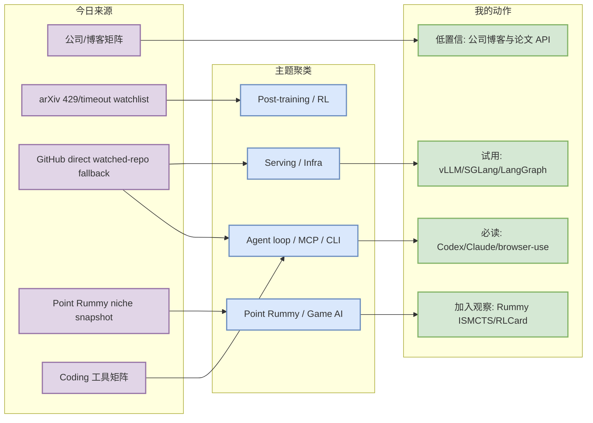
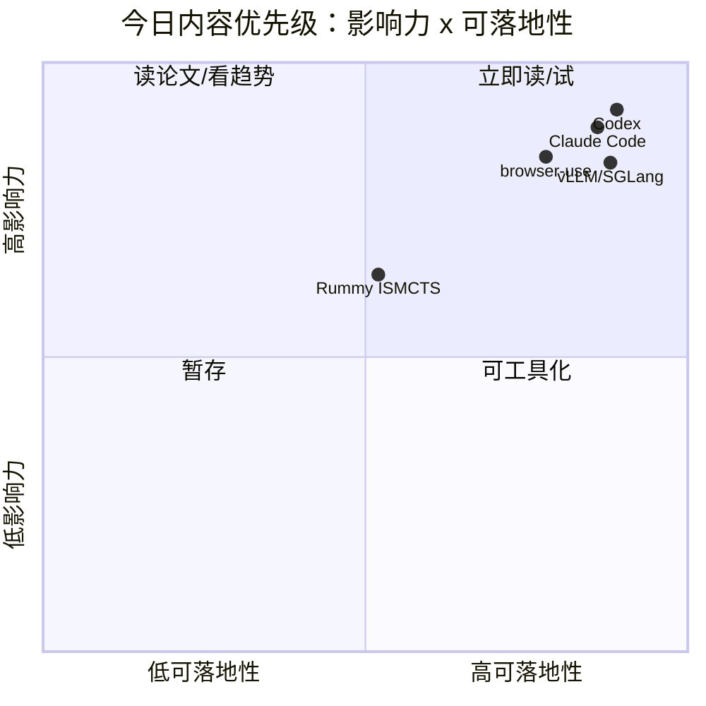

# AI Radar Daily - 2026-07-24

> 生成时间：2026-07-24 09:00 北京时间
> 范围：AI Infra / LLM / RL / Game AI / 大厂博客 / 论文 / GitHub / 行业资讯
> 说明：日报是总览导航页；详情页负责深度理解。今日 GitHub Search 在 Point Rummy niche 查询后 403，已保存原始 snapshot，并用 direct watched-repo fallback 补齐 AI Infra / Loop Engineer 固定表。

## 0. 今日结论

- 今日最值得关注：OpenAI Codex、Claude Code、browser-use、Gemini CLI 继续构成 coding-agent loop 的 terminal/browser/IDE 控制面。
- 对 AI Infra 的直接影响：vLLM、SGLang、TensorRT-LLM、Transformers、PyTorch 保持活跃，但今日 Top 10 是 direct watched-repo fallback，不代表完整全网榜。
- 对 LLM 训练 / 推理 / Agent 的影响：MCP servers、LangGraph、Cline/Roo/Continue 说明协议层、编排层、IDE extension 层仍在收敛。
- 对 RL / 游戏模型训练的影响：Point Rummy 没有高置信新论文；可用信号主要来自低 star 规则引擎、ISMCTS、RLCard 环境和视觉/Monte Carlo assistant。
- 建议今天深读：[[GitHub/AIInfra/2026-07-24/openai-codex]]、[[GitHub/AIInfra/2026-07-24/browser-use-browser-use]]、[[GitHub/AIInfra/2026-07-24/vllm-and-sglang-serving-watchlist]]、[[Business/PointRummy/2026-07-24/rummy-simulation-watchlist]]。

## 1. 今日态势图

## 2. 必读卡片区

> [!important] OpenAI Codex / Claude Code 继续定义 terminal coding-agent loop
> - 大类：GitHub / Coding Tool
> - 小类：AI coding workflow / terminal agent
> - 重点：Codex、Claude Code、Gemini CLI、Qwen Code 共同指向 CLI/TUI + 权限 + 上下文 + repo-local rules 的工程形态。
> - 为什么重要：这会直接影响多 agent 编排、代码审查、sandbox/approval、AGENTS.md 和远程执行策略。
> - 详情：[[GitHub/AIInfra/2026-07-24/openai-codex]] / [网页详情](https://github.com/dyt27666-oss/AI-news-report-obsidians/blob/main/GitHub/AIInfra/2026-07-24/openai-codex.md) / [原文](https://github.com/openai/codex)

> [!tip] browser-use / LangGraph / MCP servers 是 agent runtime 三件套
> - 大类：GitHub
> - 小类：Agent runtime / tool protocol
> - 重点：浏览器执行、图式编排、工具协议分别解决 agent loop 的执行面、状态面、集成面。
> - 为什么重要：如果要做稳定 coding agent 或 eval loop，不能只看 prompt，需要 runtime、权限和可观测性。
> - 详情：[[GitHub/AIInfra/2026-07-24/browser-use-browser-use]] / [网页详情](https://github.com/dyt27666-oss/AI-news-report-obsidians/blob/main/GitHub/AIInfra/2026-07-24/browser-use-browser-use.md) / [原文](https://github.com/browser-use/browser-use)

> [!note] vLLM / SGLang / TensorRT-LLM 仍是 Serving 固定观察线
> - 大类：GitHub / AI Infra
> - 小类：LLM Serving
> - 重点：今日 direct fallback 只说明 watched repos 活跃，不说明全网增长排名。
> - 为什么重要：这些仓库仍决定吞吐、KV cache、batching、scheduler、kernel 优化路线。
> - 详情：[[GitHub/AIInfra/2026-07-24/vllm-and-sglang-serving-watchlist]] / [网页详情](https://github.com/dyt27666-oss/AI-news-report-obsidians/blob/main/GitHub/AIInfra/2026-07-24/vllm-and-sglang-serving-watchlist.md) / [原文](https://github.com/vllm-project/vllm)

> [!warning] Point Rummy 今日是低 star 模块扫描，不是成熟方案推荐
> - 大类：Business / Game AI
> - 小类：Point Rummy
> - 重点：nakkekakke/rummy-ai、IRumAI、RummyVision、RummyServer 等可拆 ISMCTS、RL 环境、计分、视觉识别模块。
> - 为什么重要：业务价值在规则建模、环境并行和评测 baseline，不在 GitHub 热度。
> - 详情：[[Business/PointRummy/2026-07-24/rummy-simulation-watchlist]] / [网页详情](https://github.com/dyt27666-oss/AI-news-report-obsidians/blob/main/Business/PointRummy/2026-07-24/rummy-simulation-watchlist.md) / [原文](https://github.com/nakkekakke/rummy-ai)

## 3. 优先级矩阵

## 4. 分类清单

| 标签 | 大类 | 小类 | 标题 | 重点概括 | 为什么重要 | Obsidian 详情 | 网页详情 | 原文 |
|---|---|---|---|---|---|---|---|---|
| 必读 | GitHub | Coding Agent | openai/codex | Codex 在 watched repo 中继续高增长。 | 直接影响 terminal agent、sandbox、AGENTS.md 与 review loop。 | [[GitHub/AIInfra/2026-07-24/openai-codex]] | [网页详情](https://github.com/dyt27666-oss/AI-news-report-obsidians/blob/main/GitHub/AIInfra/2026-07-24/openai-codex.md) | [原文](https://github.com/openai/codex) |
| 必读 | GitHub | Agent Runtime | browser-use/browser-use | 浏览器自动化仍是 agent runtime 的关键路径。 | 影响 tool execution、安全边界和端到端任务评测。 | [[GitHub/AIInfra/2026-07-24/browser-use-browser-use]] | [网页详情](https://github.com/dyt27666-oss/AI-news-report-obsidians/blob/main/GitHub/AIInfra/2026-07-24/browser-use-browser-use.md) | [原文](https://github.com/browser-use/browser-use) |
| 必读 | GitHub | Serving | vLLM / SGLang | Serving 固定 watchlist 保持活跃。 | 对 KV cache、batching、scheduler、GPU kernel 路线判断有价值。 | [[GitHub/AIInfra/2026-07-24/vllm-and-sglang-serving-watchlist]] | [网页详情](https://github.com/dyt27666-oss/AI-news-report-obsidians/blob/main/GitHub/AIInfra/2026-07-24/vllm-and-sglang-serving-watchlist.md) | [原文](https://github.com/vllm-project/vllm) |
| 后续 | Business | Point Rummy | Rummy simulation watchlist | 低 star 项目中仍有规则引擎、ISMCTS、RLCard 环境可拆。 | 可服务 Indian Rummy 环境建模和 baseline bot。 | [[Business/PointRummy/2026-07-24/rummy-simulation-watchlist]] | [网页详情](https://github.com/dyt27666-oss/AI-news-report-obsidians/blob/main/Business/PointRummy/2026-07-24/rummy-simulation-watchlist.md) | [原文](https://github.com/nakkekakke/rummy-ai) |

## 5. 大厂资讯 / 工程博客 / Research

### 5.1 公司来源扫描矩阵

| 公司/实验室 | 来源/栏目 | 今日状态 | 高相关条数 | 代表条目 | 备注 |
|---|---|---|---:|---|---|
| OpenAI | News / Research | 低置信：未确认博客新项；Codex repo 活跃 | 1 | openai/codex | 工具仓库信号强于 News 信号 |
| Anthropic | News / Research / Engineering | 低置信：未确认博客新项；Claude Code repo 活跃 | 1 | anthropics/claude-code | 工具矩阵重点 |
| Google DeepMind | Blog / Research | 低置信：Gemini CLI repo 活跃，DeepMind blog 未确认 | 1 | google-gemini/gemini-cli | 需后续复核 blog |
| Meta AI | Blog / Research | 无高相关新项 / 低置信 | 0 | 无高相关新项 | 保留固定覆盖 |
| NVIDIA | Technical Blog / AI | 低置信：TensorRT-LLM/Megatron direct repo 活跃 | 2 | TensorRT-LLM / Megatron-LM | 工程仓库信号强 |
| Microsoft | Research AI | 低置信：DeepSpeed direct repo 活跃 | 1 | microsoft/DeepSpeed | Research AI 页面未确认新项 |
| Hugging Face | Blog / Papers / Releases | 低置信：Transformers direct repo 活跃 | 1 | huggingface/transformers | release notes 需复核 |
| 腾讯 | AI Lab / 技术博客 | 无高相关新项 / 低置信 | 0 | 无高相关新项 | 保留固定覆盖 |
| 字节 | Seed / 技术博客 | 无高相关新项 / 低置信 | 0 | 无高相关新项 | 保留固定覆盖 |
| SpaceAI | Blog / News | 无高相关新项 / 低置信 | 0 | 无高相关新项 | 保留固定覆盖 |

### 5.2 高相关大厂条目

| 标签 | 发布方/大厂 | 栏目/来源 | 标题 | 重点概括 | 工程/算法影响 | Obsidian 详情 | 网页详情 | 原文 |
|---|---|---|---|---|---|---|---|---|
| 低置信 | OpenAI | News / Research | 今日扫描状态 | 未确认可作为强结论的大厂博客新项；保留矩阵 provenance。 | 避免把访问失败误报成趋势，同时保留 fixed coverage。 | [[Industry/Company/2026-07-24/company-source-scan-matrix]] | [网页详情](https://github.com/dyt27666-oss/AI-news-report-obsidians/blob/main/Industry/Company/2026-07-24/company-source-scan-matrix.md) | [原文](https://openai.com/news/) |
| 低置信 | Anthropic | News / Research / Engineering | 今日扫描状态 | 未确认可作为强结论的大厂博客新项；保留矩阵 provenance。 | 避免把访问失败误报成趋势，同时保留 fixed coverage。 | [[Industry/Company/2026-07-24/company-source-scan-matrix]] | [网页详情](https://github.com/dyt27666-oss/AI-news-report-obsidians/blob/main/Industry/Company/2026-07-24/company-source-scan-matrix.md) | [原文](https://www.anthropic.com/news) |
| 低置信 | Google DeepMind | Blog / Research | 今日扫描状态 | 未确认可作为强结论的大厂博客新项；保留矩阵 provenance。 | 避免把访问失败误报成趋势，同时保留 fixed coverage。 | [[Industry/Company/2026-07-24/company-source-scan-matrix]] | [网页详情](https://github.com/dyt27666-oss/AI-news-report-obsidians/blob/main/Industry/Company/2026-07-24/company-source-scan-matrix.md) | [原文](https://deepmind.google/discover/blog/) |
| 低置信 | Meta AI | Blog / Research | 今日扫描状态 | 未确认可作为强结论的大厂博客新项；保留矩阵 provenance。 | 避免把访问失败误报成趋势，同时保留 fixed coverage。 | [[Industry/Company/2026-07-24/company-source-scan-matrix]] | [网页详情](https://github.com/dyt27666-oss/AI-news-report-obsidians/blob/main/Industry/Company/2026-07-24/company-source-scan-matrix.md) | [原文](https://ai.meta.com/blog/) |
| 低置信 | NVIDIA | Technical Blog / AI | 今日扫描状态 | 未确认可作为强结论的大厂博客新项；保留矩阵 provenance。 | 避免把访问失败误报成趋势，同时保留 fixed coverage。 | [[Industry/Company/2026-07-24/company-source-scan-matrix]] | [网页详情](https://github.com/dyt27666-oss/AI-news-report-obsidians/blob/main/Industry/Company/2026-07-24/company-source-scan-matrix.md) | [原文](https://developer.nvidia.com/blog/category/artificial-intelligence/) |
| 低置信 | Microsoft | Research AI | 今日扫描状态 | 未确认可作为强结论的大厂博客新项；保留矩阵 provenance。 | 避免把访问失败误报成趋势，同时保留 fixed coverage。 | [[Industry/Company/2026-07-24/company-source-scan-matrix]] | [网页详情](https://github.com/dyt27666-oss/AI-news-report-obsidians/blob/main/Industry/Company/2026-07-24/company-source-scan-matrix.md) | [原文](https://www.microsoft.com/en-us/research/research-area/artificial-intelligence/) |
| 低置信 | Hugging Face | Blog / Papers / Releases | 今日扫描状态 | 未确认可作为强结论的大厂博客新项；保留矩阵 provenance。 | 避免把访问失败误报成趋势，同时保留 fixed coverage。 | [[Industry/Company/2026-07-24/company-source-scan-matrix]] | [网页详情](https://github.com/dyt27666-oss/AI-news-report-obsidians/blob/main/Industry/Company/2026-07-24/company-source-scan-matrix.md) | [原文](https://huggingface.co/blog) |
| 低置信 | 腾讯 | AI Lab / 技术博客 | 今日扫描状态 | 未确认可作为强结论的大厂博客新项；保留矩阵 provenance。 | 避免把访问失败误报成趋势，同时保留 fixed coverage。 | [[Industry/Company/2026-07-24/company-source-scan-matrix]] | [网页详情](https://github.com/dyt27666-oss/AI-news-report-obsidians/blob/main/Industry/Company/2026-07-24/company-source-scan-matrix.md) | [原文](https://ai.tencent.com/ailab/en/index) |
| 低置信 | 字节 | Seed / 技术博客 | 今日扫描状态 | 未确认可作为强结论的大厂博客新项；保留矩阵 provenance。 | 避免把访问失败误报成趋势，同时保留 fixed coverage。 | [[Industry/Company/2026-07-24/company-source-scan-matrix]] | [网页详情](https://github.com/dyt27666-oss/AI-news-report-obsidians/blob/main/Industry/Company/2026-07-24/company-source-scan-matrix.md) | [原文](https://seed.bytedance.com/en/) |
| 低置信 | SpaceAI | Blog / News | 今日扫描状态 | 未确认可作为强结论的大厂博客新项；保留矩阵 provenance。 | 避免把访问失败误报成趋势，同时保留 fixed coverage。 | [[Industry/Company/2026-07-24/company-source-scan-matrix]] | [网页详情](https://github.com/dyt27666-oss/AI-news-report-obsidians/blob/main/Industry/Company/2026-07-24/company-source-scan-matrix.md) | [原文](https://spaceai.com/) |

## 6. GitHub 高 star Top 10

> 说明：GitHub Search 今日被 403 rate limit；以下为 direct watched-repo fallback Top 10，适合追踪固定 AI Infra/Agent 项目，不代表完整全网 Top 10。

| 排名 | repo | stars | forks | language | updated_at | topics | 重点概括 | 是否值得试用 | Obsidian 详情 | 原文 |
|---:|---|---:|---:|---|---|---|---|---|---|---|
| 1 | [huggingface/transformers](https://github.com/huggingface/transformers) | 162890 | 34006 | Python | 2026-07-24T00:57:05Z | audio, deep-learning, deepseek, gemma, glm, hacktoberfest, llm, machine-learning | 🤗 Transformers: the model-definition framework for state-of-the-art machine learning models  | 值得试用 | [[GitHub/AIInfra/2026-07-24/vllm-and-sglang-serving-watchlist]] | [原文](https://github.com/huggingface/transformers) |
| 2 | [anthropics/claude-code](https://github.com/anthropics/claude-code) | 138858 | 22284 | Python | 2026-07-24T00:57:00Z | N/A | Claude Code is an agentic coding tool that lives in your terminal, understands your codebase | 值得试用 | [[GitHub/AIInfra/2026-07-24/vllm-and-sglang-serving-watchlist]] | [原文](https://github.com/anthropics/claude-code) |
| 3 | [browser-use/browser-use](https://github.com/browser-use/browser-use) | 106392 | 11700 | Python | 2026-07-24T00:52:01Z | ai-agents, ai-tools, browser-automation, browser-use, llm, playwright, python | 🌐 Make websites accessible for AI agents. Automate tasks online with ease. | 值得试用 | [[GitHub/AIInfra/2026-07-24/browser-use-browser-use]] | [原文](https://github.com/browser-use/browser-use) |
| 4 | [google-gemini/gemini-cli](https://github.com/google-gemini/gemini-cli) | 106145 | 14304 | TypeScript | 2026-07-24T00:52:56Z | ai, ai-agents, cli, gemini, gemini-api, mcp-client, mcp-server | An open-source AI agent that brings the power of Gemini directly into your terminal. | 值得试用 | [[GitHub/AIInfra/2026-07-24/vllm-and-sglang-serving-watchlist]] | [原文](https://github.com/google-gemini/gemini-cli) |
| 5 | [pytorch/pytorch](https://github.com/pytorch/pytorch) | 101891 | 28472 | Python | 2026-07-24T00:57:33Z | autograd, deep-learning, gpu, machine-learning, neural-network, numpy, python, tensor | Tensors and Dynamic neural networks in Python with strong GPU acceleration | 值得试用 | [[GitHub/AIInfra/2026-07-24/vllm-and-sglang-serving-watchlist]] | [原文](https://github.com/pytorch/pytorch) |
| 6 | [openai/codex](https://github.com/openai/codex) | 100989 | 15137 | Rust | 2026-07-24T01:06:11Z | N/A | Lightweight coding agent that runs in your terminal | 值得试用 | [[GitHub/AIInfra/2026-07-24/openai-codex]] | [原文](https://github.com/openai/codex) |
| 7 | [modelcontextprotocol/servers](https://github.com/modelcontextprotocol/servers) | 88819 | 11278 | TypeScript | 2026-07-24T00:09:34Z | N/A | Model Context Protocol Servers | 后续观察 | [[GitHub/AIInfra/2026-07-24/vllm-and-sglang-serving-watchlist]] | [原文](https://github.com/modelcontextprotocol/servers) |
| 8 | [vllm-project/vllm](https://github.com/vllm-project/vllm) | 86997 | 19775 | Python | 2026-07-24T00:46:38Z | amd, blackwell, cuda, deepseek, deepseek-v3, gpt, gpt-oss, inference | A high-throughput and memory-efficient inference and serving engine for LLMs | 后续观察 | [[GitHub/AIInfra/2026-07-24/vllm-and-sglang-serving-watchlist]] | [原文](https://github.com/vllm-project/vllm) |
| 9 | [OpenHands/OpenHands](https://github.com/OpenHands/OpenHands) | 81871 | 10467 | Python | 2026-07-24T00:40:27Z | agent, artificial-intelligence, chatgpt, claude-ai, cli, developer-tools, gpt, llm | 🙌 OpenHands: AI-Driven Development | 后续观察 | [[GitHub/AIInfra/2026-07-24/vllm-and-sglang-serving-watchlist]] | [原文](https://github.com/OpenHands/OpenHands) |
| 10 | [cline/cline](https://github.com/cline/cline) | 64985 | 6975 | TypeScript | 2026-07-24T00:50:14Z | N/A | Autonomous coding agent as an SDK, IDE extension, or CLI assistant. | 后续观察 | [[GitHub/AIInfra/2026-07-24/vllm-and-sglang-serving-watchlist]] | [原文](https://github.com/cline/cline) |

## 7. GitHub star 增长最快 Top 10

> 增长依据：direct watched-repo fallback vs 2026-07-23 snapshot；非完整全网日增。今日 snapshot 已保存：`Automation/state/github-stars-2026-07-24.json`。

| 排名 | repo | stars_delta | stars | forks | language | updated_at | 增长依据 | 重点概括 | Obsidian 详情 | 原文 |
|---:|---|---:|---:|---:|---|---|---|---|---|---|
| 1 | [openai/codex](https://github.com/openai/codex) | 288 | 100989 | 15137 | Rust | 2026-07-24T01:06:11Z | direct watched-repo fallback vs 2026-07-23 snapshot; 非完整全网日增 | Lightweight coding agent that runs in your terminal | [[GitHub/AIInfra/2026-07-24/openai-codex]] | [原文](https://github.com/openai/codex) |
| 2 | [browser-use/browser-use](https://github.com/browser-use/browser-use) | 252 | 106392 | 11700 | Python | 2026-07-24T00:52:01Z | direct watched-repo fallback vs 2026-07-23 snapshot; 非完整全网日增 | 🌐 Make websites accessible for AI agents. Automate tasks online with ease. | [[GitHub/AIInfra/2026-07-24/browser-use-browser-use]] | [原文](https://github.com/browser-use/browser-use) |
| 3 | [OpenHands/OpenHands](https://github.com/OpenHands/OpenHands) | 139 | 81871 | 10467 | Python | 2026-07-24T00:40:27Z | direct watched-repo fallback vs 2026-07-23 snapshot; 非完整全网日增 | 🙌 OpenHands: AI-Driven Development | [[GitHub/AIInfra/2026-07-24/vllm-and-sglang-serving-watchlist]] | [原文](https://github.com/OpenHands/OpenHands) |
| 4 | [anthropics/claude-code](https://github.com/anthropics/claude-code) | 123 | 138858 | 22284 | Python | 2026-07-24T00:57:00Z | direct watched-repo fallback vs 2026-07-23 snapshot; 非完整全网日增 | Claude Code is an agentic coding tool that lives in your terminal, understands your codebase | [[GitHub/AIInfra/2026-07-24/vllm-and-sglang-serving-watchlist]] | [原文](https://github.com/anthropics/claude-code) |
| 5 | [vllm-project/vllm](https://github.com/vllm-project/vllm) | 95 | 86997 | 19775 | Python | 2026-07-24T00:46:38Z | direct watched-repo fallback vs 2026-07-23 snapshot; 非完整全网日增 | A high-throughput and memory-efficient inference and serving engine for LLMs | [[GitHub/AIInfra/2026-07-24/vllm-and-sglang-serving-watchlist]] | [原文](https://github.com/vllm-project/vllm) |
| 6 | [langchain-ai/langgraph](https://github.com/langchain-ai/langgraph) | 82 | 37962 | 6383 | Python | 2026-07-24T01:01:12Z | direct watched-repo fallback vs 2026-07-23 snapshot; 非完整全网日增 | Build resilient agents. | [[GitHub/AIInfra/2026-07-24/vllm-and-sglang-serving-watchlist]] | [原文](https://github.com/langchain-ai/langgraph) |
| 7 | [huggingface/transformers](https://github.com/huggingface/transformers) | 45 | 162890 | 34006 | Python | 2026-07-24T00:57:05Z | direct watched-repo fallback vs 2026-07-23 snapshot; 非完整全网日增 | 🤗 Transformers: the model-definition framework for state-of-the-art machine learning models  | [[GitHub/AIInfra/2026-07-24/vllm-and-sglang-serving-watchlist]] | [原文](https://github.com/huggingface/transformers) |
| 8 | [cline/cline](https://github.com/cline/cline) | 45 | 64985 | 6975 | TypeScript | 2026-07-24T00:50:14Z | direct watched-repo fallback vs 2026-07-23 snapshot; 非完整全网日增 | Autonomous coding agent as an SDK, IDE extension, or CLI assistant. | [[GitHub/AIInfra/2026-07-24/vllm-and-sglang-serving-watchlist]] | [原文](https://github.com/cline/cline) |
| 9 | [pytorch/pytorch](https://github.com/pytorch/pytorch) | 34 | 101891 | 28472 | Python | 2026-07-24T00:57:33Z | direct watched-repo fallback vs 2026-07-23 snapshot; 非完整全网日增 | Tensors and Dynamic neural networks in Python with strong GPU acceleration | [[GitHub/AIInfra/2026-07-24/vllm-and-sglang-serving-watchlist]] | [原文](https://github.com/pytorch/pytorch) |
| 10 | [sgl-project/sglang](https://github.com/sgl-project/sglang) | 32 | 30675 | 7360 | Python | 2026-07-24T00:41:08Z | direct watched-repo fallback vs 2026-07-23 snapshot; 非完整全网日增 | SGLang is a high-performance serving framework for large language models and multimodal mode | [[GitHub/AIInfra/2026-07-24/vllm-and-sglang-serving-watchlist]] | [原文](https://github.com/sgl-project/sglang) |

## 8. Coding 工具 / AI 工具功能更新

### 8.1 Coding 工具扫描矩阵

| 工具 | 厂商 | 来源类型 | 今日状态 | 代表更新 | 对我的影响 | 原文 |
|---|---|---|---|---|---|---|
| Claude Code | Anthropic | Changelog / Release Notes / GitHub | watched repo active / direct fallback | anthropics/claude-code stars 138858，日变化 123 | terminal agent、权限模式、远程执行与代码审查 loop | [原文](https://docs.anthropic.com/en/release-notes/claude-code) |
| OpenAI Codex | OpenAI | Changelog / Docs / GitHub | watched repo active / direct fallback | openai/codex stars 100989，日变化 288 | CLI/TUI、sandbox、approval 与 AGENTS.md 工作流 | [原文](https://developers.openai.com/codex/changelog) |
| Cursor | Cursor | Changelog | 低置信：未验证新项 | 无高相关新项 | 继续观察 agent mode、MCP、上下文窗口与定价 | [原文](https://cursor.com/changelog) |
| Windsurf | Windsurf | Changelog | 低置信：未验证新项 | 无高相关新项 | 继续观察 IDE agent、远程执行和 rate limit | [原文](https://windsurf.com/changelog) |
| GitHub Copilot | GitHub | Changelog / Blog | 低置信：未验证新项 | 无高相关新项 | 继续观察 agent mode、企业权限和 IDE 集成 | [原文](https://github.blog/changelog/label/copilot/) |
| Gemini Code Assist | Google | Release Notes / GitHub | watched repo active / direct fallback | google-gemini/gemini-cli stars 106145，日变化 14 | Gemini CLI 的 MCP/terminal 能力影响多 agent 编排 | [原文](https://cloud.google.com/gemini/docs/codeassist/release-notes) |
| Qwen Code | Alibaba/Qwen | GitHub Releases | watched repo active / direct fallback | QwenLM/qwen-code stars 26265，日变化 28 | 国产 coding agent 可作本地/企业模型适配参考 | [原文](https://github.com/QwenLM/qwen-code/releases) |
| Roo Code | Roo Code | GitHub Releases | watched repo active / direct fallback | RooCodeInc/Roo-Code stars 24360，日变化 2 | IDE 多 agent 团队模式和 mode 配置值得跟踪 | [原文](https://github.com/RooCodeInc/Roo-Code/releases) |
| Cline | Cline | GitHub Releases | watched repo active / direct fallback | cline/cline stars 64985，日变化 45 | SDK/IDE/CLI 三形态对工作流集成有价值 | [原文](https://github.com/cline/cline/releases) |
| Continue | Continue | GitHub Releases | watched repo active / direct fallback | continuedev/continue stars 35066，日变化 32 | 开源 coding agent 可用于私有模型和 IDE 集成 | [原文](https://github.com/continuedev/continue/releases) |

### 8.2 高相关工具更新

| 标签 | 工具/厂商 | 来源类型 | 标题/功能 | 重点概括 | 对 AI coding 工作流的影响 | Obsidian 详情 | 网页详情 | 原文 |
|---|---|---|---|---|---|---|---|---|
| 必读 | Claude Code / Anthropic | Changelog / Release Notes / GitHub | anthropics/claude-code stars 138858，日变化 123 | 今日以 direct fallback 记录工具生态状态。 | terminal agent、权限模式、远程执行与代码审查 loop | [[Industry/Tools/2026-07-24/coding-agent-terminal-growth]] | [网页详情](https://github.com/dyt27666-oss/AI-news-report-obsidians/blob/main/Industry/Tools/2026-07-24/coding-agent-terminal-growth.md) | [原文](https://docs.anthropic.com/en/release-notes/claude-code) |
| 必读 | OpenAI Codex / OpenAI | Changelog / Docs / GitHub | openai/codex stars 100989，日变化 288 | 今日以 direct fallback 记录工具生态状态。 | CLI/TUI、sandbox、approval 与 AGENTS.md 工作流 | [[Industry/Tools/2026-07-24/coding-agent-terminal-growth]] | [网页详情](https://github.com/dyt27666-oss/AI-news-report-obsidians/blob/main/Industry/Tools/2026-07-24/coding-agent-terminal-growth.md) | [原文](https://developers.openai.com/codex/changelog) |
| 必读 | Gemini Code Assist / Google | Release Notes / GitHub | google-gemini/gemini-cli stars 106145，日变化 14 | 今日以 direct fallback 记录工具生态状态。 | Gemini CLI 的 MCP/terminal 能力影响多 agent 编排 | [[Industry/Tools/2026-07-24/coding-agent-terminal-growth]] | [网页详情](https://github.com/dyt27666-oss/AI-news-report-obsidians/blob/main/Industry/Tools/2026-07-24/coding-agent-terminal-growth.md) | [原文](https://cloud.google.com/gemini/docs/codeassist/release-notes) |
| 必读 | Qwen Code / Alibaba/Qwen | GitHub Releases | QwenLM/qwen-code stars 26265，日变化 28 | 今日以 direct fallback 记录工具生态状态。 | 国产 coding agent 可作本地/企业模型适配参考 | [[Industry/Tools/2026-07-24/coding-agent-terminal-growth]] | [网页详情](https://github.com/dyt27666-oss/AI-news-report-obsidians/blob/main/Industry/Tools/2026-07-24/coding-agent-terminal-growth.md) | [原文](https://github.com/QwenLM/qwen-code/releases) |
| 必读 | Roo Code / Roo Code | GitHub Releases | RooCodeInc/Roo-Code stars 24360，日变化 2 | 今日以 direct fallback 记录工具生态状态。 | IDE 多 agent 团队模式和 mode 配置值得跟踪 | [[Industry/Tools/2026-07-24/coding-agent-terminal-growth]] | [网页详情](https://github.com/dyt27666-oss/AI-news-report-obsidians/blob/main/Industry/Tools/2026-07-24/coding-agent-terminal-growth.md) | [原文](https://github.com/RooCodeInc/Roo-Code/releases) |
| 必读 | Cline / Cline | GitHub Releases | cline/cline stars 64985，日变化 45 | 今日以 direct fallback 记录工具生态状态。 | SDK/IDE/CLI 三形态对工作流集成有价值 | [[Industry/Tools/2026-07-24/coding-agent-terminal-growth]] | [网页详情](https://github.com/dyt27666-oss/AI-news-report-obsidians/blob/main/Industry/Tools/2026-07-24/coding-agent-terminal-growth.md) | [原文](https://github.com/cline/cline/releases) |
| 必读 | Continue / Continue | GitHub Releases | continuedev/continue stars 35066，日变化 32 | 今日以 direct fallback 记录工具生态状态。 | 开源 coding agent 可用于私有模型和 IDE 集成 | [[Industry/Tools/2026-07-24/coding-agent-terminal-growth]] | [网页详情](https://github.com/dyt27666-oss/AI-news-report-obsidians/blob/main/Industry/Tools/2026-07-24/coding-agent-terminal-growth.md) | [原文](https://github.com/continuedev/continue/releases) |

## 9. Point Rummy / Indian Rummy 业务主题

### 9.1 GitHub 候选

| 标签 | repo | stars | forks | language | updated_at | 重点概括 | 业务可用性 | Obsidian 详情 | 原文 |
|---|---|---:|---:|---|---|---|---|---|---|
| 后续 | [rickgorman/gin-rummy-ai](https://github.com/rickgorman/gin-rummy-ai) | 13 | 5 | Python | 2025-03-25T13:47:09Z | A hand-rolled neuroevolution AI for gin rummy. | 可拆规则/仿真/AI opponent/计分/视觉识别模块；低 star 不代表生产可用 | [[Business/PointRummy/2026-07-24/rummy-simulation-watchlist]] | [原文](https://github.com/rickgorman/gin-rummy-ai) |
| 后续 | [nakkekakke/rummy-ai](https://github.com/nakkekakke/rummy-ai) | 11 | 5 | Java | 2026-04-17T10:02:59Z | Text based classic Rummy game with an AI that uses ISMCTS. Data Structures and Algorithms co | 可拆规则/仿真/AI opponent/计分/视觉识别模块；低 star 不代表生产可用 | [[Business/PointRummy/2026-07-24/rummy-simulation-watchlist]] | [原文](https://github.com/nakkekakke/rummy-ai) |
| 后续 | [jmhummel/Gin-Rummy-Java](https://github.com/jmhummel/Gin-Rummy-Java) | 8 | 0 | Java | 2023-08-16T16:12:58Z | Java-based Gin Rummy console game, with an AI opponent | 可拆规则/仿真/AI opponent/计分/视觉识别模块；低 star 不代表生产可用 | [[Business/PointRummy/2026-07-24/rummy-simulation-watchlist]] | [原文](https://github.com/jmhummel/Gin-Rummy-Java) |
| 后续 | [mudont/indian-rummy](https://github.com/mudont/indian-rummy) | 5 | 0 | TypeScript | 2025-08-08T21:05:04Z | Typescript library for Indian Rummy card game | 可拆规则/仿真/AI opponent/计分/视觉识别模块；低 star 不代表生产可用 | [[Business/PointRummy/2026-07-24/rummy-simulation-watchlist]] | [原文](https://github.com/mudont/indian-rummy) |
| 后续 | [dv-rastogi/Rummy](https://github.com/dv-rastogi/Rummy) | 5 | 0 | Python | 2023-09-26T11:21:39Z | Variation of classical Indian Rummy made in Pygame | 可拆规则/仿真/AI opponent/计分/视觉识别模块；低 star 不代表生产可用 | [[Business/PointRummy/2026-07-24/rummy-simulation-watchlist]] | [原文](https://github.com/dv-rastogi/Rummy) |
| 后续 | [SCFlanagan/Rummy](https://github.com/SCFlanagan/Rummy) | 4 | 6 | JavaScript | 2025-07-25T21:17:08Z | This project is a recreation of the classic card game Rummy. It features an AI player to pla | 可拆规则/仿真/AI opponent/计分/视觉识别模块；低 star 不代表生产可用 | [[Business/PointRummy/2026-07-24/rummy-simulation-watchlist]] | [原文](https://github.com/SCFlanagan/Rummy) |
| 后续 | [mcartmell/gin-rummy-bot](https://github.com/mcartmell/gin-rummy-bot) | 4 | 2 | Perl | 2024-10-30T20:06:17Z | A web-based Gin Rummy game and AI | 可拆规则/仿真/AI opponent/计分/视觉识别模块；低 star 不代表生产可用 | [[Business/PointRummy/2026-07-24/rummy-simulation-watchlist]] | [原文](https://github.com/mcartmell/gin-rummy-bot) |
| 后续 | [vahsek300501/Indian-Rummy-](https://github.com/vahsek300501/Indian-Rummy-) | 4 | 3 | Python | 2023-09-26T11:21:46Z | Indian Rummy made in Python using PyGame | 可拆规则/仿真/AI opponent/计分/视觉识别模块；低 star 不代表生产可用 | [[Business/PointRummy/2026-07-24/rummy-simulation-watchlist]] | [原文](https://github.com/vahsek300501/Indian-Rummy-) |
| 后续 | [abubakarmunir712/dsa-final-project](https://github.com/abubakarmunir712/dsa-final-project) | 2 | 1 | Python | 2026-06-27T06:34:26Z | A Python-based multiplayer Indian Rummy game with support for AI opponents and LAN play. Imp | 可拆规则/仿真/AI opponent/计分/视觉识别模块；低 star 不代表生产可用 | [[Business/PointRummy/2026-07-24/rummy-simulation-watchlist]] | [原文](https://github.com/abubakarmunir712/dsa-final-project) |
| 后续 | [rawbeen248/Gin-Rummy-AI-vs-Human](https://github.com/rawbeen248/Gin-Rummy-AI-vs-Human) | 2 | 0 | Python | 2024-11-16T17:18:48Z | Gin-Rummy-AI-vs-Human is a python-based project the simulates the classic card game Gin Rumm | 可拆规则/仿真/AI opponent/计分/视觉识别模块；低 star 不代表生产可用 | [[Business/PointRummy/2026-07-24/rummy-simulation-watchlist]] | [原文](https://github.com/rawbeen248/Gin-Rummy-AI-vs-Human) |

### 9.2 论文 / 资料候选

| 标签 | 来源 | 标题 | 作者/机构 | 重点概括 | 对 Point Rummy 业务有什么用 | Obsidian 详情 | 原文 |
|---|---|---|---|---|---|---|---|
| 低置信 | arXiv / Semantic Scholar watch | gin rummy MCTS reinforcement learning 查询失败 | N/A | arXiv 429/timeout；未发现可确认的新强相关论文。 | 保留 imperfect-information card game / MCTS / RL 背景方向，稍后复核。 | [[Papers/2026-07-24/arxiv-low-confidence-watchlist]] | [原文](https://arxiv.org/) |
| 后续 | GitHub / 代码资料 | nakkekakke/rummy-ai ISMCTS | University of Helsinki course project | Rummy AI 使用 ISMCTS，可作为不完美信息牌局 baseline。 | 可迁移为 Indian Rummy bot baseline 和评测对照。 | [[Business/PointRummy/2026-07-24/rummy-simulation-watchlist]] | [原文](https://github.com/nakkekakke/rummy-ai) |

### 9.3 业务可用性判断

| 方向 | 今日信号 | 可用性 | 下一步 |
|---|---|---|---|
| 规则引擎 / 计分 | RummyServer、points calculator、Indian Rummy TS library | 中低：可参考对象模型，不能直接生产 | 抽象 deck、joker、meld、drop、declare、settlement 接口 |
| Bot / RL Agent | ISMCTS、DQN/RLCard、Rummy RL notebooks | 中：适合 baseline，不适合直接上线 | 先做 gym-style env + random/heuristic/ISMCTS baseline |
| 仿真 / 评测 | RummyVision、AI opponent、LAN/multiplayer repos | 中：可拆状态观测、视觉识别、self-play eval | 设计并行仿真、作弊检测和策略评测指标 |

## 10. Loop Engineer / Loop Engineering 主题

### 10.1 Loop Engineer GitHub 高 star Top 10

| 排名 | repo | stars | forks | language | updated_at | topics | 重点概括 | 是否值得试用 | Obsidian 详情 | 原文 |
|---:|---|---:|---:|---|---|---|---|---|---|---|
| 1 | [anthropics/claude-code](https://github.com/anthropics/claude-code) | 138858 | 22284 | Python | 2026-07-24T00:57:00Z | N/A | Claude Code is an agentic coding tool that lives in your terminal, understands your codebase | 值得试用 | [[GitHub/AIInfra/2026-07-24/vllm-and-sglang-serving-watchlist]] | [原文](https://github.com/anthropics/claude-code) |
| 2 | [browser-use/browser-use](https://github.com/browser-use/browser-use) | 106392 | 11700 | Python | 2026-07-24T00:52:01Z | ai-agents, ai-tools, browser-automation, browser-use, llm, playwright, python | 🌐 Make websites accessible for AI agents. Automate tasks online with ease. | 值得试用 | [[GitHub/AIInfra/2026-07-24/browser-use-browser-use]] | [原文](https://github.com/browser-use/browser-use) |
| 3 | [google-gemini/gemini-cli](https://github.com/google-gemini/gemini-cli) | 106145 | 14304 | TypeScript | 2026-07-24T00:52:56Z | ai, ai-agents, cli, gemini, gemini-api, mcp-client, mcp-server | An open-source AI agent that brings the power of Gemini directly into your terminal. | 值得试用 | [[GitHub/AIInfra/2026-07-24/vllm-and-sglang-serving-watchlist]] | [原文](https://github.com/google-gemini/gemini-cli) |
| 4 | [openai/codex](https://github.com/openai/codex) | 100989 | 15137 | Rust | 2026-07-24T01:06:11Z | N/A | Lightweight coding agent that runs in your terminal | 值得试用 | [[GitHub/AIInfra/2026-07-24/openai-codex]] | [原文](https://github.com/openai/codex) |
| 5 | [modelcontextprotocol/servers](https://github.com/modelcontextprotocol/servers) | 88819 | 11278 | TypeScript | 2026-07-24T00:09:34Z | N/A | Model Context Protocol Servers | 值得试用 | [[GitHub/AIInfra/2026-07-24/vllm-and-sglang-serving-watchlist]] | [原文](https://github.com/modelcontextprotocol/servers) |
| 6 | [OpenHands/OpenHands](https://github.com/OpenHands/OpenHands) | 81871 | 10467 | Python | 2026-07-24T00:40:27Z | agent, artificial-intelligence, chatgpt, claude-ai, cli, developer-tools, gpt, llm | 🙌 OpenHands: AI-Driven Development | 值得试用 | [[GitHub/AIInfra/2026-07-24/vllm-and-sglang-serving-watchlist]] | [原文](https://github.com/OpenHands/OpenHands) |
| 7 | [cline/cline](https://github.com/cline/cline) | 64985 | 6975 | TypeScript | 2026-07-24T00:50:14Z | N/A | Autonomous coding agent as an SDK, IDE extension, or CLI assistant. | 后续观察 | [[GitHub/AIInfra/2026-07-24/vllm-and-sglang-serving-watchlist]] | [原文](https://github.com/cline/cline) |
| 8 | [langchain-ai/langgraph](https://github.com/langchain-ai/langgraph) | 37962 | 6383 | Python | 2026-07-24T01:01:12Z | agents, ai, ai-agents, chatgpt, deepagents, enterprise, framework, gemini | Build resilient agents. | 后续观察 | [[GitHub/AIInfra/2026-07-24/vllm-and-sglang-serving-watchlist]] | [原文](https://github.com/langchain-ai/langgraph) |
| 9 | [continuedev/continue](https://github.com/continuedev/continue) | 35066 | 5105 | TypeScript | 2026-07-24T01:07:40Z | agent, ai, cli, developer-tools, open-source | open-source coding agent | 后续观察 | [[GitHub/AIInfra/2026-07-24/vllm-and-sglang-serving-watchlist]] | [原文](https://github.com/continuedev/continue) |
| 10 | [QwenLM/qwen-code](https://github.com/QwenLM/qwen-code) | 26265 | 2711 | TypeScript | 2026-07-24T01:07:19Z | N/A | An open-source AI coding agent that lives in your terminal. | 后续观察 | [[GitHub/AIInfra/2026-07-24/vllm-and-sglang-serving-watchlist]] | [原文](https://github.com/QwenLM/qwen-code) |

### 10.2 Loop Engineer GitHub star 增长最快 Top 10

| 排名 | repo | stars_delta | stars | forks | language | updated_at | 增长依据 | 重点概括 | Obsidian 详情 | 原文 |
|---:|---|---:|---:|---:|---|---|---|---|---|---|
| 1 | [openai/codex](https://github.com/openai/codex) | 288 | 100989 | 15137 | Rust | 2026-07-24T01:06:11Z | direct watched-repo fallback vs 2026-07-23 snapshot; 非完整全网日增 | Lightweight coding agent that runs in your terminal | [[GitHub/AIInfra/2026-07-24/openai-codex]] | [原文](https://github.com/openai/codex) |
| 2 | [browser-use/browser-use](https://github.com/browser-use/browser-use) | 252 | 106392 | 11700 | Python | 2026-07-24T00:52:01Z | direct watched-repo fallback vs 2026-07-23 snapshot; 非完整全网日增 | 🌐 Make websites accessible for AI agents. Automate tasks online with ease. | [[GitHub/AIInfra/2026-07-24/browser-use-browser-use]] | [原文](https://github.com/browser-use/browser-use) |
| 3 | [OpenHands/OpenHands](https://github.com/OpenHands/OpenHands) | 139 | 81871 | 10467 | Python | 2026-07-24T00:40:27Z | direct watched-repo fallback vs 2026-07-23 snapshot; 非完整全网日增 | 🙌 OpenHands: AI-Driven Development | [[GitHub/AIInfra/2026-07-24/vllm-and-sglang-serving-watchlist]] | [原文](https://github.com/OpenHands/OpenHands) |
| 4 | [anthropics/claude-code](https://github.com/anthropics/claude-code) | 123 | 138858 | 22284 | Python | 2026-07-24T00:57:00Z | direct watched-repo fallback vs 2026-07-23 snapshot; 非完整全网日增 | Claude Code is an agentic coding tool that lives in your terminal, understands your codebase | [[GitHub/AIInfra/2026-07-24/vllm-and-sglang-serving-watchlist]] | [原文](https://github.com/anthropics/claude-code) |
| 5 | [langchain-ai/langgraph](https://github.com/langchain-ai/langgraph) | 82 | 37962 | 6383 | Python | 2026-07-24T01:01:12Z | direct watched-repo fallback vs 2026-07-23 snapshot; 非完整全网日增 | Build resilient agents. | [[GitHub/AIInfra/2026-07-24/vllm-and-sglang-serving-watchlist]] | [原文](https://github.com/langchain-ai/langgraph) |
| 6 | [cline/cline](https://github.com/cline/cline) | 45 | 64985 | 6975 | TypeScript | 2026-07-24T00:50:14Z | direct watched-repo fallback vs 2026-07-23 snapshot; 非完整全网日增 | Autonomous coding agent as an SDK, IDE extension, or CLI assistant. | [[GitHub/AIInfra/2026-07-24/vllm-and-sglang-serving-watchlist]] | [原文](https://github.com/cline/cline) |
| 7 | [continuedev/continue](https://github.com/continuedev/continue) | 32 | 35066 | 5105 | TypeScript | 2026-07-24T01:07:40Z | direct watched-repo fallback vs 2026-07-23 snapshot; 非完整全网日增 | open-source coding agent | [[GitHub/AIInfra/2026-07-24/vllm-and-sglang-serving-watchlist]] | [原文](https://github.com/continuedev/continue) |
| 8 | [QwenLM/qwen-code](https://github.com/QwenLM/qwen-code) | 28 | 26265 | 2711 | TypeScript | 2026-07-24T01:07:19Z | direct watched-repo fallback vs 2026-07-23 snapshot; 非完整全网日增 | An open-source AI coding agent that lives in your terminal. | [[GitHub/AIInfra/2026-07-24/vllm-and-sglang-serving-watchlist]] | [原文](https://github.com/QwenLM/qwen-code) |
| 9 | [modelcontextprotocol/servers](https://github.com/modelcontextprotocol/servers) | 27 | 88819 | 11278 | TypeScript | 2026-07-24T00:09:34Z | direct watched-repo fallback vs 2026-07-23 snapshot; 非完整全网日增 | Model Context Protocol Servers | [[GitHub/AIInfra/2026-07-24/vllm-and-sglang-serving-watchlist]] | [原文](https://github.com/modelcontextprotocol/servers) |
| 10 | [google-gemini/gemini-cli](https://github.com/google-gemini/gemini-cli) | 14 | 106145 | 14304 | TypeScript | 2026-07-24T00:52:56Z | direct watched-repo fallback vs 2026-07-23 snapshot; 非完整全网日增 | An open-source AI agent that brings the power of Gemini directly into your terminal. | [[GitHub/AIInfra/2026-07-24/vllm-and-sglang-serving-watchlist]] | [原文](https://github.com/google-gemini/gemini-cli) |

### 10.3 Loop Engineering 方法信号

| 标签 | 来源 | 标题 | 重点概括 | 对 AI coding 工作流的影响 | Obsidian 详情 | 原文 |
|---|---|---|---|---|---|---|
| 必读 | GitHub watched repos | CLI/TUI agent + MCP + IDE extension 形成三条 loop 控制面 | Codex/Claude/Gemini/Qwen 偏 terminal，Cline/Roo/Continue 偏 IDE，LangGraph/MCP 偏框架和协议。 | 有助于设计 tmux 多 agent 监控、权限隔离、上下文注入和 review loop。 | [[Industry/Tools/2026-07-24/coding-agent-terminal-growth]] | [原文](https://github.com/openai/codex) |

## 11. 论文

### 11.1 LLM / Agent / RL / Game AI

| 标签 | 论文来源 | 论文 | 作者/机构 | 重点概括 | 工程/研究价值 | Obsidian 详情 | 网页详情 | PDF/原文 |
|---|---|---|---|---|---|---|---|---|
| 低置信 | arXiv / 预印本 API | arXiv query failed: LLM serving inference | N/A | The read operation timed out | 与 LLM/RL/Agent/Game AI 主题相关，但今日不可作为强结论。 | [[Papers/2026-07-24/arxiv-low-confidence-watchlist]] | [网页详情](https://github.com/dyt27666-oss/AI-news-report-obsidians/blob/main/Papers/2026-07-24/arxiv-low-confidence-watchlist.md) | [PDF/原文](https://arxiv.org/) |
| 低置信 | arXiv / 预印本 API | arXiv query failed: reinforcement learning language models post training | N/A | The read operation timed out | 与 LLM/RL/Agent/Game AI 主题相关，但今日不可作为强结论。 | [[Papers/2026-07-24/arxiv-low-confidence-watchlist]] | [网页详情](https://github.com/dyt27666-oss/AI-news-report-obsidians/blob/main/Papers/2026-07-24/arxiv-low-confidence-watchlist.md) | [PDF/原文](https://arxiv.org/) |
| 低置信 | arXiv / 预印本 API | arXiv query failed: agent evaluation coding agents | N/A | HTTP Error 429 | 与 LLM/RL/Agent/Game AI 主题相关，但今日不可作为强结论。 | [[Papers/2026-07-24/arxiv-low-confidence-watchlist]] | [网页详情](https://github.com/dyt27666-oss/AI-news-report-obsidians/blob/main/Papers/2026-07-24/arxiv-low-confidence-watchlist.md) | [PDF/原文](https://arxiv.org/) |
| 低置信 | arXiv / 预印本 API | arXiv query failed: world model reinforcement learning | N/A | HTTP Error 429 | 与 LLM/RL/Agent/Game AI 主题相关，但今日不可作为强结论。 | [[Papers/2026-07-24/arxiv-low-confidence-watchlist]] | [网页详情](https://github.com/dyt27666-oss/AI-news-report-obsidians/blob/main/Papers/2026-07-24/arxiv-low-confidence-watchlist.md) | [PDF/原文](https://arxiv.org/) |
| 低置信 | arXiv / 预印本 API | arXiv query failed: gin rummy MCTS reinforcement learning | N/A | HTTP Error 429 | 与 LLM/RL/Agent/Game AI 主题相关，但今日不可作为强结论。 | [[Papers/2026-07-24/arxiv-low-confidence-watchlist]] | [网页详情](https://github.com/dyt27666-oss/AI-news-report-obsidians/blob/main/Papers/2026-07-24/arxiv-low-confidence-watchlist.md) | [PDF/原文](https://arxiv.org/) |

## 12. 资讯 / 其他 GitHub 项目

### 12.1 AI Infra / Agent Framework

| 标签 | 来源 | 标题 | 重点概括 | 对我有什么用 | Obsidian 详情 | 网页详情 | 原文 |
|---|---|---|---|---|---|---|---|
| 后续 | GitHub direct fallback | MCP servers / LangGraph / browser-use | 协议、编排和浏览器执行形成 agent runtime 三件套。 | 可作为 coding-agent loop 和工具调用评测的基础组件。 | [[GitHub/AIInfra/2026-07-24/browser-use-browser-use]] | [网页详情](https://github.com/dyt27666-oss/AI-news-report-obsidians/blob/main/GitHub/AIInfra/2026-07-24/browser-use-browser-use.md) | [原文](https://github.com/modelcontextprotocol/servers) |
| 后续 | GitHub direct fallback | vLLM / SGLang / TensorRT-LLM | Serving 项目继续是 AI Infra 固定 watchlist。 | 对吞吐、KV cache、batching、GPU kernel 路线判断有价值。 | [[GitHub/AIInfra/2026-07-24/vllm-and-sglang-serving-watchlist]] | [网页详情](https://github.com/dyt27666-oss/AI-news-report-obsidians/blob/main/GitHub/AIInfra/2026-07-24/vllm-and-sglang-serving-watchlist.md) | [原文](https://github.com/vllm-project/vllm) |

## 13. 按主题索引

### AI Infra / Serving / Training

- [[GitHub/AIInfra/2026-07-24/vllm-and-sglang-serving-watchlist]] - vLLM/SGLang/TensorRT-LLM/Transformers 固定观察。
- [[GitHub/AIInfra/2026-07-24/openai-codex]] - Codex 增长显示 terminal agent 工程热度。

### LLM / Agent / RAG / Evaluation

- [[GitHub/AIInfra/2026-07-24/browser-use-browser-use]] - browser-use/LangGraph/MCP 代表 agent runtime。
- [[Industry/Tools/2026-07-24/coding-agent-terminal-growth]] - coding 工具矩阵。

### RL / Game AI / World Model

- [[Business/PointRummy/2026-07-24/rummy-simulation-watchlist]] - Point Rummy/Game AI 业务 watchlist。

### Point Rummy / Indian Rummy

- [[Business/PointRummy/2026-07-24/rummy-simulation-watchlist]] - ISMCTS/RLCard/规则引擎/视觉识别候选。

### Loop Engineer / Coding Agent Loop

- [[Industry/Tools/2026-07-24/coding-agent-terminal-growth]] - terminal/IDE/protocol 三类 loop 控制面。

### 公司 / 实验室

- OpenAI: [[GitHub/AIInfra/2026-07-24/openai-codex]]
- Anthropic: [[Industry/Tools/2026-07-24/coding-agent-terminal-growth]]
- DeepMind / Google: [[Industry/Tools/2026-07-24/coding-agent-terminal-growth]]
- NVIDIA: [[GitHub/AIInfra/2026-07-24/vllm-and-sglang-serving-watchlist]]
- Hugging Face: [[GitHub/AIInfra/2026-07-24/vllm-and-sglang-serving-watchlist]]
- 腾讯 / 字节 / SpaceAI: [[Industry/Company/2026-07-24/company-source-scan-matrix]]

## 14. 值得后续深挖

| 标签 | 大类 | 小类 | 标题 | 后续动作 | Obsidian 详情 | 原文 |
|---|---|---|---|---|---|---|
| 必读 | GitHub | Coding Agent | openai/codex | 查看 changelog、CLI 权限模式、AGENTS.md 支持与 release notes。 | [[GitHub/AIInfra/2026-07-24/openai-codex]] | [原文](https://github.com/openai/codex) |
| 必读 | GitHub | Agent Runtime | browser-use / LangGraph / MCP | 运行最小样例，评估浏览器自动化与 tool protocol 的安全边界。 | [[GitHub/AIInfra/2026-07-24/browser-use-browser-use]] | [原文](https://github.com/browser-use/browser-use) |
| 后续 | Business | Point Rummy | Rummy ISMCTS / RLCard | 抽象 Indian Rummy env，先做 heuristic/ISMCTS baseline。 | [[Business/PointRummy/2026-07-24/rummy-simulation-watchlist]] | [原文](https://github.com/nakkekakke/rummy-ai) |

## 15. 采集失败或低置信来源

- GitHub Search API：Point Rummy niche 查询后开始 403 rate limit exceeded；已保存 `Automation/state/github-stars-2026-07-24.json`，并 patch direct watched-repo fallback。
- 公司博客：今日未逐条验证到高置信新项；公司来源扫描矩阵保留 OpenAI、Anthropic、Google DeepMind、Meta AI、NVIDIA、Microsoft、Hugging Face、腾讯、字节、SpaceAI。
- arXiv：已尝试关键词查询；返回 timeout / 429，论文板块只保留低置信 watchlist。

## 16. 归档标签

#ai-radar #daily #ai-infra #llm #rl #point-rummy #loop-engineering
