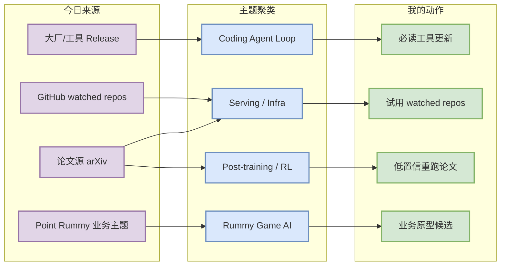
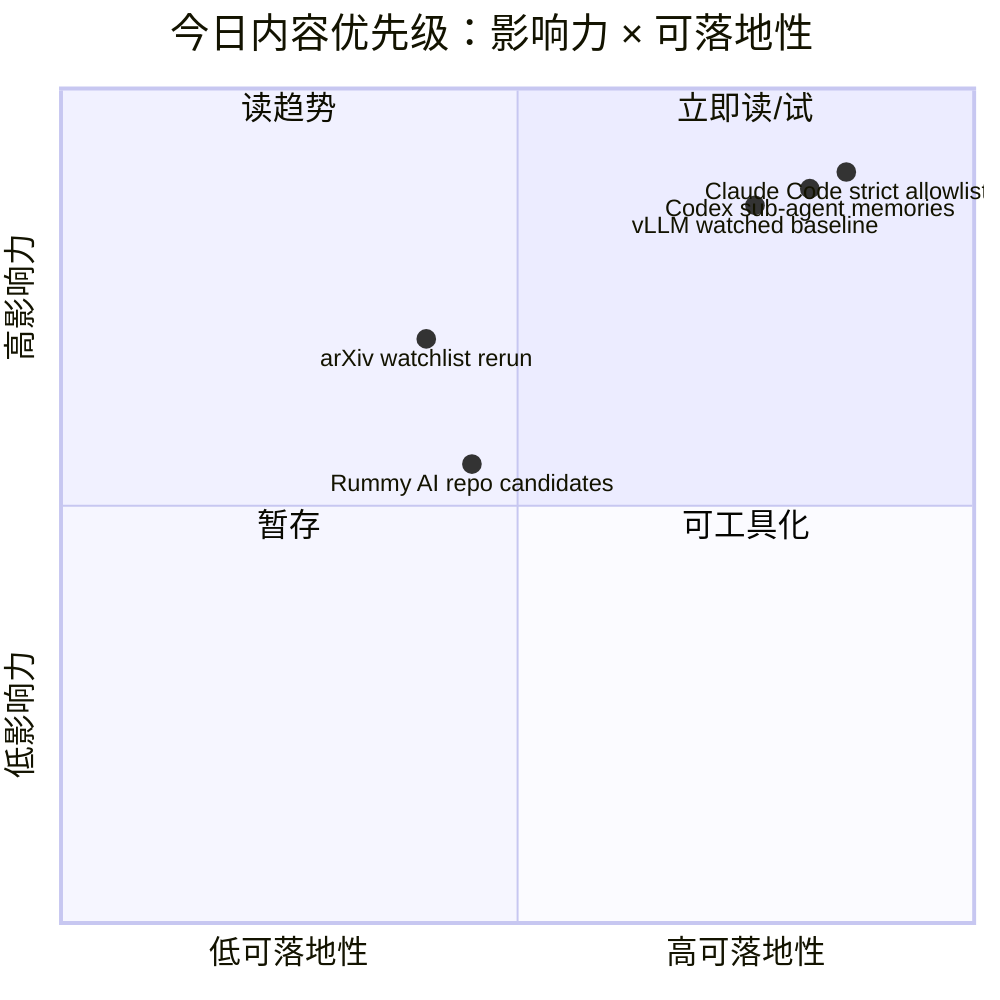

# AI Radar Daily - 2026-07-25

> 生成时间：2026-07-25 09:09 北京时间
> 范围：AI Infra / LLM / RL / Game AI / 大厂博客 / 论文 / GitHub / 行业资讯
> 说明：日报是总览导航页，不是全部正文。Obsidian 中点 `[[详情页]]`，Telegram/GitHub 中点“网页详情”。

## 0. 今日结论

- 今日最值得关注：AI coding agent 工具链集中更新，Claude Code / Codex / Cline / Qwen Code 都释放了长上下文、会话恢复、权限边界或 workspace 体验信号。
- 对 AI Infra 的直接影响：vLLM、SGLang、TensorRT-LLM、DeepSpeed、Megatron-LM 等 watched repos 仍是核心基线；但 GitHub Search 403，今日增长榜标注为 direct watched-repo fallback，不能当完整全网日增。
- 对 LLM 训练 / 推理 / Agent 的影响：Codex 的 sub-agent/memories 与 Claude Code strict network allowlist 是 agent loop 工程化的关键信号。
- 对 RL / 游戏模型训练的影响：Point Rummy 主题今天主要是低 star 规则引擎、AI opponent、MCTS/RLCard/score tracker 候选，可用于业务原型拆解而非直接生产。
- 建议今天深读：[[Industry/Tools/2026-07-25/claude-code-v2-1-219]]、[[Industry/Tools/2026-07-25/openai-codex-0-145-0]]、[[GitHub/2026-07-25/vllm-project-vllm]]、[[Papers/2026-07-25/llm-serving-kv-cache-watchlist]]。

## 1. 今日态势图

## 2. 必读卡片区

> [!important] Claude Code v2.1.219：Opus 5、1M context、strict network allowlist
> - 大类：Coding 工具
> - 小类：Anthropic / Claude Code
> - 重点：长上下文与网络 allowlist 直接影响 agent 执行安全和长任务恢复。
> - 为什么重要：这类设置决定多 agent 在真实 repo 中能否安全执行测试、访问网络、恢复上下文。
> - 详情：[[Industry/Tools/2026-07-25/claude-code-v2-1-219]] / [网页详情](https://github.com/dyt27666-oss/AI-news-report-obsidians/blob/main/Industry/Tools/2026-07-25/claude-code-v2-1-219.md) / [原文](https://github.com/anthropics/claude-code/releases/tag/v2.1.219)

> [!tip] OpenAI Codex 0.145.0：thread history、sub-agent、memories
> - 大类：Coding 工具
> - 小类：OpenAI Codex
> - 重点：Codex 开始强化长期会话、搜索恢复和多 agent 组织能力。
> - 为什么重要：这会改变 AI coding workflow 的任务切片、上下文恢复和 cross-tool 迁移方式。
> - 详情：[[Industry/Tools/2026-07-25/openai-codex-0-145-0]] / [网页详情](https://github.com/dyt27666-oss/AI-news-report-obsidians/blob/main/Industry/Tools/2026-07-25/openai-codex-0-145-0.md) / [原文](https://github.com/openai/codex/releases/tag/rust-v0.145.0)

> [!important] GitHub Search 403 后的 direct watched-repo fallback
> - 大类：GitHub
> - 小类：AI Infra / Agent
> - 重点：今日 snapshot 已保存 102 个 repo，但 broad search 大面积 403；高 star/growth 表使用 direct repo GET fallback 并显式标注。
> - 为什么重要：保留了 vLLM、SGLang、Codex、Claude Code 等核心项目的可用基线，同时避免误报全网增长。
> - 详情：[[GitHub/2026-07-25/vllm-project-vllm]] / [网页详情](https://github.com/dyt27666-oss/AI-news-report-obsidians/blob/main/GitHub/2026-07-25/vllm-project-vllm.md) / [原文](https://github.com/vllm-project/vllm)

> [!warning] arXiv 论文源 timeout / 429
> - 大类：论文
> - 小类：Serving / RL / Agent Eval
> - 重点：今日论文查询全部 timeout 或 429，已生成低置信 watchlist，不编造论文结论。
> - 为什么重要：自动日报需要透明 provenance；后续重跑时优先补 serving、post-training RL、agent eval。
> - 详情：[[Papers/2026-07-25/llm-serving-kv-cache-watchlist]] / [网页详情](https://github.com/dyt27666-oss/AI-news-report-obsidians/blob/main/Papers/2026-07-25/llm-serving-kv-cache-watchlist.md) / [原文](https://export.arxiv.org/api/query?search_query=all:LLM+serving+inference+KV+cache+speculative+decoding&sortBy=submittedDate&sortOrder=descending)

## 3. 优先级矩阵

## 4. 分类清单

| 标签 | 大类 | 小类 | 标题 | 重点概括 | 为什么重要 | Obsidian 详情 | 网页详情 | 原文 |
|---|---|---|---|---|---|---|---|---|
| 必读 | 工具 | Anthropic | Claude Code v2.1.219 | Opus 5、1M context、strict network allowlist | 直接影响 agent 执行权限与长上下文 coding loop | [[Industry/Tools/2026-07-25/claude-code-v2-1-219]] | [网页详情](https://github.com/dyt27666-oss/AI-news-report-obsidians/blob/main/Industry/Tools/2026-07-25/claude-code-v2-1-219.md) | [原文](https://github.com/anthropics/claude-code/releases/tag/v2.1.219) |
| 必读 | 工具 | OpenAI | Codex 0.145.0 | thread history、resume/search、sub-agent、memories | 多 agent coding workflow 正在从单轮任务转向可恢复系统 | [[Industry/Tools/2026-07-25/openai-codex-0-145-0]] | [网页详情](https://github.com/dyt27666-oss/AI-news-report-obsidians/blob/main/Industry/Tools/2026-07-25/openai-codex-0-145-0.md) | [原文](https://github.com/openai/codex/releases/tag/rust-v0.145.0) |
| 必读 | GitHub | Serving | vLLM | LLM serving 高吞吐核心项目 | 是推理栈选型与 benchmark 对比的基础项目 | [[GitHub/2026-07-25/vllm-project-vllm]] | [网页详情](https://github.com/dyt27666-oss/AI-news-report-obsidians/blob/main/GitHub/2026-07-25/vllm-project-vllm.md) | [原文](https://github.com/vllm-project/vllm) |
| 低置信 | 论文 | arXiv | LLM serving 论文 watchlist | arXiv timeout/429，仅保留查询与后续动作 | 避免因 API 失败编造论文，同时保留重跑入口 | [[Papers/2026-07-25/llm-serving-kv-cache-watchlist]] | [网页详情](https://github.com/dyt27666-oss/AI-news-report-obsidians/blob/main/Papers/2026-07-25/llm-serving-kv-cache-watchlist.md) | [原文](https://export.arxiv.org/api/query?search_query=all:LLM+serving+inference+KV+cache+speculative+decoding&sortBy=submittedDate&sortOrder=descending) |

## 5. 大厂资讯 / 工程博客 / Research

### 5.1 公司来源扫描矩阵

| 公司/实验室 | 来源/栏目 | 今日状态 | 高相关条数 | 代表条目 | 备注 |
|---|---|---|---:|---|---|
| OpenAI | News / Research / Codex | 部分访问失败；Codex release 已核验 | 1 | Codex 0.145.0 | 官网 403，使用 GitHub Release 作为官方工具信号 |
| Anthropic | News / Research / Claude Code | 官网可访问；工具 release 高相关 | 1 | Claude Code v2.1.219 | 1M context / strict network allowlist 对 agent 安全重要 |
| Google DeepMind | Blog / Research | 可访问；今日无高相关新项 | 0 | 无高相关新项 | 保留来源扫描 |
| Meta AI | Blog / Research | 可访问；今日无高相关新项 | 0 | 无高相关新项 | 保留来源扫描 |
| NVIDIA | Technical Blog / AI | 访问失败/404；TensorRT-LLM repo 直接核验 | 1 | TensorRT-LLM watched repo | Blog 分类 URL 404，使用 repo fallback |
| Microsoft | Research AI / GitHub | 官网 403；AutoGen repo 直接核验 | 1 | microsoft/autogen | Research 页面不可读，repo 信号可读 |
| Hugging Face | Blog / Papers / Releases | 可访问；Transformers repo 直接核验 | 1 | transformers | Blog 首页可访问，今日未抽取到单篇高相关新文 |
| 腾讯 | AI Lab / 技术博客 | 低置信/无高相关新项 | 0 | 无高相关新项 | 今日未发现可靠新项 |
| 字节 | Seed / 技术博客 | 可访问；无高相关新项 | 0 | 无高相关新项 | 保留来源扫描 |
| SpaceAI | Blog / News | 低置信/未验证到高相关项 | 0 | 无高相关新项 | 保留来源扫描 |

### 5.2 高相关大厂条目

| 标签 | 发布方/大厂 | 栏目/来源 | 标题 | 重点概括 | 工程/算法影响 | Obsidian 详情 | 网页详情 | 原文 |
|---|---|---|---|---|---|---|---|---|
| 必读 | Anthropic | GitHub Release / Release Notes | Claude Code v2.1.219 | Opus 5、1M context、strict network allowlist | agent 安全执行、长上下文任务、tmux 多 agent 监控都受影响 | [[Industry/Tools/2026-07-25/claude-code-v2-1-219]] | [网页详情](https://github.com/dyt27666-oss/AI-news-report-obsidians/blob/main/Industry/Tools/2026-07-25/claude-code-v2-1-219.md) | [原文](https://github.com/anthropics/claude-code/releases/tag/v2.1.219) |
| 必读 | OpenAI | GitHub Release / Changelog | Codex 0.145.0 | thread history、resume/search、sub-agent、memories、settings import | 会话恢复与多 agent 分工成为 coding agent 核心能力 | [[Industry/Tools/2026-07-25/openai-codex-0-145-0]] | [网页详情](https://github.com/dyt27666-oss/AI-news-report-obsidians/blob/main/Industry/Tools/2026-07-25/openai-codex-0-145-0.md) | [原文](https://github.com/openai/codex/releases/tag/rust-v0.145.0) |
| 可 skim | Cline | GitHub Release | Cline v4.0.11 | Opus 5 / 1M context variants、Kimi K3 | VS Code agent 的 provider 与上下文策略更新 | [[Industry/Tools/2026-07-25/cline-v4-0-11]] | [网页详情](https://github.com/dyt27666-oss/AI-news-report-obsidians/blob/main/Industry/Tools/2026-07-25/cline-v4-0-11.md) | [原文](https://github.com/cline/cline/releases/tag/v4.0.11) |
| 可 skim | Qwen | GitHub Release | Qwen Code v0.21.0 | web-shell workspace selector | 远程 shell / 多工作区 agent 体验信号 | [[Industry/Tools/2026-07-25/qwen-code-v0-21-0]] | [网页详情](https://github.com/dyt27666-oss/AI-news-report-obsidians/blob/main/Industry/Tools/2026-07-25/qwen-code-v0-21-0.md) | [原文](https://github.com/QwenLM/qwen-code/releases/tag/v0.21.0) |

## 6. GitHub 高 star Top 10

| 排名 | repo | stars | forks | language | updated_at | topics | 重点概括 | 是否值得试用 | Obsidian 详情 | 原文 |
|---:|---|---:|---:|---|---|---|---|---|---|---|
| 1 | huggingface/transformers | 162948 | 34012 | Python | 2026-07-25T00:46:47Z | llm, machine-learning, pytorch, transformer, vlm | 模型定义与训练/推理生态核心库，覆盖文本、视觉、音频与多模态。 | 值得试用/观察 | [[GitHub/2026-07-25/huggingface-transformers]] | [原文](https://github.com/huggingface/transformers) |
| 2 | anthropics/claude-code | 138972 | 22301 | Python | 2026-07-25T00:49:45Z | coding-agent, terminal-agent | 终端中的 agentic coding 工具，覆盖代码理解、执行、Git 工作流。 | 值得试用/观察 | [[GitHub/2026-07-25/anthropics-claude-code]] | [原文](https://github.com/anthropics/claude-code) |
| 3 | google-gemini/gemini-cli | 106157 | 14311 | TypeScript | 2026-07-25T00:26:07Z | ai-agents, cli, mcp-client, mcp-server | 把 Gemini 带入终端的开源 AI agent。 | 值得试用/观察 | [[GitHub/2026-07-25/google-gemini-gemini-cli]] | [原文](https://github.com/google-gemini/gemini-cli) |
| 4 | pytorch/pytorch | 101924 | 28486 | Python | 2026-07-25T00:30:42Z | deep-learning, gpu, machine-learning | GPU 加速张量与动态图深度学习框架。 | 值得试用/观察 | [[GitHub/2026-07-25/pytorch-pytorch]] | [原文](https://github.com/pytorch/pytorch) |
| 5 | openai/codex | 101245 | 15170 | Rust | 2026-07-25T00:12:41Z | coding-agent, cli | 运行在终端里的轻量 coding agent。 | 值得试用/观察 | [[GitHub/2026-07-25/openai-codex]] | [原文](https://github.com/openai/codex) |
| 6 | modelcontextprotocol/servers | 88857 | 11282 | TypeScript | 2026-07-25T00:40:36Z | mcp, tool-use, agents | Model Context Protocol 官方/社区 server 集合。 | 值得试用/观察 | [[GitHub/2026-07-25/modelcontextprotocol-servers]] | [原文](https://github.com/modelcontextprotocol/servers) |
| 7 | vllm-project/vllm | 87088 | 19827 | Python | 2026-07-25T00:36:59Z | inference, llm-serving, kv-cache, pytorch | 高吞吐、显存高效的 LLM inference 与 serving engine。 | 值得试用/观察 | [[GitHub/2026-07-25/vllm-project-vllm]] | [原文](https://github.com/vllm-project/vllm) |
| 8 | cline/cline | 65023 | 6980 | TypeScript | 2026-07-25T00:48:13Z | coding-agent, ide-extension, sdk | 可作为 SDK、IDE extension 或 CLI assistant 的自主 coding agent。 | 值得试用/观察 | [[GitHub/2026-07-25/cline-cline]] | [原文](https://github.com/cline/cline) |
| 9 | microsoft/autogen | 59949 | 9024 | Python | 2026-07-25T00:51:18Z | agentic, agents, llm-framework | 面向 agentic AI 的编程框架。 | 值得试用/观察 | [[GitHub/2026-07-25/microsoft-autogen]] | [原文](https://github.com/microsoft/autogen) |
| 10 | deepspeedai/DeepSpeed | 42798 | 4906 | Python | 2026-07-24T18:30:17Z | distributed-training, inference, zero, pytorch | 面向大模型训练/推理的分布式优化库。 | 值得试用/观察 | [[GitHub/2026-07-25/deepspeedai-deepspeed]] | [原文](https://github.com/deepspeedai/DeepSpeed) |

## 7. GitHub star 增长最快 Top 10

> 说明：今日 GitHub Search API 大面积 403；本表使用 direct watched-repo fallback + 历史 snapshot（若有）计算。缺 baseline 的条目标注为非完整全 GitHub 日增，不代表真实全网增长榜。

| 排名 | repo | stars_delta | stars | forks | language | updated_at | 增长依据 | 重点概括 | Obsidian 详情 | 原文 |
|---:|---|---:|---:|---:|---|---|---|---|---|---|
| 1 | openai/codex | 256 | 101245 | 15170 | Rust | 2026-07-25T00:12:41Z | direct GET fallback + historical snapshot；非完整全 GitHub 日增 | 运行在终端里的轻量 coding agent。 | [[GitHub/2026-07-25/openai-codex]] | [原文](https://github.com/openai/codex) |
| 2 | anthropics/claude-code | 114 | 138972 | 22301 | Python | 2026-07-25T00:49:45Z | direct GET fallback + historical snapshot；非完整全 GitHub 日增 | 终端中的 agentic coding 工具，覆盖代码理解、执行、Git 工作流。 | [[GitHub/2026-07-25/anthropics-claude-code]] | [原文](https://github.com/anthropics/claude-code) |
| 3 | vllm-project/vllm | 91 | 87088 | 19827 | Python | 2026-07-25T00:36:59Z | direct GET fallback + historical snapshot；非完整全 GitHub 日增 | 高吞吐、显存高效的 LLM inference 与 serving engine。 | [[GitHub/2026-07-25/vllm-project-vllm]] | [原文](https://github.com/vllm-project/vllm) |
| 4 | huggingface/transformers | 58 | 162948 | 34012 | Python | 2026-07-25T00:46:47Z | direct GET fallback + historical snapshot；非完整全 GitHub 日增 | 模型定义与训练/推理生态核心库，覆盖文本、视觉、音频与多模态。 | [[GitHub/2026-07-25/huggingface-transformers]] | [原文](https://github.com/huggingface/transformers) |
| 5 | cline/cline | 38 | 65023 | 6980 | TypeScript | 2026-07-25T00:48:13Z | direct GET fallback + historical snapshot；非完整全 GitHub 日增 | 可作为 SDK、IDE extension 或 CLI assistant 的自主 coding agent。 | [[GitHub/2026-07-25/cline-cline]] | [原文](https://github.com/cline/cline) |
| 6 | modelcontextprotocol/servers | 38 | 88857 | 11282 | TypeScript | 2026-07-25T00:40:36Z | direct GET fallback + historical snapshot；非完整全 GitHub 日增 | Model Context Protocol 官方/社区 server 集合。 | [[GitHub/2026-07-25/modelcontextprotocol-servers]] | [原文](https://github.com/modelcontextprotocol/servers) |
| 7 | pytorch/pytorch | 33 | 101924 | 28486 | Python | 2026-07-25T00:30:42Z | direct GET fallback + historical snapshot；非完整全 GitHub 日增 | GPU 加速张量与动态图深度学习框架。 | [[GitHub/2026-07-25/pytorch-pytorch]] | [原文](https://github.com/pytorch/pytorch) |
| 8 | google-gemini/gemini-cli | 12 | 106157 | 14311 | TypeScript | 2026-07-25T00:26:07Z | direct GET fallback + historical snapshot；非完整全 GitHub 日增 | 把 Gemini 带入终端的开源 AI agent。 | [[GitHub/2026-07-25/google-gemini-gemini-cli]] | [原文](https://github.com/google-gemini/gemini-cli) |
| 9 | deepspeedai/DeepSpeed | 9 | 42798 | 4906 | Python | 2026-07-24T18:30:17Z | direct GET fallback + historical snapshot；非完整全 GitHub 日增 | 面向大模型训练/推理的分布式优化库。 | [[GitHub/2026-07-25/deepspeedai-deepspeed]] | [原文](https://github.com/deepspeedai/DeepSpeed) |
| 10 | microsoft/autogen | 未知 | 59949 | 9024 | Python | 2026-07-25T00:51:18Z | direct GET fallback; baseline missing, non-complete growth；非完整全 GitHub 日增 | 面向 agentic AI 的编程框架。 | [[GitHub/2026-07-25/microsoft-autogen]] | [原文](https://github.com/microsoft/autogen) |

## 8. Coding 工具 / AI 工具功能更新

### 8.1 Coding 工具扫描矩阵

| 工具 | 厂商 | 来源类型 | 今日状态 | 代表更新 | 对我的影响 | 原文 |
|---|---|---|---|---|---|---|
| Claude Code | Anthropic | GitHub Release / Release Notes | 高相关更新 | v2.1.219: Opus 5、1M context、strict network allowlist | 影响长上下文 coding loop 与沙箱网络权限 | [原文](https://github.com/anthropics/claude-code/releases/tag/v2.1.219) |
| OpenAI Codex | OpenAI | GitHub Release / Changelog | 高相关更新 | 0.145.0: paginated thread history、resume/search、sub-agent、memories、settings import | 影响多 agent 会话恢复与 Claude/Cursor 迁移 | [原文](https://github.com/openai/codex/releases/tag/rust-v0.145.0) |
| Cursor | Cursor | Changelog | 低置信/未抽取到新项 | 未发现可核验高相关更新 | 继续观察 agent mode / pricing / context | [原文](https://cursor.com/changelog) |
| Windsurf | Windsurf | Changelog | 低置信/未抽取到新项 | 未发现可核验高相关更新 | 继续观察 IDE agent 模式 | [原文](https://windsurf.com/changelog) |
| GitHub Copilot | GitHub | Changelog / Blog | 低置信/未抽取到新项 | 未发现可核验高相关更新 | 继续观察 agent mode / PR review / MCP | [原文](https://github.blog/changelog/label/copilot/) |
| Gemini Code Assist | Google | Release Notes | 低置信/未抽取到新项 | 同时观察 Gemini CLI v0.52.0 | 对终端 agent 和 IDE assistant 分开评估 | [原文](https://cloud.google.com/gemini/docs/codeassist/release-notes) |
| Qwen Code | Alibaba/Qwen | GitHub Release | 高相关更新 | v0.21.0: web-shell workspace selector | 影响远程/浏览器 shell 多工作区 agent 使用 | [原文](https://github.com/QwenLM/qwen-code/releases/tag/v0.21.0) |
| Roo Code | Roo Code | GitHub Release | 无今日新 release | 最新 v3.54.0 为 2026-05-15 | 继续观察 editor multi-agent 能力 | [原文](https://github.com/RooCodeInc/Roo-Code/releases/tag/v3.54.0) |
| Cline | Cline | GitHub Release | 高相关更新 | v4.0.11: Opus 5、1M context variants、Kimi K3 | 影响 VS Code agent provider 选择与长上下文策略 | [原文](https://github.com/cline/cline/releases/tag/v4.0.11) |
| Continue | Continue | GitHub Release | 无今日新 release | 最新 v2.0.0-vscode 为 2026-06-19 | 继续观察开源 coding agent SDK/IDE 路线 | [原文](https://github.com/continuedev/continue/releases/tag/v2.0.0-vscode) |

### 8.2 高相关工具更新

| 标签 | 工具/厂商 | 来源类型 | 标题/功能 | 重点概括 | 对 AI coding 工作流的影响 | Obsidian 详情 | 网页详情 | 原文 |
|---|---|---|---|---|---|---|---|---|
| 必读 | Claude Code / Anthropic | GitHub Release | v2.1.219 | Opus 5 默认、1M context、strict network allowlist | 强化长上下文与命令网络边界，适合多 agent 安全策略评估 | [[Industry/Tools/2026-07-25/claude-code-v2-1-219]] | [网页详情](https://github.com/dyt27666-oss/AI-news-report-obsidians/blob/main/Industry/Tools/2026-07-25/claude-code-v2-1-219.md) | [原文](https://github.com/anthropics/claude-code/releases/tag/v2.1.219) |
| 必读 | OpenAI Codex / OpenAI | GitHub Release | 0.145.0 | paginated thread history、resume/search、sub-agent、memories | 让 coding agent 更像可恢复任务系统，而不是一次性对话 | [[Industry/Tools/2026-07-25/openai-codex-0-145-0]] | [网页详情](https://github.com/dyt27666-oss/AI-news-report-obsidians/blob/main/Industry/Tools/2026-07-25/openai-codex-0-145-0.md) | [原文](https://github.com/openai/codex/releases/tag/rust-v0.145.0) |
| 可 skim | Cline | GitHub Release | v4.0.11 | Opus 5 / 1M context variants、Kimi K3 | IDE agent 可用模型与上下文窗口升级 | [[Industry/Tools/2026-07-25/cline-v4-0-11]] | [网页详情](https://github.com/dyt27666-oss/AI-news-report-obsidians/blob/main/Industry/Tools/2026-07-25/cline-v4-0-11.md) | [原文](https://github.com/cline/cline/releases/tag/v4.0.11) |
| 可 skim | Qwen Code | GitHub Release | v0.21.0 | web-shell workspace selector | 多 workspace / 远程 shell agent 体验改善 | [[Industry/Tools/2026-07-25/qwen-code-v0-21-0]] | [网页详情](https://github.com/dyt27666-oss/AI-news-report-obsidians/blob/main/Industry/Tools/2026-07-25/qwen-code-v0-21-0.md) | [原文](https://github.com/QwenLM/qwen-code/releases/tag/v0.21.0) |

## 9. Point Rummy / Indian Rummy 业务主题

### 9.1 GitHub 候选

| 标签 | repo | stars | forks | language | updated_at | 重点概括 | 业务可用性 | Obsidian 详情 | 原文 |
|---|---|---:|---:|---|---|---|---|---|---|
| 后续 | rickgorman/gin-rummy-ai | 13 | 5 | Python | 2025-03-25T13:47:09Z | A hand-rolled neuroevolution AI for gin rummy. | 可用于规则/AI opponent/仿真候选，整体低 star 需代码审查 | [[GitHub/PointRummy/2026-07-25/rickgorman-gin-rummy-ai]] | [原文](https://github.com/rickgorman/gin-rummy-ai) |
| 后续 | nakkekakke/rummy-ai | 11 | 5 | Java | 2026-04-17T10:02:59Z | Text based classic Rummy game with an AI that uses ISMCTS. Data Structures and Algorithms course project, University of Helsinki | 可用于规则/AI opponent/仿真候选，整体低 star 需代码审查 | [[GitHub/PointRummy/2026-07-25/nakkekakke-rummy-ai]] | [原文](https://github.com/nakkekakke/rummy-ai) |
| 后续 | jmhummel/Gin-Rummy-Java | 8 | 0 | Java | 2023-08-16T16:12:58Z | Java-based Gin Rummy console game, with an AI opponent | 可用于规则/AI opponent/仿真候选，整体低 star 需代码审查 | [[GitHub/PointRummy/2026-07-25/jmhummel-gin-rummy-java]] | [原文](https://github.com/jmhummel/Gin-Rummy-Java) |
| 后续 | mudont/indian-rummy | 5 | 0 | TypeScript | 2025-08-08T21:05:04Z | Typescript library for Indian Rummy card game | 可用于规则/AI opponent/仿真候选，整体低 star 需代码审查 | [[GitHub/PointRummy/2026-07-25/mudont-indian-rummy]] | [原文](https://github.com/mudont/indian-rummy) |
| 后续 | dv-rastogi/Rummy | 5 | 0 | Python | 2023-09-26T11:21:39Z | Variation of classical Indian Rummy made in Pygame | 可用于规则/AI opponent/仿真候选，整体低 star 需代码审查 | [[GitHub/PointRummy/2026-07-25/dv-rastogi-rummy]] | [原文](https://github.com/dv-rastogi/Rummy) |
| 后续 | SCFlanagan/Rummy | 4 | 6 | JavaScript | 2025-07-25T21:17:08Z | This project is a recreation of the classic card game Rummy. It features an AI player to play against, a hand of cards that can be dragged and sorted, and a scoreboard that keeps track of multiple rounds. | 可用于规则/AI opponent/仿真候选，整体低 star 需代码审查 | [[GitHub/PointRummy/2026-07-25/scflanagan-rummy]] | [原文](https://github.com/SCFlanagan/Rummy) |
| 后续 | mcartmell/gin-rummy-bot | 4 | 2 | Perl | 2024-10-30T20:06:17Z | A web-based Gin Rummy game and AI | 可用于规则/AI opponent/仿真候选，整体低 star 需代码审查 | [[GitHub/PointRummy/2026-07-25/mcartmell-gin-rummy-bot]] | [原文](https://github.com/mcartmell/gin-rummy-bot) |
| 后续 | vahsek300501/Indian-Rummy- | 4 | 3 | Python | 2023-09-26T11:21:46Z | Indian Rummy made in Python using PyGame | 可用于规则/AI opponent/仿真候选，整体低 star 需代码审查 | [[GitHub/PointRummy/2026-07-25/vahsek300501-indian-rummy]] | [原文](https://github.com/vahsek300501/Indian-Rummy-) |
| 后续 | abubakarmunir712/dsa-final-project | 2 | 1 | Python | 2026-06-27T06:34:26Z | A Python-based multiplayer Indian Rummy game with support for AI opponents and LAN play. Implements data structures like linked lists, stacks, queues, hashmaps, and graphs to ensure efficient gameplay and intelligent AI decisions. | 可用于规则/AI opponent/仿真候选，整体低 star 需代码审查 | [[GitHub/PointRummy/2026-07-25/abubakarmunir712-dsa-final-project]] | [原文](https://github.com/abubakarmunir712/dsa-final-project) |
| 后续 | rawbeen248/Gin-Rummy-AI-vs-Human | 2 | 0 | Python | 2024-11-16T17:18:48Z | Gin-Rummy-AI-vs-Human is a python-based project the simulates the classic card game Gin Rummy. This game allows user to play against an AI opponent that takes into consideration intricate rules and strategies of the game. The AI opponent employs different tactics based on the gameplay to make the game more challenging and engaging.  | 可用于规则/AI opponent/仿真候选，整体低 star 需代码审查 | [[GitHub/PointRummy/2026-07-25/rawbeen248-gin-rummy-ai-vs-human]] | [原文](https://github.com/rawbeen248/Gin-Rummy-AI-vs-Human) |

### 9.2 论文 / 资料候选

| 标签 | 来源 | 标题 | 作者/机构 | 重点概括 | 对 Point Rummy 业务有什么用 | Obsidian 详情 | 原文 |
|---|---|---|---|---|---|---|---|
| 低置信 | arXiv | gin rummy MCTS reinforcement learning 查询 | 未验证 | API 429，未得到可靠论文结果 | 后续重跑可补 imperfect information card game / ISMCTS 资料 | [[Papers/2026-07-25/agent-eval-watchlist]] | [原文](https://export.arxiv.org/api/query?search_query=all:gin+rummy+MCTS+reinforcement+learning) |
| 后续 | GitHub | nakkekakke/rummy-ai | University of Helsinki course project | classic Rummy + ISMCTS，低 star 但主题精准 | 可参考 ISMCTS 状态抽象与不完全信息决策 | [[GitHub/PointRummy/2026-07-25/nakkekakke-rummy-ai]] | [原文](https://github.com/nakkekakke/rummy-ai) |

### 9.3 业务可用性判断

| 方向 | 今日信号 | 可用性 | 下一步 |
|---|---|---|---|
| 规则引擎 / 计分 | mudont/indian-rummy、RummyPulse、scoreboard 类项目较多 | 中：适合抽取规则/计分边界案例 | 先审查规则覆盖和测试 |
| Bot / RL Agent | IRumAI、RummyAgent、gin-rummy-rl-lab、nakkekakke/rummy-ai | 中低：多为课程/原型，适合方法参考 | 选 2 个看 state/action/reward 设计 |
| 仿真 / 评测 | RummyGym、RLCard 风格项目线索 | 中：可做自研环境参考 | 建立统一 evaluator 和随机种子回放 |

## 10. Loop Engineer / Loop Engineering 主题

### 10.1 Loop Engineer GitHub 高 star Top 10

| 排名 | repo | stars | forks | language | updated_at | topics | 重点概括 | 是否值得试用 | Obsidian 详情 | 原文 |
|---:|---|---:|---:|---|---|---|---|---|---|---|
| 1 | anthropics/claude-code | 138972 | 22301 | Python | 2026-07-25T00:49:45Z | coding-agent, terminal-agent | 终端中的 agentic coding 工具，覆盖代码理解、执行、Git 工作流。 | 值得试用/观察 | [[GitHub/2026-07-25/anthropics-claude-code]] | [原文](https://github.com/anthropics/claude-code) |
| 2 | google-gemini/gemini-cli | 106157 | 14311 | TypeScript | 2026-07-25T00:26:07Z | ai-agents, cli, mcp-client, mcp-server | 把 Gemini 带入终端的开源 AI agent。 | 值得试用/观察 | [[GitHub/2026-07-25/google-gemini-gemini-cli]] | [原文](https://github.com/google-gemini/gemini-cli) |
| 3 | openai/codex | 101245 | 15170 | Rust | 2026-07-25T00:12:41Z | coding-agent, cli | 运行在终端里的轻量 coding agent。 | 值得试用/观察 | [[GitHub/2026-07-25/openai-codex]] | [原文](https://github.com/openai/codex) |
| 4 | modelcontextprotocol/servers | 88857 | 11282 | TypeScript | 2026-07-25T00:40:36Z | mcp, tool-use, agents | Model Context Protocol 官方/社区 server 集合。 | 值得试用/观察 | [[GitHub/2026-07-25/modelcontextprotocol-servers]] | [原文](https://github.com/modelcontextprotocol/servers) |
| 5 | cline/cline | 65023 | 6980 | TypeScript | 2026-07-25T00:48:13Z | coding-agent, ide-extension, sdk | 可作为 SDK、IDE extension 或 CLI assistant 的自主 coding agent。 | 值得试用/观察 | [[GitHub/2026-07-25/cline-cline]] | [原文](https://github.com/cline/cline) |
| 6 | microsoft/autogen | 59949 | 9024 | Python | 2026-07-25T00:51:18Z | agentic, agents, llm-framework | 面向 agentic AI 的编程框架。 | 值得试用/观察 | [[GitHub/2026-07-25/microsoft-autogen]] | [原文](https://github.com/microsoft/autogen) |
| 7 | langchain-ai/langgraph | 38066 | 6395 | Python | 2026-07-25T00:29:57Z | agents, multiagent, rag | Build resilient agents. | 值得试用/观察 | [[GitHub/2026-07-25/langchain-ai-langgraph]] | [原文](https://github.com/langchain-ai/langgraph) |
| 8 | continuedev/continue | 35097 | 5105 | TypeScript | 2026-07-24T21:16:58Z | agent, cli, developer-tools | open-source coding agent。 | 值得试用/观察 | [[GitHub/2026-07-25/continuedev-continue]] | [原文](https://github.com/continuedev/continue) |
| 9 | QwenLM/qwen-code | 26292 | 2717 | TypeScript | 2026-07-25T00:58:51Z | coding-agent, cli | 开源终端 AI coding agent。 | 值得试用/观察 | [[GitHub/2026-07-25/qwenlm-qwen-code]] | [原文](https://github.com/QwenLM/qwen-code) |
| 10 | RooCodeInc/Roo-Code | 24359 | 3382 | TypeScript | 2026-07-24T22:41:07Z | coding-agent, ide-extension | 编辑器中的 AI agent dev team。 | 值得试用/观察 | [[GitHub/2026-07-25/roocodeinc-roo-code]] | [原文](https://github.com/RooCodeInc/Roo-Code) |

### 10.2 Loop Engineer GitHub star 增长最快 Top 10

| 排名 | repo | stars_delta | stars | forks | language | updated_at | 增长依据 | 重点概括 | Obsidian 详情 | 原文 |
|---:|---|---:|---:|---:|---|---|---|---|---|---|
| 1 | openai/codex | 256 | 101245 | 15170 | Rust | 2026-07-25T00:12:41Z | direct GET fallback + historical snapshot；非完整全 GitHub 日增 | 运行在终端里的轻量 coding agent。 | [[GitHub/2026-07-25/openai-codex]] | [原文](https://github.com/openai/codex) |
| 2 | anthropics/claude-code | 114 | 138972 | 22301 | Python | 2026-07-25T00:49:45Z | direct GET fallback + historical snapshot；非完整全 GitHub 日增 | 终端中的 agentic coding 工具，覆盖代码理解、执行、Git 工作流。 | [[GitHub/2026-07-25/anthropics-claude-code]] | [原文](https://github.com/anthropics/claude-code) |
| 3 | cline/cline | 38 | 65023 | 6980 | TypeScript | 2026-07-25T00:48:13Z | direct GET fallback + historical snapshot；非完整全 GitHub 日增 | 可作为 SDK、IDE extension 或 CLI assistant 的自主 coding agent。 | [[GitHub/2026-07-25/cline-cline]] | [原文](https://github.com/cline/cline) |
| 4 | modelcontextprotocol/servers | 38 | 88857 | 11282 | TypeScript | 2026-07-25T00:40:36Z | direct GET fallback + historical snapshot；非完整全 GitHub 日增 | Model Context Protocol 官方/社区 server 集合。 | [[GitHub/2026-07-25/modelcontextprotocol-servers]] | [原文](https://github.com/modelcontextprotocol/servers) |
| 5 | google-gemini/gemini-cli | 12 | 106157 | 14311 | TypeScript | 2026-07-25T00:26:07Z | direct GET fallback + historical snapshot；非完整全 GitHub 日增 | 把 Gemini 带入终端的开源 AI agent。 | [[GitHub/2026-07-25/google-gemini-gemini-cli]] | [原文](https://github.com/google-gemini/gemini-cli) |
| 6 | QwenLM/qwen-code | 未知 | 26292 | 2717 | TypeScript | 2026-07-25T00:58:51Z | direct watched-repo fallback; baseline missing；非完整全 GitHub 日增 | 开源终端 AI coding agent。 | [[GitHub/2026-07-25/qwenlm-qwen-code]] | [原文](https://github.com/QwenLM/qwen-code) |
| 7 | microsoft/autogen | 未知 | 59949 | 9024 | Python | 2026-07-25T00:51:18Z | direct GET fallback; baseline missing, non-complete growth；非完整全 GitHub 日增 | 面向 agentic AI 的编程框架。 | [[GitHub/2026-07-25/microsoft-autogen]] | [原文](https://github.com/microsoft/autogen) |
| 8 | langchain-ai/langgraph | 未知 | 38066 | 6395 | Python | 2026-07-25T00:29:57Z | direct watched-repo fallback; baseline missing；非完整全 GitHub 日增 | Build resilient agents. | [[GitHub/2026-07-25/langchain-ai-langgraph]] | [原文](https://github.com/langchain-ai/langgraph) |
| 9 | RooCodeInc/Roo-Code | 未知 | 24359 | 3382 | TypeScript | 2026-07-24T22:41:07Z | direct watched-repo fallback; baseline missing；非完整全 GitHub 日增 | 编辑器中的 AI agent dev team。 | [[GitHub/2026-07-25/roocodeinc-roo-code]] | [原文](https://github.com/RooCodeInc/Roo-Code) |
| 10 | continuedev/continue | 未知 | 35097 | 5105 | TypeScript | 2026-07-24T21:16:58Z | direct watched-repo fallback; baseline missing；非完整全 GitHub 日增 | open-source coding agent。 | [[GitHub/2026-07-25/continuedev-continue]] | [原文](https://github.com/continuedev/continue) |

### 10.3 Loop Engineering 方法信号

| 标签 | 来源 | 标题 | 重点概括 | 对 AI coding 工作流的影响 | Obsidian 详情 | 原文 |
|---|---|---|---|---|---|---|
| 必读 | GitHub Release | Codex sub-agent / memories / thread history | coding agent 需要可恢复任务状态和子代理协作 | 适合设计 harness、日志、回放、失败恢复 | [[Industry/Tools/2026-07-25/openai-codex-0-145-0]] | [原文](https://github.com/openai/codex/releases/tag/rust-v0.145.0) |
| 必读 | GitHub Release | Claude Code strict network allowlist | agent 命令执行安全边界从 prompt 约束变成配置约束 | 可纳入 tmux 多 agent 安全基线 | [[Industry/Tools/2026-07-25/claude-code-v2-1-219]] | [原文](https://github.com/anthropics/claude-code/releases/tag/v2.1.219) |

## 11. 论文

### 11.1 Serving / Post-training / Agent Eval 低置信 watchlist

| 标签 | 论文来源 | 论文 | 作者/机构 | 重点概括 | 工程/研究价值 | Obsidian 详情 | 网页详情 | PDF/原文 |
|---|---|---|---|---|---|---|---|---|
| 低置信 | arXiv / 预印本 API | LLM serving / KV cache / speculative decoding 最新论文扫描 | 未验证 | arXiv timeout/429，保留重跑入口 | 后续补 serving/RL/agent eval 论文，不编造今日结论 | [[Papers/2026-07-25/llm-serving-kv-cache-watchlist]] | [网页详情](https://github.com/dyt27666-oss/AI-news-report-obsidians/blob/main/Papers/2026-07-25/llm-serving-kv-cache-watchlist.md) | [原文](https://export.arxiv.org/api/query?search_query=all:LLM+serving+inference+KV+cache+speculative+decoding&sortBy=submittedDate&sortOrder=descending) |
| 低置信 | arXiv / 预印本 API | Post-training RL / RLHF / GRPO 最新论文扫描 | 未验证 | arXiv timeout/429，保留重跑入口 | 后续补 serving/RL/agent eval 论文，不编造今日结论 | [[Papers/2026-07-25/post-training-rl-watchlist]] | [网页详情](https://github.com/dyt27666-oss/AI-news-report-obsidians/blob/main/Papers/2026-07-25/post-training-rl-watchlist.md) | [原文](https://export.arxiv.org/api/query?search_query=all:reinforcement+learning+language+models+post+training&sortBy=submittedDate&sortOrder=descending) |
| 低置信 | arXiv / 预印本 API | Agent eval / tool-use benchmark 最新论文扫描 | 未验证 | arXiv timeout/429，保留重跑入口 | 后续补 serving/RL/agent eval 论文，不编造今日结论 | [[Papers/2026-07-25/agent-eval-watchlist]] | [网页详情](https://github.com/dyt27666-oss/AI-news-report-obsidians/blob/main/Papers/2026-07-25/agent-eval-watchlist.md) | [原文](https://export.arxiv.org/api/query?search_query=all:agent+evaluation+benchmark+tool+use&sortBy=submittedDate&sortOrder=descending) |

## 12. 资讯 / 其他 GitHub 项目

### 12.1 AI Infra watched repos

| 标签 | 来源 | 标题 | 重点概括 | 对我有什么用 | Obsidian 详情 | 网页详情 | 原文 |
|---|---|---|---|---|---|---|---|
| 必读 | GitHub | SGLang | 高性能 LLM/VLM serving framework | 和 vLLM/TensorRT-LLM 对比 serving scheduler、cache、multi-modal 支持 | [[GitHub/2026-07-25/sgl-project-sglang]] | [网页详情](https://github.com/dyt27666-oss/AI-news-report-obsidians/blob/main/GitHub/2026-07-25/sgl-project-sglang.md) | [原文](https://github.com/sgl-project/sglang) |
| 必读 | GitHub | TensorRT-LLM | NVIDIA GPU LLM inference 优化栈 | 关注 Blackwell/CUDA kernel/runtime 路线 | [[GitHub/2026-07-25/nvidia-tensorrt-llm]] | [网页详情](https://github.com/dyt27666-oss/AI-news-report-obsidians/blob/main/GitHub/2026-07-25/nvidia-tensorrt-llm.md) | [原文](https://github.com/NVIDIA/TensorRT-LLM) |
| 可 skim | GitHub | OpenRLHF | Ray + vLLM 的 agentic RL framework | 观察 PPO/DAPO/REINFORCE++ 工程化路线 | [[GitHub/2026-07-25/openrlhf-openrlhf]] | [网页详情](https://github.com/dyt27666-oss/AI-news-report-obsidians/blob/main/GitHub/2026-07-25/openrlhf-openrlhf.md) | [原文](https://github.com/OpenRLHF/OpenRLHF) |

## 13. 按主题索引

### AI Infra / Serving / Training

- [[GitHub/2026-07-25/vllm-project-vllm]] - LLM serving 基线。
- [[GitHub/2026-07-25/sgl-project-sglang]] - 高性能 serving framework。
- [[Papers/2026-07-25/llm-serving-kv-cache-watchlist]] - arXiv 低置信重跑入口。

### LLM / Agent / RAG / Evaluation

- [[Industry/Tools/2026-07-25/openai-codex-0-145-0]] - sub-agent / memories / thread history。
- [[Industry/Tools/2026-07-25/claude-code-v2-1-219]] - strict network allowlist / 1M context。
- [[Papers/2026-07-25/agent-eval-watchlist]] - agent eval 论文 watchlist。

### RL / Game AI / World Model

- [[Papers/2026-07-25/post-training-rl-watchlist]] - post-training RL 低置信重跑入口。
- [[GitHub/PointRummy/2026-07-25/nakkekakke-rummy-ai]] - Rummy + ISMCTS 业务候选。

### Point Rummy / Indian Rummy

- [[GitHub/PointRummy/2026-07-25/nakkekakke-rummy-ai]] - ISMCTS。
- [[GitHub/PointRummy/2026-07-25/vdesmond-irumai]] - RL agent for Indian Rummy。

### Loop Engineer / Coding Agent Loop

- [[Industry/Tools/2026-07-25/openai-codex-0-145-0]] - 可恢复 coding loop。
- [[Industry/Tools/2026-07-25/claude-code-v2-1-219]] - 权限边界。
- [[GitHub/2026-07-25/modelcontextprotocol-servers]] - MCP server 生态。

### 公司 / 实验室

- OpenAI: [[Industry/Tools/2026-07-25/openai-codex-0-145-0]]
- Anthropic: [[Industry/Tools/2026-07-25/claude-code-v2-1-219]]
- DeepMind: 今日无高相关新项
- Meta: 今日无高相关新项
- NVIDIA: [[GitHub/2026-07-25/nvidia-tensorrt-llm]]
- 腾讯 / 字节 / 国内大厂: 今日无高相关新项；Qwen Code 作为阿里/Qwen 工具信号保留

### 大牛 / 作者

- 今日无可核验作者级新论文；arXiv 429 后续重跑。

## 14. 值得后续深挖

| 标签 | 大类 | 小类 | 标题 | 后续动作 | Obsidian 详情 | 原文 |
|---|---|---|---|---|---|---|
| 后续 | 工具 | Codex | sub-agent + memories 对 harness 设计的影响 | 做一次多 agent 代码审查 POC | [[Industry/Tools/2026-07-25/openai-codex-0-145-0]] | [原文](https://github.com/openai/codex/releases/tag/rust-v0.145.0) |
| 后续 | 工具 | Claude Code | strict network allowlist | 写入 agent 安全 playbook | [[Industry/Tools/2026-07-25/claude-code-v2-1-219]] | [原文](https://github.com/anthropics/claude-code/releases/tag/v2.1.219) |
| 后续 | 业务 | Point Rummy | ISMCTS / RLCard 候选 | 审查 state/action/reward 与规则覆盖 | [[GitHub/PointRummy/2026-07-25/nakkekakke-rummy-ai]] | [原文](https://github.com/nakkekakke/rummy-ai) |
| 低置信 | 论文 | arXiv | serving / RL / agent eval 查询 | API 恢复后重跑并补详情页 | [[Papers/2026-07-25/llm-serving-kv-cache-watchlist]] | [原文](https://export.arxiv.org/api/query) |

## 15. 采集失败或低置信来源

- GitHub Search：今日 snapshot 已保存 `Automation/state/github-stars-2026-07-25.json`，但 broad search 多个 query 返回 `HTTP Error 403: rate limit exceeded`；GitHub Top 10 / 增长榜已改用 direct watched-repo fallback 并标注。
- arXiv：LLM serving、post-training RL、agent eval、world model、rummy 查询出现 timeout / 429；今日仅生成低置信 watchlist，不编造论文结论。
- 公司来源：OpenAI 官网 403、Microsoft Research 403、NVIDIA Technical Blog 分类 404；Anthropic、DeepMind、Meta、Hugging Face、ByteDance Seed 首页可访问但未抽取到新的高相关单篇。
- Coding 工具：Cursor、Windsurf、GitHub Copilot、Gemini Code Assist 今日未核验到高相关新项，已保留矩阵状态。

## 16. 归档标签

#ai-radar #daily #ai-infra #llm #rl #point-rummy #loop-engineering
