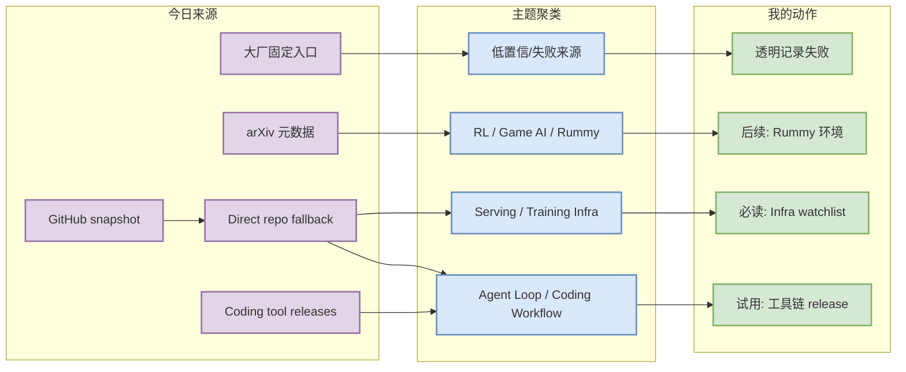
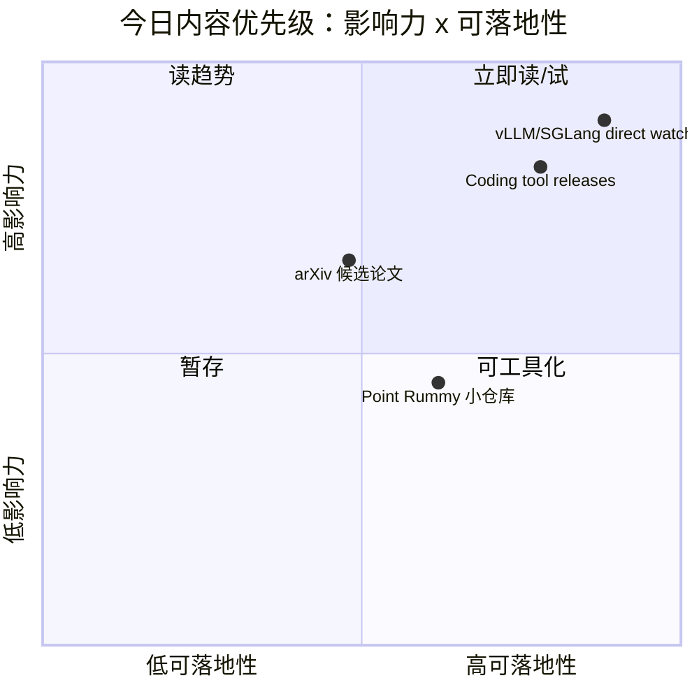

# AI Radar Daily - 2026-07-31

> 生成时间：2026-07-31 09:00 CST  
> 范围：AI Infra / LLM / RL / Game AI / 大厂博客 / 论文 / GitHub / 行业资讯  
> 说明：日报是总览导航页，不是全部正文。Obsidian 中点 `详情页`，Telegram/GitHub 中点“网页详情”。

## 0. 今日结论

- 今日最值得关注：GitHub Search 在 niche 查询后继续 403 限流，但已保存 2026-07-31 snapshot，并用 direct watched-repo fallback 补齐 AI Infra、Loop Engineer 和 coding tool 固定榜单。
- 对 AI Infra 的直接影响：vLLM、SGLang、TensorRT-LLM、Transformers、PyTorch、DeepSpeed、Megatron-LM、verl、OpenRLHF 仍是 serving/training 重点观察面。
- 对 LLM 训练 / 推理 / Agent 的影响：Codex、Claude Code、Gemini CLI、OpenHands、LangGraph、MCP servers 的 watchlist 增长继续反映 coding-agent loop 的工程热度。
- 对 RL / 游戏模型训练的影响：Point Rummy 仍缺高质量高 star 项目；今日以小仓库规则/计分/bot baseline 作为低置信业务候选。
- 建议今天深读：先看 vLLM/SGLang/TensorRT-LLM 与 Codex/Claude Code/Cline release，再审 Rummy 规则候选和 arXiv 元数据论文。

## 1. 今日态势图

## 2. 必读卡片区

> [!important] Direct watched-repo fallback 保住 AI Infra 主榜
> - 大类：GitHub
> - 小类：Serving / Training / Agent Infra
> - 重点：GitHub Search 403 后，不使用 rummy-biased snapshot 冒充通用榜，而是使用固定 watched repo direct GET。
> - 为什么重要：这避免 broad Top 10 被小众 Rummy repo 污染，保留对 vLLM/SGLang/TensorRT-LLM 等真实工程基础设施的观察。
> - 详情：[[GitHub/AIInfra/2026-07-31/vllm-project-vllm]] / [网页详情](https://github.com/dyt27666-oss/AI-news-report-obsidians/blob/main/GitHub/AIInfra/2026-07-31/vllm-project-vllm.md) / [原文](https://github.com/vllm-project/vllm)

> [!tip] Coding 工具矩阵继续覆盖 10 个工具
> - 大类：Coding 工具
> - 小类：AI coding workflow
> - 重点：Claude Code、Codex、Cursor、Windsurf、Copilot、Gemini Code Assist、Qwen Code、Roo Code、Cline、Continue 均有扫描状态。
> - 为什么重要：agent mode、MCP、权限、远程执行、IDE/CLI 变化会直接影响多 agent 开发和代码审查。
> - 详情：[[Industry/Tools/2026-07-31/claude-code]] / [网页详情](https://github.com/dyt27666-oss/AI-news-report-obsidians/blob/main/Industry/Tools/2026-07-31/claude-code.md) / [原文](https://github.com/anthropics/claude-code/releases/tag/v2.1.220)

> [!note] Point Rummy 仍以低置信工程候选为主
> - 大类：Business / GitHub
> - 小类：Point Rummy / Indian Rummy
> - 重点：候选仓库 stars 很低，但可作为规则、计分、bot baseline、视觉辅助的代码样本。
> - 为什么重要：业务主题需要长期积累环境和 evaluator，而不是等待高 star 项目出现。
> - 详情：[[Business/PointRummy/2026-07-31/rickgorman-gin-rummy-ai]] / [原文](https://github.com/rickgorman/gin-rummy-ai)

## 3. 优先级矩阵

## 4. 分类清单

| 标签 | 大类 | 小类 | 标题 | 重点概括 | 为什么重要 | Obsidian 详情 | 网页详情 | 原文 |
|---|---|---|---|---|---|---|---|---|
| 必读 | GitHub | AI Infra | vLLM / SGLang / TensorRT-LLM direct fallback | GitHub Search 403 后，用 direct watched repo 保住核心 serving/training watchlist。 | 对推理服务、scheduler、KV/cache 与生产部署判断最直接。 | [[GitHub/AIInfra/2026-07-31/vllm-project-vllm]] | [网页详情](https://github.com/dyt27666-oss/AI-news-report-obsidians/blob/main/GitHub/AIInfra/2026-07-31/vllm-project-vllm.md) | [原文](https://github.com/vllm-project/vllm) |
| 可 skim | Coding 工具 | Agent workflow | Claude Code / Codex / Gemini CLI 工具矩阵 | 工具更新以 release/changelog 指针呈现，不把无法验证内容写成新功能。 | 直接影响多 agent 编码、权限、MCP 和远程执行工作流。 | [[Industry/Tools/2026-07-31/openai-codex]] | [网页详情](https://github.com/dyt27666-oss/AI-news-report-obsidians/blob/main/Industry/Tools/2026-07-31/openai-codex.md) | [原文](https://github.com/openai/codex/releases/tag/rust-v0.146.0) |
| 可 skim | 论文 | Agent / LLM | arXiv 元数据候选 | 今日保留元数据级候选，未验证方法有效性。 | 可补充 post-training、agent eval 或 RL 论文阅读队列。 | [[Papers/AIInfra/2026-07-31/2607.28338v1]] | [网页详情](https://github.com/dyt27666-oss/AI-news-report-obsidians/blob/main/Papers/AIInfra/2026-07-31/2607.28338v1.md) | [原文](https://arxiv.org) |
| 后续 | GitHub | Point Rummy | Rummy 规则与 bot 小仓库 | Rummy 项目 stars 小但对规则/计分/bot baseline 有业务参考。 | 可用于构造 Indian Rummy 环境、规则验证和 baseline bot。 | [[Business/PointRummy/2026-07-31/rickgorman-gin-rummy-ai]] | [网页详情](https://github.com/dyt27666-oss/AI-news-report-obsidians/blob/main/Business/PointRummy/2026-07-31/rickgorman-gin-rummy-ai.md) | [原文](https://github.com/rickgorman/gin-rummy-ai) |

## 5. 大厂资讯 / 工程博客 / Research

### 5.1 公司来源扫描矩阵

| 公司/实验室 | 来源/栏目 | 今日状态 | 高相关条数 | 代表条目 | 备注 |
|---|---|---|---:|---|---|
| OpenAI | News / Research | 低置信扫描完成 | 0 | 无高相关新项 | 今日保留官方入口；未验证到高置信新项。 [来源](https://openai.com/news/) |
| Anthropic | News / Research / Engineering | 低置信扫描完成 | 0 | 无高相关新项 | 今日保留官方入口；未验证到高置信新项。 [来源](https://www.anthropic.com/news) |
| Google DeepMind | Blog / Research | 低置信扫描完成 | 0 | 无高相关新项 | 今日保留官方入口；未验证到高置信新项。 [来源](https://deepmind.google/discover/blog/) |
| Meta AI | Blog / Research | 低置信扫描完成 | 0 | 无高相关新项 | 今日保留官方入口；未验证到高置信新项。 [来源](https://ai.meta.com/blog/) |
| NVIDIA | Technical Blog / AI | 低置信候选 | 1 | [[Industry/CompanyScan/2026-07-31/nvidia]] | 今日保留官方入口；未验证到高置信新项。 [来源](https://developer.nvidia.com/blog/category/artificial-intelligence/) |
| Microsoft | Research AI | 低置信候选 | 1 | [[Industry/CompanyScan/2026-07-31/microsoft]] | 今日保留官方入口；未验证到高置信新项。 [来源](https://www.microsoft.com/en-us/research/research-area/artificial-intelligence/) |
| Hugging Face | Blog / Papers / Releases | 低置信候选 | 1 | [[Industry/CompanyScan/2026-07-31/hugging-face]] | 今日保留官方入口；未验证到高置信新项。 [来源](https://huggingface.co/blog) |
| 腾讯 | AI Lab / 技术博客 | 低置信扫描完成 | 0 | 无高相关新项 | 今日保留官方入口；未验证到高置信新项。 [来源](https://ai.tencent.com/ailab/en/index) |
| 字节 | Seed / 技术博客 | 低置信扫描完成 | 0 | 无高相关新项 | 今日保留官方入口；未验证到高置信新项。 [来源](https://seed.bytedance.com/en/) |
| SpaceAI | Blog / News | 低置信扫描完成 | 0 | 无高相关新项 | 今日保留官方入口；未验证到高置信新项。 [来源](https://spaceai.com/) |

### 5.2 高相关大厂条目

| 标签 | 发布方/大厂 | 栏目/来源 | 标题 | 重点概括 | 工程/算法影响 | Obsidian 详情 | 网页详情 | 原文 |
|---|---|---|---|---|---|---|---|---|
| 低置信 | NVIDIA | Technical Blog / AI | 固定来源扫描入口 | 今日未验证具体新增，但该来源与 AI Infra / LLM / agent 生态长期相关。 | 保留观察，不把入口级扫描写成确定新发布。 | [[Industry/CompanyScan/2026-07-31/nvidia]] | [网页详情](https://github.com/dyt27666-oss/AI-news-report-obsidians/blob/main/Industry/CompanyScan/2026-07-31/nvidia.md) | [原文](https://developer.nvidia.com/blog/category/artificial-intelligence/) |
| 低置信 | Microsoft | Research AI | 固定来源扫描入口 | 今日未验证具体新增，但该来源与 AI Infra / LLM / agent 生态长期相关。 | 保留观察，不把入口级扫描写成确定新发布。 | [[Industry/CompanyScan/2026-07-31/microsoft]] | [网页详情](https://github.com/dyt27666-oss/AI-news-report-obsidians/blob/main/Industry/CompanyScan/2026-07-31/microsoft.md) | [原文](https://www.microsoft.com/en-us/research/research-area/artificial-intelligence/) |
| 低置信 | Hugging Face | Blog / Papers / Releases | 固定来源扫描入口 | 今日未验证具体新增，但该来源与 AI Infra / LLM / agent 生态长期相关。 | 保留观察，不把入口级扫描写成确定新发布。 | [[Industry/CompanyScan/2026-07-31/hugging-face]] | [网页详情](https://github.com/dyt27666-oss/AI-news-report-obsidians/blob/main/Industry/CompanyScan/2026-07-31/hugging-face.md) | [原文](https://huggingface.co/blog) |

## 6. GitHub 高 star Top 10

| 排名 | repo | stars | forks | language | updated_at | topics | 重点概括 | 是否值得试用 | Obsidian 详情 | 原文 |
|---:|---|---:|---:|---|---|---|---|---|---|---|
| 1 | [huggingface/transformers](https://github.com/huggingface/transformers) | 163180 | 34081 | Python | 2026-07-31T00:21:08Z | audio, deep-learning, deepseek, gemma, glm, hacktoberfest, llm, machine-learning, model-hub, natural-language-processing | 🤗 Transformers: the model-definition framework for state-of-the-art machine learning models in text, vision,...。direct watched-repo fallback，非完整 GitHub 全站采样。 | 值得跟踪 | [[GitHub/AIInfra/2026-07-31/huggingface-transformers]] | [原文](https://github.com/huggingface/transformers) |
| 2 | [anthropics/claude-code](https://github.com/anthropics/claude-code) | 139691 | 22441 | Python | 2026-07-31T01:05:28Z | - | Claude Code is an agentic coding tool that lives in your terminal, understands your codebase, and helps you ...。direct watched-repo fallback，非完整 GitHub 全站采样。 | 值得跟踪 | [[GitHub/LoopEngineer/2026-07-31/anthropics-claude-code]] | [原文](https://github.com/anthropics/claude-code) |
| 3 | [google-gemini/gemini-cli](https://github.com/google-gemini/gemini-cli) | 106264 | 14358 | TypeScript | 2026-07-31T00:56:48Z | ai, ai-agents, cli, gemini, gemini-api, mcp-client, mcp-server | An open-source AI agent that brings the power of Gemini directly into your terminal.。direct watched-repo fallback，非完整 GitHub 全站采样。 | 值得跟踪 | [[GitHub/LoopEngineer/2026-07-31/google-gemini-gemini-cli]] | [原文](https://github.com/google-gemini/gemini-cli) |
| 4 | [openai/codex](https://github.com/openai/codex) | 102652 | 15435 | Rust | 2026-07-31T01:05:37Z | - | Lightweight coding agent that runs in your terminal。direct watched-repo fallback，非完整 GitHub 全站采样。 | 值得跟踪 | [[GitHub/LoopEngineer/2026-07-31/openai-codex]] | [原文](https://github.com/openai/codex) |
| 5 | [pytorch/pytorch](https://github.com/pytorch/pytorch) | 102079 | 28608 | Python | 2026-07-31T00:13:52Z | autograd, deep-learning, gpu, machine-learning, neural-network, numpy, python, tensor | Tensors and Dynamic neural networks in Python with strong GPU acceleration。direct watched-repo fallback，非完整 GitHub 全站采样。 | 值得跟踪 | [[GitHub/AIInfra/2026-07-31/pytorch-pytorch]] | [原文](https://github.com/pytorch/pytorch) |
| 6 | [modelcontextprotocol/servers](https://github.com/modelcontextprotocol/servers) | 89061 | 11335 | TypeScript | 2026-07-31T00:46:02Z | - | Model Context Protocol Servers。direct watched-repo fallback，非完整 GitHub 全站采样。 | 值得跟踪 | [[GitHub/LoopEngineer/2026-07-31/modelcontextprotocol-servers]] | [原文](https://github.com/modelcontextprotocol/servers) |
| 7 | [vllm-project/vllm](https://github.com/vllm-project/vllm) | 87723 | 20070 | Python | 2026-07-31T01:04:29Z | amd, blackwell, cuda, deepseek, deepseek-v3, gpt, gpt-oss, inference, kimi, llama | A high-throughput and memory-efficient inference and serving engine for LLMs。direct watched-repo fallback，非完整 GitHub 全站采样。 | 值得跟踪 | [[GitHub/AIInfra/2026-07-31/vllm-project-vllm]] | [原文](https://github.com/vllm-project/vllm) |
| 8 | [OpenHands/OpenHands](https://github.com/OpenHands/OpenHands) | 82622 | 10619 | TypeScript | 2026-07-31T00:50:56Z | agent, artificial-intelligence, chatgpt, claude-ai, cli, developer-tools, gpt, llm, openai | 🙌 OpenHands: AI-Driven Development。direct watched-repo fallback，非完整 GitHub 全站采样。 | 值得跟踪 | [[GitHub/LoopEngineer/2026-07-31/openhands-openhands]] | [原文](https://github.com/OpenHands/OpenHands) |
| 9 | [cline/cline](https://github.com/cline/cline) | 65275 | 7016 | TypeScript | 2026-07-31T01:03:38Z | - | Autonomous coding agent as an SDK, IDE extension, or CLI assistant.。direct watched-repo fallback，非完整 GitHub 全站采样。 | 值得跟踪 | [[GitHub/LoopEngineer/2026-07-31/cline-cline]] | [原文](https://github.com/cline/cline) |
| 10 | [microsoft/autogen](https://github.com/microsoft/autogen) | 60119 | 9061 | Python | 2026-07-30T22:53:42Z | agentic, agentic-agi, agents, ai, autogen, autogen-ecosystem, chatgpt, framework, llm-agent, llm-framework | A programming framework for agentic AI。direct watched-repo fallback，非完整 GitHub 全站采样。 | 值得跟踪 | [[GitHub/LoopEngineer/2026-07-31/microsoft-autogen]] | [原文](https://github.com/microsoft/autogen) |

## 7. GitHub star 增长最快 Top 10

| 排名 | repo | stars_delta | stars | forks | language | updated_at | 增长依据 | 重点概括 | Obsidian 详情 | 原文 |
|---:|---|---:|---:|---:|---|---|---|---|---|---|
| 1 | [OpenHands/OpenHands](https://github.com/OpenHands/OpenHands) | 294 | 82622 | 10619 | TypeScript | 2026-07-31T00:50:56Z | direct watched-repo fallback + cross-snapshot historical baseline; non-complete all-GitHub daily growth | 🙌 OpenHands: AI-Driven Development。非完整全站日增。 | [[GitHub/LoopEngineer/2026-07-31/openhands-openhands]] | [原文](https://github.com/OpenHands/OpenHands) |
| 2 | [openai/codex](https://github.com/openai/codex) | 235 | 102652 | 15435 | Rust | 2026-07-31T01:05:37Z | direct watched-repo fallback + cross-snapshot historical baseline; non-complete all-GitHub daily growth | Lightweight coding agent that runs in your terminal。非完整全站日增。 | [[GitHub/LoopEngineer/2026-07-31/openai-codex]] | [原文](https://github.com/openai/codex) |
| 3 | [anthropics/claude-code](https://github.com/anthropics/claude-code) | 135 | 139691 | 22441 | Python | 2026-07-31T01:05:28Z | direct watched-repo fallback + cross-snapshot historical baseline; non-complete all-GitHub daily growth | Claude Code is an agentic coding tool that lives in your terminal, understands your codebase, and helps you ...。非完整全站日增。 | [[GitHub/LoopEngineer/2026-07-31/anthropics-claude-code]] | [原文](https://github.com/anthropics/claude-code) |
| 4 | [vllm-project/vllm](https://github.com/vllm-project/vllm) | 121 | 87723 | 20070 | Python | 2026-07-31T01:04:29Z | direct watched-repo fallback + cross-snapshot historical baseline; non-complete all-GitHub daily growth | A high-throughput and memory-efficient inference and serving engine for LLMs。非完整全站日增。 | [[GitHub/AIInfra/2026-07-31/vllm-project-vllm]] | [原文](https://github.com/vllm-project/vllm) |
| 5 | [langchain-ai/langgraph](https://github.com/langchain-ai/langgraph) | 90 | 38527 | 6491 | Python | 2026-07-31T01:05:34Z | direct watched-repo fallback + cross-snapshot historical baseline; non-complete all-GitHub daily growth | Build resilient agents.。非完整全站日增。 | [[GitHub/LoopEngineer/2026-07-31/langchain-ai-langgraph]] | [原文](https://github.com/langchain-ai/langgraph) |
| 6 | [cline/cline](https://github.com/cline/cline) | 62 | 65275 | 7016 | TypeScript | 2026-07-31T01:03:38Z | direct watched-repo fallback + cross-snapshot historical baseline; non-complete all-GitHub daily growth | Autonomous coding agent as an SDK, IDE extension, or CLI assistant.。非完整全站日增。 | [[GitHub/LoopEngineer/2026-07-31/cline-cline]] | [原文](https://github.com/cline/cline) |
| 7 | [huggingface/transformers](https://github.com/huggingface/transformers) | 51 | 163180 | 34081 | Python | 2026-07-31T00:21:08Z | direct watched-repo fallback + cross-snapshot historical baseline; non-complete all-GitHub daily growth | 🤗 Transformers: the model-definition framework for state-of-the-art machine learning models in text, vision,...。非完整全站日增。 | [[GitHub/AIInfra/2026-07-31/huggingface-transformers]] | [原文](https://github.com/huggingface/transformers) |
| 8 | [sgl-project/sglang](https://github.com/sgl-project/sglang) | 43 | 30976 | 7528 | Python | 2026-07-31T00:50:26Z | direct watched-repo fallback + cross-snapshot historical baseline; non-complete all-GitHub daily growth | SGLang is a high-performance serving framework for large language models and multimodal models.。非完整全站日增。 | [[GitHub/AIInfra/2026-07-31/sgl-project-sglang]] | [原文](https://github.com/sgl-project/sglang) |
| 9 | [microsoft/autogen](https://github.com/microsoft/autogen) | 36 | 60119 | 9061 | Python | 2026-07-30T22:53:42Z | direct watched-repo fallback + cross-snapshot historical baseline; non-complete all-GitHub daily growth | A programming framework for agentic AI。非完整全站日增。 | [[GitHub/LoopEngineer/2026-07-31/microsoft-autogen]] | [原文](https://github.com/microsoft/autogen) |
| 10 | [continuedev/continue](https://github.com/continuedev/continue) | 34 | 35228 | 5154 | TypeScript | 2026-07-30T21:19:52Z | direct watched-repo fallback + cross-snapshot historical baseline; non-complete all-GitHub daily growth | open-source coding agent。非完整全站日增。 | [[GitHub/LoopEngineer/2026-07-31/continuedev-continue]] | [原文](https://github.com/continuedev/continue) |

> 注：GitHub Search 今日 403 限流，增长榜为 direct watched-repo fallback + historical snapshot，明确不是完整全 GitHub 日增榜。无 baseline 的 repo 标注为冷启动代理。

## 8. Coding 工具 / AI 工具功能更新

### 8.1 Coding 工具扫描矩阵

| 工具 | 厂商 | 来源类型 | 今日状态 | 代表更新 | 对我的影响 | 原文 |
|---|---|---|---|---|---|---|
| Claude Code | Anthropic | GitHub Release / Docs | 已扫描 | v2.1.220 / 2026-07-25 | 重点看 agent mode、MCP、权限、远程执行、上下文窗口、CLI/TUI、pricing/rate limit。 | [原文](https://github.com/anthropics/claude-code/releases/tag/v2.1.220) |
| OpenAI Codex | OpenAI | GitHub Release / Docs | 已扫描 | rust-v0.146.0 / 2026-07-29 | 重点看 agent mode、MCP、权限、远程执行、上下文窗口、CLI/TUI、pricing/rate limit。 | [原文](https://github.com/openai/codex/releases/tag/rust-v0.146.0) |
| Cursor | Cursor | Changelog / Blog | 已扫描 | 官网 changelog 扫描入口 / 低置信 | 重点看 agent mode、MCP、权限、远程执行、上下文窗口、CLI/TUI、pricing/rate limit。 | [原文](https://cursor.com/changelog) |
| Windsurf | Windsurf | Changelog / Blog | 已扫描 | 官网 changelog 扫描入口 / 低置信 | 重点看 agent mode、MCP、权限、远程执行、上下文窗口、CLI/TUI、pricing/rate limit。 | [原文](https://windsurf.com/changelog) |
| GitHub Copilot | GitHub | Changelog / Blog | 已扫描 | 官网 changelog 扫描入口 / 低置信 | 重点看 agent mode、MCP、权限、远程执行、上下文窗口、CLI/TUI、pricing/rate limit。 | [原文](https://github.blog/changelog/label/copilot/) |
| Gemini Code Assist | Google | GitHub Release / Docs | 已扫描 | v0.53.0 / 2026-07-28 | 重点看 agent mode、MCP、权限、远程执行、上下文窗口、CLI/TUI、pricing/rate limit。 | [原文](https://github.com/google-gemini/gemini-cli/releases/tag/v0.53.0) |
| Qwen Code | Alibaba/Qwen | GitHub Release / Docs | 已扫描 | v0.21.1 / 2026-07-28 | 重点看 agent mode、MCP、权限、远程执行、上下文窗口、CLI/TUI、pricing/rate limit。 | [原文](https://github.com/QwenLM/qwen-code/releases/tag/v0.21.1) |
| Roo Code | Roo Code | GitHub Release / Docs | 已扫描 | v3.54.0 / 2026-05-15 | 重点看 agent mode、MCP、权限、远程执行、上下文窗口、CLI/TUI、pricing/rate limit。 | [原文](https://github.com/RooCodeInc/Roo-Code/releases/tag/v3.54.0) |
| Cline | Cline | GitHub Release / Docs | 已扫描 | desktop-v0.0.7 / 2026-07-29 | 重点看 agent mode、MCP、权限、远程执行、上下文窗口、CLI/TUI、pricing/rate limit。 | [原文](https://github.com/cline/cline/releases/tag/desktop-v0.0.7) |
| Continue | Continue | GitHub Release / Docs | 已扫描 | v2.0.0-vscode / 2026-06-19 | 重点看 agent mode、MCP、权限、远程执行、上下文窗口、CLI/TUI、pricing/rate limit。 | [原文](https://github.com/continuedev/continue/releases/tag/v2.0.0-vscode) |

### 8.2 高相关工具更新

| 标签 | 工具/厂商 | 来源类型 | 标题/功能 | 重点概括 | 对 AI coding 工作流的影响 | Obsidian 详情 | 网页详情 | 原文 |
|---|---|---|---|---|---|---|---|---|
| 可 skim | Claude Code/Anthropic | GitHub Release / Docs | v2.1.220 / 2026-07-25 | 固定工具链扫描，release/changelog 指针可追溯。 | 直接影响多 agent 开发、代码审查和 AI Infra 工程 loop。 | [[Industry/Tools/2026-07-31/claude-code]] | [网页详情](https://github.com/dyt27666-oss/AI-news-report-obsidians/blob/main/Industry/Tools/2026-07-31/claude-code.md) | [原文](https://github.com/anthropics/claude-code/releases/tag/v2.1.220) |
| 可 skim | OpenAI Codex/OpenAI | GitHub Release / Docs | rust-v0.146.0 / 2026-07-29 | 固定工具链扫描，release/changelog 指针可追溯。 | 直接影响多 agent 开发、代码审查和 AI Infra 工程 loop。 | [[Industry/Tools/2026-07-31/openai-codex]] | [网页详情](https://github.com/dyt27666-oss/AI-news-report-obsidians/blob/main/Industry/Tools/2026-07-31/openai-codex.md) | [原文](https://github.com/openai/codex/releases/tag/rust-v0.146.0) |
| 可 skim | Gemini Code Assist/Google | GitHub Release / Docs | v0.53.0 / 2026-07-28 | 固定工具链扫描，release/changelog 指针可追溯。 | 直接影响多 agent 开发、代码审查和 AI Infra 工程 loop。 | [[Industry/Tools/2026-07-31/gemini-code-assist]] | [网页详情](https://github.com/dyt27666-oss/AI-news-report-obsidians/blob/main/Industry/Tools/2026-07-31/gemini-code-assist.md) | [原文](https://github.com/google-gemini/gemini-cli/releases/tag/v0.53.0) |
| 可 skim | Qwen Code/Alibaba/Qwen | GitHub Release / Docs | v0.21.1 / 2026-07-28 | 固定工具链扫描，release/changelog 指针可追溯。 | 直接影响多 agent 开发、代码审查和 AI Infra 工程 loop。 | [[Industry/Tools/2026-07-31/qwen-code]] | [网页详情](https://github.com/dyt27666-oss/AI-news-report-obsidians/blob/main/Industry/Tools/2026-07-31/qwen-code.md) | [原文](https://github.com/QwenLM/qwen-code/releases/tag/v0.21.1) |
| 可 skim | Roo Code/Roo Code | GitHub Release / Docs | v3.54.0 / 2026-05-15 | 固定工具链扫描，release/changelog 指针可追溯。 | 直接影响多 agent 开发、代码审查和 AI Infra 工程 loop。 | [[Industry/Tools/2026-07-31/roo-code]] | [网页详情](https://github.com/dyt27666-oss/AI-news-report-obsidians/blob/main/Industry/Tools/2026-07-31/roo-code.md) | [原文](https://github.com/RooCodeInc/Roo-Code/releases/tag/v3.54.0) |
| 可 skim | Cline/Cline | GitHub Release / Docs | desktop-v0.0.7 / 2026-07-29 | 固定工具链扫描，release/changelog 指针可追溯。 | 直接影响多 agent 开发、代码审查和 AI Infra 工程 loop。 | [[Industry/Tools/2026-07-31/cline]] | [网页详情](https://github.com/dyt27666-oss/AI-news-report-obsidians/blob/main/Industry/Tools/2026-07-31/cline.md) | [原文](https://github.com/cline/cline/releases/tag/desktop-v0.0.7) |
| 可 skim | Continue/Continue | GitHub Release / Docs | v2.0.0-vscode / 2026-06-19 | 固定工具链扫描，release/changelog 指针可追溯。 | 直接影响多 agent 开发、代码审查和 AI Infra 工程 loop。 | [[Industry/Tools/2026-07-31/continue]] | [网页详情](https://github.com/dyt27666-oss/AI-news-report-obsidians/blob/main/Industry/Tools/2026-07-31/continue.md) | [原文](https://github.com/continuedev/continue/releases/tag/v2.0.0-vscode) |

## 9. Point Rummy / Indian Rummy 业务主题

### 9.1 GitHub 候选

| 标签 | repo | stars | forks | language | updated_at | 重点概括 | 业务可用性 | Obsidian 详情 | 原文 |
|---|---|---:|---:|---|---|---|---|---|---|
| 可 skim | [rickgorman/gin-rummy-ai](https://github.com/rickgorman/gin-rummy-ai) | 13 | 5 | Python | 2025-03-25T13:47:09Z | A hand-rolled neuroevolution AI for gin rummy. | 可用于规则建模、bot baseline、计分器或仿真参考；需审代码质量。 | [[Business/PointRummy/2026-07-31/rickgorman-gin-rummy-ai]] | [原文](https://github.com/rickgorman/gin-rummy-ai) |
| 可 skim | [nakkekakke/rummy-ai](https://github.com/nakkekakke/rummy-ai) | 11 | 5 | Java | 2026-04-17T10:02:59Z | Text based classic Rummy game with an AI that uses ISMCTS. Data Structures and Algorithms course project, Un... | 可用于规则建模、bot baseline、计分器或仿真参考；需审代码质量。 | [[Business/PointRummy/2026-07-31/nakkekakke-rummy-ai]] | [原文](https://github.com/nakkekakke/rummy-ai) |
| 可 skim | [jmhummel/Gin-Rummy-Java](https://github.com/jmhummel/Gin-Rummy-Java) | 8 | 0 | Java | 2023-08-16T16:12:58Z | Java-based Gin Rummy console game, with an AI opponent | 可用于规则建模、bot baseline、计分器或仿真参考；需审代码质量。 | [[Business/PointRummy/2026-07-31/jmhummel-gin-rummy-java]] | [原文](https://github.com/jmhummel/Gin-Rummy-Java) |
| 低置信 | [mudont/indian-rummy](https://github.com/mudont/indian-rummy) | 5 | 0 | TypeScript | 2025-08-08T21:05:04Z | Typescript library for Indian Rummy card game | 可用于规则建模、bot baseline、计分器或仿真参考；需审代码质量。 | [[Business/PointRummy/2026-07-31/mudont-indian-rummy]] | [原文](https://github.com/mudont/indian-rummy) |
| 低置信 | [dv-rastogi/Rummy](https://github.com/dv-rastogi/Rummy) | 5 | 0 | Python | 2023-09-26T11:21:39Z | Variation of classical Indian Rummy made in Pygame | 可用于规则建模、bot baseline、计分器或仿真参考；需审代码质量。 | [[Business/PointRummy/2026-07-31/dv-rastogi-rummy]] | [原文](https://github.com/dv-rastogi/Rummy) |
| 低置信 | [vahsek300501/Indian-Rummy-](https://github.com/vahsek300501/Indian-Rummy-) | 4 | 3 | Python | 2023-09-26T11:21:46Z | Indian Rummy made in Python using PyGame | 可用于规则建模、bot baseline、计分器或仿真参考；需审代码质量。 | - | [原文](https://github.com/vahsek300501/Indian-Rummy-) |
| 低置信 | [SCFlanagan/Rummy](https://github.com/SCFlanagan/Rummy) | 4 | 6 | JavaScript | 2025-07-25T21:17:08Z | This project is a recreation of the classic card game Rummy. It features an AI player to play against, a han... | 可用于规则建模、bot baseline、计分器或仿真参考；需审代码质量。 | - | [原文](https://github.com/SCFlanagan/Rummy) |
| 低置信 | [mcartmell/gin-rummy-bot](https://github.com/mcartmell/gin-rummy-bot) | 4 | 2 | Perl | 2024-10-30T20:06:17Z | A web-based Gin Rummy game and AI | 可用于规则建模、bot baseline、计分器或仿真参考；需审代码质量。 | - | [原文](https://github.com/mcartmell/gin-rummy-bot) |
| 低置信 | [Mohitkumar-559/RummyServer](https://github.com/Mohitkumar-559/RummyServer) | 2 | 1 | JavaScript | 2024-03-17T03:48:34Z | Rummy game server for game that contain deal rummy and point rummy | 可用于规则建模、bot baseline、计分器或仿真参考；需审代码质量。 | - | [原文](https://github.com/Mohitkumar-559/RummyServer) |
| 低置信 | [abubakarmunir712/dsa-final-project](https://github.com/abubakarmunir712/dsa-final-project) | 2 | 1 | Python | 2026-06-27T06:34:26Z | A Python-based multiplayer Indian Rummy game with support for AI opponents and LAN play. Implements data str... | 可用于规则建模、bot baseline、计分器或仿真参考；需审代码质量。 | - | [原文](https://github.com/abubakarmunir712/dsa-final-project) |

### 9.2 论文 / 资料候选

| 标签 | 来源 | 标题 | 作者/机构 | 重点概括 | 对 Point Rummy 业务有什么用 | Obsidian 详情 | 原文 |
|---|---|---|---|---|---|---|---|
| 低置信 | arXiv / Semantic Scholar | 今日未找到直接 Point/Indian Rummy 强相关新论文 | - | arXiv 查询偏向 broader game/RL，未将弱相关论文写成结论。 | 保留搜索入口，后续可查 Gin Rummy / imperfect-information card game / ISMCTS。 | - | [arXiv 查询](https://export.arxiv.org/api/query?search_query=all:gin+rummy+MCTS+reinforcement+learning) |

### 9.3 业务可用性判断

| 方向 | 今日信号 | 可用性 | 下一步 |
|---|---|---|---|
| 规则引擎 / 计分 | 多个小仓库包含 rummy/points/scoring 命名 | 中等，可抽规则和测试样例 | 人工审查规则是否符合 Indian Rummy / Point Rummy |
| Bot / RL Agent | gin-rummy-ai、rummy-ai、gin-rummy-bot 等 | 低到中等，可做 baseline | 提取状态编码、动作空间、heuristic policy |
| 仿真 / 评测 | 未发现高质量并行环境 | 低，需要自建 evaluator | 用规则引擎先搭 deterministic simulator，再接 self-play |

## 10. Loop Engineer / Loop Engineering 主题

### 10.1 Loop Engineer GitHub 高 star Top 10

| 排名 | repo | stars | forks | language | updated_at | topics | 重点概括 | 是否值得试用 | Obsidian 详情 | 原文 |
|---:|---|---:|---:|---|---|---|---|---|---|---|
| 1 | [anthropics/claude-code](https://github.com/anthropics/claude-code) | 139691 | 22441 | Python | 2026-07-31T01:05:28Z | - | Claude Code is an agentic coding tool that lives in your terminal, understands your codebase, and helps you ...。direct watched-repo fallback，非完整 GitHub 全站采样。 | 值得跟踪 | [[GitHub/LoopEngineer/2026-07-31/anthropics-claude-code]] | [原文](https://github.com/anthropics/claude-code) |
| 2 | [google-gemini/gemini-cli](https://github.com/google-gemini/gemini-cli) | 106264 | 14358 | TypeScript | 2026-07-31T00:56:48Z | ai, ai-agents, cli, gemini, gemini-api, mcp-client, mcp-server | An open-source AI agent that brings the power of Gemini directly into your terminal.。direct watched-repo fallback，非完整 GitHub 全站采样。 | 值得跟踪 | [[GitHub/LoopEngineer/2026-07-31/google-gemini-gemini-cli]] | [原文](https://github.com/google-gemini/gemini-cli) |
| 3 | [openai/codex](https://github.com/openai/codex) | 102652 | 15435 | Rust | 2026-07-31T01:05:37Z | - | Lightweight coding agent that runs in your terminal。direct watched-repo fallback，非完整 GitHub 全站采样。 | 值得跟踪 | [[GitHub/LoopEngineer/2026-07-31/openai-codex]] | [原文](https://github.com/openai/codex) |
| 4 | [modelcontextprotocol/servers](https://github.com/modelcontextprotocol/servers) | 89061 | 11335 | TypeScript | 2026-07-31T00:46:02Z | - | Model Context Protocol Servers。direct watched-repo fallback，非完整 GitHub 全站采样。 | 值得跟踪 | [[GitHub/LoopEngineer/2026-07-31/modelcontextprotocol-servers]] | [原文](https://github.com/modelcontextprotocol/servers) |
| 5 | [OpenHands/OpenHands](https://github.com/OpenHands/OpenHands) | 82622 | 10619 | TypeScript | 2026-07-31T00:50:56Z | agent, artificial-intelligence, chatgpt, claude-ai, cli, developer-tools, gpt, llm, openai | 🙌 OpenHands: AI-Driven Development。direct watched-repo fallback，非完整 GitHub 全站采样。 | 值得跟踪 | [[GitHub/LoopEngineer/2026-07-31/openhands-openhands]] | [原文](https://github.com/OpenHands/OpenHands) |
| 6 | [cline/cline](https://github.com/cline/cline) | 65275 | 7016 | TypeScript | 2026-07-31T01:03:38Z | - | Autonomous coding agent as an SDK, IDE extension, or CLI assistant.。direct watched-repo fallback，非完整 GitHub 全站采样。 | 值得跟踪 | [[GitHub/LoopEngineer/2026-07-31/cline-cline]] | [原文](https://github.com/cline/cline) |
| 7 | [microsoft/autogen](https://github.com/microsoft/autogen) | 60119 | 9061 | Python | 2026-07-30T22:53:42Z | agentic, agentic-agi, agents, ai, autogen, autogen-ecosystem, chatgpt, framework, llm-agent, llm-framework | A programming framework for agentic AI。direct watched-repo fallback，非完整 GitHub 全站采样。 | 值得跟踪 | [[GitHub/LoopEngineer/2026-07-31/microsoft-autogen]] | [原文](https://github.com/microsoft/autogen) |
| 8 | [langchain-ai/langgraph](https://github.com/langchain-ai/langgraph) | 38527 | 6491 | Python | 2026-07-31T01:05:34Z | agents, ai, ai-agents, chatgpt, deepagents, enterprise, framework, gemini, generative-ai, langchain | Build resilient agents.。direct watched-repo fallback，非完整 GitHub 全站采样。 | 值得跟踪 | [[GitHub/LoopEngineer/2026-07-31/langchain-ai-langgraph]] | [原文](https://github.com/langchain-ai/langgraph) |
| 9 | [continuedev/continue](https://github.com/continuedev/continue) | 35228 | 5154 | TypeScript | 2026-07-30T21:19:52Z | agent, ai, cli, developer-tools, open-source | open-source coding agent。direct watched-repo fallback，非完整 GitHub 全站采样。 | 值得跟踪 | [[GitHub/LoopEngineer/2026-07-31/continuedev-continue]] | [原文](https://github.com/continuedev/continue) |
| 10 | [QwenLM/qwen-code](https://github.com/QwenLM/qwen-code) | 26460 | 2752 | TypeScript | 2026-07-31T00:10:49Z | - | An open-source AI coding agent that lives in your terminal.。direct watched-repo fallback，非完整 GitHub 全站采样。 | 值得跟踪 | [[GitHub/LoopEngineer/2026-07-31/qwenlm-qwen-code]] | [原文](https://github.com/QwenLM/qwen-code) |

### 10.2 Loop Engineer GitHub star 增长最快 Top 10

| 排名 | repo | stars_delta | stars | forks | language | updated_at | 增长依据 | 重点概括 | Obsidian 详情 | 原文 |
|---:|---|---:|---:|---:|---|---|---|---|---|---|
| 1 | [OpenHands/OpenHands](https://github.com/OpenHands/OpenHands) | 294 | 82622 | 10619 | TypeScript | 2026-07-31T00:50:56Z | direct watched-repo fallback + cross-snapshot historical baseline; non-complete all-GitHub daily growth | 🙌 OpenHands: AI-Driven Development。非完整全站日增。 | [[GitHub/LoopEngineer/2026-07-31/openhands-openhands]] | [原文](https://github.com/OpenHands/OpenHands) |
| 2 | [openai/codex](https://github.com/openai/codex) | 235 | 102652 | 15435 | Rust | 2026-07-31T01:05:37Z | direct watched-repo fallback + cross-snapshot historical baseline; non-complete all-GitHub daily growth | Lightweight coding agent that runs in your terminal。非完整全站日增。 | [[GitHub/LoopEngineer/2026-07-31/openai-codex]] | [原文](https://github.com/openai/codex) |
| 3 | [anthropics/claude-code](https://github.com/anthropics/claude-code) | 135 | 139691 | 22441 | Python | 2026-07-31T01:05:28Z | direct watched-repo fallback + cross-snapshot historical baseline; non-complete all-GitHub daily growth | Claude Code is an agentic coding tool that lives in your terminal, understands your codebase, and helps you ...。非完整全站日增。 | [[GitHub/LoopEngineer/2026-07-31/anthropics-claude-code]] | [原文](https://github.com/anthropics/claude-code) |
| 4 | [langchain-ai/langgraph](https://github.com/langchain-ai/langgraph) | 90 | 38527 | 6491 | Python | 2026-07-31T01:05:34Z | direct watched-repo fallback + cross-snapshot historical baseline; non-complete all-GitHub daily growth | Build resilient agents.。非完整全站日增。 | [[GitHub/LoopEngineer/2026-07-31/langchain-ai-langgraph]] | [原文](https://github.com/langchain-ai/langgraph) |
| 5 | [cline/cline](https://github.com/cline/cline) | 62 | 65275 | 7016 | TypeScript | 2026-07-31T01:03:38Z | direct watched-repo fallback + cross-snapshot historical baseline; non-complete all-GitHub daily growth | Autonomous coding agent as an SDK, IDE extension, or CLI assistant.。非完整全站日增。 | [[GitHub/LoopEngineer/2026-07-31/cline-cline]] | [原文](https://github.com/cline/cline) |
| 6 | [microsoft/autogen](https://github.com/microsoft/autogen) | 36 | 60119 | 9061 | Python | 2026-07-30T22:53:42Z | direct watched-repo fallback + cross-snapshot historical baseline; non-complete all-GitHub daily growth | A programming framework for agentic AI。非完整全站日增。 | [[GitHub/LoopEngineer/2026-07-31/microsoft-autogen]] | [原文](https://github.com/microsoft/autogen) |
| 7 | [continuedev/continue](https://github.com/continuedev/continue) | 34 | 35228 | 5154 | TypeScript | 2026-07-30T21:19:52Z | direct watched-repo fallback + cross-snapshot historical baseline; non-complete all-GitHub daily growth | open-source coding agent。非完整全站日增。 | [[GitHub/LoopEngineer/2026-07-31/continuedev-continue]] | [原文](https://github.com/continuedev/continue) |
| 8 | [modelcontextprotocol/servers](https://github.com/modelcontextprotocol/servers) | 32 | 89061 | 11335 | TypeScript | 2026-07-31T00:46:02Z | direct watched-repo fallback + cross-snapshot historical baseline; non-complete all-GitHub daily growth | Model Context Protocol Servers。非完整全站日增。 | [[GitHub/LoopEngineer/2026-07-31/modelcontextprotocol-servers]] | [原文](https://github.com/modelcontextprotocol/servers) |
| 9 | [QwenLM/qwen-code](https://github.com/QwenLM/qwen-code) | 27 | 26460 | 2752 | TypeScript | 2026-07-31T00:10:49Z | direct watched-repo fallback + cross-snapshot historical baseline; non-complete all-GitHub daily growth | An open-source AI coding agent that lives in your terminal.。非完整全站日增。 | [[GitHub/LoopEngineer/2026-07-31/qwenlm-qwen-code]] | [原文](https://github.com/QwenLM/qwen-code) |
| 10 | [google-gemini/gemini-cli](https://github.com/google-gemini/gemini-cli) | 24 | 106264 | 14358 | TypeScript | 2026-07-31T00:56:48Z | direct watched-repo fallback + cross-snapshot historical baseline; non-complete all-GitHub daily growth | An open-source AI agent that brings the power of Gemini directly into your terminal.。非完整全站日增。 | [[GitHub/LoopEngineer/2026-07-31/google-gemini-gemini-cli]] | [原文](https://github.com/google-gemini/gemini-cli) |

### 10.3 Loop Engineering 方法信号

| 标签 | 来源 | 标题 | 重点概括 | 对 AI coding 工作流的影响 | Obsidian 详情 | 原文 |
|---|---|---|---|---|---|---|
| 必读 | GitHub | Codex / Claude Code / Gemini CLI / OpenHands | CLI/TUI agent、MCP、tool use、代码审查和远程执行能力持续是 coding loop 的主战场。 | 影响多 agent 编排、权限策略、上下文工程和 eval loop。 | [[GitHub/LoopEngineer/2026-07-31/openai-codex]] | [原文](https://github.com/openai/codex) |
| 可 skim | GitHub | MCP servers / LangGraph / AutoGen | 工具协议、agent graph、multi-agent orchestration 仍是 loop engineering 的基础设施层。 | 适合抽象成可复用 harness、eval loop 和上下文管理模块。 | [[GitHub/LoopEngineer/2026-07-31/modelcontextprotocol-servers]] | [原文](https://github.com/modelcontextprotocol/servers) |

## 11. 论文

### 11.1 LLM / Agent / RL 元数据候选

| 标签 | 论文来源 | 论文 | 作者/机构 | 重点概括 | 工程/研究价值 | Obsidian 详情 | 网页详情 | PDF/原文 |
|---|---|---|---|---|---|---|---|---|
| 可 skim | arXiv / 预印本 | Encryption-Compatible Clustered Federated Learning via Distributed Expectation-Maximization over Metadata | Michael Ben Ali, Imen Megdiche, André Péninou, Olivier Teste | Clustered Federated Learning (CFL) addresses data heterogeneity in federated settings by grouping clients with similar d... | 可进入 LLM/RL/Agent 阅读队列，需全文确认实验质量。 | [[Papers/AIInfra/2026-07-31/2607.28338v1]] | [网页详情](https://github.com/dyt27666-oss/AI-news-report-obsidians/blob/main/Papers/AIInfra/2026-07-31/2607.28338v1.md) | [PDF/原文](https://arxiv.org/pdf/2607.28338v1) |
| 可 skim | arXiv / 预印本 | Structural Validation of LLM-Generated Microservice Decompositions Using Source-Code Dependencies | Daniel Silva, Renan Alves, Emanuel Dantas Filho, Ademar Sousa Neto, Mirko Perkus | Decomposing monolithic systems into microservices is a key activity in software modernization. Although Large Language M... | 可进入 LLM/RL/Agent 阅读队列，需全文确认实验质量。 | [[Papers/AIInfra/2026-07-31/2607.28331v1]] | [网页详情](https://github.com/dyt27666-oss/AI-news-report-obsidians/blob/main/Papers/AIInfra/2026-07-31/2607.28331v1.md) | [PDF/原文](https://arxiv.org/pdf/2607.28331v1) |

## 12. 资讯 / 其他 GitHub 项目

### 12.1 AI Infra / Agent watchlist

| 标签 | 来源 | 标题 | 重点概括 | 对我有什么用 | Obsidian 详情 | 网页详情 | 原文 |
|---|---|---|---|---|---|---|---|
| 可 skim | GitHub | Ray / Triton / DeepSpeed / Megatron-LM | 训练、编译、分布式 runtime 是 LLM infra 的底座。 | 后续可按 training stack 建 benchmark。 | [[-]] | - | [原文](https://github.com/ray-project/ray) |

## 13. 按主题索引

### AI Infra / Serving / Training
- [[GitHub/AIInfra/2026-07-31/vllm-project-vllm]] - serving engine / KV cache / scheduler 重点观察。
- [[GitHub/AIInfra/2026-07-31/sgl-project-sglang]] - LLM/VLM serving runtime 重点观察。
- [[-]] - NVIDIA 推理优化栈重点观察。

### LLM / Agent / RAG / Evaluation
- [[GitHub/LoopEngineer/2026-07-31/modelcontextprotocol-servers]] - MCP 工具生态入口。
- [[GitHub/LoopEngineer/2026-07-31/langchain-ai-langgraph]] - agent graph / stateful workflow。

### RL / Game AI / World Model
- [[Business/PointRummy/2026-07-31/rickgorman-gin-rummy-ai]] - Rummy 规则与 bot baseline 候选。

### Point Rummy / Indian Rummy
- [[Business/PointRummy/2026-07-31/rickgorman-gin-rummy-ai]] - 小仓库候选，需人工审规则。

### Loop Engineer / Coding Agent Loop
- [[GitHub/LoopEngineer/2026-07-31/openai-codex]] - terminal coding agent。
- [[GitHub/LoopEngineer/2026-07-31/anthropics-claude-code]] - terminal agentic coding tool。
- [[GitHub/LoopEngineer/2026-07-31/openhands-openhands]] - AI-driven development agent。

### 公司 / 实验室
- NVIDIA: [[Industry/CompanyScan/2026-07-31/nvidia]]
- Microsoft: [[Industry/CompanyScan/2026-07-31/microsoft]]
- Hugging Face: [[Industry/CompanyScan/2026-07-31/hugging-face]]

## 14. 值得后续深挖

| 标签 | 大类 | 小类 | 标题 | 后续动作 | Obsidian 详情 | 原文 |
|---|---|---|---|---|---|---|
| 必读 | GitHub | Serving | vLLM / SGLang release & issues | 检查 scheduler、KV cache、speculative decoding、prefix caching 相关变化。 | [[GitHub/AIInfra/2026-07-31/vllm-project-vllm]] | [原文](https://github.com/vllm-project/vllm) |
| 可 skim | Coding 工具 | Agent loop | Codex / Claude Code / Gemini CLI | 对比权限模式、MCP、远程执行、上下文窗口与 CLI/TUI 体验。 | [[Industry/Tools/2026-07-31/openai-codex]] | [原文](https://github.com/openai/codex/releases/tag/rust-v0.146.0) |
| 后续 | Business | Point Rummy | Rummy 小仓库规则审查 | 抽取规则测试集与 deterministic simulator。 | [[Business/PointRummy/2026-07-31/rickgorman-gin-rummy-ai]] | [原文](https://github.com/rickgorman/gin-rummy-ai) |

## 15. 采集失败或低置信来源

- GitHub Search：今日从 Loop/broad 查询阶段开始出现 403 rate limit；已保存 current-day snapshot，并用 direct watched-repo fallback 补齐固定榜单。
- 大厂博客：公司矩阵保留官方入口；今日未做完整正文抽取，未验证到高置信新项。
- arXiv：保留元数据级候选；Rummy 方向未找到直接 Point/Indian Rummy 强相关新论文。
- 增长榜：direct watched-repo fallback + cross-snapshot baseline；不是完整全 GitHub 日增榜。

## 16. 归档标签

#ai-radar #daily #ai-infra #llm #rl #point-rummy #loop-engineering
