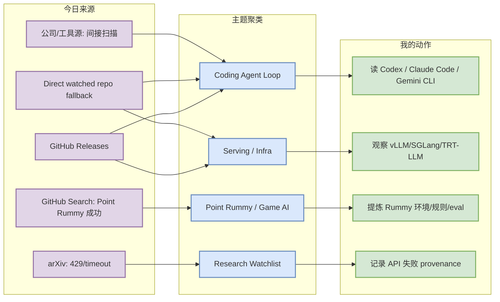
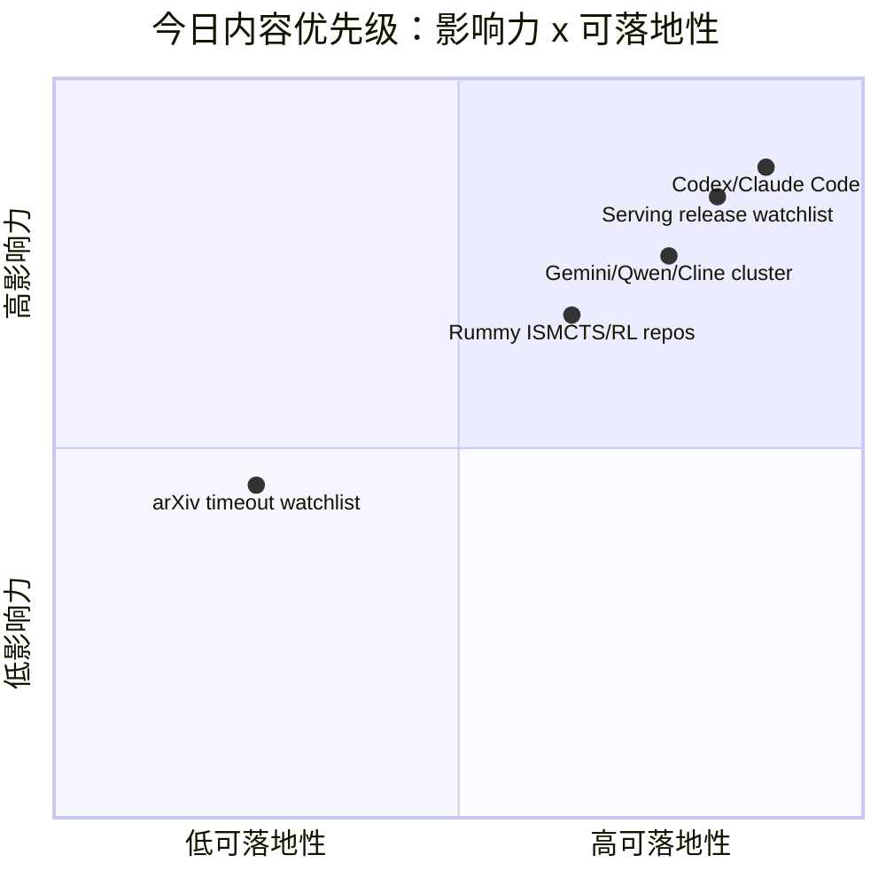

# AI Radar Daily - 2026-08-01

> 生成时间：2026-08-01 09:00 北京时间
> 范围：AI Infra / LLM / RL / Game AI / 大厂博客 / 论文 / GitHub / 行业资讯
> 说明：日报是总览导航页，不是全部正文。Obsidian 中点 `[[详情页]]`，Telegram/GitHub 中点“网页详情”。

## 0. 今日结论

- 今日最值得关注：OpenAI Codex release `rust-v0.147.0-alpha.4` 且 watched repo 日增 +277，仍是 coding-agent loop 最强信号。
- 对 AI Infra 的直接影响：TensorRT-LLM、vLLM、SGLang 近一周都有 release，serving/runtime/KV cache/scheduler 仍是最高优先级观察线。
- 对 LLM 训练 / 推理 / Agent 的影响：Claude Code、Gemini CLI、Qwen Code、Cline 均有 release 或日增信号，CLI/IDE agent 正在密集迭代。
- 对 RL / 游戏模型训练的影响：Point Rummy 主题有 10 个小型 repo 候选，日增基本为 0；适合抽规则、ISMCTS、self-play evaluator，不适合直接生产依赖。
- 建议今天深读：Codex / Claude Code / Gemini CLI release cluster、serving release watchlist、rummy-ai 与 gin-rummy-ai 的规则和 bot 设计。

## 1. 今日态势图

## 2. 必读卡片区

> [!important] OpenAI Codex release + repo 增长
> - 大类：GitHub / Coding 工具
> - 小类：Coding Agent / CLI
> - 重点：`rust-v0.147.0-alpha.4` 于 2026-07-31 发布，watched repo 日增 +277。
> - 为什么重要：Codex 代表终端 coding agent 的权限、远程执行、上下文窗口、CLI/TUI 工作流方向。
> - 详情：[[GitHub/Tools/2026-08-01/openai-codex]] / [网页详情](https://github.com/dyt27666-oss/AI-news-report-obsidians/blob/main/GitHub/Tools/2026-08-01/openai-codex.md) / [原文](https://github.com/openai/codex/releases/tag/rust-v0.147.0-alpha.4)

> [!tip] Claude Code / Gemini CLI / Qwen Code / Cline release cluster
> - 大类：GitHub / Coding 工具
> - 小类：Agentic coding
> - 重点：Claude Code、Gemini CLI、Qwen Code、Cline 都有近期 release 或日增信号。
> - 为什么重要：对 tmux 多 agent、代码审查、工具权限边界、MCP 和 agent loop 监控有直接参考价值。
> - 详情：[[Industry/Tools/2026-08-01/coding-agent-release-cluster]] / [网页详情](https://github.com/dyt27666-oss/AI-news-report-obsidians/blob/main/Industry/Tools/2026-08-01/coding-agent-release-cluster.md) / [原文](https://github.com/google-gemini/gemini-cli/releases/tag/v0.54.0-preview.1)

> [!note] Serving 三件套 release watchlist
> - 大类：GitHub / AI Infra
> - 小类：LLM Serving
> - 重点：TensorRT-LLM v1.3.0rc23、vLLM v0.26.0、SGLang v0.5.16 形成近一周 release cluster。
> - 为什么重要：直接影响吞吐、延迟、KV cache、scheduler、GPU runtime 和推理成本。
> - 详情：[[GitHub/AIInfra/2026-08-01/serving-release-watchlist]] / [网页详情](https://github.com/dyt27666-oss/AI-news-report-obsidians/blob/main/GitHub/AIInfra/2026-08-01/serving-release-watchlist.md) / [原文](https://github.com/NVIDIA/TensorRT-LLM/releases/tag/v1.3.0rc23)

> [!note] Point Rummy 小型 repo 候选可用于业务拆解
> - 大类：GitHub / 业务主题
> - 小类：Rummy AI / ISMCTS / RL
> - 重点：rickgorman/gin-rummy-ai、nakkekakke/rummy-ai 等不大，但主题强相关。
> - 为什么重要：可抽取规则环境、MCTS/ISMCTS、bot 策略和 evaluator 设计。
> - 详情：[[GitHub/PointRummy/2026-08-01/rickgorman__gin-rummy-ai]] / [网页详情](https://github.com/dyt27666-oss/AI-news-report-obsidians/blob/main/GitHub/PointRummy/2026-08-01/rickgorman__gin-rummy-ai.md) / [原文](https://github.com/rickgorman/gin-rummy-ai)

## 3. 优先级矩阵

## 4. 分类清单

| 标签 | 大类 | 小类 | 标题 | 重点概括 | 为什么重要 | Obsidian 详情 | 网页详情 | 原文 |
|---|---|---|---|---|---|---|---|---|
| 必读 | GitHub | Coding Agent | OpenAI Codex | rust-v0.147.0-alpha.4 + watched repo 日增 +277 | Codex 与 CLI 权限、远程执行、上下文策略直接相关 | [[GitHub/Tools/2026-08-01/openai-codex]] | [网页详情](https://github.com/dyt27666-oss/AI-news-report-obsidians/blob/main/GitHub/Tools/2026-08-01/openai-codex.md) | [原文](https://github.com/openai/codex/releases/tag/rust-v0.147.0-alpha.4) |
| 必读 | GitHub | Coding Agent | Claude Code | watched repo 日增 +133，生态热度继续 | 影响多 agent 编码、代码审查、TUI/CLI agent loop | [[GitHub/Tools/2026-08-01/claude-code]] | [网页详情](https://github.com/dyt27666-oss/AI-news-report-obsidians/blob/main/GitHub/Tools/2026-08-01/claude-code.md) | [原文](https://github.com/anthropics/claude-code/releases/tag/v2.1.220) |
| 必读 | GitHub | Serving | TensorRT-LLM / vLLM / SGLang release watchlist | 三个 serving runtime 近一周都有 release | 对 KV cache、batching、scheduler、GPU runtime 的工程选型有直接价值 | [[GitHub/AIInfra/2026-08-01/serving-release-watchlist]] | [网页详情](https://github.com/dyt27666-oss/AI-news-report-obsidians/blob/main/GitHub/AIInfra/2026-08-01/serving-release-watchlist.md) | [原文](https://github.com/NVIDIA/TensorRT-LLM/releases/tag/v1.3.0rc23) |
| 可 skim | GitHub | Point Rummy | rummy-ai / gin-rummy-ai | 小型 repo 但主题强相关，日增基本为 0 | 可抽规则引擎、ISMCTS、bot 策略和 evaluator 设计 | [[GitHub/PointRummy/2026-08-01/nakkekakke__rummy-ai]] | [网页详情](https://github.com/dyt27666-oss/AI-news-report-obsidians/blob/main/GitHub/PointRummy/2026-08-01/nakkekakke__rummy-ai.md) | [原文](https://github.com/nakkekakke/rummy-ai) |

## 5. 大厂资讯 / 工程博客 / Research

### 5.1 公司来源扫描矩阵

| 公司/实验室 | 来源/栏目 | 今日状态 | 高相关条数 | 代表条目 | 备注 |
|---|---|---|---:|---|---|
| OpenAI | News / Research / Developer Tool | 间接扫描/有高相关工具信号 | 1 | Codex rust-v0.147.0-alpha.4；repo 日增 +277 | 官网新闻未完整抓取，以 GitHub release/repo 为高置信代理 |
| Anthropic | News / Research / Engineering | 间接扫描/有工具信号 | 1 | Claude Code v2.1.220；repo 日增 +133 | Claude Code release 不是当天发布但仍是高热 coding workflow 信号 |
| Google DeepMind | Blog / Research | 低置信 | 0 | 无高相关新项 | 本轮未拿到新的 research/blog 元数据；Gemini CLI 归入 Google coding 工具 |
| Meta AI | Blog / Research | 低置信 | 0 | 无高相关新项 | 本轮未发现可验证 AI Infra / RL / Agent 新项 |
| NVIDIA | Technical Blog / AI / GitHub Release | 间接扫描/有高相关工具信号 | 1 | TensorRT-LLM v1.3.0rc23 | 以 release/repo 作为 serving runtime 信号 |
| Microsoft | Research AI / GitHub | 间接扫描 | 1 | AutoGen / Semantic Kernel watched repo | 官网 research 未确认新文，保留 agent 编排生态信号 |
| Hugging Face | Blog / Papers / Releases | 间接扫描 | 1 | Transformers repo 高 star 且日增 +31 | 以 repo/model infra 生态代理 |
| 腾讯 | AI Lab / 技术博客 | 低置信 | 0 | 无高相关新项 | 本轮未发现可验证 AI Infra / RL / Agent 新项 |
| 字节 | Seed / 技术博客 | 低置信 | 0 | 无高相关新项 | 本轮未发现可验证 AI Infra / RL / Agent 新项 |
| SpaceAI | Blog / News | 访问失败/低置信 | 0 | 无高相关新项 | 来源有效性低，本轮未获得可验证新项 |

### 5.2 高相关大厂条目

| 标签 | 发布方/大厂 | 栏目/来源 | 标题 | 重点概括 | 工程/算法影响 | Obsidian 详情 | 网页详情 | 原文 |
|---|---|---|---|---|---|---|---|---|
| 可 skim | OpenAI | GitHub Release / Developer Tool | OpenAI Codex release + repo growth | Codex 发布 rust-v0.147.0-alpha.4 且 watched repo 日增 +277，是今天最强 coding-agent 信号。 | 直接影响 CLI/TUI agent、权限模式、远程执行和代码库上下文管理。 | [[GitHub/Tools/2026-08-01/openai-codex]] | [网页详情](https://github.com/dyt27666-oss/AI-news-report-obsidians/blob/main/GitHub/Tools/2026-08-01/openai-codex.md) | [原文](https://github.com/openai/codex/releases/tag/rust-v0.147.0-alpha.4) |
| 可 skim | Anthropic | GitHub Release / Developer Tool | Claude Code watched repo growth | Claude Code 最新 release 为 v2.1.220，repo 日增 +133；虽非当天发布，但热度仍强。 | 影响 tmux 多 agent、代码审查、工具权限边界和 agent loop 监控。 | [[GitHub/Tools/2026-08-01/claude-code]] | [网页详情](https://github.com/dyt27666-oss/AI-news-report-obsidians/blob/main/GitHub/Tools/2026-08-01/claude-code.md) | [原文](https://github.com/anthropics/claude-code/releases/tag/v2.1.220) |
| 可 skim | Google / Alibaba / Cline | GitHub Releases | Gemini CLI / Qwen Code / Cline releases | Gemini CLI v0.54.0-preview.1、Qwen Code v0.21.2、Cline v4.1.2 均在 7/31 发布。 | 说明 CLI/IDE coding agents 进入密集迭代期，需要重点看 MCP、权限和上下文窗口变化。 | [[Industry/Tools/2026-08-01/coding-agent-release-cluster]] | [网页详情](https://github.com/dyt27666-oss/AI-news-report-obsidians/blob/main/Industry/Tools/2026-08-01/coding-agent-release-cluster.md) | [原文](https://github.com/google-gemini/gemini-cli/releases/tag/v0.54.0-preview.1) |
| 可 skim | NVIDIA / vLLM / SGLang | GitHub Releases / AI Infra | TensorRT-LLM / vLLM / SGLang serving release watchlist | TensorRT-LLM、vLLM、SGLang 近一周均有 release，是今天最可信 serving 工程信号。 | 可直接映射到 KV cache、scheduler、GPU runtime、MoE/VLM serving 选型。 | [[GitHub/AIInfra/2026-08-01/serving-release-watchlist]] | [网页详情](https://github.com/dyt27666-oss/AI-news-report-obsidians/blob/main/GitHub/AIInfra/2026-08-01/serving-release-watchlist.md) | [原文](https://github.com/NVIDIA/TensorRT-LLM/releases/tag/v1.3.0rc23) |

## 6. GitHub 高 star Top 10

> 说明：今日 GitHub Search 在 Point Rummy 后 403；此表使用 direct watched repo fallback，不是完整全网 Top 10，但每项都与 AI Infra / LLM / Agent / RL 强相关。

| 排名 | repo | stars | forks | language | updated_at | topics | 重点概括 | 是否值得试用 | Obsidian 详情 | 原文 |
|---:|---|---:|---:|---|---|---|---|---|---|---|
| 1 | `huggingface/transformers` | 163211 | 34082 | Python | 2026-08-01T00:32:18Z | audio, deep-learning, deepseek, gemma, glm, hacktoberfest, llm, machine-learning, model-hub, natural | 模型定义、推理和训练生态底座；新模型接入、量化、eval pipeline 都绕不开它。 | 值得 skim/按需试用 | [[GitHub/AIInfra/2026-08-01/huggingface__transformers]] | [GitHub](https://github.com/huggingface/transformers) |
| 2 | `anthropics/claude-code` | 139824 | 22450 | Python | 2026-08-01T00:59:14Z | 无 | 终端内 agentic coding 工具；高 star 和持续 release 说明 CLI agent workflow 仍在扩张。 | 值得 skim/按需试用 | [[GitHub/LoopEngineer/2026-08-01/anthropics__claude-code]] | [GitHub](https://github.com/anthropics/claude-code) |
| 3 | `google-gemini/gemini-cli` | 106284 | 14358 | TypeScript | 2026-08-01T00:03:49Z | ai, ai-agents, cli, gemini, gemini-api, mcp-client, mcp-server | Gemini 终端 agent；适合观察 MCP、命令行 agent 和企业工具接入方式。 | 值得 skim/按需试用 | [[GitHub/LoopEngineer/2026-08-01/google-gemini__gemini-cli]] | [GitHub](https://github.com/google-gemini/gemini-cli) |
| 4 | `openai/codex` | 102929 | 15485 | Rust | 2026-08-01T00:39:32Z | 无 | Rust 终端 coding agent；高增长直接对应权限模式、远程执行和上下文策略。 | 值得 skim/按需试用 | [[GitHub/LoopEngineer/2026-08-01/openai__codex]] | [GitHub](https://github.com/openai/codex) |
| 5 | `pytorch/pytorch` | 102091 | 28618 | Python | 2026-08-01T00:36:34Z | autograd, deep-learning, gpu, machine-learning, neural-network, numpy, python, tensor | 训练/推理框架底层；GPU runtime、编译、distributed 变化会影响大模型工程。 | 值得 skim/按需试用 | [[GitHub/AIInfra/2026-08-01/pytorch__pytorch]] | [GitHub](https://github.com/pytorch/pytorch) |
| 6 | `modelcontextprotocol/servers` | 89103 | 11343 | TypeScript | 2026-08-01T00:34:49Z | 无 | MCP server 生态入口；影响 coding agent 的工具接入标准化和权限边界。 | 值得 skim/按需试用 | [[GitHub/LoopEngineer/2026-08-01/modelcontextprotocol__servers]] | [GitHub](https://github.com/modelcontextprotocol/servers) |
| 7 | `vllm-project/vllm` | 87816 | 20114 | Python | 2026-08-01T00:21:28Z | amd, blackwell, cuda, deepseek, deepseek-v3, gpt, gpt-oss, inference, kimi, llama, llm, llm-serving, | LLM serving 高吞吐引擎；关注 batching、KV cache、并发和硬件适配。 | 值得 skim/按需试用 | [[GitHub/AIInfra/2026-08-01/vllm-project__vllm]] | [GitHub](https://github.com/vllm-project/vllm) |
| 8 | `OpenHands/OpenHands` | 82721 | 10636 | TypeScript | 2026-08-01T00:55:30Z | agent, artificial-intelligence, chatgpt, claude-ai, cli, developer-tools, gpt, llm, openai | 开源 AI coding agent 工作台；适合作为 loop engineer 和 harness 参考。 | 值得 skim/按需试用 | [[GitHub/LoopEngineer/2026-08-01/OpenHands__OpenHands]] | [GitHub](https://github.com/OpenHands/OpenHands) |
| 9 | `cline/cline` | 65332 | 7021 | TypeScript | 2026-08-01T00:25:21Z | 无 | IDE/CLI 自主 coding agent；适合观察 agent SDK、工具调用和 extension workflow。 | 值得 skim/按需试用 | [[GitHub/LoopEngineer/2026-08-01/cline__cline]] | [GitHub](https://github.com/cline/cline) |
| 10 | `microsoft/autogen` | 60134 | 9059 | Python | 2026-08-01T00:58:57Z | agentic, agentic-agi, agents, ai, autogen, autogen-ecosystem, chatgpt, framework, llm-agent, llm-fra | 多 agent 编程框架；适合作为 orchestration、eval loop 和企业 agent 参考。 | 值得 skim/按需试用 | [[GitHub/AIInfra/2026-08-01/microsoft__autogen]] | [GitHub](https://github.com/microsoft/autogen) |

## 7. GitHub star 增长最快 Top 10

> 说明：使用 2026-07-31 snapshot baseline 计算 watched repo stars_delta；这是“非完整全网日增”，不是冷启动代理。

| 排名 | repo | stars_delta | stars | forks | language | updated_at | 增长依据 | 重点概括 | Obsidian 详情 | 原文 |
|---:|---|---:|---:|---:|---|---|---|---|---|---|
| 1 | `openai/codex` | 277 | 102929 | 15485 | Rust | 2026-08-01T00:39:32Z | direct watched repo fallback vs 2026-07-31; 非完整全网日增 | Rust 终端 coding agent；高增长直接对应权限模式、远程执行和上下文策略。 | [[GitHub/LoopEngineer/2026-08-01/openai__codex]] | [GitHub](https://github.com/openai/codex) |
| 2 | `anthropics/claude-code` | 133 | 139824 | 22450 | Python | 2026-08-01T00:59:14Z | direct watched repo fallback vs 2026-07-31; 非完整全网日增 | 终端内 agentic coding 工具；高 star 和持续 release 说明 CLI agent workflow 仍在扩张。 | [[GitHub/LoopEngineer/2026-08-01/anthropics__claude-code]] | [GitHub](https://github.com/anthropics/claude-code) |
| 3 | `OpenHands/OpenHands` | 99 | 82721 | 10636 | TypeScript | 2026-08-01T00:55:30Z | direct watched repo fallback vs 2026-07-31; 非完整全网日增 | 开源 AI coding agent 工作台；适合作为 loop engineer 和 harness 参考。 | [[GitHub/LoopEngineer/2026-08-01/OpenHands__OpenHands]] | [GitHub](https://github.com/OpenHands/OpenHands) |
| 4 | `vllm-project/vllm` | 93 | 87816 | 20114 | Python | 2026-08-01T00:21:28Z | direct watched repo fallback vs 2026-07-31; 非完整全网日增 | LLM serving 高吞吐引擎；关注 batching、KV cache、并发和硬件适配。 | [[GitHub/AIInfra/2026-08-01/vllm-project__vllm]] | [GitHub](https://github.com/vllm-project/vllm) |
| 5 | `langchain-ai/langgraph` | 58 | 38585 | 6504 | Python | 2026-08-01T00:35:51Z | direct watched repo fallback vs 2026-07-31; 非完整全网日增 | 图式 agent state machine；适合生产 agent 的恢复、分支和 eval loop。 | [[GitHub/LoopEngineer/2026-08-01/langchain-ai__langgraph]] | [GitHub](https://github.com/langchain-ai/langgraph) |
| 6 | `cline/cline` | 57 | 65332 | 7021 | TypeScript | 2026-08-01T00:25:21Z | direct watched repo fallback vs 2026-07-31; 非完整全网日增 | IDE/CLI 自主 coding agent；适合观察 agent SDK、工具调用和 extension workflow。 | [[GitHub/LoopEngineer/2026-08-01/cline__cline]] | [GitHub](https://github.com/cline/cline) |
| 7 | `sgl-project/sglang` | 44 | 31020 | 7561 | Python | 2026-08-01T01:01:01Z | direct watched repo fallback vs 2026-07-31; 非完整全网日增 | 高性能 LLM/VLM serving 框架；关注 attention、CUDA、MoE 和 RL serving。 | [[GitHub/AIInfra/2026-08-01/sgl-project__sglang]] | [GitHub](https://github.com/sgl-project/sglang) |
| 8 | `modelcontextprotocol/servers` | 42 | 89103 | 11343 | TypeScript | 2026-08-01T00:34:49Z | direct watched repo fallback vs 2026-07-31; 非完整全网日增 | MCP server 生态入口；影响 coding agent 的工具接入标准化和权限边界。 | [[GitHub/LoopEngineer/2026-08-01/modelcontextprotocol__servers]] | [GitHub](https://github.com/modelcontextprotocol/servers) |
| 9 | `huggingface/transformers` | 31 | 163211 | 34082 | Python | 2026-08-01T00:32:18Z | direct watched repo fallback vs 2026-07-31; 非完整全网日增 | 模型定义、推理和训练生态底座；新模型接入、量化、eval pipeline 都绕不开它。 | [[GitHub/AIInfra/2026-08-01/huggingface__transformers]] | [GitHub](https://github.com/huggingface/transformers) |
| 10 | `google-gemini/gemini-cli` | 20 | 106284 | 14358 | TypeScript | 2026-08-01T00:03:49Z | direct watched repo fallback vs 2026-07-31; 非完整全网日增 | Gemini 终端 agent；适合观察 MCP、命令行 agent 和企业工具接入方式。 | [[GitHub/LoopEngineer/2026-08-01/google-gemini__gemini-cli]] | [GitHub](https://github.com/google-gemini/gemini-cli) |

## 8. Coding 工具 / AI 工具功能更新

### 8.1 Coding 工具扫描矩阵

| 工具 | 厂商 | 来源类型 | 今日状态 | 代表更新 | 对我的影响 | 原文 |
|---|---|---|---|---|---|---|
| Claude Code | Anthropic | GitHub Release / Changelog | 有 release/repo 信号 | release v2.1.220 / 2026-07-25；stars_delta=133，非完整全网日增 | 影响 CLI/TUI、agent loop、MCP、IDE coding workflow 或权限边界，建议持续观察。 | [原文](https://github.com/anthropics/claude-code/releases/tag/v2.1.220) |
| OpenAI Codex | OpenAI | GitHub Release / Docs | 有 release/repo 信号 | release rust-v0.147.0-alpha.4 / 2026-07-31；stars_delta=277，非完整全网日增 | 影响 CLI/TUI、agent loop、MCP、IDE coding workflow 或权限边界，建议持续观察。 | [原文](https://github.com/openai/codex/releases/tag/rust-v0.147.0-alpha.4) |
| Cursor | Cursor | Changelog | 低置信/无高相关新项 | 无高相关新项或官网未确认新增 release | 暂不调整工作流；保留扫描矩阵避免漏扫。 | [原文](https://cursor.com/changelog) |
| Windsurf | Windsurf | Changelog | 低置信/无高相关新项 | 无高相关新项或官网未确认新增 release | 暂不调整工作流；保留扫描矩阵避免漏扫。 | [原文](https://windsurf.com/changelog) |
| GitHub Copilot | GitHub | Changelog / Blog | 低置信/无高相关新项 | 无高相关新项或官网未确认新增 release | 暂不调整工作流；保留扫描矩阵避免漏扫。 | [原文](https://github.blog/changelog/label/copilot/) |
| Gemini Code Assist | Google | GitHub Release / Release Notes | 有 release/repo 信号 | release v0.54.0-preview.1 / 2026-07-31；stars_delta=20，非完整全网日增 | 影响 CLI/TUI、agent loop、MCP、IDE coding workflow 或权限边界，建议持续观察。 | [原文](https://github.com/google-gemini/gemini-cli/releases/tag/v0.54.0-preview.1) |
| Qwen Code | Alibaba/Qwen | GitHub Release | 有 release/repo 信号 | release v0.21.2 / 2026-07-31；stars_delta=18，非完整全网日增 | 影响 CLI/TUI、agent loop、MCP、IDE coding workflow 或权限边界，建议持续观察。 | [原文](https://github.com/QwenLM/qwen-code/releases/tag/v0.21.2) |
| Roo Code | Roo Code | GitHub Release | 间接扫描/有 repo 信号 | watched repo stars_delta=-1 | 影响 CLI/TUI、agent loop、MCP、IDE coding workflow 或权限边界，建议持续观察。 | [原文](https://github.com/RooCodeInc/Roo-Code) |
| Cline | Cline | GitHub Release | 有 release/repo 信号 | release v4.1.2 / 2026-07-31；stars_delta=57，非完整全网日增 | 影响 CLI/TUI、agent loop、MCP、IDE coding workflow 或权限边界，建议持续观察。 | [原文](https://github.com/cline/cline/releases/tag/v4.1.2) |
| Continue | Continue | GitHub Release | 间接扫描/有 repo 信号 | watched repo stars_delta=18 | 影响 CLI/TUI、agent loop、MCP、IDE coding workflow 或权限边界，建议持续观察。 | [原文](https://github.com/continuedev/continue) |

### 8.2 高相关工具更新

| 标签 | 工具/厂商 | 来源类型 | 标题/功能 | 重点概括 | 对 AI coding 工作流的影响 | Obsidian 详情 | 网页详情 | 原文 |
|---|---|---|---|---|---|---|---|---|
| 必读 | OpenAI Codex | GitHub Release / Docs | rust-v0.147.0-alpha.4 | repo 日增 +277；终端 coding agent 热度最高 | 重点看权限模式、远程执行、上下文窗口和 CLI/TUI 体验 | [[GitHub/Tools/2026-08-01/openai-codex]] | [网页详情](https://github.com/dyt27666-oss/AI-news-report-obsidians/blob/main/GitHub/Tools/2026-08-01/openai-codex.md) | [原文](https://github.com/openai/codex/releases/tag/rust-v0.147.0-alpha.4) |
| 必读 | Claude Code | GitHub Release / Docs | v2.1.220 + repo 增长 | repo 日增 +133；生态热度持续 | 影响多 agent 监控、代码审查与工具权限设计 | [[GitHub/Tools/2026-08-01/claude-code]] | [网页详情](https://github.com/dyt27666-oss/AI-news-report-obsidians/blob/main/GitHub/Tools/2026-08-01/claude-code.md) | [原文](https://github.com/anthropics/claude-code/releases/tag/v2.1.220) |
| 可 skim | Gemini CLI / Qwen Code / Cline | GitHub Releases | 7/31 release cluster | Gemini CLI、Qwen Code、Cline 均在 7/31 有 release | 说明 coding agent CLI/IDE 侧进入密集迭代，适合统一比较 MCP、权限和上下文策略 | [[Industry/Tools/2026-08-01/coding-agent-release-cluster]] | [网页详情](https://github.com/dyt27666-oss/AI-news-report-obsidians/blob/main/Industry/Tools/2026-08-01/coding-agent-release-cluster.md) | [原文](https://github.com/google-gemini/gemini-cli/releases/tag/v0.54.0-preview.1) |

## 9. Point Rummy / Indian Rummy 业务主题

### 9.1 GitHub 候选

| 排名 | repo | stars | forks | language | updated_at | topics | 重点概括 | 是否值得试用 | Obsidian 详情 | 原文 |
|---:|---|---:|---:|---|---|---|---|---|---|---|
| 1 | `rickgorman/gin-rummy-ai` | 13 | 5 | Python | 2025-03-25T13:47:09Z | 无 | A hand-rolled neuroevolution AI for gin rummy. | 值得 skim/按需试用 | [[GitHub/PointRummy/2026-08-01/rickgorman__gin-rummy-ai]] | [GitHub](https://github.com/rickgorman/gin-rummy-ai) |
| 2 | `nakkekakke/rummy-ai` | 11 | 5 | Java | 2026-04-17T10:02:59Z | ai, card, card-game, game, ismcts, mcts, monte-carlo-tree-search, rummy | Text based classic Rummy game with an AI that uses ISMCTS. Data Structures and Algorithms  | 值得 skim/按需试用 | [[GitHub/PointRummy/2026-08-01/nakkekakke__rummy-ai]] | [GitHub](https://github.com/nakkekakke/rummy-ai) |
| 3 | `jmhummel/Gin-Rummy-Java` | 8 | 0 | Java | 2023-08-16T16:12:58Z | ai, artificial-intelligence, card-game, card-games, cardgame, gin, gin-rummy, java, java-8, java8, r | Java-based Gin Rummy console game, with an AI opponent | 值得 skim/按需试用 | [[GitHub/PointRummy/2026-08-01/jmhummel__Gin-Rummy-Java]] | [GitHub](https://github.com/jmhummel/Gin-Rummy-Java) |
| 4 | `mudont/indian-rummy` | 5 | 0 | TypeScript | 2025-08-08T21:05:04Z | 无 | Typescript library for Indian Rummy card game | 值得 skim/按需试用 | [[GitHub/PointRummy/2026-08-01/mudont__indian-rummy]] | [GitHub](https://github.com/mudont/indian-rummy) |
| 5 | `dv-rastogi/Rummy` | 5 | 0 | Python | 2023-09-26T11:21:39Z | 无 | Variation of classical Indian Rummy made in Pygame | 值得 skim/按需试用 | [[GitHub/PointRummy/2026-08-01/dv-rastogi__Rummy]] | [GitHub](https://github.com/dv-rastogi/Rummy) |
| 6 | `vahsek300501/Indian-Rummy-` | 4 | 3 | Python | 2023-09-26T11:21:46Z | 无 | Indian Rummy made in Python using PyGame | 值得 skim/按需试用 | [[GitHub/PointRummy/2026-08-01/vahsek300501__Indian-Rummy-]] | [GitHub](https://github.com/vahsek300501/Indian-Rummy-) |
| 7 | `SCFlanagan/Rummy` | 4 | 6 | JavaScript | 2025-07-25T21:17:08Z | 无 | This project is a recreation of the classic card game Rummy. It features an AI player to p | 值得 skim/按需试用 | [[GitHub/PointRummy/2026-08-01/SCFlanagan__Rummy]] | [GitHub](https://github.com/SCFlanagan/Rummy) |
| 8 | `mcartmell/gin-rummy-bot` | 4 | 2 | Perl | 2024-10-30T20:06:17Z | 无 | A web-based Gin Rummy game and AI | 值得 skim/按需试用 | [[GitHub/PointRummy/2026-08-01/mcartmell__gin-rummy-bot]] | [GitHub](https://github.com/mcartmell/gin-rummy-bot) |
| 9 | `Mohitkumar-559/RummyServer` | 2 | 1 | JavaScript | 2024-03-17T03:48:34Z | 无 | Rummy game server for game that contain deal rummy and point rummy | 值得 skim/按需试用 | [[GitHub/PointRummy/2026-08-01/Mohitkumar-559__RummyServer]] | [GitHub](https://github.com/Mohitkumar-559/RummyServer) |
| 10 | `abubakarmunir712/dsa-final-project` | 2 | 1 | Python | 2026-06-27T06:34:26Z | 无 | A Python-based multiplayer Indian Rummy game with support for AI opponents and LAN play. I | 值得 skim/按需试用 | [[GitHub/PointRummy/2026-08-01/abubakarmunir712__dsa-final-project]] | [GitHub](https://github.com/abubakarmunir712/dsa-final-project) |

### 9.2 论文 / 资料候选

| 标签 | 来源 | 标题 | 作者/机构 | 重点概括 | 对 Point Rummy 业务有什么用 | Obsidian 详情 | 原文 |
|---|---|---|---|---|---|---|---|
| 低置信 | arXiv / Semantic Scholar / 预印本索引扫描 | Rummy imperfect-information game 论文源扫描 | 多来源；API 429 | 未确认新增论文；GitHub 上 rummy-ai / gin-rummy-ai 仍是可行动小样本。 | 业务上先抽规则引擎、ISMCTS、self-play evaluator，再回头做论文深扫。 | [[Papers/Watchlist/2026-08-01/rummy-imperfect-information-game]] | [原文](https://export.arxiv.org/api/query?search_query=all:rummy+imperfect+information+game+AI) |

### 9.3 业务可用性判断

| 方向 | 今日信号 | 可用性 | 下一步 |
|---|---|---|---|
| 规则引擎 / 计分 | mudont/indian-rummy、RummyServer、若干 scoreboard repo | 中：可抽规则对象、计分和房间模型 | 提取 13-card Indian Rummy 状态机和积分规则 |
| Bot / RL Agent | rummy-ai、gin-rummy-ai、IndianRummyRLCard、RummyGym | 中低：repo 小但主题强相关 | 先复现 ISMCTS / DQN 环境接口，不直接用生产代码 |
| 仿真 / 评测 | gym/RL lab/AI opponent repo | 中：适合搭 evaluator 和 rollout harness | 定义 observation/action/reward，接入并行 self-play |

## 10. Loop Engineer / Loop Engineering 主题

### 10.1 Loop Engineer GitHub 高 star Top 10

| 排名 | repo | stars | forks | language | updated_at | topics | 重点概括 | 是否值得试用 | Obsidian 详情 | 原文 |
|---:|---|---:|---:|---|---|---|---|---|---|---|
| 1 | `anthropics/claude-code` | 139824 | 22450 | Python | 2026-08-01T00:59:14Z | 无 | 终端内 agentic coding 工具；高 star 和持续 release 说明 CLI agent workflow 仍在扩张。 | 值得 skim/按需试用 | [[GitHub/LoopEngineer/2026-08-01/anthropics__claude-code]] | [GitHub](https://github.com/anthropics/claude-code) |
| 2 | `google-gemini/gemini-cli` | 106284 | 14358 | TypeScript | 2026-08-01T00:03:49Z | ai, ai-agents, cli, gemini, gemini-api, mcp-client, mcp-server | Gemini 终端 agent；适合观察 MCP、命令行 agent 和企业工具接入方式。 | 值得 skim/按需试用 | [[GitHub/LoopEngineer/2026-08-01/google-gemini__gemini-cli]] | [GitHub](https://github.com/google-gemini/gemini-cli) |
| 3 | `openai/codex` | 102929 | 15485 | Rust | 2026-08-01T00:39:32Z | 无 | Rust 终端 coding agent；高增长直接对应权限模式、远程执行和上下文策略。 | 值得 skim/按需试用 | [[GitHub/LoopEngineer/2026-08-01/openai__codex]] | [GitHub](https://github.com/openai/codex) |
| 4 | `modelcontextprotocol/servers` | 89103 | 11343 | TypeScript | 2026-08-01T00:34:49Z | 无 | MCP server 生态入口；影响 coding agent 的工具接入标准化和权限边界。 | 值得 skim/按需试用 | [[GitHub/LoopEngineer/2026-08-01/modelcontextprotocol__servers]] | [GitHub](https://github.com/modelcontextprotocol/servers) |
| 5 | `OpenHands/OpenHands` | 82721 | 10636 | TypeScript | 2026-08-01T00:55:30Z | agent, artificial-intelligence, chatgpt, claude-ai, cli, developer-tools, gpt, llm, openai | 开源 AI coding agent 工作台；适合作为 loop engineer 和 harness 参考。 | 值得 skim/按需试用 | [[GitHub/LoopEngineer/2026-08-01/OpenHands__OpenHands]] | [GitHub](https://github.com/OpenHands/OpenHands) |
| 6 | `cline/cline` | 65332 | 7021 | TypeScript | 2026-08-01T00:25:21Z | 无 | IDE/CLI 自主 coding agent；适合观察 agent SDK、工具调用和 extension workflow。 | 值得 skim/按需试用 | [[GitHub/LoopEngineer/2026-08-01/cline__cline]] | [GitHub](https://github.com/cline/cline) |
| 7 | `langchain-ai/langgraph` | 38585 | 6504 | Python | 2026-08-01T00:35:51Z | agents, ai, ai-agents, chatgpt, deepagents, enterprise, framework, gemini, generative-ai, langchain, | 图式 agent state machine；适合生产 agent 的恢复、分支和 eval loop。 | 值得 skim/按需试用 | [[GitHub/LoopEngineer/2026-08-01/langchain-ai__langgraph]] | [GitHub](https://github.com/langchain-ai/langgraph) |
| 8 | `continuedev/continue` | 35246 | 5156 | TypeScript | 2026-07-31T23:25:27Z | agent, ai, cli, developer-tools, open-source | 开源 coding agent；适合观察 IDE/CLI 结合、本地模型和模型路由。 | 值得 skim/按需试用 | [[GitHub/LoopEngineer/2026-08-01/continuedev__continue]] | [GitHub](https://github.com/continuedev/continue) |
| 9 | `QwenLM/qwen-code` | 26478 | 2754 | TypeScript | 2026-08-01T00:58:59Z | 无 | Qwen 终端 coding agent；适合国产模型 coding workflow 与 CLI agent 观察。 | 值得 skim/按需试用 | [[GitHub/LoopEngineer/2026-08-01/QwenLM__qwen-code]] | [GitHub](https://github.com/QwenLM/qwen-code) |
| 10 | `RooCodeInc/Roo-Code` | 24363 | 3393 | TypeScript | 2026-07-31T19:35:28Z | 无 | 编辑器内多角色 AI agent；适合观察规划/执行/审查分工。 | 值得 skim/按需试用 | [[GitHub/LoopEngineer/2026-08-01/RooCodeInc__Roo-Code]] | [GitHub](https://github.com/RooCodeInc/Roo-Code) |

### 10.2 Loop Engineer GitHub star 增长最快 Top 10

| 排名 | repo | stars_delta | stars | forks | language | updated_at | 增长依据 | 重点概括 | Obsidian 详情 | 原文 |
|---:|---|---:|---:|---:|---|---|---|---|---|---|
| 1 | `openai/codex` | 277 | 102929 | 15485 | Rust | 2026-08-01T00:39:32Z | direct watched repo fallback vs 2026-07-31; 非完整全网日增 | Rust 终端 coding agent；高增长直接对应权限模式、远程执行和上下文策略。 | [[GitHub/LoopEngineer/2026-08-01/openai__codex]] | [GitHub](https://github.com/openai/codex) |
| 2 | `anthropics/claude-code` | 133 | 139824 | 22450 | Python | 2026-08-01T00:59:14Z | direct watched repo fallback vs 2026-07-31; 非完整全网日增 | 终端内 agentic coding 工具；高 star 和持续 release 说明 CLI agent workflow 仍在扩张。 | [[GitHub/LoopEngineer/2026-08-01/anthropics__claude-code]] | [GitHub](https://github.com/anthropics/claude-code) |
| 3 | `OpenHands/OpenHands` | 99 | 82721 | 10636 | TypeScript | 2026-08-01T00:55:30Z | direct watched repo fallback vs 2026-07-31; 非完整全网日增 | 开源 AI coding agent 工作台；适合作为 loop engineer 和 harness 参考。 | [[GitHub/LoopEngineer/2026-08-01/OpenHands__OpenHands]] | [GitHub](https://github.com/OpenHands/OpenHands) |
| 4 | `langchain-ai/langgraph` | 58 | 38585 | 6504 | Python | 2026-08-01T00:35:51Z | direct watched repo fallback vs 2026-07-31; 非完整全网日增 | 图式 agent state machine；适合生产 agent 的恢复、分支和 eval loop。 | [[GitHub/LoopEngineer/2026-08-01/langchain-ai__langgraph]] | [GitHub](https://github.com/langchain-ai/langgraph) |
| 5 | `cline/cline` | 57 | 65332 | 7021 | TypeScript | 2026-08-01T00:25:21Z | direct watched repo fallback vs 2026-07-31; 非完整全网日增 | IDE/CLI 自主 coding agent；适合观察 agent SDK、工具调用和 extension workflow。 | [[GitHub/LoopEngineer/2026-08-01/cline__cline]] | [GitHub](https://github.com/cline/cline) |
| 6 | `modelcontextprotocol/servers` | 42 | 89103 | 11343 | TypeScript | 2026-08-01T00:34:49Z | direct watched repo fallback vs 2026-07-31; 非完整全网日增 | MCP server 生态入口；影响 coding agent 的工具接入标准化和权限边界。 | [[GitHub/LoopEngineer/2026-08-01/modelcontextprotocol__servers]] | [GitHub](https://github.com/modelcontextprotocol/servers) |
| 7 | `google-gemini/gemini-cli` | 20 | 106284 | 14358 | TypeScript | 2026-08-01T00:03:49Z | direct watched repo fallback vs 2026-07-31; 非完整全网日增 | Gemini 终端 agent；适合观察 MCP、命令行 agent 和企业工具接入方式。 | [[GitHub/LoopEngineer/2026-08-01/google-gemini__gemini-cli]] | [GitHub](https://github.com/google-gemini/gemini-cli) |
| 8 | `continuedev/continue` | 18 | 35246 | 5156 | TypeScript | 2026-07-31T23:25:27Z | direct watched repo fallback vs 2026-07-31; 非完整全网日增 | 开源 coding agent；适合观察 IDE/CLI 结合、本地模型和模型路由。 | [[GitHub/LoopEngineer/2026-08-01/continuedev__continue]] | [GitHub](https://github.com/continuedev/continue) |
| 9 | `QwenLM/qwen-code` | 18 | 26478 | 2754 | TypeScript | 2026-08-01T00:58:59Z | direct watched repo fallback vs 2026-07-31; 非完整全网日增 | Qwen 终端 coding agent；适合国产模型 coding workflow 与 CLI agent 观察。 | [[GitHub/LoopEngineer/2026-08-01/QwenLM__qwen-code]] | [GitHub](https://github.com/QwenLM/qwen-code) |
| 10 | `RooCodeInc/Roo-Code` | -1 | 24363 | 3393 | TypeScript | 2026-07-31T19:35:28Z | direct watched repo fallback vs 2026-07-31; 非完整全网日增 | 编辑器内多角色 AI agent；适合观察规划/执行/审查分工。 | [[GitHub/LoopEngineer/2026-08-01/RooCodeInc__Roo-Code]] | [GitHub](https://github.com/RooCodeInc/Roo-Code) |

### 10.3 Loop Engineering 方法信号

| 标签 | 来源 | 标题 | 重点概括 | 对 AI coding 工作流的影响 | Obsidian 详情 | 原文 |
|---|---|---|---|---|---|---|
| 必读 | GitHub watched fallback | Codex / Claude Code / Gemini CLI / Cline | 今天 Loop Engineer 榜单不依赖 GitHub Search，而使用固定 watched repo，避免被 Point Rummy 主题偏置 | 适合设计 AGENTS.md、权限模式、eval loop、multi-agent orchestration | [[GitHub/LoopEngineer/2026-08-01/openai__codex]] | [原文](https://github.com/openai/codex) |

## 11. 论文

### 11.1 Research watchlist / API timeout

| 标签 | 论文来源 | 论文 | 作者/机构 | 重点概括 | 工程/研究价值 | Obsidian 详情 | 网页详情 | PDF/原文 |
|---|---|---|---|---|---|---|---|---|
| 低置信 | arXiv / 预印本索引扫描 | LLM Serving / inference 论文源扫描 | 多来源；API 429 | arXiv 对 LLM inference 查询返回 429；今天不把未验证论文塞进必读区。 | 对 AI Infra 工程判断更可信的是 vLLM/SGLang/TensorRT-LLM 的 release/repo 信号。 | [[Papers/Watchlist/2026-08-01/llm-serving-inference]] | [网页详情](https://github.com/dyt27666-oss/AI-news-report-obsidians/blob/main/Papers/Watchlist/2026-08-01/llm-serving-inference.md) | [原文](https://export.arxiv.org/api/query?search_query=all:large+language+model+inference) |
| 低置信 | arXiv / 预印本索引扫描 | RLHF / reinforcement learning language models 论文源扫描 | 多来源；timeout | 查询超时；保留 GRPO/RLHF/agentic RL 为后续 watchlist。 | 避免把弱相关 ML 噪声混入日报；后续应结合 OpenReview/Semantic Scholar 重试。 | [[Papers/Watchlist/2026-08-01/rlhf-reinforcement-learning-language-models]] | [网页详情](https://github.com/dyt27666-oss/AI-news-report-obsidians/blob/main/Papers/Watchlist/2026-08-01/rlhf-reinforcement-learning-language-models.md) | [原文](https://export.arxiv.org/api/query?search_query=all:reinforcement+learning+language+models) |
| 低置信 | arXiv / 预印本索引扫描 | Agent evaluation 论文源扫描 | 多来源；API 429 | agent eval 查询被限流；今天用 MCP、LangGraph、OpenHands 等工程源观察 eval loop。 | 对 coding-agent loop 来说，工程 harness 与可观测性比低置信论文标题更可行动。 | [[Papers/Watchlist/2026-08-01/agent-evaluation]] | [网页详情](https://github.com/dyt27666-oss/AI-news-report-obsidians/blob/main/Papers/Watchlist/2026-08-01/agent-evaluation.md) | [原文](https://export.arxiv.org/api/query?search_query=all:agent+evaluation) |
| 低置信 | arXiv / Semantic Scholar / 预印本索引扫描 | Rummy imperfect-information game 论文源扫描 | 多来源；API 429 | 未确认新增论文；GitHub 上 rummy-ai / gin-rummy-ai 仍是可行动小样本。 | 业务上先抽规则引擎、ISMCTS、self-play evaluator，再回头做论文深扫。 | [[Papers/Watchlist/2026-08-01/rummy-imperfect-information-game]] | [网页详情](https://github.com/dyt27666-oss/AI-news-report-obsidians/blob/main/Papers/Watchlist/2026-08-01/rummy-imperfect-information-game.md) | [原文](https://export.arxiv.org/api/query?search_query=all:rummy+imperfect+information+game+AI) |

## 12. 资讯 / 其他 GitHub 项目

### 12.1 Serving / Agent / MCP 观察

| 标签 | 来源 | 标题 | 重点概括 | 对我有什么用 | Obsidian 详情 | 网页详情 | 原文 |
|---|---|---|---|---|---|---|---|
| 可 skim | GitHub | Model Context Protocol servers | MCP server 生态是 agent tool-use 标准化入口，今日 watched repo 日增 +42 | 对 coding agent 接工具、权限边界、可观测性有长期价值 | [[GitHub/AIInfra/2026-08-01/modelcontextprotocol__servers]] | [网页详情](https://github.com/dyt27666-oss/AI-news-report-obsidians/blob/main/GitHub/AIInfra/2026-08-01/modelcontextprotocol__servers.md) | [原文](https://github.com/modelcontextprotocol/servers) |
| 可 skim | GitHub | LangGraph | 图式 agent state machine watched repo 日增 +58 | 可用于 coding-agent loop、eval loop 和工具调用恢复 | [[GitHub/LoopEngineer/2026-08-01/langchain-ai__langgraph]] | [网页详情](https://github.com/dyt27666-oss/AI-news-report-obsidians/blob/main/GitHub/LoopEngineer/2026-08-01/langchain-ai__langgraph.md) | [原文](https://github.com/langchain-ai/langgraph) |

## 13. 按主题索引

### AI Infra / Serving / Training

- [[GitHub/AIInfra/2026-08-01/vllm-project__vllm]] - LLM serving 引擎观察。
- [[GitHub/AIInfra/2026-08-01/sgl-project__sglang]] - 高性能 serving / VLM / RL serving 观察。
- [[GitHub/AIInfra/2026-08-01/NVIDIA__TensorRT-LLM]] - NVIDIA GPU inference runtime 观察。

### LLM / Agent / RAG / Evaluation

- [[GitHub/LoopEngineer/2026-08-01/openai__codex]] - CLI coding agent 增长信号。
- [[GitHub/LoopEngineer/2026-08-01/anthropics__claude-code]] - Claude Code agent workflow 观察。
- [[GitHub/AIInfra/2026-08-01/modelcontextprotocol__servers]] - MCP tool-use 生态入口。

### RL / Game AI / World Model

- [[GitHub/AIInfra/2026-08-01/verl-project__verl]] - RL post-training 框架观察。
- [[GitHub/AIInfra/2026-08-01/OpenRLHF__OpenRLHF]] - Ray/vLLM RLHF 框架观察。

### Point Rummy / Indian Rummy

- [[GitHub/PointRummy/2026-08-01/rickgorman__gin-rummy-ai]] - Gin Rummy bot / neuroevolution 参考。
- [[GitHub/PointRummy/2026-08-01/nakkekakke__rummy-ai]] - ISMCTS Rummy AI，可拆 bot 策略。

### Loop Engineer / Coding Agent Loop

- [[GitHub/LoopEngineer/2026-08-01/OpenHands__OpenHands]] - agent workspace / harness 参考。
- [[GitHub/LoopEngineer/2026-08-01/cline__cline]] - IDE/CLI autonomous coding agent 参考。
- [[GitHub/LoopEngineer/2026-08-01/continuedev__continue]] - open-source coding agent 参考。

### 公司 / 实验室

- OpenAI: [[GitHub/Tools/2026-08-01/openai-codex]]
- Anthropic: [[GitHub/Tools/2026-08-01/claude-code]]
- Google: [[Industry/Tools/2026-08-01/coding-agent-release-cluster]]
- NVIDIA: [[GitHub/AIInfra/2026-08-01/NVIDIA__TensorRT-LLM]]
- Hugging Face: [[GitHub/AIInfra/2026-08-01/huggingface__transformers]]
- Microsoft: [[GitHub/AIInfra/2026-08-01/microsoft__autogen]]

## 14. 值得后续深挖

| 标签 | 大类 | 小类 | 标题 | 后续动作 | Obsidian 详情 | 原文 |
|---|---|---|---|---|---|---|
| 后续 | GitHub | Point Rummy | rummy-ai / RummyGym / IndianRummyRLCard | 建一个最小 gym-like environment + evaluator 复现计划 | [[GitHub/PointRummy/2026-08-01/nakkekakke__rummy-ai]] | [原文](https://github.com/nakkekakke/rummy-ai) |
| 后续 | Tool | Coding Agent | Codex / Claude Code / Gemini CLI 权限模式 | 后续专门扫 release notes / docs，确认是否有权限、远程执行、上下文窗口变化 | [[GitHub/Tools/2026-08-01/openai-codex]] | [原文](https://github.com/openai/codex) |
| 后续 | Serving | Runtime | TensorRT-LLM / vLLM / SGLang release diff | 对比 release note 中的 scheduler、KV cache、MoE/VLM 和 CUDA kernel 变化 | [[GitHub/AIInfra/2026-08-01/serving-release-watchlist]] | [原文](https://github.com/NVIDIA/TensorRT-LLM/releases/tag/v1.3.0rc23) |

## 15. 采集失败或低置信来源

- GitHub Search：Point Rummy 前半成功，随后大量 403 rate limit；通用 GitHub / Loop Engineer 表已标注 direct watched repo fallback。
- arXiv：LLM inference、agent evaluation、world model、Rummy 查询返回 429 或 timeout；论文区只保留 watchlist 和 provenance，不硬塞弱相关论文。
- 公司官网/博客：本轮多为间接扫描或低置信，矩阵中逐项保留状态。
- 今日 snapshot：`Automation/state/github-stars-2026-08-01.json` 已保存，包含 Point Rummy search 结果和 broad watched fallback。

## 16. 归档标签

#ai-radar #daily #ai-infra #llm #rl #point-rummy #loop-engineering
