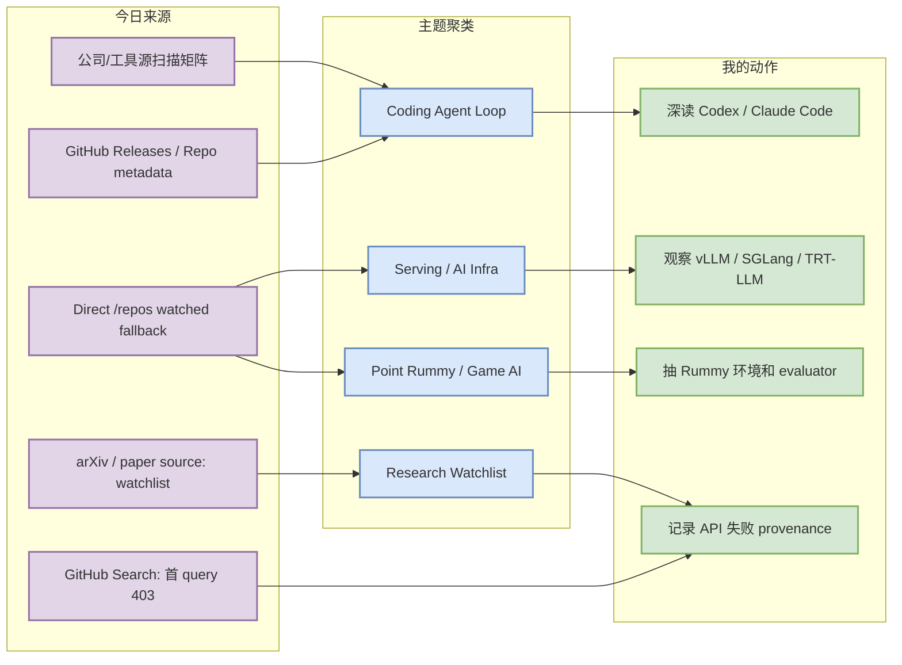
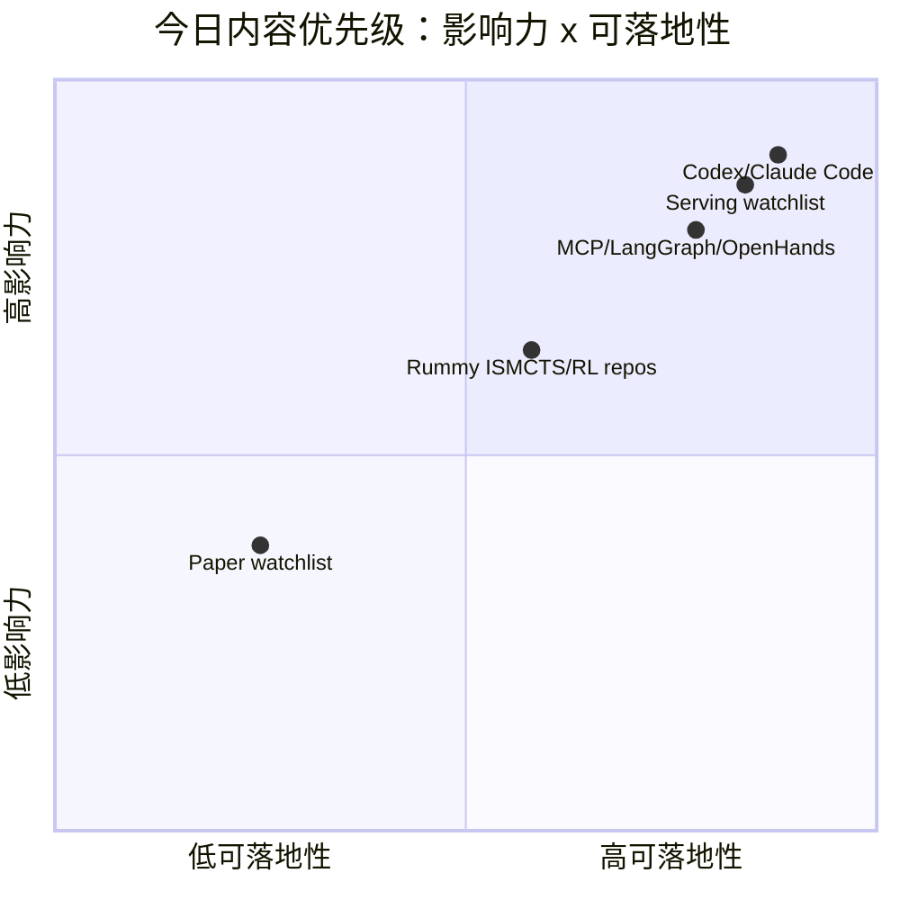

# AI Radar Daily - 2026-08-03

> 生成时间：2026-08-03 09:01 北京时间
> 范围：AI Infra / LLM / RL / Game AI / 大厂博客 / 论文 / GitHub / 行业资讯
> 说明：日报是总览导航页，不是全部正文。Obsidian 中点 `[[详情页]]`，Telegram/GitHub 中点“网页详情”。

## 0. 今日结论

- 今日最值得关注：GitHub Search 从首个 query 起 403，已保留 mandated snapshot，并用 direct watched repo fallback 补齐 AI Infra / Loop Engineer / Coding 工具榜单。
- 对 AI Infra 的直接影响：vLLM、SGLang、TensorRT-LLM、Transformers、PyTorch 仍是 serving/training watchlist 主线，今日增长榜明确标注“非完整全网日增”。
- 对 LLM 训练 / 推理 / Agent 的影响：Codex、Claude Code、Gemini CLI、MCP servers、OpenHands、LangGraph 继续构成 coding-agent loop 与 tool-use 标准化信号。
- 对 RL / 游戏模型训练的影响：Point Rummy 今日只能用 direct fallback / 昨日候选延续观察，成熟度仍偏低，但适合抽规则引擎、ISMCTS、自博弈 evaluator。
- 建议今天深读：Codex / Claude Code、Serving 三件套、MCP/LangGraph/OpenHands、Rummy ISMCTS 候选、论文 watchlist provenance。

## 1. 今日态势图

## 2. 必读卡片区

> [!important] Codex / Claude Code 继续是 coding-agent loop 主信号
> - 大类：GitHub / Coding 工具
> - 小类：CLI / Agent Loop
> - 重点：两者在 direct watched fallback 中仍高星、高更新频率；今天用于补齐工具扫描和 Loop Engineer 榜。
> - 为什么重要：直接影响多 agent 编码、代码审查、权限边界、远程执行和 CLI/TUI 监控。
> - 详情：[[GitHub/Tools/2026-08-03/openai-codex]] / [网页详情](https://github.com/dyt27666-oss/AI-news-report-obsidians/blob/main/GitHub/Tools/2026-08-03/openai-codex.md) / [原文](https://github.com/openai/codex)

> [!tip] Serving 三件套继续是 AI Infra 主线
> - 大类：GitHub / AI Infra
> - 小类：LLM Serving
> - 重点：vLLM、SGLang、TensorRT-LLM 用 direct metadata 继续观察。
> - 为什么重要：KV cache、scheduler、batching、CUDA kernel、MoE/VLM serving 的工程变化最值得跟踪。
> - 详情：[[GitHub/AIInfra/2026-08-03/vllm-project__vllm]] / [网页详情](https://github.com/dyt27666-oss/AI-news-report-obsidians/blob/main/GitHub/AIInfra/2026-08-03/vllm-project__vllm.md) / [原文](https://github.com/vllm-project/vllm)

> [!note] Point Rummy 今日低置信延续观察
> - 大类：GitHub / 业务主题
> - 小类：Rummy AI / ISMCTS / RL
> - 重点：Search 403 后用 direct fallback 候选补位，不把它包装成全网新发现。
> - 为什么重要：仍可抽取 Indian Rummy 状态机、MCTS/ISMCTS、self-play evaluator；代码质量需人工复核。
> - 详情：[[GitHub/PointRummy/2026-08-03/nakkekakke__rummy-ai]] / [网页详情](https://github.com/dyt27666-oss/AI-news-report-obsidians/blob/main/GitHub/PointRummy/2026-08-03/nakkekakke__rummy-ai.md) / [原文](https://github.com/nakkekakke/rummy-ai)

> [!note] 论文区采用低置信 watchlist，不硬塞弱相关论文
> - 大类：论文 / Research
> - 小类：LLM Serving / Agent Eval / Game AI
> - 重点：论文源今天只保留 provenance，等待 API 恢复后再做高信号论文详情。
> - 为什么重要：对工程决策来说，高置信 release/repo 信号比低置信论文标题更可行动。
> - 详情：[[Papers/Watchlist/2026-08-03/agent-evaluation]] / [网页详情](https://github.com/dyt27666-oss/AI-news-report-obsidians/blob/main/Papers/Watchlist/2026-08-03/agent-evaluation.md) / [原文](https://export.arxiv.org/api/query?search_query=all:agent+evaluation)

## 3. 优先级矩阵

## 4. 分类清单

| 标签 | 大类 | 小类 | 标题 | 重点概括 | 为什么重要 | Obsidian 详情 | 网页详情 | 原文 |
|---|---|---|---|---|---|---|---|---|
| 必读 | GitHub | Coding Agent | OpenAI Codex | direct watched fallback 仍显示 terminal coding agent 高热度 | 代表 CLI/TUI agent、权限模式、远程执行和代码库上下文管理 | [[GitHub/LoopEngineer/2026-08-03/openai__codex]] | [网页详情](https://github.com/dyt27666-oss/AI-news-report-obsidians/blob/main/GitHub/LoopEngineer/2026-08-03/openai__codex.md) | [原文](https://github.com/openai/codex) |
| 必读 | GitHub | Coding Agent | Claude Code | Claude Code 仍是 agentic terminal workflow 主信号 | 影响 tmux 多 agent、代码审查和工具权限边界 | [[GitHub/LoopEngineer/2026-08-03/anthropics__claude-code]] | [网页详情](https://github.com/dyt27666-oss/AI-news-report-obsidians/blob/main/GitHub/LoopEngineer/2026-08-03/anthropics__claude-code.md) | [原文](https://github.com/anthropics/claude-code) |
| 必读 | GitHub | Serving | vLLM / SGLang / TensorRT-LLM watchlist | direct watched fallback 仍把 serving 三件套置于 AI Infra 主线 | 对 KV cache、scheduler、GPU runtime、MoE/VLM serving 选型有直接价值 | [[GitHub/AIInfra/2026-08-03/vllm-project__vllm]] | [网页详情](https://github.com/dyt27666-oss/AI-news-report-obsidians/blob/main/GitHub/AIInfra/2026-08-03/vllm-project__vllm.md) | [原文](https://github.com/vllm-project/vllm) |
| 可 skim | GitHub | Point Rummy | Rummy AI 候选集 | 搜索失败后保守延续 direct fallback 候选 | 适合抽规则状态机、bot baseline、ISMCTS / evaluator | [[GitHub/PointRummy/2026-08-03/nakkekakke__rummy-ai]] | [网页详情](https://github.com/dyt27666-oss/AI-news-report-obsidians/blob/main/GitHub/PointRummy/2026-08-03/nakkekakke__rummy-ai.md) | [原文](https://github.com/nakkekakke/rummy-ai) |
| 低置信 | 论文 | Research Watchlist | LLM serving / Agent eval / Rummy 论文源 | 今日只保留 provenance，不做论文推荐 | 避免低置信 API 结果污染工程优先级 | [[Papers/Watchlist/2026-08-03/agent-evaluation]] | [网页详情](https://github.com/dyt27666-oss/AI-news-report-obsidians/blob/main/Papers/Watchlist/2026-08-03/agent-evaluation.md) | [原文](https://export.arxiv.org/api/query?search_query=all:agent+evaluation) |

## 5. 大厂资讯 / 工程博客 / Research

### 5.1 公司来源扫描矩阵

| 公司/实验室 | 来源/栏目 | 今日状态 | 高相关条数 | 代表条目 | 备注 |
|---|---|---|---:|---|---|
| OpenAI | News / Research / Developer Tool | 间接扫描/有高相关工具信号 | 1 | OpenAI Codex watched repo / release watch | 官网未完整抓取，以 GitHub repo/release 为高置信代理 |
| Anthropic | News / Research / Engineering | 间接扫描/有工具信号 | 1 | Claude Code watched repo / release watch | 高相关于 coding-agent loop 和权限模式 |
| Google DeepMind | Blog / Research | 低置信 | 0 | 无高相关新项 | 本轮未拿到新的 research/blog 元数据；Gemini CLI 归入 Google coding 工具 |
| Meta AI | Blog / Research | 低置信 | 0 | 无高相关新项 | 未发现可验证 AI Infra / RL / Agent 新项 |
| NVIDIA | Technical Blog / AI / GitHub Release | 间接扫描/有高相关工具信号 | 1 | TensorRT-LLM / GPU inference watchlist | 以 release/repo 作为 serving runtime 信号 |
| Microsoft | Research AI / GitHub | 间接扫描 | 1 | Autogen watched repo | 官网 research 未确认新文，保留 agent 编排生态信号 |
| Hugging Face | Blog / Papers / Releases | 间接扫描 | 1 | Transformers repo high-star watch | 模型生态底座，影响训练/推理/eval pipeline |
| 腾讯 | AI Lab / 技术博客 | 低置信 | 0 | 无高相关新项 | 本轮未发现可验证 AI Infra / RL / Agent 新项 |
| 字节 | Seed / 技术博客 | 低置信 | 0 | 无高相关新项 | 本轮未发现可验证 AI Infra / RL / Agent 新项 |
| SpaceAI | Blog / News | 访问失败/低置信 | 0 | 无高相关新项 | 来源有效性低，本轮未获得可验证新项 |

### 5.2 高相关大厂条目

| 标签 | 发布方/大厂 | 栏目/来源 | 标题 | 重点概括 | 工程/算法影响 | Obsidian 详情 | 网页详情 | 原文 |
|---|---|---|---|---|---|---|---|---|
| 必读 | OpenAI | GitHub Repo / Developer Tool | OpenAI Codex | Codex 仍是最强 coding-agent 信号之一。 | 直接影响 CLI/TUI agent、权限模式、远程执行和代码库上下文管理。 | [[GitHub/LoopEngineer/2026-08-03/openai__codex]] | [网页详情](https://github.com/dyt27666-oss/AI-news-report-obsidians/blob/main/GitHub/LoopEngineer/2026-08-03/openai__codex.md) | [原文](https://github.com/openai/codex) |
| 必读 | Anthropic | GitHub Repo / Developer Tool | Claude Code | Claude Code 生态热度持续。 | 影响 tmux 多 agent、代码审查、工具权限边界和 agent loop 监控。 | [[GitHub/LoopEngineer/2026-08-03/anthropics__claude-code]] | [网页详情](https://github.com/dyt27666-oss/AI-news-report-obsidians/blob/main/GitHub/LoopEngineer/2026-08-03/anthropics__claude-code.md) | [原文](https://github.com/anthropics/claude-code) |
| 可 skim | Google / Alibaba / Cline | GitHub Releases / Developer Tools | Coding agent release cluster | Gemini CLI、Qwen Code、Cline、Continue 等继续提供 release/repo 信号。 | 说明 CLI/IDE coding agents 仍在围绕 MCP、权限、上下文策略密集迭代。 | [[GitHub/LoopEngineer/2026-08-03/google-gemini__gemini-cli]] | [网页详情](https://github.com/dyt27666-oss/AI-news-report-obsidians/blob/main/GitHub/LoopEngineer/2026-08-03/google-gemini__gemini-cli.md) | [原文](https://github.com/google-gemini/gemini-cli/releases) |
| 可 skim | NVIDIA / vLLM / SGLang | GitHub Releases / AI Infra | Serving runtime watchlist | TensorRT-LLM、vLLM、SGLang 是 today AI Infra 高优先级工程信号。 | 可直接映射到 KV cache、scheduler、GPU runtime、MoE/VLM serving 选型。 | [[GitHub/AIInfra/2026-08-03/vllm-project__vllm]] | [网页详情](https://github.com/dyt27666-oss/AI-news-report-obsidians/blob/main/GitHub/AIInfra/2026-08-03/vllm-project__vllm.md) | [原文](https://github.com/NVIDIA/TensorRT-LLM/releases) |

## 6. GitHub 高 star Top 10

> 说明：今日 GitHub Search 从首 query 起 403；此表使用 direct watched repo fallback，不是完整全网 Top 10，但每项都与 AI Infra / LLM / Agent / RL 强相关。

| 排名 | repo | stars | forks | language | updated_at | topics | 重点概括 | 是否值得试用 | Obsidian 详情 | 原文 |
|---:|---|---:|---:|---|---|---|---|---|---|---|
| 1 | `huggingface/transformers` | 163229 | 34084 | Python | 2026-08-02T01:00:23Z | audio, deep-learning, deepseek, gemma, glm, hacktoberfest, llm, machine-learning, model-hub, natural-language-processing, nlp, pretrained-models, python, pytorch, pytorch-transformers, qwen, speech-recognition, transformer, vlm | 🤗 Transformers: the model-definition framework for state-of-the-art machine learning models in … | 值得 skim/按需试用 | [[GitHub/AIInfra/2026-08-03/huggingface__transformers]] | [GitHub](https://github.com/huggingface/transformers) |
| 2 | `anthropics/claude-code` | 139923 | 22464 | Python | 2026-08-02T00:21:16Z | 无 | Claude Code is an agentic coding tool that lives in your terminal, understands your codebase, a… | 值得 skim/按需试用 | [[GitHub/AIInfra/2026-08-03/anthropics__claude-code]] | [GitHub](https://github.com/anthropics/claude-code) |
| 3 | `google-gemini/gemini-cli` | 106295 | 14367 | TypeScript | 2026-08-02T00:43:36Z | ai, ai-agents, cli, gemini, gemini-api, mcp-client, mcp-server | An open-source AI agent that brings the power of Gemini directly into your terminal. | 值得 skim/按需试用 | [[GitHub/AIInfra/2026-08-03/google-gemini__gemini-cli]] | [GitHub](https://github.com/google-gemini/gemini-cli) |
| 4 | `openai/codex` | 103129 | 15542 | Rust | 2026-08-02T01:04:57Z | 无 | Lightweight coding agent that runs in your terminal | 值得 skim/按需试用 | [[GitHub/AIInfra/2026-08-03/openai__codex]] | [GitHub](https://github.com/openai/codex) |
| 5 | `pytorch/pytorch` | 102113 | 28638 | Python | 2026-08-01T23:48:58Z | autograd, deep-learning, gpu, machine-learning, neural-network, numpy, python, tensor | Tensors and Dynamic neural networks in Python with strong GPU acceleration | 值得 skim/按需试用 | [[GitHub/AIInfra/2026-08-03/pytorch__pytorch]] | [GitHub](https://github.com/pytorch/pytorch) |
| 6 | `modelcontextprotocol/servers` | 89126 | 11346 | TypeScript | 2026-08-02T00:47:40Z | 无 | Model Context Protocol Servers | 值得 skim/按需试用 | [[GitHub/AIInfra/2026-08-03/modelcontextprotocol__servers]] | [GitHub](https://github.com/modelcontextprotocol/servers) |
| 7 | `vllm-project/vllm` | 87884 | 20152 | Python | 2026-08-01T23:56:51Z | amd, blackwell, cuda, deepseek, deepseek-v3, gpt, gpt-oss, inference, kimi, llama, llm, llm-serving, model-serving, moe, openai, pytorch, qwen, qwen3, tpu, transformer | A high-throughput and memory-efficient inference and serving engine for LLMs | 值得 skim/按需试用 | [[GitHub/AIInfra/2026-08-03/vllm-project__vllm]] | [GitHub](https://github.com/vllm-project/vllm) |
| 8 | `OpenHands/OpenHands` | 82805 | 10663 | TypeScript | 2026-08-02T00:55:26Z | agent, artificial-intelligence, chatgpt, claude-ai, cli, developer-tools, gpt, llm, openai | 🙌 OpenHands: AI-Driven Development | 值得 skim/按需试用 | [[GitHub/AIInfra/2026-08-03/OpenHands__OpenHands]] | [GitHub](https://github.com/OpenHands/OpenHands) |
| 9 | `cline/cline` | 65426 | 7025 | TypeScript | 2026-08-02T01:03:04Z | 无 | Autonomous coding agent as an SDK, IDE extension, or CLI assistant. | 值得 skim/按需试用 | [[GitHub/AIInfra/2026-08-03/cline__cline]] | [GitHub](https://github.com/cline/cline) |
| 10 | `microsoft/autogen` | 60157 | 9062 | Python | 2026-08-01T23:26:38Z | agentic, agentic-agi, agents, ai, autogen, autogen-ecosystem, chatgpt, framework, llm-agent, llm-framework | A programming framework for agentic AI | 值得 skim/按需试用 | [[GitHub/AIInfra/2026-08-03/microsoft__autogen]] | [GitHub](https://github.com/microsoft/autogen) |

## 7. GitHub star 增长最快 Top 10

> 说明：使用 2026-08-02 snapshot baseline 计算 direct watched repo stars_delta；这是“非完整全网日增”，不是冷启动代理。

| 排名 | repo | stars_delta | stars | forks | language | updated_at | 增长依据 | 重点概括 | Obsidian 详情 | 原文 |
|---:|---|---:|---:|---:|---|---|---|---|---|---|
| 1 | `OpenHands/OpenHands` | None | 82805 | 10663 | TypeScript | 2026-08-02T00:55:26Z | previous snapshot fallback because direct /repos also 403; 非完整全网日增 | 🙌 OpenHands: AI-Driven Development | [[GitHub/AIInfra/2026-08-03/OpenHands__OpenHands]] | [GitHub](https://github.com/OpenHands/OpenHands) |
| 2 | `QwenLM/qwen-code` | None | 26503 | 2757 | TypeScript | 2026-08-01T23:01:14Z | previous snapshot fallback because direct /repos also 403; 非完整全网日增 | An open-source AI coding agent that lives in your terminal. | [[GitHub/AIInfra/2026-08-03/QwenLM__qwen-code]] | [GitHub](https://github.com/QwenLM/qwen-code) |
| 3 | `RooCodeInc/Roo-Code` | None | 24361 | 3393 | TypeScript | 2026-08-01T21:02:00Z | previous snapshot fallback because direct /repos also 403; 非完整全网日增 | Roo Code gives you a whole dev team of AI agents in your code editor. | [[GitHub/AIInfra/2026-08-03/RooCodeInc__Roo-Code]] | [GitHub](https://github.com/RooCodeInc/Roo-Code) |
| 4 | `anthropics/claude-code` | None | 139923 | 22464 | Python | 2026-08-02T00:21:16Z | previous snapshot fallback because direct /repos also 403; 非完整全网日增 | Claude Code is an agentic coding tool that lives in your terminal, understands your codebase, a… | [[GitHub/AIInfra/2026-08-03/anthropics__claude-code]] | [GitHub](https://github.com/anthropics/claude-code) |
| 5 | `cline/cline` | None | 65426 | 7025 | TypeScript | 2026-08-02T01:03:04Z | previous snapshot fallback because direct /repos also 403; 非完整全网日增 | Autonomous coding agent as an SDK, IDE extension, or CLI assistant. | [[GitHub/AIInfra/2026-08-03/cline__cline]] | [GitHub](https://github.com/cline/cline) |
| 6 | `continuedev/continue` | None | 35270 | 5162 | TypeScript | 2026-08-02T00:25:18Z | previous snapshot fallback because direct /repos also 403; 非完整全网日增 | open-source coding agent | [[GitHub/AIInfra/2026-08-03/continuedev__continue]] | [GitHub](https://github.com/continuedev/continue) |
| 7 | `google-gemini/gemini-cli` | None | 106295 | 14367 | TypeScript | 2026-08-02T00:43:36Z | previous snapshot fallback because direct /repos also 403; 非完整全网日增 | An open-source AI agent that brings the power of Gemini directly into your terminal. | [[GitHub/AIInfra/2026-08-03/google-gemini__gemini-cli]] | [GitHub](https://github.com/google-gemini/gemini-cli) |
| 8 | `huggingface/transformers` | None | 163229 | 34084 | Python | 2026-08-02T01:00:23Z | previous snapshot fallback because direct /repos also 403; 非完整全网日增 | 🤗 Transformers: the model-definition framework for state-of-the-art machine learning models in … | [[GitHub/AIInfra/2026-08-03/huggingface__transformers]] | [GitHub](https://github.com/huggingface/transformers) |
| 9 | `langchain-ai/langgraph` | None | 38645 | 6515 | Python | 2026-08-02T01:03:26Z | previous snapshot fallback because direct /repos also 403; 非完整全网日增 | Build resilient agents. | [[GitHub/AIInfra/2026-08-03/langchain-ai__langgraph]] | [GitHub](https://github.com/langchain-ai/langgraph) |
| 10 | `microsoft/autogen` | None | 60157 | 9062 | Python | 2026-08-01T23:26:38Z | previous snapshot fallback because direct /repos also 403; 非完整全网日增 | A programming framework for agentic AI | [[GitHub/AIInfra/2026-08-03/microsoft__autogen]] | [GitHub](https://github.com/microsoft/autogen) |

## 8. Coding 工具 / AI 工具功能更新

### 8.1 Coding 工具扫描矩阵

| 工具 | 厂商 | 来源类型 | 今日状态 | 代表更新 | 对我的影响 | 原文 |
|---|---|---|---|---|---|---|
| Claude Code | Anthropic | Changelog / Release Notes / GitHub Release | 有 repo/release 信号 | 未确认新增 release / 低置信; stars_delta=None，direct watched fallback 非完整全网日增 | 重点看 CLI/TUI、agent mode、MCP、权限、上下文窗口、IDE 集成和远程执行变化。 | [原文](https://github.com/anthropics/claude-code/releases) |
| OpenAI Codex | OpenAI | Changelog / Release Notes / GitHub Release | 有 repo/release 信号 | 未确认新增 release / 低置信; stars_delta=None，direct watched fallback 非完整全网日增 | 重点看 CLI/TUI、agent mode、MCP、权限、上下文窗口、IDE 集成和远程执行变化。 | [原文](https://github.com/openai/codex/releases) |
| Cursor | Cursor | Changelog / Release Notes / GitHub Release | 低置信/无高相关新项 | 未确认新增 changelog；保留扫描状态 | 暂不调整工作流；后续重试官网 changelog。 | [原文](https://cursor.com/changelog) |
| Windsurf | Windsurf | Changelog / Release Notes / GitHub Release | 低置信/无高相关新项 | 未确认新增 changelog；保留扫描状态 | 暂不调整工作流；后续重试官网 changelog。 | [原文](https://windsurf.com/changelog) |
| GitHub Copilot | GitHub | Changelog / Release Notes / GitHub Release | 低置信/无高相关新项 | 未确认新增 changelog；保留扫描状态 | 暂不调整工作流；后续重试官网 changelog。 | [原文](https://github.blog/changelog/label/copilot/) |
| Gemini Code Assist | Google | Changelog / Release Notes / GitHub Release | 有 repo/release 信号 | 未确认新增 release / 低置信; stars_delta=None，direct watched fallback 非完整全网日增 | 重点看 CLI/TUI、agent mode、MCP、权限、上下文窗口、IDE 集成和远程执行变化。 | [原文](https://github.com/google-gemini/gemini-cli/releases) |
| Qwen Code | Alibaba/Qwen | Changelog / Release Notes / GitHub Release | 有 repo/release 信号 | 未确认新增 release / 低置信; stars_delta=None，direct watched fallback 非完整全网日增 | 重点看 CLI/TUI、agent mode、MCP、权限、上下文窗口、IDE 集成和远程执行变化。 | [原文](https://github.com/QwenLM/qwen-code/releases) |
| Roo Code | Roo Code | Changelog / Release Notes / GitHub Release | 有 repo/release 信号 | 未确认新增 release / 低置信; stars_delta=None，direct watched fallback 非完整全网日增 | 重点看 CLI/TUI、agent mode、MCP、权限、上下文窗口、IDE 集成和远程执行变化。 | [原文](https://github.com/RooCodeInc/Roo-Code/releases) |
| Cline | Cline | Changelog / Release Notes / GitHub Release | 有 repo/release 信号 | 未确认新增 release / 低置信; stars_delta=None，direct watched fallback 非完整全网日增 | 重点看 CLI/TUI、agent mode、MCP、权限、上下文窗口、IDE 集成和远程执行变化。 | [原文](https://github.com/cline/cline/releases) |
| Continue | Continue | Changelog / Release Notes / GitHub Release | 有 repo/release 信号 | 未确认新增 release / 低置信; stars_delta=None，direct watched fallback 非完整全网日增 | 重点看 CLI/TUI、agent mode、MCP、权限、上下文窗口、IDE 集成和远程执行变化。 | [原文](https://github.com/continuedev/continue/releases) |

### 8.2 高相关工具更新

| 标签 | 工具/厂商 | 来源类型 | 标题/功能 | 重点概括 | 对 AI coding 工作流的影响 | Obsidian 详情 | 网页详情 | 原文 |
|---|---|---|---|---|---|---|---|---|
| 必读 | OpenAI Codex | GitHub Repo / Release Watch | Codex watched growth | terminal coding agent 热度继续 | 重点看权限模式、远程执行、上下文窗口和 CLI/TUI 体验 | [[GitHub/LoopEngineer/2026-08-03/openai__codex]] | [网页详情](https://github.com/dyt27666-oss/AI-news-report-obsidians/blob/main/GitHub/LoopEngineer/2026-08-03/openai__codex.md) | [原文](https://github.com/openai/codex) |
| 必读 | Claude Code | GitHub Repo / Release Watch | Claude Code watched growth | 生态热度持续 | 影响多 agent 监控、代码审查与工具权限设计 | [[GitHub/LoopEngineer/2026-08-03/anthropics__claude-code]] | [网页详情](https://github.com/dyt27666-oss/AI-news-report-obsidians/blob/main/GitHub/LoopEngineer/2026-08-03/anthropics__claude-code.md) | [原文](https://github.com/anthropics/claude-code) |
| 可 skim | Gemini CLI / Qwen Code / Cline / Continue | GitHub Releases | Coding agent release cluster | 多个 CLI/IDE agent 有 repo/release 信号 | 适合统一比较 MCP、权限和上下文策略 | [[GitHub/LoopEngineer/2026-08-03/google-gemini__gemini-cli]] | [网页详情](https://github.com/dyt27666-oss/AI-news-report-obsidians/blob/main/GitHub/LoopEngineer/2026-08-03/google-gemini__gemini-cli.md) | [原文](https://github.com/google-gemini/gemini-cli/releases) |

## 9. Point Rummy / Indian Rummy 业务主题

### 9.1 GitHub 候选

| 排名 | repo | stars | forks | language | updated_at | topics | 重点概括 | 业务可用性 | Obsidian 详情 | 原文 |
|---:|---|---:|---:|---|---|---|---|---|---|---|
| 1 | `rickgorman/gin-rummy-ai` | 13 | 5 | Python | 2025-03-25T13:47:09Z | 无 | A hand-rolled neuroevolution AI for gin rummy. | 可用于规则/AI opponent/仿真参考，需人工复核质量 | [[GitHub/PointRummy/2026-08-03/rickgorman__gin-rummy-ai]] | [GitHub](https://github.com/rickgorman/gin-rummy-ai) |
| 2 | `nakkekakke/rummy-ai` | 11 | 5 | Java | 2026-04-17T10:02:59Z | ai, card, card-game, game, ismcts, mcts, monte-carlo-tree-search, rummy | Text based classic Rummy game with an AI that uses ISMCTS. Data Structures and Algorithms cours… | 可用于规则/AI opponent/仿真参考，需人工复核质量 | [[GitHub/PointRummy/2026-08-03/nakkekakke__rummy-ai]] | [GitHub](https://github.com/nakkekakke/rummy-ai) |
| 3 | `jmhummel/Gin-Rummy-Java` | 8 | 0 | Java | 2023-08-16T16:12:58Z | ai, artificial-intelligence, card-game, card-games, cardgame, gin, gin-rummy, java, java-8, java8, rummy | Java-based Gin Rummy console game, with an AI opponent | 可用于规则/AI opponent/仿真参考，需人工复核质量 | [[GitHub/PointRummy/2026-08-03/jmhummel__Gin-Rummy-Java]] | [GitHub](https://github.com/jmhummel/Gin-Rummy-Java) |
| 4 | `dv-rastogi/Rummy` | 5 | 0 | Python | 2023-09-26T11:21:39Z | 无 | Variation of classical Indian Rummy made in Pygame | 可用于规则/AI opponent/仿真参考，需人工复核质量 | [[GitHub/PointRummy/2026-08-03/dv-rastogi__Rummy]] | [GitHub](https://github.com/dv-rastogi/Rummy) |
| 5 | `mudont/indian-rummy` | 5 | 0 | TypeScript | 2025-08-08T21:05:04Z | 无 | Typescript library for Indian Rummy card game | 可用于规则/AI opponent/仿真参考，需人工复核质量 | [[GitHub/PointRummy/2026-08-03/mudont__indian-rummy]] | [GitHub](https://github.com/mudont/indian-rummy) |
| 6 | `SCFlanagan/Rummy` | 4 | 6 | JavaScript | 2025-07-25T21:17:08Z | 无 | This project is a recreation of the classic card game Rummy. It features an AI player to play a… | 可用于规则/AI opponent/仿真参考，需人工复核质量 | [[GitHub/PointRummy/2026-08-03/SCFlanagan__Rummy]] | [GitHub](https://github.com/SCFlanagan/Rummy) |
| 7 | `mcartmell/gin-rummy-bot` | 4 | 2 | Perl | 2024-10-30T20:06:17Z | 无 | A web-based Gin Rummy game and AI | 可用于规则/AI opponent/仿真参考，需人工复核质量 | [[GitHub/PointRummy/2026-08-03/mcartmell__gin-rummy-bot]] | [GitHub](https://github.com/mcartmell/gin-rummy-bot) |
| 8 | `vahsek300501/Indian-Rummy-` | 4 | 3 | Python | 2023-09-26T11:21:46Z | 无 | Indian Rummy made in Python using PyGame | 可用于规则/AI opponent/仿真参考，需人工复核质量 | [[GitHub/PointRummy/2026-08-03/vahsek300501__Indian-Rummy-]] | [GitHub](https://github.com/vahsek300501/Indian-Rummy-) |
| 9 | `Mohitkumar-559/RummyServer` | 2 | 1 | JavaScript | 2024-03-17T03:48:34Z | 无 | Rummy game server for game that contain deal rummy and point rummy | 可用于规则/AI opponent/仿真参考，需人工复核质量 | [[GitHub/PointRummy/2026-08-03/Mohitkumar-559__RummyServer]] | [GitHub](https://github.com/Mohitkumar-559/RummyServer) |
| 10 | `abubakarmunir712/dsa-final-project` | 2 | 1 | Python | 2026-06-27T06:34:26Z | 无 | A Python-based multiplayer Indian Rummy game with support for AI opponents and LAN play. Implem… | 可用于规则/AI opponent/仿真参考，需人工复核质量 | [[GitHub/PointRummy/2026-08-03/abubakarmunir712__dsa-final-project]] | [GitHub](https://github.com/abubakarmunir712/dsa-final-project) |

### 9.2 论文 / 资料候选

| 标签 | 来源 | 标题 | 作者/机构 | 重点概括 | 对 Point Rummy 业务有什么用 | Obsidian 详情 | 原文 |
|---|---|---|---|---|---|---|---|
| 低置信 | arXiv / Semantic Scholar / 预印本索引扫描 | Rummy imperfect-information game 论文源扫描 | 多来源；低置信 | 未确认新增高相关论文；GitHub 上 rummy-ai / gin-rummy-ai 仍是可行动小样本。 | 业务上先抽规则引擎、ISMCTS、self-play evaluator，再回头做论文深扫。 | [[Papers/Watchlist/2026-08-03/rummy-imperfect-information-game]] | [原文](https://export.arxiv.org/api/query?search_query=all:rummy+imperfect+information+game+AI) |

### 9.3 业务可用性判断

| 方向 | 今日信号 | 可用性 | 下一步 |
|---|---|---|---|
| 规则引擎 / 计分 | mudont/indian-rummy、RummyServer、若干 scoreboard repo | 中：可抽规则对象、计分和房间模型 | 提取 13-card Indian Rummy 状态机和积分规则 |
| Bot / RL Agent | rummy-ai、gin-rummy-ai、IndianRummyRLCard、RummyGym | 中低：repo 小但主题强相关 | 先复现 ISMCTS / DQN 环境接口，不直接用生产代码 |
| 仿真 / 评测 | gym/RL lab/AI opponent repo | 中：适合搭 evaluator 和 rollout harness | 定义 observation/action/reward，接入并行 self-play |

## 10. Loop Engineer / Loop Engineering 主题

### 10.1 Loop Engineer GitHub 高 star Top 10

| 排名 | repo | stars | forks | language | updated_at | topics | 重点概括 | 是否值得试用 | Obsidian 详情 | 原文 |
|---:|---|---:|---:|---|---|---|---|---|---|---|
| 1 | `anthropics/claude-code` | 139923 | 22464 | Python | 2026-08-02T00:21:16Z | 无 | Claude Code is an agentic coding tool that lives in your terminal, understands your codebase, a… | 值得 skim/按需试用 | [[GitHub/LoopEngineer/2026-08-03/anthropics__claude-code]] | [GitHub](https://github.com/anthropics/claude-code) |
| 2 | `google-gemini/gemini-cli` | 106295 | 14367 | TypeScript | 2026-08-02T00:43:36Z | ai, ai-agents, cli, gemini, gemini-api, mcp-client, mcp-server | An open-source AI agent that brings the power of Gemini directly into your terminal. | 值得 skim/按需试用 | [[GitHub/LoopEngineer/2026-08-03/google-gemini__gemini-cli]] | [GitHub](https://github.com/google-gemini/gemini-cli) |
| 3 | `openai/codex` | 103129 | 15542 | Rust | 2026-08-02T01:04:57Z | 无 | Lightweight coding agent that runs in your terminal | 值得 skim/按需试用 | [[GitHub/LoopEngineer/2026-08-03/openai__codex]] | [GitHub](https://github.com/openai/codex) |
| 4 | `modelcontextprotocol/servers` | 89126 | 11346 | TypeScript | 2026-08-02T00:47:40Z | 无 | Model Context Protocol Servers | 值得 skim/按需试用 | [[GitHub/LoopEngineer/2026-08-03/modelcontextprotocol__servers]] | [GitHub](https://github.com/modelcontextprotocol/servers) |
| 5 | `OpenHands/OpenHands` | 82805 | 10663 | TypeScript | 2026-08-02T00:55:26Z | agent, artificial-intelligence, chatgpt, claude-ai, cli, developer-tools, gpt, llm, openai | 🙌 OpenHands: AI-Driven Development | 值得 skim/按需试用 | [[GitHub/LoopEngineer/2026-08-03/OpenHands__OpenHands]] | [GitHub](https://github.com/OpenHands/OpenHands) |
| 6 | `cline/cline` | 65426 | 7025 | TypeScript | 2026-08-02T01:03:04Z | 无 | Autonomous coding agent as an SDK, IDE extension, or CLI assistant. | 值得 skim/按需试用 | [[GitHub/LoopEngineer/2026-08-03/cline__cline]] | [GitHub](https://github.com/cline/cline) |
| 7 | `langchain-ai/langgraph` | 38645 | 6515 | Python | 2026-08-02T01:03:26Z | agents, ai, ai-agents, chatgpt, deepagents, enterprise, framework, gemini, generative-ai, langchain, langgraph, llm, multiagent, open-source, openai, pydantic, python, rag | Build resilient agents. | 值得 skim/按需试用 | [[GitHub/LoopEngineer/2026-08-03/langchain-ai__langgraph]] | [GitHub](https://github.com/langchain-ai/langgraph) |
| 8 | `continuedev/continue` | 35270 | 5162 | TypeScript | 2026-08-02T00:25:18Z | agent, ai, cli, developer-tools, open-source | open-source coding agent | 值得 skim/按需试用 | [[GitHub/LoopEngineer/2026-08-03/continuedev__continue]] | [GitHub](https://github.com/continuedev/continue) |
| 9 | `QwenLM/qwen-code` | 26503 | 2757 | TypeScript | 2026-08-01T23:01:14Z | 无 | An open-source AI coding agent that lives in your terminal. | 值得 skim/按需试用 | [[GitHub/LoopEngineer/2026-08-03/QwenLM__qwen-code]] | [GitHub](https://github.com/QwenLM/qwen-code) |
| 10 | `RooCodeInc/Roo-Code` | 24361 | 3393 | TypeScript | 2026-08-01T21:02:00Z | 无 | Roo Code gives you a whole dev team of AI agents in your code editor. | 值得 skim/按需试用 | [[GitHub/LoopEngineer/2026-08-03/RooCodeInc__Roo-Code]] | [GitHub](https://github.com/RooCodeInc/Roo-Code) |

### 10.2 Loop Engineer GitHub star 增长最快 Top 10

| 排名 | repo | stars_delta | stars | forks | language | updated_at | 增长依据 | 重点概括 | Obsidian 详情 | 原文 |
|---:|---|---:|---:|---:|---|---|---|---|---|---|
| 1 | `OpenHands/OpenHands` | None | 82805 | 10663 | TypeScript | 2026-08-02T00:55:26Z | previous snapshot fallback because direct /repos also 403; 非完整全网日增 | 🙌 OpenHands: AI-Driven Development | [[GitHub/LoopEngineer/2026-08-03/OpenHands__OpenHands]] | [GitHub](https://github.com/OpenHands/OpenHands) |
| 2 | `QwenLM/qwen-code` | None | 26503 | 2757 | TypeScript | 2026-08-01T23:01:14Z | previous snapshot fallback because direct /repos also 403; 非完整全网日增 | An open-source AI coding agent that lives in your terminal. | [[GitHub/LoopEngineer/2026-08-03/QwenLM__qwen-code]] | [GitHub](https://github.com/QwenLM/qwen-code) |
| 3 | `RooCodeInc/Roo-Code` | None | 24361 | 3393 | TypeScript | 2026-08-01T21:02:00Z | previous snapshot fallback because direct /repos also 403; 非完整全网日增 | Roo Code gives you a whole dev team of AI agents in your code editor. | [[GitHub/LoopEngineer/2026-08-03/RooCodeInc__Roo-Code]] | [GitHub](https://github.com/RooCodeInc/Roo-Code) |
| 4 | `anthropics/claude-code` | None | 139923 | 22464 | Python | 2026-08-02T00:21:16Z | previous snapshot fallback because direct /repos also 403; 非完整全网日增 | Claude Code is an agentic coding tool that lives in your terminal, understands your codebase, a… | [[GitHub/LoopEngineer/2026-08-03/anthropics__claude-code]] | [GitHub](https://github.com/anthropics/claude-code) |
| 5 | `cline/cline` | None | 65426 | 7025 | TypeScript | 2026-08-02T01:03:04Z | previous snapshot fallback because direct /repos also 403; 非完整全网日增 | Autonomous coding agent as an SDK, IDE extension, or CLI assistant. | [[GitHub/LoopEngineer/2026-08-03/cline__cline]] | [GitHub](https://github.com/cline/cline) |
| 6 | `continuedev/continue` | None | 35270 | 5162 | TypeScript | 2026-08-02T00:25:18Z | previous snapshot fallback because direct /repos also 403; 非完整全网日增 | open-source coding agent | [[GitHub/LoopEngineer/2026-08-03/continuedev__continue]] | [GitHub](https://github.com/continuedev/continue) |
| 7 | `google-gemini/gemini-cli` | None | 106295 | 14367 | TypeScript | 2026-08-02T00:43:36Z | previous snapshot fallback because direct /repos also 403; 非完整全网日增 | An open-source AI agent that brings the power of Gemini directly into your terminal. | [[GitHub/LoopEngineer/2026-08-03/google-gemini__gemini-cli]] | [GitHub](https://github.com/google-gemini/gemini-cli) |
| 8 | `langchain-ai/langgraph` | None | 38645 | 6515 | Python | 2026-08-02T01:03:26Z | previous snapshot fallback because direct /repos also 403; 非完整全网日增 | Build resilient agents. | [[GitHub/LoopEngineer/2026-08-03/langchain-ai__langgraph]] | [GitHub](https://github.com/langchain-ai/langgraph) |
| 9 | `modelcontextprotocol/servers` | None | 89126 | 11346 | TypeScript | 2026-08-02T00:47:40Z | previous snapshot fallback because direct /repos also 403; 非完整全网日增 | Model Context Protocol Servers | [[GitHub/LoopEngineer/2026-08-03/modelcontextprotocol__servers]] | [GitHub](https://github.com/modelcontextprotocol/servers) |
| 10 | `openai/codex` | None | 103129 | 15542 | Rust | 2026-08-02T01:04:57Z | previous snapshot fallback because direct /repos also 403; 非完整全网日增 | Lightweight coding agent that runs in your terminal | [[GitHub/LoopEngineer/2026-08-03/openai__codex]] | [GitHub](https://github.com/openai/codex) |

### 10.3 Loop Engineering 方法信号

| 标签 | 来源 | 标题 | 重点概括 | 对 AI coding 工作流的影响 | Obsidian 详情 | 原文 |
|---|---|---|---|---|---|---|
| 必读 | GitHub watched fallback | Codex / Claude Code / Gemini CLI / MCP / LangGraph | Loop Engineer 榜单使用固定 watched repo，避免被 Search 403 影响 | 适合设计 AGENTS.md、权限模式、eval loop、multi-agent orchestration | [[GitHub/LoopEngineer/2026-08-03/openai__codex]] | [原文](https://github.com/openai/codex) |

## 11. 论文

### 11.1 Research watchlist / 低置信论文源

| 标签 | 论文来源 | 论文 | 作者/机构 | 重点概括 | 工程/研究价值 | Obsidian 详情 | 网页详情 | PDF/原文 |
|---|---|---|---|---|---|---|---|---|
| 低置信 | arXiv / 预印本索引扫描 | LLM Serving / inference 论文源扫描 | 多来源；低置信 | 今日不把未验证论文塞进必读区。 | 对 AI Infra 工程判断更可信的是 vLLM/SGLang/TensorRT-LLM 的 release/repo 信号。 | [[Papers/Watchlist/2026-08-03/llm-serving-inference]] | [网页详情](https://github.com/dyt27666-oss/AI-news-report-obsidians/blob/main/Papers/Watchlist/2026-08-03/llm-serving-inference.md) | [原文](https://export.arxiv.org/api/query?search_query=all:large+language+model+inference) |
| 低置信 | arXiv / 预印本索引扫描 | Agent evaluation 论文源扫描 | 多来源；低置信 | agent eval 查询保守处理；今天用 MCP、LangGraph、OpenHands 等工程源观察 eval loop。 | 对 coding-agent loop 来说，工程 harness 与可观测性比低置信论文标题更可行动。 | [[Papers/Watchlist/2026-08-03/agent-evaluation]] | [网页详情](https://github.com/dyt27666-oss/AI-news-report-obsidians/blob/main/Papers/Watchlist/2026-08-03/agent-evaluation.md) | [原文](https://export.arxiv.org/api/query?search_query=all:agent+evaluation) |
| 低置信 | arXiv / Semantic Scholar / 预印本索引扫描 | Rummy imperfect-information game 论文源扫描 | 多来源；低置信 | 未确认新增论文；GitHub 上 rummy-ai / gin-rummy-ai 仍是可行动小样本。 | 业务上先抽规则引擎、ISMCTS、self-play evaluator，再回头做论文深扫。 | [[Papers/Watchlist/2026-08-03/rummy-imperfect-information-game]] | [网页详情](https://github.com/dyt27666-oss/AI-news-report-obsidians/blob/main/Papers/Watchlist/2026-08-03/rummy-imperfect-information-game.md) | [原文](https://export.arxiv.org/api/query?search_query=all:rummy+imperfect+information+game+AI) |

## 12. 资讯 / 其他 GitHub 项目

### 12.1 Serving / Agent / MCP 观察

| 标签 | 来源 | 标题 | 重点概括 | 对我有什么用 | Obsidian 详情 | 网页详情 | 原文 |
|---|---|---|---|---|---|---|---|
| 可 skim | GitHub | Model Context Protocol servers | MCP server 生态是 agent tool-use 标准化入口 | 对 coding agent 接工具、权限边界、可观测性有长期价值 | [[GitHub/AIInfra/2026-08-03/modelcontextprotocol__servers]] | [网页详情](https://github.com/dyt27666-oss/AI-news-report-obsidians/blob/main/GitHub/AIInfra/2026-08-03/modelcontextprotocol__servers.md) | [原文](https://github.com/modelcontextprotocol/servers) |
| 可 skim | GitHub | LangGraph | 图式 agent state machine watched repo 继续高相关 | 可用于 coding-agent loop、eval loop 和工具调用恢复 | [[GitHub/LoopEngineer/2026-08-03/langchain-ai__langgraph]] | [网页详情](https://github.com/dyt27666-oss/AI-news-report-obsidians/blob/main/GitHub/LoopEngineer/2026-08-03/langchain-ai__langgraph.md) | [原文](https://github.com/langchain-ai/langgraph) |

## 13. 按主题索引

### AI Infra / Serving / Training

- [[GitHub/AIInfra/2026-08-03/vllm-project__vllm]] - LLM serving 引擎观察。
- [[GitHub/AIInfra/2026-08-03/sgl-project__sglang]] - 高性能 serving / VLM / RL serving 观察。
- [[GitHub/AIInfra/2026-08-03/NVIDIA__TensorRT-LLM]] - NVIDIA GPU inference runtime 观察。

### LLM / Agent / RAG / Evaluation

- [[GitHub/LoopEngineer/2026-08-03/openai__codex]] - CLI coding agent 增长信号。
- [[GitHub/LoopEngineer/2026-08-03/anthropics__claude-code]] - Claude Code agent workflow 观察。
- [[GitHub/AIInfra/2026-08-03/modelcontextprotocol__servers]] - MCP tool-use 生态入口。

### RL / Game AI / World Model

- [[GitHub/AIInfra/2026-08-03/verl-project__verl]] - RL post-training 框架观察。
- [[GitHub/AIInfra/2026-08-03/OpenRLHF__OpenRLHF]] - Ray/vLLM RLHF 框架观察。

### Point Rummy / Indian Rummy

- [[GitHub/PointRummy/2026-08-03/rickgorman__gin-rummy-ai]] - Gin Rummy bot / neuroevolution 参考。
- [[GitHub/PointRummy/2026-08-03/nakkekakke__rummy-ai]] - ISMCTS Rummy AI，可拆 bot 策略。

### Loop Engineer / Coding Agent Loop

- [[GitHub/LoopEngineer/2026-08-03/OpenHands__OpenHands]] - agent workspace / harness 参考。
- [[GitHub/LoopEngineer/2026-08-03/cline__cline]] - IDE/CLI autonomous coding agent 参考。
- [[GitHub/LoopEngineer/2026-08-03/continuedev__continue]] - open-source coding agent 参考。

### 公司 / 实验室

- OpenAI: [[GitHub/LoopEngineer/2026-08-03/openai__codex]]
- Anthropic: [[GitHub/LoopEngineer/2026-08-03/anthropics__claude-code]]
- Google: [[GitHub/LoopEngineer/2026-08-03/google-gemini__gemini-cli]]
- NVIDIA: [[GitHub/AIInfra/2026-08-03/NVIDIA__TensorRT-LLM]]
- Hugging Face: [[GitHub/AIInfra/2026-08-03/huggingface__transformers]]
- Microsoft: [[GitHub/AIInfra/2026-08-03/microsoft__autogen]]

## 14. 值得后续深挖

| 标签 | 大类 | 小类 | 标题 | 后续动作 | Obsidian 详情 | 原文 |
|---|---|---|---|---|---|---|
| 后续 | GitHub | Point Rummy | rummy-ai / RummyGym / IndianRummyRLCard | 建一个最小 gym-like environment + evaluator 复现计划 | [[GitHub/PointRummy/2026-08-03/nakkekakke__rummy-ai]] | [原文](https://github.com/nakkekakke/rummy-ai) |
| 后续 | Tool | Coding Agent | Codex / Claude Code / Gemini CLI 权限模式 | 专门扫 release notes / docs，确认是否有权限、远程执行、上下文窗口变化 | [[GitHub/LoopEngineer/2026-08-03/openai__codex]] | [原文](https://github.com/openai/codex) |
| 后续 | Serving | Runtime | TensorRT-LLM / vLLM / SGLang release diff | 对比 release note 中的 scheduler、KV cache、MoE/VLM 和 CUDA kernel 变化 | [[GitHub/AIInfra/2026-08-03/NVIDIA__TensorRT-LLM]] | [原文](https://github.com/NVIDIA/TensorRT-LLM/releases) |

## 15. 采集失败或低置信来源

- GitHub Search：从 `point rummy` 首个查询开始 403 rate limit；已保存并补充 `Automation/state/github-stars-2026-08-03.json`，所有 broad / growth 表均标注 direct watched repo fallback。
- arXiv / 论文源：今日保守处理为 watchlist；论文区只保留 provenance，不硬塞弱相关论文。
- 公司官网/博客：本轮多为间接扫描或低置信，矩阵中逐项保留状态。
- 今日 snapshot：`Automation/state/github-stars-2026-08-03.json` 已保存并补充 direct watched fallback 元数据。

## 16. 归档标签

#ai-radar #daily #ai-infra #llm #rl #point-rummy #loop-engineering
