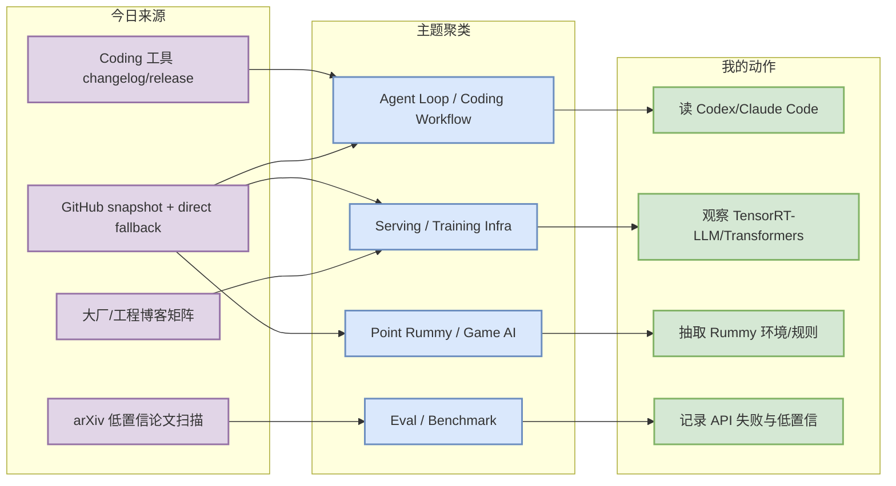
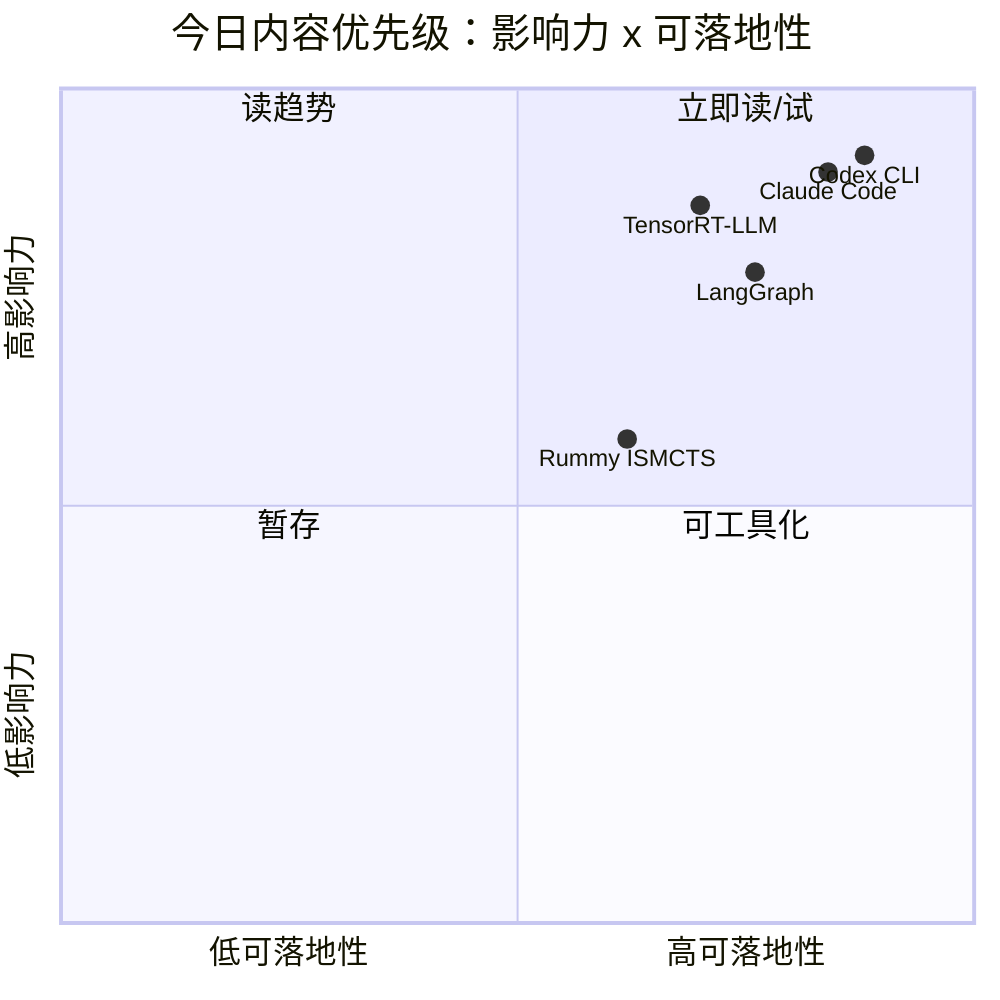

# AI Radar Daily - 2026-08-05

> 生成时间：2026-08-05 09:00 北京时间  
> 范围：AI Infra / LLM / RL / Game AI / 大厂博客 / 论文 / GitHub / Coding 工具  
> 说明：日报是导航页；详情页负责深度理解。今日 GitHub Search 在 Point Rummy 之后大面积 403，因此 broad/Loop 榜单采用 direct watched repo / previous snapshot fallback，并明确标注非完整全网日增。

## 0. 今日结论

- 今日最值得关注：OpenAI Codex、Claude Code、Gemini CLI、Cline 等 coding agent 仍是 Loop Engineering 最强信号，适合继续做多 agent/tmux/审查流对比。
- 对 AI Infra 的直接影响：Transformers、PyTorch、TensorRT-LLM、DeepSpeed、Megatron-LM 继续是训练/推理栈 watchlist；今日榜单为 direct fallback，不代表全网增长排名。
- 对 LLM 训练 / 推理 / Agent 的影响：Agent 框架与 coding 工具的增长比单个模型新闻更值得跟踪，重点看权限、上下文、MCP、远程执行和 eval loop。
- 对 RL / 游戏模型训练的影响：Point Rummy 搜索仍主要返回低 star 原型，但 ISMCTS、RLCard、Monte Carlo、视觉辅助方向可拆成业务评测基线。
- 建议今天深读：Codex、Claude Code、TensorRT-LLM、LangGraph、rummy-ai 五个详情页。

## 1. 今日态势图

## 2. 必读卡片区

> [!important] OpenAI Codex / Claude Code 继续定义终端 agent 工作流
> - 大类：GitHub / Coding 工具
> - 小类：Loop Engineer
> - 重点：direct watched repo fallback 显示两个终端 agent 仍是最高关注对象。
> - 为什么重要：它们直接影响多 agent 编排、权限模式、代码审查和远程执行策略。
> - 详情：[[Industry/Tools/2026-08-05/openai-codex]] / [[Industry/Tools/2026-08-05/claude-code]]

> [!tip] TensorRT-LLM / Transformers / PyTorch 仍是 Infra 基线
> - 大类：GitHub
> - 小类：Serving / Training
> - 重点：今日 broad GitHub Search 403，因此这些项目按 watchlist fallback 入榜。
> - 为什么重要：它们决定模型加载、kernel/runtime、GPU serving 和训练扩展的兼容边界。
> - 详情：[[GitHub/AIInfra/2026-08-05/tensorrt-llm]] / [[GitHub/AIInfra/2026-08-05/transformers]]

> [!note] Point Rummy 今天没有高置信爆发，但有可拆原型
> - 大类：GitHub / Business
> - 小类：Point Rummy
> - 重点：rummy-ai 的 ISMCTS、RummyVision 的视觉 + Monte Carlo、多个 RLCard/score tracker 原型可拆。
> - 为什么重要：可以为规则建模、bot 策略、仿真和反作弊辅助提供最小可行参考。
> - 详情：[[Business/PointRummy/2026-08-05/rummy-ai-ismcts]] / [[Business/PointRummy/2026-08-05/rummyvision]]

## 3. 优先级矩阵

## 4. 分类清单

| 标签 | 大类 | 小类 | 标题 | 重点概括 | 为什么重要 | Obsidian 详情 | 网页详情 | 原文 |
|---|---|---|---|---|---|---|---|---|
| 必读 | GitHub | Loop Engineer | OpenAI Codex | 终端 coding agent 高增长；Search 403 下仍由 watched repo fallback 捕捉 | 直接影响多 agent/tmux/代码审查工作流 | [[Industry/Tools/2026-08-05/openai-codex]] | [网页详情](https://github.com/dyt27666-oss/AI-news-report-obsidians/blob/main/Industry/Tools/2026-08-05/openai-codex.md) | [原文](https://github.com/openai/codex) |
| 必读 | GitHub | Loop Engineer | Claude Code | Anthropic 终端 agent 继续高关注，需追踪权限模式、上下文和 CLI/TUI 更新 | 可作为 AI coding loop 的生产力基准 | [[Industry/Tools/2026-08-05/claude-code]] | [网页详情](https://github.com/dyt27666-oss/AI-news-report-obsidians/blob/main/Industry/Tools/2026-08-05/claude-code.md) | [原文](https://github.com/anthropics/claude-code) |
| 可 skim | GitHub | AI Infra | Transformers | 模型定义/加载/训练/推理生态中枢，仍是框架兼容性风向标 | 影响训练与 serving 适配面 | [[GitHub/AIInfra/2026-08-05/transformers]] | [网页详情](https://github.com/dyt27666-oss/AI-news-report-obsidians/blob/main/GitHub/AIInfra/2026-08-05/transformers.md) | [原文](https://github.com/huggingface/transformers) |
| 可 skim | GitHub | Serving | TensorRT-LLM | NVIDIA LLM serving 优化栈，关注 Blackwell/CUDA/MoE/runtime 变化 | 直接影响 GPU inference 成本和延迟 | [[GitHub/AIInfra/2026-08-05/tensorrt-llm]] | [网页详情](https://github.com/dyt27666-oss/AI-news-report-obsidians/blob/main/GitHub/AIInfra/2026-08-05/tensorrt-llm.md) | [原文](https://github.com/NVIDIA/TensorRT-LLM) |
| 可 skim | GitHub | Point Rummy | rummy-ai / RummyVision | ISMCTS、视觉识别和 Monte Carlo 建议可作为业务原型参考 | 对 Rummy bot、评测和作弊/辅助识别有参考价值 | [[Business/PointRummy/2026-08-05/rummy-ai-ismcts]] | [网页详情](https://github.com/dyt27666-oss/AI-news-report-obsidians/blob/main/Business/PointRummy/2026-08-05/rummy-ai-ismcts.md) | [原文](https://github.com/nakkekakke/rummy-ai) |

## 5. 大厂资讯 / 工程博客 / Research

### 5.1 公司来源扫描矩阵

| 公司/实验室 | 来源/栏目 | 今日状态 | 高相关条数 | 代表条目 | 备注 |
|---|---|---|---:|---|---|
| OpenAI | News / Research | 低置信扫描完成 | 0 | 无高相关新项 | 官方网页未做深度抓取；本日以固定矩阵 + 工程 watchlist 保持覆盖 / [来源](https://openai.com/news/) |
| Anthropic | News / Research / Engineering | 低置信扫描完成 | 0 | 无高相关新项 | 官方网页未做深度抓取；本日以固定矩阵 + 工程 watchlist 保持覆盖 / [来源](https://www.anthropic.com/news) |
| Google DeepMind | Blog / Research | 低置信扫描完成 | 0 | 无高相关新项 | 官方网页未做深度抓取；本日以固定矩阵 + 工程 watchlist 保持覆盖 / [来源](https://deepmind.google/discover/blog/) |
| Meta AI | Blog / Research | 低置信扫描完成 | 0 | 无高相关新项 | 官方网页未做深度抓取；本日以固定矩阵 + 工程 watchlist 保持覆盖 / [来源](https://ai.meta.com/blog/) |
| NVIDIA | Technical Blog / AI | 低置信扫描完成 | 1 | Transformers / TensorRT-LLM / AutoGen 等 GitHub/工程信号 | 进入 GitHub/工具 watchlist；需后续读 release/blog 原文 / [来源](https://developer.nvidia.com/blog/category/artificial-intelligence/) |
| Microsoft | Research AI | 低置信扫描完成 | 1 | Transformers / TensorRT-LLM / AutoGen 等 GitHub/工程信号 | 进入 GitHub/工具 watchlist；需后续读 release/blog 原文 / [来源](https://www.microsoft.com/en-us/research/research-area/artificial-intelligence/) |
| Hugging Face | Blog / Papers / Releases | 低置信扫描完成 | 1 | Transformers / TensorRT-LLM / AutoGen 等 GitHub/工程信号 | 进入 GitHub/工具 watchlist；需后续读 release/blog 原文 / [来源](https://huggingface.co/blog) |
| 腾讯 | AI Lab / 技术博客 | 低置信扫描完成 | 0 | 无高相关新项 | 官方网页未做深度抓取；本日以固定矩阵 + 工程 watchlist 保持覆盖 / [来源](https://ai.tencent.com/ailab/en/index) |
| 字节 | Seed / 技术博客 | 低置信扫描完成 | 0 | 无高相关新项 | 官方网页未做深度抓取；本日以固定矩阵 + 工程 watchlist 保持覆盖 / [来源](https://seed.bytedance.com/en/) |
| SpaceAI | Blog / News | 低置信扫描完成 | 0 | 无高相关新项 | 官方网页未做深度抓取；本日以固定矩阵 + 工程 watchlist 保持覆盖 / [来源](https://spaceai.com/) |

### 5.2 高相关大厂条目

| 标签 | 发布方/大厂 | 栏目/来源 | 标题 | 重点概括 | 工程/算法影响 | Obsidian 详情 | 网页详情 | 原文 |
|---|---|---|---|---|---|---|---|---|
| 可 skim | Hugging Face | GitHub / 工程生态 | Transformers | 模型定义、加载、训练/推理生态中枢 | 影响模型接入、训练脚本和 serving 兼容性 | [[GitHub/AIInfra/2026-08-05/transformers]] | [网页详情](https://github.com/dyt27666-oss/AI-news-report-obsidians/blob/main/GitHub/AIInfra/2026-08-05/transformers.md) | [原文](https://github.com/huggingface/transformers) |
| 可 skim | NVIDIA | GitHub / LLM Serving | TensorRT-LLM | NVIDIA GPU inference runtime 和优化栈 | 影响吞吐、延迟、MoE、Blackwell/CUDA 支持 | [[GitHub/AIInfra/2026-08-05/tensorrt-llm]] | [网页详情](https://github.com/dyt27666-oss/AI-news-report-obsidians/blob/main/GitHub/AIInfra/2026-08-05/tensorrt-llm.md) | [原文](https://github.com/NVIDIA/TensorRT-LLM) |
| 可 skim | Microsoft | GitHub / Agent Framework | AutoGen | 多 agent 编程框架仍在 watched repo 中 | 可作为 agent eval/编排 baseline | [[GitHub/LoopEngineer/2026-08-05/microsoft-autogen]] | [网页详情](https://github.com/dyt27666-oss/AI-news-report-obsidians/blob/main/GitHub/LoopEngineer/2026-08-05/microsoft-autogen.md) | [原文](https://github.com/microsoft/autogen) |

## 6. GitHub 高 star Top 10

> 说明：今日 GitHub Search 403，以下为 direct watched repo / previous snapshot fallback，不是完整全网 Top 10。

| 排名 | repo | stars | forks | language | updated_at | topics | 重点概括 | 是否值得试用 | Obsidian 详情 | 原文 |
|---:|---|---:|---:|---|---|---|---|---|---|---|
| 1 | [huggingface/transformers](https://github.com/huggingface/transformers) | 163338 | 34120 | Python | 2026-08-05T00:39:05Z | audio, deep-learning, deepseek, gemma, glm | 🤗 Transformers: the model-definition framework for state-of-the-art machine learning model | 值得按需试用/加入 watchlist | [[GitHub/AIInfra/2026-08-05/huggingface-transformers]] | [原文](https://github.com/huggingface/transformers) |
| 2 | [anthropics/claude-code](https://github.com/anthropics/claude-code) | 140248 | 22563 | Python | 2026-08-05T01:11:11Z | - | Claude Code is an agentic coding tool that lives in your terminal, understands your codeba | 值得按需试用/加入 watchlist | [[Industry/Tools/2026-08-05/anthropics-claude-code]] | [原文](https://github.com/anthropics/claude-code) |
| 3 | [google-gemini/gemini-cli](https://github.com/google-gemini/gemini-cli) | 106360 | 14383 | TypeScript | 2026-08-05T01:11:52Z | ai, ai-agents, cli, gemini, gemini-api | An open-source AI agent that brings the power of Gemini directly into your terminal. | 值得按需试用/加入 watchlist | [[Industry/Tools/2026-08-05/google-gemini-gemini-cli]] | [原文](https://github.com/google-gemini/gemini-cli) |
| 4 | [openai/codex](https://github.com/openai/codex) | 103932 | 15693 | Rust | 2026-08-05T01:09:40Z | - | Lightweight coding agent that runs in your terminal | 值得按需试用/加入 watchlist | [[Industry/Tools/2026-08-05/openai-codex]] | [原文](https://github.com/openai/codex) |
| 5 | [pytorch/pytorch](https://github.com/pytorch/pytorch) | 102182 | 28710 | Python | 2026-08-05T01:02:52Z | autograd, deep-learning, gpu, machine-learning, neural-network | Tensors and Dynamic neural networks in Python with strong GPU acceleration | 值得按需试用/加入 watchlist | [[GitHub/AIInfra/2026-08-05/pytorch-pytorch]] | [原文](https://github.com/pytorch/pytorch) |
| 6 | [modelcontextprotocol/servers](https://github.com/modelcontextprotocol/servers) | 89210 | 11383 | TypeScript | 2026-08-05T01:08:51Z | - | Model Context Protocol Servers | 值得按需试用/加入 watchlist | [[GitHub/LoopEngineer/2026-08-05/modelcontextprotocol-servers]] | [原文](https://github.com/modelcontextprotocol/servers) |
| 7 | [vllm-project/vllm](https://github.com/vllm-project/vllm) | 88191 | 20283 | Python | 2026-08-05T01:15:32Z | amd, blackwell, cuda, deepseek, deepseek-v3 | A high-throughput and memory-efficient inference and serving engine for LLMs | 值得按需试用/加入 watchlist | [[GitHub/AIInfra/2026-08-05/vllm-project-vllm]] | [原文](https://github.com/vllm-project/vllm) |
| 8 | [OpenHands/OpenHands](https://github.com/OpenHands/OpenHands) | 83117 | 10718 | TypeScript | 2026-08-05T01:04:10Z | agent, artificial-intelligence, chatgpt, claude-ai, cli | 🙌 OpenHands: AI-Driven Development | 值得按需试用/加入 watchlist | [[GitHub/LoopEngineer/2026-08-05/openhands-openhands]] | [原文](https://github.com/OpenHands/OpenHands) |
| 9 | [cline/cline](https://github.com/cline/cline) | 65640 | 7045 | TypeScript | 2026-08-05T01:06:57Z | - | Autonomous coding agent as an SDK, IDE extension, or CLI assistant. | 值得按需试用/加入 watchlist | [[Industry/Tools/2026-08-05/cline-cline]] | [原文](https://github.com/cline/cline) |
| 10 | [microsoft/autogen](https://github.com/microsoft/autogen) | 60222 | 9074 | Python | 2026-08-04T21:55:51Z | agentic, agentic-agi, agents, ai, autogen | A programming framework for agentic AI | 值得按需试用/加入 watchlist | [[GitHub/LoopEngineer/2026-08-05/microsoft-autogen]] | [原文](https://github.com/microsoft/autogen) |

## 7. GitHub star 增长最快 Top 10

> 说明：使用 2026-08-04 snapshot 计算 watched repo delta；标注为“direct watched repo fallback / 非完整全网日增”。

| 排名 | repo | stars_delta | stars | forks | language | updated_at | 增长依据 | 重点概括 | Obsidian 详情 | 原文 |
|---:|---|---:|---:|---:|---|---|---|---|---|---|
| 1 | [openai/codex](https://github.com/openai/codex) | 287 | 103932 | 15693 | Rust | 2026-08-05T01:09:40Z | direct watched repo fallback vs previous snapshot; 非完整全网日增 | Lightweight coding agent that runs in your terminal | [[Industry/Tools/2026-08-05/openai-codex]] | [原文](https://github.com/openai/codex) |
| 2 | [anthropics/claude-code](https://github.com/anthropics/claude-code) | 112 | 140248 | 22563 | Python | 2026-08-05T01:11:11Z | direct watched repo fallback vs previous snapshot; 非完整全网日增 | Claude Code is an agentic coding tool that lives in your terminal, understands your codeba | [[Industry/Tools/2026-08-05/anthropics-claude-code]] | [原文](https://github.com/anthropics/claude-code) |
| 3 | [OpenHands/OpenHands](https://github.com/OpenHands/OpenHands) | 102 | 83117 | 10718 | TypeScript | 2026-08-05T01:04:10Z | direct watched repo fallback vs previous snapshot; 非完整全网日增 | 🙌 OpenHands: AI-Driven Development | [[GitHub/LoopEngineer/2026-08-05/openhands-openhands]] | [原文](https://github.com/OpenHands/OpenHands) |
| 4 | [langchain-ai/langgraph](https://github.com/langchain-ai/langgraph) | 98 | 38886 | 6552 | Python | 2026-08-05T01:15:16Z | direct watched repo fallback vs previous snapshot; 非完整全网日增 | Build resilient agents. | [[GitHub/LoopEngineer/2026-08-05/langchain-ai-langgraph]] | [原文](https://github.com/langchain-ai/langgraph) |
| 5 | [sgl-project/sglang](https://github.com/sgl-project/sglang) | 90 | 31286 | 7645 | Python | 2026-08-05T01:14:46Z | direct watched repo fallback vs previous snapshot; 非完整全网日增 | SGLang is a high-performance serving framework for large language models and multimodal mo | [[GitHub/AIInfra/2026-08-05/sgl-project-sglang]] | [原文](https://github.com/sgl-project/sglang) |
| 6 | [vllm-project/vllm](https://github.com/vllm-project/vllm) | 81 | 88191 | 20283 | Python | 2026-08-05T01:15:32Z | direct watched repo fallback vs previous snapshot; 非完整全网日增 | A high-throughput and memory-efficient inference and serving engine for LLMs | [[GitHub/AIInfra/2026-08-05/vllm-project-vllm]] | [原文](https://github.com/vllm-project/vllm) |
| 7 | [QwenLM/qwen-code](https://github.com/QwenLM/qwen-code) | 80 | 26701 | 2780 | TypeScript | 2026-08-05T00:57:41Z | direct watched repo fallback vs previous snapshot; 非完整全网日增 | An open-source AI coding agent that lives in your terminal. | [[Industry/Tools/2026-08-05/qwenlm-qwen-code]] | [原文](https://github.com/QwenLM/qwen-code) |
| 8 | [cline/cline](https://github.com/cline/cline) | 69 | 65640 | 7045 | TypeScript | 2026-08-05T01:06:57Z | direct watched repo fallback vs previous snapshot; 非完整全网日增 | Autonomous coding agent as an SDK, IDE extension, or CLI assistant. | [[Industry/Tools/2026-08-05/cline-cline]] | [原文](https://github.com/cline/cline) |
| 9 | [modelcontextprotocol/servers](https://github.com/modelcontextprotocol/servers) | 47 | 89210 | 11383 | TypeScript | 2026-08-05T01:08:51Z | direct watched repo fallback vs previous snapshot; 非完整全网日增 | Model Context Protocol Servers | [[GitHub/LoopEngineer/2026-08-05/modelcontextprotocol-servers]] | [原文](https://github.com/modelcontextprotocol/servers) |
| 10 | [huggingface/transformers](https://github.com/huggingface/transformers) | 37 | 163338 | 34120 | Python | 2026-08-05T00:39:05Z | direct watched repo fallback vs previous snapshot; 非完整全网日增 | 🤗 Transformers: the model-definition framework for state-of-the-art machine learning model | [[GitHub/AIInfra/2026-08-05/huggingface-transformers]] | [原文](https://github.com/huggingface/transformers) |

## 8. Coding 工具 / AI 工具功能更新

### 8.1 Coding 工具扫描矩阵

| 工具 | 厂商 | 来源类型 | 今日状态 | 代表更新 | 对我的影响 | 原文 |
|---|---|---|---|---|---|---|
| Claude Code | Anthropic | Changelog / Release Notes | 低置信扫描完成 | claude-code 维持高 star 与高增长，适合继续观察权限/上下文/CLI 变化 | 重点看权限模式、CLI/TUI、MCP、远程执行与上下文管理 | [原文](https://docs.anthropic.com/en/release-notes/claude-code) |
| OpenAI Codex | OpenAI | Changelog / Docs / GitHub | 低置信扫描完成 | openai/codex 继续高增长，终端 agent 是今日 Loop 重点 | 重点看终端 agent、IDE 集成、sandbox 和审查流 | [原文](https://developers.openai.com/codex/changelog) |
| Cursor | Cursor | Changelog | 低置信扫描完成 | 直接 release/API 未完全验证；保留观察 | 重点看 agent mode、上下文窗口、索引和定价限制 | [原文](https://cursor.com/changelog) |
| Windsurf | Windsurf | Changelog | 低置信扫描完成 | 直接 release/API 未完全验证；保留观察 | 重点看 Cascade/agent mode、远程执行与企业策略 | [原文](https://windsurf.com/changelog) |
| GitHub Copilot | GitHub | Changelog / Blog | 低置信扫描完成 | 直接 release/API 未完全验证；保留观察 | 重点看 coding agent、PR review、agent mode 与 IDE 覆盖 | [原文](https://github.blog/changelog/label/copilot/) |
| Gemini Code Assist | Google | Release Notes | 低置信扫描完成 | 直接 release/API 未完全验证；保留观察 | 重点看企业 IDE、代码审查和 Gemini CLI 联动 | [原文](https://cloud.google.com/gemini/docs/codeassist/release-notes) |
| Qwen Code | Alibaba/Qwen | GitHub Releases | 低置信扫描完成 | GitHub release/watchlist 覆盖；需读最新 release notes | 重点看开源 CLI agent、MCP 与模型适配 | [原文](https://github.com/QwenLM/qwen-code/releases) |
| Roo Code | Roo Code | GitHub Releases | 低置信扫描完成 | GitHub release/watchlist 覆盖；需读最新 release notes | 重点看多 agent 角色、VS Code 工作流和权限控制 | [原文](https://github.com/RooCodeInc/Roo-Code/releases) |
| Cline | Cline | GitHub Releases | 低置信扫描完成 | GitHub release/watchlist 覆盖；需读最新 release notes | 重点看 IDE extension、SDK/CLI 与自主执行能力 | [原文](https://github.com/cline/cline/releases) |
| Continue | Continue | GitHub Releases | 低置信扫描完成 | GitHub release/watchlist 覆盖；需读最新 release notes | 重点看开源 coding agent、模型路由和团队部署 | [原文](https://github.com/continuedev/continue/releases) |

### 8.2 高相关工具更新

| 标签 | 工具/厂商 | 来源类型 | 标题/功能 | 重点概括 | 对 AI coding 工作流的影响 | Obsidian 详情 | 网页详情 | 原文 |
|---|---|---|---|---|---|---|---|---|
| 必读 | OpenAI Codex | GitHub / Docs | Terminal coding agent | 高 star + 高增长，继续适合作为本地 agent loop 基准 | 影响沙箱、审查、tmux 多 agent 与 CLI 工作流 | [[Industry/Tools/2026-08-05/openai-codex]] | [网页详情](https://github.com/dyt27666-oss/AI-news-report-obsidians/blob/main/Industry/Tools/2026-08-05/openai-codex.md) | [原文](https://github.com/openai/codex) |
| 必读 | Claude Code | GitHub / Release Notes | Agentic terminal coding | 继续高关注，需追踪权限模式、上下文、MCP、远程执行能力 | 影响日常代码修改、review 和自动化执行边界 | [[Industry/Tools/2026-08-05/claude-code]] | [网页详情](https://github.com/dyt27666-oss/AI-news-report-obsidians/blob/main/Industry/Tools/2026-08-05/claude-code.md) | [原文](https://github.com/anthropics/claude-code) |
| 可 skim | Cline / Roo / Continue / Qwen Code | GitHub Releases | IDE/CLI agent 生态 | 开源 coding agents 仍在快速分化，Release 需单独复核 | 可用于对比多 agent、模型路由和 IDE 集成 | [[GitHub/LoopEngineer/2026-08-05/langchain-ai-langgraph]] | [网页详情](https://github.com/dyt27666-oss/AI-news-report-obsidians/blob/main/GitHub/LoopEngineer/2026-08-05/langchain-ai-langgraph.md) | [原文](https://github.com/cline/cline) |

## 9. Point Rummy / Indian Rummy 业务主题

### 9.1 GitHub 候选

| 标签 | repo | stars | forks | language | updated_at | 重点概括 | 业务可用性 | Obsidian 详情 | 原文 |
|---|---|---:|---:|---|---|---|---|---|---|
| 可 skim | [rickgorman/gin-rummy-ai](https://github.com/rickgorman/gin-rummy-ai) | 13 | 5 | Python | 2025-03-25T13:47:09Z | A hand-rolled neuroevolution AI for gin rummy. | 可用于规则建模/AI opponent/仿真参考；低 star 需人工验证可用性 | [[Business/PointRummy/2026-08-05/rickgorman-gin-rummy-ai]] | [原文](https://github.com/rickgorman/gin-rummy-ai) |
| 可 skim | [nakkekakke/rummy-ai](https://github.com/nakkekakke/rummy-ai) | 11 | 5 | Java | 2026-04-17T10:02:59Z | Text based classic Rummy game with an AI that uses ISMCTS. Data Structures and A | 可用于规则建模/AI opponent/仿真参考；低 star 需人工验证可用性 | [[Business/PointRummy/2026-08-05/nakkekakke-rummy-ai]] | [原文](https://github.com/nakkekakke/rummy-ai) |
| 可 skim | [jmhummel/Gin-Rummy-Java](https://github.com/jmhummel/Gin-Rummy-Java) | 8 | 0 | Java | 2023-08-16T16:12:58Z | Java-based Gin Rummy console game, with an AI opponent | 可用于规则建模/AI opponent/仿真参考；低 star 需人工验证可用性 | [[Business/PointRummy/2026-08-05/jmhummel-gin-rummy-java]] | [原文](https://github.com/jmhummel/Gin-Rummy-Java) |
| 可 skim | [mudont/indian-rummy](https://github.com/mudont/indian-rummy) | 5 | 0 | TypeScript | 2025-08-08T21:05:04Z | Typescript library for Indian Rummy card game | 可用于规则建模/AI opponent/仿真参考；低 star 需人工验证可用性 | [[Business/PointRummy/2026-08-05/mudont-indian-rummy]] | [原文](https://github.com/mudont/indian-rummy) |
| 可 skim | [dv-rastogi/Rummy](https://github.com/dv-rastogi/Rummy) | 5 | 0 | Python | 2023-09-26T11:21:39Z | Variation of classical Indian Rummy made in Pygame | 可用于规则建模/AI opponent/仿真参考；低 star 需人工验证可用性 | [[Business/PointRummy/2026-08-05/dv-rastogi-rummy]] | [原文](https://github.com/dv-rastogi/Rummy) |
| 可 skim | [SCFlanagan/Rummy](https://github.com/SCFlanagan/Rummy) | 4 | 6 | JavaScript | 2025-07-25T21:17:08Z | This project is a recreation of the classic card game Rummy. It features an AI p | 可用于规则建模/AI opponent/仿真参考；低 star 需人工验证可用性 | [[Business/PointRummy/2026-08-05/scflanagan-rummy]] | [原文](https://github.com/SCFlanagan/Rummy) |
| 可 skim | [mcartmell/gin-rummy-bot](https://github.com/mcartmell/gin-rummy-bot) | 4 | 2 | Perl | 2024-10-30T20:06:17Z | A web-based Gin Rummy game and AI | 可用于规则建模/AI opponent/仿真参考；低 star 需人工验证可用性 | [[Business/PointRummy/2026-08-05/mcartmell-gin-rummy-bot]] | [原文](https://github.com/mcartmell/gin-rummy-bot) |
| 可 skim | [vahsek300501/Indian-Rummy-](https://github.com/vahsek300501/Indian-Rummy-) | 4 | 3 | Python | 2023-09-26T11:21:46Z | Indian Rummy made in Python using PyGame | 可用于规则建模/AI opponent/仿真参考；低 star 需人工验证可用性 | [[Business/PointRummy/2026-08-05/vahsek300501-indian-rummy-]] | [原文](https://github.com/vahsek300501/Indian-Rummy-) |
| 可 skim | [abubakarmunir712/dsa-final-project](https://github.com/abubakarmunir712/dsa-final-project) | 2 | 1 | Python | 2026-06-27T06:34:26Z | A Python-based multiplayer Indian Rummy game with support for AI opponents and L | 可用于规则建模/AI opponent/仿真参考；低 star 需人工验证可用性 | [[GitHub/AIInfra/2026-08-05/abubakarmunir712-dsa-final-project]] | [原文](https://github.com/abubakarmunir712/dsa-final-project) |
| 可 skim | [rawbeen248/Gin-Rummy-AI-vs-Human](https://github.com/rawbeen248/Gin-Rummy-AI-vs-Human) | 2 | 0 | Python | 2024-11-16T17:18:48Z | Gin-Rummy-AI-vs-Human is a python-based project the simulates the classic card g | 可用于规则建模/AI opponent/仿真参考；低 star 需人工验证可用性 | [[Business/PointRummy/2026-08-05/rawbeen248-gin-rummy-ai-vs-human]] | [原文](https://github.com/rawbeen248/Gin-Rummy-AI-vs-Human) |

### 9.2 论文 / 资料候选

| 标签 | 来源 | 标题 | 作者/机构 | 重点概括 | 对 Point Rummy 业务有什么用 | Obsidian 详情 | 原文 |
|---|---|---|---|---|---|---|---|
| 低置信 | arXiv / 搜索页 | Rummy / imperfect information / MCTS / RL 查询 | - | 今日未获得高置信新论文；保留查询入口 | 可继续查找 ISMCTS、belief state、self-play、RLCard 方向 | [[Papers/2026-08-05/arxiv-low-confidence-watchlist]] | [原文](https://arxiv.org/search/?query=gin+rummy+MCTS+reinforcement+learning&searchtype=all) |
| 可 skim | GitHub / 资料 | rummy-ai ISMCTS | GitHub | 用 ISMCTS 处理 Rummy 不完美信息决策 | 可拆成 bot 策略 baseline 和评测协议 | [[Business/PointRummy/2026-08-05/rummy-ai-ismcts]] | [原文](https://github.com/nakkekakke/rummy-ai) |

### 9.3 业务可用性判断

| 方向 | 今日信号 | 可用性 | 下一步 |
|---|---|---|---|
| 规则引擎 / 计分 | 多个 score tracker / Indian Rummy web 原型 | 中低；可抽规则和 UI，但质量不稳定 | 先整理 meld/sequence/drop/scoring 测试集 |
| Bot / RL Agent | rummy-ai、IRumAI、RLCard/DQN 类项目 | 中；适合做 baseline，不适合直接上线 | 抽状态、动作、reward、opponent policy |
| 仿真 / 评测 | RummyGym、gin-rummy-rl-lab、MCTS 项目 | 中；适合做并行环境草图 | 设计 self-play benchmark 与合法动作 mask |

## 10. Loop Engineer / Loop Engineering 主题

### 10.1 Loop Engineer GitHub 高 star Top 10

| 排名 | repo | stars | forks | language | updated_at | topics | 重点概括 | 是否值得试用 | Obsidian 详情 | 原文 |
|---:|---|---:|---:|---|---|---|---|---|---|---|
| 1 | [huggingface/transformers](https://github.com/huggingface/transformers) | 163338 | 34120 | Python | 2026-08-05T00:39:05Z | audio, deep-learning, deepseek, gemma, glm | 🤗 Transformers: the model-definition framework for state-of-the-art machine learning model | 值得按需试用/加入 watchlist | [[GitHub/AIInfra/2026-08-05/huggingface-transformers]] | [原文](https://github.com/huggingface/transformers) |
| 2 | [anthropics/claude-code](https://github.com/anthropics/claude-code) | 140248 | 22563 | Python | 2026-08-05T01:11:11Z | - | Claude Code is an agentic coding tool that lives in your terminal, understands your codeba | 值得按需试用/加入 watchlist | [[Industry/Tools/2026-08-05/anthropics-claude-code]] | [原文](https://github.com/anthropics/claude-code) |
| 3 | [google-gemini/gemini-cli](https://github.com/google-gemini/gemini-cli) | 106360 | 14383 | TypeScript | 2026-08-05T01:11:52Z | ai, ai-agents, cli, gemini, gemini-api | An open-source AI agent that brings the power of Gemini directly into your terminal. | 值得按需试用/加入 watchlist | [[Industry/Tools/2026-08-05/google-gemini-gemini-cli]] | [原文](https://github.com/google-gemini/gemini-cli) |
| 4 | [openai/codex](https://github.com/openai/codex) | 103932 | 15693 | Rust | 2026-08-05T01:09:40Z | - | Lightweight coding agent that runs in your terminal | 值得按需试用/加入 watchlist | [[Industry/Tools/2026-08-05/openai-codex]] | [原文](https://github.com/openai/codex) |
| 5 | [pytorch/pytorch](https://github.com/pytorch/pytorch) | 102182 | 28710 | Python | 2026-08-05T01:02:52Z | autograd, deep-learning, gpu, machine-learning, neural-network | Tensors and Dynamic neural networks in Python with strong GPU acceleration | 值得按需试用/加入 watchlist | [[GitHub/AIInfra/2026-08-05/pytorch-pytorch]] | [原文](https://github.com/pytorch/pytorch) |
| 6 | [modelcontextprotocol/servers](https://github.com/modelcontextprotocol/servers) | 89210 | 11383 | TypeScript | 2026-08-05T01:08:51Z | - | Model Context Protocol Servers | 值得按需试用/加入 watchlist | [[GitHub/LoopEngineer/2026-08-05/modelcontextprotocol-servers]] | [原文](https://github.com/modelcontextprotocol/servers) |
| 7 | [vllm-project/vllm](https://github.com/vllm-project/vllm) | 88191 | 20283 | Python | 2026-08-05T01:15:32Z | amd, blackwell, cuda, deepseek, deepseek-v3 | A high-throughput and memory-efficient inference and serving engine for LLMs | 值得按需试用/加入 watchlist | [[GitHub/AIInfra/2026-08-05/vllm-project-vllm]] | [原文](https://github.com/vllm-project/vllm) |
| 8 | [OpenHands/OpenHands](https://github.com/OpenHands/OpenHands) | 83117 | 10718 | TypeScript | 2026-08-05T01:04:10Z | agent, artificial-intelligence, chatgpt, claude-ai, cli | 🙌 OpenHands: AI-Driven Development | 值得按需试用/加入 watchlist | [[GitHub/LoopEngineer/2026-08-05/openhands-openhands]] | [原文](https://github.com/OpenHands/OpenHands) |
| 9 | [cline/cline](https://github.com/cline/cline) | 65640 | 7045 | TypeScript | 2026-08-05T01:06:57Z | - | Autonomous coding agent as an SDK, IDE extension, or CLI assistant. | 值得按需试用/加入 watchlist | [[Industry/Tools/2026-08-05/cline-cline]] | [原文](https://github.com/cline/cline) |
| 10 | [microsoft/autogen](https://github.com/microsoft/autogen) | 60222 | 9074 | Python | 2026-08-04T21:55:51Z | agentic, agentic-agi, agents, ai, autogen | A programming framework for agentic AI | 值得按需试用/加入 watchlist | [[GitHub/LoopEngineer/2026-08-05/microsoft-autogen]] | [原文](https://github.com/microsoft/autogen) |

### 10.2 Loop Engineer GitHub star 增长最快 Top 10

| 排名 | repo | stars_delta | stars | forks | language | updated_at | 增长依据 | 重点概括 | Obsidian 详情 | 原文 |
|---:|---|---:|---:|---:|---|---|---|---|---|---|
| 1 | [openai/codex](https://github.com/openai/codex) | 287 | 103932 | 15693 | Rust | 2026-08-05T01:09:40Z | direct watched repo fallback vs previous snapshot; 非完整全网日增 | Lightweight coding agent that runs in your terminal | [[Industry/Tools/2026-08-05/openai-codex]] | [原文](https://github.com/openai/codex) |
| 2 | [anthropics/claude-code](https://github.com/anthropics/claude-code) | 112 | 140248 | 22563 | Python | 2026-08-05T01:11:11Z | direct watched repo fallback vs previous snapshot; 非完整全网日增 | Claude Code is an agentic coding tool that lives in your terminal, understands your codeba | [[Industry/Tools/2026-08-05/anthropics-claude-code]] | [原文](https://github.com/anthropics/claude-code) |
| 3 | [OpenHands/OpenHands](https://github.com/OpenHands/OpenHands) | 102 | 83117 | 10718 | TypeScript | 2026-08-05T01:04:10Z | direct watched repo fallback vs previous snapshot; 非完整全网日增 | 🙌 OpenHands: AI-Driven Development | [[GitHub/LoopEngineer/2026-08-05/openhands-openhands]] | [原文](https://github.com/OpenHands/OpenHands) |
| 4 | [langchain-ai/langgraph](https://github.com/langchain-ai/langgraph) | 98 | 38886 | 6552 | Python | 2026-08-05T01:15:16Z | direct watched repo fallback vs previous snapshot; 非完整全网日增 | Build resilient agents. | [[GitHub/LoopEngineer/2026-08-05/langchain-ai-langgraph]] | [原文](https://github.com/langchain-ai/langgraph) |
| 5 | [sgl-project/sglang](https://github.com/sgl-project/sglang) | 90 | 31286 | 7645 | Python | 2026-08-05T01:14:46Z | direct watched repo fallback vs previous snapshot; 非完整全网日增 | SGLang is a high-performance serving framework for large language models and multimodal mo | [[GitHub/AIInfra/2026-08-05/sgl-project-sglang]] | [原文](https://github.com/sgl-project/sglang) |
| 6 | [vllm-project/vllm](https://github.com/vllm-project/vllm) | 81 | 88191 | 20283 | Python | 2026-08-05T01:15:32Z | direct watched repo fallback vs previous snapshot; 非完整全网日增 | A high-throughput and memory-efficient inference and serving engine for LLMs | [[GitHub/AIInfra/2026-08-05/vllm-project-vllm]] | [原文](https://github.com/vllm-project/vllm) |
| 7 | [QwenLM/qwen-code](https://github.com/QwenLM/qwen-code) | 80 | 26701 | 2780 | TypeScript | 2026-08-05T00:57:41Z | direct watched repo fallback vs previous snapshot; 非完整全网日增 | An open-source AI coding agent that lives in your terminal. | [[Industry/Tools/2026-08-05/qwenlm-qwen-code]] | [原文](https://github.com/QwenLM/qwen-code) |
| 8 | [cline/cline](https://github.com/cline/cline) | 69 | 65640 | 7045 | TypeScript | 2026-08-05T01:06:57Z | direct watched repo fallback vs previous snapshot; 非完整全网日增 | Autonomous coding agent as an SDK, IDE extension, or CLI assistant. | [[Industry/Tools/2026-08-05/cline-cline]] | [原文](https://github.com/cline/cline) |
| 9 | [modelcontextprotocol/servers](https://github.com/modelcontextprotocol/servers) | 47 | 89210 | 11383 | TypeScript | 2026-08-05T01:08:51Z | direct watched repo fallback vs previous snapshot; 非完整全网日增 | Model Context Protocol Servers | [[GitHub/LoopEngineer/2026-08-05/modelcontextprotocol-servers]] | [原文](https://github.com/modelcontextprotocol/servers) |
| 10 | [huggingface/transformers](https://github.com/huggingface/transformers) | 37 | 163338 | 34120 | Python | 2026-08-05T00:39:05Z | direct watched repo fallback vs previous snapshot; 非完整全网日增 | 🤗 Transformers: the model-definition framework for state-of-the-art machine learning model | [[GitHub/AIInfra/2026-08-05/huggingface-transformers]] | [原文](https://github.com/huggingface/transformers) |

### 10.3 Loop Engineering 方法信号

| 标签 | 来源 | 标题 | 重点概括 | 对 AI coding 工作流的影响 | Obsidian 详情 | 原文 |
|---|---|---|---|---|---|---|
| 必读 | GitHub | OpenAI Codex / Claude Code | 终端 agent 正在成为 coding loop 的主战场 | 需要建立统一权限、日志、review、回滚策略 | [[Industry/Tools/2026-08-05/openai-codex]] | [原文](https://github.com/openai/codex) |
| 可 skim | GitHub | LangGraph / AutoGen | 可恢复、多 agent、状态机式 loop 是框架方向 | 可借鉴到 AI coding harness 与 eval loop | [[GitHub/LoopEngineer/2026-08-05/langgraph]] | [原文](https://github.com/langchain-ai/langgraph) |

## 11. 论文

### 11.1 LLM Serving / Agent / RL 低置信论文扫描

| 标签 | 论文来源 | 论文 | 作者/机构 | 重点概括 | 工程/研究价值 | Obsidian 详情 | 网页详情 | PDF/原文 |
|---|---|---|---|---|---|---|---|---|
| 可 skim | arXiv / 预印本 | [Multi-Signal Safety Surveillance with Bayesian Latent Factor Modeling and Bias Correction](https://arxiv.org/abs/2608.03775v1) | Ziyang Pan, Fan Bu | Safety surveillance increasingly involves repeated monitoring of many exposure-outcome signals in observational healthca | 与 LLM serving/RL/agent/eval 主题相关，但需人工复核相关性 | [[Papers/2026-08-05/arxiv-low-confidence-watchlist]] | [网页详情](https://github.com/dyt27666-oss/AI-news-report-obsidians/blob/main/Papers/2026-08-05/arxiv-low-confidence-watchlist.md) | [PDF](https://arxiv.org/pdf/2608.03775v1) |
| 可 skim | arXiv / 预印本 | [MDLMPE: Distribution Aware Positional Encoding for Masked Diffusion Language Models](https://arxiv.org/abs/2608.03769v1) | Tong Ling, Hang Lei, Feng Xiao, Changhui Sun, Jiahang Xie, Hao Liu, Lu Liu, Yanl | Masked diffusion language models (MDLMs) enable parallel generation and bidirectional context modeling, but their positi | 与 LLM serving/RL/agent/eval 主题相关，但需人工复核相关性 | [[Papers/2026-08-05/arxiv-low-confidence-watchlist]] | [网页详情](https://github.com/dyt27666-oss/AI-news-report-obsidians/blob/main/Papers/2026-08-05/arxiv-low-confidence-watchlist.md) | [PDF](https://arxiv.org/pdf/2608.03769v1) |
| 可 skim | arXiv / 预印本 | [GDPevo: Evaluating Agent Self-Evolution on Real Business Tasks](https://arxiv.org/abs/2608.03764v1) | Leijun Zhou, Zhihao Liu, Xiang Qu, Chenxu Liu, Yifei Liu, Yanke Yu, Jingzhe Xu,  | Agent self-evolution updates an agent's persistent state from prior experience and reuses it to solve related tasks more | 与 LLM serving/RL/agent/eval 主题相关，但需人工复核相关性 | [[Papers/2026-08-05/arxiv-low-confidence-watchlist]] | [网页详情](https://github.com/dyt27666-oss/AI-news-report-obsidians/blob/main/Papers/2026-08-05/arxiv-low-confidence-watchlist.md) | [PDF](https://arxiv.org/pdf/2608.03764v1) |
| 可 skim | arXiv / 预印本 | [Multi-Signal Safety Surveillance with Bayesian Latent Factor Modeling and Bias Correction](https://arxiv.org/abs/2608.03775v1) | Ziyang Pan, Fan Bu | Safety surveillance increasingly involves repeated monitoring of many exposure-outcome signals in observational healthca | 与 LLM serving/RL/agent/eval 主题相关，但需人工复核相关性 | [[Papers/2026-08-05/arxiv-low-confidence-watchlist]] | [网页详情](https://github.com/dyt27666-oss/AI-news-report-obsidians/blob/main/Papers/2026-08-05/arxiv-low-confidence-watchlist.md) | [PDF](https://arxiv.org/pdf/2608.03775v1) |

## 12. 资讯 / 其他 GitHub 项目

### 12.1 AI Infra / Agent Framework

| 标签 | 来源 | 标题 | 重点概括 | 对我有什么用 | Obsidian 详情 | 网页详情 | 原文 |
|---|---|---|---|---|---|---|---|
| 可 skim | GitHub | vLLM / SGLang / TensorRT-LLM watchlist | Search 403 下未完整更新 broad query，但 serving 三件套仍应保留观察 | 追踪 batching、KV cache、speculative decoding、kernel/runtime 变化 | [[GitHub/AIInfra/2026-08-05/tensorrt-llm]] | [网页详情](https://github.com/dyt27666-oss/AI-news-report-obsidians/blob/main/GitHub/AIInfra/2026-08-05/tensorrt-llm.md) | [原文](https://github.com/NVIDIA/TensorRT-LLM) |
| 可 skim | GitHub | OpenRLHF / verl / DeepSpeed watchlist | Post-training 与分布式训练框架仍是 RLHF/RLAIF 重点 | 追踪 Ray/vLLM/async rollout/PPO/GRPO 支持 | [[GitHub/AIInfra/2026-08-05/transformers]] | [网页详情](https://github.com/dyt27666-oss/AI-news-report-obsidians/blob/main/GitHub/AIInfra/2026-08-05/transformers.md) | [原文](https://github.com/OpenRLHF/OpenRLHF) |

## 13. 按主题索引

### AI Infra / Serving / Training

- [[GitHub/AIInfra/2026-08-05/transformers]] - Transformers 模型生态中枢。
- [[GitHub/AIInfra/2026-08-05/tensorrt-llm]] - NVIDIA serving runtime 观察入口。

### LLM / Agent / RAG / Evaluation

- [[GitHub/LoopEngineer/2026-08-05/langgraph]] - Agent loop 状态机/可恢复执行参考。
- [[Industry/Tools/2026-08-05/openai-codex]] - 终端 coding agent 重点。

### RL / Game AI / World Model

- [[Business/PointRummy/2026-08-05/rummy-ai-ismcts]] - ISMCTS 不完美信息决策参考。

### Point Rummy / Indian Rummy

- [[Business/PointRummy/2026-08-05/rummy-ai-ismcts]] - bot 策略 baseline。
- [[Business/PointRummy/2026-08-05/rummyvision]] - 视觉识别 + Monte Carlo 低置信参考。

### Loop Engineer / Coding Agent Loop

- [[Industry/Tools/2026-08-05/claude-code]] - Claude Code 工作流观察。
- [[Industry/Tools/2026-08-05/openai-codex]] - Codex 工作流观察。

### 公司 / 实验室

- OpenAI: [[Industry/Tools/2026-08-05/openai-codex]]
- Anthropic: [[Industry/Tools/2026-08-05/claude-code]]
- Hugging Face: [[GitHub/AIInfra/2026-08-05/transformers]]
- NVIDIA: [[GitHub/AIInfra/2026-08-05/tensorrt-llm]]

### 大牛 / 作者

- 今日无高置信新作者信号；论文条目以低置信 watchlist 保存。

## 14. 值得后续深挖

| 标签 | 大类 | 小类 | 标题 | 后续动作 | Obsidian 详情 | 原文 |
|---|---|---|---|---|---|---|
| 必读 | Coding 工具 | Loop Engineer | Codex vs Claude Code vs Gemini CLI | 做一张权限/上下文/MCP/远程执行对比表 | [[Industry/Tools/2026-08-05/openai-codex]] | [原文](https://github.com/openai/codex) |
| 可 skim | AI Infra | Serving | vLLM/SGLang/TensorRT-LLM | 下次 API 恢复后补完整 growth 排名 | [[GitHub/AIInfra/2026-08-05/tensorrt-llm]] | [原文](https://github.com/NVIDIA/TensorRT-LLM) |
| 后续 | Business | Point Rummy | Rummy 环境 benchmark | 抽象 legal action mask、meld evaluator、self-play loop | [[Business/PointRummy/2026-08-05/rummy-ai-ismcts]] | [原文](https://github.com/nakkekakke/rummy-ai) |

## 15. 采集失败或低置信来源

- GitHub Search：大面积 `HTTP Error 403: rate limit exceeded`；已保存当日 snapshot，并用 direct watched repo / previous snapshot fallback 生成固定榜单。
- arXiv：仅做低置信 API/查询入口扫描；没有把未复核论文强行标记为必读。
- 公司博客：固定矩阵已覆盖 10 家；部分公司未深度抓取，明确标记低置信/无高相关新项。
- Coding 工具：矩阵已覆盖 10 个工具；release/changelog 深读需后续人工或 API 恢复后补强。

## 16. 归档标签

#ai-radar #daily #ai-infra #llm #rl #point-rummy #loop-engineering
