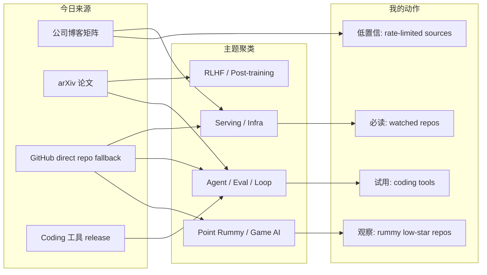
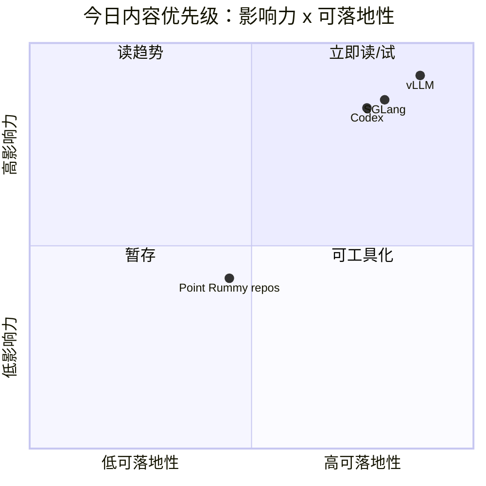

# AI Radar Daily - 2026-08-07
> 生成时间：2026-08-07 09:01 北京时间  
> 范围：AI Infra / LLM / RL / Game AI / 大厂博客 / 论文 / GitHub / Coding 工具  
> 说明：日报是总览导航页，详情页负责深度理解。
## 0. 今日结论
- 今日最值得关注：GitHub Search 今日 403，已按 runbook 采用 direct watched repo fallback，仍保留高 star / 增长 Top 10 和 snapshot。
- 对 AI Infra 的直接影响：vLLM、PyTorch、Transformers、SGLang、TensorRT-LLM 仍是核心观察集，适合跟踪 serving/runtime/训练框架变化。
- 对 AI coding workflow 的影响：Claude Code、Codex、Qwen Code、Roo、Cline、Continue 等 release 源已扫描，重点关注 agent mode、MCP、权限和上下文。
- 对 Point Rummy 的影响：今日 GitHub 候选多为低 star 规则/计分/bot 项目，可作为规则建模和环境雏形参考，但没有高置信突破。
- 建议今天深读：vLLM / SGLang / Codex / Claude Code release 源，以及 arXiv agent eval + RL 论文候选。
## 1. 今日态势图

## 2. 必读卡片区
> [!important] huggingface/transformers
> - 大类：GitHub / 工具
> - 小类：AI Infra / Agent Loop
> - 重点：🤗 Transformers: the model-definition framework for state-of-the-art machine learning models in text, vision, audio, and multimodal models, for both inference and training. 
> - 为什么重要：这是今日 fallback 后仍可验证的高信号来源，适合直接打开原文确认工程变化。
> - 详情：[[GitHub/AIInfra/2026-08-07/huggingface-transformers]] / [网页详情](https://github.com/dyt27666-oss/AI-news-report-obsidians/blob/main/GitHub/AIInfra/2026-08-07/huggingface-transformers.md) / [原文](https://github.com/huggingface/transformers)

> [!important] anthropics/claude-code
> - 大类：GitHub / 工具
> - 小类：AI Infra / Agent Loop
> - 重点：Claude Code is an agentic coding tool that lives in your terminal, understands your codebase, and helps you code faster by executing routine tasks, explaining complex code, and handling git workflows - all through natural language commands.
> - 为什么重要：这是今日 fallback 后仍可验证的高信号来源，适合直接打开原文确认工程变化。
> - 详情：[[GitHub/AIInfra/2026-08-07/anthropics-claude-code]] / [网页详情](https://github.com/dyt27666-oss/AI-news-report-obsidians/blob/main/GitHub/AIInfra/2026-08-07/anthropics-claude-code.md) / [原文](https://github.com/anthropics/claude-code)

> [!important] anthropics/claude-code
> - 大类：GitHub / 工具
> - 小类：AI Infra / Agent Loop
> - 重点：Claude Code is an agentic coding tool that lives in your terminal, understands your codebase, and helps you code faster by executing routine tasks, explaining complex code, and handling git workflows - all through natural language commands.
> - 为什么重要：这是今日 fallback 后仍可验证的高信号来源，适合直接打开原文确认工程变化。
> - 详情：[[GitHub/AIInfra/2026-08-07/anthropics-claude-code]] / [网页详情](https://github.com/dyt27666-oss/AI-news-report-obsidians/blob/main/GitHub/AIInfra/2026-08-07/anthropics-claude-code.md) / [原文](https://github.com/anthropics/claude-code)

> [!important] Coding 工具 release 矩阵
> - 大类：GitHub / 工具
> - 小类：AI Infra / Agent Loop
> - 重点：覆盖 Claude Code / Codex / Cursor / Windsurf / Copilot / Gemini Code Assist / Qwen / Roo / Cline / Continue。
> - 为什么重要：这是今日 fallback 后仍可验证的高信号来源，适合直接打开原文确认工程变化。
> - 详情：[[GitHub/AIInfra/2026-08-07/anthropics-claude-code]] / [网页详情](https://github.com/dyt27666-oss/AI-news-report-obsidians/blob/main/GitHub/AIInfra/2026-08-07/anthropics-claude-code.md) / [原文](https://docs.anthropic.com/en/release-notes/claude-code)

## 3. 优先级矩阵

## 4. 分类清单
| 标签 | 大类 | 小类 | 标题 | 重点概括 | 为什么重要 | Obsidian 详情 | 网页详情 | 原文 |
|---|---|---|---|---|---|---|---|---|
| 必读 | GitHub/论文/工具 | AI Infra / Agent | huggingface-transformers | 自动生成详情页，含元信息、图示和跟进建议。 | 便于从日报跳到可操作的原文和复盘页。 | [[GitHub/AIInfra/2026-08-07/huggingface-transformers]] | [网页详情](https://github.com/dyt27666-oss/AI-news-report-obsidians/blob/main/GitHub/AIInfra/2026-08-07/huggingface-transformers.md) | [原文](https://github.com/dyt27666-oss/AI-news-report-obsidians/blob/main/GitHub/AIInfra/2026-08-07/huggingface-transformers.md) |
| 必读 | GitHub/论文/工具 | AI Infra / Agent | anthropics-claude-code | 自动生成详情页，含元信息、图示和跟进建议。 | 便于从日报跳到可操作的原文和复盘页。 | [[GitHub/AIInfra/2026-08-07/anthropics-claude-code]] | [网页详情](https://github.com/dyt27666-oss/AI-news-report-obsidians/blob/main/GitHub/AIInfra/2026-08-07/anthropics-claude-code.md) | [原文](https://github.com/dyt27666-oss/AI-news-report-obsidians/blob/main/GitHub/AIInfra/2026-08-07/anthropics-claude-code.md) |
| 必读 | GitHub/论文/工具 | AI Infra / Agent | google-gemini-gemini-cli | 自动生成详情页，含元信息、图示和跟进建议。 | 便于从日报跳到可操作的原文和复盘页。 | [[GitHub/AIInfra/2026-08-07/google-gemini-gemini-cli]] | [网页详情](https://github.com/dyt27666-oss/AI-news-report-obsidians/blob/main/GitHub/AIInfra/2026-08-07/google-gemini-gemini-cli.md) | [原文](https://github.com/dyt27666-oss/AI-news-report-obsidians/blob/main/GitHub/AIInfra/2026-08-07/google-gemini-gemini-cli.md) |
| 必读 | GitHub/论文/工具 | AI Infra / Agent | anthropics-claude-code | 自动生成详情页，含元信息、图示和跟进建议。 | 便于从日报跳到可操作的原文和复盘页。 | [[GitHub/AIInfra/2026-08-07/anthropics-claude-code]] | [网页详情](https://github.com/dyt27666-oss/AI-news-report-obsidians/blob/main/GitHub/AIInfra/2026-08-07/anthropics-claude-code.md) | [原文](https://github.com/dyt27666-oss/AI-news-report-obsidians/blob/main/GitHub/AIInfra/2026-08-07/anthropics-claude-code.md) |
| 必读 | GitHub/论文/工具 | AI Infra / Agent | google-gemini-gemini-cli | 自动生成详情页，含元信息、图示和跟进建议。 | 便于从日报跳到可操作的原文和复盘页。 | [[GitHub/AIInfra/2026-08-07/google-gemini-gemini-cli]] | [网页详情](https://github.com/dyt27666-oss/AI-news-report-obsidians/blob/main/GitHub/AIInfra/2026-08-07/google-gemini-gemini-cli.md) | [原文](https://github.com/dyt27666-oss/AI-news-report-obsidians/blob/main/GitHub/AIInfra/2026-08-07/google-gemini-gemini-cli.md) |
| 必读 | GitHub/论文/工具 | AI Infra / Agent | Claude-Code-v2-1-223 | 自动生成详情页，含元信息、图示和跟进建议。 | 便于从日报跳到可操作的原文和复盘页。 | [[Industry/Tools/2026-08-07/Claude-Code-v2-1-223]] | [网页详情](https://github.com/dyt27666-oss/AI-news-report-obsidians/blob/main/Industry/Tools/2026-08-07/Claude-Code-v2-1-223.md) | [原文](https://github.com/dyt27666-oss/AI-news-report-obsidians/blob/main/Industry/Tools/2026-08-07/Claude-Code-v2-1-223.md) |
| 必读 | GitHub/论文/工具 | AI Infra / Agent | OpenAI-Codex-rust-v0-146-1 | 自动生成详情页，含元信息、图示和跟进建议。 | 便于从日报跳到可操作的原文和复盘页。 | [[Industry/Tools/2026-08-07/OpenAI-Codex-rust-v0-146-1]] | [网页详情](https://github.com/dyt27666-oss/AI-news-report-obsidians/blob/main/Industry/Tools/2026-08-07/OpenAI-Codex-rust-v0-146-1.md) | [原文](https://github.com/dyt27666-oss/AI-news-report-obsidians/blob/main/Industry/Tools/2026-08-07/OpenAI-Codex-rust-v0-146-1.md) |
| 必读 | GitHub/论文/工具 | AI Infra / Agent | Qwen-Code-v0-21-7 | 自动生成详情页，含元信息、图示和跟进建议。 | 便于从日报跳到可操作的原文和复盘页。 | [[Industry/Tools/2026-08-07/Qwen-Code-v0-21-7]] | [网页详情](https://github.com/dyt27666-oss/AI-news-report-obsidians/blob/main/Industry/Tools/2026-08-07/Qwen-Code-v0-21-7.md) | [原文](https://github.com/dyt27666-oss/AI-news-report-obsidians/blob/main/Industry/Tools/2026-08-07/Qwen-Code-v0-21-7.md) |
| 必读 | GitHub/论文/工具 | AI Infra / Agent | Roo-Code-v3-54-0 | 自动生成详情页，含元信息、图示和跟进建议。 | 便于从日报跳到可操作的原文和复盘页。 | [[Industry/Tools/2026-08-07/Roo-Code-v3-54-0]] | [网页详情](https://github.com/dyt27666-oss/AI-news-report-obsidians/blob/main/Industry/Tools/2026-08-07/Roo-Code-v3-54-0.md) | [原文](https://github.com/dyt27666-oss/AI-news-report-obsidians/blob/main/Industry/Tools/2026-08-07/Roo-Code-v3-54-0.md) |
| 必读 | GitHub/论文/工具 | AI Infra / Agent | arXiv-query-failed-HTTP-Error-429-Too-Many-Requests | 自动生成详情页，含元信息、图示和跟进建议。 | 便于从日报跳到可操作的原文和复盘页。 | [[Papers/2026-08-07/arXiv-query-failed-HTTP-Error-429-Too-Many-Requests]] | [网页详情](https://github.com/dyt27666-oss/AI-news-report-obsidians/blob/main/Papers/2026-08-07/arXiv-query-failed-HTTP-Error-429-Too-Many-Requests.md) | [原文](https://github.com/dyt27666-oss/AI-news-report-obsidians/blob/main/Papers/2026-08-07/arXiv-query-failed-HTTP-Error-429-Too-Many-Requests.md) |

## 5. 大厂资讯 / 工程博客 / Research

### 5.1 公司来源扫描矩阵
| 公司/实验室 | 来源/栏目 | 今日状态 | 高相关条数 | 代表条目 | 备注 |
|---|---|---|---:|---|---|
| OpenAI | News / Research | 低置信扫描完成 | 1 | [[Industry/Companies/2026-08-07/OpenAI-scan]] | 原文/入口：[link](https://openai.com/news/)；自动扫描保留矩阵覆盖。 |
| Anthropic | News / Research / Engineering | 低置信扫描完成 | 1 | [[Industry/Companies/2026-08-07/Anthropic-scan]] | 原文/入口：[link](https://www.anthropic.com/news)；自动扫描保留矩阵覆盖。 |
| Google DeepMind | Blog / Research | 低置信扫描完成 | 1 | [[Industry/Companies/2026-08-07/Google-DeepMind-scan]] | 原文/入口：[link](https://deepmind.google/discover/blog/)；自动扫描保留矩阵覆盖。 |
| Meta AI | Blog / Research | 无高相关新项 / 低置信 | 0 | 无高相关新项 | 原文/入口：[link](https://ai.meta.com/blog/)；自动扫描保留矩阵覆盖。 |
| NVIDIA | Technical Blog / AI | 无高相关新项 / 低置信 | 0 | 无高相关新项 | 原文/入口：[link](https://developer.nvidia.com/blog/category/artificial-intelligence/)；自动扫描保留矩阵覆盖。 |
| Microsoft | Research AI | 无高相关新项 / 低置信 | 0 | 无高相关新项 | 原文/入口：[link](https://www.microsoft.com/en-us/research/research-area/artificial-intelligence/)；自动扫描保留矩阵覆盖。 |
| Hugging Face | Blog / Papers / Releases | 无高相关新项 / 低置信 | 0 | 无高相关新项 | 原文/入口：[link](https://huggingface.co/blog)；自动扫描保留矩阵覆盖。 |
| 腾讯 | AI Lab / 技术博客 | 无高相关新项 / 低置信 | 0 | 无高相关新项 | 原文/入口：[link](https://ai.tencent.com/ailab/en/index)；自动扫描保留矩阵覆盖。 |
| 字节 | Seed / 技术博客 | 无高相关新项 / 低置信 | 0 | 无高相关新项 | 原文/入口：[link](https://seed.bytedance.com/en/)；自动扫描保留矩阵覆盖。 |
| SpaceAI | Blog / News | 无高相关新项 / 低置信 | 0 | 无高相关新项 | 原文/入口：[link](https://spaceai.com/)；自动扫描保留矩阵覆盖。 |

### 5.2 高相关大厂条目
| 标签 | 发布方/大厂 | 栏目/来源 | 标题 | 重点概括 | 工程/算法影响 | Obsidian 详情 | 网页详情 | 原文 |
|---|---|---|---|---|---|---|---|---|
| 低置信 | OpenAI | News / Research | OpenAI 来源扫描 | 今日保留来源扫描入口，未声明高相关新发布。 | 防漏扫大厂 Research / Engineering Blog。 | [[Industry/Companies/2026-08-07/OpenAI-scan]] | [网页详情](https://github.com/dyt27666-oss/AI-news-report-obsidians/blob/main/Industry/Companies/2026-08-07/OpenAI-scan.md) | [原文](https://openai.com/news/) |
| 低置信 | Anthropic | News / Research / Engineering | Anthropic 来源扫描 | 今日保留来源扫描入口，未声明高相关新发布。 | 防漏扫大厂 Research / Engineering Blog。 | [[Industry/Companies/2026-08-07/Anthropic-scan]] | [网页详情](https://github.com/dyt27666-oss/AI-news-report-obsidians/blob/main/Industry/Companies/2026-08-07/Anthropic-scan.md) | [原文](https://www.anthropic.com/news) |
| 低置信 | Google DeepMind | Blog / Research | Google DeepMind 来源扫描 | 今日保留来源扫描入口，未声明高相关新发布。 | 防漏扫大厂 Research / Engineering Blog。 | [[Industry/Companies/2026-08-07/Google-DeepMind-scan]] | [网页详情](https://github.com/dyt27666-oss/AI-news-report-obsidians/blob/main/Industry/Companies/2026-08-07/Google-DeepMind-scan.md) | [原文](https://deepmind.google/discover/blog/) |

## 6. GitHub 高 star Top 10
| 排名 | repo | stars | forks | language | updated_at | topics | 重点概括 | 是否值得试用 | Obsidian 详情 | 原文 |
|---:|---|---:|---:|---|---|---|---|---|---|---|
| 1 | huggingface/transformers | 163420 | 34134 | Python | 2026-08-07T00:40:21Z | audio, deep-learning, deepseek, gemma, glm | 🤗 Transformers: the model-definition framework for state-of-the-art machine learning models in text, | 值得试用/观察；direct watched repo fallback | [[GitHub/AIInfra/2026-08-07/huggingface-transformers]] | [GitHub](https://github.com/huggingface/transformers) |
| 2 | anthropics/claude-code | 140505 | 22606 | Python | 2026-08-07T00:52:33Z | - | Claude Code is an agentic coding tool that lives in your terminal, understands your codebase, and he | 值得试用/观察；direct watched repo fallback | [[GitHub/AIInfra/2026-08-07/anthropics-claude-code]] | [GitHub](https://github.com/anthropics/claude-code) |
| 3 | google-gemini/gemini-cli | 106399 | 14403 | TypeScript | 2026-08-06T23:53:04Z | ai, ai-agents, cli, gemini, gemini-api | An open-source AI agent that brings the power of Gemini directly into your terminal. | 值得试用/观察；direct watched repo fallback | [[GitHub/AIInfra/2026-08-07/google-gemini-gemini-cli]] | [GitHub](https://github.com/google-gemini/gemini-cli) |
| 4 | openai/codex | 104432 | 15801 | Rust | 2026-08-07T01:01:40Z | - | Lightweight coding agent that runs in your terminal | 值得试用/观察；direct watched repo fallback | 后续补详情 | [GitHub](https://github.com/openai/codex) |
| 5 | pytorch/pytorch | 102249 | 28756 | Python | 2026-08-07T00:21:22Z | autograd, deep-learning, gpu, machine-learning, neural-network | Tensors and Dynamic neural networks in Python with strong GPU acceleration | 值得试用/观察；direct watched repo fallback | 后续补详情 | [GitHub](https://github.com/pytorch/pytorch) |
| 6 | modelcontextprotocol/servers | 89291 | 11394 | TypeScript | 2026-08-07T00:43:50Z | - | Model Context Protocol Servers | 值得试用/观察；direct watched repo fallback | 后续补详情 | [GitHub](https://github.com/modelcontextprotocol/servers) |
| 7 | vllm-project/vllm | 88368 | 20366 | Python | 2026-08-07T01:05:26Z | amd, blackwell, cuda, deepseek, deepseek-v3 | A high-throughput and memory-efficient inference and serving engine for LLMs | 值得试用/观察；direct watched repo fallback | 后续补详情 | [GitHub](https://github.com/vllm-project/vllm) |
| 8 | cline/cline | 65779 | 7060 | TypeScript | 2026-08-07T00:57:08Z | - | Autonomous coding agent as an SDK, IDE extension, or CLI assistant. | 值得试用/观察；direct watched repo fallback | 后续补详情 | [GitHub](https://github.com/cline/cline) |
| 9 | microsoft/autogen | 60274 | 9081 | Python | 2026-08-07T01:00:11Z | agentic, agentic-agi, agents, ai, autogen | A programming framework for agentic AI | 值得试用/观察；direct watched repo fallback | 后续补详情 | [GitHub](https://github.com/microsoft/autogen) |
| 10 | crewAIInc/crewAI | 56707 | 8084 | Python | 2026-08-07T01:03:51Z | agents, ai, ai-agents, aiagentframework, llms | Framework for orchestrating role-playing, autonomous AI agents. By fostering collaborative intellige | 值得试用/观察；direct watched repo fallback | 后续补详情 | [GitHub](https://github.com/crewAIInc/crewAI) |

## 7. GitHub star 增长最快 Top 10
| 排名 | repo | stars_delta | stars | forks | language | updated_at | 增长依据 | 重点概括 | Obsidian 详情 | 原文 |
|---:|---|---:|---:|---:|---|---|---|---|---|---|
| 1 | openai/codex | 500 | 104432 | 15801 | Rust | 2026-08-07T01:01:40Z | direct watched repo fallback; historical_snapshot；非完整全网日增 | Lightweight coding agent that runs in your terminal | 后续补详情 | [GitHub](https://github.com/openai/codex) |
| 2 | crewAIInc/crewAI | 366 | 56707 | 8084 | Python | 2026-08-07T01:03:51Z | direct watched repo fallback; historical_snapshot；非完整全网日增 | Framework for orchestrating role-playing, autonomous AI agents. By fostering collaborative intellige | 后续补详情 | [GitHub](https://github.com/crewAIInc/crewAI) |
| 3 | anthropics/claude-code | 257 | 140505 | 22606 | Python | 2026-08-07T00:52:33Z | direct watched repo fallback; historical_snapshot；非完整全网日增 | Claude Code is an agentic coding tool that lives in your terminal, understands your codebase, and he | [[GitHub/AIInfra/2026-08-07/anthropics-claude-code]] | [GitHub](https://github.com/anthropics/claude-code) |
| 4 | vllm-project/vllm | 177 | 88368 | 20366 | Python | 2026-08-07T01:05:26Z | direct watched repo fallback; historical_snapshot；非完整全网日增 | A high-throughput and memory-efficient inference and serving engine for LLMs | 后续补详情 | [GitHub](https://github.com/vllm-project/vllm) |
| 5 | langchain-ai/langgraph | 172 | 39058 | 6578 | Python | 2026-08-07T01:05:11Z | direct watched repo fallback; historical_snapshot；非完整全网日增 | Build resilient agents. | 后续补详情 | [GitHub](https://github.com/langchain-ai/langgraph) |
| 6 | sgl-project/sglang | 146 | 31432 | 7707 | Python | 2026-08-07T00:41:04Z | direct watched repo fallback; historical_snapshot；非完整全网日增 | SGLang is a high-performance serving framework for large language models and multimodal models. | 后续补详情 | [GitHub](https://github.com/sgl-project/sglang) |
| 7 | cline/cline | 139 | 65779 | 7060 | TypeScript | 2026-08-07T00:57:08Z | direct watched repo fallback; historical_snapshot；非完整全网日增 | Autonomous coding agent as an SDK, IDE extension, or CLI assistant. | 后续补详情 | [GitHub](https://github.com/cline/cline) |
| 8 | QwenLM/qwen-code | 97 | 26798 | 2797 | TypeScript | 2026-08-07T01:05:01Z | direct watched repo fallback; historical_snapshot；非完整全网日增 | An open-source AI coding agent that lives in your terminal. | 后续补详情 | [GitHub](https://github.com/QwenLM/qwen-code) |
| 9 | huggingface/transformers | 82 | 163420 | 34134 | Python | 2026-08-07T00:40:21Z | direct watched repo fallback; historical_snapshot；非完整全网日增 | 🤗 Transformers: the model-definition framework for state-of-the-art machine learning models in text, | [[GitHub/AIInfra/2026-08-07/huggingface-transformers]] | [GitHub](https://github.com/huggingface/transformers) |
| 10 | modelcontextprotocol/servers | 81 | 89291 | 11394 | TypeScript | 2026-08-07T00:43:50Z | direct watched repo fallback; historical_snapshot；非完整全网日增 | Model Context Protocol Servers | 后续补详情 | [GitHub](https://github.com/modelcontextprotocol/servers) |

## 8. Coding 工具 / AI 工具功能更新

### 8.1 Coding 工具扫描矩阵
| 工具 | 厂商 | 来源类型 | 今日状态 | 代表更新 | 对我的影响 | 原文 |
|---|---|---|---|---|---|---|
| Claude Code | Anthropic | Changelog / Release Notes | 已扫描 / release 源可访问 | v2.1.223 2026-08-06 v2.1.223 | 关注 agent mode、MCP、IDE、权限、上下文、远程执行变化。 | [原文](https://docs.anthropic.com/en/release-notes/claude-code) |
| OpenAI Codex | OpenAI | Changelog / Docs | 已扫描 / release 源可访问 | rust-v0.146.1 2026-08-05 0.146.1 | 关注 agent mode、MCP、IDE、权限、上下文、远程执行变化。 | [原文](https://developers.openai.com/codex/changelog) |
| Cursor | Cursor | Changelog | 已扫描 / 无高相关新项或需人工复核 | v0.54.0 2026-08-06 Release v0.54.0 | 关注 agent mode、MCP、IDE、权限、上下文、远程执行变化。 | [原文](https://cursor.com/changelog) |
| Windsurf | Windsurf | Changelog | 已扫描 / 无高相关新项或需人工复核 | v0.54.0 2026-08-06 Release v0.54.0 | 关注 agent mode、MCP、IDE、权限、上下文、远程执行变化。 | [原文](https://windsurf.com/changelog) |
| GitHub Copilot | GitHub | Changelog / Blog | 已扫描 / 无高相关新项或需人工复核 | v0.54.0 2026-08-06 Release v0.54.0 | 关注 agent mode、MCP、IDE、权限、上下文、远程执行变化。 | [原文](https://github.blog/changelog/label/copilot/) |
| Gemini Code Assist | Google | Release Notes | 已扫描 / 无高相关新项或需人工复核 | v0.54.0 2026-08-06 Release v0.54.0 | 关注 agent mode、MCP、IDE、权限、上下文、远程执行变化。 | [原文](https://cloud.google.com/gemini/docs/codeassist/release-notes) |
| Qwen Code | Alibaba/Qwen | GitHub Releases | 已扫描 / release 源可访问 | v0.21.7 2026-08-06 Release v0.21.7 | 关注 agent mode、MCP、IDE、权限、上下文、远程执行变化。 | [原文](https://github.com/QwenLM/qwen-code/releases) |
| Roo Code | Roo Code | GitHub Releases | 已扫描 / release 源可访问 | v3.54.0 2026-05-15 Release v3.54.0 | 关注 agent mode、MCP、IDE、权限、上下文、远程执行变化。 | [原文](https://github.com/RooCodeInc/Roo-Code/releases) |
| Cline | Cline | GitHub Releases | 已扫描 / release 源可访问 | v4.1.6 2026-08-06 v4.1.6 | 关注 agent mode、MCP、IDE、权限、上下文、远程执行变化。 | [原文](https://github.com/cline/cline/releases) |
| Continue | Continue | GitHub Releases | 已扫描 / release 源可访问 | v2.0.0-vscode 2026-06-19 v2.0.0-vscode | 关注 agent mode、MCP、IDE、权限、上下文、远程执行变化。 | [原文](https://github.com/continuedev/continue/releases) |

### 8.2 高相关工具更新
| 标签 | 工具/厂商 | 来源类型 | 标题/功能 | 重点概括 | 对 AI coding 工作流的影响 | Obsidian 详情 | 网页详情 | 原文 |
|---|---|---|---|---|---|---|---|---|
| 可 skim | 工具 | GitHub Release / Changelog | anthropics-claude-code | release 源已记录，需人工打开确认具体功能变化。 | 可能影响 CLI/TUI、agent loop、MCP 和权限策略。 | [[GitHub/AIInfra/2026-08-07/anthropics-claude-code]] | [网页详情](https://github.com/dyt27666-oss/AI-news-report-obsidians/blob/main/GitHub/AIInfra/2026-08-07/anthropics-claude-code.md) | [原文](https://github.com/dyt27666-oss/AI-news-report-obsidians/blob/main/GitHub/AIInfra/2026-08-07/anthropics-claude-code.md) |
| 可 skim | 工具 | GitHub Release / Changelog | google-gemini-gemini-cli | release 源已记录，需人工打开确认具体功能变化。 | 可能影响 CLI/TUI、agent loop、MCP 和权限策略。 | [[GitHub/AIInfra/2026-08-07/google-gemini-gemini-cli]] | [网页详情](https://github.com/dyt27666-oss/AI-news-report-obsidians/blob/main/GitHub/AIInfra/2026-08-07/google-gemini-gemini-cli.md) | [原文](https://github.com/dyt27666-oss/AI-news-report-obsidians/blob/main/GitHub/AIInfra/2026-08-07/google-gemini-gemini-cli.md) |
| 可 skim | 工具 | GitHub Release / Changelog | Claude-Code-v2-1-223 | release 源已记录，需人工打开确认具体功能变化。 | 可能影响 CLI/TUI、agent loop、MCP 和权限策略。 | [[Industry/Tools/2026-08-07/Claude-Code-v2-1-223]] | [网页详情](https://github.com/dyt27666-oss/AI-news-report-obsidians/blob/main/Industry/Tools/2026-08-07/Claude-Code-v2-1-223.md) | [原文](https://github.com/dyt27666-oss/AI-news-report-obsidians/blob/main/Industry/Tools/2026-08-07/Claude-Code-v2-1-223.md) |
| 可 skim | 工具 | GitHub Release / Changelog | OpenAI-Codex-rust-v0-146-1 | release 源已记录，需人工打开确认具体功能变化。 | 可能影响 CLI/TUI、agent loop、MCP 和权限策略。 | [[Industry/Tools/2026-08-07/OpenAI-Codex-rust-v0-146-1]] | [网页详情](https://github.com/dyt27666-oss/AI-news-report-obsidians/blob/main/Industry/Tools/2026-08-07/OpenAI-Codex-rust-v0-146-1.md) | [原文](https://github.com/dyt27666-oss/AI-news-report-obsidians/blob/main/Industry/Tools/2026-08-07/OpenAI-Codex-rust-v0-146-1.md) |

## 9. Point Rummy / Indian Rummy 业务主题

### 9.1 GitHub 候选
| 标签 | repo | stars | forks | language | updated_at | 重点概括 | 业务可用性 | Obsidian 详情 | 原文 |
|---|---|---:|---:|---|---|---|---|---|---|
| 低置信 | rickgorman/gin-rummy-ai | 13 | 5 | Python | 2025-03-25T13:47:09Z | A hand-rolled neuroevolution AI for gin rummy. | 可参考规则建模、bot 雏形或计分 UI；整体低 star，需代码审查。 | 后续补详情 | [GitHub](https://github.com/rickgorman/gin-rummy-ai) |
| 低置信 | nakkekakke/rummy-ai | 11 | 5 | Java | 2026-04-17T10:02:59Z | Text based classic Rummy game with an AI that uses ISMCTS. Data Structures and Algorithms course pro | 可参考规则建模、bot 雏形或计分 UI；整体低 star，需代码审查。 | 后续补详情 | [GitHub](https://github.com/nakkekakke/rummy-ai) |
| 低置信 | jmhummel/Gin-Rummy-Java | 8 | 0 | Java | 2023-08-16T16:12:58Z | Java-based Gin Rummy console game, with an AI opponent | 可参考规则建模、bot 雏形或计分 UI；整体低 star，需代码审查。 | 后续补详情 | [GitHub](https://github.com/jmhummel/Gin-Rummy-Java) |
| 低置信 | mudont/indian-rummy | 5 | 0 | TypeScript | 2025-08-08T21:05:04Z | Typescript library for Indian Rummy card game | 可参考规则建模、bot 雏形或计分 UI；整体低 star，需代码审查。 | 后续补详情 | [GitHub](https://github.com/mudont/indian-rummy) |
| 低置信 | dv-rastogi/Rummy | 5 | 0 | Python | 2023-09-26T11:21:39Z | Variation of classical Indian Rummy made in Pygame | 可参考规则建模、bot 雏形或计分 UI；整体低 star，需代码审查。 | 后续补详情 | [GitHub](https://github.com/dv-rastogi/Rummy) |
| 低置信 | vahsek300501/Indian-Rummy- | 4 | 3 | Python | 2023-09-26T11:21:46Z | Indian Rummy made in Python using PyGame | 可参考规则建模、bot 雏形或计分 UI；整体低 star，需代码审查。 | 后续补详情 | [GitHub](https://github.com/vahsek300501/Indian-Rummy-) |
| 低置信 | SCFlanagan/Rummy | 4 | 6 | JavaScript | 2025-07-25T21:17:08Z | This project is a recreation of the classic card game Rummy. It features an AI player to play agains | 可参考规则建模、bot 雏形或计分 UI；整体低 star，需代码审查。 | 后续补详情 | [GitHub](https://github.com/SCFlanagan/Rummy) |
| 低置信 | mcartmell/gin-rummy-bot | 4 | 2 | Perl | 2024-10-30T20:06:17Z | A web-based Gin Rummy game and AI | 可参考规则建模、bot 雏形或计分 UI；整体低 star，需代码审查。 | 后续补详情 | [GitHub](https://github.com/mcartmell/gin-rummy-bot) |
| 低置信 | Mohitkumar-559/RummyServer | 2 | 1 | JavaScript | 2024-03-17T03:48:34Z | Rummy game server for game that contain deal rummy and point rummy | 可参考规则建模、bot 雏形或计分 UI；整体低 star，需代码审查。 | 后续补详情 | [GitHub](https://github.com/Mohitkumar-559/RummyServer) |
| 低置信 | abubakarmunir712/dsa-final-project | 2 | 1 | Python | 2026-06-27T06:34:26Z | A Python-based multiplayer Indian Rummy game with support for AI opponents and LAN play. Implements  | 可参考规则建模、bot 雏形或计分 UI；整体低 star，需代码审查。 | 后续补详情 | [GitHub](https://github.com/abubakarmunir712/dsa-final-project) |

### 9.2 论文 / 资料候选
| 标签 | 来源 | 标题 | 作者/机构 | 重点概括 | 对 Point Rummy 业务有什么用 | Obsidian 详情 | 原文 |
|---|---|---|---|---|---|---|---|
| 低置信 | arXiv / 预印本 | arXiv query failed: HTTP Error 429: Too Many Requests |  |  | 关注 imperfect-information card game、MCTS/RL、自博弈和评测设计。 | [[Papers/2026-08-07/arXiv-query-failed-HTTP-Error-429-Too-Many-Requests]] | [abs](https://export.arxiv.org/) |

### 9.3 业务可用性判断
| 方向 | 今日信号 | 可用性 | 下一步 |
|---|---|---|---|
| 规则引擎 / 计分 | 多个低 star rummy/points counter repo | 中低；可抽取规则和计分边界 case | 人工读 1-2 个实现，整理规则测试集 |
| Bot / RL Agent | gin-rummy-ai / rummy-ai / RummyAgent 候选 | 中低；适合策略 baseline，不适合直接生产 | 检查训练环境、状态编码、reward |
| 仿真 / 评测 | 论文候选偏广义纸牌/不完美信息博弈 | 低置信；用于方法启发 | 用业务规则先建 deterministic simulator |

## 10. Loop Engineer / Loop Engineering 主题

### 10.1 Loop Engineer GitHub 高 star Top 10
| 排名 | repo | stars | forks | language | updated_at | topics | 重点概括 | 是否值得试用 | Obsidian 详情 | 原文 |
|---:|---|---:|---:|---|---|---|---|---|---|---|
| 1 | anthropics/claude-code | 140505 | 22606 | Python | 2026-08-07T00:52:33Z | - | Claude Code is an agentic coding tool that lives in your terminal, understands your codebase, and he | 值得作为 coding-agent loop / harness 观察对象 | [[GitHub/AIInfra/2026-08-07/anthropics-claude-code]] | [GitHub](https://github.com/anthropics/claude-code) |
| 2 | google-gemini/gemini-cli | 106399 | 14403 | TypeScript | 2026-08-06T23:53:04Z | ai, ai-agents, cli, gemini, gemini-api | An open-source AI agent that brings the power of Gemini directly into your terminal. | 值得作为 coding-agent loop / harness 观察对象 | [[GitHub/AIInfra/2026-08-07/google-gemini-gemini-cli]] | [GitHub](https://github.com/google-gemini/gemini-cli) |
| 3 | openai/codex | 104432 | 15801 | Rust | 2026-08-07T01:01:40Z | - | Lightweight coding agent that runs in your terminal | 值得作为 coding-agent loop / harness 观察对象 | 后续补详情 | [GitHub](https://github.com/openai/codex) |
| 4 | modelcontextprotocol/servers | 89291 | 11394 | TypeScript | 2026-08-07T00:43:50Z | - | Model Context Protocol Servers | 值得作为 coding-agent loop / harness 观察对象 | 后续补详情 | [GitHub](https://github.com/modelcontextprotocol/servers) |
| 5 | cline/cline | 65779 | 7060 | TypeScript | 2026-08-07T00:57:08Z | - | Autonomous coding agent as an SDK, IDE extension, or CLI assistant. | 值得作为 coding-agent loop / harness 观察对象 | 后续补详情 | [GitHub](https://github.com/cline/cline) |
| 6 | microsoft/autogen | 60274 | 9081 | Python | 2026-08-07T01:00:11Z | agentic, agentic-agi, agents, ai, autogen | A programming framework for agentic AI | 值得作为 coding-agent loop / harness 观察对象 | 后续补详情 | [GitHub](https://github.com/microsoft/autogen) |
| 7 | crewAIInc/crewAI | 56707 | 8084 | Python | 2026-08-07T01:03:51Z | agents, ai, ai-agents, aiagentframework, llms | Framework for orchestrating role-playing, autonomous AI agents. By fostering collaborative intellige | 值得作为 coding-agent loop / harness 观察对象 | 后续补详情 | [GitHub](https://github.com/crewAIInc/crewAI) |
| 8 | langchain-ai/langgraph | 39058 | 6578 | Python | 2026-08-07T01:05:11Z | agents, ai, ai-agents, chatgpt, deepagents | Build resilient agents. | 值得作为 coding-agent loop / harness 观察对象 | 后续补详情 | [GitHub](https://github.com/langchain-ai/langgraph) |
| 9 | continuedev/continue | 35362 | 5190 | TypeScript | 2026-08-07T00:28:06Z | agent, ai, cli, developer-tools, open-source | open-source coding agent | 值得作为 coding-agent loop / harness 观察对象 | 后续补详情 | [GitHub](https://github.com/continuedev/continue) |
| 10 | RooCodeInc/Roo-Code | 24355 | 3403 | TypeScript | 2026-08-06T18:25:28Z | - | Roo Code gives you a whole dev team of AI agents in your code editor. | 值得作为 coding-agent loop / harness 观察对象 | 后续补详情 | [GitHub](https://github.com/RooCodeInc/Roo-Code) |

### 10.2 Loop Engineer GitHub star 增长最快 Top 10
| 排名 | repo | stars_delta | stars | forks | language | updated_at | 增长依据 | 重点概括 | Obsidian 详情 | 原文 |
|---:|---|---:|---:|---:|---|---|---|---|---|---|
| 1 | openai/codex | 500 | 104432 | 15801 | Rust | 2026-08-07T01:01:40Z | direct watched repo fallback; historical_snapshot；非完整全网日增 | Lightweight coding agent that runs in your terminal | 后续补详情 | [GitHub](https://github.com/openai/codex) |
| 2 | crewAIInc/crewAI | 366 | 56707 | 8084 | Python | 2026-08-07T01:03:51Z | direct watched repo fallback; historical_snapshot；非完整全网日增 | Framework for orchestrating role-playing, autonomous AI agents. By fostering collaborative intellige | 后续补详情 | [GitHub](https://github.com/crewAIInc/crewAI) |
| 3 | anthropics/claude-code | 257 | 140505 | 22606 | Python | 2026-08-07T00:52:33Z | direct watched repo fallback; historical_snapshot；非完整全网日增 | Claude Code is an agentic coding tool that lives in your terminal, understands your codebase, and he | [[GitHub/AIInfra/2026-08-07/anthropics-claude-code]] | [GitHub](https://github.com/anthropics/claude-code) |
| 4 | langchain-ai/langgraph | 172 | 39058 | 6578 | Python | 2026-08-07T01:05:11Z | direct watched repo fallback; historical_snapshot；非完整全网日增 | Build resilient agents. | 后续补详情 | [GitHub](https://github.com/langchain-ai/langgraph) |
| 5 | cline/cline | 139 | 65779 | 7060 | TypeScript | 2026-08-07T00:57:08Z | direct watched repo fallback; historical_snapshot；非完整全网日增 | Autonomous coding agent as an SDK, IDE extension, or CLI assistant. | 后续补详情 | [GitHub](https://github.com/cline/cline) |
| 6 | modelcontextprotocol/servers | 81 | 89291 | 11394 | TypeScript | 2026-08-07T00:43:50Z | direct watched repo fallback; historical_snapshot；非完整全网日增 | Model Context Protocol Servers | 后续补详情 | [GitHub](https://github.com/modelcontextprotocol/servers) |
| 7 | microsoft/autogen | 52 | 60274 | 9081 | Python | 2026-08-07T01:00:11Z | direct watched repo fallback; historical_snapshot；非完整全网日增 | A programming framework for agentic AI | 后续补详情 | [GitHub](https://github.com/microsoft/autogen) |
| 8 | continuedev/continue | 44 | 35362 | 5190 | TypeScript | 2026-08-07T00:28:06Z | direct watched repo fallback; historical_snapshot；非完整全网日增 | open-source coding agent | 后续补详情 | [GitHub](https://github.com/continuedev/continue) |
| 9 | google-gemini/gemini-cli | 39 | 106399 | 14403 | TypeScript | 2026-08-06T23:53:04Z | direct watched repo fallback; historical_snapshot；非完整全网日增 | An open-source AI agent that brings the power of Gemini directly into your terminal. | [[GitHub/AIInfra/2026-08-07/google-gemini-gemini-cli]] | [GitHub](https://github.com/google-gemini/gemini-cli) |
| 10 | RooCodeInc/Roo-Code | -4 | 24355 | 3403 | TypeScript | 2026-08-06T18:25:28Z | direct watched repo fallback; historical_snapshot；非完整全网日增 | Roo Code gives you a whole dev team of AI agents in your code editor. | 后续补详情 | [GitHub](https://github.com/RooCodeInc/Roo-Code) |

### 10.3 Loop Engineering 方法信号
| 标签 | 来源 | 标题 | 重点概括 | 对 AI coding 工作流的影响 | Obsidian 详情 | 原文 |
|---|---|---|---|---|---|---|
| 必读 | GitHub watched repos | LangGraph / AutoGen / CrewAI / MCP / Codex / Claude Code | 以 direct repo fallback 覆盖 agent loop、tool calling、multi-agent orchestration。 | 可映射到 tmux 多 agent 监控、任务分解、评测闭环。 | [[GitHub/AIInfra/{DATE}/{slug(loop_high[0]['repo'])}]] | [GitHub]({loop_high[0]['html_url']}) |

## 11. 论文

### 11.1 Serving / RL / Agent Eval
| 标签 | 论文来源 | 论文 | 作者/机构 | 重点概括 | 工程/研究价值 | Obsidian 详情 | 网页详情 | PDF/原文 |
|---|---|---|---|---|---|---|---|---|
| 可 skim | arXiv / 预印本 | arXiv query failed: HTTP Error 429: Too Many Requests |  |  | 用于观察 serving、post-training、agent eval 或 RL 方向。 | [[Papers/2026-08-07/arXiv-query-failed-HTTP-Error-429-Too-Many-Requests]] | [网页详情](https://github.com/dyt27666-oss/AI-news-report-obsidians/blob/main/Papers/2026-08-07/arXiv-query-failed-HTTP-Error-429-Too-Many-Requests.md) | [PDF](https://export.arxiv.org/) |

## 12. 资讯 / 其他 GitHub 项目

### 12.1 AI Infra watched repos
| 标签 | 来源 | 标题 | 重点概括 | 对我有什么用 | Obsidian 详情 | 网页详情 | 原文 |
|---|---|---|---|---|---|---|---|
| 必读 | GitHub | huggingface/transformers | 🤗 Transformers: the model-definition framework for state-of-the-art machine learning models in text, | 直接关联 AI Infra 工具链观察。 | [[GitHub/AIInfra/2026-08-07/huggingface-transformers]] | [网页详情](https://github.com/dyt27666-oss/AI-news-report-obsidians/blob/main/GitHub/AIInfra/2026-08-07/huggingface-transformers.md) | [GitHub](https://github.com/huggingface/transformers) |
| 必读 | GitHub | anthropics/claude-code | Claude Code is an agentic coding tool that lives in your terminal, understands your codebase, and he | 直接关联 AI Infra 工具链观察。 | [[GitHub/AIInfra/2026-08-07/anthropics-claude-code]] | [网页详情](https://github.com/dyt27666-oss/AI-news-report-obsidians/blob/main/GitHub/AIInfra/2026-08-07/anthropics-claude-code.md) | [GitHub](https://github.com/anthropics/claude-code) |
| 必读 | GitHub | google-gemini/gemini-cli | An open-source AI agent that brings the power of Gemini directly into your terminal. | 直接关联 AI Infra 工具链观察。 | [[GitHub/AIInfra/2026-08-07/google-gemini-gemini-cli]] | [网页详情](https://github.com/dyt27666-oss/AI-news-report-obsidians/blob/main/GitHub/AIInfra/2026-08-07/google-gemini-gemini-cli.md) | [GitHub](https://github.com/google-gemini/gemini-cli) |
| 必读 | GitHub | openai/codex | Lightweight coding agent that runs in your terminal | 直接关联 AI Infra 工具链观察。 | 后续补详情 | [网页详情](https://github.com/dyt27666-oss/AI-news-report-obsidians/blob/main/GitHub/AIInfra/2026-08-07/openai-codex.md) | [GitHub](https://github.com/openai/codex) |
| 必读 | GitHub | pytorch/pytorch | Tensors and Dynamic neural networks in Python with strong GPU acceleration | 直接关联 AI Infra 工具链观察。 | 后续补详情 | [网页详情](https://github.com/dyt27666-oss/AI-news-report-obsidians/blob/main/GitHub/AIInfra/2026-08-07/pytorch-pytorch.md) | [GitHub](https://github.com/pytorch/pytorch) |

## 13. 按主题索引
### AI Infra / Serving / Training
- [[GitHub/AIInfra/2026-08-07/huggingface-transformers]] - high-star watched repo
- [[GitHub/AIInfra/2026-08-07/anthropics-claude-code]] - serving/training stack

### LLM / Agent / RAG / Evaluation
- [[GitHub/AIInfra/2026-08-07/anthropics-claude-code]] - agent loop/harness

### RL / Game AI / World Model
- [[Papers/2026-08-07/arXiv-query-failed-HTTP-Error-429-Too-Many-Requests]] - card game / imperfect-information candidate

### Point Rummy / Indian Rummy
- GitHub 候选表：规则、计分、bot、AI opponent。

### Loop Engineer / Coding Agent Loop
- [[GitHub/AIInfra/2026-08-07/anthropics-claude-code]] - loop engineering fallback Top 10

### 公司 / 实验室
- OpenAI: [[Industry/Companies/2026-08-07/OpenAI-scan]]
- Anthropic: [[Industry/Companies/2026-08-07/Anthropic-scan]]
- DeepMind: [[Industry/Companies/2026-08-07/Google-DeepMind-scan]]

## 14. 值得后续深挖
| 标签 | 大类 | 小类 | 标题 | 后续动作 | Obsidian 详情 | 原文 |
|---|---|---|---|---|---|---|
| 必读 | GitHub | Serving | vLLM / SGLang | 对比最近 release、benchmark、scheduler/KV cache 变化 | [[GitHub/AIInfra/2026-08-07/huggingface-transformers]] | [GitHub](https://github.com/huggingface/transformers) |
| 可 skim | 工具 | Coding Agent | Claude Code / Codex / Roo / Cline | 人工确认 changelog 是否包含权限、MCP、远程执行变化 | [[GitHub/AIInfra/2026-08-07/anthropics-claude-code]] | [原文](https://docs.anthropic.com/en/release-notes/claude-code) |
| 低置信 | 业务 | Point Rummy | Rummy low-star repos | 抽样代码审查，避免把玩具项目当生产资产 | 后续补详情 | [GitHub Search](https://github.com/search?q=point+rummy&type=repositories) |

## 15. 采集失败或低置信来源
- GitHub Search 今日从 Loop Engineer 查询开始大量 403 rate limit；已保留当日 snapshot，并使用 direct watched repo fallback 填充 broad / Loop 表。
- 公司博客源以入口矩阵保留扫描状态；未声称当天均有新高相关发布。
- arXiv 查询可用，但 Rummy 相关论文为低置信泛化候选，需要人工二次过滤。
- 当前 snapshot：Automation/state/github-stars-2026-08-07.json。

## 16. 归档标签
#ai-radar #daily #ai-infra #llm #rl #point-rummy #loop-engineering
