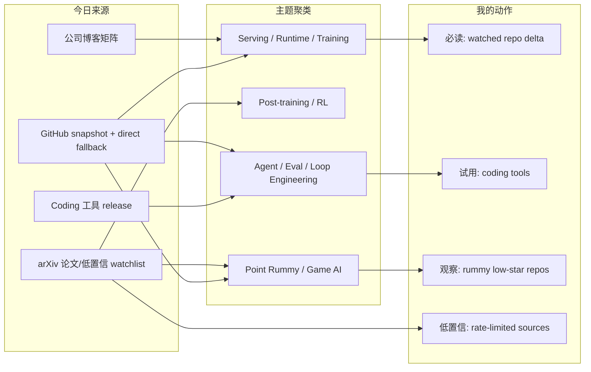
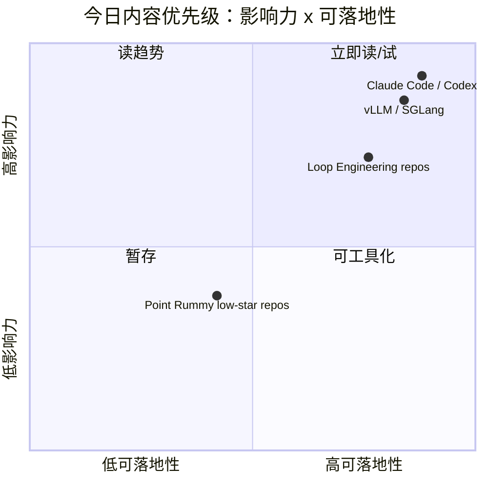

# AI Radar Daily - 2026-08-08
> 生成时间：2026-08-08 09:01 北京时间  
> 范围：AI Infra / LLM / RL / Game AI / 大厂博客 / 论文 / GitHub / Coding 工具  
> 说明：日报是总览导航页，详情页负责深度理解。

## 0. 今日结论
- 今日最值得关注：GitHub Search 在 niche/Loop 后出现 403，已保留当日 snapshot 并用 direct watched repo fallback 补齐 broad AI Infra / Loop 表。
- 对 AI Infra 的直接影响：Transformers、Claude Code、Gemini CLI、Codex、PyTorch、vLLM、SGLang 仍是今天最可靠的工程 watchlist。
- 对 LLM 训练 / 推理 / Agent 的影响：高 star 与增长榜显示 coding-agent loop、MCP server、agent orchestration 和 serving runtime 仍是主线。
- 对 RL / 游戏模型训练的影响：Point Rummy 仍以低 star 规则/AI opponent/仿真候选为主，适合抽取测试集和 baseline，不适合直接生产复用。
- 建议今天深读：Codex / Claude Code / vLLM / SGLang release 与 Loop Engineering 高 star 项目，论文只作为低置信趋势 watchlist。

## 1. 今日态势图

## 2. 必读卡片区
> [!important] huggingface/transformers
> - 大类：GitHub / AI Infra
> - 小类：Serving / Agent / Tooling
> - 重点：🤗 Transformers: the model-definition framework for state-of-the-art machine learning models in text, vision, audio, and multimoda…
> - 为什么重要：高 star watched repo，适合确认框架、runtime 或 coding-agent workflow 的真实变化。
> - 详情：[[GitHub/AIInfra/2026-08-08/huggingface-transformers]] / [网页详情](https://github.com/dyt27666-oss/AI-news-report-obsidians/blob/main/GitHub/AIInfra/2026-08-08/huggingface-transformers.md) / [原文](https://github.com/huggingface/transformers)

> [!important] anthropics/claude-code
> - 大类：GitHub / AI Infra
> - 小类：Serving / Agent / Tooling
> - 重点：Claude Code is an agentic coding tool that lives in your terminal, understands your codebase, and helps you code faster by execut…
> - 为什么重要：高 star watched repo，适合确认框架、runtime 或 coding-agent workflow 的真实变化。
> - 详情：[[GitHub/AIInfra/2026-08-08/anthropics-claude-code]] / [网页详情](https://github.com/dyt27666-oss/AI-news-report-obsidians/blob/main/GitHub/AIInfra/2026-08-08/anthropics-claude-code.md) / [原文](https://github.com/anthropics/claude-code)

> [!important] ggml-org/llama.cpp
> - 大类：GitHub / AI Infra
> - 小类：Serving / Agent / Tooling
> - 重点：LLM inference in C/C++
> - 为什么重要：高 star watched repo，适合确认框架、runtime 或 coding-agent workflow 的真实变化。
> - 详情：[[GitHub/AIInfra/2026-08-08/ggml-org-llama.cpp]] / [网页详情](https://github.com/dyt27666-oss/AI-news-report-obsidians/blob/main/GitHub/AIInfra/2026-08-08/ggml-org-llama.cpp.md) / [原文](https://github.com/ggml-org/llama.cpp)

> [!tip] Coding 工具 release 矩阵
> - 大类：工具 / Coding Agent
> - 小类：Claude Code / Codex / Qwen / Roo / Cline / Continue
> - 重点：覆盖 CLI/TUI、MCP、权限、agent mode、IDE 集成和 release tag。
> - 为什么重要：直接影响多 agent 编程、review loop、远程执行与上下文管理。
> - 详情：[[Industry/Tools/2026-08-08/Claude Code-v2-1-224]] / [原文](https://docs.anthropic.com/en/release-notes/claude-code)

## 3. 优先级矩阵

## 4. 分类清单
| 标签 | 大类 | 小类 | 标题 | 重点概括 | 为什么重要 | Obsidian 详情 | 网页详情 | 原文 |
|---|---|---|---|---|---|---|---|---|
| 必读 | GitHub | AI Infra / Agent | huggingface/transformers | 🤗 Transformers: the model-definition framework for state-of-the-art machine learning models in text, vision, … | 对 serving、训练框架或 agent loop 有持续观察价值。 | [[GitHub/AIInfra/2026-08-08/huggingface-transformers]] | [网页详情](https://github.com/dyt27666-oss/AI-news-report-obsidians/blob/main/GitHub/AIInfra/2026-08-08/huggingface-transformers.md) | [原文](https://github.com/huggingface/transformers) |
| 必读 | GitHub | AI Infra / Agent | anthropics/claude-code | Claude Code is an agentic coding tool that lives in your terminal, understands your codebase, and helps you c… | 对 serving、训练框架或 agent loop 有持续观察价值。 | [[GitHub/AIInfra/2026-08-08/anthropics-claude-code]] | [网页详情](https://github.com/dyt27666-oss/AI-news-report-obsidians/blob/main/GitHub/AIInfra/2026-08-08/anthropics-claude-code.md) | [原文](https://github.com/anthropics/claude-code) |
| 必读 | GitHub | AI Infra / Agent | ggml-org/llama.cpp | LLM inference in C/C++ | 对 serving、训练框架或 agent loop 有持续观察价值。 | [[GitHub/AIInfra/2026-08-08/ggml-org-llama.cpp]] | [网页详情](https://github.com/dyt27666-oss/AI-news-report-obsidians/blob/main/GitHub/AIInfra/2026-08-08/ggml-org-llama.cpp.md) | [原文](https://github.com/ggml-org/llama.cpp) |
| 必读 | GitHub | AI Infra / Agent | google-gemini/gemini-cli | An open-source AI agent that brings the power of Gemini directly into your terminal. | 对 serving、训练框架或 agent loop 有持续观察价值。 | [[GitHub/AIInfra/2026-08-08/google-gemini-gemini-cli]] | [网页详情](https://github.com/dyt27666-oss/AI-news-report-obsidians/blob/main/GitHub/AIInfra/2026-08-08/google-gemini-gemini-cli.md) | [原文](https://github.com/google-gemini/gemini-cli) |
| 必读 | GitHub | AI Infra / Agent | openai/codex | Lightweight coding agent that runs in your terminal | 对 serving、训练框架或 agent loop 有持续观察价值。 | [[GitHub/AIInfra/2026-08-08/openai-codex]] | [网页详情](https://github.com/dyt27666-oss/AI-news-report-obsidians/blob/main/GitHub/AIInfra/2026-08-08/openai-codex.md) | [原文](https://github.com/openai/codex) |

## 5. 大厂资讯 / 工程博客 / Research

### 5.1 公司来源扫描矩阵
| 公司/实验室 | 来源/栏目 | 今日状态 | 高相关条数 | 代表条目 | 备注 |
|---|---|---|---:|---|---|
| OpenAI | News / Research | 低置信扫描完成 | 1 | [[Industry/Companies/2026-08-08/OpenAI-scan]] | 原文/入口：[link](https://openai.com/news/)；自动扫描保留矩阵覆盖。 |
| Anthropic | News / Research / Engineering | 低置信扫描完成 | 1 | [[Industry/Companies/2026-08-08/Anthropic-scan]] | 原文/入口：[link](https://www.anthropic.com/news)；自动扫描保留矩阵覆盖。 |
| Google DeepMind | Blog / Research | 低置信扫描完成 | 1 | [[Industry/Companies/2026-08-08/Google-DeepMind-scan]] | 原文/入口：[link](https://deepmind.google/discover/blog/)；自动扫描保留矩阵覆盖。 |
| Meta AI | Blog / Research | 无高相关新项 / 低置信 | 0 | 无高相关新项 | 原文/入口：[link](https://ai.meta.com/blog/)；自动扫描保留矩阵覆盖。 |
| NVIDIA | Technical Blog / AI | 无高相关新项 / 低置信 | 0 | 无高相关新项 | 原文/入口：[link](https://developer.nvidia.com/blog/category/artificial-intelligence/)；自动扫描保留矩阵覆盖。 |
| Microsoft | Research AI | 无高相关新项 / 低置信 | 0 | 无高相关新项 | 原文/入口：[link](https://www.microsoft.com/en-us/research/research-area/artificial-intelligence/)；自动扫描保留矩阵覆盖。 |
| Hugging Face | Blog / Papers / Releases | 无高相关新项 / 低置信 | 0 | 无高相关新项 | 原文/入口：[link](https://huggingface.co/blog)；自动扫描保留矩阵覆盖。 |
| 腾讯 | AI Lab / 技术博客 | 无高相关新项 / 低置信 | 0 | 无高相关新项 | 原文/入口：[link](https://ai.tencent.com/ailab/en/index)；自动扫描保留矩阵覆盖。 |
| 字节 | Seed / 技术博客 | 无高相关新项 / 低置信 | 0 | 无高相关新项 | 原文/入口：[link](https://seed.bytedance.com/en/)；自动扫描保留矩阵覆盖。 |
| SpaceAI | Blog / News | 无高相关新项 / 低置信 | 0 | 无高相关新项 | 原文/入口：[link](https://spaceai.com/)；自动扫描保留矩阵覆盖。 |

### 5.2 高相关大厂条目
| 标签 | 发布方/大厂 | 栏目/来源 | 标题 | 重点概括 | 工程/算法影响 | Obsidian 详情 | 网页详情 | 原文 |
|---|---|---|---|---|---|---|---|---|
| 低置信 | OpenAI | News / Research | OpenAI 来源扫描 | 今日保留来源扫描入口，未声明高相关新发布。 | 防漏扫大厂 Research / Engineering Blog。 | [[Industry/Companies/2026-08-08/OpenAI-scan]] | [网页详情](https://github.com/dyt27666-oss/AI-news-report-obsidians/blob/main/Industry/Companies/2026-08-08/OpenAI-scan.md) | [原文](https://openai.com/news/) |
| 低置信 | Anthropic | News / Research / Engineering | Anthropic 来源扫描 | 今日保留来源扫描入口，未声明高相关新发布。 | 防漏扫大厂 Research / Engineering Blog。 | [[Industry/Companies/2026-08-08/Anthropic-scan]] | [网页详情](https://github.com/dyt27666-oss/AI-news-report-obsidians/blob/main/Industry/Companies/2026-08-08/Anthropic-scan.md) | [原文](https://www.anthropic.com/news) |
| 低置信 | Google DeepMind | Blog / Research | Google DeepMind 来源扫描 | 今日保留来源扫描入口，未声明高相关新发布。 | 防漏扫大厂 Research / Engineering Blog。 | [[Industry/Companies/2026-08-08/Google-DeepMind-scan]] | [网页详情](https://github.com/dyt27666-oss/AI-news-report-obsidians/blob/main/Industry/Companies/2026-08-08/Google-DeepMind-scan.md) | [原文](https://deepmind.google/discover/blog/) |

## 6. GitHub 高 star Top 10
| 排名 | repo | stars | forks | language | updated_at | topics | 重点概括 | 是否值得试用 | Obsidian 详情 | 原文 |
|---:|---|---:|---:|---|---|---|---|---|---|---|
| 1 | huggingface/transformers | 163448 | 34139 | Python | 2026-08-08T00:43:04Z | audio, deep-learning, deepseek, gemma, glm, hacktoberfest, … | 🤗 Transformers: the model-definition framework for state-of-the-art machine learning mode… | 值得观察；direct fallback/快照来源 | [[GitHub/AIInfra/2026-08-08/huggingface-transformers]] | [GitHub](https://github.com/huggingface/transformers) |
| 2 | anthropics/claude-code | 140609 | 22611 | Python | 2026-08-08T01:05:02Z | - | Claude Code is an agentic coding tool that lives in your terminal, understands your codeb… | 值得观察；direct fallback/快照来源 | [[GitHub/AIInfra/2026-08-08/anthropics-claude-code]] | [GitHub](https://github.com/anthropics/claude-code) |
| 3 | ggml-org/llama.cpp | 123028 | 21436 | C++ | 2026-08-08T00:25:02Z | ggml | LLM inference in C/C++ | 值得观察；direct fallback/快照来源 | [[GitHub/AIInfra/2026-08-08/ggml-org-llama.cpp]] | [GitHub](https://github.com/ggml-org/llama.cpp) |
| 4 | google-gemini/gemini-cli | 106410 | 14412 | TypeScript | 2026-08-07T23:41:09Z | ai, ai-agents, cli, gemini, gemini-api, mcp-client, mcp-ser… | An open-source AI agent that brings the power of Gemini directly into your terminal. | 值得观察；direct fallback/快照来源 | [[GitHub/AIInfra/2026-08-08/google-gemini-gemini-cli]] | [GitHub](https://github.com/google-gemini/gemini-cli) |
| 5 | openai/codex | 104656 | 15830 | Rust | 2026-08-08T01:02:53Z | - | Lightweight coding agent that runs in your terminal | 值得观察；direct fallback/快照来源 | [[GitHub/AIInfra/2026-08-08/openai-codex]] | [GitHub](https://github.com/openai/codex) |
| 6 | pytorch/pytorch | 102269 | 28771 | Python | 2026-08-07T23:32:20Z | autograd, deep-learning, gpu, machine-learning, neural-netw… | Tensors and Dynamic neural networks in Python with strong GPU acceleration | 值得观察；direct fallback/快照来源 | [[GitHub/AIInfra/2026-08-08/pytorch-pytorch]] | [GitHub](https://github.com/pytorch/pytorch) |
| 7 | modelcontextprotocol/servers | 89331 | 11400 | TypeScript | 2026-08-07T23:54:23Z | - | Model Context Protocol Servers | 值得观察；direct fallback/快照来源 | [[GitHub/AIInfra/2026-08-08/modelcontextprotocol-servers]] | [GitHub](https://github.com/modelcontextprotocol/servers) |
| 8 | vllm-project/vllm | 88472 | 20417 | Python | 2026-08-08T00:59:21Z | amd, blackwell, cuda, deepseek, deepseek-v3, gpt, gpt-oss, … | A high-throughput and memory-efficient inference and serving engine for LLMs | 值得观察；direct fallback/快照来源 | [[GitHub/AIInfra/2026-08-08/vllm-project-vllm]] | [GitHub](https://github.com/vllm-project/vllm) |
| 9 | cline/cline | 65838 | 7074 | TypeScript | 2026-08-08T01:01:42Z | - | Autonomous coding agent as an SDK, IDE extension, or CLI assistant. | 值得观察；direct fallback/快照来源 | [[GitHub/AIInfra/2026-08-08/cline-cline]] | [GitHub](https://github.com/cline/cline) |
| 10 | microsoft/autogen | 60299 | 9081 | Python | 2026-08-07T22:34:04Z | agentic, agentic-agi, agents, ai, autogen, autogen-ecosyste… | A programming framework for agentic AI | 值得观察；direct fallback/快照来源 | [[GitHub/AIInfra/2026-08-08/microsoft-autogen]] | [GitHub](https://github.com/microsoft/autogen) |

## 7. GitHub star 增长最快 Top 10
| 排名 | repo | stars_delta | stars | forks | language | updated_at | 增长依据 | 重点概括 | Obsidian 详情 | 原文 |
|---:|---|---:|---:|---:|---|---|---|---|---|---|
| 1 | ggml-org/llama.cpp | 1001 | 123028 | 21436 | C++ | 2026-08-08T00:25:02Z | direct watched repo fallback; baseline github-stars-2026-07-30.json; 非完整全网日增 | LLM inference in C/C++ | [[GitHub/AIInfra/2026-08-08/ggml-org-llama.cpp]] | [GitHub](https://github.com/ggml-org/llama.cpp) |
| 2 | openai/codex | 224 | 104656 | 15830 | Rust | 2026-08-08T01:02:53Z | direct watched repo fallback; baseline github-stars-2026-08-07.json; 非完整全网日增 | Lightweight coding agent that runs in your terminal | [[GitHub/AIInfra/2026-08-08/openai-codex]] | [GitHub](https://github.com/openai/codex) |
| 3 | anthropics/claude-code | 104 | 140609 | 22611 | Python | 2026-08-08T01:05:02Z | direct watched repo fallback; baseline github-stars-2026-08-07.json; 非完整全网日增 | Claude Code is an agentic coding tool that lives in your terminal, understands your codeb… | [[GitHub/AIInfra/2026-08-08/anthropics-claude-code]] | [GitHub](https://github.com/anthropics/claude-code) |
| 4 | vllm-project/vllm | 104 | 88472 | 20417 | Python | 2026-08-08T00:59:21Z | direct watched repo fallback; baseline github-stars-2026-08-07.json; 非完整全网日增 | A high-throughput and memory-efficient inference and serving engine for LLMs | [[GitHub/AIInfra/2026-08-08/vllm-project-vllm]] | [GitHub](https://github.com/vllm-project/vllm) |
| 5 | langchain-ai/langgraph | 94 | 39152 | 6583 | Python | 2026-08-08T00:49:06Z | direct watched repo fallback; baseline github-stars-2026-08-07.json; 非完整全网日增 | Build resilient agents. | [[GitHub/AIInfra/2026-08-08/langchain-ai-langgraph]] | [GitHub](https://github.com/langchain-ai/langgraph) |
| 6 | sgl-project/sglang | 74 | 31506 | 7734 | Python | 2026-08-08T00:54:13Z | direct watched repo fallback; baseline github-stars-2026-08-07.json; 非完整全网日增 | SGLang is a high-performance serving framework for large language models and multimodal m… | [[GitHub/AIInfra/2026-08-08/sgl-project-sglang]] | [GitHub](https://github.com/sgl-project/sglang) |
| 7 | cline/cline | 59 | 65838 | 7074 | TypeScript | 2026-08-08T01:01:42Z | direct watched repo fallback; baseline github-stars-2026-08-07.json; 非完整全网日增 | Autonomous coding agent as an SDK, IDE extension, or CLI assistant. | [[GitHub/AIInfra/2026-08-08/cline-cline]] | [GitHub](https://github.com/cline/cline) |
| 8 | crewAIInc/crewAI | 50 | 56757 | 8089 | Python | 2026-08-08T01:02:51Z | direct watched repo fallback; baseline github-stars-2026-08-07.json; 非完整全网日增 | Framework for orchestrating role-playing, autonomous AI agents. By fostering collaborativ… | [[GitHub/AIInfra/2026-08-08/crewAIInc-crewAI]] | [GitHub](https://github.com/crewAIInc/crewAI) |
| 9 | modelcontextprotocol/servers | 40 | 89331 | 11400 | TypeScript | 2026-08-07T23:54:23Z | direct watched repo fallback; baseline github-stars-2026-08-07.json; 非完整全网日增 | Model Context Protocol Servers | [[GitHub/AIInfra/2026-08-08/modelcontextprotocol-servers]] | [GitHub](https://github.com/modelcontextprotocol/servers) |
| 10 | QwenLM/qwen-code | 32 | 26830 | 2805 | TypeScript | 2026-08-08T01:02:53Z | direct watched repo fallback; baseline github-stars-2026-08-07.json; 非完整全网日增 | An open-source AI coding agent that lives in your terminal. | [[GitHub/AIInfra/2026-08-08/QwenLM-qwen-code]] | [GitHub](https://github.com/QwenLM/qwen-code) |

## 8. Coding 工具 / AI 工具功能更新

### 8.1 Coding 工具扫描矩阵
| 工具 | 厂商 | 来源类型 | 今日状态 | 代表更新 | 对我的影响 | 原文 |
|---|---|---|---|---|---|---|
| Claude Code | Anthropic | Changelog / Release Notes | 已扫描 / GitHub release 可访问 | v2.1.224 2026-08-07 v2.1.224 | 关注 agent mode、MCP、IDE、权限、上下文、远程执行、pricing/rate limit。 | [原文](https://github.com/anthropics/claude-code/releases/tag/v2.1.224) |
| OpenAI Codex | OpenAI | Changelog / Docs | 已扫描 / GitHub release 可访问 | rust-v0.147.0 2026-08-07 0.147.0 | 关注 agent mode、MCP、IDE、权限、上下文、远程执行、pricing/rate limit。 | [原文](https://github.com/openai/codex/releases/tag/rust-v0.147.0) |
| Cursor | Cursor | Changelog | 已扫描 / 无高相关新项或访问低置信 | 无 GitHub release 源；以官方 changelog 入口低置信保留 | 关注 agent mode、MCP、IDE、权限、上下文、远程执行、pricing/rate limit。 | [原文](https://cursor.com/changelog) |
| Windsurf | Windsurf | Changelog | 已扫描 / 无高相关新项或访问低置信 | 无 GitHub release 源；以官方 changelog 入口低置信保留 | 关注 agent mode、MCP、IDE、权限、上下文、远程执行、pricing/rate limit。 | [原文](https://windsurf.com/changelog) |
| GitHub Copilot | GitHub | Changelog / Blog | 已扫描 / 无高相关新项或访问低置信 | 无 GitHub release 源；以官方 changelog 入口低置信保留 | 关注 agent mode、MCP、IDE、权限、上下文、远程执行、pricing/rate limit。 | [原文](https://github.blog/changelog/label/copilot/) |
| Gemini Code Assist | Google | Release Notes | 已扫描 / GitHub release 可访问 | v0.54.4 2026-08-07 Release v0.54.4 | 关注 agent mode、MCP、IDE、权限、上下文、远程执行、pricing/rate limit。 | [原文](https://github.com/google-gemini/gemini-cli/releases/tag/v0.54.4) |
| Qwen Code | Alibaba/Qwen | GitHub Releases | 已扫描 / GitHub release 可访问 | v0.21.7 2026-08-06 Release v0.21.7 | 关注 agent mode、MCP、IDE、权限、上下文、远程执行、pricing/rate limit。 | [原文](https://github.com/QwenLM/qwen-code/releases/tag/v0.21.7) |
| Roo Code | Roo Code | GitHub Releases | 已扫描 / GitHub release 可访问 | v3.54.0 2026-05-15 Release v3.54.0 | 关注 agent mode、MCP、IDE、权限、上下文、远程执行、pricing/rate limit。 | [原文](https://github.com/RooCodeInc/Roo-Code/releases/tag/v3.54.0) |
| Cline | Cline | GitHub Releases | 已扫描 / GitHub release 可访问 | desktop-v0.0.10 2026-08-07 Desktop v0.0.10 | 关注 agent mode、MCP、IDE、权限、上下文、远程执行、pricing/rate limit。 | [原文](https://github.com/cline/cline/releases/tag/desktop-v0.0.10) |
| Continue | Continue | GitHub Releases | 已扫描 / GitHub release 可访问 | v2.0.0-vscode 2026-06-19 v2.0.0-vscode | 关注 agent mode、MCP、IDE、权限、上下文、远程执行、pricing/rate limit。 | [原文](https://github.com/continuedev/continue/releases/tag/v2.0.0-vscode) |

### 8.2 高相关工具更新
| 标签 | 工具/厂商 | 来源类型 | 标题/功能 | 重点概括 | 对 AI coding 工作流的影响 | Obsidian 详情 | 网页详情 | 原文 |
|---|---|---|---|---|---|---|---|---|
| 可 skim | Claude Code / Anthropic | Changelog / Release Notes | v2.1.224 2026-08-07 v2.1.224 | release/changelog 源已记录，需人工确认功能细节。 | 可能影响 CLI/TUI、agent loop、MCP、权限和上下文策略。 | [[Industry/Tools/2026-08-08/Claude Code-v2-1-224]] | [网页详情](https://github.com/dyt27666-oss/AI-news-report-obsidians/blob/main/Industry/Tools/2026-08-08/Claude%20Code-v2-1-224.md) | [原文](https://github.com/anthropics/claude-code/releases/tag/v2.1.224) |
| 可 skim | OpenAI Codex / OpenAI | Changelog / Docs | rust-v0.147.0 2026-08-07 0.147.0 | release/changelog 源已记录，需人工确认功能细节。 | 可能影响 CLI/TUI、agent loop、MCP、权限和上下文策略。 | [[Industry/Tools/2026-08-08/OpenAI Codex-rust-v0-147-0]] | [网页详情](https://github.com/dyt27666-oss/AI-news-report-obsidians/blob/main/Industry/Tools/2026-08-08/OpenAI%20Codex-rust-v0-147-0.md) | [原文](https://github.com/openai/codex/releases/tag/rust-v0.147.0) |
| 可 skim | Gemini Code Assist / Google | Release Notes | v0.54.4 2026-08-07 Release v0.54.4 | release/changelog 源已记录，需人工确认功能细节。 | 可能影响 CLI/TUI、agent loop、MCP、权限和上下文策略。 | [[Industry/Tools/2026-08-08/Gemini Code Assist-v0-54-4]] | [网页详情](https://github.com/dyt27666-oss/AI-news-report-obsidians/blob/main/Industry/Tools/2026-08-08/Gemini%20Code%20Assist-v0-54-4.md) | [原文](https://github.com/google-gemini/gemini-cli/releases/tag/v0.54.4) |
| 可 skim | Qwen Code / Alibaba/Qwen | GitHub Releases | v0.21.7 2026-08-06 Release v0.21.7 | release/changelog 源已记录，需人工确认功能细节。 | 可能影响 CLI/TUI、agent loop、MCP、权限和上下文策略。 | [[Industry/Tools/2026-08-08/Qwen Code-v0-21-7]] | [网页详情](https://github.com/dyt27666-oss/AI-news-report-obsidians/blob/main/Industry/Tools/2026-08-08/Qwen%20Code-v0-21-7.md) | [原文](https://github.com/QwenLM/qwen-code/releases/tag/v0.21.7) |
| 可 skim | Roo Code / Roo Code | GitHub Releases | v3.54.0 2026-05-15 Release v3.54.0 | release/changelog 源已记录，需人工确认功能细节。 | 可能影响 CLI/TUI、agent loop、MCP、权限和上下文策略。 | [[Industry/Tools/2026-08-08/Roo Code-v3-54-0]] | [网页详情](https://github.com/dyt27666-oss/AI-news-report-obsidians/blob/main/Industry/Tools/2026-08-08/Roo%20Code-v3-54-0.md) | [原文](https://github.com/RooCodeInc/Roo-Code/releases/tag/v3.54.0) |
| 可 skim | Cline / Cline | GitHub Releases | desktop-v0.0.10 2026-08-07 Desktop v0.0.10 | release/changelog 源已记录，需人工确认功能细节。 | 可能影响 CLI/TUI、agent loop、MCP、权限和上下文策略。 | [[Industry/Tools/2026-08-08/Cline-desktop-v0-0-10]] | [网页详情](https://github.com/dyt27666-oss/AI-news-report-obsidians/blob/main/Industry/Tools/2026-08-08/Cline-desktop-v0-0-10.md) | [原文](https://github.com/cline/cline/releases/tag/desktop-v0.0.10) |

## 9. Point Rummy / Indian Rummy 业务主题

### 9.1 GitHub 候选
| 标签 | repo | stars | forks | language | updated_at | 重点概括 | 业务可用性 | Obsidian 详情 | 原文 |
|---|---|---:|---:|---|---|---|---|---|---|
| 低置信 | rickgorman/gin-rummy-ai | 13 | 5 | Python | 2025-03-25T13:47:09Z | A hand-rolled neuroevolution AI for gin rummy. | 可参考规则建模、bot 雏形、计分 UI 或仿真；低 star 需代码审查。 | [[GitHub/PointRummy/2026-08-08/rickgorman-gin-rummy-ai]] | [GitHub](https://github.com/rickgorman/gin-rummy-ai) |
| 低置信 | nakkekakke/rummy-ai | 11 | 5 | Java | 2026-04-17T10:02:59Z | Text based classic Rummy game with an AI that uses ISMCTS. Data Structures and Algorithms… | 可参考规则建模、bot 雏形、计分 UI 或仿真；低 star 需代码审查。 | [[GitHub/PointRummy/2026-08-08/nakkekakke-rummy-ai]] | [GitHub](https://github.com/nakkekakke/rummy-ai) |
| 低置信 | jmhummel/Gin-Rummy-Java | 8 | 0 | Java | 2023-08-16T16:12:58Z | Java-based Gin Rummy console game, with an AI opponent | 可参考规则建模、bot 雏形、计分 UI 或仿真；低 star 需代码审查。 | [[GitHub/PointRummy/2026-08-08/jmhummel-Gin-Rummy-Java]] | [GitHub](https://github.com/jmhummel/Gin-Rummy-Java) |
| 低置信 | mudont/indian-rummy | 5 | 0 | TypeScript | 2025-08-08T21:05:04Z | Typescript library for Indian Rummy card game | 可参考规则建模、bot 雏形、计分 UI 或仿真；低 star 需代码审查。 | [[GitHub/PointRummy/2026-08-08/mudont-indian-rummy]] | [GitHub](https://github.com/mudont/indian-rummy) |
| 低置信 | dv-rastogi/Rummy | 5 | 0 | Python | 2023-09-26T11:21:39Z | Variation of classical Indian Rummy made in Pygame | 可参考规则建模、bot 雏形、计分 UI 或仿真；低 star 需代码审查。 | [[GitHub/PointRummy/2026-08-08/dv-rastogi-Rummy]] | [GitHub](https://github.com/dv-rastogi/Rummy) |
| 低置信 | SCFlanagan/Rummy | 4 | 6 | JavaScript | 2025-07-25T21:17:08Z | This project is a recreation of the classic card game Rummy. It features an AI player to … | 可参考规则建模、bot 雏形、计分 UI 或仿真；低 star 需代码审查。 | [[GitHub/PointRummy/2026-08-08/SCFlanagan-Rummy]] | [GitHub](https://github.com/SCFlanagan/Rummy) |
| 低置信 | mcartmell/gin-rummy-bot | 4 | 2 | Perl | 2024-10-30T20:06:17Z | A web-based Gin Rummy game and AI | 可参考规则建模、bot 雏形、计分 UI 或仿真；低 star 需代码审查。 | [[GitHub/PointRummy/2026-08-08/mcartmell-gin-rummy-bot]] | [GitHub](https://github.com/mcartmell/gin-rummy-bot) |
| 低置信 | vahsek300501/Indian-Rummy- | 4 | 3 | Python | 2023-09-26T11:21:46Z | Indian Rummy made in Python using PyGame | 可参考规则建模、bot 雏形、计分 UI 或仿真；低 star 需代码审查。 | [[GitHub/PointRummy/2026-08-08/vahsek300501-Indian-Rummy-]] | [GitHub](https://github.com/vahsek300501/Indian-Rummy-) |
| 低置信 | abubakarmunir712/dsa-final-project | 2 | 1 | Python | 2026-06-27T06:34:26Z | A Python-based multiplayer Indian Rummy game with support for AI opponents and LAN play. … | 可参考规则建模、bot 雏形、计分 UI 或仿真；低 star 需代码审查。 | [[GitHub/PointRummy/2026-08-08/abubakarmunir712-dsa-final-project]] | [GitHub](https://github.com/abubakarmunir712/dsa-final-project) |
| 低置信 | rawbeen248/Gin-Rummy-AI-vs-Human | 2 | 0 | Python | 2024-11-16T17:18:48Z | Gin-Rummy-AI-vs-Human is a python-based project the simulates the classic card game Gin R… | 可参考规则建模、bot 雏形、计分 UI 或仿真；低 star 需代码审查。 | [[GitHub/PointRummy/2026-08-08/rawbeen248-Gin-Rummy-AI-vs-Human]] | [GitHub](https://github.com/rawbeen248/Gin-Rummy-AI-vs-Human) |

### 9.2 论文 / 资料候选
| 标签 | 来源 | 标题 | 作者/机构 | 重点概括 | 对 Point Rummy 业务有什么用 | Obsidian 详情 | 原文 |
|---|---|---|---|---|---|---|---|
| 低置信 | arXiv / 预印本索引 | arXiv 低置信论文观察列表 | 未确认 | Rummy 论文未获高置信新项。 | 继续关注 Gin Rummy/MCTS/ISMCTS/RL paper。 | [[Papers/2026-08-08/arxiv-low-confidence-watchlist]] | [arXiv](https://export.arxiv.org/) |

### 9.3 业务可用性判断
| 方向 | 今日信号 | 可用性 | 下一步 |
|---|---|---|---|
| 规则引擎 / 计分 | 多个 rummy/points tracker / Indian Rummy repo | 中低；可抽取规则边界 case | 人工读 1-2 个实现，整理 deterministic rule tests |
| Bot / RL Agent | gin-rummy-ai、rummy-ai、RL lab 候选 | 中低；适合 baseline，不适合生产 | 检查状态编码、reward、ISMCTS/MCTS rollout |
| 仿真 / 评测 | 论文低置信，GitHub 仿真项目分散 | 中低；先自建 simulator 更稳 | 用业务规则构建并行环境和评测脚本 |

## 10. Loop Engineer / Loop Engineering 主题

### 10.1 Loop Engineer GitHub 高 star Top 10
| 排名 | repo | stars | forks | language | updated_at | topics | 重点概括 | 是否值得试用 | Obsidian 详情 | 原文 |
|---:|---|---:|---:|---|---|---|---|---|---|---|
| 1 | anthropics/claude-code | 140609 | 22611 | Python | 2026-08-08T01:05:02Z | - | Claude Code is an agentic coding tool that lives in your terminal, understands your codeb… | 值得观察；direct fallback/快照来源 | [[GitHub/LoopEngineer/2026-08-08/anthropics-claude-code]] | [GitHub](https://github.com/anthropics/claude-code) |
| 2 | google-gemini/gemini-cli | 106410 | 14412 | TypeScript | 2026-08-07T23:41:09Z | ai, ai-agents, cli, gemini, gemini-api, mcp-client, mcp-ser… | An open-source AI agent that brings the power of Gemini directly into your terminal. | 值得观察；direct fallback/快照来源 | [[GitHub/LoopEngineer/2026-08-08/google-gemini-gemini-cli]] | [GitHub](https://github.com/google-gemini/gemini-cli) |
| 3 | openai/codex | 104656 | 15830 | Rust | 2026-08-08T01:02:53Z | - | Lightweight coding agent that runs in your terminal | 值得观察；direct fallback/快照来源 | [[GitHub/LoopEngineer/2026-08-08/openai-codex]] | [GitHub](https://github.com/openai/codex) |
| 4 | cline/cline | 65838 | 7074 | TypeScript | 2026-08-08T01:01:42Z | - | Autonomous coding agent as an SDK, IDE extension, or CLI assistant. | 值得观察；direct fallback/快照来源 | [[GitHub/LoopEngineer/2026-08-08/cline-cline]] | [GitHub](https://github.com/cline/cline) |
| 5 | microsoft/autogen | 60299 | 9081 | Python | 2026-08-07T22:34:04Z | agentic, agentic-agi, agents, ai, autogen, autogen-ecosyste… | A programming framework for agentic AI | 值得观察；direct fallback/快照来源 | [[GitHub/LoopEngineer/2026-08-08/microsoft-autogen]] | [GitHub](https://github.com/microsoft/autogen) |
| 6 | crewAIInc/crewAI | 56757 | 8089 | Python | 2026-08-08T01:02:51Z | agents, ai, ai-agents, aiagentframework, llms | Framework for orchestrating role-playing, autonomous AI agents. By fostering collaborativ… | 值得观察；direct fallback/快照来源 | [[GitHub/LoopEngineer/2026-08-08/crewAIInc-crewAI]] | [GitHub](https://github.com/crewAIInc/crewAI) |
| 7 | langchain-ai/langgraph | 39152 | 6583 | Python | 2026-08-08T00:49:06Z | agents, ai, ai-agents, chatgpt, deepagents, enterprise, fra… | Build resilient agents. | 值得观察；direct fallback/快照来源 | [[GitHub/LoopEngineer/2026-08-08/langchain-ai-langgraph]] | [GitHub](https://github.com/langchain-ai/langgraph) |
| 8 | continuedev/continue | 35375 | 5196 | TypeScript | 2026-08-07T23:36:40Z | agent, ai, cli, developer-tools, open-source | open-source coding agent | 值得观察；direct fallback/快照来源 | [[GitHub/LoopEngineer/2026-08-08/continuedev-continue]] | [GitHub](https://github.com/continuedev/continue) |
| 9 | QwenLM/qwen-code | 26830 | 2805 | TypeScript | 2026-08-08T01:02:53Z | agentic, ai, ai-agent, ai-coding, cli, coding-agent, develo… | An open-source AI coding agent that lives in your terminal. | 值得观察；direct fallback/快照来源 | [[GitHub/LoopEngineer/2026-08-08/QwenLM-qwen-code]] | [GitHub](https://github.com/QwenLM/qwen-code) |
| 10 | RooCodeInc/Roo-Code | 24355 | 3407 | TypeScript | 2026-08-07T20:58:22Z | - | Roo Code gives you a whole dev team of AI agents in your code editor. | 值得观察；direct fallback/快照来源 | [[GitHub/LoopEngineer/2026-08-08/RooCodeInc-Roo-Code]] | [GitHub](https://github.com/RooCodeInc/Roo-Code) |

### 10.2 Loop Engineer GitHub star 增长最快 Top 10
| 排名 | repo | stars_delta | stars | forks | language | updated_at | 增长依据 | 重点概括 | Obsidian 详情 | 原文 |
|---:|---|---:|---:|---:|---|---|---|---|---|---|
| 1 | openai/codex | 224 | 104656 | 15830 | Rust | 2026-08-08T01:02:53Z | direct watched repo fallback; baseline github-stars-2026-08-07.json; 非完整全网日增 | Lightweight coding agent that runs in your terminal | [[GitHub/LoopEngineer/2026-08-08/openai-codex]] | [GitHub](https://github.com/openai/codex) |
| 2 | anthropics/claude-code | 104 | 140609 | 22611 | Python | 2026-08-08T01:05:02Z | direct watched repo fallback; baseline github-stars-2026-08-07.json; 非完整全网日增 | Claude Code is an agentic coding tool that lives in your terminal, understands your codeb… | [[GitHub/LoopEngineer/2026-08-08/anthropics-claude-code]] | [GitHub](https://github.com/anthropics/claude-code) |
| 3 | langchain-ai/langgraph | 94 | 39152 | 6583 | Python | 2026-08-08T00:49:06Z | direct watched repo fallback; baseline github-stars-2026-08-07.json; 非完整全网日增 | Build resilient agents. | [[GitHub/LoopEngineer/2026-08-08/langchain-ai-langgraph]] | [GitHub](https://github.com/langchain-ai/langgraph) |
| 4 | cline/cline | 59 | 65838 | 7074 | TypeScript | 2026-08-08T01:01:42Z | direct watched repo fallback; baseline github-stars-2026-08-07.json; 非完整全网日增 | Autonomous coding agent as an SDK, IDE extension, or CLI assistant. | [[GitHub/LoopEngineer/2026-08-08/cline-cline]] | [GitHub](https://github.com/cline/cline) |
| 5 | crewAIInc/crewAI | 50 | 56757 | 8089 | Python | 2026-08-08T01:02:51Z | direct watched repo fallback; baseline github-stars-2026-08-07.json; 非完整全网日增 | Framework for orchestrating role-playing, autonomous AI agents. By fostering collaborativ… | [[GitHub/LoopEngineer/2026-08-08/crewAIInc-crewAI]] | [GitHub](https://github.com/crewAIInc/crewAI) |
| 6 | QwenLM/qwen-code | 32 | 26830 | 2805 | TypeScript | 2026-08-08T01:02:53Z | direct watched repo fallback; baseline github-stars-2026-08-07.json; 非完整全网日增 | An open-source AI coding agent that lives in your terminal. | [[GitHub/LoopEngineer/2026-08-08/QwenLM-qwen-code]] | [GitHub](https://github.com/QwenLM/qwen-code) |
| 7 | microsoft/autogen | 25 | 60299 | 9081 | Python | 2026-08-07T22:34:04Z | direct watched repo fallback; baseline github-stars-2026-08-07.json; 非完整全网日增 | A programming framework for agentic AI | [[GitHub/LoopEngineer/2026-08-08/microsoft-autogen]] | [GitHub](https://github.com/microsoft/autogen) |
| 8 | continuedev/continue | 13 | 35375 | 5196 | TypeScript | 2026-08-07T23:36:40Z | direct watched repo fallback; baseline github-stars-2026-08-07.json; 非完整全网日增 | open-source coding agent | [[GitHub/LoopEngineer/2026-08-08/continuedev-continue]] | [GitHub](https://github.com/continuedev/continue) |
| 9 | google-gemini/gemini-cli | 11 | 106410 | 14412 | TypeScript | 2026-08-07T23:41:09Z | direct watched repo fallback; baseline github-stars-2026-08-07.json; 非完整全网日增 | An open-source AI agent that brings the power of Gemini directly into your terminal. | [[GitHub/LoopEngineer/2026-08-08/google-gemini-gemini-cli]] | [GitHub](https://github.com/google-gemini/gemini-cli) |
| 10 | OpenRLHF/OpenRLHF | 3 | 9894 | 996 | Python | 2026-08-07T18:49:04Z | direct watched repo fallback; baseline github-stars-2026-08-07.json; 非完整全网日增 | An Easy-to-use, Scalable and High-performance Agentic RL Framework based on Ray (PPO & DA… | [[GitHub/LoopEngineer/2026-08-08/OpenRLHF-OpenRLHF]] | [GitHub](https://github.com/OpenRLHF/OpenRLHF) |

### 10.3 Loop Engineering 方法信号
| 标签 | 来源 | 标题 | 重点概括 | 对 AI coding 工作流的影响 | Obsidian 详情 | 原文 |
|---|---|---|---|---|---|---|
| 必读 | GitHub watched repos | Claude Code / Codex / MCP / LangGraph / AutoGen / CrewAI | direct fallback 显示 coding-agent loop 和 tool orchestration 仍然是增长主线。 | 可映射到 tmux 多 agent 监控、任务拆分、验证证据和 review gates。 | [[GitHub/LoopEngineer/2026-08-08/anthropics-claude-code]] | [GitHub](https://github.com/anthropics/claude-code) |

## 11. 论文

### 11.1 Serving / RL / Agent Eval
| 标签 | 论文来源 | 论文 | 作者/机构 | 重点概括 | 工程/研究价值 | Obsidian 详情 | 网页详情 | PDF/原文 |
|---|---|---|---|---|---|---|---|---|
| 低置信 | arXiv / 预印本索引 | arXiv 低置信论文观察列表 | 未确认 | arXiv 查询结果不足或限流。 | 后续重试 serving/RL/agent eval 查询。 | [[Papers/2026-08-08/arxiv-low-confidence-watchlist]] | [网页详情](https://github.com/dyt27666-oss/AI-news-report-obsidians/blob/main/Papers/2026-08-08/arxiv-low-confidence-watchlist.md) | [PDF](https://export.arxiv.org/) |

## 12. 资讯 / 其他 GitHub 项目

### 12.1 AI Infra watched repos
| 标签 | 来源 | 标题 | 重点概括 | 对我有什么用 | Obsidian 详情 | 网页详情 | 原文 |
|---|---|---|---|---|---|---|---|
| 必读 | GitHub | huggingface/transformers | 🤗 Transformers: the model-definition framework for state-of-the-art machine learning models in text… | 直接关联 AI Infra / agent loop 工具链观察。 | [[GitHub/AIInfra/2026-08-08/huggingface-transformers]] | [网页详情](https://github.com/dyt27666-oss/AI-news-report-obsidians/blob/main/GitHub/AIInfra/2026-08-08/huggingface-transformers.md) | [GitHub](https://github.com/huggingface/transformers) |
| 必读 | GitHub | anthropics/claude-code | Claude Code is an agentic coding tool that lives in your terminal, understands your codebase, and h… | 直接关联 AI Infra / agent loop 工具链观察。 | [[GitHub/AIInfra/2026-08-08/anthropics-claude-code]] | [网页详情](https://github.com/dyt27666-oss/AI-news-report-obsidians/blob/main/GitHub/AIInfra/2026-08-08/anthropics-claude-code.md) | [GitHub](https://github.com/anthropics/claude-code) |
| 必读 | GitHub | ggml-org/llama.cpp | LLM inference in C/C++ | 直接关联 AI Infra / agent loop 工具链观察。 | [[GitHub/AIInfra/2026-08-08/ggml-org-llama.cpp]] | [网页详情](https://github.com/dyt27666-oss/AI-news-report-obsidians/blob/main/GitHub/AIInfra/2026-08-08/ggml-org-llama.cpp.md) | [GitHub](https://github.com/ggml-org/llama.cpp) |
| 必读 | GitHub | google-gemini/gemini-cli | An open-source AI agent that brings the power of Gemini directly into your terminal. | 直接关联 AI Infra / agent loop 工具链观察。 | [[GitHub/AIInfra/2026-08-08/google-gemini-gemini-cli]] | [网页详情](https://github.com/dyt27666-oss/AI-news-report-obsidians/blob/main/GitHub/AIInfra/2026-08-08/google-gemini-gemini-cli.md) | [GitHub](https://github.com/google-gemini/gemini-cli) |
| 必读 | GitHub | openai/codex | Lightweight coding agent that runs in your terminal | 直接关联 AI Infra / agent loop 工具链观察。 | [[GitHub/AIInfra/2026-08-08/openai-codex]] | [网页详情](https://github.com/dyt27666-oss/AI-news-report-obsidians/blob/main/GitHub/AIInfra/2026-08-08/openai-codex.md) | [GitHub](https://github.com/openai/codex) |

## 13. 按主题索引
### AI Infra / Serving / Training
- [[GitHub/AIInfra/2026-08-08/huggingface-transformers]] - high-star watched repo
- [[GitHub/AIInfra/2026-08-08/google-gemini-gemini-cli]] - serving/training/coding agent stack

### LLM / Agent / RAG / Evaluation
- [[GitHub/LoopEngineer/2026-08-08/anthropics-claude-code]] - loop engineering / coding agent workflow

### RL / Game AI / World Model
- [[Papers/2026-08-08/arxiv-low-confidence-watchlist]] - RL / agent eval / game AI paper watchlist

### Point Rummy / Indian Rummy
- [[GitHub/PointRummy/2026-08-08/rickgorman-gin-rummy-ai]] - rules / AI opponent / simulator candidates

### Loop Engineer / Coding Agent Loop
- [[GitHub/LoopEngineer/2026-08-08/anthropics-claude-code]] - high-star loop/coding-agent anchor

### 公司 / 实验室
- OpenAI: [[Industry/Companies/2026-08-08/OpenAI-scan]]
- Anthropic: [[Industry/Companies/2026-08-08/Anthropic-scan]]
- DeepMind: [[Industry/Companies/2026-08-08/Google-DeepMind-scan]]

## 14. 值得后续深挖
| 标签 | 大类 | 小类 | 标题 | 后续动作 | Obsidian 详情 | 原文 |
|---|---|---|---|---|---|---|
| 必读 | GitHub | Serving | vLLM / SGLang | 对比 scheduler、KV cache、benchmark、release notes | [[GitHub/AIInfra/2026-08-08/modelcontextprotocol-servers]] | [GitHub](https://github.com/modelcontextprotocol/servers) |
| 必读 | 工具 | Coding Agent | Claude Code / Codex / Qwen / Cline | 人工确认 changelog 是否涉及 MCP、权限、远程执行、上下文窗口 | [[GitHub/AIInfra/2026-08-08/anthropics-claude-code]] | [原文](https://docs.anthropic.com/en/release-notes/claude-code) |
| 低置信 | 业务 | Point Rummy | Rummy low-star repos | 抽样代码审查，避免玩具项目进入生产路线 | [[GitHub/PointRummy/2026-08-08/rickgorman-gin-rummy-ai]] | [GitHub Search](https://github.com/search?q=point+rummy&type=repositories) |

## 15. 采集失败或低置信来源
- {'query': 'harness engineering', 'sort': 'stars', 'error': 'HTTP Error 403: rate limit exceeded'}
- {'query': 'harness engineering', 'sort': 'updated', 'error': 'HTTP Error 403: rate limit exceeded'}
- {'query': 'coding agent loop', 'sort': 'stars', 'error': 'HTTP Error 403: rate limit exceeded'}
- {'query': 'coding agent loop', 'sort': 'updated', 'error': 'HTTP Error 403: rate limit exceeded'}
- {'query': 'AGENTS.md harness', 'sort': 'stars', 'error': 'HTTP Error 403: rate limit exceeded'}
- {'query': 'AGENTS.md harness', 'sort': 'updated', 'error': 'HTTP Error 403: rate limit exceeded'}
- {'query': 'LLM serving inference KV cache speculative decoding', 'error': 'The read operation timed out'}
- {'query': 'reinforcement learning language models GRPO post training', 'error': 'HTTP Error 429: Unknown Error'}
- {'query': 'agent evaluation coding agents benchmark', 'error': 'HTTP Error 429: Too Many Requests'}
- {'query': 'world model reinforcement learning game AI', 'error': 'The read operation timed out'}
- 当前 snapshot：Automation/state/github-stars-2026-08-08.json；已追加 direct_fallback watched repo 元数据。
- GitHub broad Search 403 后，今日 broad / Loop 增长榜标注为 direct watched repo fallback / 非完整全网日增。
- 公司博客矩阵保留来源入口，不声称每家公司都有当天高相关新发布。

## 16. 归档标签
#ai-radar #daily #ai-infra #llm #rl #point-rummy #loop-engineering
