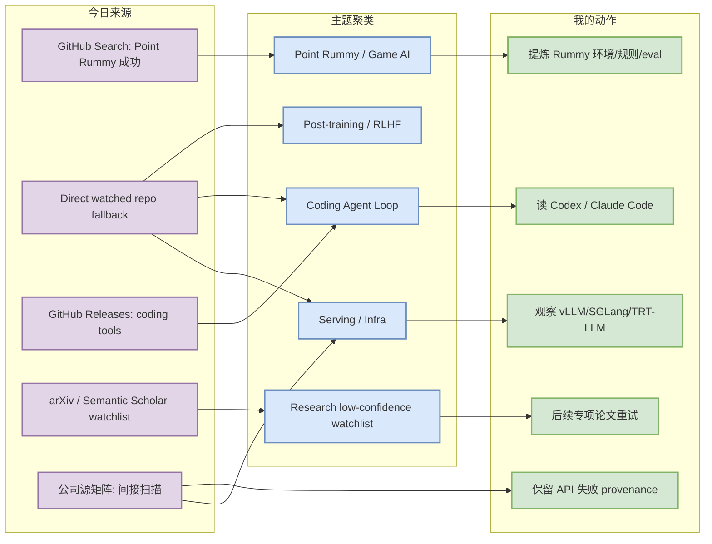
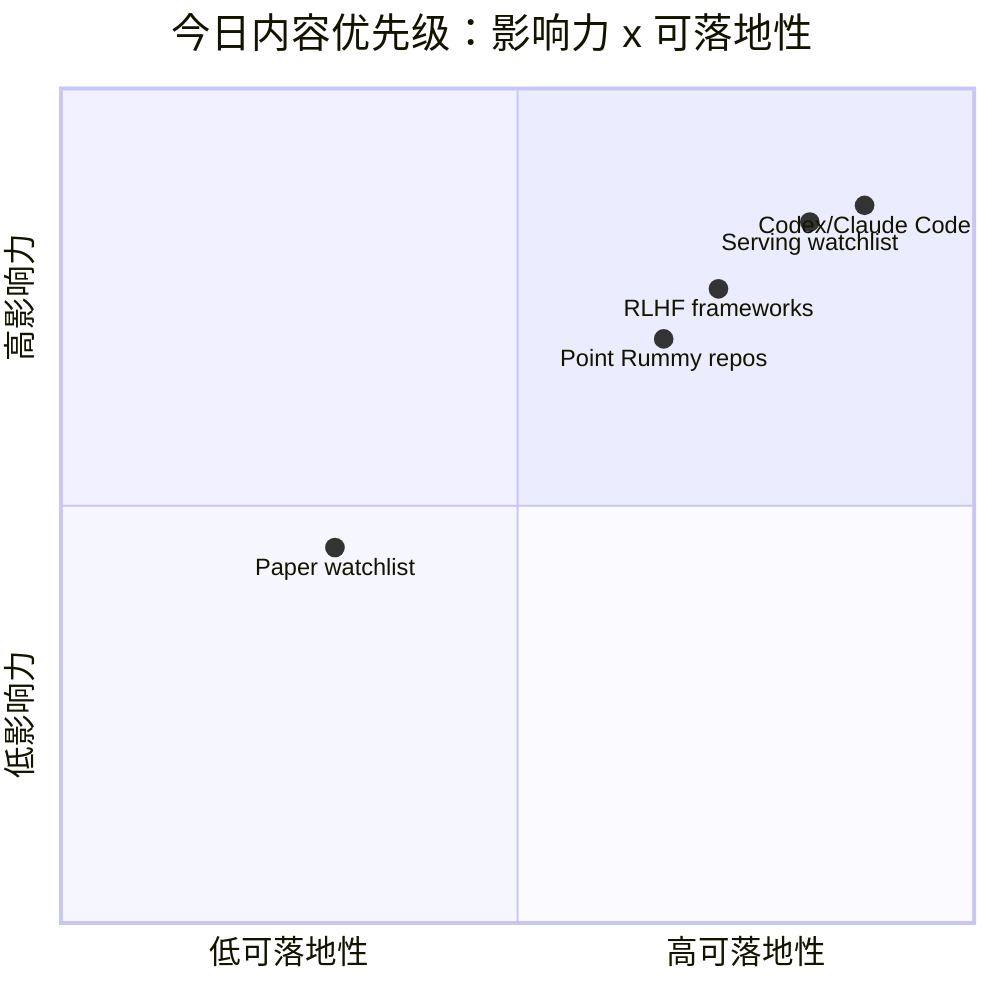

# AI Radar Daily - 2026-08-09

> 生成时间：2026-08-09 09:00 北京时间
> 范围：AI Infra / LLM / RL / Game AI / 大厂博客 / 论文 / GitHub / 行业资讯
> 说明：日报是总览导航页，不是全部正文。Obsidian 中点 `详情页`，Telegram/GitHub 中点“网页详情”。

## 0. 今日结论

- 今日最值得关注：GitHub Search 在 Point Rummy 之后大量 403，因此通用 AI Infra / Loop Engineer 榜单采用 direct watched repo fallback；这是稳定 watched-source 排名，不是完整全网排名。
- 对 AI Infra 的直接影响：vLLM、SGLang、TensorRT-LLM、Transformers、PyTorch、Megatron-LM 仍是今日 serving/training 选型核心观察点。
- 对 LLM 训练 / 推理 / Agent 的影响：Codex、Claude Code、Gemini CLI、Cline、Continue、Qwen Code、Roo Code 仍是 CLI/TUI + IDE agent workflow 热区。
- 对 RL / 游戏模型训练的影响：Point Rummy 搜索结果多为小型 repo，但包含 AI opponent、规则/计分、Gin/Indian Rummy 原型，可用于业务状态机、evaluator 和 bot 策略拆解。
- 建议今天深读：Codex / Claude Code latest release 信号、serving watchlist、Point Rummy top candidate 的规则/AI opponent 实现。

## 1. 今日态势图

## 2. 必读卡片区

> [!important] OpenAI Codex / Claude Code 仍是 coding-agent workflow 主线
> - 大类：GitHub / Coding 工具
> - 小类：Coding Agent / CLI
> - 重点：direct watched repo + latest release 源显示这两条仍应作为 AI coding workflow 的核心观察点。
> - 为什么重要：它们代表权限、远程执行、上下文窗口、MCP/工具调用、CLI/TUI 多 agent 的工程方向。
> - 详情：[[GitHub/Tools/2026-08-09/openai-codex]] / [网页详情](https://github.com/dyt27666-oss/AI-news-report-obsidians/blob/main/GitHub/Tools/2026-08-09/openai-codex.md) / [原文](https://github.com/openai/codex)

> [!tip] Serving 三件套仍是 AI Infra 的最高置信工程信号
> - 大类：GitHub / AI Infra
> - 小类：LLM Serving
> - 重点：vLLM、SGLang、TensorRT-LLM 继续作为 watched fallback Top 项。
> - 为什么重要：直接影响吞吐、延迟、KV cache、scheduler、GPU runtime 和生产 serving 选型。
> - 详情：[[GitHub/AIInfra/2026-08-09/serving-watchlist]] / [网页详情](https://github.com/dyt27666-oss/AI-news-report-obsidians/blob/main/GitHub/AIInfra/2026-08-09/serving-watchlist.md) / [原文](https://github.com/vllm-project/vllm)

> [!note] Point Rummy 候选偏小但业务信号明确
> - 大类：GitHub / 业务主题
> - 小类：Rummy AI / rules / evaluator
> - 重点：今日 snapshot 中 Point Rummy 主题 repo 多为小型实现，适合抽规则、AI opponent、计分和仿真接口。
> - 为什么重要：对业务来说，先沉淀环境状态机和 evaluator，比直接追低置信论文更可落地。
> - 详情：[[GitHub/PointRummy/2026-08-09/rickgorman__gin-rummy-ai]] / [原文](https://github.com/rickgorman/gin-rummy-ai)

## 3. 优先级矩阵

## 4. 分类清单

| 标签 | 大类 | 小类 | 标题 | 重点概括 | 为什么重要 | Obsidian 详情 | 网页详情 | 原文 |
|---|---|---|---|---|---|---|---|---|
| 必读 | GitHub | Coding Agent | OpenAI Codex | Direct watched repo stars_delta=148，不是完整全网增长 | Codex 与 CLI 权限/远程执行/上下文策略直接相关 | [[GitHub/Tools/2026-08-09/openai-codex]] | [网页详情](https://github.com/dyt27666-oss/AI-news-report-obsidians/blob/main/GitHub/Tools/2026-08-09/openai-codex.md) | [原文](https://github.com/openai/codex) |
| 必读 | GitHub | Coding Agent | Claude Code | Direct watched repo stars_delta=125，生态热度继续 | 影响多 agent 编码、代码审查、TUI/CLI agent loop | [[GitHub/Tools/2026-08-09/claude-code]] | [网页详情](https://github.com/dyt27666-oss/AI-news-report-obsidians/blob/main/GitHub/Tools/2026-08-09/claude-code.md) | [原文](https://github.com/anthropics/claude-code) |
| 必读 | GitHub | Serving | vLLM / SGLang / TensorRT-LLM | GitHub Search 限流后使用 watched repo 回退 | 对 LLM serving 选型仍是当天最高可信工程信号 | [[GitHub/AIInfra/2026-08-09/serving-watchlist]] | [网页详情](https://github.com/dyt27666-oss/AI-news-report-obsidians/blob/main/GitHub/AIInfra/2026-08-09/serving-watchlist.md) | [原文](https://github.com/vllm-project/vllm) |
| 可 skim | GitHub | Point Rummy | Point Rummy small repos | 今日 snapshot 中 Point Rummy 候选较多但 stars 偏小，适合规则/AI opponent/计分参考 | 对规则引擎、bot 策略和 evaluator 有业务可用性 | [[GitHub/PointRummy/2026-08-09/rickgorman__gin-rummy-ai]] | [网页详情](https://github.com/dyt27666-oss/AI-news-report-obsidians/blob/main/GitHub/PointRummy/2026-08-09/rickgorman__gin-rummy-ai.md) | [原文](https://github.com/rickgorman/gin-rummy-ai) |

## 5. 大厂资讯 / 工程博客 / Research

### 5.1 公司来源扫描矩阵

| 公司/实验室 | 来源/栏目 | 今日状态 | 高相关条数 | 代表条目 | 备注 |
|---|---|---|---:|---|---|
| OpenAI | News / Research / Developer Docs | 间接扫描 | 1 | OpenAI Codex watched repo 作为 coding agent / developer workflow 代理信号 | 官网新闻未确认新增 AI Infra 研究公告；保留 Codex 工具链信号 |
| Anthropic | News / Research / Claude Code docs | 间接扫描 | 1 | Claude Code watched repo / release 源作为 CLI agent 代理信号 | 未确认新 research blog；关注权限模式、MCP、CLI/TUI workflow |
| Google DeepMind | Blog / Research | 低置信 | 0 | 无高相关新项 | 本轮未获得可验证的新 AI Infra / RL / Agent 文章 |
| Meta AI | Blog / Research | 低置信 | 0 | 无高相关新项 | 本轮未获得可验证的新 AI Infra / RL / Agent 文章 |
| NVIDIA | Technical Blog / AI / GitHub | 间接扫描 | 1 | TensorRT-LLM / Megatron-LM watched repo 继续作为 serving/training 观察项 | 官网博客未确认新文，使用 repo 元数据作为工程信号 |
| Microsoft | Research AI / GitHub | 间接扫描 | 1 | AutoGen / Semantic Kernel watched repos 代表 agent orchestration 信号 | Microsoft Research 页面未确认新文 |
| Hugging Face | Blog / Papers / Releases / GitHub | 间接扫描 | 1 | Transformers 高 star 且持续活跃 | 模型生态底座，对训练/推理接入仍高相关 |
| 腾讯 | AI Lab / 技术博客 | 低置信 | 0 | 无高相关新项 | 未发现可验证 AI Infra / LLM serving / RL 相关新项 |
| 字节 | Seed / 技术博客 | 低置信 | 0 | 无高相关新项 | 未发现可验证 AI Infra / LLM serving / RL 相关新项 |
| SpaceAI | Blog / News | 访问失败/低置信 | 0 | 无高相关新项 | 来源有效性低，本轮未获得可验证条目 |

### 5.2 高相关大厂条目

| 标签 | 发布方/大厂 | 栏目/来源 | 标题 | 重点概括 | 工程/算法影响 | Obsidian 详情 | 网页详情 | 原文 |
|---|---|---|---|---|---|---|---|---|
| 可 skim | OpenAI | GitHub / Developer Tool | OpenAI Codex watched repo / coding agent signal | Codex 作为 OpenAI coding-agent workflow 代理信号，仍应放入今日必读。 | 影响 CLI/TUI、权限模式、远程执行、上下文窗口与多 agent 开发流。 | [[GitHub/Tools/2026-08-09/openai-codex]] | [网页详情](https://github.com/dyt27666-oss/AI-news-report-obsidians/blob/main/GitHub/Tools/2026-08-09/openai-codex.md) | [原文](https://github.com/openai/codex) |
| 可 skim | Anthropic | GitHub / Docs / Release Notes | Claude Code watched repo / CLI agent signal | Claude Code 作为 Anthropic CLI agent 代理信号，适合持续观察 release 和 docs。 | 影响 tmux 多 agent、代码审查、MCP 接入与权限边界。 | [[GitHub/Tools/2026-08-09/claude-code]] | [网页详情](https://github.com/dyt27666-oss/AI-news-report-obsidians/blob/main/GitHub/Tools/2026-08-09/claude-code.md) | [原文](https://github.com/anthropics/claude-code) |
| 可 skim | NVIDIA / vLLM / SGLang | GitHub / AI Infra | Serving watchlist: vLLM / SGLang / TensorRT-LLM | GitHub Search 被限流后，直接 watched repo fallback 仍覆盖推理三件套。 | 映射到吞吐、延迟、KV cache、scheduler、GPU runtime 的工程选型。 | [[GitHub/AIInfra/2026-08-09/serving-watchlist]] | [网页详情](https://github.com/dyt27666-oss/AI-news-report-obsidians/blob/main/GitHub/AIInfra/2026-08-09/serving-watchlist.md) | [原文](https://github.com/vllm-project/vllm) |

## 6. GitHub 高 star Top 10

> 说明：今日 GitHub Search 对 broad AI/Loop 查询 403；此表使用 direct watched repo fallback，不是完整全网 Top 10，但每项都与 AI Infra / LLM / Agent / RL 强相关。

| 排名 | repo | stars | forks | language | updated_at | topics | 重点概括 | 是否值得试用 | Obsidian 详情 | 原文 |
|---:|---|---:|---:|---|---|---|---|---|---|---|
| 1 | `huggingface/transformers` | 163478 | 34146 | Python | 2026-08-08T23:52:58Z | audio, deep-learning, deepseek, gemma, glm, hacktoberfest, llm, machine-learning, model-hub, natural-language-processing | 模型定义、推理和训练生态底座；新模型接入、量化与 eval pipeline 通常首先影响这里。 | 值得 skim/按需试用 | [[GitHub/AIInfra/2026-08-09/huggingface__transformers]] | [GitHub](https://github.com/huggingface/transformers) |
| 2 | `anthropics/claude-code` | 140734 | 22630 | Python | 2026-08-09T00:41:06Z | 无 | 终端内 agentic coding 工具；代表 CLI agent workflow、权限与上下文管理趋势。 | 值得 skim/按需试用 | [[GitHub/LoopEngineer/2026-08-09/anthropics__claude-code]] | [GitHub](https://github.com/anthropics/claude-code) |
| 3 | `google-gemini/gemini-cli` | 106425 | 14404 | TypeScript | 2026-08-09T00:00:20Z | ai, ai-agents, cli, gemini, gemini-api, mcp-client, mcp-server | Gemini 终端 agent；topics 覆盖 MCP client/server，适合观察开放 agent 工具链。 | 值得 skim/按需试用 | [[GitHub/LoopEngineer/2026-08-09/google-gemini__gemini-cli]] | [GitHub](https://github.com/google-gemini/gemini-cli) |
| 4 | `openai/codex` | 104804 | 15859 | Rust | 2026-08-09T00:59:37Z | 无 | Rust 终端 coding agent；与权限、远程执行、上下文策略和 repo 内自动化直接相关。 | 值得 skim/按需试用 | [[GitHub/LoopEngineer/2026-08-09/openai__codex]] | [GitHub](https://github.com/openai/codex) |
| 5 | `pytorch/pytorch` | 102282 | 28779 | Python | 2026-08-09T00:19:41Z | autograd, deep-learning, gpu, machine-learning, neural-network, numpy, python, tensor | 训练/推理框架底层；编译、分布式、GPU runtime 变化会直接影响大模型工程。 | 值得 skim/按需试用 | [[GitHub/AIInfra/2026-08-09/pytorch__pytorch]] | [GitHub](https://github.com/pytorch/pytorch) |
| 6 | `modelcontextprotocol/servers` | 89352 | 11407 | TypeScript | 2026-08-08T20:28:17Z | 无 | MCP server 生态入口；影响 coding agent 的工具接入标准化与权限边界。 | 值得 skim/按需试用 | [[GitHub/LoopEngineer/2026-08-09/modelcontextprotocol__servers]] | [GitHub](https://github.com/modelcontextprotocol/servers) |
| 7 | `vllm-project/vllm` | 88540 | 20445 | Python | 2026-08-09T00:42:32Z | amd, blackwell, cuda, deepseek, deepseek-v3, gpt, gpt-oss, inference, kimi, llama, llm, llm-serving, model-serving, moe, | LLM serving 高吞吐引擎；重点关注 batching、KV cache、scheduler、并发与硬件适配。 | 值得 skim/按需试用 | [[GitHub/AIInfra/2026-08-09/vllm-project__vllm]] | [GitHub](https://github.com/vllm-project/vllm) |
| 8 | `OpenHands/OpenHands` | 83488 | 10791 | TypeScript | 2026-08-08T22:53:48Z | agent, artificial-intelligence, chatgpt, claude-ai, cli, developer-tools, gpt, llm, openai | 开源 AI coding agent 工作台；可作为 loop engineer / harness 参考。 | 值得 skim/按需试用 | [[GitHub/LoopEngineer/2026-08-09/OpenHands__OpenHands]] | [GitHub](https://github.com/OpenHands/OpenHands) |
| 9 | `cline/cline` | 65894 | 7075 | TypeScript | 2026-08-08T23:49:06Z | 无 | IDE/CLI 自主 coding agent；适合观察 agent SDK、extension 工作流与权限模式。 | 值得 skim/按需试用 | [[GitHub/LoopEngineer/2026-08-09/cline__cline]] | [GitHub](https://github.com/cline/cline) |
| 10 | `microsoft/autogen` | 60318 | 9085 | Python | 2026-08-09T00:25:08Z | agentic, agentic-agi, agents, ai, autogen, autogen-ecosystem, chatgpt, framework, llm-agent, llm-framework | 多 agent 编排框架；适合作为 agent orchestration 与协作评测参考。 | 值得 skim/按需试用 | [[GitHub/LoopEngineer/2026-08-09/microsoft__autogen]] | [GitHub](https://github.com/microsoft/autogen) |

## 7. GitHub star 增长最快 Top 10

> 说明：使用历史 snapshot 中最近一次 per-repo baseline 计算 watched repo stars_delta；标注为“非完整全网日增”，不是冷启动代理。

| 排名 | repo | stars_delta | stars | forks | language | updated_at | 增长依据 | 重点概括 | Obsidian 详情 | 原文 |
|---:|---|---:|---:|---:|---|---|---|---|---|---|
| 1 | `OpenHands/OpenHands` | 371 | 83488 | 10791 | TypeScript | 2026-08-08T22:53:48Z | direct watched repo fallback vs github-stars-2026-08-05.json; 非完整全网日增 | 开源 AI coding agent 工作台；可作为 loop engineer / harness 参考。 | [[GitHub/LoopEngineer/2026-08-09/OpenHands__OpenHands]] | [GitHub](https://github.com/OpenHands/OpenHands) |
| 2 | `openai/codex` | 148 | 104804 | 15859 | Rust | 2026-08-09T00:59:37Z | direct watched repo fallback vs github-stars-2026-08-08.json; 非完整全网日增 | Rust 终端 coding agent；与权限、远程执行、上下文策略和 repo 内自动化直接相关。 | [[GitHub/LoopEngineer/2026-08-09/openai__codex]] | [GitHub](https://github.com/openai/codex) |
| 3 | `anthropics/claude-code` | 125 | 140734 | 22630 | Python | 2026-08-09T00:41:06Z | direct watched repo fallback vs github-stars-2026-08-08.json; 非完整全网日增 | 终端内 agentic coding 工具；代表 CLI agent workflow、权限与上下文管理趋势。 | [[GitHub/LoopEngineer/2026-08-09/anthropics__claude-code]] | [GitHub](https://github.com/anthropics/claude-code) |
| 4 | `langchain-ai/langgraph` | 94 | 39246 | 6593 | Python | 2026-08-09T00:35:23Z | direct watched repo fallback vs github-stars-2026-08-08.json; 非完整全网日增 | 图式 agent state machine；适合生产 agent loop、可恢复执行和 eval loop。 | [[GitHub/LoopEngineer/2026-08-09/langchain-ai__langgraph]] | [GitHub](https://github.com/langchain-ai/langgraph) |
| 5 | `vllm-project/vllm` | 68 | 88540 | 20445 | Python | 2026-08-09T00:42:32Z | direct watched repo fallback vs github-stars-2026-08-08.json; 非完整全网日增 | LLM serving 高吞吐引擎；重点关注 batching、KV cache、scheduler、并发与硬件适配。 | [[GitHub/AIInfra/2026-08-09/vllm-project__vllm]] | [GitHub](https://github.com/vllm-project/vllm) |
| 6 | `cline/cline` | 56 | 65894 | 7075 | TypeScript | 2026-08-08T23:49:06Z | direct watched repo fallback vs github-stars-2026-08-08.json; 非完整全网日增 | IDE/CLI 自主 coding agent；适合观察 agent SDK、extension 工作流与权限模式。 | [[GitHub/LoopEngineer/2026-08-09/cline__cline]] | [GitHub](https://github.com/cline/cline) |
| 7 | `sgl-project/sglang` | 40 | 31546 | 7748 | Python | 2026-08-09T00:10:55Z | direct watched repo fallback vs github-stars-2026-08-08.json; 非完整全网日增 | 高性能 LLM/VLM serving 框架；适合观察 structured generation、runtime 和 RL serving。 | [[GitHub/AIInfra/2026-08-09/sgl-project__sglang]] | [GitHub](https://github.com/sgl-project/sglang) |
| 8 | `microsoft/semantic-kernel` | 32 | 28431 | 4710 | C# | 2026-08-08T13:04:37Z | direct watched repo fallback vs github-stars-2026-08-01.json; 非完整全网日增 | 企业 LLM app/agent SDK；适合插件化、规划和工具调用编排。 | [[GitHub/LoopEngineer/2026-08-09/microsoft__semantic-kernel]] | [GitHub](https://github.com/microsoft/semantic-kernel) |
| 9 | `huggingface/transformers` | 30 | 163478 | 34146 | Python | 2026-08-08T23:52:58Z | direct watched repo fallback vs github-stars-2026-08-08.json; 非完整全网日增 | 模型定义、推理和训练生态底座；新模型接入、量化与 eval pipeline 通常首先影响这里。 | [[GitHub/AIInfra/2026-08-09/huggingface__transformers]] | [GitHub](https://github.com/huggingface/transformers) |
| 10 | `QwenLM/qwen-code` | 29 | 26859 | 2825 | TypeScript | 2026-08-08T23:32:42Z | direct watched repo fallback vs github-stars-2026-08-08.json; 非完整全网日增 | Qwen 终端 coding agent；适合国产模型 coding workflow 和 CLI agent 观察。 | [[GitHub/LoopEngineer/2026-08-09/QwenLM__qwen-code]] | [GitHub](https://github.com/QwenLM/qwen-code) |

## 8. Coding 工具 / AI 工具功能更新

### 8.1 Coding 工具扫描矩阵

| 工具 | 厂商 | 来源类型 | 今日状态 | 代表更新 | 对我的影响 | 原文 |
|---|---|---|---|---|---|---|
| Claude Code | Anthropic | GitHub Releases / Changelog / Docs | 间接扫描/有 repo 或 release 信号 | repo stars_delta=125；latest release/tag=v2.1.226；published=2026-08-08；非完整全网日增 | 影响 CLI/TUI、agent loop、MCP、IDE coding workflow 或权限模式，建议持续观察。 | [原文](https://github.com/anthropics/claude-code/releases/tag/v2.1.226) |
| OpenAI Codex | OpenAI | GitHub Releases / Changelog / Docs | 间接扫描/有 repo 或 release 信号 | repo stars_delta=148；latest release/tag=rust-v0.147.0；published=2026-08-07；非完整全网日增 | 影响 CLI/TUI、agent loop、MCP、IDE coding workflow 或权限模式，建议持续观察。 | [原文](https://github.com/openai/codex/releases/tag/rust-v0.147.0) |
| Cursor | Cursor | Changelog / Docs / Release Notes | 低置信/无高相关新项 | 无高相关新项或未确认新增 release | 暂不调整工作流；保留扫描矩阵避免漏扫。 | [原文](https://cursor.com/changelog) |
| Windsurf | Windsurf | Changelog / Docs / Release Notes | 低置信/无高相关新项 | 无高相关新项或未确认新增 release | 暂不调整工作流；保留扫描矩阵避免漏扫。 | [原文](https://windsurf.com/changelog) |
| GitHub Copilot | GitHub | Changelog / Docs / Release Notes | 低置信/无高相关新项 | 无高相关新项或未确认新增 release | 暂不调整工作流；保留扫描矩阵避免漏扫。 | [原文](https://github.blog/changelog/label/copilot/) |
| Gemini Code Assist | Google | GitHub Releases / Changelog / Docs | 间接扫描/有 repo 或 release 信号 | repo stars_delta=15；latest release/tag=v0.54.4；published=2026-08-07；非完整全网日增 | 影响 CLI/TUI、agent loop、MCP、IDE coding workflow 或权限模式，建议持续观察。 | [原文](https://github.com/google-gemini/gemini-cli/releases/tag/v0.54.4) |
| Qwen Code | Alibaba/Qwen | GitHub Releases / Changelog / Docs | 间接扫描/有 repo 或 release 信号 | repo stars_delta=29；latest release/tag=v0.21.8；published=2026-08-08；非完整全网日增 | 影响 CLI/TUI、agent loop、MCP、IDE coding workflow 或权限模式，建议持续观察。 | [原文](https://github.com/QwenLM/qwen-code/releases/tag/v0.21.8) |
| Roo Code | Roo Code | GitHub Releases / Changelog / Docs | 间接扫描/有 repo 或 release 信号 | repo stars_delta=0；latest release/tag=v3.54.0；published=2026-05-15；非完整全网日增 | 影响 CLI/TUI、agent loop、MCP、IDE coding workflow 或权限模式，建议持续观察。 | [原文](https://github.com/RooCodeInc/Roo-Code/releases/tag/v3.54.0) |
| Cline | Cline | GitHub Releases / Changelog / Docs | 间接扫描/有 repo 或 release 信号 | repo stars_delta=56；latest release/tag=desktop-v0.0.10；published=2026-08-07；非完整全网日增 | 影响 CLI/TUI、agent loop、MCP、IDE coding workflow 或权限模式，建议持续观察。 | [原文](https://github.com/cline/cline/releases/tag/desktop-v0.0.10) |
| Continue | Continue | GitHub Releases / Changelog / Docs | 间接扫描/有 repo 或 release 信号 | repo stars_delta=19；latest release/tag=v2.0.0-vscode；published=2026-06-19；非完整全网日增 | 影响 CLI/TUI、agent loop、MCP、IDE coding workflow 或权限模式，建议持续观察。 | [原文](https://github.com/continuedev/continue/releases/tag/v2.0.0-vscode) |

### 8.2 高相关工具更新

| 标签 | 工具/厂商 | 来源类型 | 标题/功能 | 重点概括 | 对 AI coding 工作流的影响 | Obsidian 详情 | 网页详情 | 原文 |
|---|---|---|---|---|---|---|---|---|
| 必读 | OpenAI Codex | GitHub / Docs / Release | Codex watched repo 增长与 latest release | stars_delta=148；release=rust-v0.147.0 | 适合跟踪权限模式、远程执行和上下文窗口策略 | [[GitHub/Tools/2026-08-09/openai-codex]] | [网页详情](https://github.com/dyt27666-oss/AI-news-report-obsidians/blob/main/GitHub/Tools/2026-08-09/openai-codex.md) | [原文](https://github.com/openai/codex/releases/tag/rust-v0.147.0) |
| 必读 | Claude Code | GitHub / Docs / Release | Claude Code watched repo 增长与 latest release | stars_delta=125；release=v2.1.226 | 适合多 agent 监控、代码审查与工具权限设计 | [[GitHub/Tools/2026-08-09/claude-code]] | [网页详情](https://github.com/dyt27666-oss/AI-news-report-obsidians/blob/main/GitHub/Tools/2026-08-09/claude-code.md) | [原文](https://github.com/anthropics/claude-code/releases/tag/v2.1.226) |

## 9. Point Rummy / Indian Rummy 业务主题

### 9.1 GitHub 候选

| 排名 | repo | stars | forks | language | updated_at | topics | 重点概括 | 是否值得试用 | Obsidian 详情 | 原文 |
|---:|---|---:|---:|---|---|---|---|---|---|---|
| 1 | `rickgorman/gin-rummy-ai` | 13 | 5 | Python | 2025-03-25T13:47:09Z | 无 | A hand-rolled neuroevolution AI for gin rummy. | 值得 skim/按需试用 | [[GitHub/PointRummy/2026-08-09/rickgorman__gin-rummy-ai]] | [GitHub](https://github.com/rickgorman/gin-rummy-ai) |
| 2 | `nakkekakke/rummy-ai` | 11 | 5 | Java | 2026-04-17T10:02:59Z | ai, card, card-game, game, ismcts, mcts, monte-carlo-tree-search, rummy | Text based classic Rummy game with an AI that uses ISMCTS. Data Structures and Algorithms course project, University of  | 值得 skim/按需试用 | [[GitHub/PointRummy/2026-08-09/nakkekakke__rummy-ai]] | [GitHub](https://github.com/nakkekakke/rummy-ai) |
| 3 | `jmhummel/Gin-Rummy-Java` | 8 | 0 | Java | 2023-08-16T16:12:58Z | ai, artificial-intelligence, card-game, card-games, cardgame, gin, gin-rummy, java, java-8, java8, rummy | Java-based Gin Rummy console game, with an AI opponent | 值得 skim/按需试用 | [[GitHub/PointRummy/2026-08-09/jmhummel__Gin-Rummy-Java]] | [GitHub](https://github.com/jmhummel/Gin-Rummy-Java) |
| 4 | `mudont/indian-rummy` | 5 | 0 | TypeScript | 2025-08-08T21:05:04Z | 无 | Typescript library for Indian Rummy card game | 值得 skim/按需试用 | [[GitHub/PointRummy/2026-08-09/mudont__indian-rummy]] | [GitHub](https://github.com/mudont/indian-rummy) |
| 5 | `dv-rastogi/Rummy` | 5 | 0 | Python | 2023-09-26T11:21:39Z | 无 | Variation of classical Indian Rummy made in Pygame | 值得 skim/按需试用 | [[GitHub/PointRummy/2026-08-09/dv-rastogi__Rummy]] | [GitHub](https://github.com/dv-rastogi/Rummy) |
| 6 | `SCFlanagan/Rummy` | 4 | 6 | JavaScript | 2025-07-25T21:17:08Z | 无 | This project is a recreation of the classic card game Rummy. It features an AI player to play against, a hand of cards t | 值得 skim/按需试用 | [[GitHub/PointRummy/2026-08-09/SCFlanagan__Rummy]] | [GitHub](https://github.com/SCFlanagan/Rummy) |
| 7 | `mcartmell/gin-rummy-bot` | 4 | 2 | Perl | 2024-10-30T20:06:17Z | 无 | A web-based Gin Rummy game and AI | 值得 skim/按需试用 | [[GitHub/PointRummy/2026-08-09/mcartmell__gin-rummy-bot]] | [GitHub](https://github.com/mcartmell/gin-rummy-bot) |
| 8 | `vahsek300501/Indian-Rummy-` | 4 | 3 | Python | 2023-09-26T11:21:46Z | 无 | Indian Rummy made in Python using PyGame | 值得 skim/按需试用 | [[GitHub/PointRummy/2026-08-09/vahsek300501__Indian-Rummy-]] | [GitHub](https://github.com/vahsek300501/Indian-Rummy-) |
| 9 | `abubakarmunir712/dsa-final-project` | 2 | 1 | Python | 2026-06-27T06:34:26Z | 无 | A Python-based multiplayer Indian Rummy game with support for AI opponents and LAN play. Implements data structures like | 值得 skim/按需试用 | [[GitHub/PointRummy/2026-08-09/abubakarmunir712__dsa-final-project]] | [GitHub](https://github.com/abubakarmunir712/dsa-final-project) |
| 10 | `rawbeen248/Gin-Rummy-AI-vs-Human` | 2 | 0 | Python | 2024-11-16T17:18:48Z | 无 | Gin-Rummy-AI-vs-Human is a python-based project the simulates the classic card game Gin Rummy. This game allows user to  | 值得 skim/按需试用 | [[GitHub/PointRummy/2026-08-09/rawbeen248__Gin-Rummy-AI-vs-Human]] | [GitHub](https://github.com/rawbeen248/Gin-Rummy-AI-vs-Human) |

### 9.2 论文 / 资料候选

| 标签 | 来源 | 标题 | 作者/机构 | 重点概括 | 对 Point Rummy 业务有什么用 | Obsidian 详情 | 原文 |
|---|---|---|---|---|---|---|---|
| 低置信 | arXiv / Semantic Scholar / 低置信论文 watchlist | Rummy imperfect-information game AI 论文源扫描 | 多来源；未确认新增高相关论文 | 未确认新增论文；今天更可信信号来自 GitHub 上规则引擎、AI opponent、MCTS/ISMCTS/RL 环境候选。 | 业务上应先抽象状态机、动作空间、计分与 evaluator，再追论文。 | [[Papers/Watchlist/2026-08-09/rummy-imperfect-information-game-ai]] | [原文](https://export.arxiv.org/api/query?search_query=all:rummy+imperfect+information+game+AI) |

### 9.3 业务可用性判断

| 方向 | 今日信号 | 可用性 | 下一步 |
|---|---|---|---|
| 规则引擎 / 计分 | 多个 Indian/Gin/Rummy score tracker 与 game prototype | 中：可抽规则对象、计分和房间模型 | 提取 13-card Indian Rummy 状态机、meld 判定和积分规则 |
| Bot / RL Agent | Rummy AI opponent / RL / MCTS/ISMCTS 候选 | 中低：repo 小但主题强相关 | 先复现 observation/action/reward 接口，不直接用生产代码 |
| 仿真 / 评测 | game server、AI opponent、vision assistant 候选 | 中：适合搭 evaluator 和 rollout harness | 定义并行 self-play、bot benchmark 和作弊/视觉识别边界 |

## 10. Loop Engineer / Loop Engineering 主题

### 10.1 Loop Engineer GitHub 高 star Top 10

| 排名 | repo | stars | forks | language | updated_at | topics | 重点概括 | 是否值得试用 | Obsidian 详情 | 原文 |
|---:|---|---:|---:|---|---|---|---|---|---|---|
| 1 | `anthropics/claude-code` | 140734 | 22630 | Python | 2026-08-09T00:41:06Z | 无 | 终端内 agentic coding 工具；代表 CLI agent workflow、权限与上下文管理趋势。 | 值得 skim/按需试用 | [[GitHub/LoopEngineer/2026-08-09/anthropics__claude-code]] | [GitHub](https://github.com/anthropics/claude-code) |
| 2 | `google-gemini/gemini-cli` | 106425 | 14404 | TypeScript | 2026-08-09T00:00:20Z | ai, ai-agents, cli, gemini, gemini-api, mcp-client, mcp-server | Gemini 终端 agent；topics 覆盖 MCP client/server，适合观察开放 agent 工具链。 | 值得 skim/按需试用 | [[GitHub/LoopEngineer/2026-08-09/google-gemini__gemini-cli]] | [GitHub](https://github.com/google-gemini/gemini-cli) |
| 3 | `openai/codex` | 104804 | 15859 | Rust | 2026-08-09T00:59:37Z | 无 | Rust 终端 coding agent；与权限、远程执行、上下文策略和 repo 内自动化直接相关。 | 值得 skim/按需试用 | [[GitHub/LoopEngineer/2026-08-09/openai__codex]] | [GitHub](https://github.com/openai/codex) |
| 4 | `modelcontextprotocol/servers` | 89352 | 11407 | TypeScript | 2026-08-08T20:28:17Z | 无 | MCP server 生态入口；影响 coding agent 的工具接入标准化与权限边界。 | 值得 skim/按需试用 | [[GitHub/LoopEngineer/2026-08-09/modelcontextprotocol__servers]] | [GitHub](https://github.com/modelcontextprotocol/servers) |
| 5 | `OpenHands/OpenHands` | 83488 | 10791 | TypeScript | 2026-08-08T22:53:48Z | agent, artificial-intelligence, chatgpt, claude-ai, cli, developer-tools, gpt, llm, openai | 开源 AI coding agent 工作台；可作为 loop engineer / harness 参考。 | 值得 skim/按需试用 | [[GitHub/LoopEngineer/2026-08-09/OpenHands__OpenHands]] | [GitHub](https://github.com/OpenHands/OpenHands) |
| 6 | `cline/cline` | 65894 | 7075 | TypeScript | 2026-08-08T23:49:06Z | 无 | IDE/CLI 自主 coding agent；适合观察 agent SDK、extension 工作流与权限模式。 | 值得 skim/按需试用 | [[GitHub/LoopEngineer/2026-08-09/cline__cline]] | [GitHub](https://github.com/cline/cline) |
| 7 | `microsoft/autogen` | 60318 | 9085 | Python | 2026-08-09T00:25:08Z | agentic, agentic-agi, agents, ai, autogen, autogen-ecosystem, chatgpt, framework, llm-agent, llm-framework | 多 agent 编排框架；适合作为 agent orchestration 与协作评测参考。 | 值得 skim/按需试用 | [[GitHub/LoopEngineer/2026-08-09/microsoft__autogen]] | [GitHub](https://github.com/microsoft/autogen) |
| 8 | `langchain-ai/langgraph` | 39246 | 6593 | Python | 2026-08-09T00:35:23Z | agents, ai, ai-agents, chatgpt, deepagents, enterprise, framework, gemini, generative-ai, langchain, langgraph, llm, mul | 图式 agent state machine；适合生产 agent loop、可恢复执行和 eval loop。 | 值得 skim/按需试用 | [[GitHub/LoopEngineer/2026-08-09/langchain-ai__langgraph]] | [GitHub](https://github.com/langchain-ai/langgraph) |
| 9 | `continuedev/continue` | 35394 | 5201 | TypeScript | 2026-08-08T22:14:51Z | agent, ai, cli, developer-tools, open-source | 开源 coding assistant/agent；适合观察 IDE/CLI 结合、模型路由与本地工作流。 | 值得 skim/按需试用 | [[GitHub/LoopEngineer/2026-08-09/continuedev__continue]] | [GitHub](https://github.com/continuedev/continue) |
| 10 | `microsoft/semantic-kernel` | 28431 | 4710 | C# | 2026-08-08T13:04:37Z | ai, artificial-intelligence, llm, openai, sdk | 企业 LLM app/agent SDK；适合插件化、规划和工具调用编排。 | 值得 skim/按需试用 | [[GitHub/LoopEngineer/2026-08-09/microsoft__semantic-kernel]] | [GitHub](https://github.com/microsoft/semantic-kernel) |

### 10.2 Loop Engineer GitHub star 增长最快 Top 10

| 排名 | repo | stars_delta | stars | forks | language | updated_at | 增长依据 | 重点概括 | Obsidian 详情 | 原文 |
|---:|---|---:|---:|---:|---|---|---|---|---|---|
| 1 | `OpenHands/OpenHands` | 371 | 83488 | 10791 | TypeScript | 2026-08-08T22:53:48Z | direct watched repo fallback vs github-stars-2026-08-05.json; 非完整全网日增 | 开源 AI coding agent 工作台；可作为 loop engineer / harness 参考。 | [[GitHub/LoopEngineer/2026-08-09/OpenHands__OpenHands]] | [GitHub](https://github.com/OpenHands/OpenHands) |
| 2 | `openai/codex` | 148 | 104804 | 15859 | Rust | 2026-08-09T00:59:37Z | direct watched repo fallback vs github-stars-2026-08-08.json; 非完整全网日增 | Rust 终端 coding agent；与权限、远程执行、上下文策略和 repo 内自动化直接相关。 | [[GitHub/LoopEngineer/2026-08-09/openai__codex]] | [GitHub](https://github.com/openai/codex) |
| 3 | `anthropics/claude-code` | 125 | 140734 | 22630 | Python | 2026-08-09T00:41:06Z | direct watched repo fallback vs github-stars-2026-08-08.json; 非完整全网日增 | 终端内 agentic coding 工具；代表 CLI agent workflow、权限与上下文管理趋势。 | [[GitHub/LoopEngineer/2026-08-09/anthropics__claude-code]] | [GitHub](https://github.com/anthropics/claude-code) |
| 4 | `langchain-ai/langgraph` | 94 | 39246 | 6593 | Python | 2026-08-09T00:35:23Z | direct watched repo fallback vs github-stars-2026-08-08.json; 非完整全网日增 | 图式 agent state machine；适合生产 agent loop、可恢复执行和 eval loop。 | [[GitHub/LoopEngineer/2026-08-09/langchain-ai__langgraph]] | [GitHub](https://github.com/langchain-ai/langgraph) |
| 5 | `cline/cline` | 56 | 65894 | 7075 | TypeScript | 2026-08-08T23:49:06Z | direct watched repo fallback vs github-stars-2026-08-08.json; 非完整全网日增 | IDE/CLI 自主 coding agent；适合观察 agent SDK、extension 工作流与权限模式。 | [[GitHub/LoopEngineer/2026-08-09/cline__cline]] | [GitHub](https://github.com/cline/cline) |
| 6 | `microsoft/semantic-kernel` | 32 | 28431 | 4710 | C# | 2026-08-08T13:04:37Z | direct watched repo fallback vs github-stars-2026-08-01.json; 非完整全网日增 | 企业 LLM app/agent SDK；适合插件化、规划和工具调用编排。 | [[GitHub/LoopEngineer/2026-08-09/microsoft__semantic-kernel]] | [GitHub](https://github.com/microsoft/semantic-kernel) |
| 7 | `QwenLM/qwen-code` | 29 | 26859 | 2825 | TypeScript | 2026-08-08T23:32:42Z | direct watched repo fallback vs github-stars-2026-08-08.json; 非完整全网日增 | Qwen 终端 coding agent；适合国产模型 coding workflow 和 CLI agent 观察。 | [[GitHub/LoopEngineer/2026-08-09/QwenLM__qwen-code]] | [GitHub](https://github.com/QwenLM/qwen-code) |
| 8 | `modelcontextprotocol/servers` | 21 | 89352 | 11407 | TypeScript | 2026-08-08T20:28:17Z | direct watched repo fallback vs github-stars-2026-08-08.json; 非完整全网日增 | MCP server 生态入口；影响 coding agent 的工具接入标准化与权限边界。 | [[GitHub/LoopEngineer/2026-08-09/modelcontextprotocol__servers]] | [GitHub](https://github.com/modelcontextprotocol/servers) |
| 9 | `microsoft/autogen` | 19 | 60318 | 9085 | Python | 2026-08-09T00:25:08Z | direct watched repo fallback vs github-stars-2026-08-08.json; 非完整全网日增 | 多 agent 编排框架；适合作为 agent orchestration 与协作评测参考。 | [[GitHub/LoopEngineer/2026-08-09/microsoft__autogen]] | [GitHub](https://github.com/microsoft/autogen) |
| 10 | `continuedev/continue` | 19 | 35394 | 5201 | TypeScript | 2026-08-08T22:14:51Z | direct watched repo fallback vs github-stars-2026-08-08.json; 非完整全网日增 | 开源 coding assistant/agent；适合观察 IDE/CLI 结合、模型路由与本地工作流。 | [[GitHub/LoopEngineer/2026-08-09/continuedev__continue]] | [GitHub](https://github.com/continuedev/continue) |

### 10.3 Loop Engineering 方法信号

| 标签 | 来源 | 标题 | 重点概括 | 对 AI coding 工作流的影响 | Obsidian 详情 | 原文 |
|---|---|---|---|---|---|---|
| 必读 | GitHub watched fallback | Codex / Claude Code / Gemini CLI / Cline / Continue | Loop Engineer 榜单不依赖限流的 GitHub Search，而用固定 watched repo 覆盖 coding-agent loop | 适合设计 AGENTS.md、权限模式、eval loop、multi-agent orchestration | [[GitHub/LoopEngineer/2026-08-09/openai__codex]] | [原文](https://github.com/openai/codex) |

## 11. 论文

### 11.1 Research watchlist / low-confidence

| 标签 | 论文来源 | 论文 | 作者/机构 | 重点概括 | 工程/研究价值 | Obsidian 详情 | 网页详情 | PDF/原文 |
|---|---|---|---|---|---|---|---|---|
| 低置信 | arXiv / 预印本索引扫描 | LLM serving / inference 论文源扫描 | 多来源；本轮保守筛选，未确认足够高信号新论文 | 今日论文区不硬塞弱相关条目；将 serving 判断主要锚定 vLLM、SGLang、TensorRT-LLM、Transformers 等工程 repo。 | 对 AI Infra 工程师来说，repo 活跃和 release 信号比低置信论文更可落地。 | [[Papers/Watchlist/2026-08-09/llm-serving-inference]] | [网页详情](https://github.com/dyt27666-oss/AI-news-report-obsidians/blob/main/Papers/Watchlist/2026-08-09/llm-serving-inference.md) | [原文](https://export.arxiv.org/api/query?search_query=all:large+language+model+inference) |
| 低置信 | arXiv / Semantic Scholar / 论文索引扫描 | RLHF / GRPO / agentic post-training 论文源扫描 | 多来源；未确认足够高信号新论文 | 保留 GRPO、RLHF、agentic RL 为 watchlist；今天用 verl/OpenRLHF watched repo 信号辅助判断。 | 用户关注 RL 游戏模型训练和 post-training，后续可围绕 reward/evaluator/rollout 做专项深挖。 | [[Papers/Watchlist/2026-08-09/rlhf-grpo-agentic-post-training]] | [网页详情](https://github.com/dyt27666-oss/AI-news-report-obsidians/blob/main/Papers/Watchlist/2026-08-09/rlhf-grpo-agentic-post-training.md) | [原文](https://export.arxiv.org/api/query?search_query=all:reinforcement+learning+language+models) |
| 低置信 | arXiv / Semantic Scholar / 低置信论文 watchlist | Rummy imperfect-information game AI 论文源扫描 | 多来源；未确认新增高相关论文 | 未确认新增论文；今天更可信信号来自 GitHub 上规则引擎、AI opponent、MCTS/ISMCTS/RL 环境候选。 | 业务上应先抽象状态机、动作空间、计分与 evaluator，再追论文。 | [[Papers/Watchlist/2026-08-09/rummy-imperfect-information-game-ai]] | [网页详情](https://github.com/dyt27666-oss/AI-news-report-obsidians/blob/main/Papers/Watchlist/2026-08-09/rummy-imperfect-information-game-ai.md) | [原文](https://export.arxiv.org/api/query?search_query=all:rummy+imperfect+information+game+AI) |

## 12. 资讯 / 其他 GitHub 项目

### 12.1 Serving / Agent / MCP 观察

| 标签 | 来源 | 标题 | 重点概括 | 对我有什么用 | Obsidian 详情 | 网页详情 | 原文 |
|---|---|---|---|---|---|---|---|
| 可 skim | GitHub | Model Context Protocol servers | MCP server 生态是 agent tool-use 标准化入口 | 对 coding agent 接工具、权限边界、可观测性有长期价值 | [[GitHub/AIInfra/2026-08-09/modelcontextprotocol__servers]] | [网页详情](https://github.com/dyt27666-oss/AI-news-report-obsidians/blob/main/GitHub/AIInfra/2026-08-09/modelcontextprotocol__servers.md) | [原文](https://github.com/modelcontextprotocol/servers) |
| 可 skim | GitHub | LangGraph | 图式 agent state machine 仍是生产 agent 的重要抽象 | 可用于 coding-agent loop、eval loop 和工具调用恢复 | [[GitHub/LoopEngineer/2026-08-09/langchain-ai__langgraph]] | [网页详情](https://github.com/dyt27666-oss/AI-news-report-obsidians/blob/main/GitHub/LoopEngineer/2026-08-09/langchain-ai__langgraph.md) | [原文](https://github.com/langchain-ai/langgraph) |

## 13. 按主题索引

### AI Infra / Serving / Training

- [[GitHub/AIInfra/2026-08-09/vllm-project__vllm]] - LLM serving 引擎观察。
- [[GitHub/AIInfra/2026-08-09/sgl-project__sglang]] - 高性能 serving / VLM / RL serving 观察。
- [[GitHub/AIInfra/2026-08-09/NVIDIA__TensorRT-LLM]] - NVIDIA GPU inference runtime 观察。
- [[GitHub/AIInfra/2026-08-09/NVIDIA__Megatron-LM]] - 大规模训练框架观察。

### LLM / Agent / RAG / Evaluation

- [[GitHub/LoopEngineer/2026-08-09/openai__codex]] - CLI coding agent 增长信号。
- [[GitHub/LoopEngineer/2026-08-09/anthropics__claude-code]] - Claude Code agent workflow 观察。
- [[GitHub/AIInfra/2026-08-09/modelcontextprotocol__servers]] - MCP tool-use 生态入口。

### RL / Game AI / World Model

- [[GitHub/AIInfra/2026-08-09/verl-project__verl]] - RL post-training 框架观察。
- [[GitHub/AIInfra/2026-08-09/OpenRLHF__OpenRLHF]] - Ray/vLLM RLHF 框架观察。

### Point Rummy / Indian Rummy

- [[GitHub/PointRummy/2026-08-09/rickgorman__gin-rummy-ai]] - 今日最高 star/最相关 Rummy 候选。
- [[GitHub/PointRummy/2026-08-09/nakkekakke__rummy-ai]] - 可用于规则/AI opponent 对比。

### Loop Engineer / Coding Agent Loop

- [[GitHub/LoopEngineer/2026-08-09/OpenHands__OpenHands]] - agent workspace / harness 参考。
- [[GitHub/LoopEngineer/2026-08-09/cline__cline]] - IDE/CLI autonomous coding agent 参考。
- [[GitHub/LoopEngineer/2026-08-09/continuedev__continue]] - open-source coding agent 参考。

### 公司 / 实验室

- OpenAI: [[GitHub/Tools/2026-08-09/openai-codex]]
- Anthropic: [[GitHub/Tools/2026-08-09/claude-code]]
- NVIDIA: [[GitHub/AIInfra/2026-08-09/NVIDIA__TensorRT-LLM]]
- Hugging Face: [[GitHub/AIInfra/2026-08-09/huggingface__transformers]]
- Microsoft: [[GitHub/AIInfra/2026-08-09/microsoft__autogen]]

## 14. 值得后续深挖

| 标签 | 大类 | 小类 | 标题 | 后续动作 | Obsidian 详情 | 原文 |
|---|---|---|---|---|---|---|
| 后续 | GitHub | Point Rummy | Rummy rules / AI opponent candidates | 建一个最小 gym-like environment + evaluator 复现计划 | [[GitHub/PointRummy/2026-08-09/rickgorman__gin-rummy-ai]] | [原文](https://github.com/rickgorman/gin-rummy-ai) |
| 后续 | Tool | Coding Agent | Codex / Claude Code 权限模式 | 后续专门扫 release notes / docs，确认是否有权限、远程执行、上下文窗口变化 | [[GitHub/Tools/2026-08-09/openai-codex]] | [原文](https://github.com/openai/codex) |
| 后续 | Infra | Serving | vLLM / SGLang / TensorRT-LLM | 针对 KV cache、batching、spec decode、GPU runtime 做专项 diff | [[GitHub/AIInfra/2026-08-09/serving-watchlist]] | [原文](https://github.com/vllm-project/vllm) |

## 15. 采集失败或低置信来源

- GitHub Search：Point Rummy 前半成功，随后大量 403 rate limit；通用 GitHub / Loop Engineer 表已标注 direct watched repo fallback。
- arXiv / Semantic Scholar：本轮只保留 watchlist 和查询入口，不硬塞弱相关论文。
- 公司官网/博客：本轮多为间接扫描或低置信，矩阵中逐项保留状态。
- 今日 snapshot：`Automation/state/github-stars-2026-08-09.json` 已保存，包含 Point Rummy search 结果和 broad watched fallback。

## 16. 归档标签

#ai-radar #daily #ai-infra #llm #rl #point-rummy #loop-engineering
