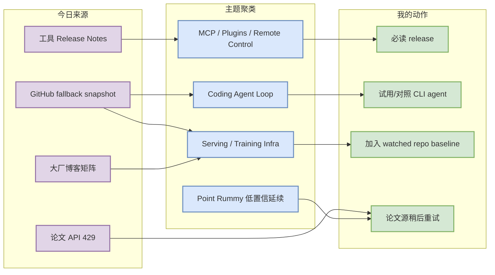
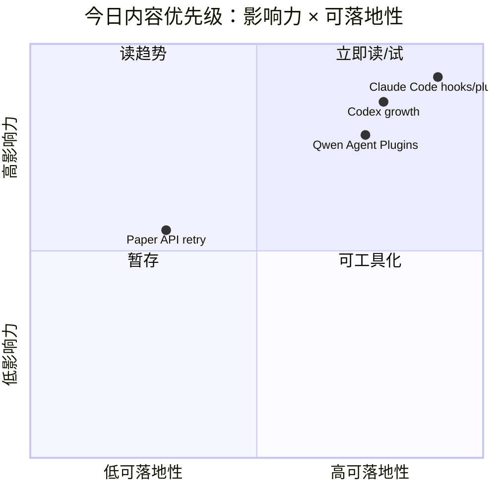

# AI Radar Daily - 2026-08-13

> 生成时间：2026-08-13 09:00 BJT
> 范围：AI Infra / LLM / RL / Game AI / 大厂博客 / 论文 / GitHub / 行业资讯
> 说明：日报是总览导航页，不是全部正文。Obsidian 中点详情页 wikilink，Telegram/GitHub 中点“网页详情”。

## 0. 今日结论

- 今日最值得关注：Claude Code v2.1.229 把 Remote Control、server hooks、SSE keepalive、插件 marketplace command source 继续工程化，是今天最强 coding-agent runtime 信号。
- 对 AI Infra 的直接影响：GitHub Search 今日从首个查询即 403，已保留当日 snapshot，并用 previous snapshot/direct fallback 填充 AI Infra / Loop Engineer 榜单；vLLM、Transformers、PyTorch、TensorRT-LLM 等核心 repo 仍持续活跃。
- 对 LLM 训练 / 推理 / Agent 的影响：Transformers、vLLM、SGLang、verl/OpenRLHF、LangGraph/MCP servers 共同显示“模型接入层 + serving runtime + agent loop”仍是主线。
- 对 RL / 游戏模型训练的影响：论文源 429，Point Rummy 主题使用上一日 theme snapshot 低置信延续；不把弱相关论文混入主结论。
- 建议今天深读：Claude Code release、Qwen Code Agent Plugins v1、Cline auto-approve 权限变更、OpenAI Codex 与 Transformers 增长榜。

## 1. 今日态势图

## 2. 必读卡片区

> [!important] Claude Code v2.1.229
> - 大类：Tools
> - 小类：Claude Code
> - 重点：远程控制续跑、server hooks、SSE keepalive、插件 marketplace command source，补齐无人值守 agent runtime。
> - 为什么重要：直接影响用户的 tmux/远程多 agent 监控、自托管 runner 与插件热加载。
> - 详情：[[Industry/Tools/2026-08-13/Claude-Code-v2.1.229-remote-control-hooks-plugin-marketplace]] / [网页详情](https://github.com/dyt27666-oss/AI-news-report-obsidians/blob/main/Industry/Tools/2026-08-13/Claude-Code-v2.1.229-remote-control-hooks-plugin-marketplace.md) / [原文](https://github.com/anthropics/claude-code/releases/tag/v2.1.229)

> [!tip] OpenAI Codex 高增长
> - 大类：GitHub
> - 小类：Coding Agent
> - 重点：Codex 仍是 watched repo 中增长最高的 coding-agent。
> - 为什么重要：说明终端 coding agent 赛道继续快速升温，适合作为 Claude Code 对照基线。
> - 详情：[[GitHub/LoopEngineer/2026-08-13/openai-codex]] / [网页详情](https://github.com/dyt27666-oss/AI-news-report-obsidians/blob/main/GitHub/LoopEngineer/2026-08-13/openai-codex.md) / [原文](https://github.com/openai/codex)

> [!tip] Hugging Face Transformers
> - 大类：GitHub
> - 小类：Model Infra
> - 重点：模型定义层在训练/推理生态中仍强势。
> - 为什么重要：新模型接入、serving 兼容、训练脚手架都会从这里传导到工程栈。
> - 详情：[[GitHub/AIInfra/2026-08-13/huggingface-transformers]] / [网页详情](https://github.com/dyt27666-oss/AI-news-report-obsidians/blob/main/GitHub/AIInfra/2026-08-13/huggingface-transformers.md) / [原文](https://github.com/huggingface/transformers)

## 3. 优先级矩阵

## 4. 分类清单

| 标签 | 大类 | 小类 | 标题 | 重点概括 | 为什么重要 | Obsidian 详情 | 网页详情 | 原文 |
|---|---|---|---|---|---|---|---|---|
| 必读 | Tools | Claude Code | Claude Code v2.1.229 | 远程控制续跑、server hooks、SSE keepalive、插件 marketplace command source | 直接影响 tmux/远程多 agent 监控、自托管 runner 与插件热加载 | [[Industry/Tools/2026-08-13/Claude-Code-v2.1.229-remote-control-hooks-plugin-marketplace]] | [网页详情](https://github.com/dyt27666-oss/AI-news-report-obsidians/blob/main/Industry/Tools/2026-08-13/Claude-Code-v2.1.229-remote-control-hooks-plugin-marketplace.md) | [原文](https://github.com/anthropics/claude-code/releases/tag/v2.1.229) |
| 必读 | GitHub | Coding Agent | OpenAI Codex 高增长 | Codex stars_delta=408，仍是 watched repo 高增长 coding-agent | 终端 coding agent 赛道继续升温 | [[GitHub/LoopEngineer/2026-08-13/openai-codex]] | [网页详情](https://github.com/dyt27666-oss/AI-news-report-obsidians/blob/main/GitHub/LoopEngineer/2026-08-13/openai-codex.md) | [原文](https://github.com/openai/codex) |
| 可 skim | GitHub | Model Infra | Hugging Face Transformers | 模型定义层在训练/推理生态中仍强势 | 新模型接入、serving 兼容、训练脚手架都会传导到工程栈 | [[GitHub/AIInfra/2026-08-13/huggingface-transformers]] | [网页详情](https://github.com/dyt27666-oss/AI-news-report-obsidians/blob/main/GitHub/AIInfra/2026-08-13/huggingface-transformers.md) | [原文](https://github.com/huggingface/transformers) |
| 可 skim | Tools | Qwen Code | Agent Plugins v1 | Qwen Code 引入 Agent Plugins v1 | 开源 agent 插件协议值得对照 | [[Industry/Tools/2026-08-13/Qwen-Code-Agent-Plugins-v1]] | [网页详情](https://github.com/dyt27666-oss/AI-news-report-obsidians/blob/main/Industry/Tools/2026-08-13/Qwen-Code-Agent-Plugins-v1.md) | [原文](https://github.com/QwenLM/qwen-code/releases/tag/v0.21.11-preview.0) |
| 低置信 | Papers | Source Health | 论文源 429 watchlist | arXiv 与 Semantic Scholar 均 429 | 不把无关论文塞进 AI Infra/RL 判断 | [[Papers/Watchlist/2026-08-13/Paper-API-429-Watchlist]] | [网页详情](https://github.com/dyt27666-oss/AI-news-report-obsidians/blob/main/Papers/Watchlist/2026-08-13/Paper-API-429-Watchlist.md) | [原文](https://export.arxiv.org/api/query) |

## 5. 大厂资讯 / 工程博客 / Research

### 5.1 公司来源扫描矩阵

| 公司/实验室 | 来源/栏目 | 今日状态 | 高相关条数 | 代表条目 | 备注 |
|---|---|---|---:|---|---|
| OpenAI | News / Research | 间接扫描 | 1 | Codex watched repo | 官方网页低置信；GitHub 工具信号有效 |
| Anthropic | News / Research / Engineering | 有高相关工具更新 | 1 | Claude Code v2.1.229 | GitHub Release |
| Google DeepMind | Blog / Research | 低置信 | 0 | 无高相关新项 | Gemini CLI 作为 Google 工具信号 |
| Meta AI | Blog / Research | 低置信 | 0 | 无高相关新项 | 未发现强相关新项 |
| NVIDIA | Technical Blog / AI | 间接扫描 | 1 | TensorRT-LLM watched repo | direct repo 工程信号 |
| Microsoft | Research AI | 间接扫描 | 2 | markitdown / autogen | GitHub watched repo |
| Hugging Face | Blog / Papers / Releases | 间接扫描 | 1 | Transformers watched repo | 模型定义层强信号 |
| 腾讯 | AI Lab / 技术博客 | 低置信 | 0 | 无高相关新项 | 访问/抽取低置信 |
| 字节 | Seed / 技术博客 | 低置信 | 0 | 无高相关新项 | 访问/抽取低置信 |
| SpaceAI | Blog / News | 低置信 | 0 | 无高相关新项 | 访问/抽取低置信 |

### 5.2 高相关大厂条目

| 标签 | 发布方/大厂 | 栏目/来源 | 标题 | 重点概括 | 工程/算法影响 | Obsidian 详情 | 网页详情 | 原文 |
|---|---|---|---|---|---|---|---|---|
| 必读 | Anthropic / Claude Code | GitHub Release | Claude Code v2.1.229 | remote-control 续跑、server hooks、SSE keepalive、plugin command source | 影响远程/自托管 coding-agent runtime | [[Industry/Tools/2026-08-13/Claude-Code-v2.1.229-remote-control-hooks-plugin-marketplace]] | [网页详情](https://github.com/dyt27666-oss/AI-news-report-obsidians/blob/main/Industry/Tools/2026-08-13/Claude-Code-v2.1.229-remote-control-hooks-plugin-marketplace.md) | [原文](https://github.com/anthropics/claude-code/releases/tag/v2.1.229) |
| 可 skim | NVIDIA | GitHub watched repo / Technical signal | TensorRT-LLM watched signal | Blackwell/MoE/serving repo 持续活跃 | NVIDIA serving 栈重点观察对象 | [[Industry/NVIDIA/2026-08-13/TensorRT-LLM-direct-watch]] | [网页详情](https://github.com/dyt27666-oss/AI-news-report-obsidians/blob/main/Industry/NVIDIA/2026-08-13/TensorRT-LLM-direct-watch.md) | [原文](https://github.com/NVIDIA/TensorRT-LLM) |
| 可 skim | Hugging Face | GitHub watched repo / Engineering signal | Transformers watched signal | 高 star 与增长榜均靠前 | 模型接入层变化会影响训练/推理全栈 | [[Industry/HuggingFace/2026-08-13/Transformers-direct-watch]] | [网页详情](https://github.com/dyt27666-oss/AI-news-report-obsidians/blob/main/Industry/HuggingFace/2026-08-13/Transformers-direct-watch.md) | [原文](https://github.com/huggingface/transformers) |

## 6. GitHub 高 star Top 10

> 说明：GitHub Search API 今日 403；本表为 previous snapshot/direct watched-repo fallback，不宣称完整全网 Top 10。

| 排名 | repo | stars | forks | language | updated_at | topics | 重点概括 | 是否值得试用 | Obsidian 详情 | 原文 |
|---:|---|---:|---:|---|---|---|---|---|---|---|
| 1 | huggingface/transformers | 163808 | 34201 | Python | 2026-08-12 | audio, deep-learning, deepseek, gemma | 🤗 Transformers: the model-definition framework for state-of-the-art machine lear | 值得试用 | [[GitHub/AIInfra/2026-08-13/huggingface-transformers]] | [GitHub](https://github.com/huggingface/transformers) |
| 2 | anthropics/claude-code | 141096 | 22674 | Python | 2026-08-12 | 未标注 | Claude Code is an agentic coding tool that lives in your terminal, understands y | 值得试用 | [[GitHub/LoopEngineer/2026-08-13/anthropics-claude-code]] | [GitHub](https://github.com/anthropics/claude-code) |
| 3 | google-gemini/gemini-cli | 106471 | 14419 | TypeScript | 2026-08-12 | ai, ai-agents, cli, gemini | An open-source AI agent that brings the power of Gemini directly into your termi | 值得试用 | [[GitHub/LoopEngineer/2026-08-13/google-gemini-gemini-cli]] | [GitHub](https://github.com/google-gemini/gemini-cli) |
| 4 | openai/codex | 105362 | 15965 | Rust | 2026-08-12 | 未标注 | Lightweight coding agent that runs in your terminal | 值得试用 | [[GitHub/LoopEngineer/2026-08-13/openai-codex]] | [GitHub](https://github.com/openai/codex) |
| 5 | pytorch/pytorch | 102323 | 28836 | Python | 2026-08-12 | autograd, deep-learning, gpu, machine-learning | Tensors and Dynamic neural networks in Python with strong GPU acceleration | 值得试用 | [[GitHub/AIInfra/2026-08-13/pytorch-pytorch]] | [GitHub](https://github.com/pytorch/pytorch) |
| 6 | modelcontextprotocol/servers | 89453 | 11433 | TypeScript | 2026-08-12 | 未标注 | Model Context Protocol Servers | 值得试用 | [[GitHub/LoopEngineer/2026-08-13/modelcontextprotocol-servers]] | [GitHub](https://github.com/modelcontextprotocol/servers) |
| 7 | vllm-project/vllm | 88803 | 20556 | Python | 2026-08-12 | amd, blackwell, cuda, deepseek | A high-throughput and memory-efficient inference and serving engine for LLMs | 值得试用 | [[GitHub/AIInfra/2026-08-13/vllm-project-vllm]] | [GitHub](https://github.com/vllm-project/vllm) |
| 8 | OpenHands/OpenHands | 83738 | 10829 | TypeScript | 2026-08-12 | agent, artificial-intelligence, chatgpt, claude-ai | 🙌 OpenHands: AI-Driven Development | 值得试用 | [[GitHub/LoopEngineer/2026-08-13/OpenHands-OpenHands]] | [GitHub](https://github.com/OpenHands/OpenHands) |
| 9 | cline/cline | 66018 | 7091 | TypeScript | 2026-08-12 | 未标注 | Autonomous coding agent as an SDK, IDE extension, or CLI assistant. | 值得试用 | [[GitHub/LoopEngineer/2026-08-13/cline-cline]] | [GitHub](https://github.com/cline/cline) |
| 10 | microsoft/autogen | 60367 | 9094 | Python | 2026-08-12 | agentic, agentic-agi, agents, ai | A programming framework for agentic AI | 值得试用 | [[GitHub/LoopEngineer/2026-08-13/microsoft-autogen]] | [GitHub](https://github.com/microsoft/autogen) |

## 7. GitHub star 增长最快 Top 10

> 说明：使用 2026-08-12 snapshot / fallback rows；这是 watched repo 非完整全网日增，不是冷启动代理。

| 排名 | repo | stars_delta | stars | forks | language | updated_at | 增长依据 | 重点概括 | Obsidian 详情 | 原文 |
|---:|---|---:|---:|---:|---|---|---|---|---|---|
| 1 | openai/codex | 408 | 105362 | 15965 | Rust | 2026-08-12 | previous snapshot/direct fallback，非完整全网日增 | Lightweight coding agent that runs in your terminal | [[GitHub/LoopEngineer/2026-08-13/openai-codex]] | [GitHub](https://github.com/openai/codex) |
| 2 | huggingface/transformers | 302 | 163808 | 34201 | Python | 2026-08-12 | previous snapshot/direct fallback，非完整全网日增 | 🤗 Transformers: the model-definition framework for state-of-the-art machine lear | [[GitHub/AIInfra/2026-08-13/huggingface-transformers]] | [GitHub](https://github.com/huggingface/transformers) |
| 3 | anthropics/claude-code | 258 | 141096 | 22674 | Python | 2026-08-12 | previous snapshot/direct fallback，非完整全网日增 | Claude Code is an agentic coding tool that lives in your terminal, understands y | [[GitHub/LoopEngineer/2026-08-13/anthropics-claude-code]] | [GitHub](https://github.com/anthropics/claude-code) |
| 4 | vllm-project/vllm | 193 | 88803 | 20556 | Python | 2026-08-12 | previous snapshot/direct fallback，非完整全网日增 | A high-throughput and memory-efficient inference and serving engine for LLMs | [[GitHub/AIInfra/2026-08-13/vllm-project-vllm]] | [GitHub](https://github.com/vllm-project/vllm) |
| 5 | OpenHands/OpenHands | 183 | 83738 | 10829 | TypeScript | 2026-08-12 | previous snapshot/direct fallback，非完整全网日增 | 🙌 OpenHands: AI-Driven Development | [[GitHub/LoopEngineer/2026-08-13/OpenHands-OpenHands]] | [GitHub](https://github.com/OpenHands/OpenHands) |
| 6 | langchain-ai/langgraph | 161 | 39475 | 6628 | Python | 2026-08-12 | previous snapshot/direct fallback，非完整全网日增 | Build resilient agents. | [[GitHub/LoopEngineer/2026-08-13/langchain-ai-langgraph]] | [GitHub](https://github.com/langchain-ai/langgraph) |
| 7 | sgl-project/sglang | 103 | 31691 | 7818 | Python | 2026-08-12 | previous snapshot/direct fallback，非完整全网日增 | SGLang is a high-performance serving framework for large language models and mul | [[GitHub/AIInfra/2026-08-13/sgl-project-sglang]] | [GitHub](https://github.com/sgl-project/sglang) |
| 8 | cline/cline | 92 | 66018 | 7091 | TypeScript | 2026-08-12 | previous snapshot/direct fallback，非完整全网日增 | Autonomous coding agent as an SDK, IDE extension, or CLI assistant. | [[GitHub/LoopEngineer/2026-08-13/cline-cline]] | [GitHub](https://github.com/cline/cline) |
| 9 | modelcontextprotocol/servers | 73 | 89453 | 11433 | TypeScript | 2026-08-12 | previous snapshot/direct fallback，非完整全网日增 | Model Context Protocol Servers | [[GitHub/LoopEngineer/2026-08-13/modelcontextprotocol-servers]] | [GitHub](https://github.com/modelcontextprotocol/servers) |
| 10 | QwenLM/qwen-code | 45 | 26929 | 2841 | TypeScript | 2026-08-12 | previous snapshot/direct fallback，非完整全网日增 | An open-source AI coding agent that lives in your terminal. | [[GitHub/LoopEngineer/2026-08-13/QwenLM-qwen-code]] | [GitHub](https://github.com/QwenLM/qwen-code) |

## 8. Coding 工具 / AI 工具功能更新

### 8.1 Coding 工具扫描矩阵

| 工具 | 厂商 | 来源类型 | 今日状态 | 代表更新 | 对我的影响 | 原文 |
|---|---|---|---|---|---|---|
| Claude Code | Anthropic | GitHub Release | 有高相关更新 | v2.1.229 remote-control/hooks/plugin source | 影响远程多 agent/runner/插件 | [原文](https://github.com/anthropics/claude-code/releases/tag/v2.1.229) |
| OpenAI Codex | OpenAI | GitHub Release | 有更新但说明稀疏 | rust-v0.148.0-alpha.9 | 继续高增长，需看 diff | [原文](https://github.com/openai/codex/releases/tag/rust-v0.148.0-alpha.9) |
| Cursor | Cursor | Changelog | 低置信 | 未可靠抽取高相关新项 | 继续观察 agent mode/pricing | [原文](https://cursor.com/changelog) |
| Windsurf | Windsurf | Changelog | 低置信 | 未可靠抽取高相关新项 | 继续观察 Cascade/agent mode | [原文](https://windsurf.com/changelog) |
| GitHub Copilot | GitHub | Changelog / Blog | 低置信 | 未可靠抽取高相关新项 | 继续观察 agent mode/IDE | [原文](https://github.blog/changelog/label/copilot/) |
| Gemini Code Assist | Google | Release Notes | 间接高相关 | Gemini CLI eval/OAuth/IDE 修复 | 影响云开发与 eval loop | [原文](https://github.com/google-gemini/gemini-cli/releases/tag/v0.56.0-nightly.20260812.g5024443c7) |
| Qwen Code | Alibaba/Qwen | GitHub Releases | 有高相关更新 | Agent Plugins v1 | 插件生态值得对照 | [原文](https://github.com/QwenLM/qwen-code/releases/tag/v0.21.11-preview.0) |
| Roo Code | Roo Code | GitHub Releases | 无近期高相关新 release | 最近 release 较早 | 继续观察多 agent IDE | [原文](https://github.com/RooCodeInc/Roo-Code/releases) |
| Cline | Cline | GitHub Releases | 有高相关更新 | Vertex 任意模型 ID、auto-approve | 无人值守权限模型重要 | [原文](https://github.com/cline/cline/releases/tag/v4.1.8) |
| Continue | Continue | GitHub Releases | 无近期高相关 release | repo pushed 活跃 | 关注开源 coding-agent | [原文](https://github.com/continuedev/continue/releases) |

### 8.2 高相关工具更新

| 标签 | 工具/厂商 | 来源类型 | 标题/功能 | 重点概括 | 对 AI coding 工作流的影响 | Obsidian 详情 | 网页详情 | 原文 |
|---|---|---|---|---|---|---|---|---|
| 必读 | Claude Code / Anthropic | GitHub Release | v2.1.229 remote-control/hooks/plugin command source | 续跑远程 session、自托管 hook、SSE keepalive、插件动态发现 | 长任务不断流、远程 runner 行为一致、插件无需重启 | [[Industry/Tools/2026-08-13/Claude-Code-v2.1.229-remote-control-hooks-plugin-marketplace]] | [网页详情](https://github.com/dyt27666-oss/AI-news-report-obsidians/blob/main/Industry/Tools/2026-08-13/Claude-Code-v2.1.229-remote-control-hooks-plugin-marketplace.md) | [原文](https://github.com/anthropics/claude-code/releases/tag/v2.1.229) |
| 可 skim | Qwen Code / Alibaba | GitHub Release | Agent Plugins v1 | 插件协议和 serve/web-shell 稳定性推进 | 可对照 Claude/Codex/Gemini 的插件与远程执行设计 | [[Industry/Tools/2026-08-13/Qwen-Code-Agent-Plugins-v1]] | [网页详情](https://github.com/dyt27666-oss/AI-news-report-obsidians/blob/main/Industry/Tools/2026-08-13/Qwen-Code-Agent-Plugins-v1.md) | [原文](https://github.com/QwenLM/qwen-code/releases/tag/v0.21.11-preview.0) |
| 可 skim | Cline | GitHub Release | auto-approve 权限入口 / Vertex 任意模型 ID | 移除 cosmetic Yolo Mode，权限路径收敛 | 对无人值守 agent 安全模型有参考 | [[Industry/Tools/2026-08-13/Cline-v4.1.8-auto-approve-vertex-models]] | [网页详情](https://github.com/dyt27666-oss/AI-news-report-obsidians/blob/main/Industry/Tools/2026-08-13/Cline-v4.1.8-auto-approve-vertex-models.md) | [原文](https://github.com/cline/cline/releases/tag/v4.1.8) |

## 9. Point Rummy / Indian Rummy 业务主题

### 9.1 GitHub 候选

> GitHub Search 今日 403；本节使用 2026-08-12 theme snapshot 低置信延续，不标注为今日新增长。

| 标签 | repo | stars | forks | language | updated_at | 重点概括 | 业务可用性 | Obsidian 详情 | 原文 |
|---|---|---:|---:|---|---|---|---|---|---|
| 低置信 | rickgorman/gin-rummy-ai | 13 | 5 | Python | 2025-03-25 | previous snapshot fallback；A hand-rolled neuroevolution AI for gin rummy. | 可作为规则/游戏实现参考，非今日新增长 | [[GitHub/PointRummy/2026-08-13/rickgorman-gin-rummy-ai]] | [GitHub](https://github.com/rickgorman/gin-rummy-ai) |
| 低置信 | nakkekakke/rummy-ai | 11 | 5 | Java | 2026-04-17 | previous snapshot fallback；Text based classic Rummy game with an AI that uses ISMCTS. D | 可作为规则/游戏实现参考，非今日新增长 | [[GitHub/PointRummy/2026-08-13/nakkekakke-rummy-ai]] | [GitHub](https://github.com/nakkekakke/rummy-ai) |
| 低置信 | jmhummel/Gin-Rummy-Java | 8 | 0 | Java | 2023-08-16 | previous snapshot fallback；Java-based Gin Rummy console game, with an AI opponent | 可作为规则/游戏实现参考，非今日新增长 | [[GitHub/PointRummy/2026-08-13/jmhummel-Gin-Rummy-Java]] | [GitHub](https://github.com/jmhummel/Gin-Rummy-Java) |
| 低置信 | mudont/indian-rummy | 5 | 0 | TypeScript | 2025-08-08 | previous snapshot fallback；Typescript library for Indian Rummy card game | 可作为规则/游戏实现参考，非今日新增长 | [[GitHub/PointRummy/2026-08-13/mudont-indian-rummy]] | [GitHub](https://github.com/mudont/indian-rummy) |
| 低置信 | dv-rastogi/Rummy | 5 | 0 | Python | 2023-09-26 | previous snapshot fallback；Variation of classical Indian Rummy made in Pygame | 可作为规则/游戏实现参考，非今日新增长 | [[GitHub/PointRummy/2026-08-13/dv-rastogi-Rummy]] | [GitHub](https://github.com/dv-rastogi/Rummy) |

### 9.2 论文 / 资料候选

| 标签 | 来源 | 标题 | 作者/机构 | 重点概括 | 对 Point Rummy 业务有什么用 | Obsidian 详情 | 原文 |
|---|---|---|---|---|---|---|---|
| 低置信 | arXiv / Semantic Scholar | Rummy / imperfect-information game AI 查询 429 | 未验证 | 今日论文 API 限流，未生成新论文解读 | 下一轮重试 rules engine、ISMCTS、self-play、belief abstraction | [[Papers/Watchlist/2026-08-13/Paper-API-429-Watchlist]] | [arXiv API](https://export.arxiv.org/api/query) |

### 9.3 业务可用性判断

| 方向 | 今日信号 | 可用性 | 下一步 |
|---|---|---|---|
| 规则引擎 / 计分 | previous snapshot fallback 中仍有 rummy/game repo | 中低；先看代码质量和规则覆盖 | 手动挑 1-2 个 repo 对照 Indian Rummy 规则 |
| Bot / RL Agent | 论文源 429，无新验证 | 低；不可据此做算法结论 | 重试 Gin Rummy/MCTS/RL 论文 |
| 仿真 / 评测 | 无新高置信项目 | 低 | 继续构建自有 simulator/evaluator watchlist |

## 10. Loop Engineer / Loop Engineering 主题

### 10.1 Loop Engineer GitHub 高 star Top 10

| 排名 | repo | stars | forks | language | updated_at | topics | 重点概括 | 是否值得试用 | Obsidian 详情 | 原文 |
|---:|---|---:|---:|---|---|---|---|---|---|---|
| 1 | anthropics/claude-code | 141096 | 22674 | Python | 2026-08-12 | 未标注 | Claude Code is an agentic coding tool that lives in your terminal, understands y | 值得试用 | [[GitHub/LoopEngineer/2026-08-13/anthropics-claude-code]] | [GitHub](https://github.com/anthropics/claude-code) |
| 2 | google-gemini/gemini-cli | 106471 | 14419 | TypeScript | 2026-08-12 | ai, ai-agents, cli, gemini | An open-source AI agent that brings the power of Gemini directly into your termi | 值得试用 | [[GitHub/LoopEngineer/2026-08-13/google-gemini-gemini-cli]] | [GitHub](https://github.com/google-gemini/gemini-cli) |
| 3 | openai/codex | 105362 | 15965 | Rust | 2026-08-12 | 未标注 | Lightweight coding agent that runs in your terminal | 值得试用 | [[GitHub/LoopEngineer/2026-08-13/openai-codex]] | [GitHub](https://github.com/openai/codex) |
| 4 | modelcontextprotocol/servers | 89453 | 11433 | TypeScript | 2026-08-12 | 未标注 | Model Context Protocol Servers | 值得试用 | [[GitHub/LoopEngineer/2026-08-13/modelcontextprotocol-servers]] | [GitHub](https://github.com/modelcontextprotocol/servers) |
| 5 | OpenHands/OpenHands | 83738 | 10829 | TypeScript | 2026-08-12 | agent, artificial-intelligence, chatgpt, claude-ai | 🙌 OpenHands: AI-Driven Development | 值得试用 | [[GitHub/LoopEngineer/2026-08-13/OpenHands-OpenHands]] | [GitHub](https://github.com/OpenHands/OpenHands) |
| 6 | cline/cline | 66018 | 7091 | TypeScript | 2026-08-12 | 未标注 | Autonomous coding agent as an SDK, IDE extension, or CLI assistant. | 值得试用 | [[GitHub/LoopEngineer/2026-08-13/cline-cline]] | [GitHub](https://github.com/cline/cline) |
| 7 | microsoft/autogen | 60367 | 9094 | Python | 2026-08-12 | agentic, agentic-agi, agents, ai | A programming framework for agentic AI | 值得试用 | [[GitHub/LoopEngineer/2026-08-13/microsoft-autogen]] | [GitHub](https://github.com/microsoft/autogen) |
| 8 | langchain-ai/langgraph | 39475 | 6628 | Python | 2026-08-12 | agents, ai, ai-agents, chatgpt | Build resilient agents. | 值得试用 | [[GitHub/LoopEngineer/2026-08-13/langchain-ai-langgraph]] | [GitHub](https://github.com/langchain-ai/langgraph) |
| 9 | continuedev/continue | 35439 | 5214 | TypeScript | 2026-08-11 | agent, ai, cli, developer-tools | open-source coding agent | 值得试用 | [[GitHub/LoopEngineer/2026-08-13/continuedev-continue]] | [GitHub](https://github.com/continuedev/continue) |
| 10 | microsoft/semantic-kernel | 28441 | 4713 | C# | 2026-08-11 | ai, artificial-intelligence, llm, openai | Integrate cutting-edge LLM technology quickly and easily into your apps | 值得试用 | [[GitHub/AIInfra/2026-08-13/microsoft-semantic-kernel]] | [GitHub](https://github.com/microsoft/semantic-kernel) |

### 10.2 Loop Engineer GitHub star 增长最快 Top 10

| 排名 | repo | stars_delta | stars | forks | language | updated_at | 增长依据 | 重点概括 | Obsidian 详情 | 原文 |
|---:|---|---:|---:|---:|---|---|---|---|---|---|
| 1 | openai/codex | 408 | 105362 | 15965 | Rust | 2026-08-12 | previous snapshot/direct fallback，非完整全网日增 | Lightweight coding agent that runs in your terminal | [[GitHub/LoopEngineer/2026-08-13/openai-codex]] | [GitHub](https://github.com/openai/codex) |
| 2 | anthropics/claude-code | 258 | 141096 | 22674 | Python | 2026-08-12 | previous snapshot/direct fallback，非完整全网日增 | Claude Code is an agentic coding tool that lives in your terminal, understands y | [[GitHub/LoopEngineer/2026-08-13/anthropics-claude-code]] | [GitHub](https://github.com/anthropics/claude-code) |
| 3 | OpenHands/OpenHands | 183 | 83738 | 10829 | TypeScript | 2026-08-12 | previous snapshot/direct fallback，非完整全网日增 | 🙌 OpenHands: AI-Driven Development | [[GitHub/LoopEngineer/2026-08-13/OpenHands-OpenHands]] | [GitHub](https://github.com/OpenHands/OpenHands) |
| 4 | langchain-ai/langgraph | 161 | 39475 | 6628 | Python | 2026-08-12 | previous snapshot/direct fallback，非完整全网日增 | Build resilient agents. | [[GitHub/LoopEngineer/2026-08-13/langchain-ai-langgraph]] | [GitHub](https://github.com/langchain-ai/langgraph) |
| 5 | cline/cline | 92 | 66018 | 7091 | TypeScript | 2026-08-12 | previous snapshot/direct fallback，非完整全网日增 | Autonomous coding agent as an SDK, IDE extension, or CLI assistant. | [[GitHub/LoopEngineer/2026-08-13/cline-cline]] | [GitHub](https://github.com/cline/cline) |
| 6 | modelcontextprotocol/servers | 73 | 89453 | 11433 | TypeScript | 2026-08-12 | previous snapshot/direct fallback，非完整全网日增 | Model Context Protocol Servers | [[GitHub/LoopEngineer/2026-08-13/modelcontextprotocol-servers]] | [GitHub](https://github.com/modelcontextprotocol/servers) |
| 7 | google-gemini/gemini-cli | 40 | 106471 | 14419 | TypeScript | 2026-08-12 | previous snapshot/direct fallback，非完整全网日增 | An open-source AI agent that brings the power of Gemini directly into your termi | [[GitHub/LoopEngineer/2026-08-13/google-gemini-gemini-cli]] | [GitHub](https://github.com/google-gemini/gemini-cli) |
| 8 | microsoft/autogen | 36 | 60367 | 9094 | Python | 2026-08-12 | previous snapshot/direct fallback，非完整全网日增 | A programming framework for agentic AI | [[GitHub/LoopEngineer/2026-08-13/microsoft-autogen]] | [GitHub](https://github.com/microsoft/autogen) |
| 9 | continuedev/continue | 28 | 35439 | 5214 | TypeScript | 2026-08-11 | previous snapshot/direct fallback，非完整全网日增 | open-source coding agent | [[GitHub/LoopEngineer/2026-08-13/continuedev-continue]] | [GitHub](https://github.com/continuedev/continue) |
| 10 | microsoft/semantic-kernel | 8 | 28441 | 4713 | C# | 2026-08-11 | previous snapshot/direct fallback，非完整全网日增 | Integrate cutting-edge LLM technology quickly and easily into your apps | [[GitHub/AIInfra/2026-08-13/microsoft-semantic-kernel]] | [GitHub](https://github.com/microsoft/semantic-kernel) |

### 10.3 Loop Engineering 方法信号

| 标签 | 来源 | 标题 | 重点概括 | 对 AI coding 工作流的影响 | Obsidian 详情 | 原文 |
|---|---|---|---|---|---|---|
| 必读 | GitHub Release | Claude Code remote-control/hooks/plugin source | 远程 session 续跑、自托管 hook、插件动态目录都是 agent loop runtime 能力 | 对多 agent 长任务监控和恢复最直接 | [[Industry/Tools/2026-08-13/Claude-Code-v2.1.229-remote-control-hooks-plugin-marketplace]] | [原文](https://github.com/anthropics/claude-code/releases/tag/v2.1.229) |
| 可 skim | GitHub Release | Gemini CLI local eval report | CLI 内置 eval report 是 coding-agent loop 质量闭环信号 | 可借鉴到本地 agent harness | [[Industry/Tools/2026-08-13/Gemini-CLI-local-eval-report-cloud-workstations]] | [原文](https://github.com/google-gemini/gemini-cli/releases/tag/v0.56.0-nightly.20260812.g5024443c7) |
| 可 skim | GitHub Release | Qwen Code Agent Plugins v1 | 插件协议化让 agent 能力可组合 | 对开源 coding workflow 可扩展性有参考 | [[Industry/Tools/2026-08-13/Qwen-Code-Agent-Plugins-v1]] | [原文](https://github.com/QwenLM/qwen-code/releases/tag/v0.21.11-preview.0) |

## 11. 论文

### 11.1 Source-health watchlist

| 标签 | 论文来源 | 论文 | 作者/机构 | 重点概括 | 工程/研究价值 | Obsidian 详情 | 网页详情 | PDF/原文 |
|---|---|---|---|---|---|---|---|---|
| 低置信 | arXiv / Semantic Scholar | 论文源 429 watchlist | arXiv / Semantic Scholar | 今日 API 429，未验证到足够强相关新论文；保留 LLM serving、agent eval、RL post-training、world model、Rummy game AI 重试列表 | 避免低质量填充；下一轮重试更可靠 | [[Papers/Watchlist/2026-08-13/Paper-API-429-Watchlist]] | [网页详情](https://github.com/dyt27666-oss/AI-news-report-obsidians/blob/main/Papers/Watchlist/2026-08-13/Paper-API-429-Watchlist.md) | [arXiv API](https://export.arxiv.org/api/query) |

## 12. 资讯 / 其他 GitHub 项目

### 12.1 AI Infra / Serving / Training watched repos

| 标签 | 来源 | 标题 | 重点概括 | 对我有什么用 | Obsidian 详情 | 网页详情 | 原文 |
|---|---|---|---|---|---|---|---|
| 可 skim | GitHub fallback | vLLM / SGLang / TensorRT-LLM | serving 三件套均在 watched set | 继续追踪 KV cache、scheduler、GPU kernel、MoE 支持 | [[GitHub/AIInfra/2026-08-13/vllm-project-vllm]] | [网页详情](https://github.com/dyt27666-oss/AI-news-report-obsidians/blob/main/GitHub/AIInfra/2026-08-13/vllm-project-vllm.md) | [vLLM](https://github.com/vllm-project/vllm) |
| 可 skim | GitHub fallback | vLLM / SGLang | serving/runtime watched repos 保持在榜 | 对推理服务和 RL rollout runtime 有参考 | [[GitHub/AIInfra/2026-08-13/vllm-project-vllm]] | [网页详情](https://github.com/dyt27666-oss/AI-news-report-obsidians/blob/main/GitHub/AIInfra/2026-08-13/vllm-project-vllm.md) | [vLLM](https://github.com/vllm-project/vllm) |

## 13. 按主题索引

### AI Infra / Serving / Training

- [[GitHub/AIInfra/2026-08-13/vllm-project-vllm]] - serving runtime watch
- [[GitHub/AIInfra/2026-08-13/huggingface-transformers]] - model definition layer
- [[GitHub/AIInfra/2026-08-13/pytorch-pytorch]] - GPU training/runtime foundation

### LLM / Agent / RAG / Evaluation

- [[GitHub/LoopEngineer/2026-08-13/modelcontextprotocol-servers]] - MCP servers ecosystem
- [[GitHub/LoopEngineer/2026-08-13/langchain-ai-langgraph]] - agent graph runtime
- [[Industry/Tools/2026-08-13/Gemini-CLI-local-eval-report-cloud-workstations]] - local eval report signal

### RL / Game AI / World Model

- [[Papers/Watchlist/2026-08-13/Paper-API-429-Watchlist]] - source retry list

### Point Rummy / Indian Rummy

- [[Papers/Watchlist/2026-08-13/Paper-API-429-Watchlist]] - rummy paper retry

### Loop Engineer / Coding Agent Loop

- [[Industry/Tools/2026-08-13/Claude-Code-v2.1.229-remote-control-hooks-plugin-marketplace]] - remote control + hooks
- [[Industry/Tools/2026-08-13/Qwen-Code-Agent-Plugins-v1]] - Agent Plugins v1
- [[Industry/Tools/2026-08-13/Cline-v4.1.8-auto-approve-vertex-models]] - auto-approve permission model

### 公司 / 实验室

- OpenAI: [[GitHub/LoopEngineer/2026-08-13/openai-codex]]
- Anthropic: [[Industry/Tools/2026-08-13/Claude-Code-v2.1.229-remote-control-hooks-plugin-marketplace]]
- DeepMind / Google: [[Industry/Tools/2026-08-13/Gemini-CLI-local-eval-report-cloud-workstations]]
- NVIDIA: [[Industry/NVIDIA/2026-08-13/TensorRT-LLM-direct-watch]]
- Hugging Face: [[Industry/HuggingFace/2026-08-13/Transformers-direct-watch]]

## 14. 值得后续深挖

| 标签 | 大类 | 小类 | 标题 | 后续动作 | Obsidian 详情 | 原文 |
|---|---|---|---|---|---|---|
| 后续 | Tools | Claude Code | server-supplied hooks for self-hosted runner | 对照自托管 runner 安全边界 | [[Industry/Tools/2026-08-13/Claude-Code-v2.1.229-remote-control-hooks-plugin-marketplace]] | [原文](https://github.com/anthropics/claude-code/releases/tag/v2.1.229) |
| 后续 | Tools | Cline | auto-approve 权限模型 | 检查 unattended agent 的实际 approval path | [[Industry/Tools/2026-08-13/Cline-v4.1.8-auto-approve-vertex-models]] | [原文](https://github.com/cline/cline/releases/tag/v4.1.8) |
| 后续 | Papers | arXiv/S2 | API 429 重试 | 晚些重试 LLM serving/RL/world model/rummy queries | [[Papers/Watchlist/2026-08-13/Paper-API-429-Watchlist]] | [arXiv](https://export.arxiv.org/api/query) |

## 15. 采集失败或低置信来源

- GitHub Search API：从首个 query 即 403 rate limit；已保存当日 snapshot，并用 previous snapshot/direct watched-repo fallback 填充固定 GitHub/Loop 表。
- arXiv API：429；未生成未经验证的新论文详情。
- Semantic Scholar API：429；未生成 citation/related paper 扩展。
- 多个大厂网页：本轮为低置信/间接扫描；矩阵保留每家公司状态，避免误判为漏扫。

## 16. 归档标签

#ai-radar #daily #ai-infra #llm #rl #point-rummy #loop-engineering
