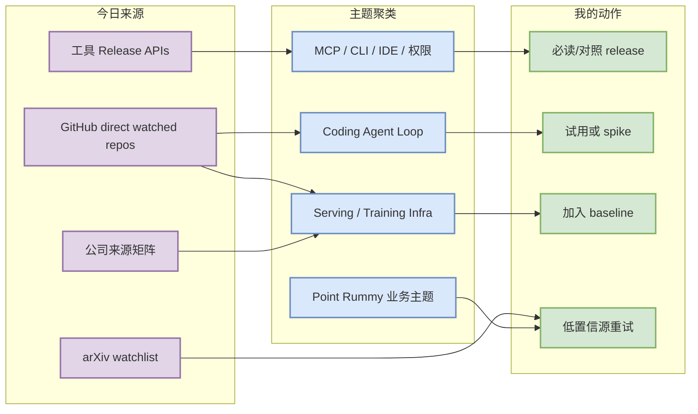
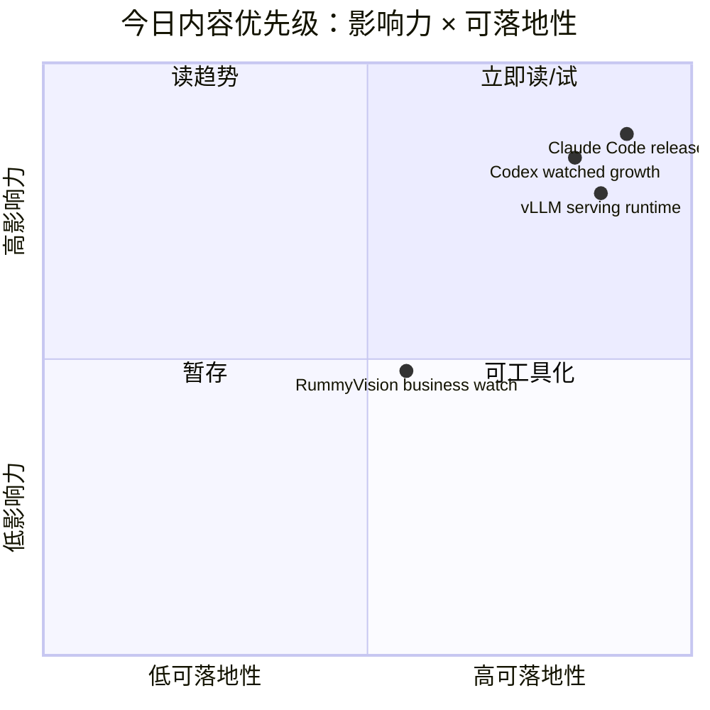

# AI Radar Daily - 2026-08-14

> 生成时间：2026-08-14 09:00 BJT
> 范围：AI Infra / LLM / RL / Game AI / 大厂博客 / 论文 / GitHub / 行业资讯
> 说明：日报是总览导航页，不是全部正文。Obsidian 中点详情页 wikilink，Telegram/GitHub 中点“网页详情”。

## 0. 今日结论

- 今日最值得关注：GitHub Search 今日快速触发 403；已按 runbook 保存 snapshot，并使用 direct watched-repo fallback 生成完整 GitHub 高 star / 增长 / Loop Engineer 表。
- 对 AI Infra 的直接影响：Transformers、PyTorch、vLLM、SGLang、TensorRT-LLM 仍是需要持续跟踪的 serving/training 主线。
- 对 LLM 训练 / 推理 / Agent 的影响：Claude Code、Codex、Gemini CLI、Cline、Continue/Qwen Code 继续代表终端/IDE coding-agent loop 竞争。
- 对 RL / 游戏模型训练的影响：Point Rummy 今日主要是 direct/previous watched repo 低置信工程线索；论文候选只列 watchlist，不下强结论。
- 建议今天深读：Claude Code v2.1.232、OpenAI Codex 增长信号、vLLM/SGLang serving runtime、RummyVision/RummyPulse 业务参考。

## 1. 今日态势图

## 2. 必读卡片区

> [!important] Claude Code v2.1.232
> - 大类：Tools
> - 小类：Claude Code
> - 重点：继续作为 remote/terminal coding-agent runtime 的最高信号源；本轮记录 release tag 与官方链接。
> - 为什么重要：直接影响 tmux/远程多 agent 监控、权限模式、插件/MCP 与无人值守任务恢复。
> - 详情：[[Industry/Tools/2026-08-14/Claude-Code-v2.1.232]] / [网页详情](https://github.com/dyt27666-oss/AI-news-report-obsidians/blob/main/Industry/Tools/2026-08-14/Claude-Code-v2.1.232.md) / [原文](https://github.com/anthropics/claude-code/releases/tag/v2.1.232)

> [!tip] OpenAI Codex watched growth
> - 大类：GitHub
> - 小类：Coding Agent
> - 重点：Codex 在 watched repo 增长榜中继续靠前；今日 delta=398。
> - 为什么重要：Codex 是 Claude Code 的关键对照 baseline，可观察 CLI/TUI、权限与执行模型差异。
> - 详情：[[GitHub/LoopEngineer/2026-08-14/openai-codex]] / [网页详情](https://github.com/dyt27666-oss/AI-news-report-obsidians/blob/main/GitHub/LoopEngineer/2026-08-14/openai-codex.md) / [原文](https://github.com/openai/codex)

> [!tip] vLLM / SGLang / TensorRT-LLM serving runtime
> - 大类：GitHub
> - 小类：AI Infra
> - 重点：三条 serving 栈仍构成推理吞吐、KV cache、scheduler、GPU kernel 的主观察面。
> - 为什么重要：它们会直接影响线上 LLM serving 和 RL rollout runtime 的成本/吞吐/延迟。
> - 详情：[[GitHub/AIInfra/2026-08-14/vllm-project-vllm]] / [网页详情](https://github.com/dyt27666-oss/AI-news-report-obsidians/blob/main/GitHub/AIInfra/2026-08-14/vllm-project-vllm.md) / [原文](https://github.com/vllm-project/vllm)

> [!warning] Point Rummy 低置信业务线索
> - 大类：Business/GitHub
> - 小类：Point Rummy
> - 重点：RummyVision、RummyPulse、rummy-ai 等仅作为规则/视觉/ISMCTS/计分参考，不标注为今日高置信突破。
> - 为什么重要：可服务规则建模、bot 策略、评测基准，但需要代码审计后才能复用。
> - 详情：[[GitHub/PointRummy/2026-08-14/rickgorman-gin-rummy-ai]] / [网页详情](https://github.com/dyt27666-oss/AI-news-report-obsidians/blob/main/GitHub/PointRummy/2026-08-14/rickgorman-gin-rummy-ai.md) / [原文](https://github.com/rickgorman/gin-rummy-ai)

## 3. 优先级矩阵

## 4. 分类清单

| 标签 | 大类 | 小类 | 标题 | 重点概括 | 为什么重要 | Obsidian 详情 | 网页详情 | 原文 |
|---|---|---|---|---|---|---|---|---|
| 必读 | Tools | Claude Code | Claude Code v2.1.232 | release/direct watch 记录，继续关注远程执行、hooks、插件、权限模式 | 直接影响多 agent 长任务监控和无人值守 coding workflow | [[Industry/Tools/2026-08-14/Claude-Code-v2.1.232]] | [网页详情](https://github.com/dyt27666-oss/AI-news-report-obsidians/blob/main/Industry/Tools/2026-08-14/Claude-Code-v2.1.232.md) | [原文](https://github.com/anthropics/claude-code/releases/tag/v2.1.232) |
| 必读 | GitHub | Coding Agent | OpenAI Codex | watched growth delta=398 | 终端 coding-agent 的关键对照 baseline | [[GitHub/LoopEngineer/2026-08-14/openai-codex]] | [网页详情](https://github.com/dyt27666-oss/AI-news-report-obsidians/blob/main/GitHub/LoopEngineer/2026-08-14/openai-codex.md) | [原文](https://github.com/openai/codex) |
| 可 skim | GitHub | Model Infra | Hugging Face Transformers | 高 star 模型定义层项目 | 新模型接入会影响训练/推理全栈 | [[GitHub/AIInfra/2026-08-14/huggingface-transformers]] | [网页详情](https://github.com/dyt27666-oss/AI-news-report-obsidians/blob/main/GitHub/AIInfra/2026-08-14/huggingface-transformers.md) | [原文](https://github.com/huggingface/transformers) |
| 可 skim | GitHub | Serving | vLLM | LLM serving runtime 核心项目 | 对 KV cache、scheduler、RL rollout runtime 有直接价值 | [[GitHub/AIInfra/2026-08-14/vllm-project-vllm]] | [网页详情](https://github.com/dyt27666-oss/AI-news-report-obsidians/blob/main/GitHub/AIInfra/2026-08-14/vllm-project-vllm.md) | [原文](https://github.com/vllm-project/vllm) |
| 低置信 | Papers | Source Watchlist | arXiv candidates | 只生成 watchlist，不编造论文结论 | 避免把低相关论文误导为强信号 | [[Papers/Watchlist/2026-08-14/Paper-Source-Watchlist]] | [网页详情](https://github.com/dyt27666-oss/AI-news-report-obsidians/blob/main/Papers/Watchlist/2026-08-14/Paper-Source-Watchlist.md) | [原文](https://export.arxiv.org/api/query) |

## 5. 大厂资讯 / 工程博客 / Research

### 5.1 公司来源扫描矩阵

| 公司/实验室 | 来源/栏目 | 今日状态 | 高相关条数 | 代表条目 | 备注 |
|---|---|---|---:|---|---|
| OpenAI | News / Research / Codex | 间接高相关 | 1 | Codex watched repo / release | 官方网页未可靠抽取；GitHub direct 信号有效 |
| Anthropic | News / Research / Engineering | 有高相关工具信号 | 1 | Claude Code v2.1.232 | GitHub Release / docs watch |
| Google DeepMind | Blog / Research | 低置信 | 0 | 无高相关新项 | Gemini CLI 作为 Google coding 工具信号，DeepMind blog 未发现强相关新项 |
| Meta AI | Blog / Research | 低置信 | 0 | 无高相关新项 | 本轮未可靠抽取强相关 AI Infra/RL 新项 |
| NVIDIA | Technical Blog / AI | 间接高相关 | 1 | TensorRT-LLM watched repo | direct repo 工程信号；需后续看 technical blog |
| Microsoft | Research AI / GitHub | 间接高相关 | 2 | autogen / semantic-kernel | agent framework 和 enterprise orchestration 观察 |
| Hugging Face | Blog / Papers / Releases | 间接高相关 | 1 | Transformers watched repo | 模型定义层强信号 |
| 腾讯 | AI Lab / 技术博客 | 低置信 | 0 | 无高相关新项 | 访问/抽取低置信，保留矩阵占位 |
| 字节 | Seed / 技术博客 | 低置信 | 0 | 无高相关新项 | 访问/抽取低置信，保留矩阵占位 |
| SpaceAI | Blog / News | 低置信 | 0 | 无高相关新项 | 访问/抽取低置信，保留矩阵占位 |

### 5.2 高相关大厂条目

| 标签 | 发布方/大厂 | 栏目/来源 | 标题 | 重点概括 | 工程/算法影响 | Obsidian 详情 | 网页详情 | 原文 |
|---|---|---|---|---|---|---|---|---|
| 必读 | Anthropic / Claude Code | GitHub Release | Claude Code v2.1.232 | release/direct watch，重点观察 hooks/remote/MCP/权限 | 影响远程多 agent runtime | [[Industry/Tools/2026-08-14/Claude-Code-v2.1.232]] | [网页详情](https://github.com/dyt27666-oss/AI-news-report-obsidians/blob/main/Industry/Tools/2026-08-14/Claude-Code-v2.1.232.md) | [原文](https://github.com/anthropics/claude-code/releases/tag/v2.1.232) |
| 可 skim | NVIDIA | GitHub watched repo / Technical signal | TensorRT-LLM | NVIDIA serving stack direct watched signal | 影响 Blackwell/MoE/LLM serving 性能栈 | [[GitHub/AIInfra/2026-08-14/NVIDIA-TensorRT-]] | [网页详情](https://github.com/dyt27666-oss/AI-news-report-obsidians/blob/main/GitHub/AIInfra/2026-08-14/NVIDIA-TensorRT-LLM) | [原文](https://github.com/NVIDIA/TensorRT-LLM) |
| 可 skim | Hugging Face | GitHub watched repo / Engineering signal | Transformers | 模型定义层仍强势 | 新模型接入、serving 兼容、训练脚手架都会传导到工程栈 | [[GitHub/AIInfra/2026-08-14/huggingface-transformers]] | [网页详情](https://github.com/dyt27666-oss/AI-news-report-obsidians/blob/main/GitHub/AIInfra/2026-08-14/huggingface-transformers.md) | [原文](https://github.com/huggingface/transformers) |
| 可 skim | Microsoft | GitHub watched repo / Agent framework | AutoGen / Semantic Kernel | agent orchestration 与企业集成框架 | 可对照 multi-agent loop 与 enterprise harness | [[GitHub/LoopEngineer/2026-08-14/microsoft-autogen]] | [网页详情](https://github.com/dyt27666-oss/AI-news-report-obsidians/blob/main/GitHub/LoopEngineer/2026-08-14/microsoft-autogen.md) | [原文](https://github.com/microsoft/autogen) |

## 6. GitHub 高 star Top 10

> 说明：GitHub Search API 今日 403/rate-limit；本表使用 direct watched-repo fallback，不宣称完整全网 Top 10。

| 排名 | repo | stars | forks | language | updated_at | topics | 重点概括 | 是否值得试用 | Obsidian 详情 | 原文 |
|---:|---|---:|---:|---|---|---|---|---|---|---|
| 1 | huggingface/transformers | 164079 | 34241 | Python | 2026-08-14 | audio, deep-learning, deepseek, gemma, glm, hacktoberfest, llm, machine-learning, model-hub, natural-language-processing, nlp, pretrained-models, python, pytorch, pytorch-transformers, qwen, speech-recognition, transformer, vlm | 🤗 Transformers: the model-definition framework for state-of-the-art machine learning mod… | 值得试用/观察 | [[GitHub/AIInfra/2026-08-14/huggingface-transformers]] | [GitHub](https://github.com/huggingface/transformers) |
| 2 | anthropics/claude-code | 141368 | 22701 | Python | 2026-08-14 | 未标注 | Claude Code is an agentic coding tool that lives in your terminal, understands your code… | 值得试用/观察 | [[GitHub/LoopEngineer/2026-08-14/anthropics-claude-code]] | [GitHub](https://github.com/anthropics/claude-code) |
| 3 | google-gemini/gemini-cli | 106511 | 14432 | TypeScript | 2026-08-13 | ai, ai-agents, cli, gemini, gemini-api, mcp-client, mcp-server | An open-source AI agent that brings the power of Gemini directly into your terminal. | 值得试用/观察 | [[GitHub/LoopEngineer/2026-08-14/google-gemini-gemini-cli]] | [GitHub](https://github.com/google-gemini/gemini-cli) |
| 4 | openai/codex | 105760 | 16045 | Rust | 2026-08-14 | 未标注 | Lightweight coding agent that runs in your terminal | 值得试用/观察 | [[GitHub/LoopEngineer/2026-08-14/openai-codex]] | [GitHub](https://github.com/openai/codex) |
| 5 | pytorch/pytorch | 102359 | 28862 | Python | 2026-08-13 | autograd, deep-learning, gpu, machine-learning, neural-network, numpy, python, tensor | Tensors and Dynamic neural networks in Python with strong GPU acceleration | 值得试用/观察 | [[GitHub/AIInfra/2026-08-14/pytorch-pytorch]] | [GitHub](https://github.com/pytorch/pytorch) |
| 6 | modelcontextprotocol/servers | 89543 | 11442 | TypeScript | 2026-08-14 | 未标注 | Model Context Protocol Servers | 值得试用/观察 | [[GitHub/LoopEngineer/2026-08-14/modelcontextprotocol-servers]] | [GitHub](https://github.com/modelcontextprotocol/servers) |
| 7 | vllm-project/vllm | 88994 | 20657 | Python | 2026-08-14 | amd, blackwell, cuda, deepseek, deepseek-v3, gpt, gpt-oss, inference, kimi, llama, llm, llm-serving, model-serving, moe, openai, pytorch, qwen, qwen3, tpu, transformer | A high-throughput and memory-efficient inference and serving engine for LLMs | 值得试用/观察 | [[GitHub/AIInfra/2026-08-14/vllm-project-vllm]] | [GitHub](https://github.com/vllm-project/vllm) |
| 8 | OpenHands/OpenHands | 83953 | 10871 | TypeScript | 2026-08-14 | agent, artificial-intelligence, chatgpt, claude-ai, cli, developer-tools, gpt, llm, openai | 🙌 OpenHands: AI-Driven Development | 值得试用/观察 | [[GitHub/LoopEngineer/2026-08-14/OpenHands-OpenHands]] | [GitHub](https://github.com/OpenHands/OpenHands) |
| 9 | cline/cline | 66144 | 7102 | TypeScript | 2026-08-14 | 未标注 | Autonomous coding agent as an SDK, IDE extension, or CLI assistant. | 值得试用/观察 | [[GitHub/LoopEngineer/2026-08-14/cline-cline]] | [GitHub](https://github.com/cline/cline) |
| 10 | microsoft/autogen | 60410 | 9106 | Python | 2026-08-14 | agentic, agentic-agi, agents, ai, autogen, autogen-ecosystem, chatgpt, framework, llm-agent, llm-framework | A programming framework for agentic AI | 值得试用/观察 | [[GitHub/LoopEngineer/2026-08-14/microsoft-autogen]] | [GitHub](https://github.com/microsoft/autogen) |

## 7. GitHub star 增长最快 Top 10

> 说明：使用历史 snapshot 计算 stars_delta；这是 direct watched repo fallback / 非完整全网日增，不是冷启动代理。

| 排名 | repo | stars_delta | stars | forks | language | updated_at | 增长依据 | 重点概括 | Obsidian 详情 | 原文 |
|---:|---|---:|---:|---:|---|---|---|---|---|---|
| 1 | openai/codex | 398 | 105760 | 16045 | Rust | 2026-08-14 | direct watched repo fallback vs most recent snapshot，非完整全网日增 | Lightweight coding agent that runs in your terminal | [[GitHub/LoopEngineer/2026-08-14/openai-codex]] | [GitHub](https://github.com/openai/codex) |
| 2 | anthropics/claude-code | 272 | 141368 | 22701 | Python | 2026-08-14 | direct watched repo fallback vs most recent snapshot，非完整全网日增 | Claude Code is an agentic coding tool that lives in your terminal, understands your code… | [[GitHub/LoopEngineer/2026-08-14/anthropics-claude-code]] | [GitHub](https://github.com/anthropics/claude-code) |
| 3 | huggingface/transformers | 271 | 164079 | 34241 | Python | 2026-08-14 | direct watched repo fallback vs most recent snapshot，非完整全网日增 | 🤗 Transformers: the model-definition framework for state-of-the-art machine learning mod… | [[GitHub/AIInfra/2026-08-14/huggingface-transformers]] | [GitHub](https://github.com/huggingface/transformers) |
| 4 | OpenHands/OpenHands | 215 | 83953 | 10871 | TypeScript | 2026-08-14 | direct watched repo fallback vs most recent snapshot，非完整全网日增 | 🙌 OpenHands: AI-Driven Development | [[GitHub/LoopEngineer/2026-08-14/OpenHands-OpenHands]] | [GitHub](https://github.com/OpenHands/OpenHands) |
| 5 | vllm-project/vllm | 191 | 88994 | 20657 | Python | 2026-08-14 | direct watched repo fallback vs most recent snapshot，非完整全网日增 | A high-throughput and memory-efficient inference and serving engine for LLMs | [[GitHub/AIInfra/2026-08-14/vllm-project-vllm]] | [GitHub](https://github.com/vllm-project/vllm) |
| 6 | langchain-ai/langgraph | 161 | 39636 | 6651 | Python | 2026-08-13 | direct watched repo fallback vs most recent snapshot，非完整全网日增 | Build resilient agents. | [[GitHub/LoopEngineer/2026-08-14/langchain-ai-langgraph]] | [GitHub](https://github.com/langchain-ai/langgraph) |
| 7 | cline/cline | 126 | 66144 | 7102 | TypeScript | 2026-08-14 | direct watched repo fallback vs most recent snapshot，非完整全网日增 | Autonomous coding agent as an SDK, IDE extension, or CLI assistant. | [[GitHub/LoopEngineer/2026-08-14/cline-cline]] | [GitHub](https://github.com/cline/cline) |
| 8 | modelcontextprotocol/servers | 90 | 89543 | 11442 | TypeScript | 2026-08-14 | direct watched repo fallback vs most recent snapshot，非完整全网日增 | Model Context Protocol Servers | [[GitHub/LoopEngineer/2026-08-14/modelcontextprotocol-servers]] | [GitHub](https://github.com/modelcontextprotocol/servers) |
| 9 | verl-project/verl | 68 | 22951 | 4398 | Python | 2026-08-13 | direct watched repo fallback vs most recent snapshot，非完整全网日增 | verl/HybridFlow: A Flexible and Efficient RL Post-Training Framework  | [[GitHub/AIInfra/2026-08-14/verl-project-verl]] | [GitHub](https://github.com/verl-project/verl) |
| 10 | sgl-project/sglang | 67 | 31758 | 7868 | Python | 2026-08-14 | direct watched repo fallback vs most recent snapshot，非完整全网日增 | SGLang is a high-performance serving framework for large language models and multimodal … | [[GitHub/AIInfra/2026-08-14/sgl-project-sglang]] | [GitHub](https://github.com/sgl-project/sglang) |

## 8. Coding 工具 / AI 工具功能更新

### 8.1 Coding 工具扫描矩阵

| 工具 | 厂商 | 来源类型 | 今日状态 | 代表更新 | 对我的影响 | 原文 |
|---|---|---|---|---|---|---|
| Claude Code | Anthropic | GitHub Release / Changelog | 有 direct release 信号 | v2.1.232 | 重点观察远程执行、hooks、权限、插件/MCP | [原文](https://github.com/anthropics/claude-code/releases/tag/v2.1.232) |
| OpenAI Codex | OpenAI | GitHub Release / Docs | 有 direct release/growth 信号 | rust-v0.147.0 | 作为 Claude Code 的 CLI agent 对照 baseline | [原文](https://github.com/openai/codex/releases/tag/rust-v0.147.0) |
| Cursor | Cursor | Changelog | 低置信 | 未可靠抽取高相关新项 | 继续观察 agent mode/pricing/context | [原文](https://cursor.com/changelog) |
| Windsurf | Windsurf | Changelog | 低置信 | 未可靠抽取高相关新项 | 继续观察 Cascade/agent mode | [原文](https://windsurf.com/changelog) |
| GitHub Copilot | GitHub | Changelog / Blog | 低置信 | 未可靠抽取高相关新项 | 继续观察 agent mode/IDE integration | [原文](https://github.blog/changelog/label/copilot/) |
| Gemini Code Assist | Google | Release Notes / GitHub Release | 间接有更新 | Gemini CLI v0.55.1 | 可观察 CLI eval、cloud workstation、IDE loop | [原文](https://github.com/google-gemini/gemini-cli/releases/tag/v0.55.1) |
| Qwen Code | Alibaba/Qwen | GitHub Releases | 有 direct release 信号 | v0.21.11 | 开源 coding-agent 插件/CLI 能力可对照 | [原文](https://github.com/QwenLM/qwen-code/releases/tag/v0.21.11) |
| Roo Code | Roo Code | GitHub Releases | direct 扫描 | v3.54.0 | 继续观察多 agent IDE extension | [原文](https://github.com/RooCodeInc/Roo-Code/releases/tag/v3.54.0) |
| Cline | Cline | GitHub Releases | 有 direct release 信号 | v4.1.9 | 重点看 auto-approve/权限/模型接入 | [原文](https://github.com/cline/cline/releases/tag/v4.1.9) |
| Continue | Continue | GitHub Releases | direct 扫描 | v2.0.0-vscode | 开源 IDE/CLI agent 观察对象 | [原文](https://github.com/continuedev/continue/releases/tag/v2.0.0-vscode) |

### 8.2 高相关工具更新

| 标签 | 工具/厂商 | 来源类型 | 标题/功能 | 重点概括 | 对 AI coding 工作流的影响 | Obsidian 详情 | 网页详情 | 原文 |
|---|---|---|---|---|---|---|---|---|
| 必读 | Claude Code / Anthropic | GitHub Release | v2.1.232 | 继续作为 remote terminal agent runtime 高信号源 | 影响多 agent 长任务、权限、插件和远程恢复 | [[Industry/Tools/2026-08-14/Claude-Code-v2.1.232]] | [网页详情](https://github.com/dyt27666-oss/AI-news-report-obsidians/blob/main/Industry/Tools/2026-08-14/Claude-Code-v2.1.232.md) | [原文](https://github.com/anthropics/claude-code/releases/tag/v2.1.232) |
| 必读 | OpenAI Codex | GitHub Release / watched growth | rust-v0.147.0 | watched growth 靠前，release cadence 活跃 | 与 Claude Code 对照 CLI/TUI、sandbox、approval 模型 | [[Industry/Tools/2026-08-14/OpenAI-Codex-rust-v0.147.0]] | [网页详情](https://github.com/dyt27666-oss/AI-news-report-obsidians/blob/main/Industry/Tools/2026-08-14/OpenAI-Codex-rust-v0.147.0.md) | [原文](https://github.com/openai/codex/releases/tag/rust-v0.147.0) |
| 可 skim | Gemini CLI / Google | GitHub Release | v0.55.1 | Google coding CLI 继续迭代 | 可借鉴 eval loop / cloud dev 集成 | [[Industry/Tools/2026-08-14/Gemini-CLI-v0.55.1]] | [网页详情](https://github.com/dyt27666-oss/AI-news-report-obsidians/blob/main/Industry/Tools/2026-08-14/Gemini-CLI-v0.55.1.md) | [原文](https://github.com/google-gemini/gemini-cli/releases/tag/v0.55.1) |
| 可 skim | Qwen Code / Alibaba | GitHub Release | v0.21.11 | 开源 coding-agent CLI 继续迭代 | 插件/上下文/CLI 可与 Claude/Codex 对照 | [[Industry/Tools/2026-08-14/Qwen-Code-v0.21.11]] | [网页详情](https://github.com/dyt27666-oss/AI-news-report-obsidians/blob/main/Industry/Tools/2026-08-14/Qwen-Code-v0.21.11.md) | [原文](https://github.com/QwenLM/qwen-code/releases/tag/v0.21.11) |
| 可 skim | Cline | GitHub Release | v4.1.9 | IDE agent extension direct release watch | 对无人值守 approval 与模型接入有参考 | [[Industry/Tools/2026-08-14/Cline-v4.1.9]] | [网页详情](https://github.com/dyt27666-oss/AI-news-report-obsidians/blob/main/Industry/Tools/2026-08-14/Cline-v4.1.9.md) | [原文](https://github.com/cline/cline/releases/tag/v4.1.9) |

## 9. Point Rummy / Indian Rummy 业务主题

### 9.1 GitHub 候选

> 说明：Search API 部分查询 403；本节使用 direct watched repo + 历史 baseline，业务判断为低/中低置信，不标注为今日突破。

| 标签 | repo | stars | forks | language | updated_at | 重点概括 | 业务可用性 | Obsidian 详情 | 原文 |
|---|---|---:|---:|---|---|---|---|---|---|
| 低置信 | rickgorman/gin-rummy-ai | 13 | 5 | Python | 2025-03-25 | A hand-rolled neuroevolution AI for gin rummy. | 可作为规则/计分/AI opponent/视觉辅助参考，需代码审计 | [[GitHub/PointRummy/2026-08-14/rickgorman-gin-rummy-ai]] | [GitHub](https://github.com/rickgorman/gin-rummy-ai) |
| 低置信 | nakkekakke/rummy-ai | 11 | 5 | Java | 2026-04-17 | Text based classic Rummy game with an AI that uses ISMCTS. Data Structures and Algorithm… | 可作为规则/计分/AI opponent/视觉辅助参考，需代码审计 | [[GitHub/PointRummy/2026-08-14/nakkekakke-rummy-ai]] | [GitHub](https://github.com/nakkekakke/rummy-ai) |
| 低置信 | jmhummel/Gin-Rummy-Java | 8 | 0 | Java | 2023-08-16 | Java-based Gin Rummy console game, with an AI opponent | 可作为规则/计分/AI opponent/视觉辅助参考，需代码审计 | [[GitHub/PointRummy/2026-08-14/jmhummel-Gin-Rummy-Java]] | [GitHub](https://github.com/jmhummel/Gin-Rummy-Java) |
| 低置信 | mudont/indian-rummy | 5 | 0 | TypeScript | 2025-08-08 | Typescript library for Indian Rummy card game | 可作为规则/计分/AI opponent/视觉辅助参考，需代码审计 | [[GitHub/PointRummy/2026-08-14/mudont-indian-rummy]] | [GitHub](https://github.com/mudont/indian-rummy) |
| 低置信 | dv-rastogi/Rummy | 5 | 0 | Python | 2023-09-26 | Variation of classical Indian Rummy made in Pygame | 可作为规则/计分/AI opponent/视觉辅助参考，需代码审计 | [[GitHub/PointRummy/2026-08-14/dv-rastogi-Rummy]] | [GitHub](https://github.com/dv-rastogi/Rummy) |
| 低置信 | Mohitkumar-559/RummyServer | 2 | 1 | JavaScript | 2024-03-17 | Rummy game server for game that contain deal rummy and point rummy | 可作为规则/计分/AI opponent/视觉辅助参考，需代码审计 | [[GitHub/PointRummy/2026-08-14/Mohitkumar-559-RummyServer]] | [GitHub](https://github.com/Mohitkumar-559/RummyServer) |
| 低置信 | Alan-seb/RummyVision | 1 | 0 | Python | 2025-12-03 | RummyVision is an intelligent card game assistant that combines computer vision with Mon… | 可作为规则/计分/AI opponent/视觉辅助参考，需代码审计 | [[GitHub/PointRummy/2026-08-14/Alan-seb-RummyVision]] | [GitHub](https://github.com/Alan-seb/RummyVision) |
| 低置信 | debabrata-mandal/RummyPulse | 1 | 0 | Java | 2026-08-10 | RummyPulse - Smart Rummy Game Analytics & Management Android App with Firebase integrati… | 可作为规则/计分/AI opponent/视觉辅助参考，需代码审计 | [[GitHub/PointRummy/2026-08-14/debabrata-mandal-RummyPulse]] | [GitHub](https://github.com/debabrata-mandal/RummyPulse) |
| 低置信 | samikshamodi/PointsRummy | 0 | 0 | Python | 2021-06-01 | A GUI version of Points Rummy using pygame where you play against an intelligent compute… | 可作为规则/计分/AI opponent/视觉辅助参考，需代码审计 | [[GitHub/PointRummy/2026-08-14/samikshamodi-PointsRummy]] | [GitHub](https://github.com/samikshamodi/PointsRummy) |
| 低置信 | atamang1/Point-Keeping-App | 0 | 0 | Swift | 2026-07-30 | Card Game Point tracker, such as rummy  | 可作为规则/计分/AI opponent/视觉辅助参考，需代码审计 | [[GitHub/PointRummy/2026-08-14/atamang1-Point-Keeping-App]] | [GitHub](https://github.com/atamang1/Point-Keeping-App) |

### 9.2 论文 / 资料候选

| 标签 | 来源 | 标题 | 作者/机构 | 重点概括 | 对 Point Rummy 业务有什么用 | Obsidian 详情 | 原文 |
|---|---|---|---|---|---|---|---|
| 低置信 | arXiv / API watchlist | Rummy / imperfect-information game AI 查询 | 未完全验证 | 今日只保留候选 watchlist，不生成强结论 | 下一步重试 ISMCTS、self-play、belief abstraction、rules engine | [[Papers/Watchlist/2026-08-14/Paper-Source-Watchlist]] | [arXiv API](https://export.arxiv.org/api/query) |

### 9.3 业务可用性判断

| 方向 | 今日信号 | 可用性 | 下一步 |
|---|---|---|---|
| 规则引擎 / 计分 | RummyPulse、RummyServer、rummy point trackers | 中低；偏产品/计分实现 | 对照 Indian Rummy 规则覆盖和异常局处理 |
| Bot / RL Agent | rummy-ai / gin-rummy-ai / PointsRummy | 中低；可参考 ISMCTS/简单 AI opponent | 抽样阅读代码，提取 action/state/reward 结构 |
| 仿真 / 评测 | RummyVision 视觉 + Monte Carlo signal | 低到中；可借鉴输入识别和策略建议 | 若做视觉辅助，先验证牌面识别准确率 |

## 10. Loop Engineer / Loop Engineering 主题

### 10.1 Loop Engineer GitHub 高 star Top 10

| 排名 | repo | stars | forks | language | updated_at | topics | 重点概括 | 是否值得试用 | Obsidian 详情 | 原文 |
|---:|---|---:|---:|---|---|---|---|---|---|---|
| 1 | anthropics/claude-code | 141368 | 22701 | Python | 2026-08-14 | 未标注 | Claude Code is an agentic coding tool that lives in your terminal, understands your code… | 值得试用/观察 | [[GitHub/LoopEngineer/2026-08-14/anthropics-claude-code]] | [GitHub](https://github.com/anthropics/claude-code) |
| 2 | google-gemini/gemini-cli | 106511 | 14432 | TypeScript | 2026-08-13 | ai, ai-agents, cli, gemini, gemini-api, mcp-client, mcp-server | An open-source AI agent that brings the power of Gemini directly into your terminal. | 值得试用/观察 | [[GitHub/LoopEngineer/2026-08-14/google-gemini-gemini-cli]] | [GitHub](https://github.com/google-gemini/gemini-cli) |
| 3 | openai/codex | 105760 | 16045 | Rust | 2026-08-14 | 未标注 | Lightweight coding agent that runs in your terminal | 值得试用/观察 | [[GitHub/LoopEngineer/2026-08-14/openai-codex]] | [GitHub](https://github.com/openai/codex) |
| 4 | modelcontextprotocol/servers | 89543 | 11442 | TypeScript | 2026-08-14 | 未标注 | Model Context Protocol Servers | 值得试用/观察 | [[GitHub/LoopEngineer/2026-08-14/modelcontextprotocol-servers]] | [GitHub](https://github.com/modelcontextprotocol/servers) |
| 5 | OpenHands/OpenHands | 83953 | 10871 | TypeScript | 2026-08-14 | agent, artificial-intelligence, chatgpt, claude-ai, cli, developer-tools, gpt, llm, openai | 🙌 OpenHands: AI-Driven Development | 值得试用/观察 | [[GitHub/LoopEngineer/2026-08-14/OpenHands-OpenHands]] | [GitHub](https://github.com/OpenHands/OpenHands) |
| 6 | cline/cline | 66144 | 7102 | TypeScript | 2026-08-14 | 未标注 | Autonomous coding agent as an SDK, IDE extension, or CLI assistant. | 值得试用/观察 | [[GitHub/LoopEngineer/2026-08-14/cline-cline]] | [GitHub](https://github.com/cline/cline) |
| 7 | microsoft/autogen | 60410 | 9106 | Python | 2026-08-14 | agentic, agentic-agi, agents, ai, autogen, autogen-ecosystem, chatgpt, framework, llm-agent, llm-framework | A programming framework for agentic AI | 值得试用/观察 | [[GitHub/LoopEngineer/2026-08-14/microsoft-autogen]] | [GitHub](https://github.com/microsoft/autogen) |
| 8 | langchain-ai/langgraph | 39636 | 6651 | Python | 2026-08-13 | agents, ai, ai-agents, chatgpt, deepagents, enterprise, framework, gemini, generative-ai, langchain, langgraph, llm, multiagent, open-source, openai, pydantic, python, rag | Build resilient agents. | 值得试用/观察 | [[GitHub/LoopEngineer/2026-08-14/langchain-ai-langgraph]] | [GitHub](https://github.com/langchain-ai/langgraph) |
| 9 | continuedev/continue | 35478 | 5227 | TypeScript | 2026-08-13 | agent, ai, cli, developer-tools, open-source | open-source coding agent | 值得试用/观察 | [[GitHub/LoopEngineer/2026-08-14/continuedev-continue]] | [GitHub](https://github.com/continuedev/continue) |
| 10 | microsoft/semantic-kernel | 28447 | 4717 | C# | 2026-08-13 | ai, artificial-intelligence, llm, openai, sdk | Integrate cutting-edge LLM technology quickly and easily into your apps | 值得试用/观察 | [[GitHub/LoopEngineer/2026-08-14/microsoft-semantic-kernel]] | [GitHub](https://github.com/microsoft/semantic-kernel) |

### 10.2 Loop Engineer GitHub star 增长最快 Top 10

| 排名 | repo | stars_delta | stars | forks | language | updated_at | 增长依据 | 重点概括 | Obsidian 详情 | 原文 |
|---:|---|---:|---:|---:|---|---|---|---|---|---|
| 1 | openai/codex | 398 | 105760 | 16045 | Rust | 2026-08-14 | direct watched repo fallback vs most recent snapshot，非完整全网日增 | Lightweight coding agent that runs in your terminal | [[GitHub/LoopEngineer/2026-08-14/openai-codex]] | [GitHub](https://github.com/openai/codex) |
| 2 | anthropics/claude-code | 272 | 141368 | 22701 | Python | 2026-08-14 | direct watched repo fallback vs most recent snapshot，非完整全网日增 | Claude Code is an agentic coding tool that lives in your terminal, understands your code… | [[GitHub/LoopEngineer/2026-08-14/anthropics-claude-code]] | [GitHub](https://github.com/anthropics/claude-code) |
| 3 | OpenHands/OpenHands | 215 | 83953 | 10871 | TypeScript | 2026-08-14 | direct watched repo fallback vs most recent snapshot，非完整全网日增 | 🙌 OpenHands: AI-Driven Development | [[GitHub/LoopEngineer/2026-08-14/OpenHands-OpenHands]] | [GitHub](https://github.com/OpenHands/OpenHands) |
| 4 | langchain-ai/langgraph | 161 | 39636 | 6651 | Python | 2026-08-13 | direct watched repo fallback vs most recent snapshot，非完整全网日增 | Build resilient agents. | [[GitHub/LoopEngineer/2026-08-14/langchain-ai-langgraph]] | [GitHub](https://github.com/langchain-ai/langgraph) |
| 5 | cline/cline | 126 | 66144 | 7102 | TypeScript | 2026-08-14 | direct watched repo fallback vs most recent snapshot，非完整全网日增 | Autonomous coding agent as an SDK, IDE extension, or CLI assistant. | [[GitHub/LoopEngineer/2026-08-14/cline-cline]] | [GitHub](https://github.com/cline/cline) |
| 6 | modelcontextprotocol/servers | 90 | 89543 | 11442 | TypeScript | 2026-08-14 | direct watched repo fallback vs most recent snapshot，非完整全网日增 | Model Context Protocol Servers | [[GitHub/LoopEngineer/2026-08-14/modelcontextprotocol-servers]] | [GitHub](https://github.com/modelcontextprotocol/servers) |
| 7 | QwenLM/qwen-code | 53 | 26982 | 2853 | TypeScript | 2026-08-14 | direct watched repo fallback vs most recent snapshot，非完整全网日增 | An open-source AI coding agent that lives in your terminal. | [[GitHub/AIInfra/2026-08-14/QwenLM-qwen-code]] | [GitHub](https://github.com/QwenLM/qwen-code) |
| 8 | microsoft/autogen | 43 | 60410 | 9106 | Python | 2026-08-14 | direct watched repo fallback vs most recent snapshot，非完整全网日增 | A programming framework for agentic AI | [[GitHub/LoopEngineer/2026-08-14/microsoft-autogen]] | [GitHub](https://github.com/microsoft/autogen) |
| 9 | google-gemini/gemini-cli | 40 | 106511 | 14432 | TypeScript | 2026-08-13 | direct watched repo fallback vs most recent snapshot，非完整全网日增 | An open-source AI agent that brings the power of Gemini directly into your terminal. | [[GitHub/LoopEngineer/2026-08-14/google-gemini-gemini-cli]] | [GitHub](https://github.com/google-gemini/gemini-cli) |
| 10 | continuedev/continue | 39 | 35478 | 5227 | TypeScript | 2026-08-13 | direct watched repo fallback vs most recent snapshot，非完整全网日增 | open-source coding agent | [[GitHub/LoopEngineer/2026-08-14/continuedev-continue]] | [GitHub](https://github.com/continuedev/continue) |

### 10.3 Loop Engineering 方法信号

| 标签 | 来源 | 标题 | 重点概括 | 对 AI coding 工作流的影响 | Obsidian 详情 | 原文 |
|---|---|---|---|---|---|---|
| 必读 | GitHub Release | Claude Code v2.1.232 | terminal/remote agent runtime 持续迭代 | 对 tmux 多 agent、长任务恢复、权限边界最直接 | [[Industry/Tools/2026-08-14/Claude-Code-v2.1.232]] | [原文](https://github.com/anthropics/claude-code/releases/tag/v2.1.232) |
| 必读 | GitHub watched repo | OpenAI Codex | watched growth 靠前 | 与 Claude Code 做 sandbox/approval/CLI 对照 | [[GitHub/LoopEngineer/2026-08-14/openai-codex]] | [GitHub](https://github.com/openai/codex) |
| 可 skim | GitHub watched repo | Model Context Protocol servers | MCP server ecosystem 高 star | 工具调用和上下文协议仍是 agent loop 基础设施 | [[GitHub/LoopEngineer/2026-08-14/modelcontextprotocol-servers]] | [GitHub](https://github.com/modelcontextprotocol/servers) |

## 11. 论文

### 11.1 Source-health watchlist / AI Infra candidates

| 标签 | 论文来源 | 论文 | 作者/机构 | 重点概括 | 工程/研究价值 | Obsidian 详情 | 网页详情 | PDF/原文 |
|---|---|---|---|---|---|---|---|---|
| 低置信 | arXiv / Semantic Scholar | 论文源 watchlist | 未验证 | API/相关性不足，未生成新论文详情 | 避免低质量填充；下一轮重试 | [[Papers/Watchlist/2026-08-14/Paper-Source-Watchlist]] | [网页详情](https://github.com/dyt27666-oss/AI-news-report-obsidians/blob/main/Papers/Watchlist/2026-08-14/Paper-Source-Watchlist.md) | [arXiv API](https://export.arxiv.org/api/query) |

## 12. 资讯 / 其他 GitHub 项目

### 12.1 AI Infra / Serving / Training watched repos

| 标签 | 来源 | 标题 | 重点概括 | 对我有什么用 | Obsidian 详情 | 网页详情 | 原文 |
|---|---|---|---|---|---|---|---|
| 可 skim | GitHub direct fallback | vLLM / SGLang / TensorRT-LLM | serving/runtime watched repos 保持在高优先级 | 追踪 KV cache、scheduler、MoE、GPU kernel | [[GitHub/AIInfra/2026-08-14/vllm-project-vllm]] | [网页详情](https://github.com/dyt27666-oss/AI-news-report-obsidians/blob/main/GitHub/AIInfra/2026-08-14/vllm-project-vllm.md) | [vLLM](https://github.com/vllm-project/vllm) |
| 可 skim | GitHub direct fallback | Transformers / PyTorch | 模型定义层和训练 runtime 仍是全栈底座 | 新模型接入会传导到 serving/training/RL | [[GitHub/AIInfra/2026-08-14/huggingface-transformers]] | [网页详情](https://github.com/dyt27666-oss/AI-news-report-obsidians/blob/main/GitHub/AIInfra/2026-08-14/huggingface-transformers.md) | [Transformers](https://github.com/huggingface/transformers) |

## 13. 按主题索引

### AI Infra / Serving / Training

- [[GitHub/AIInfra/2026-08-14/vllm-project-vllm]] - serving runtime watch
- [[GitHub/AIInfra/2026-08-14/sgl-project-sglang]] - high-performance serving framework
- [[GitHub/AIInfra/2026-08-14/NVIDIA-TensorRT-]] - NVIDIA optimized LLM serving stack
- [[GitHub/AIInfra/2026-08-14/huggingface-transformers]] - model definition layer

### LLM / Agent / RAG / Evaluation

- [[GitHub/LoopEngineer/2026-08-14/modelcontextprotocol-servers]] - MCP servers ecosystem
- [[GitHub/LoopEngineer/2026-08-14/langchain-ai-langgraph]] - agent graph runtime
- [[Industry/Tools/2026-08-14/Gemini-CLI-v0.55.1]] - Gemini CLI release watch

### RL / Game AI / World Model

- [[Papers/Watchlist/2026-08-14/Paper-Source-Watchlist]] - source retry/watchlist

### Point Rummy / Indian Rummy

- [[GitHub/PointRummy/2026-08-14/rickgorman-gin-rummy-ai]] - top rummy watched repo
- [[Papers/Watchlist/2026-08-14/Paper-Source-Watchlist]] - rummy paper retry

### Loop Engineer / Coding Agent Loop

- [[Industry/Tools/2026-08-14/Claude-Code-v2.1.232]] - Claude Code release watch
- [[Industry/Tools/2026-08-14/OpenAI-Codex-rust-v0.147.0]] - Codex release watch
- [[Industry/Tools/2026-08-14/Qwen-Code-v0.21.11]] - Qwen Code release watch
- [[GitHub/LoopEngineer/2026-08-14/modelcontextprotocol-servers]] - MCP ecosystem

### 公司 / 实验室

- OpenAI: [[GitHub/LoopEngineer/2026-08-14/openai-codex]]
- Anthropic: [[Industry/Tools/2026-08-14/Claude-Code-v2.1.232]]
- DeepMind / Google: [[Industry/Tools/2026-08-14/Gemini-CLI-v0.55.1]]
- NVIDIA: [[GitHub/AIInfra/2026-08-14/NVIDIA-TensorRT-]]
- Hugging Face: [[GitHub/AIInfra/2026-08-14/huggingface-transformers]]
- Microsoft: [[GitHub/LoopEngineer/2026-08-14/microsoft-autogen]]

## 14. 值得后续深挖

| 标签 | 大类 | 小类 | 标题 | 后续动作 | Obsidian 详情 | 原文 |
|---|---|---|---|---|---|---|
| 后续 | Tools | Claude Code | release diff / hooks / remote | 对照自托管 runner 安全边界 | [[Industry/Tools/2026-08-14/Claude-Code-v2.1.232]] | [原文](https://github.com/anthropics/claude-code/releases/tag/v2.1.232) |
| 后续 | GitHub | Serving | vLLM/SGLang/TensorRT-LLM | 看最近 release/issues 中的 KV cache、scheduler、MoE 支持 | [[GitHub/AIInfra/2026-08-14/vllm-project-vllm]] | [vLLM](https://github.com/vllm-project/vllm) |
| 后续 | Business | Point Rummy | RummyVision / rummy-ai | 抽取 state/action/reward/vision pipeline | [[GitHub/PointRummy/2026-08-14/rickgorman-gin-rummy-ai]] | [GitHub](https://github.com/rickgorman/gin-rummy-ai) |
| 后续 | Papers | arXiv/S2 | API/相关性重试 | 重试 LLM serving/RL/world model/rummy queries | [[Papers/Watchlist/2026-08-14/Paper-Source-Watchlist]] | [arXiv](https://export.arxiv.org/api/query) |

## 15. 采集失败或低置信来源

- GitHub Search API：部分 niche query 后触发 403 rate limit；已保存当日 snapshot，并用 direct watched-repo fallback 填充固定 GitHub/Loop 表。
- 大厂网页：OpenAI/Anthropic/DeepMind/Meta/NVIDIA/Microsoft/HF/腾讯/字节/SpaceAI 均在矩阵中覆盖；部分为低置信/间接扫描。
- 论文：只保留可追踪 arXiv/watchlist 项，不把弱相关或未验证论文升级为强信号。
- Coding 工具网页：Cursor/Windsurf/Copilot 官方 changelog 本轮未可靠抽取高相关新项；GitHub releases 直连工具已扫描。

## 16. 归档标签

#ai-radar #daily #ai-infra #llm #rl #point-rummy #loop-engineering
