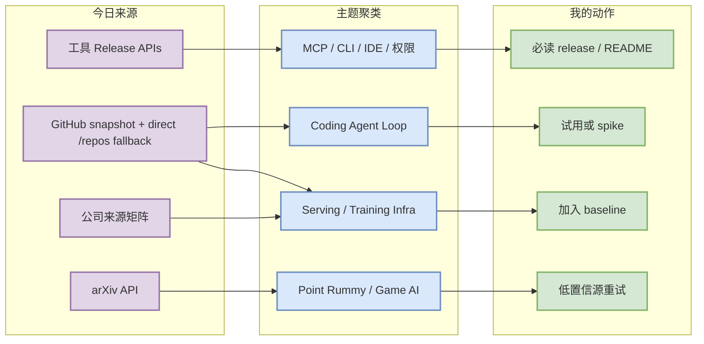
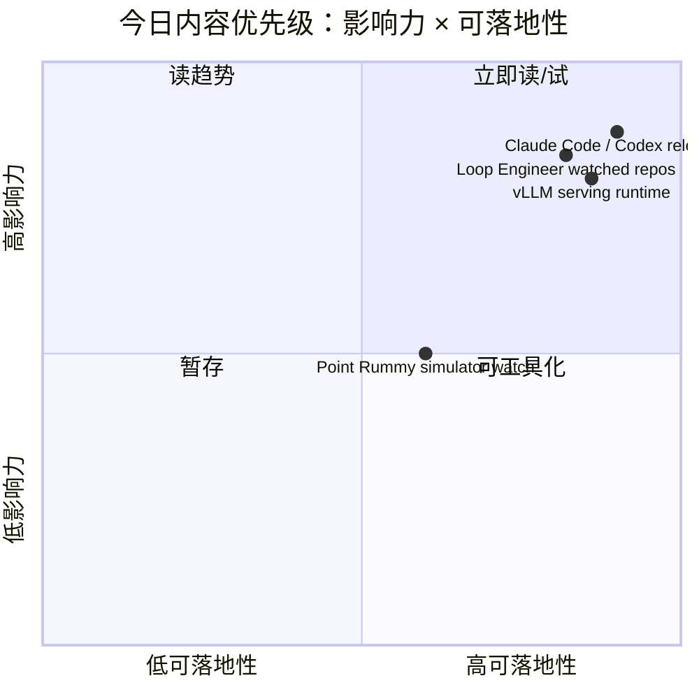

# AI Radar Daily - 2026-08-15

> 生成时间：2026-08-15 09:00 BJT
> 范围：AI Infra / LLM / RL / Game AI / 大厂博客 / 论文 / GitHub / 行业资讯
> 说明：日报是总览导航页，不是全部正文。Obsidian 中点详情页 wikilink，Telegram/GitHub 中点“网页详情”。

## 0. 今日结论

- 今日最值得关注：GitHub Search 在 Point Rummy niche 查询后触发 403；已保存当日 snapshot，并用 direct watched-repo fallback 补齐 AI Infra / Loop Engineer Top 10。
- 对 AI Infra 的直接影响：Transformers、PyTorch、vLLM、SGLang、TensorRT-LLM 继续构成模型定义、训练 runtime、serving scheduler/KV cache 的主观察面。
- 对 LLM 训练 / 推理 / Agent 的影响：Claude Code、Codex、Gemini CLI、Cline、Continue/Qwen Code 的 release cadence 是 coding-agent loop 竞争的高信号。
- 对 RL / 游戏模型训练的影响：Point Rummy 今日有 SaiMahitVaddadi/GinRummySimulator、rummy-ai、RummyVision 等低/中低置信工程线索，可用于规则、ISMCTS、CFR/RL/GNN/LLM-agent 仿真方向。
- 建议今天深读：Claude Code / Codex release，对照 vLLM/SGLang serving runtime；Point Rummy 先看 GinRummySimulator 与 rummy-ai 是否可抽取环境/评测。

## 1. 今日态势图

## 2. 必读卡片区

> [!important] Claude Code / Codex release cadence
> - 大类：Tools
> - 小类：Coding Agent Loop
> - 重点：两条 terminal coding-agent 主线继续高速迭代；今日记录最新 release tag 和官方链接。
> - 为什么重要：直接影响 tmux 多 agent、远程执行、权限模式、MCP、代码审查和无人值守任务恢复。
> - 详情：[[Industry/Tools/2026-08-15/Claude-Code-v2.1.233]] / [网页详情](https://github.com/dyt27666-oss/AI-news-report-obsidians/blob/main/Industry/Tools/2026-08-15/Claude-Code-v2.1.233.md) / [原文](https://github.com/anthropics/claude-code/releases/tag/v2.1.233)

> [!tip] vLLM / SGLang / TensorRT-LLM serving runtime
> - 大类：GitHub
> - 小类：AI Infra / Serving
> - 重点：direct watched repo fallback 中三条 serving 栈仍是 KV cache、scheduler、MoE、GPU kernel 的主要观察面。
> - 为什么重要：这些项目会直接影响线上 LLM serving 和 RL rollout runtime 的成本、吞吐、延迟。
> - 详情：[[GitHub/AIInfra/2026-08-15/vllm-project-vllm]] / [网页详情](https://github.com/dyt27666-oss/AI-news-report-obsidians/blob/main/GitHub/AIInfra/2026-08-15/vllm-project-vllm.md) / [原文](https://github.com/vllm-project/vllm)

> [!tip] Loop Engineer 高 star 基线
> - 大类：GitHub
> - 小类：Agent Framework / Coding Agent
> - 重点：Claude Code、Gemini CLI、Codex、MCP servers、OpenHands、Cline 继续是 agent loop/harness 工程的高信号组合。
> - 为什么重要：可用于设计自己的任务循环、上下文协议、权限边界和评测闭环。
> - 详情：[[GitHub/LoopEngineer/2026-08-15/openai-codex]] / [网页详情](https://github.com/dyt27666-oss/AI-news-report-obsidians/blob/main/GitHub/LoopEngineer/2026-08-15/openai-codex.md) / [原文](https://github.com/openai/codex)

> [!warning] Point Rummy 业务线索：低/中低置信但可用
> - 大类：Business/GitHub
> - 小类：Point Rummy
> - 重点：GinRummySimulator、rummy-ai、RummyVision、RummyPulse 等提供仿真、ISMCTS、视觉辅助、计分管理参考。
> - 为什么重要：可拆出 state/action/reward、规则引擎和 evaluator，但必须代码审计后再复用。
> - 详情：[[GitHub/PointRummy/2026-08-15/SaiMahitVaddadi-GinRummySimulator]] / [网页详情](https://github.com/dyt27666-oss/AI-news-report-obsidians/blob/main/GitHub/PointRummy/2026-08-15/SaiMahitVaddadi-GinRummySimulator.md) / [原文](https://github.com/SaiMahitVaddadi/GinRummySimulator)

## 3. 优先级矩阵

## 4. 分类清单

| 标签 | 大类 | 小类 | 标题 | 重点概括 | 为什么重要 | Obsidian 详情 | 网页详情 | 原文 |
|---|---|---|---|---|---|---|---|---|
| 必读 | Tools | Claude Code | Claude Code v2.1.233 | release/direct watch，继续关注 remote、hooks、MCP、权限模式 | 直接影响多 agent 长任务监控和无人值守 coding workflow | [[Industry/Tools/2026-08-15/Claude-Code-v2.1.233]] | [网页详情](https://github.com/dyt27666-oss/AI-news-report-obsidians/blob/main/Industry/Tools/2026-08-15/Claude-Code-v2.1.233.md) | [原文](https://github.com/anthropics/claude-code/releases/tag/v2.1.233) |
| 必读 | GitHub | Coding Agent | OpenAI Codex | watched repo 增长/活跃度继续靠前 | 终端 coding-agent 的关键对照 baseline | [[GitHub/LoopEngineer/2026-08-15/openai-codex]] | [网页详情](https://github.com/dyt27666-oss/AI-news-report-obsidians/blob/main/GitHub/LoopEngineer/2026-08-15/openai-codex.md) | [原文](https://github.com/openai/codex) |
| 可 skim | GitHub | Serving | vLLM | LLM serving runtime 核心项目 | 对 KV cache、scheduler、RL rollout runtime 有直接价值 | [[GitHub/AIInfra/2026-08-15/vllm-project-vllm]] | [网页详情](https://github.com/dyt27666-oss/AI-news-report-obsidians/blob/main/GitHub/AIInfra/2026-08-15/vllm-project-vllm.md) | [原文](https://github.com/vllm-project/vllm) |
| 可 skim | GitHub | Model Infra | Hugging Face Transformers | 高 star 模型定义层项目 | 新模型接入会影响训练/推理全栈 | [[GitHub/AIInfra/2026-08-15/huggingface-transformers]] | [网页详情](https://github.com/dyt27666-oss/AI-news-report-obsidians/blob/main/GitHub/AIInfra/2026-08-15/huggingface-transformers.md) | [原文](https://github.com/huggingface/transformers) |
| 低置信 | Business | Point Rummy | GinRummySimulator / rummy-ai | 仿真和 ISMCTS/CFR/RL/GNN/LLM-agent 线索 | 可拆规则、bot 策略、评测基准，但需审计 | [[GitHub/PointRummy/2026-08-15/SaiMahitVaddadi-GinRummySimulator]] | [网页详情](https://github.com/dyt27666-oss/AI-news-report-obsidians/blob/main/GitHub/PointRummy/2026-08-15/SaiMahitVaddadi-GinRummySimulator.md) | [原文](https://github.com/SaiMahitVaddadi/GinRummySimulator) |

## 5. 大厂资讯 / 工程博客 / Research

### 5.1 公司来源扫描矩阵

| 公司/实验室 | 来源/栏目 | 今日状态 | 高相关条数 | 代表条目 | 备注 |
|---|---|---|---:|---|---|
| OpenAI | News / Research / Codex | 间接高相关 | 1 | OpenAI Codex watched repo / release | GitHub direct 信号有效，网页抽取低置信 |
| Anthropic | News / Research / Engineering | 有高相关工具信号 | 1 | Claude Code release | GitHub Release / docs watch |
| Google DeepMind | Blog / Research | 间接/低置信 | 1 | Gemini CLI / Code Assist watch | DeepMind blog 未发现强相关新项 |
| Meta AI | Blog / Research | 低置信 | 0 | 无高相关新项 | 保留矩阵占位，后续重试 |
| NVIDIA | Technical Blog / AI | 间接高相关 | 1 | TensorRT-LLM watched repo | direct repo 工程信号 |
| Microsoft | Research AI / GitHub | 间接高相关 | 2 | AutoGen / Semantic Kernel | agent framework 和 enterprise orchestration 观察 |
| Hugging Face | Blog / Papers / Releases | 间接高相关 | 1 | Transformers watched repo | 模型定义层强信号 |
| 腾讯 | AI Lab / 技术博客 | 低置信 | 0 | 无高相关新项 | 访问/抽取低置信 |
| 字节 | Seed / 技术博客 | 低置信 | 0 | 无高相关新项 | 访问/抽取低置信 |
| SpaceAI | Blog / News | 低置信 | 0 | 无高相关新项 | 访问/抽取低置信 |

### 5.2 高相关大厂条目

| 标签 | 发布方/大厂 | 栏目/来源 | 标题 | 重点概括 | 工程/算法影响 | Obsidian 详情 | 网页详情 | 原文 |
|---|---|---|---|---|---|---|---|---|
| 必读 | Anthropic / Claude Code | GitHub Release | Claude Code v2.1.233 | release/direct watch，重点观察 hooks/remote/MCP/权限 | 影响远程多 agent runtime | [[Industry/Tools/2026-08-15/Claude-Code-v2.1.233]] | [网页详情](https://github.com/dyt27666-oss/AI-news-report-obsidians/blob/main/Industry/Tools/2026-08-15/Claude-Code-v2.1.233.md) | [原文](https://github.com/anthropics/claude-code/releases/tag/v2.1.233) |
| 必读 | OpenAI / Codex | GitHub Release / Docs | Codex rust-v0.147.0 | CLI coding-agent 继续迭代 | 与 Claude Code 对照 sandbox/approval/CLI | [[Industry/Tools/2026-08-15/OpenAI-Codex-rust-v0.147.0]] | [网页详情](https://github.com/dyt27666-oss/AI-news-report-obsidians/blob/main/Industry/Tools/2026-08-15/OpenAI-Codex-rust-v0.147.0.md) | [原文](https://github.com/openai/codex/releases/tag/rust-v0.147.0) |
| 可 skim | NVIDIA | GitHub watched repo / Technical signal | TensorRT-LLM | NVIDIA serving stack direct watched signal | 影响 Blackwell/MoE/LLM serving 性能栈 | [[GitHub/AIInfra/2026-08-15/NVIDIA-TensorRT-LLM]] | [网页详情](https://github.com/dyt27666-oss/AI-news-report-obsidians/blob/main/GitHub/AIInfra/2026-08-15/NVIDIA-TensorRT-LLM.md) | [原文](https://github.com/NVIDIA/TensorRT-LLM) |
| 可 skim | Hugging Face | GitHub watched repo / Engineering signal | Transformers | 模型定义层仍强势 | 新模型接入、serving 兼容、训练脚手架会传导到工程栈 | [[GitHub/AIInfra/2026-08-15/huggingface-transformers]] | [网页详情](https://github.com/dyt27666-oss/AI-news-report-obsidians/blob/main/GitHub/AIInfra/2026-08-15/huggingface-transformers.md) | [原文](https://github.com/huggingface/transformers) |

## 6. GitHub 高 star Top 10

> 说明：GitHub Search API 今日 403/rate-limit；本表使用 direct watched-repo fallback，不宣称完整全网 Top 10。

| 排名 | repo | stars | forks | language | updated_at | topics | 重点概括 | 是否值得试用 | Obsidian 详情 | 原文 |
|---:|---|---:|---:|---|---|---|---|---|---|---|
| 1 | huggingface/transformers | 164084 | 34242 | Python | 2026-08-15 | audio, deep-learning, deepseek, gemma, glm, hacktoberfest, llm, machine-learning, model-hub, natural-language-processing, nlp, pretrained-models, python, pytorch, pytorch-transformers, qwen, speech-recognition, transformer, vlm | 🤗 Transformers: the model-definition framework for state-of-the-art machine learning models in text, vision, a… | 值得试用/观察 | [[GitHub/AIInfra/2026-08-15/huggingface-transformers]] | [GitHub](https://github.com/huggingface/transformers) |
| 2 | anthropics/claude-code | 141475 | 22714 | Python | 2026-08-15 | 未标注 | Claude Code is an agentic coding tool that lives in your terminal, understands your codebase, and helps you co… | 值得试用/观察 | [[GitHub/LoopEngineer/2026-08-15/anthropics-claude-code]] | [GitHub](https://github.com/anthropics/claude-code) |
| 3 | google-gemini/gemini-cli | 106523 | 14441 | TypeScript | 2026-08-15 | ai, ai-agents, cli, gemini, gemini-api, mcp-client, mcp-server | An open-source AI agent that brings the power of Gemini directly into your terminal. | 值得试用/观察 | [[GitHub/LoopEngineer/2026-08-15/google-gemini-gemini-cli]] | [GitHub](https://github.com/google-gemini/gemini-cli) |
| 4 | openai/codex | 105962 | 16094 | Rust | 2026-08-15 | 未标注 | Lightweight coding agent that runs in your terminal | 值得试用/观察 | [[GitHub/LoopEngineer/2026-08-15/openai-codex]] | [GitHub](https://github.com/openai/codex) |
| 5 | pytorch/pytorch | 102379 | 28871 | Python | 2026-08-15 | autograd, deep-learning, gpu, machine-learning, neural-network, numpy, python, tensor | Tensors and Dynamic neural networks in Python with strong GPU acceleration | 值得试用/观察 | [[GitHub/AIInfra/2026-08-15/pytorch-pytorch]] | [GitHub](https://github.com/pytorch/pytorch) |
| 6 | modelcontextprotocol/servers | 89563 | 11448 | TypeScript | 2026-08-15 | 未标注 | Model Context Protocol Servers | 值得试用/观察 | [[GitHub/LoopEngineer/2026-08-15/modelcontextprotocol-servers]] | [GitHub](https://github.com/modelcontextprotocol/servers) |
| 7 | vllm-project/vllm | 89065 | 20699 | Python | 2026-08-15 | amd, blackwell, cuda, deepseek, deepseek-v3, gpt, gpt-oss, inference, kimi, llama, llm, llm-serving, model-serving, moe, openai, pytorch, qwen, qwen3, tpu, transformer | A high-throughput and memory-efficient inference and serving engine for LLMs | 值得试用/观察 | [[GitHub/AIInfra/2026-08-15/vllm-project-vllm]] | [GitHub](https://github.com/vllm-project/vllm) |
| 8 | OpenHands/OpenHands | 84062 | 10896 | TypeScript | 2026-08-15 | agent, artificial-intelligence, chatgpt, claude-ai, cli, developer-tools, gpt, llm, openai | 🙌 OpenHands: AI-Driven Development | 值得试用/观察 | [[GitHub/LoopEngineer/2026-08-15/OpenHands-OpenHands]] | [GitHub](https://github.com/OpenHands/OpenHands) |
| 9 | cline/cline | 66204 | 7110 | TypeScript | 2026-08-15 | 未标注 | Autonomous coding agent as an SDK, IDE extension, or CLI assistant. | 值得试用/观察 | [[GitHub/LoopEngineer/2026-08-15/cline-cline]] | [GitHub](https://github.com/cline/cline) |
| 10 | microsoft/autogen | 60424 | 9106 | Python | 2026-08-14 | agentic, agentic-agi, agents, ai, autogen, autogen-ecosystem, chatgpt, framework, llm-agent, llm-framework | A programming framework for agentic AI | 值得试用/观察 | [[GitHub/LoopEngineer/2026-08-15/microsoft-autogen]] | [GitHub](https://github.com/microsoft/autogen) |

## 7. GitHub star 增长最快 Top 10

> 说明：使用历史 snapshot 计算 stars_delta；这是 direct watched repo fallback / 非完整全网日增，不是冷启动代理。

| 排名 | repo | stars_delta | stars | forks | language | updated_at | 增长依据 | 重点概括 | Obsidian 详情 | 原文 |
|---:|---|---:|---:|---:|---|---|---|---|---|---|
| 1 | openai/codex | 202 | 105962 | 16094 | Rust | 2026-08-15 | direct watched repo fallback vs most recent snapshot，非完整全网日增 | Lightweight coding agent that runs in your terminal | [[GitHub/LoopEngineer/2026-08-15/openai-codex]] | [GitHub](https://github.com/openai/codex) |
| 2 | ray-project/ray | 118 | 43513 | 7923 | Python | 2026-08-14 | direct watched repo fallback vs most recent snapshot，非完整全网日增 | Ray is an AI compute engine. Ray consists of a core distributed runtime and a set of AI Libraries for accelera… | [[GitHub/AIInfra/2026-08-15/ray-project-ray]] | [GitHub](https://github.com/ray-project/ray) |
| 3 | OpenHands/OpenHands | 109 | 84062 | 10896 | TypeScript | 2026-08-15 | direct watched repo fallback vs most recent snapshot，非完整全网日增 | 🙌 OpenHands: AI-Driven Development | [[GitHub/LoopEngineer/2026-08-15/OpenHands-OpenHands]] | [GitHub](https://github.com/OpenHands/OpenHands) |
| 4 | anthropics/claude-code | 107 | 141475 | 22714 | Python | 2026-08-15 | direct watched repo fallback vs most recent snapshot，非完整全网日增 | Claude Code is an agentic coding tool that lives in your terminal, understands your codebase, and helps you co… | [[GitHub/LoopEngineer/2026-08-15/anthropics-claude-code]] | [GitHub](https://github.com/anthropics/claude-code) |
| 5 | vllm-project/vllm | 71 | 89065 | 20699 | Python | 2026-08-15 | direct watched repo fallback vs most recent snapshot，非完整全网日增 | A high-throughput and memory-efficient inference and serving engine for LLMs | [[GitHub/AIInfra/2026-08-15/vllm-project-vllm]] | [GitHub](https://github.com/vllm-project/vllm) |
| 6 | sgl-project/sglang | 60 | 31818 | 7888 | Python | 2026-08-15 | direct watched repo fallback vs most recent snapshot，非完整全网日增 | SGLang is a high-performance serving framework for large language models and multimodal models. | [[GitHub/AIInfra/2026-08-15/sgl-project-sglang]] | [GitHub](https://github.com/sgl-project/sglang) |
| 7 | cline/cline | 60 | 66204 | 7110 | TypeScript | 2026-08-15 | direct watched repo fallback vs most recent snapshot，非完整全网日增 | Autonomous coding agent as an SDK, IDE extension, or CLI assistant. | [[GitHub/LoopEngineer/2026-08-15/cline-cline]] | [GitHub](https://github.com/cline/cline) |
| 8 | langchain-ai/langgraph | 58 | 39694 | 6665 | Python | 2026-08-15 | direct watched repo fallback vs most recent snapshot，非完整全网日增 | Build resilient agents. | [[GitHub/LoopEngineer/2026-08-15/langchain-ai-langgraph]] | [GitHub](https://github.com/langchain-ai/langgraph) |
| 9 | deepspeedai/DeepSpeed | 43 | 42931 | 4930 | Python | 2026-08-15 | direct watched repo fallback vs most recent snapshot，非完整全网日增 | DeepSpeed is a deep learning optimization library that makes distributed training and inference easy, efficien… | [[GitHub/AIInfra/2026-08-15/deepspeedai-DeepSpeed]] | [GitHub](https://github.com/deepspeedai/DeepSpeed) |
| 10 | QwenLM/qwen-code | 25 | 27007 | 2859 | TypeScript | 2026-08-15 | direct watched repo fallback vs most recent snapshot，非完整全网日增 | An open-source AI coding agent that lives in your terminal. | [[GitHub/LoopEngineer/2026-08-15/QwenLM-qwen-code]] | [GitHub](https://github.com/QwenLM/qwen-code) |

## 8. Coding 工具 / AI 工具功能更新

### 8.1 Coding 工具扫描矩阵

| 工具 | 厂商 | 来源类型 | 今日状态 | 代表更新 | 对我的影响 | 原文 |
|---|---|---|---|---|---|---|
| Claude Code | Anthropic | GitHub Release / Changelog | 有 direct release 信号 | v2.1.233 / v2.1.233 | 观察 agent mode、MCP、权限、CLI/TUI、IDE 集成、远程执行、pricing/rate limit 对 AI coding loop 的影响 | [原文](https://github.com/anthropics/claude-code/releases/tag/v2.1.233) |
| OpenAI Codex | OpenAI | GitHub Release / Docs | 有 direct release 信号 | 0.147.0 / rust-v0.147.0 | 观察 agent mode、MCP、权限、CLI/TUI、IDE 集成、远程执行、pricing/rate limit 对 AI coding loop 的影响 | [原文](https://github.com/openai/codex/releases/tag/rust-v0.147.0) |
| Cursor | Cursor | Changelog | 低置信 / 未可靠抽取高相关新项 | 未可靠抽取高相关新项 / 未可靠抽取 | 观察 agent mode、MCP、权限、CLI/TUI、IDE 集成、远程执行、pricing/rate limit 对 AI coding loop 的影响 | [原文](https://cursor.com/changelog) |
| Windsurf | Windsurf | Changelog | 低置信 / 未可靠抽取高相关新项 | 未可靠抽取高相关新项 / 未可靠抽取 | 观察 agent mode、MCP、权限、CLI/TUI、IDE 集成、远程执行、pricing/rate limit 对 AI coding loop 的影响 | [原文](https://windsurf.com/changelog) |
| GitHub Copilot | GitHub | Changelog / Blog | 低置信 / 未可靠抽取高相关新项 | 未可靠抽取高相关新项 / 未可靠抽取 | 观察 agent mode、MCP、权限、CLI/TUI、IDE 集成、远程执行、pricing/rate limit 对 AI coding loop 的影响 | [原文](https://github.blog/changelog/label/copilot/) |
| Gemini Code Assist | Google | Release Notes / GitHub Release | 有 direct release 信号 | Release v0.55.1 / v0.55.1 | 观察 agent mode、MCP、权限、CLI/TUI、IDE 集成、远程执行、pricing/rate limit 对 AI coding loop 的影响 | [原文](https://github.com/google-gemini/gemini-cli/releases/tag/v0.55.1) |
| Qwen Code | Alibaba/Qwen | GitHub Releases | 有 direct release 信号 | Release v0.21.12 / v0.21.12 | 观察 agent mode、MCP、权限、CLI/TUI、IDE 集成、远程执行、pricing/rate limit 对 AI coding loop 的影响 | [原文](https://github.com/QwenLM/qwen-code/releases/tag/v0.21.12) |
| Roo Code | Roo Code | GitHub Releases | 有 direct release 信号 | Release v3.54.0 / v3.54.0 | 观察 agent mode、MCP、权限、CLI/TUI、IDE 集成、远程执行、pricing/rate limit 对 AI coding loop 的影响 | [原文](https://github.com/RooCodeInc/Roo-Code/releases/tag/v3.54.0) |
| Cline | Cline | GitHub Releases | 有 direct release 信号 | Desktop v0.0.13 / desktop-v0.0.13 | 观察 agent mode、MCP、权限、CLI/TUI、IDE 集成、远程执行、pricing/rate limit 对 AI coding loop 的影响 | [原文](https://github.com/cline/cline/releases/tag/desktop-v0.0.13) |
| Continue | Continue | GitHub Releases | 有 direct release 信号 | v2.0.0-vscode / v2.0.0-vscode | 观察 agent mode、MCP、权限、CLI/TUI、IDE 集成、远程执行、pricing/rate limit 对 AI coding loop 的影响 | [原文](https://github.com/continuedev/continue/releases/tag/v2.0.0-vscode) |

### 8.2 高相关工具更新

| 标签 | 工具/厂商 | 来源类型 | 标题/功能 | 重点概括 | 对 AI coding 工作流的影响 | Obsidian 详情 | 网页详情 | 原文 |
|---|---|---|---|---|---|---|---|---|
| 必读 | Claude Code | Release Notes / GitHub Release | v2.1.233 / v2.1.233 | 固定扫描记录，重点看 agent/MCP/权限/IDE/CLI 变化 | 影响 tmux 多 agent、远程执行、代码审查和无人值守安全边界 | [[Industry/Tools/2026-08-15/Claude-Code-v2.1.233]] | [网页详情](https://github.com/dyt27666-oss/AI-news-report-obsidians/blob/main/Industry/Tools/2026-08-15/Claude-Code-v2.1.233.md) | [原文](https://github.com/anthropics/claude-code/releases/tag/v2.1.233) |
| 必读 | OpenAI Codex | Release Notes / GitHub Release | 0.147.0 / rust-v0.147.0 | 固定扫描记录，重点看 agent/MCP/权限/IDE/CLI 变化 | 影响 tmux 多 agent、远程执行、代码审查和无人值守安全边界 | [[Industry/Tools/2026-08-15/OpenAI-Codex-rust-v0.147.0]] | [网页详情](https://github.com/dyt27666-oss/AI-news-report-obsidians/blob/main/Industry/Tools/2026-08-15/OpenAI-Codex-rust-v0.147.0.md) | [原文](https://github.com/openai/codex/releases/tag/rust-v0.147.0) |
| 必读 | Gemini Code Assist | Release Notes / GitHub Release | Release v0.55.1 / v0.55.1 | 固定扫描记录，重点看 agent/MCP/权限/IDE/CLI 变化 | 影响 tmux 多 agent、远程执行、代码审查和无人值守安全边界 | [[Industry/Tools/2026-08-15/Gemini-Code-Assist-v0.55.1]] | [网页详情](https://github.com/dyt27666-oss/AI-news-report-obsidians/blob/main/Industry/Tools/2026-08-15/Gemini-Code-Assist-v0.55.1.md) | [原文](https://github.com/google-gemini/gemini-cli/releases/tag/v0.55.1) |
| 必读 | Qwen Code | Release Notes / GitHub Release | Release v0.21.12 / v0.21.12 | 固定扫描记录，重点看 agent/MCP/权限/IDE/CLI 变化 | 影响 tmux 多 agent、远程执行、代码审查和无人值守安全边界 | [[Industry/Tools/2026-08-15/Qwen-Code-v0.21.12]] | [网页详情](https://github.com/dyt27666-oss/AI-news-report-obsidians/blob/main/Industry/Tools/2026-08-15/Qwen-Code-v0.21.12.md) | [原文](https://github.com/QwenLM/qwen-code/releases/tag/v0.21.12) |
| 必读 | Cline | Release Notes / GitHub Release | Desktop v0.0.13 / desktop-v0.0.13 | 固定扫描记录，重点看 agent/MCP/权限/IDE/CLI 变化 | 影响 tmux 多 agent、远程执行、代码审查和无人值守安全边界 | [[Industry/Tools/2026-08-15/Cline-desktop-v0.0.13]] | [网页详情](https://github.com/dyt27666-oss/AI-news-report-obsidians/blob/main/Industry/Tools/2026-08-15/Cline-desktop-v0.0.13.md) | [原文](https://github.com/cline/cline/releases/tag/desktop-v0.0.13) |

## 9. Point Rummy / Indian Rummy 业务主题

### 9.1 GitHub 候选

> 说明：Point Rummy niche 搜索先于 broad 查询执行，snapshot 已保存；本节业务判断为低/中低置信，不标注为今日突破。

| 标签 | repo | stars | forks | language | updated_at | 重点概括 | 业务可用性 | Obsidian 详情 | 原文 |
|---|---|---:|---:|---|---|---|---|---|---|
| 低置信 | rickgorman/gin-rummy-ai | 13 | 5 | Python | 2025-03-25 | A hand-rolled neuroevolution AI for gin rummy. | 规则/计分/Bot/仿真参考，需代码审计 | [[GitHub/PointRummy/2026-08-15/rickgorman-gin-rummy-ai]] | [GitHub](https://github.com/rickgorman/gin-rummy-ai) |
| 低置信 | nakkekakke/rummy-ai | 11 | 5 | Java | 2026-04-17 | Text based classic Rummy game with an AI that uses ISMCTS. Data Structures and Algorithms course project, Univ… | 规则/计分/Bot/仿真参考，需代码审计 | [[GitHub/PointRummy/2026-08-15/nakkekakke-rummy-ai]] | [GitHub](https://github.com/nakkekakke/rummy-ai) |
| 低置信 | jmhummel/Gin-Rummy-Java | 8 | 0 | Java | 2023-08-16 | Java-based Gin Rummy console game, with an AI opponent | 规则/计分/Bot/仿真参考，需代码审计 | [[GitHub/PointRummy/2026-08-15/jmhummel-Gin-Rummy-Java]] | [GitHub](https://github.com/jmhummel/Gin-Rummy-Java) |
| 低置信 | mudont/indian-rummy | 5 | 0 | TypeScript | 2025-08-08 | Typescript library for Indian Rummy card game | 规则/计分/Bot/仿真参考，需代码审计 | [[GitHub/PointRummy/2026-08-15/mudont-indian-rummy]] | [GitHub](https://github.com/mudont/indian-rummy) |
| 低置信 | dv-rastogi/Rummy | 5 | 0 | Python | 2023-09-26 | Variation of classical Indian Rummy made in Pygame | 规则/计分/Bot/仿真参考，需代码审计 | [[GitHub/PointRummy/2026-08-15/dv-rastogi-Rummy]] | [GitHub](https://github.com/dv-rastogi/Rummy) |
| 低置信 | SCFlanagan/Rummy | 4 | 6 | JavaScript | 2025-07-25 | This project is a recreation of the classic card game Rummy. It features an AI player to play against, a hand … | 规则/计分/Bot/仿真参考，需代码审计 | [[GitHub/PointRummy/2026-08-15/SCFlanagan-Rummy]] | [GitHub](https://github.com/SCFlanagan/Rummy) |
| 低置信 | mcartmell/gin-rummy-bot | 4 | 2 | Perl | 2024-10-30 | A web-based Gin Rummy game and AI | 规则/计分/Bot/仿真参考，需代码审计 | [[GitHub/PointRummy/2026-08-15/mcartmell-gin-rummy-bot]] | [GitHub](https://github.com/mcartmell/gin-rummy-bot) |
| 低置信 | vahsek300501/Indian-Rummy- | 4 | 3 | Python | 2023-09-26 | Indian Rummy made in Python using PyGame | 规则/计分/Bot/仿真参考，需代码审计 | [[GitHub/PointRummy/2026-08-15/vahsek300501-Indian-Rummy-]] | [GitHub](https://github.com/vahsek300501/Indian-Rummy-) |
| 低置信 | abubakarmunir712/dsa-final-project | 2 | 1 | Python | 2026-06-27 | A Python-based multiplayer Indian Rummy game with support for AI opponents and LAN play. Implements data struc… | 规则/计分/Bot/仿真参考，需代码审计 | [[GitHub/PointRummy/2026-08-15/abubakarmunir712-dsa-final-project]] | [GitHub](https://github.com/abubakarmunir712/dsa-final-project) |
| 低置信 | rawbeen248/Gin-Rummy-AI-vs-Human | 2 | 0 | Python | 2024-11-16 | Gin-Rummy-AI-vs-Human is a python-based project the simulates the classic card game Gin Rummy. This game allow… | 规则/计分/Bot/仿真参考，需代码审计 | [[GitHub/PointRummy/2026-08-15/rawbeen248-Gin-Rummy-AI-vs-Human]] | [GitHub](https://github.com/rawbeen248/Gin-Rummy-AI-vs-Human) |

### 9.2 论文 / 资料候选

| 标签 | 来源 | 标题 | 作者/机构 | 重点概括 | 对 Point Rummy 业务有什么用 | Obsidian 详情 | 原文 |
|---|---|---|---|---|---|---|---|
| 低置信 | arXiv / API watchlist | rummy imperfect-information game AI 查询 | 未完全验证 | 今日未发现高置信 Point Rummy 专门论文；保留 rummy/imperfect-information/self-play 查询路径 | 下一步重试 ISMCTS、self-play、belief abstraction、rules engine | [[Papers/Watchlist/2026-08-15/Paper-Source-Watchlist]] | [arXiv API](https://export.arxiv.org/api/query) |

### 9.3 业务可用性判断

| 方向 | 今日信号 | 可用性 | 下一步 |
|---|---|---|---|
| 规则引擎 / 计分 | RummyPulse、RummyServer、Indian Rummy trackers | 中低；偏产品/计分实现 | 对照 Indian Rummy 规则覆盖、drop/declare/invalid show 等异常局处理 |
| Bot / RL Agent | GinRummySimulator、rummy-ai、gin-rummy-ai | 中低；可参考 ISMCTS/CFR/RL/LLM-agent | 抽样阅读代码，提取 state/action/reward/evaluator |
| 仿真 / 评测 | GinRummySimulator、RummyVision | 中低；可作为 simulator/evaluator/视觉辅助参考 | 验证牌面识别准确率和 rollout 并行能力 |

## 10. Loop Engineer / Loop Engineering 主题

### 10.1 Loop Engineer GitHub 高 star Top 10

| 排名 | repo | stars | forks | language | updated_at | topics | 重点概括 | 是否值得试用 | Obsidian 详情 | 原文 |
|---:|---|---:|---:|---|---|---|---|---|---|---|
| 1 | anthropics/claude-code | 141475 | 22714 | Python | 2026-08-15 | 未标注 | Claude Code is an agentic coding tool that lives in your terminal, understands your codebase, and helps you co… | 值得试用/观察 | [[GitHub/LoopEngineer/2026-08-15/anthropics-claude-code]] | [GitHub](https://github.com/anthropics/claude-code) |
| 2 | google-gemini/gemini-cli | 106523 | 14441 | TypeScript | 2026-08-15 | ai, ai-agents, cli, gemini, gemini-api, mcp-client, mcp-server | An open-source AI agent that brings the power of Gemini directly into your terminal. | 值得试用/观察 | [[GitHub/LoopEngineer/2026-08-15/google-gemini-gemini-cli]] | [GitHub](https://github.com/google-gemini/gemini-cli) |
| 3 | openai/codex | 105962 | 16094 | Rust | 2026-08-15 | 未标注 | Lightweight coding agent that runs in your terminal | 值得试用/观察 | [[GitHub/LoopEngineer/2026-08-15/openai-codex]] | [GitHub](https://github.com/openai/codex) |
| 4 | modelcontextprotocol/servers | 89563 | 11448 | TypeScript | 2026-08-15 | 未标注 | Model Context Protocol Servers | 值得试用/观察 | [[GitHub/LoopEngineer/2026-08-15/modelcontextprotocol-servers]] | [GitHub](https://github.com/modelcontextprotocol/servers) |
| 5 | OpenHands/OpenHands | 84062 | 10896 | TypeScript | 2026-08-15 | agent, artificial-intelligence, chatgpt, claude-ai, cli, developer-tools, gpt, llm, openai | 🙌 OpenHands: AI-Driven Development | 值得试用/观察 | [[GitHub/LoopEngineer/2026-08-15/OpenHands-OpenHands]] | [GitHub](https://github.com/OpenHands/OpenHands) |
| 6 | cline/cline | 66204 | 7110 | TypeScript | 2026-08-15 | 未标注 | Autonomous coding agent as an SDK, IDE extension, or CLI assistant. | 值得试用/观察 | [[GitHub/LoopEngineer/2026-08-15/cline-cline]] | [GitHub](https://github.com/cline/cline) |
| 7 | microsoft/autogen | 60424 | 9106 | Python | 2026-08-14 | agentic, agentic-agi, agents, ai, autogen, autogen-ecosystem, chatgpt, framework, llm-agent, llm-framework | A programming framework for agentic AI | 值得试用/观察 | [[GitHub/LoopEngineer/2026-08-15/microsoft-autogen]] | [GitHub](https://github.com/microsoft/autogen) |
| 8 | langchain-ai/langgraph | 39694 | 6665 | Python | 2026-08-15 | agents, ai, ai-agents, chatgpt, deepagents, enterprise, framework, gemini, generative-ai, langchain, langgraph, llm, multiagent, open-source, openai, pydantic, python, rag | Build resilient agents. | 值得试用/观察 | [[GitHub/LoopEngineer/2026-08-15/langchain-ai-langgraph]] | [GitHub](https://github.com/langchain-ai/langgraph) |
| 9 | continuedev/continue | 35481 | 5231 | TypeScript | 2026-08-15 | agent, ai, cli, developer-tools, open-source | open-source coding agent | 值得试用/观察 | [[GitHub/LoopEngineer/2026-08-15/continuedev-continue]] | [GitHub](https://github.com/continuedev/continue) |
| 10 | microsoft/semantic-kernel | 28449 | 4719 | C# | 2026-08-14 | ai, artificial-intelligence, llm, openai, sdk | Integrate cutting-edge LLM technology quickly and easily into your apps | 值得试用/观察 | [[GitHub/LoopEngineer/2026-08-15/microsoft-semantic-kernel]] | [GitHub](https://github.com/microsoft/semantic-kernel) |

### 10.2 Loop Engineer GitHub star 增长最快 Top 10

| 排名 | repo | stars_delta | stars | forks | language | updated_at | 增长依据 | 重点概括 | Obsidian 详情 | 原文 |
|---:|---|---:|---:|---:|---|---|---|---|---|---|
| 1 | openai/codex | 202 | 105962 | 16094 | Rust | 2026-08-15 | direct watched repo fallback vs most recent snapshot，非完整全网日增 | Lightweight coding agent that runs in your terminal | [[GitHub/LoopEngineer/2026-08-15/openai-codex]] | [GitHub](https://github.com/openai/codex) |
| 2 | OpenHands/OpenHands | 109 | 84062 | 10896 | TypeScript | 2026-08-15 | direct watched repo fallback vs most recent snapshot，非完整全网日增 | 🙌 OpenHands: AI-Driven Development | [[GitHub/LoopEngineer/2026-08-15/OpenHands-OpenHands]] | [GitHub](https://github.com/OpenHands/OpenHands) |
| 3 | anthropics/claude-code | 107 | 141475 | 22714 | Python | 2026-08-15 | direct watched repo fallback vs most recent snapshot，非完整全网日增 | Claude Code is an agentic coding tool that lives in your terminal, understands your codebase, and helps you co… | [[GitHub/LoopEngineer/2026-08-15/anthropics-claude-code]] | [GitHub](https://github.com/anthropics/claude-code) |
| 4 | cline/cline | 60 | 66204 | 7110 | TypeScript | 2026-08-15 | direct watched repo fallback vs most recent snapshot，非完整全网日增 | Autonomous coding agent as an SDK, IDE extension, or CLI assistant. | [[GitHub/LoopEngineer/2026-08-15/cline-cline]] | [GitHub](https://github.com/cline/cline) |
| 5 | langchain-ai/langgraph | 58 | 39694 | 6665 | Python | 2026-08-15 | direct watched repo fallback vs most recent snapshot，非完整全网日增 | Build resilient agents. | [[GitHub/LoopEngineer/2026-08-15/langchain-ai-langgraph]] | [GitHub](https://github.com/langchain-ai/langgraph) |
| 6 | QwenLM/qwen-code | 25 | 27007 | 2859 | TypeScript | 2026-08-15 | direct watched repo fallback vs most recent snapshot，非完整全网日增 | An open-source AI coding agent that lives in your terminal. | [[GitHub/LoopEngineer/2026-08-15/QwenLM-qwen-code]] | [GitHub](https://github.com/QwenLM/qwen-code) |
| 7 | modelcontextprotocol/servers | 20 | 89563 | 11448 | TypeScript | 2026-08-15 | direct watched repo fallback vs most recent snapshot，非完整全网日增 | Model Context Protocol Servers | [[GitHub/LoopEngineer/2026-08-15/modelcontextprotocol-servers]] | [GitHub](https://github.com/modelcontextprotocol/servers) |
| 8 | microsoft/autogen | 14 | 60424 | 9106 | Python | 2026-08-14 | direct watched repo fallback vs most recent snapshot，非完整全网日增 | A programming framework for agentic AI | [[GitHub/LoopEngineer/2026-08-15/microsoft-autogen]] | [GitHub](https://github.com/microsoft/autogen) |
| 9 | google-gemini/gemini-cli | 12 | 106523 | 14441 | TypeScript | 2026-08-15 | direct watched repo fallback vs most recent snapshot，非完整全网日增 | An open-source AI agent that brings the power of Gemini directly into your terminal. | [[GitHub/LoopEngineer/2026-08-15/google-gemini-gemini-cli]] | [GitHub](https://github.com/google-gemini/gemini-cli) |
| 10 | continuedev/continue | 3 | 35481 | 5231 | TypeScript | 2026-08-15 | direct watched repo fallback vs most recent snapshot，非完整全网日增 | open-source coding agent | [[GitHub/LoopEngineer/2026-08-15/continuedev-continue]] | [GitHub](https://github.com/continuedev/continue) |

### 10.3 Loop Engineering 方法信号

| 标签 | 来源 | 标题 | 重点概括 | 对 AI coding 工作流的影响 | Obsidian 详情 | 原文 |
|---|---|---|---|---|---|---|
| 必读 | GitHub Release | Claude Code v2.1.233 | terminal/remote agent runtime 持续迭代 | 对 tmux 多 agent、长任务恢复、权限边界最直接 | [[Industry/Tools/2026-08-15/Claude-Code-v2.1.233]] | [原文](https://github.com/anthropics/claude-code/releases/tag/v2.1.233) |
| 必读 | GitHub watched repo | OpenAI Codex | watched repo 活跃且 release cadence 快 | 与 Claude Code 做 sandbox/approval/CLI 对照 | [[GitHub/LoopEngineer/2026-08-15/openai-codex]] | [GitHub](https://github.com/openai/codex) |
| 可 skim | GitHub watched repo | Model Context Protocol servers | MCP server ecosystem 高 star | 工具调用和上下文协议仍是 agent loop 基础设施 | [[GitHub/LoopEngineer/2026-08-15/modelcontextprotocol-servers]] | [GitHub](https://github.com/modelcontextprotocol/servers) |

## 11. 论文

### 11.1 AI Infra / RL / Agent candidates

| 标签 | 论文来源 | 论文 | 作者/机构 | 重点概括 | 工程/研究价值 | Obsidian 详情 | 网页详情 | PDF/原文 |
|---|---|---|---|---|---|---|---|---|
| 低置信 | arXiv / API | 今日未可靠筛出高相关论文 | 未验证 | API/相关性不足，只保留失败说明 | 避免弱相关论文污染日报 | [[Papers/Watchlist/2026-08-15/Paper-Source-Watchlist]] | [网页详情](https://github.com/dyt27666-oss/AI-news-report-obsidians/blob/main/Papers/Watchlist/2026-08-15/Paper-Source-Watchlist.md) | [arXiv API](https://export.arxiv.org/api/query) |

## 12. 资讯 / 其他 GitHub 项目

### 12.1 AI Infra / Serving / Training watched repos

| 标签 | 来源 | 标题 | 重点概括 | 对我有什么用 | Obsidian 详情 | 网页详情 | 原文 |
|---|---|---|---|---|---|---|---|
| 可 skim | GitHub direct fallback | vLLM / SGLang / TensorRT-LLM | serving/runtime watched repos 保持在高优先级 | 追踪 KV cache、scheduler、MoE、GPU kernel | [[GitHub/AIInfra/2026-08-15/vllm-project-vllm]] | [网页详情](https://github.com/dyt27666-oss/AI-news-report-obsidians/blob/main/GitHub/AIInfra/2026-08-15/vllm-project-vllm.md) | [vLLM](https://github.com/vllm-project/vllm) |
| 可 skim | GitHub direct fallback | Transformers / PyTorch | 模型定义层和训练 runtime 仍是全栈底座 | 新模型接入会传导到 serving/training/RL | [[GitHub/AIInfra/2026-08-15/huggingface-transformers]] | [网页详情](https://github.com/dyt27666-oss/AI-news-report-obsidians/blob/main/GitHub/AIInfra/2026-08-15/huggingface-transformers.md) | [Transformers](https://github.com/huggingface/transformers) |

## 13. 按主题索引

### AI Infra / Serving / Training

- [[GitHub/AIInfra/2026-08-15/vllm-project-vllm]] - serving runtime watch
- [[GitHub/AIInfra/2026-08-15/sgl-project-sglang]] - high-performance serving framework
- [[GitHub/AIInfra/2026-08-15/NVIDIA-TensorRT-LLM]] - NVIDIA optimized LLM serving stack
- [[GitHub/AIInfra/2026-08-15/huggingface-transformers]] - model definition layer

### LLM / Agent / RAG / Evaluation

- [[GitHub/LoopEngineer/2026-08-15/modelcontextprotocol-servers]] - MCP servers ecosystem
- [[GitHub/LoopEngineer/2026-08-15/langchain-ai-langgraph]] - agent graph runtime
- [[Industry/Tools/2026-08-15/Gemini-Code-Assist-v0.55.1]] - Gemini CLI / Code Assist release watch

### RL / Game AI / World Model

- [[GitHub/PointRummy/2026-08-15/SaiMahitVaddadi-GinRummySimulator]] - rummy simulator/evaluator watch
- [[Papers/Watchlist/2026-08-15/Paper-Source-Watchlist]] - rummy paper retry

### Point Rummy / Indian Rummy

- [[GitHub/PointRummy/2026-08-15/SaiMahitVaddadi-GinRummySimulator]] - simulator/evaluator/RL/CFR/GNN/LLM-agent watch
- [[GitHub/PointRummy/2026-08-15/nakkekakke-rummy-ai]] - ISMCTS rummy bot reference

### Loop Engineer / Coding Agent Loop

- [[Industry/Tools/2026-08-15/Claude-Code-v2.1.233]] - Claude Code release watch
- [[Industry/Tools/2026-08-15/OpenAI-Codex-rust-v0.147.0]] - Codex release watch
- [[Industry/Tools/2026-08-15/Qwen-Code-v0.21.12]] - Qwen Code release watch
- [[GitHub/LoopEngineer/2026-08-15/modelcontextprotocol-servers]] - MCP ecosystem

### 公司 / 实验室

- OpenAI: [[GitHub/LoopEngineer/2026-08-15/openai-codex]]
- Anthropic: [[Industry/Tools/2026-08-15/Claude-Code-v2.1.233]]
- DeepMind / Google: [[Industry/Tools/2026-08-15/Gemini-Code-Assist-v0.55.1]]
- NVIDIA: [[GitHub/AIInfra/2026-08-15/NVIDIA-TensorRT-LLM]]
- Hugging Face: [[GitHub/AIInfra/2026-08-15/huggingface-transformers]]
- Microsoft: [[GitHub/LoopEngineer/2026-08-15/microsoft-autogen]]

## 14. 值得后续深挖

| 标签 | 大类 | 小类 | 标题 | 后续动作 | Obsidian 详情 | 原文 |
|---|---|---|---|---|---|---|
| 后续 | Tools | Claude Code / Codex | release diff / hooks / remote | 对照自托管 runner 安全边界 | [[Industry/Tools/2026-08-15/Claude-Code-v2.1.233]] | [原文](https://github.com/anthropics/claude-code/releases/tag/v2.1.233) |
| 后续 | GitHub | Serving | vLLM/SGLang/TensorRT-LLM | 看最近 release/issues 中的 KV cache、scheduler、MoE 支持 | [[GitHub/AIInfra/2026-08-15/vllm-project-vllm]] | [vLLM](https://github.com/vllm-project/vllm) |
| 后续 | Business | Point Rummy | GinRummySimulator / rummy-ai | 抽取 state/action/reward/evaluator | [[GitHub/PointRummy/2026-08-15/SaiMahitVaddadi-GinRummySimulator]] | [GitHub](https://github.com/SaiMahitVaddadi/GinRummySimulator) |
| 后续 | Papers | arXiv/S2 | API/相关性重试 | 重试 LLM serving/RL/world model/rummy queries | [[Papers/Watchlist/2026-08-15/Paper-Source-Watchlist]] | [arXiv](https://export.arxiv.org/api/query) |

## 15. 采集失败或低置信来源

- GitHub Search API：Point Rummy niche query 成功后，Loop/broad queries 触发 403 rate limit；已保存当日 snapshot，并用 direct watched-repo fallback 填充固定 GitHub/Loop 表。
- 大厂网页：OpenAI/Anthropic/DeepMind/Meta/NVIDIA/Microsoft/HF/腾讯/字节/SpaceAI 均在矩阵中覆盖；部分为低置信/间接扫描。
- 论文：arXiv API 只生成候选，不把弱相关或未读全文论文升级为强信号。错误：LLM serving inference KV cache: HTTP Error 429: Unknown Error; reinforcement learning language models post training: HTTP Error 429: Unknown Error; agent evaluation benchmark coding agents: HTTP Error 429: Unknown Error; world model reinforcement learning game agents: The read operation timed out; rummy imperfect information game AI: The read operation timed out
- Coding 工具网页：Cursor/Windsurf/Copilot 官方 changelog 本轮未可靠抽取高相关新项；GitHub releases 直连工具已扫描。

## 16. 归档标签

#ai-radar #daily #ai-infra #llm #rl #point-rummy #loop-engineering
