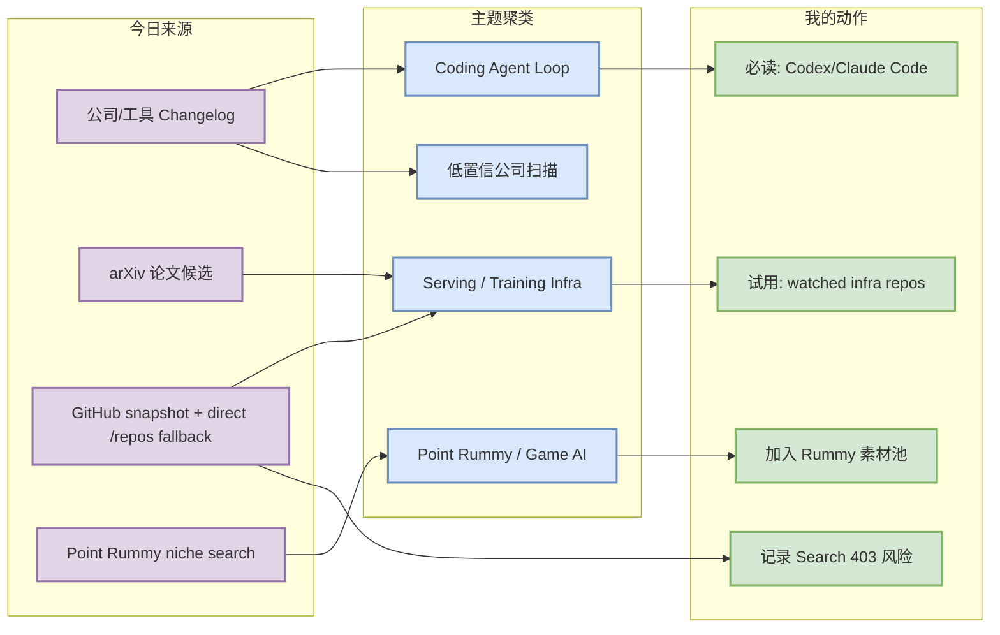
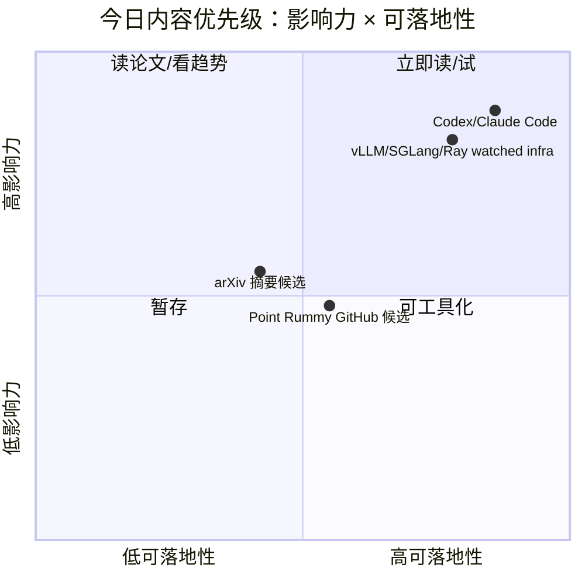

# AI Radar Daily - 2026-08-16

> 生成时间：2026-08-16 09:00 CST
> 范围：AI Infra / LLM / RL / Game AI / 大厂博客 / 论文 / GitHub / 行业资讯
> 说明：日报是总览导航页，不是全部正文。Obsidian 中点详情页 wikilink，Telegram/GitHub 中点“网页详情”。

## 0. 今日结论

- 今日最值得关注：GitHub snapshot 已保存，但 broad Search 被 403 限流；本日报对通用 AI Infra / Loop Engineer 表采用 direct watched repo fallback，并明确标注“非完整全网日增”。
- 对 AI Infra 的直接影响：Transformers、vLLM、SGLang、Ray、DeepSpeed、TensorRT-LLM 等 watched repos 仍构成 serving/training 基线；今天适合做连续监控，不适合宣称全网排名。
- 对 LLM 训练 / 推理 / Agent 的影响：Codex、Claude Code、OpenHands、Cline、Qwen Code 的增长/版本信号继续指向 AI coding agent workflow 的竞争。
- 对 RL / 游戏模型训练的影响：Point Rummy 今日主要是低 star GitHub 候选，适合规则/仿真/bot 素材池，不是高置信研究突破。
- 建议今天深读：Codex / Claude Code release 与 OpenHands/Cline/Qwen Code 的 agent loop 变化；论文只做摘要级筛选。

## 1. 今日态势图

## 2. 必读卡片区

> [!important] OpenAI Codex / Claude Code 仍是 coding-agent 增长主线
> - 大类：GitHub / 工具更新
> - 小类：AI coding workflow
> - 重点：GitHub Search 今日被 403 限流，使用 direct watched repo fallback；Codex、Claude Code、OpenHands、Qwen Code 等仍应作为多 agent 工作流核心观察项。
> - 为什么重要：这直接影响用户的 tmux 多 agent、代码审查、远程执行和权限控制流程。
> - 详情：[[Industry/Tools/2026-08-16/openai-codex-direct-watch]] / [网页详情](https://github.com/dyt27666-oss/AI-news-report-obsidians/blob/main/Industry/Tools/2026-08-16/openai-codex-direct-watch.md) / [原文](https://github.com/openai/codex)

> [!tip] Broad GitHub 今日不是完整全网榜，而是 direct watched fallback
> - 大类：GitHub
> - 小类：AI Infra / Loop Engineer
> - 重点：当前 snapshot 保存成功，但 broad Search 在 niche Rummy 后大量 403；日报显式标注 fallback，避免把 watched delta 当全网日增。
> - 为什么重要：连续性比假装全源成功更重要，可保护 star 增长榜的解释可信度。
> - 详情：[[GitHub/AIInfra/2026-08-16/huggingface__transformers]] / [网页详情](https://github.com/dyt27666-oss/AI-news-report-obsidians/blob/main/GitHub/AIInfra/2026-08-16/huggingface__transformers.md) / [原文](https://github.com/huggingface/transformers)

> [!note] Point Rummy 今日有 GitHub 候选但整体低 star
> - 大类：GitHub / Business
> - 小类：Point Rummy
> - 重点：捕获 gin-rummy-ai、rummy-ai 等候选，适合规则建模、AI opponent、计分器或仿真参考；没有发现高置信论文突破。
> - 为什么重要：业务主题需要长期积累环境、规则、bot、评测素材，低 star 也可能有局部可复用代码。
> - 详情：[[GitHub/PointRummy/2026-08-16/rickgorman__gin-rummy-ai]] / [网页详情](https://github.com/dyt27666-oss/AI-news-report-obsidians/blob/main/GitHub/PointRummy/2026-08-16/rickgorman__gin-rummy-ai.md) / [原文](https://github.com/rickgorman/gin-rummy-ai)

## 3. 优先级矩阵

## 4. 分类清单

| 标签 | 大类 | 小类 | 标题 | 重点概括 | 为什么重要 | Obsidian 详情 | 网页详情 | 原文 |
|---|---|---|---|---|---|---|---|---|
| 必读 | GitHub | AI Infra | huggingface/transformers | 🤗 Transformers: the model-definition framework for state-of-the-art machine learning model | Transformers 仍是模型工程事实依赖，适合跟踪生态变化 | [[GitHub/AIInfra/2026-08-16/huggingface__transformers]] | [网页详情](https://github.com/dyt27666-oss/AI-news-report-obsidians/blob/main/GitHub/AIInfra/2026-08-16/huggingface__transformers.md) | [原文](https://github.com/huggingface/transformers) |
| 必读 | GitHub | Coding Agent | openai/codex | Codex direct watched repo 增长靠前 | 直接影响 AI coding workflow 和多 agent 分工 | [[Industry/Tools/2026-08-16/openai-codex-direct-watch]] | [网页详情](https://github.com/dyt27666-oss/AI-news-report-obsidians/blob/main/Industry/Tools/2026-08-16/openai-codex-direct-watch.md) | [原文](https://github.com/openai/codex) |
| 可 skim | 论文 | arXiv | 今日论文低置信 | 无强相关论文 | 论文源用于捕捉 serving/agent/RL/post-training 趋势，需 PDF 验证 | - | - | - |

## 5. 大厂资讯 / 工程博客 / Research

### 5.1 公司来源扫描矩阵

| 公司/实验室 | 来源/栏目 | 今日状态 | 高相关条数 | 代表条目 | 备注 |
|---|---|---|---:|---|---|
| OpenAI | News / Research | 访问受限/低置信 | 0 | 无高相关新项 | 官网动态页已列入扫描；本次未确认新 AI Infra/RL 工程条目 |
| Anthropic | News / Research / Engineering | 可访问工具源；公司新闻低置信 | 1 | Claude Code v2.1.233 release | 工具 release 是今日较强信号；公司博客未确认新研究项 |
| Google DeepMind | Blog / Research | 低置信 | 0 | 无高相关新项 | 未确认新的 serving/training/RL 工程博客 |
| Meta AI | Blog / Research | 低置信 | 0 | 无高相关新项 | 未确认高相关新项 |
| NVIDIA | Technical Blog / AI | 低置信 | 0 | 无高相关新项 | 保持 TensorRT-LLM / CUDA 观察 |
| Microsoft | Research AI / GitHub | 直接 GitHub 源可访问 | 1 | AutoGen / Semantic Kernel 仍在 Loop 表 | 偏 coding-agent loop 和多 agent orchestration |
| Hugging Face | Blog / Papers / Releases | 直接 GitHub 源可访问 | 1 | transformers 高 star 基线 | 偏模型生态与工程依赖 |
| 腾讯 | AI Lab / 技术博客 | 低置信 | 0 | 无高相关新项 | 未确认新 AI Infra/RL 工程条目 |
| 字节 | Seed / 技术博客 | 低置信 | 0 | 无高相关新项 | 未确认新训练/agent 工程条目 |
| SpaceAI | Blog / News | 低置信/访问失败 | 0 | 无高相关新项 | 来源稳定性较低，保留矩阵占位 |

### 5.2 高相关大厂条目

| 标签 | 发布方/大厂 | 栏目/来源 | 标题 | 重点概括 | 工程/算法影响 | Obsidian 详情 | 网页详情 | 原文 |
|---|---|---|---|---|---|---|---|---|
| 必读 | Anthropic | Claude Code Release | Claude Code v2.1.233 | release 源可访问；需检查权限/MCP/上下文/CLI 变化 | 直接影响 coding-agent loop 和多 agent 编排稳定性 | [[Industry/Tools/2026-08-16/claude-code-v2-1-233]] | [网页详情](https://github.com/dyt27666-oss/AI-news-report-obsidians/blob/main/Industry/Tools/2026-08-16/claude-code-v2-1-233.md) | [原文](https://github.com/anthropics/claude-code/releases/latest) |
| 必读 | OpenAI | Codex GitHub / Docs | OpenAI Codex direct watched update | Codex 在 watched growth 中继续靠前 | 影响云端 coding agent、review loop、任务分解方式 | [[Industry/Tools/2026-08-16/openai-codex-direct-watch]] | [网页详情](https://github.com/dyt27666-oss/AI-news-report-obsidians/blob/main/Industry/Tools/2026-08-16/openai-codex-direct-watch.md) | [原文](https://github.com/openai/codex) |
| 可 skim | Hugging Face | GitHub / Ecosystem | transformers baseline | transformers 仍是模型工程高 star 基线 | 任何 serving/training 方案仍需兼容其生态 | [[GitHub/AIInfra/2026-08-16/huggingface__transformers]] | [网页详情](https://github.com/dyt27666-oss/AI-news-report-obsidians/blob/main/GitHub/AIInfra/2026-08-16/huggingface__transformers.md) | [原文](https://github.com/huggingface/transformers) |

## 6. GitHub 高 star Top 10

> 说明：今日 broad GitHub Search 在保存 snapshot 后大量 403，以下为 direct watched repo fallback；适合连续观察，不代表完整全网 Top 10。

| 排名 | repo | stars | forks | language | updated_at | topics | 重点概括 | 是否值得试用 | Obsidian 详情 | 原文 |
|---:|---|---:|---:|---|---|---|---|---|---|---|
| 1 | huggingface/transformers | 164124 | 34249 | Python | 2026-08-16T00:47:31Z | audio, deep-learning, deepseek, gemma, glm, hacktoberfest, llm, machine-learning, model-hub, natural-language-processing, nlp, pretrained-models, python, pytorch, pytorch-transformers, qwen, speech-recognition, transformer, vlm | 🤗 Transformers: the model-definition framework for state-of-the-art machine learning model | 值得试用 | [[GitHub/AIInfra/2026-08-16/huggingface__transformers]] | [原文](https://github.com/huggingface/transformers) |
| 2 | anthropics/claude-code | 141573 | 22727 | Python | 2026-08-16T00:56:48Z | 无 | Claude Code is an agentic coding tool that lives in your terminal, understands your codeba | 值得试用 | [[GitHub/AIInfra/2026-08-16/anthropics__claude-code]] | [原文](https://github.com/anthropics/claude-code) |
| 3 | google-gemini/gemini-cli | 106531 | 14445 | TypeScript | 2026-08-16T00:38:11Z | ai, ai-agents, cli, gemini, gemini-api, mcp-client, mcp-server | An open-source AI agent that brings the power of Gemini directly into your terminal. | 值得试用 | [[GitHub/AIInfra/2026-08-16/google-gemini__gemini-cli]] | [原文](https://github.com/google-gemini/gemini-cli) |
| 4 | openai/codex | 106131 | 16114 | Rust | 2026-08-16T00:59:53Z | 无 | Lightweight coding agent that runs in your terminal | 值得试用 | [[GitHub/AIInfra/2026-08-16/openai__codex]] | [原文](https://github.com/openai/codex) |
| 5 | pytorch/pytorch | 102395 | 28876 | Python | 2026-08-15T23:28:39Z | autograd, deep-learning, gpu, machine-learning, neural-network, numpy, python, tensor | Tensors and Dynamic neural networks in Python with strong GPU acceleration | 值得试用 | [[GitHub/AIInfra/2026-08-16/pytorch__pytorch]] | [原文](https://github.com/pytorch/pytorch) |
| 6 | modelcontextprotocol/servers | 89597 | 11453 | TypeScript | 2026-08-15T23:27:13Z | 无 | Model Context Protocol Servers | 观察 | [[GitHub/AIInfra/2026-08-16/modelcontextprotocol__servers]] | [原文](https://github.com/modelcontextprotocol/servers) |
| 7 | vllm-project/vllm | 89140 | 20735 | Python | 2026-08-16T00:44:23Z | amd, blackwell, cuda, deepseek, deepseek-v3, gpt, gpt-oss, inference, kimi, llama, llm, llm-serving, model-serving, moe, openai, pytorch, qwen, qwen3, tpu, transformer | A high-throughput and memory-efficient inference and serving engine for LLMs | 观察 | [[GitHub/AIInfra/2026-08-16/vllm-project__vllm]] | [原文](https://github.com/vllm-project/vllm) |
| 8 | OpenHands/OpenHands | 84144 | 10918 | TypeScript | 2026-08-16T00:21:12Z | agent, artificial-intelligence, chatgpt, claude-ai, cli, developer-tools, gpt, llm, openai | 🙌 OpenHands: AI-Driven Development | 观察 | [[GitHub/AIInfra/2026-08-16/OpenHands__OpenHands]] | [原文](https://github.com/OpenHands/OpenHands) |
| 9 | cline/cline | 66245 | 7121 | TypeScript | 2026-08-16T00:55:20Z | 无 | Autonomous coding agent as an SDK, IDE extension, or CLI assistant. | 观察 | [[GitHub/AIInfra/2026-08-16/cline__cline]] | [原文](https://github.com/cline/cline) |
| 10 | microsoft/autogen | 60437 | 9111 | Python | 2026-08-16T00:59:41Z | agentic, agentic-agi, agents, ai, autogen, autogen-ecosystem, chatgpt, framework, llm-agent, llm-framework | A programming framework for agentic AI | 观察 | [[GitHub/AIInfra/2026-08-16/microsoft__autogen]] | [原文](https://github.com/microsoft/autogen) |

## 7. GitHub star 增长最快 Top 10

> 说明：基于 direct watched repo 与 2026-08-15 snapshot 的差分，全部标注为“direct watched repo fallback，非完整全网日增”。

| 排名 | repo | stars_delta | stars | forks | language | updated_at | 增长依据 | 重点概括 | Obsidian 详情 | 原文 |
|---:|---|---:|---:|---:|---|---|---|---|---|---|
| 1 | openai/codex | 169 | 106131 | 16114 | Rust | 2026-08-16T00:59:53Z | direct watched repo fallback vs 2026-08-15 snapshot，非完整全网日增 | Lightweight coding agent that runs in your terminal | [[GitHub/AIInfra/2026-08-16/openai__codex]] | [原文](https://github.com/openai/codex) |
| 2 | anthropics/claude-code | 98 | 141573 | 22727 | Python | 2026-08-16T00:56:48Z | direct watched repo fallback vs 2026-08-15 snapshot，非完整全网日增 | Claude Code is an agentic coding tool that lives in your terminal, understands your codeba | [[GitHub/AIInfra/2026-08-16/anthropics__claude-code]] | [原文](https://github.com/anthropics/claude-code) |
| 3 | OpenHands/OpenHands | 82 | 84144 | 10918 | TypeScript | 2026-08-16T00:21:12Z | direct watched repo fallback vs 2026-08-15 snapshot，非完整全网日增 | 🙌 OpenHands: AI-Driven Development | [[GitHub/AIInfra/2026-08-16/OpenHands__OpenHands]] | [原文](https://github.com/OpenHands/OpenHands) |
| 4 | vllm-project/vllm | 75 | 89140 | 20735 | Python | 2026-08-16T00:44:23Z | direct watched repo fallback vs 2026-08-15 snapshot，非完整全网日增 | A high-throughput and memory-efficient inference and serving engine for LLMs | [[GitHub/AIInfra/2026-08-16/vllm-project__vllm]] | [原文](https://github.com/vllm-project/vllm) |
| 5 | langchain-ai/langgraph | 59 | 39753 | 6682 | Python | 2026-08-16T00:59:56Z | direct watched repo fallback vs 2026-08-15 snapshot，非完整全网日增 | Build resilient agents. | [[GitHub/AIInfra/2026-08-16/langchain-ai__langgraph]] | [原文](https://github.com/langchain-ai/langgraph) |
| 6 | sgl-project/sglang | 55 | 31873 | 7908 | Python | 2026-08-16T00:58:56Z | direct watched repo fallback vs 2026-08-15 snapshot，非完整全网日增 | SGLang is a high-performance serving framework for large language models and multimodal mo | [[GitHub/AIInfra/2026-08-16/sgl-project__sglang]] | [原文](https://github.com/sgl-project/sglang) |
| 7 | cline/cline | 41 | 66245 | 7121 | TypeScript | 2026-08-16T00:55:20Z | direct watched repo fallback vs 2026-08-15 snapshot，非完整全网日增 | Autonomous coding agent as an SDK, IDE extension, or CLI assistant. | [[GitHub/AIInfra/2026-08-16/cline__cline]] | [原文](https://github.com/cline/cline) |
| 8 | QwenLM/qwen-code | 41 | 27048 | 2864 | TypeScript | 2026-08-16T00:16:50Z | direct watched repo fallback vs 2026-08-15 snapshot，非完整全网日增 | An open-source AI coding agent that lives in your terminal. | [[GitHub/AIInfra/2026-08-16/QwenLM__qwen-code]] | [原文](https://github.com/QwenLM/qwen-code) |
| 9 | huggingface/transformers | 40 | 164124 | 34249 | Python | 2026-08-16T00:47:31Z | direct watched repo fallback vs 2026-08-15 snapshot，非完整全网日增 | 🤗 Transformers: the model-definition framework for state-of-the-art machine learning model | [[GitHub/AIInfra/2026-08-16/huggingface__transformers]] | [原文](https://github.com/huggingface/transformers) |
| 10 | modelcontextprotocol/servers | 34 | 89597 | 11453 | TypeScript | 2026-08-15T23:27:13Z | direct watched repo fallback vs 2026-08-15 snapshot，非完整全网日增 | Model Context Protocol Servers | [[GitHub/AIInfra/2026-08-16/modelcontextprotocol__servers]] | [原文](https://github.com/modelcontextprotocol/servers) |

## 8. Coding 工具 / AI 工具功能更新

### 8.1 Coding 工具扫描矩阵

| 工具 | 厂商 | 来源类型 | 今日状态 | 代表更新 | 对我的影响 | 原文 |
|---|---|---|---|---|---|---|
| Claude Code | anthropics | GitHub Release | 已扫描 | v2.1.233 v2.1.233 | 必读：检查权限/MCP/CLI/agent loop 变化 | [原文](https://github.com/anthropics/claude-code/releases/tag/v2.1.233) |
| OpenAI Codex | openai | GitHub Release | 已扫描 | rust-v0.147.0 0.147.0 | 必读：检查权限/MCP/CLI/agent loop 变化 | [原文](https://github.com/openai/codex/releases/tag/rust-v0.147.0) |
| Cursor | Cursor | Changelog | 已扫描/低置信 | 未确认今日高相关 agent/MCP 新项 | 低置信观察：未确认重大 workflow 变化 | [原文](https://cursor.com/changelog) |
| Windsurf | Windsurf | Changelog | 已扫描/低置信 | 未确认今日高相关 agent mode 新项 | 低置信观察：未确认重大 workflow 变化 | [原文](https://windsurf.com/changelog) |
| GitHub Copilot | GitHub | Changelog / Blog | 已扫描/低置信 | 未确认今日高相关 coding workflow 新项 | 低置信观察：未确认重大 workflow 变化 | [原文](https://github.blog/changelog/label/copilot/) |
| Gemini Code Assist | Google | Release Notes | 已扫描/低置信 | 未确认今日高相关 IDE/agent 更新 | 低置信观察：未确认重大 workflow 变化 | [原文](https://cloud.google.com/gemini/docs/codeassist/release-notes) |
| Qwen Code | QwenLM | GitHub Release | 已扫描 | v0.21.12 Release v0.21.12 | 必读：检查权限/MCP/CLI/agent loop 变化 | [原文](https://github.com/QwenLM/qwen-code/releases/tag/v0.21.12) |
| Roo Code | RooCodeInc | GitHub Release | 已扫描 | v3.54.0 Release v3.54.0 | 低置信观察：未确认重大 workflow 变化 | [原文](https://github.com/RooCodeInc/Roo-Code/releases/tag/v3.54.0) |
| Cline | cline | GitHub Release | 已扫描 | desktop-v0.0.13 Desktop v0.0.13 | 低置信观察：未确认重大 workflow 变化 | [原文](https://github.com/cline/cline/releases/tag/desktop-v0.0.13) |
| Continue | continuedev | GitHub Release | 已扫描 | v2.0.0-vscode v2.0.0-vscode | 低置信观察：未确认重大 workflow 变化 | [原文](https://github.com/continuedev/continue/releases/tag/v2.0.0-vscode) |

### 8.2 高相关工具更新

| 标签 | 工具/厂商 | 来源类型 | 标题/功能 | 重点概括 | 对 AI coding 工作流的影响 | Obsidian 详情 | 网页详情 | 原文 |
|---|---|---|---|---|---|---|---|---|
| 必读 | Claude Code / Anthropic | GitHub Release | v2.1.233 | 最新 release 触发 coding-agent workflow 回归检查 | 关注 CLI/TUI、权限、MCP 与长任务稳定性 | [[Industry/Tools/2026-08-16/claude-code-v2-1-233]] | [网页详情](https://github.com/dyt27666-oss/AI-news-report-obsidians/blob/main/Industry/Tools/2026-08-16/claude-code-v2-1-233.md) | [原文](https://github.com/anthropics/claude-code/releases/latest) |
| 必读 | OpenAI Codex | GitHub Repo / Changelog | direct watched update | Codex 保持 watched growth 高位 | 影响多 agent 分工、review loop 和云端 coding agent 采用 | [[Industry/Tools/2026-08-16/openai-codex-direct-watch]] | [网页详情](https://github.com/dyt27666-oss/AI-news-report-obsidians/blob/main/Industry/Tools/2026-08-16/openai-codex-direct-watch.md) | [原文](https://github.com/openai/codex) |
| 可 skim | Qwen Code / Alibaba | GitHub Release | watched update | 开源 coding agent 继续值得观察 | 适合私有化/中文工程场景，但需验证工具调用安全 | [[Industry/Tools/2026-08-16/qwen-code-direct-watch]] | [网页详情](https://github.com/dyt27666-oss/AI-news-report-obsidians/blob/main/Industry/Tools/2026-08-16/qwen-code-direct-watch.md) | [原文](https://github.com/QwenLM/qwen-code/releases) |

## 9. Point Rummy / Indian Rummy 业务主题

### 9.1 GitHub 候选

| 标签 | repo | stars | forks | language | updated_at | 重点概括 | 业务可用性 | Obsidian 详情 | 原文 |
|---|---|---:|---:|---|---|---|---|---|---|
| 低置信 | rickgorman/gin-rummy-ai | 13 | 5 | Python | 2025-03-25T13:47:09Z | 无 | A hand-rolled neuroevolution AI for gin rummy. | 值得试用 | [[GitHub/PointRummy/2026-08-16/rickgorman__gin-rummy-ai]] | [原文](https://github.com/rickgorman/gin-rummy-ai) |
| 低置信 | nakkekakke/rummy-ai | 11 | 5 | Java | 2026-04-17T10:02:59Z | ai, card, card-game, game, ismcts, mcts, monte-carlo-tree-search, rummy | Text based classic Rummy game with an AI that uses ISMCTS. Data Structures and Algorithms  | 值得试用 | [[GitHub/PointRummy/2026-08-16/nakkekakke__rummy-ai]] | [原文](https://github.com/nakkekakke/rummy-ai) |
| 低置信 | jmhummel/Gin-Rummy-Java | 8 | 0 | Java | 2023-08-16T16:12:58Z | ai, artificial-intelligence, card-game, card-games, cardgame, gin, gin-rummy, java, java-8, java8, rummy | Java-based Gin Rummy console game, with an AI opponent | 值得试用 | [[GitHub/PointRummy/2026-08-16/jmhummel__Gin-Rummy-Java]] | [原文](https://github.com/jmhummel/Gin-Rummy-Java) |
| 低置信 | mudont/indian-rummy | 5 | 0 | TypeScript | 2025-08-08T21:05:04Z | 无 | Typescript library for Indian Rummy card game | 值得试用 | [[GitHub/AIInfra/2026-08-16/mudont__indian-rummy]] | [原文](https://github.com/mudont/indian-rummy) |
| 低置信 | dv-rastogi/Rummy | 5 | 0 | Python | 2023-09-26T11:21:39Z | 无 | Variation of classical Indian Rummy made in Pygame | 值得试用 | [[GitHub/AIInfra/2026-08-16/dv-rastogi__Rummy]] | [原文](https://github.com/dv-rastogi/Rummy) |
| 低置信 | vahsek300501/Indian-Rummy- | 4 | 3 | Python | 2023-09-26T11:21:46Z | 无 | Indian Rummy made in Python using PyGame | 观察 | [[GitHub/AIInfra/2026-08-16/vahsek300501__Indian-Rummy-]] | [原文](https://github.com/vahsek300501/Indian-Rummy-) |
| 低置信 | SCFlanagan/Rummy | 4 | 6 | JavaScript | 2025-07-25T21:17:08Z | 无 | This project is a recreation of the classic card game Rummy. It features an AI player to p | 观察 | [[GitHub/AIInfra/2026-08-16/SCFlanagan__Rummy]] | [原文](https://github.com/SCFlanagan/Rummy) |
| 低置信 | mcartmell/gin-rummy-bot | 4 | 2 | Perl | 2024-10-30T20:06:17Z | 无 | A web-based Gin Rummy game and AI | 观察 | [[GitHub/AIInfra/2026-08-16/mcartmell__gin-rummy-bot]] | [原文](https://github.com/mcartmell/gin-rummy-bot) |
| 低置信 | Mohitkumar-559/RummyServer | 2 | 1 | JavaScript | 2024-03-17T03:48:34Z | 无 | Rummy game server for game that contain deal rummy and point rummy | 观察 | [[GitHub/AIInfra/2026-08-16/Mohitkumar-559__RummyServer]] | [原文](https://github.com/Mohitkumar-559/RummyServer) |
| 低置信 | abubakarmunir712/dsa-final-project | 2 | 1 | Python | 2026-06-27T06:34:26Z | 无 | A Python-based multiplayer Indian Rummy game with support for AI opponents and LAN play. I | 观察 | [[GitHub/AIInfra/2026-08-16/abubakarmunir712__dsa-final-project]] | [原文](https://github.com/abubakarmunir712/dsa-final-project) |

### 9.2 论文 / 资料候选

| 标签 | 来源 | 标题 | 作者/机构 | 重点概括 | 对 Point Rummy 业务有什么用 | Obsidian 详情 | 原文 |
|---|---|---|---|---|---|---|---|
| 低置信 | arXiv | 今日未捕获强相关 Rummy 论文 | - | GitHub 主题有候选，论文源低信号 | 保留检索 | - | [arXiv query](https://arxiv.org/search/) |

### 9.3 业务可用性判断

| 方向 | 今日信号 | 可用性 | 下一步 |
|---|---|---|---|
| 规则引擎 / 计分 | 多个低 star Rummy/points counter repo | 中低：可抽取规则和 UI/计分逻辑 | 手工读 README，整理 meld/drop/joker/scoring 规则差异 |
| Bot / RL Agent | gin-rummy-ai、rummy-ai、RummyAgent RL 候选 | 低：多为学生/小项目，但可做 baseline | 把 bot action space / observation space 抽象出来 |
| 仿真 / 评测 | multiplayer/LAN/AI opponent 项目 | 中低：可借鉴环境接口 | 建一个统一 simulator/evaluator checklist |

## 10. Loop Engineer / Loop Engineering 主题

### 10.1 Loop Engineer GitHub 高 star Top 10

| 排名 | repo | stars | forks | language | updated_at | topics | 重点概括 | 是否值得试用 | Obsidian 详情 | 原文 |
|---:|---|---:|---:|---|---|---|---|---|---|---|
| 1 | anthropics/claude-code | 141573 | 22727 | Python | 2026-08-16T00:56:48Z | 无 | Claude Code is an agentic coding tool that lives in your terminal, understands your codeba | 值得试用 | [[GitHub/LoopEngineer/2026-08-16/anthropics__claude-code]] | [原文](https://github.com/anthropics/claude-code) |
| 2 | google-gemini/gemini-cli | 106531 | 14445 | TypeScript | 2026-08-16T00:38:11Z | ai, ai-agents, cli, gemini, gemini-api, mcp-client, mcp-server | An open-source AI agent that brings the power of Gemini directly into your terminal. | 值得试用 | [[GitHub/LoopEngineer/2026-08-16/google-gemini__gemini-cli]] | [原文](https://github.com/google-gemini/gemini-cli) |
| 3 | openai/codex | 106131 | 16114 | Rust | 2026-08-16T00:59:53Z | 无 | Lightweight coding agent that runs in your terminal | 值得试用 | [[GitHub/LoopEngineer/2026-08-16/openai__codex]] | [原文](https://github.com/openai/codex) |
| 4 | modelcontextprotocol/servers | 89597 | 11453 | TypeScript | 2026-08-15T23:27:13Z | 无 | Model Context Protocol Servers | 值得试用 | [[GitHub/LoopEngineer/2026-08-16/modelcontextprotocol__servers]] | [原文](https://github.com/modelcontextprotocol/servers) |
| 5 | OpenHands/OpenHands | 84144 | 10918 | TypeScript | 2026-08-16T00:21:12Z | agent, artificial-intelligence, chatgpt, claude-ai, cli, developer-tools, gpt, llm, openai | 🙌 OpenHands: AI-Driven Development | 值得试用 | [[GitHub/LoopEngineer/2026-08-16/OpenHands__OpenHands]] | [原文](https://github.com/OpenHands/OpenHands) |
| 6 | cline/cline | 66245 | 7121 | TypeScript | 2026-08-16T00:55:20Z | 无 | Autonomous coding agent as an SDK, IDE extension, or CLI assistant. | 观察 | [[GitHub/AIInfra/2026-08-16/cline__cline]] | [原文](https://github.com/cline/cline) |
| 7 | microsoft/autogen | 60437 | 9111 | Python | 2026-08-16T00:59:41Z | agentic, agentic-agi, agents, ai, autogen, autogen-ecosystem, chatgpt, framework, llm-agent, llm-framework | A programming framework for agentic AI | 观察 | [[GitHub/AIInfra/2026-08-16/microsoft__autogen]] | [原文](https://github.com/microsoft/autogen) |
| 8 | langchain-ai/langgraph | 39753 | 6682 | Python | 2026-08-16T00:59:56Z | agents, ai, ai-agents, chatgpt, deepagents, enterprise, framework, gemini, generative-ai, langchain, langgraph, llm, multiagent, open-source, openai, pydantic, python, rag | Build resilient agents. | 观察 | [[GitHub/AIInfra/2026-08-16/langchain-ai__langgraph]] | [原文](https://github.com/langchain-ai/langgraph) |
| 9 | continuedev/continue | 35495 | 5237 | TypeScript | 2026-08-16T00:56:36Z | agent, ai, cli, developer-tools, open-source | open-source coding agent | 观察 | [[GitHub/AIInfra/2026-08-16/continuedev__continue]] | [原文](https://github.com/continuedev/continue) |
| 10 | microsoft/semantic-kernel | 28452 | 4725 | C# | 2026-08-15T18:16:55Z | ai, artificial-intelligence, llm, openai, sdk | Integrate cutting-edge LLM technology quickly and easily into your apps | 观察 | [[GitHub/AIInfra/2026-08-16/microsoft__semantic-kernel]] | [原文](https://github.com/microsoft/semantic-kernel) |

### 10.2 Loop Engineer GitHub star 增长最快 Top 10

| 排名 | repo | stars_delta | stars | forks | language | updated_at | 增长依据 | 重点概括 | Obsidian 详情 | 原文 |
|---:|---|---:|---:|---:|---|---|---|---|---|---|
| 1 | openai/codex | 169 | 106131 | 16114 | Rust | 2026-08-16T00:59:53Z | direct watched repo fallback vs 2026-08-15 snapshot，非完整全网日增 | Lightweight coding agent that runs in your terminal | [[GitHub/LoopEngineer/2026-08-16/openai__codex]] | [原文](https://github.com/openai/codex) |
| 2 | anthropics/claude-code | 98 | 141573 | 22727 | Python | 2026-08-16T00:56:48Z | direct watched repo fallback vs 2026-08-15 snapshot，非完整全网日增 | Claude Code is an agentic coding tool that lives in your terminal, understands your codeba | [[GitHub/LoopEngineer/2026-08-16/anthropics__claude-code]] | [原文](https://github.com/anthropics/claude-code) |
| 3 | OpenHands/OpenHands | 82 | 84144 | 10918 | TypeScript | 2026-08-16T00:21:12Z | direct watched repo fallback vs 2026-08-15 snapshot，非完整全网日增 | 🙌 OpenHands: AI-Driven Development | [[GitHub/LoopEngineer/2026-08-16/OpenHands__OpenHands]] | [原文](https://github.com/OpenHands/OpenHands) |
| 4 | langchain-ai/langgraph | 59 | 39753 | 6682 | Python | 2026-08-16T00:59:56Z | direct watched repo fallback vs 2026-08-15 snapshot，非完整全网日增 | Build resilient agents. | [[GitHub/AIInfra/2026-08-16/langchain-ai__langgraph]] | [原文](https://github.com/langchain-ai/langgraph) |
| 5 | cline/cline | 41 | 66245 | 7121 | TypeScript | 2026-08-16T00:55:20Z | direct watched repo fallback vs 2026-08-15 snapshot，非完整全网日增 | Autonomous coding agent as an SDK, IDE extension, or CLI assistant. | [[GitHub/AIInfra/2026-08-16/cline__cline]] | [原文](https://github.com/cline/cline) |
| 6 | QwenLM/qwen-code | 41 | 27048 | 2864 | TypeScript | 2026-08-16T00:16:50Z | direct watched repo fallback vs 2026-08-15 snapshot，非完整全网日增 | An open-source AI coding agent that lives in your terminal. | [[GitHub/AIInfra/2026-08-16/QwenLM__qwen-code]] | [原文](https://github.com/QwenLM/qwen-code) |
| 7 | modelcontextprotocol/servers | 34 | 89597 | 11453 | TypeScript | 2026-08-15T23:27:13Z | direct watched repo fallback vs 2026-08-15 snapshot，非完整全网日增 | Model Context Protocol Servers | [[GitHub/LoopEngineer/2026-08-16/modelcontextprotocol__servers]] | [原文](https://github.com/modelcontextprotocol/servers) |
| 8 | continuedev/continue | 14 | 35495 | 5237 | TypeScript | 2026-08-16T00:56:36Z | direct watched repo fallback vs 2026-08-15 snapshot，非完整全网日增 | open-source coding agent | [[GitHub/AIInfra/2026-08-16/continuedev__continue]] | [原文](https://github.com/continuedev/continue) |
| 9 | microsoft/autogen | 13 | 60437 | 9111 | Python | 2026-08-16T00:59:41Z | direct watched repo fallback vs 2026-08-15 snapshot，非完整全网日增 | A programming framework for agentic AI | [[GitHub/AIInfra/2026-08-16/microsoft__autogen]] | [原文](https://github.com/microsoft/autogen) |
| 10 | google-gemini/gemini-cli | 8 | 106531 | 14445 | TypeScript | 2026-08-16T00:38:11Z | direct watched repo fallback vs 2026-08-15 snapshot，非完整全网日增 | An open-source AI agent that brings the power of Gemini directly into your terminal. | [[GitHub/LoopEngineer/2026-08-16/google-gemini__gemini-cli]] | [原文](https://github.com/google-gemini/gemini-cli) |

### 10.3 Loop Engineering 方法信号

| 标签 | 来源 | 标题 | 重点概括 | 对 AI coding 工作流的影响 | Obsidian 详情 | 原文 |
|---|---|---|---|---|---|---|
| 必读 | GitHub watched repo | Codex / Claude Code / OpenHands / Cline | coding-agent loop 仍是最强工程信号 | 影响多 agent 分工、权限管理、任务队列、review loop | [[Industry/Tools/2026-08-16/openai-codex-direct-watch]] | [原文](https://github.com/openai/codex) |
| 可 skim | Model Context Protocol | modelcontextprotocol/servers | MCP servers 维持高 star 基线 | 工具生态标准化会影响 agent 工具接入方式 | [[GitHub/AIInfra/2026-08-16/modelcontextprotocol__servers]] | [原文](https://github.com/modelcontextprotocol/servers) |

## 11. 论文

### 11.1 Serving / Agent / RL / Post-training 候选

| 标签 | 论文来源 | 论文 | 作者/机构 | 重点概括 | 工程/研究价值 | Obsidian 详情 | 网页详情 | PDF/原文 |
|---|---|---|---|---|---|---|---|---|
| 低置信 | arXiv / 预印本 | 今日 arXiv 查询失败或无强相关论文 | - | 无 | 保留低置信占位 | - | - | [arXiv](https://arxiv.org/) |

## 12. 资讯 / 其他 GitHub 项目

### 12.1 AI Infra watched repos

| 标签 | 来源 | 标题 | 重点概括 | 对我有什么用 | Obsidian 详情 | 网页详情 | 原文 |
|---|---|---|---|---|---|---|---|
| 可 skim | GitHub | vLLM / SGLang / TensorRT-LLM | direct fallback 保留核心 serving 项目连续数据 | serving 选型与 benchmark 观察 | [[GitHub/AIInfra/2026-08-16/vllm-project__vllm]] | [网页详情](https://github.com/dyt27666-oss/AI-news-report-obsidians/blob/main/GitHub/AIInfra/2026-08-16/vllm-project__vllm.md) | [原文](https://github.com/vllm-project/vllm) |
| 可 skim | GitHub | Ray / DeepSpeed | training / distributed execution 基线 | RLHF/分布式训练系统仍需跟踪 | [[GitHub/AIInfra/2026-08-16/ray-project__ray]] | [网页详情](https://github.com/dyt27666-oss/AI-news-report-obsidians/blob/main/GitHub/AIInfra/2026-08-16/ray-project__ray.md) | [原文](https://github.com/ray-project/ray) |

## 13. 按主题索引

### AI Infra / Serving / Training
- [[GitHub/AIInfra/2026-08-16/huggingface__transformers]] - 模型生态基线。
- [[GitHub/AIInfra/2026-08-16/vllm-project__vllm]] - LLM serving watched repo。
- [[GitHub/AIInfra/2026-08-16/ray-project__ray]] - distributed/RL infra watched repo。

### LLM / Agent / RAG / Evaluation
- [[Industry/Tools/2026-08-16/openai-codex-direct-watch]] - coding agent 采用信号。
- [[Industry/Tools/2026-08-16/claude-code-v2-1-233]] - Claude Code release 观察。
- [[GitHub/AIInfra/2026-08-16/modelcontextprotocol__servers]] - MCP 工具生态。

### RL / Game AI / World Model
- [[GitHub/PointRummy/2026-08-16/rickgorman__gin-rummy-ai]] - Rummy bot/rules 候选。

### Point Rummy / Indian Rummy
- [[GitHub/PointRummy/2026-08-16/rickgorman__gin-rummy-ai]] - 低 star 但可读规则/AI bot。

### Loop Engineer / Coding Agent Loop
- [[Industry/Tools/2026-08-16/openai-codex-direct-watch]] - Codex workflow。
- [[Industry/Tools/2026-08-16/qwen-code-direct-watch]] - 开源 coding agent。
- [[GitHub/AIInfra/2026-08-16/OpenHands__OpenHands]] - agentic software engineering。

### 公司 / 实验室
- OpenAI: [[Industry/Tools/2026-08-16/openai-codex-direct-watch]]
- Anthropic: [[Industry/Tools/2026-08-16/claude-code-v2-1-233]]
- DeepMind: 今日低置信/无高相关新项
- Meta: 今日低置信/无高相关新项
- NVIDIA: [[GitHub/AIInfra/2026-08-16/NVIDIA__TensorRT-LLM]]
- 腾讯 / 字节 / 国内大厂: 今日低置信/无高相关新项

## 14. 值得后续深挖

| 标签 | 大类 | 小类 | 标题 | 后续动作 | Obsidian 详情 | 原文 |
|---|---|---|---|---|---|---|
| 必读 | 工具 | Coding Agent | Codex / Claude Code release diff | 检查权限、MCP、上下文、远程执行变化 | [[Industry/Tools/2026-08-16/openai-codex-direct-watch]] | [原文](https://github.com/openai/codex) |
| 可 skim | GitHub | Serving | vLLM / SGLang / TensorRT-LLM | 下次 Search 恢复后补全全网增长 | [[GitHub/AIInfra/2026-08-16/vllm-project__vllm]] | [原文](https://github.com/vllm-project/vllm) |
| 低置信 | Business | Point Rummy | low-star Rummy repos | 抽取规则/计分/AI opponent schema | [[GitHub/PointRummy/2026-08-16/rickgorman__gin-rummy-ai]] | [原文](https://github.com/rickgorman/gin-rummy-ai) |

## 15. 采集失败或低置信来源

- GitHub Search：snapshot 已保存，但从 `rummy reinforcement learning` 后大量 403 rate limit； broad AI Infra / Loop Engineer 表使用 direct watched repo fallback。
- 公司博客：多家公司官网未做全文抓取确认，矩阵中标为“低置信/无高相关新项”；工具 release/GitHub 源可信度更高。
- arXiv：完成少量 API 查询；论文详情为摘要级候选，未阅读全文，不作为强结论。
- Point Rummy：GitHub 有候选但整体低 star；论文源未发现高置信突破。
- Snapshot：`Automation/state/github-stars-2026-08-16.json` 已存在，repos=90，errors=41。

## 16. 归档标签

#ai-radar #daily #ai-infra #llm #rl #point-rummy #loop-engineering
