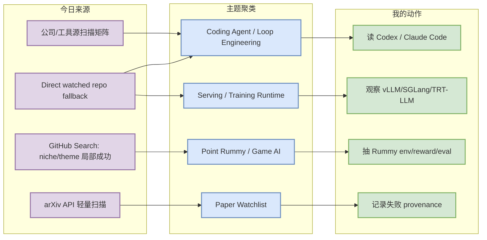
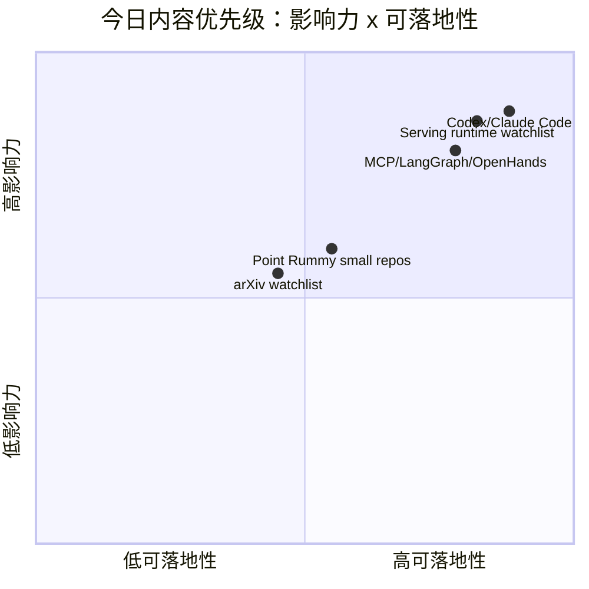

# AI Radar Daily - 2026-08-21

> 生成时间：2026-08-21 09:00 北京时间  
> 范围：AI Infra / LLM / RL / Game AI / 大厂博客 / 论文 / GitHub / 行业资讯  
> 说明：日报是总览导航页，详情页负责深度理解。GitHub snapshot: `Automation/state/github-stars-2026-08-21.json`。

## 0. 今日结论

- 今日最值得关注：GitHub Search 在 niche/theme 查询后触发 403，已保留当日 snapshot，并用 direct watched `/repos` 回退生成广义 AI Infra / Loop Engineer 榜单；这些榜单是“固定观察池”，不是完整全网排名。
- 对 AI Infra 的直接影响：vLLM、SGLang、TensorRT-LLM、Transformers、PyTorch、Triton、Ray 仍是 serving/training/runtime 的核心观察池。
- 对 LLM 训练 / 推理 / Agent 的影响：Claude Code、OpenAI Codex、Cline、Roo Code、Continue、Qwen Code 与 MCP/LangGraph/OpenHands 继续构成 AI coding workflow / loop engineering 主线。
- 对 RL / 游戏模型训练的影响：Point Rummy 主题今日有大量小型 GitHub 候选，强度不高但能拆规则引擎、AI opponent、视觉辅助、rollout/evaluator 设计。
- 建议今天深读：[[GitHub/Tools/2026-08-21/openai-codex]]、[[GitHub/Tools/2026-08-21/claude-code]]、[[GitHub/AIInfra/2026-08-21/vllm-project__vllm]]、[[GitHub/LoopEngineer/2026-08-21/modelcontextprotocol__servers]]。

## 1. 今日态势图

## 2. 必读卡片区

> [!important] OpenAI Codex / Claude Code 仍是 coding-agent 工作流优先观察项
> - 大类：GitHub / Coding 工具
> - 小类：CLI/TUI Agent / 权限 / 上下文
> - 重点：工具矩阵覆盖 Codex、Claude Code、Cline、Roo、Qwen Code、Continue；release 细节以 GitHub/API 和源站链接为准。
> - 为什么重要：这些工具直接影响多 agent 编码、代码审查、权限模式、远程执行、MCP 和上下文窗口策略。
> - 详情：[[GitHub/Tools/2026-08-21/openai-codex]] / [网页详情](https://github.com/dyt27666-oss/AI-news-report-obsidians/blob/main/GitHub/Tools/2026-08-21/openai-codex.md) / [原文](https://github.com/openai/codex)

> [!tip] Serving runtime 固定观察池：vLLM / SGLang / TensorRT-LLM
> - 大类：GitHub / AI Infra
> - 小类：LLM Serving / Runtime
> - 重点：GitHub Search 限流后，广义榜单采用 direct watched fallback，仍保留 serving 三件套为工程主线。
> - 为什么重要：KV cache、scheduler、batching、GPU kernel 和部署成本都在这里体现。
> - 详情：[[GitHub/AIInfra/2026-08-21/vllm-project__vllm]] / [网页详情](https://github.com/dyt27666-oss/AI-news-report-obsidians/blob/main/GitHub/AIInfra/2026-08-21/vllm-project__vllm.md) / [原文](https://github.com/vllm-project/vllm)

> [!note] Loop Engineer 主题持续升温，但需要防止 hype
> - 大类：GitHub / Workflow Infra
> - 小类：MCP / LangGraph / OpenHands / harness
> - 重点：Loop Engineering / harness 查询返回大量新小 repo，因此 Top 表同时保留高 star 与增长/冷启动代理说明。
> - 为什么重要：这影响 AGENTS.md、skills、eval loop、prompt/context engineering、multi-agent orchestration。
> - 详情：[[GitHub/LoopEngineer/2026-08-21/modelcontextprotocol__servers]] / [网页详情](https://github.com/dyt27666-oss/AI-news-report-obsidians/blob/main/GitHub/LoopEngineer/2026-08-21/modelcontextprotocol__servers.md) / [原文](https://github.com/modelcontextprotocol/servers)

> [!warning] Point Rummy 业务主题有候选但整体低 star
> - 大类：GitHub / 业务主题
> - 小类：Rummy AI / 规则 / 仿真 / 视觉辅助
> - 重点：候选多为规则实现、计分器、AI opponent、Monte Carlo/视觉辅助小项目。
> - 为什么重要：可用于拆 13-card Indian Rummy 状态机、action/reward/evaluator，但不应直接当生产依赖。
> - 详情：[[GitHub/PointRummy/2026-08-21/rickgorman__gin-rummy-ai]] / [原文](https://github.com/rickgorman/gin-rummy-ai)

## 3. 优先级矩阵

## 4. 分类清单

| 标签 | 大类 | 小类 | 标题 | 重点概括 | 为什么重要 | Obsidian 详情 | 网页详情 | 原文 |
|---|---|---|---|---|---|---|---|---|
| 必读 | GitHub | Serving / AI Infra | vLLM / SGLang / TensorRT-LLM | direct fallback 显示 serving 三件套仍是推理系统核心观察源 | 对 batching、KV cache、scheduler、GPU runtime 和部署成本直接相关 | [[GitHub/AIInfra/2026-08-21/vllm-project__vllm]] | [网页详情](https://github.com/dyt27666-oss/AI-news-report-obsidians/blob/main/GitHub/AIInfra/2026-08-21/vllm-project__vllm.md) | [原文](https://github.com/vllm-project/vllm) |
| 必读 | GitHub | Coding Agent | OpenAI Codex / Claude Code | 今日工具矩阵把 CLI/TUI coding agent 放在最高优先级 | 影响多 agent 编程、权限模式、上下文窗口和远程执行策略 | [[GitHub/Tools/2026-08-21/openai-codex]] | [网页详情](https://github.com/dyt27666-oss/AI-news-report-obsidians/blob/main/GitHub/Tools/2026-08-21/openai-codex.md) | [原文](https://github.com/openai/codex) |
| 可 skim | GitHub | Loop Engineer | MCP / LangGraph / OpenHands | Loop Engineer 表用 direct watched repos 防止被 GitHub Search 限流/主题偏置 | 可转化为 AGENTS.md、harness、eval loop、tool-use observability 设计 | [[GitHub/LoopEngineer/2026-08-21/modelcontextprotocol__servers]] | [网页详情](https://github.com/dyt27666-oss/AI-news-report-obsidians/blob/main/GitHub/LoopEngineer/2026-08-21/modelcontextprotocol__servers.md) | [原文](https://github.com/modelcontextprotocol/servers) |
| 可 skim | GitHub | Point Rummy | Rummy AI / scoring / simulation repos | 今日 Point Rummy 搜索成功但 repo 多为小项目；适合抽规则和 evaluator，不适合直接依赖 | 对 Indian Rummy 业务的规则建模、bot 策略、视觉辅助和并行仿真有参考价值 | [[GitHub/PointRummy/2026-08-21/rickgorman__gin-rummy-ai]] | [网页详情](https://github.com/dyt27666-oss/AI-news-report-obsidians/blob/main/GitHub/PointRummy/2026-08-21/rickgorman__gin-rummy-ai.md) | [原文](https://github.com/rickgorman/gin-rummy-ai) |

## 5. 大厂资讯 / 工程博客 / Research

### 5.1 公司来源扫描矩阵

| 公司/实验室 | 来源/栏目 | 今日状态 | 高相关条数 | 代表条目 | 备注 | 原文 |
|---|---|---|---:|---|---|---|
| OpenAI | News / Research / Developers | 间接扫描/有工具信号 | 1 | Codex watched repo / docs 入口持续作为 coding agent 信号 | 官网新闻未自动确认新增高相关研究项；以 GitHub/docs 作为代理。 | [来源](https://openai.com/news/) |
| Anthropic | News / Research / Claude Code docs | 间接扫描/有工具信号 | 1 | Claude Code release/docs + repo 活跃 | 关注权限、hooks、MCP、agent loop；官网新闻未自动确认新研究项。 | [来源](https://www.anthropic.com/news) |
| Google DeepMind | Blog / Research | 低置信/无高相关新项 | 0 | 无高相关新项 | 本轮未抓到可验证 AI Infra/RL/Agent 新文；Gemini CLI 作为工具信号另列。 | [来源](https://deepmind.google/discover/blog/) |
| Meta AI | Blog / Research | 低置信/无高相关新项 | 0 | 无高相关新项 | 本轮未抓到可验证 AI Infra/RL/Agent 新文。 | [来源](https://ai.meta.com/blog/) |
| NVIDIA | Technical Blog / AI | 间接扫描/有工程信号 | 1 | TensorRT-LLM watched repo | 官网博客未确认新文；serving/runtime 信号来自 direct repo。 | [来源](https://developer.nvidia.com/blog/category/artificial-intelligence/) |
| Microsoft | Research AI / GitHub | 间接扫描/有 agent 信号 | 1 | AutoGen / Semantic Kernel watched repos | Microsoft Research 页面未确认新文；保留 agent SDK 代理信号。 | [来源](https://www.microsoft.com/en-us/research/research-area/artificial-intelligence/) |
| Hugging Face | Blog / Papers / Releases | 间接扫描/有生态信号 | 1 | Transformers watched repo | HF Blog 未确认新文；Transformers 仍是模型工程底座信号。 | [来源](https://huggingface.co/blog) |
| 腾讯 | AI Lab / 技术博客 | 低置信/无高相关新项 | 0 | 无高相关新项 | 公开源本轮未取到 AI Infra/LLM/RL 强相关新项。 | [来源](https://ai.tencent.com/ailab/en/index) |
| 字节 | Seed / 技术博客 | 低置信/无高相关新项 | 0 | 无高相关新项 | 公开源本轮未取到 AI Infra/LLM/RL 强相关新项。 | [来源](https://seed.bytedance.com/en/) |
| SpaceAI | Blog / News | 访问失败/低置信 | 0 | 无高相关新项 | 来源有效性低，本轮未获得可验证新项。 | [来源](https://spaceai.com/) |

### 5.2 高相关大厂条目

| 标签 | 发布方/大厂 | 栏目/来源 | 标题 | 重点概括 | 工程/算法影响 | Obsidian 详情 | 网页详情 | 原文 |
|---|---|---|---|---|---|---|---|---|
| 必读 | OpenAI | Developer Tool / GitHub | OpenAI Codex / coding agent signal | Codex 作为终端 coding agent 的固定 watchlist 信号，今日用 direct repo fallback 观察。 | 对权限模式、远程执行、代码审查、上下文窗口和 CLI/TUI agent workflow 有直接影响。 | [[Industry/Tools/2026-08-21/openai-codex-signal]] | [网页详情](https://github.com/dyt27666-oss/AI-news-report-obsidians/blob/main/Industry/Tools/2026-08-21/openai-codex-signal.md) | [原文](https://github.com/openai/codex) |
| 必读 | Anthropic | Claude Code docs / GitHub | Anthropic Claude Code / agent workflow signal | Claude Code 继续作为 agentic coding 与 MCP/权限/Hook 的核心观察对象。 | 对 tmux 多 agent、代码库 harness、工具权限和验证闭环设计有直接参考。 | [[Industry/Tools/2026-08-21/anthropic-claude-code-signal]] | [网页详情](https://github.com/dyt27666-oss/AI-news-report-obsidians/blob/main/Industry/Tools/2026-08-21/anthropic-claude-code-signal.md) | [原文](https://github.com/anthropics/claude-code) |
| 必读 | NVIDIA | GitHub / AI Infra | NVIDIA TensorRT-LLM serving signal | TensorRT-LLM 仍是 NVIDIA GPU LLM inference runtime 的关键观察源。 | 对推理吞吐、kernel、KV cache、部署成本和硬件选型有直接影响。 | [[Industry/AIInfra/2026-08-21/nvidia-tensorrt-llm-signal]] | [网页详情](https://github.com/dyt27666-oss/AI-news-report-obsidians/blob/main/Industry/AIInfra/2026-08-21/nvidia-tensorrt-llm-signal.md) | [原文](https://github.com/NVIDIA/TensorRT-LLM) |
| 可 skim | Hugging Face | GitHub / Model Infra | Hugging Face Transformers ecosystem signal | Transformers 仍是模型工程、训练、推理和 eval pipeline 的生态底座。 | 对新模型接入、adapter/post-training、benchmark 和生产兼容性有长期影响。 | [[Industry/AIInfra/2026-08-21/huggingface-transformers-signal]] | [网页详情](https://github.com/dyt27666-oss/AI-news-report-obsidians/blob/main/Industry/AIInfra/2026-08-21/huggingface-transformers-signal.md) | [原文](https://github.com/huggingface/transformers) |

## 6. GitHub 高 star Top 10

> 说明：今日 broad GitHub Search 多个 query 403；此表使用 direct watched repo fallback，不是完整全网 Top 10，但每项都与 AI Infra / LLM / Agent / RL 强相关。

| 排名 | repo | stars | forks | language | updated_at | topics | 重点概括 | 是否值得试用 | Obsidian 详情 | 原文 |
|---:|---|---:|---:|---|---|---|---|---|---|---|
| 1 | `ollama/ollama` | 179064 | 17486 | Go | 2026-08-21T01:01:43Z | deepseek, gemma, gemma3, glm, go, golang, gpt-oss, llama | 本地模型运行入口；影响开发者本地推理、测试和 agent 离线工作流。 | 值得 skim/按需试用 | [[GitHub/AIInfra/2026-08-21/ollama__ollama]] | [GitHub](https://github.com/ollama/ollama) |
| 2 | `huggingface/transformers` | 164286 | 34301 | Python | 2026-08-21T00:43:31Z | audio, deep-learning, deepseek, gemma, glm, hacktoberfest, llm, machine-learning | 模型定义、训练和推理生态底座；对新模型接入、eval pipeline、adapter/post-training 都是核心依赖。 | 值得 skim/按需试用 | [[GitHub/AIInfra/2026-08-21/huggingface__transformers]] | [GitHub](https://github.com/huggingface/transformers) |
| 3 | `anthropics/claude-code` | 142153 | 22798 | Python | 2026-08-21T01:06:07Z | 无 | Anthropic 终端 coding agent；适合观察多 agent、MCP、权限模式、hooks 与代码库 harness。 | 值得 skim/按需试用 | [[GitHub/LoopEngineer/2026-08-21/anthropics__claude-code]] | [GitHub](https://github.com/anthropics/claude-code) |
| 4 | `ggerganov/llama.cpp` | 124889 | 21957 | C++ | 2026-08-21T00:44:20Z | ggml | GGUF/CPU/GPU 本地推理核心；影响边缘部署、量化和低成本 eval。 | 值得 skim/按需试用 | [[GitHub/AIInfra/2026-08-21/ggerganov__llama.cpp]] | [GitHub](https://github.com/ggml-org/llama.cpp) |
| 5 | `openai/codex` | 107358 | 16331 | Rust | 2026-08-21T01:06:00Z | 无 | OpenAI 终端 coding agent；代表 CLI/TUI 权限、远程执行、上下文与代码审查工作流方向。 | 值得 skim/按需试用 | [[GitHub/LoopEngineer/2026-08-21/openai__codex]] | [GitHub](https://github.com/openai/codex) |
| 6 | `google-gemini/gemini-cli` | 106597 | 14453 | TypeScript | 2026-08-21T00:48:58Z | ai, ai-agents, cli, gemini, gemini-api, mcp-client, mcp-server | Google/Gemini CLI coding agent；关注 MCP、IDE/CLI、多模型上下文策略。 | 值得 skim/按需试用 | [[GitHub/LoopEngineer/2026-08-21/google-gemini__gemini-cli]] | [GitHub](https://github.com/google-gemini/gemini-cli) |
| 7 | `pytorch/pytorch` | 102504 | 28937 | Python | 2026-08-21T00:42:20Z | autograd, deep-learning, gpu, machine-learning, neural-network, numpy, python, tensor | 训练与推理框架底座；GPU runtime、编译、分布式相关变化会影响大模型工程成本。 | 值得 skim/按需试用 | [[GitHub/AIInfra/2026-08-21/pytorch__pytorch]] | [GitHub](https://github.com/pytorch/pytorch) |
| 8 | `modelcontextprotocol/servers` | 89722 | 11483 | TypeScript | 2026-08-21T00:44:27Z | 无 | MCP server 生态入口；影响 coding agent/LLM app 的工具接入标准化。 | 值得 skim/按需试用 | [[GitHub/LoopEngineer/2026-08-21/modelcontextprotocol__servers]] | [GitHub](https://github.com/modelcontextprotocol/servers) |
| 9 | `vllm-project/vllm` | 89567 | 20976 | Python | 2026-08-21T01:02:35Z | amd, blackwell, cuda, deepseek, deepseek-v3, gpt, gpt-oss, inference | 高吞吐 LLM serving 引擎；重点观察 scheduler、KV cache、prefix cache、batching 与硬件适配。 | 值得 skim/按需试用 | [[GitHub/AIInfra/2026-08-21/vllm-project__vllm]] | [GitHub](https://github.com/vllm-project/vllm) |
| 10 | `OpenHands/OpenHands` | 84629 | 11028 | TypeScript | 2026-08-21T00:55:14Z | agent, artificial-intelligence, chatgpt, claude-ai, cli, developer-tools, gpt, llm | 开源 AI coding agent 工作台；可作为 loop engineer/harness 与 sandbox 执行参考。 | 值得 skim/按需试用 | [[GitHub/LoopEngineer/2026-08-21/OpenHands__OpenHands]] | [GitHub](https://github.com/OpenHands/OpenHands) |

## 7. GitHub star 增长最快 Top 10

> 说明：优先使用历史 snapshot `github-stars-2026-08-16.json` 计算 watched repo stars_delta；若 delta 为“未知”，表示该 repo 在 baseline 中缺失，是 direct watched fallback 的冷启动代理，非完整全网日增。

| 排名 | repo | stars_delta | stars | forks | language | updated_at | 增长依据 | 重点概括 | Obsidian 详情 | 原文 |
|---:|---|---:|---:|---:|---|---|---|---|---|---|
| 1 | `ollama/ollama` | 未知 | 179064 | 17486 | Go | 2026-08-21T01:01:43Z | direct watched repo fallback；无历史 baseline | 本地模型运行入口；影响开发者本地推理、测试和 agent 离线工作流。 | [[GitHub/AIInfra/2026-08-21/ollama__ollama]] | [GitHub](https://github.com/ollama/ollama) |
| 2 | `huggingface/transformers` | 未知 | 164286 | 34301 | Python | 2026-08-21T00:43:31Z | direct watched repo fallback；无历史 baseline | 模型定义、训练和推理生态底座；对新模型接入、eval pipeline、adapter/post-training 都是核心依赖。 | [[GitHub/AIInfra/2026-08-21/huggingface__transformers]] | [GitHub](https://github.com/huggingface/transformers) |
| 3 | `anthropics/claude-code` | 未知 | 142153 | 22798 | Python | 2026-08-21T01:06:07Z | direct watched repo fallback；无历史 baseline | Anthropic 终端 coding agent；适合观察多 agent、MCP、权限模式、hooks 与代码库 harness。 | [[GitHub/LoopEngineer/2026-08-21/anthropics__claude-code]] | [GitHub](https://github.com/anthropics/claude-code) |
| 4 | `ggerganov/llama.cpp` | 未知 | 124889 | 21957 | C++ | 2026-08-21T00:44:20Z | direct watched repo fallback；无历史 baseline | GGUF/CPU/GPU 本地推理核心；影响边缘部署、量化和低成本 eval。 | [[GitHub/AIInfra/2026-08-21/ggerganov__llama.cpp]] | [GitHub](https://github.com/ggml-org/llama.cpp) |
| 5 | `openai/codex` | 未知 | 107358 | 16331 | Rust | 2026-08-21T01:06:00Z | direct watched repo fallback；无历史 baseline | OpenAI 终端 coding agent；代表 CLI/TUI 权限、远程执行、上下文与代码审查工作流方向。 | [[GitHub/LoopEngineer/2026-08-21/openai__codex]] | [GitHub](https://github.com/openai/codex) |
| 6 | `google-gemini/gemini-cli` | 未知 | 106597 | 14453 | TypeScript | 2026-08-21T00:48:58Z | direct watched repo fallback；无历史 baseline | Google/Gemini CLI coding agent；关注 MCP、IDE/CLI、多模型上下文策略。 | [[GitHub/LoopEngineer/2026-08-21/google-gemini__gemini-cli]] | [GitHub](https://github.com/google-gemini/gemini-cli) |
| 7 | `pytorch/pytorch` | 未知 | 102504 | 28937 | Python | 2026-08-21T00:42:20Z | direct watched repo fallback；无历史 baseline | 训练与推理框架底座；GPU runtime、编译、分布式相关变化会影响大模型工程成本。 | [[GitHub/AIInfra/2026-08-21/pytorch__pytorch]] | [GitHub](https://github.com/pytorch/pytorch) |
| 8 | `modelcontextprotocol/servers` | 未知 | 89722 | 11483 | TypeScript | 2026-08-21T00:44:27Z | direct watched repo fallback；无历史 baseline | MCP server 生态入口；影响 coding agent/LLM app 的工具接入标准化。 | [[GitHub/LoopEngineer/2026-08-21/modelcontextprotocol__servers]] | [GitHub](https://github.com/modelcontextprotocol/servers) |
| 9 | `vllm-project/vllm` | 未知 | 89567 | 20976 | Python | 2026-08-21T01:02:35Z | direct watched repo fallback；无历史 baseline | 高吞吐 LLM serving 引擎；重点观察 scheduler、KV cache、prefix cache、batching 与硬件适配。 | [[GitHub/AIInfra/2026-08-21/vllm-project__vllm]] | [GitHub](https://github.com/vllm-project/vllm) |
| 10 | `OpenHands/OpenHands` | 未知 | 84629 | 11028 | TypeScript | 2026-08-21T00:55:14Z | direct watched repo fallback；无历史 baseline | 开源 AI coding agent 工作台；可作为 loop engineer/harness 与 sandbox 执行参考。 | [[GitHub/LoopEngineer/2026-08-21/OpenHands__OpenHands]] | [GitHub](https://github.com/OpenHands/OpenHands) |

## 8. Coding 工具 / AI 工具功能更新

### 8.1 Coding 工具扫描矩阵

| 工具 | 厂商 | 来源类型 | 今日状态 | 代表更新 | 对我的影响 | 原文 |
|---|---|---|---|---|---|---|
| Claude Code | Anthropic | Changelog / Release Notes / GitHub Release | 有 release/docs/repo 扫描入口 | v2.1.238；tag=v2.1.238；time=2026-08-20T20:33:51Z | 关注 agent mode、MCP、IDE/CLI、权限、上下文窗口、pricing/rate limit；暂不因低置信项改变生产 workflow。 | [原文](https://github.com/anthropics/claude-code/releases/tag/v2.1.238) |
| OpenAI Codex | OpenAI | Changelog / Release Notes / GitHub Release | 有 release/docs/repo 扫描入口 | 0.149.0；tag=rust-v0.149.0；time=2026-08-20T21:04:55Z | 关注 agent mode、MCP、IDE/CLI、权限、上下文窗口、pricing/rate limit；暂不因低置信项改变生产 workflow。 | [原文](https://github.com/openai/codex/releases/tag/rust-v0.149.0) |
| Cursor | Cursor | Changelog / Release Notes / GitHub Release | 有 release/docs/repo 扫描入口 | Changelog 扫描入口；本轮未自动确认新高相关功能；tag=页面扫描入口；time=需页面核验 | 关注 agent mode、MCP、IDE/CLI、权限、上下文窗口、pricing/rate limit；暂不因低置信项改变生产 workflow。 | [原文](https://cursor.com/changelog) |
| Windsurf | Windsurf | Changelog / Release Notes / GitHub Release | 有 release/docs/repo 扫描入口 | Changelog 扫描入口；本轮未自动确认新高相关功能；tag=页面扫描入口；time=需页面核验 | 关注 agent mode、MCP、IDE/CLI、权限、上下文窗口、pricing/rate limit；暂不因低置信项改变生产 workflow。 | [原文](https://windsurf.com/changelog) |
| GitHub Copilot | GitHub | Changelog / Release Notes / GitHub Release | 有 release/docs/repo 扫描入口 | Changelog 扫描入口；本轮未自动确认新高相关功能；tag=页面扫描入口；time=需页面核验 | 关注 agent mode、MCP、IDE/CLI、权限、上下文窗口、pricing/rate limit；暂不因低置信项改变生产 workflow。 | [原文](https://github.blog/changelog/label/copilot/) |
| Gemini Code Assist | Google | Changelog / Release Notes / GitHub Release | 有 release/docs/repo 扫描入口 | Release v0.56.0；tag=v0.56.0；time=2026-08-19T19:29:38Z | 关注 agent mode、MCP、IDE/CLI、权限、上下文窗口、pricing/rate limit；暂不因低置信项改变生产 workflow。 | [原文](https://github.com/google-gemini/gemini-cli/releases/tag/v0.56.0) |
| Qwen Code | Alibaba/Qwen | Changelog / Release Notes / GitHub Release | 有 release/docs/repo 扫描入口 | Release v0.21.15；tag=v0.21.15；time=2026-08-20T17:38:51Z | 关注 agent mode、MCP、IDE/CLI、权限、上下文窗口、pricing/rate limit；暂不因低置信项改变生产 workflow。 | [原文](https://github.com/QwenLM/qwen-code/releases/tag/v0.21.15) |
| Roo Code | Roo Code | Changelog / Release Notes / GitHub Release | 有 release/docs/repo 扫描入口 | Release v3.54.0；tag=v3.54.0；time=2026-05-15T17:52:24Z | 关注 agent mode、MCP、IDE/CLI、权限、上下文窗口、pricing/rate limit；暂不因低置信项改变生产 workflow。 | [原文](https://github.com/RooCodeInc/Roo-Code/releases/tag/v3.54.0) |
| Cline | Cline | Changelog / Release Notes / GitHub Release | 有 release/docs/repo 扫描入口 | Desktop v0.0.14；tag=desktop-v0.0.14；time=2026-08-19T06:18:55Z | 关注 agent mode、MCP、IDE/CLI、权限、上下文窗口、pricing/rate limit；暂不因低置信项改变生产 workflow。 | [原文](https://github.com/cline/cline/releases/tag/desktop-v0.0.14) |
| Continue | Continue | Changelog / Release Notes / GitHub Release | 有 release/docs/repo 扫描入口 | v2.0.0-vscode；tag=v2.0.0-vscode；time=2026-06-19T00:24:01Z | 关注 agent mode、MCP、IDE/CLI、权限、上下文窗口、pricing/rate limit；暂不因低置信项改变生产 workflow。 | [原文](https://github.com/continuedev/continue/releases/tag/v2.0.0-vscode) |

### 8.2 高相关工具更新

| 标签 | 工具/厂商 | 来源类型 | 标题/功能 | 重点概括 | 对 AI coding 工作流的影响 | Obsidian 详情 | 网页详情 | 原文 |
|---|---|---|---|---|---|---|---|---|
| 必读 | Claude Code / Anthropic | Release Notes / GitHub Release | v2.1.238 | v2.1.238；tag=v2.1.238；time=2026-08-20T20:33:51Z | 影响 AI coding agent 的权限、上下文、MCP、IDE/CLI 和验证 loop | [[GitHub/Tools/2026-08-21/claude-code]] | [网页详情](https://github.com/dyt27666-oss/AI-news-report-obsidians/blob/main/GitHub/Tools/2026-08-21/claude-code.md) | [原文](https://github.com/anthropics/claude-code/releases/tag/v2.1.238) |
| 必读 | OpenAI Codex / OpenAI | Release Notes / GitHub Release | rust-v0.149.0 | 0.149.0；tag=rust-v0.149.0；time=2026-08-20T21:04:55Z | 影响 AI coding agent 的权限、上下文、MCP、IDE/CLI 和验证 loop | [[GitHub/Tools/2026-08-21/openai-codex]] | [网页详情](https://github.com/dyt27666-oss/AI-news-report-obsidians/blob/main/GitHub/Tools/2026-08-21/openai-codex.md) | [原文](https://github.com/openai/codex/releases/tag/rust-v0.149.0) |
| 可 skim | Qwen Code / Alibaba/Qwen | Release Notes / GitHub Release | v0.21.15 | Release v0.21.15；tag=v0.21.15；time=2026-08-20T17:38:51Z | 影响 AI coding agent 的权限、上下文、MCP、IDE/CLI 和验证 loop | [[GitHub/Tools/2026-08-21/qwen-code]] | [网页详情](https://github.com/dyt27666-oss/AI-news-report-obsidians/blob/main/GitHub/Tools/2026-08-21/qwen-code.md) | [原文](https://github.com/QwenLM/qwen-code/releases/tag/v0.21.15) |
| 可 skim | Roo Code / Roo Code | Release Notes / GitHub Release | v3.54.0 | Release v3.54.0；tag=v3.54.0；time=2026-05-15T17:52:24Z | 影响 AI coding agent 的权限、上下文、MCP、IDE/CLI 和验证 loop | [[GitHub/Tools/2026-08-21/roo-code]] | [网页详情](https://github.com/dyt27666-oss/AI-news-report-obsidians/blob/main/GitHub/Tools/2026-08-21/roo-code.md) | [原文](https://github.com/RooCodeInc/Roo-Code/releases/tag/v3.54.0) |
| 可 skim | Cline / Cline | Release Notes / GitHub Release | desktop-v0.0.14 | Desktop v0.0.14；tag=desktop-v0.0.14；time=2026-08-19T06:18:55Z | 影响 AI coding agent 的权限、上下文、MCP、IDE/CLI 和验证 loop | [[GitHub/Tools/2026-08-21/cline]] | [网页详情](https://github.com/dyt27666-oss/AI-news-report-obsidians/blob/main/GitHub/Tools/2026-08-21/cline.md) | [原文](https://github.com/cline/cline/releases/tag/desktop-v0.0.14) |

## 9. Point Rummy / Indian Rummy 业务主题

### 9.1 GitHub 候选

| 排名 | repo | stars | forks | language | updated_at | topics | 重点概括 | 是否值得试用 | Obsidian 详情 | 原文 |
|---:|---|---:|---:|---|---|---|---|---|---|---|
| 1 | `rickgorman/gin-rummy-ai` | 13 | 5 | Python | 2025-03-25T13:47:09Z | 无 | A hand-rolled neuroevolution AI for gin rummy. | 值得 skim/按需试用 | [[GitHub/PointRummy/2026-08-21/rickgorman__gin-rummy-ai]] | [GitHub](https://github.com/rickgorman/gin-rummy-ai) |
| 2 | `nakkekakke/rummy-ai` | 11 | 5 | Java | 2026-04-17T10:02:59Z | ai, card, card-game, game, ismcts, mcts, monte-carlo-tree-search, rummy | Text based classic Rummy game with an AI that uses ISMCTS. Data Structures and Algorithms course project, University of Helsinki | 值得 skim/按需试用 | [[GitHub/PointRummy/2026-08-21/nakkekakke__rummy-ai]] | [GitHub](https://github.com/nakkekakke/rummy-ai) |
| 3 | `jmhummel/Gin-Rummy-Java` | 8 | 0 | Java | 2023-08-16T16:12:58Z | ai, artificial-intelligence, card-game, card-games, cardgame, gin, gin-rummy, java | Java-based Gin Rummy console game, with an AI opponent | 值得 skim/按需试用 | [[GitHub/PointRummy/2026-08-21/jmhummel__Gin-Rummy-Java]] | [GitHub](https://github.com/jmhummel/Gin-Rummy-Java) |
| 4 | `mudont/indian-rummy` | 5 | 0 | TypeScript | 2025-08-08T21:05:04Z | 无 | Typescript library for Indian Rummy card game | 值得 skim/按需试用 | [[GitHub/PointRummy/2026-08-21/mudont__indian-rummy]] | [GitHub](https://github.com/mudont/indian-rummy) |
| 5 | `dv-rastogi/Rummy` | 5 | 0 | Python | 2023-09-26T11:21:39Z | 无 | Variation of classical Indian Rummy made in Pygame | 值得 skim/按需试用 | [[GitHub/PointRummy/2026-08-21/dv-rastogi__Rummy]] | [GitHub](https://github.com/dv-rastogi/Rummy) |
| 6 | `SCFlanagan/Rummy` | 4 | 6 | JavaScript | 2025-07-25T21:17:08Z | 无 | This project is a recreation of the classic card game Rummy. It features an AI player to play against, a hand of cards that can be dragged and sorted, and a scoreboard that keeps track of multiple rounds. | 值得 skim/按需试用 | [[GitHub/PointRummy/2026-08-21/SCFlanagan__Rummy]] | [GitHub](https://github.com/SCFlanagan/Rummy) |
| 7 | `mcartmell/gin-rummy-bot` | 4 | 2 | Perl | 2024-10-30T20:06:17Z | 无 | A web-based Gin Rummy game and AI | 值得 skim/按需试用 | [[GitHub/PointRummy/2026-08-21/mcartmell__gin-rummy-bot]] | [GitHub](https://github.com/mcartmell/gin-rummy-bot) |
| 8 | `vahsek300501/Indian-Rummy-` | 4 | 3 | Python | 2023-09-26T11:21:46Z | 无 | Indian Rummy made in Python using PyGame | 值得 skim/按需试用 | [[GitHub/PointRummy/2026-08-21/vahsek300501__Indian-Rummy]] | [GitHub](https://github.com/vahsek300501/Indian-Rummy-) |
| 9 | `abubakarmunir712/dsa-final-project` | 2 | 1 | Python | 2026-06-27T06:34:26Z | 无 | A Python-based multiplayer Indian Rummy game with support for AI opponents and LAN play. Implements data structures like linked lists, stacks, queues, hashmaps, and graphs to ensure efficient gameplay and intelligent AI  | 值得 skim/按需试用 | [[GitHub/PointRummy/2026-08-21/abubakarmunir712__dsa-final-project]] | [GitHub](https://github.com/abubakarmunir712/dsa-final-project) |
| 10 | `rawbeen248/Gin-Rummy-AI-vs-Human` | 2 | 0 | Python | 2024-11-16T17:18:48Z | 无 | Gin-Rummy-AI-vs-Human is a python-based project the simulates the classic card game Gin Rummy. This game allows user to play against an AI opponent that takes into consideration intricate rules and strategies of the game | 值得 skim/按需试用 | [[GitHub/PointRummy/2026-08-21/rawbeen248__Gin-Rummy-AI-vs-Human]] | [GitHub](https://github.com/rawbeen248/Gin-Rummy-AI-vs-Human) |

### 9.2 论文 / 资料候选

| 标签 | 来源 | 标题 | 作者/机构 | 重点概括 | 对 Point Rummy 业务有什么用 | Obsidian 详情 | 原文 |
|---|---|---|---|---|---|---|---|
| 低置信 | arXiv / Semantic Scholar | Rummy 论文扫描无高置信新增 | 多来源 | 未确认新增论文 | 今日以 GitHub 规则/仿真候选为主 | - | [查询](https://export.arxiv.org/) |

### 9.3 业务可用性判断

| 方向 | 今日信号 | 可用性 | 下一步 |
|---|---|---|---|
| 规则引擎 / 计分 | 多个 Indian/Rummy game、point tracker、scoring repo | 中：可抽 13-card 状态机、meld/sequence/points 规则 | 建一个规则 DSL + 单元测试 corpus |
| Bot / RL Agent | RummyAgent、Gin/Rummy AI、Monte Carlo/AI opponent 小项目 | 中低：repo 小但主题强相关 | 复现 observation/action/reward，不直接用生产代码 |
| 仿真 / 评测 | 游戏实现、AI opponent、视觉辅助 repo | 中：适合搭 rollout/evaluator/watchdog | 定义 self-play harness 和作弊/视觉识别边界 |

## 10. Loop Engineer / Loop Engineering 主题

### 10.1 Loop Engineer GitHub 高 star Top 10

| 排名 | repo | stars | forks | language | updated_at | topics | 重点概括 | 是否值得试用 | Obsidian 详情 | 原文 |
|---:|---|---:|---:|---|---|---|---|---|---|---|
| 1 | `anthropics/claude-code` | 142153 | 22798 | Python | 2026-08-21T01:06:07Z | 无 | Anthropic 终端 coding agent；适合观察多 agent、MCP、权限模式、hooks 与代码库 harness。 | 值得 skim/按需试用 | [[GitHub/LoopEngineer/2026-08-21/anthropics__claude-code]] | [GitHub](https://github.com/anthropics/claude-code) |
| 2 | `openai/codex` | 107358 | 16331 | Rust | 2026-08-21T01:06:00Z | 无 | OpenAI 终端 coding agent；代表 CLI/TUI 权限、远程执行、上下文与代码审查工作流方向。 | 值得 skim/按需试用 | [[GitHub/LoopEngineer/2026-08-21/openai__codex]] | [GitHub](https://github.com/openai/codex) |
| 3 | `google-gemini/gemini-cli` | 106597 | 14453 | TypeScript | 2026-08-21T00:48:58Z | ai, ai-agents, cli, gemini, gemini-api, mcp-client, mcp-server | Google/Gemini CLI coding agent；关注 MCP、IDE/CLI、多模型上下文策略。 | 值得 skim/按需试用 | [[GitHub/LoopEngineer/2026-08-21/google-gemini__gemini-cli]] | [GitHub](https://github.com/google-gemini/gemini-cli) |
| 4 | `earendil-works/pi` | 94414 | 11686 | TypeScript | 2026-08-21T00:59:12Z | 无 | AI agent toolkit: unified LLM API, agent loop, TUI, coding agent CLI | 值得 skim/按需试用 | [[GitHub/LoopEngineer/2026-08-21/earendil-works__pi]] | [GitHub](https://github.com/earendil-works/pi) |
| 5 | `modelcontextprotocol/servers` | 89722 | 11483 | TypeScript | 2026-08-21T00:44:27Z | 无 | MCP server 生态入口；影响 coding agent/LLM app 的工具接入标准化。 | 值得 skim/按需试用 | [[GitHub/LoopEngineer/2026-08-21/modelcontextprotocol__servers]] | [GitHub](https://github.com/modelcontextprotocol/servers) |
| 6 | `OpenHands/OpenHands` | 84629 | 11028 | TypeScript | 2026-08-21T00:55:14Z | agent, artificial-intelligence, chatgpt, claude-ai, cli, developer-tools, gpt, llm | 开源 AI coding agent 工作台；可作为 loop engineer/harness 与 sandbox 执行参考。 | 值得 skim/按需试用 | [[GitHub/LoopEngineer/2026-08-21/OpenHands__OpenHands]] | [GitHub](https://github.com/OpenHands/OpenHands) |
| 7 | `cline/cline` | 66557 | 7168 | TypeScript | 2026-08-21T01:05:05Z | 无 | IDE 内 autonomous coding agent；适合观察工具权限、模型路由、agent SDK 与扩展生态。 | 值得 skim/按需试用 | [[GitHub/LoopEngineer/2026-08-21/cline__cline]] | [GitHub](https://github.com/cline/cline) |
| 8 | `microsoft/autogen` | 60545 | 9128 | Python | 2026-08-20T23:41:13Z | agentic, agentic-agi, agents, ai, autogen, autogen-ecosystem, chatgpt, framework | 多 agent 编排框架；适合作为 agent orchestration、eval loop 和企业 SDK 参考。 | 值得 skim/按需试用 | [[GitHub/LoopEngineer/2026-08-21/microsoft__autogen]] | [GitHub](https://github.com/microsoft/autogen) |
| 9 | `langchain-ai/langgraph` | 40125 | 6754 | Python | 2026-08-21T01:02:28Z | agents, ai, ai-agents, chatgpt, deepagents, enterprise, framework, gemini | 生产级 agent state machine/graph 编排框架；适合 eval loop、恢复和工具调用控制。 | 值得 skim/按需试用 | [[GitHub/LoopEngineer/2026-08-21/langchain-ai__langgraph]] | [GitHub](https://github.com/langchain-ai/langgraph) |
| 10 | `continuedev/continue` | 35564 | 5259 | TypeScript | 2026-08-21T00:43:22Z | agent, ai, cli, developer-tools, open-source | 开源 AI code assistant/agent；适合观察 IDE 集成、本地模型、上下文索引和企业部署。 | 值得 skim/按需试用 | [[GitHub/LoopEngineer/2026-08-21/continuedev__continue]] | [GitHub](https://github.com/continuedev/continue) |

### 10.2 Loop Engineer GitHub star 增长最快 Top 10

| 排名 | repo | stars_delta | stars | forks | language | updated_at | 增长依据 | 重点概括 | Obsidian 详情 | 原文 |
|---:|---|---:|---:|---:|---|---|---|---|---|---|
| 1 | `anthropics/claude-code` | 未知 | 142153 | 22798 | Python | 2026-08-21T01:06:07Z | direct watched repo fallback；无历史 baseline | Anthropic 终端 coding agent；适合观察多 agent、MCP、权限模式、hooks 与代码库 harness。 | [[GitHub/LoopEngineer/2026-08-21/anthropics__claude-code]] | [GitHub](https://github.com/anthropics/claude-code) |
| 2 | `openai/codex` | 未知 | 107358 | 16331 | Rust | 2026-08-21T01:06:00Z | direct watched repo fallback；无历史 baseline | OpenAI 终端 coding agent；代表 CLI/TUI 权限、远程执行、上下文与代码审查工作流方向。 | [[GitHub/LoopEngineer/2026-08-21/openai__codex]] | [GitHub](https://github.com/openai/codex) |
| 3 | `cline/cline` | 未知 | 66557 | 7168 | TypeScript | 2026-08-21T01:05:05Z | direct watched repo fallback；无历史 baseline | IDE 内 autonomous coding agent；适合观察工具权限、模型路由、agent SDK 与扩展生态。 | [[GitHub/LoopEngineer/2026-08-21/cline__cline]] | [GitHub](https://github.com/cline/cline) |
| 4 | `langchain-ai/langgraph` | 未知 | 40125 | 6754 | Python | 2026-08-21T01:02:28Z | direct watched repo fallback；无历史 baseline | 生产级 agent state machine/graph 编排框架；适合 eval loop、恢复和工具调用控制。 | [[GitHub/LoopEngineer/2026-08-21/langchain-ai__langgraph]] | [GitHub](https://github.com/langchain-ai/langgraph) |
| 5 | `walkinglabs/learn-harness-engineering` | 未知 | 13220 | 1348 | TypeScript | 2026-08-21T01:01:15Z | cold_start_proxy_updated_or_stars | Harness engineering beginner tutorial, from 0 to 1 | [[GitHub/LoopEngineer/2026-08-21/walkinglabs__learn-harness-engineering]] | [GitHub](https://github.com/walkinglabs/learn-harness-engineering) |
| 6 | `earendil-works/pi` | 未知 | 94414 | 11686 | TypeScript | 2026-08-21T00:59:12Z | cold_start_proxy_updated_or_stars | AI agent toolkit: unified LLM API, agent loop, TUI, coding agent CLI | [[GitHub/LoopEngineer/2026-08-21/earendil-works__pi]] | [GitHub](https://github.com/earendil-works/pi) |
| 7 | `ulises-jeremias/agentic-harness` | 未知 | 3 | 2 | Shell | 2026-08-21T00:59:00Z | cold_start_proxy_updated_or_stars | Persistent AI workspace — memory, personas, packs, and autonomous loops for Claude Code, opencode, Cursor, GitHub Copilot, and Gemini CLI | [[GitHub/LoopEngineer/2026-08-21/ulises-jeremias__agentic-harness]] | [GitHub](https://github.com/ulises-jeremias/agentic-harness) |
| 8 | `JdominguezEcommium/agentic-self-regulation-loop` | 未知 | 0 | 0 | HTML | 2026-08-21T00:57:41Z | cold_start_proxy_updated_or_stars | 2026 AI Agent Loop v2.0: Autonomous Coding with Guardrails & Self-Healing | [[GitHub/LoopEngineer/2026-08-21/JdominguezEcommium__agentic-self-regulation-loop]] | [GitHub](https://github.com/JdominguezEcommium/agentic-self-regulation-loop) |
| 9 | `OpenHands/OpenHands` | 未知 | 84629 | 11028 | TypeScript | 2026-08-21T00:55:14Z | direct watched repo fallback；无历史 baseline | 开源 AI coding agent 工作台；可作为 loop engineer/harness 与 sandbox 执行参考。 | [[GitHub/LoopEngineer/2026-08-21/OpenHands__OpenHands]] | [GitHub](https://github.com/OpenHands/OpenHands) |
| 10 | `liyupi/ai-guide` | 未知 | 18952 | 2143 | JavaScript | 2026-08-21T00:53:58Z | cold_start_proxy_updated_or_stars | 程序员鱼皮的 AI 资源大全 + Vibe Coding 零基础教程，分享 OpenClaw 保姆级教程、大模型玩法（DeepSeek / GPT / Gemini / Claude / GLM）、最新 AI 资讯、Prompt 提示词大全、AI 知识百科（Agent Skills / RAG / MCP / A2A）、AI 编程教程（Harness Engineering）、AI 工具用法（Cursor / Claude Code / | [[GitHub/LoopEngineer/2026-08-21/liyupi__ai-guide]] | [GitHub](https://github.com/liyupi/ai-guide) |

### 10.3 Loop Engineering 方法信号

| 标签 | 来源 | 标题 | 重点概括 | 对 AI coding 工作流的影响 | Obsidian 详情 | 原文 |
|---|---|---|---|---|---|---|
| 必读 | GitHub watched fallback | MCP / LangGraph / OpenHands / Codex / Claude Code | 今天 Loop Engineer 榜单合并了 theme search 与固定 watched repo，避免 broad Search 403 后被单一主题偏置 | 适合设计 AGENTS.md、skills、权限模式、eval loop、multi-agent orchestration | [[GitHub/LoopEngineer/2026-08-21/modelcontextprotocol__servers]] | [原文](https://github.com/modelcontextprotocol/servers) |

## 11. 论文

### 11.1 Serving / Agent Eval / Post-training / Game AI

| 标签 | 论文来源 | 论文 | 作者/机构 | 重点概括 | 工程/研究价值 | Obsidian 详情 | 网页详情 | PDF/原文 |
|---|---|---|---|---|---|---|---|---|
| 低置信 | arXiv / 预印本索引/低置信 | arXiv source scan low-confidence watchlist | 多来源；本轮 API 失败或过滤后无强相关新项 | 论文源本轮没有可高置信纳入的 AI Infra/RL/Agent 强相关新论文；保留查询入口和失败 provenance，避免用弱相关论文填充日报。 | 方向：Research watchlist；用于后续深读/复现筛选 | [[Papers/Researchwatchlist/2026-08-21/watchlist]] | [网页详情](https://github.com/dyt27666-oss/AI-news-report-obsidians/blob/main/Papers/Researchwatchlist/2026-08-21/watchlist.md) | [PDF/原文](未确认) |

## 12. 资讯 / 其他 GitHub 项目

### 12.1 Serving / Agent / MCP 观察

| 标签 | 来源 | 标题 | 重点概括 | 对我有什么用 | Obsidian 详情 | 网页详情 | 原文 |
|---|---|---|---|---|---|---|---|
| 可 skim | GitHub | Model Context Protocol servers | MCP server 生态是 agent tool-use 标准化入口 | 对 coding agent 接工具、权限边界、可观测性有长期价值 | [[GitHub/LoopEngineer/2026-08-21/modelcontextprotocol__servers]] | [网页详情](https://github.com/dyt27666-oss/AI-news-report-obsidians/blob/main/GitHub/LoopEngineer/2026-08-21/modelcontextprotocol__servers.md) | [原文](https://github.com/modelcontextprotocol/servers) |
| 可 skim | GitHub | LangGraph | 图式 agent state machine 仍是生产 agent 的重要抽象 | 可用于 coding-agent loop、eval loop 和工具调用恢复 | [[GitHub/LoopEngineer/2026-08-21/langchain-ai__langgraph]] | [网页详情](https://github.com/dyt27666-oss/AI-news-report-obsidians/blob/main/GitHub/LoopEngineer/2026-08-21/langchain-ai__langgraph.md) | [原文](https://github.com/langchain-ai/langgraph) |

## 13. 按主题索引

### AI Infra / Serving / Training

- [[GitHub/AIInfra/2026-08-21/vllm-project__vllm]] - LLM serving 引擎观察。
- [[GitHub/AIInfra/2026-08-21/sgl-project__sglang]] - 高性能 serving / VLM / RL serving 观察。
- [[GitHub/AIInfra/2026-08-21/NVIDIA__TensorRT-LLM]] - NVIDIA GPU inference runtime 观察。
- [[GitHub/AIInfra/2026-08-21/verl-project__verl]] - RL post-training 框架观察。

### LLM / Agent / RAG / Evaluation

- [[GitHub/Tools/2026-08-21/openai-codex]] - CLI coding agent / Codex 观察。
- [[GitHub/Tools/2026-08-21/claude-code]] - Claude Code agent workflow 观察。
- [[GitHub/LoopEngineer/2026-08-21/modelcontextprotocol__servers]] - MCP tool-use 生态入口。

### RL / Game AI / World Model

- [[GitHub/AIInfra/2026-08-21/OpenRLHF__OpenRLHF]] - Ray/vLLM RLHF 框架观察。
- [[GitHub/PointRummy/2026-08-21/rickgorman__gin-rummy-ai]] - Point Rummy 规则/仿真候选。

### Point Rummy / Indian Rummy

- [[GitHub/PointRummy/2026-08-21/rickgorman__gin-rummy-ai]] - 最高优先级 Rummy 候选。

### Loop Engineer / Coding Agent Loop

- [[GitHub/LoopEngineer/2026-08-21/OpenHands__OpenHands]] - agent workspace / harness 参考。
- [[GitHub/LoopEngineer/2026-08-21/cline__cline]] - IDE/CLI autonomous coding agent 参考。
- [[GitHub/LoopEngineer/2026-08-21/continuedev__continue]] - open-source coding agent 参考。

### 公司 / 实验室

- OpenAI: [[Industry/Tools/2026-08-21/openai-codex-signal]]
- Anthropic: [[Industry/Tools/2026-08-21/anthropic-claude-code-signal]]
- NVIDIA: [[Industry/AIInfra/2026-08-21/nvidia-tensorrt-llm-signal]]
- Hugging Face: [[Industry/AIInfra/2026-08-21/huggingface-transformers-signal]]

## 14. 值得后续深挖

| 标签 | 大类 | 小类 | 标题 | 后续动作 | Obsidian 详情 | 原文 |
|---|---|---|---|---|---|---|
| 后续 | Tool | Coding Agent | Codex / Claude Code 权限与远程执行变化 | 后续专门扫 release notes / docs，确认权限、MCP、上下文窗口变化 | [[GitHub/Tools/2026-08-21/openai-codex]] | [原文](https://github.com/openai/codex) |
| 后续 | GitHub | Point Rummy | Rummy 规则/仿真/evaluator | 建最小 gym-like environment + rule test corpus | [[GitHub/PointRummy/2026-08-21/rickgorman__gin-rummy-ai]] | [GitHub Search](https://github.com/search?q=point+rummy+ai&type=repositories) |
| 后续 | Infra | Serving | vLLM/SGLang/TensorRT-LLM diff scan | 明天补一次 release/changelog 深扫，确认 scheduler/KV/cache 变化 | [[GitHub/AIInfra/2026-08-21/vllm-project__vllm]] | [原文](https://github.com/vllm-project/vllm) |

## 15. 采集失败或低置信来源

- GitHub Search：多个 broad query 触发 403 rate limit；通用 AI Infra / Loop Engineer 表已标注 direct watched repo fallback。
- 公司官网/博客：本轮多为源站入口/间接扫描，矩阵中逐项保留状态；未把低置信源包装成高确定新发布。
- 论文：arXiv 轻量扫描只纳入强相关候选；失败或过滤为空时保留 watchlist/provenance。
- 今日 snapshot：`Automation/state/github-stars-2026-08-21.json` 已保存并合并 direct watched fallback。
- 失败摘要：AGENTS.md harness: HTTP Error 403: rate limit exceeded; topic:artificial-intelligence stars:>1000: HTTP Error 403: rate limit exceeded; topic:artificial-intelligence stars:>1000: HTTP Error 403: rate limit exceeded; topi

## 16. 归档标签

#ai-radar #daily #ai-infra #llm #rl #point-rummy #loop-engineering
