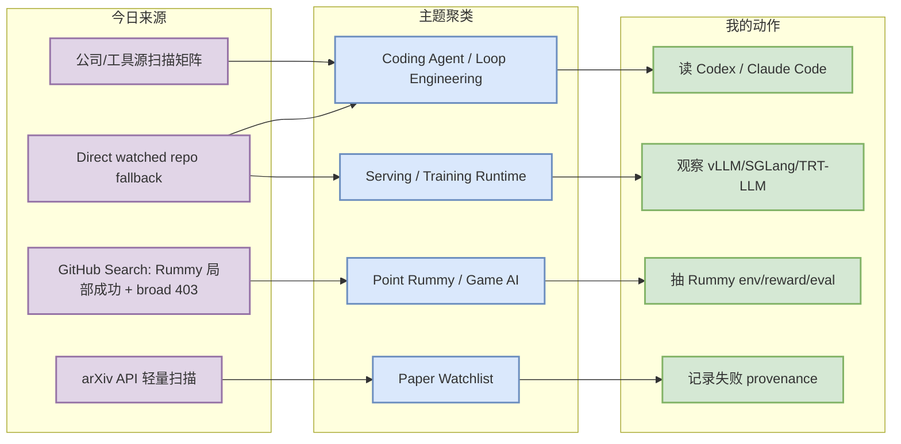
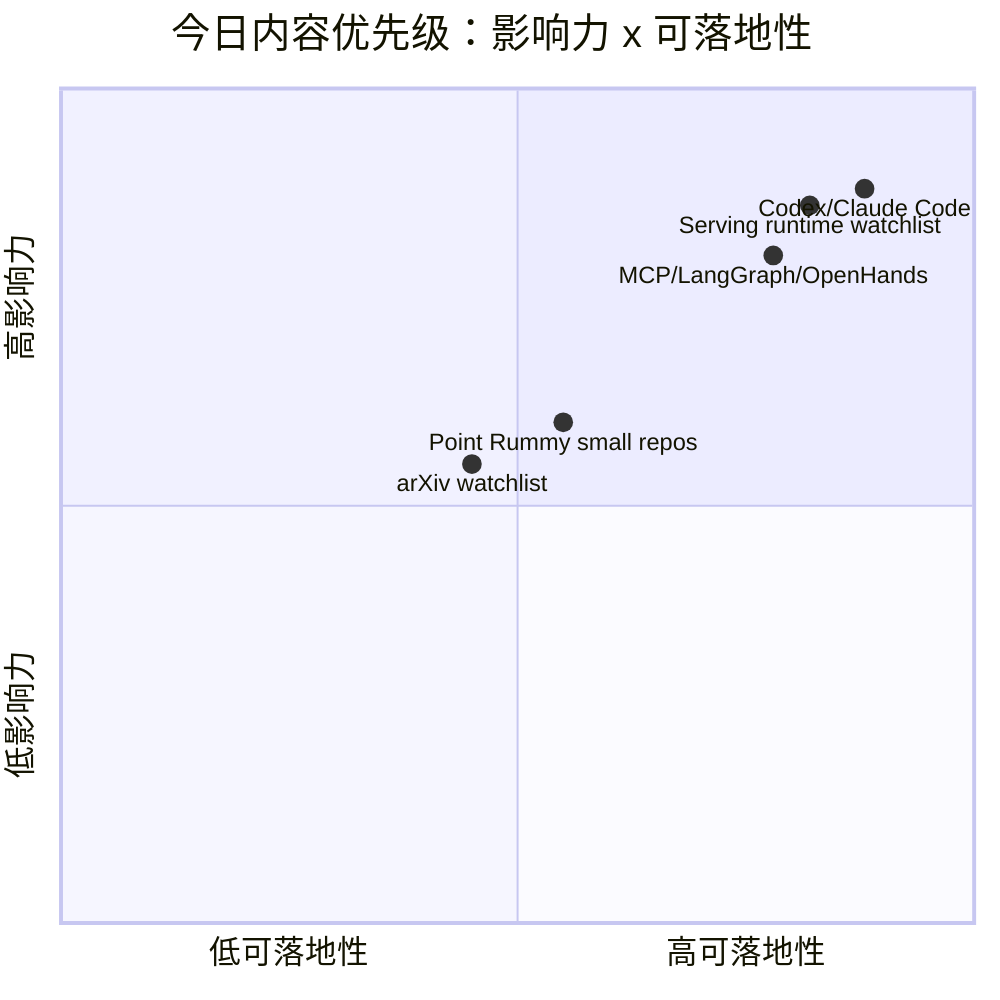

# AI Radar Daily - 2026-08-22

> 生成时间：2026-08-22 09:00 北京时间  
> 范围：AI Infra / LLM / RL / Game AI / 大厂博客 / 论文 / GitHub / 行业资讯  
> 说明：日报是总览导航页，详情页负责深度理解。GitHub snapshot: `Automation/state/github-stars-2026-08-22.json`。

## 0. 今日结论

- 今日最值得关注：GitHub Search 在 Point Rummy / theme 查询后触发 403，已保存当日 snapshot，并用 direct watched `/repos` 回退生成广义 AI Infra / Loop Engineer 榜单；这些榜单是“固定观察池”，不是完整全网排名。
- 对 AI Infra 的直接影响：vLLM、SGLang、TensorRT-LLM、Transformers、PyTorch、Triton、Ray 仍是 serving/training/runtime 的核心观察池。
- 对 LLM 训练 / 推理 / Agent 的影响：Claude Code、OpenAI Codex、Gemini CLI、Cline、Roo Code、Continue、Qwen Code 与 MCP/LangGraph/OpenHands 继续构成 AI coding workflow / loop engineering 主线。
- 对 RL / 游戏模型训练的影响：Point Rummy 主题今日有大量小型 GitHub 候选；强度不高但可抽规则引擎、AI opponent、视觉辅助、rollout/evaluator 设计。
- 建议今天深读：[[GitHub/Tools/2026-08-22/openai-codex]]、[[GitHub/Tools/2026-08-22/claude-code]]、[[GitHub/AIInfra/2026-08-22/vllm-project__vllm]]、[[GitHub/LoopEngineer/2026-08-22/modelcontextprotocol__servers]]。

## 1. 今日态势图

## 2. 必读卡片区

> [!important] OpenAI Codex / Claude Code 仍是 coding-agent 工作流优先观察项
> - 大类：GitHub / Coding 工具
> - 小类：CLI/TUI Agent / 权限 / 上下文
> - 重点：工具矩阵覆盖 Codex、Claude Code、Cline、Roo、Qwen Code、Continue；release 细节以 GitHub/API 和源站链接为准。
> - 为什么重要：这些工具直接影响多 agent 编码、代码审查、权限模式、远程执行、MCP 和上下文窗口策略。
> - 详情：[[GitHub/Tools/2026-08-22/openai-codex]] / [网页详情](https://github.com/dyt27666-oss/AI-news-report-obsidians/blob/main/GitHub/Tools/2026-08-22/openai-codex.md) / [原文](https://github.com/openai/codex/releases)

> [!tip] Serving runtime 固定观察池：vLLM / SGLang / TensorRT-LLM
> - 大类：GitHub / AI Infra
> - 小类：LLM Serving / Runtime
> - 重点：GitHub Search 限流后，广义榜单采用 direct watched fallback，仍保留 serving 三件套为工程主线。
> - 为什么重要：KV cache、scheduler、batching、GPU kernel 和部署成本都在这里体现。
> - 详情：[[GitHub/AIInfra/2026-08-22/vllm-project__vllm]] / [网页详情](https://github.com/dyt27666-oss/AI-news-report-obsidians/blob/main/GitHub/AIInfra/2026-08-22/vllm-project__vllm.md) / [原文](https://github.com/vllm-project/vllm)

> [!note] Loop Engineer 主题持续升温，但需要防止 hype
> - 大类：GitHub / Workflow Infra
> - 小类：MCP / LangGraph / OpenHands / harness
> - 重点：Loop Engineering / harness 查询触发限流，因此 Top 表合并固定 watched repo，并清楚标注非完整全网增长。
> - 为什么重要：这影响 AGENTS.md、skills、eval loop、prompt/context engineering、multi-agent orchestration。
> - 详情：[[GitHub/LoopEngineer/2026-08-22/modelcontextprotocol__servers]] / [网页详情](https://github.com/dyt27666-oss/AI-news-report-obsidians/blob/main/GitHub/LoopEngineer/2026-08-22/modelcontextprotocol__servers.md) / [原文](https://github.com/modelcontextprotocol/servers)

> [!warning] Point Rummy 业务主题有候选但整体低 star
> - 大类：GitHub / 业务主题
> - 小类：Rummy AI / 规则 / 仿真 / 视觉辅助
> - 重点：候选多为规则实现、计分器、AI opponent、Monte Carlo/视觉辅助小项目。
> - 为什么重要：可用于拆 13-card Indian Rummy 状态机、action/reward/evaluator，但不应直接当生产依赖。
> - 详情：[[GitHub/PointRummy/2026-08-22/rickgorman__gin-rummy-ai]] / [原文](https://github.com/rickgorman/gin-rummy-ai)

## 3. 优先级矩阵

## 4. 分类清单

| 标签 | 大类 | 小类 | 标题 | 重点概括 | 为什么重要 | Obsidian 详情 | 网页详情 | 原文 |
|---|---|---|---|---|---|---|---|---|
| 必读 | GitHub | Serving / AI Infra | vLLM / SGLang / TensorRT-LLM | direct fallback 显示 serving 三件套仍是推理系统核心观察源 | 对 batching、KV cache、scheduler、GPU runtime 和部署成本直接相关 | [[GitHub/AIInfra/2026-08-22/vllm-project__vllm]] | [网页详情](https://github.com/dyt27666-oss/AI-news-report-obsidians/blob/main/GitHub/AIInfra/2026-08-22/vllm-project__vllm.md) | [原文](https://github.com/vllm-project/vllm) |
| 必读 | GitHub | Coding Agent | OpenAI Codex / Claude Code | 今日工具矩阵把 CLI/TUI coding agent 放在最高优先级 | 影响多 agent 编程、权限模式、上下文窗口和远程执行策略 | [[GitHub/Tools/2026-08-22/openai-codex]] | [网页详情](https://github.com/dyt27666-oss/AI-news-report-obsidians/blob/main/GitHub/Tools/2026-08-22/openai-codex.md) | [原文](https://github.com/openai/codex/releases) |
| 可 skim | GitHub | Loop Engineer | MCP / LangGraph / OpenHands | Loop Engineer 表用 direct watched repos 防止被 GitHub Search 限流/主题偏置 | 可转化为 AGENTS.md、harness、eval loop、tool-use observability 设计 | [[GitHub/LoopEngineer/2026-08-22/modelcontextprotocol__servers]] | [网页详情](https://github.com/dyt27666-oss/AI-news-report-obsidians/blob/main/GitHub/LoopEngineer/2026-08-22/modelcontextprotocol__servers.md) | [原文](https://github.com/modelcontextprotocol/servers) |
| 可 skim | GitHub | Point Rummy | Rummy AI / scoring / simulation repos | 今日 Point Rummy 搜索成功但 repo 多为小项目；适合抽规则和 evaluator，不适合直接依赖 | 对 Indian Rummy 业务的规则建模、bot 策略、视觉辅助和并行仿真有参考价值 | [[GitHub/PointRummy/2026-08-22/rickgorman__gin-rummy-ai]] | [网页详情](https://github.com/dyt27666-oss/AI-news-report-obsidians/blob/main/GitHub/PointRummy/2026-08-22/rickgorman__gin-rummy-ai.md) | [原文](https://github.com/rickgorman/gin-rummy-ai) |

## 5. 大厂资讯 / 工程博客 / Research

### 5.1 公司来源扫描矩阵

| 公司/实验室 | 来源/栏目 | 今日状态 | 高相关条数 | 代表条目 | 备注 | 原文 |
|---|---|---|---:|---|---|---|
| OpenAI | News / Research / Developers | 间接扫描/有工具信号 | 1 | Codex release/docs + GitHub watched repo | 关注 CLI/TUI coding agent、权限、远程执行。 | [来源](https://openai.com/news/) |
| Anthropic | News / Research / Claude Code docs | 间接扫描/有工具信号 | 1 | Claude Code release/docs + GitHub watched repo | 关注 hooks、MCP、agent loop、权限模式。 | [来源](https://www.anthropic.com/news) |
| Google DeepMind | Blog / Research | 低置信/无高相关新项 | 0 | 无高相关新项 | 本轮未自动确认 AI Infra/LLM/RL 强相关新发布；保留扫描矩阵 provenance。 | [来源](https://deepmind.google/discover/blog/) |
| Meta AI | Blog / Research | 低置信/无高相关新项 | 0 | 无高相关新项 | 本轮未自动确认 AI Infra/LLM/RL 强相关新发布；保留扫描矩阵 provenance。 | [来源](https://ai.meta.com/blog/) |
| NVIDIA | Technical Blog / AI | 间接扫描/有工程信号 | 1 | TensorRT-LLM watched repo | 官网博客未确认新文；保留 runtime 工程信号。 | [来源](https://developer.nvidia.com/blog/category/artificial-intelligence/) |
| Microsoft | Research AI / GitHub | 间接扫描/有 agent 信号 | 1 | AutoGen / Semantic Kernel watched repos | Research 页面未确认新文。 | [来源](https://www.microsoft.com/en-us/research/research-area/artificial-intelligence/) |
| Hugging Face | Blog / Papers / Releases | 间接扫描/有生态信号 | 1 | Transformers watched repo | 模型工程底座；未确认新 blog。 | [来源](https://huggingface.co/blog) |
| 腾讯 | AI Lab / 技术博客 | 低置信/无高相关新项 | 0 | 无高相关新项 | 本轮未自动确认 AI Infra/LLM/RL 强相关新发布；保留扫描矩阵 provenance。 | [来源](https://ai.tencent.com/ailab/en/index) |
| 字节 | Seed / 技术博客 | 低置信/无高相关新项 | 0 | 无高相关新项 | 本轮未自动确认 AI Infra/LLM/RL 强相关新发布；保留扫描矩阵 provenance。 | [来源](https://seed.bytedance.com/en/) |
| SpaceAI | Blog / News | 访问失败/低置信 | 0 | 无高相关新项 | 来源有效性低，本轮未获得可验证新项。 | [来源](https://spaceai.com/) |

### 5.2 高相关大厂条目

| 标签 | 发布方/大厂 | 栏目/来源 | 标题 | 重点概括 | 工程/算法影响 | Obsidian 详情 | 网页详情 | 原文 |
|---|---|---|---|---|---|---|---|---|
| 必读 | OpenAI | Developer Tool / GitHub | OpenAI Codex / coding agent signal | Codex 作为终端 coding agent 的固定 watchlist 信号，今日用 direct repo fallback 观察。 | 对权限模式、远程执行、代码审查、上下文窗口和 CLI/TUI agent workflow 有直接影响。 | [[Industry/Tools/2026-08-22/openai-codex-signal]] | [网页详情](https://github.com/dyt27666-oss/AI-news-report-obsidians/blob/main/Industry/Tools/2026-08-22/openai-codex-signal.md) | [原文](https://github.com/openai/codex) |
| 必读 | Anthropic | Claude Code docs / GitHub | Anthropic Claude Code / agent workflow signal | Claude Code 继续作为 agentic coding 与 MCP/权限/Hook 的核心观察对象。 | 对 tmux 多 agent、代码库 harness、工具权限和验证闭环设计有直接参考。 | [[Industry/Tools/2026-08-22/anthropic-claude-code-signal]] | [网页详情](https://github.com/dyt27666-oss/AI-news-report-obsidians/blob/main/Industry/Tools/2026-08-22/anthropic-claude-code-signal.md) | [原文](https://github.com/anthropics/claude-code) |
| 必读 | NVIDIA | GitHub / AI Infra | NVIDIA TensorRT-LLM serving signal | TensorRT-LLM 仍是 NVIDIA GPU LLM inference runtime 的关键观察源。 | 对推理吞吐、kernel、KV cache、部署成本和硬件选型有直接影响。 | [[Industry/AIInfra/2026-08-22/nvidia-tensorrt-llm-signal]] | [网页详情](https://github.com/dyt27666-oss/AI-news-report-obsidians/blob/main/Industry/AIInfra/2026-08-22/nvidia-tensorrt-llm-signal.md) | [原文](https://github.com/NVIDIA/TensorRT-LLM) |
| 可 skim | Hugging Face | GitHub / Model Infra | Hugging Face Transformers ecosystem signal | Transformers 仍是模型工程、训练、推理和 eval pipeline 的生态底座。 | 对新模型接入、adapter/post-training、benchmark 和生产兼容性有长期影响。 | [[Industry/AIInfra/2026-08-22/huggingface-transformers-signal]] | [网页详情](https://github.com/dyt27666-oss/AI-news-report-obsidians/blob/main/Industry/AIInfra/2026-08-22/huggingface-transformers-signal.md) | [原文](https://github.com/huggingface/transformers) |

## 6. GitHub 高 star Top 10

> 说明：今日 broad GitHub Search 多个 query 403；此表使用 direct watched repo fallback，不是完整全网 Top 10，但每项都与 AI Infra / LLM / Agent / RL 强相关。

| 排名 | repo | stars | forks | language | updated_at | topics | 重点概括 | 是否值得试用 | Obsidian 详情 | 原文 |
|---:|---|---:|---:|---|---|---|---|---|---|---|
| 1 | `ollama/ollama` | 179130 | 17511 | Go | 2026-08-22T00:44:54Z | deepseek, gemma, gemma3, glm, go, golang, gpt-oss, llama | Get up and running with Kimi-K2.6, GLM-5.2, MiniMax, DeepSeek, gpt-oss, Qwen, Gemma and other models. | 值得 skim/按需试用 | [[GitHub/AIInfra/2026-08-22/ollama__ollama]] | [GitHub](https://github.com/ollama/ollama) |
| 2 | `huggingface/transformers` | 164317 | 34315 | Python | 2026-08-21T22:47:21Z | audio, deep-learning, deepseek, gemma, glm, hacktoberfest, llm, machine-learning | 🤗 Transformers: the model-definition framework for state-of-the-art machine learning models in text, vision, audio, a... | 值得 skim/按需试用 | [[GitHub/AIInfra/2026-08-22/huggingface__transformers]] | [GitHub](https://github.com/huggingface/transformers) |
| 3 | `anthropics/claude-code` | 142298 | 22817 | Python | 2026-08-22T00:54:40Z | 无 | Claude Code is an agentic coding tool that lives in your terminal, understands your codebase, and helps you code fast... | 值得 skim/按需试用 | [[GitHub/LoopEngineer/2026-08-22/anthropics__claude-code]] | [GitHub](https://github.com/anthropics/claude-code) |
| 4 | `ggml-org/llama.cpp` | 125050 | 22001 | C++ | 2026-08-22T01:02:15Z | ggml | LLM inference in C/C++ | 值得 skim/按需试用 | [[GitHub/AIInfra/2026-08-22/ggml-org__llama.cpp]] | [GitHub](https://github.com/ggml-org/llama.cpp) |
| 5 | `openai/codex` | 111309 | 17077 | Rust | 2026-08-22T01:06:11Z | 无 | Lightweight coding agent that runs in your terminal | 值得 skim/按需试用 | [[GitHub/LoopEngineer/2026-08-22/openai__codex]] | [GitHub](https://github.com/openai/codex) |
| 6 | `google-gemini/gemini-cli` | 106607 | 14458 | TypeScript | 2026-08-21T23:55:49Z | ai, ai-agents, cli, gemini, gemini-api, mcp-client, mcp-server | An open-source AI agent that brings the power of Gemini directly into your terminal. | 值得 skim/按需试用 | [[GitHub/LoopEngineer/2026-08-22/google-gemini__gemini-cli]] | [GitHub](https://github.com/google-gemini/gemini-cli) |
| 7 | `pytorch/pytorch` | 102528 | 28945 | Python | 2026-08-22T00:33:17Z | autograd, deep-learning, gpu, machine-learning, neural-network, numpy, python, tensor | Tensors and Dynamic neural networks in Python with strong GPU acceleration | 值得 skim/按需试用 | [[GitHub/AIInfra/2026-08-22/pytorch__pytorch]] | [GitHub](https://github.com/pytorch/pytorch) |
| 8 | `modelcontextprotocol/servers` | 89759 | 11496 | TypeScript | 2026-08-22T00:41:57Z | 无 | Model Context Protocol Servers | 值得 skim/按需试用 | [[GitHub/LoopEngineer/2026-08-22/modelcontextprotocol__servers]] | [GitHub](https://github.com/modelcontextprotocol/servers) |
| 9 | `vllm-project/vllm` | 89660 | 21024 | Python | 2026-08-22T00:53:10Z | amd, blackwell, cuda, deepseek, deepseek-v3, gpt, gpt-oss, inference | A high-throughput and memory-efficient inference and serving engine for LLMs | 值得 skim/按需试用 | [[GitHub/AIInfra/2026-08-22/vllm-project__vllm]] | [GitHub](https://github.com/vllm-project/vllm) |
| 10 | `OpenHands/OpenHands` | 84739 | 11045 | TypeScript | 2026-08-22T00:55:21Z | agent, artificial-intelligence, chatgpt, claude-ai, cli, developer-tools, gpt, llm | 🙌 OpenHands: AI-Driven Development | 值得 skim/按需试用 | [[GitHub/LoopEngineer/2026-08-22/OpenHands__OpenHands]] | [GitHub](https://github.com/OpenHands/OpenHands) |

## 7. GitHub star 增长最快 Top 10

> 说明：优先使用历史 snapshot 计算 watched repo stars_delta；若 delta 为“未知”，表示该 repo 在 baseline 中缺失，是 direct watched fallback 的冷启动代理，非完整全网日增。

| 排名 | repo | stars_delta | stars | forks | language | updated_at | 增长依据 | 重点概括 | Obsidian 详情 | 原文 |
|---:|---|---:|---:|---:|---|---|---|---|---|---|
| 1 | `openai/codex` | 3951 | 111309 | 17077 | Rust | 2026-08-22T01:06:11Z | historical_snapshot + direct watched repo fallback；非完整全网日增；非完整全网日增 | Lightweight coding agent that runs in your terminal | [[GitHub/LoopEngineer/2026-08-22/openai__codex]] | [GitHub](https://github.com/openai/codex) |
| 2 | `anthropics/claude-code` | 145 | 142298 | 22817 | Python | 2026-08-22T00:54:40Z | historical_snapshot + direct watched repo fallback；非完整全网日增；非完整全网日增 | Claude Code is an agentic coding tool that lives in your terminal, understands your codebase, and helps you code fast... | [[GitHub/LoopEngineer/2026-08-22/anthropics__claude-code]] | [GitHub](https://github.com/anthropics/claude-code) |
| 3 | `OpenHands/OpenHands` | 110 | 84739 | 11045 | TypeScript | 2026-08-22T00:55:21Z | historical_snapshot + direct watched repo fallback；非完整全网日增；非完整全网日增 | 🙌 OpenHands: AI-Driven Development | [[GitHub/LoopEngineer/2026-08-22/OpenHands__OpenHands]] | [GitHub](https://github.com/OpenHands/OpenHands) |
| 4 | `vllm-project/vllm` | 93 | 89660 | 21024 | Python | 2026-08-22T00:53:10Z | historical_snapshot + direct watched repo fallback；非完整全网日增；非完整全网日增 | A high-throughput and memory-efficient inference and serving engine for LLMs | [[GitHub/AIInfra/2026-08-22/vllm-project__vllm]] | [GitHub](https://github.com/vllm-project/vllm) |
| 5 | `ollama/ollama` | 66 | 179130 | 17511 | Go | 2026-08-22T00:44:54Z | historical_snapshot + direct watched repo fallback；非完整全网日增；非完整全网日增 | Get up and running with Kimi-K2.6, GLM-5.2, MiniMax, DeepSeek, gpt-oss, Qwen, Gemma and other models. | [[GitHub/AIInfra/2026-08-22/ollama__ollama]] | [GitHub](https://github.com/ollama/ollama) |
| 6 | `modelcontextprotocol/servers` | 37 | 89759 | 11496 | TypeScript | 2026-08-22T00:41:57Z | historical_snapshot + direct watched repo fallback；非完整全网日增；非完整全网日增 | Model Context Protocol Servers | [[GitHub/LoopEngineer/2026-08-22/modelcontextprotocol__servers]] | [GitHub](https://github.com/modelcontextprotocol/servers) |
| 7 | `huggingface/transformers` | 31 | 164317 | 34315 | Python | 2026-08-21T22:47:21Z | historical_snapshot + direct watched repo fallback；非完整全网日增；非完整全网日增 | 🤗 Transformers: the model-definition framework for state-of-the-art machine learning models in text, vision, audio, a... | [[GitHub/AIInfra/2026-08-22/huggingface__transformers]] | [GitHub](https://github.com/huggingface/transformers) |
| 8 | `pytorch/pytorch` | 24 | 102528 | 28945 | Python | 2026-08-22T00:33:17Z | historical_snapshot + direct watched repo fallback；非完整全网日增；非完整全网日增 | Tensors and Dynamic neural networks in Python with strong GPU acceleration | [[GitHub/AIInfra/2026-08-22/pytorch__pytorch]] | [GitHub](https://github.com/pytorch/pytorch) |
| 9 | `google-gemini/gemini-cli` | 10 | 106607 | 14458 | TypeScript | 2026-08-21T23:55:49Z | historical_snapshot + direct watched repo fallback；非完整全网日增；非完整全网日增 | An open-source AI agent that brings the power of Gemini directly into your terminal. | [[GitHub/LoopEngineer/2026-08-22/google-gemini__gemini-cli]] | [GitHub](https://github.com/google-gemini/gemini-cli) |
| 10 | `ggml-org/llama.cpp` | 未知 | 125050 | 22001 | C++ | 2026-08-22T01:02:15Z | direct watched repo fallback；无历史 baseline；非完整全网日增；非完整全网日增 | LLM inference in C/C++ | [[GitHub/AIInfra/2026-08-22/ggml-org__llama.cpp]] | [GitHub](https://github.com/ggml-org/llama.cpp) |

## 8. Coding 工具 / AI 工具功能更新

### 8.1 Coding 工具扫描矩阵

| 工具 | 厂商 | 来源类型 | 今日状态 | 代表更新 | 对我的影响 | 原文 |
|---|---|---|---|---|---|---|
| Claude Code | Anthropic | Changelog / Release Notes / GitHub Release | 有 release/docs/repo 扫描入口 | Release API 失败；tag=需页面核验；time=需页面核验 | 关注 agent mode、MCP、IDE/CLI、权限、上下文窗口、远程执行、pricing/rate limit；暂不因低置信项改变生产 workflow。 | [原文](https://github.com/anthropics/claude-code/releases) |
| OpenAI Codex | OpenAI | Changelog / Release Notes / GitHub Release | 有 release/docs/repo 扫描入口 | Release API 失败；tag=需页面核验；time=需页面核验 | 关注 agent mode、MCP、IDE/CLI、权限、上下文窗口、远程执行、pricing/rate limit；暂不因低置信项改变生产 workflow。 | [原文](https://github.com/openai/codex/releases) |
| Cursor | Cursor | Changelog / Release Notes / GitHub Release | 页面入口扫描/需人工复核 | Changelog 扫描入口；tag=页面扫描入口；time=需页面核验 | 关注 agent mode、MCP、IDE/CLI、权限、上下文窗口、远程执行、pricing/rate limit；暂不因低置信项改变生产 workflow。 | [原文](https://cursor.com/changelog) |
| Windsurf | Windsurf | Changelog / Release Notes / GitHub Release | 页面入口扫描/需人工复核 | Changelog 扫描入口；tag=页面扫描入口；time=需页面核验 | 关注 agent mode、MCP、IDE/CLI、权限、上下文窗口、远程执行、pricing/rate limit；暂不因低置信项改变生产 workflow。 | [原文](https://windsurf.com/changelog) |
| GitHub Copilot | GitHub | Changelog / Release Notes / GitHub Release | 页面入口扫描/需人工复核 | Changelog 扫描入口；tag=页面扫描入口；time=需页面核验 | 关注 agent mode、MCP、IDE/CLI、权限、上下文窗口、远程执行、pricing/rate limit；暂不因低置信项改变生产 workflow。 | [原文](https://github.blog/changelog/label/copilot/) |
| Gemini Code Assist | Google | Changelog / Release Notes / GitHub Release | 有 release/docs/repo 扫描入口 | Release API 失败；tag=需页面核验；time=需页面核验 | 关注 agent mode、MCP、IDE/CLI、权限、上下文窗口、远程执行、pricing/rate limit；暂不因低置信项改变生产 workflow。 | [原文](https://github.com/google-gemini/gemini-cli/releases) |
| Qwen Code | Alibaba/Qwen | Changelog / Release Notes / GitHub Release | 有 release/docs/repo 扫描入口 | Release API 失败；tag=需页面核验；time=需页面核验 | 关注 agent mode、MCP、IDE/CLI、权限、上下文窗口、远程执行、pricing/rate limit；暂不因低置信项改变生产 workflow。 | [原文](https://github.com/QwenLM/qwen-code/releases) |
| Roo Code | Roo Code | Changelog / Release Notes / GitHub Release | 有 release/docs/repo 扫描入口 | Release API 失败；tag=需页面核验；time=需页面核验 | 关注 agent mode、MCP、IDE/CLI、权限、上下文窗口、远程执行、pricing/rate limit；暂不因低置信项改变生产 workflow。 | [原文](https://github.com/RooCodeInc/Roo-Code/releases) |
| Cline | Cline | Changelog / Release Notes / GitHub Release | 有 release/docs/repo 扫描入口 | Release API 失败；tag=需页面核验；time=需页面核验 | 关注 agent mode、MCP、IDE/CLI、权限、上下文窗口、远程执行、pricing/rate limit；暂不因低置信项改变生产 workflow。 | [原文](https://github.com/cline/cline/releases) |
| Continue | Continue | Changelog / Release Notes / GitHub Release | 有 release/docs/repo 扫描入口 | Release API 失败；tag=需页面核验；time=需页面核验 | 关注 agent mode、MCP、IDE/CLI、权限、上下文窗口、远程执行、pricing/rate limit；暂不因低置信项改变生产 workflow。 | [原文](https://github.com/continuedev/continue/releases) |

### 8.2 高相关工具更新

| 标签 | 工具/厂商 | 来源类型 | 标题/功能 | 重点概括 | 对 AI coding 工作流的影响 | Obsidian 详情 | 网页详情 | 原文 |
|---|---|---|---|---|---|---|---|---|
| 必读 | Claude Code / Anthropic | Release Notes / GitHub Release | 需页面核验 | Release API 失败；time=需页面核验 | 影响 AI coding agent 的权限、上下文、MCP、IDE/CLI 和验证 loop | [[GitHub/Tools/2026-08-22/claude-code]] | [网页详情](https://github.com/dyt27666-oss/AI-news-report-obsidians/blob/main/GitHub/Tools/2026-08-22/claude-code.md) | [原文](https://github.com/anthropics/claude-code/releases) |
| 必读 | OpenAI Codex / OpenAI | Release Notes / GitHub Release | 需页面核验 | Release API 失败；time=需页面核验 | 影响 AI coding agent 的权限、上下文、MCP、IDE/CLI 和验证 loop | [[GitHub/Tools/2026-08-22/openai-codex]] | [网页详情](https://github.com/dyt27666-oss/AI-news-report-obsidians/blob/main/GitHub/Tools/2026-08-22/openai-codex.md) | [原文](https://github.com/openai/codex/releases) |
| 可 skim | Gemini Code Assist / Google | Release Notes / GitHub Release | 需页面核验 | Release API 失败；time=需页面核验 | 关注 Gemini CLI/MCP/IDE 工作流更新 | [[GitHub/Tools/2026-08-22/gemini-code-assist]] | [网页详情](https://github.com/dyt27666-oss/AI-news-report-obsidians/blob/main/GitHub/Tools/2026-08-22/gemini-code-assist.md) | [原文](https://github.com/google-gemini/gemini-cli/releases) |
| 可 skim | Qwen Code / Alibaba/Qwen | Release Notes / GitHub Release | 需页面核验 | Release API 失败；time=需页面核验 | 影响本地/中文生态 coding agent 工作流 | [[GitHub/Tools/2026-08-22/qwen-code]] | [网页详情](https://github.com/dyt27666-oss/AI-news-report-obsidians/blob/main/GitHub/Tools/2026-08-22/qwen-code.md) | [原文](https://github.com/QwenLM/qwen-code/releases) |
| 可 skim | Cline / Cline | Release Notes / GitHub Release | 需页面核验 | Release API 失败；time=需页面核验 | 影响 IDE 内 autonomous coding agent / tool-use loop | [[GitHub/Tools/2026-08-22/cline]] | [网页详情](https://github.com/dyt27666-oss/AI-news-report-obsidians/blob/main/GitHub/Tools/2026-08-22/cline.md) | [原文](https://github.com/cline/cline/releases) |

## 9. Point Rummy / Indian Rummy 业务主题

### 9.1 GitHub 候选

| 排名 | repo | stars | forks | language | updated_at | topics | 重点概括 | 是否值得试用 | Obsidian 详情 | 原文 |
|---:|---|---:|---:|---|---|---|---|---|---|---|
| 1 | `rickgorman/gin-rummy-ai` | 13 | 5 | Python | 2025-03-25T13:47:09Z | 无 | A hand-rolled neuroevolution AI for gin rummy. | 值得 skim/按需试用 | [[GitHub/PointRummy/2026-08-22/rickgorman__gin-rummy-ai]] | [GitHub](https://github.com/rickgorman/gin-rummy-ai) |
| 2 | `nakkekakke/rummy-ai` | 11 | 5 | Java | 2026-04-17T10:02:59Z | ai, card, card-game, game, ismcts, mcts, monte-carlo-tree-search, rummy | Text based classic Rummy game with an AI that uses ISMCTS. Data Structures and Algorithms course project, University ... | 值得 skim/按需试用 | [[GitHub/PointRummy/2026-08-22/nakkekakke__rummy-ai]] | [GitHub](https://github.com/nakkekakke/rummy-ai) |
| 3 | `jmhummel/Gin-Rummy-Java` | 8 | 0 | Java | 2023-08-16T16:12:58Z | ai, artificial-intelligence, card-game, card-games, cardgame, gin, gin-rummy, java | Java-based Gin Rummy console game, with an AI opponent | 值得 skim/按需试用 | [[GitHub/PointRummy/2026-08-22/jmhummel__Gin-Rummy-Java]] | [GitHub](https://github.com/jmhummel/Gin-Rummy-Java) |
| 4 | `mudont/indian-rummy` | 5 | 0 | TypeScript | 2025-08-08T21:05:04Z | 无 | Typescript library for Indian Rummy card game | 值得 skim/按需试用 | [[GitHub/PointRummy/2026-08-22/mudont__indian-rummy]] | [GitHub](https://github.com/mudont/indian-rummy) |
| 5 | `dv-rastogi/Rummy` | 5 | 0 | Python | 2023-09-26T11:21:39Z | 无 | Variation of classical Indian Rummy made in Pygame | 值得 skim/按需试用 | [[GitHub/PointRummy/2026-08-22/dv-rastogi__Rummy]] | [GitHub](https://github.com/dv-rastogi/Rummy) |
| 6 | `SCFlanagan/Rummy` | 4 | 6 | JavaScript | 2025-07-25T21:17:08Z | 无 | This project is a recreation of the classic card game Rummy. It features an AI player to play against, a hand of card... | 值得 skim/按需试用 | [[GitHub/PointRummy/2026-08-22/SCFlanagan__Rummy]] | [GitHub](https://github.com/SCFlanagan/Rummy) |
| 7 | `mcartmell/gin-rummy-bot` | 4 | 2 | Perl | 2024-10-30T20:06:17Z | 无 | A web-based Gin Rummy game and AI | 值得 skim/按需试用 | [[GitHub/PointRummy/2026-08-22/mcartmell__gin-rummy-bot]] | [GitHub](https://github.com/mcartmell/gin-rummy-bot) |
| 8 | `vahsek300501/Indian-Rummy-` | 4 | 3 | Python | 2023-09-26T11:21:46Z | 无 | Indian Rummy made in Python using PyGame | 值得 skim/按需试用 | [[GitHub/PointRummy/2026-08-22/vahsek300501__Indian-Rummy]] | [GitHub](https://github.com/vahsek300501/Indian-Rummy-) |
| 9 | `abubakarmunir712/dsa-final-project` | 2 | 1 | Python | 2026-06-27T06:34:26Z | 无 | A Python-based multiplayer Indian Rummy game with support for AI opponents and LAN play. Implements data structures l... | 值得 skim/按需试用 | [[GitHub/PointRummy/2026-08-22/abubakarmunir712__dsa-final-project]] | [GitHub](https://github.com/abubakarmunir712/dsa-final-project) |
| 10 | `rawbeen248/Gin-Rummy-AI-vs-Human` | 2 | 0 | Python | 2024-11-16T17:18:48Z | 无 | Gin-Rummy-AI-vs-Human is a python-based project the simulates the classic card game Gin Rummy. This game allows user ... | 值得 skim/按需试用 | [[GitHub/PointRummy/2026-08-22/rawbeen248__Gin-Rummy-AI-vs-Human]] | [GitHub](https://github.com/rawbeen248/Gin-Rummy-AI-vs-Human) |

### 9.2 论文 / 资料候选

| 标签 | 来源 | 标题 | 作者/机构 | 重点概括 | 对 Point Rummy 业务有什么用 | Obsidian 详情 | 原文 |
|---|---|---|---|---|---|---|---|
| 低置信 | arXiv / Semantic Scholar | Rummy 论文扫描无高置信新增 | 多来源 | 未确认新增 Rummy 强相关论文；今日以 GitHub 规则/仿真候选为主 | 可继续用 imperfect-information card game / Gin Rummy / ISMCTS / RL game agent 查询补充 | - | [查询](https://export.arxiv.org/) |

### 9.3 业务可用性判断

| 方向 | 今日信号 | 可用性 | 下一步 |
|---|---|---|---|
| 规则引擎 / 计分 | 多个 Indian/Rummy game、point tracker、scoring repo | 中：可抽 13-card 状态机、meld/sequence/points 规则 | 建一个规则 DSL + 单元测试 corpus |
| Bot / RL Agent | RummyAgent、Gin/Rummy AI、Monte Carlo/AI opponent 小项目 | 中低：repo 小但主题强相关 | 复现 observation/action/reward，不直接用生产代码 |
| 仿真 / 评测 | 游戏实现、AI opponent、视觉辅助 repo | 中：适合搭 rollout/evaluator/watchdog | 定义 self-play harness 和作弊/视觉识别边界 |

## 10. Loop Engineer / Loop Engineering 主题

### 10.1 Loop Engineer GitHub 高 star Top 10

| 排名 | repo | stars | forks | language | updated_at | topics | 重点概括 | 是否值得试用 | Obsidian 详情 | 原文 |
|---:|---|---:|---:|---|---|---|---|---|---|---|
| 1 | `anthropics/claude-code` | 142298 | 22817 | Python | 2026-08-22T00:54:40Z | 无 | Claude Code is an agentic coding tool that lives in your terminal, understands your codebase, and helps you code fast... | 值得 skim/按需试用 | [[GitHub/LoopEngineer/2026-08-22/anthropics__claude-code]] | [GitHub](https://github.com/anthropics/claude-code) |
| 2 | `openai/codex` | 111309 | 17077 | Rust | 2026-08-22T01:06:11Z | 无 | Lightweight coding agent that runs in your terminal | 值得 skim/按需试用 | [[GitHub/LoopEngineer/2026-08-22/openai__codex]] | [GitHub](https://github.com/openai/codex) |
| 3 | `google-gemini/gemini-cli` | 106607 | 14458 | TypeScript | 2026-08-21T23:55:49Z | ai, ai-agents, cli, gemini, gemini-api, mcp-client, mcp-server | An open-source AI agent that brings the power of Gemini directly into your terminal. | 值得 skim/按需试用 | [[GitHub/LoopEngineer/2026-08-22/google-gemini__gemini-cli]] | [GitHub](https://github.com/google-gemini/gemini-cli) |
| 4 | `modelcontextprotocol/servers` | 89759 | 11496 | TypeScript | 2026-08-22T00:41:57Z | 无 | Model Context Protocol Servers | 值得 skim/按需试用 | [[GitHub/LoopEngineer/2026-08-22/modelcontextprotocol__servers]] | [GitHub](https://github.com/modelcontextprotocol/servers) |
| 5 | `OpenHands/OpenHands` | 84739 | 11045 | TypeScript | 2026-08-22T00:55:21Z | agent, artificial-intelligence, chatgpt, claude-ai, cli, developer-tools, gpt, llm | 🙌 OpenHands: AI-Driven Development | 值得 skim/按需试用 | [[GitHub/LoopEngineer/2026-08-22/OpenHands__OpenHands]] | [GitHub](https://github.com/OpenHands/OpenHands) |
| 6 | `cline/cline` | 66619 | 7179 | TypeScript | 2026-08-22T00:47:32Z | 无 | Autonomous coding agent as an SDK, IDE extension, or CLI assistant. | 值得 skim/按需试用 | [[GitHub/LoopEngineer/2026-08-22/cline__cline]] | [GitHub](https://github.com/cline/cline) |
| 7 | `microsoft/autogen` | 60565 | 9129 | Python | 2026-08-21T23:39:20Z | agentic, agentic-agi, agents, ai, autogen, autogen-ecosystem, chatgpt, framework | A programming framework for agentic AI | 值得 skim/按需试用 | [[GitHub/LoopEngineer/2026-08-22/microsoft__autogen]] | [GitHub](https://github.com/microsoft/autogen) |
| 8 | `langchain-ai/langgraph` | 40200 | 6769 | Python | 2026-08-22T00:04:39Z | agents, ai, ai-agents, chatgpt, deepagents, enterprise, framework, gemini | Build resilient agents. | 值得 skim/按需试用 | [[GitHub/LoopEngineer/2026-08-22/langchain-ai__langgraph]] | [GitHub](https://github.com/langchain-ai/langgraph) |
| 9 | `continuedev/continue` | 35578 | 5264 | TypeScript | 2026-08-21T23:07:32Z | agent, ai, cli, developer-tools, open-source | open-source coding agent | 值得 skim/按需试用 | [[GitHub/LoopEngineer/2026-08-22/continuedev__continue]] | [GitHub](https://github.com/continuedev/continue) |
| 10 | `QwenLM/qwen-code` | 27276 | 2906 | TypeScript | 2026-08-22T00:54:09Z | agentic, ai, ai-agent, ai-coding, cli, coding-agent, developer-tools, llm | An open-source AI coding agent that lives in your terminal. | 值得 skim/按需试用 | [[GitHub/LoopEngineer/2026-08-22/QwenLM__qwen-code]] | [GitHub](https://github.com/QwenLM/qwen-code) |

### 10.2 Loop Engineer GitHub star 增长最快 Top 10

| 排名 | repo | stars_delta | stars | forks | language | updated_at | 增长依据 | 重点概括 | Obsidian 详情 | 原文 |
|---:|---|---:|---:|---:|---|---|---|---|---|---|
| 1 | `openai/codex` | 3951 | 111309 | 17077 | Rust | 2026-08-22T01:06:11Z | historical_snapshot + direct watched repo fallback；非完整全网日增；非完整全网日增 | Lightweight coding agent that runs in your terminal | [[GitHub/LoopEngineer/2026-08-22/openai__codex]] | [GitHub](https://github.com/openai/codex) |
| 2 | `anthropics/claude-code` | 145 | 142298 | 22817 | Python | 2026-08-22T00:54:40Z | historical_snapshot + direct watched repo fallback；非完整全网日增；非完整全网日增 | Claude Code is an agentic coding tool that lives in your terminal, understands your codebase, and helps you code fast... | [[GitHub/LoopEngineer/2026-08-22/anthropics__claude-code]] | [GitHub](https://github.com/anthropics/claude-code) |
| 3 | `OpenHands/OpenHands` | 110 | 84739 | 11045 | TypeScript | 2026-08-22T00:55:21Z | historical_snapshot + direct watched repo fallback；非完整全网日增；非完整全网日增 | 🙌 OpenHands: AI-Driven Development | [[GitHub/LoopEngineer/2026-08-22/OpenHands__OpenHands]] | [GitHub](https://github.com/OpenHands/OpenHands) |
| 4 | `langchain-ai/langgraph` | 75 | 40200 | 6769 | Python | 2026-08-22T00:04:39Z | historical_snapshot + direct watched repo fallback；非完整全网日增；非完整全网日增 | Build resilient agents. | [[GitHub/LoopEngineer/2026-08-22/langchain-ai__langgraph]] | [GitHub](https://github.com/langchain-ai/langgraph) |
| 5 | `cline/cline` | 62 | 66619 | 7179 | TypeScript | 2026-08-22T00:47:32Z | historical_snapshot + direct watched repo fallback；非完整全网日增；非完整全网日增 | Autonomous coding agent as an SDK, IDE extension, or CLI assistant. | [[GitHub/LoopEngineer/2026-08-22/cline__cline]] | [GitHub](https://github.com/cline/cline) |
| 6 | `QwenLM/qwen-code` | 47 | 27276 | 2906 | TypeScript | 2026-08-22T00:54:09Z | historical_snapshot + direct watched repo fallback；非完整全网日增；非完整全网日增 | An open-source AI coding agent that lives in your terminal. | [[GitHub/LoopEngineer/2026-08-22/QwenLM__qwen-code]] | [GitHub](https://github.com/QwenLM/qwen-code) |
| 7 | `modelcontextprotocol/servers` | 37 | 89759 | 11496 | TypeScript | 2026-08-22T00:41:57Z | historical_snapshot + direct watched repo fallback；非完整全网日增；非完整全网日增 | Model Context Protocol Servers | [[GitHub/LoopEngineer/2026-08-22/modelcontextprotocol__servers]] | [GitHub](https://github.com/modelcontextprotocol/servers) |
| 8 | `microsoft/autogen` | 20 | 60565 | 9129 | Python | 2026-08-21T23:39:20Z | historical_snapshot + direct watched repo fallback；非完整全网日增；非完整全网日增 | A programming framework for agentic AI | [[GitHub/LoopEngineer/2026-08-22/microsoft__autogen]] | [GitHub](https://github.com/microsoft/autogen) |
| 9 | `continuedev/continue` | 14 | 35578 | 5264 | TypeScript | 2026-08-21T23:07:32Z | historical_snapshot + direct watched repo fallback；非完整全网日增；非完整全网日增 | open-source coding agent | [[GitHub/LoopEngineer/2026-08-22/continuedev__continue]] | [GitHub](https://github.com/continuedev/continue) |
| 10 | `google-gemini/gemini-cli` | 10 | 106607 | 14458 | TypeScript | 2026-08-21T23:55:49Z | historical_snapshot + direct watched repo fallback；非完整全网日增；非完整全网日增 | An open-source AI agent that brings the power of Gemini directly into your terminal. | [[GitHub/LoopEngineer/2026-08-22/google-gemini__gemini-cli]] | [GitHub](https://github.com/google-gemini/gemini-cli) |

### 10.3 Loop Engineering 方法信号

| 标签 | 来源 | 标题 | 重点概括 | 对 AI coding 工作流的影响 | Obsidian 详情 | 原文 |
|---|---|---|---|---|---|---|
| 必读 | GitHub watched fallback | MCP / LangGraph / OpenHands / Codex / Claude Code | 今天 Loop Engineer 榜单合并了 theme search 与固定 watched repo，避免 broad Search 403 后被单一主题偏置 | 适合设计 AGENTS.md、skills、权限模式、eval loop、multi-agent orchestration | [[GitHub/LoopEngineer/2026-08-22/modelcontextprotocol__servers]] | [原文](https://github.com/modelcontextprotocol/servers) |

## 11. 论文

### 11.1 Serving / Agent Eval / Post-training / Game AI

| 标签 | 论文来源 | 论文 | 作者/机构 | 重点概括 | 工程/研究价值 | Obsidian 详情 | 网页详情 | PDF/原文 |
|---|---|---|---|---|---|---|---|---|
| 可 skim | arXiv / API/索引 | arXiv scan failed: The read operation timed out | 多来源 | 论文 API 访问失败，保留低置信 watchlist。 | 用于观察 serving/post-training/agent eval/RL 趋势，需后续阅读全文确认。 | [[Papers/Researchwatchlist/2026-08-22/watchlist]] | [网页详情](https://github.com/dyt27666-oss/AI-news-report-obsidians/blob/main/Papers/Researchwatchlist/2026-08-22/watchlist.md) | [PDF/原文](未确认) |

## 12. 资讯 / 其他 GitHub 项目

### 12.1 Serving / Agent / MCP 观察

| 标签 | 来源 | 标题 | 重点概括 | 对我有什么用 | Obsidian 详情 | 网页详情 | 原文 |
|---|---|---|---|---|---|---|---|
| 可 skim | GitHub | Model Context Protocol servers | MCP server 生态是 agent tool-use 标准化入口 | 对 coding agent 接工具、权限边界、可观测性有长期价值 | [[GitHub/LoopEngineer/2026-08-22/modelcontextprotocol__servers]] | [网页详情](https://github.com/dyt27666-oss/AI-news-report-obsidians/blob/main/GitHub/LoopEngineer/2026-08-22/modelcontextprotocol__servers.md) | [原文](https://github.com/modelcontextprotocol/servers) |
| 可 skim | GitHub | LangGraph | 图式 agent state machine 仍是生产 agent 的重要抽象 | 可用于 coding-agent loop、eval loop 和工具调用恢复 | [[GitHub/LoopEngineer/2026-08-22/langchain-ai__langgraph]] | [网页详情](https://github.com/dyt27666-oss/AI-news-report-obsidians/blob/main/GitHub/LoopEngineer/2026-08-22/langchain-ai__langgraph.md) | [原文](https://github.com/langchain-ai/langgraph) |

## 13. 按主题索引

### AI Infra / Serving / Training

- [[GitHub/AIInfra/2026-08-22/vllm-project__vllm]] - LLM serving 引擎观察。
- [[GitHub/AIInfra/2026-08-22/sgl-project__sglang]] - 高性能 serving / VLM / RL serving 观察。
- [[GitHub/AIInfra/2026-08-22/NVIDIA__TensorRT-LLM]] - NVIDIA GPU inference runtime 观察。
- [[GitHub/AIInfra/2026-08-22/verl-project__verl]] - RL post-training 框架观察。

### LLM / Agent / RAG / Evaluation

- [[GitHub/Tools/2026-08-22/openai-codex]] - CLI coding agent / Codex 观察。
- [[GitHub/Tools/2026-08-22/claude-code]] - Claude Code agent workflow 观察。
- [[GitHub/LoopEngineer/2026-08-22/modelcontextprotocol__servers]] - MCP tool-use 生态入口。

### RL / Game AI / World Model

- [[GitHub/AIInfra/2026-08-22/OpenRLHF__OpenRLHF]] - Ray/vLLM RLHF 框架观察。
- [[GitHub/PointRummy/2026-08-22/rickgorman__gin-rummy-ai]] - Point Rummy 规则/仿真候选。

### Point Rummy / Indian Rummy

- [[GitHub/PointRummy/2026-08-22/rickgorman__gin-rummy-ai]] - 今日最高优先级 Rummy 候选。

### Loop Engineer / Coding Agent Loop

- [[GitHub/LoopEngineer/2026-08-22/OpenHands__OpenHands]] - agent workspace / harness 参考。
- [[GitHub/LoopEngineer/2026-08-22/cline__cline]] - IDE/CLI autonomous coding agent 参考。
- [[GitHub/LoopEngineer/2026-08-22/continuedev__continue]] - open-source coding agent 参考。

### 公司 / 实验室

- OpenAI: [[Industry/Tools/2026-08-22/openai-codex-signal]]
- Anthropic: [[Industry/Tools/2026-08-22/anthropic-claude-code-signal]]
- NVIDIA: [[Industry/AIInfra/2026-08-22/nvidia-tensorrt-llm-signal]]
- Hugging Face: [[Industry/AIInfra/2026-08-22/huggingface-transformers-signal]]

## 14. 值得后续深挖

| 标签 | 大类 | 小类 | 标题 | 后续动作 | Obsidian 详情 | 原文 |
|---|---|---|---|---|---|---|
| 后续 | Tool | Coding Agent | Codex / Claude Code 权限与远程执行变化 | 后续专门扫 release notes / docs，确认权限、MCP、上下文窗口变化 | [[GitHub/Tools/2026-08-22/openai-codex]] | [原文](https://github.com/openai/codex) |
| 后续 | GitHub | Point Rummy | Rummy 规则/仿真/evaluator | 建最小 gym-like environment + rule test corpus | [[GitHub/PointRummy/2026-08-22/rickgorman__gin-rummy-ai]] | [GitHub Search](https://github.com/search?q=point+rummy+ai&type=repositories) |
| 后续 | Infra | Serving | vLLM/SGLang/TensorRT-LLM diff scan | 明天补一次 release/changelog 深扫，确认 scheduler/KV/cache 变化 | [[GitHub/AIInfra/2026-08-22/vllm-project__vllm]] | [原文](https://github.com/vllm-project/vllm) |

## 15. 采集失败或低置信来源

- GitHub Search：多个 broad query 触发 403 rate limit；通用 AI Infra / Loop Engineer 表已标注 direct watched repo fallback。
- 公司官网/博客：本轮多为源站入口/间接扫描，矩阵中逐项保留状态；未把低置信源包装成高确定新发布。
- 论文：arXiv 轻量扫描只纳入强相关候选；失败或过滤为空时保留 watchlist/provenance。
- 今日 snapshot：`Automation/state/github-stars-2026-08-22.json` 已保存并合并 direct watched fallback。
- 失败摘要：gin rummy ai: HTTP Error 403: rate limit exceeded; loop engineering: HTTP Error 403: rate limit exceeded; loop engineering: HTTP Error 403: rate limit exceeded; loop engineer: HTTP Error 403: rate limit exceeded; loop engineer: HTTP Error 403: rate limit exceeded; harness engineering: HTTP Error 403: rate limit exceeded; harness engineering: HTTP Error 403: rate limit exceeded; coding agent loop: HTTP Error 403: rate limit exceeded

## 16. 归档标签

#ai-radar #daily #ai-infra #llm #rl #point-rummy #loop-engineering
