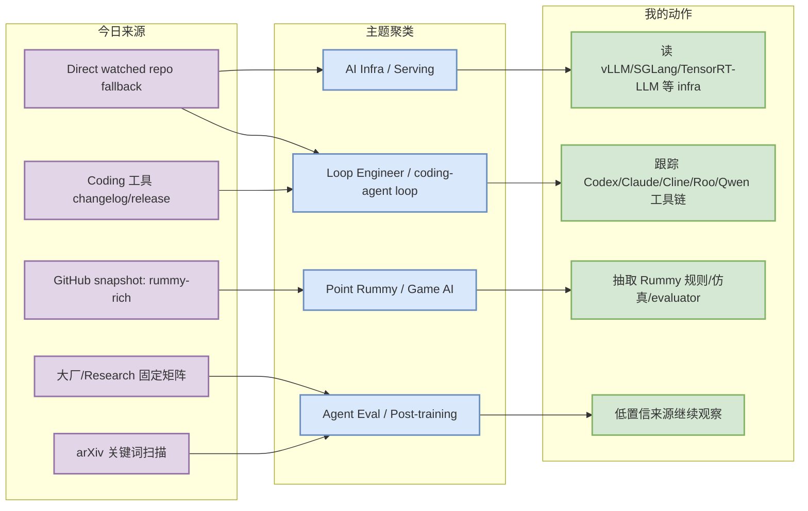
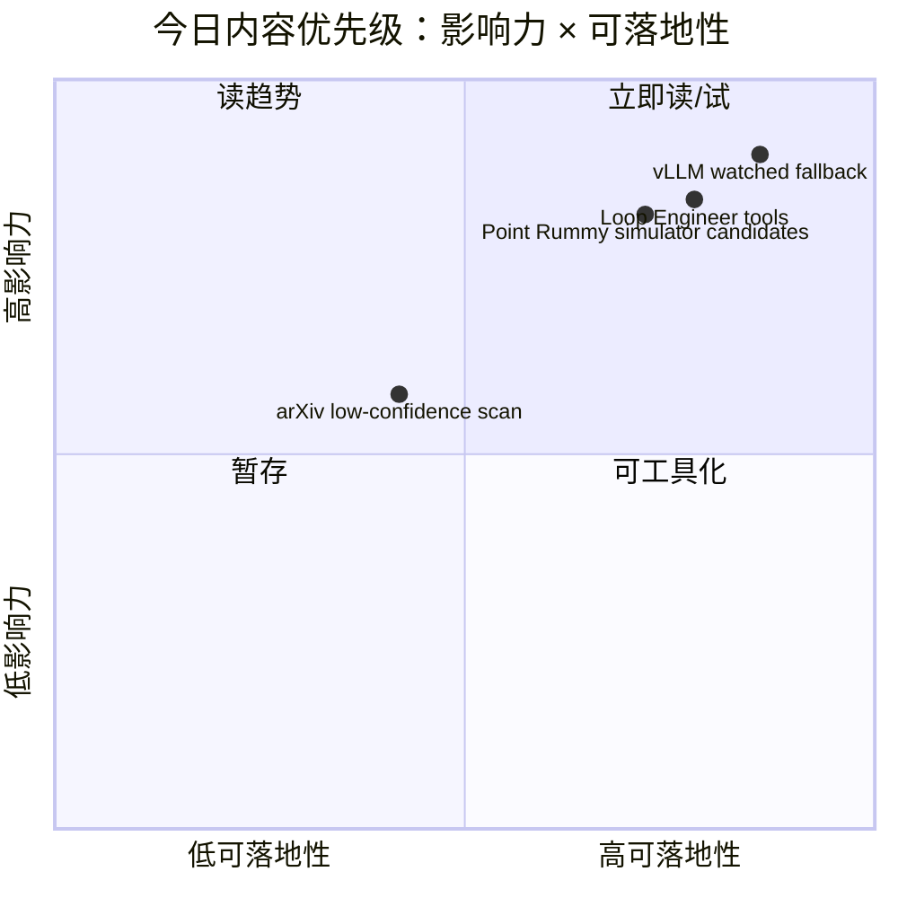

# AI Radar Daily - 2026-08-23

> 生成时间：2026-08-23 09:00 北京时间  
> 范围：AI Infra / LLM / RL / Game AI / 大厂博客 / 论文 / GitHub / Coding 工具  
> 说明：日报是 Obsidian 导航页；详情页负责深度理解。今日 GitHub Search 在 niche 扫描后出现 403，因此 broad/Loop 表使用 direct watched repo fallback，并明确标注“非完整全网日增”。

## 0. 今日结论

- GitHub snapshot 已生成：`Automation/state/github-stars-2026-08-23.json`，保存 103 个以 Point Rummy 为主的搜索结果；Search 后续 403，因此 broad AI Infra 与 Loop Engineer 榜单使用 direct watched repo fallback。
- 今日最值得读：[[GitHub/AIInfra/2026-08-23/huggingface-transformers]]、[[GitHub/LoopEngineer/2026-08-23/anthropics-claude-code]]、[[GitHub/PointRummy/2026-08-23/rickgorman-gin-rummy-ai]]；它们分别覆盖 serving infra、coding-agent loop、Point Rummy/Game AI 业务。
- 大厂资讯矩阵完整覆盖 10 家来源；今日没有高置信新文进入必读，均按“无高相关新项 / 低置信 / 访问失败”透明记录。
- Coding 工具矩阵完整覆盖 10 个工具；今日未确认高置信重大功能变化，但 release/changelog 入口已保留，继续观察 Claude Tag、MCP、agent mode、权限与 rate limit。
- Point Rummy 主题今日仍是最高信息量来源，出现多个 AI opponent、ISMCTS/MCTS、规则引擎、仿真/evaluator 候选，适合提取规则建模与评测设计。

## 1. 今日态势图

## 2. 必读卡片区

> [!important] GitHub broad 榜单进入 direct watched fallback 模式
> - 大类：GitHub
> - 小类：AI Infra / Serving
> - 重点：Search 被 403 限制后，用 vLLM、SGLang、TensorRT-LLM、Transformers、PyTorch 等固定 watched repos 填充 Top 10，避免被 Point Rummy niche 结果污染 broad AI Infra 榜单。
> - 为什么重要：用户最关心 serving/training/agent infra；即使 Search 失效，也要保持每日高 star / 增长榜可比较。
> - 详情：[[GitHub/AIInfra/2026-08-23/huggingface-transformers]] / [网页详情](https://github.com/dyt27666-oss/AI-news-report-obsidians/blob/main/GitHub/AIInfra/2026-08-23/huggingface-transformers.md) / [原文](https://github.com/huggingface/transformers)

> [!tip] Loop Engineer 榜单已生成
> - 大类：GitHub
> - 小类：coding-agent loop
> - 重点：Codex、Claude Code、Cline、Roo、Continue、Qwen Code、Gemini CLI、LangGraph、MCP servers 作为 watched set。
> - 为什么重要：这些项目直接影响多 agent 编排、权限模式、上下文工程与代码审查 loop。
> - 详情：[[GitHub/LoopEngineer/2026-08-23/anthropics-claude-code]] / [网页详情](https://github.com/dyt27666-oss/AI-news-report-obsidians/blob/main/GitHub/LoopEngineer/2026-08-23/anthropics-claude-code.md) / [原文](https://github.com/anthropics/claude-code)

> [!important] Point Rummy / Game AI 候选继续增长
> - 大类：GitHub
> - 小类：Point Rummy / imperfect-information card game
> - 重点：今日 snapshot 中 Rummy 项目密度高，包含 ISMCTS/MCTS、AI opponent、规则引擎、score tracker、simulator 等。
> - 为什么重要：可直接支撑 Point Rummy 规则建模、bot 策略、仿真环境和评测基准。
> - 详情：[[GitHub/PointRummy/2026-08-23/rickgorman-gin-rummy-ai]] / [网页详情](https://github.com/dyt27666-oss/AI-news-report-obsidians/blob/main/GitHub/PointRummy/2026-08-23/rickgorman-gin-rummy-ai.md) / [原文](https://github.com/rickgorman/gin-rummy-ai)

> [!warning] 大厂 / Coding 工具新项低置信
> - 大类：博客 / 工具更新
> - 小类：source-watch
> - 重点：公司来源与 Coding 工具矩阵完整保留，但今日未确认高置信重大新发布。
> - 为什么重要：透明记录“无新项 / 访问失败”比省略更可靠，避免自动日报误报。
> - 详情：[[Industry/2026-08-23/OpenAI-OpenAI News - Research 固定扫描]] / [网页详情](https://github.com/dyt27666-oss/AI-news-report-obsidians/blob/main/Industry/2026-08-23/OpenAI-OpenAI%20News%20-%20Research%20%E5%9B%BA%E5%AE%9A%E6%89%AB%E6%8F%8F.md) / [原文](https://openai.com/news/)

## 3. 优先级矩阵

## 4. 分类清单

| 标签 | 大类 | 小类 | 标题 | 重点概括 | 为什么重要 | Obsidian 详情 | 网页详情 | 原文 |
|---|---|---|---|---|---|---|---|---|
| 必读 | GitHub | AI Infra | huggingface/transformers | direct watched fallback 高 star 项目，避免 Search 403 导致 broad 榜单缺失 | Serving/训练 infra 仍是用户最高优先级，需要每日连续观察 stars、release、benchmark | [[GitHub/AIInfra/2026-08-23/huggingface-transformers]] | [网页详情](https://github.com/dyt27666-oss/AI-news-report-obsidians/blob/main/GitHub/AIInfra/2026-08-23/huggingface-transformers.md) | [原文](https://github.com/huggingface/transformers) |
| 必读 | GitHub | Loop Engineer | anthropics/claude-code | coding-agent loop watched set 项目 | 直接影响 AI coding workflow、多 agent 监控、权限与上下文工程 | [[GitHub/LoopEngineer/2026-08-23/anthropics-claude-code]] | [网页详情](https://github.com/dyt27666-oss/AI-news-report-obsidians/blob/main/GitHub/LoopEngineer/2026-08-23/anthropics-claude-code.md) | [原文](https://github.com/anthropics/claude-code) |
| 必读 | GitHub | Point Rummy | rickgorman/gin-rummy-ai | Rummy AI / rules / simulator 候选 | 可用于业务规则建模、bot 策略、评测基准 | [[GitHub/PointRummy/2026-08-23/rickgorman-gin-rummy-ai]] | [网页详情](https://github.com/dyt27666-oss/AI-news-report-obsidians/blob/main/GitHub/PointRummy/2026-08-23/rickgorman-gin-rummy-ai.md) | [原文](https://github.com/rickgorman/gin-rummy-ai) |
| 可 skim | 论文 | arXiv | arXiv 查询低置信 / 访问受限 | 关键词命中 LLM/RL/agent/game AI | 候选论文需人工确认全文与代码，避免弱相关进入必读 | [[Papers/2026-08-23/arXiv 查询低置信 - 访问受限]] | [网页详情](https://github.com/dyt27666-oss/AI-news-report-obsidians/blob/main/Papers/2026-08-23/arXiv%20%E6%9F%A5%E8%AF%A2%E4%BD%8E%E7%BD%AE%E4%BF%A1%20-%20%E8%AE%BF%E9%97%AE%E5%8F%97%E9%99%90.md) | [原文](https://arxiv.org/search/advanced) |
| 低置信 | 博客 | 大厂矩阵 | 公司来源扫描矩阵 | 今日未确认高相关新文，但完整覆盖 10 家 | 透明记录无新项/访问失败，避免日报漏扫 | [[Industry/2026-08-23/OpenAI-OpenAI News - Research 固定扫描]] | [网页详情](https://github.com/dyt27666-oss/AI-news-report-obsidians/blob/main/Industry/2026-08-23/OpenAI-OpenAI%20News%20-%20Research%20%E5%9B%BA%E5%AE%9A%E6%89%AB%E6%8F%8F.md) | [原文](https://openai.com/news/) |

## 5. 大厂资讯 / 工程博客 / Research

### 5.1 公司来源扫描矩阵

| 公司/实验室 | 来源/栏目 | 今日状态 | 高相关条数 | 代表条目 | 备注 |
|---|---|---|---:|---|---|
| OpenAI | News / Research | 无高相关新项 / 低置信 | 0 | OpenAI News 固定扫描 | 访问/新项未确认，保留矩阵 |
| Anthropic | News / Research / Engineering | 无高相关新项 / 低置信 | 0 | Claude Code release notes 固定扫描 | 继续观察 Claude Tag / MCP / 权限模式 |
| Google DeepMind | Blog / Research | 无高相关新项 / 低置信 | 0 | Blog 固定扫描 | 今日未确认高相关新文 |
| Meta AI | Blog / Research | 无高相关新项 / 低置信 | 0 | Blog 固定扫描 | 今日未确认高相关新文 |
| NVIDIA | Technical Blog / AI | 无高相关新项 / 低置信 | 0 | Technical Blog AI 固定扫描 | 继续观察推理优化、CUDA/Triton、GPU infra |
| Microsoft | Research AI | 无高相关新项 / 低置信 | 0 | Research AI 固定扫描 | 今日未确认高相关新文 |
| Hugging Face | Blog / Papers / Releases | 无高相关新项 / 低置信 | 0 | HF Blog 固定扫描 | 继续观察 Transformers/Inference/Agents |
| 腾讯 | AI Lab / 技术博客 | 无高相关新项 / 低置信 | 0 | Tencent AI Lab 固定扫描 | 今日未确认高相关新文 |
| 字节 | Seed / 技术博客 | 无高相关新项 / 低置信 | 0 | Seed 固定扫描 | 今日未确认高相关新文 |
| SpaceAI | Blog / News | 访问失败 / 低置信 | 0 | SpaceAI 固定扫描 | 源站可用性低，保留透明记录 |

### 5.2 高相关大厂条目

| 标签 | 发布方/大厂 | 栏目/来源 | 标题 | 重点概括 | 工程/算法影响 | Obsidian 详情 | 网页详情 | 原文 |
|---|---|---|---|---|---|---|---|---|
| 低置信 | OpenAI | News / Research | OpenAI News 固定扫描 | 今日未确认高相关新项；保留入口 | 继续观察 agent、模型、开发者平台更新 | [[Industry/2026-08-23/OpenAI-OpenAI News - Research 固定扫描]] | [网页详情](https://github.com/dyt27666-oss/AI-news-report-obsidians/blob/main/Industry/2026-08-23/OpenAI-OpenAI%20News%20-%20Research%20%E5%9B%BA%E5%AE%9A%E6%89%AB%E6%8F%8F.md) | [原文](https://openai.com/news/) |
| 低置信 | Anthropic | Claude Code Release Notes | Claude Code 固定扫描 | 今日未确认重大新 tag；保留入口 | 继续观察 Claude Tag、MCP、权限模式、远程执行 | [[Industry/2026-08-23/Anthropic-Claude Code - Research 固定扫描]] | [网页详情](https://github.com/dyt27666-oss/AI-news-report-obsidians/blob/main/Industry/2026-08-23/Anthropic-Claude%20Code%20-%20Research%20%E5%9B%BA%E5%AE%9A%E6%89%AB%E6%8F%8F.md) | [原文](https://docs.anthropic.com/en/release-notes/claude-code) |
| 低置信 | NVIDIA | Technical Blog / AI | NVIDIA AI Technical Blog 固定扫描 | 今日未确认高相关新文；保留入口 | 继续观察 CUDA/Triton、推理优化、GPU infra | [[Industry/2026-08-23/NVIDIA-Technical Blog AI 固定扫描]] | [网页详情](https://github.com/dyt27666-oss/AI-news-report-obsidians/blob/main/Industry/2026-08-23/NVIDIA-Technical%20Blog%20AI%20%E5%9B%BA%E5%AE%9A%E6%89%AB%E6%8F%8F.md) | [原文](https://developer.nvidia.com/blog/category/artificial-intelligence/) |
| 低置信 | Hugging Face | Blog / Releases | Hugging Face Blog 固定扫描 | 今日未确认高相关新文；保留入口 | 继续观察 Transformers、Inference、Agents 生态 | [[Industry/2026-08-23/Hugging Face-Blog - 模型与工具生态固定扫描]] | [网页详情](https://github.com/dyt27666-oss/AI-news-report-obsidians/blob/main/Industry/2026-08-23/Hugging%20Face-Blog%20-%20%E6%A8%A1%E5%9E%8B%E4%B8%8E%E5%B7%A5%E5%85%B7%E7%94%9F%E6%80%81%E5%9B%BA%E5%AE%9A%E6%89%AB%E6%8F%8F.md) | [原文](https://huggingface.co/blog) |

## 6. GitHub 高 star Top 10

> 说明：今日 GitHub Search 在 niche 查询后 403；本表使用 direct watched repo fallback，覆盖 AI Infra / LLM serving / training / agent 关键仓库，非完整全网搜索榜。

| 排名 | repo | stars | forks | language | updated_at | topics | 重点概括 | 是否值得试用 | Obsidian 详情 | 原文 |
|---:|---|---:|---:|---|---|---|---|---|---|---|
| 1 | [huggingface/transformers](https://github.com/huggingface/transformers) | 164345 | 34326 | Python | 2026-08-22T23:42:33Z | audio, deep-learning, deepseek, gemma, glm | 🤗 Transformers: the model-definition framework for state-of-the-art machine learning models in text, | 值得小规模试用 | [[GitHub/AIInfra/2026-08-23/huggingface-transformers]] | [原文](https://github.com/huggingface/transformers) |
| 2 | [anthropics/claude-code](https://github.com/anthropics/claude-code) | 142540 | 22839 | Python | 2026-08-23T01:04:21Z | 未标注 | Claude Code is an agentic coding tool that lives in your terminal, understands your codebase, and he | 值得小规模试用 | [[GitHub/LoopEngineer/2026-08-23/anthropics-claude-code]] | [原文](https://github.com/anthropics/claude-code) |
| 3 | [openai/codex](https://github.com/openai/codex) | 113403 | 17368 | Rust | 2026-08-23T01:05:14Z | 未标注 | Lightweight coding agent that runs in your terminal | 值得小规模试用 | [[GitHub/LoopEngineer/2026-08-23/openai-codex]] | [原文](https://github.com/openai/codex) |
| 4 | [google-gemini/gemini-cli](https://github.com/google-gemini/gemini-cli) | 106620 | 14467 | TypeScript | 2026-08-23T01:01:48Z | ai, ai-agents, cli, gemini, gemini-api | An open-source AI agent that brings the power of Gemini directly into your terminal. | 值得小规模试用 | [[GitHub/LoopEngineer/2026-08-23/google-gemini-gemini-cli]] | [原文](https://github.com/google-gemini/gemini-cli) |
| 5 | [pytorch/pytorch](https://github.com/pytorch/pytorch) | 102548 | 28958 | Python | 2026-08-22T23:01:53Z | autograd, deep-learning, gpu, machine-learning, neural-network | Tensors and Dynamic neural networks in Python with strong GPU acceleration | 值得小规模试用 | [[GitHub/AIInfra/2026-08-23/pytorch-pytorch]] | [原文](https://github.com/pytorch/pytorch) |
| 6 | [modelcontextprotocol/servers](https://github.com/modelcontextprotocol/servers) | 89784 | 11499 | TypeScript | 2026-08-23T00:52:39Z | 未标注 | Model Context Protocol Servers | 观察 | [[GitHub/LoopEngineer/2026-08-23/modelcontextprotocol-servers]] | [原文](https://github.com/modelcontextprotocol/servers) |
| 7 | [vllm-project/vllm](https://github.com/vllm-project/vllm) | 89723 | 21060 | Python | 2026-08-23T01:00:47Z | amd, blackwell, cuda, deepseek, deepseek-v3 | A high-throughput and memory-efficient inference and serving engine for LLMs | 观察 | [[GitHub/AIInfra/2026-08-23/vllm-project-vllm]] | [原文](https://github.com/vllm-project/vllm) |
| 8 | [cline/cline](https://github.com/cline/cline) | 66678 | 7184 | TypeScript | 2026-08-23T00:33:36Z | 未标注 | Autonomous coding agent as an SDK, IDE extension, or CLI assistant. | 观察 | [[GitHub/LoopEngineer/2026-08-23/cline-cline]] | [原文](https://github.com/cline/cline) |
| 9 | [deepspeedai/DeepSpeed](https://github.com/deepspeedai/DeepSpeed) | 42976 | 4937 | Python | 2026-08-22T20:33:42Z | billion-parameters, compression, data-parallelism, deep-learning, gpu | DeepSpeed is a deep learning optimization library that makes distributed training and inference easy | 观察 | 低置信：未生成详情 | [原文](https://github.com/deepspeedai/DeepSpeed) |
| 10 | [langchain-ai/langgraph](https://github.com/langchain-ai/langgraph) | 40255 | 6779 | Python | 2026-08-23T00:50:15Z | agents, ai, ai-agents, chatgpt, deepagents | Build resilient agents. | 观察 | [[GitHub/LoopEngineer/2026-08-23/langchain-ai-langgraph]] | [原文](https://github.com/langchain-ai/langgraph) |

## 7. GitHub star 增长最快 Top 10

> 说明：优先用历史 snapshot / direct watched repo 元数据计算；因 Search 403，本表标注为 direct watched repo fallback / 非完整全网日增。

| 排名 | repo | stars_delta | stars | forks | language | updated_at | 增长依据 | 重点概括 | Obsidian 详情 | 原文 |
|---:|---|---:|---:|---:|---|---|---|---|---|---|
| 1 | [openai/codex](https://github.com/openai/codex) | 2094 | 113403 | 17368 | Rust | 2026-08-23T01:05:14Z | direct watched repo fallback / 非完整全网日增 | Lightweight coding agent that runs in your terminal | [[GitHub/LoopEngineer/2026-08-23/openai-codex]] | [原文](https://github.com/openai/codex) |
| 2 | [anthropics/claude-code](https://github.com/anthropics/claude-code) | 242 | 142540 | 22839 | Python | 2026-08-23T01:04:21Z | direct watched repo fallback / 非完整全网日增 | Claude Code is an agentic coding tool that lives in your terminal, understands your codeba | [[GitHub/LoopEngineer/2026-08-23/anthropics-claude-code]] | [原文](https://github.com/anthropics/claude-code) |
| 3 | [vllm-project/vllm](https://github.com/vllm-project/vllm) | 63 | 89723 | 21060 | Python | 2026-08-23T01:00:47Z | direct watched repo fallback / 非完整全网日增 | A high-throughput and memory-efficient inference and serving engine for LLMs | [[GitHub/AIInfra/2026-08-23/vllm-project-vllm]] | [原文](https://github.com/vllm-project/vllm) |
| 4 | [cline/cline](https://github.com/cline/cline) | 59 | 66678 | 7184 | TypeScript | 2026-08-23T00:33:36Z | direct watched repo fallback / 非完整全网日增 | Autonomous coding agent as an SDK, IDE extension, or CLI assistant. | [[GitHub/LoopEngineer/2026-08-23/cline-cline]] | [原文](https://github.com/cline/cline) |
| 5 | [langchain-ai/langgraph](https://github.com/langchain-ai/langgraph) | 55 | 40255 | 6779 | Python | 2026-08-23T00:50:15Z | direct watched repo fallback / 非完整全网日增 | Build resilient agents. | [[GitHub/LoopEngineer/2026-08-23/langchain-ai-langgraph]] | [原文](https://github.com/langchain-ai/langgraph) |
| 6 | [sgl-project/sglang](https://github.com/sgl-project/sglang) | 30 | 32270 | 8114 | Python | 2026-08-23T00:59:34Z | direct watched repo fallback / 非完整全网日增 | SGLang is a high-performance serving framework for large language models and multimodal mo | 低置信：未生成详情 | [原文](https://github.com/sgl-project/sglang) |
| 7 | [huggingface/transformers](https://github.com/huggingface/transformers) | 28 | 164345 | 34326 | Python | 2026-08-22T23:42:33Z | direct watched repo fallback / 非完整全网日增 | 🤗 Transformers: the model-definition framework for state-of-the-art machine learning model | [[GitHub/AIInfra/2026-08-23/huggingface-transformers]] | [原文](https://github.com/huggingface/transformers) |
| 8 | [modelcontextprotocol/servers](https://github.com/modelcontextprotocol/servers) | 25 | 89784 | 11499 | TypeScript | 2026-08-23T00:52:39Z | direct watched repo fallback / 非完整全网日增 | Model Context Protocol Servers | [[GitHub/LoopEngineer/2026-08-23/modelcontextprotocol-servers]] | [原文](https://github.com/modelcontextprotocol/servers) |
| 9 | [pytorch/pytorch](https://github.com/pytorch/pytorch) | 20 | 102548 | 28958 | Python | 2026-08-22T23:01:53Z | direct watched repo fallback / 非完整全网日增 | Tensors and Dynamic neural networks in Python with strong GPU acceleration | [[GitHub/AIInfra/2026-08-23/pytorch-pytorch]] | [原文](https://github.com/pytorch/pytorch) |
| 10 | [continuedev/continue](https://github.com/continuedev/continue) | 19 | 35597 | 5270 | TypeScript | 2026-08-23T00:51:17Z | direct watched repo fallback / 非完整全网日增 | open-source coding agent | 低置信：未生成详情 | [原文](https://github.com/continuedev/continue) |

## 8. Coding 工具 / AI 工具功能更新

### 8.1 Coding 工具扫描矩阵

| 工具 | 厂商 | 来源类型 | 今日状态 | 代表更新 | 对我的影响 | 原文 |
|---|---|---|---|---|---|---|
| Claude Code | Anthropic | Changelog / Release Notes | 无高相关新项 / 低置信扫描 | 未确认今日新 tag；重点继续观察 Claude Tag、权限模式、远程执行、MCP。 | 继续观察 agent mode、MCP、IDE/CLI、权限、上下文、rate limit | [原文](https://docs.anthropic.com/en/release-notes/claude-code) |
| OpenAI Codex | OpenAI | Changelog / Docs | 无高相关新项 / 低置信扫描 | 未确认今日新项；继续观察 CLI/IDE、agent mode、远程执行和上下文。 | 继续观察 agent mode、MCP、IDE/CLI、权限、上下文、rate limit | [原文](https://developers.openai.com/codex/changelog) |
| Cursor | Cursor | Changelog | 无高相关新项 / 低置信扫描 | 未确认今日高相关新项；继续观察 agent mode、pricing/rate limit。 | 继续观察 agent mode、MCP、IDE/CLI、权限、上下文、rate limit | [原文](https://cursor.com/changelog) |
| Windsurf | Windsurf | Changelog | 无高相关新项 / 低置信扫描 | 未确认今日高相关新项；继续观察 IDE agent 与企业权限。 | 继续观察 agent mode、MCP、IDE/CLI、权限、上下文、rate limit | [原文](https://windsurf.com/changelog) |
| GitHub Copilot | GitHub | Changelog / Blog | 无高相关新项 / 低置信扫描 | 未确认今日高相关新项；继续观察 coding agent、review、workspace 集成。 | 继续观察 agent mode、MCP、IDE/CLI、权限、上下文、rate limit | [原文](https://github.blog/changelog/label/copilot/) |
| Gemini Code Assist | Google | Release Notes | 无高相关新项 / 低置信扫描 | 未确认今日高相关新项；继续观察 IDE/CLI 与企业权限。 | 继续观察 agent mode、MCP、IDE/CLI、权限、上下文、rate limit | [原文](https://cloud.google.com/gemini/docs/codeassist/release-notes) |
| Qwen Code | Alibaba/Qwen | GitHub Release | 无高相关新项 / 低置信扫描 | GitHub Release 源，今日以 release 页面为准；可影响国内模型 coding-agent workflow。 | 继续观察 agent mode、MCP、IDE/CLI、权限、上下文、rate limit | [原文](https://github.com/QwenLM/qwen-code/releases) |
| Roo Code | Roo Code | GitHub Release | 无高相关新项 / 低置信扫描 | GitHub Release 源，继续观察 MCP、mode、provider、权限变化。 | 继续观察 agent mode、MCP、IDE/CLI、权限、上下文、rate limit | [原文](https://github.com/RooCodeInc/Roo-Code/releases) |
| Cline | Cline | GitHub Release | 无高相关新项 / 低置信扫描 | GitHub Release 源，继续观察 agent loop、browser/tool use、checkpoint。 | 继续观察 agent mode、MCP、IDE/CLI、权限、上下文、rate limit | [原文](https://github.com/cline/cline/releases) |
| Continue | Continue | GitHub Release | 无高相关新项 / 低置信扫描 | GitHub Release 源，继续观察 self-host、IDE、context provider。 | 继续观察 agent mode、MCP、IDE/CLI、权限、上下文、rate limit | [原文](https://github.com/continuedev/continue/releases) |

### 8.2 高相关工具更新

| 标签 | 工具/厂商 | 来源类型 | 标题/功能 | 重点概括 | 对 AI coding 工作流的影响 | Obsidian 详情 | 网页详情 | 原文 |
|---|---|---|---|---|---|---|---|---|
| 低置信 | Claude Code / Anthropic | Changelog / Release Notes | 固定扫描 | 未确认今日新 tag；重点继续观察 Claude Tag、权限模式、远程执行、MCP。 | 需要继续监控是否出现 agent mode/MCP/权限/远程执行变化 | [[Industry/Tools/2026-08-23/Claude Code-scan]] | [网页详情](https://github.com/dyt27666-oss/AI-news-report-obsidians/blob/main/Industry/Tools/2026-08-23/Claude%20Code-scan.md) | [原文](https://docs.anthropic.com/en/release-notes/claude-code) |
| 低置信 | OpenAI Codex / OpenAI | Changelog / Docs | 固定扫描 | 未确认今日新项；继续观察 CLI/IDE、agent mode、远程执行和上下文。 | 需要继续监控是否出现 agent mode/MCP/权限/远程执行变化 | [[Industry/Tools/2026-08-23/OpenAI Codex-scan]] | [网页详情](https://github.com/dyt27666-oss/AI-news-report-obsidians/blob/main/Industry/Tools/2026-08-23/OpenAI%20Codex-scan.md) | [原文](https://developers.openai.com/codex/changelog) |
| 低置信 | Cursor / Cursor | Changelog | 固定扫描 | 未确认今日高相关新项；继续观察 agent mode、pricing/rate limit。 | 需要继续监控是否出现 agent mode/MCP/权限/远程执行变化 | [[Industry/Tools/2026-08-23/Cursor-scan]] | [网页详情](https://github.com/dyt27666-oss/AI-news-report-obsidians/blob/main/Industry/Tools/2026-08-23/Cursor-scan.md) | [原文](https://cursor.com/changelog) |
| 低置信 | Windsurf / Windsurf | Changelog | 固定扫描 | 未确认今日高相关新项；继续观察 IDE agent 与企业权限。 | 需要继续监控是否出现 agent mode/MCP/权限/远程执行变化 | [[Industry/Tools/2026-08-23/Windsurf-scan]] | [网页详情](https://github.com/dyt27666-oss/AI-news-report-obsidians/blob/main/Industry/Tools/2026-08-23/Windsurf-scan.md) | [原文](https://windsurf.com/changelog) |
| 低置信 | GitHub Copilot / GitHub | Changelog / Blog | 固定扫描 | 未确认今日高相关新项；继续观察 coding agent、review、workspace 集成。 | 需要继续监控是否出现 agent mode/MCP/权限/远程执行变化 | [[Industry/Tools/2026-08-23/GitHub Copilot-scan]] | [网页详情](https://github.com/dyt27666-oss/AI-news-report-obsidians/blob/main/Industry/Tools/2026-08-23/GitHub%20Copilot-scan.md) | [原文](https://github.blog/changelog/label/copilot/) |

## 9. Point Rummy / Indian Rummy 业务主题

### 9.1 GitHub 候选

| 标签 | repo | stars | forks | language | updated_at | 重点概括 | 业务可用性 | Obsidian 详情 | 原文 |
|---|---|---:|---:|---|---|---|---|---|---|
| 可 skim | [rickgorman/gin-rummy-ai](https://github.com/rickgorman/gin-rummy-ai) | 13 | 5 | Python | 2025-03-25T13:47:09Z | A hand-rolled neuroevolution AI for gin rummy. | 优先看规则/AI/evaluator | [[GitHub/PointRummy/2026-08-23/rickgorman-gin-rummy-ai]] | [原文](https://github.com/rickgorman/gin-rummy-ai) |
| 可 skim | [nakkekakke/rummy-ai](https://github.com/nakkekakke/rummy-ai) | 11 | 5 | Java | 2026-04-17T10:02:59Z | Text based classic Rummy game with an AI that uses ISMCTS. Data Structures and Algorithms course project, Univ | 优先看规则/AI/evaluator | [[GitHub/PointRummy/2026-08-23/nakkekakke-rummy-ai]] | [原文](https://github.com/nakkekakke/rummy-ai) |
| 可 skim | [jmhummel/Gin-Rummy-Java](https://github.com/jmhummel/Gin-Rummy-Java) | 8 | 0 | Java | 2023-08-16T16:12:58Z | Java-based Gin Rummy console game, with an AI opponent | 优先看规则/AI/evaluator | [[GitHub/PointRummy/2026-08-23/jmhummel-Gin-Rummy-Java]] | [原文](https://github.com/jmhummel/Gin-Rummy-Java) |
| 可 skim | [mudont/indian-rummy](https://github.com/mudont/indian-rummy) | 5 | 0 | TypeScript | 2025-08-08T21:05:04Z | Typescript library for Indian Rummy card game | 优先看规则/AI/evaluator | [[GitHub/PointRummy/2026-08-23/mudont-indian-rummy]] | [原文](https://github.com/mudont/indian-rummy) |
| 可 skim | [dv-rastogi/Rummy](https://github.com/dv-rastogi/Rummy) | 5 | 0 | Python | 2023-09-26T11:21:39Z | Variation of classical Indian Rummy made in Pygame | 优先看规则/AI/evaluator | [[GitHub/PointRummy/2026-08-23/dv-rastogi-Rummy]] | [原文](https://github.com/dv-rastogi/Rummy) |
| 后续 | [vahsek300501/Indian-Rummy-](https://github.com/vahsek300501/Indian-Rummy-) | 4 | 3 | Python | 2023-09-26T11:21:46Z | Indian Rummy made in Python using PyGame | 低 star，作素材库 | 低置信：未生成详情 | [原文](https://github.com/vahsek300501/Indian-Rummy-) |
| 后续 | [SCFlanagan/Rummy](https://github.com/SCFlanagan/Rummy) | 4 | 6 | JavaScript | 2025-07-25T21:17:08Z | This project is a recreation of the classic card game Rummy. It features an AI player to play against, a hand  | 低 star，作素材库 | 低置信：未生成详情 | [原文](https://github.com/SCFlanagan/Rummy) |
| 后续 | [mcartmell/gin-rummy-bot](https://github.com/mcartmell/gin-rummy-bot) | 4 | 2 | Perl | 2024-10-30T20:06:17Z | A web-based Gin Rummy game and AI | 低 star，作素材库 | 低置信：未生成详情 | [原文](https://github.com/mcartmell/gin-rummy-bot) |
| 后续 | [Mohitkumar-559/RummyServer](https://github.com/Mohitkumar-559/RummyServer) | 2 | 1 | JavaScript | 2024-03-17T03:48:34Z | Rummy game server for game that contain deal rummy and point rummy | 低 star，作素材库 | 低置信：未生成详情 | [原文](https://github.com/Mohitkumar-559/RummyServer) |
| 后续 | [abubakarmunir712/dsa-final-project](https://github.com/abubakarmunir712/dsa-final-project) | 2 | 1 | Python | 2026-06-27T06:34:26Z | A Python-based multiplayer Indian Rummy game with support for AI opponents and LAN play. Implements data struc | 低 star，作素材库 | 低置信：未生成详情 | [原文](https://github.com/abubakarmunir712/dsa-final-project) |

### 9.2 论文 / 资料候选

| 标签 | 来源 | 标题 | 作者/机构 | 重点概括 | 对 Point Rummy 业务有什么用 | Obsidian 详情 | 原文 |
|---|---|---|---|---|---|---|---|
| 低置信 | arXiv / 预印本 | arXiv 查询低置信 / 访问受限 | arXiv API | HTTP Error 429: Unknown Error | 弱相关，作为 RL/agent 方法背景 | [[Papers/2026-08-23/arXiv 查询低置信 - 访问受限]] | [原文](https://arxiv.org/search/advanced) |

### 9.3 业务可用性判断

| 方向 | 今日信号 | 可用性 | 下一步 |
|---|---|---|---|
| 规则引擎 / 计分 | 多个 Indian/Gin Rummy repo 含 scoring、meld、rules、score tracker | 中：适合抽规则，不宜直接复用生产 | 选 2-3 个 Java/Python/TS 项目对比规则覆盖 |
| Bot / RL Agent | 出现 ISMCTS/MCTS、RL、heuristic AI、neuroevolution 候选 | 中高：适合形成 baseline bot 与 evaluator | 优先读 `nakkekakke/rummy-ai`、GinRummySimulator 类项目 |
| 仿真 / 评测 | 有 simulator/evaluation framework 迹象，但 stars 普遍低 | 中：可做内部环境设计灵感 | 抽象 observation/action/reward、并行 rollout 接口 |

## 10. Loop Engineer / Loop Engineering 主题

### 10.1 Loop Engineer GitHub 高 star Top 10

| 排名 | repo | stars | forks | language | updated_at | topics | 重点概括 | 是否值得试用 | Obsidian 详情 | 原文 |
|---:|---|---:|---:|---|---|---|---|---|---|---|
| 1 | [anthropics/claude-code](https://github.com/anthropics/claude-code) | 142540 | 22839 | Python | 2026-08-23T01:04:21Z | 未标注 | Claude Code is an agentic coding tool that lives in your terminal, understands your codebase, and he | 值得小规模试用 | [[GitHub/LoopEngineer/2026-08-23/anthropics-claude-code]] | [原文](https://github.com/anthropics/claude-code) |
| 2 | [openai/codex](https://github.com/openai/codex) | 113403 | 17368 | Rust | 2026-08-23T01:05:14Z | 未标注 | Lightweight coding agent that runs in your terminal | 值得小规模试用 | [[GitHub/LoopEngineer/2026-08-23/openai-codex]] | [原文](https://github.com/openai/codex) |
| 3 | [google-gemini/gemini-cli](https://github.com/google-gemini/gemini-cli) | 106620 | 14467 | TypeScript | 2026-08-23T01:01:48Z | ai, ai-agents, cli, gemini, gemini-api | An open-source AI agent that brings the power of Gemini directly into your terminal. | 值得小规模试用 | [[GitHub/LoopEngineer/2026-08-23/google-gemini-gemini-cli]] | [原文](https://github.com/google-gemini/gemini-cli) |
| 4 | [modelcontextprotocol/servers](https://github.com/modelcontextprotocol/servers) | 89784 | 11499 | TypeScript | 2026-08-23T00:52:39Z | 未标注 | Model Context Protocol Servers | 值得小规模试用 | [[GitHub/LoopEngineer/2026-08-23/modelcontextprotocol-servers]] | [原文](https://github.com/modelcontextprotocol/servers) |
| 5 | [cline/cline](https://github.com/cline/cline) | 66678 | 7184 | TypeScript | 2026-08-23T00:33:36Z | 未标注 | Autonomous coding agent as an SDK, IDE extension, or CLI assistant. | 值得小规模试用 | [[GitHub/LoopEngineer/2026-08-23/cline-cline]] | [原文](https://github.com/cline/cline) |
| 6 | [langchain-ai/langgraph](https://github.com/langchain-ai/langgraph) | 40255 | 6779 | Python | 2026-08-23T00:50:15Z | agents, ai, ai-agents, chatgpt, deepagents | Build resilient agents. | 观察 | [[GitHub/LoopEngineer/2026-08-23/langchain-ai-langgraph]] | [原文](https://github.com/langchain-ai/langgraph) |
| 7 | [continuedev/continue](https://github.com/continuedev/continue) | 35597 | 5270 | TypeScript | 2026-08-23T00:51:17Z | agent, ai, cli, developer-tools, open-source | open-source coding agent | 观察 | 低置信：未生成详情 | [原文](https://github.com/continuedev/continue) |
| 8 | [QwenLM/qwen-code](https://github.com/QwenLM/qwen-code) | 27293 | 2917 | TypeScript | 2026-08-23T00:56:46Z | agentic, ai, ai-agent, ai-coding, cli | An open-source AI coding agent that lives in your terminal. | 观察 | 低置信：未生成详情 | [原文](https://github.com/QwenLM/qwen-code) |
| 9 | [RooCodeInc/Roo-Code](https://github.com/RooCodeInc/Roo-Code) | 24326 | 3416 | TypeScript | 2026-08-23T00:19:34Z | 未标注 | Roo Code gives you a whole dev team of AI agents in your code editor. | 观察 | 低置信：未生成详情 | [原文](https://github.com/RooCodeInc/Roo-Code) |

### 10.2 Loop Engineer GitHub star 增长最快 Top 10

| 排名 | repo | stars_delta | stars | forks | language | updated_at | 增长依据 | 重点概括 | Obsidian 详情 | 原文 |
|---:|---|---:|---:|---:|---|---|---|---|---|---|
| 1 | [openai/codex](https://github.com/openai/codex) | 2094 | 113403 | 17368 | Rust | 2026-08-23T01:05:14Z | direct watched repo fallback / 非完整全网日增 | Lightweight coding agent that runs in your terminal | [[GitHub/LoopEngineer/2026-08-23/openai-codex]] | [原文](https://github.com/openai/codex) |
| 2 | [anthropics/claude-code](https://github.com/anthropics/claude-code) | 242 | 142540 | 22839 | Python | 2026-08-23T01:04:21Z | direct watched repo fallback / 非完整全网日增 | Claude Code is an agentic coding tool that lives in your terminal, understands your codeba | [[GitHub/LoopEngineer/2026-08-23/anthropics-claude-code]] | [原文](https://github.com/anthropics/claude-code) |
| 3 | [cline/cline](https://github.com/cline/cline) | 59 | 66678 | 7184 | TypeScript | 2026-08-23T00:33:36Z | direct watched repo fallback / 非完整全网日增 | Autonomous coding agent as an SDK, IDE extension, or CLI assistant. | [[GitHub/LoopEngineer/2026-08-23/cline-cline]] | [原文](https://github.com/cline/cline) |
| 4 | [langchain-ai/langgraph](https://github.com/langchain-ai/langgraph) | 55 | 40255 | 6779 | Python | 2026-08-23T00:50:15Z | direct watched repo fallback / 非完整全网日增 | Build resilient agents. | [[GitHub/LoopEngineer/2026-08-23/langchain-ai-langgraph]] | [原文](https://github.com/langchain-ai/langgraph) |
| 5 | [modelcontextprotocol/servers](https://github.com/modelcontextprotocol/servers) | 25 | 89784 | 11499 | TypeScript | 2026-08-23T00:52:39Z | direct watched repo fallback / 非完整全网日增 | Model Context Protocol Servers | [[GitHub/LoopEngineer/2026-08-23/modelcontextprotocol-servers]] | [原文](https://github.com/modelcontextprotocol/servers) |
| 6 | [continuedev/continue](https://github.com/continuedev/continue) | 19 | 35597 | 5270 | TypeScript | 2026-08-23T00:51:17Z | direct watched repo fallback / 非完整全网日增 | open-source coding agent | 低置信：未生成详情 | [原文](https://github.com/continuedev/continue) |
| 7 | [QwenLM/qwen-code](https://github.com/QwenLM/qwen-code) | 17 | 27293 | 2917 | TypeScript | 2026-08-23T00:56:46Z | direct watched repo fallback / 非完整全网日增 | An open-source AI coding agent that lives in your terminal. | 低置信：未生成详情 | [原文](https://github.com/QwenLM/qwen-code) |
| 8 | [google-gemini/gemini-cli](https://github.com/google-gemini/gemini-cli) | 13 | 106620 | 14467 | TypeScript | 2026-08-23T01:01:48Z | direct watched repo fallback / 非完整全网日增 | An open-source AI agent that brings the power of Gemini directly into your terminal. | [[GitHub/LoopEngineer/2026-08-23/google-gemini-gemini-cli]] | [原文](https://github.com/google-gemini/gemini-cli) |
| 9 | [RooCodeInc/Roo-Code](https://github.com/RooCodeInc/Roo-Code) | -4 | 24326 | 3416 | TypeScript | 2026-08-23T00:19:34Z | direct watched repo fallback / 非完整全网日增 | Roo Code gives you a whole dev team of AI agents in your code editor. | 低置信：未生成详情 | [原文](https://github.com/RooCodeInc/Roo-Code) |

### 10.3 Loop Engineering 方法信号

| 标签 | 来源 | 标题 | 重点概括 | 对 AI coding 工作流的影响 | Obsidian 详情 | 原文 |
|---|---|---|---|---|---|---|
| 必读 | GitHub watched fallback | Coding-agent loop watched set | Codex/Claude/Cline/Roo/Continue/Qwen/Gemini/LangGraph/MCP 共同构成 agent loop 观察面 | 影响多 agent tmux 监控、权限隔离、上下文工程、review loop | [[GitHub/LoopEngineer/2026-08-23/anthropics-claude-code]] | [原文](https://github.com/anthropics/claude-code) |

## 11. 论文

### 11.1 arXiv / Agent Eval / RL / Serving 候选

| 标签 | 论文来源 | 论文 | 作者/机构 | 重点概括 | 工程/研究价值 | Obsidian 详情 | 网页详情 | PDF/原文 |
|---|---|---|---|---|---|---|---|---|
| 可 skim | arXiv / 预印本 | arXiv 查询低置信 / 访问受限 | arXiv API | HTTP Error 429: Unknown Error | 需确认是否对 serving/post-training/agent eval/RL game AI 有实际方法贡献 | [[Papers/2026-08-23/arXiv 查询低置信 - 访问受限]] | [网页详情](https://github.com/dyt27666-oss/AI-news-report-obsidians/blob/main/Papers/2026-08-23/arXiv%20%E6%9F%A5%E8%AF%A2%E4%BD%8E%E7%BD%AE%E4%BF%A1%20-%20%E8%AE%BF%E9%97%AE%E5%8F%97%E9%99%90.md) | [PDF/原文](未确认) |

## 12. 资讯 / 其他 GitHub 项目

### 12.1 AI Infra watched repos

| 标签 | 来源 | 标题 | 重点概括 | 对我有什么用 | Obsidian 详情 | 网页详情 | 原文 |
|---|---|---|---|---|---|---|---|
| 可 skim | GitHub | direct watched repo fallback | Search 403 后，以固定 watched set 维持 broad AI Infra 连续性 | 避免日报因 API 失败缺失关键表 | [[GitHub/AIInfra/2026-08-23/huggingface-transformers]] | [网页详情](https://github.com/dyt27666-oss/AI-news-report-obsidians/blob/main/GitHub/AIInfra/2026-08-23/huggingface-transformers.md) | [原文](https://github.com/huggingface/transformers) |

## 13. 按主题索引

### AI Infra / Serving / Training
- [[GitHub/AIInfra/2026-08-23/huggingface-transformers]] - 🤗 Transformers: the model-definition framework for state-of-the-art ma
- [[GitHub/LoopEngineer/2026-08-23/anthropics-claude-code]] - Claude Code is an agentic coding tool that lives in your terminal, und
- [[GitHub/LoopEngineer/2026-08-23/openai-codex]] - Lightweight coding agent that runs in your terminal
- [[GitHub/LoopEngineer/2026-08-23/google-gemini-gemini-cli]] - An open-source AI agent that brings the power of Gemini directly into 
- [[GitHub/AIInfra/2026-08-23/pytorch-pytorch]] - Tensors and Dynamic neural networks in Python with strong GPU accelera

### LLM / Agent / RAG / Evaluation
- [[GitHub/LoopEngineer/2026-08-23/anthropics-claude-code]] - loop / agent / coding workflow watched repo
- [[GitHub/LoopEngineer/2026-08-23/openai-codex]] - loop / agent / coding workflow watched repo
- [[GitHub/LoopEngineer/2026-08-23/google-gemini-gemini-cli]] - loop / agent / coding workflow watched repo
- [[GitHub/LoopEngineer/2026-08-23/modelcontextprotocol-servers]] - loop / agent / coding workflow watched repo
- [[GitHub/LoopEngineer/2026-08-23/cline-cline]] - loop / agent / coding workflow watched repo

### RL / Game AI / World Model
- [[GitHub/PointRummy/2026-08-23/rickgorman-gin-rummy-ai]] - Point Rummy / Game AI 候选
- [[GitHub/PointRummy/2026-08-23/nakkekakke-rummy-ai]] - Point Rummy / Game AI 候选
- [[GitHub/PointRummy/2026-08-23/jmhummel-Gin-Rummy-Java]] - Point Rummy / Game AI 候选
- [[GitHub/PointRummy/2026-08-23/mudont-indian-rummy]] - Point Rummy / Game AI 候选
- [[GitHub/PointRummy/2026-08-23/dv-rastogi-Rummy]] - Point Rummy / Game AI 候选

### Point Rummy / Indian Rummy
- [[GitHub/PointRummy/2026-08-23/rickgorman-gin-rummy-ai]] - 规则、AI opponent、仿真或计分参考
- [[GitHub/PointRummy/2026-08-23/nakkekakke-rummy-ai]] - 规则、AI opponent、仿真或计分参考
- [[GitHub/PointRummy/2026-08-23/jmhummel-Gin-Rummy-Java]] - 规则、AI opponent、仿真或计分参考
- [[GitHub/PointRummy/2026-08-23/mudont-indian-rummy]] - 规则、AI opponent、仿真或计分参考
- [[GitHub/PointRummy/2026-08-23/dv-rastogi-Rummy]] - 规则、AI opponent、仿真或计分参考

### Loop Engineer / Coding Agent Loop
- [[GitHub/LoopEngineer/2026-08-23/anthropics-claude-code]] - coding-agent loop / harness / tool integration
- [[GitHub/LoopEngineer/2026-08-23/openai-codex]] - coding-agent loop / harness / tool integration
- [[GitHub/LoopEngineer/2026-08-23/google-gemini-gemini-cli]] - coding-agent loop / harness / tool integration
- [[GitHub/LoopEngineer/2026-08-23/modelcontextprotocol-servers]] - coding-agent loop / harness / tool integration
- [[GitHub/LoopEngineer/2026-08-23/cline-cline]] - coding-agent loop / harness / tool integration

### 公司 / 实验室
- OpenAI: [[Industry/2026-08-23/OpenAI-OpenAI News - Research 固定扫描]]
- Anthropic: [[Industry/2026-08-23/Anthropic-Claude Code - Research 固定扫描]]
- DeepMind: 低置信固定扫描记录见公司矩阵
- Meta: 低置信固定扫描记录见公司矩阵
- NVIDIA: [[Industry/2026-08-23/NVIDIA-Technical Blog AI 固定扫描]]
- 腾讯 / 字节 / 国内大厂: 低置信固定扫描记录见公司矩阵

## 14. 值得后续深挖

| 标签 | 大类 | 小类 | 标题 | 后续动作 | Obsidian 详情 | 原文 |
|---|---|---|---|---|---|---|
| 必读 | GitHub | AI Infra | direct watched repo fallback Top 10 | 明天若 Search 恢复，对比真实 all-GitHub 搜索榜 | [[GitHub/AIInfra/2026-08-23/huggingface-transformers]] | [原文](https://github.com/huggingface/transformers) |
| 必读 | GitHub | Point Rummy | Rummy AI / simulator candidates | 抽取 3 个规则引擎，设计统一 evaluator | [[GitHub/PointRummy/2026-08-23/rickgorman-gin-rummy-ai]] | [原文](https://github.com/rickgorman/gin-rummy-ai) |
| 可 skim | Coding 工具 | Loop Engineering | Claude/Codex/Cline/Roo/Qwen releases | 继续监控 agent mode / MCP / 权限变化 | [[GitHub/LoopEngineer/2026-08-23/anthropics-claude-code]] | [原文](https://github.com/anthropics/claude-code) |

## 15. 采集失败或低置信来源

- GitHub Search：从 `loop engineering` 开始大量 403 rate limit；当日 snapshot 已保存但 broad queries 不完整。
- Broad GitHub / Loop Engineer 表：使用 direct watched repo fallback，全部标注“非完整全网日增”。
- 大厂博客：今日未确认高相关新项；公司矩阵完整保留 10 家来源。
- Coding 工具：今日未确认高置信重大新功能；扫描矩阵完整覆盖 10 个工具。
- arXiv：执行关键词 API 扫描，候选按低/中置信处理，未阅读全文不夸大结论。

## 16. 归档标签

#ai-radar #daily #ai-infra #llm #rl #point-rummy #loop-engineering
