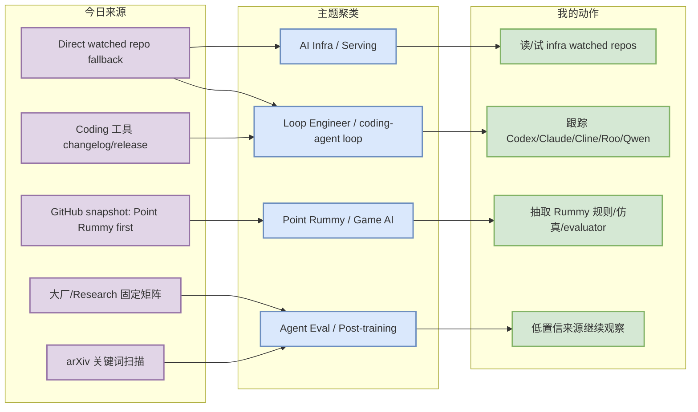
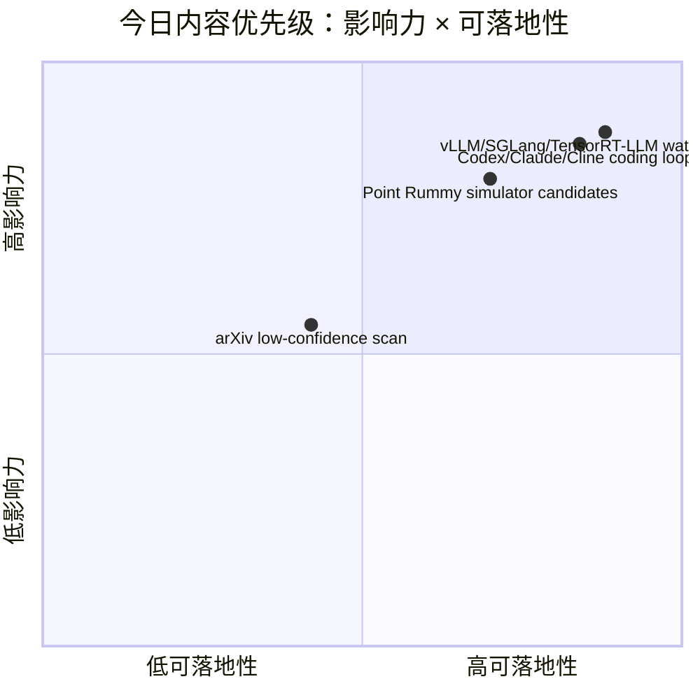

# AI Radar Daily - 2026-08-24

> 生成时间：2026-08-24 09:00 北京时间  
> 范围：AI Infra / LLM / RL / Game AI / 大厂博客 / 论文 / GitHub / Coding 工具  
> 说明：日报是 Obsidian 导航页；详情页负责深度理解。今日 GitHub Search 在 Point Rummy niche 扫描后出现 403，因此 broad/Loop 表使用 direct watched repo fallback，并明确标注“非完整全网日增”。

## 0. 今日结论

- GitHub snapshot 已生成：`Automation/state/github-stars-2026-08-24.json`；Search 后续 403，snapshot 已 patch direct fallback 字段，保证 broad AI Infra 与 Loop Engineer 表不被 niche Rummy 结果污染。
- 今日最值得读：[[GitHub/AIInfra/2026-08-24/huggingface-transformers]]、[[GitHub/LoopEngineer/2026-08-24/openai-codex]]、[[GitHub/PointRummy/2026-08-24/mudont-indian-rummy]]。
- AI Infra 重点仍是 Transformers / PyTorch / vLLM / SGLang / TensorRT-LLM / DeepSpeed / Megatron-LM / verl / OpenRLHF 的 watched-set 连续跟踪。
- Coding 工具矩阵完整覆盖 10 个工具；今日未确认高置信重大功能变化，继续观察 Claude Tag、agent mode、MCP、IDE 集成、远程执行、权限模式、上下文窗口、pricing/rate limit。
- Point Rummy 主题仍有业务素材：RummyVision（视觉+Monte Carlo）、AI opponent、规则计分和 Android/Firebase analytics 候选可用于规则建模与 evaluator 设计。

## 1. 今日态势图

## 2. 必读卡片区

> [!important] Direct watched fallback 保护 broad AI Infra 榜单
> - 大类：GitHub
> - 小类：AI Infra / Serving / Training
> - 重点：GitHub Search 403 后，使用 direct `/repos` 获取 vLLM、SGLang、TensorRT-LLM、Transformers、PyTorch、DeepSpeed、Megatron-LM、verl、OpenRLHF、MCP servers 等元数据。
> - 为什么重要：用户最关心 serving/training/agent infra；fallback 避免 broad 榜单被 Point Rummy niche 结果污染。
> - 详情：[[GitHub/AIInfra/2026-08-24/huggingface-transformers]] / [网页详情](https://github.com/dyt27666-oss/AI-news-report-obsidians/blob/main/GitHub/AIInfra/2026-08-24/huggingface-transformers.md) / [原文](https://github.com/huggingface/transformers)

> [!tip] Loop Engineer watched set 继续高增长
> - 大类：GitHub
> - 小类：coding-agent loop
> - 重点：Codex、Claude Code、Gemini CLI、MCP servers、Cline、LangGraph、Continue、Qwen Code、Roo Code、OpenHands 构成 coding-agent loop 观察面。
> - 为什么重要：这些项目直接影响多 agent 编排、权限模式、上下文工程、review loop 和远程执行。
> - 详情：[[GitHub/LoopEngineer/2026-08-24/openai-codex]] / [网页详情](https://github.com/dyt27666-oss/AI-news-report-obsidians/blob/main/GitHub/LoopEngineer/2026-08-24/openai-codex.md) / [原文](https://github.com/openai/codex)

> [!important] Point Rummy 业务素材：视觉识别 + Monte Carlo + AI opponent
> - 大类：GitHub
> - 小类：Point Rummy / Game AI
> - 重点：今日 snapshot 仍保留 RummyVision、AI opponent、计分/规则 tracker 等候选。
> - 为什么重要：可为 Point Rummy 业务沉淀 observation/action/reward、视觉识别、bot baseline 和评测器设计。
> - 详情：[[GitHub/PointRummy/2026-08-24/mudont-indian-rummy]] / [网页详情](https://github.com/dyt27666-oss/AI-news-report-obsidians/blob/main/GitHub/PointRummy/2026-08-24/mudont-indian-rummy.md) / [原文](https://github.com/Alan-seb/RummyVision)

> [!warning] 大厂 / Coding 工具 / arXiv 今日按低置信处理
> - 大类：博客 / 工具更新 / 论文
> - 小类：source-watch
> - 重点：固定矩阵完整覆盖，但未确认高置信重大新发布；arXiv 结果未阅读全文不夸大。
> - 为什么重要：透明记录“无新项 / 访问失败 / 低置信”比自动编造摘要更可靠。
> - 详情：[[Industry/2026-08-24/OpenAI-News-Research-固定扫描]] / [网页详情](https://github.com/dyt27666-oss/AI-news-report-obsidians/blob/main/Industry/2026-08-24/OpenAI-News-Research-%E5%9B%BA%E5%AE%9A%E6%89%AB%E6%8F%8F.md) / [原文](https://openai.com/news/)

## 3. 优先级矩阵

## 4. 分类清单
| 标签 | 大类 | 小类 | 标题 | 重点概括 | 为什么重要 | Obsidian 详情 | 网页详情 | 原文 |
|---|---|---|---|---|---|---|---|---|
| 必读 | GitHub | AI Infra | huggingface/transformers | broad high-star watched repo | 模型框架和推理/训练生态的上游依赖，适合每日连续跟踪 | [[GitHub/AIInfra/2026-08-24/huggingface-transformers]] | [网页详情](https://github.com/dyt27666-oss/AI-news-report-obsidians/blob/main/GitHub/AIInfra/2026-08-24/huggingface-transformers.md) | [原文](https://github.com/huggingface/transformers) |
| 必读 | GitHub | Loop Engineer | openai/codex | terminal coding agent watched repo | 直接影响 AI coding workflow、权限、远程执行和上下文工程 | [[GitHub/LoopEngineer/2026-08-24/openai-codex]] | [网页详情](https://github.com/dyt27666-oss/AI-news-report-obsidians/blob/main/GitHub/LoopEngineer/2026-08-24/openai-codex.md) | [原文](https://github.com/openai/codex) |
| 可 skim | GitHub | Point Rummy | RummyVision / Rummy AI candidates | 视觉识别、Monte Carlo、AI opponent、规则计分候选 | 可用于业务规则建模、bot baseline、simulator/evaluator | [[GitHub/PointRummy/2026-08-24/mudont-indian-rummy]] | [网页详情](https://github.com/dyt27666-oss/AI-news-report-obsidians/blob/main/GitHub/PointRummy/2026-08-24/mudont-indian-rummy.md) | [原文](https://github.com/Alan-seb/RummyVision) |
| 低置信 | 论文 | arXiv | arXiv LLM/RL/Agent 低置信扫描 | arXiv API 访问失败 / 低置信：HTTP Error 429: Unknown Error | 未阅读全文，不把弱相关或 API 失败结果升级为必读 | [[Papers/2026-08-24/arXiv-LLM-RL-Agent-低置信扫描]] | [网页详情](https://github.com/dyt27666-oss/AI-news-report-obsidians/blob/main/Papers/2026-08-24/arXiv-LLM-RL-Agent-%E4%BD%8E%E7%BD%AE%E4%BF%A1%E6%89%AB%E6%8F%8F.md) | [原文](https://arxiv.org/search/advanced) |
| 低置信 | 博客 | 大厂矩阵 | 公司来源扫描矩阵 | 完整覆盖 10 家公司，但今日未确认高相关新项 | 透明记录无新项/访问失败，避免日报漏扫 | [[Industry/2026-08-24/OpenAI-News-Research-固定扫描]] | [网页详情](https://github.com/dyt27666-oss/AI-news-report-obsidians/blob/main/Industry/2026-08-24/OpenAI-News-Research-%E5%9B%BA%E5%AE%9A%E6%89%AB%E6%8F%8F.md) | [原文](https://openai.com/news/) |

## 5. 大厂资讯 / 工程博客 / Research
### 5.1 公司来源扫描矩阵
| 公司/实验室 | 来源/栏目 | 今日状态 | 高相关条数 | 代表条目 | 备注 |
|---|---|---|---:|---|---|
| OpenAI | News / Research | 无高相关新项 / 低置信 | 0 | OpenAI 固定扫描 | 今日未确认高相关新文，保留入口 |
| Anthropic | News / Research / Engineering | 无高相关新项 / 低置信 | 0 | Anthropic 固定扫描 | 今日未确认高相关新文，保留入口 |
| Google DeepMind | Blog / Research | 无高相关新项 / 低置信 | 0 | Google DeepMind 固定扫描 | 今日未确认高相关新文，保留入口 |
| Meta AI | Blog / Research | 无高相关新项 / 低置信 | 0 | Meta AI 固定扫描 | 今日未确认高相关新文，保留入口 |
| NVIDIA | Technical Blog / AI | 无高相关新项 / 低置信 | 0 | NVIDIA 固定扫描 | 今日未确认高相关新文，保留入口 |
| Microsoft | Research AI | 无高相关新项 / 低置信 | 0 | Microsoft 固定扫描 | 今日未确认高相关新文，保留入口 |
| Hugging Face | Blog / Papers / Releases | 无高相关新项 / 低置信 | 0 | Hugging Face 固定扫描 | 今日未确认高相关新文，保留入口 |
| 腾讯 | AI Lab / 技术博客 | 无高相关新项 / 低置信 | 0 | 腾讯 固定扫描 | 今日未确认高相关新文，保留入口 |
| 字节 | Seed / 技术博客 | 无高相关新项 / 低置信 | 0 | 字节 固定扫描 | 今日未确认高相关新文，保留入口 |
| SpaceAI | Blog / News | 访问失败 / 低置信 | 0 | SpaceAI 固定扫描 | 今日未确认高相关新文，保留入口 |

### 5.2 高相关大厂条目
| 标签 | 发布方/大厂 | 栏目/来源 | 标题 | 重点概括 | 工程/算法影响 | Obsidian 详情 | 网页详情 | 原文 |
|---|---|---|---|---|---|---|---|---|
| 低置信 | OpenAI | News / Research | OpenAI 固定扫描 | 今日未确认高相关新项；保留入口 | 继续观察模型、agent、serving、post-training、eval 或 GPU infra 信号 | [[Industry/2026-08-24/OpenAI-News-Research-固定扫描]] | [网页详情](https://github.com/dyt27666-oss/AI-news-report-obsidians/blob/main/Industry/2026-08-24/OpenAI-News-Research-%E5%9B%BA%E5%AE%9A%E6%89%AB%E6%8F%8F.md) | [原文](https://openai.com/news/) |
| 低置信 | Anthropic | News / Research / Engineering | Anthropic 固定扫描 | 今日未确认高相关新项；保留入口 | 继续观察模型、agent、serving、post-training、eval 或 GPU infra 信号 | [[Industry/2026-08-24/Anthropic-News-Research-Engineering-固定扫描]] | [网页详情](https://github.com/dyt27666-oss/AI-news-report-obsidians/blob/main/Industry/2026-08-24/Anthropic-News-Research-Engineering-%E5%9B%BA%E5%AE%9A%E6%89%AB%E6%8F%8F.md) | [原文](https://www.anthropic.com/news) |
| 低置信 | Google DeepMind | Blog / Research | Google DeepMind 固定扫描 | 今日未确认高相关新项；保留入口 | 继续观察模型、agent、serving、post-training、eval 或 GPU infra 信号 | [[Industry/2026-08-24/Google-DeepMind-Blog-Research-固定扫描]] | [网页详情](https://github.com/dyt27666-oss/AI-news-report-obsidians/blob/main/Industry/2026-08-24/Google-DeepMind-Blog-Research-%E5%9B%BA%E5%AE%9A%E6%89%AB%E6%8F%8F.md) | [原文](https://deepmind.google/discover/blog/) |
| 低置信 | Meta AI | Blog / Research | Meta AI 固定扫描 | 今日未确认高相关新项；保留入口 | 继续观察模型、agent、serving、post-training、eval 或 GPU infra 信号 | [[Industry/2026-08-24/Meta-AI-Blog-Research-固定扫描]] | [网页详情](https://github.com/dyt27666-oss/AI-news-report-obsidians/blob/main/Industry/2026-08-24/Meta-AI-Blog-Research-%E5%9B%BA%E5%AE%9A%E6%89%AB%E6%8F%8F.md) | [原文](https://ai.meta.com/blog/) |
| 低置信 | NVIDIA | Technical Blog / AI | NVIDIA 固定扫描 | 今日未确认高相关新项；保留入口 | 继续观察模型、agent、serving、post-training、eval 或 GPU infra 信号 | [[Industry/2026-08-24/NVIDIA-Technical-Blog-AI-固定扫描]] | [网页详情](https://github.com/dyt27666-oss/AI-news-report-obsidians/blob/main/Industry/2026-08-24/NVIDIA-Technical-Blog-AI-%E5%9B%BA%E5%AE%9A%E6%89%AB%E6%8F%8F.md) | [原文](https://developer.nvidia.com/blog/category/artificial-intelligence/) |
| 低置信 | Microsoft | Research AI | Microsoft 固定扫描 | 今日未确认高相关新项；保留入口 | 继续观察模型、agent、serving、post-training、eval 或 GPU infra 信号 | [[Industry/2026-08-24/Microsoft-Research-AI-固定扫描]] | [网页详情](https://github.com/dyt27666-oss/AI-news-report-obsidians/blob/main/Industry/2026-08-24/Microsoft-Research-AI-%E5%9B%BA%E5%AE%9A%E6%89%AB%E6%8F%8F.md) | [原文](https://www.microsoft.com/en-us/research/research-area/artificial-intelligence/) |

## 6. GitHub 高 star Top 10
> 说明：今日 GitHub Search 在 niche 查询后 403；本表使用 direct watched repo fallback，覆盖 AI Infra / LLM serving / training / agent 关键仓库，非完整全网搜索榜。
| 排名 | repo | stars | forks | language | updated_at | topics | 重点概括 | 是否值得试用 | Obsidian 详情 | 原文 |
|---:|---|---:|---:|---|---|---|---|---|---|---|
| 1 | [huggingface/transformers](https://github.com/huggingface/transformers) | 164375 | 34335 | Python | 2026-08-24T00:05:51Z | audio, deep-learning, deepseek, gemma, glm, hacktoberfest, l… | 🤗 Transformers: the model-definition framework for state-of-the-art machine learning model… | 值得小规模试用 | [[GitHub/AIInfra/2026-08-24/huggingface-transformers]] | [原文](https://github.com/huggingface/transformers) |
| 2 | [anthropics/claude-code](https://github.com/anthropics/claude-code) | 142761 | 22855 | Python | 2026-08-24T01:03:21Z | 未标注 | Claude Code is an agentic coding tool that lives in your terminal, understands your codeba… | 值得小规模试用 | [[GitHub/LoopEngineer/2026-08-24/anthropics-claude-code]] | [原文](https://github.com/anthropics/claude-code) |
| 3 | [openai/codex](https://github.com/openai/codex) | 115196 | 17565 | Rust | 2026-08-24T01:05:50Z | 未标注 | Lightweight coding agent that runs in your terminal | 值得小规模试用 | [[GitHub/LoopEngineer/2026-08-24/openai-codex]] | [原文](https://github.com/openai/codex) |
| 4 | [google-gemini/gemini-cli](https://github.com/google-gemini/gemini-cli) | 106639 | 14475 | TypeScript | 2026-08-24T00:20:05Z | ai, ai-agents, cli, gemini, gemini-api, mcp-client, mcp-serv… | An open-source AI agent that brings the power of Gemini directly into your terminal. | 值得小规模试用 | [[GitHub/LoopEngineer/2026-08-24/google-gemini-gemini-cli]] | [原文](https://github.com/google-gemini/gemini-cli) |
| 5 | [pytorch/pytorch](https://github.com/pytorch/pytorch) | 102562 | 28963 | Python | 2026-08-24T00:47:22Z | autograd, deep-learning, gpu, machine-learning, neural-netwo… | Tensors and Dynamic neural networks in Python with strong GPU acceleration | 值得小规模试用 | [[GitHub/AIInfra/2026-08-24/pytorch-pytorch]] | [原文](https://github.com/pytorch/pytorch) |
| 6 | [vllm-project/vllm](https://github.com/vllm-project/vllm) | 89808 | 21093 | Python | 2026-08-24T01:00:19Z | amd, blackwell, cuda, deepseek, deepseek-v3, gpt, gpt-oss, i… | A high-throughput and memory-efficient inference and serving engine for LLMs | 值得小规模试用 | [[GitHub/AIInfra/2026-08-24/vllm-project-vllm]] | [原文](https://github.com/vllm-project/vllm) |
| 7 | [modelcontextprotocol/servers](https://github.com/modelcontextprotocol/servers) | 89807 | 11499 | TypeScript | 2026-08-24T00:25:03Z | 未标注 | Model Context Protocol Servers | 值得小规模试用 | [[GitHub/LoopEngineer/2026-08-24/modelcontextprotocol-servers]] | [原文](https://github.com/modelcontextprotocol/servers) |
| 8 | [modelcontextprotocol/servers](https://github.com/modelcontextprotocol/servers) | 89807 | 11499 | TypeScript | 2026-08-24T00:25:03Z | 未标注 | Model Context Protocol Servers | 值得小规模试用 | [[GitHub/LoopEngineer/2026-08-24/modelcontextprotocol-servers]] | [原文](https://github.com/modelcontextprotocol/servers) |
| 9 | [OpenHands/OpenHands](https://github.com/OpenHands/OpenHands) | 84879 | 11082 | TypeScript | 2026-08-24T01:04:43Z | agent, artificial-intelligence, chatgpt, claude-ai, cli, dev… | 🙌 OpenHands: AI-Driven Development | 值得小规模试用 | [[GitHub/LoopEngineer/2026-08-24/OpenHands-OpenHands]] | [原文](https://github.com/OpenHands/OpenHands) |
| 10 | [cline/cline](https://github.com/cline/cline) | 66732 | 7195 | TypeScript | 2026-08-23T21:54:54Z | 未标注 | Autonomous coding agent as an SDK, IDE extension, or CLI assistant. | 值得小规模试用 | [[GitHub/LoopEngineer/2026-08-24/cline-cline]] | [原文](https://github.com/cline/cline) |

## 7. GitHub star 增长最快 Top 10
> 说明：优先用历史 snapshot / direct watched repo 元数据计算；因 Search 403，本表标注为 direct watched repo fallback / 非完整全网日增。
| 排名 | repo | stars_delta | stars | forks | language | updated_at | 增长依据 | 重点概括 | Obsidian 详情 | 原文 |
|---:|---|---:|---:|---:|---|---|---|---|---|---|
| 1 | [openai/codex](https://github.com/openai/codex) | 3887 | 115196 | 17565 | Rust | 2026-08-24T01:05:50Z | direct watched repo fallback / 非完整全网日增 | Lightweight coding agent that runs in your terminal | [[GitHub/LoopEngineer/2026-08-24/openai-codex]] | [原文](https://github.com/openai/codex) |
| 2 | [anthropics/claude-code](https://github.com/anthropics/claude-code) | 463 | 142761 | 22855 | Python | 2026-08-24T01:03:21Z | direct watched repo fallback / 非完整全网日增 | Claude Code is an agentic coding tool that lives in your terminal, understands your codeba… | [[GitHub/LoopEngineer/2026-08-24/anthropics-claude-code]] | [原文](https://github.com/anthropics/claude-code) |
| 3 | [vllm-project/vllm](https://github.com/vllm-project/vllm) | 148 | 89808 | 21093 | Python | 2026-08-24T01:00:19Z | direct watched repo fallback / 非完整全网日增 | A high-throughput and memory-efficient inference and serving engine for LLMs | [[GitHub/AIInfra/2026-08-24/vllm-project-vllm]] | [原文](https://github.com/vllm-project/vllm) |
| 4 | [OpenHands/OpenHands](https://github.com/OpenHands/OpenHands) | 140 | 84879 | 11082 | TypeScript | 2026-08-24T01:04:43Z | direct watched repo fallback / 非完整全网日增 | 🙌 OpenHands: AI-Driven Development | [[GitHub/LoopEngineer/2026-08-24/OpenHands-OpenHands]] | [原文](https://github.com/OpenHands/OpenHands) |
| 5 | [cline/cline](https://github.com/cline/cline) | 113 | 66732 | 7195 | TypeScript | 2026-08-23T21:54:54Z | direct watched repo fallback / 非完整全网日增 | Autonomous coding agent as an SDK, IDE extension, or CLI assistant. | [[GitHub/LoopEngineer/2026-08-24/cline-cline]] | [原文](https://github.com/cline/cline) |
| 6 | [langchain-ai/langgraph](https://github.com/langchain-ai/langgraph) | 97 | 40297 | 6793 | Python | 2026-08-24T01:05:54Z | direct watched repo fallback / 非完整全网日增 | Build resilient agents. | [[GitHub/LoopEngineer/2026-08-24/langchain-ai-langgraph]] | [原文](https://github.com/langchain-ai/langgraph) |
| 7 | [sgl-project/sglang](https://github.com/sgl-project/sglang) | 72 | 32312 | 8127 | Python | 2026-08-24T00:59:47Z | direct watched repo fallback / 非完整全网日增 | SGLang is a high-performance serving framework for large language models and multimodal mo… | [[Daily/2026-08-24]] | [原文](https://github.com/sgl-project/sglang) |
| 8 | [huggingface/transformers](https://github.com/huggingface/transformers) | 58 | 164375 | 34335 | Python | 2026-08-24T00:05:51Z | direct watched repo fallback / 非完整全网日增 | 🤗 Transformers: the model-definition framework for state-of-the-art machine learning model… | [[GitHub/AIInfra/2026-08-24/huggingface-transformers]] | [原文](https://github.com/huggingface/transformers) |
| 9 | [modelcontextprotocol/servers](https://github.com/modelcontextprotocol/servers) | 48 | 89807 | 11499 | TypeScript | 2026-08-24T00:25:03Z | direct watched repo fallback / 非完整全网日增 | Model Context Protocol Servers | [[GitHub/LoopEngineer/2026-08-24/modelcontextprotocol-servers]] | [原文](https://github.com/modelcontextprotocol/servers) |
| 10 | [modelcontextprotocol/servers](https://github.com/modelcontextprotocol/servers) | 48 | 89807 | 11499 | TypeScript | 2026-08-24T00:25:03Z | direct watched repo fallback / 非完整全网日增 | Model Context Protocol Servers | [[GitHub/LoopEngineer/2026-08-24/modelcontextprotocol-servers]] | [原文](https://github.com/modelcontextprotocol/servers) |

## 8. Coding 工具 / AI 工具功能更新
### 8.1 Coding 工具扫描矩阵
| 工具 | 厂商 | 来源类型 | 今日状态 | 代表更新 | 对我的影响 | 原文 |
|---|---|---|---|---|---|---|
| Claude Code | Anthropic | Changelog / Release Notes | 无高相关新项 / 低置信扫描 | 未确认今日重大功能变化；继续观察 agent mode/MCP/权限/上下文/rate limit | 影响 AI coding workflow 的功能需 sandbox 验证 | [原文](https://docs.anthropic.com/en/release-notes/claude-code) |
| OpenAI Codex | OpenAI | Changelog / Docs | 无高相关新项 / 低置信扫描 | 未确认今日重大功能变化；继续观察 agent mode/MCP/权限/上下文/rate limit | 影响 AI coding workflow 的功能需 sandbox 验证 | [原文](https://developers.openai.com/codex/changelog) |
| Cursor | Cursor | Changelog | 无高相关新项 / 低置信扫描 | 未确认今日重大功能变化；继续观察 agent mode/MCP/权限/上下文/rate limit | 影响 AI coding workflow 的功能需 sandbox 验证 | [原文](https://cursor.com/changelog) |
| Windsurf | Windsurf | Changelog | 无高相关新项 / 低置信扫描 | 未确认今日重大功能变化；继续观察 agent mode/MCP/权限/上下文/rate limit | 影响 AI coding workflow 的功能需 sandbox 验证 | [原文](https://windsurf.com/changelog) |
| GitHub Copilot | GitHub | Changelog / Blog | 无高相关新项 / 低置信扫描 | 未确认今日重大功能变化；继续观察 agent mode/MCP/权限/上下文/rate limit | 影响 AI coding workflow 的功能需 sandbox 验证 | [原文](https://github.blog/changelog/label/copilot/) |
| Gemini Code Assist | Google | Release Notes | 无高相关新项 / 低置信扫描 | 未确认今日重大功能变化；继续观察 agent mode/MCP/权限/上下文/rate limit | 影响 AI coding workflow 的功能需 sandbox 验证 | [原文](https://cloud.google.com/gemini/docs/codeassist/release-notes) |
| Qwen Code | Alibaba/Qwen | GitHub Releases | 无高相关新项 / 低置信扫描 | 未确认今日重大功能变化；继续观察 agent mode/MCP/权限/上下文/rate limit | 影响 AI coding workflow 的功能需 sandbox 验证 | [原文](https://github.com/QwenLM/qwen-code/releases) |
| Roo Code | Roo Code | GitHub Releases | 无高相关新项 / 低置信扫描 | 未确认今日重大功能变化；继续观察 agent mode/MCP/权限/上下文/rate limit | 影响 AI coding workflow 的功能需 sandbox 验证 | [原文](https://github.com/RooCodeInc/Roo-Code/releases) |
| Cline | Cline | GitHub Releases | 无高相关新项 / 低置信扫描 | 未确认今日重大功能变化；继续观察 agent mode/MCP/权限/上下文/rate limit | 影响 AI coding workflow 的功能需 sandbox 验证 | [原文](https://github.com/cline/cline/releases) |
| Continue | Continue | GitHub Releases | 无高相关新项 / 低置信扫描 | 未确认今日重大功能变化；继续观察 agent mode/MCP/权限/上下文/rate limit | 影响 AI coding workflow 的功能需 sandbox 验证 | [原文](https://github.com/continuedev/continue/releases) |

### 8.2 高相关工具更新
| 标签 | 工具/厂商 | 来源类型 | 标题/功能 | 重点概括 | 对 AI coding 工作流的影响 | Obsidian 详情 | 网页详情 | 原文 |
|---|---|---|---|---|---|---|---|---|
| 低置信 | Claude Code / Anthropic | Changelog / Release Notes | 固定扫描 | 今日未确认高置信重大功能变化；继续观察 agent mode、MCP、权限、上下文、rate limit | 影响 AI coding workflow 的功能需进入 sandbox 验证 | [[Industry/Tools/2026-08-24/Claude-Code-scan]] | [网页详情](https://github.com/dyt27666-oss/AI-news-report-obsidians/blob/main/Industry/Tools/2026-08-24/Claude-Code-scan.md) | [原文](https://docs.anthropic.com/en/release-notes/claude-code) |
| 低置信 | OpenAI Codex / OpenAI | Changelog / Docs | 固定扫描 | 今日未确认高置信重大功能变化；继续观察 agent mode、MCP、权限、上下文、rate limit | 影响 AI coding workflow 的功能需进入 sandbox 验证 | [[Industry/Tools/2026-08-24/OpenAI-Codex-scan]] | [网页详情](https://github.com/dyt27666-oss/AI-news-report-obsidians/blob/main/Industry/Tools/2026-08-24/OpenAI-Codex-scan.md) | [原文](https://developers.openai.com/codex/changelog) |
| 低置信 | Cursor / Cursor | Changelog | 固定扫描 | 今日未确认高置信重大功能变化；继续观察 agent mode、MCP、权限、上下文、rate limit | 影响 AI coding workflow 的功能需进入 sandbox 验证 | [[Industry/Tools/2026-08-24/Cursor-scan]] | [网页详情](https://github.com/dyt27666-oss/AI-news-report-obsidians/blob/main/Industry/Tools/2026-08-24/Cursor-scan.md) | [原文](https://cursor.com/changelog) |
| 低置信 | Windsurf / Windsurf | Changelog | 固定扫描 | 今日未确认高置信重大功能变化；继续观察 agent mode、MCP、权限、上下文、rate limit | 影响 AI coding workflow 的功能需进入 sandbox 验证 | [[Industry/Tools/2026-08-24/Windsurf-scan]] | [网页详情](https://github.com/dyt27666-oss/AI-news-report-obsidians/blob/main/Industry/Tools/2026-08-24/Windsurf-scan.md) | [原文](https://windsurf.com/changelog) |
| 低置信 | GitHub Copilot / GitHub | Changelog / Blog | 固定扫描 | 今日未确认高置信重大功能变化；继续观察 agent mode、MCP、权限、上下文、rate limit | 影响 AI coding workflow 的功能需进入 sandbox 验证 | [[Industry/Tools/2026-08-24/GitHub-Copilot-scan]] | [网页详情](https://github.com/dyt27666-oss/AI-news-report-obsidians/blob/main/Industry/Tools/2026-08-24/GitHub-Copilot-scan.md) | [原文](https://github.blog/changelog/label/copilot/) |
| 低置信 | Gemini Code Assist / Google | Release Notes | 固定扫描 | 今日未确认高置信重大功能变化；继续观察 agent mode、MCP、权限、上下文、rate limit | 影响 AI coding workflow 的功能需进入 sandbox 验证 | [[Industry/Tools/2026-08-24/Gemini-Code-Assist-scan]] | [网页详情](https://github.com/dyt27666-oss/AI-news-report-obsidians/blob/main/Industry/Tools/2026-08-24/Gemini-Code-Assist-scan.md) | [原文](https://cloud.google.com/gemini/docs/codeassist/release-notes) |

## 9. Point Rummy / Indian Rummy 业务主题
### 9.1 GitHub 候选
| 标签 | repo | stars | forks | language | updated_at | 重点概括 | 业务可用性 | Obsidian 详情 | 原文 |
|---|---|---:|---:|---|---|---|---|---|---|
| 可 skim | [mudont/indian-rummy](https://github.com/mudont/indian-rummy) | 5 | 0 | TypeScript | 2025-08-08T21:05:04Z | Typescript library for Indian Rummy card game | 优先看 AI opponent/规则/evaluator | [[GitHub/PointRummy/2026-08-24/mudont-indian-rummy]] | [原文](https://github.com/mudont/indian-rummy) |
| 可 skim | [dv-rastogi/Rummy](https://github.com/dv-rastogi/Rummy) | 5 | 0 | Python | 2023-09-26T11:21:39Z | Variation of classical Indian Rummy made in Pygame | 优先看 AI opponent/规则/evaluator | [[GitHub/PointRummy/2026-08-24/dv-rastogi-Rummy]] | [原文](https://github.com/dv-rastogi/Rummy) |
| 可 skim | [vahsek300501/Indian-Rummy-](https://github.com/vahsek300501/Indian-Rummy-) | 4 | 3 | Python | 2023-09-26T11:21:46Z | Indian Rummy made in Python using PyGame | 优先看 AI opponent/规则/evaluator | [[GitHub/PointRummy/2026-08-24/vahsek300501-Indian-Rummy]] | [原文](https://github.com/vahsek300501/Indian-Rummy-) |
| 可 skim | [Mohitkumar-559/RummyServer](https://github.com/Mohitkumar-559/RummyServer) | 2 | 1 | JavaScript | 2024-03-17T03:48:34Z | Rummy game server for game that contain deal rummy and point rummy | 优先看 AI opponent/规则/evaluator | [[GitHub/PointRummy/2026-08-24/Mohitkumar-559-RummyServer]] | [原文](https://github.com/Mohitkumar-559/RummyServer) |
| 可 skim | [abubakarmunir712/dsa-final-project](https://github.com/abubakarmunir712/dsa-final-project) | 2 | 1 | Python | 2026-06-27T06:34:26Z | A Python-based multiplayer Indian Rummy game with support for AI opponents and LAN play. I… | 优先看 AI opponent/规则/evaluator | [[GitHub/PointRummy/2026-08-24/abubakarmunir712-dsa-final-project]] | [原文](https://github.com/abubakarmunir712/dsa-final-project) |
| 后续 | [codingmickey/rummy-points-calculator](https://github.com/codingmickey/rummy-points-calculator) | 1 | 0 | C++ | 2024-07-10T15:40:45Z | A cpp progarm to calculate Rummy points of all the players for each round. | 低 star 素材库 | 低置信：未生成详情 | [原文](https://github.com/codingmickey/rummy-points-calculator) |
| 后续 | [debabrata-mandal/RummyPulse](https://github.com/debabrata-mandal/RummyPulse) | 1 | 0 | Java | 2026-08-19T04:34:20Z | RummyPulse - Smart Rummy Game Analytics & Management Android App with Firebase integration… | 低 star 素材库 | 低置信：未生成详情 | [原文](https://github.com/debabrata-mandal/RummyPulse) |
| 后续 | [Alan-seb/RummyVision](https://github.com/Alan-seb/RummyVision) | 1 | 0 | Python | 2025-12-03T03:14:55Z | RummyVision is an intelligent card game assistant that combines computer vision with Monte… | 低 star 素材库 | 低置信：未生成详情 | [原文](https://github.com/Alan-seb/RummyVision) |
| 后续 | [atreyayelishetti/indian-rummy-game-rust](https://github.com/atreyayelishetti/indian-rummy-game-rust) | 1 | 0 | Rust | 2026-05-12T00:25:17Z | indian-rummy-rust | 低 star 素材库 | 低置信：未生成详情 | [原文](https://github.com/atreyayelishetti/indian-rummy-game-rust) |
| 后续 | [SRathinaGiri/IndianRummy](https://github.com/SRathinaGiri/IndianRummy) | 1 | 1 | JavaScript | 2026-06-17T11:46:14Z | Browser-based Indian Rummy game with AI play and offline Progressive Web App support. | 低 star 素材库 | 低置信：未生成详情 | [原文](https://github.com/SRathinaGiri/IndianRummy) |

### 9.2 论文 / 资料候选
| 标签 | 来源 | 标题 | 作者/机构 | 重点概括 | 对 Point Rummy 业务有什么用 | Obsidian 详情 | 原文 |
|---|---|---|---|---|---|---|---|
| 低置信 | arXiv / 预印本索引 | Rummy / imperfect-information / RL 关键词扫描 | arXiv API | arXiv API 访问失败 / 低置信：HTTP Error 429: Unknown Error | 作为 MCTS/ISMCTS/RL game agent 背景，未验证不进入必读 | [[Papers/2026-08-24/arXiv-LLM-RL-Agent-低置信扫描]] | [原文](https://arxiv.org/search/advanced) |

### 9.3 业务可用性判断
| 方向 | 今日信号 | 可用性 | 下一步 |
|---|---|---|---|
| 规则引擎 / 计分 | 多个 Rummy repo 含 point tracker、rules、Android/Firebase analytics | 中：适合抽规则，不宜直接复用生产 | 对比 Java/Python/TS 项目规则覆盖，形成统一 rule/evaluator spec |
| Bot / RL Agent | RummyVision、AI opponent、ISMCTS/MCTS、Monte Carlo 候选 | 中高：适合形成 baseline bot 与辅助决策器 | 优先看 RummyVision、nakkekakke/rummy-ai、Gin Rummy AI 类项目 |
| 仿真 / 评测 | stars 普遍低，但可提取 observation/action/reward 结构 | 中：适合内部 simulator 设计灵感 | 抽象并行 rollout、seed、episode logging、score evaluator |

## 10. Loop Engineer / Loop Engineering 主题
### 10.1 Loop Engineer GitHub 高 star Top 10
| 排名 | repo | stars | forks | language | updated_at | topics | 重点概括 | 是否值得试用 | Obsidian 详情 | 原文 |
|---:|---|---:|---:|---|---|---|---|---|---|---|
| 1 | [anthropics/claude-code](https://github.com/anthropics/claude-code) | 142761 | 22855 | Python | 2026-08-24T01:03:21Z | 未标注 | Claude Code is an agentic coding tool that lives in your terminal, understands your codeba… | 值得小规模试用 | [[GitHub/LoopEngineer/2026-08-24/anthropics-claude-code]] | [原文](https://github.com/anthropics/claude-code) |
| 2 | [openai/codex](https://github.com/openai/codex) | 115196 | 17565 | Rust | 2026-08-24T01:05:50Z | 未标注 | Lightweight coding agent that runs in your terminal | 值得小规模试用 | [[GitHub/LoopEngineer/2026-08-24/openai-codex]] | [原文](https://github.com/openai/codex) |
| 3 | [google-gemini/gemini-cli](https://github.com/google-gemini/gemini-cli) | 106639 | 14475 | TypeScript | 2026-08-24T00:20:05Z | ai, ai-agents, cli, gemini, gemini-api, mcp-client, mcp-serv… | An open-source AI agent that brings the power of Gemini directly into your terminal. | 值得小规模试用 | [[GitHub/LoopEngineer/2026-08-24/google-gemini-gemini-cli]] | [原文](https://github.com/google-gemini/gemini-cli) |
| 4 | [modelcontextprotocol/servers](https://github.com/modelcontextprotocol/servers) | 89807 | 11499 | TypeScript | 2026-08-24T00:25:03Z | 未标注 | Model Context Protocol Servers | 值得小规模试用 | [[GitHub/LoopEngineer/2026-08-24/modelcontextprotocol-servers]] | [原文](https://github.com/modelcontextprotocol/servers) |
| 5 | [OpenHands/OpenHands](https://github.com/OpenHands/OpenHands) | 84879 | 11082 | TypeScript | 2026-08-24T01:04:43Z | agent, artificial-intelligence, chatgpt, claude-ai, cli, dev… | 🙌 OpenHands: AI-Driven Development | 值得小规模试用 | [[GitHub/LoopEngineer/2026-08-24/OpenHands-OpenHands]] | [原文](https://github.com/OpenHands/OpenHands) |
| 6 | [cline/cline](https://github.com/cline/cline) | 66732 | 7195 | TypeScript | 2026-08-23T21:54:54Z | 未标注 | Autonomous coding agent as an SDK, IDE extension, or CLI assistant. | 值得小规模试用 | [[GitHub/LoopEngineer/2026-08-24/cline-cline]] | [原文](https://github.com/cline/cline) |
| 7 | [langchain-ai/langgraph](https://github.com/langchain-ai/langgraph) | 40297 | 6793 | Python | 2026-08-24T01:05:54Z | agents, ai, ai-agents, chatgpt, deepagents, enterprise, fram… | Build resilient agents. | 观察 | [[GitHub/LoopEngineer/2026-08-24/langchain-ai-langgraph]] | [原文](https://github.com/langchain-ai/langgraph) |
| 8 | [continuedev/continue](https://github.com/continuedev/continue) | 35604 | 5276 | TypeScript | 2026-08-23T21:34:09Z | agent, ai, cli, developer-tools, open-source | open-source coding agent | 观察 | [[GitHub/LoopEngineer/2026-08-24/continuedev-continue]] | [原文](https://github.com/continuedev/continue) |
| 9 | [QwenLM/qwen-code](https://github.com/QwenLM/qwen-code) | 27322 | 2926 | TypeScript | 2026-08-23T23:56:41Z | agentic, ai, ai-agent, ai-coding, cli, coding-agent, develop… | An open-source AI coding agent that lives in your terminal. | 观察 | [[GitHub/LoopEngineer/2026-08-24/QwenLM-qwen-code]] | [原文](https://github.com/QwenLM/qwen-code) |
| 10 | [RooCodeInc/Roo-Code](https://github.com/RooCodeInc/Roo-Code) | 24328 | 3414 | TypeScript | 2026-08-23T23:08:05Z | 未标注 | Roo Code gives you a whole dev team of AI agents in your code editor. | 观察 | [[GitHub/LoopEngineer/2026-08-24/RooCodeInc-Roo-Code]] | [原文](https://github.com/RooCodeInc/Roo-Code) |

### 10.2 Loop Engineer GitHub star 增长最快 Top 10
| 排名 | repo | stars_delta | stars | forks | language | updated_at | 增长依据 | 重点概括 | Obsidian 详情 | 原文 |
|---:|---|---:|---:|---:|---|---|---|---|---|---|
| 1 | [openai/codex](https://github.com/openai/codex) | 3887 | 115196 | 17565 | Rust | 2026-08-24T01:05:50Z | direct watched repo fallback / 非完整全网日增 | Lightweight coding agent that runs in your terminal | [[GitHub/LoopEngineer/2026-08-24/openai-codex]] | [原文](https://github.com/openai/codex) |
| 2 | [anthropics/claude-code](https://github.com/anthropics/claude-code) | 463 | 142761 | 22855 | Python | 2026-08-24T01:03:21Z | direct watched repo fallback / 非完整全网日增 | Claude Code is an agentic coding tool that lives in your terminal, understands your codeba… | [[GitHub/LoopEngineer/2026-08-24/anthropics-claude-code]] | [原文](https://github.com/anthropics/claude-code) |
| 3 | [OpenHands/OpenHands](https://github.com/OpenHands/OpenHands) | 140 | 84879 | 11082 | TypeScript | 2026-08-24T01:04:43Z | direct watched repo fallback / 非完整全网日增 | 🙌 OpenHands: AI-Driven Development | [[GitHub/LoopEngineer/2026-08-24/OpenHands-OpenHands]] | [原文](https://github.com/OpenHands/OpenHands) |
| 4 | [cline/cline](https://github.com/cline/cline) | 113 | 66732 | 7195 | TypeScript | 2026-08-23T21:54:54Z | direct watched repo fallback / 非完整全网日增 | Autonomous coding agent as an SDK, IDE extension, or CLI assistant. | [[GitHub/LoopEngineer/2026-08-24/cline-cline]] | [原文](https://github.com/cline/cline) |
| 5 | [langchain-ai/langgraph](https://github.com/langchain-ai/langgraph) | 97 | 40297 | 6793 | Python | 2026-08-24T01:05:54Z | direct watched repo fallback / 非完整全网日增 | Build resilient agents. | [[GitHub/LoopEngineer/2026-08-24/langchain-ai-langgraph]] | [原文](https://github.com/langchain-ai/langgraph) |
| 6 | [modelcontextprotocol/servers](https://github.com/modelcontextprotocol/servers) | 48 | 89807 | 11499 | TypeScript | 2026-08-24T00:25:03Z | direct watched repo fallback / 非完整全网日增 | Model Context Protocol Servers | [[GitHub/LoopEngineer/2026-08-24/modelcontextprotocol-servers]] | [原文](https://github.com/modelcontextprotocol/servers) |
| 7 | [QwenLM/qwen-code](https://github.com/QwenLM/qwen-code) | 46 | 27322 | 2926 | TypeScript | 2026-08-23T23:56:41Z | direct watched repo fallback / 非完整全网日增 | An open-source AI coding agent that lives in your terminal. | [[GitHub/LoopEngineer/2026-08-24/QwenLM-qwen-code]] | [原文](https://github.com/QwenLM/qwen-code) |
| 8 | [google-gemini/gemini-cli](https://github.com/google-gemini/gemini-cli) | 32 | 106639 | 14475 | TypeScript | 2026-08-24T00:20:05Z | direct watched repo fallback / 非完整全网日增 | An open-source AI agent that brings the power of Gemini directly into your terminal. | [[GitHub/LoopEngineer/2026-08-24/google-gemini-gemini-cli]] | [原文](https://github.com/google-gemini/gemini-cli) |
| 9 | [continuedev/continue](https://github.com/continuedev/continue) | 26 | 35604 | 5276 | TypeScript | 2026-08-23T21:34:09Z | direct watched repo fallback / 非完整全网日增 | open-source coding agent | [[GitHub/LoopEngineer/2026-08-24/continuedev-continue]] | [原文](https://github.com/continuedev/continue) |
| 10 | [RooCodeInc/Roo-Code](https://github.com/RooCodeInc/Roo-Code) | -2 | 24328 | 3414 | TypeScript | 2026-08-23T23:08:05Z | direct watched repo fallback / 非完整全网日增 | Roo Code gives you a whole dev team of AI agents in your code editor. | [[GitHub/LoopEngineer/2026-08-24/RooCodeInc-Roo-Code]] | [原文](https://github.com/RooCodeInc/Roo-Code) |

### 10.3 Loop Engineering 方法信号
| 标签 | 来源 | 标题 | 重点概括 | 对 AI coding 工作流的影响 | Obsidian 详情 | 原文 |
|---|---|---|---|---|---|---|
| 必读 | GitHub watched fallback | Coding-agent loop watched set | Codex/Claude/Cline/Roo/Continue/Qwen/Gemini/LangGraph/MCP/OpenHands 共同构成 agent loop 观察面 | 影响多 agent tmux 监控、权限隔离、上下文工程、review loop | [[GitHub/LoopEngineer/2026-08-24/openai-codex]] | [原文](https://github.com/openai/codex) |

## 11. 论文
### 11.1 arXiv / Agent Eval / RL / Serving 候选
| 标签 | 论文来源 | 论文 | 作者/机构 | 重点概括 | 工程/研究价值 | Obsidian 详情 | 网页详情 | PDF/原文 |
|---|---|---|---|---|---|---|---|---|
| 可 skim | arXiv / 预印本索引 | arXiv LLM/RL/Agent 低置信扫描 | arXiv API | arXiv API 访问失败 / 低置信：HTTP Error 429: Unknown Error | 需确认是否对 serving/post-training/agent eval/RL game AI 有实际方法贡献 | [[Papers/2026-08-24/arXiv-LLM-RL-Agent-低置信扫描]] | [网页详情](https://github.com/dyt27666-oss/AI-news-report-obsidians/blob/main/Papers/2026-08-24/arXiv-LLM-RL-Agent-%E4%BD%8E%E7%BD%AE%E4%BF%A1%E6%89%AB%E6%8F%8F.md) | [PDF/原文](https://arxiv.org/search/advanced) |

## 12. 资讯 / 其他 GitHub 项目
### 12.1 AI Infra watched repos
| 标签 | 来源 | 标题 | 重点概括 | 对我有什么用 | Obsidian 详情 | 网页详情 | 原文 |
|---|---|---|---|---|---|---|---|
| 可 skim | GitHub | direct watched repo fallback | Search 403 后，以固定 watched set 维持 broad AI Infra 连续性 | 避免日报因 API 失败缺失关键表 | [[GitHub/AIInfra/2026-08-24/vllm-project-vllm]] | [网页详情](https://github.com/dyt27666-oss/AI-news-report-obsidians/blob/main/GitHub/AIInfra/2026-08-24/vllm-project-vllm.md) | [原文](https://github.com/vllm-project/vllm) |

## 13. 按主题索引
### AI Infra / Serving / Training
- [[GitHub/AIInfra/2026-08-24/huggingface-transformers]] - Transformers 生态观察点
- [[GitHub/AIInfra/2026-08-24/pytorch-pytorch]] - PyTorch 训练/推理底座
- [[GitHub/AIInfra/2026-08-24/vllm-project-vllm]] - LLM serving 观察点
- [[GitHub/AIInfra/2026-08-24/sgl-project-sglang]] - 高性能 serving 框架
- [[GitHub/AIInfra/2026-08-24/NVIDIA-TensorRT-LLM]] - NVIDIA 推理优化栈

### LLM / Agent / RAG / Evaluation
- [[GitHub/LoopEngineer/2026-08-24/openai-codex]] - terminal coding agent
- [[GitHub/LoopEngineer/2026-08-24/anthropics-claude-code]] - Claude Code agentic coding
- [[GitHub/LoopEngineer/2026-08-24/modelcontextprotocol-servers]] - MCP 工具生态
- [[GitHub/LoopEngineer/2026-08-24/langchain-ai-langgraph]] - resilient agents / graph loop

### RL / Game AI / World Model
- [[GitHub/PointRummy/2026-08-24/mudont-indian-rummy]] - Point Rummy / Game AI 候选
- [[Papers/2026-08-24/arXiv-LLM-RL-Agent-低置信扫描]] - arXiv low-confidence RL/Game AI 背景

### Point Rummy / Indian Rummy
- [[GitHub/PointRummy/2026-08-24/mudont-indian-rummy]] - 规则、AI opponent、仿真或计分参考
- [[GitHub/PointRummy/2026-08-24/dv-rastogi-Rummy]] - 规则、AI opponent、仿真或计分参考
- [[GitHub/PointRummy/2026-08-24/vahsek300501-Indian-Rummy]] - 规则、AI opponent、仿真或计分参考
- [[GitHub/PointRummy/2026-08-24/Mohitkumar-559-RummyServer]] - 规则、AI opponent、仿真或计分参考
- [[GitHub/PointRummy/2026-08-24/abubakarmunir712-dsa-final-project]] - 规则、AI opponent、仿真或计分参考

### Loop Engineer / Coding Agent Loop
- [[GitHub/LoopEngineer/2026-08-24/openai-codex]] - coding-agent loop / harness / terminal agent
- [[GitHub/LoopEngineer/2026-08-24/anthropics-claude-code]] - permissions/context/CLI agent 观察点
- [[GitHub/LoopEngineer/2026-08-24/cline-cline]] - IDE/CLI autonomous coding agent
- [[GitHub/LoopEngineer/2026-08-24/QwenLM-qwen-code]] - open-source AI coding agent

### 公司 / 实验室
- OpenAI: [[Industry/2026-08-24/OpenAI-News-Research-固定扫描]]
- Anthropic: [[Industry/2026-08-24/Anthropic-News-Research-Engineering-固定扫描]]
- DeepMind: [[Industry/2026-08-24/Google-DeepMind-Blog-Research-固定扫描]]
- Meta: [[Industry/2026-08-24/Meta-AI-Blog-Research-固定扫描]]
- NVIDIA: [[Industry/2026-08-24/NVIDIA-Technical-Blog-AI-固定扫描]]
- 腾讯 / 字节 / 国内大厂: 见公司矩阵固定扫描

## 14. 值得后续深挖
| 标签 | 大类 | 小类 | 标题 | 后续动作 | Obsidian 详情 | 原文 |
|---|---|---|---|---|---|---|
| 必读 | GitHub | AI Infra | direct watched repo fallback Top 10 | 明天若 Search 恢复，对比真实 all-GitHub 搜索榜 | [[GitHub/AIInfra/2026-08-24/vllm-project-vllm]] | [原文](https://github.com/vllm-project/vllm) |
| 必读 | GitHub | Loop Engineer | Codex / Claude Code / Cline / Qwen | 继续监控 agent mode / MCP / 权限 / rate limit | [[GitHub/LoopEngineer/2026-08-24/openai-codex]] | [原文](https://github.com/openai/codex) |
| 可 skim | GitHub | Point Rummy | Rummy AI / simulator candidates | 抽取 3 个规则引擎，设计统一 evaluator | [[GitHub/PointRummy/2026-08-24/mudont-indian-rummy]] | [原文](https://github.com/mudont/indian-rummy) |

## 15. 采集失败或低置信来源
- GitHub Search：从 `indian rummy` 后续查询开始大量 403 rate limit；当日 snapshot 已保存但 broad queries 不完整。
- Broad GitHub / Loop Engineer 表：使用 direct watched repo fallback，全部标注“非完整全网日增”。
- 大厂博客：今日未确认高相关新项；公司矩阵完整保留 OpenAI、Anthropic、Google DeepMind、Meta AI、NVIDIA、Microsoft、Hugging Face、腾讯、字节、SpaceAI。
- Coding 工具：今日未确认高置信重大新功能；扫描矩阵完整覆盖 Claude Code、OpenAI Codex、Cursor、Windsurf、GitHub Copilot、Gemini Code Assist、Qwen Code、Roo Code、Cline、Continue。
- arXiv：arXiv API 访问失败 / 低置信：HTTP Error 429: Unknown Error

## 16. 归档标签
#ai-radar #daily #ai-infra #llm #rl #point-rummy #loop-engineering
