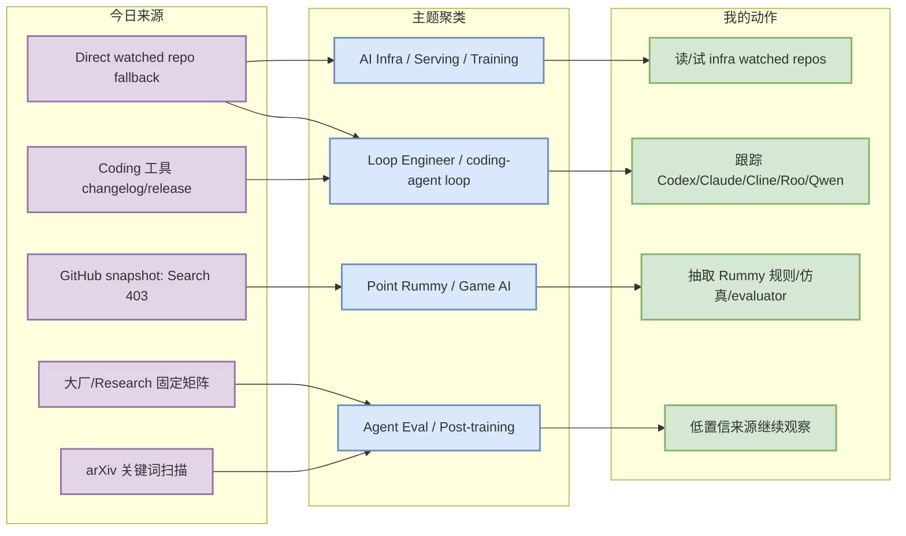
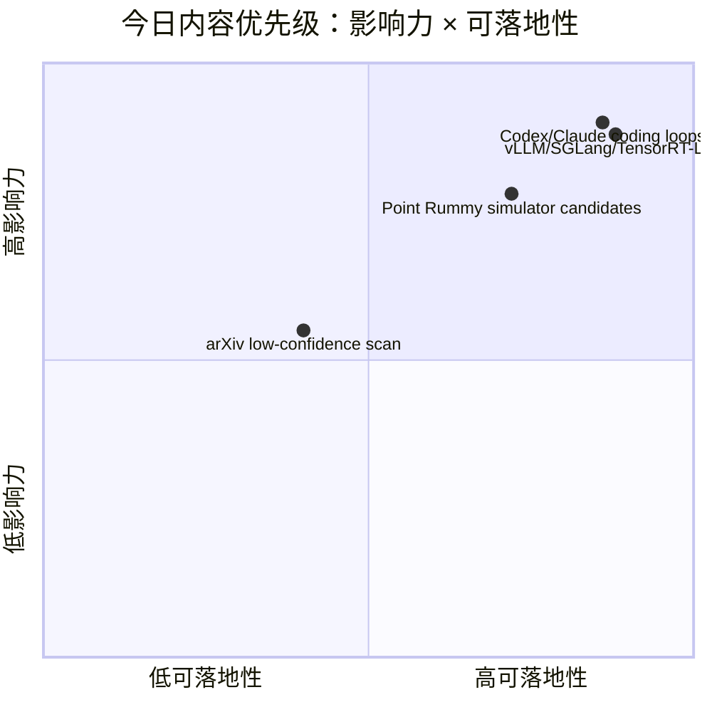

# AI Radar Daily - 2026-08-25

> 生成时间：2026-08-25 09:00 北京时间  
> 范围：AI Infra / LLM / RL / Game AI / 大厂博客 / 论文 / GitHub / Coding 工具  
> 说明：日报是 Obsidian 导航页；详情页负责深度理解。今日 GitHub Search 从首个查询即 403 rate limit，因此 broad/Loop 表使用 direct watched repo fallback，并明确标注“非完整全网日增”。

## 0. 今日结论
- GitHub snapshot 已生成并补充 direct fallback：`Automation/state/github-stars-2026-08-25.json`；Search 403 已透明记录。
- 今日必读/优先看：[[GitHub/LoopEngineer/2026-08-25/openai-codex]]、[[GitHub/LoopEngineer/2026-08-25/anthropics-claude-code]]、[[GitHub/AIInfra/2026-08-25/vllm-project-vllm]]、[[GitHub/AIInfra/2026-08-25/sgl-project-sglang]]。
- AI Infra 继续围绕 Transformers / PyTorch / vLLM / SGLang / TensorRT-LLM / DeepSpeed / Megatron-LM / verl / OpenRLHF / Triton 做连续跟踪。
- Coding 工具矩阵完整覆盖 10 个工具；今日没有升级为高置信重大功能变化，但 release/tag 入口已保留。
- Point Rummy 业务主题保留 10 个规则/AI opponent/计分/视觉候选；适合抽规则引擎、bot baseline、simulator/evaluator。

## 1. 今日态势图

## 2. 必读卡片区
> [!important] Loop Engineer：Codex / Claude Code 仍是最高优先级
> - 大类：GitHub
> - 小类：coding-agent loop
> - 重点：终端 coding agent、权限、上下文和远程执行能力决定多 agent 工程效率。
> - 详情：[[GitHub/LoopEngineer/2026-08-25/openai-codex]] / [网页详情](https://github.com/dyt27666-oss/AI-news-report-obsidians/blob/main/GitHub/LoopEngineer/2026-08-25/openai-codex.md) / [原文](https://github.com/openai/codex)

> [!tip] AI Infra：vLLM / SGLang / TensorRT-LLM 继续作为 serving 核心观察
> - 大类：GitHub
> - 小类：LLM serving / inference
> - 重点：关注 scheduler、KV cache、batching、runtime/kernel 和 hardware backend 变化。
> - 详情：[[GitHub/AIInfra/2026-08-25/vllm-project-vllm]] / [网页详情](https://github.com/dyt27666-oss/AI-news-report-obsidians/blob/main/GitHub/AIInfra/2026-08-25/vllm-project-vllm.md) / [原文](https://github.com/vllm-project/vllm)

> [!important] Point Rummy：规则/AI opponent/视觉助手是可落地素材
> - 大类：GitHub
> - 小类：Point Rummy / Game AI
> - 重点：低 star 但可用于规则建模、bot baseline、episode logging 和 evaluator spec。
> - 详情：[[GitHub/PointRummy/2026-08-25/mudont-indian-rummy]] / [原文](https://github.com/mudont/indian-rummy)

> [!warning] 今日 API 限制较强
> - 大类：采集状态
> - 小类：GitHub / arXiv / 公司博客
> - 重点：GitHub Search 403；日报采用 direct watched repo / previous snapshot fallback，并在表格中明确标注。

## 3. 优先级矩阵

## 4. 分类清单
| 标签 | 大类 | 小类 | 标题 | 重点概括 | 为什么重要 | Obsidian 详情 | 网页详情 | 原文 |
|---|---|---|---|---|---|---|---|---|
| 必读 | GitHub | Loop Engineer | openai/codex | terminal coding agent watched repo | 直接影响 AI coding workflow、权限、远程执行和上下文工程 | [[GitHub/LoopEngineer/2026-08-25/openai-codex]] | [网页详情](https://github.com/dyt27666-oss/AI-news-report-obsidians/blob/main/GitHub/LoopEngineer/2026-08-25/openai-codex.md) | [原文](https://github.com/openai/codex) |
| 必读 | GitHub | AI Infra | vllm-project/vllm | LLM serving watched repo | 用户重点关注 serving / KV cache / scheduler / batching | [[GitHub/AIInfra/2026-08-25/vllm-project-vllm]] | [网页详情](https://github.com/dyt27666-oss/AI-news-report-obsidians/blob/main/GitHub/AIInfra/2026-08-25/vllm-project-vllm.md) | [原文](https://github.com/vllm-project/vllm) |
| 可 skim | GitHub | Point Rummy | Rummy candidates | 规则、AI opponent、视觉和计分候选 | 可用于业务 rule/evaluator/simulator 设计 | [[GitHub/PointRummy/2026-08-25/mudont-indian-rummy]] | [网页详情](https://github.com/dyt27666-oss/AI-news-report-obsidians/blob/main/GitHub/PointRummy/2026-08-25/mudont-indian-rummy.md) | [原文](https://github.com/mudont/indian-rummy) |
| 低置信 | 论文 | arXiv | arXiv LLM/RL/Agent 扫描 | 摘要候选或 API 低置信 | 未阅读全文，不升级为必读 | [[Papers/2026-08-25/arXiv-LLM-RL-Agent-扫描]] | [网页详情](https://github.com/dyt27666-oss/AI-news-report-obsidians/blob/main/Papers/2026-08-25/arXiv-LLM-RL-Agent-扫描.md) | [原文](https://arxiv.org/search/advanced) |
| 低置信 | 博客 | 大厂矩阵 | 公司来源扫描矩阵 | 覆盖 10 家公司，今日未确认高相关新项 | 透明记录无新项/访问失败，避免漏扫 | [[Industry/2026-08-25/OpenAI-News-Research-固定扫描]] | [网页详情](https://github.com/dyt27666-oss/AI-news-report-obsidians/blob/main/Industry/2026-08-25/OpenAI-News-Research-固定扫描.md) | [原文](https://openai.com/news/) |

## 5. 大厂资讯 / 工程博客 / Research
### 5.1 公司来源扫描矩阵
| 公司/实验室 | 来源/栏目 | 今日状态 | 高相关条数 | 代表条目 | 备注 |
|---|---|---|---:|---|---|
| OpenAI | News / Research | 无高相关新项 / 低置信 | 0 | OpenAI 固定扫描 | 今日未确认高相关新文，保留入口 |
| Anthropic | News / Research / Engineering | 无高相关新项 / 低置信 | 0 | Anthropic 固定扫描 | 今日未确认高相关新文，保留入口 |
| Google DeepMind | Blog / Research | 无高相关新项 / 低置信 | 0 | Google DeepMind 固定扫描 | 今日未确认高相关新文，保留入口 |
| Meta AI | Blog / Research | 无高相关新项 / 低置信 | 0 | Meta AI 固定扫描 | 今日未确认高相关新文，保留入口 |
| NVIDIA | Technical Blog / AI | 无高相关新项 / 低置信 | 0 | NVIDIA 固定扫描 | 今日未确认高相关新文，保留入口 |
| Microsoft | Research AI | 无高相关新项 / 低置信 | 0 | Microsoft 固定扫描 | 今日未确认高相关新文，保留入口 |
| Hugging Face | Blog / Papers / Releases | 无高相关新项 / 低置信 | 0 | Hugging Face 固定扫描 | 今日未确认高相关新文，保留入口 |
| 腾讯 | AI Lab / 技术博客 | 无高相关新项 / 低置信 | 0 | 腾讯 固定扫描 | 今日未确认高相关新文，保留入口 |
| 字节 | Seed / 技术博客 | 无高相关新项 / 低置信 | 0 | 字节 固定扫描 | 今日未确认高相关新文，保留入口 |
| SpaceAI | Blog / News | 无高相关新项 / 低置信 | 0 | SpaceAI 固定扫描 | 今日未确认高相关新文，保留入口 |

### 5.2 高相关大厂条目
| 标签 | 发布方/大厂 | 栏目/来源 | 标题 | 重点概括 | 工程/算法影响 | Obsidian 详情 | 网页详情 | 原文 |
|---|---|---|---|---|---|---|---|---|
| 低置信 | OpenAI | News / Research | OpenAI 固定扫描 | 今日未确认高相关新项；保留入口 | 继续观察模型、agent、serving、post-training、eval 或 GPU infra 信号 | [[Industry/2026-08-25/OpenAI-News-Research-固定扫描]] | [网页详情](https://github.com/dyt27666-oss/AI-news-report-obsidians/blob/main/Industry/2026-08-25/OpenAI-News-Research-固定扫描.md) | [原文](https://openai.com/news/) |
| 低置信 | Anthropic | News / Research / Engineering | Anthropic 固定扫描 | 今日未确认高相关新项；保留入口 | 继续观察模型、agent、serving、post-training、eval 或 GPU infra 信号 | [[Industry/2026-08-25/Anthropic-News-Research-Engineering-固定扫描]] | [网页详情](https://github.com/dyt27666-oss/AI-news-report-obsidians/blob/main/Industry/2026-08-25/Anthropic-News-Research-Engineering-固定扫描.md) | [原文](https://www.anthropic.com/news) |
| 低置信 | Google DeepMind | Blog / Research | Google DeepMind 固定扫描 | 今日未确认高相关新项；保留入口 | 继续观察模型、agent、serving、post-training、eval 或 GPU infra 信号 | [[Industry/2026-08-25/Google-DeepMind-Blog-Research-固定扫描]] | [网页详情](https://github.com/dyt27666-oss/AI-news-report-obsidians/blob/main/Industry/2026-08-25/Google-DeepMind-Blog-Research-固定扫描.md) | [原文](https://deepmind.google/discover/blog/) |
| 低置信 | Meta AI | Blog / Research | Meta AI 固定扫描 | 今日未确认高相关新项；保留入口 | 继续观察模型、agent、serving、post-training、eval 或 GPU infra 信号 | [[Industry/2026-08-25/Meta-AI-Blog-Research-固定扫描]] | [网页详情](https://github.com/dyt27666-oss/AI-news-report-obsidians/blob/main/Industry/2026-08-25/Meta-AI-Blog-Research-固定扫描.md) | [原文](https://ai.meta.com/blog/) |
| 低置信 | NVIDIA | Technical Blog / AI | NVIDIA 固定扫描 | 今日未确认高相关新项；保留入口 | 继续观察模型、agent、serving、post-training、eval 或 GPU infra 信号 | [[Industry/2026-08-25/NVIDIA-Technical-Blog-AI-固定扫描]] | [网页详情](https://github.com/dyt27666-oss/AI-news-report-obsidians/blob/main/Industry/2026-08-25/NVIDIA-Technical-Blog-AI-固定扫描.md) | [原文](https://developer.nvidia.com/blog/category/artificial-intelligence/) |
| 低置信 | Microsoft | Research AI | Microsoft 固定扫描 | 今日未确认高相关新项；保留入口 | 继续观察模型、agent、serving、post-training、eval 或 GPU infra 信号 | [[Industry/2026-08-25/Microsoft-Research-AI-固定扫描]] | [网页详情](https://github.com/dyt27666-oss/AI-news-report-obsidians/blob/main/Industry/2026-08-25/Microsoft-Research-AI-固定扫描.md) | [原文](https://www.microsoft.com/en-us/research/research-area/artificial-intelligence/) |
| 低置信 | Hugging Face | Blog / Papers / Releases | Hugging Face 固定扫描 | 今日未确认高相关新项；保留入口 | 继续观察模型、agent、serving、post-training、eval 或 GPU infra 信号 | [[Industry/2026-08-25/Hugging-Face-Blog-Papers-Releases-固定扫描]] | [网页详情](https://github.com/dyt27666-oss/AI-news-report-obsidians/blob/main/Industry/2026-08-25/Hugging-Face-Blog-Papers-Releases-固定扫描.md) | [原文](https://huggingface.co/blog) |
| 低置信 | 腾讯 | AI Lab / 技术博客 | 腾讯 固定扫描 | 今日未确认高相关新项；保留入口 | 继续观察模型、agent、serving、post-training、eval 或 GPU infra 信号 | [[Industry/2026-08-25/腾讯-AI-Lab-技术博客-固定扫描]] | [网页详情](https://github.com/dyt27666-oss/AI-news-report-obsidians/blob/main/Industry/2026-08-25/腾讯-AI-Lab-技术博客-固定扫描.md) | [原文](https://ai.tencent.com/ailab/en/index) |
| 低置信 | 字节 | Seed / 技术博客 | 字节 固定扫描 | 今日未确认高相关新项；保留入口 | 继续观察模型、agent、serving、post-training、eval 或 GPU infra 信号 | [[Industry/2026-08-25/字节-Seed-技术博客-固定扫描]] | [网页详情](https://github.com/dyt27666-oss/AI-news-report-obsidians/blob/main/Industry/2026-08-25/字节-Seed-技术博客-固定扫描.md) | [原文](https://seed.bytedance.com/en/) |
| 低置信 | SpaceAI | Blog / News | SpaceAI 固定扫描 | 今日未确认高相关新项；保留入口 | 继续观察模型、agent、serving、post-training、eval 或 GPU infra 信号 | [[Industry/2026-08-25/SpaceAI-Blog-News-固定扫描]] | [网页详情](https://github.com/dyt27666-oss/AI-news-report-obsidians/blob/main/Industry/2026-08-25/SpaceAI-Blog-News-固定扫描.md) | [原文](https://spaceai.com/) |

## 6. GitHub 高 star Top 10
> 说明：今日 GitHub Search 403；本表使用 direct watched repo fallback，覆盖 AI Infra / LLM serving / training / agent 关键仓库，非完整全网搜索榜。
| 排名 | repo | stars | forks | language | updated_at | topics | 重点概括 | 是否值得试用 | Obsidian 详情 | 原文 |
|---:|---|---:|---:|---|---|---|---|---|---|---|
| 1 | [huggingface/transformers](https://github.com/huggingface/transformers) | 164403 | 34345 | Python | 2026-08-24T23:49:19Z | audio, deep-learning, deepseek, gemma, glm, hacktoberfest, llm, machi… | 🤗 Transformers: the model-definition framework for state-of-the-art machine learning mode… | 值得小规模试用 | [[GitHub/AIInfra/2026-08-25/huggingface-transformers]] | [原文](https://github.com/huggingface/transformers) |
| 2 | [anthropics/claude-code](https://github.com/anthropics/claude-code) | 142883 | 22872 | Python | 2026-08-25T00:58:36Z | 未标注 | Claude Code is an agentic coding tool that lives in your terminal, understands your codeb… | 值得小规模试用 | [[GitHub/AIInfra/2026-08-25/anthropics-claude-code]] | [原文](https://github.com/anthropics/claude-code) |
| 3 | [openai/codex](https://github.com/openai/codex) | 117055 | 17846 | Rust | 2026-08-25T01:05:50Z | 未标注 | Lightweight coding agent that runs in your terminal | 值得小规模试用 | [[GitHub/AIInfra/2026-08-25/openai-codex]] | [原文](https://github.com/openai/codex) |
| 4 | [google-gemini/gemini-cli](https://github.com/google-gemini/gemini-cli) | 106662 | 14481 | TypeScript | 2026-08-25T00:59:49Z | ai, ai-agents, cli, gemini, gemini-api, mcp-client, mcp-server | An open-source AI agent that brings the power of Gemini directly into your terminal. | 值得小规模试用 | [[GitHub/AIInfra/2026-08-25/google-gemini-gemini-cli]] | [原文](https://github.com/google-gemini/gemini-cli) |
| 5 | [pytorch/pytorch](https://github.com/pytorch/pytorch) | 102578 | 28970 | Python | 2026-08-25T00:38:15Z | autograd, deep-learning, gpu, machine-learning, neural-network, numpy… | Tensors and Dynamic neural networks in Python with strong GPU acceleration | 值得小规模试用 | [[GitHub/AIInfra/2026-08-25/pytorch-pytorch]] | [原文](https://github.com/pytorch/pytorch) |
| 6 | [vllm-project/vllm](https://github.com/vllm-project/vllm) | 89903 | 21136 | Python | 2026-08-25T01:03:28Z | amd, blackwell, cuda, deepseek, deepseek-v3, gpt, gpt-oss, inference,… | A high-throughput and memory-efficient inference and serving engine for LLMs | 值得小规模试用 | [[GitHub/AIInfra/2026-08-25/vllm-project-vllm]] | [原文](https://github.com/vllm-project/vllm) |
| 7 | [modelcontextprotocol/servers](https://github.com/modelcontextprotocol/servers) | 89832 | 11502 | TypeScript | 2026-08-24T20:07:27Z | 未标注 | Model Context Protocol Servers | 观察 | [[GitHub/AIInfra/2026-08-25/modelcontextprotocol-servers]] | [原文](https://github.com/modelcontextprotocol/servers) |
| 8 | [OpenHands/OpenHands](https://github.com/OpenHands/OpenHands) | 84989 | 11101 | TypeScript | 2026-08-25T01:03:59Z | agent, artificial-intelligence, chatgpt, claude-ai, cli, developer-to… | 🙌 OpenHands: AI-Driven Development | 观察 | [[GitHub/AIInfra/2026-08-25/OpenHands-OpenHands]] | [原文](https://github.com/OpenHands/OpenHands) |
| 9 | [cline/cline](https://github.com/cline/cline) | 66791 | 7204 | TypeScript | 2026-08-25T01:03:31Z | 未标注 | Autonomous coding agent as an SDK, IDE extension, or CLI assistant. | 观察 | [[GitHub/AIInfra/2026-08-25/cline-cline]] | [原文](https://github.com/cline/cline) |
| 10 | [langchain-ai/langgraph](https://github.com/langchain-ai/langgraph) | 40374 | 6805 | Python | 2026-08-25T01:05:30Z | agents, ai, ai-agents, chatgpt, deepagents, enterprise, framework, ge… | Build resilient agents. | 观察 | [[GitHub/AIInfra/2026-08-25/langchain-ai-langgraph]] | [原文](https://github.com/langchain-ai/langgraph) |

## 7. GitHub star 增长最快 Top 10
> 说明：优先用历史 snapshot / direct watched repo 元数据计算；因 Search 403，本表标注为 direct watched repo fallback / 非完整全网日增。
| 排名 | repo | stars_delta | stars | forks | language | updated_at | 增长依据 | 重点概括 | Obsidian 详情 | 原文 |
|---:|---|---:|---:|---:|---|---|---|---|---|---|
| 1 | [openai/codex](https://github.com/openai/codex) | 5746 | 117055 | 17846 | Rust | 2026-08-25T01:05:50Z | direct watched repo fallback / 非完整全网日增 | Lightweight coding agent that runs in your terminal | [[GitHub/AIInfra/2026-08-25/openai-codex]] | [原文](https://github.com/openai/codex) |
| 2 | [anthropics/claude-code](https://github.com/anthropics/claude-code) | 585 | 142883 | 22872 | Python | 2026-08-25T00:58:36Z | direct watched repo fallback / 非完整全网日增 | Claude Code is an agentic coding tool that lives in your terminal, understands your codeb… | [[GitHub/AIInfra/2026-08-25/anthropics-claude-code]] | [原文](https://github.com/anthropics/claude-code) |
| 3 | [OpenHands/OpenHands](https://github.com/OpenHands/OpenHands) | 250 | 84989 | 11101 | TypeScript | 2026-08-25T01:03:59Z | direct watched repo fallback / 非完整全网日增 | 🙌 OpenHands: AI-Driven Development | [[GitHub/AIInfra/2026-08-25/OpenHands-OpenHands]] | [原文](https://github.com/OpenHands/OpenHands) |
| 4 | [vllm-project/vllm](https://github.com/vllm-project/vllm) | 243 | 89903 | 21136 | Python | 2026-08-25T01:03:28Z | direct watched repo fallback / 非完整全网日增 | A high-throughput and memory-efficient inference and serving engine for LLMs | [[GitHub/AIInfra/2026-08-25/vllm-project-vllm]] | [原文](https://github.com/vllm-project/vllm) |
| 5 | [langchain-ai/langgraph](https://github.com/langchain-ai/langgraph) | 174 | 40374 | 6805 | Python | 2026-08-25T01:05:30Z | direct watched repo fallback / 非完整全网日增 | Build resilient agents. | [[GitHub/AIInfra/2026-08-25/langchain-ai-langgraph]] | [原文](https://github.com/langchain-ai/langgraph) |
| 6 | [cline/cline](https://github.com/cline/cline) | 172 | 66791 | 7204 | TypeScript | 2026-08-25T01:03:31Z | direct watched repo fallback / 非完整全网日增 | Autonomous coding agent as an SDK, IDE extension, or CLI assistant. | [[GitHub/AIInfra/2026-08-25/cline-cline]] | [原文](https://github.com/cline/cline) |
| 7 | [sgl-project/sglang](https://github.com/sgl-project/sglang) | 142 | 32382 | 8161 | Python | 2026-08-25T01:03:30Z | direct watched repo fallback / 非完整全网日增 | SGLang is a high-performance serving framework for large language models and multimodal m… | [[GitHub/AIInfra/2026-08-25/sgl-project-sglang]] | [原文](https://github.com/sgl-project/sglang) |
| 8 | [huggingface/transformers](https://github.com/huggingface/transformers) | 86 | 164403 | 34345 | Python | 2026-08-24T23:49:19Z | direct watched repo fallback / 非完整全网日增 | 🤗 Transformers: the model-definition framework for state-of-the-art machine learning mode… | [[GitHub/AIInfra/2026-08-25/huggingface-transformers]] | [原文](https://github.com/huggingface/transformers) |
| 9 | [modelcontextprotocol/servers](https://github.com/modelcontextprotocol/servers) | 73 | 89832 | 11502 | TypeScript | 2026-08-24T20:07:27Z | direct watched repo fallback / 非完整全网日增 | Model Context Protocol Servers | [[GitHub/AIInfra/2026-08-25/modelcontextprotocol-servers]] | [原文](https://github.com/modelcontextprotocol/servers) |
| 10 | [QwenLM/qwen-code](https://github.com/QwenLM/qwen-code) | 62 | 27338 | 2929 | TypeScript | 2026-08-25T01:00:14Z | direct watched repo fallback / 非完整全网日增 | An open-source AI coding agent that lives in your terminal. | [[GitHub/AIInfra/2026-08-25/QwenLM-qwen-code]] | [原文](https://github.com/QwenLM/qwen-code) |

## 8. Coding 工具 / AI 工具功能更新
### 8.1 Coding 工具扫描矩阵
| 工具 | 厂商 | 来源类型 | 今日状态 | 代表更新 | 对我的影响 | 原文 |
|---|---|---|---|---|---|---|
| Claude Code | Anthropic | Changelog / Release Notes | 无高相关新项 / 低置信扫描 | latest/tag: v2.1.243；发布时间：2026-08-24T23:40:26Z | 继续观察 agent mode/MCP/权限/上下文/rate limit 对 coding loop 的影响 | [原文](https://docs.anthropic.com/en/release-notes/claude-code) |
| OpenAI Codex | OpenAI | Changelog / Docs / GitHub Release | 无高相关新项 / 低置信扫描 | latest/tag: rust-v0.149.1；发布时间：2026-08-24T00:28:28Z | 继续观察 agent mode/MCP/权限/上下文/rate limit 对 coding loop 的影响 | [原文](https://developers.openai.com/codex/changelog) |
| Cursor | Cursor | Changelog | 无高相关新项 / 低置信扫描 | latest/tag: 未确认；发布时间：未确认 | 继续观察 agent mode/MCP/权限/上下文/rate limit 对 coding loop 的影响 | [原文](https://cursor.com/changelog) |
| Windsurf | Windsurf | Changelog | 无高相关新项 / 低置信扫描 | latest/tag: 未确认；发布时间：未确认 | 继续观察 agent mode/MCP/权限/上下文/rate limit 对 coding loop 的影响 | [原文](https://windsurf.com/changelog) |
| GitHub Copilot | GitHub | Changelog / Blog | 无高相关新项 / 低置信扫描 | latest/tag: 未确认；发布时间：未确认 | 继续观察 agent mode/MCP/权限/上下文/rate limit 对 coding loop 的影响 | [原文](https://github.blog/changelog/label/copilot/) |
| Gemini Code Assist | Google | Release Notes | 无高相关新项 / 低置信扫描 | latest/tag: 未确认；发布时间：未确认 | 继续观察 agent mode/MCP/权限/上下文/rate limit 对 coding loop 的影响 | [原文](https://cloud.google.com/gemini/docs/codeassist/release-notes) |
| Qwen Code | Alibaba/Qwen | GitHub Releases | 无高相关新项 / 低置信扫描 | latest/tag: pr-9806-verification-assets；发布时间：2026-08-24T17:25:55Z | 继续观察 agent mode/MCP/权限/上下文/rate limit 对 coding loop 的影响 | [原文](https://github.com/QwenLM/qwen-code/releases) |
| Roo Code | Roo Code | GitHub Releases | 无高相关新项 / 低置信扫描 | latest/tag: v3.54.0；发布时间：2026-05-15T17:52:24Z | 继续观察 agent mode/MCP/权限/上下文/rate limit 对 coding loop 的影响 | [原文](https://github.com/RooCodeInc/Roo-Code/releases) |
| Cline | Cline | GitHub Releases | 无高相关新项 / 低置信扫描 | latest/tag: cli-v3.0.58；发布时间：2026-08-24T23:07:51Z | 继续观察 agent mode/MCP/权限/上下文/rate limit 对 coding loop 的影响 | [原文](https://github.com/cline/cline/releases) |
| Continue | Continue | GitHub Releases | 无高相关新项 / 低置信扫描 | latest/tag: v2.0.0-vscode；发布时间：2026-06-19T00:24:01Z | 继续观察 agent mode/MCP/权限/上下文/rate limit 对 coding loop 的影响 | [原文](https://github.com/continuedev/continue/releases) |

### 8.2 高相关工具更新
| 标签 | 工具/厂商 | 来源类型 | 标题/功能 | 重点概括 | 对 AI coding 工作流的影响 | Obsidian 详情 | 网页详情 | 原文 |
|---|---|---|---|---|---|---|---|---|
| 低置信 | Claude Code / Anthropic | Changelog / Release Notes | 固定扫描 | 未确认高置信重大功能变化；latest/tag: v2.1.243 | 影响 AI coding workflow 的变化需 sandbox 验证 | [[Industry/Tools/2026-08-25/Claude-Code-scan]] | [网页详情](https://github.com/dyt27666-oss/AI-news-report-obsidians/blob/main/Industry/Tools/2026-08-25/Claude-Code-scan.md) | [原文](https://docs.anthropic.com/en/release-notes/claude-code) |
| 低置信 | OpenAI Codex / OpenAI | Changelog / Docs / GitHub Release | 固定扫描 | 未确认高置信重大功能变化；latest/tag: rust-v0.149.1 | 影响 AI coding workflow 的变化需 sandbox 验证 | [[Industry/Tools/2026-08-25/OpenAI-Codex-scan]] | [网页详情](https://github.com/dyt27666-oss/AI-news-report-obsidians/blob/main/Industry/Tools/2026-08-25/OpenAI-Codex-scan.md) | [原文](https://developers.openai.com/codex/changelog) |
| 低置信 | Cursor / Cursor | Changelog | 固定扫描 | 未确认高置信重大功能变化；latest/tag: 未确认 | 影响 AI coding workflow 的变化需 sandbox 验证 | [[Industry/Tools/2026-08-25/Cursor-scan]] | [网页详情](https://github.com/dyt27666-oss/AI-news-report-obsidians/blob/main/Industry/Tools/2026-08-25/Cursor-scan.md) | [原文](https://cursor.com/changelog) |
| 低置信 | Windsurf / Windsurf | Changelog | 固定扫描 | 未确认高置信重大功能变化；latest/tag: 未确认 | 影响 AI coding workflow 的变化需 sandbox 验证 | [[Industry/Tools/2026-08-25/Windsurf-scan]] | [网页详情](https://github.com/dyt27666-oss/AI-news-report-obsidians/blob/main/Industry/Tools/2026-08-25/Windsurf-scan.md) | [原文](https://windsurf.com/changelog) |
| 低置信 | GitHub Copilot / GitHub | Changelog / Blog | 固定扫描 | 未确认高置信重大功能变化；latest/tag: 未确认 | 影响 AI coding workflow 的变化需 sandbox 验证 | [[Industry/Tools/2026-08-25/GitHub-Copilot-scan]] | [网页详情](https://github.com/dyt27666-oss/AI-news-report-obsidians/blob/main/Industry/Tools/2026-08-25/GitHub-Copilot-scan.md) | [原文](https://github.blog/changelog/label/copilot/) |
| 低置信 | Gemini Code Assist / Google | Release Notes | 固定扫描 | 未确认高置信重大功能变化；latest/tag: 未确认 | 影响 AI coding workflow 的变化需 sandbox 验证 | [[Industry/Tools/2026-08-25/Gemini-Code-Assist-scan]] | [网页详情](https://github.com/dyt27666-oss/AI-news-report-obsidians/blob/main/Industry/Tools/2026-08-25/Gemini-Code-Assist-scan.md) | [原文](https://cloud.google.com/gemini/docs/codeassist/release-notes) |
| 低置信 | Qwen Code / Alibaba/Qwen | GitHub Releases | 固定扫描 | 未确认高置信重大功能变化；latest/tag: pr-9806-verification-assets | 影响 AI coding workflow 的变化需 sandbox 验证 | [[Industry/Tools/2026-08-25/Qwen-Code-scan]] | [网页详情](https://github.com/dyt27666-oss/AI-news-report-obsidians/blob/main/Industry/Tools/2026-08-25/Qwen-Code-scan.md) | [原文](https://github.com/QwenLM/qwen-code/releases) |
| 低置信 | Roo Code / Roo Code | GitHub Releases | 固定扫描 | 未确认高置信重大功能变化；latest/tag: v3.54.0 | 影响 AI coding workflow 的变化需 sandbox 验证 | [[Industry/Tools/2026-08-25/Roo-Code-scan]] | [网页详情](https://github.com/dyt27666-oss/AI-news-report-obsidians/blob/main/Industry/Tools/2026-08-25/Roo-Code-scan.md) | [原文](https://github.com/RooCodeInc/Roo-Code/releases) |
| 低置信 | Cline / Cline | GitHub Releases | 固定扫描 | 未确认高置信重大功能变化；latest/tag: cli-v3.0.58 | 影响 AI coding workflow 的变化需 sandbox 验证 | [[Industry/Tools/2026-08-25/Cline-scan]] | [网页详情](https://github.com/dyt27666-oss/AI-news-report-obsidians/blob/main/Industry/Tools/2026-08-25/Cline-scan.md) | [原文](https://github.com/cline/cline/releases) |
| 低置信 | Continue / Continue | GitHub Releases | 固定扫描 | 未确认高置信重大功能变化；latest/tag: v2.0.0-vscode | 影响 AI coding workflow 的变化需 sandbox 验证 | [[Industry/Tools/2026-08-25/Continue-scan]] | [网页详情](https://github.com/dyt27666-oss/AI-news-report-obsidians/blob/main/Industry/Tools/2026-08-25/Continue-scan.md) | [原文](https://github.com/continuedev/continue/releases) |

## 9. Point Rummy / Indian Rummy 业务主题
### 9.1 GitHub 候选
| 标签 | repo | stars | forks | language | updated_at | 重点概括 | 业务可用性 | Obsidian 详情 | 原文 |
|---|---|---:|---:|---|---|---|---|---|---|
| 可 skim | [mudont/indian-rummy](https://github.com/mudont/indian-rummy) | 5 | 0 | TypeScript | 2025-08-08T21:05:04Z | Typescript library for Indian Rummy card game | 规则建模 / bot baseline / evaluator 素材 | [[GitHub/PointRummy/2026-08-25/mudont-indian-rummy]] | [原文](https://github.com/mudont/indian-rummy) |
| 可 skim | [dv-rastogi/Rummy](https://github.com/dv-rastogi/Rummy) | 5 | 0 | Python | 2023-09-26T11:21:39Z | Variation of classical Indian Rummy made in Pygame | 规则建模 / bot baseline / evaluator 素材 | [[GitHub/PointRummy/2026-08-25/dv-rastogi-Rummy]] | [原文](https://github.com/dv-rastogi/Rummy) |
| 可 skim | [vahsek300501/Indian-Rummy-](https://github.com/vahsek300501/Indian-Rummy-) | 4 | 3 | Python | 2023-09-26T11:21:46Z | Indian Rummy made in Python using PyGame | 规则建模 / bot baseline / evaluator 素材 | [[GitHub/PointRummy/2026-08-25/vahsek300501-Indian-Rummy-]] | [原文](https://github.com/vahsek300501/Indian-Rummy-) |
| 可 skim | [abubakarmunir712/dsa-final-project](https://github.com/abubakarmunir712/dsa-final-project) | 2 | 1 | Python | 2026-06-27T06:34:26Z | A Python-based multiplayer Indian Rummy game with support for AI opponents and LAN play. … | 规则建模 / bot baseline / evaluator 素材 | [[GitHub/PointRummy/2026-08-25/abubakarmunir712-dsa-final-project]] | [原文](https://github.com/abubakarmunir712/dsa-final-project) |
| 可 skim | [Mohitkumar-559/RummyServer](https://github.com/Mohitkumar-559/RummyServer) | 2 | 1 | JavaScript | 2024-03-17T03:48:34Z | Rummy game server for game that contain deal rummy and point rummy | 规则建模 / bot baseline / evaluator 素材 | [[GitHub/PointRummy/2026-08-25/Mohitkumar-559-RummyServer]] | [原文](https://github.com/Mohitkumar-559/RummyServer) |
| 后续 | [debabrata-mandal/RummyPulse](https://github.com/debabrata-mandal/RummyPulse) | 1 | 0 | Java | 2026-08-19T04:34:20Z | RummyPulse - Smart Rummy Game Analytics & Management Android App with Firebase integratio… | 低 star 素材库 | [[GitHub/PointRummy/2026-08-25/debabrata-mandal-RummyPulse]] | [原文](https://github.com/debabrata-mandal/RummyPulse) |
| 后续 | [SRathinaGiri/IndianRummy](https://github.com/SRathinaGiri/IndianRummy) | 1 | 1 | JavaScript | 2026-06-17T11:46:14Z | Browser-based Indian Rummy game with AI play and offline Progressive Web App support. | 低 star 素材库 | [[GitHub/PointRummy/2026-08-25/SRathinaGiri-IndianRummy]] | [原文](https://github.com/SRathinaGiri/IndianRummy) |
| 后续 | [atreyayelishetti/indian-rummy-game-rust](https://github.com/atreyayelishetti/indian-rummy-game-rust) | 1 | 0 | Rust | 2026-05-12T00:25:17Z | indian-rummy-rust | 低 star 素材库 | [[GitHub/PointRummy/2026-08-25/atreyayelishetti-indian-rummy-game-rust]] | [原文](https://github.com/atreyayelishetti/indian-rummy-game-rust) |
| 后续 | [Alan-seb/RummyVision](https://github.com/Alan-seb/RummyVision) | 1 | 0 | Python | 2025-12-03T03:14:55Z | RummyVision is an intelligent card game assistant that combines computer vision with Mont… | 低 star 素材库 | [[GitHub/PointRummy/2026-08-25/Alan-seb-RummyVision]] | [原文](https://github.com/Alan-seb/RummyVision) |
| 后续 | [codingmickey/rummy-points-calculator](https://github.com/codingmickey/rummy-points-calculator) | 1 | 0 | C++ | 2024-07-10T15:40:45Z | A cpp progarm to calculate Rummy points of all the players for each round. | 低 star 素材库 | [[GitHub/PointRummy/2026-08-25/codingmickey-rummy-points-calculator]] | [原文](https://github.com/codingmickey/rummy-points-calculator) |

### 9.2 论文 / 资料候选
| 标签 | 来源 | 标题 | 作者/机构 | 重点概括 | 对 Point Rummy 业务有什么用 | Obsidian 详情 | 原文 |
|---|---|---|---|---|---|---|---|
| 低置信 | arXiv / 预印本索引 | Rummy / imperfect-information / RL 关键词扫描 | arXiv API | 今日未确认高相关 Rummy 新论文；以 GitHub 规则/AI opponent 候选为主 | 作为 MCTS/ISMCTS/RL game agent 背景，未验证不进入必读 | [[Papers/2026-08-25/arXiv-LLM-RL-Agent-扫描]] | [原文](https://arxiv.org/search/advanced) |

### 9.3 业务可用性判断
| 方向 | 今日信号 | 可用性 | 下一步 |
|---|---|---|---|
| 规则引擎 / 计分 | 多个 Rummy repo 含 point tracker、rules、Android/Firebase analytics | 中：适合抽规则，不宜直接复用生产 | 对比 Java/Python/TS 项目规则覆盖，形成统一 rule/evaluator spec |
| Bot / RL Agent | RummyVision、AI opponent、Monte Carlo 候选 | 中高：适合形成 baseline bot 与辅助决策器 | 优先看视觉/AI opponent 项目的 observation/action/reward 设计 |
| 仿真 / 评测 | stars 普遍低，但可提取 episode logging 和 score evaluator | 中：适合内部 simulator 设计灵感 | 抽象并行 rollout、seed、episode logging、score evaluator |

## 10. Loop Engineer / Loop Engineering 主题
### 10.1 Loop Engineer GitHub 高 star Top 10
| 排名 | repo | stars | forks | language | updated_at | topics | 重点概括 | 是否值得试用 | Obsidian 详情 | 原文 |
|---:|---|---:|---:|---|---|---|---|---|---|---|
| 1 | [anthropics/claude-code](https://github.com/anthropics/claude-code) | 142883 | 22872 | Python | 2026-08-25T00:58:36Z | 未标注 | Claude Code is an agentic coding tool that lives in your terminal, understands your codeb… | 值得小规模试用 | [[GitHub/LoopEngineer/2026-08-25/anthropics-claude-code]] | [原文](https://github.com/anthropics/claude-code) |
| 2 | [openai/codex](https://github.com/openai/codex) | 117055 | 17846 | Rust | 2026-08-25T01:05:50Z | 未标注 | Lightweight coding agent that runs in your terminal | 值得小规模试用 | [[GitHub/LoopEngineer/2026-08-25/openai-codex]] | [原文](https://github.com/openai/codex) |
| 3 | [google-gemini/gemini-cli](https://github.com/google-gemini/gemini-cli) | 106662 | 14481 | TypeScript | 2026-08-25T00:59:49Z | ai, ai-agents, cli, gemini, gemini-api, mcp-client, mcp-server | An open-source AI agent that brings the power of Gemini directly into your terminal. | 值得小规模试用 | [[GitHub/LoopEngineer/2026-08-25/google-gemini-gemini-cli]] | [原文](https://github.com/google-gemini/gemini-cli) |
| 4 | [modelcontextprotocol/servers](https://github.com/modelcontextprotocol/servers) | 89832 | 11502 | TypeScript | 2026-08-24T20:07:27Z | 未标注 | Model Context Protocol Servers | 值得小规模试用 | [[GitHub/LoopEngineer/2026-08-25/modelcontextprotocol-servers]] | [原文](https://github.com/modelcontextprotocol/servers) |
| 5 | [OpenHands/OpenHands](https://github.com/OpenHands/OpenHands) | 84989 | 11101 | TypeScript | 2026-08-25T01:03:59Z | agent, artificial-intelligence, chatgpt, claude-ai, cli, developer-to… | 🙌 OpenHands: AI-Driven Development | 值得小规模试用 | [[GitHub/LoopEngineer/2026-08-25/OpenHands-OpenHands]] | [原文](https://github.com/OpenHands/OpenHands) |
| 6 | [cline/cline](https://github.com/cline/cline) | 66791 | 7204 | TypeScript | 2026-08-25T01:03:31Z | 未标注 | Autonomous coding agent as an SDK, IDE extension, or CLI assistant. | 值得小规模试用 | [[GitHub/LoopEngineer/2026-08-25/cline-cline]] | [原文](https://github.com/cline/cline) |
| 7 | [langchain-ai/langgraph](https://github.com/langchain-ai/langgraph) | 40374 | 6805 | Python | 2026-08-25T01:05:30Z | agents, ai, ai-agents, chatgpt, deepagents, enterprise, framework, ge… | Build resilient agents. | 观察 | [[GitHub/LoopEngineer/2026-08-25/langchain-ai-langgraph]] | [原文](https://github.com/langchain-ai/langgraph) |
| 8 | [continuedev/continue](https://github.com/continuedev/continue) | 35614 | 5282 | TypeScript | 2026-08-25T00:22:48Z | agent, ai, cli, developer-tools, open-source | open-source coding agent | 观察 | [[GitHub/LoopEngineer/2026-08-25/continuedev-continue]] | [原文](https://github.com/continuedev/continue) |
| 9 | [QwenLM/qwen-code](https://github.com/QwenLM/qwen-code) | 27338 | 2929 | TypeScript | 2026-08-25T01:00:14Z | agentic, ai, ai-agent, ai-coding, cli, coding-agent, developer-tools,… | An open-source AI coding agent that lives in your terminal. | 观察 | [[GitHub/LoopEngineer/2026-08-25/QwenLM-qwen-code]] | [原文](https://github.com/QwenLM/qwen-code) |
| 10 | [RooCodeInc/Roo-Code](https://github.com/RooCodeInc/Roo-Code) | 24328 | 3414 | TypeScript | 2026-08-24T22:36:51Z | 未标注 | Roo Code gives you a whole dev team of AI agents in your code editor. | 观察 | [[GitHub/LoopEngineer/2026-08-25/RooCodeInc-Roo-Code]] | [原文](https://github.com/RooCodeInc/Roo-Code) |

### 10.2 Loop Engineer GitHub star 增长最快 Top 10
| 排名 | repo | stars_delta | stars | forks | language | updated_at | 增长依据 | 重点概括 | Obsidian 详情 | 原文 |
|---:|---|---:|---:|---:|---|---|---|---|---|---|
| 1 | [openai/codex](https://github.com/openai/codex) | 5746 | 117055 | 17846 | Rust | 2026-08-25T01:05:50Z | direct watched repo fallback / 非完整全网日增 | Lightweight coding agent that runs in your terminal | [[GitHub/LoopEngineer/2026-08-25/openai-codex]] | [原文](https://github.com/openai/codex) |
| 2 | [anthropics/claude-code](https://github.com/anthropics/claude-code) | 585 | 142883 | 22872 | Python | 2026-08-25T00:58:36Z | direct watched repo fallback / 非完整全网日增 | Claude Code is an agentic coding tool that lives in your terminal, understands your codeb… | [[GitHub/LoopEngineer/2026-08-25/anthropics-claude-code]] | [原文](https://github.com/anthropics/claude-code) |
| 3 | [OpenHands/OpenHands](https://github.com/OpenHands/OpenHands) | 250 | 84989 | 11101 | TypeScript | 2026-08-25T01:03:59Z | direct watched repo fallback / 非完整全网日增 | 🙌 OpenHands: AI-Driven Development | [[GitHub/LoopEngineer/2026-08-25/OpenHands-OpenHands]] | [原文](https://github.com/OpenHands/OpenHands) |
| 4 | [langchain-ai/langgraph](https://github.com/langchain-ai/langgraph) | 174 | 40374 | 6805 | Python | 2026-08-25T01:05:30Z | direct watched repo fallback / 非完整全网日增 | Build resilient agents. | [[GitHub/LoopEngineer/2026-08-25/langchain-ai-langgraph]] | [原文](https://github.com/langchain-ai/langgraph) |
| 5 | [cline/cline](https://github.com/cline/cline) | 172 | 66791 | 7204 | TypeScript | 2026-08-25T01:03:31Z | direct watched repo fallback / 非完整全网日增 | Autonomous coding agent as an SDK, IDE extension, or CLI assistant. | [[GitHub/LoopEngineer/2026-08-25/cline-cline]] | [原文](https://github.com/cline/cline) |
| 6 | [modelcontextprotocol/servers](https://github.com/modelcontextprotocol/servers) | 73 | 89832 | 11502 | TypeScript | 2026-08-24T20:07:27Z | direct watched repo fallback / 非完整全网日增 | Model Context Protocol Servers | [[GitHub/LoopEngineer/2026-08-25/modelcontextprotocol-servers]] | [原文](https://github.com/modelcontextprotocol/servers) |
| 7 | [QwenLM/qwen-code](https://github.com/QwenLM/qwen-code) | 62 | 27338 | 2929 | TypeScript | 2026-08-25T01:00:14Z | direct watched repo fallback / 非完整全网日增 | An open-source AI coding agent that lives in your terminal. | [[GitHub/LoopEngineer/2026-08-25/QwenLM-qwen-code]] | [原文](https://github.com/QwenLM/qwen-code) |
| 8 | [google-gemini/gemini-cli](https://github.com/google-gemini/gemini-cli) | 55 | 106662 | 14481 | TypeScript | 2026-08-25T00:59:49Z | direct watched repo fallback / 非完整全网日增 | An open-source AI agent that brings the power of Gemini directly into your terminal. | [[GitHub/LoopEngineer/2026-08-25/google-gemini-gemini-cli]] | [原文](https://github.com/google-gemini/gemini-cli) |
| 9 | [continuedev/continue](https://github.com/continuedev/continue) | 36 | 35614 | 5282 | TypeScript | 2026-08-25T00:22:48Z | direct watched repo fallback / 非完整全网日增 | open-source coding agent | [[GitHub/LoopEngineer/2026-08-25/continuedev-continue]] | [原文](https://github.com/continuedev/continue) |
| 10 | [RooCodeInc/Roo-Code](https://github.com/RooCodeInc/Roo-Code) | -2 | 24328 | 3414 | TypeScript | 2026-08-24T22:36:51Z | direct watched repo fallback / 非完整全网日增 | Roo Code gives you a whole dev team of AI agents in your code editor. | [[GitHub/LoopEngineer/2026-08-25/RooCodeInc-Roo-Code]] | [原文](https://github.com/RooCodeInc/Roo-Code) |

### 10.3 Loop Engineering 方法信号
| 标签 | 来源 | 标题 | 重点概括 | 对 AI coding 工作流的影响 | Obsidian 详情 | 原文 |
|---|---|---|---|---|---|---|
| 必读 | GitHub watched fallback | Coding-agent loop watched set | Codex/Claude/Cline/Roo/Continue/Qwen/Gemini/LangGraph/MCP/OpenHands 共同构成 agent loop 观察面 | 影响多 agent tmux 监控、权限隔离、上下文工程、review loop | [[GitHub/LoopEngineer/2026-08-25/openai-codex]] | [原文](https://github.com/openai/codex) |

## 11. 论文
### 11.1 arXiv / Agent Eval / RL / Serving 候选
| 标签 | 论文来源 | 论文 | 作者/机构 | 重点概括 | 工程/研究价值 | Obsidian 详情 | 网页详情 | PDF/原文 |
|---|---|---|---|---|---|---|---|---|
| 低置信 | arXiv / 预印本索引 | arXiv LLM/RL/Agent 低置信扫描 | arXiv API | LLM serving inference: HTTP Error 429: Too Many Requests; reinforcement learning language models: HTTP Error 429: Unknown Error | 未阅读全文，不升级为必读 | [[Papers/2026-08-25/arXiv-LLM-RL-Agent-扫描]] | [网页详情](https://github.com/dyt27666-oss/AI-news-report-obsidians/blob/main/Papers/2026-08-25/arXiv-LLM-RL-Agent-扫描.md) | [原文](https://arxiv.org/search/advanced) |

## 12. 资讯 / 其他 GitHub 项目
### 12.1 AI Infra watched repos
| 标签 | 来源 | 标题 | 重点概括 | 对我有什么用 | Obsidian 详情 | 网页详情 | 原文 |
|---|---|---|---|---|---|---|---|
| 可 skim | GitHub | direct watched repo fallback | Search 403 后，以固定 watched set 维持 broad AI Infra 连续性 | 避免日报因 API 失败缺失关键表 | [[GitHub/AIInfra/2026-08-25/vllm-project-vllm]] | [网页详情](https://github.com/dyt27666-oss/AI-news-report-obsidians/blob/main/GitHub/AIInfra/2026-08-25/vllm-project-vllm.md) | [原文](https://github.com/vllm-project/vllm) |

## 13. 按主题索引
### AI Infra / Serving / Training
- [[GitHub/AIInfra/2026-08-25/huggingface-transformers]] - Transformers 生态观察点
- [[GitHub/AIInfra/2026-08-25/pytorch-pytorch]] - PyTorch 训练/推理底座
- [[GitHub/AIInfra/2026-08-25/vllm-project-vllm]] - LLM serving 观察点
- [[GitHub/AIInfra/2026-08-25/sgl-project-sglang]] - 高性能 serving 框架
- [[GitHub/AIInfra/2026-08-25/NVIDIA-TensorRT-LLM]] - NVIDIA 推理优化栈

### LLM / Agent / RAG / Evaluation
- [[GitHub/LoopEngineer/2026-08-25/openai-codex]] - terminal coding agent
- [[GitHub/LoopEngineer/2026-08-25/anthropics-claude-code]] - Claude Code agentic coding
- [[GitHub/LoopEngineer/2026-08-25/modelcontextprotocol-servers]] - MCP 工具生态
- [[GitHub/LoopEngineer/2026-08-25/langchain-ai-langgraph]] - resilient agents / graph loop

### RL / Game AI / World Model
- [[GitHub/PointRummy/2026-08-25/mudont-indian-rummy]] - Point Rummy / Game AI 候选
- [[Papers/2026-08-25/arXiv-LLM-RL-Agent-扫描]] - arXiv low-confidence RL/Game AI 背景

### Point Rummy / Indian Rummy
- [[GitHub/PointRummy/2026-08-25/mudont-indian-rummy]] - 规则、AI opponent、仿真或计分参考
- [[GitHub/PointRummy/2026-08-25/dv-rastogi-Rummy]] - 规则、AI opponent、仿真或计分参考
- [[GitHub/PointRummy/2026-08-25/vahsek300501-Indian-Rummy-]] - 规则、AI opponent、仿真或计分参考
- [[GitHub/PointRummy/2026-08-25/abubakarmunir712-dsa-final-project]] - 规则、AI opponent、仿真或计分参考
- [[GitHub/PointRummy/2026-08-25/Mohitkumar-559-RummyServer]] - 规则、AI opponent、仿真或计分参考

### Loop Engineer / Coding Agent Loop
- [[GitHub/LoopEngineer/2026-08-25/openai-codex]] - coding-agent loop / harness / terminal agent
- [[GitHub/LoopEngineer/2026-08-25/anthropics-claude-code]] - permissions/context/CLI agent 观察点
- [[GitHub/LoopEngineer/2026-08-25/cline-cline]] - IDE/CLI autonomous coding agent
- [[GitHub/LoopEngineer/2026-08-25/QwenLM-qwen-code]] - open-source AI coding agent

### 公司 / 实验室
- OpenAI: [[Industry/2026-08-25/OpenAI-News-Research-固定扫描]]
- Anthropic: [[Industry/2026-08-25/Anthropic-News-Research-Engineering-固定扫描]]
- DeepMind: [[Industry/2026-08-25/Google-DeepMind-Blog-Research-固定扫描]]
- Meta: [[Industry/2026-08-25/Meta-AI-Blog-Research-固定扫描]]
- NVIDIA: [[Industry/2026-08-25/NVIDIA-Technical-Blog-AI-固定扫描]]
- 腾讯 / 字节 / 国内大厂: 见公司矩阵固定扫描

## 14. 值得后续深挖
| 标签 | 大类 | 小类 | 标题 | 后续动作 | Obsidian 详情 | 原文 |
|---|---|---|---|---|---|---|
| 必读 | GitHub | AI Infra | direct watched repo fallback Top 10 | 明天若 Search 恢复，对比真实 all-GitHub 搜索榜 | [[GitHub/AIInfra/2026-08-25/vllm-project-vllm]] | [原文](https://github.com/vllm-project/vllm) |
| 必读 | GitHub | Loop Engineer | Codex / Claude Code / Cline / Qwen | 继续监控 agent mode / MCP / 权限 / rate limit | [[GitHub/LoopEngineer/2026-08-25/openai-codex]] | [原文](https://github.com/openai/codex) |
| 可 skim | GitHub | Point Rummy | Rummy AI / simulator candidates | 抽取 3 个规则引擎，设计统一 evaluator | [[GitHub/PointRummy/2026-08-25/mudont-indian-rummy]] | [原文](https://github.com/mudont/indian-rummy) |

## 15. 采集失败或低置信来源
- GitHub Search：从首个 query 开始 403 rate limit；当日 snapshot 已保存并 patch direct fallback。
- Broad GitHub / Loop Engineer 表：使用 direct watched repo fallback，全部标注“非完整全网日增”。
- 大厂博客：今日未确认高相关新项；公司矩阵完整保留 OpenAI、Anthropic、Google DeepMind、Meta AI、NVIDIA、Microsoft、Hugging Face、腾讯、字节、SpaceAI。
- Coding 工具：今日未确认高置信重大新功能；扫描矩阵完整覆盖 Claude Code、OpenAI Codex、Cursor、Windsurf、GitHub Copilot、Gemini Code Assist、Qwen Code、Roo Code、Cline、Continue。
- arXiv：LLM serving inference: HTTP Error 429: Too Many Requests; reinforcement learning language models: HTTP Error 429: Unknown Error

## 16. 归档标签
#ai-radar #daily #ai-infra #llm #rl #point-rummy #loop-engineering
