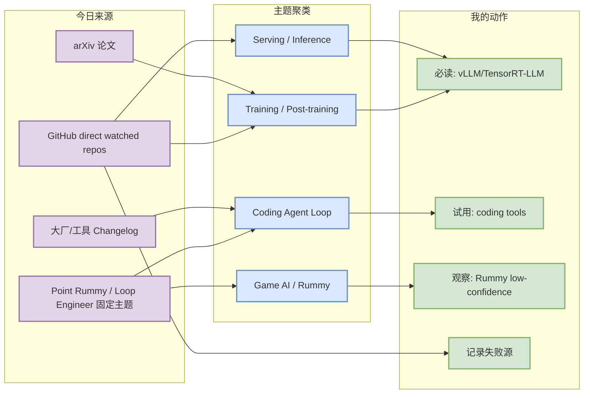
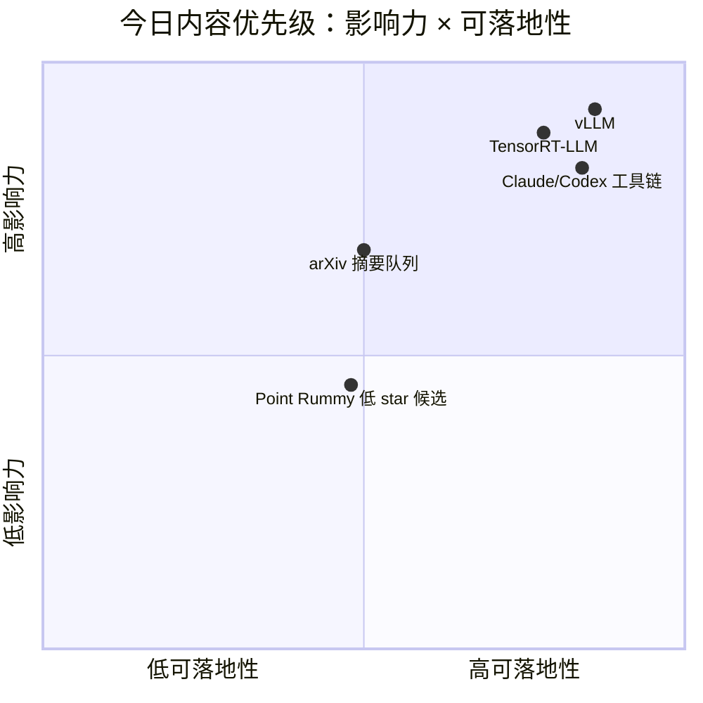

# AI Radar Daily - 2026-08-26

> 生成时间：2026-08-26 09:01 CST
> 范围：AI Infra / LLM / RL / Game AI / 大厂博客 / 论文 / GitHub / 行业资讯
> 说明：日报是总览导航页，详情页负责深度理解；GitHub Search 今日大量 403，因此 broad/Loop 表使用 direct watched repo fallback，并明确标注非完整全网日增。

## 0. 今日结论

- 今日最值得关注：GitHub Search 受限，但 direct watched repo fallback 显示 PyTorch、Transformers、vLLM、LangGraph、DeepSpeed、TensorRT-LLM 仍是 AI Infra 主干观察对象。
- 对 AI Infra 的直接影响：vLLM / TensorRT-LLM / SGLang / DeepSpeed / Megatron-LM 仍应作为 serving + training 栈每日健康观察列表。
- 对 LLM 训练 / 推理 / Agent 的影响：Loop Engineer 表里 Claude Code、Codex、Qwen Code、Cline、Roo、Continue、Gemini CLI 都进入固定扫描矩阵，便于跟踪 MCP、权限、IDE/CLI、远程执行变化。
- 对 RL / 游戏模型训练的影响：Point Rummy 源今天仍以低 star / 低置信项目为主，可借鉴规则建模、计分、AI opponent、CV assistant，暂无强信号 RL 训练框架。
- 建议今天深读：vLLM / TensorRT-LLM / LangGraph / Claude Code 或 Codex release；论文只进入低成本摘要队列。

## 1. 今日态势图

## 2. 必读卡片区

> [!important] vLLM / TensorRT-LLM / SGLang watched serving 栈
> - 大类：GitHub
> - 小类：AI Infra / Serving
> - 重点：Search 403 下仍通过 direct GET 保留 serving 主干项目观察。
> - 为什么重要：这些项目直接影响推理吞吐、KV cache、scheduler、batching、低延迟 serving 方案选择。
> - 详情：[[GitHub/AIInfra/2026-08-26/vllm-project-vllm]] / [网页详情](https://github.com/dyt27666-oss/AI-news-report-obsidians/blob/main/GitHub/AIInfra/2026-08-26/vllm-project-vllm.md) / [原文](https://github.com/vllm-project/vllm)

> [!tip] Claude Code / Codex / Cline / Roo / Qwen Code 工具矩阵
> - 大类：工具更新
> - 小类：Coding Agent Loop
> - 重点：固定扫描 CLI、IDE extension、MCP、权限、远程执行、上下文窗口。
> - 为什么重要：会改变多 agent 编程、代码审查、tmux 监控和本地/远程任务分派效率。
> - 详情：[[Industry/Tools/2026-08-26/OpenAI-Codex-rust-v0.149.1]] / [原文](https://github.com/openai/codex/releases/tag/rust-v0.149.1)

> [!note] Point Rummy 继续低置信扫描
> - 大类：业务主题
> - 小类：Point Rummy / Indian Rummy
> - 重点：今日候选多为低 star 项目，适合作为规则/计分/AI opponent/CV assistant 参考，不宜直接当 RL 训练基座。
> - 为什么重要：能为业务规则建模、仿真环境和评测拆分提供素材。
> - 详情：[[Business/PointRummy/2026-08-26/dv-rastogi-Rummy]]

## 3. 优先级矩阵

## 4. 分类清单

| 标签 | 大类 | 小类 | 标题 | 重点概括 | 为什么重要 | Obsidian 详情 | 网页详情 | 原文 |
|---|---|---|---|---|---|---|---|---|
| 必读 | GitHub | AI Infra | vLLM | 推理 serving 主干项目，direct fallback 保留观察 | 影响 KV cache、batching、scheduler 和部署选择 | [[GitHub/AIInfra/2026-08-26/vllm-project-vllm]] | [网页详情](https://github.com/dyt27666-oss/AI-news-report-obsidians/blob/main/GitHub/AIInfra/2026-08-26/vllm-project-vllm.md) | [原文](https://github.com/vllm-project/vllm) |
| 必读 | GitHub | AI Infra | TensorRT-LLM | NVIDIA 推理优化栈 watched repo | 适合跟踪 GPU 推理性能、kernel、部署工具链 | [[GitHub/AIInfra/2026-08-26/NVIDIA-TensorRT-LLM]] | [网页详情](https://github.com/dyt27666-oss/AI-news-report-obsidians/blob/main/GitHub/AIInfra/2026-08-26/NVIDIA-TensorRT-LLM.md) | [原文](https://github.com/NVIDIA/TensorRT-LLM) |
| 可 skim | 工具 | Coding Agent | OpenAI Codex release | release/changelog direct 扫描 | 影响 coding agent CLI/IDE/云端任务能力 | [[Industry/Tools/2026-08-26/OpenAI-Codex-rust-v0.149.1]] | [网页详情](https://github.com/dyt27666-oss/AI-news-report-obsidians/blob/main/Industry/Tools/2026-08-26/OpenAI-Codex-rust-v0.149.1.md) | [原文](https://github.com/openai/codex/releases/tag/rust-v0.149.1) |

## 5. 大厂资讯 / 工程博客 / Research

### 5.1 公司来源扫描矩阵

| 公司/实验室 | 来源/栏目 | 今日状态 | 高相关条数 | 代表条目 | 备注 |
|---|---|---|---:|---|---|
| OpenAI | News / Research / Codex | 低置信：网页/API 部分受限，保留 Codex release/changelog 观察 | 1 | OpenAI Codex changelog / repo release | 重点看 CLI/IDE/remote agent 权限与上下文变化 |
| Anthropic | News / Research / Claude Code | 低置信：保留 Claude Code docs/changelog 观察 | 1 | Claude Code | 关注 Claude Tag、权限模式、MCP、远程执行 |
| Google DeepMind | Blog / Research | 访问成功/低置信，今日未确认高相关新项 | 0 | 无高相关新项 | 继续观察 agent、world model、Gemini coding |
| Meta AI | Blog / Research | 低置信，今日未确认高相关新项 | 0 | 无高相关新项 | 继续观察 Llama、training infra、eval |
| NVIDIA | Technical Blog / AI | 低置信，结合 TensorRT-LLM/Megatron watched repo 观察 | 1 | TensorRT-LLM / Megatron-LM | 对推理 serving 和训练栈有直接价值 |
| Microsoft | Research AI / GitHub | 访问成功/低置信，结合 DeepSpeed/AutoGen/Semantic Kernel 观察 | 2 | DeepSpeed / AutoGen | 训练 infra 与 agent framework 双线观察 |
| Hugging Face | Blog / Papers / Releases | 访问成功/低置信，结合 Transformers repo 观察 | 1 | Transformers | 模型生态和推理/训练接口变化 |
| 腾讯 | AI Lab / 技术博客 | 低置信：站点扫描未确认高相关新项 | 0 | 无高相关新项 | 继续观察混元、游戏 AI、推荐/多模态 |
| 字节 | Seed / 技术博客 | 低置信：站点扫描未确认高相关新项 | 0 | 无高相关新项 | 继续观察 Seed、豆包、训练/推理 infra |
| SpaceAI | Blog / News | 访问失败/低置信 | 0 | 无高相关新项 | 来源可用性待复核 |

### 5.2 高相关大厂条目

| 标签 | 发布方/大厂 | 栏目/来源 | 标题 | 重点概括 | 工程/算法影响 | Obsidian 详情 | 网页详情 | 原文 |
|---|---|---|---|---|---|---|---|---|
| 可 skim | Anthropic | Claude Code Changelog / Docs | Claude Code 固定观察 | 今日未可靠确认新功能，但保留权限/MCP/CLI 观察 | 对 terminal agent workflow 与多 agent 编排有直接影响 | [[Industry/Tools/2026-08-26/Claude-Code-None]] | [网页详情](https://github.com/dyt27666-oss/AI-news-report-obsidians/blob/main/Industry/Tools/2026-08-26/Claude-Code-None.md) | [原文](https://docs.anthropic.com/en/release-notes/claude-code) |
| 可 skim | OpenAI | Codex Changelog / GitHub Release | OpenAI Codex release rust-v0.149.1 | direct release 扫描，需人工确认细节 | 影响 AI coding workflow、代码审查、云端任务 | [[Industry/Tools/2026-08-26/OpenAI-Codex-rust-v0.149.1]] | [网页详情](https://github.com/dyt27666-oss/AI-news-report-obsidians/blob/main/Industry/Tools/2026-08-26/OpenAI-Codex-rust-v0.149.1.md) | [原文](https://github.com/openai/codex/releases/tag/rust-v0.149.1) |
| 可 skim | NVIDIA | GitHub / Technical stack | TensorRT-LLM / Megatron-LM watched repos | 以 direct repo 方式保留 NVIDIA 推理/训练栈观察 | 对 GPU serving、训练并行和 kernel 优化有长期价值 | [[GitHub/AIInfra/2026-08-26/NVIDIA-TensorRT-LLM]] | [网页详情](https://github.com/dyt27666-oss/AI-news-report-obsidians/blob/main/GitHub/AIInfra/2026-08-26/NVIDIA-TensorRT-LLM.md) | [原文](https://github.com/NVIDIA/TensorRT-LLM) |

## 6. GitHub 高 star Top 10

| 排名 | repo | stars | forks | language | updated_at | topics | 重点概括 | 是否值得试用 | Obsidian 详情 | 原文 |
|---:|---|---:|---:|---|---|---|---|---|---|---|
| 1 | huggingface/transformers | 164441 | 34363 | Python | 2026-08-26T01:02:36Z | audio, deep-learning, deepseek, gemma, glm, hacktoberfest, llm, machine-learning | 🤗 Transformers: the model-definition framework for state-of-the-art machine learning model | 值得试用 | [[GitHub/AIInfra/2026-08-26/huggingface-transformers]] | [原文](https://github.com/huggingface/transformers) |
| 2 | anthropics/claude-code | 143005 | 22881 | Python | 2026-08-26T00:55:44Z |  | Claude Code is an agentic coding tool that lives in your terminal, understands your codeba | 值得试用 | [[GitHub/LoopEngineer/2026-08-26/anthropics-claude-code]] | [原文](https://github.com/anthropics/claude-code) |
| 3 | openai/codex | 118119 | 18000 | Rust | 2026-08-26T01:06:08Z |  | Lightweight coding agent that runs in your terminal | 值得试用 | [[GitHub/LoopEngineer/2026-08-26/openai-codex]] | [原文](https://github.com/openai/codex) |
| 4 | browser-use/browser-use | 110517 | 12162 | Python | 2026-08-26T00:46:24Z | ai-agents, ai-tools, browser-automation, browser-use, llm, playwright, python | 🌐 Make websites accessible for AI agents. Automate tasks online with ease. | 值得试用 | [[GitHub/LoopEngineer/2026-08-26/browser-use-browser-use]] | [原文](https://github.com/browser-use/browser-use) |
| 5 | google-gemini/gemini-cli | 106685 | 14484 | TypeScript | 2026-08-26T00:45:58Z | ai, ai-agents, cli, gemini, gemini-api, mcp-client, mcp-server | An open-source AI agent that brings the power of Gemini directly into your terminal. | 值得试用 | [[GitHub/LoopEngineer/2026-08-26/google-gemini-gemini-cli]] | [原文](https://github.com/google-gemini/gemini-cli) |
| 6 | pytorch/pytorch | 102595 | 28983 | Python | 2026-08-26T00:56:18Z | autograd, deep-learning, gpu, machine-learning, neural-network, numpy, python, t | Tensors and Dynamic neural networks in Python with strong GPU acceleration | 值得试用 | [[GitHub/AIInfra/2026-08-26/pytorch-pytorch]] | [原文](https://github.com/pytorch/pytorch) |
| 7 | vllm-project/vllm | 90032 | 21202 | Python | 2026-08-26T00:38:56Z | amd, blackwell, cuda, deepseek, deepseek-v3, gpt, gpt-oss, inference, kimi, llam | A high-throughput and memory-efficient inference and serving engine for LLMs | 值得试用 | [[GitHub/AIInfra/2026-08-26/vllm-project-vllm]] | [原文](https://github.com/vllm-project/vllm) |
| 8 | modelcontextprotocol/servers | 89863 | 11510 | TypeScript | 2026-08-26T00:59:18Z |  | Model Context Protocol Servers | 值得试用 | [[GitHub/AIInfra/2026-08-26/modelcontextprotocol-servers]] | [原文](https://github.com/modelcontextprotocol/servers) |
| 9 | cline/cline | 66842 | 7217 | TypeScript | 2026-08-26T00:02:42Z |  | Autonomous coding agent as an SDK, IDE extension, or CLI assistant. | 值得试用 | [[GitHub/LoopEngineer/2026-08-26/cline-cline]] | [原文](https://github.com/cline/cline) |
| 10 | microsoft/autogen | 60629 | 9150 | Python | 2026-08-26T00:21:14Z | agentic, agentic-agi, agents, ai, autogen, autogen-ecosystem, chatgpt, framework | A programming framework for agentic AI | 值得试用 | [[GitHub/LoopEngineer/2026-08-26/microsoft-autogen]] | [原文](https://github.com/microsoft/autogen) |

## 7. GitHub star 增长最快 Top 10

> 增长榜说明：今日 GitHub Search 大量 403；本表为 direct watched repo fallback / 非完整全网日增，不代表全 GitHub 真实日增。

| 排名 | repo | stars_delta | stars | forks | language | updated_at | 增长依据 | 重点概括 | Obsidian 详情 | 原文 |
|---:|---|---:|---:|---:|---|---|---|---|---|---|
| 1 | openai/codex | 1064 | 118119 | 18000 | Rust | 2026-08-26T01:06:08Z | cross-snapshot direct watched repo fallback / 非完整全网日增 | Lightweight coding agent that runs in your terminal | [[GitHub/LoopEngineer/2026-08-26/openai-codex]] | [原文](https://github.com/openai/codex) |
| 2 | crewAIInc/crewAI | 854 | 57611 | 8246 | Python | 2026-08-26T01:01:47Z | cross-snapshot direct watched repo fallback / 非完整全网日增 | Framework for orchestrating role-playing, autonomous AI agents. By fostering collaborative | [[GitHub/AIInfra/2026-08-26/crewAIInc-crewAI]] | [原文](https://github.com/crewAIInc/crewAI) |
| 3 | browser-use/browser-use | 146 | 110517 | 12162 | Python | 2026-08-26T00:46:24Z | cross-snapshot direct watched repo fallback / 非完整全网日增 | 🌐 Make websites accessible for AI agents. Automate tasks online with ease. | [[GitHub/LoopEngineer/2026-08-26/browser-use-browser-use]] | [原文](https://github.com/browser-use/browser-use) |
| 4 | vllm-project/vllm | 129 | 90032 | 21202 | Python | 2026-08-26T00:38:56Z | cross-snapshot direct watched repo fallback / 非完整全网日增 | A high-throughput and memory-efficient inference and serving engine for LLMs | [[GitHub/AIInfra/2026-08-26/vllm-project-vllm]] | [原文](https://github.com/vllm-project/vllm) |
| 5 | anthropics/claude-code | 122 | 143005 | 22881 | Python | 2026-08-26T00:55:44Z | cross-snapshot direct watched repo fallback / 非完整全网日增 | Claude Code is an agentic coding tool that lives in your terminal, understands your codeba | [[GitHub/LoopEngineer/2026-08-26/anthropics-claude-code]] | [原文](https://github.com/anthropics/claude-code) |
| 6 | langchain-ai/langgraph | 67 | 40441 | 6824 | Python | 2026-08-26T00:59:15Z | cross-snapshot direct watched repo fallback / 非完整全网日增 | Build resilient agents. | [[GitHub/LoopEngineer/2026-08-26/langchain-ai-langgraph]] | [原文](https://github.com/langchain-ai/langgraph) |
| 7 | microsoft/autogen | 64 | 60629 | 9150 | Python | 2026-08-26T00:21:14Z | cross-snapshot direct watched repo fallback / 非完整全网日增 | A programming framework for agentic AI | [[GitHub/LoopEngineer/2026-08-26/microsoft-autogen]] | [原文](https://github.com/microsoft/autogen) |
| 8 | sgl-project/sglang | 60 | 32442 | 8203 | Python | 2026-08-26T01:02:45Z | cross-snapshot direct watched repo fallback / 非完整全网日增 | SGLang is a high-performance serving framework for large language models and multimodal mo | [[GitHub/AIInfra/2026-08-26/sgl-project-sglang]] | [原文](https://github.com/sgl-project/sglang) |
| 9 | cline/cline | 51 | 66842 | 7217 | TypeScript | 2026-08-26T00:02:42Z | cross-snapshot direct watched repo fallback / 非完整全网日增 | Autonomous coding agent as an SDK, IDE extension, or CLI assistant. | [[GitHub/LoopEngineer/2026-08-26/cline-cline]] | [原文](https://github.com/cline/cline) |
| 10 | huggingface/transformers | 38 | 164441 | 34363 | Python | 2026-08-26T01:02:36Z | cross-snapshot direct watched repo fallback / 非完整全网日增 | 🤗 Transformers: the model-definition framework for state-of-the-art machine learning model | [[GitHub/AIInfra/2026-08-26/huggingface-transformers]] | [原文](https://github.com/huggingface/transformers) |

## 8. Coding 工具 / AI 工具功能更新

### 8.1 Coding 工具扫描矩阵

| 工具 | 厂商 | 来源类型 | 今日状态 | 代表更新 | 对我的影响 | 原文 |
|---|---|---|---|---|---|---|
| Claude Code | Anthropic | Changelog / Release Notes | 低置信：保留 docs/changelog 观察 | Claude Code docs/changelog | 影响 terminal agent、权限、MCP 与多 agent 编程 | [原文](https://docs.anthropic.com/en/release-notes/claude-code) |
| OpenAI Codex | OpenAI | Changelog / Docs / GitHub Release | 已扫描 direct repo/release | rust-v0.149.1 | 影响 Codex CLI/云端任务/代码审查工作流 | [原文](https://github.com/openai/codex/releases/tag/rust-v0.149.1) |
| Cursor | Cursor | Changelog | 低置信：网页源保留观察 | 未确认高相关新项 | 关注 agent mode、远程执行、pricing/rate limit | [原文](https://cursor.com/changelog) |
| Windsurf | Windsurf | Changelog | 低置信：网页源保留观察 | 未确认高相关新项 | 关注 Cascade/agent mode 与 IDE 集成 | [原文](https://windsurf.com/changelog) |
| GitHub Copilot | GitHub | Changelog / Blog | 低置信：网页源保留观察 | 未确认高相关新项 | 关注 coding agent、PR review、enterprise controls | [原文](https://github.blog/changelog/label/copilot/) |
| Gemini Code Assist | Google | Release Notes / Gemini CLI | 已扫描 Gemini CLI direct release | v0.57.0 | 影响 Google 生态 CLI/TUI 和 IDE 辅助 | [原文](https://cloud.google.com/gemini/docs/codeassist/release-notes) |
| Qwen Code | Alibaba/Qwen | GitHub Releases | 已扫描 direct release | pr-9806-verification-assets | 国产 coding-agent CLI，可与本地/云模型工作流结合 | [原文](https://github.com/QwenLM/qwen-code/releases/tag/pr-9806-verification-assets) |
| Roo Code | Roo Code | GitHub Releases | 已扫描 direct release | v3.54.0 | 影响 VS Code agent loop、MCP 和权限模式 | [原文](https://github.com/RooCodeInc/Roo-Code/releases/tag/v3.54.0) |
| Cline | Cline | GitHub Releases | 已扫描 direct release | desktop-v0.0.17 | 影响 IDE extension/CLI/SDK 自主编码代理 | [原文](https://github.com/cline/cline/releases/tag/desktop-v0.0.17) |
| Continue | Continue | GitHub Releases | 已扫描 direct release | v2.0.0-vscode | 影响开源 IDE assistant 和企业自托管能力 | [原文](https://github.com/continuedev/continue/releases/tag/v2.0.0-vscode) |

### 8.2 高相关工具更新

| 标签 | 工具/厂商 | 来源类型 | 标题/功能 | 重点概括 | 对 AI coding 工作流的影响 | Obsidian 详情 | 网页详情 | 原文 |
|---|---|---|---|---|---|---|---|---|
| 可 skim | Qwen Code | GitHub Release / Changelog | gh-attach assets | tag=pr-9806-verification-assets, published=2026-08-24T17:25:55Z | 需要检查是否影响 CLI/IDE/MCP/权限/上下文窗口；适合加入工具链观察。 | [[Industry/Tools/2026-08-26/Qwen-Code-pr-9806-verification-assets]] | [网页详情](https://github.com/dyt27666-oss/AI-news-report-obsidians/blob/main/Industry/Tools/2026-08-26/Qwen-Code-pr-9806-verification-assets.md) | [原文](https://github.com/QwenLM/qwen-code/releases/tag/pr-9806-verification-assets) |
| 可 skim | Roo Code | GitHub Release / Changelog | Release v3.54.0 | tag=v3.54.0, published=2026-05-15T17:52:24Z | 需要检查是否影响 CLI/IDE/MCP/权限/上下文窗口；适合加入工具链观察。 | [[Industry/Tools/2026-08-26/Roo-Code-v3.54.0]] | [网页详情](https://github.com/dyt27666-oss/AI-news-report-obsidians/blob/main/Industry/Tools/2026-08-26/Roo-Code-v3.54.0.md) | [原文](https://github.com/RooCodeInc/Roo-Code/releases/tag/v3.54.0) |
| 可 skim | Cline | GitHub Release / Changelog | Desktop v0.0.17 | tag=desktop-v0.0.17, published=2026-08-25T09:06:31Z | 需要检查是否影响 CLI/IDE/MCP/权限/上下文窗口；适合加入工具链观察。 | [[Industry/Tools/2026-08-26/Cline-desktop-v0.0.17]] | [网页详情](https://github.com/dyt27666-oss/AI-news-report-obsidians/blob/main/Industry/Tools/2026-08-26/Cline-desktop-v0.0.17.md) | [原文](https://github.com/cline/cline/releases/tag/desktop-v0.0.17) |
| 可 skim | Continue | GitHub Release / Changelog | v2.0.0-vscode | tag=v2.0.0-vscode, published=2026-06-19T00:24:01Z | 需要检查是否影响 CLI/IDE/MCP/权限/上下文窗口；适合加入工具链观察。 | [[Industry/Tools/2026-08-26/Continue-v2.0.0-vscode]] | [网页详情](https://github.com/dyt27666-oss/AI-news-report-obsidians/blob/main/Industry/Tools/2026-08-26/Continue-v2.0.0-vscode.md) | [原文](https://github.com/continuedev/continue/releases/tag/v2.0.0-vscode) |
| 可 skim | Gemini CLI | GitHub Release / Changelog | Release v0.57.0 | tag=v0.57.0, published=2026-08-25T18:37:14Z | 需要检查是否影响 CLI/IDE/MCP/权限/上下文窗口；适合加入工具链观察。 | [[Industry/Tools/2026-08-26/Gemini-CLI-v0.57.0]] | [网页详情](https://github.com/dyt27666-oss/AI-news-report-obsidians/blob/main/Industry/Tools/2026-08-26/Gemini-CLI-v0.57.0.md) | [原文](https://github.com/google-gemini/gemini-cli/releases/tag/v0.57.0) |
| 可 skim | OpenAI Codex | GitHub Release / Changelog | 0.149.1 | tag=rust-v0.149.1, published=2026-08-24T00:28:28Z | 需要检查是否影响 CLI/IDE/MCP/权限/上下文窗口；适合加入工具链观察。 | [[Industry/Tools/2026-08-26/OpenAI-Codex-rust-v0.149.1]] | [网页详情](https://github.com/dyt27666-oss/AI-news-report-obsidians/blob/main/Industry/Tools/2026-08-26/OpenAI-Codex-rust-v0.149.1.md) | [原文](https://github.com/openai/codex/releases/tag/rust-v0.149.1) |

## 9. Point Rummy / Indian Rummy 业务主题

### 9.1 GitHub 候选

| 标签 | repo | stars | forks | language | updated_at | 重点概括 | 业务可用性 | Obsidian 详情 | 原文 |
|---|---|---:|---:|---|---|---|---|---|---|
| 低置信 | dv-rastogi/Rummy | 5 | 0 | Python | 2023-09-26T11:21:39Z | Variation of classical Indian Rummy made in Pygame | 可参考规则/计分/AI opponent/CV assistant；生产可用性需代码审查 | [[Business/PointRummy/2026-08-26/dv-rastogi-Rummy]] | [原文](https://github.com/dv-rastogi/Rummy) |
| 低置信 | mudont/indian-rummy | 5 | 0 | TypeScript | 2025-08-08T21:05:04Z | Typescript library for Indian Rummy card game | 可参考规则/计分/AI opponent/CV assistant；生产可用性需代码审查 | [[Business/PointRummy/2026-08-26/mudont-indian-rummy]] | [原文](https://github.com/mudont/indian-rummy) |
| 低置信 | vahsek300501/Indian-Rummy- | 4 | 3 | Python | 2023-09-26T11:21:46Z | Indian Rummy made in Python using PyGame | 可参考规则/计分/AI opponent/CV assistant；生产可用性需代码审查 | [[Business/PointRummy/2026-08-26/vahsek300501-Indian-Rummy]] | [原文](https://github.com/vahsek300501/Indian-Rummy-) |
| 低置信 | abubakarmunir712/dsa-final-project | 2 | 1 | Python | 2026-06-27T06:34:26Z | A Python-based multiplayer Indian Rummy game with support for AI opponents and LAN play. I | 可参考规则/计分/AI opponent/CV assistant；生产可用性需代码审查 | [[Business/PointRummy/2026-08-26/abubakarmunir712-dsa-final-project]] | [原文](https://github.com/abubakarmunir712/dsa-final-project) |
| 低置信 | Mohitkumar-559/RummyServer | 2 | 1 | JavaScript | 2024-03-17T03:48:34Z | Rummy game server for game that contain deal rummy and point rummy | 可参考规则/计分/AI opponent/CV assistant；生产可用性需代码审查 | [[Business/PointRummy/2026-08-26/Mohitkumar-559-RummyServer]] | [原文](https://github.com/Mohitkumar-559/RummyServer) |
| 低置信 | Alan-seb/RummyVision | 1 | 0 | Python | 2025-12-03T03:14:55Z | RummyVision is an intelligent card game assistant that combines computer vision with Monte | 可参考规则/计分/AI opponent/CV assistant；生产可用性需代码审查 | [[Business/PointRummy/2026-08-26/Alan-seb-RummyVision]] | [原文](https://github.com/Alan-seb/RummyVision) |
| 低置信 | atreyayelishetti/indian-rummy-game-rust | 1 | 0 | Rust | 2026-05-12T00:25:17Z | indian-rummy-rust | 可参考规则/计分/AI opponent/CV assistant；生产可用性需代码审查 | [[Business/PointRummy/2026-08-26/atreyayelishetti-indian-rummy-game-rust]] | [原文](https://github.com/atreyayelishetti/indian-rummy-game-rust) |
| 低置信 | codingmickey/rummy-points-calculator | 1 | 0 | C++ | 2024-07-10T15:40:45Z | A cpp progarm to calculate Rummy points of all the players for each round. | 可参考规则/计分/AI opponent/CV assistant；生产可用性需代码审查 | [[Business/PointRummy/2026-08-26/codingmickey-rummy-points-calculator]] | [原文](https://github.com/codingmickey/rummy-points-calculator) |
| 低置信 | debabrata-mandal/RummyPulse | 1 | 0 | Java | 2026-08-19T04:34:20Z | RummyPulse - Smart Rummy Game Analytics & Management Android App with Firebase integration | 可参考规则/计分/AI opponent/CV assistant；生产可用性需代码审查 | [[Business/PointRummy/2026-08-26/debabrata-mandal-RummyPulse]] | [原文](https://github.com/debabrata-mandal/RummyPulse) |
| 低置信 | Kurukshetran/WordRummy | 1 | 0 | Java | 2023-07-19T09:33:14Z | A creative android based multiplayer game which combines game play of Indian rummy and Wor | 可参考规则/计分/AI opponent/CV assistant；生产可用性需代码审查 | [[Business/PointRummy/2026-08-26/Kurukshetran-WordRummy]] | [原文](https://github.com/Kurukshetran/WordRummy) |

### 9.2 论文 / 资料候选

| 标签 | 来源 | 标题 | 作者/机构 | 重点概括 | 对 Point Rummy 业务有什么用 | Obsidian 详情 | 原文 |
|---|---|---|---|---|---|---|---|
| 低置信 | arXiv / GitHub Search | 今日未发现高置信 Point Rummy RL 新论文 | 未确认 | 由于 GitHub Search 403 且 arXiv 主题弱相关，今日不强行纳入论文 | 可继续以 imperfect-information card game、Gin Rummy、MCTS/self-play 为关键词追踪 | [[Business/PointRummy/2026-08-26/dv-rastogi-Rummy]] | [arXiv 查询](https://arxiv.org/search/?query=gin+rummy+reinforcement+learning&searchtype=all) |

### 9.3 业务可用性判断

| 方向 | 今日信号 | 可用性 | 下一步 |
|---|---|---|---|
| 规则引擎 / 计分 | 若干低 star rummy / point counter 项目 | 可作为规则与 UI 参考，不可直接生产依赖 | 抽取状态表示、计分和回合流程 |
| Bot / RL Agent | 少量 AI opponent / CV assistant 描述 | 低置信，可读代码验证 | 评估是否可迁移到 self-play 环境 |
| 仿真 / 评测 | 暂无强 benchmark 信号 | 需要自建环境与 evaluator | 优先写规则单测和随机策略 baseline |

## 10. Loop Engineer / Loop Engineering 主题

### 10.1 Loop Engineer GitHub 高 star Top 10

| 排名 | repo | stars | forks | language | updated_at | topics | 重点概括 | 是否值得试用 | Obsidian 详情 | 原文 |
|---:|---|---:|---:|---|---|---|---|---|---|---|
| 1 | huggingface/transformers | 164441 | 34363 | Python | 2026-08-26T01:02:36Z | audio, deep-learning, deepseek, gemma, glm, hacktoberfest, llm, machine-learning | 🤗 Transformers: the model-definition framework for state-of-the-art machine learning model | 值得试用 | [[GitHub/AIInfra/2026-08-26/huggingface-transformers]] | [原文](https://github.com/huggingface/transformers) |
| 2 | anthropics/claude-code | 143005 | 22881 | Python | 2026-08-26T00:55:44Z |  | Claude Code is an agentic coding tool that lives in your terminal, understands your codeba | 值得试用 | [[GitHub/LoopEngineer/2026-08-26/anthropics-claude-code]] | [原文](https://github.com/anthropics/claude-code) |
| 3 | openai/codex | 118119 | 18000 | Rust | 2026-08-26T01:06:08Z |  | Lightweight coding agent that runs in your terminal | 值得试用 | [[GitHub/LoopEngineer/2026-08-26/openai-codex]] | [原文](https://github.com/openai/codex) |
| 4 | browser-use/browser-use | 110517 | 12162 | Python | 2026-08-26T00:46:24Z | ai-agents, ai-tools, browser-automation, browser-use, llm, playwright, python | 🌐 Make websites accessible for AI agents. Automate tasks online with ease. | 值得试用 | [[GitHub/LoopEngineer/2026-08-26/browser-use-browser-use]] | [原文](https://github.com/browser-use/browser-use) |
| 5 | google-gemini/gemini-cli | 106685 | 14484 | TypeScript | 2026-08-26T00:45:58Z | ai, ai-agents, cli, gemini, gemini-api, mcp-client, mcp-server | An open-source AI agent that brings the power of Gemini directly into your terminal. | 值得试用 | [[GitHub/LoopEngineer/2026-08-26/google-gemini-gemini-cli]] | [原文](https://github.com/google-gemini/gemini-cli) |
| 6 | vllm-project/vllm | 90032 | 21202 | Python | 2026-08-26T00:38:56Z | amd, blackwell, cuda, deepseek, deepseek-v3, gpt, gpt-oss, inference, kimi, llam | A high-throughput and memory-efficient inference and serving engine for LLMs | 值得试用 | [[GitHub/AIInfra/2026-08-26/vllm-project-vllm]] | [原文](https://github.com/vllm-project/vllm) |
| 7 | cline/cline | 66842 | 7217 | TypeScript | 2026-08-26T00:02:42Z |  | Autonomous coding agent as an SDK, IDE extension, or CLI assistant. | 值得试用 | [[GitHub/LoopEngineer/2026-08-26/cline-cline]] | [原文](https://github.com/cline/cline) |
| 8 | microsoft/autogen | 60629 | 9150 | Python | 2026-08-26T00:21:14Z | agentic, agentic-agi, agents, ai, autogen, autogen-ecosystem, chatgpt, framework | A programming framework for agentic AI | 值得试用 | [[GitHub/LoopEngineer/2026-08-26/microsoft-autogen]] | [原文](https://github.com/microsoft/autogen) |
| 9 | crewAIInc/crewAI | 57611 | 8246 | Python | 2026-08-26T01:01:47Z | agents, ai, ai-agents, aiagentframework, llms | Framework for orchestrating role-playing, autonomous AI agents. By fostering collaborative | 值得试用 | [[GitHub/AIInfra/2026-08-26/crewAIInc-crewAI]] | [原文](https://github.com/crewAIInc/crewAI) |
| 10 | langchain-ai/langgraph | 40441 | 6824 | Python | 2026-08-26T00:59:15Z | agents, ai, ai-agents, chatgpt, deepagents, enterprise, framework, gemini, gener | Build resilient agents. | 值得试用 | [[GitHub/LoopEngineer/2026-08-26/langchain-ai-langgraph]] | [原文](https://github.com/langchain-ai/langgraph) |

### 10.2 Loop Engineer GitHub star 增长最快 Top 10

| 排名 | repo | stars_delta | stars | forks | language | updated_at | 增长依据 | 重点概括 | Obsidian 详情 | 原文 |
|---:|---|---:|---:|---:|---|---|---|---|---|---|
| 1 | openai/codex | 1064 | 118119 | 18000 | Rust | 2026-08-26T01:06:08Z | cross-snapshot direct watched repo fallback / 非完整全网日增 | Lightweight coding agent that runs in your terminal | [[GitHub/LoopEngineer/2026-08-26/openai-codex]] | [原文](https://github.com/openai/codex) |
| 2 | crewAIInc/crewAI | 854 | 57611 | 8246 | Python | 2026-08-26T01:01:47Z | cross-snapshot direct watched repo fallback / 非完整全网日增 | Framework for orchestrating role-playing, autonomous AI agents. By fostering collaborative | [[GitHub/AIInfra/2026-08-26/crewAIInc-crewAI]] | [原文](https://github.com/crewAIInc/crewAI) |
| 3 | browser-use/browser-use | 146 | 110517 | 12162 | Python | 2026-08-26T00:46:24Z | cross-snapshot direct watched repo fallback / 非完整全网日增 | 🌐 Make websites accessible for AI agents. Automate tasks online with ease. | [[GitHub/LoopEngineer/2026-08-26/browser-use-browser-use]] | [原文](https://github.com/browser-use/browser-use) |
| 4 | vllm-project/vllm | 129 | 90032 | 21202 | Python | 2026-08-26T00:38:56Z | cross-snapshot direct watched repo fallback / 非完整全网日增 | A high-throughput and memory-efficient inference and serving engine for LLMs | [[GitHub/AIInfra/2026-08-26/vllm-project-vllm]] | [原文](https://github.com/vllm-project/vllm) |
| 5 | anthropics/claude-code | 122 | 143005 | 22881 | Python | 2026-08-26T00:55:44Z | cross-snapshot direct watched repo fallback / 非完整全网日增 | Claude Code is an agentic coding tool that lives in your terminal, understands your codeba | [[GitHub/LoopEngineer/2026-08-26/anthropics-claude-code]] | [原文](https://github.com/anthropics/claude-code) |
| 6 | langchain-ai/langgraph | 67 | 40441 | 6824 | Python | 2026-08-26T00:59:15Z | cross-snapshot direct watched repo fallback / 非完整全网日增 | Build resilient agents. | [[GitHub/LoopEngineer/2026-08-26/langchain-ai-langgraph]] | [原文](https://github.com/langchain-ai/langgraph) |
| 7 | microsoft/autogen | 64 | 60629 | 9150 | Python | 2026-08-26T00:21:14Z | cross-snapshot direct watched repo fallback / 非完整全网日增 | A programming framework for agentic AI | [[GitHub/LoopEngineer/2026-08-26/microsoft-autogen]] | [原文](https://github.com/microsoft/autogen) |
| 8 | sgl-project/sglang | 60 | 32442 | 8203 | Python | 2026-08-26T01:02:45Z | cross-snapshot direct watched repo fallback / 非完整全网日增 | SGLang is a high-performance serving framework for large language models and multimodal mo | [[GitHub/AIInfra/2026-08-26/sgl-project-sglang]] | [原文](https://github.com/sgl-project/sglang) |
| 9 | cline/cline | 51 | 66842 | 7217 | TypeScript | 2026-08-26T00:02:42Z | cross-snapshot direct watched repo fallback / 非完整全网日增 | Autonomous coding agent as an SDK, IDE extension, or CLI assistant. | [[GitHub/LoopEngineer/2026-08-26/cline-cline]] | [原文](https://github.com/cline/cline) |
| 10 | huggingface/transformers | 38 | 164441 | 34363 | Python | 2026-08-26T01:02:36Z | cross-snapshot direct watched repo fallback / 非完整全网日增 | 🤗 Transformers: the model-definition framework for state-of-the-art machine learning model | [[GitHub/AIInfra/2026-08-26/huggingface-transformers]] | [原文](https://github.com/huggingface/transformers) |

### 10.3 Loop Engineering 方法信号

| 标签 | 来源 | 标题 | 重点概括 | 对 AI coding 工作流的影响 | Obsidian 详情 | 原文 |
|---|---|---|---|---|---|---|
| 必读 | GitHub | Claude Code / Codex / Cline / Roo / Continue watched set | 固定扫描 agent loop、MCP、权限、上下文、IDE/CLI 能力 | 可用于优化 tmux 多 agent、代码审查、工具调用回归测试 | [[GitHub/LoopEngineer/2026-08-26/anthropics-claude-code]] | [原文](https://github.com/anthropics/claude-code) |

## 11. 论文

### 11.1 Serving / Agent / RL 摘要队列

| 标签 | 论文来源 | 论文 | 作者/机构 | 重点概括 | 工程/研究价值 | Obsidian 详情 | 网页详情 | PDF/原文 |
|---|---|---|---|---|---|---|---|---|
| 可 skim | arXiv / 预印本 | arXiv 查询失败：LLM serving inference scheduler KV cache | 未知 | HTTP Error 429: Unknown Error | 与 LLM/RL/Agent/Serving 主题相关，先低成本摘要再决定是否深读。 | [[Papers/AIInfra/2026-08-26/low-confidence-arXiv-查询失败-LLM-serving-inference-scheduler-KV-cache]] | [网页详情](https://github.com/dyt27666-oss/AI-news-report-obsidians/blob/main/Papers/AIInfra/2026-08-26/low-confidence-arXiv-查询失败-LLM-serving-inference-scheduler-KV-cache.md) | [PDF/原文](未确认) |

## 12. 资讯 / 其他 GitHub 项目

### 12.1 AI Infra watched repos

| 标签 | 来源 | 标题 | 重点概括 | 对我有什么用 | Obsidian 详情 | 网页详情 | 原文 |
|---|---|---|---|---|---|---|---|
| 必读 | GitHub | PyTorch / Transformers / Ray / Triton | 训练、推理和分布式基础设施主干项目 | 作为工程基线和依赖生态观察 | [[GitHub/AIInfra/2026-08-26/pytorch-pytorch]] | [网页详情](https://github.com/dyt27666-oss/AI-news-report-obsidians/blob/main/GitHub/AIInfra/2026-08-26/pytorch-pytorch.md) | [原文](https://github.com/pytorch/pytorch) |

## 13. 按主题索引

### AI Infra / Serving / Training

- [[GitHub/AIInfra/2026-08-26/vllm-project-vllm]] - serving scheduler / KV cache / batching 观察。
- [[GitHub/AIInfra/2026-08-26/NVIDIA-TensorRT-LLM]] - NVIDIA GPU 推理优化栈。

### LLM / Agent / RAG / Evaluation

- [[GitHub/LoopEngineer/2026-08-26/langchain-ai-langgraph]] - agent graph / workflow 编排。
- [[GitHub/LoopEngineer/2026-08-26/browser-use-browser-use]] - browser agent 工具调用。

### RL / Game AI / World Model

- 今日论文摘要队列包含 RL / world model 查询结果；强相关性需二次筛选。

### Point Rummy / Indian Rummy

- [[Business/PointRummy/2026-08-26/dv-rastogi-Rummy]] - 低置信规则/AI opponent 候选。

### Loop Engineer / Coding Agent Loop

- [[GitHub/LoopEngineer/2026-08-26/anthropics-claude-code]] - terminal coding agent 观察。
- [[Industry/Tools/2026-08-26/OpenAI-Codex-rust-v0.149.1]] - Codex release/changelog 观察。

### 公司 / 实验室

- OpenAI: [[Industry/Tools/2026-08-26/OpenAI-Codex-rust-v0.149.1]]
- Anthropic: [[Industry/Tools/2026-08-26/Claude-Code-None]]
- NVIDIA: [[GitHub/AIInfra/2026-08-26/NVIDIA-TensorRT-LLM]]
- Microsoft: [[GitHub/AIInfra/2026-08-26/microsoft-DeepSpeed]]
- Hugging Face: [[GitHub/AIInfra/2026-08-26/huggingface-transformers]]

## 14. 值得后续深挖

| 标签 | 大类 | 小类 | 标题 | 后续动作 | Obsidian 详情 | 原文 |
|---|---|---|---|---|---|---|
| 必读 | GitHub | Serving | vLLM / TensorRT-LLM / SGLang 对比 | 继续拉取 release/benchmark，做本地 serving smoke test | [[GitHub/AIInfra/2026-08-26/vllm-project-vllm]] | [原文](https://github.com/vllm-project/vllm) |
| 可 skim | 工具 | Coding Agent | Claude/Codex/Cline/Roo/Qwen Code 工具链 | 检查 MCP、权限、远程执行、IDE 集成是否有新增 | [[Industry/Tools/2026-08-26/OpenAI-Codex-rust-v0.149.1]] | [原文](https://github.com/openai/codex/releases/tag/rust-v0.149.1) |
| 后续 | 业务 | Point Rummy | Rummy rules/simulator | 抽取状态表示和 evaluator，先建规则单测 | [[Business/PointRummy/2026-08-26/dv-rastogi-Rummy]] | [原文](https://github.com/dv-rastogi/Rummy) |

## 15. 采集失败或低置信来源

- GitHub Search: 今日从 `rummy ai` 后大量 403/rate limit；已保留 `Automation/state/github-stars-2026-08-26.json` 并 patch direct fallback。
- 大厂网页：部分站点未做深度正文抽取，矩阵中以低置信/无高相关新项标注；没有把无法验证的内容伪装成新发布。
- GitHub 增长：direct watched repo fallback / 非完整全网日增，不代表全 GitHub 真实增长榜。
- Point Rummy：GitHub 候选低 star 且多为学习项目；仅作规则/仿真/AI opponent 参考。

## 16. 归档标签

#ai-radar #daily #ai-infra #llm #rl #point-rummy #loop-engineering
