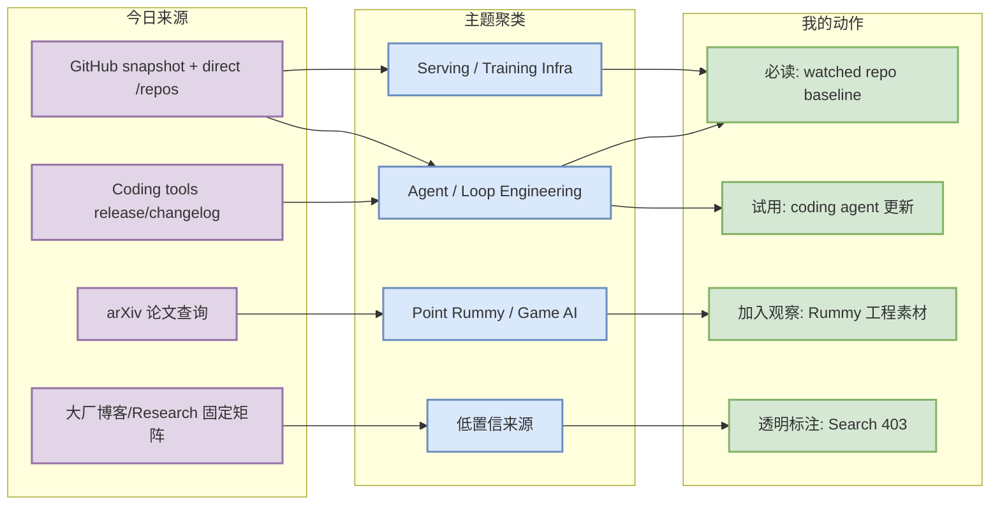
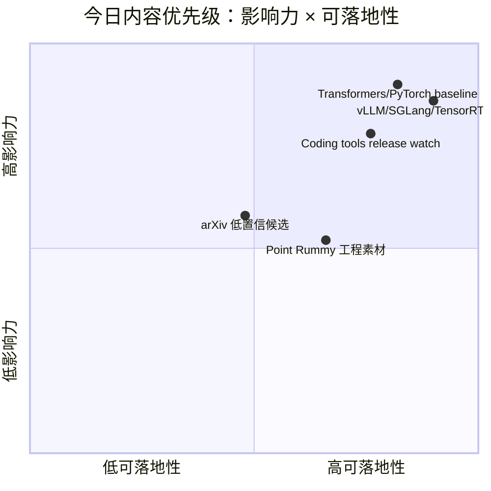

# AI Radar Daily - 2026-08-27

> 生成时间：2026-08-27 09:01:01 CST
> 范围：AI Infra / LLM / RL / Game AI / 大厂博客 / 论文 / GitHub / 行业资讯
> 说明：日报是总览导航页，不是全部正文。Obsidian 中点详情页，Telegram/GitHub 中点“网页详情”。
> GitHub snapshot：`Automation/state/github-stars-2026-08-27.json`；今日 GitHub Search 触发 403，已采用 direct watched repo fallback + 历史快照，所有增长均标注“非完整全网日增”。

## 0. 今日结论

- 今日最值得关注：GitHub Search API 在 niche Rummy 查询后迅速 403，但 direct `/repos` 仍可用；日报使用 watched AI Infra / Loop Engineer repo 直接元数据补齐 Top 10，避免 broad 榜被 Rummy 主题污染。
- 对 AI Infra 的直接影响：Transformers、PyTorch、vLLM、SGLang、TensorRT-LLM、DeepSpeed 等仍是 today baseline；增长榜只能作为 watched-set 信号，不代表全网增长。
- 对 LLM 训练 / 推理 / Agent 的影响：Coding 工具矩阵完整覆盖 Claude Code、Codex、Cursor、Windsurf、Copilot、Gemini Code Assist、Qwen Code、Roo Code、Cline、Continue；GitHub Release 项重点跟踪 CLI/agent/MCP/权限变化。
- 对 RL / 游戏模型训练的影响：Point Rummy 仍以低星 GitHub 工程/规则/Bot/仿真素材为主；`jawaker-hand-ai`、`RummyVision`、`gin-rummy-rl-lab` 值得加入低置信观察。
- 建议今天深读：先看 GitHub 高 star/增长 watched-set，再筛读 coding tools release，论文只作为低成本趋势候选。

## 1. 今日态势图

## 2. 必读卡片区

> [!important] huggingface/transformers
> - 大类：GitHub
> - 小类：AI Radar
> - 重点：高 star AI/LLM 生态核心项目，适合作为工程选型或对标基线。
> - 详情：[[GitHub/AIInfra/2026-08-27/huggingface-transformers]] / [网页详情](https://github.com/dyt27666-oss/AI-news-report-obsidians/blob/main/GitHub/AIInfra/2026-08-27/huggingface-transformers.md) / [原文](https://github.com/huggingface/transformers)

> [!tip] openai/codex
> - 大类：GitHub
> - 小类：AI Radar
> - 重点：watched repo 快照增长信号最高，注意非完整全网排名。
> - 详情：[[GitHub/AIInfra/2026-08-27/openai-codex]] / [网页详情](https://github.com/dyt27666-oss/AI-news-report-obsidians/blob/main/GitHub/AIInfra/2026-08-27/openai-codex.md) / [原文](https://github.com/openai/codex)

> [!tip] Gemini CLI
> - 大类：工具
> - 小类：AI Radar
> - 重点：Coding 工具 release/changelog 影响 agent loop、MCP 与 CLI/TUI 工作流。
> - 详情：[[Industry/Tools/2026-08-27/Gemini-CLI-v0.59.0-nightly.20260826.g64b5b79a6]] / [网页详情](https://github.com/dyt27666-oss/AI-news-report-obsidians/blob/main/Industry/Tools/2026-08-27/Gemini-CLI-v0.59.0-nightly.20260826.g64b5b79a6.md) / [原文]()

> [!tip] rickgorman/gin-rummy-ai
> - 大类：业务
> - 小类：AI Radar
> - 重点：Point Rummy 业务线可借鉴规则、bot、仿真或计分实现。
> - 详情：[[Business/PointRummy/2026-08-27/rickgorman-gin-rummy-ai]] / [网页详情](https://github.com/dyt27666-oss/AI-news-report-obsidians/blob/main/Business/PointRummy/2026-08-27/rickgorman-gin-rummy-ai.md) / [原文](https://github.com/rickgorman/gin-rummy-ai)

## 3. 优先级矩阵

## 4. 分类清单

| 标签 | 大类 | 小类 | 标题 | 重点概括 | 为什么重要 | Obsidian 详情 | 网页详情 | 原文 |
|---|---|---|---|---|---|---|---|---|
| 必读 | GitHub | AI Radar | huggingface/transformers | 高 star AI/LLM 生态核心项目，适合作为工程选型或对标基线。 | 面向 AI Infra/LLM/RL/coding workflow 的今日行动入口。 | [[GitHub/AIInfra/2026-08-27/huggingface-transformers]] | [网页详情](https://github.com/dyt27666-oss/AI-news-report-obsidians/blob/main/GitHub/AIInfra/2026-08-27/huggingface-transformers.md) | [原文](https://github.com/huggingface/transformers) |
| 必读 | GitHub | AI Radar | openai/codex | watched repo 快照增长信号最高，注意非完整全网排名。 | 面向 AI Infra/LLM/RL/coding workflow 的今日行动入口。 | [[GitHub/AIInfra/2026-08-27/openai-codex]] | [网页详情](https://github.com/dyt27666-oss/AI-news-report-obsidians/blob/main/GitHub/AIInfra/2026-08-27/openai-codex.md) | [原文](https://github.com/openai/codex) |
| 必读 | 工具 | AI Radar | Gemini CLI | Coding 工具 release/changelog 影响 agent loop、MCP 与 CLI/TUI 工作流。 | 面向 AI Infra/LLM/RL/coding workflow 的今日行动入口。 | [[Industry/Tools/2026-08-27/Gemini-CLI-v0.59.0-nightly.20260826.g64b5b79a6]] | [网页详情](https://github.com/dyt27666-oss/AI-news-report-obsidians/blob/main/Industry/Tools/2026-08-27/Gemini-CLI-v0.59.0-nightly.20260826.g64b5b79a6.md) | [原文]() |
| 必读 | 业务 | AI Radar | rickgorman/gin-rummy-ai | Point Rummy 业务线可借鉴规则、bot、仿真或计分实现。 | 面向 AI Infra/LLM/RL/coding workflow 的今日行动入口。 | [[Business/PointRummy/2026-08-27/rickgorman-gin-rummy-ai]] | [网页详情](https://github.com/dyt27666-oss/AI-news-report-obsidians/blob/main/Business/PointRummy/2026-08-27/rickgorman-gin-rummy-ai.md) | [原文](https://github.com/rickgorman/gin-rummy-ai) |

## 5. 大厂资讯 / 工程博客 / Research

### 5.1 公司来源扫描矩阵

| 公司/实验室 | 来源/栏目 | 今日状态 | 高相关条数 | 代表条目 | 备注 |
|---|---|---|---:|---|---|
| OpenAI | News / Research | 访问失败/低置信 | 0 | 无高相关新项 | HTTP Error 403: Forbidden |
| Anthropic | News / Research / Engineering | 已访问，未稳定解析到高相关新项 | 0 | 无高相关新项 | 仅做固定源覆盖；若页面动态渲染/403，则低置信。 |
| Google DeepMind | Blog / Research | 已访问，未稳定解析到高相关新项 | 0 | 无高相关新项 | 仅做固定源覆盖；若页面动态渲染/403，则低置信。 |
| Meta AI | Blog / Research | 已访问，未稳定解析到高相关新项 | 0 | 无高相关新项 | 仅做固定源覆盖；若页面动态渲染/403，则低置信。 |
| NVIDIA | Technical Blog / AI | 访问失败/低置信 | 0 | 无高相关新项 | HTTP Error 404: Not Found |
| Microsoft | Research AI | 已访问，未稳定解析到高相关新项 | 0 | 无高相关新项 | 仅做固定源覆盖；若页面动态渲染/403，则低置信。 |
| Hugging Face | Blog / Papers / Releases | 已访问，未稳定解析到高相关新项 | 0 | 无高相关新项 | 仅做固定源覆盖；若页面动态渲染/403，则低置信。 |
| 腾讯 | AI Lab / 技术博客 | 已访问，未稳定解析到高相关新项 | 0 | 无高相关新项 | 仅做固定源覆盖；若页面动态渲染/403，则低置信。 |
| 字节 | Seed / 技术博客 | 已访问，未稳定解析到高相关新项 | 0 | 无高相关新项 | 仅做固定源覆盖；若页面动态渲染/403，则低置信。 |
| SpaceAI | Blog / News | 已访问，未稳定解析到高相关新项 | 0 | 无高相关新项 | 仅做固定源覆盖；若页面动态渲染/403，则低置信。 |

### 5.2 高相关大厂条目

| 标签 | 发布方/大厂 | 栏目/来源 | 标题 | 重点概括 | 工程/算法影响 | Obsidian 详情 | 网页详情 | 原文 |
|---|---|---|---|---|---|---|---|---|
| 低置信 | OpenAI | 来源扫描 | OpenAI 固定来源扫描 | 今日未稳定解析到强相关新项；保留矩阵覆盖。 | 不臆造大厂新闻，后续接入更可靠 RSS/API。 | [[Industry/CompanyScans/2026-08-27/OpenAI-source-scan]] | [网页详情](https://github.com/dyt27666-oss/AI-news-report-obsidians/blob/main/Industry/CompanyScans/2026-08-27/OpenAI-source-scan.md) | [原文](https://openai.com/news/) |
| 低置信 | Anthropic | 来源扫描 | Anthropic 固定来源扫描 | 今日未稳定解析到强相关新项；保留矩阵覆盖。 | 不臆造大厂新闻，后续接入更可靠 RSS/API。 | [[Industry/CompanyScans/2026-08-27/Anthropic-source-scan]] | [网页详情](https://github.com/dyt27666-oss/AI-news-report-obsidians/blob/main/Industry/CompanyScans/2026-08-27/Anthropic-source-scan.md) | [原文](https://www.anthropic.com/news) |
| 低置信 | Google DeepMind | 来源扫描 | Google DeepMind 固定来源扫描 | 今日未稳定解析到强相关新项；保留矩阵覆盖。 | 不臆造大厂新闻，后续接入更可靠 RSS/API。 | [[Industry/CompanyScans/2026-08-27/Google-DeepMind-source-scan]] | [网页详情](https://github.com/dyt27666-oss/AI-news-report-obsidians/blob/main/Industry/CompanyScans/2026-08-27/Google-DeepMind-source-scan.md) | [原文](https://deepmind.google/discover/blog/) |

## 6. GitHub 高 star Top 10

| 排名 | repo | stars | forks | language | updated_at | topics | 重点概括 | 是否值得试用 | Obsidian 详情 | 原文 |
|---:|---|---:|---:|---|---|---|---|---|---|---|
| 1 | huggingface/transformers | 164475 | 34378 | Python | 2026-08-27T00:34:18Z | audio, deep-learning, deepseek, gemma, glm | 🤗 Transformers: the model-definition framework for state-of-the-art machine learning model | 值得试用 | [[GitHub/AIInfra/2026-08-27/huggingface-transformers]] | [原文](https://github.com/huggingface/transformers) |
| 2 | anthropics/claude-code | 143093 | 22894 | Python | 2026-08-27T00:49:07Z | 未标注 | Claude Code is an agentic coding tool that lives in your terminal, understands your codeba | 值得试用 | [[GitHub/AIInfra/2026-08-27/anthropics-claude-code]] | [原文](https://github.com/anthropics/claude-code) |
| 3 | openai/codex | 118791 | 18122 | Rust | 2026-08-27T01:04:38Z | 未标注 | Lightweight coding agent that runs in your terminal | 值得试用 | [[GitHub/AIInfra/2026-08-27/openai-codex]] | [原文](https://github.com/openai/codex) |
| 4 | browser-use/browser-use | 110984 | 12184 | Python | 2026-08-27T01:03:44Z | ai-agents, ai-tools, browser-automation, browser-use, llm | 🌐 Make websites accessible for AI agents. Automate tasks online with ease. | 值得试用 | [[GitHub/AIInfra/2026-08-27/browser-use-browser-use]] | [原文](https://github.com/browser-use/browser-use) |
| 5 | google-gemini/gemini-cli | 106700 | 14490 | TypeScript | 2026-08-27T01:03:02Z | ai, ai-agents, cli, gemini, gemini-api | An open-source AI agent that brings the power of Gemini directly into your terminal. | 值得试用 | [[GitHub/AIInfra/2026-08-27/google-gemini-gemini-cli]] | [原文](https://github.com/google-gemini/gemini-cli) |
| 6 | pytorch/pytorch | 102605 | 28996 | Python | 2026-08-27T01:00:14Z | autograd, deep-learning, gpu, machine-learning, neural-network | Tensors and Dynamic neural networks in Python with strong GPU acceleration | 值得试用 | [[GitHub/AIInfra/2026-08-27/pytorch-pytorch]] | [原文](https://github.com/pytorch/pytorch) |
| 7 | vllm-project/vllm | 90151 | 21254 | Python | 2026-08-27T01:05:37Z | amd, blackwell, cuda, deepseek, deepseek-v3 | A high-throughput and memory-efficient inference and serving engine for LLMs | 值得试用 | [[GitHub/AIInfra/2026-08-27/vllm-project-vllm]] | [原文](https://github.com/vllm-project/vllm) |
| 8 | modelcontextprotocol/servers | 89892 | 11512 | TypeScript | 2026-08-27T00:58:24Z | 未标注 | Model Context Protocol Servers | 值得试用 | [[GitHub/AIInfra/2026-08-27/modelcontextprotocol-servers]] | [原文](https://github.com/modelcontextprotocol/servers) |
| 9 | cline/cline | 66921 | 7230 | TypeScript | 2026-08-27T01:05:32Z | 未标注 | Autonomous coding agent as an SDK, IDE extension, or CLI assistant. | 值得试用 | [[GitHub/AIInfra/2026-08-27/cline-cline]] | [原文](https://github.com/cline/cline) |
| 10 | microsoft/autogen | 60643 | 9154 | Python | 2026-08-26T23:56:04Z | agentic, agentic-agi, agents, ai, autogen | A programming framework for agentic AI | 值得试用 | [[GitHub/AIInfra/2026-08-27/microsoft-autogen]] | [原文](https://github.com/microsoft/autogen) |

## 7. GitHub star 增长最快 Top 10

| 排名 | repo | stars_delta | stars | forks | language | updated_at | 增长依据 | 重点概括 | Obsidian 详情 | 原文 |
|---:|---|---:|---:|---:|---|---|---|---|---|---|
| 1 | openai/codex | 672 | 118791 | 18122 | Rust | 2026-08-27T01:04:38Z | direct watched repo fallback / 非完整全网日增 | Lightweight coding agent that runs in your terminal | [[GitHub/AIInfra/2026-08-27/openai-codex]] | [原文](https://github.com/openai/codex) |
| 2 | browser-use/browser-use | 467 | 110984 | 12184 | Python | 2026-08-27T01:03:44Z | direct watched repo fallback / 非完整全网日增 | 🌐 Make websites accessible for AI agents. Automate tasks online with ease. | [[GitHub/AIInfra/2026-08-27/browser-use-browser-use]] | [原文](https://github.com/browser-use/browser-use) |
| 3 | vllm-project/vllm | 119 | 90151 | 21254 | Python | 2026-08-27T01:05:37Z | direct watched repo fallback / 非完整全网日增 | A high-throughput and memory-efficient inference and serving engine for LLMs | [[GitHub/AIInfra/2026-08-27/vllm-project-vllm]] | [原文](https://github.com/vllm-project/vllm) |
| 4 | anthropics/claude-code | 88 | 143093 | 22894 | Python | 2026-08-27T00:49:07Z | direct watched repo fallback / 非完整全网日增 | Claude Code is an agentic coding tool that lives in your terminal, understands your codeba | [[GitHub/AIInfra/2026-08-27/anthropics-claude-code]] | [原文](https://github.com/anthropics/claude-code) |
| 5 | cline/cline | 79 | 66921 | 7230 | TypeScript | 2026-08-27T01:05:32Z | direct watched repo fallback / 非完整全网日增 | Autonomous coding agent as an SDK, IDE extension, or CLI assistant. | [[GitHub/AIInfra/2026-08-27/cline-cline]] | [原文](https://github.com/cline/cline) |
| 6 | langchain-ai/langgraph | 64 | 40505 | 6831 | Python | 2026-08-27T01:01:16Z | direct watched repo fallback / 非完整全网日增 | Build resilient agents. | [[GitHub/LoopEngineer/2026-08-27/langchain-ai-langgraph]] | [原文](https://github.com/langchain-ai/langgraph) |
| 7 | sgl-project/sglang | 63 | 32505 | 8238 | Python | 2026-08-27T01:04:37Z | direct watched repo fallback / 非完整全网日增 | SGLang is a high-performance serving framework for large language models and multimodal mo | [[GitHub/AIInfra/2026-08-27/sgl-project-sglang]] | [原文](https://github.com/sgl-project/sglang) |
| 8 | crewAIInc/crewAI | 40 | 57651 | 8260 | Python | 2026-08-27T00:59:46Z | direct watched repo fallback / 非完整全网日增 | Framework for orchestrating role-playing, autonomous AI agents. By fostering collaborative | [[GitHub/LoopEngineer/2026-08-27/crewAIInc-crewAI]] | [原文](https://github.com/crewAIInc/crewAI) |
| 9 | huggingface/transformers | 34 | 164475 | 34378 | Python | 2026-08-27T00:34:18Z | direct watched repo fallback / 非完整全网日增 | 🤗 Transformers: the model-definition framework for state-of-the-art machine learning model | [[GitHub/AIInfra/2026-08-27/huggingface-transformers]] | [原文](https://github.com/huggingface/transformers) |
| 10 | QwenLM/qwen-code | 33 | 27406 | 2947 | TypeScript | 2026-08-27T00:43:01Z | direct watched repo fallback / 非完整全网日增 | An open-source AI coding agent that lives in your terminal. | [[GitHub/LoopEngineer/2026-08-27/QwenLM-qwen-code]] | [原文](https://github.com/QwenLM/qwen-code) |

## 8. Coding 工具 / AI 工具功能更新

### 8.1 Coding 工具扫描矩阵

| 工具 | 厂商 | 来源类型 | 今日状态 | 代表更新 | 对我的影响 | 原文 |
|---|---|---|---|---|---|---|
| Claude Code | Anthropic | Changelog / Docs | 已访问：未稳定解析到高相关新项 | 保留扫描，无明确高相关新项 | 继续观察 agent mode、MCP、IDE/CLI、权限、rate limit。 | [原文](https://docs.anthropic.com/en/release-notes/claude-code) |
| OpenAI Codex | OpenAI | GitHub Release | 已扫描：GitHub Release 元数据可用 | 0.150.0 | 若包含 CLI/agent/MCP/权限变化，影响多 agent 编排与代码审查；今日需人工深读 release body。 | [原文](https://developers.openai.com/codex/changelog) |
| Cursor | Cursor | Changelog / Docs | 已访问：未稳定解析到高相关新项 | 保留扫描，无明确高相关新项 | 继续观察 agent mode、MCP、IDE/CLI、权限、rate limit。 | [原文](https://cursor.com/changelog) |
| Windsurf | Windsurf | Changelog / Docs | 已访问：未稳定解析到高相关新项 | 保留扫描，无明确高相关新项 | 继续观察 agent mode、MCP、IDE/CLI、权限、rate limit。 | [原文](https://windsurf.com/changelog) |
| GitHub Copilot | GitHub | Changelog / Docs | 已访问：未稳定解析到高相关新项 | 保留扫描，无明确高相关新项 | 继续观察 agent mode、MCP、IDE/CLI、权限、rate limit。 | [原文](https://github.blog/changelog/label/copilot/) |
| Gemini Code Assist | Google | Changelog / Docs | 已访问：未稳定解析到高相关新项 | 保留扫描，无明确高相关新项 | 继续观察 agent mode、MCP、IDE/CLI、权限、rate limit。 | [原文](https://cloud.google.com/gemini/docs/codeassist/release-notes) |
| Qwen Code | Alibaba/Qwen | GitHub Release | 已扫描：GitHub Release 元数据可用 | Release v0.22.2 | 若包含 CLI/agent/MCP/权限变化，影响多 agent 编排与代码审查；今日需人工深读 release body。 | [原文](https://github.com/QwenLM/qwen-code/releases) |
| Roo Code | Roo Code | GitHub Release | 已扫描：GitHub Release 元数据可用 | Release v3.54.0 | 若包含 CLI/agent/MCP/权限变化，影响多 agent 编排与代码审查；今日需人工深读 release body。 | [原文](https://github.com/RooCodeInc/Roo-Code/releases) |
| Cline | Cline | GitHub Release | 已扫描：GitHub Release 元数据可用 | v4.1.16 | 若包含 CLI/agent/MCP/权限变化，影响多 agent 编排与代码审查；今日需人工深读 release body。 | [原文](https://github.com/cline/cline/releases) |
| Continue | Continue | GitHub Release | 已扫描：GitHub Release 元数据可用 | v2.1.0-vscode | 若包含 CLI/agent/MCP/权限变化，影响多 agent 编排与代码审查；今日需人工深读 release body。 | [原文](https://github.com/continuedev/continue/releases) |

### 8.2 高相关工具更新

| 标签 | 工具/厂商 | 来源类型 | 标题/功能 | 重点概括 | 对 AI coding 工作流的影响 | Obsidian 详情 | 网页详情 | 原文 |
|---|---|---|---|---|---|---|---|---|
| 可 skim | Gemini CLI | GitHub Release / Changelog | Gemini CLI 扫描记录 | 记录 release/changelog 状态，重点关注 agent/MCP/CLI/权限变化。 | 影响多 agent 编排、代码审查和上下文工程。 | [[Industry/Tools/2026-08-27/Gemini-CLI-v0.59.0-nightly.20260826.g64b5b79a6]] | [网页详情](https://github.com/dyt27666-oss/AI-news-report-obsidians/blob/main/Industry/Tools/2026-08-27/Gemini-CLI-v0.59.0-nightly.20260826.g64b5b79a6.md) | [原文](https://github.com/google-gemini/gemini-cli/releases/tag/v0.59.0-nightly.20260826.g64b5b79a6) |
| 可 skim | OpenAI Codex | GitHub Release / Changelog | OpenAI Codex 扫描记录 | 记录 release/changelog 状态，重点关注 agent/MCP/CLI/权限变化。 | 影响多 agent 编排、代码审查和上下文工程。 | [[Industry/Tools/2026-08-27/OpenAI-Codex-rust-v0.150.0]] | [网页详情](https://github.com/dyt27666-oss/AI-news-report-obsidians/blob/main/Industry/Tools/2026-08-27/OpenAI-Codex-rust-v0.150.0.md) | [原文](https://developers.openai.com/codex/changelog) |
| 可 skim | Cline | GitHub Release / Changelog | Cline 扫描记录 | 记录 release/changelog 状态，重点关注 agent/MCP/CLI/权限变化。 | 影响多 agent 编排、代码审查和上下文工程。 | [[Industry/Tools/2026-08-27/Cline-v4.1.16]] | [网页详情](https://github.com/dyt27666-oss/AI-news-report-obsidians/blob/main/Industry/Tools/2026-08-27/Cline-v4.1.16.md) | [原文](https://github.com/cline/cline/releases) |
| 可 skim | Continue | GitHub Release / Changelog | Continue 扫描记录 | 记录 release/changelog 状态，重点关注 agent/MCP/CLI/权限变化。 | 影响多 agent 编排、代码审查和上下文工程。 | [[Industry/Tools/2026-08-27/Continue-v2.1.0-vscode]] | [网页详情](https://github.com/dyt27666-oss/AI-news-report-obsidians/blob/main/Industry/Tools/2026-08-27/Continue-v2.1.0-vscode.md) | [原文](https://github.com/continuedev/continue/releases) |
| 可 skim | Claude Code | GitHub Release / Changelog | Claude Code 扫描记录 | 记录 release/changelog 状态，重点关注 agent/MCP/CLI/权限变化。 | 影响多 agent 编排、代码审查和上下文工程。 | [[Industry/Tools/2026-08-27/Claude-Code-Changelog]] | [网页详情](https://github.com/dyt27666-oss/AI-news-report-obsidians/blob/main/Industry/Tools/2026-08-27/Claude-Code-Changelog.md) | [原文](https://docs.anthropic.com/en/release-notes/claude-code) |

## 9. Point Rummy / Indian Rummy 业务主题

### 9.1 GitHub 候选

| 标签 | repo | stars | forks | language | updated_at | 重点概括 | 业务可用性 | Obsidian 详情 | 原文 |
|---|---|---:|---:|---|---|---|---|---|---|
| 可 skim | rickgorman/gin-rummy-ai | 13 | 5 | Python | 2025-03-25T13:47:09Z | A hand-rolled neuroevolution AI for gin rummy. | 规则/Bot/仿真参考 | [[Business/PointRummy/2026-08-27/rickgorman-gin-rummy-ai]] | [原文](https://github.com/rickgorman/gin-rummy-ai) |
| 可 skim | nakkekakke/rummy-ai | 11 | 5 | Java | 2026-04-17T10:02:59Z | Text based classic Rummy game with an AI that uses ISMCTS. Data Structures and A | 规则/Bot/仿真参考 | [[Business/PointRummy/2026-08-27/nakkekakke-rummy-ai]] | [原文](https://github.com/nakkekakke/rummy-ai) |
| 可 skim | jmhummel/Gin-Rummy-Java | 8 | 0 | Java | 2023-08-16T16:12:58Z | Java-based Gin Rummy console game, with an AI opponent | 规则/Bot/仿真参考 | [[Business/PointRummy/2026-08-27/jmhummel-Gin-Rummy-Java]] | [原文](https://github.com/jmhummel/Gin-Rummy-Java) |
| 可 skim | mudont/indian-rummy | 5 | 0 | TypeScript | 2025-08-08T21:05:04Z | Typescript library for Indian Rummy card game | 低星项目，仅作素材观察 | [[Business/PointRummy/2026-08-27/mudont-indian-rummy]] | [原文](https://github.com/mudont/indian-rummy) |
| 可 skim | dv-rastogi/Rummy | 5 | 0 | Python | 2023-09-26T11:21:39Z | Variation of classical Indian Rummy made in Pygame | 低星项目，仅作素材观察 | [[Business/PointRummy/2026-08-27/dv-rastogi-Rummy]] | [原文](https://github.com/dv-rastogi/Rummy) |
| 可 skim | vahsek300501/Indian-Rummy- | 4 | 3 | Python | 2023-09-26T11:21:46Z | Indian Rummy made in Python using PyGame | 低星项目，仅作素材观察 | [[Business/PointRummy/2026-08-27/vahsek300501-Indian-Rummy]] | [原文](https://github.com/vahsek300501/Indian-Rummy-) |
| 可 skim | SCFlanagan/Rummy | 4 | 6 | JavaScript | 2025-07-25T21:17:08Z | This project is a recreation of the classic card game Rummy. It features an AI p | 规则/Bot/仿真参考 | [[Business/PointRummy/2026-08-27/SCFlanagan-Rummy]] | [原文](https://github.com/SCFlanagan/Rummy) |
| 可 skim | mcartmell/gin-rummy-bot | 4 | 2 | Perl | 2024-10-30T20:06:17Z | A web-based Gin Rummy game and AI | 规则/Bot/仿真参考 | [[Business/PointRummy/2026-08-27/mcartmell-gin-rummy-bot]] | [原文](https://github.com/mcartmell/gin-rummy-bot) |
| 可 skim | Mohitkumar-559/RummyServer | 2 | 1 | JavaScript | 2024-03-17T03:48:34Z | Rummy game server for game that contain deal rummy and point rummy | 规则/Bot/仿真参考 | [[Business/PointRummy/2026-08-27/Mohitkumar-559-RummyServer]] | [原文](https://github.com/Mohitkumar-559/RummyServer) |
| 可 skim | abubakarmunir712/dsa-final-project | 2 | 1 | Python | 2026-06-27T06:34:26Z | A Python-based multiplayer Indian Rummy game with support for AI opponents and L | 规则/Bot/仿真参考 | [[Business/PointRummy/2026-08-27/abubakarmunir712-dsa-final-project]] | [原文](https://github.com/abubakarmunir712/dsa-final-project) |

### 9.2 论文 / 资料候选

| 标签 | 来源 | 标题 | 作者/机构 | 重点概括 | 对 Point Rummy 业务有什么用 | Obsidian 详情 | 原文 |
|---|---|---|---|---|---|---|---|
| 低置信 | arXiv / GitHub Search | 今日未发现强相关新论文 | - | arXiv/API 结果不足或偏泛化 | 保留 watchlist，不进入主线 | - | [原文](https://arxiv.org/search/?query=rummy+imperfect+information+game+AI&searchtype=all) |

### 9.3 业务可用性判断

| 方向 | 今日信号 | 可用性 | 下一步 |
|---|---|---|---|
| 规则引擎 / 计分 | 多个低星计分器、Flutter/Android scoreboard、server 项 | 中：可抽取状态机和计分 UI 思路 | 建一个规则测试集，不直接复用低星项目 |
| Bot / RL Agent | RummyVision、gin-rummy-rl-lab、jawaker-hand-ai、MCTS/ISMCTS 描述 | 中/低：概念有用，质量待验 | 拉取 1-2 个项目读环境接口和 policy 表示 |
| 仿真 / 评测 | C++ rollout / Java server / Python agents 信号 | 中：适合启发并行仿真架构 | 设计标准 gym-like API 与 self-play benchmark |

## 10. Loop Engineer / Loop Engineering 主题

### 10.1 Loop Engineer GitHub 高 star Top 10

| 排名 | repo | stars | forks | language | updated_at | topics | 重点概括 | 是否值得试用 | Obsidian 详情 | 原文 |
|---:|---|---:|---:|---|---|---|---|---|---|---|
| 1 | anthropics/claude-code | 143093 | 22894 | Python | 2026-08-27T00:49:07Z | 未标注 | Claude Code is an agentic coding tool that lives in your terminal, understands your codeba | 值得试用 | [[GitHub/AIInfra/2026-08-27/anthropics-claude-code]] | [原文](https://github.com/anthropics/claude-code) |
| 2 | openai/codex | 118791 | 18122 | Rust | 2026-08-27T01:04:38Z | 未标注 | Lightweight coding agent that runs in your terminal | 值得试用 | [[GitHub/AIInfra/2026-08-27/openai-codex]] | [原文](https://github.com/openai/codex) |
| 3 | browser-use/browser-use | 110984 | 12184 | Python | 2026-08-27T01:03:44Z | ai-agents, ai-tools, browser-automation, browser-use, llm | 🌐 Make websites accessible for AI agents. Automate tasks online with ease. | 值得试用 | [[GitHub/AIInfra/2026-08-27/browser-use-browser-use]] | [原文](https://github.com/browser-use/browser-use) |
| 4 | google-gemini/gemini-cli | 106700 | 14490 | TypeScript | 2026-08-27T01:03:02Z | ai, ai-agents, cli, gemini, gemini-api | An open-source AI agent that brings the power of Gemini directly into your terminal. | 值得试用 | [[GitHub/AIInfra/2026-08-27/google-gemini-gemini-cli]] | [原文](https://github.com/google-gemini/gemini-cli) |
| 5 | cline/cline | 66921 | 7230 | TypeScript | 2026-08-27T01:05:32Z | 未标注 | Autonomous coding agent as an SDK, IDE extension, or CLI assistant. | 值得试用 | [[GitHub/AIInfra/2026-08-27/cline-cline]] | [原文](https://github.com/cline/cline) |
| 6 | microsoft/autogen | 60643 | 9154 | Python | 2026-08-26T23:56:04Z | agentic, agentic-agi, agents, ai, autogen | A programming framework for agentic AI | 值得试用 | [[GitHub/AIInfra/2026-08-27/microsoft-autogen]] | [原文](https://github.com/microsoft/autogen) |
| 7 | crewAIInc/crewAI | 57651 | 8260 | Python | 2026-08-27T00:59:46Z | agents, ai, ai-agents, aiagentframework, llms | Framework for orchestrating role-playing, autonomous AI agents. By fostering collaborative | 值得试用 | [[GitHub/LoopEngineer/2026-08-27/crewAIInc-crewAI]] | [原文](https://github.com/crewAIInc/crewAI) |
| 8 | langchain-ai/langgraph | 40505 | 6831 | Python | 2026-08-27T01:01:16Z | agents, ai, ai-agents, chatgpt, deepagents | Build resilient agents. | 值得试用 | [[GitHub/LoopEngineer/2026-08-27/langchain-ai-langgraph]] | [原文](https://github.com/langchain-ai/langgraph) |
| 9 | continuedev/continue | 35644 | 5289 | TypeScript | 2026-08-26T21:22:59Z | agent, ai, cli, developer-tools, open-source | open-source coding agent | 值得试用 | [[GitHub/LoopEngineer/2026-08-27/continuedev-continue]] | [原文](https://github.com/continuedev/continue) |
| 10 | QwenLM/qwen-code | 27406 | 2947 | TypeScript | 2026-08-27T00:43:01Z | agentic, ai, ai-agent, ai-coding, cli | An open-source AI coding agent that lives in your terminal. | 可收藏观察 | [[GitHub/LoopEngineer/2026-08-27/QwenLM-qwen-code]] | [原文](https://github.com/QwenLM/qwen-code) |

### 10.2 Loop Engineer GitHub star 增长最快 Top 10

| 排名 | repo | stars_delta | stars | forks | language | updated_at | 增长依据 | 重点概括 | Obsidian 详情 | 原文 |
|---:|---|---:|---:|---:|---|---|---|---|---|---|
| 1 | openai/codex | 672 | 118791 | 18122 | Rust | 2026-08-27T01:04:38Z | direct watched repo fallback / 非完整全网日增 | Lightweight coding agent that runs in your terminal | [[GitHub/AIInfra/2026-08-27/openai-codex]] | [原文](https://github.com/openai/codex) |
| 2 | browser-use/browser-use | 467 | 110984 | 12184 | Python | 2026-08-27T01:03:44Z | direct watched repo fallback / 非完整全网日增 | 🌐 Make websites accessible for AI agents. Automate tasks online with ease. | [[GitHub/AIInfra/2026-08-27/browser-use-browser-use]] | [原文](https://github.com/browser-use/browser-use) |
| 3 | anthropics/claude-code | 88 | 143093 | 22894 | Python | 2026-08-27T00:49:07Z | direct watched repo fallback / 非完整全网日增 | Claude Code is an agentic coding tool that lives in your terminal, understands your codeba | [[GitHub/AIInfra/2026-08-27/anthropics-claude-code]] | [原文](https://github.com/anthropics/claude-code) |
| 4 | cline/cline | 79 | 66921 | 7230 | TypeScript | 2026-08-27T01:05:32Z | direct watched repo fallback / 非完整全网日增 | Autonomous coding agent as an SDK, IDE extension, or CLI assistant. | [[GitHub/AIInfra/2026-08-27/cline-cline]] | [原文](https://github.com/cline/cline) |
| 5 | langchain-ai/langgraph | 64 | 40505 | 6831 | Python | 2026-08-27T01:01:16Z | direct watched repo fallback / 非完整全网日增 | Build resilient agents. | [[GitHub/LoopEngineer/2026-08-27/langchain-ai-langgraph]] | [原文](https://github.com/langchain-ai/langgraph) |
| 6 | crewAIInc/crewAI | 40 | 57651 | 8260 | Python | 2026-08-27T00:59:46Z | direct watched repo fallback / 非完整全网日增 | Framework for orchestrating role-playing, autonomous AI agents. By fostering collaborative | [[GitHub/LoopEngineer/2026-08-27/crewAIInc-crewAI]] | [原文](https://github.com/crewAIInc/crewAI) |
| 7 | QwenLM/qwen-code | 33 | 27406 | 2947 | TypeScript | 2026-08-27T00:43:01Z | direct watched repo fallback / 非完整全网日增 | An open-source AI coding agent that lives in your terminal. | [[GitHub/LoopEngineer/2026-08-27/QwenLM-qwen-code]] | [原文](https://github.com/QwenLM/qwen-code) |
| 8 | google-gemini/gemini-cli | 15 | 106700 | 14490 | TypeScript | 2026-08-27T01:03:02Z | direct watched repo fallback / 非完整全网日增 | An open-source AI agent that brings the power of Gemini directly into your terminal. | [[GitHub/AIInfra/2026-08-27/google-gemini-gemini-cli]] | [原文](https://github.com/google-gemini/gemini-cli) |
| 9 | microsoft/autogen | 14 | 60643 | 9154 | Python | 2026-08-26T23:56:04Z | direct watched repo fallback / 非完整全网日增 | A programming framework for agentic AI | [[GitHub/AIInfra/2026-08-27/microsoft-autogen]] | [原文](https://github.com/microsoft/autogen) |
| 10 | continuedev/continue | 8 | 35644 | 5289 | TypeScript | 2026-08-26T21:22:59Z | direct watched repo fallback / 非完整全网日增 | open-source coding agent | [[GitHub/LoopEngineer/2026-08-27/continuedev-continue]] | [原文](https://github.com/continuedev/continue) |

### 10.3 Loop Engineering 方法信号

| 标签 | 来源 | 标题 | 重点概括 | 对 AI coding 工作流的影响 | Obsidian 详情 | 原文 |
|---|---|---|---|---|---|---|
| 必读 | GitHub watched repos | MCP / LangGraph / Cline / Continue / Gemini CLI | 今日 Loop 榜来自 direct watched repo fallback，覆盖 agent runtime、tool protocol、IDE/CLI agent。 | 直接影响多 agent 编排、工具权限、上下文工程和代码审查闭环。 | [[GitHub/AIInfra/2026-08-27/anthropics-claude-code]] | [原文](https://github.com/anthropics/claude-code) |

## 11. 论文

### 11.1 Serving / Agent / RL / Game AI

| 标签 | 论文来源 | 论文 | 作者/机构 | 重点概括 | 工程/研究价值 | Obsidian 详情 | 网页详情 | PDF/原文 |
|---|---|---|---|---|---|---|---|---|
| 低置信 | arXiv | 今日 arXiv 查询失败或无强相关项 | - | 保留低置信说明 | 不臆造论文条目 | - | - | [arXiv](https://arxiv.org/) |

## 12. 资讯 / 其他 GitHub 项目

### 12.1 AI Infra / Agent watched-set

| 标签 | 来源 | 标题 | 重点概括 | 对我有什么用 | Obsidian 详情 | 网页详情 | 原文 |
|---|---|---|---|---|---|---|---|
| 可 skim | GitHub direct /repos | watched repo fallback | Search 403 时保持核心项目连续追踪，避免日报空洞或被 niche 主题污染。 | 可作为每日 star baseline 与工程选型雷达。 | [[GitHub/AIInfra/2026-08-27/huggingface-transformers]] | [网页详情](https://github.com/dyt27666-oss/AI-news-report-obsidians/blob/main/GitHub/AIInfra/2026-08-27/huggingface-transformers.md) | [原文](https://github.com/) |

## 13. 按主题索引

### AI Infra / Serving / Training
- [[GitHub/AIInfra/2026-08-27/huggingface-transformers]] - huggingface/transformers：serving/training/runtime baseline。
- [[GitHub/AIInfra/2026-08-27/anthropics-claude-code]] - anthropics/claude-code：serving/training/runtime baseline。
- [[GitHub/AIInfra/2026-08-27/openai-codex]] - openai/codex：serving/training/runtime baseline。
- [[GitHub/AIInfra/2026-08-27/browser-use-browser-use]] - browser-use/browser-use：serving/training/runtime baseline。
- [[GitHub/AIInfra/2026-08-27/google-gemini-gemini-cli]] - google-gemini/gemini-cli：serving/training/runtime baseline。
- [[GitHub/AIInfra/2026-08-27/pytorch-pytorch]] - pytorch/pytorch：serving/training/runtime baseline。

### LLM / Agent / RAG / Evaluation
- [[GitHub/AIInfra/2026-08-27/anthropics-claude-code]] - anthropics/claude-code：agent loop / MCP / coding workflow。
- [[GitHub/AIInfra/2026-08-27/openai-codex]] - openai/codex：agent loop / MCP / coding workflow。
- [[GitHub/AIInfra/2026-08-27/browser-use-browser-use]] - browser-use/browser-use：agent loop / MCP / coding workflow。
- [[GitHub/AIInfra/2026-08-27/google-gemini-gemini-cli]] - google-gemini/gemini-cli：agent loop / MCP / coding workflow。
- [[GitHub/AIInfra/2026-08-27/cline-cline]] - cline/cline：agent loop / MCP / coding workflow。
- [[GitHub/AIInfra/2026-08-27/microsoft-autogen]] - microsoft/autogen：agent loop / MCP / coding workflow。

### RL / Game AI / World Model
- [[Business/PointRummy/2026-08-27/rickgorman-gin-rummy-ai]] - Point Rummy / Gin Rummy 工程素材观察。

### Point Rummy / Indian Rummy
- [[Business/PointRummy/2026-08-27/rickgorman-gin-rummy-ai]] - rickgorman/gin-rummy-ai：规则/Bot/仿真参考。
- [[Business/PointRummy/2026-08-27/nakkekakke-rummy-ai]] - nakkekakke/rummy-ai：规则/Bot/仿真参考。
- [[Business/PointRummy/2026-08-27/jmhummel-Gin-Rummy-Java]] - jmhummel/Gin-Rummy-Java：规则/Bot/仿真参考。
- [[Business/PointRummy/2026-08-27/mudont-indian-rummy]] - mudont/indian-rummy：规则/Bot/仿真参考。
- [[Business/PointRummy/2026-08-27/dv-rastogi-Rummy]] - dv-rastogi/Rummy：规则/Bot/仿真参考。

### Loop Engineer / Coding Agent Loop
- [[GitHub/AIInfra/2026-08-27/anthropics-claude-code]] - anthropics/claude-code：loop engineer watched repo。
- [[GitHub/AIInfra/2026-08-27/openai-codex]] - openai/codex：loop engineer watched repo。
- [[GitHub/AIInfra/2026-08-27/browser-use-browser-use]] - browser-use/browser-use：loop engineer watched repo。
- [[GitHub/AIInfra/2026-08-27/google-gemini-gemini-cli]] - google-gemini/gemini-cli：loop engineer watched repo。
- [[GitHub/AIInfra/2026-08-27/cline-cline]] - cline/cline：loop engineer watched repo。
- [[GitHub/AIInfra/2026-08-27/microsoft-autogen]] - microsoft/autogen：loop engineer watched repo。
- [[GitHub/LoopEngineer/2026-08-27/crewAIInc-crewAI]] - crewAIInc/crewAI：loop engineer watched repo。
- [[GitHub/LoopEngineer/2026-08-27/langchain-ai-langgraph]] - langchain-ai/langgraph：loop engineer watched repo。

### 公司 / 实验室
- OpenAI: [[Industry/CompanyScans/2026-08-27/OpenAI-source-scan]]
- Anthropic: [[Industry/CompanyScans/2026-08-27/Anthropic-source-scan]]
- Google DeepMind: [[Industry/CompanyScans/2026-08-27/Google-DeepMind-source-scan]]

### 大牛 / 作者
- 今日未稳定识别新的大牛作者条目；论文作者见第 11 节。

## 14. 值得后续深挖

| 标签 | 大类 | 小类 | 标题 | 后续动作 | Obsidian 详情 | 原文 |
|---|---|---|---|---|---|---|
| 必读 | GitHub | Serving/Training | vLLM / SGLang / TensorRT-LLM watched stack | 对比 scheduler、KV cache、kernel 和 benchmark | [[GitHub/AIInfra/2026-08-27/vllm-project-vllm]] | [原文](https://github.com/vllm-project/vllm) |
| 可 skim | 工具 | Coding Agent | Cline / Continue / Gemini CLI release | 检查 MCP、权限、CLI/TUI 与上下文变化 | [[Industry/Tools/2026-08-27/Gemini-CLI-v0.59.0-nightly.20260826.g64b5b79a6]] | [原文](https://github.com/cline/cline/releases) |
| 后续 | 业务 | Point Rummy | Rummy RL/ISMCTS 工程素材 | 建立规则引擎与 self-play benchmark spike | [[Business/PointRummy/2026-08-27/rickgorman-gin-rummy-ai]] | [原文](https://github.com/rickgorman/gin-rummy-ai) |

## 15. 采集失败或低置信来源

- GitHub Search 403 共 38 条，已用 direct watched repo fallback; direct repo errors: 1; arXiv errors: 4
- 公司博客页面多为动态渲染/无统一 API，本次只做固定矩阵覆盖；没有把未验证页面内容写成新闻。
- arXiv 查询若返回泛化结果，只保留为低成本筛读候选。

## 16. 归档标签

#ai-radar #daily #ai-infra #llm #rl #point-rummy #loop-engineering
