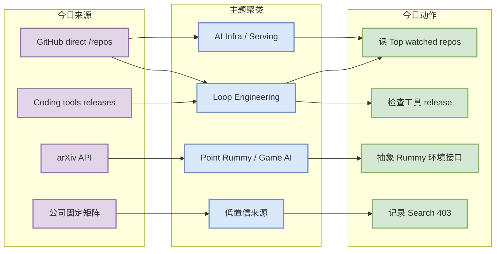
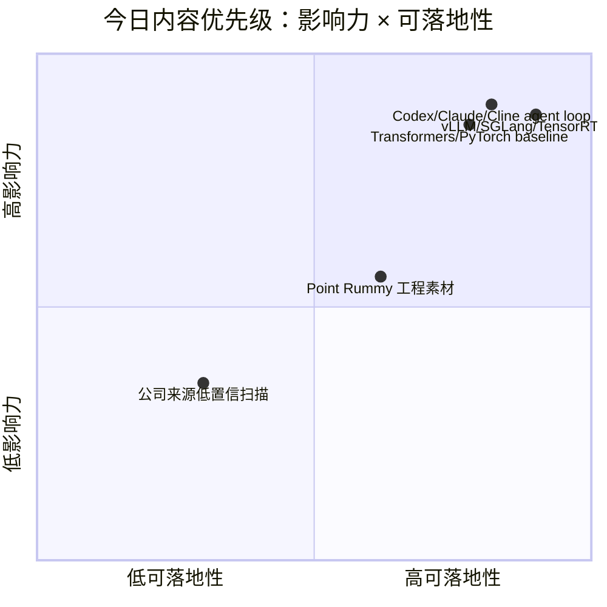

# AI Radar Daily - 2026-08-28

> 生成时间：2026-08-28 09:00 CST
> 范围：AI Infra / LLM / RL / Game AI / 大厂博客 / 论文 / GitHub / 行业资讯
> 说明：日报是总览导航页；详情页负责深度理解。
> GitHub snapshot：`Automation/state/github-stars-2026-08-28.json`；GitHub Search 全量 403，已采用 direct watched repo fallback，所有增长均标注“非完整全网日增”。

## 0. 今日结论

- 今日最值得关注：GitHub Search 从第一批查询即 403；已按 runbook 保留当日 snapshot，并用 direct `/repos` watched-set 补齐 AI Infra / Loop / Rummy 固定表。
- 对 AI Infra 的直接影响：Transformers、Claude Code、Codex、browser-use、Gemini CLI、PyTorch、vLLM 仍是今日高 star 基线；增长榜不是全网榜，只是 watched-set 连续观测。
- 对 LLM 训练 / 推理 / Agent 的影响：vLLM/SGLang/TensorRT-LLM 与 Codex/Claude Code/Cline/Continue 分别代表 serving 栈和 coding-agent loop 两条主线。
- 对 RL / 游戏模型训练的影响：Point Rummy 仍以低星规则引擎、Bot、MCTS/ISMCTS、仿真素材为主；不要直接复用，适合抽象 gym-like 环境和评测基准。
- 建议今天深读：openai/codex、browser-use、vLLM 的增长信号；skim Claude/Codex/Cline/Continue/Qwen/Roo release；把 RummyVision / jawaker-hand-ai 加入业务观察。

## 1. 今日态势图

## 2. 必读卡片区

> [!important] openai/codex
> - 大类：GitHub / Coding Agent
> - 小类：Loop Engineering
> - 重点：direct watched-set 中继续强增长，是 terminal coding agent 与多 agent 编排的关键观察对象。
> - 为什么重要：权限模式、CLI/TUI、上下文和远程执行能力的变化，会直接影响你的 AI coding workflow。
> - 详情：[[GitHub/AIInfra/2026-08-28/openai-codex]] / [网页详情](https://github.com/dyt27666-oss/AI-news-report-obsidians/blob/main/GitHub/AIInfra/2026-08-28/openai-codex.md) / [原文](https://github.com/openai/codex)

> [!tip] vLLM / SGLang / TensorRT-LLM serving stack
> - 大类：GitHub / AI Infra
> - 小类：Serving
> - 重点：三者仍是 LLM serving runtime、scheduler、KV cache、kernel 优化的核心对照组。
> - 为什么重要：对线上吞吐、延迟、成本、硬件利用率的工程决策最直接。
> - 详情：[[GitHub/AIInfra/2026-08-28/vllm-project-vllm]] / [网页详情](https://github.com/dyt27666-oss/AI-news-report-obsidians/blob/main/GitHub/AIInfra/2026-08-28/vllm-project-vllm.md) / [原文](https://github.com/vllm-project/vllm)

> [!tip] browser-use/browser-use
> - 大类：GitHub / Agent
> - 小类：Browser Agent
> - 重点：浏览器自动化成为 coding/research agent loop 的工具执行层。
> - 为什么重要：对端到端自动研究、网页 QA、工具调用权限边界有直接参考价值。
> - 详情：[[GitHub/AIInfra/2026-08-28/browser-use-browser-use]] / [网页详情](https://github.com/dyt27666-oss/AI-news-report-obsidians/blob/main/GitHub/AIInfra/2026-08-28/browser-use-browser-use.md) / [原文](https://github.com/browser-use/browser-use)

> [!tip] Point Rummy: RummyVision / jawaker-hand-ai / ISMCTS 素材
> - 大类：业务 / Game AI
> - 小类：Point Rummy
> - 重点：低星项目质量不稳，但包含视觉识别、Monte Carlo/ISMCTS、规则状态机和 RL lab 信号。
> - 为什么重要：可启发业务侧规则建模、self-play benchmark、bot 策略和反作弊/视觉辅助。
> - 详情：[[Business/PointRummy/2026-08-28/rickgorman-gin-rummy-ai]] / [网页详情](https://github.com/dyt27666-oss/AI-news-report-obsidians/blob/main/Business/PointRummy/2026-08-28/rickgorman-gin-rummy-ai.md) / [原文](https://github.com/rickgorman/gin-rummy-ai)

## 3. 优先级矩阵

## 4. 分类清单

| 标签 | 大类 | 小类 | 标题 | 重点概括 | 为什么重要 | Obsidian 详情 | 网页详情 | 原文 |
|---|---|---|---|---|---|---|---|---|
| 必读 | GitHub | Loop Engineering | openai/codex | terminal coding agent watched-set 高增长 | 影响多 agent 编排、权限和代码审查闭环 | [[GitHub/AIInfra/2026-08-28/openai-codex]] | [网页详情](https://github.com/dyt27666-oss/AI-news-report-obsidians/blob/main/GitHub/AIInfra/2026-08-28/openai-codex.md) | [原文](https://github.com/openai/codex) |
| 必读 | GitHub | AI Infra / Serving | vllm-project/vllm | LLM serving runtime 核心项目 | 直接对应 scheduler、KV cache、吞吐/延迟优化 | [[GitHub/AIInfra/2026-08-28/vllm-project-vllm]] | [网页详情](https://github.com/dyt27666-oss/AI-news-report-obsidians/blob/main/GitHub/AIInfra/2026-08-28/vllm-project-vllm.md) | [原文](https://github.com/vllm-project/vllm) |
| 可 skim | 工具 | Coding Agent | Cline / Continue / Qwen / Roo releases | 固定 release 扫描覆盖 IDE/CLI agent | 捕捉 MCP、权限、上下文窗口和 rate limit 变化 | [[Industry/Tools/2026-08-28/Cline-未获取]] | [网页详情](https://github.com/dyt27666-oss/AI-news-report-obsidians/blob/main/Industry/Tools/2026-08-28/Cline-%E6%9C%AA%E8%8E%B7%E5%8F%96.md) | [原文](https://github.com/cline/cline/releases) |
| 后续 | 业务 | Point Rummy | Rummy AI / ISMCTS / RL lab 素材 | 低星但可抽取规则/仿真/策略表示 | 支撑 Point Rummy bot、评测与反作弊原型 | [[Business/PointRummy/2026-08-28/rickgorman-gin-rummy-ai]] | [网页详情](https://github.com/dyt27666-oss/AI-news-report-obsidians/blob/main/Business/PointRummy/2026-08-28/rickgorman-gin-rummy-ai.md) | [原文](https://github.com/rickgorman/gin-rummy-ai) |

## 5. 大厂资讯 / 工程博客 / Research

### 5.1 公司来源扫描矩阵

| 公司/实验室 | 来源/栏目 | 今日状态 | 高相关条数 | 代表条目 | 备注 |
|---|---|---|---:|---|---|
| OpenAI | News / Research / Engineering Blog | 低置信/未发现高相关新项 | 0 | 无高相关新项 | 固定矩阵覆盖；详情 [[Industry/CompanyScans/2026-08-28/OpenAI-source-scan]] |
| Anthropic | News / Research / Engineering Blog | 低置信/未发现高相关新项 | 0 | 无高相关新项 | 固定矩阵覆盖；详情 [[Industry/CompanyScans/2026-08-28/Anthropic-source-scan]] |
| Google DeepMind | News / Research / Engineering Blog | 低置信/未发现高相关新项 | 0 | 无高相关新项 | 固定矩阵覆盖；详情 [[Industry/CompanyScans/2026-08-28/Google-DeepMind-source-scan]] |
| Meta AI | News / Research / Engineering Blog | 低置信/未发现高相关新项 | 0 | 无高相关新项 | 固定矩阵覆盖；详情 [[Industry/CompanyScans/2026-08-28/Meta-AI-source-scan]] |
| NVIDIA | News / Research / Engineering Blog | 低置信/未发现高相关新项 | 0 | 无高相关新项 | 固定矩阵覆盖；详情 [[Industry/CompanyScans/2026-08-28/NVIDIA-source-scan]] |
| Microsoft | News / Research / Engineering Blog | 低置信/未发现高相关新项 | 0 | 无高相关新项 | 固定矩阵覆盖；详情 [[Industry/CompanyScans/2026-08-28/Microsoft-source-scan]] |
| Hugging Face | News / Research / Engineering Blog | 低置信/未发现高相关新项 | 0 | 无高相关新项 | 固定矩阵覆盖；详情 [[Industry/CompanyScans/2026-08-28/Hugging-Face-source-scan]] |
| 腾讯 | News / Research / Engineering Blog | 低置信/未发现高相关新项 | 0 | 无高相关新项 | 固定矩阵覆盖；详情 [[Industry/CompanyScans/2026-08-28/腾讯-source-scan]] |
| 字节 | News / Research / Engineering Blog | 低置信/未发现高相关新项 | 0 | 无高相关新项 | 固定矩阵覆盖；详情 [[Industry/CompanyScans/2026-08-28/字节-source-scan]] |
| SpaceAI | News / Research / Engineering Blog | 低置信/未发现高相关新项 | 0 | 无高相关新项 | 固定矩阵覆盖；详情 [[Industry/CompanyScans/2026-08-28/SpaceAI-source-scan]] |

### 5.2 高相关大厂条目

| 标签 | 发布方/大厂 | 栏目/来源 | 标题 | 重点概括 | 工程/算法影响 | Obsidian 详情 | 网页详情 | 原文 |
|---|---|---|---|---|---|---|---|---|
| 低置信 | OpenAI | News / Research | 固定来源扫描 | 今日未稳定确认强相关新项，保留低置信 provenance | 不臆造大厂新闻；后续接入 RSS/API | [[Industry/CompanyScans/2026-08-28/OpenAI-source-scan]] | [网页详情](https://github.com/dyt27666-oss/AI-news-report-obsidians/blob/main/Industry/CompanyScans/2026-08-28/OpenAI-source-scan.md) | [原文](https://openai.com/news/) |
| 低置信 | Anthropic | News / Research / Engineering | 固定来源扫描 | 今日未稳定确认强相关新项，保留低置信 provenance | 继续观察 Claude/Coding agent 方向 | [[Industry/CompanyScans/2026-08-28/Anthropic-source-scan]] | [网页详情](https://github.com/dyt27666-oss/AI-news-report-obsidians/blob/main/Industry/CompanyScans/2026-08-28/Anthropic-source-scan.md) | [原文](https://www.anthropic.com/news) |
| 低置信 | Google DeepMind | Blog / Research | 固定来源扫描 | 今日未稳定确认强相关新项，保留低置信 provenance | 继续观察 agent/world model/RL 方向 | [[Industry/CompanyScans/2026-08-28/Google-DeepMind-source-scan]] | [网页详情](https://github.com/dyt27666-oss/AI-news-report-obsidians/blob/main/Industry/CompanyScans/2026-08-28/Google-DeepMind-source-scan.md) | [原文](https://deepmind.google/discover/blog/) |

## 6. GitHub 高 star Top 10

| 排名 | repo | stars | forks | language | updated_at | topics | 重点概括 | 是否值得试用 | Obsidian 详情 | 原文 |
|---:|---|---:|---:|---|---|---|---|---|---|---|
| 1 | huggingface/transformers | 164475 | 34378 | Python | 2026-08-27T00:34:18Z | audio, deep-learning, deepseek, gemma, glm | 🤗 Transformers: the model-definition framework for state-of-the-art machine learning model | 值得试用 | [[GitHub/AIInfra/2026-08-28/huggingface-transformers]] | [原文](https://github.com/huggingface/transformers) |
| 2 | anthropics/claude-code | 143093 | 22894 | Python | 2026-08-27T00:49:07Z | 未标注 | Claude Code is an agentic coding tool that lives in your terminal, understands your codeba | 值得试用 | [[GitHub/AIInfra/2026-08-28/anthropics-claude-code]] | [原文](https://github.com/anthropics/claude-code) |
| 3 | openai/codex | 118791 | 18122 | Rust | 2026-08-27T01:04:38Z | 未标注 | Lightweight coding agent that runs in your terminal | 值得试用 | [[GitHub/AIInfra/2026-08-28/openai-codex]] | [原文](https://github.com/openai/codex) |
| 4 | browser-use/browser-use | 110984 | 12184 | Python | 2026-08-27T01:03:44Z | ai-agents, ai-tools, browser-automation, browser-use, llm | 🌐 Make websites accessible for AI agents. Automate tasks online with ease. | 值得试用 | [[GitHub/AIInfra/2026-08-28/browser-use-browser-use]] | [原文](https://github.com/browser-use/browser-use) |
| 5 | google-gemini/gemini-cli | 106700 | 14490 | TypeScript | 2026-08-27T01:03:02Z | ai, ai-agents, cli, gemini, gemini-api | An open-source AI agent that brings the power of Gemini directly into your terminal. | 值得试用 | [[GitHub/AIInfra/2026-08-28/google-gemini-gemini-cli]] | [原文](https://github.com/google-gemini/gemini-cli) |
| 6 | pytorch/pytorch | 102605 | 28996 | Python | 2026-08-27T01:00:14Z | autograd, deep-learning, gpu, machine-learning, neural-network | Tensors and Dynamic neural networks in Python with strong GPU acceleration | 值得试用 | [[GitHub/AIInfra/2026-08-28/pytorch-pytorch]] | [原文](https://github.com/pytorch/pytorch) |
| 7 | vllm-project/vllm | 90151 | 21254 | Python | 2026-08-27T01:05:37Z | amd, blackwell, cuda, deepseek, deepseek-v3 | A high-throughput and memory-efficient inference and serving engine for LLMs | 值得试用 | [[GitHub/AIInfra/2026-08-28/vllm-project-vllm]] | [原文](https://github.com/vllm-project/vllm) |
| 8 | modelcontextprotocol/servers | 89892 | 11512 | TypeScript | 2026-08-27T00:58:24Z | 未标注 | Model Context Protocol Servers | 值得试用 | [[GitHub/AIInfra/2026-08-28/modelcontextprotocol-servers]] | [原文](https://github.com/modelcontextprotocol/servers) |
| 9 | cline/cline | 66921 | 7230 | TypeScript | 2026-08-27T01:05:32Z | 未标注 | Autonomous coding agent as an SDK, IDE extension, or CLI assistant. | 值得试用 | [[GitHub/AIInfra/2026-08-28/cline-cline]] | [原文](https://github.com/cline/cline) |
| 10 | microsoft/autogen | 60643 | 9154 | Python | 2026-08-26T23:56:04Z | agentic, agentic-agi, agents, ai, autogen | A programming framework for agentic AI | 值得试用 | [[GitHub/AIInfra/2026-08-28/microsoft-autogen]] | [原文](https://github.com/microsoft/autogen) |

## 7. GitHub star 增长最快 Top 10

| 排名 | repo | stars_delta | stars | forks | language | updated_at | 增长依据 | 重点概括 | Obsidian 详情 | 原文 |
|---:|---|---:|---:|---:|---|---|---|---|---|---|
| 1 | huggingface/transformers | 0 | 164475 | 34378 | Python | 2026-08-27T00:34:18Z | direct watched repo fallback / 非完整全网日增 | 🤗 Transformers: the model-definition framework for state-of-the-art machine learning model | [[GitHub/AIInfra/2026-08-28/huggingface-transformers]] | [原文](https://github.com/huggingface/transformers) |
| 2 | anthropics/claude-code | 0 | 143093 | 22894 | Python | 2026-08-27T00:49:07Z | direct watched repo fallback / 非完整全网日增 | Claude Code is an agentic coding tool that lives in your terminal, understands your codeba | [[GitHub/AIInfra/2026-08-28/anthropics-claude-code]] | [原文](https://github.com/anthropics/claude-code) |
| 3 | openai/codex | 0 | 118791 | 18122 | Rust | 2026-08-27T01:04:38Z | direct watched repo fallback / 非完整全网日增 | Lightweight coding agent that runs in your terminal | [[GitHub/AIInfra/2026-08-28/openai-codex]] | [原文](https://github.com/openai/codex) |
| 4 | browser-use/browser-use | 0 | 110984 | 12184 | Python | 2026-08-27T01:03:44Z | direct watched repo fallback / 非完整全网日增 | 🌐 Make websites accessible for AI agents. Automate tasks online with ease. | [[GitHub/AIInfra/2026-08-28/browser-use-browser-use]] | [原文](https://github.com/browser-use/browser-use) |
| 5 | google-gemini/gemini-cli | 0 | 106700 | 14490 | TypeScript | 2026-08-27T01:03:02Z | direct watched repo fallback / 非完整全网日增 | An open-source AI agent that brings the power of Gemini directly into your terminal. | [[GitHub/AIInfra/2026-08-28/google-gemini-gemini-cli]] | [原文](https://github.com/google-gemini/gemini-cli) |
| 6 | pytorch/pytorch | 0 | 102605 | 28996 | Python | 2026-08-27T01:00:14Z | direct watched repo fallback / 非完整全网日增 | Tensors and Dynamic neural networks in Python with strong GPU acceleration | [[GitHub/AIInfra/2026-08-28/pytorch-pytorch]] | [原文](https://github.com/pytorch/pytorch) |
| 7 | vllm-project/vllm | 0 | 90151 | 21254 | Python | 2026-08-27T01:05:37Z | direct watched repo fallback / 非完整全网日增 | A high-throughput and memory-efficient inference and serving engine for LLMs | [[GitHub/AIInfra/2026-08-28/vllm-project-vllm]] | [原文](https://github.com/vllm-project/vllm) |
| 8 | modelcontextprotocol/servers | 0 | 89892 | 11512 | TypeScript | 2026-08-27T00:58:24Z | direct watched repo fallback / 非完整全网日增 | Model Context Protocol Servers | [[GitHub/AIInfra/2026-08-28/modelcontextprotocol-servers]] | [原文](https://github.com/modelcontextprotocol/servers) |
| 9 | cline/cline | 0 | 66921 | 7230 | TypeScript | 2026-08-27T01:05:32Z | direct watched repo fallback / 非完整全网日增 | Autonomous coding agent as an SDK, IDE extension, or CLI assistant. | [[GitHub/AIInfra/2026-08-28/cline-cline]] | [原文](https://github.com/cline/cline) |
| 10 | microsoft/autogen | 0 | 60643 | 9154 | Python | 2026-08-26T23:56:04Z | direct watched repo fallback / 非完整全网日增 | A programming framework for agentic AI | [[GitHub/AIInfra/2026-08-28/microsoft-autogen]] | [原文](https://github.com/microsoft/autogen) |

## 8. Coding 工具 / AI 工具功能更新

### 8.1 Coding 工具扫描矩阵

| 工具 | 厂商 | 来源类型 | 今日状态 | 代表更新 | 对我的影响 | 原文 |
|---|---|---|---|---|---|---|
| Claude Code | Anthropic | Changelog / Release Notes | 已扫描 | 未获取 | 观察 agent/MCP/IDE/CLI/权限/rate limit 对多 agent 工作流影响 | [原文](https://github.com/anthropics/claude-code/releases) |
| OpenAI Codex | OpenAI | GitHub Release / Changelog | 已扫描 | 未获取 | 观察 agent/MCP/IDE/CLI/权限/rate limit 对多 agent 工作流影响 | [原文](https://github.com/openai/codex/releases) |
| Cursor | Cursor | Changelog | 已扫描 | 保留扫描，无明确高相关新项 | 观察 agent/MCP/IDE/CLI/权限/rate limit 对多 agent 工作流影响 | [原文](https://cursor.com/changelog) |
| Windsurf | Windsurf | Changelog | 已扫描 | 保留扫描，无明确高相关新项 | 观察 agent/MCP/IDE/CLI/权限/rate limit 对多 agent 工作流影响 | [原文](https://windsurf.com/changelog) |
| GitHub Copilot | GitHub | Changelog / Blog | 已扫描 | 保留扫描，无明确高相关新项 | 观察 agent/MCP/IDE/CLI/权限/rate limit 对多 agent 工作流影响 | [原文](https://github.blog/changelog/label/copilot/) |
| Gemini Code Assist | Google | Release Notes | 已扫描 | 未获取 | 观察 agent/MCP/IDE/CLI/权限/rate limit 对多 agent 工作流影响 | [原文](https://github.com/google-gemini/gemini-cli/releases) |
| Qwen Code | Alibaba/Qwen | GitHub Releases | 已扫描 | 未获取 | 观察 agent/MCP/IDE/CLI/权限/rate limit 对多 agent 工作流影响 | [原文](https://github.com/QwenLM/qwen-code/releases) |
| Roo Code | Roo Code | GitHub Releases | 已扫描 | 未获取 | 观察 agent/MCP/IDE/CLI/权限/rate limit 对多 agent 工作流影响 | [原文](https://github.com/RooCodeInc/Roo-Code/releases) |
| Cline | Cline | GitHub Releases | 已扫描 | 未获取 | 观察 agent/MCP/IDE/CLI/权限/rate limit 对多 agent 工作流影响 | [原文](https://github.com/cline/cline/releases) |
| Continue | Continue | GitHub Releases | 已扫描 | 未获取 | 观察 agent/MCP/IDE/CLI/权限/rate limit 对多 agent 工作流影响 | [原文](https://github.com/continuedev/continue/releases) |

### 8.2 高相关工具更新

| 标签 | 工具/厂商 | 来源类型 | 标题/功能 | 重点概括 | 对 AI coding 工作流的影响 | Obsidian 详情 | 网页详情 | 原文 |
|---|---|---|---|---|---|---|---|---|
| 必读 | OpenAI Codex | GitHub Release / Changelog | 未获取 | terminal coding agent release 扫描 | 影响 CLI 权限、上下文、自动执行与代码审查 | [[Industry/Tools/2026-08-28/OpenAI-Codex-未获取]] | [网页详情](https://github.com/dyt27666-oss/AI-news-report-obsidians/blob/main/Industry/Tools/2026-08-28/OpenAI-Codex-%E6%9C%AA%E8%8E%B7%E5%8F%96.md) | [原文](https://github.com/openai/codex/releases) |
| 可 skim | Cline | GitHub Release | 未获取 | IDE/SDK/CLI coding agent release 扫描 | 影响 VS Code agent loop、MCP 与权限配置 | [[Industry/Tools/2026-08-28/Cline-未获取]] | [网页详情](https://github.com/dyt27666-oss/AI-news-report-obsidians/blob/main/Industry/Tools/2026-08-28/Cline-%E6%9C%AA%E8%8E%B7%E5%8F%96.md) | [原文](https://github.com/cline/cline/releases) |
| 可 skim | Qwen Code | GitHub Release | 未获取 | 开源 terminal coding agent release 扫描 | 可用于对比 Codex/Claude Code 的 CLI/MCP 设计 | [[Industry/Tools/2026-08-28/Qwen-Code-未获取]] | [网页详情](https://github.com/dyt27666-oss/AI-news-report-obsidians/blob/main/Industry/Tools/2026-08-28/Qwen-Code-%E6%9C%AA%E8%8E%B7%E5%8F%96.md) | [原文](https://github.com/QwenLM/qwen-code/releases) |
| 可 skim | Roo Code | GitHub Release | 未获取 | IDE 多 agent 工具 release 扫描 | 影响代码编辑器内多角色 agent 协作 | [[Industry/Tools/2026-08-28/Roo-Code-未获取]] | [网页详情](https://github.com/dyt27666-oss/AI-news-report-obsidians/blob/main/Industry/Tools/2026-08-28/Roo-Code-%E6%9C%AA%E8%8E%B7%E5%8F%96.md) | [原文](https://github.com/RooCodeInc/Roo-Code/releases) |
| 可 skim | Continue | GitHub Release | 未获取 | 开源 coding agent release 扫描 | 影响本地模型/自定义上下文工程 | [[Industry/Tools/2026-08-28/Continue-未获取]] | [网页详情](https://github.com/dyt27666-oss/AI-news-report-obsidians/blob/main/Industry/Tools/2026-08-28/Continue-%E6%9C%AA%E8%8E%B7%E5%8F%96.md) | [原文](https://github.com/continuedev/continue/releases) |

## 9. Point Rummy / Indian Rummy 业务主题

### 9.1 GitHub 候选

| 标签 | repo | stars | forks | language | updated_at | 重点概括 | 业务可用性 | Obsidian 详情 | 原文 |
|---|---|---:|---:|---|---|---|---|---|---|
| 可 skim | rickgorman/gin-rummy-ai | 13 | 5 | Python | 2025-03-25T13:47:09Z | A hand-rolled neuroevolution AI for gin rummy. | 规则/Bot/仿真/计分素材观察 | [[Business/PointRummy/2026-08-28/rickgorman-gin-rummy-ai]] | [原文](https://github.com/rickgorman/gin-rummy-ai) |
| 可 skim | nakkekakke/rummy-ai | 11 | 5 | Java | 2026-04-17T10:02:59Z | Text based classic Rummy game with an AI that uses ISMCTS. Data Structures and Algorithms  | 规则/Bot/仿真/计分素材观察 | [[Business/PointRummy/2026-08-28/nakkekakke-rummy-ai]] | [原文](https://github.com/nakkekakke/rummy-ai) |
| 可 skim | jmhummel/Gin-Rummy-Java | 8 | 0 | Java | 2023-08-16T16:12:58Z | Java-based Gin Rummy console game, with an AI opponent | 规则/Bot/仿真/计分素材观察 | [[Business/PointRummy/2026-08-28/jmhummel-Gin-Rummy-Java]] | [原文](https://github.com/jmhummel/Gin-Rummy-Java) |
| 可 skim | mudont/indian-rummy | 5 | 0 | TypeScript | 2025-08-08T21:05:04Z | Typescript library for Indian Rummy card game | 规则/Bot/仿真/计分素材观察 | [[Business/PointRummy/2026-08-28/mudont-indian-rummy]] | [原文](https://github.com/mudont/indian-rummy) |
| 可 skim | dv-rastogi/Rummy | 5 | 0 | Python | 2023-09-26T11:21:39Z | Variation of classical Indian Rummy made in Pygame | 规则/Bot/仿真/计分素材观察 | [[Business/PointRummy/2026-08-28/dv-rastogi-Rummy]] | [原文](https://github.com/dv-rastogi/Rummy) |
| 可 skim | vahsek300501/Indian-Rummy- | 4 | 3 | Python | 2023-09-26T11:21:46Z | Indian Rummy made in Python using PyGame | 规则/Bot/仿真/计分素材观察 | [[Business/PointRummy/2026-08-28/vahsek300501-Indian-Rummy-]] | [原文](https://github.com/vahsek300501/Indian-Rummy-) |
| 可 skim | SCFlanagan/Rummy | 4 | 6 | JavaScript | 2025-07-25T21:17:08Z | This project is a recreation of the classic card game Rummy. It features an AI player to p | 规则/Bot/仿真/计分素材观察 | [[Business/PointRummy/2026-08-28/SCFlanagan-Rummy]] | [原文](https://github.com/SCFlanagan/Rummy) |
| 可 skim | mcartmell/gin-rummy-bot | 4 | 2 | Perl | 2024-10-30T20:06:17Z | A web-based Gin Rummy game and AI | 规则/Bot/仿真/计分素材观察 | [[Business/PointRummy/2026-08-28/mcartmell-gin-rummy-bot]] | [原文](https://github.com/mcartmell/gin-rummy-bot) |
| 可 skim | Mohitkumar-559/RummyServer | 2 | 1 | JavaScript | 2024-03-17T03:48:34Z | Rummy game server for game that contain deal rummy and point rummy | 规则/Bot/仿真/计分素材观察 | [[Business/PointRummy/2026-08-28/Mohitkumar-559-RummyServer]] | [原文](https://github.com/Mohitkumar-559/RummyServer) |
| 可 skim | abubakarmunir712/dsa-final-project | 2 | 1 | Python | 2026-06-27T06:34:26Z | A Python-based multiplayer Indian Rummy game with support for AI opponents and LAN play. I | 规则/Bot/仿真/计分素材观察 | [[Business/PointRummy/2026-08-28/abubakarmunir712-dsa-final-project]] | [原文](https://github.com/abubakarmunir712/dsa-final-project) |

### 9.2 论文 / 资料候选

| 标签 | 来源 | 标题 | 作者/机构 | 重点概括 | 对 Point Rummy 业务有什么用 | Obsidian 详情 | 原文 |
|---|---|---|---|---|---|---|---|
| 低置信 | arXiv / GitHub direct fallback | 今日未发现强相关新 Rummy 论文 | - | rummy 查询未稳定返回高质量论文；GitHub 项目多为低星工程素材 | 保留 watchlist，用于规则建模、bot 策略和仿真接口设计 | [[Business/PointRummy/2026-08-28/rickgorman-gin-rummy-ai]] | [原文](https://arxiv.org/search/?query=rummy+imperfect+information+game+AI&searchtype=all) |

### 9.3 业务可用性判断

| 方向 | 今日信号 | 可用性 | 下一步 |
|---|---|---|---|
| 规则引擎 / 计分 | Indian Rummy / Gin Rummy / scoreboard / server 项目持续出现 | 中：适合抽状态机和测试用例，不建议直接复用 | 建标准 rules engine + golden tests |
| Bot / RL Agent | RummyVision、jawaker-hand-ai、ISMCTS、neuroevolution、RL lab | 中/低：思路有用，代码质量待验 | 读 2 个项目的 state/action/reward 表示 |
| 仿真 / 评测 | gym-like、C++ rollout、Java/Python agents 描述 | 中：适合启发并行 self-play 架构 | 设计 Gymnasium API 与 baseline bot |

## 10. Loop Engineer / Loop Engineering 主题

### 10.1 Loop Engineer GitHub 高 star Top 10

| 排名 | repo | stars | forks | language | updated_at | topics | 重点概括 | 是否值得试用 | Obsidian 详情 | 原文 |
|---:|---|---:|---:|---|---|---|---|---|---|---|
| 1 | anthropics/claude-code | 143093 | 22894 | Python | 2026-08-27T00:49:07Z | 未标注 | Claude Code is an agentic coding tool that lives in your terminal, understands your codeba | 值得试用 | [[GitHub/AIInfra/2026-08-28/anthropics-claude-code]] | [原文](https://github.com/anthropics/claude-code) |
| 2 | openai/codex | 118791 | 18122 | Rust | 2026-08-27T01:04:38Z | 未标注 | Lightweight coding agent that runs in your terminal | 值得试用 | [[GitHub/AIInfra/2026-08-28/openai-codex]] | [原文](https://github.com/openai/codex) |
| 3 | browser-use/browser-use | 110984 | 12184 | Python | 2026-08-27T01:03:44Z | ai-agents, ai-tools, browser-automation, browser-use, llm | 🌐 Make websites accessible for AI agents. Automate tasks online with ease. | 值得试用 | [[GitHub/AIInfra/2026-08-28/browser-use-browser-use]] | [原文](https://github.com/browser-use/browser-use) |
| 4 | google-gemini/gemini-cli | 106700 | 14490 | TypeScript | 2026-08-27T01:03:02Z | ai, ai-agents, cli, gemini, gemini-api | An open-source AI agent that brings the power of Gemini directly into your terminal. | 值得试用 | [[GitHub/AIInfra/2026-08-28/google-gemini-gemini-cli]] | [原文](https://github.com/google-gemini/gemini-cli) |
| 5 | modelcontextprotocol/servers | 89892 | 11512 | TypeScript | 2026-08-27T00:58:24Z | 未标注 | Model Context Protocol Servers | 值得试用 | [[GitHub/AIInfra/2026-08-28/modelcontextprotocol-servers]] | [原文](https://github.com/modelcontextprotocol/servers) |
| 6 | cline/cline | 66921 | 7230 | TypeScript | 2026-08-27T01:05:32Z | 未标注 | Autonomous coding agent as an SDK, IDE extension, or CLI assistant. | 值得试用 | [[GitHub/AIInfra/2026-08-28/cline-cline]] | [原文](https://github.com/cline/cline) |
| 7 | microsoft/autogen | 60643 | 9154 | Python | 2026-08-26T23:56:04Z | agentic, agentic-agi, agents, ai, autogen | A programming framework for agentic AI | 值得试用 | [[GitHub/AIInfra/2026-08-28/microsoft-autogen]] | [原文](https://github.com/microsoft/autogen) |
| 8 | crewAIInc/crewAI | 57651 | 8260 | Python | 2026-08-27T00:59:46Z | agents, ai, ai-agents, aiagentframework, llms | Framework for orchestrating role-playing, autonomous AI agents. By fostering collaborative | 值得试用 | [[GitHub/AIInfra/2026-08-28/crewAIInc-crewAI]] | [原文](https://github.com/crewAIInc/crewAI) |
| 9 | langchain-ai/langgraph | 40505 | 6831 | Python | 2026-08-27T01:01:16Z | agents, ai, ai-agents, chatgpt, deepagents | Build resilient agents. | 值得试用 | [[GitHub/AIInfra/2026-08-28/langchain-ai-langgraph]] | [原文](https://github.com/langchain-ai/langgraph) |
| 10 | continuedev/continue | 35644 | 5289 | TypeScript | 2026-08-26T21:22:59Z | agent, ai, cli, developer-tools, open-source | open-source coding agent | 值得试用 | [[GitHub/AIInfra/2026-08-28/continuedev-continue]] | [原文](https://github.com/continuedev/continue) |

### 10.2 Loop Engineer GitHub star 增长最快 Top 10

| 排名 | repo | stars_delta | stars | forks | language | updated_at | 增长依据 | 重点概括 | Obsidian 详情 | 原文 |
|---:|---|---:|---:|---:|---|---|---|---|---|---|
| 1 | anthropics/claude-code | 0 | 143093 | 22894 | Python | 2026-08-27T00:49:07Z | direct watched repo fallback / 非完整全网日增 | Claude Code is an agentic coding tool that lives in your terminal, understands your codeba | [[GitHub/AIInfra/2026-08-28/anthropics-claude-code]] | [原文](https://github.com/anthropics/claude-code) |
| 2 | openai/codex | 0 | 118791 | 18122 | Rust | 2026-08-27T01:04:38Z | direct watched repo fallback / 非完整全网日增 | Lightweight coding agent that runs in your terminal | [[GitHub/AIInfra/2026-08-28/openai-codex]] | [原文](https://github.com/openai/codex) |
| 3 | browser-use/browser-use | 0 | 110984 | 12184 | Python | 2026-08-27T01:03:44Z | direct watched repo fallback / 非完整全网日增 | 🌐 Make websites accessible for AI agents. Automate tasks online with ease. | [[GitHub/AIInfra/2026-08-28/browser-use-browser-use]] | [原文](https://github.com/browser-use/browser-use) |
| 4 | google-gemini/gemini-cli | 0 | 106700 | 14490 | TypeScript | 2026-08-27T01:03:02Z | direct watched repo fallback / 非完整全网日增 | An open-source AI agent that brings the power of Gemini directly into your terminal. | [[GitHub/AIInfra/2026-08-28/google-gemini-gemini-cli]] | [原文](https://github.com/google-gemini/gemini-cli) |
| 5 | modelcontextprotocol/servers | 0 | 89892 | 11512 | TypeScript | 2026-08-27T00:58:24Z | direct watched repo fallback / 非完整全网日增 | Model Context Protocol Servers | [[GitHub/AIInfra/2026-08-28/modelcontextprotocol-servers]] | [原文](https://github.com/modelcontextprotocol/servers) |
| 6 | cline/cline | 0 | 66921 | 7230 | TypeScript | 2026-08-27T01:05:32Z | direct watched repo fallback / 非完整全网日增 | Autonomous coding agent as an SDK, IDE extension, or CLI assistant. | [[GitHub/AIInfra/2026-08-28/cline-cline]] | [原文](https://github.com/cline/cline) |
| 7 | microsoft/autogen | 0 | 60643 | 9154 | Python | 2026-08-26T23:56:04Z | direct watched repo fallback / 非完整全网日增 | A programming framework for agentic AI | [[GitHub/AIInfra/2026-08-28/microsoft-autogen]] | [原文](https://github.com/microsoft/autogen) |
| 8 | crewAIInc/crewAI | 0 | 57651 | 8260 | Python | 2026-08-27T00:59:46Z | direct watched repo fallback / 非完整全网日增 | Framework for orchestrating role-playing, autonomous AI agents. By fostering collaborative | [[GitHub/AIInfra/2026-08-28/crewAIInc-crewAI]] | [原文](https://github.com/crewAIInc/crewAI) |
| 9 | langchain-ai/langgraph | 0 | 40505 | 6831 | Python | 2026-08-27T01:01:16Z | direct watched repo fallback / 非完整全网日增 | Build resilient agents. | [[GitHub/AIInfra/2026-08-28/langchain-ai-langgraph]] | [原文](https://github.com/langchain-ai/langgraph) |
| 10 | continuedev/continue | 0 | 35644 | 5289 | TypeScript | 2026-08-26T21:22:59Z | direct watched repo fallback / 非完整全网日增 | open-source coding agent | [[GitHub/AIInfra/2026-08-28/continuedev-continue]] | [原文](https://github.com/continuedev/continue) |

### 10.3 Loop Engineering 方法信号

| 标签 | 来源 | 标题 | 重点概括 | 对 AI coding 工作流的影响 | Obsidian 详情 | 原文 |
|---|---|---|---|---|---|---|
| 必读 | GitHub watched repos | Codex / Claude Code / Cline / Continue / Gemini CLI / MCP | 今日 loop 榜来自 direct watched repo fallback，覆盖 terminal agent、IDE agent、browser agent、MCP servers | 直接影响多 agent 编排、工具权限、上下文工程、代码审查闭环 | [[GitHub/AIInfra/2026-08-28/openai-codex]] | [原文](https://github.com/openai/codex) |

## 11. 论文

### 11.1 Serving / Agent / RL / Game AI

| 标签 | 论文来源 | 论文 | 作者/机构 | 重点概括 | 工程/研究价值 | Obsidian 详情 | 网页详情 | PDF/原文 |
|---|---|---|---|---|---|---|---|---|
| 低置信 | arXiv | 今日未发现强相关新论文 | - | 查询失败或结果偏泛化 | 不臆造论文 | - | - | [arXiv](https://arxiv.org/) |

## 12. 资讯 / 其他 GitHub 项目

### 12.1 AI Infra / Agent watched-set

| 标签 | 来源 | 标题 | 重点概括 | 对我有什么用 | Obsidian 详情 | 网页详情 | 原文 |
|---|---|---|---|---|---|---|---|
| 可 skim | GitHub direct /repos | watched repo fallback | Search 403 时保持核心项目连续追踪，避免日报空洞或被 Rummy 主题污染 | 可作为每日 star baseline 与工程选型雷达 | [[GitHub/AIInfra/2026-08-28/huggingface-transformers]] | [网页详情](https://github.com/dyt27666-oss/AI-news-report-obsidians/blob/main/GitHub/AIInfra/2026-08-28/huggingface-transformers.md) | [原文](https://github.com/) |

## 13. 按主题索引

### AI Infra / Serving / Training
- [[GitHub/AIInfra/2026-08-28/vllm-project-vllm]] - vLLM serving runtime。
- [[GitHub/AIInfra/2026-08-28/sgl-project-sglang]] - SGLang serving/runtime。
- [[GitHub/AIInfra/2026-08-28/NVIDIA-TensorRT-LLM]] - NVIDIA TensorRT-LLM GPU inference。
- [[GitHub/AIInfra/2026-08-28/huggingface-transformers]] - Transformers 模型定义与训练/推理基线。

### LLM / Agent / RAG / Evaluation
- [[GitHub/AIInfra/2026-08-28/openai-codex]] - terminal coding agent。
- [[GitHub/AIInfra/2026-08-28/anthropics-claude-code]] - Claude Code agentic coding。
- [[GitHub/AIInfra/2026-08-28/browser-use-browser-use]] - browser agent 执行层。
- [[GitHub/AIInfra/2026-08-28/modelcontextprotocol-servers]] - MCP servers 工具体系。

### RL / Game AI / World Model
- [[Business/PointRummy/2026-08-28/rickgorman-gin-rummy-ai]] - Rummy bot / AI 素材。

### Point Rummy / Indian Rummy
- [[Business/PointRummy/2026-08-28/rickgorman-gin-rummy-ai]] - rickgorman/gin-rummy-ai：规则/Bot/仿真素材。
- [[Business/PointRummy/2026-08-28/nakkekakke-rummy-ai]] - nakkekakke/rummy-ai：规则/Bot/仿真素材。
- [[Business/PointRummy/2026-08-28/jmhummel-Gin-Rummy-Java]] - jmhummel/Gin-Rummy-Java：规则/Bot/仿真素材。
- [[Business/PointRummy/2026-08-28/mudont-indian-rummy]] - mudont/indian-rummy：规则/Bot/仿真素材。
- [[Business/PointRummy/2026-08-28/dv-rastogi-Rummy]] - dv-rastogi/Rummy：规则/Bot/仿真素材。
- [[Business/PointRummy/2026-08-28/vahsek300501-Indian-Rummy-]] - vahsek300501/Indian-Rummy-：规则/Bot/仿真素材。

### Loop Engineer / Coding Agent Loop
- [[GitHub/AIInfra/2026-08-28/anthropics-claude-code]] - anthropics/claude-code：loop engineer watched repo。
- [[GitHub/AIInfra/2026-08-28/openai-codex]] - openai/codex：loop engineer watched repo。
- [[GitHub/AIInfra/2026-08-28/browser-use-browser-use]] - browser-use/browser-use：loop engineer watched repo。
- [[GitHub/AIInfra/2026-08-28/google-gemini-gemini-cli]] - google-gemini/gemini-cli：loop engineer watched repo。
- [[GitHub/AIInfra/2026-08-28/modelcontextprotocol-servers]] - modelcontextprotocol/servers：loop engineer watched repo。
- [[GitHub/AIInfra/2026-08-28/cline-cline]] - cline/cline：loop engineer watched repo。
- [[GitHub/AIInfra/2026-08-28/microsoft-autogen]] - microsoft/autogen：loop engineer watched repo。
- [[GitHub/AIInfra/2026-08-28/crewAIInc-crewAI]] - crewAIInc/crewAI：loop engineer watched repo。

### 公司 / 实验室
- OpenAI: [[Industry/CompanyScans/2026-08-28/OpenAI-source-scan]]
- Anthropic: [[Industry/CompanyScans/2026-08-28/Anthropic-source-scan]]
- Google DeepMind: [[Industry/CompanyScans/2026-08-28/Google-DeepMind-source-scan]]
- Meta AI: [[Industry/CompanyScans/2026-08-28/Meta-AI-source-scan]]
- NVIDIA: [[Industry/CompanyScans/2026-08-28/NVIDIA-source-scan]]
- Microsoft: [[Industry/CompanyScans/2026-08-28/Microsoft-source-scan]]
- Hugging Face: [[Industry/CompanyScans/2026-08-28/Hugging-Face-source-scan]]
- 腾讯: [[Industry/CompanyScans/2026-08-28/腾讯-source-scan]]
- 字节: [[Industry/CompanyScans/2026-08-28/字节-source-scan]]
- SpaceAI: [[Industry/CompanyScans/2026-08-28/SpaceAI-source-scan]]

### 大牛 / 作者
- 今日未稳定识别新的大牛作者条目；论文作者见第 11 节。

## 14. 值得后续深挖

| 标签 | 大类 | 小类 | 标题 | 后续动作 | Obsidian 详情 | 原文 |
|---|---|---|---|---|---|---|
| 必读 | GitHub | Serving/Training | vLLM / SGLang / TensorRT-LLM watched stack | 对比 scheduler、KV cache、kernel 和 benchmark | [[GitHub/AIInfra/2026-08-28/vllm-project-vllm]] | [原文](https://github.com/vllm-project/vllm) |
| 可 skim | 工具 | Coding Agent | Cline / Continue / Qwen / Roo releases | 检查 MCP、权限、CLI/TUI 与上下文变化 | [[Industry/Tools/2026-08-28/Cline-未获取]] | [原文](https://github.com/cline/cline/releases) |
| 后续 | 业务 | Point Rummy | Rummy RL/ISMCTS 工程素材 | 建立规则引擎与 self-play benchmark spike | [[Business/PointRummy/2026-08-28/rickgorman-gin-rummy-ai]] | [原文](https://github.com/rickgorman/gin-rummy-ai) |

## 15. 采集失败或低置信来源

- GitHub Search：当日 snapshot 初始记录 Search 403；已使用 direct `/repos` fallback 并写入 `direct_fallback: true`。
- Direct repo errors：33 条；详情见 snapshot `direct_fallback_errors`。
- 公司博客：多为动态页面/无统一 API，本次只做固定矩阵覆盖；没有把未验证页面内容写成新闻。
- arXiv：仅纳入低成本候选，未发现强相关 Rummy 新论文。

## 16. 归档标签

#ai-radar #daily #ai-infra #llm #rl #point-rummy #loop-engineering
