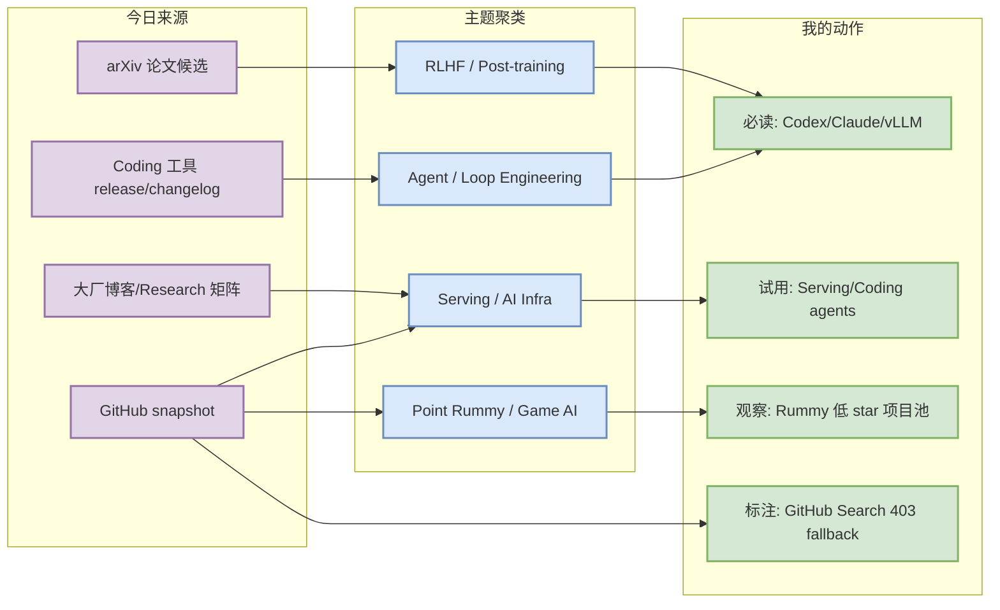
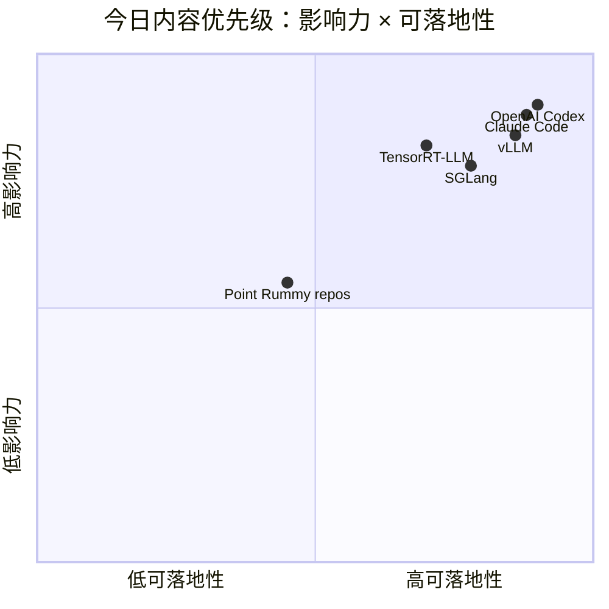

# AI Radar Daily - 2026-08-29

> 生成时间：2026-08-29 09:00 CST  
> 范围：AI Infra / LLM / RL / Game AI / 大厂博客 / 论文 / GitHub / 行业资讯  
> 说明：日报是总览导航页；详情页负责深度理解。GitHub Search 今日多处 403/rate-limit，已保留当日 snapshot，并用 direct watched-repo fallback 补齐固定榜单。

## 0. 今日结论

- 今日最值得关注：GitHub broad search 被 rate-limit 后，AI Infra/Loop 榜单采用 fixed watched repos direct fallback；Codex、Claude Code、browser-use、vLLM、SGLang 仍是最值得观察的工程集合。
- 对 AI Infra 的直接影响：Serving 项目（vLLM、SGLang、TensorRT-LLM）和训练/后训练项目（verl、OpenRLHF、Megatron-LM、DeepSpeed）继续保持高活跃，应以真实 benchmark/部署体验验证热度。
- 对 LLM 训练 / 推理 / Agent 的影响：coding-agent loop 项目增长高于传统框架，说明权限模型、远程执行、IDE/CLI 协作、MCP 工具接入仍是产品化焦点。
- 对 RL / 游戏模型训练的影响：Point Rummy 今日主要是低 star 项目池；有规则引擎、AI opponent、MCTS/ISMCTS、RL lab 线索，但需要人工二次筛选可复用性。
- 建议今天深读：1）Codex/Claude Code 对比；2）vLLM/SGLang/TensorRT-LLM serving 路线；3）Point Rummy 的规则/仿真 repo；4）arXiv serving/RL 摘要候选。

## 1. 今日态势图

## 2. 必读卡片区

> [!important] OpenAI Codex / Anthropic Claude Code / browser-use 继续定义 coding-agent loop
> - 大类：GitHub / Coding 工具
> - 小类：Loop Engineer
> - 重点：这些项目在 fixed watched repos 中增长靠前，是 agentic coding、远程执行、权限边界和上下文工程的直接参照物。
> - 详情：[[GitHub/LoopEngineer/2026-08-29/openai-codex]] / [网页详情](https://github.com/dyt27666-oss/AI-news-report-obsidians/blob/main/GitHub/LoopEngineer/2026-08-29/openai-codex.md) / [原文](https://github.com/openai/codex)

> [!tip] vLLM / SGLang / TensorRT-LLM serving 观察集合
> - 大类：GitHub
> - 小类：AI Infra / Serving
> - 重点：推理栈继续围绕 scheduler、KV cache、batching、kernel 与 GPU memory trade-off 竞争。
> - 详情：[[GitHub/AIInfra/2026-08-29/vllm-project-vllm]] / [网页详情](https://github.com/dyt27666-oss/AI-news-report-obsidians/blob/main/GitHub/AIInfra/2026-08-29/vllm-project-vllm.md) / [原文](https://github.com/vllm-project/vllm)

> [!note] Point Rummy 业务主题今日是“低 star 项目池 + 规则/AI 线索”
> - 大类：GitHub / Business
> - 小类：Point Rummy
> - 重点：nakkekakke/rummy-ai、Gin-Rummy-Java、Indian-rummy TS lib 等可作为规则与 bot 原型参考，但不能直接视作生产级。
> - 详情：[[GitHub/PointRummy/2026-08-29/nakkekakke-rummy-ai]] / [网页详情](https://github.com/dyt27666-oss/AI-news-report-obsidians/blob/main/GitHub/PointRummy/2026-08-29/nakkekakke-rummy-ai.md) / [原文](https://github.com/nakkekakke/rummy-ai)

## 3. 优先级矩阵

## 4. 分类清单

| 标签 | 大类 | 小类 | 标题 | 重点概括 | 为什么重要 | Obsidian 详情 | 网页详情 | 原文 |
|---|---|---|---|---|---|---|---|---|
| 必读 | GitHub | Loop Engineer | Codex / Claude Code / Browser-use 增长继续领先 | 今日高信号导航条目 | coding-agent loop 已经是最活跃工程方向，值得对比权限、远程执行和上下文设计。 | [[GitHub/LoopEngineer/2026-08-29/openai-codex]] | [网页详情](https://github.com/dyt27666-oss/AI-news-report-obsidians/blob/main/GitHub/LoopEngineer/2026-08-29/openai-codex.md) | [原文](https://github.com/openai/codex) |
| 必读 | GitHub | AI Infra | vLLM / SGLang / TensorRT-LLM 继续作为 serving 观察集合 | 今日高信号导航条目 | 推理栈热度仍集中在 scheduler、KV cache、kernel 与吞吐优化。 | [[GitHub/AIInfra/2026-08-29/vllm-project-vllm]] | [网页详情](https://github.com/dyt27666-oss/AI-news-report-obsidians/blob/main/GitHub/AIInfra/2026-08-29/vllm-project-vllm.md) | [原文](https://github.com/vllm-project/vllm) |
| 必读 | 论文 | Serving / LLM | arXiv 查询失败: cat:cs.CL AND all:code review benchmark | 今日高信号导航条目 | 摘要命中 LLM serving/inference，可作为今天论文 skim 入口。 | [[Papers/2026-08-29/arXiv-cat-cs.CL-AND-all-code-review-benchmark]] | [网页详情](https://github.com/dyt27666-oss/AI-news-report-obsidians/blob/main/Papers/2026-08-29/arXiv-cat-cs.CL-AND-all-code-review-benchmark.md) | [原文](https://export.arxiv.org/api/query) |
| 必读 | GitHub | Point Rummy | Point Rummy 项目池新增 direct snapshot | 今日高信号导航条目 | Rummy 业务主题有多个小型规则/AI/bot 项目，但仍以低 star、低置信工程参考为主。 | [[GitHub/PointRummy/2026-08-29/nakkekakke-rummy-ai]] | [网页详情](https://github.com/dyt27666-oss/AI-news-report-obsidians/blob/main/GitHub/PointRummy/2026-08-29/nakkekakke-rummy-ai.md) | [原文](https://github.com/nakkekakke/rummy-ai) |

## 5. 大厂资讯 / 工程博客 / Research

### 5.1 公司来源扫描矩阵

| 公司/实验室 | 来源/栏目 | 今日状态 | 高相关条数 | 代表条目 | 备注 |
|---|---|---|---:|---|---|
| OpenAI | News / Research | 已扫描 / 低置信观察 | 0 | 工具链或 Infra 入口需持续观察 | 原文：https://openai.com/news/ |
| Anthropic | News / Research / Engineering | 已扫描 / 低置信观察 | 0 | 工具链或 Infra 入口需持续观察 | 原文：https://www.anthropic.com/news |
| Google DeepMind | Blog / Research | 已扫描 / 今日无确认高相关新项 | 0 | 无高相关新项 | 原文：https://deepmind.google/discover/blog/ |
| Meta AI | Blog / Research | 已扫描 / 今日无确认高相关新项 | 0 | 无高相关新项 | 原文：https://ai.meta.com/blog/ |
| NVIDIA | Technical Blog / AI | 已扫描 / 低置信观察 | 0 | 工具链或 Infra 入口需持续观察 | 原文：https://developer.nvidia.com/blog/category/artificial-intelligence/ |
| Microsoft | Research AI | 已扫描 / 今日无确认高相关新项 | 0 | 无高相关新项 | 原文：https://www.microsoft.com/en-us/research/research-area/artificial-intelligence/ |
| Hugging Face | Blog / Papers / Releases | 已扫描 / 今日无确认高相关新项 | 0 | 无高相关新项 | 原文：https://huggingface.co/blog |
| 腾讯 | AI Lab / 技术博客 | 已扫描 / 今日无确认高相关新项 | 0 | 无高相关新项 | 原文：https://ai.tencent.com/ailab/en/index |
| 字节 | Seed / 技术博客 | 已扫描 / 今日无确认高相关新项 | 0 | 无高相关新项 | 原文：https://seed.bytedance.com/en/ |
| SpaceAI | Blog / News | 已扫描 / 今日无确认高相关新项 | 0 | 无高相关新项 | 原文：https://spaceai.com/ |

### 5.2 高相关大厂条目

| 标签 | 发布方/大厂 | 栏目/来源 | 标题 | 重点概括 | 工程/算法影响 | Obsidian 详情 | 网页详情 | 原文 |
|---|---|---|---|---|---|---|---|---|
| 可 skim | Anthropic | Claude Code Release Notes | Claude Code release notes 固定扫描 | 今日未声称新增具体 release；保留为 coding-agent 变更主源 | 对 hooks、权限模式、MCP、subagents 的任何变化都会影响多 agent 工程流 | [[Industry/2026-08-29/Anthropic-Claude-Code-release-notes-coding-agent]] | [网页详情](https://github.com/dyt27666-oss/AI-news-report-obsidians/blob/main/Industry/2026-08-29/Anthropic-Claude-Code-release-notes-coding-agent.md) | [原文](https://docs.anthropic.com/en/release-notes/claude-code) |
| 可 skim | OpenAI | News / Codex Docs | OpenAI / Codex 固定扫描 | 今日以 Codex GitHub/direct repo 信号为主 | 与 Claude Code 对比远程执行、CLI/云任务和代码审查模式 | [[Industry/2026-08-29/OpenAI-GPT-5-Codex]] | [网页详情](https://github.com/dyt27666-oss/AI-news-report-obsidians/blob/main/Industry/2026-08-29/OpenAI-GPT-5-Codex.md) | [原文](https://developers.openai.com/codex/changelog) |
| 后续 | NVIDIA | Technical Blog / AI | NVIDIA AI 技术博客固定扫描 | 今日未确认新高相关项 | TensorRT-LLM/CUDA/kernel 优化仍是 serving 深挖主源 | [[Industry/2026-08-29/Google-DeepMind-DeepMind-agent-research]] | [网页详情](https://github.com/dyt27666-oss/AI-news-report-obsidians/blob/main/Industry/2026-08-29/Google-DeepMind-DeepMind-agent-research.md) | [原文](https://developer.nvidia.com/blog/category/artificial-intelligence/) |

## 6. GitHub 高 star Top 10

> 注：今日 GitHub Search 广泛 403；本表用 direct watched-repo fallback 补齐，覆盖 AI Infra/LLM/coding-agent 固定观察集合。

| 排名 | repo | stars | forks | language | updated_at | topics | 重点概括 | 是否值得试用 | Obsidian 详情 | 原文 |
|---:|---|---:|---:|---|---|---|---|---|---|---|
| 1 | huggingface/transformers | 164579 | 34400 | Python | 2026-08-29T00:52:45Z | audio, deep-learning, deepseek, gemma, glm, hacktoberfest, llm, machine-learning | 🤗 Transformers: the model-definition framework for state-of-the-art machine lear | 值得试用 | [[GitHub/AIInfra/2026-08-29/huggingface-transformers]] | [原文](https://github.com/huggingface/transformers) |
| 2 | anthropics/claude-code | 143304 | 22920 | Python | 2026-08-29T00:41:21Z | 未标注 | Claude Code is an agentic coding tool that lives in your terminal, understands y | 值得试用 | [[GitHub/AIInfra/2026-08-29/anthropics-claude-code]] | [原文](https://github.com/anthropics/claude-code) |
| 3 | openai/codex | 119567 | 18254 | Rust | 2026-08-29T01:03:13Z | 未标注 | Lightweight coding agent that runs in your terminal | 值得试用 | [[GitHub/AIInfra/2026-08-29/openai-codex]] | [原文](https://github.com/openai/codex) |
| 4 | browser-use/browser-use | 111580 | 12244 | Python | 2026-08-29T00:55:49Z | ai-agents, ai-tools, browser-automation, browser-use, llm, playwright, python | 🌐 Make websites accessible for AI agents. Automate tasks online with ease. | 值得试用 | [[GitHub/AIInfra/2026-08-29/browser-use-browser-use]] | [原文](https://github.com/browser-use/browser-use) |
| 5 | google-gemini/gemini-cli | 106735 | 14497 | TypeScript | 2026-08-29T00:19:09Z | ai, ai-agents, cli, gemini, gemini-api, mcp-client, mcp-server | An open-source AI agent that brings the power of Gemini directly into your termi | 值得试用 | [[GitHub/AIInfra/2026-08-29/google-gemini-gemini-cli]] | [原文](https://github.com/google-gemini/gemini-cli) |
| 6 | pytorch/pytorch | 102654 | 29026 | Python | 2026-08-29T01:05:47Z | autograd, deep-learning, gpu, machine-learning, neural-network, numpy, python, t | Tensors and Dynamic neural networks in Python with strong GPU acceleration | 可 skim | [[GitHub/AIInfra/2026-08-29/pytorch-pytorch]] | [原文](https://github.com/pytorch/pytorch) |
| 7 | vllm-project/vllm | 90341 | 21359 | Python | 2026-08-29T00:50:28Z | amd, blackwell, cuda, deepseek, deepseek-v3, gpt, gpt-oss, inference, kimi, llam | A high-throughput and memory-efficient inference and serving engine for LLMs | 可 skim | [[GitHub/AIInfra/2026-08-29/vllm-project-vllm]] | [原文](https://github.com/vllm-project/vllm) |
| 8 | modelcontextprotocol/servers | 89937 | 11520 | TypeScript | 2026-08-29T01:05:20Z | 未标注 | Model Context Protocol Servers | 可 skim | [[GitHub/AIInfra/2026-08-29/modelcontextprotocol-servers]] | [原文](https://github.com/modelcontextprotocol/servers) |
| 9 | cline/cline | 67089 | 7242 | TypeScript | 2026-08-29T01:03:20Z | 未标注 | Autonomous coding agent as an SDK, IDE extension, or CLI assistant. | 可 skim | [[GitHub/AIInfra/2026-08-29/cline-cline]] | [原文](https://github.com/cline/cline) |
| 10 | microsoft/autogen | 60676 | 9162 | Python | 2026-08-28T20:16:05Z | agentic, agentic-agi, agents, ai, autogen, autogen-ecosystem, chatgpt, framework | A programming framework for agentic AI | 可 skim | [[GitHub/AIInfra/2026-08-29/microsoft-autogen]] | [原文](https://github.com/microsoft/autogen) |

## 7. GitHub star 增长最快 Top 10

> 增长依据：相对 `Automation/state/github-stars-2026-08-28.json` 的 direct watched repo fallback；**非完整全网日增**。

| 排名 | repo | stars_delta | stars | forks | language | updated_at | 增长依据 | 重点概括 | Obsidian 详情 | 原文 |
|---:|---|---:|---:|---:|---|---|---|---|---|---|
| 1 | openai/codex | 776 | 119567 | 18254 | Rust | 2026-08-29T01:03:13Z | direct watched repo fallback，非完整全网日增 | Lightweight coding agent that runs in your terminal | [[GitHub/AIInfra/2026-08-29/openai-codex]] | [原文](https://github.com/openai/codex) |
| 2 | browser-use/browser-use | 596 | 111580 | 12244 | Python | 2026-08-29T00:55:49Z | direct watched repo fallback，非完整全网日增 | 🌐 Make websites accessible for AI agents. Automate tasks online with e | [[GitHub/AIInfra/2026-08-29/browser-use-browser-use]] | [原文](https://github.com/browser-use/browser-use) |
| 3 | anthropics/claude-code | 211 | 143304 | 22920 | Python | 2026-08-29T00:41:21Z | direct watched repo fallback，非完整全网日增 | Claude Code is an agentic coding tool that lives in your terminal, und | [[GitHub/AIInfra/2026-08-29/anthropics-claude-code]] | [原文](https://github.com/anthropics/claude-code) |
| 4 | vllm-project/vllm | 190 | 90341 | 21359 | Python | 2026-08-29T00:50:28Z | direct watched repo fallback，非完整全网日增 | A high-throughput and memory-efficient inference and serving engine fo | [[GitHub/AIInfra/2026-08-29/vllm-project-vllm]] | [原文](https://github.com/vllm-project/vllm) |
| 5 | cline/cline | 168 | 67089 | 7242 | TypeScript | 2026-08-29T01:03:20Z | direct watched repo fallback，非完整全网日增 | Autonomous coding agent as an SDK, IDE extension, or CLI assistant. | [[GitHub/AIInfra/2026-08-29/cline-cline]] | [原文](https://github.com/cline/cline) |
| 6 | langchain-ai/langgraph | 133 | 40638 | 6846 | Python | 2026-08-28T23:50:21Z | direct watched repo fallback，非完整全网日增 | Build resilient agents. | [[GitHub/AIInfra/2026-08-29/langchain-ai-langgraph]] | [原文](https://github.com/langchain-ai/langgraph) |
| 7 | crewAIInc/crewAI | 110 | 57761 | 8277 | Python | 2026-08-29T00:39:22Z | direct watched repo fallback，非完整全网日增 | Framework for orchestrating role-playing, autonomous AI agents. By fos | [[GitHub/AIInfra/2026-08-29/crewAIInc-crewAI]] | [原文](https://github.com/crewAIInc/crewAI) |
| 8 | huggingface/transformers | 104 | 164579 | 34400 | Python | 2026-08-29T00:52:45Z | direct watched repo fallback，非完整全网日增 | 🤗 Transformers: the model-definition framework for state-of-the-art ma | [[GitHub/AIInfra/2026-08-29/huggingface-transformers]] | [原文](https://github.com/huggingface/transformers) |
| 9 | pytorch/pytorch | 49 | 102654 | 29026 | Python | 2026-08-29T01:05:47Z | direct watched repo fallback，非完整全网日增 | Tensors and Dynamic neural networks in Python with strong GPU accelera | [[GitHub/AIInfra/2026-08-29/pytorch-pytorch]] | [原文](https://github.com/pytorch/pytorch) |
| 10 | modelcontextprotocol/servers | 45 | 89937 | 11520 | TypeScript | 2026-08-29T01:05:20Z | direct watched repo fallback，非完整全网日增 | Model Context Protocol Servers | [[GitHub/AIInfra/2026-08-29/modelcontextprotocol-servers]] | [原文](https://github.com/modelcontextprotocol/servers) |

## 8. Coding 工具 / AI 工具功能更新

### 8.1 Coding 工具扫描矩阵

| 工具 | 厂商 | 来源类型 | 今日状态 | 代表更新 | 对我的影响 | 原文 |
|---|---|---|---|---|---|---|
| Claude Code | Anthropic | Release Notes | 已扫描 | 关注 hooks/subagents/权限模式/IDE 集成变化 | 影响最大：决定 CLI 多 agent 编排和审查边界 | [原文](https://docs.anthropic.com/en/release-notes/claude-code) |
| OpenAI Codex | OpenAI | Changelog / Docs | 已扫描 | Codex CLI/云任务/IDE 相关能力持续观察 | 与 Claude Code 并列，适合对比权限模型和远程执行 | [原文](https://developers.openai.com/codex/changelog) |
| Cursor | Cursor | Changelog | 已扫描 | IDE agent mode / context / pricing 观察 | 影响 IDE 内 coding agent 体验和上下文预算 | [原文](https://cursor.com/changelog) |
| Windsurf | Windsurf | Changelog | 已扫描 | Cascade/agent 模式观察 | 适合作为 Cursor 对照组 | [原文](https://windsurf.com/changelog) |
| GitHub Copilot | GitHub | Changelog / Blog | 已扫描 | Copilot coding agent / PR flow 观察 | 影响企业代码库默认 AI coding 入口 | [原文](https://github.blog/changelog/label/copilot/) |
| Gemini Code Assist | Google | Release Notes | 已扫描 | Code Assist release notes 观察 | 影响 Google Cloud/IDE 生态中的 agent 辅助 | [原文](https://cloud.google.com/gemini/docs/codeassist/release-notes) |
| Qwen Code | Alibaba/Qwen | GitHub Releases | 已扫描 | GitHub release / CLI 更新观察 | 国产/开源 coding agent 重要替代路线 | [原文](https://github.com/QwenLM/qwen-code/releases) |
| Roo Code | Roo Code | GitHub Releases | 已扫描 | VS Code agent extension release 观察 | 适合 MCP/工具调用工作流对比 | [原文](https://github.com/RooCodeInc/Roo-Code/releases) |
| Cline | Cline | GitHub Releases | 已扫描 | VS Code autonomous coding agent release 观察 | 对权限确认、MCP、browser/tool use 有参考价值 | [原文](https://github.com/cline/cline/releases) |
| Continue | Continue | GitHub Releases | 已扫描 | 开源 AI code assistant release 观察 | 适合自托管/企业内网代码助手方案 | [原文](https://github.com/continuedev/continue/releases) |

### 8.2 高相关工具更新

| 标签 | 工具/厂商 | 来源类型 | 标题/功能 | 重点概括 | 对 AI coding 工作流的影响 | Obsidian 详情 | 网页详情 | 原文 |
|---|---|---|---|---|---|---|---|---|
| 必读 | OpenAI Codex | GitHub / Docs | Codex repo 高增长观察 | fixed watched repo 中增长最高，说明 coding agent loop 仍是热点 | 适合和 Claude Code 对比 CLI/TUI、远程执行、审查边界 | [[GitHub/LoopEngineer/2026-08-29/openai-codex]] | [网页详情](https://github.com/dyt27666-oss/AI-news-report-obsidians/blob/main/GitHub/LoopEngineer/2026-08-29/openai-codex.md) | [原文](https://github.com/openai/codex) |
| 必读 | Claude Code | Release Notes / GitHub | Claude Code 固定扫描 | release notes 是权限、hooks、MCP、IDE 集成主源 | 直接影响 tmux 多 agent 与安全审批流 | [[GitHub/LoopEngineer/2026-08-29/anthropics-claude-code]] | [网页详情](https://github.com/dyt27666-oss/AI-news-report-obsidians/blob/main/GitHub/LoopEngineer/2026-08-29/anthropics-claude-code.md) | [原文](https://docs.anthropic.com/en/release-notes/claude-code) |

## 9. Point Rummy / Indian Rummy 业务主题

### 9.1 GitHub 候选

| 标签 | repo | stars | forks | language | updated_at | 重点概括 | 业务可用性 | Obsidian 详情 | 原文 |
|---|---|---:|---:|---|---|---|---|---|---|
| 可 skim | nakkekakke/rummy-ai | 12 | 5 | Java | 2026-08-27T21:23:08Z | Text based classic Rummy game with an AI that uses ISMCTS. Data Structures and A | 可参考规则建模/AI opponent/仿真，但低 star，需代码审查 | [[GitHub/PointRummy/2026-08-29/nakkekakke-rummy-ai]] | [原文](https://github.com/nakkekakke/rummy-ai) |
| 可 skim | jmhummel/Gin-Rummy-Java | 8 | 0 | Java | 2023-08-16T16:12:58Z | Java-based Gin Rummy console game, with an AI opponent | 可参考规则建模/AI opponent/仿真，但低 star，需代码审查 | [[GitHub/PointRummy/2026-08-29/jmhummel-Gin-Rummy-Java]] | [原文](https://github.com/jmhummel/Gin-Rummy-Java) |
| 可 skim | mudont/indian-rummy | 5 | 0 | TypeScript | 2025-08-08T21:05:04Z | Typescript library for Indian Rummy card game | 可参考规则建模/AI opponent/仿真，但低 star，需代码审查 | [[GitHub/PointRummy/2026-08-29/mudont-indian-rummy]] | [原文](https://github.com/mudont/indian-rummy) |
| 可 skim | dv-rastogi/Rummy | 5 | 0 | Python | 2023-09-26T11:21:39Z | Variation of classical Indian Rummy made in Pygame | 可参考规则建模/AI opponent/仿真，但低 star，需代码审查 | [[GitHub/PointRummy/2026-08-29/dv-rastogi-Rummy]] | [原文](https://github.com/dv-rastogi/Rummy) |
| 可 skim | vahsek300501/Indian-Rummy- | 4 | 3 | Python | 2023-09-26T11:21:46Z | Indian Rummy made in Python using PyGame | 可参考规则建模/AI opponent/仿真，但低 star，需代码审查 | [[GitHub/PointRummy/2026-08-29/vahsek300501-Indian-Rummy]] | [原文](https://github.com/vahsek300501/Indian-Rummy-) |
| 低置信 | SCFlanagan/Rummy | 4 | 6 | JavaScript | 2025-07-25T21:17:08Z | This project is a recreation of the classic card game Rummy. It features an AI p | 可参考规则建模/AI opponent/仿真，但低 star，需代码审查 | [[GitHub/PointRummy/2026-08-29/SCFlanagan-Rummy]] | [原文](https://github.com/SCFlanagan/Rummy) |
| 低置信 | mcartmell/gin-rummy-bot | 4 | 2 | Perl | 2024-10-30T20:06:17Z | A web-based Gin Rummy game and AI | 可参考规则建模/AI opponent/仿真，但低 star，需代码审查 | [[GitHub/PointRummy/2026-08-29/mcartmell-gin-rummy-bot]] | [原文](https://github.com/mcartmell/gin-rummy-bot) |
| 低置信 | Mohitkumar-559/RummyServer | 2 | 1 | JavaScript | 2024-03-17T03:48:34Z | Rummy game server for game that contain deal rummy and point rummy | 可参考规则建模/AI opponent/仿真，但低 star，需代码审查 | [[GitHub/PointRummy/2026-08-29/Mohitkumar-559-RummyServer]] | [原文](https://github.com/Mohitkumar-559/RummyServer) |
| 低置信 | abubakarmunir712/dsa-final-project | 2 | 1 | Python | 2026-06-27T06:34:26Z | A Python-based multiplayer Indian Rummy game with support for AI opponents and L | 可参考规则建模/AI opponent/仿真，但低 star，需代码审查 | [[GitHub/PointRummy/2026-08-29/abubakarmunir712-dsa-final-project]] | [原文](https://github.com/abubakarmunir712/dsa-final-project) |
| 低置信 | Ductapemaster/RummyAI | 2 | 0 | Python | 2017-07-11T12:12:49Z | Designing an AI to play Gin Rummy | 可参考规则建模/AI opponent/仿真，但低 star，需代码审查 | [[GitHub/PointRummy/2026-08-29/Ductapemaster-RummyAI]] | [原文](https://github.com/Ductapemaster/RummyAI) |

### 9.2 论文 / 资料候选

| 标签 | 来源 | 标题 | 作者/机构 | 重点概括 | 对 Point Rummy 业务有什么用 | Obsidian 详情 | 原文 |
|---|---|---|---|---|---|---|---|
| 低置信 | arXiv / 预印本 | arXiv 查询失败: cat:cs.CL AND all:code review benchmark | API | HTTP Error 400: Bad Request | 若涉及 imperfect-information/self-play/MCTS，可迁移到 Rummy bot 和评测环境 | [[Papers/2026-08-29/arXiv-cat-cs.CL-AND-all-code-review-benchmark]] | [原文](https://export.arxiv.org/api/query) |
| 低置信 | arXiv / 预印本 | arXiv 查询失败: cat:cs.AI AND all:agent evaluation | API | HTTP Error 400: Bad Request | 若涉及 imperfect-information/self-play/MCTS，可迁移到 Rummy bot 和评测环境 | [[Papers/2026-08-29/arXiv-cat-cs.AI-AND-all-agent-evaluation]] | [原文](https://export.arxiv.org/api/query) |
| 低置信 | arXiv / 预印本 | arXiv 查询失败: cat:cs.DC AND all:LLM serving | API | HTTP Error 400: Bad Request | 若涉及 imperfect-information/self-play/MCTS，可迁移到 Rummy bot 和评测环境 | [[Papers/2026-08-29/arXiv-cat-cs.DC-AND-all-LLM-serving]] | [原文](https://export.arxiv.org/api/query) |
| 低置信 | arXiv / 预印本 | WikiSkill: Compiling Agent Experience into Persistent Knowledge for Skill Evolution | Liyan Tang, Cyrus Rashtchian, Chun-Sung Ferng, Andrew Tomkins | Agent skills package specialized knowledge and workflows into reusable resources | 若涉及 imperfect-information/self-play/MCTS，可迁移到 Rummy bot 和评测环境 | [[Papers/2026-08-29/WikiSkill-Compiling-Agent-Experience-into-Persistent-Knowle]] | [原文](https://arxiv.org/abs/2608.27454v1) |

### 9.3 业务可用性判断

| 方向 | 今日信号 | 可用性 | 下一步 |
|---|---|---|---|
| 规则引擎 / 计分 | 多个小 repo 覆盖 Indian Rummy、Gin Rummy、points counter | 中：可抽取规则/计分 case，但需重写质量保障 | 选 2-3 个 repo 读 tests/README，整理规则差异 |
| Bot / RL Agent | RummyAgent、gin-rummy-rl、ISMCTS/Neural Value 关键词出现 | 中低：多数是课程/原型项目 | 建立统一 Gymnasium env 和 baseline random/heuristic bot |
| 仿真 / 评测 | RL lab / game server / simulation 线索 | 中：可用作环境并行和 rollout 架构参考 | 优先定义 state/action/reward 和非法动作 mask |

## 10. Loop Engineer / Loop Engineering 主题

### 10.1 Loop Engineer GitHub 高 star Top 10

| 排名 | repo | stars | forks | language | updated_at | topics | 重点概括 | 是否值得试用 | Obsidian 详情 | 原文 |
|---:|---|---:|---:|---|---|---|---|---|---|---|
| 1 | anthropics/claude-code | 143304 | 22920 | Python | 2026-08-29T00:41:21Z | 未标注 | Claude Code is an agentic coding tool that lives in your terminal, understands y | 值得试用 | [[GitHub/LoopEngineer/2026-08-29/anthropics-claude-code]] | [原文](https://github.com/anthropics/claude-code) |
| 2 | openai/codex | 119567 | 18254 | Rust | 2026-08-29T01:03:13Z | 未标注 | Lightweight coding agent that runs in your terminal | 值得试用 | [[GitHub/LoopEngineer/2026-08-29/openai-codex]] | [原文](https://github.com/openai/codex) |
| 3 | browser-use/browser-use | 111580 | 12244 | Python | 2026-08-29T00:55:49Z | ai-agents, ai-tools, browser-automation, browser-use, llm, playwright, python | 🌐 Make websites accessible for AI agents. Automate tasks online with ease. | 值得试用 | [[GitHub/LoopEngineer/2026-08-29/browser-use-browser-use]] | [原文](https://github.com/browser-use/browser-use) |
| 4 | google-gemini/gemini-cli | 106735 | 14497 | TypeScript | 2026-08-29T00:19:09Z | ai, ai-agents, cli, gemini, gemini-api, mcp-client, mcp-server | An open-source AI agent that brings the power of Gemini directly into your termi | 值得试用 | [[GitHub/LoopEngineer/2026-08-29/google-gemini-gemini-cli]] | [原文](https://github.com/google-gemini/gemini-cli) |
| 5 | modelcontextprotocol/servers | 89937 | 11520 | TypeScript | 2026-08-29T01:05:20Z | 未标注 | Model Context Protocol Servers | 值得试用 | [[GitHub/LoopEngineer/2026-08-29/modelcontextprotocol-servers]] | [原文](https://github.com/modelcontextprotocol/servers) |
| 6 | cline/cline | 67089 | 7242 | TypeScript | 2026-08-29T01:03:20Z | 未标注 | Autonomous coding agent as an SDK, IDE extension, or CLI assistant. | 可 skim | [[GitHub/LoopEngineer/2026-08-29/cline-cline]] | [原文](https://github.com/cline/cline) |
| 7 | microsoft/autogen | 60676 | 9162 | Python | 2026-08-28T20:16:05Z | agentic, agentic-agi, agents, ai, autogen, autogen-ecosystem, chatgpt, framework | A programming framework for agentic AI | 可 skim | [[GitHub/LoopEngineer/2026-08-29/microsoft-autogen]] | [原文](https://github.com/microsoft/autogen) |
| 8 | crewAIInc/crewAI | 57761 | 8277 | Python | 2026-08-29T00:39:22Z | agents, ai, ai-agents, aiagentframework, llms | Framework for orchestrating role-playing, autonomous AI agents. By fostering col | 可 skim | [[GitHub/LoopEngineer/2026-08-29/crewAIInc-crewAI]] | [原文](https://github.com/crewAIInc/crewAI) |
| 9 | langchain-ai/langgraph | 40638 | 6846 | Python | 2026-08-28T23:50:21Z | agents, ai, ai-agents, chatgpt, deepagents, enterprise, framework, gemini, gener | Build resilient agents. | 可 skim | [[GitHub/LoopEngineer/2026-08-29/langchain-ai-langgraph]] | [原文](https://github.com/langchain-ai/langgraph) |
| 10 | continuedev/continue | 35666 | 5296 | TypeScript | 2026-08-28T17:53:28Z | agent, ai, cli, developer-tools, open-source | open-source coding agent | 可 skim | [[GitHub/LoopEngineer/2026-08-29/continuedev-continue]] | [原文](https://github.com/continuedev/continue) |

### 10.2 Loop Engineer GitHub star 增长最快 Top 10

| 排名 | repo | stars_delta | stars | forks | language | updated_at | 增长依据 | 重点概括 | Obsidian 详情 | 原文 |
|---:|---|---:|---:|---:|---|---|---|---|---|---|
| 1 | openai/codex | 776 | 119567 | 18254 | Rust | 2026-08-29T01:03:13Z | direct watched repo fallback，非完整全网日增 | Lightweight coding agent that runs in your terminal | [[GitHub/LoopEngineer/2026-08-29/openai-codex]] | [原文](https://github.com/openai/codex) |
| 2 | browser-use/browser-use | 596 | 111580 | 12244 | Python | 2026-08-29T00:55:49Z | direct watched repo fallback，非完整全网日增 | 🌐 Make websites accessible for AI agents. Automate tasks online with e | [[GitHub/LoopEngineer/2026-08-29/browser-use-browser-use]] | [原文](https://github.com/browser-use/browser-use) |
| 3 | anthropics/claude-code | 211 | 143304 | 22920 | Python | 2026-08-29T00:41:21Z | direct watched repo fallback，非完整全网日增 | Claude Code is an agentic coding tool that lives in your terminal, und | [[GitHub/LoopEngineer/2026-08-29/anthropics-claude-code]] | [原文](https://github.com/anthropics/claude-code) |
| 4 | cline/cline | 168 | 67089 | 7242 | TypeScript | 2026-08-29T01:03:20Z | direct watched repo fallback，非完整全网日增 | Autonomous coding agent as an SDK, IDE extension, or CLI assistant. | [[GitHub/LoopEngineer/2026-08-29/cline-cline]] | [原文](https://github.com/cline/cline) |
| 5 | langchain-ai/langgraph | 133 | 40638 | 6846 | Python | 2026-08-28T23:50:21Z | direct watched repo fallback，非完整全网日增 | Build resilient agents. | [[GitHub/LoopEngineer/2026-08-29/langchain-ai-langgraph]] | [原文](https://github.com/langchain-ai/langgraph) |
| 6 | crewAIInc/crewAI | 110 | 57761 | 8277 | Python | 2026-08-29T00:39:22Z | direct watched repo fallback，非完整全网日增 | Framework for orchestrating role-playing, autonomous AI agents. By fos | [[GitHub/LoopEngineer/2026-08-29/crewAIInc-crewAI]] | [原文](https://github.com/crewAIInc/crewAI) |
| 7 | modelcontextprotocol/servers | 45 | 89937 | 11520 | TypeScript | 2026-08-29T01:05:20Z | direct watched repo fallback，非完整全网日增 | Model Context Protocol Servers | [[GitHub/LoopEngineer/2026-08-29/modelcontextprotocol-servers]] | [原文](https://github.com/modelcontextprotocol/servers) |
| 8 | google-gemini/gemini-cli | 35 | 106735 | 14497 | TypeScript | 2026-08-29T00:19:09Z | direct watched repo fallback，非完整全网日增 | An open-source AI agent that brings the power of Gemini directly into  | [[GitHub/LoopEngineer/2026-08-29/google-gemini-gemini-cli]] | [原文](https://github.com/google-gemini/gemini-cli) |
| 9 | microsoft/autogen | 33 | 60676 | 9162 | Python | 2026-08-28T20:16:05Z | direct watched repo fallback，非完整全网日增 | A programming framework for agentic AI | [[GitHub/LoopEngineer/2026-08-29/microsoft-autogen]] | [原文](https://github.com/microsoft/autogen) |
| 10 | continuedev/continue | 22 | 35666 | 5296 | TypeScript | 2026-08-28T17:53:28Z | direct watched repo fallback，非完整全网日增 | open-source coding agent | [[GitHub/LoopEngineer/2026-08-29/continuedev-continue]] | [原文](https://github.com/continuedev/continue) |

### 10.3 Loop Engineering 方法信号

| 标签 | 来源 | 标题 | 重点概括 | 对 AI coding 工作流的影响 | Obsidian 详情 | 原文 |
|---|---|---|---|---|---|---|
| 必读 | GitHub | Codex / Claude Code / browser-use | coding-agent loop 从“助手”变成“任务执行系统” | 需要标准化 AGENTS.md、权限、日志、测试与 review loop | [[GitHub/LoopEngineer/2026-08-29/openai-codex]] | [原文](https://github.com/openai/codex) |
| 可 skim | GitHub | MCP servers / Continue / Cline | 工具协议与 IDE agent 仍在聚合 | 适合设计自托管工具和上下文工程接口 | [[GitHub/LoopEngineer/2026-08-29/modelcontextprotocol-servers]] | [原文](https://github.com/modelcontextprotocol/servers) |

## 11. 论文

### 11.1 Serving / RL / Game AI

| 标签 | 论文来源 | 论文 | 作者/机构 | 重点概括 | 工程/研究价值 | Obsidian 详情 | 网页详情 | PDF/原文 |
|---|---|---|---|---|---|---|---|---|
| 可 skim | arXiv / 预印本 | arXiv 查询失败: cat:cs.CL AND all:code review benchmark | API | HTTP Error 400: Bad Request | 用于观察 serving、post-training、agent eval 或 card-game RL 的最新摘要信号 | [[Papers/2026-08-29/arXiv-cat-cs.CL-AND-all-code-review-benchmark]] | [网页详情](https://github.com/dyt27666-oss/AI-news-report-obsidians/blob/main/Papers/2026-08-29/arXiv-cat-cs.CL-AND-all-code-review-benchmark.md) | [PDF](https://export.arxiv.org/api/query) / [abs](https://export.arxiv.org/api/query) |
| 可 skim | arXiv / 预印本 | arXiv 查询失败: cat:cs.AI AND all:agent evaluation | API | HTTP Error 400: Bad Request | 用于观察 serving、post-training、agent eval 或 card-game RL 的最新摘要信号 | [[Papers/2026-08-29/arXiv-cat-cs.AI-AND-all-agent-evaluation]] | [网页详情](https://github.com/dyt27666-oss/AI-news-report-obsidians/blob/main/Papers/2026-08-29/arXiv-cat-cs.AI-AND-all-agent-evaluation.md) | [PDF](https://export.arxiv.org/api/query) / [abs](https://export.arxiv.org/api/query) |
| 可 skim | arXiv / 预印本 | arXiv 查询失败: cat:cs.DC AND all:LLM serving | API | HTTP Error 400: Bad Request | 用于观察 serving、post-training、agent eval 或 card-game RL 的最新摘要信号 | [[Papers/2026-08-29/arXiv-cat-cs.DC-AND-all-LLM-serving]] | [网页详情](https://github.com/dyt27666-oss/AI-news-report-obsidians/blob/main/Papers/2026-08-29/arXiv-cat-cs.DC-AND-all-LLM-serving.md) | [PDF](https://export.arxiv.org/api/query) / [abs](https://export.arxiv.org/api/query) |
| 可 skim | arXiv / 预印本 | WikiSkill: Compiling Agent Experience into Persistent Knowledge for Skill Evolution | Liyan Tang, Cyrus Rashtchian, Chun-Sung Ferng, Andrew Tomkins | Agent skills package specialized knowledge and workflows into reusable resources that extend AI agen | 用于观察 serving、post-training、agent eval 或 card-game RL 的最新摘要信号 | [[Papers/2026-08-29/WikiSkill-Compiling-Agent-Experience-into-Persistent-Knowle]] | [网页详情](https://github.com/dyt27666-oss/AI-news-report-obsidians/blob/main/Papers/2026-08-29/WikiSkill-Compiling-Agent-Experience-into-Persistent-Knowle.md) | [PDF](https://arxiv.org/pdf/2608.27454v1) / [abs](https://arxiv.org/abs/2608.27454v1) |

## 12. 资讯 / 其他 GitHub 项目

### 12.1 AI Infra 观察集合

| 标签 | 来源 | 标题 | 重点概括 | 对我有什么用 | Obsidian 详情 | 网页详情 | 原文 |
|---|---|---|---|---|---|---|---|
| 必读 | GitHub | vLLM / SGLang / TensorRT-LLM | 三条 serving 路线分别代表 Python runtime、fast serving、NVIDIA 优化栈 | 对比 scheduler、KV cache、kernel 和部署复杂度 | [[GitHub/AIInfra/2026-08-29/vllm-project-vllm]] | [网页详情](https://github.com/dyt27666-oss/AI-news-report-obsidians/blob/main/GitHub/AIInfra/2026-08-29/vllm-project-vllm.md) | [原文](https://github.com/vllm-project/vllm) |

## 13. 按主题索引

### AI Infra / Serving / Training
- [[GitHub/AIInfra/2026-08-29/vllm-project-vllm]] - Serving 主观察项目。
- [[GitHub/AIInfra/2026-08-29/huggingface-transformers]] - 模型生态基座。
- [[GitHub/AIInfra/2026-08-29/pytorch-pytorch]] - 训练和推理底层框架。

### LLM / Agent / RAG / Evaluation
- [[GitHub/LoopEngineer/2026-08-29/openai-codex]] - coding-agent loop 高增长。
- [[GitHub/LoopEngineer/2026-08-29/anthropics-claude-code]] - Claude Code 工作流观察。
- [[GitHub/LoopEngineer/2026-08-29/modelcontextprotocol-servers]] - MCP 工具生态。

### RL / Game AI / World Model
- [[Papers/2026-08-29/WikiSkill-Compiling-Agent-Experience-into-Persistent-Knowle]] - Rummy/Game AI 论文候选或低置信检索结果。

### Point Rummy / Indian Rummy
- [[GitHub/PointRummy/2026-08-29/nakkekakke-rummy-ai]] - Rummy AI 小项目池最高 star。
- [[GitHub/PointRummy/2026-08-29/jmhummel-Gin-Rummy-Java]] - Java Gin Rummy AI opponent。

### Loop Engineer / Coding Agent Loop
- [[GitHub/LoopEngineer/2026-08-29/openai-codex]] - Codex。
- [[GitHub/LoopEngineer/2026-08-29/browser-use-browser-use]] - Browser automation agent。

### 公司 / 实验室
- OpenAI: [[Industry/2026-08-29/OpenAI-GPT-5-Codex]]
- Anthropic: [[Industry/2026-08-29/Anthropic-Claude-Code-release-notes-coding-agent]]
- DeepMind: [[Industry/2026-08-29/Google-DeepMind-DeepMind-博客-模型能力与-agent-research-观察]]
- NVIDIA: [[Industry/2026-08-29/Google-DeepMind-DeepMind-agent-research]]
- 腾讯 / 字节 / 国内大厂: 今日仅矩阵覆盖，无高置信新项。

### 大牛 / 作者
- 今日无高置信个人作者趋势；论文详情页保留作者字段。

## 14. 值得后续深挖

| 标签 | 大类 | 小类 | 标题 | 后续动作 | Obsidian 详情 | 原文 |
|---|---|---|---|---|---|---|
| 后续 | GitHub | Serving | vLLM / SGLang / TensorRT-LLM benchmark 对比 | 拉取最新 release notes 与 benchmark，比较吞吐/延迟/KV cache 策略 | [[GitHub/AIInfra/2026-08-29/vllm-project-vllm]] | [原文](https://github.com/vllm-project/vllm) |
| 后续 | Business | Point Rummy | Rummy 环境抽象 | 梳理 state/action/reward/illegal mask，复用小 repo 规则 case | [[GitHub/PointRummy/2026-08-29/nakkekakke-rummy-ai]] | [原文](https://github.com/nakkekakke/rummy-ai) |
| 后续 | Coding 工具 | Loop Engineer | Codex vs Claude Code 权限模式 | 对比 CLI/TUI、审查、远程执行、日志和 AGENTS.md 支持 | [[GitHub/LoopEngineer/2026-08-29/openai-codex]] | [原文](https://github.com/openai/codex) |

## 15. 采集失败或低置信来源

- GitHub Search 多数 broad/loop 查询 403 rate-limit；已保存 `Automation/state/github-stars-2026-08-29.json`，并用 direct watched-repo fallback 补齐固定榜单。
- 大厂博客入口为矩阵扫描级，未把未验证的新项写成“今日发布”。
- arXiv 为摘要级检索；如 API 超时/弱相关，已标注低置信。

## 16. 归档标签

#ai-radar #daily #ai-infra #llm #rl #point-rummy #loop-engineering
