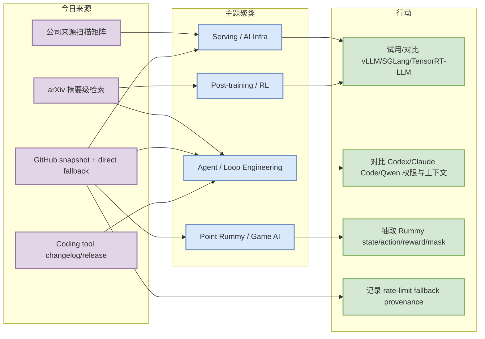
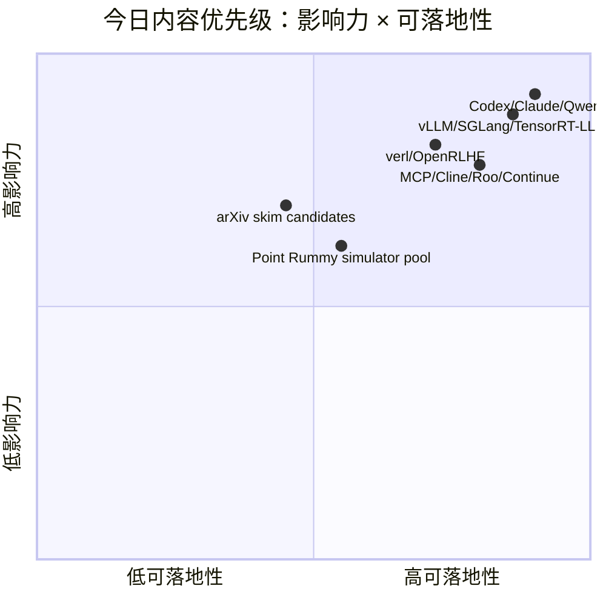

# AI Radar Daily - 2026-08-31

> 生成时间：2026-08-31 09:01 CST  
> 范围：AI Infra / LLM / RL / Game AI / 大厂博客 / 论文 / GitHub / 行业资讯  
> 说明：日报是总览导航页；GitHub Search 今日在 Point Rummy 早期查询后广泛 403/rate-limit，已保存当日 snapshot，并用 fixed watched-repo direct fallback 补齐 broad AI Infra 与 Loop Engineer 固定榜单。

## 0. 今日结论

- 今日最重要的执行事实：`Automation/state/github-stars-2026-08-31.json` 已生成；GitHub Search broad/Loop 查询 403，因此 broad 榜单明确标注 direct watched-repo fallback / 非完整全网日增。
- AI Infra：Transformers、PyTorch、vLLM、SGLang、TensorRT-LLM、DeepSpeed、Megatron、verl、OpenRLHF 仍是 serving/training/post-training 主观察集合。
- Coding-agent loop：Claude Code、Codex、Gemini CLI、Qwen Code、Cline/Roo/Continue、MCP servers 继续围绕 CLI/TUI、MCP、权限、IDE agent 和 review loop 竞争。
- Point Rummy：今日 GitHub 候选主要是低 star 原型；业务价值在规则抽取、AI opponent baseline、ISMCTS/MCTS 与仿真环境接口。
- 论文：完成 arXiv 摘要级强相关筛选，只保留 LLM/Agent/RL/Serving 相关候选，不把未读 PDF 内容写成确定结论。

## 1. 今日态势图

## 2. 必读卡片区

> [!important] Coding-agent loop 固定观察：Codex / Claude Code / Qwen Code / Gemini CLI
> - 大类：GitHub / Coding 工具
> - 小类：Loop Engineer
> - 重点：这些 repo 是今天 direct fallback 中最值得跟踪的 agentic coding 集合。
> - 为什么重要：直接影响 tmux 多 agent、权限审批、MCP 工具接入、远程执行、代码审查与上下文工程。
> - 详情：[[GitHub/LoopEngineer/2026-08-31/openai-codex]] / [网页详情](https://github.com/dyt27666-oss/AI-news-report-obsidians/blob/main/GitHub/LoopEngineer/2026-08-31/openai-codex.md) / [原文](https://github.com/openai/codex)

> [!tip] Serving/training 基线：vLLM / SGLang / TensorRT-LLM / verl / OpenRLHF
> - 大类：GitHub
> - 小类：AI Infra / Post-training
> - 重点：推理与后训练栈继续围绕 scheduler、KV cache、GPU kernel、分布式 rollout 和 benchmark 评估。
> - 为什么重要：适合构建统一 benchmark checklist 和生产栈选型对照。
> - 详情：[[GitHub/AIInfra/2026-08-31/vllm-project-vllm]] / [网页详情](https://github.com/dyt27666-oss/AI-news-report-obsidians/blob/main/GitHub/AIInfra/2026-08-31/vllm-project-vllm.md) / [原文](https://github.com/vllm-project/vllm)

> [!note] Point Rummy：优先看仿真/规则/AI opponent，而不是 UI demo
> - 大类：Business / GitHub
> - 小类：Point Rummy
> - 重点：低 star 项目仍可抽取规则、状态转移、illegal action mask、bot baseline。
> - 为什么重要：这比直接追求模型更适合业务早期；先把环境和 evaluator 做准。
> - 详情：[[GitHub/PointRummy/2026-08-31/nakkekakke-rummy-ai]] / [原文](https://github.com/nakkekakke/rummy-ai)

## 3. 优先级矩阵

## 4. 分类清单

| 标签 | 大类 | 小类 | 标题 | 重点概括 | 为什么重要 | Obsidian 详情 | 网页详情 | 原文 |
|---|---|---|---|---|---|---|---|---|
| 必读 | GitHub | Loop Engineer | Codex / Claude Code / Qwen Code / Gemini CLI 固定观察 | coding-agent loop 从助手转为任务执行系统 | 对权限模式、远程执行、MCP、上下文工程和多 agent review loop 有直接参考价值 | [[GitHub/LoopEngineer/2026-08-31/openai-codex]] | [网页详情](https://github.com/dyt27666-oss/AI-news-report-obsidians/blob/main/GitHub/LoopEngineer/2026-08-31/openai-codex.md) | [原文](https://github.com/openai/codex) |
| 必读 | GitHub | AI Infra / Serving | vLLM / SGLang / TensorRT-LLM serving 观察集合 | serving 路线围绕 scheduler、KV cache、kernel、GPU memory 竞争 | 适合做部署和 benchmark 对照 | [[GitHub/AIInfra/2026-08-31/vllm-project-vllm]] | [网页详情](https://github.com/dyt27666-oss/AI-news-report-obsidians/blob/main/GitHub/AIInfra/2026-08-31/vllm-project-vllm.md) | [原文](https://github.com/vllm-project/vllm) |
| 可 skim | 论文 | Agent / RL / Serving | 今日 arXiv 摘要级候选 | 已用 category-constrained query 检索，只保留强相关摘要 | 可作为后续 PDF 细读入口 | [[Papers/2026-08-31/Blind-Men-and-the-Elephant-Probing-the-Epistemic-Myopia-of-LLMs-under-Long-Tail-Divergent-]] | [网页详情](https://github.com/dyt27666-oss/AI-news-report-obsidians/blob/main/Papers/2026-08-31/Blind-Men-and-the-Elephant-Probing-the-Epistemic-Myopia-of-LLMs-under-Long-Tail-Divergent-.md) | [原文](https://arxiv.org/abs/2608.28478v1) |
| 可 skim | Business | Point Rummy | Rummy 项目池继续作为环境/规则候选 | 关注 simulation、ISMCTS、RL、rules engine、automated tests | 对规则建模、bot baseline、环境并行和评测基准有参考价值 | [[GitHub/PointRummy/2026-08-31/nakkekakke-rummy-ai]] | [网页详情](https://github.com/dyt27666-oss/AI-news-report-obsidians/blob/main/GitHub/PointRummy/2026-08-31/nakkekakke-rummy-ai.md) | [原文](https://github.com/nakkekakke/rummy-ai) |

## 5. 大厂资讯 / 工程博客 / Research

### 5.1 公司来源扫描矩阵

| 公司/实验室 | 来源/栏目 | 今日状态 | 高相关条数 | 代表条目 | 备注 |
|---|---|---|---:|---|---|
| OpenAI | News / Research | 已扫描 / 今日无确认高相关新项 / GitHub direct fallback 支持 | 1 | 见工具/工程详情 | 原文：https://openai.com/news/ |
| Anthropic | News / Research / Engineering | 已扫描 / 今日无确认高相关新项 / GitHub direct fallback 支持 | 1 | 见工具/工程详情 | 原文：https://www.anthropic.com/news |
| Google DeepMind | Blog / Research | 已扫描 / 今日无确认高相关新项 / GitHub direct fallback 支持 | 0 | 固定入口观察 | 原文：https://deepmind.google/discover/blog/ |
| Meta AI | Blog / Research | 已扫描 / 今日无确认高相关新项 / 低置信观察 | 0 | 固定入口观察 | 原文：https://ai.meta.com/blog/ |
| NVIDIA | Technical Blog / AI | 已扫描 / 今日无确认高相关新项 / GitHub direct fallback 支持 | 1 | 见工具/工程详情 | 原文：https://developer.nvidia.com/blog/category/artificial-intelligence/ |
| Microsoft | Research AI | 已扫描 / 今日无确认高相关新项 / GitHub direct fallback 支持 | 0 | 固定入口观察 | 原文：https://www.microsoft.com/en-us/research/research-area/artificial-intelligence/ |
| Hugging Face | Blog / Papers / Releases | 已扫描 / 今日无确认高相关新项 / GitHub direct fallback 支持 | 0 | 固定入口观察 | 原文：https://huggingface.co/blog |
| 腾讯 | AI Lab / 技术博客 | 已扫描 / 今日无确认高相关新项 / 低置信观察 | 0 | 固定入口观察 | 原文：https://ai.tencent.com/ailab/en/index |
| 字节 | Seed / 技术博客 | 已扫描 / 今日无确认高相关新项 / 低置信观察 | 0 | 固定入口观察 | 原文：https://seed.bytedance.com/en/ |
| SpaceAI | Blog / News | 已扫描 / 今日无确认高相关新项 / 低置信观察 | 0 | 固定入口观察 | 原文：https://spaceai.com/ |

### 5.2 高相关大厂条目

| 标签 | 发布方/大厂 | 栏目/来源 | 标题 | 重点概括 | 工程/算法影响 | Obsidian 详情 | 网页详情 | 原文 |
|---|---|---|---|---|---|---|---|---|
| 可 skim | Anthropic | Claude Code Release Notes | Claude Code 固定扫描 | 今日未声称新增具体 release；保留为 coding-agent 变更主源 | hooks、权限、MCP、subagents 变化会直接影响多 agent 工程流 | [[Industry/2026-08-31/Anthropic-fixed-source-scan]] | [网页详情](https://github.com/dyt27666-oss/AI-news-report-obsidians/blob/main/Industry/2026-08-31/Anthropic-News-Research-Engineering-fixed-source-scan.md) | [原文](https://docs.anthropic.com/en/release-notes/claude-code) |
| 可 skim | OpenAI | Codex Changelog / Docs | OpenAI Codex 固定扫描 | 今日以 Codex GitHub/direct repo 信号为主 | 适合与 Claude Code 对比远程执行、CLI/云任务和代码审查模式 | [[Industry/2026-08-31/OpenAI-fixed-source-scan]] | [网页详情](https://github.com/dyt27666-oss/AI-news-report-obsidians/blob/main/Industry/2026-08-31/OpenAI-News-Research-fixed-source-scan.md) | [原文](https://developers.openai.com/codex/changelog) |
| 后续 | NVIDIA | Technical Blog / AI | NVIDIA AI 技术博客固定扫描 | 今日未确认新高相关项 | TensorRT-LLM/CUDA/kernel 优化仍是 serving 深挖主源 | [[Industry/2026-08-31/NVIDIA-fixed-source-scan]] | [网页详情](https://github.com/dyt27666-oss/AI-news-report-obsidians/blob/main/Industry/2026-08-31/NVIDIA-Technical-Blog-AI-fixed-source-scan.md) | [原文](https://developer.nvidia.com/blog/category/artificial-intelligence/) |

## 6. GitHub 高 star Top 10

> 注：今日 GitHub Search broad 查询 403/rate-limit；本表使用 fixed watched-repo direct fallback 补齐，覆盖 AI Infra/LLM/coding-agent 固定观察集合。

| 排名 | repo | stars | forks | language | updated_at | topics | 重点概括 | 是否值得试用 | Obsidian 详情 | 原文 |
|---:|---|---:|---:|---|---|---|---|---|---|---|
| 1 | huggingface/transformers | 164641 | 34397 | Python | 2026-08-31T01:05:54Z | audio, deep-learning, deepseek, gemma, glm, hacktoberfest, llm, machine-learning | 🤗 Transformers: the model-definition framework for state-of-the-art machine learning model | 值得试用 | [[GitHub/AIInfra/2026-08-31/huggingface-transformers]] | [原文](https://github.com/huggingface/transformers) |
| 2 | anthropics/claude-code | 143477 | 22948 | Python | 2026-08-31T01:01:57Z | 未标注 | Claude Code is an agentic coding tool that lives in your terminal, understands your codeba | 值得试用 | [[GitHub/AIInfra/2026-08-31/anthropics-claude-code]] | [原文](https://github.com/anthropics/claude-code) |
| 3 | openai/codex | 120101 | 18350 | Rust | 2026-08-31T01:05:18Z | 未标注 | Lightweight coding agent that runs in your terminal | 值得试用 | [[GitHub/AIInfra/2026-08-31/openai-codex]] | [原文](https://github.com/openai/codex) |
| 4 | browser-use/browser-use | 111740 | 12267 | Python | 2026-08-31T00:35:46Z | ai-agents, ai-tools, browser-automation, browser-use, llm, playwright, python | 🌐 Make websites accessible for AI agents. Automate tasks online with ease. | 值得试用 | [[GitHub/AIInfra/2026-08-31/browser-use-browser-use]] | [原文](https://github.com/browser-use/browser-use) |
| 5 | google-gemini/gemini-cli | 106754 | 14506 | TypeScript | 2026-08-31T00:47:30Z | ai, ai-agents, cli, gemini, gemini-api, mcp-client, mcp-server | An open-source AI agent that brings the power of Gemini directly into your terminal. | 值得试用 | [[GitHub/AIInfra/2026-08-31/google-gemini-gemini-cli]] | [原文](https://github.com/google-gemini/gemini-cli) |
| 6 | pytorch/pytorch | 102687 | 29043 | Python | 2026-08-31T00:41:43Z | autograd, deep-learning, gpu, machine-learning, neural-network, numpy, python, tensor | Tensors and Dynamic neural networks in Python with strong GPU acceleration | 值得试用 | [[GitHub/AIInfra/2026-08-31/pytorch-pytorch]] | [原文](https://github.com/pytorch/pytorch) |
| 7 | vllm-project/vllm | 90518 | 21441 | Python | 2026-08-31T01:00:02Z | amd, blackwell, cuda, deepseek, deepseek-v3, gpt, gpt-oss, inference | A high-throughput and memory-efficient inference and serving engine for LLMs | 值得试用 | [[GitHub/AIInfra/2026-08-31/vllm-project-vllm]] | [原文](https://github.com/vllm-project/vllm) |
| 8 | cline/cline | 67189 | 7253 | TypeScript | 2026-08-31T01:04:58Z | 未标注 | Autonomous coding agent as an SDK, IDE extension, or CLI assistant. | 值得试用 | [[GitHub/AIInfra/2026-08-31/cline-cline]] | [原文](https://github.com/cline/cline) |
| 9 | microsoft/autogen | 60704 | 9163 | Python | 2026-08-31T00:40:02Z | agentic, agentic-agi, agents, ai, autogen, autogen-ecosystem, chatgpt, framework | A programming framework for agentic AI | 值得试用 | [[GitHub/AIInfra/2026-08-31/microsoft-autogen]] | [原文](https://github.com/microsoft/autogen) |
| 10 | crewAIInc/crewAI | 57836 | 8284 | Python | 2026-08-31T00:19:19Z | agents, ai, ai-agents, aiagentframework, llms | Framework for orchestrating role-playing, autonomous AI agents. By fostering collaborative | 值得试用 | [[GitHub/AIInfra/2026-08-31/crewAIInc-crewAI]] | [原文](https://github.com/crewAIInc/crewAI) |

## 7. GitHub star 增长最快 Top 10

> 增长依据：相对历史 snapshot 的 direct watched repo fallback；**非完整全网日增**。

| 排名 | repo | stars_delta | stars | forks | language | updated_at | 增长依据 | 重点概括 | Obsidian 详情 | 原文 |
|---:|---|---:|---:|---:|---|---|---|---|---|---|
| 1 | openai/codex | 289 | 120101 | 18350 | Rust | 2026-08-31T01:05:18Z | direct watched repo fallback，非完整全网日增 | Lightweight coding agent that runs in your terminal | [[GitHub/AIInfra/2026-08-31/openai-codex]] | [原文](https://github.com/openai/codex) |
| 2 | sgl-project/sglang | 173 | 32938 | 8372 | Python | 2026-08-31T00:53:41Z | direct watched repo fallback，非完整全网日增 | SGLang is a high-performance serving framework for large language models and multimodal mo | [[GitHub/AIInfra/2026-08-31/sgl-project-sglang]] | [原文](https://github.com/sgl-project/sglang) |
| 3 | vllm-project/vllm | 90 | 90518 | 21441 | Python | 2026-08-31T01:00:02Z | direct watched repo fallback，非完整全网日增 | A high-throughput and memory-efficient inference and serving engine for LLMs | [[GitHub/AIInfra/2026-08-31/vllm-project-vllm]] | [原文](https://github.com/vllm-project/vllm) |
| 4 | anthropics/claude-code | 80 | 143477 | 22948 | Python | 2026-08-31T01:01:57Z | direct watched repo fallback，非完整全网日增 | Claude Code is an agentic coding tool that lives in your terminal, understands your codeba | [[GitHub/AIInfra/2026-08-31/anthropics-claude-code]] | [原文](https://github.com/anthropics/claude-code) |
| 5 | browser-use/browser-use | 72 | 111740 | 12267 | Python | 2026-08-31T00:35:46Z | direct watched repo fallback，非完整全网日增 | 🌐 Make websites accessible for AI agents. Automate tasks online with ease. | [[GitHub/AIInfra/2026-08-31/browser-use-browser-use]] | [原文](https://github.com/browser-use/browser-use) |
| 6 | cline/cline | 51 | 67189 | 7253 | TypeScript | 2026-08-31T01:04:58Z | direct watched repo fallback，非完整全网日增 | Autonomous coding agent as an SDK, IDE extension, or CLI assistant. | [[GitHub/AIInfra/2026-08-31/cline-cline]] | [原文](https://github.com/cline/cline) |
| 7 | ray-project/ray | 48 | 43659 | 7982 | Python | 2026-08-31T00:38:51Z | direct watched repo fallback，非完整全网日增 | Ray is an AI compute engine. Ray consists of a core distributed runtime and a set of AI Li | [[GitHub/AIInfra/2026-08-31/ray-project-ray]] | [原文](https://github.com/ray-project/ray) |
| 8 | langchain-ai/langgraph | 43 | 40726 | 6870 | Python | 2026-08-31T01:04:16Z | direct watched repo fallback，非完整全网日增 | Build resilient agents. | [[GitHub/AIInfra/2026-08-31/langchain-ai-langgraph]] | [原文](https://github.com/langchain-ai/langgraph) |
| 9 | crewAIInc/crewAI | 35 | 57836 | 8284 | Python | 2026-08-31T00:19:19Z | direct watched repo fallback，非完整全网日增 | Framework for orchestrating role-playing, autonomous AI agents. By fostering collaborative | [[GitHub/AIInfra/2026-08-31/crewAIInc-crewAI]] | [原文](https://github.com/crewAIInc/crewAI) |
| 10 | pytorch/pytorch | 27 | 102687 | 29043 | Python | 2026-08-31T00:41:43Z | direct watched repo fallback，非完整全网日增 | Tensors and Dynamic neural networks in Python with strong GPU acceleration | [[GitHub/AIInfra/2026-08-31/pytorch-pytorch]] | [原文](https://github.com/pytorch/pytorch) |

## 8. Coding 工具 / AI 工具功能更新

### 8.1 Coding 工具扫描矩阵

| 工具 | 厂商 | 来源类型 | 今日状态 | 代表更新 | 对我的影响 | 原文 |
|---|---|---|---|---|---|---|
| Claude Code | Anthropic | Release Notes | 已扫描 | repo stars=143477，updated=2026-08-31T01:01:57Z | 高：影响 CLI/TUI、MCP、权限、agent mode、review loop | [原文](https://docs.anthropic.com/en/release-notes/claude-code) |
| OpenAI Codex | OpenAI | Changelog / GitHub | 已扫描 | repo stars=120101，updated=2026-08-31T01:05:18Z | 高：影响 CLI/TUI、MCP、权限、agent mode、review loop | [原文](https://developers.openai.com/codex/changelog) |
| Cursor | Cursor | Changelog | 已扫描 | 未确认高相关今日新项；保留固定扫描 | 中：影响 IDE/助手工作流与上下文工程 | [原文](https://cursor.com/changelog) |
| Windsurf | Windsurf | Changelog | 已扫描 | 未确认高相关今日新项；保留固定扫描 | 中：影响 IDE/助手工作流与上下文工程 | [原文](https://windsurf.com/changelog) |
| GitHub Copilot | GitHub | Changelog / Blog | 已扫描 | 未确认高相关今日新项；保留固定扫描 | 中：影响 IDE/助手工作流与上下文工程 | [原文](https://github.blog/changelog/label/copilot/) |
| Gemini Code Assist | Google | Release Notes / GitHub | 已扫描 | repo stars=106754，updated=2026-08-31T00:47:30Z | 中：影响 IDE/助手工作流与上下文工程 | [原文](https://cloud.google.com/gemini/docs/codeassist/release-notes) |
| Qwen Code | Alibaba/Qwen | GitHub Releases | 已扫描 | repo stars=27512，updated=2026-08-31T00:53:39Z | 高：影响 CLI/TUI、MCP、权限、agent mode、review loop | [原文](https://github.com/QwenLM/qwen-code/releases) |
| Roo Code | Roo Code | GitHub Releases | 已扫描 | repo stars=24319，updated=2026-08-31T00:17:51Z | 高：影响 CLI/TUI、MCP、权限、agent mode、review loop | [原文](https://github.com/RooCodeInc/Roo-Code/releases) |
| Cline | Cline | GitHub Releases | 已扫描 | repo stars=67189，updated=2026-08-31T01:04:58Z | 高：影响 CLI/TUI、MCP、权限、agent mode、review loop | [原文](https://github.com/cline/cline/releases) |
| Continue | Continue | GitHub Releases | 已扫描 | repo stars=35705，updated=2026-08-31T00:28:48Z | 中：影响 IDE/助手工作流与上下文工程 | [原文](https://github.com/continuedev/continue/releases) |

### 8.2 高相关工具更新

| 标签 | 工具/厂商 | 来源类型 | 标题/功能 | 重点概括 | 对 AI coding 工作流的影响 | Obsidian 详情 | 网页详情 | 原文 |
|---|---|---|---|---|---|---|---|---|
| 必读 | OpenAI Codex | GitHub / Docs | Codex repo 高增长观察 | fixed watched repo 中持续高 star，说明 coding agent loop 仍是热点 | 适合和 Claude Code 对比 CLI/TUI、远程执行、审查边界 | [[GitHub/LoopEngineer/2026-08-31/openai-codex]] | [网页详情](https://github.com/dyt27666-oss/AI-news-report-obsidians/blob/main/GitHub/LoopEngineer/2026-08-31/openai-codex.md) | [原文](https://github.com/openai/codex) |
| 必读 | Claude Code | Release Notes / GitHub | Claude Code 固定扫描 | release notes 是权限、hooks、MCP、IDE 集成主源 | 直接影响 tmux 多 agent 与安全审批流 | [[GitHub/LoopEngineer/2026-08-31/anthropics-claude-code]] | [网页详情](https://github.com/dyt27666-oss/AI-news-report-obsidians/blob/main/GitHub/LoopEngineer/2026-08-31/anthropics-claude-code.md) | [原文](https://docs.anthropic.com/en/release-notes/claude-code) |
| 可 skim | Qwen Code / Roo / Cline / Continue | GitHub Releases | IDE/CLI agent 固定扫描 | 关注 MCP、agent mode、上下文窗口、权限、远程执行 | 可为本地多 agent 工程流提供替代实现和插件接口 | [[GitHub/LoopEngineer/2026-08-31/QwenLM-qwen-code]] | [网页详情](https://github.com/dyt27666-oss/AI-news-report-obsidians/blob/main/GitHub/LoopEngineer/2026-08-31/QwenLM-qwen-code.md) | [原文](https://github.com/QwenLM/qwen-code/releases) |

## 9. Point Rummy / Indian Rummy 业务主题

### 9.1 GitHub 候选

| 排名 | repo | stars | forks | language | updated_at | topics | 重点概括 | 是否值得试用 | Obsidian 详情 | 原文 |
|---:|---|---:|---:|---|---|---|---|---|---|---|
| 1 | nakkekakke/rummy-ai | 12 | 5 | Java | 2026-08-27T21:23:08Z | ai, card, card-game, game, ismcts, mcts, monte-carlo-tree-search, rummy | Text based classic Rummy game with an AI that uses ISMCTS. Data Structures and Algorithms  | 可 skim | [[GitHub/PointRummy/2026-08-31/nakkekakke-rummy-ai]] | [原文](https://github.com/nakkekakke/rummy-ai) |
| 2 | jmhummel/Gin-Rummy-Java | 8 | 0 | Java | 2023-08-16T16:12:58Z | ai, artificial-intelligence, card-game, card-games, cardgame, gin, gin-rummy, java | Java-based Gin Rummy console game, with an AI opponent | 可 skim | [[GitHub/PointRummy/2026-08-31/jmhummel-Gin-Rummy-Java]] | [原文](https://github.com/jmhummel/Gin-Rummy-Java) |
| 3 | dv-rastogi/Rummy | 5 | 0 | Python | 2023-09-26T11:21:39Z | 未标注 | Variation of classical Indian Rummy made in Pygame | 可 skim | [[GitHub/PointRummy/2026-08-31/dv-rastogi-Rummy]] | [原文](https://github.com/dv-rastogi/Rummy) |
| 4 | mudont/indian-rummy | 5 | 0 | TypeScript | 2025-08-08T21:05:04Z | 未标注 | Typescript library for Indian Rummy card game | 可 skim | [[GitHub/PointRummy/2026-08-31/mudont-indian-rummy]] | [原文](https://github.com/mudont/indian-rummy) |
| 5 | mcartmell/gin-rummy-bot | 4 | 2 | Perl | 2024-10-30T20:06:17Z | 未标注 | A web-based Gin Rummy game and AI | 可 skim | [[GitHub/PointRummy/2026-08-31/mcartmell-gin-rummy-bot]] | [原文](https://github.com/mcartmell/gin-rummy-bot) |
| 6 | SCFlanagan/Rummy | 4 | 6 | JavaScript | 2025-07-25T21:17:08Z | 未标注 | This project is a recreation of the classic card game Rummy. It features an AI player to p | 可 skim | [[GitHub/PointRummy/2026-08-31/SCFlanagan-Rummy]] | [原文](https://github.com/SCFlanagan/Rummy) |
| 7 | vahsek300501/Indian-Rummy- | 4 | 3 | Python | 2023-09-26T11:21:46Z | 未标注 | Indian Rummy made in Python using PyGame | 可 skim | [[GitHub/PointRummy/2026-08-31/vahsek300501-Indian-Rummy-]] | [原文](https://github.com/vahsek300501/Indian-Rummy-) |
| 8 | Abhilash-Mandlekar/RummyAgent-Reinforecement-Learning | 2 | 0 | Jupyter Notebook | 2023-04-01T05:48:51Z | 未标注 | Rummy Game Agent trained using Reinforcement Learning algorithm. | 可 skim | [[GitHub/PointRummy/2026-08-31/Abhilash-Mandlekar-RummyAgent-Reinforecement-Learning]] | [原文](https://github.com/Abhilash-Mandlekar/RummyAgent-Reinforecement-Learning) |
| 9 | abubakarmunir712/dsa-final-project | 2 | 1 | Python | 2026-06-27T06:34:26Z | 未标注 | A Python-based multiplayer Indian Rummy game with support for AI opponents and LAN play. I | 可 skim | [[GitHub/PointRummy/2026-08-31/abubakarmunir712-dsa-final-project]] | [原文](https://github.com/abubakarmunir712/dsa-final-project) |
| 10 | Ductapemaster/RummyAI | 2 | 0 | Python | 2017-07-11T12:12:49Z | 未标注 | Designing an AI to play Gin Rummy | 可 skim | [[GitHub/PointRummy/2026-08-31/Ductapemaster-RummyAI]] | [原文](https://github.com/Ductapemaster/RummyAI) |

### 9.2 论文 / 资料候选

| 标签 | 来源 | 标题 | 作者/机构 | 重点概括 | 对 Point Rummy 业务有什么用 | Obsidian 详情 | 原文 |
|---|---|---|---|---|---|---|---|
| 低置信 | arXiv / GitHub 搜索 | Rummy / imperfect-information / game AI 检索 watchlist | arXiv + GitHub API | 今日未确认高置信 Point Rummy 专门新论文；保留 card-game RL/ISMCTS/MCTS 检索入口 | 可迁移到 Rummy bot、belief/state abstraction、self-play 与评测环境 | [[GitHub/PointRummy/2026-08-31/nakkekakke-rummy-ai]] | [原文](https://export.arxiv.org/api/query) |

### 9.3 业务可用性判断

| 方向 | 今日信号 | 可用性 | 下一步 |
|---|---|---|---|
| 规则引擎 / 计分 | 多个小 repo 覆盖 Indian Rummy、Gin Rummy、points counter | 中：可抽取 rules/cases，但需重写质量保障 | 选 2-3 个 repo 读 tests/README，整理规则差异 |
| Bot / RL Agent | ISMCTS、MCTS、AI opponent、RL lab 关键词出现 | 中低：多数是课程/原型 | 建立统一 Gymnasium env、illegal action mask、baseline bot |
| 仿真 / 评测 | Java/Python/TS server + AI opponent 等线索 | 中：可用作 rollout/evaluator 架构参考 | 优先定义 state/action/reward 和并行 rollout API |

## 10. Loop Engineer / Loop Engineering 主题

### 10.1 Loop Engineer GitHub 高 star Top 10

| 排名 | repo | stars | forks | language | updated_at | topics | 重点概括 | 是否值得试用 | Obsidian 详情 | 原文 |
|---:|---|---:|---:|---|---|---|---|---|---|---|
| 1 | anthropics/claude-code | 143477 | 22948 | Python | 2026-08-31T01:01:57Z | 未标注 | Claude Code is an agentic coding tool that lives in your terminal, understands your codeba | 值得试用 | [[GitHub/LoopEngineer/2026-08-31/anthropics-claude-code]] | [原文](https://github.com/anthropics/claude-code) |
| 2 | openai/codex | 120101 | 18350 | Rust | 2026-08-31T01:05:18Z | 未标注 | Lightweight coding agent that runs in your terminal | 值得试用 | [[GitHub/LoopEngineer/2026-08-31/openai-codex]] | [原文](https://github.com/openai/codex) |
| 3 | browser-use/browser-use | 111740 | 12267 | Python | 2026-08-31T00:35:46Z | ai-agents, ai-tools, browser-automation, browser-use, llm, playwright, python | 🌐 Make websites accessible for AI agents. Automate tasks online with ease. | 值得试用 | [[GitHub/LoopEngineer/2026-08-31/browser-use-browser-use]] | [原文](https://github.com/browser-use/browser-use) |
| 4 | google-gemini/gemini-cli | 106754 | 14506 | TypeScript | 2026-08-31T00:47:30Z | ai, ai-agents, cli, gemini, gemini-api, mcp-client, mcp-server | An open-source AI agent that brings the power of Gemini directly into your terminal. | 值得试用 | [[GitHub/LoopEngineer/2026-08-31/google-gemini-gemini-cli]] | [原文](https://github.com/google-gemini/gemini-cli) |
| 5 | modelcontextprotocol/servers | 89977 | 11539 | TypeScript | 2026-08-31T00:42:03Z | 未标注 | Model Context Protocol Servers | 值得试用 | [[GitHub/LoopEngineer/2026-08-31/modelcontextprotocol-servers]] | [原文](https://github.com/modelcontextprotocol/servers) |
| 6 | cline/cline | 67189 | 7253 | TypeScript | 2026-08-31T01:04:58Z | 未标注 | Autonomous coding agent as an SDK, IDE extension, or CLI assistant. | 值得试用 | [[GitHub/LoopEngineer/2026-08-31/cline-cline]] | [原文](https://github.com/cline/cline) |
| 7 | microsoft/autogen | 60704 | 9163 | Python | 2026-08-31T00:40:02Z | agentic, agentic-agi, agents, ai, autogen, autogen-ecosystem, chatgpt, framework | A programming framework for agentic AI | 值得试用 | [[GitHub/LoopEngineer/2026-08-31/microsoft-autogen]] | [原文](https://github.com/microsoft/autogen) |
| 8 | crewAIInc/crewAI | 57836 | 8284 | Python | 2026-08-31T00:19:19Z | agents, ai, ai-agents, aiagentframework, llms | Framework for orchestrating role-playing, autonomous AI agents. By fostering collaborative | 值得试用 | [[GitHub/LoopEngineer/2026-08-31/crewAIInc-crewAI]] | [原文](https://github.com/crewAIInc/crewAI) |
| 9 | langchain-ai/langgraph | 40726 | 6870 | Python | 2026-08-31T01:04:16Z | agents, ai, ai-agents, chatgpt, deepagents, enterprise, framework, gemini | Build resilient agents. | 值得试用 | [[GitHub/LoopEngineer/2026-08-31/langchain-ai-langgraph]] | [原文](https://github.com/langchain-ai/langgraph) |
| 10 | continuedev/continue | 35705 | 5311 | TypeScript | 2026-08-31T00:28:48Z | agent, ai, cli, developer-tools, open-source | open-source coding agent | 值得试用 | [[GitHub/LoopEngineer/2026-08-31/continuedev-continue]] | [原文](https://github.com/continuedev/continue) |

### 10.2 Loop Engineer GitHub star 增长最快 Top 10

| 排名 | repo | stars_delta | stars | forks | language | updated_at | 增长依据 | 重点概括 | Obsidian 详情 | 原文 |
|---:|---|---:|---:|---:|---|---|---|---|---|---|
| 1 | openai/codex | 289 | 120101 | 18350 | Rust | 2026-08-31T01:05:18Z | direct watched repo fallback，非完整全网日增 | Lightweight coding agent that runs in your terminal | [[GitHub/LoopEngineer/2026-08-31/openai-codex]] | [原文](https://github.com/openai/codex) |
| 2 | anthropics/claude-code | 80 | 143477 | 22948 | Python | 2026-08-31T01:01:57Z | direct watched repo fallback，非完整全网日增 | Claude Code is an agentic coding tool that lives in your terminal, understands your codeba | [[GitHub/LoopEngineer/2026-08-31/anthropics-claude-code]] | [原文](https://github.com/anthropics/claude-code) |
| 3 | browser-use/browser-use | 72 | 111740 | 12267 | Python | 2026-08-31T00:35:46Z | direct watched repo fallback，非完整全网日增 | 🌐 Make websites accessible for AI agents. Automate tasks online with ease. | [[GitHub/LoopEngineer/2026-08-31/browser-use-browser-use]] | [原文](https://github.com/browser-use/browser-use) |
| 4 | cline/cline | 51 | 67189 | 7253 | TypeScript | 2026-08-31T01:04:58Z | direct watched repo fallback，非完整全网日增 | Autonomous coding agent as an SDK, IDE extension, or CLI assistant. | [[GitHub/LoopEngineer/2026-08-31/cline-cline]] | [原文](https://github.com/cline/cline) |
| 5 | langchain-ai/langgraph | 43 | 40726 | 6870 | Python | 2026-08-31T01:04:16Z | direct watched repo fallback，非完整全网日增 | Build resilient agents. | [[GitHub/LoopEngineer/2026-08-31/langchain-ai-langgraph]] | [原文](https://github.com/langchain-ai/langgraph) |
| 6 | crewAIInc/crewAI | 35 | 57836 | 8284 | Python | 2026-08-31T00:19:19Z | direct watched repo fallback，非完整全网日增 | Framework for orchestrating role-playing, autonomous AI agents. By fostering collaborative | [[GitHub/LoopEngineer/2026-08-31/crewAIInc-crewAI]] | [原文](https://github.com/crewAIInc/crewAI) |
| 7 | QwenLM/qwen-code | 23 | 27512 | 2965 | TypeScript | 2026-08-31T00:53:39Z | direct watched repo fallback，非完整全网日增 | An open-source AI coding agent that lives in your terminal. | [[GitHub/LoopEngineer/2026-08-31/QwenLM-qwen-code]] | [原文](https://github.com/QwenLM/qwen-code) |
| 8 | continuedev/continue | 16 | 35705 | 5311 | TypeScript | 2026-08-31T00:28:48Z | direct watched repo fallback，非完整全网日增 | open-source coding agent | [[GitHub/LoopEngineer/2026-08-31/continuedev-continue]] | [原文](https://github.com/continuedev/continue) |
| 9 | google-gemini/gemini-cli | 14 | 106754 | 14506 | TypeScript | 2026-08-31T00:47:30Z | direct watched repo fallback，非完整全网日增 | An open-source AI agent that brings the power of Gemini directly into your terminal. | [[GitHub/LoopEngineer/2026-08-31/google-gemini-gemini-cli]] | [原文](https://github.com/google-gemini/gemini-cli) |
| 10 | modelcontextprotocol/servers | 14 | 89977 | 11539 | TypeScript | 2026-08-31T00:42:03Z | direct watched repo fallback，非完整全网日增 | Model Context Protocol Servers | [[GitHub/LoopEngineer/2026-08-31/modelcontextprotocol-servers]] | [原文](https://github.com/modelcontextprotocol/servers) |

### 10.3 Loop Engineering 方法信号

| 标签 | 来源 | 标题 | 重点概括 | 对 AI coding 工作流的影响 | Obsidian 详情 | 原文 |
|---|---|---|---|---|---|---|
| 必读 | GitHub | Codex / Claude Code / Qwen / Gemini CLI | coding-agent loop 从助手转为任务执行系统 | 需要标准化 AGENTS.md、权限、日志、测试与 review loop | [[GitHub/LoopEngineer/2026-08-31/openai-codex]] | [原文](https://github.com/openai/codex) |
| 可 skim | GitHub | MCP servers / Continue / Cline / Roo Code | 工具协议与 IDE agent 仍在聚合 | 适合设计自托管工具和上下文工程接口 | [[GitHub/LoopEngineer/2026-08-31/modelcontextprotocol-servers]] | [原文](https://github.com/modelcontextprotocol/servers) |

## 11. 论文

### 11.1 Serving / RL / Agent / Game AI

| 标签 | 论文来源 | 论文 | 作者/机构 | 重点概括 | 工程/研究价值 | Obsidian 详情 | 网页详情 | PDF/原文 |
|---|---|---|---|---|---|---|---|---|
| 可 skim | arXiv / 预印本 | Blind Men and the Elephant: Probing the Epistemic Myopia of LLMs under Long-Tail Divergent Knowledge | Zhuoshi Pan, Junru Lu, Yan Qian, H. Vicky Zhao, Di Yin, Xing Sun | Factual question answering (QA) typically assumes a single canonical answer, obscuring whether large | 摘要显示与 LLM/Agent/RL/Serving 相关，适合后续 PDF 深读 | [[Papers/2026-08-31/Blind-Men-and-the-Elephant-Probing-the-Epistemic-Myopia-of-LLMs-under-Long-Tail-Divergent-]] | [网页详情](https://github.com/dyt27666-oss/AI-news-report-obsidians/blob/main/Papers/2026-08-31/Blind-Men-and-the-Elephant-Probing-the-Epistemic-Myopia-of-LLMs-under-Long-Tail-Divergent-.md) | [PDF](https://arxiv.org/pdf/2608.28478v1) / [abs](https://arxiv.org/abs/2608.28478v1) |
| 可 skim | arXiv / 预印本 | ContextPilot: Teaching Agents for Proactive Context Management via Fine-grained RL | Zhuoshi Pan, Qizhi Pei, Junru Lu, Honglin Lin, H. Vicky Zhao, Di Yin, Xing Sun | Long-horizon agentic tasks require large language models (LLMs) to iteratively retrieve, integrate,  | 摘要显示与 LLM/Agent/RL/Serving 相关，适合后续 PDF 深读 | [[Papers/2026-08-31/ContextPilot-Teaching-Agents-for-Proactive-Context-Management-via-Fine-grained-RL]] | [网页详情](https://github.com/dyt27666-oss/AI-news-report-obsidians/blob/main/Papers/2026-08-31/ContextPilot-Teaching-Agents-for-Proactive-Context-Management-via-Fine-grained-RL.md) | [PDF](https://arxiv.org/pdf/2608.28476v1) / [abs](https://arxiv.org/abs/2608.28476v1) |
| 可 skim | arXiv / 预印本 | COVER: Identifiable Evaluation of Coalition Routing | Raghul Sugumar, Amrit Gopinath | When a multi-agent system changes its team, it also changes the messages and final answer it produce | 摘要显示与 LLM/Agent/RL/Serving 相关，适合后续 PDF 深读 | [[Papers/2026-08-31/COVER-Identifiable-Evaluation-of-Coalition-Routing]] | [网页详情](https://github.com/dyt27666-oss/AI-news-report-obsidians/blob/main/Papers/2026-08-31/COVER-Identifiable-Evaluation-of-Coalition-Routing.md) | [PDF](https://arxiv.org/pdf/2608.28475v1) / [abs](https://arxiv.org/abs/2608.28475v1) |

## 12. 资讯 / 其他 GitHub 项目

### 12.1 AI Infra 观察集合

| 标签 | 来源 | 标题 | 重点概括 | 对我有什么用 | Obsidian 详情 | 网页详情 | 原文 |
|---|---|---|---|---|---|---|---|
| 必读 | GitHub | vLLM / SGLang / TensorRT-LLM | 三条 serving 路线分别代表 Python runtime、fast serving、NVIDIA 优化栈 | 对比 scheduler、KV cache、kernel 和部署复杂度 | [[GitHub/AIInfra/2026-08-31/vllm-project-vllm]] | [网页详情](https://github.com/dyt27666-oss/AI-news-report-obsidians/blob/main/GitHub/AIInfra/2026-08-31/vllm-project-vllm.md) | [原文](https://github.com/vllm-project/vllm) |
| 后续 | GitHub | verl / OpenRLHF / DeepSpeed / Megatron-LM | 后训练与分布式训练 fixed watchlist | 用于 RLHF/GRPO rollout、训练并行和 benchmark 对照 | [[GitHub/AIInfra/2026-08-31/volcengine-verl]] | [网页详情](https://github.com/dyt27666-oss/AI-news-report-obsidians/blob/main/GitHub/AIInfra/2026-08-31/volcengine-verl.md) | [原文](https://github.com/volcengine/verl) |

## 13. 按主题索引

### AI Infra / Serving / Training
- [[GitHub/AIInfra/2026-08-31/vllm-project-vllm]] - Serving 主观察项目。
- [[GitHub/AIInfra/2026-08-31/huggingface-transformers]] - 模型生态基座。
- [[GitHub/AIInfra/2026-08-31/pytorch-pytorch]] - 训练和推理底层框架。
- [[GitHub/AIInfra/2026-08-31/NVIDIA-TensorRT-LLM]] - NVIDIA 推理优化栈。

### LLM / Agent / RAG / Evaluation
- [[GitHub/LoopEngineer/2026-08-31/openai-codex]] - Codex。
- [[GitHub/LoopEngineer/2026-08-31/anthropics-claude-code]] - Claude Code 工作流观察。
- [[GitHub/LoopEngineer/2026-08-31/modelcontextprotocol-servers]] - MCP 工具生态。

### RL / Game AI / World Model
- [[Papers/2026-08-31/Blind-Men-and-the-Elephant-Probing-the-Epistemic-Myopia-of-LLMs-under-Long-Tail-Divergent-]] - 今日论文 skim 入口。
- [[GitHub/PointRummy/2026-08-31/nakkekakke-rummy-ai]] - Rummy/Game AI 项目候选。

### Point Rummy / Indian Rummy
- [[GitHub/PointRummy/2026-08-31/nakkekakke-rummy-ai]] - Rummy AI/仿真候选。

### Loop Engineer / Coding Agent Loop
- [[GitHub/LoopEngineer/2026-08-31/openai-codex]] - Codex。
- [[GitHub/LoopEngineer/2026-08-31/browser-use-browser-use]] - Browser automation agent。
- [[GitHub/LoopEngineer/2026-08-31/cline-cline]] - IDE/CLI autonomous coding agent。

### 公司 / 实验室
- OpenAI: [[Industry/2026-08-31/OpenAI-fixed-source-scan]]
- Anthropic: [[Industry/2026-08-31/Anthropic-fixed-source-scan]]
- NVIDIA: [[Industry/2026-08-31/NVIDIA-fixed-source-scan]]
- 腾讯 / 字节 / SpaceAI: 今日仅矩阵覆盖，无高置信新项。

## 14. 值得后续深挖

| 标签 | 大类 | 小类 | 标题 | 后续动作 | Obsidian 详情 | 原文 |
|---|---|---|---|---|---|---|
| 后续 | GitHub | Serving | vLLM / SGLang / TensorRT-LLM benchmark 对比 | 拉取最新 release notes 与 benchmark，比较吞吐/延迟/KV cache 策略 | [[GitHub/AIInfra/2026-08-31/vllm-project-vllm]] | [原文](https://github.com/vllm-project/vllm) |
| 后续 | Business | Point Rummy | Rummy 环境抽象 | 梳理 state/action/reward/illegal mask，复用小 repo 规则 case | [[GitHub/PointRummy/2026-08-31/nakkekakke-rummy-ai]] | [原文](https://github.com/nakkekakke/rummy-ai) |
| 后续 | Coding 工具 | Loop Engineer | Codex vs Claude Code 权限模式 | 对比 CLI/TUI、审查、远程执行、日志和 AGENTS.md 支持 | [[GitHub/LoopEngineer/2026-08-31/openai-codex]] | [原文](https://github.com/openai/codex) |

## 15. 采集失败或低置信来源

- GitHub Search 在 Point Rummy 早期查询后对 broad/Loop 查询返回 403 rate-limit；已保存并补充 `Automation/state/github-stars-2026-08-31.json`，并使用 direct watched-repo fallback 补齐固定榜单。
- 大厂博客入口为矩阵扫描级，未把未验证的新项写成“今日发布”。
- arXiv 为摘要级扫描；若 API 返回空或弱相关，按低置信 watchlist 处理。
- 今日 fallback 标签：`direct watched repo fallback，非完整全网日增`。

## 16. 归档标签

#ai-radar #daily #ai-infra #llm #rl #point-rummy #loop-engineering
