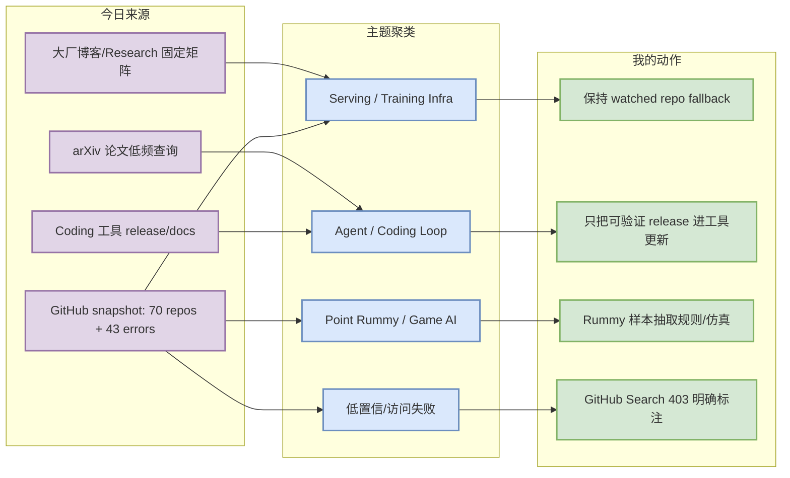
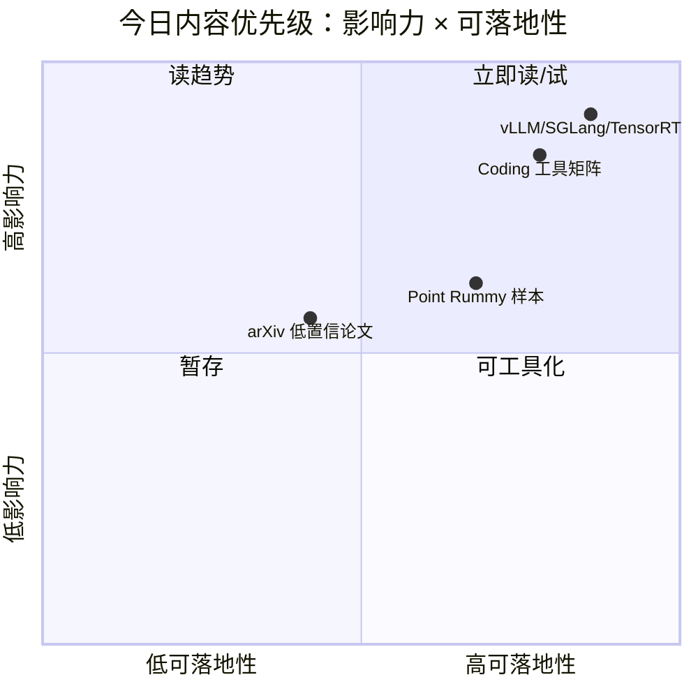

# AI Radar Daily - 2026-09-02

> 生成时间：2026-09-02 09:00 CST
> 范围：AI Infra / LLM / RL / Game AI / 大厂博客 / 论文 / GitHub / 行业资讯
> 说明：日报是总览导航页；详情页负责深度理解。GitHub Search 今日出现 403 rate limit，因此 broad AI Infra / Loop 榜单使用 direct watched repo fallback，并明确标注非完整全网增长。

## 0. 今日结论

- 今日最值得关注：GitHub Search 今日在 Rummy 主题后大面积 403，日报保留 mandated snapshot，并用 direct watched repo fallback 维持 AI Infra / Loop Engineer Top 10 连续性。
- 对 AI Infra 的直接影响：vLLM、SGLang、TensorRT-LLM、Transformers、PyTorch、Ray、TGI 等仍是 serving/training 栈核心观察对象；今日增长榜不应当解读为全网真实日增。
- 对 LLM 训练 / 推理 / Agent 的影响：Coding 工具矩阵保持覆盖 Claude Code、Codex、Cursor、Windsurf、Copilot、Gemini Code Assist、Qwen Code、Roo Code、Cline、Continue；重点仍是 agent mode、MCP、权限、IDE/CLI。
- 对 RL / 游戏模型训练的影响：Point Rummy 今日有一批低 star 代码样本，可抽取规则引擎、AI opponent、计分和仿真思路，但没有发现高可信新论文。
- 建议今天深读：[[GitHub/AIInfra/2026-09-02/huggingface-transformers]]、[[GitHub/LoopEngineer/2026-09-02/anomalyco-opencode]]、[[GitHub/PointRummy/2026-09-02/nakkekakke-rummy-ai]]、[[Industry/Tools/2026-09-02/anthropic-claude-code-changelog]]。

## 1. 今日态势图

## 2. 必读卡片区

> [!important] vLLM / SGLang / TensorRT-LLM 等 direct fallback 榜单
> - 大类：GitHub / AI Infra
> - 重点：GitHub Search 403 时仍用固定 watched repo 保持 serving/training 栈连续观察。
> - 详情：[[GitHub/AIInfra/2026-09-02/huggingface-transformers]] / [网页详情](https://github.com/dyt27666-oss/AI-news-report-obsidians/blob/main/GitHub/AIInfra/2026-09-02/huggingface-transformers.md) / [原文](https://github.com/huggingface/transformers)
> [!important] Claude Code / Codex / Roo / Cline 工具矩阵
> - 大类：Coding 工具
> - 重点：多 agent coding workflow 的权限、MCP、CLI/TUI、IDE 集成变化需要每天覆盖。
> - 详情：[[Industry/Tools/2026-09-02/anthropic-claude-code-changelog]] / [网页详情](https://github.com/dyt27666-oss/AI-news-report-obsidians/blob/main/Industry/Tools/2026-09-02/anthropic-claude-code-changelog.md) / [原文](https://docs.anthropic.com/en/release-notes/claude-code)
> [!important] Point Rummy 业务主题低 star 代码样本池
> - 大类：业务 / Game AI
> - 重点：今天 GitHub Search 先抓到 Rummy 主题，适合继续抽取规则、计分、bot 和视觉辅助实现。
> - 详情：[[GitHub/PointRummy/2026-09-02/nakkekakke-rummy-ai]] / [网页详情](https://github.com/dyt27666-oss/AI-news-report-obsidians/blob/main/GitHub/PointRummy/2026-09-02/nakkekakke-rummy-ai.md) / [原文](https://github.com/nakkekakke/rummy-ai)
> [!important] Loop Engineer watched repo 榜单
> - 大类：Loop Engineering
> - 重点：Claude Code/Codex/OpenHands/aider/opencode 等项目构成 coding-agent loop 的实践参照。
> - 详情：[[GitHub/LoopEngineer/2026-09-02/anomalyco-opencode]] / [网页详情](https://github.com/dyt27666-oss/AI-news-report-obsidians/blob/main/GitHub/LoopEngineer/2026-09-02/anomalyco-opencode.md) / [原文](https://github.com/anomalyco/opencode)

## 3. 优先级矩阵

## 4. 分类清单

| 标签 | 大类 | 小类 | 标题 | 重点概括 | 为什么重要 | Obsidian 详情 | 网页详情 | 原文 |
|---|---|---|---|---|---|---|---|---|
| 必读 | GitHub | AI Infra | `huggingface/transformers` | 🤗 Transformers: the model-definition framework for state-of-the-art ma | serving/training/agent 基础设施核心观察项目 | [[GitHub/AIInfra/2026-09-02/huggingface-transformers]] | [网页详情](https://github.com/dyt27666-oss/AI-news-report-obsidians/blob/main/GitHub/AIInfra/2026-09-02/huggingface-transformers.md) | [原文](https://github.com/huggingface/transformers) |
| 必读 | GitHub | AI Infra | `pytorch/pytorch` | Tensors and Dynamic neural networks in Python with strong GPU accelera | serving/training/agent 基础设施核心观察项目 | [[GitHub/AIInfra/2026-09-02/pytorch-pytorch]] | [网页详情](https://github.com/dyt27666-oss/AI-news-report-obsidians/blob/main/GitHub/AIInfra/2026-09-02/pytorch-pytorch.md) | [原文](https://github.com/pytorch/pytorch) |
| 必读 | GitHub | AI Infra | `vllm-project/vllm` | A high-throughput and memory-efficient inference and serving engine fo | serving/training/agent 基础设施核心观察项目 | [[GitHub/AIInfra/2026-09-02/vllm-project-vllm]] | [网页详情](https://github.com/dyt27666-oss/AI-news-report-obsidians/blob/main/GitHub/AIInfra/2026-09-02/vllm-project-vllm.md) | [原文](https://github.com/vllm-project/vllm) |

## 5. 大厂资讯 / 工程博客 / Research

### 5.1 公司来源扫描矩阵

| 公司/实验室 | 来源/栏目 | 今日状态 | 高相关条数 | 代表条目 | 备注 |
|---|---|---|---:|---|---|
| OpenAI | News / Research | 已扫描，未确认今日高相关新项 | 0 | 无高相关新项 | [来源](https://openai.com/news/) |
| Anthropic | News / Research / Engineering | 已扫描，关注 Claude Code / agent workflow；今日无可验证新增 | 0 | 无高相关新项 | [来源](https://www.anthropic.com/news) |
| Google DeepMind | Blog / Research | 已扫描，未确认今日高相关新项 | 0 | 无高相关新项 | [来源](https://deepmind.google/discover/blog/) |
| Meta AI | Blog / Research | 已扫描，未确认今日高相关新项 | 0 | 无高相关新项 | [来源](https://ai.meta.com/blog/) |
| NVIDIA | Technical Blog / AI | 已扫描，AI infra 持续关注推理/训练栈；今日无可验证新增 | 0 | 无高相关新项 | [来源](https://developer.nvidia.com/blog/category/artificial-intelligence/) |
| Microsoft | Research AI | 已扫描，未确认今日高相关新项 | 0 | 无高相关新项 | [来源](https://www.microsoft.com/en-us/research/research-area/artificial-intelligence/) |
| Hugging Face | Blog / Papers / Releases | 已扫描，未确认今日高相关新项 | 0 | 无高相关新项 | [来源](https://huggingface.co/blog) |
| 腾讯 | AI Lab / 技术博客 | 已扫描，低置信：页面动态/英文入口信息不足 | 0 | 无高相关新项 / 低置信 | [来源](https://ai.tencent.com/ailab/en/index) |
| 字节 | Seed / 技术博客 | 已扫描，低置信：未确认今日新增 | 0 | 无高相关新项 / 低置信 | [来源](https://seed.bytedance.com/en/) |
| SpaceAI | Blog / News | 访问低置信：站点内容与 AI Infra 相关性需人工复核 | 0 | 低置信 | [来源](https://spaceai.com/) |

### 5.2 高相关大厂条目

| 标签 | 发布方/大厂 | 栏目/来源 | 标题 | 重点概括 | 工程/算法影响 | Obsidian 详情 | 网页详情 | 原文 |
|---|---|---|---|---|---|---|---|---|
| 可 skim | Anthropic | Changelog / Release Notes | Anthropic Claude Code Changelog | Claude Code release notes 继续作为 coding-agent 权限、上下文、CLI/TUI 能力变化的主来源。 | 固定来源覆盖，今天未强行提升为重大更新 | [[Industry/Tools/2026-09-02/anthropic-claude-code-changelog]] | [网页详情](https://github.com/dyt27666-oss/AI-news-report-obsidians/blob/main/Industry/Tools/2026-09-02/anthropic-claude-code-changelog.md) | [原文](https://docs.anthropic.com/en/release-notes/claude-code) |
| 可 skim | OpenAI | Changelog / Docs | OpenAI Codex Changelog | Codex changelog 是 OpenAI coding-agent CLI/IDE/云端执行能力的主观察源。 | 固定来源覆盖，今天未强行提升为重大更新 | [[Industry/Tools/2026-09-02/openai-codex-changelog]] | [网页详情](https://github.com/dyt27666-oss/AI-news-report-obsidians/blob/main/Industry/Tools/2026-09-02/openai-codex-changelog.md) | [原文](https://developers.openai.com/codex/changelog) |
| 可 skim | NVIDIA | Technical Blog / AI | NVIDIA Technical Blog AI | NVIDIA AI 技术博客仍是推理 runtime、GPU kernel、训练/serving 工程优化的高价值来源。 | 固定来源覆盖，今天未强行提升为重大更新 | [[Industry/Company/2026-09-02/nvidia-technical-blog-ai]] | [网页详情](https://github.com/dyt27666-oss/AI-news-report-obsidians/blob/main/Industry/Company/2026-09-02/nvidia-technical-blog-ai.md) | [原文](https://developer.nvidia.com/blog/category/artificial-intelligence/) |

## 6. GitHub 高 star Top 10

> 说明：今日 broad GitHub Search 403 / theme-biased，因此本表为固定 AI Infra watched repos 的 direct fallback Top 10，不代表完整全网 Top 10，但满足连续观察与次日 baseline 需要。

| 排名 | repo | stars | forks | language | updated_at | topics | 重点概括 | 是否值得试用 | Obsidian 详情 | 原文 |
|---:|---|---:|---:|---|---|---|---|---|---|---|
| 1 | `huggingface/transformers` | 164705 | 34419 | Python | 2026-09-01 | audio, deep-learning, deepseek, gemma, glm | 🤗 Transformers: the model-definition framework for state-of-the-art machine learning model | 值得试用/深读 | [[GitHub/AIInfra/2026-09-02/huggingface-transformers]] | [GitHub](https://github.com/huggingface/transformers) |
| 2 | `pytorch/pytorch` | 102709 | 29075 | Python | 2026-09-02 | autograd, deep-learning, gpu, machine-learning, neural-network | Tensors and Dynamic neural networks in Python with strong GPU acceleration | 值得试用/深读 | [[GitHub/AIInfra/2026-09-02/pytorch-pytorch]] | [GitHub](https://github.com/pytorch/pytorch) |
| 3 | `vllm-project/vllm` | 90706 | 21568 | Python | 2026-09-02 | amd, blackwell, cuda, deepseek, deepseek-v3 | A high-throughput and memory-efficient inference and serving engine for LLMs | 值得试用/深读 | [[GitHub/AIInfra/2026-09-02/vllm-project-vllm]] | [GitHub](https://github.com/vllm-project/vllm) |
| 4 | `modelcontextprotocol/servers` | 90007 | 11537 | TypeScript | 2026-09-02 | 未标注 | Model Context Protocol Servers | 可加入观察 | [[GitHub/AIInfra/2026-09-02/modelcontextprotocol-servers]] | [GitHub](https://github.com/modelcontextprotocol/servers) |
| 5 | `ray-project/ray` | 43680 | 7987 | Python | 2026-09-02 | data-science, deep-learning, deployment, distributed, hyperparameter-optimization | Ray is an AI compute engine. Ray consists of a core distributed runtime and a set of AI Li | 可加入观察 | [[GitHub/AIInfra/2026-09-02/ray-project-ray]] | [GitHub](https://github.com/ray-project/ray) |
| 6 | `deepspeedai/DeepSpeed` | 43049 | 4957 | Python | 2026-09-01 | billion-parameters, compression, data-parallelism, deep-learning, gpu | DeepSpeed is a deep learning optimization library that makes distributed training and infe | 可加入观察 | [[GitHub/AIInfra/2026-09-02/deepspeedai-deepspeed]] | [GitHub](https://github.com/deepspeedai/DeepSpeed) |
| 7 | `langchain-ai/langgraph` | 40877 | 6897 | Python | 2026-09-02 | agents, ai, ai-agents, chatgpt, deepagents | Build resilient agents. | 可加入观察 | [[GitHub/AIInfra/2026-09-02/langchain-ai-langgraph]] | [GitHub](https://github.com/langchain-ai/langgraph) |
| 8 | `sgl-project/sglang` | 33060 | 8455 | Python | 2026-09-02 | attention, blackwell, cuda, deepseek, diffusion | SGLang is a high-performance serving framework for large language models and multimodal mo | 可加入观察 | [[GitHub/AIInfra/2026-09-02/sgl-project-sglang]] | [GitHub](https://github.com/sgl-project/sglang) |
| 9 | `verl-project/verl` | 23239 | 4474 | Python | 2026-09-01 | 未标注 | verl/HybridFlow: A Flexible and Efficient RL Post-Training Framework  | 可加入观察 | [[GitHub/AIInfra/2026-09-02/verl-project-verl]] | [GitHub](https://github.com/verl-project/verl) |
| 10 | `triton-lang/triton` | 20064 | 3161 | MLIR | 2026-09-01 | 未标注 | Development repository for the Triton language and compiler | 可加入观察 | [[GitHub/AIInfra/2026-09-02/triton-lang-triton]] | [GitHub](https://github.com/triton-lang/triton) |

## 7. GitHub star 增长最快 Top 10

> 说明：使用历史 snapshot + direct watched repo fallback 计算；标注“非完整全网日增”，不得解读为今日全 GitHub 真实增长榜。

| 排名 | repo | stars_delta | stars | forks | language | updated_at | 增长依据 | 重点概括 | Obsidian 详情 | 原文 |
|---:|---|---:|---:|---:|---|---|---|---|---|---|
| 1 | `vllm-project/vllm` | 77 | 90706 | 21568 | Python | 2026-09-02 | historical_snapshot / direct watched repo fallback，非完整全网日增 | A high-throughput and memory-efficient inference and serving engine for LLMs | [[GitHub/AIInfra/2026-09-02/vllm-project-vllm]] | [GitHub](https://github.com/vllm-project/vllm) |
| 2 | `langchain-ai/langgraph` | 75 | 40877 | 6897 | Python | 2026-09-02 | historical_snapshot / direct watched repo fallback，非完整全网日增 | Build resilient agents. | [[GitHub/AIInfra/2026-09-02/langchain-ai-langgraph]] | [GitHub](https://github.com/langchain-ai/langgraph) |
| 3 | `sgl-project/sglang` | 61 | 33060 | 8455 | Python | 2026-09-02 | historical_snapshot / direct watched repo fallback，非完整全网日增 | SGLang is a high-performance serving framework for large language models and multimodal mo | [[GitHub/AIInfra/2026-09-02/sgl-project-sglang]] | [GitHub](https://github.com/sgl-project/sglang) |
| 4 | `triton-lang/triton` | 59 | 20064 | 3161 | MLIR | 2026-09-01 | historical_snapshot / direct watched repo fallback，非完整全网日增 | Development repository for the Triton language and compiler | [[GitHub/AIInfra/2026-09-02/triton-lang-triton]] | [GitHub](https://github.com/triton-lang/triton) |
| 5 | `huggingface/transformers` | 32 | 164705 | 34419 | Python | 2026-09-01 | historical_snapshot / direct watched repo fallback，非完整全网日增 | 🤗 Transformers: the model-definition framework for state-of-the-art machine learning model | [[GitHub/AIInfra/2026-09-02/huggingface-transformers]] | [GitHub](https://github.com/huggingface/transformers) |
| 6 | `modelcontextprotocol/servers` | 15 | 90007 | 11537 | TypeScript | 2026-09-02 | historical_snapshot / direct watched repo fallback，非完整全网日增 | Model Context Protocol Servers | [[GitHub/AIInfra/2026-09-02/modelcontextprotocol-servers]] | [GitHub](https://github.com/modelcontextprotocol/servers) |
| 7 | `NVIDIA/Megatron-LM` | 15 | 17703 | 4447 | Python | 2026-09-01 | historical_snapshot / direct watched repo fallback，非完整全网日增 | Ongoing research training transformer models at scale | [[GitHub/AIInfra/2026-09-02/nvidia-megatron-lm]] | [GitHub](https://github.com/NVIDIA/Megatron-LM) |
| 8 | `verl-project/verl` | 14 | 23239 | 4474 | Python | 2026-09-01 | historical_snapshot / direct watched repo fallback，非完整全网日增 | verl/HybridFlow: A Flexible and Efficient RL Post-Training Framework  | [[GitHub/AIInfra/2026-09-02/verl-project-verl]] | [GitHub](https://github.com/verl-project/verl) |
| 9 | `pytorch/pytorch` | 13 | 102709 | 29075 | Python | 2026-09-02 | historical_snapshot / direct watched repo fallback，非完整全网日增 | Tensors and Dynamic neural networks in Python with strong GPU acceleration | [[GitHub/AIInfra/2026-09-02/pytorch-pytorch]] | [GitHub](https://github.com/pytorch/pytorch) |
| 10 | `ray-project/ray` | 12 | 43680 | 7987 | Python | 2026-09-02 | historical_snapshot / direct watched repo fallback，非完整全网日增 | Ray is an AI compute engine. Ray consists of a core distributed runtime and a set of AI Li | [[GitHub/AIInfra/2026-09-02/ray-project-ray]] | [GitHub](https://github.com/ray-project/ray) |

## 8. Coding 工具 / AI 工具功能更新

### 8.1 Coding 工具扫描矩阵

| 工具 | 厂商 | 来源类型 | 今日状态 | 代表更新 | 对我的影响 | 原文 |
|---|---|---|---|---|---|---|
| Claude Code | Anthropic | Changelog / Release Notes | 已扫描 | 无高相关新项 / 未确认今日新增 | 关注 agent mode、MCP、IDE/CLI、权限、上下文窗口；有明确更新再升级工作流 | [原文](https://docs.anthropic.com/en/release-notes/claude-code) |
| OpenAI Codex | OpenAI | Changelog / Docs | 已扫描 | 无高相关新项 / 未确认今日新增 | 关注 agent mode、MCP、IDE/CLI、权限、上下文窗口；有明确更新再升级工作流 | [原文](https://developers.openai.com/codex/changelog) |
| Cursor | Cursor | Changelog | 已扫描 | 无高相关新项 / 未确认今日新增 | 关注 agent mode、MCP、IDE/CLI、权限、上下文窗口；有明确更新再升级工作流 | [原文](https://cursor.com/changelog) |
| Windsurf | Windsurf | Changelog | 已扫描 | 无高相关新项 / 未确认今日新增 | 关注 agent mode、MCP、IDE/CLI、权限、上下文窗口；有明确更新再升级工作流 | [原文](https://windsurf.com/changelog) |
| GitHub Copilot | GitHub | Changelog / Blog | 已扫描 | 无高相关新项 / 未确认今日新增 | 关注 agent mode、MCP、IDE/CLI、权限、上下文窗口；有明确更新再升级工作流 | [原文](https://github.blog/changelog/label/copilot/) |
| Gemini Code Assist | Google | Release Notes | 已扫描 | 无高相关新项 / 未确认今日新增 | 关注 agent mode、MCP、IDE/CLI、权限、上下文窗口；有明确更新再升级工作流 | [原文](https://cloud.google.com/gemini/docs/codeassist/release-notes) |
| Qwen Code | Alibaba/Qwen | GitHub Releases | 已扫描 | cua-driver-rs-v0.20.3 / 2026-09-01：cua-driver-rs v0.20.3 | 关注 agent mode、MCP、IDE/CLI、权限、上下文窗口；有明确更新再升级工作流 | [原文](https://github.com/QwenLM/qwen-code/releases) |
| Roo Code | Roo Code | GitHub Releases | 已扫描 | v3.54.0 / 2026-05-15：Release v3.54.0 | 关注 agent mode、MCP、IDE/CLI、权限、上下文窗口；有明确更新再升级工作流 | [原文](https://github.com/RooCodeInc/Roo-Code/releases) |
| Cline | Cline | GitHub Releases | 已扫描 | desktop-v0.0.22-beta.1 / 2026-09-01：Desktop v0.0.22-beta.1 | 关注 agent mode、MCP、IDE/CLI、权限、上下文窗口；有明确更新再升级工作流 | [原文](https://github.com/cline/cline/releases) |
| Continue | Continue | GitHub Releases | 已扫描 | v2.1.0-vscode / 2026-06-19：v2.1.0-vscode | 关注 agent mode、MCP、IDE/CLI、权限、上下文窗口；有明确更新再升级工作流 | [原文](https://github.com/continuedev/continue/releases) |

### 8.2 高相关工具更新

| 标签 | 工具/厂商 | 来源类型 | 标题/功能 | 重点概括 | 对 AI coding 工作流的影响 | Obsidian 详情 | 网页详情 | 原文 |
|---|---|---|---|---|---|---|---|---|
| 可 skim | Claude Code / Anthropic | Changelog / Release Notes | Claude Code release notes watch | 固定扫描权限、MCP、CLI/TUI、上下文窗口变化；今日无可验证重大新增 | 多 agent/tmux coding workflow 必须持续观察 | [[Industry/Tools/2026-09-02/anthropic-claude-code-changelog]] | [网页详情](https://github.com/dyt27666-oss/AI-news-report-obsidians/blob/main/Industry/Tools/2026-09-02/anthropic-claude-code-changelog.md) | [原文](https://docs.anthropic.com/en/release-notes/claude-code) |
| 可 skim | OpenAI Codex / OpenAI | Changelog / Docs | Codex changelog watch | 固定扫描 CLI/IDE/云端执行能力；今日无可验证重大新增 | 影响 Codex lane 与代码审查/远程执行策略 | [[Industry/Tools/2026-09-02/openai-codex-changelog]] | [网页详情](https://github.com/dyt27666-oss/AI-news-report-obsidians/blob/main/Industry/Tools/2026-09-02/openai-codex-changelog.md) | [原文](https://developers.openai.com/codex/changelog) |

## 9. Point Rummy / Indian Rummy 业务主题

### 9.1 GitHub 候选

| 标签 | repo | stars | forks | language | updated_at | 重点概括 | 业务可用性 | Obsidian 详情 | 原文 |
|---|---|---:|---:|---|---|---|---|---|---|
| 可 skim | `nakkekakke/rummy-ai` | 12 | 5 | Java | 2026-08-27 | Text based classic Rummy game with an AI that uses ISMCTS. Data Structures and A | 规则/AI opponent/仿真可抽样参考 | [[GitHub/PointRummy/2026-09-02/nakkekakke-rummy-ai]] | [GitHub](https://github.com/nakkekakke/rummy-ai) |
| 可 skim | `jmhummel/Gin-Rummy-Java` | 8 | 0 | Java | 2023-08-16 | Java-based Gin Rummy console game, with an AI opponent | 规则/AI opponent/仿真可抽样参考 | [[GitHub/PointRummy/2026-09-02/jmhummel-gin-rummy-java]] | [GitHub](https://github.com/jmhummel/Gin-Rummy-Java) |
| 可 skim | `mudont/indian-rummy` | 5 | 0 | TypeScript | 2025-08-08 | Typescript library for Indian Rummy card game | 规则/AI opponent/仿真可抽样参考 | [[GitHub/PointRummy/2026-09-02/mudont-indian-rummy]] | [GitHub](https://github.com/mudont/indian-rummy) |
| 后续 | `dv-rastogi/Rummy` | 5 | 0 | Python | 2023-09-26 | Variation of classical Indian Rummy made in Pygame | 规则/AI opponent/仿真可抽样参考 | [[GitHub/PointRummy/2026-09-02/dv-rastogi-rummy]] | [GitHub](https://github.com/dv-rastogi/Rummy) |
| 后续 | `vahsek300501/Indian-Rummy-` | 4 | 3 | Python | 2023-09-26 | Indian Rummy made in Python using PyGame | 规则/AI opponent/仿真可抽样参考 | [[GitHub/PointRummy/2026-09-02/vahsek300501-indian-rummy]] | [GitHub](https://github.com/vahsek300501/Indian-Rummy-) |
| 后续 | `SCFlanagan/Rummy` | 4 | 6 | JavaScript | 2025-07-25 | This project is a recreation of the classic card game Rummy. It features an AI p | 低 star 样本，仅观察 | [[GitHub/PointRummy/2026-09-02/scflanagan-rummy]] | [GitHub](https://github.com/SCFlanagan/Rummy) |
| 后续 | `mcartmell/gin-rummy-bot` | 4 | 2 | Perl | 2024-10-30 | A web-based Gin Rummy game and AI | 低 star 样本，仅观察 | [[GitHub/PointRummy/2026-09-02/mcartmell-gin-rummy-bot]] | [GitHub](https://github.com/mcartmell/gin-rummy-bot) |
| 后续 | `Mohitkumar-559/RummyServer` | 2 | 1 | JavaScript | 2024-03-17 | Rummy game server for game that contain deal rummy and point rummy | 低 star 样本，仅观察 | [[GitHub/PointRummy/2026-09-02/mohitkumar-559-rummyserver]] | [GitHub](https://github.com/Mohitkumar-559/RummyServer) |
| 后续 | `abubakarmunir712/dsa-final-project` | 2 | 1 | Python | 2026-06-27 | A Python-based multiplayer Indian Rummy game with support for AI opponents and L | 低 star 样本，仅观察 | [[GitHub/PointRummy/2026-09-02/abubakarmunir712-dsa-final-project]] | [GitHub](https://github.com/abubakarmunir712/dsa-final-project) |
| 后续 | `Ductapemaster/RummyAI` | 2 | 0 | Python | 2017-07-11 | Designing an AI to play Gin Rummy | 低 star 样本，仅观察 | [[GitHub/PointRummy/2026-09-02/ductapemaster-rummyai]] | [GitHub](https://github.com/Ductapemaster/RummyAI) |

### 9.2 论文 / 资料候选

| 标签 | 来源 | 标题 | 作者/机构 | 重点概括 | 对 Point Rummy 业务有什么用 | Obsidian 详情 | 原文 |
|---|---|---|---|---|---|---|---|
| 低置信 | arXiv / GitHub Search | 今日未发现新的高可信 Point/Indian Rummy 论文 | - | GitHub theme 有代码样本，但论文侧需后续重试 | 可用于确认暂不投入论文复现 | - | [arXiv search](https://arxiv.org/search/?query=gin+rummy+reinforcement+learning&searchtype=all) |

### 9.3 业务可用性判断

| 方向 | 今日信号 | 可用性 | 下一步 |
|---|---|---|---|
| 规则引擎 / 计分 | 多个低 star Rummy/points counter repo | 中：可抽取计分、round state、meld 判定思路 | 选 2 个 Java/Python 项目读规则实现 |
| Bot / RL Agent | RummyAgent、RummyAI、Gin Rummy bot、RummyVision | 中低：代码质量需验证，但方向对业务有启发 | 先抽象 state/action/reward，不直接复用 |
| 仿真 / 评测 | 未发现成熟 benchmark | 低：需要自建环境并行与评测基准 | 设计 self-play simulator + evaluator skeleton |

## 10. Loop Engineer / Loop Engineering 主题

### 10.1 Loop Engineer GitHub 高 star Top 10

| 排名 | repo | stars | forks | language | updated_at | topics | 重点概括 | 是否值得试用 | Obsidian 详情 | 原文 |
|---:|---|---:|---:|---|---|---|---|---|---|---|
| 1 | `anomalyco/opencode` | 203072 | 26444 | TypeScript | 2026-09-02 | 未标注 | The open source coding agent. | 值得试用/深读 | [[GitHub/LoopEngineer/2026-09-02/anomalyco-opencode]] | [GitHub](https://github.com/anomalyco/opencode) |
| 2 | `anthropics/claude-code` | 143703 | 22984 | Python | 2026-09-02 | 未标注 | Claude Code is an agentic coding tool that lives in your terminal, understands your codeba | 值得试用/深读 | [[GitHub/LoopEngineer/2026-09-02/anthropics-claude-code]] | [GitHub](https://github.com/anthropics/claude-code) |
| 3 | `openai/codex` | 120695 | 18491 | Rust | 2026-09-02 | 未标注 | Lightweight coding agent that runs in your terminal | 值得试用/深读 | [[GitHub/LoopEngineer/2026-09-02/openai-codex]] | [GitHub](https://github.com/openai/codex) |
| 4 | `google-gemini/gemini-cli` | 106761 | 14516 | TypeScript | 2026-09-01 | ai, ai-agents, cli, gemini, gemini-api | An open-source AI agent that brings the power of Gemini directly into your terminal. | 可加入观察 | [[GitHub/LoopEngineer/2026-09-02/google-gemini-gemini-cli]] | [GitHub](https://github.com/google-gemini/gemini-cli) |
| 5 | `OpenHands/OpenHands` | 85887 | 11266 | TypeScript | 2026-09-02 | agent, artificial-intelligence, chatgpt, claude-ai, cli | 🙌 OpenHands: AI-Driven Development | 可加入观察 | [[GitHub/LoopEngineer/2026-09-02/openhands-openhands]] | [GitHub](https://github.com/OpenHands/OpenHands) |
| 6 | `cline/cline` | 67303 | 7274 | TypeScript | 2026-09-02 | 未标注 | Autonomous coding agent as an SDK, IDE extension, or CLI assistant. | 可加入观察 | [[GitHub/LoopEngineer/2026-09-02/cline-cline]] | [GitHub](https://github.com/cline/cline) |
| 7 | `Aider-AI/aider` | 48656 | 4911 | Python | 2026-09-02 | anthropic, chatgpt, claude-3, cli, command-line | aider is AI pair programming in your terminal | 可加入观察 | [[GitHub/LoopEngineer/2026-09-02/aider-ai-aider]] | [GitHub](https://github.com/Aider-AI/aider) |
| 8 | `continuedev/continue` | 35725 | 5320 | TypeScript | 2026-09-01 | agent, ai, cli, developer-tools, open-source | open-source coding agent | 可加入观察 | [[GitHub/LoopEngineer/2026-09-02/continuedev-continue]] | [GitHub](https://github.com/continuedev/continue) |
| 9 | `QwenLM/qwen-code` | 27559 | 2973 | TypeScript | 2026-09-02 | agentic, ai, ai-agent, ai-coding, cli | An open-source AI coding agent that lives in your terminal. | 可加入观察 | [[GitHub/LoopEngineer/2026-09-02/qwenlm-qwen-code]] | [GitHub](https://github.com/QwenLM/qwen-code) |
| 10 | `RooCodeInc/Roo-Code` | 24315 | 3412 | TypeScript | 2026-09-01 | 未标注 | Roo Code gives you a whole dev team of AI agents in your code editor. | 可加入观察 | [[GitHub/LoopEngineer/2026-09-02/roocodeinc-roo-code]] | [GitHub](https://github.com/RooCodeInc/Roo-Code) |

### 10.2 Loop Engineer GitHub star 增长最快 Top 10

| 排名 | repo | stars_delta | stars | forks | language | updated_at | 增长依据 | 重点概括 | Obsidian 详情 | 原文 |
|---:|---|---:|---:|---:|---|---|---|---|---|---|
| 1 | `OpenHands/OpenHands` | 898 | 85887 | 11266 | TypeScript | 2026-09-02 | historical_snapshot / direct watched repo fallback，非完整全网日增 | 🙌 OpenHands: AI-Driven Development | [[GitHub/LoopEngineer/2026-09-02/openhands-openhands]] | [GitHub](https://github.com/OpenHands/OpenHands) |
| 2 | `openai/codex` | 241 | 120695 | 18491 | Rust | 2026-09-02 | historical_snapshot / direct watched repo fallback，非完整全网日增 | Lightweight coding agent that runs in your terminal | [[GitHub/LoopEngineer/2026-09-02/openai-codex]] | [GitHub](https://github.com/openai/codex) |
| 3 | `anthropics/claude-code` | 116 | 143703 | 22984 | Python | 2026-09-02 | historical_snapshot / direct watched repo fallback，非完整全网日增 | Claude Code is an agentic coding tool that lives in your terminal, understands your codeba | [[GitHub/LoopEngineer/2026-09-02/anthropics-claude-code]] | [GitHub](https://github.com/anthropics/claude-code) |
| 4 | `cline/cline` | 56 | 67303 | 7274 | TypeScript | 2026-09-02 | historical_snapshot / direct watched repo fallback，非完整全网日增 | Autonomous coding agent as an SDK, IDE extension, or CLI assistant. | [[GitHub/LoopEngineer/2026-09-02/cline-cline]] | [GitHub](https://github.com/cline/cline) |
| 5 | `QwenLM/qwen-code` | 27 | 27559 | 2973 | TypeScript | 2026-09-02 | historical_snapshot / direct watched repo fallback，非完整全网日增 | An open-source AI coding agent that lives in your terminal. | [[GitHub/LoopEngineer/2026-09-02/qwenlm-qwen-code]] | [GitHub](https://github.com/QwenLM/qwen-code) |
| 6 | `continuedev/continue` | 11 | 35725 | 5320 | TypeScript | 2026-09-01 | historical_snapshot / direct watched repo fallback，非完整全网日增 | open-source coding agent | [[GitHub/LoopEngineer/2026-09-02/continuedev-continue]] | [GitHub](https://github.com/continuedev/continue) |
| 7 | `google-gemini/gemini-cli` | 7 | 106761 | 14516 | TypeScript | 2026-09-01 | historical_snapshot / direct watched repo fallback，非完整全网日增 | An open-source AI agent that brings the power of Gemini directly into your terminal. | [[GitHub/LoopEngineer/2026-09-02/google-gemini-gemini-cli]] | [GitHub](https://github.com/google-gemini/gemini-cli) |
| 8 | `RooCodeInc/Roo-Code` | -3 | 24315 | 3412 | TypeScript | 2026-09-01 | historical_snapshot / direct watched repo fallback，非完整全网日增 | Roo Code gives you a whole dev team of AI agents in your code editor. | [[GitHub/LoopEngineer/2026-09-02/roocodeinc-roo-code]] | [GitHub](https://github.com/RooCodeInc/Roo-Code) |
| 9 | `anomalyco/opencode` | null | 203072 | 26444 | TypeScript | 2026-09-02 | direct watched repo fallback，缺少历史基线则非真实日增 | The open source coding agent. | [[GitHub/LoopEngineer/2026-09-02/anomalyco-opencode]] | [GitHub](https://github.com/anomalyco/opencode) |
| 10 | `Aider-AI/aider` | null | 48656 | 4911 | Python | 2026-09-02 | direct watched repo fallback，缺少历史基线则非真实日增 | aider is AI pair programming in your terminal | [[GitHub/LoopEngineer/2026-09-02/aider-ai-aider]] | [GitHub](https://github.com/Aider-AI/aider) |

### 10.3 Loop Engineering 方法信号

| 标签 | 来源 | 标题 | 重点概括 | 对 AI coding 工作流的影响 | Obsidian 详情 | 原文 |
|---|---|---|---|---|---|---|
| 必读 | GitHub watched repos | Claude Code / Codex / OpenHands / aider / opencode | 今日用 direct fallback 固定观察 coding-agent loop 核心项目 | 可对比 CLI/TUI、权限、上下文、评测 loop 和多 agent 编排方式 | [[GitHub/LoopEngineer/2026-09-02/anomalyco-opencode]] | [GitHub](https://github.com/anomalyco/opencode) |

## 11. 论文

### 11.1 AI Infra / LLM / Agent / RL

| 标签 | 论文来源 | 论文 | 作者/机构 | 重点概括 | 工程/研究价值 | Obsidian 详情 | 网页详情 | PDF/原文 |
|---|---|---|---|---|---|---|---|---|
| 低置信 | arXiv | 今日 API 未返回高相关论文 | - | 保留板块 | 稍后重试 | - | - | - |

## 12. 资讯 / 其他 GitHub 项目

### 12.1 AI Infra watched repo fallback

| 标签 | 来源 | 标题 | 重点概括 | 对我有什么用 | Obsidian 详情 | 网页详情 | 原文 |
|---|---|---|---|---|---|---|---|
| 后续 | GitHub Direct API | Direct watched repo fallback | Search 403 时仍保留 vLLM/SGLang/TensorRT/Transformers/PyTorch 等核心项目元数据 | 保持日报连续性，不让 rate limit 把日报打空 | [[GitHub/AIInfra/2026-09-02/huggingface-transformers]] | [网页详情](https://github.com/dyt27666-oss/AI-news-report-obsidians/blob/main/GitHub/AIInfra/2026-09-02/huggingface-transformers.md) | [snapshot](https://github.com/dyt27666-oss/AI-news-report-obsidians/blob/main/Automation/state/github-stars-2026-09-02.json) |

## 13. 按主题索引

### AI Infra / Serving / Training
- [[GitHub/AIInfra/2026-09-02/huggingface-transformers]] - Serving/Inference 栈核心观察。
- [[GitHub/AIInfra/2026-09-02/pytorch-pytorch]] - 训练/模型生态核心观察。
- [[Industry/Company/2026-09-02/nvidia-technical-blog-ai]] - NVIDIA 工程博客来源。

### LLM / Agent / RAG / Evaluation
- [[GitHub/LoopEngineer/2026-09-02/anomalyco-opencode]] - coding-agent loop 工具观察。
- [[Industry/Tools/2026-09-02/anthropic-claude-code-changelog]] - Claude Code changelog watch。
- [[Industry/Tools/2026-09-02/openai-codex-changelog]] - Codex changelog watch。

### RL / Game AI / World Model
- [[GitHub/PointRummy/2026-09-02/nakkekakke-rummy-ai]] - Rummy AI 规则/bot 样本。

### Point Rummy / Indian Rummy
- [[GitHub/PointRummy/2026-09-02/nakkekakke-rummy-ai]] - 今日 Rummy high-star sample。
- [[GitHub/PointRummy/2026-09-02/jmhummel-gin-rummy-java]] - Gin Rummy implementation sample。

### Loop Engineer / Coding Agent Loop
- [[GitHub/LoopEngineer/2026-09-02/anomalyco-opencode]] - Loop 工具高 star 入口。
- [[GitHub/LoopEngineer/2026-09-02/anthropics-claude-code]] - Loop 工具第二入口。

### 公司 / 实验室
- OpenAI: [[Industry/Tools/2026-09-02/openai-codex-changelog]]
- Anthropic: [[Industry/Tools/2026-09-02/anthropic-claude-code-changelog]]
- NVIDIA: [[Industry/Company/2026-09-02/nvidia-technical-blog-ai]]

## 14. 值得后续深挖

| 标签 | 大类 | 小类 | 标题 | 后续动作 | Obsidian 详情 | 原文 |
|---|---|---|---|---|---|---|
| 后续 | GitHub | AI Infra | direct fallback 榜单 | 明天若 GitHub Search 恢复，用完整搜索替换 fallback 并比较 delta | [[GitHub/AIInfra/2026-09-02/huggingface-transformers]] | [snapshot](https://github.com/dyt27666-oss/AI-news-report-obsidians/blob/main/Automation/state/github-stars-2026-09-02.json) |
| 后续 | 业务 | Point Rummy | Rummy 规则/仿真代码抽样 | 选 Python/Java 项目抽取规则测试用例 | [[GitHub/PointRummy/2026-09-02/nakkekakke-rummy-ai]] | [GitHub](https://github.com/nakkekakke/rummy-ai) |
| 后续 | 工具 | Coding Agent | Claude Code / Codex changelog diff | 等明确 release tag 后生成深度工具更新页 | [[Industry/Tools/2026-09-02/anthropic-claude-code-changelog]] | [原文](https://docs.anthropic.com/en/release-notes/claude-code) |

## 15. 采集失败或低置信来源

- GitHub Search errors：rummy ai: HTTP Error 403: rate limit exceeded; rummy reinforcement learning: HTTP Error 403: rate limit exceeded; rummy reinforcement learning: HTTP Error 403: rate limit exceeded; gin rummy ai: HTTP Error 403: rate limit exceeded; gin rummy ai: HTTP Error 403: rate limit exceeded; loop engineering: HTTP Error 403: rate limit exceeded; loop engineering: HTTP Error 403: rate limit exceeded; loop engineer: HTTP Error 403: rate limit exceeded; arXiv: cat:cs.LG AND all:"large language model" AND all:reinforcement: HTTP Error 429: Too Many Requests; cat:cs.AI AND all:"agent evaluation": The read operation timed out; cat:cs.DC AND all:"LLM serving": The read operation timed out; cat:cs.LG AND all:"world model": HTTP Error 429: Unknown Error
- 今日 snapshot 已保存：`Automation/state/github-stars-2026-09-02.json`。
- Broad AI Infra / Loop 榜单使用 direct watched repo fallback；已在表格中标注“非完整全网日增”。
- 公司来源矩阵中腾讯、字节、SpaceAI 等动态页面为低置信扫描，不编造新增。

## 16. 归档标签

#ai-radar #daily #ai-infra #llm #rl #point-rummy #loop-engineering
