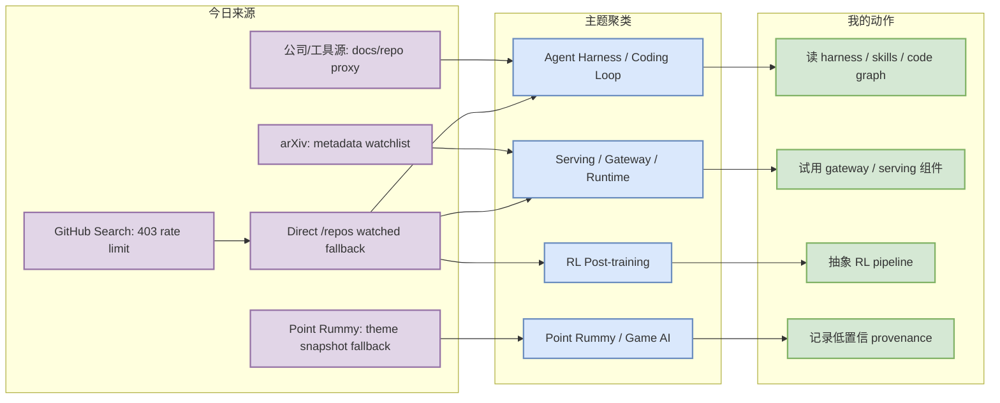
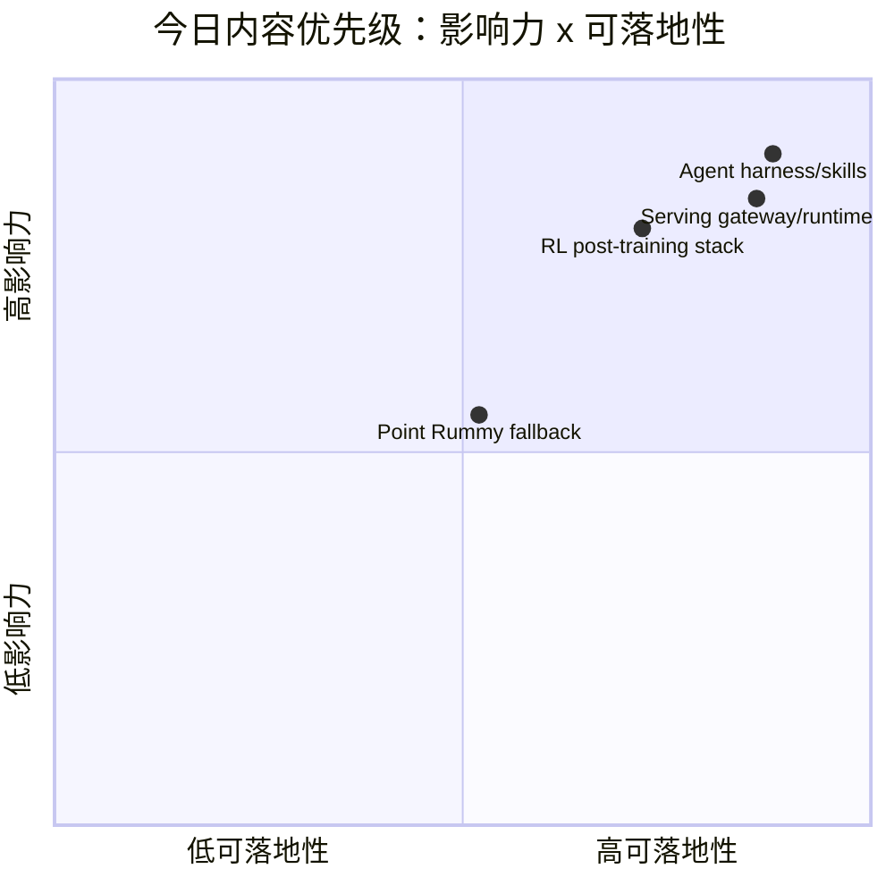

# AI Radar Daily - 2026-09-04

> 生成时间：2026-09-04 09:00 北京时间
> 范围：AI Infra / LLM / RL / Game AI / 大厂博客 / 论文 / GitHub / 行业资讯
> 说明：日报是总览导航页，不是全部正文。Obsidian 中点详情页 wikilink，Telegram/GitHub 中点“网页详情”。

## 0. 今日结论

- 今日最值得关注：GitHub Search 今日从首个查询开始 403；已保存当日 snapshot，并用 direct watched repo fallback 补齐 AI Infra / Loop Engineer / Coding 工具榜单，所有 fallback 行均显式标注“非完整全网日增”。
- 对 AI Infra 的直接影响：LiteLLM、Ollama、vLLM、SGLang、TensorRT-LLM、KServe 继续构成 serving + gateway + runtime + control plane 的主观察面。
- 对 LLM 训练 / 推理 / Agent 的影响：ECC、Hermes Agent、Graphify、OpenHands、LangGraph、MCP servers 显示 skills、memory、code graph、工具权限和 eval loop 是 coding workflow 的工程化核心。
- 对 RL / 游戏模型训练的影响：AReno、verl、OpenRLHF 继续适合作为 post-training/RL 管线观察；Point Rummy 今日无实时 Search 数据，使用前日 theme snapshot fallback 拆规则、bot、仿真和 evaluator。
- 建议今天深读：agent harness/skills/code graph、serving gateway/runtime、RL post-training pipeline 三条主线。

## 1. 今日态势图

## 2. 必读卡片区

> [!important] Agent harness / skills / memory 仍是最强工程信号
> - 大类：GitHub / Loop Engineer
> - 小类：Coding Agent Harness
> - 重点：ECC、Hermes Agent、Graphify、OpenHands 等项目集中指向 skills、memory、code graph、权限与执行日志。
> - 为什么重要：这正是多 agent 编码、review loop、tmux/cron 自动化和上下文复用的基础设施层。
> - 详情：[[GitHub/AIInfra/2026-09-04/affaan-m__ECC]] / [网页详情](https://github.com/dyt27666-oss/AI-news-report-obsidians/blob/main/GitHub/AIInfra/2026-09-04/affaan-m__ECC.md) / [原文](https://github.com/affaan-m/ECC)

> [!tip] Serving / Gateway 是今日可落地优先项
> - 大类：GitHub / AI Infra
> - 小类：LLM Serving / Gateway
> - 重点：LiteLLM、Ollama、vLLM、SGLang、TensorRT-LLM、KServe 覆盖模型运行、API gateway、GPU runtime、K8s control plane。
> - 为什么重要：它们直接影响推理成本、吞吐、延迟、限流、模型路由和生产可观测性。
> - 详情：[[GitHub/AIInfra/2026-09-04/BerriAI__litellm]] / [网页详情](https://github.com/dyt27666-oss/AI-news-report-obsidians/blob/main/GitHub/AIInfra/2026-09-04/BerriAI__litellm.md) / [原文](https://github.com/BerriAI/litellm)

> [!note] RL post-training：AReno / verl / OpenRLHF 值得拆 pipeline
> - 大类：GitHub / RL
> - 小类：Post-training / GRPO / RLHF
> - 重点：单机 fast toolkit 与分布式 RLHF 框架共同出现，说明 post-training 工程栈仍在快速迭代。
> - 为什么重要：对 RL 游戏模型训练，可借鉴 rollout、reward、trainer、vLLM serving 耦合方式。
> - 详情：[[GitHub/AIInfra/2026-09-04/inclusionAI__AReno]] / [网页详情](https://github.com/dyt27666-oss/AI-news-report-obsidians/blob/main/GitHub/AIInfra/2026-09-04/inclusionAI__AReno.md) / [原文](https://github.com/inclusionAI/AReno)

> [!warning] Point Rummy 今日不是实时 GitHub 趋势
> - 大类：GitHub / 业务主题
> - 小类：Point Rummy / Indian Rummy
> - 重点：今日 GitHub Search 403；日报保留前日 Rummy snapshot fallback。
> - 为什么重要：仍可用于规则/计分、AI opponent、MCTS/ISMCTS、仿真/evaluator 的业务拆解，但不能当今日热度。
> - 详情：[[GitHub/PointRummy/2026-09-04/nakkekakke__rummy-ai]] / [原文](https://github.com/nakkekakke/rummy-ai)

## 3. 优先级矩阵

## 4. 分类清单

| 标签 | 大类 | 小类 | 标题 | 重点概括 | 为什么重要 | Obsidian 详情 | 网页详情 | 原文 |
|---|---|---|---|---|---|---|---|---|
| 必读 | GitHub | Loop Engineer | ECC / Hermes Agent / Graphify | 今日榜单由 direct watched repo fallback 构成，仍显示 agent harness、skills、memory、代码图谱是主线 | 与多 agent 编码、权限、持久记忆和 review harness 直接相关 | [[GitHub/AIInfra/2026-09-04/affaan-m__ECC]] | [网页详情](https://github.com/dyt27666-oss/AI-news-report-obsidians/blob/main/GitHub/AIInfra/2026-09-04/affaan-m__ECC.md) | [原文](https://github.com/affaan-m/ECC) |
| 必读 | GitHub | LLM Serving | LiteLLM / Ollama / vLLM / SGLang | serving、gateway、本地运行和 GPU runtime 仍是 AI Infra 高优先级 | 可直接影响推理成本、吞吐、模型路由和部署形态 | [[GitHub/AIInfra/2026-09-04/BerriAI__litellm]] | [网页详情](https://github.com/dyt27666-oss/AI-news-report-obsidians/blob/main/GitHub/AIInfra/2026-09-04/BerriAI__litellm.md) | [原文](https://github.com/BerriAI/litellm) |
| 可 skim | GitHub | Post-training/RL | AReno / verl / OpenRLHF | 单机 RL post-training 与分布式 RLHF 框架同时出现，适合拆 GRPO/PPO pipeline | 对 RL 游戏模型训练和 LLM post-training 都有实验价值 | [[GitHub/AIInfra/2026-09-04/inclusionAI__AReno]] | [网页详情](https://github.com/dyt27666-oss/AI-news-report-obsidians/blob/main/GitHub/AIInfra/2026-09-04/inclusionAI__AReno.md) | [原文](https://github.com/inclusionAI/AReno) |
| 后续 | GitHub | Point Rummy | 前日 Rummy theme snapshot fallback | 今日 GitHub Search 从首个查询开始 403，Point Rummy 使用前日快照 | 仍可用于规则引擎、AI opponent、仿真、evaluator 需求拆解，但不能当今日实时趋势 | [[GitHub/PointRummy/2026-09-04/nakkekakke__rummy-ai]] | [网页详情](https://github.com/dyt27666-oss/AI-news-report-obsidians/blob/main/GitHub/PointRummy/2026-09-04/nakkekakke__rummy-ai.md) | [原文](https://github.com/nakkekakke/rummy-ai) |

## 5. 大厂资讯 / 工程博客 / Research

### 5.1 公司来源扫描矩阵

| 公司/实验室 | 来源/栏目 | 今日状态 | 高相关条数 | 代表条目 | 备注 |
|---|---|---|---:|---|---|
| OpenAI | News / Research / Codex docs | 间接扫描/低置信 | 1 | Codex repo/docs watch | 官网新闻未确认新高相关工程项，使用 Codex watched repo 代理信号 |
| Anthropic | News / Research / Claude Code release notes | 间接扫描/低置信 | 1 | Claude Code docs watch | 未确认新 Claude Code 功能；继续关注权限、MCP、上下文窗口 |
| Google DeepMind | Blog / Research | 低置信 | 0 | 无高相关新项 | 本轮未抓到可验证新 research/blog 元数据 |
| Meta AI | Blog / Research | 低置信 | 0 | 无高相关新项 | 本轮未抓到可验证新 AI Infra/RL/Agent 新项 |
| NVIDIA | Technical Blog / AI | 间接扫描 | 1 | TensorRT-LLM watched repo | 官网博客未确认新文，保留 GPU inference runtime 信号 |
| Microsoft | Research AI / Agent SDK | 间接扫描 | 1 | AutoGen / Semantic Kernel watched repo | 用 repo proxy 观察 agent 编排和企业 SDK |
| Hugging Face | Blog / Papers / Releases | 间接扫描 | 1 | Transformers watched repo | 模型接入、训练、推理生态底座 |
| 腾讯 | AI Lab / 技术博客 | 低置信 | 0 | 无高相关新项 | 本轮未发现可验证新项 |
| 字节 | Seed / 技术博客 | 低置信 | 0 | 无高相关新项 | 本轮未发现可验证新项 |
| SpaceAI | Blog / News | 访问失败/低置信 | 0 | 无高相关新项 | 来源有效性低，未获得可验证新项 |

### 5.2 高相关大厂条目

| 标签 | 发布方/大厂 | 栏目/来源 | 标题 | 重点概括 | 工程/算法影响 | Obsidian 详情 | 网页详情 | 原文 |
|---|---|---|---|---|---|---|---|---|
| 可 skim | OpenAI | Developer Tool / GitHub | OpenAI Codex repo / docs watch | Codex 仍是 CLI coding agent 的核心观察源，今天用 direct watched repo fallback 记录热度。 | 对 coding agent / 权限 / 远程执行 / review workflow 有间接信号价值 | [[Industry/OpenAI/2026-09-04/openai-codex-repo-docs-watch]] | [网页详情](https://github.com/dyt27666-oss/AI-news-report-obsidians/blob/main/Industry/OpenAI/2026-09-04/openai-codex-repo-docs-watch.md) | [原文](https://github.com/openai/codex) |
| 可 skim | Anthropic | Claude Code release notes / docs | Anthropic Claude Code docs watch | Claude Code 官方变更源需继续扫；今日未确认新功能。 | 对 multi-agent coding、MCP、权限模式和上下文管理有持续价值 | [[Industry/Anthropic/2026-09-04/anthropic-claude-code-docs-watch]] | [网页详情](https://github.com/dyt27666-oss/AI-news-report-obsidians/blob/main/Industry/Anthropic/2026-09-04/anthropic-claude-code-docs-watch.md) | [原文](https://docs.anthropic.com/en/release-notes/claude-code) |
| 可 skim | NVIDIA | GitHub / Technical Blog proxy | NVIDIA TensorRT-LLM serving watch | TensorRT-LLM 仍是 GPU inference runtime 和 kernel 优化的重要观察源。 | 对推理吞吐、延迟、部署成本有直接工程价值 | [[Industry/NVIDIA/2026-09-04/nvidia-tensorrt-llm-serving-watch]] | [网页详情](https://github.com/dyt27666-oss/AI-news-report-obsidians/blob/main/Industry/NVIDIA/2026-09-04/nvidia-tensorrt-llm-serving-watch.md) | [原文](https://github.com/NVIDIA/TensorRT-LLM) |
| 可 skim | Hugging Face | GitHub / ecosystem proxy | Hugging Face Transformers ecosystem watch | Transformers 是模型接入、训练和推理生态底座。 | 对训练/推理/eval pipeline 的依赖面判断有价值 | [[Industry/HuggingFace/2026-09-04/hugging-face-transformers-ecosystem-watch]] | [网页详情](https://github.com/dyt27666-oss/AI-news-report-obsidians/blob/main/Industry/HuggingFace/2026-09-04/hugging-face-transformers-ecosystem-watch.md) | [原文](https://github.com/huggingface/transformers) |

## 6. GitHub 高 star Top 10

> 说明：今日 GitHub Search 403；此表使用 direct watched repo fallback，不是完整全网 Top 10，但每项都与 AI Infra / LLM / Agent / RL 强相关。

| 排名 | repo | stars | forks | language | updated_at | topics | 重点概括 | 是否值得试用 | Obsidian 详情 | 原文 |
|---:|---|---:|---:|---|---|---|---|---|---|---|
| 1 | `affaan-m/ECC` | 247197 | 37251 | JavaScript | 2026-09-04T01:05:05Z | ai-agents, anthropic, claude, claude-code, developer-tools, llm, mcp, productivity | agent harness performance optimization：skills、memory、security、research-first development，适合研究编码 agent 的执行闭环。 | 值得 skim/按需试用 | [[GitHub/AIInfra/2026-09-04/affaan-m__ECC]] | [GitHub](https://github.com/affaan-m/ECC) |
| 2 | `NousResearch/hermes-agent` | 240846 | 49350 | Python | 2026-09-04T01:03:02Z | ai, ai-agent, ai-agents, anthropic, chatgpt, claude, claude-code, codex, hermes, hermes-agent | Hermes Agent 本体，覆盖 scheduled jobs、skills、tools、gateway，是本日报系统和自动化 agent 工作流的基础设施。 | 值得 skim/按需试用 | [[GitHub/AIInfra/2026-09-04/NousResearch__hermes-agent]] | [GitHub](https://github.com/NousResearch/hermes-agent) |
| 3 | `tensorflow/tensorflow` | 198793 | 76237 | C++ | 2026-09-03T23:10:00Z | deep-learning, deep-neural-networks, distributed, machine-learning, ml, neural-network, python, tensorflow | 大规模训练和部署框架底座，仍是 AI Infra 依赖面的高影响观察项。 | 值得 skim/按需试用 | [[GitHub/AIInfra/2026-09-04/tensorflow__tensorflow]] | [GitHub](https://github.com/tensorflow/tensorflow) |
| 4 | `Significant-Gravitas/AutoGPT` | 187106 | 46039 | Python | 2026-09-03T22:01:02Z | agentic-ai, agents, ai, artificial-intelligence, autonomous-agents, claude, gpt, llama-api, llm, openai | 经典 autonomous agent 平台，适合观察长期任务、工具调用和 orchestration 抽象演化。 | 值得 skim/按需试用 | [[GitHub/AIInfra/2026-09-04/Significant-Gravitas__AutoGPT]] | [GitHub](https://github.com/Significant-Gravitas/AutoGPT) |
| 5 | `ollama/ollama` | 180081 | 17670 | Go | 2026-09-04T00:53:12Z | deepseek, gemma, gemma3, glm, go, golang, gpt-oss, llama, llama3, llm | 本地 LLM serving 与模型运行入口，影响本地推理、开发调试和边缘部署工作流。 | 值得 skim/按需试用 | [[GitHub/AIInfra/2026-09-04/ollama__ollama]] | [GitHub](https://github.com/ollama/ollama) |
| 6 | `firecrawl/firecrawl` | 176162 | 9640 | TypeScript | 2026-09-04T01:02:32Z | ai, ai-agents, ai-crawler, ai-scraping, ai-search, crawler, data-extraction, html-to-markdown, llm, markdown | 面向 agent/RAG 的网页搜索和抓取 context API，直接影响研究自动化和工具调用数据入口。 | 值得 skim/按需试用 | [[GitHub/AIInfra/2026-09-04/firecrawl__firecrawl]] | [GitHub](https://github.com/firecrawl/firecrawl) |
| 7 | `huggingface/transformers` | 164759 | 34437 | Python | 2026-09-04T00:18:18Z | audio, deep-learning, deepseek, gemma, glm, hacktoberfest, llm, machine-learning, model-hub, natural-language-processing | 模型定义、训练和推理生态底座，新模型接入与 eval pipeline 的首要观察源。 | 值得 skim/按需试用 | [[GitHub/AIInfra/2026-09-04/huggingface__transformers]] | [GitHub](https://github.com/huggingface/transformers) |
| 8 | `langgenius/dify` | 154372 | 24401 | TypeScript | 2026-09-04T01:05:47Z | agent, agentic-ai, agentic-framework, agentic-workflow, ai, automation, claude, deepseek, genai, gpt | Agentic workflow / RAG pipeline 平台，可观察企业自托管 agent 应用栈。 | 值得 skim/按需试用 | [[GitHub/AIInfra/2026-09-04/langgenius__dify]] | [GitHub](https://github.com/langgenius/dify) |
| 9 | `langflow-ai/langflow` | 154218 | 10014 | Python | 2026-09-04T00:10:33Z | agents, chatgpt, generative-ai, large-language-models, multiagent, react-flow | 可视化构建和部署 AI agents/workflows，适合观察低代码 agent 平台。 | 值得 skim/按需试用 | [[GitHub/AIInfra/2026-09-04/langflow-ai__langflow]] | [GitHub](https://github.com/langflow-ai/langflow) |
| 10 | `langchain-ai/langchain` | 145597 | 24303 | Python | 2026-09-04T00:22:04Z | agents, ai, ai-agents, anthropic, chatgpt, deepagents, enterprise, framework, gemini, generative-ai | Agent engineering platform，影响工具调用、RAG、agent workflow 的 Python/TS 生态。 | 值得 skim/按需试用 | [[GitHub/AIInfra/2026-09-04/langchain-ai__langchain]] | [GitHub](https://github.com/langchain-ai/langchain) |

## 7. GitHub star 增长最快 Top 10

> 说明：优先用历史 snapshot 计算 stars_delta；由于今日 Search 限流，此表为 direct watched repo fallback，标注“非完整全网日增”。无 baseline 的行标注“非真实日增”。

| 排名 | repo | stars_delta | stars | forks | language | updated_at | 增长依据 | 重点概括 | Obsidian 详情 | 原文 |
|---:|---|---:|---:|---:|---|---|---|---|---|---|
| 1 | `affaan-m/ECC` | 848 | 247197 | 37251 | JavaScript | 2026-09-04T01:05:05Z | direct watched repo fallback vs github-stars-2026-09-03.json，非完整全网日增 | agent harness performance optimization：skills、memory、security、research-first development，适合研究编码 agent 的执行闭环。 | [[GitHub/AIInfra/2026-09-04/affaan-m__ECC]] | [GitHub](https://github.com/affaan-m/ECC) |
| 2 | `NousResearch/hermes-agent` | 718 | 240846 | 49350 | Python | 2026-09-04T01:03:02Z | direct watched repo fallback vs github-stars-2026-09-03.json，非完整全网日增 | Hermes Agent 本体，覆盖 scheduled jobs、skills、tools、gateway，是本日报系统和自动化 agent 工作流的基础设施。 | [[GitHub/AIInfra/2026-09-04/NousResearch__hermes-agent]] | [GitHub](https://github.com/NousResearch/hermes-agent) |
| 3 | `sgl-project/sglang` | 552 | 34077 | 8524 | Python | 2026-09-04T01:03:37Z | direct watched repo fallback vs github-stars-2026-09-03.json，非完整全网日增 | LLM serving/runtime 与 structured generation 栈，适合观察推理编排和 agent serving。 | [[GitHub/AIInfra/2026-09-04/sgl-project__sglang]] | [GitHub](https://github.com/sgl-project/sglang) |
| 4 | `tensorflow/tensorflow` | 430 | 198793 | 76237 | C++ | 2026-09-03T23:10:00Z | direct watched repo fallback vs github-stars-2026-09-03.json，非完整全网日增 | 大规模训练和部署框架底座，仍是 AI Infra 依赖面的高影响观察项。 | [[GitHub/AIInfra/2026-09-04/tensorflow__tensorflow]] | [GitHub](https://github.com/tensorflow/tensorflow) |
| 5 | `Graphify-Labs/graphify` | 412 | 114428 | 11116 | Python | 2026-09-04T01:03:34Z | direct watched repo fallback vs github-stars-2026-09-03.json，非完整全网日增 | 把代码库和文档变成可查询知识图谱，面向 Claude/Codex/Gemini 的 code understanding skill。 | [[GitHub/AIInfra/2026-09-04/Graphify-Labs__graphify]] | [GitHub](https://github.com/Graphify-Labs/graphify) |
| 6 | `firecrawl/firecrawl` | 407 | 176162 | 9640 | TypeScript | 2026-09-04T01:02:32Z | direct watched repo fallback vs github-stars-2026-09-03.json，非完整全网日增 | 面向 agent/RAG 的网页搜索和抓取 context API，直接影响研究自动化和工具调用数据入口。 | [[GitHub/AIInfra/2026-09-04/firecrawl__firecrawl]] | [GitHub](https://github.com/firecrawl/firecrawl) |
| 7 | `openai/codex` | 290 | 121265 | 18584 | Rust | 2026-09-04T01:03:44Z | direct watched repo fallback vs github-stars-2026-09-03.json，非完整全网日增 | OpenAI 终端 coding agent，和权限、远程执行、上下文、review workflow 强相关。 | [[GitHub/AIInfra/2026-09-04/openai__codex]] | [GitHub](https://github.com/openai/codex) |
| 8 | `can1357/oh-my-pi` | 208 | 29311 | 2960 | TypeScript | 2026-09-04T01:05:39Z | direct watched repo fallback vs github-stars-2026-09-03.json，非完整全网日增 | IDE wired coding agent，强调 terminal/TUI、多 provider、MCP 和编辑器闭环。 | [[GitHub/AIInfra/2026-09-04/can1357__oh-my-pi]] | [GitHub](https://github.com/can1357/oh-my-pi) |
| 9 | `BerriAI/litellm` | 116 | 57972 | 11150 | Python | 2026-09-04T00:44:13Z | direct watched repo fallback vs github-stars-2026-09-03.json，非完整全网日增 | LLM gateway / proxy / cost tracking / load balancing，适合多模型生产网关和限流治理。 | [[GitHub/AIInfra/2026-09-04/BerriAI__litellm]] | [GitHub](https://github.com/BerriAI/litellm) |
| 10 | `langgenius/dify` | 114 | 154372 | 24401 | TypeScript | 2026-09-04T01:05:47Z | direct watched repo fallback vs github-stars-2026-09-03.json，非完整全网日增 | Agentic workflow / RAG pipeline 平台，可观察企业自托管 agent 应用栈。 | [[GitHub/AIInfra/2026-09-04/langgenius__dify]] | [GitHub](https://github.com/langgenius/dify) |

## 8. Coding 工具 / AI 工具功能更新

### 8.1 Coding 工具扫描矩阵

| 工具 | 厂商 | 来源类型 | 今日状态 | 代表更新 | 对我的影响 | 原文 |
|---|---|---|---|---|---|---|
| Claude Code | Anthropic | Changelog / Release Notes / GitHub Releases | 低置信/无高相关新项 | 无高相关新项或本轮未确认新增 release | 暂不立即调整工作流；保留扫描矩阵避免漏扫，repo 信号只作 watchlist。 | [原文](https://docs.anthropic.com/en/release-notes/claude-code) |
| OpenAI Codex | OpenAI | Changelog / Release Notes / GitHub Releases | 间接扫描/有 repo 信号 | direct watched repo：stars_delta=290；非完整全网日增 | 暂不立即调整工作流；保留扫描矩阵避免漏扫，repo 信号只作 watchlist。 | [原文](https://github.com/openai/codex) |
| Cursor | Cursor | Changelog / Release Notes / GitHub Releases | 低置信/无高相关新项 | 无高相关新项或本轮未确认新增 release | 暂不立即调整工作流；保留扫描矩阵避免漏扫，repo 信号只作 watchlist。 | [原文](https://cursor.com/changelog) |
| Windsurf | Windsurf | Changelog / Release Notes / GitHub Releases | 低置信/无高相关新项 | 无高相关新项或本轮未确认新增 release | 暂不立即调整工作流；保留扫描矩阵避免漏扫，repo 信号只作 watchlist。 | [原文](https://windsurf.com/changelog) |
| GitHub Copilot | GitHub | Changelog / Release Notes / GitHub Releases | 低置信/无高相关新项 | 无高相关新项或本轮未确认新增 release | 暂不立即调整工作流；保留扫描矩阵避免漏扫，repo 信号只作 watchlist。 | [原文](https://github.blog/changelog/label/copilot/) |
| Gemini Code Assist | Google | Changelog / Release Notes / GitHub Releases | 间接扫描/有 repo 信号 | direct watched repo：stars_delta=28；非完整全网日增 | 暂不立即调整工作流；保留扫描矩阵避免漏扫，repo 信号只作 watchlist。 | [原文](https://github.com/google-gemini/gemini-cli) |
| Qwen Code | Alibaba/Qwen | Changelog / Release Notes / GitHub Releases | 间接扫描/有 repo 信号 | direct watched repo：stars_delta=32；非完整全网日增 | 暂不立即调整工作流；保留扫描矩阵避免漏扫，repo 信号只作 watchlist。 | [原文](https://github.com/QwenLM/qwen-code) |
| Roo Code | Roo Code | Changelog / Release Notes / GitHub Releases | 间接扫描/有 repo 信号 | direct watched repo：stars_delta=0；非完整全网日增 | 暂不立即调整工作流；保留扫描矩阵避免漏扫，repo 信号只作 watchlist。 | [原文](https://github.com/RooCodeInc/Roo-Code) |
| Cline | Cline | Changelog / Release Notes / GitHub Releases | 间接扫描/有 repo 信号 | direct watched repo：stars_delta=58；非完整全网日增 | 暂不立即调整工作流；保留扫描矩阵避免漏扫，repo 信号只作 watchlist。 | [原文](https://github.com/cline/cline) |
| Continue | Continue | Changelog / Release Notes / GitHub Releases | 间接扫描/有 repo 信号 | direct watched repo：stars_delta=17；非完整全网日增 | 暂不立即调整工作流；保留扫描矩阵避免漏扫，repo 信号只作 watchlist。 | [原文](https://github.com/continuedev/continue) |

### 8.2 高相关工具更新

| 标签 | 工具/厂商 | 来源类型 | 标题/功能 | 重点概括 | 对 AI coding 工作流的影响 | Obsidian 详情 | 网页详情 | 原文 |
|---|---|---|---|---|---|---|---|---|
| 可 skim | OpenAI Codex | GitHub Releases / Changelog / Docs | OpenAI Codex watched repo | direct watched repo：stars_delta=290；非完整全网日增 | 影响 CLI/TUI、IDE agent、MCP、权限/上下文窗口或多 agent 工作流，建议持续观察。 | [[GitHub/Tools/2026-09-04/openai__codex]] | [网页详情](https://github.com/dyt27666-oss/AI-news-report-obsidians/blob/main/GitHub/Tools/2026-09-04/openai__codex.md) | [原文](https://github.com/openai/codex) |
| 可 skim | Gemini Code Assist | GitHub Releases / Changelog / Docs | Gemini Code Assist watched repo | direct watched repo：stars_delta=28；非完整全网日增 | 影响 CLI/TUI、IDE agent、MCP、权限/上下文窗口或多 agent 工作流，建议持续观察。 | [[GitHub/Tools/2026-09-04/google-gemini__gemini-cli]] | [网页详情](https://github.com/dyt27666-oss/AI-news-report-obsidians/blob/main/GitHub/Tools/2026-09-04/google-gemini__gemini-cli.md) | [原文](https://github.com/google-gemini/gemini-cli) |
| 可 skim | Qwen Code | GitHub Releases / Changelog / Docs | Qwen Code watched repo | direct watched repo：stars_delta=32；非完整全网日增 | 影响 CLI/TUI、IDE agent、MCP、权限/上下文窗口或多 agent 工作流，建议持续观察。 | [[GitHub/Tools/2026-09-04/QwenLM__qwen-code]] | [网页详情](https://github.com/dyt27666-oss/AI-news-report-obsidians/blob/main/GitHub/Tools/2026-09-04/QwenLM__qwen-code.md) | [原文](https://github.com/QwenLM/qwen-code) |
| 可 skim | Roo Code | GitHub Releases / Changelog / Docs | Roo Code watched repo | direct watched repo：stars_delta=0；非完整全网日增 | 影响 CLI/TUI、IDE agent、MCP、权限/上下文窗口或多 agent 工作流，建议持续观察。 | [[GitHub/Tools/2026-09-04/RooCodeInc__Roo-Code]] | [网页详情](https://github.com/dyt27666-oss/AI-news-report-obsidians/blob/main/GitHub/Tools/2026-09-04/RooCodeInc__Roo-Code.md) | [原文](https://github.com/RooCodeInc/Roo-Code) |
| 可 skim | Cline | GitHub Releases / Changelog / Docs | Cline watched repo | direct watched repo：stars_delta=58；非完整全网日增 | 影响 CLI/TUI、IDE agent、MCP、权限/上下文窗口或多 agent 工作流，建议持续观察。 | [[GitHub/Tools/2026-09-04/cline__cline]] | [网页详情](https://github.com/dyt27666-oss/AI-news-report-obsidians/blob/main/GitHub/Tools/2026-09-04/cline__cline.md) | [原文](https://github.com/cline/cline) |
| 可 skim | Continue | GitHub Releases / Changelog / Docs | Continue watched repo | direct watched repo：stars_delta=17；非完整全网日增 | 影响 CLI/TUI、IDE agent、MCP、权限/上下文窗口或多 agent 工作流，建议持续观察。 | [[GitHub/Tools/2026-09-04/continuedev__continue]] | [网页详情](https://github.com/dyt27666-oss/AI-news-report-obsidians/blob/main/GitHub/Tools/2026-09-04/continuedev__continue.md) | [原文](https://github.com/continuedev/continue) |

## 9. Point Rummy / Indian Rummy 业务主题

### 9.1 GitHub 候选

> 今日 GitHub Search 从首个查询开始即 403；以下候选来自前日 theme snapshot fallback，显式标注为非今日实时数据。

| 排名 | repo | stars | forks | language | updated_at | topics | 重点概括 | 是否值得试用 | Obsidian 详情 | 原文 |
|---:|---|---:|---:|---|---|---|---|---|---|---|
| 1 | `nakkekakke/rummy-ai` | 12 | 5 | Java | 2026-08-27T21:23:08Z | ai, card, card-game, game, ismcts, mcts, monte-carlo-tree-search, rummy | Text based classic Rummy game with an AI that uses ISMCTS. Data Structures and Algorithms course project, University of Helsinki | 值得 skim/按需试用 | [[GitHub/PointRummy/2026-09-04/nakkekakke__rummy-ai]] | [GitHub](https://github.com/nakkekakke/rummy-ai) |
| 2 | `jmhummel/Gin-Rummy-Java` | 8 | 0 | Java | 2023-08-16T16:12:58Z | ai, artificial-intelligence, card-game, card-games, cardgame, gin, gin-rummy, java, java-8, java8 | Java-based Gin Rummy console game, with an AI opponent | 值得 skim/按需试用 | [[GitHub/PointRummy/2026-09-04/jmhummel__Gin-Rummy-Java]] | [GitHub](https://github.com/jmhummel/Gin-Rummy-Java) |
| 3 | `dv-rastogi/Rummy` | 5 | 0 | Python | 2023-09-26T11:21:39Z | 无 | Variation of classical Indian Rummy made in Pygame | 值得 skim/按需试用 | [[GitHub/PointRummy/2026-09-04/dv-rastogi__Rummy]] | [GitHub](https://github.com/dv-rastogi/Rummy) |
| 4 | `mudont/indian-rummy` | 5 | 0 | TypeScript | 2025-08-08T21:05:04Z | 无 | Typescript library for Indian Rummy card game | 值得 skim/按需试用 | [[GitHub/PointRummy/2026-09-04/mudont__indian-rummy]] | [GitHub](https://github.com/mudont/indian-rummy) |
| 5 | `mcartmell/gin-rummy-bot` | 4 | 2 | Perl | 2024-10-30T20:06:17Z | 无 | A web-based Gin Rummy game and AI | 值得 skim/按需试用 | [[GitHub/PointRummy/2026-09-04/mcartmell__gin-rummy-bot]] | [GitHub](https://github.com/mcartmell/gin-rummy-bot) |
| 6 | `SCFlanagan/Rummy` | 4 | 6 | JavaScript | 2025-07-25T21:17:08Z | 无 | This project is a recreation of the classic card game Rummy. It features an AI player to play against, a hand of cards that can be dragged and sorted, and a scoreboard that keeps t | 值得 skim/按需试用 | [[GitHub/PointRummy/2026-09-04/SCFlanagan__Rummy]] | [GitHub](https://github.com/SCFlanagan/Rummy) |
| 7 | `vahsek300501/Indian-Rummy-` | 4 | 3 | Python | 2023-09-26T11:21:46Z | 无 | Indian Rummy made in Python using PyGame | 值得 skim/按需试用 | [[GitHub/PointRummy/2026-09-04/vahsek300501__Indian-Rummy-]] | [GitHub](https://github.com/vahsek300501/Indian-Rummy-) |
| 8 | `abubakarmunir712/dsa-final-project` | 2 | 1 | Python | 2026-06-27T06:34:26Z | 无 | A Python-based multiplayer Indian Rummy game with support for AI opponents and LAN play. Implements data structures like linked lists, stacks, queues, hashmaps, and graphs to ensur | 值得 skim/按需试用 | [[GitHub/PointRummy/2026-09-04/abubakarmunir712__dsa-final-project]] | [GitHub](https://github.com/abubakarmunir712/dsa-final-project) |
| 9 | `Ductapemaster/RummyAI` | 2 | 0 | Python | 2017-07-11T12:12:49Z | 无 | Designing an AI to play Gin Rummy | 值得 skim/按需试用 | [[GitHub/PointRummy/2026-09-04/Ductapemaster__RummyAI]] | [GitHub](https://github.com/Ductapemaster/RummyAI) |
| 10 | `Mohitkumar-559/RummyServer` | 2 | 1 | JavaScript | 2024-03-17T03:48:34Z | 无 | Rummy game server for game that contain deal rummy and point rummy | 值得 skim/按需试用 | [[GitHub/PointRummy/2026-09-04/Mohitkumar-559__RummyServer]] | [GitHub](https://github.com/Mohitkumar-559/RummyServer) |

### 9.2 论文 / 资料候选

| 标签 | 来源 | 标题 | 作者/机构 | 重点概括 | 对 Point Rummy 业务有什么用 | Obsidian 详情 | 原文 |
|---|---|---|---|---|---|---|---|
| 低置信 | arXiv / Semantic Scholar | Rummy imperfect-information game scan | 多来源 | 今日 GitHub Search 403，arXiv 未确认新强相关 Rummy 论文 | 业务上先用前日 repo fallback 拆规则、仿真、bot/evaluator | [[Papers/Watchlist/2026-09-04/arxiv-ai-infra-agent-rl-scan-low-confidence-watchlist]] | [查询](https://export.arxiv.org/api/query?search_query=all:rummy+imperfect+information+game+AI) |

### 9.3 业务可用性判断

| 方向 | 今日信号 | 可用性 | 下一步 |
|---|---|---|---|
| 规则引擎 / 计分 | 前日 mudont/indian-rummy、RummyServer、scoreboard/points repo fallback | 中低：适合抽规则和计分，不适合直接生产 | 定义 13-card Indian Rummy 状态机、meld/sequence 校验和积分规则 |
| Bot / RL Agent | 前日 rummy-ai、gin-rummy-ai、RummyGym 等 fallback | 中低：repo 小，但 ISMCTS/MCTS/heuristic bot 可借鉴 | 先复现 observation/action/reward，不直接复用 UI 代码 |
| 仿真 / 评测 | RummyGym / AI opponent / CV assistant 候选 | 中：可作为 evaluator / rollout harness 灵感 | 建立并行 self-play + deterministic replay + exploitability/score 指标 |

## 10. Loop Engineer / Loop Engineering 主题

### 10.1 Loop Engineer GitHub 高 star Top 10

| 排名 | repo | stars | forks | language | updated_at | topics | 重点概括 | 是否值得试用 | Obsidian 详情 | 原文 |
|---:|---|---:|---:|---|---|---|---|---|---|---|
| 1 | `affaan-m/ECC` | 247197 | 37251 | JavaScript | 2026-09-04T01:05:05Z | ai-agents, anthropic, claude, claude-code, developer-tools, llm, mcp, productivity | agent harness performance optimization：skills、memory、security、research-first development，适合研究编码 agent 的执行闭环。 | 值得 skim/按需试用 | [[GitHub/LoopEngineer/2026-09-04/affaan-m__ECC]] | [GitHub](https://github.com/affaan-m/ECC) |
| 2 | `NousResearch/hermes-agent` | 240846 | 49350 | Python | 2026-09-04T01:03:02Z | ai, ai-agent, ai-agents, anthropic, chatgpt, claude, claude-code, codex, hermes, hermes-agent | Hermes Agent 本体，覆盖 scheduled jobs、skills、tools、gateway，是本日报系统和自动化 agent 工作流的基础设施。 | 值得 skim/按需试用 | [[GitHub/LoopEngineer/2026-09-04/NousResearch__hermes-agent]] | [GitHub](https://github.com/NousResearch/hermes-agent) |
| 3 | `firecrawl/firecrawl` | 176162 | 9640 | TypeScript | 2026-09-04T01:02:32Z | ai, ai-agents, ai-crawler, ai-scraping, ai-search, crawler, data-extraction, html-to-markdown, llm, markdown | 面向 agent/RAG 的网页搜索和抓取 context API，直接影响研究自动化和工具调用数据入口。 | 值得 skim/按需试用 | [[GitHub/LoopEngineer/2026-09-04/firecrawl__firecrawl]] | [GitHub](https://github.com/firecrawl/firecrawl) |
| 4 | `langgenius/dify` | 154372 | 24401 | TypeScript | 2026-09-04T01:05:47Z | agent, agentic-ai, agentic-framework, agentic-workflow, ai, automation, claude, deepseek, genai, gpt | Agentic workflow / RAG pipeline 平台，可观察企业自托管 agent 应用栈。 | 值得 skim/按需试用 | [[GitHub/LoopEngineer/2026-09-04/langgenius__dify]] | [GitHub](https://github.com/langgenius/dify) |
| 5 | `langchain-ai/langchain` | 145597 | 24303 | Python | 2026-09-04T00:22:04Z | agents, ai, ai-agents, anthropic, chatgpt, deepagents, enterprise, framework, gemini, generative-ai | Agent engineering platform，影响工具调用、RAG、agent workflow 的 Python/TS 生态。 | 值得 skim/按需试用 | [[GitHub/LoopEngineer/2026-09-04/langchain-ai__langchain]] | [GitHub](https://github.com/langchain-ai/langchain) |
| 6 | `openai/codex` | 121265 | 18584 | Rust | 2026-09-04T01:03:44Z | 无 | OpenAI 终端 coding agent，和权限、远程执行、上下文、review workflow 强相关。 | 值得 skim/按需试用 | [[GitHub/LoopEngineer/2026-09-04/openai__codex]] | [GitHub](https://github.com/openai/codex) |
| 7 | `Graphify-Labs/graphify` | 114428 | 11116 | Python | 2026-09-04T01:03:34Z | ai-agents, antigravity, ast, claude-code, code-analysis, code-search, codex, cursor, developer-tools, gemini | 把代码库和文档变成可查询知识图谱，面向 Claude/Codex/Gemini 的 code understanding skill。 | 值得 skim/按需试用 | [[GitHub/LoopEngineer/2026-09-04/Graphify-Labs__graphify]] | [GitHub](https://github.com/Graphify-Labs/graphify) |
| 8 | `browser-use/browser-use` | 112194 | 12340 | Python | 2026-09-04T00:40:02Z | ai-agents, ai-tools, browser-automation, browser-use, llm, playwright, python | 让 AI agent 操作浏览器的工具层，适合 browser automation eval 和网页任务 agent。 | 值得 skim/按需试用 | [[GitHub/LoopEngineer/2026-09-04/browser-use__browser-use]] | [GitHub](https://github.com/browser-use/browser-use) |
| 9 | `google-gemini/gemini-cli` | 106805 | 14526 | TypeScript | 2026-09-04T00:13:21Z | ai, ai-agents, cli, gemini, gemini-api, mcp-client, mcp-server | Gemini 终端 agent，适合观察 MCP client/server、CLI agent 和 Google coding workflow。 | 值得 skim/按需试用 | [[GitHub/LoopEngineer/2026-09-04/google-gemini__gemini-cli]] | [GitHub](https://github.com/google-gemini/gemini-cli) |
| 10 | `modelcontextprotocol/servers` | 90061 | 11552 | TypeScript | 2026-09-03T22:12:42Z | 无 | MCP server 生态入口，影响 coding agent 工具接入标准化。 | 值得 skim/按需试用 | [[GitHub/LoopEngineer/2026-09-04/modelcontextprotocol__servers]] | [GitHub](https://github.com/modelcontextprotocol/servers) |

### 10.2 Loop Engineer GitHub star 增长最快 Top 10

| 排名 | repo | stars_delta | stars | forks | language | updated_at | 增长依据 | 重点概括 | Obsidian 详情 | 原文 |
|---:|---|---:|---:|---:|---|---|---|---|---|---|
| 1 | `affaan-m/ECC` | 848 | 247197 | 37251 | JavaScript | 2026-09-04T01:05:05Z | direct watched repo fallback vs github-stars-2026-09-03.json，非完整全网日增 | agent harness performance optimization：skills、memory、security、research-first development，适合研究编码 agent 的执行闭环。 | [[GitHub/LoopEngineer/2026-09-04/affaan-m__ECC]] | [GitHub](https://github.com/affaan-m/ECC) |
| 2 | `NousResearch/hermes-agent` | 718 | 240846 | 49350 | Python | 2026-09-04T01:03:02Z | direct watched repo fallback vs github-stars-2026-09-03.json，非完整全网日增 | Hermes Agent 本体，覆盖 scheduled jobs、skills、tools、gateway，是本日报系统和自动化 agent 工作流的基础设施。 | [[GitHub/LoopEngineer/2026-09-04/NousResearch__hermes-agent]] | [GitHub](https://github.com/NousResearch/hermes-agent) |
| 3 | `Graphify-Labs/graphify` | 412 | 114428 | 11116 | Python | 2026-09-04T01:03:34Z | direct watched repo fallback vs github-stars-2026-09-03.json，非完整全网日增 | 把代码库和文档变成可查询知识图谱，面向 Claude/Codex/Gemini 的 code understanding skill。 | [[GitHub/LoopEngineer/2026-09-04/Graphify-Labs__graphify]] | [GitHub](https://github.com/Graphify-Labs/graphify) |
| 4 | `firecrawl/firecrawl` | 407 | 176162 | 9640 | TypeScript | 2026-09-04T01:02:32Z | direct watched repo fallback vs github-stars-2026-09-03.json，非完整全网日增 | 面向 agent/RAG 的网页搜索和抓取 context API，直接影响研究自动化和工具调用数据入口。 | [[GitHub/LoopEngineer/2026-09-04/firecrawl__firecrawl]] | [GitHub](https://github.com/firecrawl/firecrawl) |
| 5 | `openai/codex` | 290 | 121265 | 18584 | Rust | 2026-09-04T01:03:44Z | direct watched repo fallback vs github-stars-2026-09-03.json，非完整全网日增 | OpenAI 终端 coding agent，和权限、远程执行、上下文、review workflow 强相关。 | [[GitHub/LoopEngineer/2026-09-04/openai__codex]] | [GitHub](https://github.com/openai/codex) |
| 6 | `can1357/oh-my-pi` | 208 | 29311 | 2960 | TypeScript | 2026-09-04T01:05:39Z | direct watched repo fallback vs github-stars-2026-09-03.json，非完整全网日增 | IDE wired coding agent，强调 terminal/TUI、多 provider、MCP 和编辑器闭环。 | [[GitHub/LoopEngineer/2026-09-04/can1357__oh-my-pi]] | [GitHub](https://github.com/can1357/oh-my-pi) |
| 7 | `BerriAI/litellm` | 116 | 57972 | 11150 | Python | 2026-09-04T00:44:13Z | direct watched repo fallback vs github-stars-2026-09-03.json，非完整全网日增 | LLM gateway / proxy / cost tracking / load balancing，适合多模型生产网关和限流治理。 | [[GitHub/LoopEngineer/2026-09-04/BerriAI__litellm]] | [GitHub](https://github.com/BerriAI/litellm) |
| 8 | `langgenius/dify` | 114 | 154372 | 24401 | TypeScript | 2026-09-04T01:05:47Z | direct watched repo fallback vs github-stars-2026-09-03.json，非完整全网日增 | Agentic workflow / RAG pipeline 平台，可观察企业自托管 agent 应用栈。 | [[GitHub/LoopEngineer/2026-09-04/langgenius__dify]] | [GitHub](https://github.com/langgenius/dify) |
| 9 | `OpenHands/OpenHands` | 110 | 86102 | 11290 | TypeScript | 2026-09-04T00:42:30Z | direct watched repo fallback vs github-stars-2026-09-03.json，非完整全网日增 | 开源 AI coding agent 工作台，可作为 loop engineer / harness / dev sandbox 参考。 | [[GitHub/LoopEngineer/2026-09-04/OpenHands__OpenHands]] | [GitHub](https://github.com/OpenHands/OpenHands) |
| 10 | `browser-use/browser-use` | 107 | 112194 | 12340 | Python | 2026-09-04T00:40:02Z | direct watched repo fallback vs github-stars-2026-09-03.json，非完整全网日增 | 让 AI agent 操作浏览器的工具层，适合 browser automation eval 和网页任务 agent。 | [[GitHub/LoopEngineer/2026-09-04/browser-use__browser-use]] | [GitHub](https://github.com/browser-use/browser-use) |

### 10.3 Loop Engineering 方法信号

| 标签 | 来源 | 标题 | 重点概括 | 对 AI coding 工作流的影响 | Obsidian 详情 | 原文 |
|---|---|---|---|---|---|---|
| 必读 | GitHub direct fallback | ECC / Hermes Agent / Graphify / OpenHands | 今天 Loop Engineer 表使用固定 watched repo，避免被 GitHub Search 403 拖垮 | 适合设计 AGENTS.md、skills、memory、permission log、eval loop、multi-agent orchestration | [[GitHub/LoopEngineer/2026-09-04/affaan-m__ECC]] | [原文](https://github.com/affaan-m/ECC) |

## 11. 论文

### 11.1 arXiv 强相关候选 / 低置信 watchlist

| 标签 | 论文来源 | 论文 | 作者/机构 | 重点概括 | 工程/研究价值 | Obsidian 详情 | 网页详情 | PDF/原文 |
|---|---|---|---|---|---|---|---|---|
| 可 skim | arXiv / 预印本索引 | arXiv AI Infra / Agent / RL scan low-confidence watchlist | 多来源 | arXiv request failed or returned no strong AI Infra/LLM/RL candidates. This placeholder records provenance without inventing paper claims. | 只保留 AI Infra/LLM/Agent/RL 强相关候选，需读 PDF 验证实验与可复现性 | [[Papers/Watchlist/2026-09-04/arxiv-ai-infra-agent-rl-scan-low-confidence-watchlist]] | [网页详情](https://github.com/dyt27666-oss/AI-news-report-obsidians/blob/main/Papers/Watchlist/2026-09-04/arxiv-ai-infra-agent-rl-scan-low-confidence-watchlist.md) | [abs](https://export.arxiv.org/api/query?search_query=all:large+language+model+inference) / [PDF](未发现) |

## 12. 资讯 / 其他 GitHub 项目

### 12.1 Serving / Agent / MCP 观察

| 标签 | 来源 | 标题 | 重点概括 | 对我有什么用 | Obsidian 详情 | 网页详情 | 原文 |
|---|---|---|---|---|---|---|---|
| 可 skim | GitHub | Model Context Protocol servers | MCP server 生态是 agent tool-use 标准化入口 | 对 coding agent 接工具、权限边界、可观测性有长期价值 | [[GitHub/AIInfra/2026-09-04/modelcontextprotocol__servers]] | [网页详情](https://github.com/dyt27666-oss/AI-news-report-obsidians/blob/main/GitHub/AIInfra/2026-09-04/modelcontextprotocol__servers.md) | [原文](https://github.com/modelcontextprotocol/servers) |
| 可 skim | GitHub | LangGraph | 图式 agent state machine 仍是生产 agent 的重要抽象 | 可用于 coding-agent loop、eval loop 和工具调用恢复 | [[GitHub/LoopEngineer/2026-09-04/langchain-ai__langgraph]] | [网页详情](https://github.com/dyt27666-oss/AI-news-report-obsidians/blob/main/GitHub/LoopEngineer/2026-09-04/langchain-ai__langgraph.md) | [原文](https://github.com/langchain-ai/langgraph) |
| 可 skim | GitHub | KServe | K8s 上 GenAI inference control plane | 对多框架 serving、流量治理、SLO 和部署平台有参考意义 | [[GitHub/AIInfra/2026-09-04/kserve__kserve]] | [网页详情](https://github.com/dyt27666-oss/AI-news-report-obsidians/blob/main/GitHub/AIInfra/2026-09-04/kserve__kserve.md) | [原文](https://github.com/kserve/kserve) |

## 13. 按主题索引

### AI Infra / Serving / Training

- [[GitHub/AIInfra/2026-09-04/BerriAI__litellm]] - 多模型 gateway / proxy / cost tracking。
- [[GitHub/AIInfra/2026-09-04/ollama__ollama]] - 本地模型运行和开发调试。
- [[GitHub/AIInfra/2026-09-04/vllm-project__vllm]] - 高吞吐 serving / KV cache / scheduler。
- [[GitHub/AIInfra/2026-09-04/sgl-project__sglang]] - serving runtime / structured generation。
- [[GitHub/AIInfra/2026-09-04/NVIDIA__TensorRT-LLM]] - GPU inference runtime。

### LLM / Agent / RAG / Evaluation

- [[GitHub/LoopEngineer/2026-09-04/affaan-m__ECC]] - agent harness / skills / memory。
- [[GitHub/LoopEngineer/2026-09-04/NousResearch__hermes-agent]] - Hermes Agent 自动化基础设施。
- [[GitHub/LoopEngineer/2026-09-04/Graphify-Labs__graphify]] - code graph / code understanding skill。
- [[GitHub/AIInfra/2026-09-04/modelcontextprotocol__servers]] - MCP 工具生态。

### RL / Game AI / World Model

- [[GitHub/AIInfra/2026-09-04/inclusionAI__AReno]] - 单机 RL post-training toolkit。
- [[GitHub/AIInfra/2026-09-04/verl-project__verl]] - 分布式 RL post-training。
- [[GitHub/AIInfra/2026-09-04/OpenRLHF__OpenRLHF]] - Ray/vLLM RLHF pipeline。

### Point Rummy / Indian Rummy

- [[GitHub/PointRummy/2026-09-04/nakkekakke__rummy-ai]] - 今日为前日低置信 fallback，用于规则/AI opponent/仿真拆解。
- [[GitHub/PointRummy/2026-09-04/jmhummel__Gin-Rummy-Java]] - 继续观察，不当作今日实时热度。

### Loop Engineer / Coding Agent Loop

- [[GitHub/LoopEngineer/2026-09-04/OpenHands__OpenHands]] - coding agent workspace / harness。
- [[GitHub/LoopEngineer/2026-09-04/langchain-ai__langgraph]] - agent state machine / eval loop。
- [[GitHub/LoopEngineer/2026-09-04/can1357__oh-my-pi]] - IDE-wired coding agent。

### 公司 / 实验室

- OpenAI: [[Industry/OpenAI/2026-09-04/openai-codex-repo-docs-watch]]
- Anthropic: [[Industry/Anthropic/2026-09-04/anthropic-claude-code-docs-watch]]
- NVIDIA: [[Industry/NVIDIA/2026-09-04/nvidia-tensorrt-llm-serving-watch]]
- Hugging Face: [[Industry/HuggingFace/2026-09-04/hugging-face-transformers-ecosystem-watch]]
- Microsoft: [[GitHub/AIInfra/2026-09-04/microsoft__autogen]]

## 14. 值得后续深挖

| 标签 | 大类 | 小类 | 标题 | 后续动作 | Obsidian 详情 | 原文 |
|---|---|---|---|---|---|---|
| 必读 | GitHub | Loop Engineer | ECC / Hermes Agent / Graphify | 抽象 skills、memory、code graph、permission log 到自己的 multi-agent coding workflow | [[GitHub/LoopEngineer/2026-09-04/affaan-m__ECC]] | [原文](https://github.com/affaan-m/ECC) |
| 后续 | GitHub | Serving | LiteLLM / vLLM / SGLang / KServe | 做一个 gateway + serving control plane 对比表：限流、路由、metrics、部署复杂度 | [[GitHub/AIInfra/2026-09-04/BerriAI__litellm]] | [原文](https://github.com/BerriAI/litellm) |
| 后续 | RL | Post-training | AReno / verl / OpenRLHF | 拆 rollout-worker、reward、trainer、vLLM coupling，对齐游戏 RL 训练 | [[GitHub/AIInfra/2026-09-04/inclusionAI__AReno]] | [原文](https://github.com/inclusionAI/AReno) |
| 后续 | Business | Point Rummy | Rummy theme fallback | 等 GitHub Search quota 恢复后重新扫，先基于前日候选定义状态机/evaluator | [[GitHub/PointRummy/2026-09-04/nakkekakke__rummy-ai]] | [GitHub Search](https://github.com/search?q=point+rummy&type=repositories) |

## 15. 采集失败或低置信来源

- GitHub Search：今日从首个查询开始大面积 403 rate limit；保留当日 snapshot，并用 direct watched repo fallback 补齐固定榜单。
- Point Rummy：今日无实时 Search 结果，使用前日 theme snapshot fallback，已显式标注“非今日实时数据”。
- arXiv：保留强相关候选/低置信 watchlist；如 API 未返回足够强相关论文，不硬塞弱相关论文。
- 公司官网/博客：多项为 docs/repo proxy 或低置信，矩阵中逐项保留 OpenAI、Anthropic、Google DeepMind、Meta AI、NVIDIA、Microsoft、Hugging Face、腾讯、字节、SpaceAI 状态。
- Snapshot：`Automation/state/github-stars-2026-09-04.json` 已保存。

## 16. 归档标签

#ai-radar #daily #ai-infra #llm #rl #point-rummy #loop-engineering
