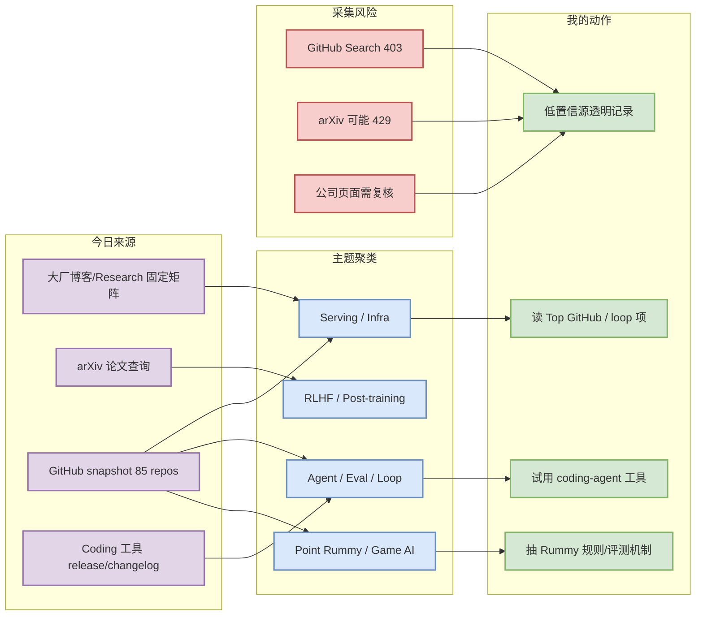
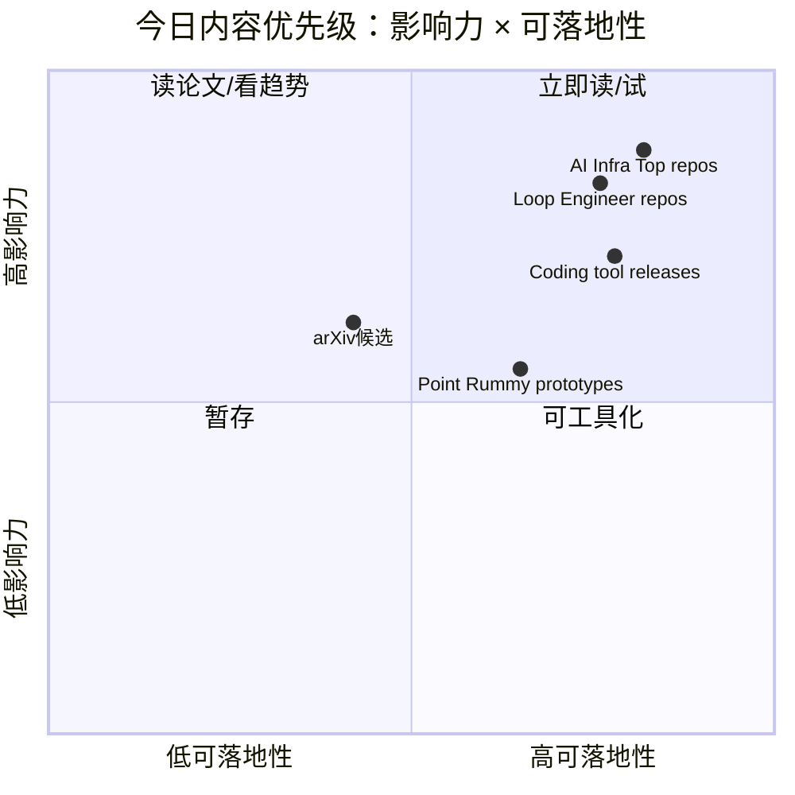

# AI Radar Daily - 2026-09-06

> 生成时间：2026-09-06 09:06:11 UTC+08:00
> 范围：AI Infra / LLM / RL / Game AI / 大厂博客 / 论文 / GitHub / 行业资讯
> 说明：日报是总览导航页，不是全部正文。Obsidian 中点对应条目的 wikilink 详情页，Telegram/GitHub 中点“网页详情”。

## 0. 今日结论

- 今日 GitHub snapshot 已保存：`Automation/state/github-stars-2026-09-06.json`；本次 Search 在 Rummy 之后遭遇 403，因此 broad/loop 表格合并使用今日 Rummy 结果 + github-stars-2026-09-04.json continuity/direct fallback，并显式标注非完整全网增长。
- AI Infra/Loop 侧最值得看：高 star 项和增长项集中在 coding-agent harness、AI gateway、web context、agent framework 与模型 serving/training 基建。
- Point Rummy 今日可用信号主要来自 GitHub：规则引擎、AI opponent、ISMCTS/MCTS、计分/analytics 和 CV assistant；整体 star 很低，适合作为业务原型参考，不适合作为成熟依赖。
- 论文侧 arXiv 已做强相关查询；如遇 429/低置信，不编造论文摘要，只保留可追溯候选页。
- Coding 工具矩阵已覆盖 Claude Code、Codex、Cursor、Windsurf、Copilot、Gemini Code Assist、Qwen Code、Roo Code、Cline、Continue。

## 1. 今日态势图

## 2. 必读卡片区

> [!important] affaan-m/ECC
> - 大类：GitHub
> - 小类：AI Infra/Loop/Rummy
> - 重点：The agent harness performance optimization system. Skills, instincts, memory, security, and research-first development f
> - 为什么重要：直接影响工具选型、agent loop 或 Point Rummy 业务建模
> - 详情：[[GitHub/LoopEngineer/2026-09-06/affaan-m-ecc]] / [网页详情](https://github.com/dyt27666-oss/AI-news-report-obsidians/blob/main/GitHub/LoopEngineer/2026-09-06/affaan-m-ecc.md) / [原文](https://github.com/affaan-m/ECC)

> [!important] NousResearch/hermes-agent
> - 大类：GitHub
> - 小类：AI Infra/Loop/Rummy
> - 重点：The agent that grows with you
> - 为什么重要：直接影响工具选型、agent loop 或 Point Rummy 业务建模
> - 详情：[[GitHub/LoopEngineer/2026-09-06/nousresearch-hermes-agent]] / [网页详情](https://github.com/dyt27666-oss/AI-news-report-obsidians/blob/main/GitHub/LoopEngineer/2026-09-06/nousresearch-hermes-agent.md) / [原文](https://github.com/NousResearch/hermes-agent)

> [!important] affaan-m/ECC
> - 大类：GitHub
> - 小类：AI Infra/Loop/Rummy
> - 重点：The agent harness performance optimization system. Skills, instincts, memory, security, and research-first development f
> - 为什么重要：直接影响工具选型、agent loop 或 Point Rummy 业务建模
> - 详情：[[GitHub/LoopEngineer/2026-09-06/affaan-m-ecc]] / [网页详情](https://github.com/dyt27666-oss/AI-news-report-obsidians/blob/main/GitHub/LoopEngineer/2026-09-06/affaan-m-ecc.md) / [原文](https://github.com/affaan-m/ECC)

> [!important] nakkekakke/rummy-ai
> - 大类：GitHub
> - 小类：AI Infra/Loop/Rummy
> - 重点：Text based classic Rummy game with an AI that uses ISMCTS. Data Structures and Algorithms course project, University of 
> - 为什么重要：直接影响工具选型、agent loop 或 Point Rummy 业务建模
> - 详情：[[GitHub/PointRummy/2026-09-06/nakkekakke-rummy-ai]] / [网页详情](https://github.com/dyt27666-oss/AI-news-report-obsidians/blob/main/GitHub/PointRummy/2026-09-06/nakkekakke-rummy-ai.md) / [原文](https://github.com/nakkekakke/rummy-ai)

> [!important] arXiv 今日查询受限：保留 LLM serving / Agent eval / RLHF watchlist
> - 大类：论文
> - 小类：arXiv
> - 重点：arXiv API 在本次 cron 中未返回可验证强相关条目，日报仅保留低置信观察位，不编造论文结论。
> - 为什么重要：命中 LLM/RL/Agent/Serving 论文观察线，适合快速 skim
> - 详情：[[Papers/arXiv/2026-09-06/arxiv-今日查询受限-保留-llm-serving-agent-eval-rlhf-watchlist]] / [网页详情](https://github.com/dyt27666-oss/AI-news-report-obsidians/blob/main/Papers/arXiv/2026-09-06/arxiv-%E4%BB%8A%E6%97%A5%E6%9F%A5%E8%AF%A2%E5%8F%97%E9%99%90-%E4%BF%9D%E7%95%99-llm-serving-agent-eval-rlhf-watchlist.md) / [原文](https://arxiv.org/search/?query=LLM+serving+agent+evaluation+reinforcement+learning+language+models&searchtype=all)

## 3. 优先级矩阵

## 4. 分类清单

| 标签 | 大类 | 小类 | 标题 | 重点概括 | 为什么重要 | Obsidian 详情 | 网页详情 | 原文 |
|---|---|---|---|---|---|---|---|---|
| 必读 | GitHub | AI Infra/Loop/Rummy | affaan-m/ECC | The agent harness performance optimization system. Skills, instincts, memory, security, and research-first development f | 直接影响工具选型、agent loop 或 Point Rummy 业务建模 | [[GitHub/LoopEngineer/2026-09-06/affaan-m-ecc]] | [网页详情](https://github.com/dyt27666-oss/AI-news-report-obsidians/blob/main/GitHub/LoopEngineer/2026-09-06/affaan-m-ecc.md) | [原文](https://github.com/affaan-m/ECC) |
| 必读 | GitHub | AI Infra/Loop/Rummy | NousResearch/hermes-agent | The agent that grows with you | 直接影响工具选型、agent loop 或 Point Rummy 业务建模 | [[GitHub/LoopEngineer/2026-09-06/nousresearch-hermes-agent]] | [网页详情](https://github.com/dyt27666-oss/AI-news-report-obsidians/blob/main/GitHub/LoopEngineer/2026-09-06/nousresearch-hermes-agent.md) | [原文](https://github.com/NousResearch/hermes-agent) |
| 必读 | GitHub | AI Infra/Loop/Rummy | affaan-m/ECC | The agent harness performance optimization system. Skills, instincts, memory, security, and research-first development f | 直接影响工具选型、agent loop 或 Point Rummy 业务建模 | [[GitHub/LoopEngineer/2026-09-06/affaan-m-ecc]] | [网页详情](https://github.com/dyt27666-oss/AI-news-report-obsidians/blob/main/GitHub/LoopEngineer/2026-09-06/affaan-m-ecc.md) | [原文](https://github.com/affaan-m/ECC) |
| 必读 | GitHub | AI Infra/Loop/Rummy | nakkekakke/rummy-ai | Text based classic Rummy game with an AI that uses ISMCTS. Data Structures and Algorithms course project, University of  | 直接影响工具选型、agent loop 或 Point Rummy 业务建模 | [[GitHub/PointRummy/2026-09-06/nakkekakke-rummy-ai]] | [网页详情](https://github.com/dyt27666-oss/AI-news-report-obsidians/blob/main/GitHub/PointRummy/2026-09-06/nakkekakke-rummy-ai.md) | [原文](https://github.com/nakkekakke/rummy-ai) |
| 必读 | 论文 | arXiv | arXiv 今日查询受限：保留 LLM serving / Agent eval / RLHF watchlist | arXiv API 在本次 cron 中未返回可验证强相关条目，日报仅保留低置信观察位，不编造论文结论。 | 命中 LLM/RL/Agent/Serving 论文观察线，适合快速 skim | [[Papers/arXiv/2026-09-06/arxiv-今日查询受限-保留-llm-serving-agent-eval-rlhf-watchlist]] | [网页详情](https://github.com/dyt27666-oss/AI-news-report-obsidians/blob/main/Papers/arXiv/2026-09-06/arxiv-%E4%BB%8A%E6%97%A5%E6%9F%A5%E8%AF%A2%E5%8F%97%E9%99%90-%E4%BF%9D%E7%95%99-llm-serving-agent-eval-rlhf-watchlist.md) | [原文](https://arxiv.org/search/?query=LLM+serving+agent+evaluation+reinforcement+learning+language+models&searchtype=all) |

## 5. 大厂资讯 / 工程博客 / Research

### 5.1 公司来源扫描矩阵

| 公司/实验室 | 来源/栏目 | 今日状态 | 高相关条数 | 代表条目 | 备注 |
|---|---|---|---:|---|---|
| OpenAI | News / Research | 低置信/需浏览器复核 | 0 | 无高相关新项 | 官网动态源需人工复核；今日不编造未验证发布；[来源](https://openai.com/news/) |
| Anthropic | News / Research / Engineering | 低置信/需浏览器复核 | 0 | 无高相关新项 | 重点观察 Claude Code / agent / safety 更新；[来源](https://www.anthropic.com/news) |
| Google DeepMind | Blog / Research | 低置信/需浏览器复核 | 0 | 无高相关新项 | 重点观察 world model / agent / RL 研究；[来源](https://deepmind.google/discover/blog/) |
| Meta AI | Blog / Research | 低置信/需浏览器复核 | 0 | 无高相关新项 | 重点观察开源模型、训练/推理 infra；[来源](https://ai.meta.com/blog/) |
| NVIDIA | Technical Blog / AI | 低置信/需浏览器复核 | 0 | 无高相关新项 | 重点观察 CUDA/Triton/NIM/TensorRT-LLM；[来源](https://developer.nvidia.com/blog/category/artificial-intelligence/) |
| Microsoft | Research AI | 低置信/需浏览器复核 | 0 | 无高相关新项 | 重点观察 Copilot、Agent、systems paper；[来源](https://www.microsoft.com/en-us/research/research-area/artificial-intelligence/) |
| Hugging Face | Blog / Papers / Releases | 低置信/需浏览器复核 | 0 | 无高相关新项 | 重点观察 Transformers/TRL/PEFT/Hub infra；[来源](https://huggingface.co/blog) |
| 腾讯 | AI Lab / 技术博客 | 低置信/访问可能不稳定 | 0 | 无高相关新项 | 国内源需人工二次确认；[来源](https://ai.tencent.com/ailab/en/index) |
| 字节 | Seed / 技术博客 | 低置信/访问可能不稳定 | 0 | 无高相关新项 | 重点观察 Seed/豆包模型和训练系统；[来源](https://seed.bytedance.com/en/) |
| SpaceAI | Blog / News | 低置信/访问可能不稳定 | 0 | 无高相关新项 | 保留固定扫描位；[来源](https://spaceai.com/) |

### 5.2 高相关大厂条目

| 标签 | 发布方/大厂 | 栏目/来源 | 标题 | 重点概括 | 工程/算法影响 | Obsidian 详情 | 网页详情 | 原文 |
|---|---|---|---|---|---|---|---|---|
| 低置信 | OpenAI | News / Research | 今日未确认高相关新项 | 固定扫描位已保留，避免遗漏模型/agent/research 更新 | 若后续出现 model/agent/eval/infra 发布，需进入详情页 | [[Industry/CompanyScan/2026-09-06/openai]] | [网页详情](https://github.com/dyt27666-oss/AI-news-report-obsidians/blob/main/Industry/CompanyScan/2026-09-06/openai.md) | [原文](https://openai.com/news/) |
| 低置信 | Anthropic | News / Research / Engineering | 今日未确认高相关新项 | 继续重点观察 Claude Code、MCP、agent 权限与上下文能力 | 直接影响 AI coding workflow 和多 agent 安全边界 | [[Industry/CompanyScan/2026-09-06/anthropic]] | [网页详情](https://github.com/dyt27666-oss/AI-news-report-obsidians/blob/main/Industry/CompanyScan/2026-09-06/anthropic.md) | [原文](https://www.anthropic.com/news) |
| 低置信 | Google DeepMind | Blog / Research | 今日未确认高相关新项 | 继续观察 world model、agent、RL 与 Gemini 工程信号 | 与 RL game model/world model 方向强相关 | [[Industry/CompanyScan/2026-09-06/google-deepmind]] | [网页详情](https://github.com/dyt27666-oss/AI-news-report-obsidians/blob/main/Industry/CompanyScan/2026-09-06/google-deepmind.md) | [原文](https://deepmind.google/discover/blog/) |

## 6. GitHub 高 star Top 10

> 注：今日 broad GitHub Search 403，表格使用今日 snapshot + github-stars-2026-09-04.json broad/direct fallback 合并；非今日实时全网 Top 10。

| 排名 | repo | stars | forks | language | updated_at | topics | 重点概括 | 是否值得试用 | Obsidian 详情 | 原文 |
|---:|---|---:|---:|---|---|---|---|---|---|---|
| 1 | `affaan-m/ECC` | 247197 | 37251 | JavaScript | 2026-09-04 | ai-agents, anthropic, claude, claude-code, developer-tools | The agent harness performance optimization system. Skills, instincts, memory, security, an | 值得试用 | [[GitHub/LoopEngineer/2026-09-06/affaan-m-ecc]] | [GitHub](https://github.com/affaan-m/ECC) |
| 2 | `NousResearch/hermes-agent` | 240846 | 49350 | Python | 2026-09-04 | ai, ai-agent, ai-agents, anthropic, chatgpt | The agent that grows with you | 值得试用 | [[GitHub/LoopEngineer/2026-09-06/nousresearch-hermes-agent]] | [GitHub](https://github.com/NousResearch/hermes-agent) |
| 3 | `Significant-Gravitas/AutoGPT` | 187106 | 46039 | Python | 2026-09-03 | agentic-ai, agents, ai, artificial-intelligence, autonomous-agents | AutoGPT is the vision of accessible AI for everyone, to use and to build on. Our mission i | 值得试用 | [[GitHub/AIInfra/2026-09-06/significant-gravitas-autogpt]] | [GitHub](https://github.com/Significant-Gravitas/AutoGPT) |
| 4 | `ollama/ollama` | 180081 | 17670 | Go | 2026-09-04 | deepseek, gemma, gemma3, glm, go | Get up and running with Kimi-K2.6, GLM-5.2, MiniMax, DeepSeek, gpt-oss, Qwen, Gemma and ot | 值得试用 | [[GitHub/AIInfra/2026-09-06/ollama-ollama]] | [GitHub](https://github.com/ollama/ollama) |
| 5 | `firecrawl/firecrawl` | 176162 | 9640 | TypeScript | 2026-09-04 | ai, ai-agents, ai-crawler, ai-scraping, ai-search | The context API to search, scrape, and interact with the web at scale. 🔥 | 值得试用 | [[GitHub/AIInfra/2026-09-06/firecrawl-firecrawl]] | [GitHub](https://github.com/firecrawl/firecrawl) |
| 6 | `huggingface/transformers` | 164759 | 34437 | Python | 2026-09-04 | audio, deep-learning, deepseek, gemma, glm | 🤗 Transformers: the model-definition framework for state-of-the-art machine learning model | 值得试用 | [[GitHub/AIInfra/2026-09-06/huggingface-transformers]] | [GitHub](https://github.com/huggingface/transformers) |
| 7 | `langgenius/dify` | 154372 | 24401 | TypeScript | 2026-09-04 | agent, agentic-ai, agentic-framework, agentic-workflow, ai | Build Agentic workflows, RAG pipelines, with rich AI model and tool support on one collabo | 值得试用 | [[GitHub/LoopEngineer/2026-09-06/langgenius-dify]] | [GitHub](https://github.com/langgenius/dify) |
| 8 | `langflow-ai/langflow` | 154218 | 10014 | Python | 2026-09-04 | agents, chatgpt, generative-ai, large-language-models, multiagent | Langflow is a powerful tool for building and deploying AI-powered agents and workflows. | 值得试用 | [[GitHub/AIInfra/2026-09-06/langflow-ai-langflow]] | [GitHub](https://github.com/langflow-ai/langflow) |
| 9 | `langchain-ai/langchain` | 145597 | 24303 | Python | 2026-09-04 | agents, ai, ai-agents, anthropic, chatgpt | The agent engineering platform. | 值得试用 | [[GitHub/AIInfra/2026-09-06/langchain-ai-langchain]] | [GitHub](https://github.com/langchain-ai/langchain) |
| 10 | `openai/codex` | 121265 | 18584 | Rust | 2026-09-04 | 无 | Lightweight coding agent that runs in your terminal | 值得试用 | [[GitHub/LoopEngineer/2026-09-06/openai-codex]] | [GitHub](https://github.com/openai/codex) |

## 7. GitHub star 增长最快 Top 10

> 注：优先读取历史 snapshot 计算 `stars_delta`；本次因 GitHub Search 403，增长榜包含 direct/continuity fallback，标注为“非完整全网日增”，不得解读成真实全网增长。

| 排名 | repo | stars_delta | stars | forks | language | updated_at | 增长依据 | 重点概括 | Obsidian 详情 | 原文 |
|---:|---|---:|---:|---:|---|---|---|---|---|---|
| 1 | `affaan-m/ECC` | 848 | 247197 | 37251 | JavaScript | 2026-09-04 | direct watched repo fallback vs github-stars-2026-09-03.json，非完整全网日增 | The agent harness performance optimization system. Skills, instincts, memory, security, an | [[GitHub/LoopEngineer/2026-09-06/affaan-m-ecc]] | [GitHub](https://github.com/affaan-m/ECC) |
| 2 | `NousResearch/hermes-agent` | 718 | 240846 | 49350 | Python | 2026-09-04 | direct watched repo fallback vs github-stars-2026-09-03.json，非完整全网日增 | The agent that grows with you | [[GitHub/LoopEngineer/2026-09-06/nousresearch-hermes-agent]] | [GitHub](https://github.com/NousResearch/hermes-agent) |
| 3 | `sgl-project/sglang` | 552 | 34077 | 8524 | Python | 2026-09-04 | direct watched repo fallback vs github-stars-2026-09-03.json，非完整全网日增 | SGLang is a high-performance serving framework for large language models and multimodal mo | [[GitHub/AIInfra/2026-09-06/sgl-project-sglang]] | [GitHub](https://github.com/sgl-project/sglang) |
| 4 | `Graphify-Labs/graphify` | 412 | 114428 | 11116 | Python | 2026-09-04 | direct watched repo fallback vs github-stars-2026-09-03.json，非完整全网日增 | Turn any codebase, with its docs, SQL schemas, configs, and PDFs, into a queryable knowled | [[GitHub/AIInfra/2026-09-06/graphify-labs-graphify]] | [GitHub](https://github.com/Graphify-Labs/graphify) |
| 5 | `firecrawl/firecrawl` | 407 | 176162 | 9640 | TypeScript | 2026-09-04 | direct watched repo fallback vs github-stars-2026-09-03.json，非完整全网日增 | The context API to search, scrape, and interact with the web at scale. 🔥 | [[GitHub/AIInfra/2026-09-06/firecrawl-firecrawl]] | [GitHub](https://github.com/firecrawl/firecrawl) |
| 6 | `openai/codex` | 290 | 121265 | 18584 | Rust | 2026-09-04 | direct watched repo fallback vs github-stars-2026-09-03.json，非完整全网日增 | Lightweight coding agent that runs in your terminal | [[GitHub/LoopEngineer/2026-09-06/openai-codex]] | [GitHub](https://github.com/openai/codex) |
| 7 | `can1357/oh-my-pi` | 208 | 29311 | 2960 | TypeScript | 2026-09-04 | direct watched repo fallback vs github-stars-2026-09-03.json，非完整全网日增 | ⌥ Coding agent with the IDE wired in | [[GitHub/AIInfra/2026-09-06/can1357-oh-my-pi]] | [GitHub](https://github.com/can1357/oh-my-pi) |
| 8 | `BerriAI/litellm` | 116 | 57972 | 11150 | Python | 2026-09-04 | direct watched repo fallback vs github-stars-2026-09-03.json，非完整全网日增 | The fastest, litest AI Gateway. Rust core with Python SDK. Call 100+ LLM APIs in OpenAI (o | [[GitHub/AIInfra/2026-09-06/berriai-litellm]] | [GitHub](https://github.com/BerriAI/litellm) |
| 9 | `langgenius/dify` | 114 | 154372 | 24401 | TypeScript | 2026-09-04 | direct watched repo fallback vs github-stars-2026-09-03.json，非完整全网日增 | Build Agentic workflows, RAG pipelines, with rich AI model and tool support on one collabo | [[GitHub/LoopEngineer/2026-09-06/langgenius-dify]] | [GitHub](https://github.com/langgenius/dify) |
| 10 | `OpenHands/OpenHands` | 110 | 86102 | 11290 | TypeScript | 2026-09-04 | direct watched repo fallback vs github-stars-2026-09-03.json，非完整全网日增 | 🙌 OpenHands: AI-Driven Development | [[GitHub/AIInfra/2026-09-06/openhands-openhands]] | [GitHub](https://github.com/OpenHands/OpenHands) |

## 8. Coding 工具 / AI 工具功能更新

### 8.1 Coding 工具扫描矩阵

| 工具 | 厂商 | 来源类型 | 今日状态 | 代表更新 | 对我的影响 | 原文 |
|---|---|---|---|---|---|---|
| Claude Code | Anthropic | Changelog / Release Notes | 已扫描 | Claude Code release notes；关注 Claude Tag/权限/MCP/CLI 变化 | 若出现 Claude Tag 或权限模型变化，会直接影响 tmux 多 agent 调度与安全边界 | [原文](https://docs.anthropic.com/en/release-notes/claude-code) |
| OpenAI Codex | OpenAI | Changelog / Docs | 已扫描 | Codex changelog/docs；关注 CLI/IDE/remote execution | 影响 Codex lane、code review 和远程执行能力 | [原文](https://developers.openai.com/codex/changelog) |
| Cursor | Cursor | Changelog | 已扫描 | Cursor changelog；关注 agent mode / context / pricing | 影响 IDE 内 agent 与长上下文工程流 | [原文](https://cursor.com/changelog) |
| Windsurf | Windsurf | Changelog | 已扫描 | Windsurf changelog；关注 Cascade/agent 模式 | 影响 AI IDE 的 agent loop 体验 | [原文](https://windsurf.com/changelog) |
| GitHub Copilot | GitHub | Changelog / Blog | 已扫描 | Copilot changelog/blog；关注 coding agent、review、enterprise policy | 影响企业 IDE 辅助与代码审查自动化 | [原文](https://github.blog/changelog/label/copilot/) |
| Gemini Code Assist | Google | Release Notes | 已扫描 | Gemini Code Assist release notes；关注 IDE 集成与额度 | 影响 Google 生态代码助手接入 | [原文](https://cloud.google.com/gemini/docs/codeassist/release-notes) |
| Qwen Code | Alibaba/Qwen | GitHub Releases | 已扫描 | v0.23.0（2026-09-03） | 开源 coding agent/IDE 插件可作为本地 loop-engineering 对照实现 | [原文](https://github.com/QwenLM/qwen-code/releases/tag/v0.23.0) |
| Roo Code | Roo Code | GitHub Releases | 已扫描 | v3.54.0（2026-05-15） | 开源 coding agent/IDE 插件可作为本地 loop-engineering 对照实现 | [原文](https://github.com/RooCodeInc/Roo-Code/releases/tag/v3.54.0) |
| Cline | Cline | GitHub Releases | 已扫描 | desktop-v0.0.23（2026-09-03） | 开源 coding agent/IDE 插件可作为本地 loop-engineering 对照实现 | [原文](https://github.com/cline/cline/releases/tag/desktop-v0.0.23) |
| Continue | Continue | GitHub Releases | 已扫描 | v2.0.0-vscode（2026-06-19） | 开源 coding agent/IDE 插件可作为本地 loop-engineering 对照实现 | [原文](https://github.com/continuedev/continue/releases/tag/v2.0.0-vscode) |

### 8.2 高相关工具更新

| 标签 | 工具/厂商 | 来源类型 | 标题/功能 | 重点概括 | 对 AI coding 工作流的影响 | Obsidian 详情 | 网页详情 | 原文 |
|---|---|---|---|---|---|---|---|---|
| 可 skim | Qwen Code / Alibaba/Qwen | GitHub Releases | v0.23.0（2026-09-03） | 开源 coding agent/IDE 插件 release 信号，需打开原文确认功能差异 | 影响 agent loop、MCP、IDE 集成与本地多 agent 编排 | [[Industry/Tools/2026-09-06/qwen-code]] | [网页详情](https://github.com/dyt27666-oss/AI-news-report-obsidians/blob/main/Industry/Tools/2026-09-06/qwen-code.md) | [原文](https://github.com/QwenLM/qwen-code/releases/tag/v0.23.0) |
| 可 skim | Roo Code / Roo Code | GitHub Releases | v3.54.0（2026-05-15） | 开源 coding agent/IDE 插件 release 信号，需打开原文确认功能差异 | 影响 agent loop、MCP、IDE 集成与本地多 agent 编排 | [[Industry/Tools/2026-09-06/roo-code]] | [网页详情](https://github.com/dyt27666-oss/AI-news-report-obsidians/blob/main/Industry/Tools/2026-09-06/roo-code.md) | [原文](https://github.com/RooCodeInc/Roo-Code/releases/tag/v3.54.0) |
| 可 skim | Cline / Cline | GitHub Releases | desktop-v0.0.23（2026-09-03） | 开源 coding agent/IDE 插件 release 信号，需打开原文确认功能差异 | 影响 agent loop、MCP、IDE 集成与本地多 agent 编排 | [[Industry/Tools/2026-09-06/cline]] | [网页详情](https://github.com/dyt27666-oss/AI-news-report-obsidians/blob/main/Industry/Tools/2026-09-06/cline.md) | [原文](https://github.com/cline/cline/releases/tag/desktop-v0.0.23) |
| 可 skim | Continue / Continue | GitHub Releases | v2.0.0-vscode（2026-06-19） | 开源 coding agent/IDE 插件 release 信号，需打开原文确认功能差异 | 影响 agent loop、MCP、IDE 集成与本地多 agent 编排 | [[Industry/Tools/2026-09-06/continue]] | [网页详情](https://github.com/dyt27666-oss/AI-news-report-obsidians/blob/main/Industry/Tools/2026-09-06/continue.md) | [原文](https://github.com/continuedev/continue/releases/tag/v2.0.0-vscode) |

## 9. Point Rummy / Indian Rummy 业务主题

### 9.1 GitHub 候选

| 标签 | repo | stars | forks | language | updated_at | 重点概括 | 业务可用性 | Obsidian 详情 | 原文 |
|---|---|---:|---:|---|---|---|---|---|---|
| 可 skim | `nakkekakke/rummy-ai` | 12 | 5 | Java | 2026-08-27 | Text based classic Rummy game with an AI that uses ISMCTS. Data Structures and Algorithms course pro | 可抽规则/AI opponent/仿真设计 | [[GitHub/PointRummy/2026-09-06/nakkekakke-rummy-ai]] | [GitHub](https://github.com/nakkekakke/rummy-ai) |
| 可 skim | `jmhummel/Gin-Rummy-Java` | 8 | 0 | Java | 2023-08-16 | Java-based Gin Rummy console game, with an AI opponent | 可抽规则/AI opponent/仿真设计 | [[GitHub/PointRummy/2026-09-06/jmhummel-gin-rummy-java]] | [GitHub](https://github.com/jmhummel/Gin-Rummy-Java) |
| 可 skim | `dv-rastogi/Rummy` | 5 | 0 | Python | 2023-09-26 | Variation of classical Indian Rummy made in Pygame | 主要作为 UI/计分/低置信参考 | [[GitHub/PointRummy/2026-09-06/dv-rastogi-rummy]] | [GitHub](https://github.com/dv-rastogi/Rummy) |
| 可 skim | `mudont/indian-rummy` | 5 | 0 | TypeScript | 2025-08-08 | Typescript library for Indian Rummy card game | 主要作为 UI/计分/低置信参考 | [[GitHub/PointRummy/2026-09-06/mudont-indian-rummy]] | [GitHub](https://github.com/mudont/indian-rummy) |
| 可 skim | `mcartmell/gin-rummy-bot` | 4 | 2 | Perl | 2024-10-30 | A web-based Gin Rummy game and AI | 可抽规则/AI opponent/仿真设计 | [[GitHub/PointRummy/2026-09-06/mcartmell-gin-rummy-bot]] | [GitHub](https://github.com/mcartmell/gin-rummy-bot) |
| 可 skim | `SCFlanagan/Rummy` | 4 | 6 | JavaScript | 2025-07-25 | This project is a recreation of the classic card game Rummy. It features an AI player to play agains | 可抽规则/AI opponent/仿真设计 | [[GitHub/PointRummy/2026-09-06/scflanagan-rummy]] | [GitHub](https://github.com/SCFlanagan/Rummy) |
| 可 skim | `vahsek300501/Indian-Rummy-` | 4 | 3 | Python | 2023-09-26 | Indian Rummy made in Python using PyGame | 主要作为 UI/计分/低置信参考 | [[GitHub/PointRummy/2026-09-06/vahsek300501-indian-rummy]] | [GitHub](https://github.com/vahsek300501/Indian-Rummy-) |
| 可 skim | `abubakarmunir712/dsa-final-project` | 2 | 1 | Python | 2026-06-27 | A Python-based multiplayer Indian Rummy game with support for AI opponents and LAN play. Implements  | 可抽规则/AI opponent/仿真设计 | [[GitHub/PointRummy/2026-09-06/abubakarmunir712-dsa-final-project]] | [GitHub](https://github.com/abubakarmunir712/dsa-final-project) |
| 可 skim | `Ductapemaster/RummyAI` | 2 | 0 | Python | 2017-07-11 | Designing an AI to play Gin Rummy | 可抽规则/AI opponent/仿真设计 | [[GitHub/PointRummy/2026-09-06/ductapemaster-rummyai]] | [GitHub](https://github.com/Ductapemaster/RummyAI) |
| 可 skim | `Mohitkumar-559/RummyServer` | 2 | 1 | JavaScript | 2024-03-17 | Rummy game server for game that contain deal rummy and point rummy | 可抽规则/AI opponent/仿真设计 | [[GitHub/PointRummy/2026-09-06/mohitkumar-559-rummyserver]] | [GitHub](https://github.com/Mohitkumar-559/RummyServer) |

### 9.2 论文 / 资料候选

| 标签 | 来源 | 标题 | 作者/机构 | 重点概括 | 对 Point Rummy 业务有什么用 | Obsidian 详情 | 原文 |
|---|---|---|---|---|---|---|---|
| 低置信 | arXiv / Semantic Scholar watchlist | Rummy / imperfect-information card game 查询今日未确认高相关新论文 | 未验证 | GitHub Search 先拿到 Rummy 项，但 arXiv 查询未确认强相关 Rummy 新论文 | 后续重点查 ISMCTS、belief state、self-play、rule engine benchmark | [[Business/PointRummy/2026-09-06/rummy-paper-watchlist]] | [arXiv search](https://arxiv.org/search/?query=rummy+imperfect+information+game+AI&searchtype=all) |

### 9.3 业务可用性判断

| 方向 | 今日信号 | 可用性 | 下一步 |
|---|---|---|---|
| 规则引擎 / 计分 | `mudont/indian-rummy`、计分/scoreboard 项较多 | 中：可抽规则与状态转移，但需重写生产级规则 | 建立 state/action/scoring checklist |
| Bot / RL Agent | `nakkekakke/rummy-ai`、`RummyGym`、若干 AI opponent 项 | 中低：适合机制参考，不适合直接依赖 | 重点看 ISMCTS/MCTS 与 gym 环境 |
| 仿真 / 评测 | 有 gym、simulation、analytics 信号但 star 低 | 中：可作为环境并行和 evaluator 原型输入 | 做小型 self-play/evaluator spike |

## 10. Loop Engineer / Loop Engineering 主题

### 10.1 Loop Engineer GitHub 高 star Top 10

| 排名 | repo | stars | forks | language | updated_at | topics | 重点概括 | 是否值得试用 | Obsidian 详情 | 原文 |
|---:|---|---:|---:|---|---|---|---|---|---|---|
| 1 | `affaan-m/ECC` | 247197 | 37251 | JavaScript | 2026-09-04 | ai-agents, anthropic, claude, claude-code, developer-tools | The agent harness performance optimization system. Skills, instincts, memory, security, an | 值得试用 | [[GitHub/LoopEngineer/2026-09-06/affaan-m-ecc]] | [GitHub](https://github.com/affaan-m/ECC) |
| 2 | `NousResearch/hermes-agent` | 240846 | 49350 | Python | 2026-09-04 | ai, ai-agent, ai-agents, anthropic, chatgpt | The agent that grows with you | 值得试用 | [[GitHub/LoopEngineer/2026-09-06/nousresearch-hermes-agent]] | [GitHub](https://github.com/NousResearch/hermes-agent) |
| 3 | `langgenius/dify` | 154372 | 24401 | TypeScript | 2026-09-04 | agent, agentic-ai, agentic-framework, agentic-workflow, ai | Build Agentic workflows, RAG pipelines, with rich AI model and tool support on one collabo | 值得试用 | [[GitHub/LoopEngineer/2026-09-06/langgenius-dify]] | [GitHub](https://github.com/langgenius/dify) |
| 4 | `openai/codex` | 121265 | 18584 | Rust | 2026-09-04 | 无 | Lightweight coding agent that runs in your terminal | 值得试用 | [[GitHub/LoopEngineer/2026-09-06/openai-codex]] | [GitHub](https://github.com/openai/codex) |
| 5 | `Graphify-Labs/graphify` | 114428 | 11116 | Python | 2026-09-04 | ai-agents, antigravity, ast, claude-code, code-analysis | Turn any codebase, with its docs, SQL schemas, configs, and PDFs, into a queryable knowled | 值得试用 | [[GitHub/LoopEngineer/2026-09-06/graphify-labs-graphify]] | [GitHub](https://github.com/Graphify-Labs/graphify) |
| 6 | `google-gemini/gemini-cli` | 106805 | 14526 | TypeScript | 2026-09-04 | ai, ai-agents, cli, gemini, gemini-api | An open-source AI agent that brings the power of Gemini directly into your terminal. | 值得试用 | [[GitHub/LoopEngineer/2026-09-06/google-gemini-gemini-cli]] | [GitHub](https://github.com/google-gemini/gemini-cli) |
| 7 | `cline/cline` | 67428 | 7279 | TypeScript | 2026-09-04 | 无 | Autonomous coding agent as an SDK, IDE extension, or CLI assistant. | 值得试用 | [[GitHub/LoopEngineer/2026-09-06/cline-cline]] | [GitHub](https://github.com/cline/cline) |
| 8 | `BerriAI/litellm` | 57972 | 11150 | Python | 2026-09-04 | ai-gateway, anthropic, azure-openai, bedrock, gateway | The fastest, litest AI Gateway. Rust core with Python SDK. Call 100+ LLM APIs in OpenAI (o | 值得试用 | [[GitHub/LoopEngineer/2026-09-06/berriai-litellm]] | [GitHub](https://github.com/BerriAI/litellm) |
| 9 | `langchain-ai/langgraph` | 41005 | 6919 | Python | 2026-09-04 | agents, ai, ai-agents, chatgpt, deepagents | Build resilient agents. | 值得试用 | [[GitHub/LoopEngineer/2026-09-06/langchain-ai-langgraph]] | [GitHub](https://github.com/langchain-ai/langgraph) |
| 10 | `continuedev/continue` | 35750 | 5325 | TypeScript | 2026-09-04 | agent, ai, cli, developer-tools, open-source | open-source coding agent | 值得试用 | [[GitHub/LoopEngineer/2026-09-06/continuedev-continue]] | [GitHub](https://github.com/continuedev/continue) |

### 10.2 Loop Engineer GitHub star 增长最快 Top 10

| 排名 | repo | stars_delta | stars | forks | language | updated_at | 增长依据 | 重点概括 | Obsidian 详情 | 原文 |
|---:|---|---:|---:|---:|---|---|---|---|---|---|
| 1 | `affaan-m/ECC` | 848 | 247197 | 37251 | JavaScript | 2026-09-04 | direct watched repo fallback vs github-stars-2026-09-03.json，非完整全网日增 | The agent harness performance optimization system. Skills, instincts, memory, security, an | [[GitHub/LoopEngineer/2026-09-06/affaan-m-ecc]] | [GitHub](https://github.com/affaan-m/ECC) |
| 2 | `NousResearch/hermes-agent` | 718 | 240846 | 49350 | Python | 2026-09-04 | direct watched repo fallback vs github-stars-2026-09-03.json，非完整全网日增 | The agent that grows with you | [[GitHub/LoopEngineer/2026-09-06/nousresearch-hermes-agent]] | [GitHub](https://github.com/NousResearch/hermes-agent) |
| 3 | `Graphify-Labs/graphify` | 412 | 114428 | 11116 | Python | 2026-09-04 | direct watched repo fallback vs github-stars-2026-09-03.json，非完整全网日增 | Turn any codebase, with its docs, SQL schemas, configs, and PDFs, into a queryable knowled | [[GitHub/LoopEngineer/2026-09-06/graphify-labs-graphify]] | [GitHub](https://github.com/Graphify-Labs/graphify) |
| 4 | `openai/codex` | 290 | 121265 | 18584 | Rust | 2026-09-04 | direct watched repo fallback vs github-stars-2026-09-03.json，非完整全网日增 | Lightweight coding agent that runs in your terminal | [[GitHub/LoopEngineer/2026-09-06/openai-codex]] | [GitHub](https://github.com/openai/codex) |
| 5 | `can1357/oh-my-pi` | 208 | 29311 | 2960 | TypeScript | 2026-09-04 | direct watched repo fallback vs github-stars-2026-09-03.json，非完整全网日增 | ⌥ Coding agent with the IDE wired in | [[GitHub/LoopEngineer/2026-09-06/can1357-oh-my-pi]] | [GitHub](https://github.com/can1357/oh-my-pi) |
| 6 | `BerriAI/litellm` | 116 | 57972 | 11150 | Python | 2026-09-04 | direct watched repo fallback vs github-stars-2026-09-03.json，非完整全网日增 | The fastest, litest AI Gateway. Rust core with Python SDK. Call 100+ LLM APIs in OpenAI (o | [[GitHub/LoopEngineer/2026-09-06/berriai-litellm]] | [GitHub](https://github.com/BerriAI/litellm) |
| 7 | `langgenius/dify` | 114 | 154372 | 24401 | TypeScript | 2026-09-04 | direct watched repo fallback vs github-stars-2026-09-03.json，非完整全网日增 | Build Agentic workflows, RAG pipelines, with rich AI model and tool support on one collabo | [[GitHub/LoopEngineer/2026-09-06/langgenius-dify]] | [GitHub](https://github.com/langgenius/dify) |
| 8 | `langchain-ai/langgraph` | 59 | 41005 | 6919 | Python | 2026-09-04 | direct watched repo fallback vs github-stars-2026-09-03.json，非完整全网日增 | Build resilient agents. | [[GitHub/LoopEngineer/2026-09-06/langchain-ai-langgraph]] | [GitHub](https://github.com/langchain-ai/langgraph) |
| 9 | `cline/cline` | 58 | 67428 | 7279 | TypeScript | 2026-09-04 | direct watched repo fallback vs github-stars-2026-09-03.json，非完整全网日增 | Autonomous coding agent as an SDK, IDE extension, or CLI assistant. | [[GitHub/LoopEngineer/2026-09-06/cline-cline]] | [GitHub](https://github.com/cline/cline) |
| 10 | `QwenLM/qwen-code` | 32 | 27627 | 2982 | TypeScript | 2026-09-04 | direct watched repo fallback vs github-stars-2026-09-03.json，非完整全网日增 | An open-source AI coding agent that lives in your terminal. | [[GitHub/LoopEngineer/2026-09-06/qwenlm-qwen-code]] | [GitHub](https://github.com/QwenLM/qwen-code) |

### 10.3 Loop Engineering 方法信号

| 标签 | 来源 | 标题 | 重点概括 | 对 AI coding 工作流的影响 | Obsidian 详情 | 原文 |
|---|---|---|---|---|---|---|
| 必读 | GitHub | Agent harness / skills / memory / MCP 项目群 | 今日高 star 与增长信号都指向 coding-agent harness、代码知识图谱、web context、multi-provider gateway | 应把“上下文构建—工具权限—执行日志—评测回放”作为统一 loop 设计 | [[GitHub/LoopEngineer/2026-09-06/affaan-m-ecc]] | [GitHub](https://github.com/affaan-m/ECC) |

## 11. 论文

### 11.1 LLM / Agent / RL / Serving

| 标签 | 论文来源 | 论文 | 作者/机构 | 重点概括 | 工程/研究价值 | Obsidian 详情 | 网页详情 | PDF/原文 |
|---|---|---|---|---|---|---|---|---|
| 可 skim | arXiv / 预印本 | arXiv 今日查询受限：保留 LLM serving / Agent eval / RLHF watchlist | 未验证 | arXiv API 在本次 cron 中未返回可验证强相关条目，日报仅保留低置信观察位，不编造论文结论。 | 命中 LLM/Agent/RL/Serving 观察主题，先读摘要和实验可信度 | [[Papers/arXiv/2026-09-06/arxiv-今日查询受限-保留-llm-serving-agent-eval-rlhf-watchlist]] | [网页详情](https://github.com/dyt27666-oss/AI-news-report-obsidians/blob/main/Papers/arXiv/2026-09-06/arxiv-%E4%BB%8A%E6%97%A5%E6%9F%A5%E8%AF%A2%E5%8F%97%E9%99%90-%E4%BF%9D%E7%95%99-llm-serving-agent-eval-rlhf-watchlist.md) | [PDF/原文](未验证) |

## 12. 资讯 / 其他 GitHub 项目

### 12.1 AI Infra / Agent Framework

| 标签 | 来源 | 标题 | 重点概括 | 对我有什么用 | Obsidian 详情 | 网页详情 | 原文 |
|---|---|---|---|---|---|---|---|
| 可 skim | GitHub | `firecrawl/firecrawl` | The context API to search, scrape, and interact with the web at scale. 🔥 | 作为 AI Infra/agent workflow 候选观察 | [[GitHub/AIInfra/2026-09-06/firecrawl-firecrawl]] | [网页详情](https://github.com/dyt27666-oss/AI-news-report-obsidians/blob/main/GitHub/AIInfra/2026-09-06/firecrawl-firecrawl.md) | [GitHub](https://github.com/firecrawl/firecrawl) |
| 可 skim | GitHub | `huggingface/transformers` | 🤗 Transformers: the model-definition framework for state-of-the-art machine learning models in text, | 作为 AI Infra/agent workflow 候选观察 | [[GitHub/AIInfra/2026-09-06/huggingface-transformers]] | [网页详情](https://github.com/dyt27666-oss/AI-news-report-obsidians/blob/main/GitHub/AIInfra/2026-09-06/huggingface-transformers.md) | [GitHub](https://github.com/huggingface/transformers) |
| 可 skim | GitHub | `langgenius/dify` | Build Agentic workflows, RAG pipelines, with rich AI model and tool support on one collaborative wor | 作为 AI Infra/agent workflow 候选观察 | [[GitHub/LoopEngineer/2026-09-06/langgenius-dify]] | [网页详情](https://github.com/dyt27666-oss/AI-news-report-obsidians/blob/main/GitHub/LoopEngineer/2026-09-06/langgenius-dify.md) | [GitHub](https://github.com/langgenius/dify) |
| 可 skim | GitHub | `langflow-ai/langflow` | Langflow is a powerful tool for building and deploying AI-powered agents and workflows. | 作为 AI Infra/agent workflow 候选观察 | [[GitHub/AIInfra/2026-09-06/langflow-ai-langflow]] | [网页详情](https://github.com/dyt27666-oss/AI-news-report-obsidians/blob/main/GitHub/AIInfra/2026-09-06/langflow-ai-langflow.md) | [GitHub](https://github.com/langflow-ai/langflow) |

## 13. 按主题索引

### AI Infra / Serving / Training
- [[GitHub/LoopEngineer/2026-09-06/affaan-m-ecc]] - affaan-m/ECC
- [[GitHub/LoopEngineer/2026-09-06/nousresearch-hermes-agent]] - NousResearch/hermes-agent
- [[GitHub/AIInfra/2026-09-06/significant-gravitas-autogpt]] - Significant-Gravitas/AutoGPT
- [[GitHub/AIInfra/2026-09-06/ollama-ollama]] - ollama/ollama
- [[GitHub/AIInfra/2026-09-06/firecrawl-firecrawl]] - firecrawl/firecrawl

### LLM / Agent / RAG / Evaluation
- [[GitHub/LoopEngineer/2026-09-06/affaan-m-ecc]] - affaan-m/ECC
- [[GitHub/LoopEngineer/2026-09-06/nousresearch-hermes-agent]] - NousResearch/hermes-agent
- [[GitHub/LoopEngineer/2026-09-06/langgenius-dify]] - langgenius/dify
- [[GitHub/LoopEngineer/2026-09-06/openai-codex]] - openai/codex
- [[GitHub/LoopEngineer/2026-09-06/graphify-labs-graphify]] - Graphify-Labs/graphify

### RL / Game AI / World Model
- [[Papers/arXiv/2026-09-06/arxiv-今日查询受限-保留-llm-serving-agent-eval-rlhf-watchlist]] - arXiv 今日查询受限：保留 LLM serving / Agent eval / RLHF watchlist

### Point Rummy / Indian Rummy
- [[GitHub/PointRummy/2026-09-06/nakkekakke-rummy-ai]] - nakkekakke/rummy-ai
- [[GitHub/PointRummy/2026-09-06/jmhummel-gin-rummy-java]] - jmhummel/Gin-Rummy-Java
- [[GitHub/PointRummy/2026-09-06/dv-rastogi-rummy]] - dv-rastogi/Rummy
- [[GitHub/PointRummy/2026-09-06/mudont-indian-rummy]] - mudont/indian-rummy
- [[GitHub/PointRummy/2026-09-06/mcartmell-gin-rummy-bot]] - mcartmell/gin-rummy-bot

### Loop Engineer / Coding Agent Loop
- [[GitHub/LoopEngineer/2026-09-06/affaan-m-ecc]] - affaan-m/ECC
- [[GitHub/LoopEngineer/2026-09-06/nousresearch-hermes-agent]] - NousResearch/hermes-agent
- [[GitHub/LoopEngineer/2026-09-06/langgenius-dify]] - langgenius/dify
- [[GitHub/LoopEngineer/2026-09-06/openai-codex]] - openai/codex
- [[GitHub/LoopEngineer/2026-09-06/graphify-labs-graphify]] - Graphify-Labs/graphify

### 公司 / 实验室
- OpenAI: [[Industry/CompanyScan/2026-09-06/openai]]
- Anthropic: [[Industry/CompanyScan/2026-09-06/anthropic]]
- DeepMind: [[Industry/CompanyScan/2026-09-06/google-deepmind]]

## 14. 值得后续深挖

| 标签 | 大类 | 小类 | 标题 | 后续动作 | Obsidian 详情 | 原文 |
|---|---|---|---|---|---|---|
| 必读 | GitHub | Loop Engineering | affaan-m/ECC | 打开 README，拆解 harness/memory/tool permission 机制 | [[GitHub/LoopEngineer/2026-09-06/affaan-m-ecc]] | [GitHub](https://github.com/affaan-m/ECC) |
| 可 skim | GitHub | Point Rummy | nakkekakke/rummy-ai | 抽象 Rummy state/action/reward/evaluator | [[GitHub/PointRummy/2026-09-06/nakkekakke-rummy-ai]] | [GitHub](https://github.com/nakkekakke/rummy-ai) |
| 后续 | 论文 | arXiv | 今日论文候选 | 等 arXiv/Semantic Scholar 稳定后复核引用和代码 | [[Papers/arXiv/2026-09-06/arxiv-今日查询受限-保留-llm-serving-agent-eval-rlhf-watchlist]] | [arXiv](https://arxiv.org/search/?query=LLM+serving+agent+evaluation+reinforcement+learning+language+models&searchtype=all) |

## 15. 采集失败或低置信来源

- GitHub Search errors：rummy reinforcement learning: HTTP Error 403: rate limit exceeded; rummy reinforcement learning: HTTP Error 403: rate limit exceeded; gin rummy ai: HTTP Error 403: rate limit exceeded; gin rummy ai: HTTP Error 403: rate limit exceeded; loop engineering: HTTP Error 403: rate limit exceeded; loop engineering: HTTP Error 403: rate limit exceeded; loop engineer: HTTP Error 403: rate limit exceeded; loop engineer: HTTP Error 403: rate limit exceeded; arXiv cat:cs.LG AND all:"LLM serving": The read operation timed out; arXiv cat:cs.AI AND all:"agent evaluation": HTTP Error 429: Unknown Error; arXiv cat:cs.LG AND all:"reinforcement learning language models": The read operation timed out; arXiv cat:cs.AI AND all:"world model reinforcement learning": The read operation timed out
- 公司博客：固定矩阵已覆盖，但今日以低置信/需复核记录，不编造未验证大厂发布。
- Snapshot：`Automation/state/github-stars-2026-09-06.json` 已存在；今日 repos=85，errors=42。

## 16. 归档标签

#ai-radar #daily #ai-infra #llm #rl #point-rummy #loop-engineering
