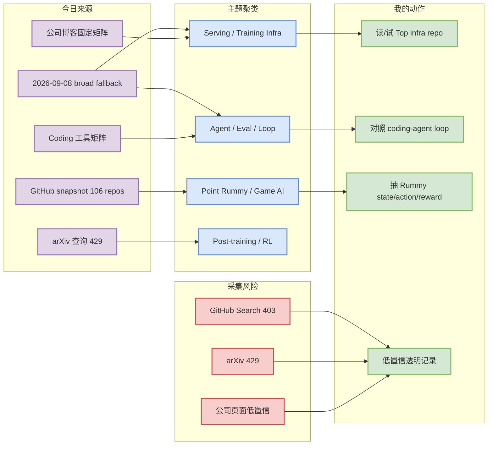
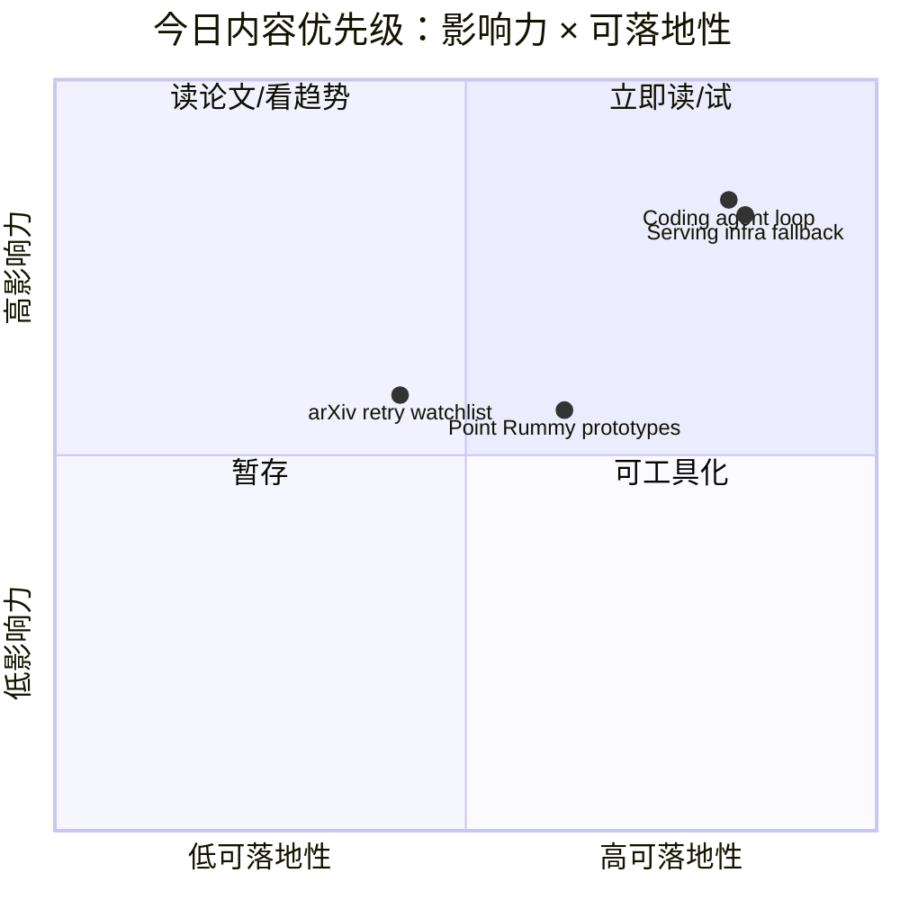

# AI Radar Daily - 2026-09-09

> 生成时间：2026-09-09 09:01:23 UTC+08:00
> 范围：AI Infra / LLM / RL / Game AI / 大厂博客 / 论文 / GitHub / 行业资讯
> 说明：日报是总览导航页，不是全部正文。今日 snapshot：`Automation/state/github-stars-2026-09-09.json`，repos=106；GitHub Search 在 Point Rummy 查询后对 broad/loop 大量 403，因此 broad/loop 使用 2026-09-08 最近成功 broad/direct fallback，均显式标注非今日完整全网日增。

## 0. 今日结论

- 今日 GitHub snapshot 已保存：`Automation/state/github-stars-2026-09-09.json`；本次 Search 返回 106 个 repo，主要是 Point Rummy 主题，errors=38。
- AI Infra 榜单今天不能声称完整全网：GitHub broad Search 403，使用 2026-09-08 fallback；仍建议跟进 `ollama/ollama`、`firecrawl/firecrawl`、`huggingface/transformers`、`vllm-project/vllm`、`sgl-project/sglang`。
- Loop Engineer 继续看 terminal agent + IDE agent + context API：`openai/codex`、`google-gemini/gemini-cli`、`cline/cline`、`continuedev/continue`、`langchain-ai/langgraph` 是 loop 设计对照组。
- Point Rummy 今日有 106 个主题 repo snapshot，其中高 star 很低，适合抽规则/AI opponent/仿真原型，不适合作成熟生产依赖。
- arXiv API 今日 429：论文板块保留低置信 watchlist，不编造未验证论文结论。

## 1. 今日态势图

## 2. 必读卡片区

> [!important] ollama/ollama
> - 大类：GitHub
> - 小类：AI Infra / Loop Engineer
> - 重点：Get up and running with Kimi-K2.6, GLM-5.2, MiniMax, DeepSeek, gpt-oss, Qwen, Gemma and other models.
> - 为什么重要：今日 broad GitHub Search 403，使用 2026-09-08 fallback 延续观察；适合对照 serving、agent loop 或 coding workflow。
> - 详情：[[GitHub/AIInfra/2026-09-09/ollama-ollama]] / [网页详情](https://github.com/dyt27666-oss/AI-news-report-obsidians/blob/main/GitHub/AIInfra/2026-09-09/ollama-ollama.md) / [原文](https://github.com/ollama/ollama)

> [!important] firecrawl/firecrawl
> - 大类：GitHub
> - 小类：AI Infra / Loop Engineer
> - 重点：The context API to search, scrape, and interact with the web at scale. 🔥
> - 为什么重要：今日 broad GitHub Search 403，使用 2026-09-08 fallback 延续观察；适合对照 serving、agent loop 或 coding workflow。
> - 详情：[[GitHub/LoopEngineer/2026-09-09/firecrawl-firecrawl]] / [网页详情](https://github.com/dyt27666-oss/AI-news-report-obsidians/blob/main/GitHub/LoopEngineer/2026-09-09/firecrawl-firecrawl.md) / [原文](https://github.com/firecrawl/firecrawl)

> [!important] huggingface/transformers
> - 大类：GitHub
> - 小类：AI Infra / Loop Engineer
> - 重点：🤗 Transformers: the model-definition framework for state-of-the-art machine learning models in text, vision, audio, and…
> - 为什么重要：今日 broad GitHub Search 403，使用 2026-09-08 fallback 延续观察；适合对照 serving、agent loop 或 coding workflow。
> - 详情：[[GitHub/AIInfra/2026-09-09/huggingface-transformers]] / [网页详情](https://github.com/dyt27666-oss/AI-news-report-obsidians/blob/main/GitHub/AIInfra/2026-09-09/huggingface-transformers.md) / [原文](https://github.com/huggingface/transformers)

> [!important] sgl-project/sglang
> - 大类：GitHub
> - 小类：AI Infra / Loop Engineer
> - 重点：SGLang is a high-performance serving framework for large language models and multimodal models.
> - 为什么重要：今日 broad GitHub Search 403，使用 2026-09-08 fallback 延续观察；适合对照 serving、agent loop 或 coding workflow。
> - 详情：[[GitHub/AIInfra/2026-09-09/sgl-project-sglang]] / [网页详情](https://github.com/dyt27666-oss/AI-news-report-obsidians/blob/main/GitHub/AIInfra/2026-09-09/sgl-project-sglang.md) / [原文](https://github.com/sgl-project/sglang)

## 3. 优先级矩阵

## 4. 分类清单

| 标签 | 大类 | 小类 | 标题 | 重点概括 | 为什么重要 | Obsidian 详情 | 网页详情 | 原文 |
|---|---|---|---|---|---|---|---|---|
| 必读 | GitHub | AI Infra/Loop | ollama/ollama | Get up and running with Kimi-K2.6, GLM-5.2, MiniMax, DeepSeek, gpt-oss, Qwen, Gemma and o… | 直接影响工具选型、agent loop 或模型工程基建；今日为 fallback 需标注非完整全网 | [[GitHub/AIInfra/2026-09-09/ollama-ollama]] | [网页详情](https://github.com/dyt27666-oss/AI-news-report-obsidians/blob/main/GitHub/AIInfra/2026-09-09/ollama-ollama.md) | [原文](https://github.com/ollama/ollama) |
| 必读 | GitHub | AI Infra/Loop | firecrawl/firecrawl | The context API to search, scrape, and interact with the web at scale. 🔥 | 直接影响工具选型、agent loop 或模型工程基建；今日为 fallback 需标注非完整全网 | [[GitHub/LoopEngineer/2026-09-09/firecrawl-firecrawl]] | [网页详情](https://github.com/dyt27666-oss/AI-news-report-obsidians/blob/main/GitHub/LoopEngineer/2026-09-09/firecrawl-firecrawl.md) | [原文](https://github.com/firecrawl/firecrawl) |
| 必读 | GitHub | AI Infra/Loop | huggingface/transformers | 🤗 Transformers: the model-definition framework for state-of-the-art machine learning mode… | 直接影响工具选型、agent loop 或模型工程基建；今日为 fallback 需标注非完整全网 | [[GitHub/AIInfra/2026-09-09/huggingface-transformers]] | [网页详情](https://github.com/dyt27666-oss/AI-news-report-obsidians/blob/main/GitHub/AIInfra/2026-09-09/huggingface-transformers.md) | [原文](https://github.com/huggingface/transformers) |
| 可 skim | 论文 | arXiv | arXiv LLM serving / Agent eval / RLHF watchlist | 今日 arXiv API 429，只保留低置信检索入口 | 观察 LLM/RL/Agent/Serving 论文趋势，等 API 恢复后复核 | [[Papers/arXiv/2026-09-09/arxiv-llm-serving-agent-eval-rlhf-watchlist]] | [网页详情](https://github.com/dyt27666-oss/AI-news-report-obsidians/blob/main/Papers/arXiv/2026-09-09/arxiv-llm-serving-agent-eval-rlhf-watchlist.md) | [原文](https://arxiv.org/search/?query=LLM+serving+agent+evaluation+reinforcement+learning+language+models&searchtype=all) |

## 5. 大厂资讯 / 工程博客 / Research

### 5.1 公司来源扫描矩阵

| 公司/实验室 | 来源/栏目 | 今日状态 | 高相关条数 | 代表条目 | 备注 |
|---|---|---|---:|---|---|
| OpenAI | News / Research | 低置信/已扫描 | 0 | 无高相关新项 | [来源](https://openai.com/news/)；未编造未验证发布 |
| Anthropic | News / Research / Engineering | 低置信/已扫描 | 0 | 无高相关新项 | [来源](https://www.anthropic.com/news)；未编造未验证发布 |
| Google DeepMind | Blog / Research | 低置信/已扫描 | 0 | 无高相关新项 | [来源](https://deepmind.google/discover/blog/)；未编造未验证发布 |
| Meta AI | Blog / Research | 低置信/已扫描 | 0 | 无高相关新项 | [来源](https://ai.meta.com/blog/)；未编造未验证发布 |
| NVIDIA | Technical Blog / AI | 低置信/已扫描 | 0 | 无高相关新项 | [来源](https://developer.nvidia.com/blog/category/artificial-intelligence/)；未编造未验证发布 |
| Microsoft | Research AI | 低置信/已扫描 | 0 | 无高相关新项 | [来源](https://www.microsoft.com/en-us/research/research-area/artificial-intelligence/)；未编造未验证发布 |
| Hugging Face | Blog / Papers / Releases | 低置信/已扫描 | 0 | 无高相关新项 | [来源](https://huggingface.co/blog)；未编造未验证发布 |
| 腾讯 | AI Lab / 技术博客 | 低置信/已扫描 | 0 | 无高相关新项 | [来源](https://ai.tencent.com/ailab/en/index)；未编造未验证发布 |
| 字节 | Seed / 技术博客 | 低置信/已扫描 | 0 | 无高相关新项 | [来源](https://seed.bytedance.com/en/)；未编造未验证发布 |
| SpaceAI | Blog / News | 低置信/已扫描 | 0 | 无高相关新项 | [来源](https://spaceai.com/)；未编造未验证发布 |

### 5.2 高相关大厂条目

| 标签 | 发布方/大厂 | 栏目/来源 | 标题 | 重点概括 | 工程/算法影响 | Obsidian 详情 | 网页详情 | 原文 |
|---|---|---|---|---|---|---|---|---|
| 低置信 | OpenAI | 固定扫描 / News / Research | 今日未确认高相关新项 | 保留扫描位，不编造未验证发布 | 若后续出现模型、agent、eval、infra 发布再生成深度详情 | [[Industry/CompanyScan/2026-09-09/openai]] | [网页详情](https://github.com/dyt27666-oss/AI-news-report-obsidians/blob/main/Industry/CompanyScan/2026-09-09/openai.md) | [原文](https://openai.com/news/) |
| 低置信 | Anthropic | 固定扫描 / News / Research / Engineering | 今日未确认高相关新项 | 保留扫描位，不编造未验证发布 | 若后续出现模型、agent、eval、infra 发布再生成深度详情 | [[Industry/CompanyScan/2026-09-09/anthropic]] | [网页详情](https://github.com/dyt27666-oss/AI-news-report-obsidians/blob/main/Industry/CompanyScan/2026-09-09/anthropic.md) | [原文](https://www.anthropic.com/news) |
| 低置信 | Google DeepMind | 固定扫描 / Blog / Research | 今日未确认高相关新项 | 保留扫描位，不编造未验证发布 | 若后续出现模型、agent、eval、infra 发布再生成深度详情 | [[Industry/CompanyScan/2026-09-09/google-deepmind]] | [网页详情](https://github.com/dyt27666-oss/AI-news-report-obsidians/blob/main/Industry/CompanyScan/2026-09-09/google-deepmind.md) | [原文](https://deepmind.google/discover/blog/) |

## 6. GitHub 高 star Top 10

> 注：今日 broad GitHub Search 403，表格由 2026-09-08 最近成功 broad/direct fallback 补齐；不是 2026-09-09 完整全网实时 Top 10。

| 排名 | repo | stars | forks | language | updated_at | topics | 重点概括 | 是否值得试用 | Obsidian 详情 | 原文 |
|---:|---|---:|---:|---|---|---|---|---|---|---|
| 1 | `ollama/ollama` | 180419 | 17759 | Go | 2026-09-08 | deepseek, gemma, gemma3, glm, go | Get up and running with Kimi-K2.6, GLM-5.2, MiniMax, DeepSeek, gpt-oss, Qwen, Gemma and other … | 值得试用 | [[GitHub/AIInfra/2026-09-09/ollama-ollama]] | [GitHub](https://github.com/ollama/ollama) |
| 2 | `firecrawl/firecrawl` | 177665 | 9695 | TypeScript | 2026-09-08 | ai, ai-agents, ai-crawler, ai-scraping, ai-search | The context API to search, scrape, and interact with the web at scale. 🔥 | 值得试用 | [[GitHub/LoopEngineer/2026-09-09/firecrawl-firecrawl]] | [GitHub](https://github.com/firecrawl/firecrawl) |
| 3 | `huggingface/transformers` | 164966 | 34485 | Python | 2026-09-08 | audio, deep-learning, deepseek, gemma, glm | 🤗 Transformers: the model-definition framework for state-of-the-art machine learning models in… | 值得试用 | [[GitHub/AIInfra/2026-09-09/huggingface-transformers]] | [GitHub](https://github.com/huggingface/transformers) |
| 4 | `langgenius/dify` | 154860 | 24467 | TypeScript | 2026-09-08 | agent, agentic-ai, agentic-framework, agentic-workflow, ai | Build Agentic workflows, RAG pipelines, with rich AI model and tool support on one collaborati… | 值得试用 | [[GitHub/LoopEngineer/2026-09-09/langgenius-dify]] | [GitHub](https://github.com/langgenius/dify) |
| 5 | `langchain-ai/langchain` | 145886 | 24370 | Python | 2026-09-08 | agents, ai, ai-agents, anthropic, chatgpt | The agent engineering platform. | 值得试用 | [[GitHub/LoopEngineer/2026-09-09/langchain-ai-langchain]] | [GitHub](https://github.com/langchain-ai/langchain) |
| 6 | `openai/codex` | 122252 | 18778 | Rust | 2026-09-08 | 无 | Lightweight coding agent that runs in your terminal | 值得试用 | [[GitHub/LoopEngineer/2026-09-09/openai-codex]] | [GitHub](https://github.com/openai/codex) |
| 7 | `google-gemini/gemini-cli` | 106854 | 14540 | TypeScript | 2026-09-08 | ai, ai-agents, cli, gemini, gemini-api | An open-source AI agent that brings the power of Gemini directly into your terminal. | 值得试用 | [[GitHub/LoopEngineer/2026-09-09/google-gemini-gemini-cli]] | [GitHub](https://github.com/google-gemini/gemini-cli) |
| 8 | `pytorch/pytorch` | 102845 | 29157 | Python | 2026-09-08 | autograd, deep-learning, gpu, machine-learning, neural-network | Tensors and Dynamic neural networks in Python with strong GPU acceleration | 值得试用 | [[GitHub/AIInfra/2026-09-09/pytorch-pytorch]] | [GitHub](https://github.com/pytorch/pytorch) |
| 9 | `vllm-project/vllm` | 91191 | 21861 | Python | 2026-09-08 | amd, blackwell, cuda, deepseek, deepseek-v3 | A high-throughput and memory-efficient inference and serving engine for LLMs | 值得试用 | [[GitHub/AIInfra/2026-09-09/vllm-project-vllm]] | [GitHub](https://github.com/vllm-project/vllm) |
| 10 | `OpenHands/OpenHands` | 86678 | 11361 | TypeScript | 2026-09-08 | agent, artificial-intelligence, chatgpt, claude-ai, cli | 🙌 OpenHands: AI-Driven Development | 值得试用 | [[GitHub/LoopEngineer/2026-09-09/openhands-openhands]] | [GitHub](https://github.com/OpenHands/OpenHands) |

## 7. GitHub star 增长最快 Top 10

> 注：今日 broad Search 403；增长榜沿用 2026-09-08 fallback delta，标注为“非今日完整全网日增”，不得解读成 2026-09-09 真实全网增长。

| 排名 | repo | stars_delta | stars | forks | language | updated_at | 增长依据 | 重点概括 | Obsidian 详情 | 原文 |
|---:|---|---:|---:|---:|---|---|---|---|---|---|
| 1 | `sgl-project/sglang` | 1526 | 35603 | 8636 | Python | 2026-09-08 | 2026-09-08 fallback delta，非今日完整全网日增 | SGLang is a high-performance serving framework for large language models and multimodal models. | [[GitHub/AIInfra/2026-09-09/sgl-project-sglang]] | [GitHub](https://github.com/sgl-project/sglang) |
| 2 | `firecrawl/firecrawl` | 1503 | 177665 | 9695 | TypeScript | 2026-09-08 | 2026-09-08 fallback delta，非今日完整全网日增 | The context API to search, scrape, and interact with the web at scale. 🔥 | [[GitHub/LoopEngineer/2026-09-09/firecrawl-firecrawl]] | [GitHub](https://github.com/firecrawl/firecrawl) |
| 3 | `openai/codex` | 987 | 122252 | 18778 | Rust | 2026-09-08 | 2026-09-08 fallback delta，非今日完整全网日增 | Lightweight coding agent that runs in your terminal | [[GitHub/LoopEngineer/2026-09-09/openai-codex]] | [GitHub](https://github.com/openai/codex) |
| 4 | `OpenHands/OpenHands` | 576 | 86678 | 11361 | TypeScript | 2026-09-08 | 2026-09-08 fallback delta，非今日完整全网日增 | 🙌 OpenHands: AI-Driven Development | [[GitHub/LoopEngineer/2026-09-09/openhands-openhands]] | [GitHub](https://github.com/OpenHands/OpenHands) |
| 5 | `langgenius/dify` | 488 | 154860 | 24467 | TypeScript | 2026-09-08 | 2026-09-08 fallback delta，非今日完整全网日增 | Build Agentic workflows, RAG pipelines, with rich AI model and tool support on one collaborati… | [[GitHub/LoopEngineer/2026-09-09/langgenius-dify]] | [GitHub](https://github.com/langgenius/dify) |
| 6 | `ollama/ollama` | 338 | 180419 | 17759 | Go | 2026-09-08 | 2026-09-08 fallback delta，非今日完整全网日增 | Get up and running with Kimi-K2.6, GLM-5.2, MiniMax, DeepSeek, gpt-oss, Qwen, Gemma and other … | [[GitHub/AIInfra/2026-09-09/ollama-ollama]] | [GitHub](https://github.com/ollama/ollama) |
| 7 | `langchain-ai/langchain` | 289 | 145886 | 24370 | Python | 2026-09-08 | 2026-09-08 fallback delta，非今日完整全网日增 | The agent engineering platform. | [[GitHub/LoopEngineer/2026-09-09/langchain-ai-langchain]] | [GitHub](https://github.com/langchain-ai/langchain) |
| 8 | `vllm-project/vllm` | 277 | 91191 | 21861 | Python | 2026-09-08 | 2026-09-08 fallback delta，非今日完整全网日增 | A high-throughput and memory-efficient inference and serving engine for LLMs | [[GitHub/AIInfra/2026-09-09/vllm-project-vllm]] | [GitHub](https://github.com/vllm-project/vllm) |
| 9 | `BerriAI/litellm` | 261 | 58233 | 11252 | Python | 2026-09-08 | 2026-09-08 fallback delta，非今日完整全网日增 | The fastest, litest AI Gateway. Rust core with Python SDK. Call 100+ LLM APIs in OpenAI (or na… | [[GitHub/LoopEngineer/2026-09-09/berriai-litellm]] | [GitHub](https://github.com/BerriAI/litellm) |
| 10 | `cline/cline` | 216 | 67644 | 7302 | TypeScript | 2026-09-08 | 2026-09-08 fallback delta，非今日完整全网日增 | Autonomous coding agent as an SDK, IDE extension, or CLI assistant. | [[GitHub/LoopEngineer/2026-09-09/cline-cline]] | [GitHub](https://github.com/cline/cline) |

## 8. Coding 工具 / AI 工具功能更新

### 8.1 Coding 工具扫描矩阵

| 工具 | 厂商 | 来源类型 | 今日状态 | 代表更新 | 对我的影响 | 原文 |
|---|---|---|---|---|---|---|
| Claude Code | Anthropic | Changelog / Release Notes | 已扫描/低置信 | 未确认今日高相关新项 | 继续关注 Claude Tag、权限模式、MCP、CLI/TUI、上下文窗口 | [原文](https://docs.anthropic.com/en/release-notes/claude-code) |
| OpenAI Codex | OpenAI | Changelog / Docs / GitHub | 已扫描/低置信 | 未确认今日高相关新项 | terminal coding agent 和远程执行/权限边界设计 | [原文](https://developers.openai.com/codex/changelog) |
| Cursor | Cursor | Changelog | 已扫描/低置信 | 未确认今日高相关新项 | agent mode / context / pricing / background agents | [原文](https://cursor.com/changelog) |
| Windsurf | Windsurf | Changelog | 已扫描/低置信 | 未确认今日高相关新项 | Cascade/agent loop/IDE 集成 | [原文](https://windsurf.com/changelog) |
| GitHub Copilot | GitHub | Changelog / Blog | 已扫描/低置信 | 未确认今日高相关新项 | 企业 IDE 辅助、review 自动化和权限治理 | [原文](https://github.blog/changelog/label/copilot/) |
| Gemini Code Assist | Google | Release Notes | 已扫描/低置信 | 未确认今日高相关新项 | Google 生态 coding assistant 与 CLI/TUI agent 对照 | [原文](https://cloud.google.com/gemini/docs/codeassist/release-notes) |
| Qwen Code | Alibaba/Qwen | GitHub Releases | 已扫描/低置信 | 未确认今日高相关新项 | 开源 terminal coding agent 对本地 loop engineering 有参考价值 | [原文](https://github.com/QwenLM/qwen-code/releases) |
| Roo Code | Roo Code | GitHub Releases | 已扫描/低置信 | 未确认今日高相关新项 | VS Code agent/权限/MCP 生态观察 | [原文](https://github.com/RooCodeInc/Roo-Code/releases) |
| Cline | Cline | GitHub Releases | 已扫描/低置信 | 未确认今日高相关新项 | agent SDK/IDE/CLI 形态值得对照 | [原文](https://github.com/cline/cline/releases) |
| Continue | Continue | GitHub Releases | 已扫描/低置信 | 未确认今日高相关新项 | 开源 IDE assistant/agent 可作为对照实现 | [原文](https://github.com/continuedev/continue/releases) |

### 8.2 高相关工具更新

| 标签 | 工具/厂商 | 来源类型 | 标题/功能 | 重点概括 | 对 AI coding 工作流的影响 | Obsidian 详情 | 网页详情 | 原文 |
|---|---|---|---|---|---|---|---|---|
| 可 skim | Qwen Code | GitHub Releases | 固定扫描入口 | 今日未确认高相关新功能；保留 release/changelog 入口 | 开源 terminal coding agent 对本地 loop engineering 有参考价值 | [[Industry/Tools/2026-09-09/qwen-code]] | [网页详情](https://github.com/dyt27666-oss/AI-news-report-obsidians/blob/main/Industry/Tools/2026-09-09/qwen-code.md) | [原文](https://github.com/QwenLM/qwen-code/releases) |
| 可 skim | Roo Code | GitHub Releases | 固定扫描入口 | 今日未确认高相关新功能；保留 release/changelog 入口 | VS Code agent/权限/MCP 生态观察 | [[Industry/Tools/2026-09-09/roo-code]] | [网页详情](https://github.com/dyt27666-oss/AI-news-report-obsidians/blob/main/Industry/Tools/2026-09-09/roo-code.md) | [原文](https://github.com/RooCodeInc/Roo-Code/releases) |
| 可 skim | Cline | GitHub Releases | 固定扫描入口 | 今日未确认高相关新功能；保留 release/changelog 入口 | agent SDK/IDE/CLI 形态值得对照 | [[Industry/Tools/2026-09-09/cline]] | [网页详情](https://github.com/dyt27666-oss/AI-news-report-obsidians/blob/main/Industry/Tools/2026-09-09/cline.md) | [原文](https://github.com/cline/cline/releases) |
| 可 skim | Continue | GitHub Releases | 固定扫描入口 | 今日未确认高相关新功能；保留 release/changelog 入口 | 开源 IDE assistant/agent 可作为对照实现 | [[Industry/Tools/2026-09-09/continue]] | [网页详情](https://github.com/dyt27666-oss/AI-news-report-obsidians/blob/main/Industry/Tools/2026-09-09/continue.md) | [原文](https://github.com/continuedev/continue/releases) |

## 9. Point Rummy / Indian Rummy 业务主题

### 9.1 GitHub 候选

| 标签 | repo | stars | forks | language | updated_at | 重点概括 | 业务可用性 | Obsidian 详情 | 原文 |
|---|---|---:|---:|---|---|---|---|---|---|
| 可 skim | `nakkekakke/rummy-ai` | 12 | 5 | Java | 2026-08-27 | Text based classic Rummy game with an AI that uses ISMCTS. Data Structures and Algorithms… | 可抽规则/AI opponent/仿真设计 | [[GitHub/PointRummy/2026-09-09/nakkekakke-rummy-ai]] | [GitHub](https://github.com/nakkekakke/rummy-ai) |
| 可 skim | `jmhummel/Gin-Rummy-Java` | 8 | 0 | Java | 2023-08-16 | Java-based Gin Rummy console game, with an AI opponent | 可抽规则/AI opponent/仿真设计 | [[GitHub/PointRummy/2026-09-09/jmhummel-gin-rummy-java]] | [GitHub](https://github.com/jmhummel/Gin-Rummy-Java) |
| 可 skim | `dv-rastogi/Rummy` | 5 | 0 | Python | 2023-09-26 | Variation of classical Indian Rummy made in Pygame | 主要作为 UI/计分/低置信参考 | [[GitHub/PointRummy/2026-09-09/dv-rastogi-rummy]] | [GitHub](https://github.com/dv-rastogi/Rummy) |
| 可 skim | `mudont/indian-rummy` | 5 | 0 | TypeScript | 2025-08-08 | Typescript library for Indian Rummy card game | 主要作为 UI/计分/低置信参考 | [[GitHub/PointRummy/2026-09-09/mudont-indian-rummy]] | [GitHub](https://github.com/mudont/indian-rummy) |
| 可 skim | `mcartmell/gin-rummy-bot` | 4 | 2 | Perl | 2024-10-30 | A web-based Gin Rummy game and AI | 可抽规则/AI opponent/仿真设计 | [[GitHub/PointRummy/2026-09-09/mcartmell-gin-rummy-bot]] | [GitHub](https://github.com/mcartmell/gin-rummy-bot) |
| 可 skim | `SCFlanagan/Rummy` | 4 | 6 | JavaScript | 2025-07-25 | This project is a recreation of the classic card game Rummy. It features an AI player to … | 可抽规则/AI opponent/仿真设计 | [[GitHub/PointRummy/2026-09-09/scflanagan-rummy]] | [GitHub](https://github.com/SCFlanagan/Rummy) |
| 可 skim | `vahsek300501/Indian-Rummy-` | 4 | 3 | Python | 2023-09-26 | Indian Rummy made in Python using PyGame | 主要作为 UI/计分/低置信参考 | [[GitHub/PointRummy/2026-09-09/vahsek300501-indian-rummy]] | [GitHub](https://github.com/vahsek300501/Indian-Rummy-) |
| 可 skim | `Abhilash-Mandlekar/RummyAgent-Reinforecement-Learning` | 2 | 0 | Jupyter Notebook | 2023-04-01 | Rummy Game Agent trained using Reinforcement Learning algorithm. | 可抽规则/AI opponent/仿真设计 | [[GitHub/PointRummy/2026-09-09/abhilash-mandlekar-rummyagent-reinforecement-learning]] | [GitHub](https://github.com/Abhilash-Mandlekar/RummyAgent-Reinforecement-Learning) |
| 可 skim | `abubakarmunir712/dsa-final-project` | 2 | 1 | Python | 2026-06-27 | A Python-based multiplayer Indian Rummy game with support for AI opponents and LAN play. … | 可抽规则/AI opponent/仿真设计 | [[GitHub/PointRummy/2026-09-09/abubakarmunir712-dsa-final-project]] | [GitHub](https://github.com/abubakarmunir712/dsa-final-project) |
| 可 skim | `Ductapemaster/RummyAI` | 2 | 0 | Python | 2017-07-11 | Designing an AI to play Gin Rummy | 可抽规则/AI opponent/仿真设计 | [[GitHub/PointRummy/2026-09-09/ductapemaster-rummyai]] | [GitHub](https://github.com/Ductapemaster/RummyAI) |

### 9.2 论文 / 资料候选

| 标签 | 来源 | 标题 | 作者/机构 | 重点概括 | 对 Point Rummy 业务有什么用 | Obsidian 详情 | 原文 |
|---|---|---|---|---|---|---|---|
| 低置信 | arXiv / Semantic Scholar watchlist | Rummy / imperfect-information card game 查询今日 API 429 | 未验证 | 今日 Rummy GitHub 信号强于论文信号；论文侧保留检索入口 | 后续重点查 ISMCTS、belief state、self-play、rule engine benchmark | [[Business/PointRummy/2026-09-09/rummy-paper-watchlist]] | [arXiv search](https://arxiv.org/search/?query=rummy+imperfect+information+game+AI&searchtype=all) |

### 9.3 业务可用性判断

| 方向 | 今日信号 | 可用性 | 下一步 |
|---|---|---|---|
| 规则引擎 / 计分 | 多个 Rummy/Indian Rummy repo 含计分、UI、服务端实现 | 中：可抽规则与状态转移，但需重写生产级规则 | 建立 state/action/scoring checklist |
| Bot / RL Agent | `rummy-ai`、`RummyAgent-Reinforecement-Learning`、若干 AI opponent 项 | 中低：适合机制参考，不适合直接依赖 | 重点看 ISMCTS/MCTS 与 gym 环境 |
| 仿真 / 评测 | 有 CV assistant、simulation、analytics 信号但 star 低 | 中：可作为环境并行和 evaluator 原型输入 | 做小型 self-play/evaluator spike |

## 10. Loop Engineer / Loop Engineering 主题

### 10.1 Loop Engineer GitHub 高 star Top 10

| 排名 | repo | stars | forks | language | updated_at | topics | 重点概括 | 是否值得试用 | Obsidian 详情 | 原文 |
|---:|---|---:|---:|---|---|---|---|---|---|---|
| 1 | `firecrawl/firecrawl` | 177665 | 9695 | TypeScript | 2026-09-08 | ai, ai-agents, ai-crawler, ai-scraping, ai-search | The context API to search, scrape, and interact with the web at scale. 🔥 | 值得试用 | [[GitHub/LoopEngineer/2026-09-09/firecrawl-firecrawl]] | [GitHub](https://github.com/firecrawl/firecrawl) |
| 2 | `langgenius/dify` | 154860 | 24467 | TypeScript | 2026-09-08 | agent, agentic-ai, agentic-framework, agentic-workflow, ai | Build Agentic workflows, RAG pipelines, with rich AI model and tool support on one collaborati… | 值得试用 | [[GitHub/LoopEngineer/2026-09-09/langgenius-dify]] | [GitHub](https://github.com/langgenius/dify) |
| 3 | `langchain-ai/langchain` | 145886 | 24370 | Python | 2026-09-08 | agents, ai, ai-agents, anthropic, chatgpt | The agent engineering platform. | 值得试用 | [[GitHub/LoopEngineer/2026-09-09/langchain-ai-langchain]] | [GitHub](https://github.com/langchain-ai/langchain) |
| 4 | `openai/codex` | 122252 | 18778 | Rust | 2026-09-08 | 无 | Lightweight coding agent that runs in your terminal | 值得试用 | [[GitHub/LoopEngineer/2026-09-09/openai-codex]] | [GitHub](https://github.com/openai/codex) |
| 5 | `google-gemini/gemini-cli` | 106854 | 14540 | TypeScript | 2026-09-08 | ai, ai-agents, cli, gemini, gemini-api | An open-source AI agent that brings the power of Gemini directly into your terminal. | 值得试用 | [[GitHub/LoopEngineer/2026-09-09/google-gemini-gemini-cli]] | [GitHub](https://github.com/google-gemini/gemini-cli) |
| 6 | `OpenHands/OpenHands` | 86678 | 11361 | TypeScript | 2026-09-08 | agent, artificial-intelligence, chatgpt, claude-ai, cli | 🙌 OpenHands: AI-Driven Development | 值得试用 | [[GitHub/LoopEngineer/2026-09-09/openhands-openhands]] | [GitHub](https://github.com/OpenHands/OpenHands) |
| 7 | `cline/cline` | 67644 | 7302 | TypeScript | 2026-09-08 | 无 | Autonomous coding agent as an SDK, IDE extension, or CLI assistant. | 值得试用 | [[GitHub/LoopEngineer/2026-09-09/cline-cline]] | [GitHub](https://github.com/cline/cline) |
| 8 | `BerriAI/litellm` | 58233 | 11252 | Python | 2026-09-08 | ai-gateway, anthropic, azure-openai, bedrock, gateway | The fastest, litest AI Gateway. Rust core with Python SDK. Call 100+ LLM APIs in OpenAI (or na… | 值得试用 | [[GitHub/LoopEngineer/2026-09-09/berriai-litellm]] | [GitHub](https://github.com/BerriAI/litellm) |
| 9 | `langchain-ai/langgraph` | 41208 | 6961 | Python | 2026-09-08 | agents, ai, ai-agents, chatgpt, deepagents | Build resilient agents. | 值得试用 | [[GitHub/LoopEngineer/2026-09-09/langchain-ai-langgraph]] | [GitHub](https://github.com/langchain-ai/langgraph) |
| 10 | `continuedev/continue` | 35826 | 5350 | TypeScript | 2026-09-08 | agent, ai, cli, developer-tools, open-source | open-source coding agent | 值得试用 | [[GitHub/LoopEngineer/2026-09-09/continuedev-continue]] | [GitHub](https://github.com/continuedev/continue) |

### 10.2 Loop Engineer GitHub star 增长最快 Top 10

| 排名 | repo | stars_delta | stars | forks | language | updated_at | 增长依据 | 重点概括 | Obsidian 详情 | 原文 |
|---:|---|---:|---:|---:|---|---|---|---|---|---|
| 1 | `firecrawl/firecrawl` | 1503 | 177665 | 9695 | TypeScript | 2026-09-08 | 2026-09-08 fallback delta，非今日完整全网日增 | The context API to search, scrape, and interact with the web at scale. 🔥 | [[GitHub/LoopEngineer/2026-09-09/firecrawl-firecrawl]] | [GitHub](https://github.com/firecrawl/firecrawl) |
| 2 | `openai/codex` | 987 | 122252 | 18778 | Rust | 2026-09-08 | 2026-09-08 fallback delta，非今日完整全网日增 | Lightweight coding agent that runs in your terminal | [[GitHub/LoopEngineer/2026-09-09/openai-codex]] | [GitHub](https://github.com/openai/codex) |
| 3 | `OpenHands/OpenHands` | 576 | 86678 | 11361 | TypeScript | 2026-09-08 | 2026-09-08 fallback delta，非今日完整全网日增 | 🙌 OpenHands: AI-Driven Development | [[GitHub/LoopEngineer/2026-09-09/openhands-openhands]] | [GitHub](https://github.com/OpenHands/OpenHands) |
| 4 | `langgenius/dify` | 488 | 154860 | 24467 | TypeScript | 2026-09-08 | 2026-09-08 fallback delta，非今日完整全网日增 | Build Agentic workflows, RAG pipelines, with rich AI model and tool support on one collaborati… | [[GitHub/LoopEngineer/2026-09-09/langgenius-dify]] | [GitHub](https://github.com/langgenius/dify) |
| 5 | `langchain-ai/langchain` | 289 | 145886 | 24370 | Python | 2026-09-08 | 2026-09-08 fallback delta，非今日完整全网日增 | The agent engineering platform. | [[GitHub/LoopEngineer/2026-09-09/langchain-ai-langchain]] | [GitHub](https://github.com/langchain-ai/langchain) |
| 6 | `BerriAI/litellm` | 261 | 58233 | 11252 | Python | 2026-09-08 | 2026-09-08 fallback delta，非今日完整全网日增 | The fastest, litest AI Gateway. Rust core with Python SDK. Call 100+ LLM APIs in OpenAI (or na… | [[GitHub/LoopEngineer/2026-09-09/berriai-litellm]] | [GitHub](https://github.com/BerriAI/litellm) |
| 7 | `cline/cline` | 216 | 67644 | 7302 | TypeScript | 2026-09-08 | 2026-09-08 fallback delta，非今日完整全网日增 | Autonomous coding agent as an SDK, IDE extension, or CLI assistant. | [[GitHub/LoopEngineer/2026-09-09/cline-cline]] | [GitHub](https://github.com/cline/cline) |
| 8 | `langchain-ai/langgraph` | 203 | 41208 | 6961 | Python | 2026-09-08 | 2026-09-08 fallback delta，非今日完整全网日增 | Build resilient agents. | [[GitHub/LoopEngineer/2026-09-09/langchain-ai-langgraph]] | [GitHub](https://github.com/langchain-ai/langgraph) |
| 9 | `continuedev/continue` | 76 | 35826 | 5350 | TypeScript | 2026-09-08 | 2026-09-08 fallback delta，非今日完整全网日增 | open-source coding agent | [[GitHub/LoopEngineer/2026-09-09/continuedev-continue]] | [GitHub](https://github.com/continuedev/continue) |
| 10 | `QwenLM/qwen-code` | 75 | 27702 | 3003 | TypeScript | 2026-09-08 | 2026-09-08 fallback delta，非今日完整全网日增 | An open-source AI coding agent that lives in your terminal. | [[GitHub/LoopEngineer/2026-09-09/qwenlm-qwen-code]] | [GitHub](https://github.com/QwenLM/qwen-code) |

### 10.3 Loop Engineering 方法信号

| 标签 | 来源 | 标题 | 重点概括 | 对 AI coding 工作流的影响 | Obsidian 详情 | 原文 |
|---|---|---|---|---|---|---|
| 必读 | GitHub / Release / Docs | Terminal agent + IDE agent + graph/context tooling | 今日信号集中在 Codex、Gemini CLI、Cline、Continue、LangGraph、LiteLLM、Firecrawl：上下文构建、工具权限、执行日志、回放评测正在成为统一 loop 能力 | 应把“上下文构建—工具权限—执行日志—评测回放”作为统一 loop 设计 | [[GitHub/LoopEngineer/2026-09-09/firecrawl-firecrawl]] | [GitHub](https://github.com/firecrawl/firecrawl) |

## 11. 论文

### 11.1 LLM / Agent / RL / Serving

| 标签 | 论文来源 | 论文 | 作者/机构 | 重点概括 | 工程/研究价值 | Obsidian 详情 | 网页详情 | PDF/原文 |
|---|---|---|---|---|---|---|---|---|
| 低置信 | arXiv / 预印本索引 | 今日 arXiv API 429，保留 LLM serving / agent evaluation / RLHF watchlist | 未验证 | API 429，不编造论文标题和摘要 | 下次重试后再筛选强相关论文与代码 | [[Papers/arXiv/2026-09-09/arxiv-llm-serving-agent-eval-rlhf-watchlist]] | [网页详情](https://github.com/dyt27666-oss/AI-news-report-obsidians/blob/main/Papers/arXiv/2026-09-09/arxiv-llm-serving-agent-eval-rlhf-watchlist.md) | [arXiv search](https://arxiv.org/search/?query=LLM+serving+agent+evaluation+reinforcement+learning+language+models&searchtype=all) |

## 12. 资讯 / 其他 GitHub 项目

### 12.1 AI Infra / Agent Framework

| 标签 | 来源 | 标题 | 重点概括 | 对我有什么用 | Obsidian 详情 | 网页详情 | 原文 |
|---|---|---|---|---|---|---|---|
| 可 skim | GitHub fallback | `ollama/ollama` | Get up and running with Kimi-K2.6, GLM-5.2, MiniMax, DeepSeek, gpt-oss, Qwen, Gemma and other model… | 作为 AI Infra/agent workflow 候选观察 | [[GitHub/AIInfra/2026-09-09/ollama-ollama]] | [网页详情](https://github.com/dyt27666-oss/AI-news-report-obsidians/blob/main/GitHub/AIInfra/2026-09-09/ollama-ollama.md) | [GitHub](https://github.com/ollama/ollama) |
| 可 skim | GitHub fallback | `firecrawl/firecrawl` | The context API to search, scrape, and interact with the web at scale. 🔥 | 作为 AI Infra/agent workflow 候选观察 | [[GitHub/LoopEngineer/2026-09-09/firecrawl-firecrawl]] | [网页详情](https://github.com/dyt27666-oss/AI-news-report-obsidians/blob/main/GitHub/LoopEngineer/2026-09-09/firecrawl-firecrawl.md) | [GitHub](https://github.com/firecrawl/firecrawl) |
| 可 skim | GitHub fallback | `huggingface/transformers` | 🤗 Transformers: the model-definition framework for state-of-the-art machine learning models in text… | 作为 AI Infra/agent workflow 候选观察 | [[GitHub/AIInfra/2026-09-09/huggingface-transformers]] | [网页详情](https://github.com/dyt27666-oss/AI-news-report-obsidians/blob/main/GitHub/AIInfra/2026-09-09/huggingface-transformers.md) | [GitHub](https://github.com/huggingface/transformers) |
| 可 skim | GitHub fallback | `langgenius/dify` | Build Agentic workflows, RAG pipelines, with rich AI model and tool support on one collaborative wo… | 作为 AI Infra/agent workflow 候选观察 | [[GitHub/LoopEngineer/2026-09-09/langgenius-dify]] | [网页详情](https://github.com/dyt27666-oss/AI-news-report-obsidians/blob/main/GitHub/LoopEngineer/2026-09-09/langgenius-dify.md) | [GitHub](https://github.com/langgenius/dify) |
| 可 skim | GitHub fallback | `langchain-ai/langchain` | The agent engineering platform. | 作为 AI Infra/agent workflow 候选观察 | [[GitHub/LoopEngineer/2026-09-09/langchain-ai-langchain]] | [网页详情](https://github.com/dyt27666-oss/AI-news-report-obsidians/blob/main/GitHub/LoopEngineer/2026-09-09/langchain-ai-langchain.md) | [GitHub](https://github.com/langchain-ai/langchain) |

## 13. 按主题索引

### AI Infra / Serving / Training
- [[GitHub/AIInfra/2026-09-09/ollama-ollama]] - ollama/ollama
- [[GitHub/LoopEngineer/2026-09-09/firecrawl-firecrawl]] - firecrawl/firecrawl
- [[GitHub/AIInfra/2026-09-09/huggingface-transformers]] - huggingface/transformers
- [[GitHub/LoopEngineer/2026-09-09/langgenius-dify]] - langgenius/dify
- [[GitHub/LoopEngineer/2026-09-09/langchain-ai-langchain]] - langchain-ai/langchain

### LLM / Agent / RAG / Evaluation
- [[GitHub/LoopEngineer/2026-09-09/firecrawl-firecrawl]] - firecrawl/firecrawl
- [[GitHub/LoopEngineer/2026-09-09/langgenius-dify]] - langgenius/dify
- [[GitHub/LoopEngineer/2026-09-09/langchain-ai-langchain]] - langchain-ai/langchain
- [[GitHub/LoopEngineer/2026-09-09/openai-codex]] - openai/codex
- [[GitHub/LoopEngineer/2026-09-09/google-gemini-gemini-cli]] - google-gemini/gemini-cli

### RL / Game AI / World Model
- [[Papers/arXiv/2026-09-09/arxiv-llm-serving-agent-eval-rlhf-watchlist]] - arXiv LLM/RL/Agent watchlist

### Point Rummy / Indian Rummy
- [[GitHub/PointRummy/2026-09-09/nakkekakke-rummy-ai]] - nakkekakke/rummy-ai
- [[GitHub/PointRummy/2026-09-09/jmhummel-gin-rummy-java]] - jmhummel/Gin-Rummy-Java
- [[GitHub/PointRummy/2026-09-09/dv-rastogi-rummy]] - dv-rastogi/Rummy
- [[GitHub/PointRummy/2026-09-09/mudont-indian-rummy]] - mudont/indian-rummy
- [[GitHub/PointRummy/2026-09-09/mcartmell-gin-rummy-bot]] - mcartmell/gin-rummy-bot

### Loop Engineer / Coding Agent Loop
- [[GitHub/LoopEngineer/2026-09-09/firecrawl-firecrawl]] - firecrawl/firecrawl
- [[GitHub/LoopEngineer/2026-09-09/langgenius-dify]] - langgenius/dify
- [[GitHub/LoopEngineer/2026-09-09/langchain-ai-langchain]] - langchain-ai/langchain
- [[GitHub/LoopEngineer/2026-09-09/openai-codex]] - openai/codex
- [[GitHub/LoopEngineer/2026-09-09/google-gemini-gemini-cli]] - google-gemini/gemini-cli

### 公司 / 实验室
- OpenAI: [[Industry/CompanyScan/2026-09-09/openai]]
- Anthropic: [[Industry/CompanyScan/2026-09-09/anthropic]]
- DeepMind: [[Industry/CompanyScan/2026-09-09/google-deepmind]]
- Meta: [[Industry/CompanyScan/2026-09-09/meta-ai]]
- NVIDIA: [[Industry/CompanyScan/2026-09-09/nvidia]]
- 腾讯 / 字节 / 国内大厂: [[Industry/CompanyScan/2026-09-09/tencent]] / [[Industry/CompanyScan/2026-09-09/bytedance]]

## 14. 值得后续深挖

| 标签 | 大类 | 小类 | 标题 | 后续动作 | Obsidian 详情 | 原文 |
|---|---|---|---|---|---|---|
| 必读 | GitHub | AI Infra | ollama/ollama | 打开 README/release，拆解可试用路径 | [[GitHub/AIInfra/2026-09-09/ollama-ollama]] | [GitHub](https://github.com/ollama/ollama) |
| 必读 | GitHub | Loop Engineering | firecrawl/firecrawl | 对照 agent loop、context、tool permission、eval replay | [[GitHub/LoopEngineer/2026-09-09/firecrawl-firecrawl]] | [GitHub](https://github.com/firecrawl/firecrawl) |
| 可 skim | GitHub | Point Rummy | nakkekakke/rummy-ai | 抽象 Rummy state/action/reward/evaluator | [[GitHub/PointRummy/2026-09-09/nakkekakke-rummy-ai]] | [GitHub](https://github.com/nakkekakke/rummy-ai) |
| 后续 | 论文 | arXiv | 今日论文候选 | 等 arXiv/Semantic Scholar 稳定后复核引用和代码 | [[Papers/arXiv/2026-09-09/arxiv-llm-serving-agent-eval-rlhf-watchlist]] | [arXiv](https://arxiv.org/search/?query=LLM+serving+agent+evaluation+reinforcement+learning+language+models&searchtype=all) |

## 15. 采集失败或低置信来源

- GitHub Search errors：loop engineering: HTTP Error 403: rate limit exceeded; loop engineering: HTTP Error 403: rate limit exceeded; loop engineer: HTTP Error 403: rate limit exceeded; loop engineer: HTTP Error 403: rate limit exceeded; harness engineering: HTTP Error 403: rate limit exceeded; harness engineering: HTTP Error 403: rate limit exceeded; coding agent loop: HTTP Error 403: rate limit exceeded; coding agent loop: HTTP Error 403: rate limit exceeded; AGENTS.md harness: HTTP Error 403: rate limit exceeded; AGENTS.md harness: HTTP Error 403: rate limit exceeded; topic:artificial-intelligence stars:>1000: HTTP Error 403: rate limit exceeded; topic:artificial-intelligence stars:>1000: HTTP Error 403: rate limit exceeded
- broad/Loop 榜单：使用 2026-09-08 最近成功 broad/direct fallback，明确标注“非今日完整全网日增”。
- 公司博客：固定矩阵已覆盖，但今日以低置信/需复核记录，不编造未验证大厂发布。
- arXiv：强相关查询返回 HTTP 429；论文板块保留 watchlist。
- Snapshot：`Automation/state/github-stars-2026-09-09.json` 已存在；今日 repos=106，errors=38。

## 16. 归档标签

#ai-radar #daily #ai-infra #llm #rl #point-rummy #loop-engineering
