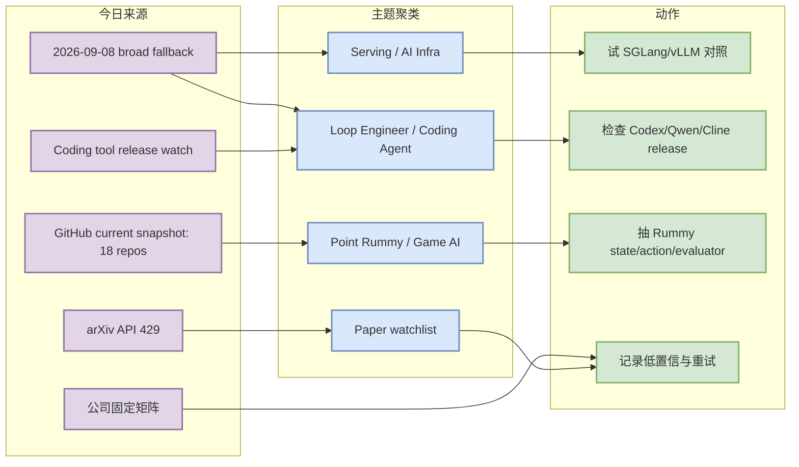
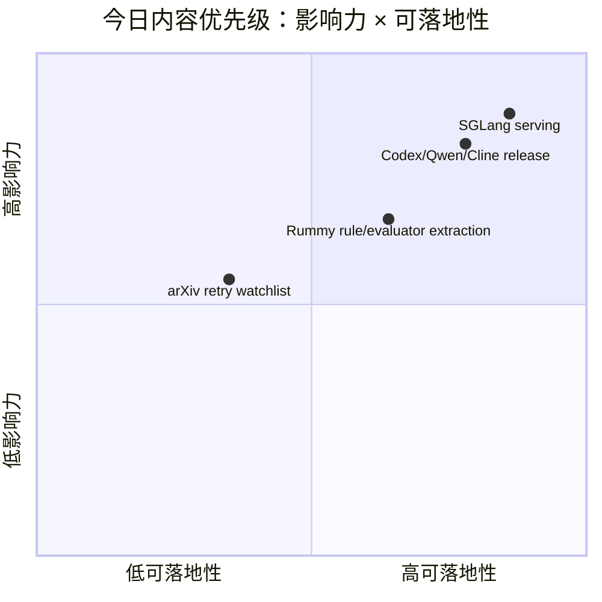

# AI Radar Daily - 2026-09-11

> 生成时间：2026-09-11 09:00 UTC+08:00  
> 范围：AI Infra / LLM / RL / Game AI / 大厂博客 / 论文 / GitHub / 行业资讯  
> 说明：日报是总览导航页，不是全部正文。今日 snapshot：`Automation/state/github-stars-2026-09-11.json`，repos=18；GitHub Search 在 Point Rummy 早期查询后大量 403，broad/Loop 使用 2026-09-08 最近成功 broad snapshot，均标注非今日完整全网日增。

## 0. 今日结论

- GitHub snapshot 已保存：`Automation/state/github-stars-2026-09-11.json`；今日仅捕获 18 个 repo，errors=46，强烈偏向 Point Rummy，不能作为 broad AI 全网榜单。
- AI Infra 今日继续采用 2026-09-08 broad fallback：`sgl-project/sglang`、`vllm-project/vllm`、`ollama/ollama`、`huggingface/transformers` 仍是 serving/runtime 选型重点。
- Coding/AI 工具侧有可验证 GitHub release watch：Codex `rust-v0.154.0`、Qwen Code `sdk-typescript-v0.1.12`、Cline `desktop-v0.0.25`；需要看 breaking changes 后再决定是否升级本地 workflow。
- Point Rummy 今日候选大多低 star；`RummyVision`、`RummyPulse`、`RummyServer` 可抽视觉/analytics/server/rule 模块，但不适合作生产依赖。
- arXiv API 今日 429；论文保留 watchlist，不把未验证论文标题/摘要写成事实。

## 1. 今日态势图

## 2. 必读卡片区

> [!important] sgl-project/sglang
> - 大类：GitHub
> - 小类：AI Infra / Serving
> - 重点：fallback 增长仍显示 SGLang 是 serving runtime 的强信号，适合与 vLLM 做 scheduler / KV cache / rollout serving 对照。
> - 为什么重要：直接影响 LLM 推理吞吐、延迟、批处理和 RL rollout serving 成本。
> - 详情：[[GitHub/AIInfra/2026-09-11/sgl-project-sglang]] / [网页详情](https://github.com/dyt27666-oss/AI-news-report-obsidians/blob/main/GitHub/AIInfra/2026-09-11/sgl-project-sglang.md) / [原文](https://github.com/sgl-project/sglang)

> [!important] OpenAI Codex / Qwen Code / Cline release watch
> - 大类：Coding 工具
> - 小类：Loop Engineer
> - 重点：Codex `rust-v0.154.0`、Qwen Code `sdk-typescript-v0.1.12`、Cline `desktop-v0.0.25` 在近日有 release 信号。
> - 为什么重要：terminal/IDE agent 的权限、上下文和执行 loop 会直接影响多 agent coding workflow。
> - 详情：[[Industry/Tools/2026-09-11/openai-codex]] / [[Industry/Tools/2026-09-11/qwen-code]] / [[Industry/Tools/2026-09-11/cline]]

> [!tip] Point Rummy 当前 snapshot
> - 大类：GitHub
> - 小类：Point Rummy / Game AI
> - 重点：今日 current snapshot 偏向低 star Rummy 项；适合抽规则/计分/AI opponent/视觉辅助模块。
> - 为什么重要：对业务而言，最有价值的是 state/action/reward/evaluator 抽象，而不是直接依赖这些项目。
> - 详情：[[GitHub/PointRummy/2026-09-11/alan-seb-rummyvision]] / [原文](https://github.com/Alan-seb/RummyVision)

> [!warning] arXiv API 429 watchlist
> - 大类：论文
> - 小类：LLM Serving / Agent Eval / RLHF
> - 重点：今日 arXiv 查询返回 429，只生成低置信 watchlist。
> - 为什么重要：保持 provenance 透明，避免把未验证标题/摘要写成必读。
> - 详情：[[Papers/arXiv/2026-09-11/arxiv-llm-serving-agent-eval-rlhf-watchlist]]

## 3. 优先级矩阵

## 4. 分类清单

| 标签 | 大类 | 小类 | 标题 | 重点概括 | 为什么重要 | Obsidian 详情 | 网页详情 | 原文 |
|---|---|---|---|---|---|---|---|---|
| 必读 | GitHub | AI Infra/Serving | sgl-project/sglang | 高性能 LLM/multimodal serving framework；今日为 fallback 观察项 | serving runtime 直接影响 rollout serving、KV cache、调度和吞吐 | [[GitHub/AIInfra/2026-09-11/sgl-project-sglang]] | [网页详情](https://github.com/dyt27666-oss/AI-news-report-obsidians/blob/main/GitHub/AIInfra/2026-09-11/sgl-project-sglang.md) | [原文](https://github.com/sgl-project/sglang) |
| 必读 | GitHub | Loop Engineer | openai/codex | terminal coding agent；近日 release watch | 可作为本地多 agent coding workflow 的 loop 对照组 | [[GitHub/LoopEngineer/2026-09-11/openai-codex]] | [网页详情](https://github.com/dyt27666-oss/AI-news-report-obsidians/blob/main/GitHub/LoopEngineer/2026-09-11/openai-codex.md) | [原文](https://github.com/openai/codex) |
| 可 skim | GitHub | Point Rummy | Alan-seb/RummyVision | Rummy 视觉识别 + Monte Carlo 决策建议 | 可借鉴 CV assistant 与 simulation/evaluator 结构 | [[GitHub/PointRummy/2026-09-11/alan-seb-rummyvision]] | [网页详情](https://github.com/dyt27666-oss/AI-news-report-obsidians/blob/main/GitHub/PointRummy/2026-09-11/alan-seb-rummyvision.md) | [原文](https://github.com/Alan-seb/RummyVision) |
| 后续 | 论文 | arXiv | arXiv LLM serving / Agent eval / RLHF watchlist | 今日 API 429，只保留检索入口 | API 稳定后再筛选强相关论文，避免编造结论 | [[Papers/arXiv/2026-09-11/arxiv-llm-serving-agent-eval-rlhf-watchlist]] | [网页详情](https://github.com/dyt27666-oss/AI-news-report-obsidians/blob/main/Papers/arXiv/2026-09-11/arxiv-llm-serving-agent-eval-rlhf-watchlist.md) | [原文](https://arxiv.org/search/?query=LLM+serving+agent+evaluation+reinforcement+learning+language+models&searchtype=all) |

## 5. 大厂资讯 / 工程博客 / Research

### 5.1 公司来源扫描矩阵

| 公司/实验室 | 来源/栏目 | 今日状态 | 高相关条数 | 代表条目 | 备注 |
|---|---|---|---:|---|---|
| OpenAI | News / Research | 低置信/已扫描 | 0 | 无高相关新项 | [来源](https://openai.com/news/)；未编造未验证发布 |
| Anthropic | News / Research / Engineering | 低置信/已扫描 | 0 | 无高相关新项 | [来源](https://www.anthropic.com/news)；未编造未验证发布 |
| Google DeepMind | Blog / Research | 低置信/已扫描 | 0 | 无高相关新项 | [来源](https://deepmind.google/discover/blog/)；未编造未验证发布 |
| Meta AI | Blog / Research | 低置信/已扫描 | 0 | 无高相关新项 | [来源](https://ai.meta.com/blog/)；未编造未验证发布 |
| NVIDIA | Technical Blog / AI | 低置信/已扫描 | 0 | 无高相关新项 | [来源](https://developer.nvidia.com/blog/category/artificial-intelligence/)；未编造未验证发布 |
| Microsoft | Research AI | 低置信/已扫描 | 0 | 无高相关新项 | [来源](https://www.microsoft.com/en-us/research/research-area/artificial-intelligence/)；未编造未验证发布 |
| Hugging Face | Blog / Papers / Releases | 低置信/已扫描 | 0 | 无高相关新项 | [来源](https://huggingface.co/blog)；未编造未验证发布 |
| 腾讯 | AI Lab / 技术博客 | 低置信/已扫描 | 0 | 无高相关新项 | [来源](https://ai.tencent.com/ailab/en/index)；未编造未验证发布 |
| 字节 | Seed / 技术博客 | 低置信/已扫描 | 0 | 无高相关新项 | [来源](https://seed.bytedance.com/en/)；未编造未验证发布 |
| SpaceAI | Blog / News | 低置信/已扫描 | 0 | 无高相关新项 | [来源](https://spaceai.com/)；未编造未验证发布 |

### 5.2 高相关大厂条目

| 标签 | 发布方/大厂 | 栏目/来源 | 标题 | 重点概括 | 工程/算法影响 | Obsidian 详情 | 网页详情 | 原文 |
|---|---|---|---|---|---|---|---|---|
| 低置信 | OpenAI | 固定扫描 / News / Research | 今日未确认高相关新项 | 保留扫描位，不编造未验证发布 | 若后续出现模型、agent、eval、infra 发布再生成详情 | [[Industry/CompanyScan/2026-09-11/openai]] | [网页详情](https://github.com/dyt27666-oss/AI-news-report-obsidians/blob/main/Industry/CompanyScan/2026-09-11/openai.md) | [原文](https://openai.com/news/) |
| 低置信 | Anthropic | 固定扫描 / News / Research / Engineering | 今日未确认高相关新项 | 保留扫描位，不编造未验证发布 | 若后续出现模型、agent、eval、infra 发布再生成详情 | [[Industry/CompanyScan/2026-09-11/anthropic]] | [网页详情](https://github.com/dyt27666-oss/AI-news-report-obsidians/blob/main/Industry/CompanyScan/2026-09-11/anthropic.md) | [原文](https://www.anthropic.com/news) |
| 低置信 | Google DeepMind | 固定扫描 / Blog / Research | 今日未确认高相关新项 | 保留扫描位，不编造未验证发布 | 若后续出现模型、agent、eval、infra 发布再生成详情 | [[Industry/CompanyScan/2026-09-11/google-deepmind]] | [网页详情](https://github.com/dyt27666-oss/AI-news-report-obsidians/blob/main/Industry/CompanyScan/2026-09-11/google-deepmind.md) | [原文](https://deepmind.google/discover/blog/) |

## 6. GitHub 高 star Top 10

> 注：今日 broad GitHub Search 403，表格由 2026-09-08 最近成功 broad snapshot 补齐；不是 2026-09-11 完整全网实时 Top 10。

| 排名 | repo | stars | forks | language | updated_at | topics | 重点概括 | 是否值得试用 | Obsidian 详情 | 原文 |
|---:|---|---:|---:|---|---|---|---|---|---|---|
| 1 | `ollama/ollama` | 180419 | 17759 | Go | 2026-09-08 | deepseek, gemma, gemma3, glm, go | Get up and running with Kimi-K2.6, GLM-5.2, MiniMax, DeepSeek, gpt-oss, Qwen, Gemma and other mo… | 值得试用/对照 | [[GitHub/AIInfra/2026-09-11/ollama-ollama]] | [GitHub](https://github.com/ollama/ollama) |
| 2 | `firecrawl/firecrawl` | 177665 | 9695 | TypeScript | 2026-09-08 | ai, ai-agents, ai-crawler, ai-scraping, ai-search | The context API to search, scrape, and interact with the web at scale. 🔥 | 值得试用/对照 | [[GitHub/AIInfra/2026-09-11/firecrawl-firecrawl]] | [GitHub](https://github.com/firecrawl/firecrawl) |
| 3 | `huggingface/transformers` | 164966 | 34485 | Python | 2026-09-08 | audio, deep-learning, deepseek, gemma, glm | 🤗 Transformers: the model-definition framework for state-of-the-art machine learning models in t… | 值得试用/对照 | [[GitHub/AIInfra/2026-09-11/huggingface-transformers]] | [GitHub](https://github.com/huggingface/transformers) |
| 4 | `langgenius/dify` | 154860 | 24467 | TypeScript | 2026-09-08 | agent, agentic-ai, agentic-framework, agentic-workflow, ai | Build Agentic workflows, RAG pipelines, with rich AI model and tool support on one collaborative… | 值得试用/对照 | [[GitHub/AIInfra/2026-09-11/langgenius-dify]] | [GitHub](https://github.com/langgenius/dify) |
| 5 | `langchain-ai/langchain` | 145886 | 24370 | Python | 2026-09-08 | agents, ai, ai-agents, anthropic, chatgpt | The agent engineering platform. | 值得试用/对照 | [[GitHub/AIInfra/2026-09-11/langchain-ai-langchain]] | [GitHub](https://github.com/langchain-ai/langchain) |
| 6 | `openai/codex` | 122252 | 18778 | Rust | 2026-09-08 | 无 | Lightweight coding agent that runs in your terminal | 值得试用/对照 | [[GitHub/AIInfra/2026-09-11/openai-codex]] | [GitHub](https://github.com/openai/codex) |
| 7 | `google-gemini/gemini-cli` | 106854 | 14540 | TypeScript | 2026-09-08 | ai, ai-agents, cli, gemini, gemini-api | An open-source AI agent that brings the power of Gemini directly into your terminal. | 值得试用/对照 | [[GitHub/AIInfra/2026-09-11/google-gemini-gemini-cli]] | [GitHub](https://github.com/google-gemini/gemini-cli) |
| 8 | `pytorch/pytorch` | 102845 | 29157 | Python | 2026-09-08 | autograd, deep-learning, gpu, machine-learning, neural-network | Tensors and Dynamic neural networks in Python with strong GPU acceleration | 值得试用/对照 | [[GitHub/AIInfra/2026-09-11/pytorch-pytorch]] | [GitHub](https://github.com/pytorch/pytorch) |
| 9 | `vllm-project/vllm` | 91191 | 21861 | Python | 2026-09-08 | amd, blackwell, cuda, deepseek, deepseek-v3 | A high-throughput and memory-efficient inference and serving engine for LLMs | 值得试用/对照 | [[GitHub/AIInfra/2026-09-11/vllm-project-vllm]] | [GitHub](https://github.com/vllm-project/vllm) |
| 10 | `OpenHands/OpenHands` | 86678 | 11361 | TypeScript | 2026-09-08 | agent, artificial-intelligence, chatgpt, claude-ai, cli | 🙌 OpenHands: AI-Driven Development | 值得试用/对照 | [[GitHub/AIInfra/2026-09-11/openhands-openhands]] | [GitHub](https://github.com/OpenHands/OpenHands) |

## 7. GitHub star 增长最快 Top 10

> 注：今日 broad Search 403；增长榜沿用 2026-09-08 fallback delta，标注为“非今日完整全网日增”，不得解读成 2026-09-11 真实全网增长。

| 排名 | repo | stars_delta | stars | forks | language | updated_at | 增长依据 | 重点概括 | Obsidian 详情 | 原文 |
|---:|---|---:|---:|---:|---|---|---|---|---|---|
| 1 | `sgl-project/sglang` | 1526 | 35603 | 8636 | Python | 2026-09-08 | 2026-09-08 最近成功 broad snapshot fallback，非今日完整全网日增 | SGLang is a high-performance serving framework for large language models and multimodal models. | [[GitHub/AIInfra/2026-09-11/sgl-project-sglang]] | [GitHub](https://github.com/sgl-project/sglang) |
| 2 | `firecrawl/firecrawl` | 1503 | 177665 | 9695 | TypeScript | 2026-09-08 | 2026-09-08 最近成功 broad snapshot fallback，非今日完整全网日增 | The context API to search, scrape, and interact with the web at scale. 🔥 | [[GitHub/LoopEngineer/2026-09-11/firecrawl-firecrawl]] | [GitHub](https://github.com/firecrawl/firecrawl) |
| 3 | `openai/codex` | 987 | 122252 | 18778 | Rust | 2026-09-08 | 2026-09-08 最近成功 broad snapshot fallback，非今日完整全网日增 | Lightweight coding agent that runs in your terminal | [[GitHub/LoopEngineer/2026-09-11/openai-codex]] | [GitHub](https://github.com/openai/codex) |
| 4 | `OpenHands/OpenHands` | 576 | 86678 | 11361 | TypeScript | 2026-09-08 | 2026-09-08 最近成功 broad snapshot fallback，非今日完整全网日增 | 🙌 OpenHands: AI-Driven Development | [[GitHub/LoopEngineer/2026-09-11/openhands-openhands]] | [GitHub](https://github.com/OpenHands/OpenHands) |
| 5 | `langgenius/dify` | 488 | 154860 | 24467 | TypeScript | 2026-09-08 | 2026-09-08 最近成功 broad snapshot fallback，非今日完整全网日增 | Build Agentic workflows, RAG pipelines, with rich AI model and tool support on one collaborative… | [[GitHub/LoopEngineer/2026-09-11/langgenius-dify]] | [GitHub](https://github.com/langgenius/dify) |
| 6 | `ollama/ollama` | 338 | 180419 | 17759 | Go | 2026-09-08 | 2026-09-08 最近成功 broad snapshot fallback，非今日完整全网日增 | Get up and running with Kimi-K2.6, GLM-5.2, MiniMax, DeepSeek, gpt-oss, Qwen, Gemma and other mo… | [[GitHub/AIInfra/2026-09-11/ollama-ollama]] | [GitHub](https://github.com/ollama/ollama) |
| 7 | `langchain-ai/langchain` | 289 | 145886 | 24370 | Python | 2026-09-08 | 2026-09-08 最近成功 broad snapshot fallback，非今日完整全网日增 | The agent engineering platform. | [[GitHub/LoopEngineer/2026-09-11/langchain-ai-langchain]] | [GitHub](https://github.com/langchain-ai/langchain) |
| 8 | `vllm-project/vllm` | 277 | 91191 | 21861 | Python | 2026-09-08 | 2026-09-08 最近成功 broad snapshot fallback，非今日完整全网日增 | A high-throughput and memory-efficient inference and serving engine for LLMs | [[GitHub/AIInfra/2026-09-11/vllm-project-vllm]] | [GitHub](https://github.com/vllm-project/vllm) |
| 9 | `BerriAI/litellm` | 261 | 58233 | 11252 | Python | 2026-09-08 | 2026-09-08 最近成功 broad snapshot fallback，非今日完整全网日增 | The fastest, litest AI Gateway. Rust core with Python SDK. Call 100+ LLM APIs in OpenAI (or nati… | [[GitHub/LoopEngineer/2026-09-11/berriai-litellm]] | [GitHub](https://github.com/BerriAI/litellm) |
| 10 | `cline/cline` | 216 | 67644 | 7302 | TypeScript | 2026-09-08 | 2026-09-08 最近成功 broad snapshot fallback，非今日完整全网日增 | Autonomous coding agent as an SDK, IDE extension, or CLI assistant. | [[GitHub/LoopEngineer/2026-09-11/cline-cline]] | [GitHub](https://github.com/cline/cline) |

## 8. Coding 工具 / AI 工具功能更新

### 8.1 Coding 工具扫描矩阵

| 工具 | 厂商 | 来源类型 | 今日状态 | 代表更新 | 对我的影响 | 原文 |
|---|---|---|---|---|---|---|
| Claude Code | Anthropic | Changelog / Release Notes | 已扫描/低置信 | 未确认今日高相关新项 | 关注 agent loop、权限、MCP、IDE/CLI、上下文与 rate limit。 | [原文](https://docs.anthropic.com/en/release-notes/claude-code) |
| OpenAI Codex | OpenAI | Changelog / Release Notes | 有 release/watch 信号 | rust-v0.154.0 / 2026-09-09，terminal agent release watch | 关注 agent loop、权限、MCP、IDE/CLI、上下文与 rate limit。 | [原文](https://github.com/openai/codex/releases/tag/rust-v0.154.0) |
| Cursor | Cursor | Changelog / Release Notes | 已扫描/低置信 | 未确认今日高相关新项 | 关注 agent loop、权限、MCP、IDE/CLI、上下文与 rate limit。 | [原文](https://cursor.com/changelog) |
| Windsurf | Windsurf | Changelog / Release Notes | 已扫描/低置信 | 未确认今日高相关新项 | 关注 agent loop、权限、MCP、IDE/CLI、上下文与 rate limit。 | [原文](https://windsurf.com/changelog) |
| GitHub Copilot | GitHub | Changelog / Release Notes | 已扫描/低置信 | 未确认今日高相关新项 | 关注 agent loop、权限、MCP、IDE/CLI、上下文与 rate limit。 | [原文](https://github.blog/changelog/label/copilot/) |
| Gemini Code Assist | Google | Changelog / Release Notes | 已扫描/低置信 | 未确认今日高相关新项 | 关注 agent loop、权限、MCP、IDE/CLI、上下文与 rate limit。 | [原文](https://cloud.google.com/gemini/docs/codeassist/release-notes) |
| Qwen Code | Alibaba/Qwen | Changelog / Release Notes | 有 release/watch 信号 | sdk-typescript-v0.1.12 / 2026-09-10 | 关注 agent loop、权限、MCP、IDE/CLI、上下文与 rate limit。 | [原文](https://github.com/QwenLM/qwen-code/releases/tag/sdk-typescript-v0.1.12) |
| Roo Code | Roo Code | Changelog / Release Notes | 已扫描/低置信 | latest release watch | 关注 agent loop、权限、MCP、IDE/CLI、上下文与 rate limit。 | [原文](https://github.com/RooCodeInc/Roo-Code/releases/tag/v3.54.0) |
| Cline | Cline | Changelog / Release Notes | 有 release/watch 信号 | desktop-v0.0.25 / 2026-09-10 | 关注 agent loop、权限、MCP、IDE/CLI、上下文与 rate limit。 | [原文](https://github.com/cline/cline/releases/tag/desktop-v0.0.25) |
| Continue | Continue | Changelog / Release Notes | 已扫描/低置信 | latest release watch | 关注 agent loop、权限、MCP、IDE/CLI、上下文与 rate limit。 | [原文](https://github.com/continuedev/continue/releases/tag/v2.0.0-vscode) |

### 8.2 高相关工具更新

| 标签 | 工具/厂商 | 来源类型 | 标题/功能 | 重点概括 | 对 AI coding 工作流的影响 | Obsidian 详情 | 网页详情 | 原文 |
|---|---|---|---|---|---|---|---|---|
| 可 skim | OpenAI Codex / OpenAI | Release Notes | rust-v0.154.0 / 2026-09-09，terminal agent release watch | 固定扫描入口；若为近日 release，优先检查 breaking changes 和 agent loop 能力 | 对多 agent coding、代码审查、权限治理有参考 | [[Industry/Tools/2026-09-11/openai-codex]] | [网页详情](https://github.com/dyt27666-oss/AI-news-report-obsidians/blob/main/Industry/Tools/2026-09-11/openai-codex.md) | [原文](https://github.com/openai/codex/releases/tag/rust-v0.154.0) |
| 可 skim | Qwen Code / Alibaba/Qwen | Release Notes | sdk-typescript-v0.1.12 / 2026-09-10 | 固定扫描入口；若为近日 release，优先检查 breaking changes 和 agent loop 能力 | 对多 agent coding、代码审查、权限治理有参考 | [[Industry/Tools/2026-09-11/qwen-code]] | [网页详情](https://github.com/dyt27666-oss/AI-news-report-obsidians/blob/main/Industry/Tools/2026-09-11/qwen-code.md) | [原文](https://github.com/QwenLM/qwen-code/releases/tag/sdk-typescript-v0.1.12) |
| 可 skim | Roo Code / Roo Code | Release Notes | latest release watch | 固定扫描入口；若为近日 release，优先检查 breaking changes 和 agent loop 能力 | 对多 agent coding、代码审查、权限治理有参考 | [[Industry/Tools/2026-09-11/roo-code]] | [网页详情](https://github.com/dyt27666-oss/AI-news-report-obsidians/blob/main/Industry/Tools/2026-09-11/roo-code.md) | [原文](https://github.com/RooCodeInc/Roo-Code/releases/tag/v3.54.0) |
| 可 skim | Cline / Cline | Release Notes | desktop-v0.0.25 / 2026-09-10 | 固定扫描入口；若为近日 release，优先检查 breaking changes 和 agent loop 能力 | 对多 agent coding、代码审查、权限治理有参考 | [[Industry/Tools/2026-09-11/cline]] | [网页详情](https://github.com/dyt27666-oss/AI-news-report-obsidians/blob/main/Industry/Tools/2026-09-11/cline.md) | [原文](https://github.com/cline/cline/releases/tag/desktop-v0.0.25) |
| 可 skim | Continue / Continue | Release Notes | latest release watch | 固定扫描入口；若为近日 release，优先检查 breaking changes 和 agent loop 能力 | 对多 agent coding、代码审查、权限治理有参考 | [[Industry/Tools/2026-09-11/continue]] | [网页详情](https://github.com/dyt27666-oss/AI-news-report-obsidians/blob/main/Industry/Tools/2026-09-11/continue.md) | [原文](https://github.com/continuedev/continue/releases/tag/v2.0.0-vscode) |

## 9. Point Rummy / Indian Rummy 业务主题

### 9.1 GitHub 候选

| 标签 | repo | stars | forks | language | updated_at | 重点概括 | 业务可用性 | Obsidian 详情 | 原文 |
|---|---|---:|---:|---|---|---|---|---|---|
| 可 skim | `Mohitkumar-559/RummyServer` | 2 | 1 | JavaScript | 2024-03-17 | Rummy game server for game that contain deal rummy and point rummy | 可抽规则/AI opponent/仿真设计 | [[GitHub/PointRummy/2026-09-11/mohitkumar-559-rummyserver]] | [GitHub](https://github.com/Mohitkumar-559/RummyServer) |
| 可 skim | `debabrata-mandal/RummyPulse` | 1 | 0 | Java | 2026-09-06 | RummyPulse - Smart Rummy Game Analytics & Management Android App with Firebase integration, Goog… | 主要作为规则/计分/UI 低置信参考 | [[GitHub/PointRummy/2026-09-11/debabrata-mandal-rummypulse]] | [GitHub](https://github.com/debabrata-mandal/RummyPulse) |
| 可 skim | `Alan-seb/RummyVision` | 1 | 0 | Python | 2025-12-03 | RummyVision is an intelligent card game assistant that combines computer vision with Monte Carlo… | 可抽规则/AI opponent/仿真设计 | [[GitHub/PointRummy/2026-09-11/alan-seb-rummyvision]] | [GitHub](https://github.com/Alan-seb/RummyVision) |
| 可 skim | `samikshamodi/PointsRummy` | 0 | 0 | Python | 2021-06-01 | A GUI version of Points Rummy using pygame where you play against an intelligent computer oppone… | 可抽规则/AI opponent/仿真设计 | [[GitHub/PointRummy/2026-09-11/samikshamodi-pointsrummy]] | [GitHub](https://github.com/samikshamodi/PointsRummy) |
| 可 skim | `codingmickey/rummy-points-calculator` | 1 | 0 | C++ | 2024-07-10 | A cpp progarm to calculate Rummy points of all the players for each round. | 主要作为规则/计分/UI 低置信参考 | [[GitHub/PointRummy/2026-09-11/codingmickey-rummy-points-calculator]] | [GitHub](https://github.com/codingmickey/rummy-points-calculator) |
| 可 skim | `Abhilash-Mandlekar/RummyAgent-Reinforecement-Learning` | 2 | 0 | Jupyter Notebook | 2023-04-01 | Rummy Game Agent trained using Reinforcement Learning algorithm. | 可抽规则/AI opponent/仿真设计 | [[GitHub/PointRummy/2026-09-11/abhilash-mandlekar-rummyagent-reinforecement-learning]] | [GitHub](https://github.com/Abhilash-Mandlekar/RummyAgent-Reinforecement-Learning) |
| 可 skim | `drewmcgee/gin-rummy-rl-lab` | 0 | 0 | Python | 2026-04-30 | Gin Rummy reinforcement learning lab with a Java game server, Python agents, and C++ rollout inf… | 可抽规则/AI opponent/仿真设计 | [[GitHub/PointRummy/2026-09-11/drewmcgee-gin-rummy-rl-lab]] | [GitHub](https://github.com/drewmcgee/gin-rummy-rl-lab) |
| 可 skim | `hamzaalmughrabi/jawaker-hand-ai` | 0 | 0 | Python | 2026-08-26 | Superhuman AI Grandmaster Engine for Jawaker Hand Rummy (هاند جواكر) featuring Deep ISMCTS, Neur… | 可抽规则/AI opponent/仿真设计 | [[GitHub/PointRummy/2026-09-11/hamzaalmughrabi-jawaker-hand-ai]] | [GitHub](https://github.com/hamzaalmughrabi/jawaker-hand-ai) |
| 可 skim | `lukebhan/RummyGym` | 1 | 0 | Python | 2021-12-08 | An open ai gym for playing rummy | 可抽规则/AI opponent/仿真设计 | [[GitHub/PointRummy/2026-09-11/lukebhan-rummygym]] | [GitHub](https://github.com/lukebhan/RummyGym) |
| 可 skim | `Nethaji003/rummy2` | 0 | 0 | HTML | 2026-06-18 | point | 主要作为规则/计分/UI 低置信参考 | [[GitHub/PointRummy/2026-09-11/nethaji003-rummy2]] | [GitHub](https://github.com/Nethaji003/rummy2) |

### 9.2 论文 / 资料候选

| 标签 | 来源 | 标题 | 作者/机构 | 重点概括 | 对 Point Rummy 业务有什么用 | Obsidian 详情 | 原文 |
|---|---|---|---|---|---|---|---|
| 低置信 | arXiv / Semantic Scholar watchlist | Rummy / imperfect-information card game 查询待复核 | 未验证 | 今日 arXiv 429；论文侧只保留检索入口 | 后续重点查 ISMCTS、belief state、self-play、rule engine benchmark | [[Business/PointRummy/2026-09-11/rummy-paper-watchlist]] | [arXiv search](https://arxiv.org/search/?query=rummy+imperfect+information+game+AI&searchtype=all) |

### 9.3 业务可用性判断

| 方向 | 今日信号 | 可用性 | 下一步 |
|---|---|---|---|
| 规则引擎 / 计分 | 多个低 star Rummy/Point counter/scoreboard/server 项 | 中：可抽规则与状态转移，但需重写生产级规则 | 建立 state/action/scoring checklist |
| Bot / RL Agent | `RummyVision`、`PointsRummy`、历史 fallback 中多个 RL/AI opponent 项 | 中低：适合机制参考，不适合直接依赖 | 重点看 MCTS/ISMCTS、gym 环境、自博弈 |
| 仿真 / 评测 | 有 CV assistant、analytics、server、simulation 信号但 star 低 | 中：可作为环境并行和 evaluator 原型输入 | 做小型 self-play/evaluator spike |

## 10. Loop Engineer / Loop Engineering 主题

### 10.1 Loop Engineer GitHub 高 star Top 10

| 排名 | repo | stars | forks | language | updated_at | topics | 重点概括 | 是否值得试用 | Obsidian 详情 | 原文 |
|---:|---|---:|---:|---|---|---|---|---|---|---|
| 1 | `firecrawl/firecrawl` | 177665 | 9695 | TypeScript | 2026-09-08 | ai, ai-agents, ai-crawler, ai-scraping, ai-search | The context API to search, scrape, and interact with the web at scale. 🔥 | 值得试用/对照 | [[GitHub/LoopEngineer/2026-09-11/firecrawl-firecrawl]] | [GitHub](https://github.com/firecrawl/firecrawl) |
| 2 | `langgenius/dify` | 154860 | 24467 | TypeScript | 2026-09-08 | agent, agentic-ai, agentic-framework, agentic-workflow, ai | Build Agentic workflows, RAG pipelines, with rich AI model and tool support on one collaborative… | 值得试用/对照 | [[GitHub/LoopEngineer/2026-09-11/langgenius-dify]] | [GitHub](https://github.com/langgenius/dify) |
| 3 | `langchain-ai/langchain` | 145886 | 24370 | Python | 2026-09-08 | agents, ai, ai-agents, anthropic, chatgpt | The agent engineering platform. | 值得试用/对照 | [[GitHub/LoopEngineer/2026-09-11/langchain-ai-langchain]] | [GitHub](https://github.com/langchain-ai/langchain) |
| 4 | `openai/codex` | 122252 | 18778 | Rust | 2026-09-08 | 无 | Lightweight coding agent that runs in your terminal | 值得试用/对照 | [[GitHub/LoopEngineer/2026-09-11/openai-codex]] | [GitHub](https://github.com/openai/codex) |
| 5 | `google-gemini/gemini-cli` | 106854 | 14540 | TypeScript | 2026-09-08 | ai, ai-agents, cli, gemini, gemini-api | An open-source AI agent that brings the power of Gemini directly into your terminal. | 值得试用/对照 | [[GitHub/LoopEngineer/2026-09-11/google-gemini-gemini-cli]] | [GitHub](https://github.com/google-gemini/gemini-cli) |
| 6 | `OpenHands/OpenHands` | 86678 | 11361 | TypeScript | 2026-09-08 | agent, artificial-intelligence, chatgpt, claude-ai, cli | 🙌 OpenHands: AI-Driven Development | 值得试用/对照 | [[GitHub/LoopEngineer/2026-09-11/openhands-openhands]] | [GitHub](https://github.com/OpenHands/OpenHands) |
| 7 | `cline/cline` | 67644 | 7302 | TypeScript | 2026-09-08 | 无 | Autonomous coding agent as an SDK, IDE extension, or CLI assistant. | 值得试用/对照 | [[GitHub/LoopEngineer/2026-09-11/cline-cline]] | [GitHub](https://github.com/cline/cline) |
| 8 | `BerriAI/litellm` | 58233 | 11252 | Python | 2026-09-08 | ai-gateway, anthropic, azure-openai, bedrock, gateway | The fastest, litest AI Gateway. Rust core with Python SDK. Call 100+ LLM APIs in OpenAI (or nati… | 值得试用/对照 | [[GitHub/LoopEngineer/2026-09-11/berriai-litellm]] | [GitHub](https://github.com/BerriAI/litellm) |
| 9 | `langchain-ai/langgraph` | 41208 | 6961 | Python | 2026-09-08 | agents, ai, ai-agents, chatgpt, deepagents | Build resilient agents. | 值得试用/对照 | [[GitHub/LoopEngineer/2026-09-11/langchain-ai-langgraph]] | [GitHub](https://github.com/langchain-ai/langgraph) |
| 10 | `continuedev/continue` | 35826 | 5350 | TypeScript | 2026-09-08 | agent, ai, cli, developer-tools, open-source | open-source coding agent | 值得试用/对照 | [[GitHub/LoopEngineer/2026-09-11/continuedev-continue]] | [GitHub](https://github.com/continuedev/continue) |

### 10.2 Loop Engineer GitHub star 增长最快 Top 10

| 排名 | repo | stars_delta | stars | forks | language | updated_at | 增长依据 | 重点概括 | Obsidian 详情 | 原文 |
|---:|---|---:|---:|---:|---|---|---|---|---|---|
| 1 | `firecrawl/firecrawl` | 1503 | 177665 | 9695 | TypeScript | 2026-09-08 | 2026-09-08 最近成功 broad snapshot fallback，非今日完整全网日增 | The context API to search, scrape, and interact with the web at scale. 🔥 | [[GitHub/LoopEngineer/2026-09-11/firecrawl-firecrawl]] | [GitHub](https://github.com/firecrawl/firecrawl) |
| 2 | `openai/codex` | 987 | 122252 | 18778 | Rust | 2026-09-08 | 2026-09-08 最近成功 broad snapshot fallback，非今日完整全网日增 | Lightweight coding agent that runs in your terminal | [[GitHub/LoopEngineer/2026-09-11/openai-codex]] | [GitHub](https://github.com/openai/codex) |
| 3 | `OpenHands/OpenHands` | 576 | 86678 | 11361 | TypeScript | 2026-09-08 | 2026-09-08 最近成功 broad snapshot fallback，非今日完整全网日增 | 🙌 OpenHands: AI-Driven Development | [[GitHub/LoopEngineer/2026-09-11/openhands-openhands]] | [GitHub](https://github.com/OpenHands/OpenHands) |
| 4 | `langgenius/dify` | 488 | 154860 | 24467 | TypeScript | 2026-09-08 | 2026-09-08 最近成功 broad snapshot fallback，非今日完整全网日增 | Build Agentic workflows, RAG pipelines, with rich AI model and tool support on one collaborative… | [[GitHub/LoopEngineer/2026-09-11/langgenius-dify]] | [GitHub](https://github.com/langgenius/dify) |
| 5 | `langchain-ai/langchain` | 289 | 145886 | 24370 | Python | 2026-09-08 | 2026-09-08 最近成功 broad snapshot fallback，非今日完整全网日增 | The agent engineering platform. | [[GitHub/LoopEngineer/2026-09-11/langchain-ai-langchain]] | [GitHub](https://github.com/langchain-ai/langchain) |
| 6 | `BerriAI/litellm` | 261 | 58233 | 11252 | Python | 2026-09-08 | 2026-09-08 最近成功 broad snapshot fallback，非今日完整全网日增 | The fastest, litest AI Gateway. Rust core with Python SDK. Call 100+ LLM APIs in OpenAI (or nati… | [[GitHub/LoopEngineer/2026-09-11/berriai-litellm]] | [GitHub](https://github.com/BerriAI/litellm) |
| 7 | `cline/cline` | 216 | 67644 | 7302 | TypeScript | 2026-09-08 | 2026-09-08 最近成功 broad snapshot fallback，非今日完整全网日增 | Autonomous coding agent as an SDK, IDE extension, or CLI assistant. | [[GitHub/LoopEngineer/2026-09-11/cline-cline]] | [GitHub](https://github.com/cline/cline) |
| 8 | `langchain-ai/langgraph` | 203 | 41208 | 6961 | Python | 2026-09-08 | 2026-09-08 最近成功 broad snapshot fallback，非今日完整全网日增 | Build resilient agents. | [[GitHub/LoopEngineer/2026-09-11/langchain-ai-langgraph]] | [GitHub](https://github.com/langchain-ai/langgraph) |
| 9 | `continuedev/continue` | 76 | 35826 | 5350 | TypeScript | 2026-09-08 | 2026-09-08 最近成功 broad snapshot fallback，非今日完整全网日增 | open-source coding agent | [[GitHub/LoopEngineer/2026-09-11/continuedev-continue]] | [GitHub](https://github.com/continuedev/continue) |
| 10 | `QwenLM/qwen-code` | 75 | 27702 | 3003 | TypeScript | 2026-09-08 | 2026-09-08 最近成功 broad snapshot fallback，非今日完整全网日增 | An open-source AI coding agent that lives in your terminal. | [[GitHub/LoopEngineer/2026-09-11/qwenlm-qwen-code]] | [GitHub](https://github.com/QwenLM/qwen-code) |

### 10.3 Loop Engineering 方法信号

| 标签 | 来源 | 标题 | 重点概括 | 对 AI coding 工作流的影响 | Obsidian 详情 | 原文 |
|---|---|---|---|---|---|---|
| 必读 | GitHub / Release / Docs | Terminal agent + IDE agent + context API | Codex、Qwen Code、Cline、Gemini CLI、Continue、LangGraph、LiteLLM、Firecrawl 共同指向“上下文构建—工具权限—执行日志—评测回放” | 应把这些能力作为本地多 agent loop 的统一设计 checklist | [[GitHub/LoopEngineer/2026-09-11/openai-codex]] | [GitHub](https://github.com/openai/codex) |

## 11. 论文

### 11.1 LLM / Agent / RL / Serving

| 标签 | 论文来源 | 论文 | 作者/机构 | 重点概括 | 工程/研究价值 | Obsidian 详情 | 网页详情 | PDF/原文 |
|---|---|---|---|---|---|---|---|---|
| 低置信 | arXiv / 预印本索引 | 今日保留 LLM serving / agent evaluation / RLHF watchlist | 未验证 | arXiv API 429，不编造论文标题和摘要 | 下次重试后再筛选强相关论文与代码 | [[Papers/arXiv/2026-09-11/arxiv-llm-serving-agent-eval-rlhf-watchlist]] | [网页详情](https://github.com/dyt27666-oss/AI-news-report-obsidians/blob/main/Papers/arXiv/2026-09-11/arxiv-llm-serving-agent-eval-rlhf-watchlist.md) | [arXiv search](https://arxiv.org/search/?query=LLM+serving+agent+evaluation+reinforcement+learning+language+models&searchtype=all) |

## 12. 资讯 / 其他 GitHub 项目

### 12.1 AI Infra / Agent Framework

| 标签 | 来源 | 标题 | 重点概括 | 对我有什么用 | Obsidian 详情 | 网页详情 | 原文 |
|---|---|---|---|---|---|---|---|
| 可 skim | GitHub fallback | `vllm-project/vllm` | 高吞吐 LLM inference/serving engine | 与 SGLang、TensorRT-LLM 对照 serving runtime | [[GitHub/AIInfra/2026-09-11/vllm-project-vllm]] | [网页详情](https://github.com/dyt27666-oss/AI-news-report-obsidians/blob/main/GitHub/AIInfra/2026-09-11/vllm-project-vllm.md) | [GitHub](https://github.com/vllm-project/vllm) |
| 可 skim | GitHub fallback | `langchain-ai/langgraph` | Build resilient agents | 对 agent graph、state、checkpoint 和 replay 有参考价值 | [[GitHub/LoopEngineer/2026-09-11/langchain-ai-langgraph]] | [网页详情](https://github.com/dyt27666-oss/AI-news-report-obsidians/blob/main/GitHub/LoopEngineer/2026-09-11/langchain-ai-langgraph.md) | [GitHub](https://github.com/langchain-ai/langgraph) |
| 可 skim | GitHub fallback | `BerriAI/litellm` | AI Gateway / OpenAI-compatible routing | 可对照多模型网关、成本治理、rate limit 与 observability | [[GitHub/LoopEngineer/2026-09-11/berriai-litellm]] | [网页详情](https://github.com/dyt27666-oss/AI-news-report-obsidians/blob/main/GitHub/LoopEngineer/2026-09-11/berriai-litellm.md) | [GitHub](https://github.com/BerriAI/litellm) |

## 13. 按主题索引

### AI Infra / Serving / Training
- [[GitHub/AIInfra/2026-09-11/sgl-project-sglang]] - SGLang serving runtime
- [[GitHub/AIInfra/2026-09-11/vllm-project-vllm]] - vLLM serving engine
- [[GitHub/AIInfra/2026-09-11/ollama-ollama]] - 本地模型运行与分发
- [[GitHub/AIInfra/2026-09-11/huggingface-transformers]] - 模型定义与生态入口

### LLM / Agent / RAG / Evaluation
- [[GitHub/LoopEngineer/2026-09-11/openai-codex]] - Codex terminal agent
- [[GitHub/LoopEngineer/2026-09-11/google-gemini-gemini-cli]] - Gemini CLI agent
- [[GitHub/LoopEngineer/2026-09-11/cline-cline]] - IDE/SDK/CLI coding agent
- [[GitHub/LoopEngineer/2026-09-11/langchain-ai-langgraph]] - resilient agents graph

### RL / Game AI / World Model
- [[Papers/arXiv/2026-09-11/arxiv-llm-serving-agent-eval-rlhf-watchlist]] - arXiv LLM/RL/Agent watchlist
- [[Business/PointRummy/2026-09-11/rummy-paper-watchlist]] - Rummy imperfect-information watchlist

### Point Rummy / Indian Rummy
- [[GitHub/PointRummy/2026-09-11/alan-seb-rummyvision]] - CV + Monte Carlo Rummy assistant
- [[GitHub/PointRummy/2026-09-11/debabrata-mandal-rummypulse]] - Rummy analytics Android app
- [[GitHub/PointRummy/2026-09-11/mohitkumar-559-rummyserver]] - Rummy server reference

### Loop Engineer / Coding Agent Loop
- [[GitHub/LoopEngineer/2026-09-11/openai-codex]] - Codex terminal agent
- [[GitHub/LoopEngineer/2026-09-11/firecrawl-firecrawl]] - context API
- [[GitHub/LoopEngineer/2026-09-11/continuedev-continue]] - open-source coding agent
- [[Industry/Tools/2026-09-11/cline]] - Cline release scan

### 公司 / 实验室
- OpenAI: [[Industry/CompanyScan/2026-09-11/openai]]
- Anthropic: [[Industry/CompanyScan/2026-09-11/anthropic]]
- DeepMind: [[Industry/CompanyScan/2026-09-11/google-deepmind]]
- Meta: [[Industry/CompanyScan/2026-09-11/meta-ai]]
- NVIDIA: [[Industry/CompanyScan/2026-09-11/nvidia]]
- Microsoft: [[Industry/CompanyScan/2026-09-11/microsoft]]
- Hugging Face: [[Industry/CompanyScan/2026-09-11/hugging-face]]
- 腾讯 / 字节 / SpaceAI: [[Industry/CompanyScan/2026-09-11/tencent]] / [[Industry/CompanyScan/2026-09-11/bytedance]] / [[Industry/CompanyScan/2026-09-11/spaceai]]

## 14. 值得后续深挖

| 标签 | 大类 | 小类 | 标题 | 后续动作 | Obsidian 详情 | 原文 |
|---|---|---|---|---|---|---|
| 必读 | GitHub | AI Infra | sgl-project/sglang | 与 vLLM 做 serving scheduler/KV/cache 对比 | [[GitHub/AIInfra/2026-09-11/sgl-project-sglang]] | [GitHub](https://github.com/sgl-project/sglang) |
| 必读 | Coding 工具 | Loop Engineering | Codex / Qwen Code / Cline releases | 看 release notes，确认权限、MCP、上下文、CLI/TUI 变化 | [[Industry/Tools/2026-09-11/openai-codex]] | [GitHub](https://github.com/openai/codex/releases/tag/rust-v0.154.0) |
| 可 skim | GitHub | Point Rummy | RummyVision / RummyPulse | 抽象 Rummy state/action/reward/evaluator 和视觉识别链路 | [[GitHub/PointRummy/2026-09-11/alan-seb-rummyvision]] | [GitHub](https://github.com/Alan-seb/RummyVision) |
| 后续 | 论文 | arXiv | 今日论文候选 | 等 arXiv/Semantic Scholar 稳定后复核引用和代码 | [[Papers/arXiv/2026-09-11/arxiv-llm-serving-agent-eval-rlhf-watchlist]] | [arXiv](https://arxiv.org/search/?query=LLM+serving+agent+evaluation+reinforcement+learning+language+models&searchtype=all) |

## 15. 采集失败或低置信来源

- GitHub Search errors：indian rummy: HTTP Error 403: rate limit exceeded; indian rummy: HTTP Error 403: rate limit exceeded; rummy ai: HTTP Error 403: rate limit exceeded; rummy ai: HTTP Error 403: rate limit exceeded; rummy reinforcement learning: HTTP Error 403: rate limit exceeded; rummy reinforcement learning: HTTP Error 403: rate limit exceeded; gin rummy ai: HTTP Error 403: rate limit exceeded; gin rummy ai: HTTP Error 403: rate limit exceeded; loop engineering: HTTP Error 403: rate limit exceeded; loop engineering: HTTP Error 403: rate limit exceeded; loop engineer: HTTP Error 403: rate limit exceeded; loop engineer: HTTP Error 403: rate limit exceeded
- broad/Loop 榜单：使用 2026-09-08 最近成功 broad snapshot，明确标注“非今日完整全网日增”。
- 公司博客：固定矩阵已覆盖，但今日以低置信/需复核记录，不编造未验证大厂发布。
- 论文：arXiv API 429；强相关查询保留 watchlist，未验证论文不进入必读。
- Snapshot：`Automation/state/github-stars-2026-09-11.json` 已存在；今日 repos=18，errors=46。

## 16. 归档标签

#ai-radar #daily #ai-infra #llm #rl #point-rummy #loop-engineering
