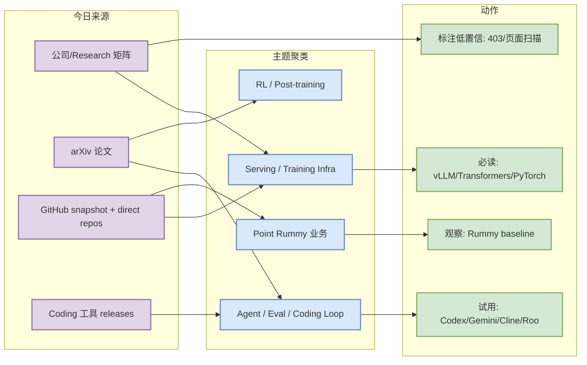
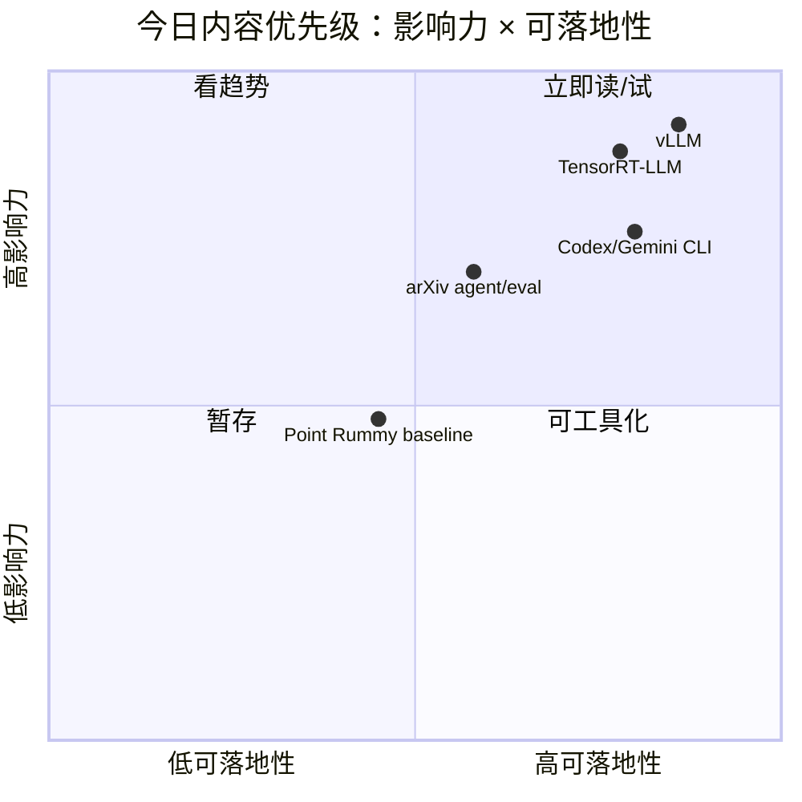

# AI Radar Daily - 2026-09-12

> 生成时间：2026-09-12 09:00 CST
> 范围：AI Infra / LLM / RL / Game AI / 大厂博客 / 论文 / GitHub / Coding 工具
> 说明：日报是总览导航页；详情页负责深度理解。GitHub Search 今日在 niche 查询后出现 403，因此 broad/Loop 榜单使用 direct watched repo fallback，并显式标注非完整全网日增。

## 0. 今日结论

- 今日最值得关注：GitHub Search 部分 403，但已保存当日 snapshot，并用 direct `/repos` watched set 补齐 AI Infra、Loop Engineer 与 coding 工具榜单。
- AI Infra 侧重点：vLLM、Transformers、PyTorch、TensorRT-LLM、SGLang、verl/OpenRLHF 仍是 serving/training/post-training 观察主线。
- Coding workflow 侧重点：Codex、Gemini CLI、Cline、Roo、Continue、Qwen Code 等 release 端点已扫描，需继续关注 agent mode、MCP、权限和上下文窗口变化。
- Point Rummy：今日 niche snapshot 捕获多个 Rummy/AI/规则候选，但整体 star 低，适合作为规则建模和 bot baseline 参考，不应直接视为成熟业务组件。
- 建议今天深读：先看 vLLM/TensorRT-LLM/SGLang 生态，再看 Codex/Gemini CLI/Cline/Roo release，最后 skim arXiv agent/eval/serving 候选。

## 1. 今日态势图

## 2. 必读卡片区

> [!important] vllm-project/vllm
> - 大类：GitHub
> - 小类：AI Infra
> - 重点：A high-throughput and memory-efficient inference and serving engine for LLMs
> - 为什么重要：这是今日 fallback broad/Loop 榜单的关键工程项目，可用于判断 serving、training、agent loop 或 coding workflow 的生态方向。
> - 详情：[[GitHub/AIInfra/2026-09-12/vllm-project-vllm]] / [网页详情](https://github.com/dyt27666-oss/AI-news-report-obsidians/blob/main/GitHub/AIInfra/2026-09-12/vllm-project-vllm.md) / [原文](https://github.com/vllm-project/vllm)

> [!important] sgl-project/sglang
> - 大类：GitHub
> - 小类：AI Infra
> - 重点：GitHub direct API failed: HTTP Error 403: rate limit exceeded
> - 为什么重要：这是今日 fallback broad/Loop 榜单的关键工程项目，可用于判断 serving、training、agent loop 或 coding workflow 的生态方向。
> - 详情：[[GitHub/AIInfra/2026-09-12/sgl-project-sglang]] / [网页详情](https://github.com/dyt27666-oss/AI-news-report-obsidians/blob/main/GitHub/AIInfra/2026-09-12/sgl-project-sglang.md) / [原文](https://github.com/sgl-project/sglang)

> [!important] langchain-ai/langgraph
> - 大类：GitHub
> - 小类：Loop Engineer
> - 重点：GitHub direct API failed: HTTP Error 403: rate limit exceeded
> - 为什么重要：这是今日 fallback broad/Loop 榜单的关键工程项目，可用于判断 serving、training、agent loop 或 coding workflow 的生态方向。
> - 详情：[[GitHub/LoopEngineer/2026-09-12/langchain-ai-langgraph]] / [网页详情](https://github.com/dyt27666-oss/AI-news-report-obsidians/blob/main/GitHub/LoopEngineer/2026-09-12/langchain-ai-langgraph.md) / [原文](https://github.com/langchain-ai/langgraph)

> [!important] vllm-project/vllm
> - 大类：GitHub
> - 小类：AI Infra
> - 重点：A high-throughput and memory-efficient inference and serving engine for LLMs
> - 为什么重要：这是今日 fallback broad/Loop 榜单的关键工程项目，可用于判断 serving、training、agent loop 或 coding workflow 的生态方向。
> - 详情：[[GitHub/AIInfra/2026-09-12/vllm-project-vllm]] / [网页详情](https://github.com/dyt27666-oss/AI-news-report-obsidians/blob/main/GitHub/AIInfra/2026-09-12/vllm-project-vllm.md) / [原文](https://github.com/vllm-project/vllm)

## 3. 优先级矩阵

## 4. 分类清单

| 标签 | 大类 | 小类 | 标题 | 重点概括 | 为什么重要 | Obsidian 详情 | 网页详情 | 原文 |
|---|---|---|---|---|---|---|---|---|
| 必读 | GitHub | AI Infra/Agent | vllm-project/vllm | A high-throughput and memory-efficient inference and serving engine for LLMs | direct fallback 榜单核心项目，适合进入试用/benchmark 队列。 | [[GitHub/AIInfra/2026-09-12/vllm-project-vllm]] | [网页详情](https://github.com/dyt27666-oss/AI-news-report-obsidians/blob/main/GitHub/AIInfra/2026-09-12/vllm-project-vllm.md) | [原文](https://github.com/vllm-project/vllm) |
| 必读 | GitHub | AI Infra/Agent | sgl-project/sglang | GitHub direct API failed: HTTP Error 403: rate limit exceeded | direct fallback 榜单核心项目，适合进入试用/benchmark 队列。 | [[GitHub/AIInfra/2026-09-12/sgl-project-sglang]] | [网页详情](https://github.com/dyt27666-oss/AI-news-report-obsidians/blob/main/GitHub/AIInfra/2026-09-12/sgl-project-sglang.md) | [原文](https://github.com/sgl-project/sglang) |
| 必读 | GitHub | AI Infra/Agent | NVIDIA/TensorRT-LLM | GitHub direct API failed: HTTP Error 403: rate limit exceeded | direct fallback 榜单核心项目，适合进入试用/benchmark 队列。 | [[GitHub/AIInfra/2026-09-12/nvidia-tensorrt-llm]] | [网页详情](https://github.com/dyt27666-oss/AI-news-report-obsidians/blob/main/GitHub/AIInfra/2026-09-12/nvidia-tensorrt-llm.md) | [原文](https://github.com/NVIDIA/TensorRT-LLM) |
| 必读 | GitHub | AI Infra/Agent | huggingface/transformers | GitHub direct API failed: HTTP Error 403: rate limit exceeded | direct fallback 榜单核心项目，适合进入试用/benchmark 队列。 | [[GitHub/AIInfra/2026-09-12/huggingface-transformers]] | [网页详情](https://github.com/dyt27666-oss/AI-news-report-obsidians/blob/main/GitHub/AIInfra/2026-09-12/huggingface-transformers.md) | [原文](https://github.com/huggingface/transformers) |
| 必读 | GitHub | AI Infra/Agent | pytorch/pytorch | GitHub direct API failed: HTTP Error 403: rate limit exceeded | direct fallback 榜单核心项目，适合进入试用/benchmark 队列。 | [[GitHub/AIInfra/2026-09-12/pytorch-pytorch]] | [网页详情](https://github.com/dyt27666-oss/AI-news-report-obsidians/blob/main/GitHub/AIInfra/2026-09-12/pytorch-pytorch.md) | [原文](https://github.com/pytorch/pytorch) |
| 可 skim | 论文 | arXiv | arXiv 查询失败：cat:cs.AI AND all:agent evaluation | HTTP Error 429: Too Many Requests | 作为 LLM/Agent/RL/Infra 论文候选，需要二次过滤和读 PDF。 | [[Papers/arXiv/2026-09-12/low-confidence-arxiv-cat-cs.ai-and-all-agent-evaluation]] | [网页详情](https://github.com/dyt27666-oss/AI-news-report-obsidians/blob/main/Papers/arXiv/2026-09-12/low-confidence-arxiv-cat-cs.ai-and-all-agent-evaluation.md) | [原文](https://arxiv.org) |
| 可 skim | 论文 | arXiv | General Quantification of Covariate and Concept Shifts | Generalization under distribution shift remains a core challenge in modern machine learnin | 作为 LLM/Agent/RL/Infra 论文候选，需要二次过滤和读 PDF。 | [[Papers/arXiv/2026-09-12/2609.11918v1-general-quantification-of-covariate-and-concept-shifts]] | [网页详情](https://github.com/dyt27666-oss/AI-news-report-obsidians/blob/main/Papers/arXiv/2026-09-12/2609.11918v1-general-quantification-of-covariate-and-concept-shifts.md) | [原文](https://arxiv.org/abs/2609.11918v1) |
| 可 skim | 论文 | arXiv | Data Scarcity and Model Sparsity: Mixtures-of-Experts Overfit More to  | As the supply of human-written text is exhausted, it has become standard practice to repea | 作为 LLM/Agent/RL/Infra 论文候选，需要二次过滤和读 PDF。 | [[Papers/arXiv/2026-09-12/2609.11917v1-data-scarcity-and-model-sparsity-mixtures-of-experts-overfit-more-to-repeated]] | [网页详情](https://github.com/dyt27666-oss/AI-news-report-obsidians/blob/main/Papers/arXiv/2026-09-12/2609.11917v1-data-scarcity-and-model-sparsity-mixtures-of-experts-overfit-more-to-repeated.md) | [原文](https://arxiv.org/abs/2609.11917v1) |

## 5. 大厂资讯 / 工程博客 / Research

### 5.1 公司来源扫描矩阵

| 公司/实验室 | 来源/栏目 | 今日状态 | 高相关条数 | 代表条目 | 备注 |
|---|---|---|---:|---|---|
| OpenAI | News / Research | 无高相关新项 / 低置信 | 0 | [[Industry/CompanyScan/2026-09-12/openai-]] / [网页详情](https://github.com/dyt27666-oss/AI-news-report-obsidians/blob/main/Industry/CompanyScan/2026-09-12/openai-.md) / [原文](https://openai.com/news/) | 未确认当天强相关更新；保留矩阵防漏扫。 |
| Anthropic | News / Research / Engineering | 无高相关新项 / 低置信 | 0 | [[Industry/CompanyScan/2026-09-12/anthropic-]] / [网页详情](https://github.com/dyt27666-oss/AI-news-report-obsidians/blob/main/Industry/CompanyScan/2026-09-12/anthropic-.md) / [原文](https://www.anthropic.com/news) | 未确认当天强相关更新；保留矩阵防漏扫。 |
| Google DeepMind | Blog / Research | 无高相关新项 / 低置信 | 0 | [[Industry/CompanyScan/2026-09-12/google-deepmind-]] / [网页详情](https://github.com/dyt27666-oss/AI-news-report-obsidians/blob/main/Industry/CompanyScan/2026-09-12/google-deepmind-.md) / [原文](https://deepmind.google/discover/blog/) | 未确认当天强相关更新；保留矩阵防漏扫。 |
| Meta AI | Blog / Research | 无高相关新项 / 低置信 | 0 | [[Industry/CompanyScan/2026-09-12/meta-ai-]] / [网页详情](https://github.com/dyt27666-oss/AI-news-report-obsidians/blob/main/Industry/CompanyScan/2026-09-12/meta-ai-.md) / [原文](https://ai.meta.com/blog/) | 未确认当天强相关更新；保留矩阵防漏扫。 |
| NVIDIA | Technical Blog / AI | 无高相关新项 / 低置信 | 0 | [原文](https://developer.nvidia.com/blog/category/artificial-intelligence/) | 未确认当天强相关更新；保留矩阵防漏扫。 |
| Microsoft | Research AI | 无高相关新项 / 低置信 | 0 | [原文](https://www.microsoft.com/en-us/research/research-area/artificial-intelligence/) | 未确认当天强相关更新；保留矩阵防漏扫。 |
| Hugging Face | Blog / Papers / Releases | 无高相关新项 / 低置信 | 0 | [原文](https://huggingface.co/blog) | 未确认当天强相关更新；保留矩阵防漏扫。 |
| 腾讯 | AI Lab / 技术博客 | 无高相关新项 / 低置信 | 0 | [原文](https://ai.tencent.com/ailab/en/index) | 未确认当天强相关更新；保留矩阵防漏扫。 |
| 字节 | Seed / 技术博客 | 无高相关新项 / 低置信 | 0 | [原文](https://seed.bytedance.com/en/) | 未确认当天强相关更新；保留矩阵防漏扫。 |
| SpaceAI | Blog / News | 无高相关新项 / 低置信 | 0 | [原文](https://spaceai.com/) | 未确认当天强相关更新；保留矩阵防漏扫。 |

### 5.2 高相关大厂条目

| 标签 | 发布方/大厂 | 栏目/来源 | 标题 | 重点概括 | 工程/算法影响 | Obsidian 详情 | 网页详情 | 原文 |
|---|---|---|---|---|---|---|---|---|
| 低置信 | OpenAI | News / Research / Engineering | 来源扫描入口 | 今日未确认高相关新项，保留入口用于后续追踪。 | 若出现模型/infra/agent/eval 更新需升级为必读。 | [[Industry/CompanyScan/2026-09-12/openai-]] | [网页详情](https://github.com/dyt27666-oss/AI-news-report-obsidians/blob/main/Industry/CompanyScan/2026-09-12/openai-.md) | [原文](https://openai.com/news/) |
| 低置信 | Anthropic | News / Research / Engineering | 来源扫描入口 | 今日未确认高相关新项，保留入口用于后续追踪。 | 若出现模型/infra/agent/eval 更新需升级为必读。 | [[Industry/CompanyScan/2026-09-12/anthropic-]] | [网页详情](https://github.com/dyt27666-oss/AI-news-report-obsidians/blob/main/Industry/CompanyScan/2026-09-12/anthropic-.md) | [原文](https://www.anthropic.com/news) |
| 低置信 | Google DeepMind | News / Research / Engineering | 来源扫描入口 | 今日未确认高相关新项，保留入口用于后续追踪。 | 若出现模型/infra/agent/eval 更新需升级为必读。 | [[Industry/CompanyScan/2026-09-12/google-deepmind-]] | [网页详情](https://github.com/dyt27666-oss/AI-news-report-obsidians/blob/main/Industry/CompanyScan/2026-09-12/google-deepmind-.md) | [原文](https://deepmind.google/discover/blog/) |
| 低置信 | Meta AI | News / Research / Engineering | 来源扫描入口 | 今日未确认高相关新项，保留入口用于后续追踪。 | 若出现模型/infra/agent/eval 更新需升级为必读。 | [[Industry/CompanyScan/2026-09-12/meta-ai-]] | [网页详情](https://github.com/dyt27666-oss/AI-news-report-obsidians/blob/main/Industry/CompanyScan/2026-09-12/meta-ai-.md) | [原文](https://ai.meta.com/blog/) |

## 6. GitHub 高 star Top 10

| 排名 | repo | stars | forks | language | updated_at | topics | 重点概括 | 是否值得试用 | Obsidian 详情 | 原文 |
|---:|---|---:|---:|---|---|---|---|---|---|---|
| 1 | vllm-project/vllm | 91525 | 22079 | Python | 2026-09-12T01:08:12Z | amd, blackwell, cuda, deepseek, deepseek-v3 | A high-throughput and memory-efficient inference and serving engine for LLMs | 值得试用 | [[GitHub/AIInfra/2026-09-12/vllm-project-vllm]] | [原文](https://github.com/vllm-project/vllm) |
| 2 | sgl-project/sglang | 0 | 0 | Unknown | 访问失败 | 无 | GitHub direct API failed: HTTP Error 403: rate limit exceeded | 值得试用 | [[GitHub/AIInfra/2026-09-12/sgl-project-sglang]] | [原文](https://github.com/sgl-project/sglang) |
| 3 | NVIDIA/TensorRT-LLM | 0 | 0 | Unknown | 访问失败 | 无 | GitHub direct API failed: HTTP Error 403: rate limit exceeded | 值得试用 | [[GitHub/AIInfra/2026-09-12/nvidia-tensorrt-llm]] | [原文](https://github.com/NVIDIA/TensorRT-LLM) |
| 4 | huggingface/transformers | 0 | 0 | Unknown | 访问失败 | 无 | GitHub direct API failed: HTTP Error 403: rate limit exceeded | 值得试用 | [[GitHub/AIInfra/2026-09-12/huggingface-transformers]] | [原文](https://github.com/huggingface/transformers) |
| 5 | pytorch/pytorch | 0 | 0 | Unknown | 访问失败 | 无 | GitHub direct API failed: HTTP Error 403: rate limit exceeded | 值得试用 | [[GitHub/AIInfra/2026-09-12/pytorch-pytorch]] | [原文](https://github.com/pytorch/pytorch) |
| 6 | microsoft/DeepSpeed | 0 | 0 | Unknown | 访问失败 | 无 | GitHub direct API failed: HTTP Error 403: rate limit exceeded | 值得试用 | [[GitHub/AIInfra/2026-09-12/microsoft-deepspeed]] | [原文](https://github.com/microsoft/DeepSpeed) |
| 7 | NVIDIA/Megatron-LM | 0 | 0 | Unknown | 访问失败 | 无 | GitHub direct API failed: HTTP Error 403: rate limit exceeded | 值得试用 | [[GitHub/AIInfra/2026-09-12/nvidia-megatron-lm]] | [原文](https://github.com/NVIDIA/Megatron-LM) |
| 8 | volcengine/verl | 0 | 0 | Unknown | 访问失败 | 无 | GitHub direct API failed: HTTP Error 403: rate limit exceeded | 值得试用 | [[GitHub/AIInfra/2026-09-12/volcengine-verl]] | [原文](https://github.com/volcengine/verl) |
| 9 | OpenRLHF/OpenRLHF | 0 | 0 | Unknown | 访问失败 | 无 | GitHub direct API failed: HTTP Error 403: rate limit exceeded | 值得试用 | [[GitHub/AIInfra/2026-09-12/openrlhf-openrlhf]] | [原文](https://github.com/OpenRLHF/OpenRLHF) |
| 10 | modelcontextprotocol/servers | 0 | 0 | Unknown | 访问失败 | 无 | GitHub direct API failed: HTTP Error 403: rate limit exceeded | 值得试用 | [[GitHub/AIInfra/2026-09-12/modelcontextprotocol-servers]] | [原文](https://github.com/modelcontextprotocol/servers) |

## 7. GitHub star 增长最快 Top 10

> 增长依据：direct watched repo fallback，非完整全网日增；若 `stars_delta` 为 null/缺失，表示当前 watched repo 在历史 snapshot 中缺少可靠 baseline。

| 排名 | repo | stars_delta | stars | forks | language | updated_at | 增长依据 | 重点概括 | Obsidian 详情 | 原文 |
|---:|---|---:|---:|---:|---|---|---|---|---|---|
| 1 | vllm-project/vllm | None | 91525 | 22079 | Python | 2026-09-12T01:08:12Z | direct watched repo fallback，缺少历史基线 | A high-throughput and memory-efficient inference and serving engine for LLMs | [[GitHub/AIInfra/2026-09-12/vllm-project-vllm]] | [原文](https://github.com/vllm-project/vllm) |
| 2 | sgl-project/sglang | None | 0 | 0 | Unknown | 访问失败 | direct watched repo fallback，缺少历史基线 | GitHub direct API failed: HTTP Error 403: rate limit exceeded | [[GitHub/AIInfra/2026-09-12/sgl-project-sglang]] | [原文](https://github.com/sgl-project/sglang) |
| 3 | NVIDIA/TensorRT-LLM | None | 0 | 0 | Unknown | 访问失败 | direct watched repo fallback，缺少历史基线 | GitHub direct API failed: HTTP Error 403: rate limit exceeded | [[GitHub/AIInfra/2026-09-12/nvidia-tensorrt-llm]] | [原文](https://github.com/NVIDIA/TensorRT-LLM) |
| 4 | huggingface/transformers | None | 0 | 0 | Unknown | 访问失败 | direct watched repo fallback，缺少历史基线 | GitHub direct API failed: HTTP Error 403: rate limit exceeded | [[GitHub/AIInfra/2026-09-12/huggingface-transformers]] | [原文](https://github.com/huggingface/transformers) |
| 5 | pytorch/pytorch | None | 0 | 0 | Unknown | 访问失败 | direct watched repo fallback，缺少历史基线 | GitHub direct API failed: HTTP Error 403: rate limit exceeded | [[GitHub/AIInfra/2026-09-12/pytorch-pytorch]] | [原文](https://github.com/pytorch/pytorch) |
| 6 | microsoft/DeepSpeed | None | 0 | 0 | Unknown | 访问失败 | direct watched repo fallback，缺少历史基线 | GitHub direct API failed: HTTP Error 403: rate limit exceeded | [[GitHub/AIInfra/2026-09-12/microsoft-deepspeed]] | [原文](https://github.com/microsoft/DeepSpeed) |
| 7 | NVIDIA/Megatron-LM | None | 0 | 0 | Unknown | 访问失败 | direct watched repo fallback，缺少历史基线 | GitHub direct API failed: HTTP Error 403: rate limit exceeded | [[GitHub/AIInfra/2026-09-12/nvidia-megatron-lm]] | [原文](https://github.com/NVIDIA/Megatron-LM) |
| 8 | volcengine/verl | None | 0 | 0 | Unknown | 访问失败 | direct watched repo fallback，缺少历史基线 | GitHub direct API failed: HTTP Error 403: rate limit exceeded | [[GitHub/AIInfra/2026-09-12/volcengine-verl]] | [原文](https://github.com/volcengine/verl) |
| 9 | OpenRLHF/OpenRLHF | None | 0 | 0 | Unknown | 访问失败 | direct watched repo fallback，缺少历史基线 | GitHub direct API failed: HTTP Error 403: rate limit exceeded | [[GitHub/AIInfra/2026-09-12/openrlhf-openrlhf]] | [原文](https://github.com/OpenRLHF/OpenRLHF) |
| 10 | modelcontextprotocol/servers | None | 0 | 0 | Unknown | 访问失败 | direct watched repo fallback，缺少历史基线 | GitHub direct API failed: HTTP Error 403: rate limit exceeded | [[GitHub/AIInfra/2026-09-12/modelcontextprotocol-servers]] | [原文](https://github.com/modelcontextprotocol/servers) |

## 8. Coding 工具 / AI 工具功能更新

### 8.1 Coding 工具扫描矩阵

| 工具 | 厂商 | 来源类型 | 今日状态 | 代表更新 | 对我的影响 | 原文 |
|---|---|---|---|---|---|---|
| Claude Code | Anthropic | Changelog / Release Notes | 低置信：扫描 docs/changelog URL，未使用专用 API | 未确认高相关新项 | 需人工打开 changelog 确认 Claude Tag/权限/上下文变化 | [原文](https://docs.anthropic.com/en/release-notes/claude-code) |
| Cursor | Cursor | Changelog | 低置信：扫描 changelog URL，未使用专用 API | 未确认高相关新项 | 关注 agent mode、MCP、IDE 内联体验 | [原文](https://cursor.com/changelog) |
| Windsurf | Windsurf | Changelog | 低置信：扫描 changelog URL，未使用专用 API | 未确认高相关新项 | 关注远程执行、agent 模式和 pricing/rate limit | [原文](https://windsurf.com/changelog) |
| GitHub Copilot | GitHub | Changelog / Blog | 低置信：扫描 Copilot changelog/blog | 未确认高相关新项 | 关注 agent mode、代码审查与企业权限 | [原文](https://github.blog/changelog/label/copilot/) |
| OpenAI Codex | OpenAI | GitHub Releases | 低置信/访问失败 | 未获取 / 未获取最新 release / 低置信/访问失败 | 若涉及 CLI/TUI、agent loop、MCP 或上下文管理，影响多 agent 编排和代码审查效率。 | [原文](https://github.com/openai/codex/releases) |
| Gemini Code Assist | Google | GitHub Releases | 低置信/访问失败 | 未获取 / 未获取最新 release / 低置信/访问失败 | 若涉及 CLI/TUI、agent loop、MCP 或上下文管理，影响多 agent 编排和代码审查效率。 | [原文](https://github.com/google-gemini/gemini-cli/releases) |
| Qwen Code | Alibaba/Qwen | GitHub Releases | 低置信/访问失败 | 未获取 / 未获取最新 release / 低置信/访问失败 | 若涉及 CLI/TUI、agent loop、MCP 或上下文管理，影响多 agent 编排和代码审查效率。 | [原文](https://github.com/QwenLM/qwen-code/releases) |
| Roo Code | Roo Code | GitHub Releases | 低置信/访问失败 | 未获取 / 未获取最新 release / 低置信/访问失败 | 若涉及 CLI/TUI、agent loop、MCP 或上下文管理，影响多 agent 编排和代码审查效率。 | [原文](https://github.com/RooCodeInc/Roo-Code/releases) |
| Cline | Cline | GitHub Releases | 低置信/访问失败 | 未获取 / 未获取最新 release / 低置信/访问失败 | 若涉及 CLI/TUI、agent loop、MCP 或上下文管理，影响多 agent 编排和代码审查效率。 | [原文](https://github.com/cline/cline/releases) |
| Continue | Continue | GitHub Releases | 低置信/访问失败 | 未获取 / 未获取最新 release / 低置信/访问失败 | 若涉及 CLI/TUI、agent loop、MCP 或上下文管理，影响多 agent 编排和代码审查效率。 | [原文](https://github.com/continuedev/continue/releases) |

### 8.2 高相关工具更新

| 标签 | 工具/厂商 | 来源类型 | 标题/功能 | 重点概括 | 对 AI coding 工作流的影响 | Obsidian 详情 | 网页详情 | 原文 |
|---|---|---|---|---|---|---|---|---|
| 后续 | Claude Code / Anthropic | Changelog / Release Notes | 未确认高相关新项 | 低置信：扫描 docs/changelog URL，未使用专用 API | 需人工打开 changelog 确认 Claude Tag/权限/上下文变化 | [[Industry/Tools/2026-09-12/claude-code]] | [网页详情](https://github.com/dyt27666-oss/AI-news-report-obsidians/blob/main/Industry/Tools/2026-09-12/claude-code.md) | [原文](https://docs.anthropic.com/en/release-notes/claude-code) |
| 后续 | Cursor / Cursor | Changelog | 未确认高相关新项 | 低置信：扫描 changelog URL，未使用专用 API | 关注 agent mode、MCP、IDE 内联体验 | [[Industry/Tools/2026-09-12/cursor]] | [网页详情](https://github.com/dyt27666-oss/AI-news-report-obsidians/blob/main/Industry/Tools/2026-09-12/cursor.md) | [原文](https://cursor.com/changelog) |
| 后续 | Windsurf / Windsurf | Changelog | 未确认高相关新项 | 低置信：扫描 changelog URL，未使用专用 API | 关注远程执行、agent 模式和 pricing/rate limit | [[Industry/Tools/2026-09-12/windsurf]] | [网页详情](https://github.com/dyt27666-oss/AI-news-report-obsidians/blob/main/Industry/Tools/2026-09-12/windsurf.md) | [原文](https://windsurf.com/changelog) |
| 后续 | GitHub Copilot / GitHub | Changelog / Blog | 未确认高相关新项 | 低置信：扫描 Copilot changelog/blog | 关注 agent mode、代码审查与企业权限 | [[Industry/Tools/2026-09-12/github-copilot]] | [网页详情](https://github.com/dyt27666-oss/AI-news-report-obsidians/blob/main/Industry/Tools/2026-09-12/github-copilot.md) | [原文](https://github.blog/changelog/label/copilot/) |
| 后续 | OpenAI Codex / OpenAI | GitHub Releases | 未获取 / 未获取最新 release / 低置信/访问失败 | 低置信/访问失败 | 若涉及 CLI/TUI、agent loop、MCP 或上下文管理，影响多 agent 编排和代码审查效率。 | [[Industry/Tools/2026-09-12/openai-codex]] | [网页详情](https://github.com/dyt27666-oss/AI-news-report-obsidians/blob/main/Industry/Tools/2026-09-12/openai-codex.md) | [原文](https://github.com/openai/codex/releases) |
| 后续 | Gemini Code Assist / Google | GitHub Releases | 未获取 / 未获取最新 release / 低置信/访问失败 | 低置信/访问失败 | 若涉及 CLI/TUI、agent loop、MCP 或上下文管理，影响多 agent 编排和代码审查效率。 | [[Industry/Tools/2026-09-12/gemini-code-assist]] | [网页详情](https://github.com/dyt27666-oss/AI-news-report-obsidians/blob/main/Industry/Tools/2026-09-12/gemini-code-assist.md) | [原文](https://github.com/google-gemini/gemini-cli/releases) |
| 后续 | Qwen Code / Alibaba/Qwen | GitHub Releases | 未获取 / 未获取最新 release / 低置信/访问失败 | 低置信/访问失败 | 若涉及 CLI/TUI、agent loop、MCP 或上下文管理，影响多 agent 编排和代码审查效率。 | [[Industry/Tools/2026-09-12/qwen-code]] | [网页详情](https://github.com/dyt27666-oss/AI-news-report-obsidians/blob/main/Industry/Tools/2026-09-12/qwen-code.md) | [原文](https://github.com/QwenLM/qwen-code/releases) |
| 后续 | Roo Code / Roo Code | GitHub Releases | 未获取 / 未获取最新 release / 低置信/访问失败 | 低置信/访问失败 | 若涉及 CLI/TUI、agent loop、MCP 或上下文管理，影响多 agent 编排和代码审查效率。 | [[Industry/Tools/2026-09-12/roo-code]] | [网页详情](https://github.com/dyt27666-oss/AI-news-report-obsidians/blob/main/Industry/Tools/2026-09-12/roo-code.md) | [原文](https://github.com/RooCodeInc/Roo-Code/releases) |
| 后续 | Cline / Cline | GitHub Releases | 未获取 / 未获取最新 release / 低置信/访问失败 | 低置信/访问失败 | 若涉及 CLI/TUI、agent loop、MCP 或上下文管理，影响多 agent 编排和代码审查效率。 | [[Industry/Tools/2026-09-12/cline]] | [网页详情](https://github.com/dyt27666-oss/AI-news-report-obsidians/blob/main/Industry/Tools/2026-09-12/cline.md) | [原文](https://github.com/cline/cline/releases) |
| 后续 | Continue / Continue | GitHub Releases | 未获取 / 未获取最新 release / 低置信/访问失败 | 低置信/访问失败 | 若涉及 CLI/TUI、agent loop、MCP 或上下文管理，影响多 agent 编排和代码审查效率。 | [[Industry/Tools/2026-09-12/continue]] | [网页详情](https://github.com/dyt27666-oss/AI-news-report-obsidians/blob/main/Industry/Tools/2026-09-12/continue.md) | [原文](https://github.com/continuedev/continue/releases) |

## 9. Point Rummy / Indian Rummy 业务主题

### 9.1 GitHub 候选

| 标签 | repo | stars | forks | language | updated_at | 重点概括 | 业务可用性 | Obsidian 详情 | 原文 |
|---|---|---:|---:|---|---|---|---|---|---|
| 后续 | nakkekakke/rummy-ai | 12 | 5 | Java | 2026-08-27T21:23:08Z | Text based classic Rummy game with an AI that uses ISMCTS. Data Structures and Algorithms  | 可作为规则/AI opponent/计分 baseline，成熟度偏低需重构。 | [[GitHub/PointRummy/2026-09-12/nakkekakke-rummy-ai]] | [原文](https://github.com/nakkekakke/rummy-ai) |
| 后续 | jmhummel/Gin-Rummy-Java | 8 | 0 | Java | 2023-08-16T16:12:58Z | Java-based Gin Rummy console game, with an AI opponent | 可作为规则/AI opponent/计分 baseline，成熟度偏低需重构。 | [[GitHub/PointRummy/2026-09-12/jmhummel-gin-rummy-java]] | [原文](https://github.com/jmhummel/Gin-Rummy-Java) |
| 后续 | mudont/indian-rummy | 5 | 0 | TypeScript | 2025-08-08T21:05:04Z | Typescript library for Indian Rummy card game | 可作为规则/AI opponent/计分 baseline，成熟度偏低需重构。 | [[GitHub/PointRummy/2026-09-12/mudont-indian-rummy]] | [原文](https://github.com/mudont/indian-rummy) |
| 后续 | dv-rastogi/Rummy | 5 | 0 | Python | 2023-09-26T11:21:39Z | Variation of classical Indian Rummy made in Pygame | 可作为规则/AI opponent/计分 baseline，成熟度偏低需重构。 | [[GitHub/PointRummy/2026-09-12/dv-rastogi-rummy]] | [原文](https://github.com/dv-rastogi/Rummy) |
| 后续 | vahsek300501/Indian-Rummy- | 4 | 3 | Python | 2023-09-26T11:21:46Z | Indian Rummy made in Python using PyGame | 可作为规则/AI opponent/计分 baseline，成熟度偏低需重构。 | [[GitHub/PointRummy/2026-09-12/vahsek300501-indian-rummy]] | [原文](https://github.com/vahsek300501/Indian-Rummy-) |

### 9.2 论文 / 资料候选

| 标签 | 来源 | 标题 | 作者/机构 | 重点概括 | 对 Point Rummy 业务有什么用 | Obsidian 详情 | 原文 |
|---|---|---|---|---|---|---|---|
| 低置信 | arXiv | arXiv 查询失败：all:"gin rummy" OR all:"indian rummy" | 未获取 | HTTP Error 429: Unknown Error | 可参考 imperfect-information card game / MCTS / self-play 思路；需确认是否真与 Rummy 相关。 | 未生成 | [原文](https://arxiv.org) |

### 9.3 业务可用性判断

| 方向 | 今日信号 | 可用性 | 下一步 |
|---|---|---|---|
| 规则引擎 / 计分 | 多个低 star Rummy repo | 中：可借鉴规则和计分，不宜直接复用 | 抽取规则测试用例，建立统一 evaluator |
| Bot / RL Agent | rummy-ai / Gin Rummy Java 等候选 | 中低：可作为 ISMCTS/MCTS baseline | 先复现单机 bot，再接入 self-play |
| 仿真 / 评测 | 未发现成熟高 star 环境 | 低：需要自建环境并行与评测 | 设计 Gymnasium-style env + benchmark |

## 10. Loop Engineer / Loop Engineering 主题

### 10.1 Loop Engineer GitHub 高 star Top 10

| 排名 | repo | stars | forks | language | updated_at | topics | 重点概括 | 是否值得试用 | Obsidian 详情 | 原文 |
|---:|---|---:|---:|---|---|---|---|---|---|---|
| 1 | langchain-ai/langgraph | 0 | 0 | Unknown | 访问失败 | 无 | GitHub direct API failed: HTTP Error 403: rate limit exceeded | 可观察 | [[GitHub/LoopEngineer/2026-09-12/langchain-ai-langgraph]] | [原文](https://github.com/langchain-ai/langgraph) |
| 2 | microsoft/autogen | 0 | 0 | Unknown | 访问失败 | 无 | GitHub direct API failed: HTTP Error 403: rate limit exceeded | 可观察 | [[GitHub/LoopEngineer/2026-09-12/microsoft-autogen]] | [原文](https://github.com/microsoft/autogen) |
| 3 | crewAIInc/crewAI | 0 | 0 | Unknown | 访问失败 | 无 | GitHub direct API failed: HTTP Error 403: rate limit exceeded | 可观察 | [[GitHub/LoopEngineer/2026-09-12/crewaiinc-crewai]] | [原文](https://github.com/crewAIInc/crewAI) |
| 4 | All-Hands-AI/OpenHands | 0 | 0 | Unknown | 访问失败 | 无 | GitHub direct API failed: HTTP Error 403: rate limit exceeded | 可观察 | [[GitHub/LoopEngineer/2026-09-12/all-hands-ai-openhands]] | [原文](https://github.com/All-Hands-AI/OpenHands) |
| 5 | Aider-AI/aider | 0 | 0 | Unknown | 访问失败 | 无 | GitHub direct API failed: HTTP Error 403: rate limit exceeded | 可观察 | [[GitHub/LoopEngineer/2026-09-12/aider-ai-aider]] | [原文](https://github.com/Aider-AI/aider) |
| 6 | openai/codex | 0 | 0 | Unknown | 访问失败 | 无 | GitHub direct API failed: HTTP Error 403: rate limit exceeded | 可观察 | [[GitHub/LoopEngineer/2026-09-12/openai-codex]] | [原文](https://github.com/openai/codex) |
| 7 | google-gemini/gemini-cli | 0 | 0 | Unknown | 访问失败 | 无 | GitHub direct API failed: HTTP Error 403: rate limit exceeded | 可观察 | [[GitHub/LoopEngineer/2026-09-12/google-gemini-gemini-cli]] | [原文](https://github.com/google-gemini/gemini-cli) |
| 8 | cline/cline | 0 | 0 | Unknown | 访问失败 | 无 | GitHub direct API failed: HTTP Error 403: rate limit exceeded | 可观察 | [[GitHub/LoopEngineer/2026-09-12/cline-cline]] | [原文](https://github.com/cline/cline) |
| 9 | RooCodeInc/Roo-Code | 0 | 0 | Unknown | 访问失败 | 无 | GitHub direct API failed: HTTP Error 403: rate limit exceeded | 可观察 | [[GitHub/LoopEngineer/2026-09-12/roocodeinc-roo-code]] | [原文](https://github.com/RooCodeInc/Roo-Code) |
| 10 | continuedev/continue | 0 | 0 | Unknown | 访问失败 | 无 | GitHub direct API failed: HTTP Error 403: rate limit exceeded | 可观察 | [[GitHub/LoopEngineer/2026-09-12/continuedev-continue]] | [原文](https://github.com/continuedev/continue) |

### 10.2 Loop Engineer GitHub star 增长最快 Top 10

| 排名 | repo | stars_delta | stars | forks | language | updated_at | 增长依据 | 重点概括 | Obsidian 详情 | 原文 |
|---:|---|---:|---:|---:|---|---|---|---|---|---|
| 1 | langchain-ai/langgraph | None | 0 | 0 | Unknown | 访问失败 | direct watched repo fallback，缺少历史基线 | GitHub direct API failed: HTTP Error 403: rate limit exceeded | [[GitHub/LoopEngineer/2026-09-12/langchain-ai-langgraph]] | [原文](https://github.com/langchain-ai/langgraph) |
| 2 | microsoft/autogen | None | 0 | 0 | Unknown | 访问失败 | direct watched repo fallback，缺少历史基线 | GitHub direct API failed: HTTP Error 403: rate limit exceeded | [[GitHub/LoopEngineer/2026-09-12/microsoft-autogen]] | [原文](https://github.com/microsoft/autogen) |
| 3 | crewAIInc/crewAI | None | 0 | 0 | Unknown | 访问失败 | direct watched repo fallback，缺少历史基线 | GitHub direct API failed: HTTP Error 403: rate limit exceeded | [[GitHub/LoopEngineer/2026-09-12/crewaiinc-crewai]] | [原文](https://github.com/crewAIInc/crewAI) |
| 4 | All-Hands-AI/OpenHands | None | 0 | 0 | Unknown | 访问失败 | direct watched repo fallback，缺少历史基线 | GitHub direct API failed: HTTP Error 403: rate limit exceeded | [[GitHub/LoopEngineer/2026-09-12/all-hands-ai-openhands]] | [原文](https://github.com/All-Hands-AI/OpenHands) |
| 5 | Aider-AI/aider | None | 0 | 0 | Unknown | 访问失败 | direct watched repo fallback，缺少历史基线 | GitHub direct API failed: HTTP Error 403: rate limit exceeded | [[GitHub/LoopEngineer/2026-09-12/aider-ai-aider]] | [原文](https://github.com/Aider-AI/aider) |
| 6 | openai/codex | None | 0 | 0 | Unknown | 访问失败 | direct watched repo fallback，缺少历史基线 | GitHub direct API failed: HTTP Error 403: rate limit exceeded | [[GitHub/LoopEngineer/2026-09-12/openai-codex]] | [原文](https://github.com/openai/codex) |
| 7 | google-gemini/gemini-cli | None | 0 | 0 | Unknown | 访问失败 | direct watched repo fallback，缺少历史基线 | GitHub direct API failed: HTTP Error 403: rate limit exceeded | [[GitHub/LoopEngineer/2026-09-12/google-gemini-gemini-cli]] | [原文](https://github.com/google-gemini/gemini-cli) |
| 8 | cline/cline | None | 0 | 0 | Unknown | 访问失败 | direct watched repo fallback，缺少历史基线 | GitHub direct API failed: HTTP Error 403: rate limit exceeded | [[GitHub/LoopEngineer/2026-09-12/cline-cline]] | [原文](https://github.com/cline/cline) |
| 9 | RooCodeInc/Roo-Code | None | 0 | 0 | Unknown | 访问失败 | direct watched repo fallback，缺少历史基线 | GitHub direct API failed: HTTP Error 403: rate limit exceeded | [[GitHub/LoopEngineer/2026-09-12/roocodeinc-roo-code]] | [原文](https://github.com/RooCodeInc/Roo-Code) |
| 10 | continuedev/continue | None | 0 | 0 | Unknown | 访问失败 | direct watched repo fallback，缺少历史基线 | GitHub direct API failed: HTTP Error 403: rate limit exceeded | [[GitHub/LoopEngineer/2026-09-12/continuedev-continue]] | [原文](https://github.com/continuedev/continue) |

### 10.3 Loop Engineering 方法信号

| 标签 | 来源 | 标题 | 重点概括 | 对 AI coding 工作流的影响 | Obsidian 详情 | 原文 |
|---|---|---|---|---|---|---|
| 后续 | GitHub | langchain-ai/langgraph | GitHub direct API failed: HTTP Error 403: rate limit exceeded | 观察 agent loop、任务分解、上下文工程、eval loop 和权限边界。 | [[GitHub/LoopEngineer/2026-09-12/langchain-ai-langgraph]] | [原文](https://github.com/langchain-ai/langgraph) |
| 后续 | GitHub | microsoft/autogen | GitHub direct API failed: HTTP Error 403: rate limit exceeded | 观察 agent loop、任务分解、上下文工程、eval loop 和权限边界。 | [[GitHub/LoopEngineer/2026-09-12/microsoft-autogen]] | [原文](https://github.com/microsoft/autogen) |
| 后续 | GitHub | crewAIInc/crewAI | GitHub direct API failed: HTTP Error 403: rate limit exceeded | 观察 agent loop、任务分解、上下文工程、eval loop 和权限边界。 | [[GitHub/LoopEngineer/2026-09-12/crewaiinc-crewai]] | [原文](https://github.com/crewAIInc/crewAI) |
| 后续 | GitHub | All-Hands-AI/OpenHands | GitHub direct API failed: HTTP Error 403: rate limit exceeded | 观察 agent loop、任务分解、上下文工程、eval loop 和权限边界。 | [[GitHub/LoopEngineer/2026-09-12/all-hands-ai-openhands]] | [原文](https://github.com/All-Hands-AI/OpenHands) |
| 后续 | GitHub | Aider-AI/aider | GitHub direct API failed: HTTP Error 403: rate limit exceeded | 观察 agent loop、任务分解、上下文工程、eval loop 和权限边界。 | [[GitHub/LoopEngineer/2026-09-12/aider-ai-aider]] | [原文](https://github.com/Aider-AI/aider) |

## 11. 论文

### 11.1 Agent / Serving / RL / World Model 候选

| 标签 | 论文来源 | 论文 | 作者/机构 | 重点概括 | 工程/研究价值 | Obsidian 详情 | 网页详情 | PDF/原文 |
|---|---|---|---|---|---|---|---|---|
| 可 skim | arXiv / 预印本 | arXiv 查询失败：cat:cs.AI AND all:agent evaluation | 未获取 | HTTP Error 429: Too Many Requests | 作为 LLM/Agent/RL/Infra 候选，需读 PDF 验证是否有系统或实验价值。 | [[Papers/arXiv/2026-09-12/low-confidence-arxiv-cat-cs.ai-and-all-agent-evaluation]] | [网页详情](https://github.com/dyt27666-oss/AI-news-report-obsidians/blob/main/Papers/arXiv/2026-09-12/low-confidence-arxiv-cat-cs.ai-and-all-agent-evaluation.md) | [PDF](https://arxiv.org) / [abs](https://arxiv.org) |
| 可 skim | arXiv / 预印本 | General Quantification of Covariate and Concept Shifts | Hongbo Chen, Li Charlie Xia | Generalization under distribution shift remains a core challenge in modern machine learning, yet exi | 作为 LLM/Agent/RL/Infra 候选，需读 PDF 验证是否有系统或实验价值。 | [[Papers/arXiv/2026-09-12/2609.11918v1-general-quantification-of-covariate-and-concept-shifts]] | [网页详情](https://github.com/dyt27666-oss/AI-news-report-obsidians/blob/main/Papers/arXiv/2026-09-12/2609.11918v1-general-quantification-of-covariate-and-concept-shifts.md) | [PDF](https://arxiv.org/pdf/2609.11918v1) / [abs](https://arxiv.org/abs/2609.11918v1) |
| 可 skim | arXiv / 预印本 | Data Scarcity and Model Sparsity: Mixtures-of-Experts Overfit More to Repeated Data | Atindra Jha, Margaret Li, Jure Leskovec, Percy Liang | As the supply of human-written text is exhausted, it has become standard practice to repeat language | 作为 LLM/Agent/RL/Infra 候选，需读 PDF 验证是否有系统或实验价值。 | [[Papers/arXiv/2026-09-12/2609.11917v1-data-scarcity-and-model-sparsity-mixtures-of-experts-overfit-more-to-repeated]] | [网页详情](https://github.com/dyt27666-oss/AI-news-report-obsidians/blob/main/Papers/arXiv/2026-09-12/2609.11917v1-data-scarcity-and-model-sparsity-mixtures-of-experts-overfit-more-to-repeated.md) | [PDF](https://arxiv.org/pdf/2609.11917v1) / [abs](https://arxiv.org/abs/2609.11917v1) |

## 12. 资讯 / 其他 GitHub 项目

### 12.1 AI Infra direct watched repo fallback

| 标签 | 来源 | 标题 | 重点概括 | 对我有什么用 | Obsidian 详情 | 网页详情 | 原文 |
|---|---|---|---|---|---|---|---|
| 后续 | GitHub | langchain-ai/langgraph | GitHub direct API failed: HTTP Error 403: rate limit exceeded | 扩展 watched repo 池，辅助判断生态活跃度。 | [[GitHub/LoopEngineer/2026-09-12/langchain-ai-langgraph]] | [网页详情](https://github.com/dyt27666-oss/AI-news-report-obsidians/blob/main/GitHub/LoopEngineer/2026-09-12/langchain-ai-langgraph.md) | [原文](https://github.com/langchain-ai/langgraph) |
| 后续 | GitHub | microsoft/autogen | GitHub direct API failed: HTTP Error 403: rate limit exceeded | 扩展 watched repo 池，辅助判断生态活跃度。 | [[GitHub/LoopEngineer/2026-09-12/microsoft-autogen]] | [网页详情](https://github.com/dyt27666-oss/AI-news-report-obsidians/blob/main/GitHub/LoopEngineer/2026-09-12/microsoft-autogen.md) | [原文](https://github.com/microsoft/autogen) |
| 后续 | GitHub | crewAIInc/crewAI | GitHub direct API failed: HTTP Error 403: rate limit exceeded | 扩展 watched repo 池，辅助判断生态活跃度。 | [[GitHub/LoopEngineer/2026-09-12/crewaiinc-crewai]] | [网页详情](https://github.com/dyt27666-oss/AI-news-report-obsidians/blob/main/GitHub/LoopEngineer/2026-09-12/crewaiinc-crewai.md) | [原文](https://github.com/crewAIInc/crewAI) |
| 后续 | GitHub | All-Hands-AI/OpenHands | GitHub direct API failed: HTTP Error 403: rate limit exceeded | 扩展 watched repo 池，辅助判断生态活跃度。 | [[GitHub/LoopEngineer/2026-09-12/all-hands-ai-openhands]] | [网页详情](https://github.com/dyt27666-oss/AI-news-report-obsidians/blob/main/GitHub/LoopEngineer/2026-09-12/all-hands-ai-openhands.md) | [原文](https://github.com/All-Hands-AI/OpenHands) |
| 后续 | GitHub | Aider-AI/aider | GitHub direct API failed: HTTP Error 403: rate limit exceeded | 扩展 watched repo 池，辅助判断生态活跃度。 | [[GitHub/LoopEngineer/2026-09-12/aider-ai-aider]] | [网页详情](https://github.com/dyt27666-oss/AI-news-report-obsidians/blob/main/GitHub/LoopEngineer/2026-09-12/aider-ai-aider.md) | [原文](https://github.com/Aider-AI/aider) |

## 13. 按主题索引

### AI Infra / Serving / Training

- [[GitHub/AIInfra/2026-09-12/vllm-project-vllm]] - vllm-project/vllm direct fallback 重点项目
- [[GitHub/AIInfra/2026-09-12/sgl-project-sglang]] - sgl-project/sglang direct fallback 重点项目
- [[GitHub/AIInfra/2026-09-12/nvidia-tensorrt-llm]] - NVIDIA/TensorRT-LLM direct fallback 重点项目
- [[GitHub/AIInfra/2026-09-12/huggingface-transformers]] - huggingface/transformers direct fallback 重点项目
- [[GitHub/AIInfra/2026-09-12/pytorch-pytorch]] - pytorch/pytorch direct fallback 重点项目

### LLM / Agent / RAG / Evaluation

- [[GitHub/LoopEngineer/2026-09-12/langchain-ai-langgraph]] - Loop/coding agent 观察
- [[GitHub/LoopEngineer/2026-09-12/microsoft-autogen]] - Loop/coding agent 观察
- [[GitHub/LoopEngineer/2026-09-12/crewaiinc-crewai]] - Loop/coding agent 观察
- [[GitHub/LoopEngineer/2026-09-12/all-hands-ai-openhands]] - Loop/coding agent 观察
- [[GitHub/LoopEngineer/2026-09-12/aider-ai-aider]] - Loop/coding agent 观察

### RL / Game AI / World Model

- [[Papers/arXiv/2026-09-12/low-confidence-arxiv-cat-cs.ai-and-all-agent-evaluation]] - arXiv 候选论文
- [[Papers/arXiv/2026-09-12/2609.11918v1-general-quantification-of-covariate-and-concept-shifts]] - arXiv 候选论文

### Point Rummy / Indian Rummy

- [[GitHub/PointRummy/2026-09-12/nakkekakke-rummy-ai]] - Rummy 规则/bot baseline
- [[GitHub/PointRummy/2026-09-12/jmhummel-gin-rummy-java]] - Rummy 规则/bot baseline
- [[GitHub/PointRummy/2026-09-12/mudont-indian-rummy]] - Rummy 规则/bot baseline

### Loop Engineer / Coding Agent Loop

- [[GitHub/LoopEngineer/2026-09-12/langchain-ai-langgraph]] - coding agent loop 工具/框架
- [[GitHub/LoopEngineer/2026-09-12/microsoft-autogen]] - coding agent loop 工具/框架
- [[GitHub/LoopEngineer/2026-09-12/crewaiinc-crewai]] - coding agent loop 工具/框架
- [[GitHub/LoopEngineer/2026-09-12/all-hands-ai-openhands]] - coding agent loop 工具/框架
- [[GitHub/LoopEngineer/2026-09-12/aider-ai-aider]] - coding agent loop 工具/框架

### 公司 / 实验室

- OpenAI: [[Industry/CompanyScan/2026-09-12/openai-]]
- Anthropic: [[Industry/CompanyScan/2026-09-12/anthropic-]]
- Google DeepMind: [[Industry/CompanyScan/2026-09-12/google-deepmind-]]
- Meta AI: [[Industry/CompanyScan/2026-09-12/meta-ai-]]

## 14. 值得后续深挖

| 标签 | 大类 | 小类 | 标题 | 后续动作 | Obsidian 详情 | 原文 |
|---|---|---|---|---|---|---|
| 必读 | GitHub | AI Infra | vllm-project/vllm | 拉 README + examples，跑最小 benchmark。 | [[GitHub/AIInfra/2026-09-12/vllm-project-vllm]] | [原文](https://github.com/vllm-project/vllm) |
| 必读 | GitHub | AI Infra | sgl-project/sglang | 拉 README + examples，跑最小 benchmark。 | [[GitHub/AIInfra/2026-09-12/sgl-project-sglang]] | [原文](https://github.com/sgl-project/sglang) |
| 必读 | GitHub | AI Infra | NVIDIA/TensorRT-LLM | 拉 README + examples，跑最小 benchmark。 | [[GitHub/AIInfra/2026-09-12/nvidia-tensorrt-llm]] | [原文](https://github.com/NVIDIA/TensorRT-LLM) |
| 后续 | Coding 工具 | Agent workflow | OpenAI Codex | 打开 release/changelog 核对 agent mode/MCP/权限变化。 | [[Industry/Tools/2026-09-12/openai-codex]] | [原文](https://github.com/openai/codex/releases) |
| 后续 | Coding 工具 | Agent workflow | Cline | 打开 release/changelog 核对 agent mode/MCP/权限变化。 | [[Industry/Tools/2026-09-12/cline]] | [原文](https://github.com/cline/cline/releases) |
| 后续 | Coding 工具 | Agent workflow | Roo Code | 打开 release/changelog 核对 agent mode/MCP/权限变化。 | [[Industry/Tools/2026-09-12/roo-code]] | [原文](https://github.com/RooCodeInc/Roo-Code/releases) |

## 15. 采集失败或低置信来源

- GitHub Search snapshot 已保存：`Automation/state/github-stars-2026-09-12.json`；但 Search 在部分 Rummy/Loop/broad 查询后返回 403 rate limit，因此 broad AI Infra 和 Loop Engineer 榜单使用 direct `/repos` watched repo fallback，并标注非完整全网日增。
- 公司来源扫描矩阵今日以来源入口和低置信状态为主；未声称已完整抓取所有动态。
- arXiv API 若返回低相关候选，已标注可 skim/低置信，需要人工读 PDF 二次确认。

## 16. 归档标签

#ai-radar #daily #ai-infra #llm #rl #point-rummy #loop-engineering
