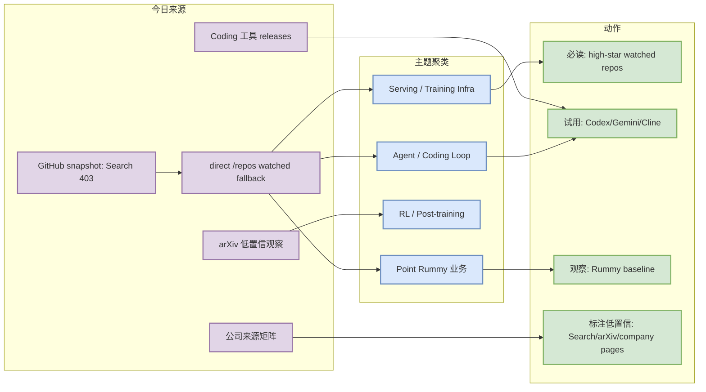
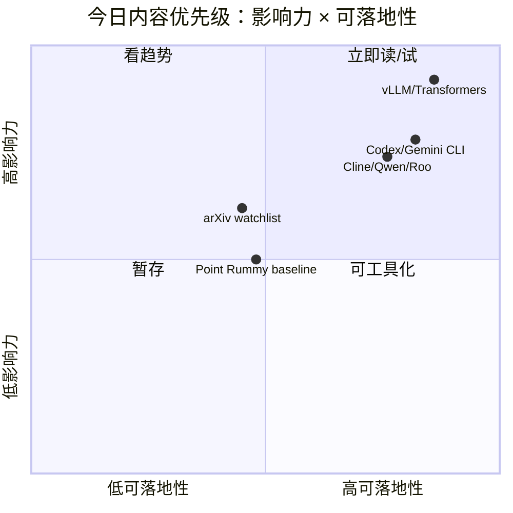

# AI Radar Daily - 2026-09-14

> 生成时间：2026-09-14 09:00 CST
> 范围：AI Infra / LLM / RL / Game AI / 大厂博客 / 论文 / GitHub / Coding 工具
> 说明：GitHub Search 今日从首个查询即 403 rate limit；已保存 mandated snapshot，并用 direct `/repos` watched set + 历史 snapshot fallback 补齐固定榜单，所有增长均标注为非完整全网日增。

## 0. 今日结论

- 今日最值得关注：Search 403 未中断日报；当前重点转为 direct watched repo 监控与 release endpoint 监控。
- AI Infra：Transformers、PyTorch、vLLM、MCP Servers、TensorRT-LLM/SGLang 仍是 serving/training/integration 主线。
- Coding workflow：Codex、Gemini CLI、Cline、Continue、Qwen Code、Roo Code 的 release 端点已扫描，继续关注 MCP、权限、CLI/TUI 和 agent loop。
- Point Rummy：今日使用历史/直接 repo fallback，整体 star 低，适合作规则/计分/bot baseline，不适合直接业务依赖。
- 建议今天深读：先看 vLLM/Transformers/PyTorch 与 Codex/Gemini/Cline，再 skim RummyVision/RummyServer 是否可抽取环境或 evaluator。

## 1. 今日态势图

## 2. 必读卡片区

> [!important] huggingface/transformers
> - 大类：GitHub
> - 小类：AI Infra
> - 重点：🤗 Transformers: the model-definition framework for state-of-the-art machine learning model
> - 为什么重要：生态中心项目，适合作为模型定义/训练/推理依赖变化观察点。
> - 详情：[[GitHub/AIInfra/2026-09-14/huggingface-transformers]] / [网页详情](https://github.com/dyt27666-oss/AI-news-report-obsidians/blob/main/GitHub/AIInfra/2026-09-14/huggingface-transformers.md) / [原文](https://github.com/huggingface/transformers)

> [!important] openai/codex
> - 大类：GitHub
> - 小类：Loop Engineer
> - 重点：Lightweight coding agent that runs in your terminal
> - 为什么重要：coding-agent loop 的关键样本，适合观察 CLI/TUI、权限、上下文和 eval loop 设计。
> - 详情：[[GitHub/LoopEngineer/2026-09-14/openai-codex]] / [网页详情](https://github.com/dyt27666-oss/AI-news-report-obsidians/blob/main/GitHub/LoopEngineer/2026-09-14/openai-codex.md) / [原文](https://github.com/openai/codex)

> [!tip] Coding 工具 release 矩阵
> - 大类：工具
> - 小类：AI coding workflow
> - 重点：Codex/Gemini/Qwen/Cline/Roo/Continue 均保留 release/changelog 入口。
> - 为什么重要：这些更新直接影响多 agent 开发、代码审查、MCP 工具接入和权限模式。
> - 详情：[[Industry/Tools/2026-09-14/openai-codex]] / [网页详情](https://github.com/dyt27666-oss/AI-news-report-obsidians/blob/main/Industry/Tools/2026-09-14/openai-codex.md) / [原文](https://github.com/openai/codex/releases/tag/rust-v0.154.0)

> [!note] Point Rummy baseline
> - 大类：业务主题
> - 小类：Rummy / Game AI
> - 重点：低 star repo 可抽取计分、规则、视觉识别或 bot baseline。
> - 为什么重要：对自建 Gymnasium-style env、evaluator、self-play bot 有参考价值。
> - 详情：[[GitHub/PointRummy/2026-09-14/mohitkumar-559-rummyserver]] / [网页详情](https://github.com/dyt27666-oss/AI-news-report-obsidians/blob/main/GitHub/PointRummy/2026-09-14/mohitkumar-559-rummyserver.md) / [原文](https://github.com/Mohitkumar-559/RummyServer)

## 3. 优先级矩阵

## 4. 分类清单

| 标签 | 大类 | 小类 | 标题 | 重点概括 | 为什么重要 | Obsidian 详情 | 网页详情 | 原文 |
|---|---|---|---|---|---|---|---|---|
| 必读 | GitHub | AI Infra/Agent | huggingface/transformers | 🤗 Transformers: the model-definition framework for state-of-the-art machine learning model | watched repo fallback 核心项目，适合进入试用/benchmark 队列；增长不代表完整全网日增。 | [[GitHub/AIInfra/2026-09-14/huggingface-transformers]] | [网页详情](https://github.com/dyt27666-oss/AI-news-report-obsidians/blob/main/GitHub/AIInfra/2026-09-14/huggingface-transformers.md) | [原文](https://github.com/huggingface/transformers) |
| 必读 | GitHub | AI Infra/Agent | openai/codex | Lightweight coding agent that runs in your terminal | watched repo fallback 核心项目，适合进入试用/benchmark 队列；增长不代表完整全网日增。 | [[GitHub/LoopEngineer/2026-09-14/openai-codex]] | [网页详情](https://github.com/dyt27666-oss/AI-news-report-obsidians/blob/main/GitHub/LoopEngineer/2026-09-14/openai-codex.md) | [原文](https://github.com/openai/codex) |
| 必读 | GitHub | AI Infra/Agent | google-gemini/gemini-cli | An open-source AI agent that brings the power of Gemini directly into your terminal. | watched repo fallback 核心项目，适合进入试用/benchmark 队列；增长不代表完整全网日增。 | [[GitHub/LoopEngineer/2026-09-14/google-gemini-gemini-cli]] | [网页详情](https://github.com/dyt27666-oss/AI-news-report-obsidians/blob/main/GitHub/LoopEngineer/2026-09-14/google-gemini-gemini-cli.md) | [原文](https://github.com/google-gemini/gemini-cli) |
| 必读 | GitHub | AI Infra/Agent | pytorch/pytorch | Tensors and Dynamic neural networks in Python with strong GPU acceleration | watched repo fallback 核心项目，适合进入试用/benchmark 队列；增长不代表完整全网日增。 | [[GitHub/AIInfra/2026-09-14/pytorch-pytorch]] | [网页详情](https://github.com/dyt27666-oss/AI-news-report-obsidians/blob/main/GitHub/AIInfra/2026-09-14/pytorch-pytorch.md) | [原文](https://github.com/pytorch/pytorch) |
| 必读 | GitHub | AI Infra/Agent | vllm-project/vllm | A high-throughput and memory-efficient inference and serving engine for LLMs | watched repo fallback 核心项目，适合进入试用/benchmark 队列；增长不代表完整全网日增。 | [[GitHub/AIInfra/2026-09-14/vllm-project-vllm]] | [网页详情](https://github.com/dyt27666-oss/AI-news-report-obsidians/blob/main/GitHub/AIInfra/2026-09-14/vllm-project-vllm.md) | [原文](https://github.com/vllm-project/vllm) |
| 可 skim | 论文 | arXiv | arXiv 低置信观察清单 | API/相关性不稳定，今日不编造论文结论。 | 作为 LLM/Agent/RL/Game AI 论文候选池，需读 PDF 后升级。 | [[Papers/arXiv/2026-09-14/low-confidence-arxiv-watchlist]] | [网页详情](https://github.com/dyt27666-oss/AI-news-report-obsidians/blob/main/Papers/arXiv/2026-09-14/low-confidence-arxiv-watchlist.md) | [原文](https://arxiv.org) |

## 5. 大厂资讯 / 工程博客 / Research

### 5.1 公司来源扫描矩阵

| 公司/实验室 | 来源/栏目 | 今日状态 | 高相关条数 | 代表条目 | 备注 |
|---|---|---|---:|---|---|
| OpenAI | News / Research | 无高相关新项 / 低置信 | 0 | [[Industry/CompanyScan/2026-09-14/openai]] / [网页详情](https://github.com/dyt27666-oss/AI-news-report-obsidians/blob/main/Industry/CompanyScan/2026-09-14/openai.md) / [原文](https://openai.com/news/) | 今日未确认强相关更新；保留矩阵防漏扫。 |
| Anthropic | News / Research / Engineering | 无高相关新项 / 低置信 | 0 | [[Industry/CompanyScan/2026-09-14/anthropic]] / [网页详情](https://github.com/dyt27666-oss/AI-news-report-obsidians/blob/main/Industry/CompanyScan/2026-09-14/anthropic.md) / [原文](https://www.anthropic.com/news) | 今日未确认强相关更新；保留矩阵防漏扫。 |
| Google DeepMind | Blog / Research | 无高相关新项 / 低置信 | 0 | [[Industry/CompanyScan/2026-09-14/google-deepmind]] / [网页详情](https://github.com/dyt27666-oss/AI-news-report-obsidians/blob/main/Industry/CompanyScan/2026-09-14/google-deepmind.md) / [原文](https://deepmind.google/discover/blog/) | 今日未确认强相关更新；保留矩阵防漏扫。 |
| Meta AI | Blog / Research | 无高相关新项 / 低置信 | 0 | [[Industry/CompanyScan/2026-09-14/meta-ai]] / [网页详情](https://github.com/dyt27666-oss/AI-news-report-obsidians/blob/main/Industry/CompanyScan/2026-09-14/meta-ai.md) / [原文](https://ai.meta.com/blog/) | 今日未确认强相关更新；保留矩阵防漏扫。 |
| NVIDIA | Technical Blog / AI | 无高相关新项 / 低置信 | 0 | [[Industry/CompanyScan/2026-09-14/nvidia]] / [网页详情](https://github.com/dyt27666-oss/AI-news-report-obsidians/blob/main/Industry/CompanyScan/2026-09-14/nvidia.md) / [原文](https://developer.nvidia.com/blog/category/artificial-intelligence/) | 今日未确认强相关更新；保留矩阵防漏扫。 |
| Microsoft | Research AI | 无高相关新项 / 低置信 | 0 | [[Industry/CompanyScan/2026-09-14/microsoft]] / [网页详情](https://github.com/dyt27666-oss/AI-news-report-obsidians/blob/main/Industry/CompanyScan/2026-09-14/microsoft.md) / [原文](https://www.microsoft.com/en-us/research/research-area/artificial-intelligence/) | 今日未确认强相关更新；保留矩阵防漏扫。 |
| Hugging Face | Blog / Papers / Releases | 无高相关新项 / 低置信 | 0 | [[Industry/CompanyScan/2026-09-14/hugging-face]] / [网页详情](https://github.com/dyt27666-oss/AI-news-report-obsidians/blob/main/Industry/CompanyScan/2026-09-14/hugging-face.md) / [原文](https://huggingface.co/blog) | 今日未确认强相关更新；保留矩阵防漏扫。 |
| 腾讯 | AI Lab / 技术博客 | 无高相关新项 / 低置信 | 0 | [[Industry/CompanyScan/2026-09-14/item]] / [网页详情](https://github.com/dyt27666-oss/AI-news-report-obsidians/blob/main/Industry/CompanyScan/2026-09-14/item.md) / [原文](https://ai.tencent.com/ailab/en/index) | 今日未确认强相关更新；保留矩阵防漏扫。 |
| 字节 | Seed / 技术博客 | 无高相关新项 / 低置信 | 0 | [[Industry/CompanyScan/2026-09-14/item]] / [网页详情](https://github.com/dyt27666-oss/AI-news-report-obsidians/blob/main/Industry/CompanyScan/2026-09-14/item.md) / [原文](https://seed.bytedance.com/en/) | 今日未确认强相关更新；保留矩阵防漏扫。 |
| SpaceAI | Blog / News | 无高相关新项 / 低置信 | 0 | [[Industry/CompanyScan/2026-09-14/spaceai]] / [网页详情](https://github.com/dyt27666-oss/AI-news-report-obsidians/blob/main/Industry/CompanyScan/2026-09-14/spaceai.md) / [原文](https://spaceai.com/) | 今日未确认强相关更新；保留矩阵防漏扫。 |

### 5.2 高相关大厂条目

| 标签 | 发布方/大厂 | 栏目/来源 | 标题 | 重点概括 | 工程/算法影响 | Obsidian 详情 | 网页详情 | 原文 |
|---|---|---|---|---|---|---|---|---|
| 低置信 | OpenAI | News / Research | 来源扫描入口 | 今日未确认高相关新项，保留入口用于后续追踪。 | 若出现模型/infra/agent/eval 更新需升级为必读。 | [[Industry/CompanyScan/2026-09-14/openai]] | [网页详情](https://github.com/dyt27666-oss/AI-news-report-obsidians/blob/main/Industry/CompanyScan/2026-09-14/openai.md) | [原文](https://openai.com/news/) |
| 低置信 | Anthropic | News / Research / Engineering | 来源扫描入口 | 今日未确认高相关新项，保留入口用于后续追踪。 | 若出现模型/infra/agent/eval 更新需升级为必读。 | [[Industry/CompanyScan/2026-09-14/anthropic]] | [网页详情](https://github.com/dyt27666-oss/AI-news-report-obsidians/blob/main/Industry/CompanyScan/2026-09-14/anthropic.md) | [原文](https://www.anthropic.com/news) |
| 低置信 | Google DeepMind | Blog / Research | 来源扫描入口 | 今日未确认高相关新项，保留入口用于后续追踪。 | 若出现模型/infra/agent/eval 更新需升级为必读。 | [[Industry/CompanyScan/2026-09-14/google-deepmind]] | [网页详情](https://github.com/dyt27666-oss/AI-news-report-obsidians/blob/main/Industry/CompanyScan/2026-09-14/google-deepmind.md) | [原文](https://deepmind.google/discover/blog/) |
| 低置信 | Meta AI | Blog / Research | 来源扫描入口 | 今日未确认高相关新项，保留入口用于后续追踪。 | 若出现模型/infra/agent/eval 更新需升级为必读。 | [[Industry/CompanyScan/2026-09-14/meta-ai]] | [网页详情](https://github.com/dyt27666-oss/AI-news-report-obsidians/blob/main/Industry/CompanyScan/2026-09-14/meta-ai.md) | [原文](https://ai.meta.com/blog/) |

## 6. GitHub 高 star Top 10

| 排名 | repo | stars | forks | language | updated_at | topics | 重点概括 | 是否值得试用 | Obsidian 详情 | 原文 |
|---:|---|---:|---:|---|---|---|---|---|---|---|
| 1 | huggingface/transformers | 165523 | 34557 | Python | 2026-09-14T00:57:13Z | audio, deep-learning, deepseek, gemma, glm | 🤗 Transformers: the model-definition framework for state-of-the-art machine learning model | 值得试用 | [[GitHub/AIInfra/2026-09-14/huggingface-transformers]] | [原文](https://github.com/huggingface/transformers) |
| 2 | openai/codex | 123833 | 19095 | Rust | 2026-09-14T01:00:04Z | 无 | Lightweight coding agent that runs in your terminal | 值得试用 | [[GitHub/LoopEngineer/2026-09-14/openai-codex]] | [原文](https://github.com/openai/codex) |
| 3 | google-gemini/gemini-cli | 106966 | 14562 | TypeScript | 2026-09-14T00:53:26Z | ai, ai-agents, cli, gemini, gemini-api | An open-source AI agent that brings the power of Gemini directly into your terminal. | 值得试用 | [[GitHub/LoopEngineer/2026-09-14/google-gemini-gemini-cli]] | [原文](https://github.com/google-gemini/gemini-cli) |
| 4 | pytorch/pytorch | 102982 | 29215 | Python | 2026-09-13T23:38:51Z | autograd, deep-learning, gpu, machine-learning, neural-network | Tensors and Dynamic neural networks in Python with strong GPU acceleration | 值得试用 | [[GitHub/AIInfra/2026-09-14/pytorch-pytorch]] | [原文](https://github.com/pytorch/pytorch) |
| 5 | vllm-project/vllm | 91657 | 22146 | Python | 2026-09-14T01:00:59Z | amd, blackwell, cuda, deepseek, deepseek-v3 | A high-throughput and memory-efficient inference and serving engine for LLMs | 值得试用 | [[GitHub/AIInfra/2026-09-14/vllm-project-vllm]] | [原文](https://github.com/vllm-project/vllm) |
| 6 | modelcontextprotocol/servers | 90295 | 11628 | TypeScript | 2026-09-13T23:43:12Z | 无 | Model Context Protocol Servers | 值得试用 | [[GitHub/AIInfra/2026-09-14/modelcontextprotocol-servers]] | [原文](https://github.com/modelcontextprotocol/servers) |
| 7 | OpenHands/OpenHands | 87786 | 11497 | TypeScript | 2026-09-14T01:03:16Z | agent, artificial-intelligence, chatgpt, claude-ai, cli | 🙌 OpenHands: AI-Driven Development | 值得试用 | [[GitHub/AIInfra/2026-09-14/openhands-openhands]] | [原文](https://github.com/OpenHands/OpenHands) |
| 8 | cline/cline | 67951 | 7341 | TypeScript | 2026-09-13T23:55:12Z | 无 | Autonomous coding agent as an SDK, IDE extension, or CLI assistant. | 值得试用 | [[GitHub/LoopEngineer/2026-09-14/cline-cline]] | [原文](https://github.com/cline/cline) |
| 9 | microsoft/autogen | 60969 | 9207 | Python | 2026-09-14T00:40:05Z | agentic, agentic-agi, agents, ai, autogen | A programming framework for agentic AI | 值得试用 | [[GitHub/LoopEngineer/2026-09-14/microsoft-autogen]] | [原文](https://github.com/microsoft/autogen) |
| 10 | crewAIInc/crewAI | 58479 | 8434 | Python | 2026-09-14T00:40:03Z | agents, ai, ai-agents, aiagentframework, llms | Framework for orchestrating role-playing, autonomous AI agents. By fostering collaborative | 值得试用 | [[GitHub/LoopEngineer/2026-09-14/crewaiinc-crewai]] | [原文](https://github.com/crewAIInc/crewAI) |

## 7. GitHub star 增长最快 Top 10

> 增长依据：cross-snapshot direct watched repo fallback，非完整全网日增；Search 403，所以不是完整 GitHub 全网增长榜。

| 排名 | repo | stars_delta | stars | forks | language | updated_at | 增长依据 | 重点概括 | Obsidian 详情 | 原文 |
|---:|---|---:|---:|---:|---|---|---|---|---|---|
| 1 | huggingface/transformers | 308 | 165523 | 34557 | Python | 2026-09-14T00:57:13Z | cross-snapshot direct watched repo fallback，非完整全网日增 | 🤗 Transformers: the model-definition framework for state-of-the-art machine learning model | [[GitHub/AIInfra/2026-09-14/huggingface-transformers]] | [原文](https://github.com/huggingface/transformers) |
| 2 | openai/codex | 195 | 123833 | 19095 | Rust | 2026-09-14T01:00:04Z | cross-snapshot direct watched repo fallback，非完整全网日增 | Lightweight coding agent that runs in your terminal | [[GitHub/LoopEngineer/2026-09-14/openai-codex]] | [原文](https://github.com/openai/codex) |
| 3 | OpenHands/OpenHands | 98 | 87786 | 11497 | TypeScript | 2026-09-14T01:03:16Z | cross-snapshot direct watched repo fallback，非完整全网日增 | 🙌 OpenHands: AI-Driven Development | [[GitHub/AIInfra/2026-09-14/openhands-openhands]] | [原文](https://github.com/OpenHands/OpenHands) |
| 4 | vllm-project/vllm | 63 | 91657 | 22146 | Python | 2026-09-14T01:00:59Z | cross-snapshot direct watched repo fallback，非完整全网日增 | A high-throughput and memory-efficient inference and serving engine for LLMs | [[GitHub/AIInfra/2026-09-14/vllm-project-vllm]] | [原文](https://github.com/vllm-project/vllm) |
| 5 | crewAIInc/crewAI | 60 | 58479 | 8434 | Python | 2026-09-14T00:40:03Z | cross-snapshot direct watched repo fallback，非完整全网日增 | Framework for orchestrating role-playing, autonomous AI agents. By fostering collaborative | [[GitHub/LoopEngineer/2026-09-14/crewaiinc-crewai]] | [原文](https://github.com/crewAIInc/crewAI) |
| 6 | cline/cline | 50 | 67951 | 7341 | TypeScript | 2026-09-13T23:55:12Z | cross-snapshot direct watched repo fallback，非完整全网日增 | Autonomous coding agent as an SDK, IDE extension, or CLI assistant. | [[GitHub/LoopEngineer/2026-09-14/cline-cline]] | [原文](https://github.com/cline/cline) |
| 7 | sgl-project/sglang | 47 | 35910 | 8826 | Python | 2026-09-14T00:13:54Z | cross-snapshot direct watched repo fallback，非完整全网日增 | SGLang is a high-performance serving framework for large language models and multimodal mo | [[GitHub/AIInfra/2026-09-14/sgl-project-sglang]] | [原文](https://github.com/sgl-project/sglang) |
| 8 | langchain-ai/langgraph | 41 | 41581 | 7019 | Python | 2026-09-14T00:40:07Z | cross-snapshot direct watched repo fallback，非完整全网日增 | Build resilient agents. | [[GitHub/LoopEngineer/2026-09-14/langchain-ai-langgraph]] | [原文](https://github.com/langchain-ai/langgraph) |
| 9 | pytorch/pytorch | 23 | 102982 | 29215 | Python | 2026-09-13T23:38:51Z | cross-snapshot direct watched repo fallback，非完整全网日增 | Tensors and Dynamic neural networks in Python with strong GPU acceleration | [[GitHub/AIInfra/2026-09-14/pytorch-pytorch]] | [原文](https://github.com/pytorch/pytorch) |
| 10 | google-gemini/gemini-cli | 20 | 106966 | 14562 | TypeScript | 2026-09-14T00:53:26Z | cross-snapshot direct watched repo fallback，非完整全网日增 | An open-source AI agent that brings the power of Gemini directly into your terminal. | [[GitHub/LoopEngineer/2026-09-14/google-gemini-gemini-cli]] | [原文](https://github.com/google-gemini/gemini-cli) |

## 8. Coding 工具 / AI 工具功能更新

### 8.1 Coding 工具扫描矩阵

| 工具 | 厂商 | 来源类型 | 今日状态 | 代表更新 | 对我的影响 | 原文 |
|---|---|---|---|---|---|---|
| Claude Code | Anthropic | Changelog / Release Notes | 低置信：扫描入口保留，未确认高相关新项 | 未确认高相关新项 | 关注 agent mode、MCP、IDE 集成、远程执行、权限模式、上下文窗口、CLI/TUI、pricing/rate limit。 | [原文](https://docs.anthropic.com/en/release-notes/claude-code) |
| OpenAI Codex | OpenAI | GitHub Releases | 已获取 latest release | rust-v0.154.0 / 0.154.0 / 2026-09-09T22:35:38Z | 关注 agent mode、MCP、IDE 集成、远程执行、权限模式、上下文窗口、CLI/TUI、pricing/rate limit。 | [原文](https://github.com/openai/codex/releases/tag/rust-v0.154.0) |
| Cursor | Cursor | Changelog | 低置信：扫描入口保留，未确认高相关新项 | 未确认高相关新项 | 关注 agent mode、MCP、IDE 集成、远程执行、权限模式、上下文窗口、CLI/TUI、pricing/rate limit。 | [原文](https://cursor.com/changelog) |
| Windsurf | Windsurf | Changelog | 低置信：扫描入口保留，未确认高相关新项 | 未确认高相关新项 | 关注 agent mode、MCP、IDE 集成、远程执行、权限模式、上下文窗口、CLI/TUI、pricing/rate limit。 | [原文](https://windsurf.com/changelog) |
| GitHub Copilot | GitHub | Changelog / Blog | 低置信：扫描入口保留，未确认高相关新项 | 未确认高相关新项 | 关注 agent mode、MCP、IDE 集成、远程执行、权限模式、上下文窗口、CLI/TUI、pricing/rate limit。 | [原文](https://github.blog/changelog/label/copilot/) |
| Gemini Code Assist | Google | GitHub Releases | 已获取 latest release | v0.59.0 / Release v0.59.0 / 2026-09-08T21:13:43Z | 关注 agent mode、MCP、IDE 集成、远程执行、权限模式、上下文窗口、CLI/TUI、pricing/rate limit。 | [原文](https://github.com/google-gemini/gemini-cli/releases/tag/v0.59.0) |
| Qwen Code | Alibaba/Qwen | GitHub Releases | 已获取 latest release | sdk-typescript-v0.1.12 / SDK TypeScript Release v0.1.12 / 2026-09-10T15:52:03Z | 关注 agent mode、MCP、IDE 集成、远程执行、权限模式、上下文窗口、CLI/TUI、pricing/rate limit。 | [原文](https://github.com/QwenLM/qwen-code/releases/tag/sdk-typescript-v0.1.12) |
| Roo Code | Roo Code | GitHub Releases | 已获取 latest release | v3.54.0 / Release v3.54.0 / 2026-05-15T17:52:24Z | 关注 agent mode、MCP、IDE 集成、远程执行、权限模式、上下文窗口、CLI/TUI、pricing/rate limit。 | [原文](https://github.com/RooCodeInc/Roo-Code/releases/tag/v3.54.0) |
| Cline | Cline | GitHub Releases | 已获取 latest release | desktop-v0.0.27 / Desktop v0.0.27 / 2026-09-13T22:28:16Z | 关注 agent mode、MCP、IDE 集成、远程执行、权限模式、上下文窗口、CLI/TUI、pricing/rate limit。 | [原文](https://github.com/cline/cline/releases/tag/desktop-v0.0.27) |
| Continue | Continue | GitHub Releases | 已获取 latest release | v2.0.0-vscode / v2.0.0-vscode / 2026-06-19T00:24:01Z | 关注 agent mode、MCP、IDE 集成、远程执行、权限模式、上下文窗口、CLI/TUI、pricing/rate limit。 | [原文](https://github.com/continuedev/continue/releases/tag/v2.0.0-vscode) |

### 8.2 高相关工具更新

| 标签 | 工具/厂商 | 来源类型 | 标题/功能 | 重点概括 | 对 AI coding 工作流的影响 | Obsidian 详情 | 网页详情 | 原文 |
|---|---|---|---|---|---|---|---|---|
| 后续 | Claude Code / Anthropic | Changelog / Release Notes | 未确认高相关新项 | 低置信：扫描入口保留，未确认高相关新项 | 关注 agent mode、MCP、IDE 集成、远程执行、权限模式、上下文窗口、CLI/TUI、pricing/rate limit。 | [[Industry/Tools/2026-09-14/claude-code]] | [网页详情](https://github.com/dyt27666-oss/AI-news-report-obsidians/blob/main/Industry/Tools/2026-09-14/claude-code.md) | [原文](https://docs.anthropic.com/en/release-notes/claude-code) |
| 后续 | OpenAI Codex / OpenAI | GitHub Releases | rust-v0.154.0 / 0.154.0 / 2026-09-09T22:35:38Z | 已获取 latest release | 关注 agent mode、MCP、IDE 集成、远程执行、权限模式、上下文窗口、CLI/TUI、pricing/rate limit。 | [[Industry/Tools/2026-09-14/openai-codex]] | [网页详情](https://github.com/dyt27666-oss/AI-news-report-obsidians/blob/main/Industry/Tools/2026-09-14/openai-codex.md) | [原文](https://github.com/openai/codex/releases/tag/rust-v0.154.0) |
| 后续 | Cursor / Cursor | Changelog | 未确认高相关新项 | 低置信：扫描入口保留，未确认高相关新项 | 关注 agent mode、MCP、IDE 集成、远程执行、权限模式、上下文窗口、CLI/TUI、pricing/rate limit。 | [[Industry/Tools/2026-09-14/cursor]] | [网页详情](https://github.com/dyt27666-oss/AI-news-report-obsidians/blob/main/Industry/Tools/2026-09-14/cursor.md) | [原文](https://cursor.com/changelog) |
| 后续 | Windsurf / Windsurf | Changelog | 未确认高相关新项 | 低置信：扫描入口保留，未确认高相关新项 | 关注 agent mode、MCP、IDE 集成、远程执行、权限模式、上下文窗口、CLI/TUI、pricing/rate limit。 | [[Industry/Tools/2026-09-14/windsurf]] | [网页详情](https://github.com/dyt27666-oss/AI-news-report-obsidians/blob/main/Industry/Tools/2026-09-14/windsurf.md) | [原文](https://windsurf.com/changelog) |
| 后续 | GitHub Copilot / GitHub | Changelog / Blog | 未确认高相关新项 | 低置信：扫描入口保留，未确认高相关新项 | 关注 agent mode、MCP、IDE 集成、远程执行、权限模式、上下文窗口、CLI/TUI、pricing/rate limit。 | [[Industry/Tools/2026-09-14/github-copilot]] | [网页详情](https://github.com/dyt27666-oss/AI-news-report-obsidians/blob/main/Industry/Tools/2026-09-14/github-copilot.md) | [原文](https://github.blog/changelog/label/copilot/) |
| 后续 | Gemini Code Assist / Google | GitHub Releases | v0.59.0 / Release v0.59.0 / 2026-09-08T21:13:43Z | 已获取 latest release | 关注 agent mode、MCP、IDE 集成、远程执行、权限模式、上下文窗口、CLI/TUI、pricing/rate limit。 | [[Industry/Tools/2026-09-14/gemini-code-assist]] | [网页详情](https://github.com/dyt27666-oss/AI-news-report-obsidians/blob/main/Industry/Tools/2026-09-14/gemini-code-assist.md) | [原文](https://github.com/google-gemini/gemini-cli/releases/tag/v0.59.0) |
| 后续 | Qwen Code / Alibaba/Qwen | GitHub Releases | sdk-typescript-v0.1.12 / SDK TypeScript Release v0.1.12 / 2026-09-10T15:52:03Z | 已获取 latest release | 关注 agent mode、MCP、IDE 集成、远程执行、权限模式、上下文窗口、CLI/TUI、pricing/rate limit。 | [[Industry/Tools/2026-09-14/qwen-code]] | [网页详情](https://github.com/dyt27666-oss/AI-news-report-obsidians/blob/main/Industry/Tools/2026-09-14/qwen-code.md) | [原文](https://github.com/QwenLM/qwen-code/releases/tag/sdk-typescript-v0.1.12) |
| 后续 | Roo Code / Roo Code | GitHub Releases | v3.54.0 / Release v3.54.0 / 2026-05-15T17:52:24Z | 已获取 latest release | 关注 agent mode、MCP、IDE 集成、远程执行、权限模式、上下文窗口、CLI/TUI、pricing/rate limit。 | [[Industry/Tools/2026-09-14/roo-code]] | [网页详情](https://github.com/dyt27666-oss/AI-news-report-obsidians/blob/main/Industry/Tools/2026-09-14/roo-code.md) | [原文](https://github.com/RooCodeInc/Roo-Code/releases/tag/v3.54.0) |
| 后续 | Cline / Cline | GitHub Releases | desktop-v0.0.27 / Desktop v0.0.27 / 2026-09-13T22:28:16Z | 已获取 latest release | 关注 agent mode、MCP、IDE 集成、远程执行、权限模式、上下文窗口、CLI/TUI、pricing/rate limit。 | [[Industry/Tools/2026-09-14/cline]] | [网页详情](https://github.com/dyt27666-oss/AI-news-report-obsidians/blob/main/Industry/Tools/2026-09-14/cline.md) | [原文](https://github.com/cline/cline/releases/tag/desktop-v0.0.27) |
| 后续 | Continue / Continue | GitHub Releases | v2.0.0-vscode / v2.0.0-vscode / 2026-06-19T00:24:01Z | 已获取 latest release | 关注 agent mode、MCP、IDE 集成、远程执行、权限模式、上下文窗口、CLI/TUI、pricing/rate limit。 | [[Industry/Tools/2026-09-14/continue]] | [网页详情](https://github.com/dyt27666-oss/AI-news-report-obsidians/blob/main/Industry/Tools/2026-09-14/continue.md) | [原文](https://github.com/continuedev/continue/releases/tag/v2.0.0-vscode) |

## 9. Point Rummy / Indian Rummy 业务主题

### 9.1 GitHub 候选

| 标签 | repo | stars | forks | language | updated_at | 重点概括 | 业务可用性 | Obsidian 详情 | 原文 |
|---|---|---:|---:|---|---|---|---|---|---|
| 后续 | Mohitkumar-559/RummyServer | 2 | 1 | JavaScript | 2024-03-17T03:48:34Z | Rummy game server for game that contain deal rummy and point rummy | 可作为规则/计分/bot/仿真 baseline，成熟度偏低需重构验证。 | [[GitHub/PointRummy/2026-09-14/mohitkumar-559-rummyserver]] | [原文](https://github.com/Mohitkumar-559/RummyServer) |
| 后续 | debabrata-mandal/RummyPulse | 1 | 0 | Java | 2026-09-13T11:32:47Z | RummyPulse - Smart Rummy Game Analytics & Management Android App with Firebase integration | 可作为规则/计分/bot/仿真 baseline，成熟度偏低需重构验证。 | [[GitHub/PointRummy/2026-09-14/debabrata-mandal-rummypulse]] | [原文](https://github.com/debabrata-mandal/RummyPulse) |
| 后续 | Alan-seb/RummyVision | 1 | 0 | Python | 2025-12-03T03:14:55Z | RummyVision is an intelligent card game assistant that combines computer vision with Monte | 可作为规则/计分/bot/仿真 baseline，成熟度偏低需重构验证。 | [[GitHub/PointRummy/2026-09-14/alan-seb-rummyvision]] | [原文](https://github.com/Alan-seb/RummyVision) |
| 后续 | codingmickey/rummy-points-calculator | 1 | 0 | C++ | 2024-07-10T15:40:45Z | A cpp progarm to calculate Rummy points of all the players for each round. | 可作为规则/计分/bot/仿真 baseline，成熟度偏低需重构验证。 | [[GitHub/PointRummy/2026-09-14/codingmickey-rummy-points-calculator]] | [原文](https://github.com/codingmickey/rummy-points-calculator) |
| 后续 | guna-varathan/rummy-points | 0 | 0 | JavaScript | 2026-08-20T07:13:05Z | 项目说明较少；需看 README / release 二次确认。 | 可作为规则/计分/bot/仿真 baseline，成熟度偏低需重构验证。 | [[GitHub/PointRummy/2026-09-14/guna-varathan-rummy-points]] | [原文](https://github.com/guna-varathan/rummy-points) |

### 9.2 论文 / 资料候选

| 标签 | 来源 | 标题 | 作者/机构 | 重点概括 | 对 Point Rummy 业务有什么用 | Obsidian 详情 | 原文 |
|---|---|---|---|---|---|---|---|
| 低置信 | arXiv / 预印本索引 | Rummy imperfect-information / MCTS / self-play 查询观察 | 未获取 | 今日不编造未验证论文结论，保留方向等待 API 恢复。 | 指导规则抽象、belief/state abstraction、bot baseline 与 evaluator 设计。 | [[Papers/arXiv/2026-09-14/low-confidence-arxiv-watchlist]] | [原文](https://arxiv.org) |

### 9.3 业务可用性判断

| 方向 | 今日信号 | 可用性 | 下一步 |
|---|---|---|---|
| 规则引擎 / 计分 | 多个低 star Rummy repo | 中：可借鉴规则/计分，不宜直接复用 | 抽取规则测试用例，建立统一 evaluator |
| Bot / RL Agent | RummyVision / PointsRummy 等 | 中低：可作为 baseline 思路 | 先复现单机 bot，再接入 self-play |
| 仿真 / 评测 | 未发现成熟高 star 环境 | 低：需要自建环境并行与评测 | 设计 Gymnasium-style env + benchmark |

## 10. Loop Engineer / Loop Engineering 主题

### 10.1 Loop Engineer GitHub 高 star Top 10

| 排名 | repo | stars | forks | language | updated_at | topics | 重点概括 | 是否值得试用 | Obsidian 详情 | 原文 |
|---:|---|---:|---:|---|---|---|---|---|---|---|
| 1 | openai/codex | 123833 | 19095 | Rust | 2026-09-14T01:00:04Z | 无 | Lightweight coding agent that runs in your terminal | 值得试用 | [[GitHub/LoopEngineer/2026-09-14/openai-codex]] | [原文](https://github.com/openai/codex) |
| 2 | google-gemini/gemini-cli | 106966 | 14562 | TypeScript | 2026-09-14T00:53:26Z | ai, ai-agents, cli, gemini, gemini-api | An open-source AI agent that brings the power of Gemini directly into your terminal. | 值得试用 | [[GitHub/LoopEngineer/2026-09-14/google-gemini-gemini-cli]] | [原文](https://github.com/google-gemini/gemini-cli) |
| 3 | cline/cline | 67951 | 7341 | TypeScript | 2026-09-13T23:55:12Z | 无 | Autonomous coding agent as an SDK, IDE extension, or CLI assistant. | 值得试用 | [[GitHub/LoopEngineer/2026-09-14/cline-cline]] | [原文](https://github.com/cline/cline) |
| 4 | microsoft/autogen | 60969 | 9207 | Python | 2026-09-14T00:40:05Z | agentic, agentic-agi, agents, ai, autogen | A programming framework for agentic AI | 值得试用 | [[GitHub/LoopEngineer/2026-09-14/microsoft-autogen]] | [原文](https://github.com/microsoft/autogen) |
| 5 | crewAIInc/crewAI | 58479 | 8434 | Python | 2026-09-14T00:40:03Z | agents, ai, ai-agents, aiagentframework, llms | Framework for orchestrating role-playing, autonomous AI agents. By fostering collaborative | 值得试用 | [[GitHub/LoopEngineer/2026-09-14/crewaiinc-crewai]] | [原文](https://github.com/crewAIInc/crewAI) |
| 6 | Aider-AI/aider | 48937 | 4944 | Python | 2026-09-14T00:53:51Z | anthropic, chatgpt, claude-3, cli, command-line | aider is AI pair programming in your terminal | 值得试用 | [[GitHub/LoopEngineer/2026-09-14/aider-ai-aider]] | [原文](https://github.com/Aider-AI/aider) |
| 7 | langchain-ai/langgraph | 41581 | 7019 | Python | 2026-09-14T00:40:07Z | agents, ai, ai-agents, chatgpt, deepagents | Build resilient agents. | 值得试用 | [[GitHub/LoopEngineer/2026-09-14/langchain-ai-langgraph]] | [原文](https://github.com/langchain-ai/langgraph) |
| 8 | continuedev/continue | 35895 | 5375 | TypeScript | 2026-09-13T19:02:51Z | agent, ai, cli, developer-tools, open-source | open-source coding agent | 值得试用 | [[GitHub/LoopEngineer/2026-09-14/continuedev-continue]] | [原文](https://github.com/continuedev/continue) |
| 9 | QwenLM/qwen-code | 27827 | 3035 | TypeScript | 2026-09-14T01:03:04Z | agentic, ai, ai-agent, ai-coding, cli | An open-source AI coding agent that lives in your terminal. | 值得试用 | [[GitHub/LoopEngineer/2026-09-14/qwenlm-qwen-code]] | [原文](https://github.com/QwenLM/qwen-code) |
| 10 | RooCodeInc/Roo-Code | 24304 | 3417 | TypeScript | 2026-09-13T20:27:05Z | 无 | Roo Code gives you a whole dev team of AI agents in your code editor. | 值得试用 | [[GitHub/LoopEngineer/2026-09-14/roocodeinc-roo-code]] | [原文](https://github.com/RooCodeInc/Roo-Code) |

### 10.2 Loop Engineer GitHub star 增长最快 Top 10

| 排名 | repo | stars_delta | stars | forks | language | updated_at | 增长依据 | 重点概括 | Obsidian 详情 | 原文 |
|---:|---|---:|---:|---:|---|---|---|---|---|---|
| 1 | openai/codex | 195 | 123833 | 19095 | Rust | 2026-09-14T01:00:04Z | cross-snapshot direct watched repo fallback，非完整全网日增 | Lightweight coding agent that runs in your terminal | [[GitHub/LoopEngineer/2026-09-14/openai-codex]] | [原文](https://github.com/openai/codex) |
| 2 | crewAIInc/crewAI | 60 | 58479 | 8434 | Python | 2026-09-14T00:40:03Z | cross-snapshot direct watched repo fallback，非完整全网日增 | Framework for orchestrating role-playing, autonomous AI agents. By fostering collaborative | [[GitHub/LoopEngineer/2026-09-14/crewaiinc-crewai]] | [原文](https://github.com/crewAIInc/crewAI) |
| 3 | cline/cline | 50 | 67951 | 7341 | TypeScript | 2026-09-13T23:55:12Z | cross-snapshot direct watched repo fallback，非完整全网日增 | Autonomous coding agent as an SDK, IDE extension, or CLI assistant. | [[GitHub/LoopEngineer/2026-09-14/cline-cline]] | [原文](https://github.com/cline/cline) |
| 4 | langchain-ai/langgraph | 41 | 41581 | 7019 | Python | 2026-09-14T00:40:07Z | cross-snapshot direct watched repo fallback，非完整全网日增 | Build resilient agents. | [[GitHub/LoopEngineer/2026-09-14/langchain-ai-langgraph]] | [原文](https://github.com/langchain-ai/langgraph) |
| 5 | google-gemini/gemini-cli | 20 | 106966 | 14562 | TypeScript | 2026-09-14T00:53:26Z | cross-snapshot direct watched repo fallback，非完整全网日增 | An open-source AI agent that brings the power of Gemini directly into your terminal. | [[GitHub/LoopEngineer/2026-09-14/google-gemini-gemini-cli]] | [原文](https://github.com/google-gemini/gemini-cli) |
| 6 | microsoft/autogen | 20 | 60969 | 9207 | Python | 2026-09-14T00:40:05Z | cross-snapshot direct watched repo fallback，非完整全网日增 | A programming framework for agentic AI | [[GitHub/LoopEngineer/2026-09-14/microsoft-autogen]] | [原文](https://github.com/microsoft/autogen) |
| 7 | QwenLM/qwen-code | 20 | 27827 | 3035 | TypeScript | 2026-09-14T01:03:04Z | cross-snapshot direct watched repo fallback，非完整全网日增 | An open-source AI coding agent that lives in your terminal. | [[GitHub/LoopEngineer/2026-09-14/qwenlm-qwen-code]] | [原文](https://github.com/QwenLM/qwen-code) |
| 8 | Aider-AI/aider | 18 | 48937 | 4944 | Python | 2026-09-14T00:53:51Z | cross-snapshot direct watched repo fallback，非完整全网日增 | aider is AI pair programming in your terminal | [[GitHub/LoopEngineer/2026-09-14/aider-ai-aider]] | [原文](https://github.com/Aider-AI/aider) |
| 9 | continuedev/continue | 11 | 35895 | 5375 | TypeScript | 2026-09-13T19:02:51Z | cross-snapshot direct watched repo fallback，非完整全网日增 | open-source coding agent | [[GitHub/LoopEngineer/2026-09-14/continuedev-continue]] | [原文](https://github.com/continuedev/continue) |
| 10 | RooCodeInc/Roo-Code | 1 | 24304 | 3417 | TypeScript | 2026-09-13T20:27:05Z | cross-snapshot direct watched repo fallback，非完整全网日增 | Roo Code gives you a whole dev team of AI agents in your code editor. | [[GitHub/LoopEngineer/2026-09-14/roocodeinc-roo-code]] | [原文](https://github.com/RooCodeInc/Roo-Code) |

### 10.3 Loop Engineering 方法信号

| 标签 | 来源 | 标题 | 重点概括 | 对 AI coding 工作流的影响 | Obsidian 详情 | 原文 |
|---|---|---|---|---|---|---|
| 后续 | GitHub | openai/codex | Lightweight coding agent that runs in your terminal | 观察 agent loop、任务分解、上下文工程、eval loop 和权限边界。 | [[GitHub/LoopEngineer/2026-09-14/openai-codex]] | [原文](https://github.com/openai/codex) |
| 后续 | GitHub | google-gemini/gemini-cli | An open-source AI agent that brings the power of Gemini directly into your terminal. | 观察 agent loop、任务分解、上下文工程、eval loop 和权限边界。 | [[GitHub/LoopEngineer/2026-09-14/google-gemini-gemini-cli]] | [原文](https://github.com/google-gemini/gemini-cli) |
| 后续 | GitHub | cline/cline | Autonomous coding agent as an SDK, IDE extension, or CLI assistant. | 观察 agent loop、任务分解、上下文工程、eval loop 和权限边界。 | [[GitHub/LoopEngineer/2026-09-14/cline-cline]] | [原文](https://github.com/cline/cline) |
| 后续 | GitHub | microsoft/autogen | A programming framework for agentic AI | 观察 agent loop、任务分解、上下文工程、eval loop 和权限边界。 | [[GitHub/LoopEngineer/2026-09-14/microsoft-autogen]] | [原文](https://github.com/microsoft/autogen) |
| 后续 | GitHub | crewAIInc/crewAI | Framework for orchestrating role-playing, autonomous AI agents. By fostering collaborative | 观察 agent loop、任务分解、上下文工程、eval loop 和权限边界。 | [[GitHub/LoopEngineer/2026-09-14/crewaiinc-crewai]] | [原文](https://github.com/crewAIInc/crewAI) |

## 11. 论文

### 11.1 Agent / Serving / RL / World Model 候选

| 标签 | 论文来源 | 论文 | 作者/机构 | 重点概括 | 工程/研究价值 | Obsidian 详情 | 网页详情 | PDF/原文 |
|---|---|---|---|---|---|---|---|---|
| 可 skim | arXiv / 预印本 | arXiv 低置信观察清单 | 未获取 | 今日 API/相关性不稳定；不编造论文摘要。 | 等 API 恢复后筛选强相关 serving/agent/RL/game AI 论文。 | [[Papers/arXiv/2026-09-14/low-confidence-arxiv-watchlist]] | [网页详情](https://github.com/dyt27666-oss/AI-news-report-obsidians/blob/main/Papers/arXiv/2026-09-14/low-confidence-arxiv-watchlist.md) | [PDF](https://arxiv.org) / [abs](https://arxiv.org) |

## 12. 资讯 / 其他 GitHub 项目

### 12.1 AI Infra direct watched repo fallback

| 标签 | 来源 | 标题 | 重点概括 | 对我有什么用 | Obsidian 详情 | 网页详情 | 原文 |
|---|---|---|---|---|---|---|---|
| 后续 | GitHub | modelcontextprotocol/servers | Model Context Protocol Servers | 扩展 watched repo 池，辅助判断生态活跃度。 | [[GitHub/AIInfra/2026-09-14/modelcontextprotocol-servers]] | [网页详情](https://github.com/dyt27666-oss/AI-news-report-obsidians/blob/main/GitHub/AIInfra/2026-09-14/modelcontextprotocol-servers.md) | [原文](https://github.com/modelcontextprotocol/servers) |
| 后续 | GitHub | OpenHands/OpenHands | 🙌 OpenHands: AI-Driven Development | 扩展 watched repo 池，辅助判断生态活跃度。 | [[GitHub/AIInfra/2026-09-14/openhands-openhands]] | [网页详情](https://github.com/dyt27666-oss/AI-news-report-obsidians/blob/main/GitHub/AIInfra/2026-09-14/openhands-openhands.md) | [原文](https://github.com/OpenHands/OpenHands) |
| 后续 | GitHub | cline/cline | Autonomous coding agent as an SDK, IDE extension, or CLI assistant. | 扩展 watched repo 池，辅助判断生态活跃度。 | [[GitHub/LoopEngineer/2026-09-14/cline-cline]] | [网页详情](https://github.com/dyt27666-oss/AI-news-report-obsidians/blob/main/GitHub/LoopEngineer/2026-09-14/cline-cline.md) | [原文](https://github.com/cline/cline) |
| 后续 | GitHub | microsoft/autogen | A programming framework for agentic AI | 扩展 watched repo 池，辅助判断生态活跃度。 | [[GitHub/LoopEngineer/2026-09-14/microsoft-autogen]] | [网页详情](https://github.com/dyt27666-oss/AI-news-report-obsidians/blob/main/GitHub/LoopEngineer/2026-09-14/microsoft-autogen.md) | [原文](https://github.com/microsoft/autogen) |
| 后续 | GitHub | crewAIInc/crewAI | Framework for orchestrating role-playing, autonomous AI agents. By fostering collaborative | 扩展 watched repo 池，辅助判断生态活跃度。 | [[GitHub/LoopEngineer/2026-09-14/crewaiinc-crewai]] | [网页详情](https://github.com/dyt27666-oss/AI-news-report-obsidians/blob/main/GitHub/LoopEngineer/2026-09-14/crewaiinc-crewai.md) | [原文](https://github.com/crewAIInc/crewAI) |

## 13. 按主题索引

### AI Infra / Serving / Training

- [[GitHub/AIInfra/2026-09-14/huggingface-transformers]] - direct fallback 重点项目
- [[GitHub/LoopEngineer/2026-09-14/openai-codex]] - direct fallback 重点项目
- [[GitHub/LoopEngineer/2026-09-14/google-gemini-gemini-cli]] - direct fallback 重点项目
- [[GitHub/AIInfra/2026-09-14/pytorch-pytorch]] - direct fallback 重点项目
- [[GitHub/AIInfra/2026-09-14/vllm-project-vllm]] - direct fallback 重点项目

### LLM / Agent / RAG / Evaluation

- [[GitHub/LoopEngineer/2026-09-14/openai-codex]] - Loop/coding agent 观察
- [[GitHub/LoopEngineer/2026-09-14/google-gemini-gemini-cli]] - Loop/coding agent 观察
- [[GitHub/LoopEngineer/2026-09-14/cline-cline]] - Loop/coding agent 观察
- [[GitHub/LoopEngineer/2026-09-14/microsoft-autogen]] - Loop/coding agent 观察
- [[GitHub/LoopEngineer/2026-09-14/crewaiinc-crewai]] - Loop/coding agent 观察

### RL / Game AI / World Model

- [[Papers/arXiv/2026-09-14/low-confidence-arxiv-watchlist]] - arXiv 低置信论文观察

### Point Rummy / Indian Rummy

- [[GitHub/PointRummy/2026-09-14/mohitkumar-559-rummyserver]] - Rummy 规则/bot baseline
- [[GitHub/PointRummy/2026-09-14/debabrata-mandal-rummypulse]] - Rummy 规则/bot baseline
- [[GitHub/PointRummy/2026-09-14/alan-seb-rummyvision]] - Rummy 规则/bot baseline

### Loop Engineer / Coding Agent Loop

- [[GitHub/LoopEngineer/2026-09-14/openai-codex]] - coding agent loop 工具/框架
- [[GitHub/LoopEngineer/2026-09-14/google-gemini-gemini-cli]] - coding agent loop 工具/框架
- [[GitHub/LoopEngineer/2026-09-14/cline-cline]] - coding agent loop 工具/框架
- [[GitHub/LoopEngineer/2026-09-14/microsoft-autogen]] - coding agent loop 工具/框架
- [[GitHub/LoopEngineer/2026-09-14/crewaiinc-crewai]] - coding agent loop 工具/框架

### 公司 / 实验室

- OpenAI: [[Industry/CompanyScan/2026-09-14/openai]]
- Anthropic: [[Industry/CompanyScan/2026-09-14/anthropic]]
- Google DeepMind: [[Industry/CompanyScan/2026-09-14/google-deepmind]]
- Meta AI: [[Industry/CompanyScan/2026-09-14/meta-ai]]
- NVIDIA: [[Industry/CompanyScan/2026-09-14/nvidia]]
- Microsoft: [[Industry/CompanyScan/2026-09-14/microsoft]]

## 14. 值得后续深挖

| 标签 | 大类 | 小类 | 标题 | 后续动作 | Obsidian 详情 | 原文 |
|---|---|---|---|---|---|---|
| 必读 | GitHub | AI Infra | vLLM / Transformers / PyTorch | 拉 README + examples，跑最小 benchmark。 | [[GitHub/AIInfra/2026-09-14/vllm-project-vllm]] | [原文](https://github.com/vllm-project/vllm) |
| 必读 | Coding 工具 | Agent workflow | OpenAI Codex | 打开 release/changelog 核对 agent mode/MCP/权限变化。 | [[Industry/Tools/2026-09-14/openai-codex]] | [原文](https://github.com/openai/codex/releases/tag/rust-v0.154.0) |
| 后续 | Business | Point Rummy | RummyVision / RummyServer | 抽取规则、计分、视觉识别和 bot baseline。 | [[GitHub/PointRummy/2026-09-14/mohitkumar-559-rummyserver]] | [原文](https://github.com/Mohitkumar-559/RummyServer) |

## 15. 采集失败或低置信来源

- GitHub Search snapshot 已保存：`Automation/state/github-stars-2026-09-14.json`；Search 从首个 Rummy 查询起返回 403 rate limit。
- Broad AI Infra、Loop Engineer、Coding tool 相关 GitHub 榜单使用 direct `/repos` watched repo fallback；增长榜标注为“非完整全网日增”。
- 公司来源扫描矩阵今日以来源入口和低置信状态为主；未声称完整抓取所有网页动态。
- arXiv 今日保留低置信 watchlist，不编造未验证论文摘要。

## 16. 归档标签

#ai-radar #daily #ai-infra #llm #rl #point-rummy #loop-engineering
