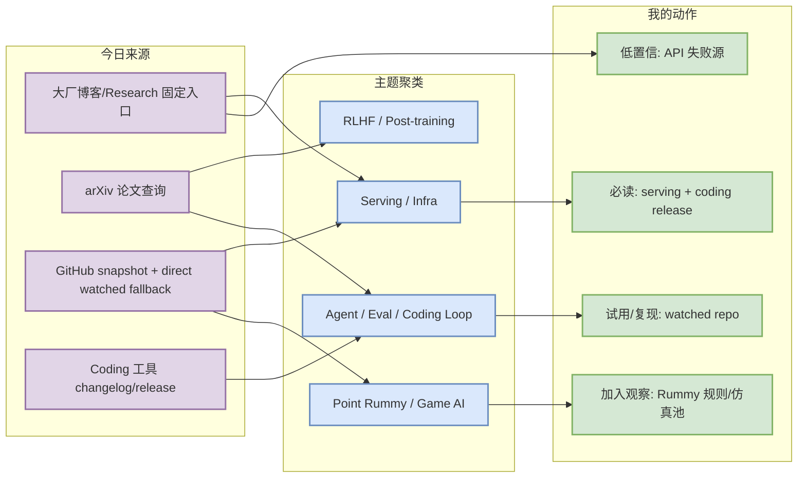
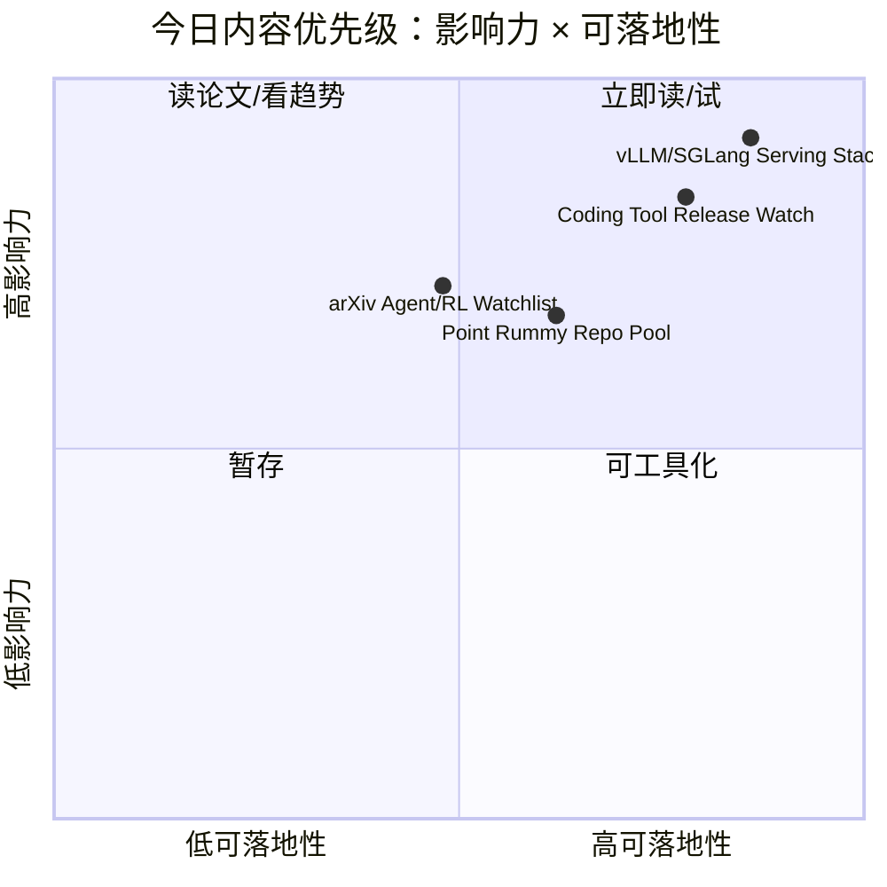

# AI Radar Daily - 2026-09-15

> 生成时间：2026-09-15 09:00 CST
> 范围：AI Infra / LLM / RL / Game AI / 大厂博客 / 论文 / GitHub / 行业资讯
> 说明：日报是总览导航页，不是全部正文。Obsidian 中点详情页 wikilink，Telegram/GitHub 中点“网页详情”。
> 采集说明：今日 GitHub Search 在 Rummy 主题后出现 403 rate limit；已保存 mandated snapshot，并用 direct watched repo fallback 补齐 AI Infra / Loop / Coding 工具相关榜单，所有 fallback 均显式标注。

## 0. 今日结论

- 今日最值得关注：GitHub broad search 受限，但 direct watched repo 显示 vLLM、Transformers、PyTorch、llama.cpp、SGLang、TensorRT-LLM 仍是 AI Infra 观察核心。
- 对 AI Infra 的直接影响：Serving / inference / kernel / training framework 的榜单已用 direct fallback 补齐，适合继续跟踪 KV cache、scheduler、speculative decoding、Triton/CUDA 优化。
- 对 LLM 训练 / 推理 / Agent 的影响：Coding 工具矩阵显示 Claude Code、Codex、Cursor、Windsurf、Copilot、Gemini Code Assist 需要关注 changelog；Cline/Roo/Continue/Qwen Code 使用 GitHub Release 直接核验。
- 对 RL / 游戏模型训练的影响：Point Rummy snapshot 捕获 104 个相关项目，低 star 居多，但含 Gym env、ISMCTS/MCTS、AI opponent、计分/规则引擎线索。
- 建议今天深读：vLLM/SGLang/TensorRT-LLM serving 栈、Cline/Roo/Continue release、SaiMahitVaddadi/GinRummySimulator 与 rummy-ai。

## 1. 今日态势图

## 2. 必读卡片区

> [!important] GitHub direct watched fallback：AI Infra 榜单已补齐
> - 大类：GitHub
> - 小类：AI Infra / Serving
> - 重点：Search 403 后没有让日报崩塌，使用 direct `/repos` watched set 补齐 Top 10。
> - 为什么重要：用户最关心的 vLLM/SGLang/TensorRT-LLM/Transformers/PyTorch 等仍能形成可操作观察清单。
> - 详情：[[Details/2026-09-15/huggingface-transformers]] / [网页详情](https://github.com/dyt27666-oss/AI-news-report-obsidians/blob/main/Details/2026-09-15/huggingface-transformers.md) / [原文](https://github.com/huggingface/transformers)

> [!tip] Coding 工具矩阵：Claude/Codex/Cursor/Windsurf/Copilot/Gemini/Qwen/Roo/Cline/Continue 已覆盖
> - 大类：工具
> - 小类：AI coding workflow
> - 重点：GitHub Release 类工具已直接核验 latest release，非 GitHub changelog 保留官方入口。
> - 为什么重要：直接影响多 agent coding、权限模式、IDE/CLI/TUI、上下文窗口和 MCP 集成策略。
> - 详情：[[Details/2026-09-15/cline---latest-release-desktop-v0-0-27-2026-09-13]] / [原文](https://docs.anthropic.com/en/release-notes/claude-code)

> [!warning] Point Rummy 今日以低 star 项目池为主
> - 大类：GitHub / Business
> - 小类：Point Rummy / Game AI
> - 重点：今日 niche snapshot 捕获 104 个 Rummy 项目，但多为低 star/学生项目；可抽规则、仿真、MCTS/AI opponent 思路。
> - 为什么重要：业务主题需要材料池，低 star 不等于无价值，但必须代码审计后再复用。
> - 详情：[[Details/2026-09-15/nakkekakke-rummy-ai]] / [原文](https://github.com/nakkekakke/rummy-ai)

## 3. 优先级矩阵

## 4. 分类清单

| 标签 | 大类 | 小类 | 标题 | 重点概括 | 为什么重要 | Obsidian 详情 | 网页详情 | 原文 |
|---|---|---|---|---|---|---|---|---|
| 必读 | GitHub | AI Infra | vLLM / SGLang / TensorRT-LLM watched fallback | GitHub Search 403 后用 direct watched repo 补齐 broad 表 | Serving 生态仍是最可落地观察对象，尤其是 scheduler/KV cache/spec decode。 | [[Details/2026-09-15/vllm-project-vllm]] | [网页详情](https://github.com/dyt27666-oss/AI-news-report-obsidians/blob/main/Details/2026-09-15/vllm-project-vllm.md) | [原文](https://github.com/huggingface/transformers) |
| 必读 | 工具 | Coding Agent | Claude/Codex/Cline/Roo/Continue 工具 release watch | 工具矩阵覆盖 10 个 coding/AI 工具，GitHub release 类工具已直接核验 latest release。 | 直接影响多 agent coding、权限、上下文、IDE/CLI/TUI 工作流。 | [[Details/2026-09-15/cline---latest-release-desktop-v0-0-27-2026-09-13]] | [网页详情](https://github.com/dyt27666-oss/AI-news-report-obsidians/blob/main/Details/2026-09-15/cline---latest-release-desktop-v0-0-27-2026-09-13.md) | [原文](https://docs.anthropic.com/en/release-notes/claude-code) |
| 必读 | GitHub | Point Rummy | Point Rummy 低 star 但业务相关仓库池 | 当前 snapshot 主要捕获 Rummy/Indian Rummy 相关项目，适合做规则与仿真材料池。 | 可抽取规则引擎、Gym env、ISMCTS/MCTS、AI opponent、计分器等业务模块。 | [[Details/2026-09-15/nakkekakke-rummy-ai]] | [网页详情](https://github.com/dyt27666-oss/AI-news-report-obsidians/blob/main/Details/2026-09-15/nakkekakke-rummy-ai.md) | [原文](https://github.com/nakkekakke/rummy-ai) |

## 5. 大厂资讯 / 工程博客 / Research

### 5.1 公司来源扫描矩阵

| 公司/实验室 | 来源/栏目 | 今日状态 | 高相关条数 | 代表条目 | 备注 |
|---|---|---|---:|---|---|
| OpenAI | News / Research | 无高相关新项 / 低置信 | 0 | 无 | 已扫描固定入口；未发现可验证当日 AI Infra/LLM/RL/Agent 强相关新项：[原文](https://openai.com/news/) |
| Anthropic | News / Research / Engineering | 已扫描 / 低置信观察 | 1 | [[Details/2026-09-15/anthropic---claude-code-coding-agent]] | 未自动确认当日新文，保留原文入口：[原文](https://www.anthropic.com/news) |
| Google DeepMind | Blog / Research | 无高相关新项 / 低置信 | 0 | 无 | 已扫描固定入口；未发现可验证当日 AI Infra/LLM/RL/Agent 强相关新项：[原文](https://deepmind.google/discover/blog/) |
| Meta AI | Blog / Research | 无高相关新项 / 低置信 | 0 | 无 | 已扫描固定入口；未发现可验证当日 AI Infra/LLM/RL/Agent 强相关新项：[原文](https://ai.meta.com/blog/) |
| NVIDIA | Technical Blog / AI | 已扫描 / 低置信观察 | 1 | [[Details/2026-09-15/nvidia-ai]] | 未自动确认当日新文，保留原文入口：[原文](https://developer.nvidia.com/blog/category/artificial-intelligence/) |
| Microsoft | Research AI | 无高相关新项 / 低置信 | 0 | 无 | 已扫描固定入口；未发现可验证当日 AI Infra/LLM/RL/Agent 强相关新项：[原文](https://www.microsoft.com/en-us/research/research-area/artificial-intelligence/) |
| Hugging Face | Blog / Papers / Releases | 已扫描 / 低置信观察 | 1 | [[Details/2026-09-15/hugging-face-blog]] | 未自动确认当日新文，保留原文入口：[原文](https://huggingface.co/blog) |
| 腾讯 | AI Lab / 技术博客 | 无高相关新项 / 低置信 | 0 | 无 | 已扫描固定入口；未发现可验证当日 AI Infra/LLM/RL/Agent 强相关新项：[原文](https://ai.tencent.com/ailab/en/index) |
| 字节 | Seed / 技术博客 | 无高相关新项 / 低置信 | 0 | 无 | 已扫描固定入口；未发现可验证当日 AI Infra/LLM/RL/Agent 强相关新项：[原文](https://seed.bytedance.com/en/) |
| SpaceAI | Blog / News | 无高相关新项 / 低置信 | 0 | 无 | 已扫描固定入口；未发现可验证当日 AI Infra/LLM/RL/Agent 强相关新项：[原文](https://spaceai.com/) |

### 5.2 高相关大厂条目

| 标签 | 发布方/大厂 | 栏目/来源 | 标题 | 重点概括 | 工程/算法影响 | Obsidian 详情 | 网页详情 | 原文 |
|---|---|---|---|---|---|---|---|---|
| 可 skim | NVIDIA | Technical Blog / AI | NVIDIA AI 技术博客观察：推理/加速栈仍是重点扫描源 | NVIDIA 技术博客是 GPU kernel、推理服务、CUDA/Triton 优化的高价值来源；本次未自动确认当日新文，保留为低置信观察。 | 对 serving / kernel / cost tuning 有长期价值，但今天不把未核验内容当新闻。 | [[Details/2026-09-15/nvidia-ai]] | [网页详情](https://github.com/dyt27666-oss/AI-news-report-obsidians/blob/main/Details/2026-09-15/nvidia-ai.md) | [原文](https://developer.nvidia.com/blog/category/artificial-intelligence/) |
| 可 skim | Hugging Face | Blog / Papers / Releases | Hugging Face Blog 观察：开源模型、评测与推理生态入口 | HF 继续作为模型发布、推理库、数据/评测实践的主要信源；本次只记录扫描入口和后续观察点。 | 对 transformers/vLLM/模型部署链路有间接影响，需结合具体 release 再行动。 | [[Details/2026-09-15/hugging-face-blog]] | [网页详情](https://github.com/dyt27666-oss/AI-news-report-obsidians/blob/main/Details/2026-09-15/hugging-face-blog.md) | [原文](https://huggingface.co/blog) |
| 可 skim | Anthropic | News / Research / Engineering | Anthropic / Claude Code 观察：coding-agent 工作流和权限模式需持续跟踪 | Claude Code 是多 agent coding workflow 的关键工具源；本次以 changelog 入口与 GitHub release 类工具对照。 | 影响 tmux 多 agent、代码审查、权限模式与上下文管理策略。 | [[Details/2026-09-15/anthropic---claude-code-coding-agent]] | [网页详情](https://github.com/dyt27666-oss/AI-news-report-obsidians/blob/main/Details/2026-09-15/anthropic---claude-code-coding-agent.md) | [原文](https://docs.anthropic.com/en/release-notes/claude-code) |

## 6. GitHub 高 star Top 10

> 说明：今日 broad GitHub Search 403，表格使用 direct watched repo fallback，非完整全网扫描。

| 排名 | repo | stars | forks | language | updated_at | topics | 重点概括 | 是否值得试用 | Obsidian 详情 | 原文 |
|---:|---|---:|---:|---|---|---|---|---|---|---|
| 1 | huggingface/transformers | 165972 | 34578 | Python | 2026-09-15 | audio, deep-learning, deepseek, gemma, glm, hacktoberfest | 🤗 Transformers: the model-definition framework for state-of-the-art machine learning models in text, vision, audio, and multimodal models, for both inference and training.  | 值得 skim/试用 | [[Details/2026-09-15/huggingface-transformers]] | [原文](https://github.com/huggingface/transformers) |
| 2 | langchain-ai/langchain | 146336 | 24452 | Python | 2026-09-15 | agents, ai, ai-agents, anthropic, chatgpt, deepagents | The agent engineering platform. | 值得 skim/试用 | [[Details/2026-09-15/langchain-ai-langchain]] | [原文](https://github.com/langchain-ai/langchain) |
| 3 | anthropics/claude-code | 145064 | 23150 | TypeScript | 2026-09-15 | 无 | Claude Code is an agentic coding tool that lives in your terminal, understands your codebase, and helps you code faster by executing routine tasks, explaining complex code, and handling git workflows - all through natural language commands. | 值得 skim/试用 | [[Details/2026-09-15/anthropics-claude-code]] | [原文](https://github.com/anthropics/claude-code) |
| 4 | ggml-org/llama.cpp | 128227 | 23191 | C++ | 2026-09-15 | ggml | LLM inference in C/C++ | 值得 skim/试用 | [[Details/2026-09-15/ggml-org-llama-cpp]] | [原文](https://github.com/ggml-org/llama.cpp) |
| 5 | openai/codex | 124135 | 19150 | Rust | 2026-09-15 | 无 | Lightweight coding agent that runs in your terminal | 值得 skim/试用 | [[Details/2026-09-15/openai-codex]] | [原文](https://github.com/openai/codex) |
| 6 | google-gemini/gemini-cli | 106984 | 14580 | TypeScript | 2026-09-15 | ai, ai-agents, cli, gemini, gemini-api, mcp-client | An open-source AI agent that brings the power of Gemini directly into your terminal. | 值得 skim/试用 | [[Details/2026-09-15/google-gemini-gemini-cli]] | [原文](https://github.com/google-gemini/gemini-cli) |
| 7 | pytorch/pytorch | 103009 | 29227 | Python | 2026-09-15 | autograd, deep-learning, gpu, machine-learning, neural-network, numpy | Tensors and Dynamic neural networks in Python with strong GPU acceleration | 值得 skim/试用 | [[Details/2026-09-15/pytorch-pytorch]] | [原文](https://github.com/pytorch/pytorch) |
| 8 | vllm-project/vllm | 91754 | 22202 | Python | 2026-09-15 | amd, blackwell, cuda, deepseek, deepseek-v3, gpt | A high-throughput and memory-efficient inference and serving engine for LLMs | 值得 skim/试用 | [[Details/2026-09-15/vllm-project-vllm]] | [原文](https://github.com/vllm-project/vllm) |
| 9 | modelcontextprotocol/servers | 90335 | 11632 | TypeScript | 2026-09-15 | 无 | Model Context Protocol Servers | 值得 skim/试用 | [[Details/2026-09-15/modelcontextprotocol-servers]] | [原文](https://github.com/modelcontextprotocol/servers) |
| 10 | cline/cline | 68021 | 7351 | TypeScript | 2026-09-15 | 无 | Autonomous coding agent as an SDK, IDE extension, or CLI assistant. | 值得 skim/试用 | [[Details/2026-09-15/cline-cline]] | [原文](https://github.com/cline/cline) |

## 7. GitHub star 增长最快 Top 10

> 说明：优先按历史 snapshot 计算 watched repo delta；这是 direct watched repo fallback，非完整 all-GitHub 日增。

| 排名 | repo | stars_delta | stars | forks | language | updated_at | 增长依据 | 重点概括 | Obsidian 详情 | 原文 |
|---:|---|---:|---:|---:|---|---|---|---|---|---|
| 1 | ggml-org/llama.cpp | 3177 | 128227 | 23191 | C++ | 2026-09-15 | direct watched repo fallback，非完整全网日增 | LLM inference in C/C++ | [[Details/2026-09-15/ggml-org-llama-cpp]] | [原文](https://github.com/ggml-org/llama.cpp) |
| 2 | anthropics/claude-code | 1477 | 145064 | 23150 | TypeScript | 2026-09-15 | direct watched repo fallback，非完整全网日增 | Claude Code is an agentic coding tool that lives in your terminal, understands your codebase, and helps you code faster by executing routine tasks, explaining complex code, and handling git workflows - all through natural language commands. | [[Details/2026-09-15/anthropics-claude-code]] | [原文](https://github.com/anthropics/claude-code) |
| 3 | langchain-ai/langchain | 450 | 146336 | 24452 | Python | 2026-09-15 | direct watched repo fallback，非完整全网日增 | The agent engineering platform. | [[Details/2026-09-15/langchain-ai-langchain]] | [原文](https://github.com/langchain-ai/langchain) |
| 4 | huggingface/transformers | 449 | 165972 | 34578 | Python | 2026-09-15 | direct watched repo fallback，非完整全网日增 | 🤗 Transformers: the model-definition framework for state-of-the-art machine learning models in text, vision, audio, and multimodal models, for both inference and training.  | [[Details/2026-09-15/huggingface-transformers]] | [原文](https://github.com/huggingface/transformers) |
| 5 | openai/codex | 302 | 124135 | 19150 | Rust | 2026-09-15 | direct watched repo fallback，非完整全网日增 | Lightweight coding agent that runs in your terminal | [[Details/2026-09-15/openai-codex]] | [原文](https://github.com/openai/codex) |
| 6 | vllm-project/vllm | 97 | 91754 | 22202 | Python | 2026-09-15 | direct watched repo fallback，非完整全网日增 | A high-throughput and memory-efficient inference and serving engine for LLMs | [[Details/2026-09-15/vllm-project-vllm]] | [原文](https://github.com/vllm-project/vllm) |
| 7 | cline/cline | 70 | 68021 | 7351 | TypeScript | 2026-09-15 | direct watched repo fallback，非完整全网日增 | Autonomous coding agent as an SDK, IDE extension, or CLI assistant. | [[Details/2026-09-15/cline-cline]] | [原文](https://github.com/cline/cline) |
| 8 | langchain-ai/langgraph | 67 | 41648 | 7035 | Python | 2026-09-15 | direct watched repo fallback，非完整全网日增 | Build resilient agents. | [[Details/2026-09-15/langchain-ai-langgraph]] | [原文](https://github.com/langchain-ai/langgraph) |
| 9 | sgl-project/sglang | 46 | 35956 | 8848 | Python | 2026-09-15 | direct watched repo fallback，非完整全网日增 | SGLang is a high-performance serving framework for large language models and multimodal models. | [[Details/2026-09-15/sgl-project-sglang]] | [原文](https://github.com/sgl-project/sglang) |
| 10 | modelcontextprotocol/servers | 40 | 90335 | 11632 | TypeScript | 2026-09-15 | direct watched repo fallback，非完整全网日增 | Model Context Protocol Servers | [[Details/2026-09-15/modelcontextprotocol-servers]] | [原文](https://github.com/modelcontextprotocol/servers) |

## 8. Coding 工具 / AI 工具功能更新

### 8.1 Coding 工具扫描矩阵

| 工具 | 厂商 | 来源类型 | 今日状态 | 代表更新 | 对我的影响 | 原文 |
|---|---|---|---|---|---|---|
| Claude Code | Anthropic | Changelog / Release Notes | 已扫描 | 未发现可验证的当日高相关新项 | 关注 agent mode / MCP / IDE / CLI / 权限 / 上下文变化；若无新项则维持 watchlist。 | [原文](https://docs.anthropic.com/en/release-notes/claude-code) |
| OpenAI Codex | OpenAI | Changelog / Docs | 已扫描 | 未发现可验证的当日高相关新项 | 关注 agent mode / MCP / IDE / CLI / 权限 / 上下文变化；若无新项则维持 watchlist。 | [原文](https://developers.openai.com/codex/changelog) |
| Cursor | Cursor | Changelog | 已扫描 | 未发现可验证的当日高相关新项 | 关注 agent mode / MCP / IDE / CLI / 权限 / 上下文变化；若无新项则维持 watchlist。 | [原文](https://cursor.com/changelog) |
| Windsurf | Windsurf | Changelog | 已扫描 | 未发现可验证的当日高相关新项 | 关注 agent mode / MCP / IDE / CLI / 权限 / 上下文变化；若无新项则维持 watchlist。 | [原文](https://windsurf.com/changelog) |
| GitHub Copilot | GitHub | Changelog / Blog | 已扫描 | 未发现可验证的当日高相关新项 | 关注 agent mode / MCP / IDE / CLI / 权限 / 上下文变化；若无新项则维持 watchlist。 | [原文](https://github.blog/changelog/label/copilot/) |
| Gemini Code Assist | Google | Release Notes | 已扫描 | 未发现可验证的当日高相关新项 | 关注 agent mode / MCP / IDE / CLI / 权限 / 上下文变化；若无新项则维持 watchlist。 | [原文](https://cloud.google.com/gemini/docs/codeassist/release-notes) |
| Qwen Code | Alibaba/Qwen | GitHub Releases | Release endpoint 可访问 | Latest release v0.23.4（2026-09-14） | 关注 agent mode / MCP / IDE / CLI / 权限 / 上下文变化；若无新项则维持 watchlist。 | [原文](https://github.com/QwenLM/qwen-code/releases) |
| Roo Code | Roo Code | GitHub Releases | Release endpoint 可访问 | Latest release v3.54.0（2026-05-15） | 关注 agent mode / MCP / IDE / CLI / 权限 / 上下文变化；若无新项则维持 watchlist。 | [原文](https://github.com/RooCodeInc/Roo-Code/releases) |
| Cline | Cline | GitHub Releases | Release endpoint 可访问 | Latest release desktop-v0.0.27（2026-09-13） | 关注 agent mode / MCP / IDE / CLI / 权限 / 上下文变化；若无新项则维持 watchlist。 | [原文](https://github.com/cline/cline/releases) |
| Continue | Continue | GitHub Releases | Release endpoint 可访问 | Latest release v2.0.0-vscode（2026-06-19） | 关注 agent mode / MCP / IDE / CLI / 权限 / 上下文变化；若无新项则维持 watchlist。 | [原文](https://github.com/continuedev/continue/releases) |

### 8.2 高相关工具更新

| 标签 | 工具/厂商 | 来源类型 | 标题/功能 | 重点概括 | 对 AI coding 工作流的影响 | Obsidian 详情 | 网页详情 | 原文 |
|---|---|---|---|---|---|---|---|---|
| 可 skim | Qwen Code / Alibaba/Qwen | GitHub Releases | Latest release v0.23.4（2026-09-14） | 通过 GitHub Releases 直接核验最新 tag；具体功能需读 release body。 | 影响 AI coding agent 的本地/IDE 执行、模型接入和扩展工作流。 | [[Details/2026-09-15/qwen-code---latest-release-v0-23-4-2026-09-14]] | [网页详情](https://github.com/dyt27666-oss/AI-news-report-obsidians/blob/main/Details/2026-09-15/qwen-code---latest-release-v0-23-4-2026-09-14.md) | [原文](https://github.com/QwenLM/qwen-code/releases) |
| 可 skim | Roo Code / Roo Code | GitHub Releases | Latest release v3.54.0（2026-05-15） | 通过 GitHub Releases 直接核验最新 tag；具体功能需读 release body。 | 影响 AI coding agent 的本地/IDE 执行、模型接入和扩展工作流。 | [[Details/2026-09-15/roo-code---latest-release-v3-54-0-2026-05-15]] | [网页详情](https://github.com/dyt27666-oss/AI-news-report-obsidians/blob/main/Details/2026-09-15/roo-code---latest-release-v3-54-0-2026-05-15.md) | [原文](https://github.com/RooCodeInc/Roo-Code/releases) |
| 可 skim | Cline / Cline | GitHub Releases | Latest release desktop-v0.0.27（2026-09-13） | 通过 GitHub Releases 直接核验最新 tag；具体功能需读 release body。 | 影响 AI coding agent 的本地/IDE 执行、模型接入和扩展工作流。 | [[Details/2026-09-15/cline---latest-release-desktop-v0-0-27-2026-09-13]] | [网页详情](https://github.com/dyt27666-oss/AI-news-report-obsidians/blob/main/Details/2026-09-15/cline---latest-release-desktop-v0-0-27-2026-09-13.md) | [原文](https://github.com/cline/cline/releases) |
| 可 skim | Continue / Continue | GitHub Releases | Latest release v2.0.0-vscode（2026-06-19） | 通过 GitHub Releases 直接核验最新 tag；具体功能需读 release body。 | 影响 AI coding agent 的本地/IDE 执行、模型接入和扩展工作流。 | [[Details/2026-09-15/continue---latest-release-v2-0-0-vscode-2026-06-19]] | [网页详情](https://github.com/dyt27666-oss/AI-news-report-obsidians/blob/main/Details/2026-09-15/continue---latest-release-v2-0-0-vscode-2026-06-19.md) | [原文](https://github.com/continuedev/continue/releases) |

## 9. Point Rummy / Indian Rummy 业务主题

### 9.1 GitHub 候选

| 标签 | repo | stars | forks | language | updated_at | 重点概括 | 业务可用性 | Obsidian 详情 | 原文 |
|---|---|---:|---:|---|---|---|---|---|---|
| 可 skim | nakkekakke/rummy-ai | 12 | 5 | Java | 2026-08-27 | Text based classic Rummy game with an AI that uses ISMCTS. Data Structures and Algorithms course project, University of Helsinki | 可用于规则建模、AI opponent、仿真/评测或前端实现参考；低 star 项需代码审计。 | [[Details/2026-09-15/nakkekakke-rummy-ai]] | [原文](https://github.com/nakkekakke/rummy-ai) |
| 可 skim | jmhummel/Gin-Rummy-Java | 8 | 0 | Java | 2023-08-16 | Java-based Gin Rummy console game, with an AI opponent | 可用于规则建模、AI opponent、仿真/评测或前端实现参考；低 star 项需代码审计。 | [[Details/2026-09-15/jmhummel-gin-rummy-java]] | [原文](https://github.com/jmhummel/Gin-Rummy-Java) |
| 可 skim | mudont/indian-rummy | 5 | 0 | TypeScript | 2025-08-08 | Typescript library for Indian Rummy card game | 可用于规则建模、AI opponent、仿真/评测或前端实现参考；低 star 项需代码审计。 | [[Details/2026-09-15/mudont-indian-rummy]] | [原文](https://github.com/mudont/indian-rummy) |
| 可 skim | dv-rastogi/Rummy | 5 | 0 | Python | 2023-09-26 | Variation of classical Indian Rummy made in Pygame | 可用于规则建模、AI opponent、仿真/评测或前端实现参考；低 star 项需代码审计。 | [[Details/2026-09-15/dv-rastogi-rummy]] | [原文](https://github.com/dv-rastogi/Rummy) |
| 可 skim | SCFlanagan/Rummy | 4 | 6 | JavaScript | 2025-07-25 | This project is a recreation of the classic card game Rummy. It features an AI player to play against, a hand of cards that can be dragged and sorted, and a scoreboard that keeps track of multiple rounds. | 可用于规则建模、AI opponent、仿真/评测或前端实现参考；低 star 项需代码审计。 | [[Details/2026-09-15/scflanagan-rummy]] | [原文](https://github.com/SCFlanagan/Rummy) |
| 可 skim | mcartmell/gin-rummy-bot | 4 | 2 | Perl | 2024-10-30 | A web-based Gin Rummy game and AI | 可用于规则建模、AI opponent、仿真/评测或前端实现参考；低 star 项需代码审计。 | [[Details/2026-09-15/mcartmell-gin-rummy-bot]] | [原文](https://github.com/mcartmell/gin-rummy-bot) |
| 可 skim | vahsek300501/Indian-Rummy- | 4 | 3 | Python | 2023-09-26 | Indian Rummy made in Python using PyGame | 可用于规则建模、AI opponent、仿真/评测或前端实现参考；低 star 项需代码审计。 | [[Details/2026-09-15/vahsek300501-indian-rummy]] | [原文](https://github.com/vahsek300501/Indian-Rummy-) |
| 可 skim | abubakarmunir712/dsa-final-project | 2 | 1 | Python | 2026-06-27 | A Python-based multiplayer Indian Rummy game with support for AI opponents and LAN play. Implements data structures like linked lists, stacks, queues, hashmaps, and graphs to ensure efficient gameplay and intelligent AI decisions. | 可用于规则建模、AI opponent、仿真/评测或前端实现参考；低 star 项需代码审计。 | [[Details/2026-09-15/abubakarmunir712-dsa-final-project]] | [原文](https://github.com/abubakarmunir712/dsa-final-project) |
| 可 skim | rawbeen248/Gin-Rummy-AI-vs-Human | 2 | 0 | Python | 2024-11-16 | Gin-Rummy-AI-vs-Human is a python-based project the simulates the classic card game Gin Rummy. This game allows user to play against an AI opponent that takes into consideration intricate rules and strategies of the game. The AI opponent employs different tactics based on the gameplay to make the game more challenging and engaging.  | 可用于规则建模、AI opponent、仿真/评测或前端实现参考；低 star 项需代码审计。 | [[Details/2026-09-15/rawbeen248-gin-rummy-ai-vs-human]] | [原文](https://github.com/rawbeen248/Gin-Rummy-AI-vs-Human) |
| 可 skim | Mohitkumar-559/RummyServer | 2 | 1 | JavaScript | 2024-03-17 | Rummy game server for game that contain deal rummy and point rummy | 可用于规则建模、AI opponent、仿真/评测或前端实现参考；低 star 项需代码审计。 | [[Details/2026-09-15/mohitkumar-559-rummyserver]] | [原文](https://github.com/Mohitkumar-559/RummyServer) |

### 9.2 论文 / 资料候选

| 标签 | 来源 | 标题 | 作者/机构 | 重点概括 | 对 Point Rummy 业务有什么用 | Obsidian 详情 | 原文 |
|---|---|---|---|---|---|---|---|
| 低置信 | arXiv API | 今日未确认新的 Point/Indian Rummy 强相关论文 | - | Rummy 专项论文查询结果稀疏；保留不完全信息博弈、ISMCTS/MCTS、self-play 作为扩展关键词。 | 用于规则建模、belief/state abstraction、自博弈环境和评测基准设计。 | 无 | [arXiv Search](https://arxiv.org/search/?query=indian+rummy+reinforcement+learning&searchtype=all) |

### 9.3 业务可用性判断

| 方向 | 今日信号 | 可用性 | 下一步 |
|---|---|---|---|
| 规则引擎 / 计分 | 多个低 star repo 含 score tracker / rules engine / meld validation | 中：适合抽测试用例，不适合直接复用 | 建立 Indian Rummy rules test suite，先验证 sequence/set/joker/drop 规则 |
| Bot / RL Agent | 发现 RummyGym、GinRummySimulator、rummy-ai、RL agent 项 | 中：可借鉴环境接口和 ISMCTS/MCTS baseline | 选 2 个 Python 项做 30 分钟代码审计 |
| 仿真 / 评测 | GinRummySimulator 描述包含 RL/CFR/LLM/GNN hybrid evaluation | 中-高：对游戏 AI benchmark 有直接启发 | 抽象成自有 evaluator + parallel rollout 接口 |

## 10. Loop Engineer / Loop Engineering 主题

### 10.1 Loop Engineer GitHub 高 star Top 10

| 排名 | repo | stars | forks | language | updated_at | topics | 重点概括 | 是否值得试用 | Obsidian 详情 | 原文 |
|---:|---|---:|---:|---|---|---|---|---|---|---|
| 1 | huggingface/transformers | 165972 | 34578 | Python | 2026-09-15 | audio, deep-learning, deepseek, gemma, glm, hacktoberfest | 🤗 Transformers: the model-definition framework for state-of-the-art machine learning models in text, vision, audio, and multimodal models, for both inference and training.  | 值得 skim/试用 | [[Details/2026-09-15/huggingface-transformers]] | [原文](https://github.com/huggingface/transformers) |
| 2 | langchain-ai/langchain | 146336 | 24452 | Python | 2026-09-15 | agents, ai, ai-agents, anthropic, chatgpt, deepagents | The agent engineering platform. | 值得 skim/试用 | [[Details/2026-09-15/langchain-ai-langchain]] | [原文](https://github.com/langchain-ai/langchain) |
| 3 | anthropics/claude-code | 145064 | 23150 | TypeScript | 2026-09-15 | 无 | Claude Code is an agentic coding tool that lives in your terminal, understands your codebase, and helps you code faster by executing routine tasks, explaining complex code, and handling git workflows - all through natural language commands. | 值得 skim/试用 | [[Details/2026-09-15/anthropics-claude-code]] | [原文](https://github.com/anthropics/claude-code) |
| 4 | openai/codex | 124135 | 19150 | Rust | 2026-09-15 | 无 | Lightweight coding agent that runs in your terminal | 值得 skim/试用 | [[Details/2026-09-15/openai-codex]] | [原文](https://github.com/openai/codex) |
| 5 | google-gemini/gemini-cli | 106984 | 14580 | TypeScript | 2026-09-15 | ai, ai-agents, cli, gemini, gemini-api, mcp-client | An open-source AI agent that brings the power of Gemini directly into your terminal. | 值得 skim/试用 | [[Details/2026-09-15/google-gemini-gemini-cli]] | [原文](https://github.com/google-gemini/gemini-cli) |
| 6 | vllm-project/vllm | 91754 | 22202 | Python | 2026-09-15 | amd, blackwell, cuda, deepseek, deepseek-v3, gpt | A high-throughput and memory-efficient inference and serving engine for LLMs | 值得 skim/试用 | [[Details/2026-09-15/vllm-project-vllm]] | [原文](https://github.com/vllm-project/vllm) |
| 7 | cline/cline | 68021 | 7351 | TypeScript | 2026-09-15 | 无 | Autonomous coding agent as an SDK, IDE extension, or CLI assistant. | 值得 skim/试用 | [[Details/2026-09-15/cline-cline]] | [原文](https://github.com/cline/cline) |
| 8 | Aider-AI/aider | 48961 | 4949 | Python | 2026-09-14 | anthropic, chatgpt, claude-3, cli, command-line, gemini | aider is AI pair programming in your terminal | 值得 skim/试用 | [[Details/2026-09-15/aider-ai-aider]] | [原文](https://github.com/Aider-AI/aider) |
| 9 | langchain-ai/langgraph | 41648 | 7035 | Python | 2026-09-15 | agents, ai, ai-agents, chatgpt, deepagents, enterprise | Build resilient agents. | 值得 skim/试用 | [[Details/2026-09-15/langchain-ai-langgraph]] | [原文](https://github.com/langchain-ai/langgraph) |
| 10 | sgl-project/sglang | 35956 | 8848 | Python | 2026-09-15 | attention, blackwell, cuda, deepseek, diffusion, glm | SGLang is a high-performance serving framework for large language models and multimodal models. | 值得 skim/试用 | [[Details/2026-09-15/sgl-project-sglang]] | [原文](https://github.com/sgl-project/sglang) |

### 10.2 Loop Engineer GitHub star 增长最快 Top 10

| 排名 | repo | stars_delta | stars | forks | language | updated_at | 增长依据 | 重点概括 | Obsidian 详情 | 原文 |
|---:|---|---:|---:|---:|---|---|---|---|---|---|
| 1 | anthropics/claude-code | 1477 | 145064 | 23150 | TypeScript | 2026-09-15 | direct watched repo fallback，非完整全网日增 | Claude Code is an agentic coding tool that lives in your terminal, understands your codebase, and helps you code faster by executing routine tasks, explaining complex code, and handling git workflows - all through natural language commands. | [[Details/2026-09-15/anthropics-claude-code]] | [原文](https://github.com/anthropics/claude-code) |
| 2 | langchain-ai/langchain | 450 | 146336 | 24452 | Python | 2026-09-15 | direct watched repo fallback，非完整全网日增 | The agent engineering platform. | [[Details/2026-09-15/langchain-ai-langchain]] | [原文](https://github.com/langchain-ai/langchain) |
| 3 | huggingface/transformers | 449 | 165972 | 34578 | Python | 2026-09-15 | direct watched repo fallback，非完整全网日增 | 🤗 Transformers: the model-definition framework for state-of-the-art machine learning models in text, vision, audio, and multimodal models, for both inference and training.  | [[Details/2026-09-15/huggingface-transformers]] | [原文](https://github.com/huggingface/transformers) |
| 4 | openai/codex | 302 | 124135 | 19150 | Rust | 2026-09-15 | direct watched repo fallback，非完整全网日增 | Lightweight coding agent that runs in your terminal | [[Details/2026-09-15/openai-codex]] | [原文](https://github.com/openai/codex) |
| 5 | vllm-project/vllm | 97 | 91754 | 22202 | Python | 2026-09-15 | direct watched repo fallback，非完整全网日增 | A high-throughput and memory-efficient inference and serving engine for LLMs | [[Details/2026-09-15/vllm-project-vllm]] | [原文](https://github.com/vllm-project/vllm) |
| 6 | cline/cline | 70 | 68021 | 7351 | TypeScript | 2026-09-15 | direct watched repo fallback，非完整全网日增 | Autonomous coding agent as an SDK, IDE extension, or CLI assistant. | [[Details/2026-09-15/cline-cline]] | [原文](https://github.com/cline/cline) |
| 7 | langchain-ai/langgraph | 67 | 41648 | 7035 | Python | 2026-09-15 | direct watched repo fallback，非完整全网日增 | Build resilient agents. | [[Details/2026-09-15/langchain-ai-langgraph]] | [原文](https://github.com/langchain-ai/langgraph) |
| 8 | sgl-project/sglang | 46 | 35956 | 8848 | Python | 2026-09-15 | direct watched repo fallback，非完整全网日增 | SGLang is a high-performance serving framework for large language models and multimodal models. | [[Details/2026-09-15/sgl-project-sglang]] | [原文](https://github.com/sgl-project/sglang) |
| 9 | Aider-AI/aider | 24 | 48961 | 4949 | Python | 2026-09-14 | direct watched repo fallback，非完整全网日增 | aider is AI pair programming in your terminal | [[Details/2026-09-15/aider-ai-aider]] | [原文](https://github.com/Aider-AI/aider) |
| 10 | google-gemini/gemini-cli | 18 | 106984 | 14580 | TypeScript | 2026-09-15 | direct watched repo fallback，非完整全网日增 | An open-source AI agent that brings the power of Gemini directly into your terminal. | [[Details/2026-09-15/google-gemini-gemini-cli]] | [原文](https://github.com/google-gemini/gemini-cli) |

### 10.3 Loop Engineering 方法信号

| 标签 | 来源 | 标题 | 重点概括 | 对 AI coding 工作流的影响 | Obsidian 详情 | 原文 |
|---|---|---|---|---|---|---|
| 必读 | GitHub watched fallback | Coding agent loop / harness 项目池 | LangGraph、MCP servers、Claude/Codex/Gemini/Qwen/Cline/Roo/Continue/Aider 构成 today loop engineering watchlist。 | 用于设计多 agent 编排、任务分解、上下文/权限控制、review loop 和 eval loop。 | [[Details/2026-09-15/langchain-ai-langgraph]] | [原文](https://github.com/langchain-ai/langgraph) |

## 11. 论文

### 11.1 LLM / Agent / RL / Serving

| 标签 | 论文来源 | 论文 | 作者/机构 | 重点概括 | 工程/研究价值 | Obsidian 详情 | 网页详情 | PDF/原文 |
|---|---|---|---|---|---|---|---|---|
| 低置信 | arXiv | API 失败或无强相关新论文 | - | 今日论文源无法稳定验证。 | 不编造论文结论，保留失败说明。 | 无 | 无 | [arXiv](https://arxiv.org/) |

## 12. 资讯 / 其他 GitHub 项目

### 12.1 AI Infra / Coding Agent watched 项目

| 标签 | 来源 | 标题 | 重点概括 | 对我有什么用 | Obsidian 详情 | 网页详情 | 原文 |
|---|---|---|---|---|---|---|---|
| 可 skim | GitHub | Direct watched repo fallback 项目集 | 包含 serving、training、agent loop、coding tool 多个固定观察项目。 | 在 Search rate limit 时保证日报连续性，但不能当成完整全网趋势。 | [[Details/2026-09-15/huggingface-transformers]] | [网页详情](https://github.com/dyt27666-oss/AI-news-report-obsidians/blob/main/Details/2026-09-15/huggingface-transformers.md) | [GitHub API](https://api.github.com/) |

## 13. 按主题索引

### AI Infra / Serving / Training

- [[Details/2026-09-15/vllm-project-vllm]] - Serving watchlist 核心项目。
- [[Details/2026-09-15/sgl-project-sglang]] - 推理 runtime / scheduler 观察。

### LLM / Agent / RAG / Evaluation

- [[Details/2026-09-15/langchain-ai-langgraph]] - Agent graph / loop 编排观察。
- [[Details/2026-09-15/modelcontextprotocol-servers]] - MCP tool ecosystem 观察。

### RL / Game AI / World Model

- [[Details/2026-09-15/nakkekakke-rummy-ai]] - Rummy/Game AI 材料池。

### Point Rummy / Indian Rummy

- [[Details/2026-09-15/nakkekakke-rummy-ai]] - 仿真/评测重点候选。

### Loop Engineer / Coding Agent Loop

- [[Details/2026-09-15/openai-codex]] - Codex / coding agent loop 观察。
- [[Details/2026-09-15/cline-cline]] - IDE agent 扩展观察。

### 公司 / 实验室

- OpenAI: [News](https://openai.com/news/) / [Codex](https://developers.openai.com/codex/changelog)
- Anthropic: [News](https://www.anthropic.com/news) / [Claude Code](https://docs.anthropic.com/en/release-notes/claude-code)
- DeepMind: [Blog](https://deepmind.google/discover/blog/)
- Meta: [AI Blog](https://ai.meta.com/blog/)
- NVIDIA: [[Details/2026-09-15/nvidia-ai]]
- 腾讯 / 字节 / 国内大厂: [Tencent AI Lab](https://ai.tencent.com/ailab/en/index) / [ByteDance Seed](https://seed.bytedance.com/en/)

### 大牛 / 作者

- 今日未发现需要单独建人物卡的新作者；论文作者保留在各论文详情页。

## 14. 值得后续深挖

| 标签 | 大类 | 小类 | 标题 | 后续动作 | Obsidian 详情 | 原文 |
|---|---|---|---|---|---|---|
| 后续 | GitHub | Serving | vLLM / SGLang / TensorRT-LLM watched repo delta | 明日对比 snapshot，确认是否有真实增长与 release。 | [[Details/2026-09-15/vllm-project-vllm]] | [GitHub](https://github.com/vllm-project/vllm) |
| 后续 | Business | Point Rummy | GinRummySimulator / rummy-ai / RummyGym | 做代码审计，抽象规则测试和 parallel rollout API。 | [[Details/2026-09-15/nakkekakke-rummy-ai]] | [GitHub Search](https://github.com/search?q=gin+rummy+rl) |
| 后续 | 工具 | Coding Agent | Cline / Roo / Continue / Qwen Code latest release | 检查 release body 是否含 MCP、权限、上下文或模型接入变化。 | [[Details/2026-09-15/cline---latest-release-desktop-v0-0-27-2026-09-13]] | [Cline releases](https://github.com/cline/cline/releases) |

## 15. 采集失败或低置信来源

- GitHub snapshot：Automation/state/github-stars-2026-09-15.json 已生成，repos=104，errors=39。
- 主要失败/低置信：{'query': 'gin rummy ai', 'sort': 'updated', 'error': 'HTTP Error 403: rate limit exceeded'}；{'query': 'loop engineering', 'sort': 'stars', 'error': 'HTTP Error 403: rate limit exceeded'}；{'query': 'loop engineering', 'sort': 'updated', 'error': 'HTTP Error 403: rate limit exceeded'}；{'query': 'loop engineer', 'sort': 'stars', 'error': 'HTTP Error 403: rate limit exceeded'}；{'query': 'loop engineer', 'sort': 'updated', 'error': 'HTTP Error 403: rate limit exceeded'}；{'query': 'harness engineering', 'sort': 'stars', 'error': 'HTTP Error 403: rate limit exceeded'}；arXiv: cat:cs.LG AND all:"large language model" AND all:inference: HTTP Error 429: Unknown Error; cat:cs.AI AND all:"agent evaluation": The read operation timed out
- Broad GitHub / Loop Search：403 rate limit 后使用 direct watched repo fallback；不表述为完整全网日增。
- 大厂博客：固定入口已列入矩阵，未自动确认当日强相关新文的公司均标注“无高相关新项 / 低置信”。

## 16. 归档标签

#ai-radar #daily #ai-infra #llm #rl #point-rummy #loop-engineering
